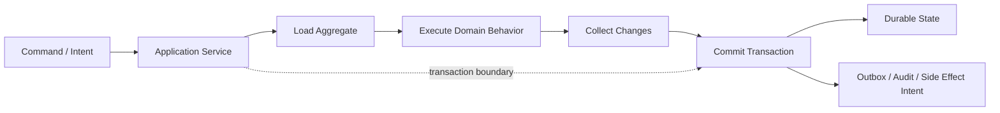
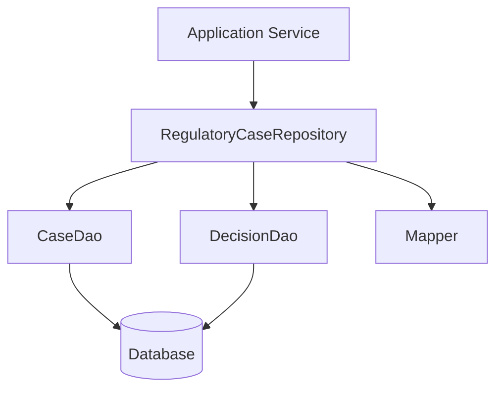
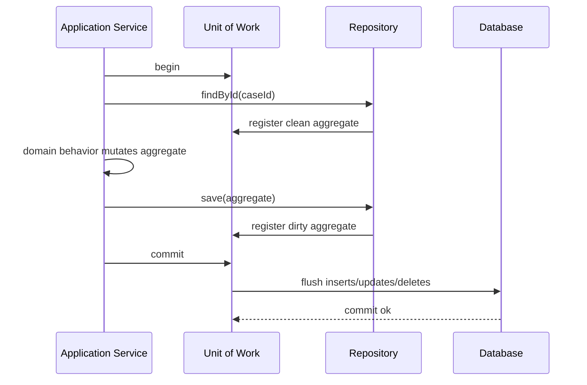
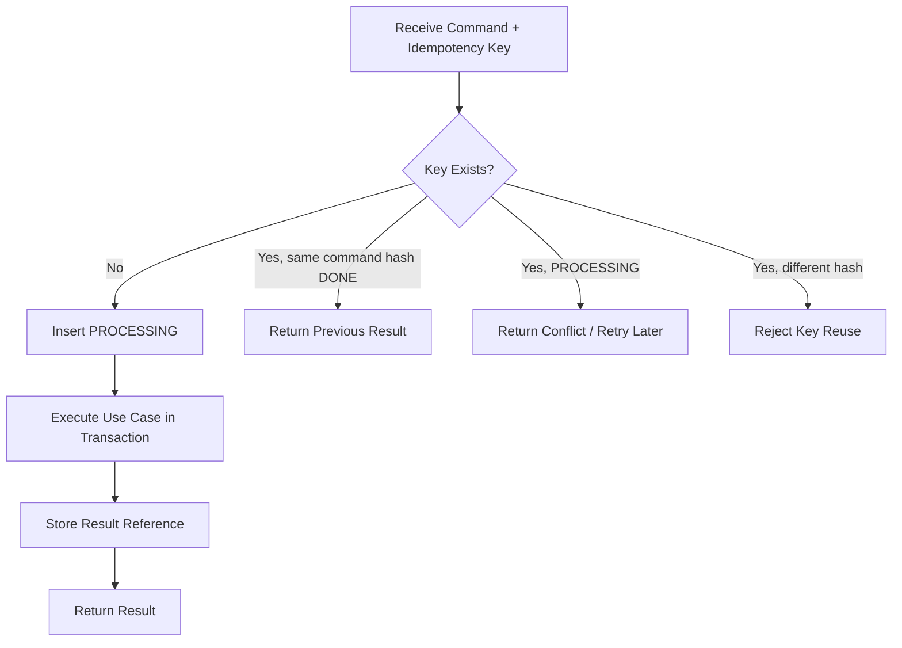
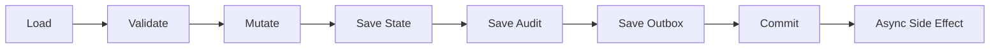

------
title: Learn Java Patterns - Part 009
description: Repository, Unit of Work, DAO, transaction boundary, optimistic/pessimistic consistency, query modeling, and persistence failure modes untuk sistem Java production.
series: learn-java-patterns
seriesTitle: Learn Java Patterns, Data Patterns, Pipeline Patterns, Concurrency Patterns, Common Patterns, and Anti-Patterns
order: 9
partTitle: Repository, Unit of Work, and Transaction Patterns
tags:
- java
- patterns
- architecture
- advanced-java
- persistence
- transaction
- repository
- unit-of-work
date: 2026-06-27
---

# Learn Java Patterns - Part 009: Repository, Unit of Work, and Transaction Patterns

## 1. Tujuan Part Ini

Part ini membahas pattern persistence dan transaction boundary untuk sistem Java production:

- Repository;
- DAO;
- Unit of Work;
- Transaction Script;
- Data Mapper;
- optimistic consistency;
- pessimistic coordination;
- transaction boundary;
- query object;
- specification-based query;
- pagination and streaming query;
- idempotent persistence;
- persistence error taxonomy;
- testing strategy untuk persistence layer.

Part ini bukan tutorial JPA, Hibernate, Spring Data, atau JDBC. Framework tersebut hanya alat. Fokus kita adalah **mental model persistence**: bagaimana domain object, data model, transaction, concurrency, dan failure berinteraksi.

> Persistence pattern yang baik membuat perubahan data menjadi eksplisit, atomic, auditable, dan bisa diuji tanpa menipu diri sendiri.

---

## 2. Kaufman Lens: Sub-Skill yang Dilatih

Josh Kaufman menekankan bahwa skill kompleks perlu dipecah menjadi sub-skill kecil, lalu dilatih pada bagian yang paling menentukan performa. Untuk persistence pattern, sub-skill pentingnya adalah:

| Sub-Skill | Target Praktis |
|---|---|
| Boundary placement | Menentukan di mana transaksi dimulai dan berakhir |
| Repository design | Mendesain repository sebagai collection-like boundary, bukan sekadar wrapper ORM |
| DAO discipline | Memisahkan SQL/data access detail dari use case dan domain model |
| Unit of Work reasoning | Memahami kapan perubahan di-memory dikumpulkan lalu di-flush sebagai satu unit |
| Transaction demarcation | Menghindari transaksi terlalu kecil, terlalu besar, atau tersembunyi |
| Consistency choice | Memilih optimistic locking, pessimistic locking, unique constraint, atau idempotency record |
| Query modeling | Mendesain query read-side tanpa merusak write-side model |
| Failure classification | Membedakan conflict, validation error, infrastructure failure, timeout, dan duplicate command |
| Test realism | Menguji persistence dengan fake, integration test, dan concurrency test secara proporsional |

Target setelah part ini:

> Anda bisa melihat service method Java dan menilai apakah transaction boundary, repository abstraction, concurrency protection, dan error handling-nya production-safe.

---

## 3. Mental Model: Persistence Adalah Boundary antara Intent dan Durability

Use case biasanya dimulai dari **intent**:

- reviewer menyetujui case;
- customer mengirim order;
- payment dicatat;
- entitlement diperbarui;
- task di-escalate;
- document disimpan;
- rule version diaktifkan.

Database menyimpan **durable consequence** dari intent itu.

Masalah muncul saat kode memperlakukan persistence sebagai CRUD mekanis:

```java
caseRepository.save(caseEntity);
```

Padahal operasi persistence yang benar harus menjawab beberapa pertanyaan:

| Pertanyaan | Contoh |
|---|---|
| Apa intent bisnisnya? | approveCase, escalateCase, assignReviewer |
| Invariant apa yang harus benar? | hanya case OPEN yang bisa di-approve |
| Data mana yang harus berubah bersama? | case status, audit event, task state, notification intent |
| Apa concurrency risk-nya? | dua reviewer menyetujui case yang sama |
| Apa yang terjadi kalau commit berhasil tapi publish event gagal? | butuh outbox |
| Apa yang terjadi kalau request diulang? | butuh idempotency key |
| Bagaimana error diterjemahkan ke caller? | conflict vs invalid command vs retryable failure |

Diagram mental model:



Persistence bukan sekadar `save`. Persistence adalah proses membuat keputusan domain menjadi durable secara konsisten.

---

## 4. Vocabulary: Pattern yang Sering Tertukar

Sebelum masuk detail, kita perlu membedakan beberapa pattern yang sering dicampur.

| Pattern | Tanggung Jawab | Yang Bukan Tanggung Jawabnya |
|---|---|---|
| DAO | Operasi data access konkret: SQL, row mapping, stored procedure, table-centric operation | Menjaga invariant domain |
| Repository | Boundary collection-like untuk aggregate/domain object | Menjadi wrapper generik semua tabel |
| Unit of Work | Melacak object yang berubah dalam satu business transaction dan mengatur commit | Menentukan rule bisnis |
| Transaction Script | Use case procedural yang mengorkestrasi validasi dan update langsung | Model domain kaya |
| Data Mapper | Memindahkan data antara object dan persistence representation | Mengambil keputusan bisnis |
| Active Record | Object domain menyimpan dirinya sendiri | Cocok untuk domain kompleks dengan invariant berat |
| Query Object | Representasi query yang eksplisit dan bisa dikomposisi | Menjadi DSL tanpa batas sampai tidak terkontrol |

### 4.1 DAO vs Repository

DAO biasanya **data-source oriented**.

```java
interface CaseDao {
    Optional<CaseRow> findById(UUID id);
    void updateStatus(UUID id, String status, long expectedVersion);
    void insertAudit(CaseAuditRow row);
}
```

Repository biasanya **domain-oriented**.

```java
interface CaseRepository {
    Optional<RegulatoryCase> findById(CaseId id);
    void save(RegulatoryCase regulatoryCase);
}
```

DAO tahu tentang tabel. Repository tahu tentang aggregate.

Repository boleh memakai DAO di bawahnya, tetapi application service sebaiknya tidak bocor ke tabel kalau use case-nya domain-centric.

---

## 5. Transaction Boundary: Satu Unit Perubahan yang Harus Benar Bersama

Transaction boundary menjawab:

> Perubahan apa saja yang harus commit atau rollback sebagai satu kesatuan?

Contoh salah:

```java
public void approve(CaseId id, ReviewerId reviewerId) {
    RegulatoryCase c = caseRepository.findById(id).orElseThrow();
    c.approveBy(reviewerId);

    caseRepository.save(c);          // commit 1
    auditRepository.record(...);     // commit 2
    taskRepository.closeTask(...);   // commit 3
}
```

Kalau `save(c)` berhasil tetapi `record(...)` gagal, case berubah tanpa audit. Untuk sistem biasa mungkin ini bug. Untuk sistem defensible/regulatory, ini bisa menjadi insiden serius.

Contoh lebih baik:

```java
@Transactional
public void approve(ApproveCaseCommand command) {
    RegulatoryCase c = caseRepository.findById(command.caseId())
        .orElseThrow(() -> new CaseNotFound(command.caseId()));

    c.approveBy(command.reviewerId(), command.reason(), command.now());

    caseRepository.save(c);
    auditRepository.record(AuditEvent.caseApproved(c.id(), command.reviewerId(), command.reason(), command.now()));
    outboxRepository.add(NotificationRequested.caseApproved(c.id()));
}
```

Tiga perubahan ini commit bersama:

- state case;
- audit event;
- durable intent untuk notifikasi.

Notifikasi aktual tidak dikirim di dalam transaksi. Yang disimpan adalah intent-nya.

### 5.1 Transaction Terlalu Kecil

Ciri-ciri:

- setiap repository method membuka transaksi sendiri;
- service method tidak atomic;
- audit/event/log bisnis bisa hilang;
- caller melihat partial update;
- retry menghasilkan data ganda.

### 5.2 Transaction Terlalu Besar

Ciri-ciri:

- transaksi menunggu external API;
- transaksi mencakup file upload besar;
- transaksi memegang lock selama user think-time;
- transaksi berjalan lintas banyak aggregate tanpa alasan kuat;
- throughput turun karena lock contention.

Rule praktis:

> Transaction harus cukup besar untuk menjaga invariant, tetapi cukup kecil untuk tidak menahan resource sambil menunggu hal yang tidak deterministik.

---

## 6. Repository Pattern

Repository menyediakan ilusi collection terhadap aggregate root.

```java
Optional<RegulatoryCase> findById(CaseId id);
void save(RegulatoryCase regulatoryCase);
```

Namun repository production tidak boleh menjadi generic CRUD dump:

```java
interface BadRepository<T, ID> {
    T save(T entity);
    Optional<T> findById(ID id);
    List<T> findAll();
    void delete(T entity);
}
```

Generic repository terlihat reusable, tetapi sering menghapus semantic boundary.

Masalahnya:

- semua aggregate dianggap sama;
- query liar mudah menyebar;
- delete tersedia padahal domain tidak mengizinkan delete;
- save bisa dipanggil tanpa intent;
- tidak ada concurrency contract;
- tidak ada semantic method untuk use case penting.

Repository yang lebih baik:

```java
public interface RegulatoryCaseRepository {
    Optional<RegulatoryCase> findById(CaseId id);

    Optional<RegulatoryCase> findOpenCaseByExternalReference(ExternalCaseReference reference);

    void save(RegulatoryCase regulatoryCase);

    boolean existsOpenCaseForSubject(SubjectId subjectId);
}
```

Method repository harus mencerminkan kebutuhan domain, bukan hanya operasi database.

### 6.1 Repository Contract

Repository yang baik menyatakan contract secara eksplisit:

| Contract | Pertanyaan |
|---|---|
| Identity | ID apa yang digunakan? Stabil atau generated? |
| Aggregate scope | Object apa yang dimuat bersama? |
| Concurrency | Save memakai version check atau last-write-wins? |
| Transaction expectation | Harus dipanggil di dalam transaksi atau boleh standalone? |
| Not found behavior | Optional, exception, atau sentinel? |
| Query consistency | Apakah query read-your-write dalam transaksi? |
| Delete semantics | Hard delete, soft delete, archive, atau tidak tersedia? |

Contoh contract di JavaDoc singkat:

```java
/**
 * Repository for RegulatoryCase aggregate roots.
 *
 * Contract:
 * - save() must enforce optimistic version check.
 * - findById() returns the aggregate root with decisions and open tasks needed to enforce invariants.
 * - delete is intentionally unsupported; cases are closed or archived, never removed from operational history.
 * - callers are expected to define transaction boundaries at application-service level.
 */
public interface RegulatoryCaseRepository {
    Optional<RegulatoryCase> findById(CaseId id);
    void save(RegulatoryCase regulatoryCase) throws ConcurrentCaseModification;
}
```

### 6.2 Repository Return Type

Be careful with return type.

```java
RegulatoryCase findById(CaseId id);         // ambiguous: null? exception?
Optional<RegulatoryCase> findById(CaseId id); // explicit absence
RegulatoryCase getById(CaseId id);           // may imply must exist
```

Use names consistently:

| Method | Suggested Meaning |
|---|---|
| `findBy...` | May not exist; returns Optional |
| `getBy...` | Expected to exist; throws domain/application exception if absent |
| `exists...` | Cheap existence check, not authorization |
| `load...ForUpdate` | May acquire pessimistic lock |
| `save` | Persist aggregate with concurrency check |

---

## 7. DAO Pattern

DAO is useful when persistence logic is table/query-centric.

Example:

```java
public interface CaseJdbcDao {
    Optional<CaseRow> selectCase(UUID caseId);
    List<DecisionRow> selectDecisions(UUID caseId);
    int updateCaseStatus(UUID caseId, String status, long expectedVersion);
    void insertDecision(DecisionRow decision);
    void insertAudit(AuditRow audit);
}
```

DAO is not inferior to Repository. It solves a different problem.

Use DAO when:

- query is report-oriented;
- domain model is not needed;
- operation is table-level;
- stored procedure is required;
- performance requires explicit SQL;
- migration/backfill is being implemented;
- read model/projection is separate from aggregate.

Avoid DAO when application service starts containing domain invariant scattered across SQL updates.

Bad:

```java
if (caseDao.status(caseId).equals("OPEN")) {
    caseDao.updateStatus(caseId, "APPROVED");
    caseDao.insertDecision(...);
}
```

Better:

```java
RegulatoryCase c = caseRepository.getById(caseId);
c.approveBy(reviewerId, reason, now);
caseRepository.save(c);
```

DAO can still be used internally by repository implementation.



---

## 8. Unit of Work Pattern

Unit of Work tracks changes made during a business transaction and coordinates persistence at commit time.

In many Java stacks, ORM persistence context acts as Unit of Work:

- entity loaded;
- entity mutated;
- dirty checking detects changes;
- flush writes changes;
- transaction commit finalizes.

Conceptual model:



### 8.1 Explicit Unit of Work

In simpler architecture, you can model Unit of Work explicitly.

```java
public interface UnitOfWork {
    <T> T withinTransaction(TransactionalWork<T> work);
}

@FunctionalInterface
public interface TransactionalWork<T> {
    T execute();
}
```

Usage:

```java
public CaseDecisionResult approve(ApproveCaseCommand command) {
    return unitOfWork.withinTransaction(() -> {
        RegulatoryCase c = caseRepository.getById(command.caseId());
        c.approveBy(command.reviewerId(), command.reason(), command.now());
        caseRepository.save(c);
        auditRepository.record(AuditEvent.caseApproved(c.id(), command.reviewerId(), command.now()));
        return CaseDecisionResult.approved(c.id(), c.version());
    });
}
```

This is useful when:

- you avoid framework annotations in core application layer;
- you want transaction boundary visible;
- you have multiple persistence implementations;
- you want testability of transaction behavior;
- you use plain JDBC or jOOQ-like style.

### 8.2 Hidden Unit of Work Risk

ORM makes simple cases easy, but hides important details:

- lazy loading can trigger queries unexpectedly;
- dirty checking can persist unintended mutation;
- flush timing may happen before you expect;
- object identity inside persistence context differs from detached object identity;
- transaction rollback does not undo external side effects;
- entity graphs can grow too large;
- equals/hashCode mistakes can corrupt collections.

Mental model:

> ORM Unit of Work is convenient, but convenience does not remove the need to design transaction scope, aggregate boundaries, and side-effect boundaries.

---

## 9. Transaction Script Pattern

Transaction Script organizes business logic as procedural use case methods.

```java
@Transactional
public void approveCase(UUID caseId, UUID reviewerId, String reason) {
    CaseRow row = caseDao.selectForUpdate(caseId)
        .orElseThrow(NotFoundException::new);

    if (!row.status().equals("OPEN")) {
        throw new InvalidTransitionException(row.status(), "APPROVED");
    }

    caseDao.updateStatus(caseId, "APPROVED");
    decisionDao.insert(new DecisionRow(caseId, reviewerId, reason, clock.instant()));
    auditDao.insert(AuditRow.caseApproved(caseId, reviewerId, clock.instant()));
}
```

Transaction Script is not always bad.

It is acceptable when:

- domain logic is simple;
- use cases are few;
- rules are mostly CRUD validations;
- performance and SQL control matter more than rich domain behavior;
- team wants explicit procedural flow;
- lifecycle complexity is low.

It becomes risky when:

- rules are duplicated across scripts;
- state transitions are scattered;
- invariant requires multiple operations;
- audit/event behavior is forgotten in some paths;
- adding a new state requires editing many methods;
- business language disappears into table manipulation.

Transition point:

> Move from Transaction Script to Domain Model when rule reuse, lifecycle complexity, or invariant density becomes high.

---

## 10. Optimistic Locking Pattern

Optimistic locking assumes conflicts are uncommon. Each record/aggregate has a version. Update succeeds only if version matches what was read.

Table shape:

```sql
case_id UUID PRIMARY KEY,
status VARCHAR(32) NOT NULL,
version BIGINT NOT NULL
```

Update shape:

```sql
UPDATE regulatory_case
SET status = ?, version = version + 1
WHERE case_id = ? AND version = ?
```

Java repository behavior:

```java
public void save(RegulatoryCase c) {
    int updated = jdbc.update("""
        update regulatory_case
           set status = ?, version = version + 1
         where case_id = ? and version = ?
        """,
        c.status().name(),
        c.id().value(),
        c.version().value()
    );

    if (updated == 0) {
        throw new ConcurrentCaseModification(c.id());
    }
}
```

Optimistic lock is good when:

- conflicts are rare;
- user can retry;
- operation is short;
- stale update must be detected;
- last-write-wins is unacceptable;
- throughput matters.

It is weak when:

- conflicts are frequent;
- retry is expensive;
- conflict resolution requires human judgment;
- operation spans multiple rows without aggregate version;
- external side effects happen before conflict detection.

### 10.1 Aggregate Version vs Row Version

If aggregate spans multiple tables, version should protect aggregate invariant, not only one row.

Example:

```text
regulatory_case
case_decision
case_assignment
case_task
```

If approval invariant depends on assignment and decision rows, updating only `case_decision.version` may not detect conflicting assignment changes.

Common approach:

- root table has aggregate version;
- any aggregate mutation increments root version;
- child table updates occur under same transaction;
- repository save checks root expected version.

---

## 11. Pessimistic Locking Pattern

Pessimistic locking assumes conflicts are likely or costly. It acquires a lock before allowing modification.

Example SQL shape:

```sql
SELECT *
FROM regulatory_case
WHERE case_id = ?
FOR UPDATE
```

Repository method name should reveal this:

```java
Optional<RegulatoryCase> loadForUpdate(CaseId id);
```

Pessimistic locking is useful when:

- conflict is common;
- concurrent update must serialize;
- operation is short and database-local;
- double processing is very expensive;
- worker pool claims tasks from same queue table.

It is dangerous when:

- lock is held while calling external API;
- lock is held while waiting for user action;
- lock order is inconsistent;
- transaction timeout is not configured;
- lock contention is invisible in metrics;
- deadlock handling is absent.

### 11.1 Lock Ordering

If a transaction must lock multiple resources, define deterministic order.

Bad:

```text
T1 locks Case A then Case B
T2 locks Case B then Case A
```

Better:

```text
Always lock by sorted caseId
```

```java
List<CaseId> sorted = caseIds.stream()
    .sorted(Comparator.comparing(CaseId::value))
    .toList();

for (CaseId id : sorted) {
    caseRepository.loadForUpdate(id);
}
```

---

## 12. Unique Constraint as Consistency Pattern

Do not implement uniqueness only in application code.

Bad:

```java
if (!caseRepository.existsOpenCaseForSubject(subjectId)) {
    caseRepository.save(newCase);
}
```

Two concurrent requests can pass the check.

Better:

- use database unique constraint where possible;
- translate constraint violation into domain/application error;
- optionally pre-check for better UX, but do not rely on it for correctness.

Example:

```sql
CREATE UNIQUE INDEX ux_open_case_subject
ON regulatory_case(subject_id)
WHERE status IN ('OPEN', 'UNDER_REVIEW', 'ESCALATED');
```

Repository maps duplicate key:

```java
try {
    caseDao.insert(row);
} catch (DuplicateKeyException e) {
    throw new OpenCaseAlreadyExists(row.subjectId(), e);
}
```

Mental model:

> Application checks improve experience. Database constraints enforce truth.

---

## 13. Idempotency Record Pattern

Distributed systems retry. Clients retry. Gateways retry. Users double-click. Workers crash and restart.

If command is not idempotent, retry creates duplicate consequences.

Idempotency table:

```sql
idempotency_key VARCHAR(128) PRIMARY KEY,
command_hash VARCHAR(128) NOT NULL,
result_reference VARCHAR(128),
status VARCHAR(32) NOT NULL,
created_at TIMESTAMP NOT NULL
```

Flow:



Application service:

```java
public ApprovalResult approve(ApproveCaseCommand command) {
    return unitOfWork.withinTransaction(() -> {
        IdempotencyDecision decision = idempotencyRepository.begin(
            command.idempotencyKey(),
            command.semanticHash()
        );

        if (decision instanceof IdempotencyDecision.AlreadyCompleted completed) {
            return approvalResultRepository.get(completed.resultId());
        }

        RegulatoryCase c = caseRepository.getById(command.caseId());
        c.approveBy(command.reviewerId(), command.reason(), command.now());
        caseRepository.save(c);

        ApprovalResult result = ApprovalResult.approved(c.id(), c.version());
        approvalResultRepository.save(result);
        idempotencyRepository.complete(command.idempotencyKey(), result.id());

        return result;
    });
}
```

Idempotency is part persistence, part API contract, part distributed-systems safety.

---

## 14. Query Modeling Pattern

A common repository mistake is mixing aggregate loading with arbitrary read queries.

```java
List<RegulatoryCase> findAllByStatusAndRegionAndRiskScoreGreaterThan(...)
```

This may load full aggregates for a read-only screen. It increases memory, query cost, and accidental mutation risk.

Separate write repository from read query model.

```java
public interface RegulatoryCaseRepository {
    RegulatoryCase getById(CaseId id);
    void save(RegulatoryCase c);
}

public interface CaseSearchQuery {
    Page<CaseSearchResult> search(CaseSearchCriteria criteria, PageRequest page);
}
```

Read result can be projection:

```java
public record CaseSearchResult(
    CaseId caseId,
    String subjectName,
    CaseStatus status,
    RiskBand riskBand,
    Instant lastUpdatedAt,
    String assignedTeam
) {}
```

This avoids using aggregate as DTO.

### 14.1 Query Object

```java
public record CaseSearchCriteria(
    Optional<CaseStatus> status,
    Optional<RiskBand> riskBand,
    Optional<TeamId> assignedTeam,
    Optional<Instant> updatedAfter,
    Optional<String> freeText
) {}
```

Benefits:

- query shape explicit;
- easy to test;
- evolves without huge parameter list;
- can validate combinations;
- can log/search criteria safely.

### 14.2 Pagination Pattern

Offset pagination is simple:

```sql
ORDER BY updated_at DESC
LIMIT ? OFFSET ?
```

But it can become slow and unstable for large datasets.

Keyset pagination:

```sql
WHERE (updated_at, case_id) < (?, ?)
ORDER BY updated_at DESC, case_id DESC
LIMIT ?
```

Use keyset when:

- result set is large;
- user pages deep;
- ordering is stable;
- no arbitrary page number is required;
- performance matters.

Use offset when:

- dataset is small;
- UI needs page numbers;
- query is admin/reporting and cost is acceptable.

---

## 15. Transaction Propagation Pattern

Framework transaction annotations are useful, but can hide propagation behavior.

Common propagation concepts:

| Propagation | Typical Meaning | Risk |
|---|---|---|
| REQUIRED | Join existing transaction or create new one | Inner method may silently participate in outer boundary |
| REQUIRES_NEW | Suspend existing transaction and create new one | Partial commit possible even if outer transaction rolls back |
| SUPPORTS | Join if exists, otherwise non-transactional | Behavior changes by caller context |
| MANDATORY | Must already have transaction | Good for enforcing boundary discipline |
| NOT_SUPPORTED | Run outside transaction | Dangerous if write happens accidentally |

Example risk:

```java
@Transactional
public void approveCase(...) {
    caseService.approve(...);
    auditService.recordRequiresNew(...);
    throw new RuntimeException("later failure");
}
```

If audit uses `REQUIRES_NEW`, audit may commit while case approval rolls back. Sometimes that is desired. Often it is accidental.

Rule:

> Transaction propagation is architecture, not annotation trivia.

Document propagation decisions when they intentionally allow partial commit.

---

## 16. Isolation Level Reasoning

Isolation level controls what concurrent transactions can observe.

Common anomalies:

| Anomaly | Meaning |
|---|---|
| Dirty read | Read uncommitted data from another transaction |
| Non-repeatable read | Same row read twice returns different value |
| Phantom read | Re-running query returns additional/missing rows |
| Lost update | Two transactions overwrite each other |
| Write skew | Two transactions read overlapping state and make conflicting writes |

Do not memorize isolation names only. Ask what invariant can break.

Example invariant:

> A reviewer may have at most 10 active high-risk cases.

Naive flow:

```java
int active = assignmentDao.countActiveHighRisk(reviewerId);
if (active >= 10) throw new LimitExceeded();
assignmentDao.insert(...);
```

Two concurrent transactions can both count 9 and insert, resulting in 11.

Solutions:

- pessimistic lock reviewer workload row;
- enforce via aggregate root counter with version;
- use serializable isolation for narrow operation;
- use database constraint if expressible;
- use single-writer partition for assignment;
- move to queue-based coordinator.

---

## 17. Outbox Boundary Preview

Part 011 will go deep into event-driven patterns. Here we only need one rule:

> Do not publish integration messages directly from inside a database transaction unless you can tolerate mismatch between DB commit and message publish.

Bad:

```java
@Transactional
public void approve(...) {
    caseRepository.save(c);
    messageBroker.publish(new CaseApproved(c.id()));
}
```

If publish succeeds but transaction rolls back, consumers believe something happened that did not commit. If commit succeeds but publish fails, consumers never hear about it.

Better:

```java
@Transactional
public void approve(...) {
    caseRepository.save(c);
    outboxRepository.add(OutboxMessage.caseApproved(c.id(), c.version()));
}
```

A separate dispatcher publishes outbox messages after commit.

---

## 18. Persistence Error Taxonomy

Do not expose raw database/framework exceptions through application boundary.

Map them.

| Low-Level Failure | Application Meaning | Retry? |
|---|---|---|
| Duplicate key | Duplicate command or uniqueness conflict | Usually no, unless idempotent return |
| Optimistic lock failure | Concurrent modification conflict | Maybe after reload |
| Deadlock victim | Database chose this transaction to abort | Usually yes with bounded retry |
| Lock timeout | Contention or stuck transaction | Maybe, investigate if frequent |
| Connection timeout | Infrastructure/resource exhaustion | Retry with caution |
| Constraint violation | Invalid state or programmer bug | Usually no |
| Serialization failure | Concurrent anomaly prevented | Usually yes with bounded retry |

Application exception example:

```java
sealed class CasePersistenceException extends RuntimeException
    permits ConcurrentCaseModification, DuplicateOpenCase, PersistenceUnavailable {
    protected CasePersistenceException(String message, Throwable cause) {
        super(message, cause);
    }
}

final class ConcurrentCaseModification extends CasePersistenceException {
    ConcurrentCaseModification(CaseId id, Throwable cause) {
        super("Case was modified concurrently: " + id, cause);
    }
}
```

Make retry policy depend on semantic exception, not vendor exception.

---

## 19. Application Service Shape

A production application service should be boring and clear.

```java
public final class ApproveCaseUseCase {
    private final UnitOfWork unitOfWork;
    private final RegulatoryCaseRepository caseRepository;
    private final AuditRepository auditRepository;
    private final OutboxRepository outboxRepository;
    private final Clock clock;

    public ApprovalResult handle(ApproveCaseCommand command) {
        return unitOfWork.withinTransaction(() -> {
            RegulatoryCase c = caseRepository.getById(command.caseId());

            c.approveBy(
                command.reviewerId(),
                command.reason(),
                Instant.now(clock)
            );

            caseRepository.save(c);
            auditRepository.record(AuditEvent.from(c.lastDecision()));
            outboxRepository.add(OutboxMessage.caseApproved(c.id(), c.version()));

            return ApprovalResult.approved(c.id(), c.version());
        });
    }
}
```

Notice the structure:

1. begin transaction;
2. load aggregate;
3. execute behavior;
4. save aggregate;
5. save audit/outbox in same transaction;
6. return result;
7. no external side effect inside transaction.

This is the baseline shape you should be able to recognize instantly.

---

## 20. Mapper Pattern

Mapper translates between persistence representation and domain object.

```java
final class RegulatoryCaseMapper {
    RegulatoryCase toDomain(CaseRow row, List<DecisionRow> decisions, List<TaskRow> tasks) {
        return RegulatoryCase.rehydrate(
            new CaseId(row.caseId()),
            CaseStatus.valueOf(row.status()),
            new Version(row.version()),
            decisions.stream().map(this::toDecision).toList(),
            tasks.stream().map(this::toTask).toList()
        );
    }

    CaseRow toRow(RegulatoryCase c) {
        return new CaseRow(
            c.id().value(),
            c.status().name(),
            c.version().value()
        );
    }
}
```

Mapper should not quietly make business decisions.

Bad:

```java
if (row.status() == null) status = CaseStatus.OPEN;
```

This hides corrupted data.

Better:

```java
if (row.status() == null) {
    throw new CorruptCaseData(row.caseId(), "status is null");
}
```

Mapping is an integrity boundary.

---

## 21. Specification + Repository Query Pattern

Specification can model reusable predicates, but be careful.

Domain specification:

```java
interface CaseSpecification {
    boolean isSatisfiedBy(RegulatoryCase c);
}
```

Persistence specification:

```java
interface CaseSqlSpecification {
    SqlPredicate toSqlPredicate();
}
```

Do not pretend every domain predicate can be translated to SQL.

Example domain predicate:

```java
public final class CanBeEscalated implements CaseSpecification {
    public boolean isSatisfiedBy(RegulatoryCase c) {
        return c.isOpen()
            && c.risk().isHigh()
            && c.daysSinceLastReview() > 5
            && !c.hasPendingSupervisorDecision();
    }
}
```

This may depend on derived state, time, and loaded child data. A SQL equivalent may be possible, but not automatic.

Practical rule:

- use query criteria for database filtering;
- use domain specification for invariant/eligibility decision;
- document when both must remain semantically aligned.

---

## 22. Testing Persistence Patterns

Use multiple levels of tests.

### 22.1 Repository Contract Test

Same tests can run against in-memory fake and real implementation.

```java
interface RegulatoryCaseRepositoryContract {
    RegulatoryCaseRepository repository();

    @Test
    default void savedCaseCanBeLoaded() {
        RegulatoryCase c = RegulatoryCase.open(new CaseId(UUID.randomUUID()), SubjectId.random());
        repository().save(c);

        RegulatoryCase loaded = repository().findById(c.id()).orElseThrow();

        assertEquals(c.id(), loaded.id());
        assertEquals(c.status(), loaded.status());
    }
}
```

### 22.2 Fake Repository

Fake is useful for domain/application tests.

```java
final class InMemoryCaseRepository implements RegulatoryCaseRepository {
    private final Map<CaseId, RegulatoryCase> store = new ConcurrentHashMap<>();

    public Optional<RegulatoryCase> findById(CaseId id) {
        return Optional.ofNullable(store.get(id)).map(RegulatoryCase::copy);
    }

    public void save(RegulatoryCase c) {
        store.put(c.id(), c.copy());
    }
}
```

But fake must not create false confidence. It usually does not model:

- SQL constraints;
- transaction rollback;
- isolation anomalies;
- deadlocks;
- serialization failures;
- lazy loading;
- migration behavior.

### 22.3 Integration Test

Use real database behavior for:

- SQL mapping;
- transaction rollback;
- optimistic lock;
- unique constraint;
- pagination ordering;
- migration compatibility;
- query performance shape.

### 22.4 Concurrency Test

Example optimistic lock test:

```java
@Test
void concurrentSaveDetectsConflict() {
    RegulatoryCase original = givenOpenCase();

    RegulatoryCase a = repository.getById(original.id());
    RegulatoryCase b = repository.getById(original.id());

    a.approveBy(reviewerA, "ok", now);
    repository.save(a);

    b.rejectBy(reviewerB, "missing evidence", now);

    assertThrows(ConcurrentCaseModification.class, () -> repository.save(b));
}
```

---

## 23. Common Failure Modes

| Failure Mode | Symptom | Root Cause | Fix |
|---|---|---|---|
| Generic repository everywhere | Domain rules scattered | CRUD abstraction too broad | Create domain-specific repository |
| Repository returns entities for UI | Huge load, accidental mutation | Read and write models mixed | Add projection query model |
| Save without version check | Lost update | Last-write-wins default | Add optimistic lock |
| Transaction inside repository | Partial use case commit | Boundary too low | Move transaction to application service |
| External API in transaction | Lock contention, timeout | Side effect placed inside DB boundary | Store outbox/intent, call after commit |
| `REQUIRES_NEW` audit surprise | Audit commits while use case rolls back | Propagation misunderstood | Document or remove nested transaction |
| Lazy loading in web layer | N+1, closed session error | Persistence context leaked | Map to DTO/projection inside boundary |
| Catch-all retry | Duplicate writes or repeated side effect | Retry not semantic | Retry only safe exception classes |
| Fake-only tests | Production DB fails | Test double too optimistic | Add repository integration tests |

---

## 24. Refactoring Path: From CRUD Service to Patterned Persistence

Start with a typical service:

```java
public void approve(UUID caseId) {
    CaseEntity e = caseJpaRepository.findById(caseId).orElseThrow();
    e.setStatus("APPROVED");
    caseJpaRepository.save(e);
    emailClient.sendApproved(caseId);
}
```

Refactor in steps.

### Step 1: Introduce Command

```java
public record ApproveCaseCommand(
    CaseId caseId,
    ReviewerId reviewerId,
    String reason,
    Instant requestedAt
) {}
```

### Step 2: Introduce Application Service Boundary

```java
public ApprovalResult handle(ApproveCaseCommand command) { ... }
```

### Step 3: Move Business Rule into Domain

```java
c.approveBy(command.reviewerId(), command.reason(), command.requestedAt());
```

### Step 4: Introduce Domain Repository

```java
RegulatoryCase c = caseRepository.getById(command.caseId());
```

### Step 5: Define Transaction Boundary

```java
return unitOfWork.withinTransaction(() -> { ... });
```

### Step 6: Replace Direct Side Effect with Outbox

```java
outboxRepository.add(OutboxMessage.caseApproved(c.id(), c.version()));
```

### Step 7: Add Concurrency Contract

```java
caseRepository.save(c); // throws ConcurrentCaseModification
```

Refactoring target:

```java
public ApprovalResult handle(ApproveCaseCommand command) {
    return unitOfWork.withinTransaction(() -> {
        RegulatoryCase c = caseRepository.getById(command.caseId());
        c.approveBy(command.reviewerId(), command.reason(), command.requestedAt());
        caseRepository.save(c);
        auditRepository.record(AuditEvent.caseApproved(c.id(), command.reviewerId(), command.requestedAt()));
        outboxRepository.add(OutboxMessage.caseApproved(c.id(), c.version()));
        return ApprovalResult.approved(c.id(), c.version());
    });
}
```

---

## 25. Production Checklist

Before approving a persistence design, ask:

### Repository

- Does repository represent an aggregate boundary, not a table dump?
- Are method names semantic?
- Is delete intentionally present or intentionally absent?
- Is not-found behavior explicit?
- Is concurrency behavior documented?
- Are read projections separated from write aggregate loading?

### Transaction

- Is transaction boundary at use-case/application-service level?
- Are all state, audit, and outbox changes committed together?
- Are external calls outside the transaction?
- Are transaction timeouts configured?
- Is propagation intentional?
- Are nested transactions documented?

### Consistency

- Are uniqueness invariants enforced by database where possible?
- Is optimistic locking used where last-write-wins is unsafe?
- Is pessimistic locking bounded and ordered?
- Are serialization/deadlock failures translated and retried safely?
- Are idempotent commands protected by idempotency record?

### Query

- Are heavy read screens using projections?
- Is pagination stable?
- Are query criteria explicit and validated?
- Are reporting queries isolated from aggregate mutation paths?

### Testing

- Are domain rules tested without database?
- Are repository mappings tested with real database behavior?
- Are optimistic lock and unique constraint tested?
- Are rollback scenarios tested?
- Are retry behaviors tested?

---

## 26. Practice Drill

### Drill 1: Repository Boundary Review

Take an existing repository and classify each method:

| Method | Aggregate command? | Read projection? | Table operation? | Should move? |
|---|---:|---:|---:|---|

Goal: identify mixed responsibilities.

### Drill 2: Transaction Boundary Map

Pick one use case and draw:



Mark which operations are inside transaction and which are outside.

### Drill 3: Concurrency Attack

For one use case, simulate:

- same command submitted twice;
- two users update same aggregate;
- worker crashes after database commit;
- external system times out;
- unique constraint violation;
- retry after deadlock.

Write expected behavior.

### Drill 4: Replace CRUD with Intent

Convert this method:

```java
void updateStatus(UUID id, String status)
```

Into intent methods:

```java
approveCase(...)
rejectCase(...)
escalateCase(...)
closeCase(...)
```

Then define different transaction/audit/concurrency needs for each.

---

## 27. Baeldung-Style Summary

In this part, we learned that persistence pattern is not about hiding SQL behind interfaces. It is about designing **durable boundaries**.

Key takeaways:

- DAO is data-source oriented; Repository is domain/aggregate oriented.
- Unit of Work coordinates changes within one business transaction.
- Transaction boundary belongs around the use case, not randomly inside repository methods.
- Optimistic locking prevents lost updates when conflicts are uncommon.
- Pessimistic locking serializes access when conflicts are likely or expensive.
- Database constraints are part of the domain safety net.
- Idempotency records protect retryable distributed commands.
- Read query models should not overload aggregate repositories.
- External side effects should not be performed directly inside database transactions.
- Testing persistence requires both fast fakes and real database behavior.

The next part moves from persistence boundary into **state and workflow patterns**: how to model lifecycle, transitions, guards, escalation, human tasks, compensation, and auditability.

---

## 28. References and Further Reading

- Martin Fowler, *Patterns of Enterprise Application Architecture*: Repository, Unit of Work, Data Mapper, Transaction Script.
- Jakarta Transactions specification and tutorial for transaction demarcation, commit, and rollback semantics.
- Spring Framework reference documentation on transaction propagation and transaction management.
- JPA `@Version` documentation for optimistic concurrency control.
- Enterprise Integration Patterns for messaging, outbox-adjacent reasoning, and integration boundaries.
