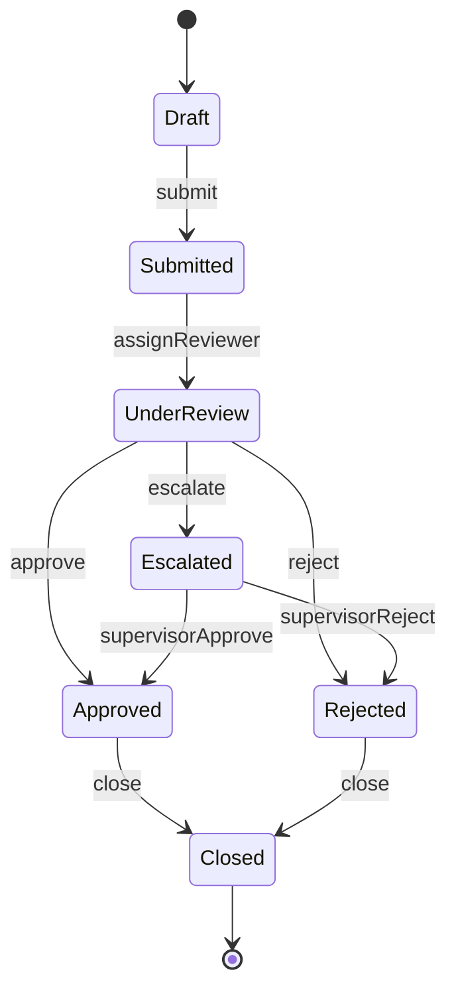
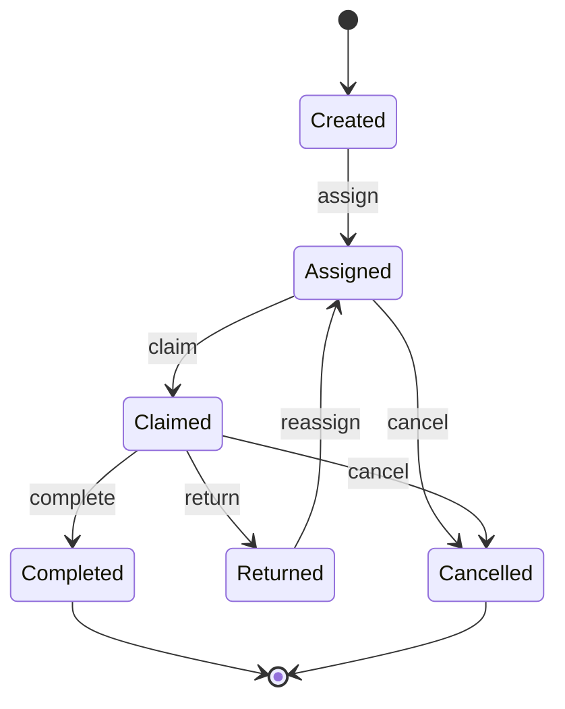
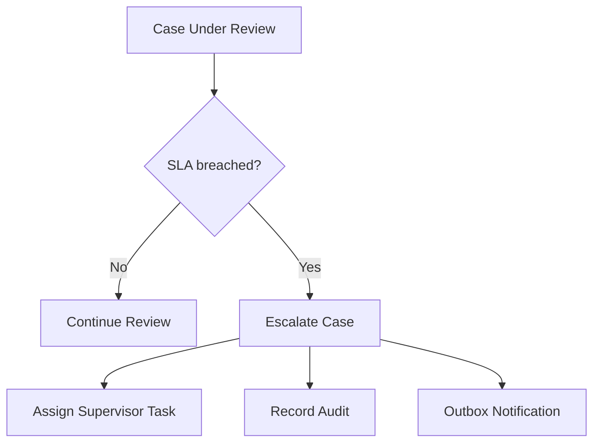
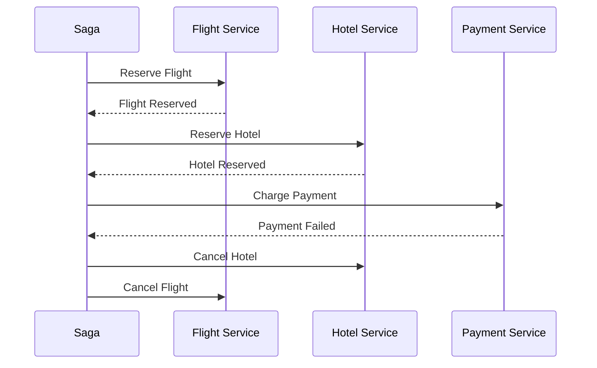
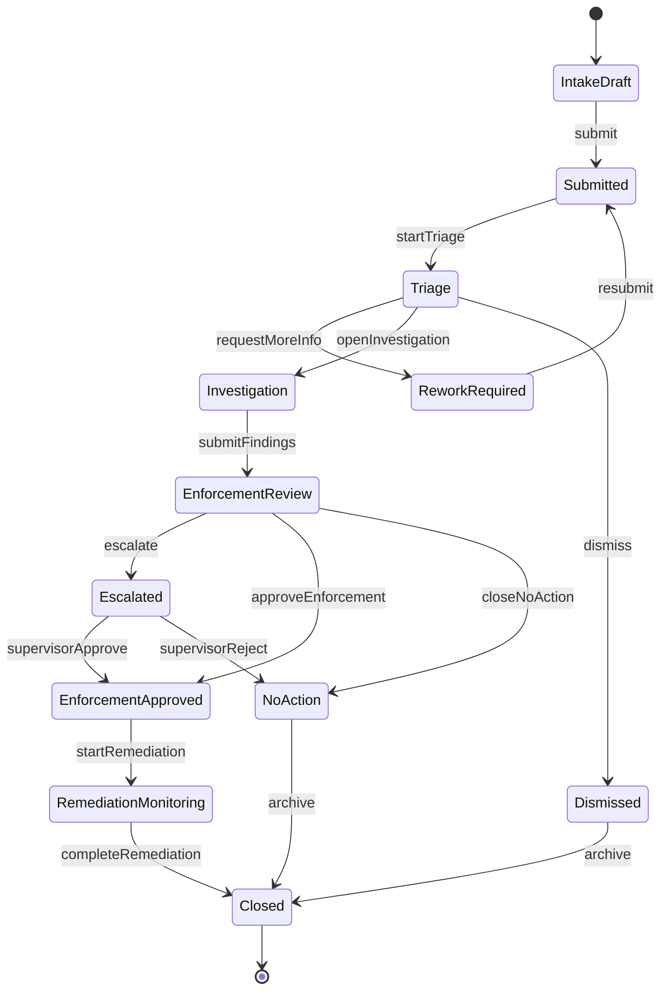

------
title: Learn Java Patterns - Part 010
description: State machine, workflow lifecycle, transition guards, escalation, compensation, process manager, saga, auditability, and defensible workflow design untuk sistem Java production.
series: learn-java-patterns
seriesTitle: Learn Java Patterns, Data Patterns, Pipeline Patterns, Concurrency Patterns, Common Patterns, and Anti-Patterns
order: 10
partTitle: State and Workflow Patterns
tags:
- java
- patterns
- architecture
- advanced-java
- workflow
- state-machine
- lifecycle
- process-manager
- saga
date: 2026-06-27
---

# Learn Java Patterns - Part 010: State and Workflow Patterns

## 1. Tujuan Part Ini

Part ini membahas bagaimana mendesain lifecycle object dan proses bisnis yang panjang di sistem Java production.

Kita akan membahas:

- State pattern;
- finite state machine;
- workflow pattern;
- transition guard;
- transition action;
- process manager;
- saga;
- compensation;
- human task;
- escalation;
- timeout;
- audit trail;
- state history;
- workflow persistence;
- workflow testing;
- anti-pattern lifecycle.

Part ini sangat penting untuk sistem seperti:

- case management;
- regulatory enforcement;
- claim processing;
- order fulfillment;
- onboarding;
- approval chain;
- incident response;
- document review;
- investigation workflow;
- compliance remediation.

> State dan workflow pattern bukan hanya soal status enum. Mereka adalah cara sistem menjelaskan apa yang boleh terjadi, siapa yang boleh melakukannya, kapan boleh terjadi, dan bagaimana membuktikannya setelah fakta terjadi.

---

## 2. Kaufman Lens: Sub-Skill yang Dilatih

Untuk menjadi sangat mahir pada workflow design, kita pecah skill menjadi beberapa sub-skill.

| Sub-Skill | Target Praktis |
|---|---|
| State identification | Membedakan state nyata, flag turunan, dan UI label |
| Transition modeling | Mendesain allowed transition, forbidden transition, dan exceptional transition |
| Guard design | Memisahkan precondition, authorization, policy, dan invariant |
| Action placement | Menentukan apa yang terjadi saat transition berhasil |
| Audit reasoning | Merekam transition secara defensible |
| Long-running process design | Membedakan transaction pendek dan workflow panjang |
| Escalation design | Mendesain timeout, reminder, SLA, dan overdue handling |
| Compensation reasoning | Mendesain undo semantic saat distributed action tidak bisa rollback atomik |
| Human task modeling | Memodelkan assignment, claim, delegate, complete, reject, dan rework |
| Testing lifecycle | Menguji transition matrix, invalid transition, race, retry, dan recovery |

Target setelah part ini:

> Anda bisa melihat field `status` di entity dan segera bertanya: transition-nya di mana, guard-nya apa, audit-nya bagaimana, concurrency-nya aman atau tidak, dan proses panjangnya dipersist di mana.

---

## 3. Mental Model: State Bukan Field, State adalah Contract

Kode paling umum:

```java
caseEntity.setStatus("APPROVED");
```

Kode ini terlihat sederhana, tetapi menyembunyikan banyak pertanyaan:

- Dari status apa menuju `APPROVED`?
- Apakah semua actor boleh approve?
- Apakah evidence sudah lengkap?
- Apakah approval perlu reason?
- Apakah reviewer boleh approve case yang ia submit sendiri?
- Apakah open task harus ditutup?
- Apakah audit event harus dicatat?
- Apakah notifikasi harus dikirim?
- Apakah SLA berhenti dihitung?
- Apakah decision bisa dibatalkan?
- Apa yang terjadi kalau dua reviewer approve dan reject bersamaan?

State adalah contract:

```text
Given current state + command + actor + context,
system either rejects command with reason
or transitions to next state and records consequences atomically.
```

Diagram dasar:



Status enum hanya representasi. Contract sebenarnya adalah transition graph plus rule.

---

## 4. Vocabulary: State, Workflow, Process, Saga

| Concept | Meaning | Example |
|---|---|---|
| State | Kondisi lifecycle object pada titik waktu tertentu | `UNDER_REVIEW` |
| Transition | Perubahan state yang valid | `UNDER_REVIEW -> APPROVED` |
| Command | Intent dari actor/system | `ApproveCase` |
| Event | Fakta bahwa sesuatu terjadi | `CaseApproved` |
| Guard | Predicate yang harus benar agar transition boleh terjadi | evidence lengkap |
| Action | Efek yang terjadi saat transition berhasil | close review task |
| State machine | Model finite states dan transitions | case lifecycle graph |
| Workflow | Orkestrasi steps, tasks, gateway, timeout, human/system activity | investigation process |
| Process manager | Object/service yang melacak dan mengarahkan proses multi-step | onboarding coordinator |
| Saga | Koordinasi distributed transaction dengan local transactions dan compensation | reserve inventory + charge payment + ship |
| Compensation | Aksi korektif saat tidak bisa rollback atomik | refund payment |

### 4.1 State Machine vs Workflow

State machine cocok saat fokusnya adalah lifecycle satu aggregate/object.

Workflow cocok saat fokusnya adalah proses multi-step, sering melibatkan:

- human task;
- system task;
- timer;
- branching;
- parallel step;
- external integration;
- rework loop;
- escalation;
- compensation.

Rule praktis:

| Gunakan | Jika |
|---|---|
| State machine | Satu object punya lifecycle jelas dan transition finite |
| Workflow | Proses panjang punya step, assignment, timer, dan orchestration |
| Process manager | Anda butuh coordinator custom untuk beberapa aggregate/service |
| Saga | Proses menyentuh beberapa service/database dan perlu compensation |

---

## 5. Anti-Pattern Awal: Boolean Explosion

Bad model:

```java
class CaseEntity {
    boolean submitted;
    boolean assigned;
    boolean approved;
    boolean rejected;
    boolean escalated;
    boolean closed;
}
```

Masalah:

- kombinasi invalid mudah terjadi;
- `approved=true` dan `rejected=true` mungkin bersamaan;
- urutan kejadian tidak jelas;
- transition tidak eksplisit;
- audit sulit;
- query state kompleks;
- UI menebak state dari flag;
- rule tersebar di service dan frontend.

Lebih baik:

```java
public enum CaseStatus {
    DRAFT,
    SUBMITTED,
    UNDER_REVIEW,
    ESCALATED,
    APPROVED,
    REJECTED,
    CLOSED
}
```

Namun enum saja belum cukup. Kita butuh transition model.

---

## 6. Transition Matrix Pattern

Transition matrix membuat allowed transition eksplisit.

| From | Command | To | Guard |
|---|---|---|---|
| DRAFT | submit | SUBMITTED | required fields complete |
| SUBMITTED | assignReviewer | UNDER_REVIEW | actor is coordinator |
| UNDER_REVIEW | approve | APPROVED | evidence complete + actor reviewer |
| UNDER_REVIEW | reject | REJECTED | reason provided |
| UNDER_REVIEW | escalate | ESCALATED | high risk or SLA breached |
| ESCALATED | supervisorApprove | APPROVED | actor supervisor |
| ESCALATED | supervisorReject | REJECTED | reason provided |
| APPROVED | close | CLOSED | closure checklist complete |
| REJECTED | close | CLOSED | closure checklist complete |

In code:

```java
public enum CaseStatus {
    DRAFT,
    SUBMITTED,
    UNDER_REVIEW,
    ESCALATED,
    APPROVED,
    REJECTED,
    CLOSED;

    public boolean canTransitionTo(CaseStatus target) {
        return switch (this) {
            case DRAFT -> target == SUBMITTED;
            case SUBMITTED -> target == UNDER_REVIEW;
            case UNDER_REVIEW -> target == APPROVED || target == REJECTED || target == ESCALATED;
            case ESCALATED -> target == APPROVED || target == REJECTED;
            case APPROVED, REJECTED -> target == CLOSED;
            case CLOSED -> false;
        };
    }
}
```

This is acceptable for simple lifecycle. But for production, command-specific guards and side effects need more structure.

---

## 7. Command-Oriented Transition Pattern

Do not expose generic `changeStatus`.

Bad:

```java
public void changeStatus(CaseStatus newStatus) {
    this.status = newStatus;
}
```

Better:

```java
public void approveBy(ReviewerId reviewerId, String reason, Instant decidedAt) {
    requireStatus(CaseStatus.UNDER_REVIEW, CaseStatus.ESCALATED);
    requireEvidenceComplete();
    requireNonBlank(reason, "approval reason is required");

    this.status = CaseStatus.APPROVED;
    this.decisions.add(Decision.approved(reviewerId, reason, decidedAt));
    this.events.add(new CaseApproved(this.id, reviewerId, decidedAt));
}
```

Command-oriented methods encode intent:

- `submit(...)`;
- `assignReviewer(...)`;
- `approveBy(...)`;
- `rejectBy(...)`;
- `escalateToSupervisor(...)`;
- `close(...)`;
- `reopen(...)` if allowed.

This improves audit, testing, and readability.

---

## 8. State Pattern

The GoF State pattern represents behavior as state-specific objects.

Useful when behavior varies significantly by state.

```java
interface CaseState {
    CaseStatus status();
    CaseState approve(ApprovalContext context);
    CaseState reject(RejectionContext context);
    CaseState escalate(EscalationContext context);
}
```

Example:

```java
final class UnderReviewState implements CaseState {
    public CaseStatus status() {
        return CaseStatus.UNDER_REVIEW;
    }

    public CaseState approve(ApprovalContext context) {
        if (!context.evidenceComplete()) {
            throw new TransitionRejected("Evidence is incomplete");
        }
        return new ApprovedState();
    }

    public CaseState reject(RejectionContext context) {
        if (context.reason().isBlank()) {
            throw new TransitionRejected("Rejection reason is required");
        }
        return new RejectedState();
    }

    public CaseState escalate(EscalationContext context) {
        if (!context.risk().isHigh() && !context.slaBreached()) {
            throw new TransitionRejected("Escalation requires high risk or SLA breach");
        }
        return new EscalatedState();
    }
}
```

State pattern is useful when:

- transition behavior varies by state;
- enum switch becomes too large;
- state-specific data/behavior exists;
- invalid operations should be rejected polymorphically;
- lifecycle is central enough to justify structure.

It is overkill when:

- states are simple;
- transitions are few;
- rules are mostly data-driven;
- team will not maintain many classes well.

---

## 9. Sealed Transition Model

Modern Java sealed types can make command and event families explicit.

```java
public sealed interface CaseCommand
    permits SubmitCase, AssignReviewer, ApproveCase, RejectCase, EscalateCase, CloseCase {
    CaseId caseId();
    ActorId actorId();
    Instant requestedAt();
}

public record SubmitCase(
    CaseId caseId,
    ActorId actorId,
    Instant requestedAt
) implements CaseCommand {}

public record ApproveCase(
    CaseId caseId,
    ActorId actorId,
    String reason,
    Instant requestedAt
) implements CaseCommand {}
```

Transition handler:

```java
public TransitionResult handle(CaseCommand command) {
    return switch (command) {
        case SubmitCase c -> submit(c);
        case AssignReviewer c -> assignReviewer(c);
        case ApproveCase c -> approve(c);
        case RejectCase c -> reject(c);
        case EscalateCase c -> escalate(c);
        case CloseCase c -> close(c);
    };
}
```

Benefit:

- compiler knows all command types;
- adding command forces switch update;
- command data is explicit;
- event generation can be command-specific.

---

## 10. Guard Pattern

Guard is a predicate that blocks invalid transition.

But not all guards are the same.

| Guard Type | Example | Where It Belongs |
|---|---|---|
| Structural precondition | reason must be non-blank | command validation/application |
| State precondition | only UNDER_REVIEW can approve | domain aggregate |
| Invariant | approved case must have decision record | domain aggregate |
| Authorization | actor must be assigned reviewer | authorization/domain policy boundary |
| Business policy | high-risk case requires supervisor | domain policy |
| Temporal guard | SLA breached after 48 hours | domain policy with Clock |
| External guard | sanction screening passed | application/process layer |

Do not collapse all guards into one `if` blob.

Bad:

```java
if (status.equals("UNDER_REVIEW") && user.hasRole("REVIEWER") && evidenceDao.count(id) > 0 && now.isAfter(...)) {
    status = "APPROVED";
}
```

Better:

```java
authorization.requireCanApprove(actor, c);
approvalPolicy.requireSatisfiedBy(c, actor, now);
c.approveBy(actor.id(), command.reason(), now);
```

Guard objects:

```java
public final class ApprovalPolicy {
    public void requireSatisfiedBy(RegulatoryCase c, Actor actor, Instant now) {
        if (!c.isUnderReviewOrEscalated()) {
            throw new TransitionRejected("Case is not reviewable");
        }
        if (!c.hasCompleteEvidence()) {
            throw new TransitionRejected("Evidence is incomplete");
        }
        if (c.isHighRisk() && !actor.hasRole(Role.SUPERVISOR)) {
            throw new TransitionRejected("High-risk approval requires supervisor");
        }
    }
}
```

---

## 11. Transition Action Pattern

Transition action is what happens after transition is accepted.

Examples:

- create audit event;
- close current task;
- create next task;
- add domain event;
- update SLA clock;
- schedule reminder;
- enqueue notification;
- assign owner;
- create compensation obligation.

Actions must be categorized:

| Action | Inside DB Transaction? | Reason |
|---|---:|---|
| Update aggregate state | Yes | invariant durability |
| Insert audit event | Yes | defensibility |
| Insert outbox message | Yes | side-effect intent durability |
| Send email | No | external side effect |
| Call payment API | No or carefully isolated | cannot rollback with DB |
| Schedule timer record | Yes | process durability |
| Create task row | Yes | workflow consistency |

Example:

```java
@Transactional
public void approve(ApproveCase command) {
    RegulatoryCase c = caseRepository.getById(command.caseId());
    Actor actor = actorDirectory.get(command.actorId());

    approvalPolicy.requireSatisfiedBy(c, actor, command.requestedAt());
    c.approveBy(actor.id(), command.reason(), command.requestedAt());

    taskRepository.closeReviewTask(c.id(), actor.id(), command.requestedAt());
    auditRepository.record(AuditEvent.caseApproved(c.id(), actor.id(), command.requestedAt()));
    outboxRepository.add(OutboxMessage.caseApproved(c.id()));

    caseRepository.save(c);
}
```

---

## 12. State History Pattern

Current status is not enough. Production systems often need status history.

```sql
case_status_history
- history_id
- case_id
- from_status
- to_status
- command_type
- actor_id
- reason
- occurred_at
- correlation_id
- rule_version
```

Benefits:

- auditability;
- debugging;
- SLA calculation;
- process mining;
- forensic reconstruction;
- compliance review;
- user-facing timeline;
- analytics.

Java event:

```java
public record CaseTransitioned(
    CaseId caseId,
    CaseStatus from,
    CaseStatus to,
    String commandType,
    ActorId actorId,
    String reason,
    Instant occurredAt,
    CorrelationId correlationId,
    RuleVersion ruleVersion
) {}
```

Do not rely only on application logs. Logs are operational evidence, not durable domain history.

---

## 13. Workflow Persistence Pattern

Long-running workflows cannot live only in memory.

Bad:

```java
class InMemoryWorkflow {
    Map<CaseId, WorkflowState> states = new HashMap<>();
}
```

If process restarts, workflow disappears.

Workflow persistence should record:

- workflow instance id;
- business key;
- current state/step;
- active tasks;
- timers;
- variables/context snapshot;
- version;
- last processed event id;
- history;
- compensation status.

Example:

```sql
workflow_instance
- workflow_id
- business_key
- workflow_type
- state
- version
- started_at
- updated_at
- completed_at

workflow_task
- task_id
- workflow_id
- task_type
- assignee
- status
- due_at
- completed_at

workflow_timer
- timer_id
- workflow_id
- fire_at
- timer_type
- status
```

Persistence is what turns a workflow from a diagram into a reliable system.

---

## 14. Human Task Pattern

Human tasks are different from system tasks.

They have:

- assignment;
- claim/unclaim;
- delegation;
- due date;
- priority;
- form/data requirements;
- completion command;
- rejection/rework;
- audit trail;
- authorization;
- SLA.

Task lifecycle:



Java model:

```java
public final class WorkflowTask {
    private final TaskId id;
    private TaskStatus status;
    private Optional<ActorId> assignee;
    private final Instant dueAt;
    private long version;

    public void claim(ActorId actor, Instant now) {
        requireStatus(TaskStatus.ASSIGNED);
        if (assignee.isPresent() && !assignee.get().equals(actor)) {
            throw new TaskRejected("Task assigned to another actor");
        }
        this.status = TaskStatus.CLAIMED;
        this.assignee = Optional.of(actor);
    }

    public void complete(ActorId actor, TaskCompletion completion, Instant now) {
        requireStatus(TaskStatus.CLAIMED);
        requireAssignee(actor);
        completion.requireValid();
        this.status = TaskStatus.COMPLETED;
    }
}
```

Human task systems fail when they model task as a simple todo row without lifecycle.

---

## 15. Escalation Pattern

Escalation is not just setting `priority = HIGH`.

Escalation usually includes:

- trigger condition;
- timer/SLA;
- actor/team change;
- reason;
- notification;
- audit;
- possibly new authorization rule;
- possibly different transition path.

Example:



Timer record:

```java
public record WorkflowTimer(
    TimerId id,
    WorkflowId workflowId,
    TimerType type,
    Instant fireAt,
    TimerStatus status
) {}
```

Timer worker:

```java
public void processDueTimers(Instant now) {
    List<WorkflowTimer> timers = timerRepository.findDueTimers(now, 100);

    for (WorkflowTimer timer : timers) {
        unitOfWork.withinTransaction(() -> {
            WorkflowTimer locked = timerRepository.loadForUpdate(timer.id());
            if (!locked.isDue(now)) return null;

            workflowService.handleTimer(locked);
            timerRepository.markFired(locked.id());
            return null;
        });
    }
}
```

Escalation requires idempotency: timer worker may run twice.

---

## 16. Process Manager Pattern

A process manager coordinates a multi-step process by reacting to events and sending commands.

Example onboarding:

```text
UserRegistered -> SendEmailVerification
EmailVerified -> StartKycCheck
KycPassed -> ActivateAccount
KycFailed -> RequestManualReview
ManualReviewApproved -> ActivateAccount
```

Process manager state:

```java
public final class OnboardingProcess {
    private final OnboardingId id;
    private final UserId userId;
    private OnboardingState state;
    private boolean emailVerified;
    private boolean kycCompleted;
    private boolean accountActivated;
    private long version;

    public List<Command> on(Event event) {
        return switch (event) {
            case UserRegistered e -> onUserRegistered(e);
            case EmailVerified e -> onEmailVerified(e);
            case KycPassed e -> onKycPassed(e);
            case KycFailed e -> onKycFailed(e);
            case ManualReviewApproved e -> onManualReviewApproved(e);
            default -> List.of();
        };
    }
}
```

Process manager is useful when:

- no single aggregate owns the whole process;
- process reacts to multiple events over time;
- process sends commands to multiple services;
- workflow state must be durable;
- process needs timeouts and compensation.

Avoid process manager when a simple aggregate method is enough.

---

## 17. Saga Pattern

Saga handles distributed business transaction as sequence of local transactions with compensation.

Example travel booking:



Saga is needed because distributed systems usually cannot rely on one ACID transaction across services.

Saga design requires:

- step state;
- idempotent commands;
- compensating actions;
- retry policy;
- timeout policy;
- durable saga log;
- correlation id;
- failure visibility.

Saga state example:

```java
public enum EnforcementSagaState {
    STARTED,
    CASE_CREATED,
    TASK_ASSIGNED,
    NOTIFICATION_REQUESTED,
    COMPLETED,
    COMPENSATING,
    COMPENSATED,
    FAILED
}
```

Compensation is not rollback. It is a new business action that semantically offsets a prior committed action.

---

## 18. Orchestration vs Choreography

| Style | How It Works | Strength | Risk |
|---|---|---|---|
| Orchestration | Central workflow/process manager tells participants what to do | Easy visibility and control | Central coordinator complexity |
| Choreography | Services react to events without central coordinator | Loose coupling | Flow becomes implicit and hard to reason about |

Orchestration example:

```text
Workflow -> CaseService.create
Workflow -> TaskService.assign
Workflow -> NotificationService.notify
```

Choreography example:

```text
CaseCreated event -> TaskService reacts
TaskAssigned event -> NotificationService reacts
```

Use orchestration when:

- process is regulated;
- auditability matters;
- business wants process visibility;
- compensation is complex;
- human tasks exist;
- SLA/escalation must be centralized.

Use choreography when:

- reactions are independent;
- services should not know a central process;
- eventual consistency is acceptable;
- flow is simple and observable.

For enforcement/case-management workflows, orchestration is often easier to defend.

---

## 19. Workflow Engine vs Code-Based Workflow

You can implement workflow in code or use a workflow engine.

| Approach | Pros | Cons |
|---|---|---|
| Code-based state machine | Simple deployment, full control, type-safe, easy local testing | Diagrams/process visibility must be built |
| BPMN/workflow engine | Visual model, human task support, timers, process monitoring | Operational complexity, vendor/runtime learning curve |
| Cloud state machine | Managed execution, retries, visualization | Cloud coupling, data passing constraints, cost model |
| Custom process manager | Fits domain exactly | Easy to underbuild reliability features |

Use an engine when you need many of these:

- long-running workflows;
- human tasks;
- timers;
- process visibility;
- business-readable diagrams;
- versioned process definitions;
- retry and incident handling;
- operational dashboard;
- process migration.

Use code when:

- lifecycle is small;
- domain model already owns transition;
- team needs strict type safety;
- operational workflow features are not needed;
- process changes are developer-controlled.

---

## 20. Versioned Workflow Definition Pattern

A dangerous assumption:

> There is only one current workflow.

In reality:

- workflow v1 may be running;
- v2 is deployed;
- old cases must finish on v1;
- some cases migrate to v2;
- audit must show which rule version applied.

Add definition version:

```java
public record WorkflowDefinitionId(String name, int version) {}
```

Instance stores version:

```sql
workflow_instance
- workflow_id
- definition_name
- definition_version
- state
- business_key
```

Transition history stores rule version:

```sql
case_status_history
- case_id
- from_status
- to_status
- command_type
- rule_version
- workflow_definition_version
```

Migration should be explicit:

```java
public interface WorkflowMigration {
    boolean canMigrate(WorkflowInstance instance);
    WorkflowInstance migrate(WorkflowInstance instance);
}
```

Never silently reinterpret old workflow state under new rules without audit.

---

## 21. State Machine Implementation: Table-Driven

For many workflows, transition table is better than big switch.

```java
public record TransitionRule(
    CaseStatus from,
    String commandType,
    CaseStatus to,
    TransitionGuard guard,
    TransitionAction action
) {}
```

Engine:

```java
public final class CaseStateMachine {
    private final List<TransitionRule> rules;

    public TransitionResult transition(RegulatoryCase c, CaseCommand command, TransitionContext context) {
        TransitionRule rule = rules.stream()
            .filter(r -> r.from() == c.status())
            .filter(r -> r.commandType().equals(command.getClass().getSimpleName()))
            .findFirst()
            .orElseThrow(() -> new InvalidTransition(c.status(), command));

        rule.guard().check(c, command, context);

        CaseStatus from = c.status();
        c.changeStatusInternally(rule.to());
        rule.action().execute(c, command, context);

        return new TransitionResult(from, rule.to(), c.pendingEvents());
    }
}
```

This is good when transitions are numerous and regular.

Risk:

- too dynamic;
- type safety weak;
- command-specific data hidden;
- debugging table configuration is harder;
- guard/action become generic bags.

Use typed commands even with table-driven rules.

---

## 22. State Machine Implementation: Typed Domain Methods

For domain-heavy systems, typed methods may be clearer.

```java
public final class RegulatoryCase {
    private CaseStatus status;
    private final List<Decision> decisions;
    private final List<DomainEvent> events;

    public void submit(SubmitCase command) {
        requireStatus(CaseStatus.DRAFT);
        requireCompleteSubmission(command);
        transitionTo(CaseStatus.SUBMITTED, command.actorId(), command.requestedAt(), "Submitted");
    }

    public void approve(ApproveCase command, ApprovalPolicy approvalPolicy) {
        requireStatus(CaseStatus.UNDER_REVIEW, CaseStatus.ESCALATED);
        approvalPolicy.requireSatisfiedBy(this, command);
        decisions.add(Decision.approved(command.actorId(), command.reason(), command.requestedAt()));
        transitionTo(CaseStatus.APPROVED, command.actorId(), command.requestedAt(), command.reason());
    }

    private void transitionTo(CaseStatus next, ActorId actor, Instant at, String reason) {
        CaseStatus previous = this.status;
        this.status = next;
        this.events.add(new CaseTransitioned(id, previous, next, actor, at, reason));
    }
}
```

Benefits:

- intent clear;
- compiler helps;
- domain language visible;
- tests are straightforward;
- impossible commands are not exposed as generic transition.

Risk:

- large aggregate class;
- duplicated transition mechanics;
- hard to visualize without generated graph/docs.

---

## 23. Auditability Pattern

Workflow without audit is operationally blind.

Audit should answer:

| Question | Example |
|---|---|
| Who acted? | reviewer-123 |
| On whose behalf? | delegated supervisor |
| What command? | ApproveCase |
| What changed? | UNDER_REVIEW -> APPROVED |
| Why? | sufficient evidence |
| When? | 2026-06-27T10:30Z |
| Under which rule? | approval-policy-v4 |
| From where? | UI, API, batch worker |
| Correlation? | request/case/workflow id |
| Was it automatic? | timer escalation |

Audit event:

```java
public record WorkflowAuditEvent(
    AuditId auditId,
    WorkflowId workflowId,
    String businessKey,
    String commandType,
    ActorId actorId,
    Optional<ActorId> delegatedBy,
    String fromState,
    String toState,
    String reason,
    RuleVersion ruleVersion,
    CorrelationId correlationId,
    Instant occurredAt
) {}
```

Important distinction:

- audit event is for accountability;
- domain event is for domain fact;
- integration event is for other systems;
- log event is for operations.

They may overlap, but do not assume one replaces all others.

---

## 24. Workflow Concurrency Pattern

Workflows are vulnerable to races:

- two users complete same task;
- timer escalates while reviewer approves;
- retry processes same event twice;
- assignment changes while task is claimed;
- process migration happens while command executes.

Use versioning.

```sql
workflow_instance
- workflow_id
- state
- version
```

Update:

```sql
UPDATE workflow_instance
SET state = ?, version = version + 1
WHERE workflow_id = ? AND version = ?
```

Task claim:

```sql
UPDATE workflow_task
SET status = 'CLAIMED', assignee = ?, version = version + 1
WHERE task_id = ?
  AND status = 'ASSIGNED'
  AND version = ?
```

Worker idempotency:

```sql
processed_event
- event_id PRIMARY KEY
- processed_at
- handler_name
```

Concurrency rule:

> Every workflow command must be safe under duplicate delivery and concurrent execution.

---

## 25. Timer and Reminder Pattern

Timer should be durable.

Bad:

```java
scheduler.schedule(() -> escalate(caseId), Duration.ofHours(48));
```

If process restarts, timer may vanish.

Better:

```sql
workflow_timer(timer_id, workflow_id, fire_at, type, status)
```

Timer worker claims due timers:

```sql
SELECT *
FROM workflow_timer
WHERE status = 'PENDING'
  AND fire_at <= ?
ORDER BY fire_at
LIMIT 100
FOR UPDATE SKIP LOCKED
```

Pattern:

```java
public void handleTimer(WorkflowTimer timer) {
    WorkflowInstance workflow = workflowRepository.loadForUpdate(timer.workflowId());

    if (workflow.hasAlreadyHandled(timer.id())) {
        return;
    }

    workflow.onTimer(timer);
    workflowRepository.save(workflow);
    timerRepository.markFired(timer.id());
}
```

Timer handling must check current state. A timer can fire late, after workflow already moved.

Example:

```java
public void onReviewSlaTimer(WorkflowTimer timer) {
    if (state != WorkflowState.UNDER_REVIEW) {
        recordIgnoredTimer(timer.id(), "Workflow no longer under review");
        return;
    }

    escalateAutomatically(timer.fireAt());
}
```

---

## 26. Compensation Pattern

Compensation is not generic undo.

Example:

- `chargePayment` compensation is `refundPayment`;
- `reserveInventory` compensation is `releaseInventory`;
- `sendEmail` may have no true compensation;
- `approveCase` compensation may be `reopenCaseWithCorrection`, not delete approval.

Compensation should be domain-specific.

```java
public sealed interface CompensationAction
    permits RefundPayment, ReleaseReservation, ReopenCase, SendCorrectionNotice {}

public record ReopenCase(
    CaseId caseId,
    String reason,
    ActorId actorId
) implements CompensationAction {}
```

Compensation state:

```java
public enum CompensationStatus {
    NOT_REQUIRED,
    REQUIRED,
    IN_PROGRESS,
    COMPLETED,
    FAILED,
    MANUAL_INTERVENTION_REQUIRED
}
```

Do not hide compensation failure. It is operational debt requiring visibility.

---

## 27. Invalid Transition Handling

Invalid transition should be explicit and useful.

Bad:

```java
throw new RuntimeException("Invalid status");
```

Better:

```java
public final class InvalidTransition extends RuntimeException {
    private final CaseId caseId;
    private final CaseStatus currentStatus;
    private final String command;

    public InvalidTransition(CaseId caseId, CaseStatus currentStatus, String command) {
        super("Cannot apply " + command + " to case " + caseId + " in status " + currentStatus);
        this.caseId = caseId;
        this.currentStatus = currentStatus;
        this.command = command;
    }
}
```

Map invalid transition to appropriate API response:

| Condition | HTTP-ish Response | Meaning |
|---|---:|---|
| Command structurally invalid | 400 | bad request |
| Actor not allowed | 403 | forbidden |
| Case not found | 404 | absent resource |
| Transition not allowed in current state | 409 | conflict with current state |
| Concurrent modification | 409 | stale version/conflict |
| Workflow temporarily locked | 423/409 | retry later depending API style |

The exact protocol may differ, but semantic distinction matters.

---

## 28. Observability for Workflow

Minimum workflow observability:

- transition count by type;
- invalid transition count;
- task age histogram;
- SLA breach count;
- timer lag;
- stuck workflow count;
- compensation failure count;
- retry count;
- workflow state distribution;
- transition latency;
- dead-lettered workflow events.

Structured log example:

```json
{
  "event": "workflow.transition",
  "workflowId": "wf-123",
  "businessKey": "case-456",
  "fromState": "UNDER_REVIEW",
  "toState": "ESCALATED",
  "command": "ReviewSlaTimerFired",
  "actor": "system",
  "correlationId": "corr-789"
}
```

Metrics help detect lifecycle bugs before users report them.

---

## 29. Testing State and Workflow

### 29.1 Transition Matrix Test

```java
@ParameterizedTest
@MethodSource("allowedTransitions")
void allowedTransitionsWork(CaseStatus from, CaseCommand command, CaseStatus expectedTo) {
    RegulatoryCase c = caseInStatus(from);

    stateMachine.transition(c, command, context);

    assertEquals(expectedTo, c.status());
}
```

### 29.2 Invalid Transition Test

```java
@Test
void cannotApproveDraftCase() {
    RegulatoryCase c = draftCase();

    ApproveCase command = new ApproveCase(c.id(), reviewer.id(), "ok", now);

    assertThrows(InvalidTransition.class, () -> c.approve(command, approvalPolicy));
}
```

### 29.3 Guard Test

```java
@Test
void highRiskCaseRequiresSupervisorApproval() {
    RegulatoryCase c = highRiskCaseUnderReview();
    Actor reviewer = normalReviewer();

    ApproveCase command = new ApproveCase(c.id(), reviewer.id(), "ok", now);

    assertThrows(TransitionRejected.class, () -> approvalPolicy.requireSatisfiedBy(c, command));
}
```

### 29.4 Timer Test

```java
@Test
void reviewSlaTimerEscalatesOnlyIfStillUnderReview() {
    WorkflowInstance workflow = workflowUnderReview();
    WorkflowTimer timer = reviewSlaTimerDue(workflow.id());

    workflow.onTimer(timer);

    assertEquals(WorkflowState.ESCALATED, workflow.state());
}

@Test
void reviewSlaTimerIsIgnoredIfAlreadyApproved() {
    WorkflowInstance workflow = approvedWorkflow();
    WorkflowTimer timer = reviewSlaTimerDue(workflow.id());

    workflow.onTimer(timer);

    assertEquals(WorkflowState.APPROVED, workflow.state());
}
```

### 29.5 Concurrency Test

```java
@Test
void onlyOneActorCanCompleteTask() {
    WorkflowTask a = taskRepository.get(taskId);
    WorkflowTask b = taskRepository.get(taskId);

    a.claim(actorA, now);
    taskRepository.save(a);

    b.claim(actorB, now);

    assertThrows(ConcurrentTaskModification.class, () -> taskRepository.save(b));
}
```

---

## 30. Common Anti-Patterns

| Anti-Pattern | Symptom | Fix |
|---|---|---|
| Status as free string | Invalid values, typo bugs | Enum/value object + transition model |
| Generic `changeStatus` | Rules bypassed | Command-specific methods |
| Boolean lifecycle flags | Impossible combinations | Single lifecycle state + derived flags |
| Workflow in frontend | Backend accepts invalid state | Backend owns transition rules |
| No state history | Cannot explain decisions | Transition history table |
| Timer in memory only | Lost escalation after restart | Durable timer table/engine |
| External call inside transition transaction | Lock contention and mismatch | Outbox/process step |
| Audit as log only | Weak defensibility | Durable audit event |
| Hidden retry | Duplicate tasks/events | Idempotency record |
| One huge workflow | Hard to change/test | Split subprocess/process manager |
| Choreography spaghetti | Nobody can explain process | Orchestration or process visibility |
| Silent workflow migration | Old cases reinterpreted | Versioned definition + explicit migration |

---

## 31. Refactoring Path: From Status Field to Workflow Model

Start:

```java
caseEntity.setStatus(request.status());
caseRepository.save(caseEntity);
```

### Step 1: Replace Free Status with Enum

```java
private CaseStatus status;
```

### Step 2: Remove Generic Setter

```java
private void setStatus(CaseStatus status) { ... } // or remove entirely
```

### Step 3: Add Command Methods

```java
submit(...)
approve(...)
reject(...)
escalate(...)
close(...)
```

### Step 4: Add Transition History

```java
recordTransition(from, to, command, actor, reason, now);
```

### Step 5: Add Guards/Policies

```java
approvalPolicy.requireSatisfiedBy(case, actor, now);
```

### Step 6: Add Concurrency Version

```java
version++ on transition;
```

### Step 7: Add Durable Timers/Tasks

```java
workflowTaskRepository.create(...);
workflowTimerRepository.schedule(...);
```

### Step 8: Decide Whether Engine Is Needed

If timers, human tasks, process versions, and monitoring grow, evaluate workflow engine or dedicated process manager.

---

## 32. Case Management Example

Example lifecycle:



Important points:

- `ReworkRequired` is not the same as `Rejected`;
- `Dismissed` is an outcome, not merely closed;
- `Escalated` changes authority and possibly SLA;
- `RemediationMonitoring` is post-decision lifecycle;
- `Closed` should preserve outcome reason;
- transition history is essential.

Command examples:

```java
submitIntake
startTriage
requestMoreInformation
resubmitIntake
openInvestigation
submitFindings
approveEnforcement
closeWithNoAction
startRemediationMonitoring
completeRemediation
archiveCase
```

Each command should have:

- required actor role;
- allowed current state;
- required data;
- generated audit event;
- generated tasks/timers;
- concurrency behavior;
- idempotency behavior if externally retried.

---

## 33. Production Design Checklist

### State Model

- Are states mutually exclusive?
- Are state names domain-meaningful?
- Are derived UI labels separated from lifecycle state?
- Are terminal states explicit?
- Are rework/reopen states modeled intentionally?

### Transition

- Is every transition command-specific?
- Are invalid transitions rejected with useful reason?
- Are guards separated by type?
- Are side effects categorized inside/outside transaction?
- Is transition history durable?

### Workflow

- Are human tasks modeled with lifecycle?
- Are timers durable?
- Are escalations idempotent?
- Are workflow instances versioned?
- Are process definition versions stored?
- Is migration explicit?

### Concurrency

- Are task claim and completion concurrency-safe?
- Are timer-vs-user races handled?
- Are duplicate events ignored safely?
- Are optimistic lock conflicts surfaced as conflicts?

### Operations

- Are stuck workflows detectable?
- Are SLA breaches measured?
- Are compensation failures visible?
- Are invalid transition spikes monitored?
- Can support reconstruct timeline from durable data?

---

## 34. Practice Drill

### Drill 1: Status Audit

Pick one entity with a `status` field. Write:

| Current State | Allowed Commands | Next State | Actor | Guard | Audit Required? |
|---|---|---|---|---|---|

If you cannot fill this table, your lifecycle model is implicit.

### Drill 2: Timer Race

Design behavior for this race:

```text
10:00:00 SLA timer due
10:00:01 Reviewer approves case
10:00:02 Timer worker processes overdue timer
```

Expected answer should specify:

- lock/version behavior;
- whether timer is ignored;
- audit record;
- metric/log;
- idempotency.

### Drill 3: Human Task Claim

Design task claim logic so only one actor can claim a task under concurrent clicks.

Include:

- SQL/update condition;
- version check;
- error response;
- test case.

### Drill 4: Compensation Mapping

For a distributed workflow, list each step and compensation:

| Step | Local Transaction | Compensation | Can Compensation Fail? | Manual Intervention? |
|---|---|---|---|---|

### Drill 5: Refactor Generic Status Update

Take:

```java
updateStatus(caseId, status)
```

Replace with command-specific methods and transition history.

---

## 35. Baeldung-Style Summary

In this part, we learned that state and workflow design is about making lifecycle rules explicit and durable.

Key takeaways:

- State is not just a field; it is a transition contract.
- Boolean lifecycle flags create invalid combinations.
- Command-specific transitions are safer than generic status updates.
- Guards should be separated into validation, authorization, invariant, policy, temporal, and external checks.
- Transition actions must distinguish database-local changes from external side effects.
- Workflow history is essential for audit, debugging, SLA, and compliance.
- Long-running workflows require durable instance, task, timer, and history storage.
- Human tasks have their own lifecycle and concurrency rules.
- Escalation requires durable timers and idempotent handling.
- Saga compensation is domain-specific correction, not magic rollback.
- Workflow versioning and migration must be explicit.

The next part moves into **event-driven patterns**: domain events, integration events, outbox, inbox, event envelope, replay, ordering, and idempotent consumption.

---

## 36. References and Further Reading

- GoF State pattern for state-specific behavior.
- Martin Fowler and enterprise application architecture literature for process manager and long-running business transaction reasoning.
- Enterprise Integration Patterns for messaging, correlation, routing, and process coordination.
- BPMN 2.0 references for human tasks, events, gateways, escalation, subprocess, and process notation.
- AWS Step Functions documentation for state machine/workflow concepts in managed orchestration.
- Workflow engine documentation such as Camunda for practical BPMN workflow execution concepts.
