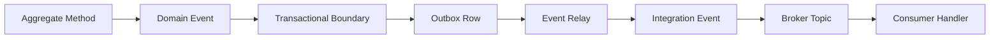
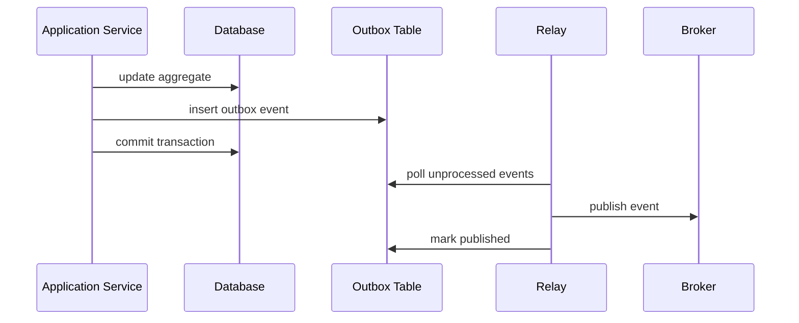
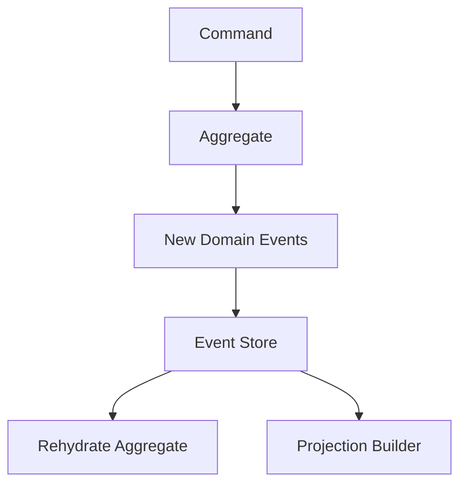
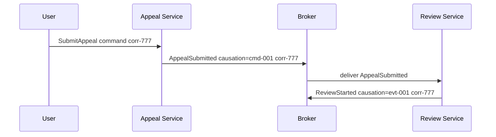
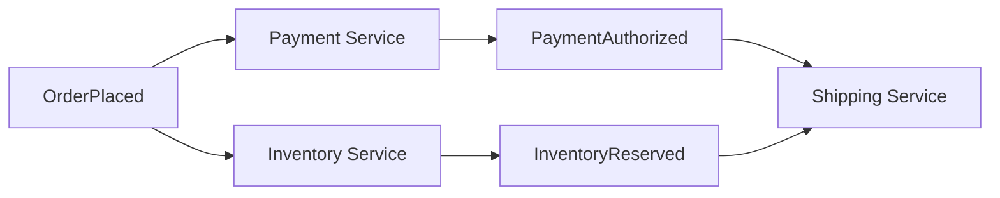
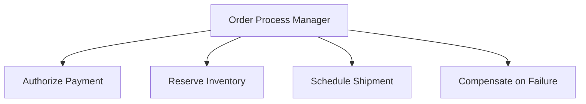
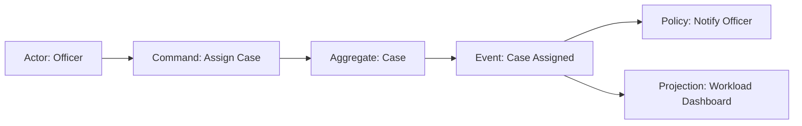
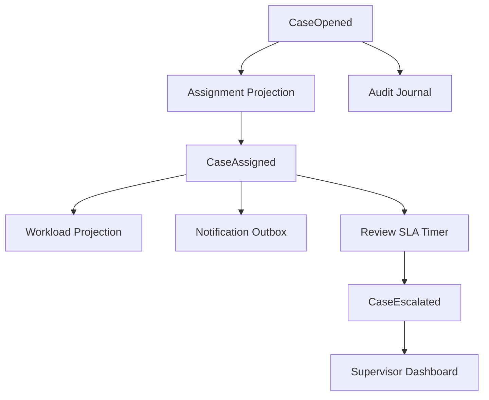

------
title: Learn Java Patterns - Part 011
description: Event-driven patterns untuk sistem Java production: domain event, integration event, event envelope, outbox, inbox, event replay, ordering, idempotency, schema evolution, dan failure-mode reasoning.
series: learn-java-patterns
seriesTitle: Learn Java Patterns, Data Patterns, Pipeline Patterns, Concurrency Patterns, Common Patterns, and Anti-Patterns
order: 11
partTitle: Event-Driven Patterns
tags:
- java
- patterns
- architecture
- advanced-java
- event-driven
- outbox
- inbox
- domain-event
- integration-event
- distributed-systems
date: 2026-06-27
---

# Learn Java Patterns - Part 011: Event-Driven Patterns

## 1. Tujuan Part Ini

Part ini membahas event-driven patterns untuk sistem Java production.

Fokus kita bukan membuat aplikasi "lebih asynchronous" hanya karena terlihat modern. Fokusnya adalah memahami kapan event memang menjadi representasi terbaik untuk perubahan fakta, kapan event membuat sistem lebih robust, dan kapan event justru menyembunyikan kompleksitas distributed system di balik ilusi decoupling.

Kita akan membahas:

- domain event;
- integration event;
- event envelope;
- event identity;
- event type naming;
- event payload design;
- event metadata;
- transactional outbox;
- inbox/idempotency record;
- event relay;
- event handler;
- event replay;
- projection;
- ordering;
- deduplication;
- eventual consistency;
- event schema evolution;
- event observability;
- anti-pattern event-driven system.

> Event-driven architecture bukan pattern untuk menghindari desain. Ia adalah pattern untuk membuat perubahan fakta bisa didistribusikan, direkam, diproses ulang, dan diamati dengan boundary yang eksplisit.

---

## 2. Kaufman Lens: Sub-Skill yang Dilatih

Agar tidak terjebak menjadi developer yang hanya tahu `publish(event)`, kita pecah skill event-driven design menjadi sub-skill yang bisa dilatih.

| Sub-Skill | Target Praktis |
|---|---|
| Event identification | Membedakan event fakta, command, notification, log, dan state snapshot |
| Boundary reasoning | Memilih event mana yang internal domain dan mana yang external integration contract |
| Payload design | Mendesain payload yang cukup stabil, tidak terlalu miskin, dan tidak terlalu coupling |
| Metadata design | Menambahkan id, correlation, causation, actor, tenant, trace, version, dan time semantics |
| Transactional reasoning | Menjamin perubahan data dan penerbitan event tidak divergen |
| Idempotency reasoning | Membuat handler aman terhadap duplicate delivery dan retry |
| Ordering reasoning | Menentukan order apa yang benar-benar dibutuhkan dan order apa yang hanya kebiasaan mental |
| Replay reasoning | Mendesain event agar bisa diproses ulang tanpa merusak state |
| Evolution reasoning | Mengubah schema event tanpa menghancurkan consumer lama |
| Observability reasoning | Melacak event lifecycle dari cause sampai effect |

Target setelah part ini:

1. bisa menentukan apakah suatu perubahan layak menjadi event;
2. bisa membedakan domain event dan integration event;
3. bisa mendesain envelope event yang layak production;
4. bisa menerapkan outbox/inbox secara benar;
5. bisa menjelaskan risiko ordering, duplicate, replay, dan schema evolution;
6. bisa menghindari anti-pattern event-driven architecture.

---

## 3. Mental Model: Event Adalah Fakta yang Sudah Terjadi

Event harus dibaca sebagai fakta masa lalu.

Contoh event yang baik:

```text
CaseOpened
CaseAssigned
EvidenceUploaded
ReviewRequested
ViolationDetermined
PenaltyCalculated
NoticeIssued
AppealSubmitted
```

Contoh yang bukan event, tetapi command:

```text
OpenCase
AssignCase
UploadEvidence
RequestReview
DetermineViolation
CalculatePenalty
IssueNotice
SubmitAppeal
```

Perbedaannya penting.

| Bentuk | Makna | Pemilik Keputusan |
|---|---|---|
| Command | Permintaan agar sesuatu terjadi | Receiver |
| Event | Fakta bahwa sesuatu sudah terjadi | Producer |
| Query | Permintaan membaca informasi | Receiver |
| Notification | Informasi untuk diketahui | Sender atau publisher |
| Log | Catatan diagnostik | Sistem observability |

Jika kita menyebut command sebagai event, consumer bisa salah mengira bahwa state sudah berubah padahal belum. Jika kita menyebut event sebagai command, producer bisa terlalu mengontrol downstream.

### Rule of Thumb

Gunakan nama past tense untuk event:

```text
PaymentAuthorized
InvoiceGenerated
CaseEscalated
DocumentRejected
```

Gunakan imperative untuk command:

```text
AuthorizePayment
GenerateInvoice
EscalateCase
RejectDocument
```

---

## 4. Event Bukan Log

Log menjelaskan apa yang terjadi untuk manusia atau sistem observability.

Event menjelaskan fakta domain atau integration yang consumer boleh gunakan untuk mengambil keputusan.

Contoh log:

```text
INFO retrying payment gateway call attempt=2 latencyMs=817
```

Contoh event:

```json
{
  "eventType": "PaymentAuthorizationFailed",
  "paymentId": "pay_123",
  "reasonCode": "GATEWAY_TIMEOUT",
  "occurredAt": "2026-06-27T10:15:30Z"
}
```

Log biasanya tidak stabil sebagai contract. Event integration harus stabil sebagai contract.

Jangan membiarkan consumer membaca log sebagai event stream kecuali memang platform observability Anda sengaja dijadikan event source, dan itu jarang merupakan desain domain yang baik.

---

## 5. Event Bukan Snapshot Sembarangan

Banyak sistem mengirim "event" seperti ini:

```json
{
  "eventType": "CaseUpdated",
  "case": {
    "id": "CASE-001",
    "status": "UNDER_REVIEW",
    "assignedOfficer": "u123",
    "priority": "HIGH",
    "updatedAt": "2026-06-27T10:00:00Z"
  }
}
```

Ini tidak selalu salah, tetapi sering terlalu kabur.

Masalahnya:

- consumer tidak tahu field mana yang berubah;
- consumer tidak tahu alasan perubahan;
- event type terlalu generic;
- event sulit dipakai untuk audit domain;
- replay sulit karena semantic terlalu lemah;
- consumer mudah melakukan coupling ke seluruh shape entity.

Event yang lebih jelas:

```json
{
  "eventType": "CasePriorityChanged",
  "caseId": "CASE-001",
  "oldPriority": "NORMAL",
  "newPriority": "HIGH",
  "reasonCode": "PUBLIC_SAFETY_RISK",
  "changedBy": "u123",
  "occurredAt": "2026-06-27T10:00:00Z"
}
```

Tetapi jangan ekstrem ke event terlalu granular tanpa kebutuhan.

```text
Bad smell:
- CaseTitleTextChanged
- CaseTitleTrimmed
- CaseTitleNormalized
- CaseLastUpdatedTimestampChanged
```

Event harus merepresentasikan fakta yang berarti secara domain atau integration, bukan setiap mutasi field teknis.

---

## 6. Domain Event vs Integration Event

### 6.1 Domain Event

Domain event adalah fakta yang terjadi di dalam bounded context.

Contoh:

```java
public record CaseOpened(
        CaseId caseId,
        OfficerId openedBy,
        CaseType caseType,
        Instant occurredAt
) implements DomainEvent {}
```

Domain event biasanya:

- memakai type domain internal;
- dekat dengan aggregate;
- tidak selalu stabil untuk external consumer;
- bisa dipakai untuk internal side effect;
- bisa diterjemahkan menjadi integration event.

### 6.2 Integration Event

Integration event adalah contract antar boundary.

Contoh:

```java
public record CaseOpenedIntegrationEvent(
        String eventId,
        String caseId,
        String caseType,
        String openedByUserId,
        String occurredAt,
        int schemaVersion
) {}
```

Integration event biasanya:

- memakai primitive atau stable contract type;
- memiliki schema version;
- memiliki metadata lengkap;
- tidak membocorkan internal domain object;
- dioptimalkan untuk consumer compatibility;
- dipublikasikan melalui broker atau event bus.

### 6.3 Mapping Mental Model



Domain event menjawab: "apa yang terjadi menurut domain saya?"

Integration event menjawab: "fakta apa yang aman saya umumkan ke dunia luar?"

---

## 7. Event Envelope Pattern

Payload event tidak cukup. Production event membutuhkan envelope.

Envelope adalah metadata standar yang mengelilingi payload.

```json
{
  "eventId": "evt_01J2Y4Z5K7Q4V9",
  "eventType": "CaseOpened",
  "eventVersion": 1,
  "source": "case-service",
  "tenantId": "tenant-a",
  "aggregateType": "Case",
  "aggregateId": "CASE-001",
  "aggregateVersion": 7,
  "occurredAt": "2026-06-27T10:00:00Z",
  "publishedAt": "2026-06-27T10:00:02Z",
  "correlationId": "corr_abc",
  "causationId": "cmd_xyz",
  "traceId": "trace_123",
  "actorId": "user-123",
  "payload": {
    "caseType": "INSPECTION",
    "openedReason": "PUBLIC_REPORT"
  }
}
```

### 7.1 Metadata yang Wajib Dipertimbangkan

| Field | Fungsi |
|---|---|
| `eventId` | Deduplication dan audit identity |
| `eventType` | Routing dan deserialization |
| `eventVersion` | Schema evolution |
| `source` | Producer identity |
| `tenantId` | Multi-tenant isolation |
| `aggregateType` | Logical owner |
| `aggregateId` | Ordering key dan traceability |
| `aggregateVersion` | Causal ordering di aggregate |
| `occurredAt` | Waktu fakta terjadi |
| `publishedAt` | Waktu event keluar dari service |
| `correlationId` | Menghubungkan flow end-to-end |
| `causationId` | Menunjukkan command/event penyebab langsung |
| `traceId` | Distributed tracing |
| `actorId` | Audit actor |

### 7.2 occurredAt vs publishedAt

Jangan samakan waktu fakta terjadi dan waktu event dipublikasikan.

Contoh:

- case dibuka pukul 10:00:00;
- database commit selesai pukul 10:00:01;
- outbox relay crash;
- event baru publish pukul 10:10:00.

`occurredAt` harus tetap 10:00:00 atau mendekati waktu domain event terjadi. `publishedAt` adalah 10:10:00.

Perbedaan ini penting untuk audit, SLA, replay, dan debugging latency.

---

## 8. Java Event Type Design

### 8.1 Marker Interface

```java
public interface DomainEvent {
    EventId eventId();
    Instant occurredAt();
}
```

Contoh implementation:

```java
public record CaseAssigned(
        EventId eventId,
        CaseId caseId,
        OfficerId assignedTo,
        OfficerId assignedBy,
        Instant occurredAt
) implements DomainEvent {}
```

### 8.2 Sealed Event Hierarchy

Untuk bounded set event internal, sealed interface bisa membantu compile-time reasoning.

```java
public sealed interface CaseEvent extends DomainEvent
        permits CaseOpened, CaseAssigned, CaseEscalated, CaseClosed {
    CaseId caseId();
}

public record CaseOpened(
        EventId eventId,
        CaseId caseId,
        CaseType caseType,
        OfficerId openedBy,
        Instant occurredAt
) implements CaseEvent {}

public record CaseAssigned(
        EventId eventId,
        CaseId caseId,
        OfficerId assignedTo,
        OfficerId assignedBy,
        Instant occurredAt
) implements CaseEvent {}
```

Ini bagus untuk internal domain.

Tetapi untuk integration event, sealed hierarchy sering kurang cocok karena external contract harus bisa berkembang lintas deployment.

### 8.3 Event Envelope Generic

```java
public record EventEnvelope<T>(
        String eventId,
        String eventType,
        int eventVersion,
        String source,
        String tenantId,
        String aggregateType,
        String aggregateId,
        long aggregateVersion,
        Instant occurredAt,
        Instant publishedAt,
        String correlationId,
        String causationId,
        String traceId,
        String actorId,
        T payload
) {}
```

Untuk production, validasi envelope seharusnya ketat.

```java
public EventEnvelope {
    Objects.requireNonNull(eventId);
    Objects.requireNonNull(eventType);
    Objects.requireNonNull(source);
    Objects.requireNonNull(aggregateId);
    Objects.requireNonNull(occurredAt);
    Objects.requireNonNull(payload);

    if (eventVersion < 1) {
        throw new IllegalArgumentException("eventVersion must be positive");
    }
}
```

---

## 9. Publishing Event Langsung dari Aggregate: Hati-Hati

Pattern umum:

```java
public final class CaseFile {
    private final List<DomainEvent> events = new ArrayList<>();

    public void assignTo(OfficerId officerId, OfficerId assignedBy, Instant now) {
        if (status == CaseStatus.CLOSED) {
            throw new IllegalStateException("closed case cannot be assigned");
        }

        this.assignedOfficer = officerId;
        this.events.add(new CaseAssigned(EventId.newId(), id, officerId, assignedBy, now));
    }

    public List<DomainEvent> pullEvents() {
        var copy = List.copyOf(events);
        events.clear();
        return copy;
    }
}
```

Ini berguna karena event muncul tepat saat invariant domain berubah.

Tetapi jangan langsung publish ke broker dari aggregate.

Buruk:

```java
public void assignTo(OfficerId officerId) {
    this.assignedOfficer = officerId;
    kafkaTemplate.send("case-events", new CaseAssigned(...));
}
```

Kenapa buruk?

- aggregate menjadi tergantung infrastructure;
- publish bisa sukses tapi database commit gagal;
- database commit bisa sukses tapi publish gagal;
- testing domain menjadi sulit;
- retry publish bisa mengulang side effect.

Aggregate boleh mencatat domain event. Application service atau transaction boundary yang memutuskan bagaimana event disimpan/dipublikasikan.

---

## 10. Transactional Outbox Pattern

### 10.1 Problem

Kita ingin melakukan dua hal:

1. menyimpan perubahan state ke database;
2. mempublikasikan event ke broker.

Jika dilakukan terpisah:

```java
repository.save(caseFile);
eventPublisher.publish(new CaseAssigned(...));
```

Ada failure gap.

| Database Commit | Publish Event | Akibat |
|---|---|---|
| Gagal | Gagal | Tidak masalah, operasi gagal |
| Gagal | Sukses | Consumer melihat event untuk state yang tidak ada |
| Sukses | Gagal | State berubah, consumer tidak tahu |
| Sukses | Sukses | Ideal |

Transactional outbox menyelesaikan gap dengan menyimpan event sebagai row di database yang sama dalam transaksi yang sama dengan perubahan business state.



### 10.2 Outbox Table Design

Contoh schema:

```sql
CREATE TABLE outbox_event (
    id              VARCHAR(64) PRIMARY KEY,
    aggregate_type  VARCHAR(100) NOT NULL,
    aggregate_id    VARCHAR(100) NOT NULL,
    aggregate_version BIGINT NOT NULL,
    event_type      VARCHAR(200) NOT NULL,
    event_version   INTEGER NOT NULL,
    payload_json    TEXT NOT NULL,
    metadata_json   TEXT NOT NULL,
    occurred_at     TIMESTAMP NOT NULL,
    created_at      TIMESTAMP NOT NULL,
    published_at    TIMESTAMP NULL,
    status          VARCHAR(30) NOT NULL,
    attempt_count   INTEGER NOT NULL DEFAULT 0,
    next_attempt_at TIMESTAMP NULL,
    last_error      TEXT NULL
);

CREATE INDEX idx_outbox_unpublished
ON outbox_event(status, next_attempt_at, created_at);

CREATE INDEX idx_outbox_aggregate
ON outbox_event(aggregate_type, aggregate_id, aggregate_version);
```

### 10.3 Application Service with Outbox

```java
public final class AssignCaseService {
    private final CaseRepository caseRepository;
    private final OutboxRepository outboxRepository;
    private final Clock clock;

    @Transactional
    public void assign(AssignCaseCommand command) {
        CaseFile caseFile = caseRepository.getRequired(command.caseId());

        caseFile.assignTo(
                command.assignedTo(),
                command.assignedBy(),
                clock.instant()
        );

        caseRepository.save(caseFile);

        for (DomainEvent event : caseFile.pullEvents()) {
            outboxRepository.append(OutboxEvent.fromDomain(event));
        }
    }
}
```

Kunci mental model:

> Event belum benar-benar dipublikasikan saat transaksi selesai. Event baru dijamin tersimpan untuk dipublikasikan.

### 10.4 Relay Design

```java
public final class OutboxRelay {
    private final OutboxRepository outboxRepository;
    private final IntegrationEventMapper mapper;
    private final MessageBroker broker;
    private final Clock clock;

    public void publishBatch(int batchSize) {
        List<OutboxEvent> events = outboxRepository.claimNextBatch(batchSize, clock.instant());

        for (OutboxEvent event : events) {
            try {
                EventEnvelope<?> envelope = mapper.toEnvelope(event);
                broker.publish(event.topic(), event.partitionKey(), envelope);
                outboxRepository.markPublished(event.id(), clock.instant());
            } catch (TransientBrokerException e) {
                outboxRepository.reschedule(event.id(), e.getMessage(), clock.instant());
            } catch (NonRetryableEventException e) {
                outboxRepository.markFailed(event.id(), e.getMessage(), clock.instant());
            }
        }
    }
}
```

Relay harus aman terhadap crash.

Failure penting:

1. relay publish sukses;
2. relay crash sebelum mark published;
3. relay restart;
4. event dipublish lagi.

Karena itu consumer tetap harus idempotent.

Outbox mengurangi risiko lost event, bukan menghapus duplicate delivery.

---

## 11. Outbox Claim Pattern

Jika beberapa relay instance berjalan paralel, jangan sampai row yang sama dipublish oleh banyak worker secara bersamaan.

Ada beberapa pendekatan:

### 11.1 SELECT FOR UPDATE SKIP LOCKED

```sql
SELECT *
FROM outbox_event
WHERE status = 'PENDING'
  AND (next_attempt_at IS NULL OR next_attempt_at <= now())
ORDER BY created_at
LIMIT 100
FOR UPDATE SKIP LOCKED;
```

Lalu update status menjadi `IN_PROGRESS` dalam transaksi yang sama.

### 11.2 Lease-Based Claim

```sql
UPDATE outbox_event
SET status = 'IN_PROGRESS',
    locked_by = ?,
    locked_until = ?
WHERE id IN (
    SELECT id
    FROM outbox_event
    WHERE status = 'PENDING'
       OR (status = 'IN_PROGRESS' AND locked_until < now())
    ORDER BY created_at
    LIMIT 100
);
```

Lease berguna jika worker mati saat memproses.

### 11.3 Claim Failure Mode

| Failure | Mitigasi |
|---|---|
| Worker crash saat in-progress | `locked_until` expire |
| Broker lambat | small batch, timeout, backoff |
| Event poison | max attempt + dead outbox status |
| Relay duplicate | consumer idempotency |
| Outbox table membesar | archival/purge policy |

---

## 12. Inbox / Idempotent Consumer Pattern

### 12.1 Problem

Message delivery di banyak sistem production bersifat at-least-once. Artinya consumer bisa menerima event yang sama lebih dari sekali.

Maka handler seperti ini berbahaya:

```java
public void on(CaseAssigned event) {
    notificationService.sendEmail(event.assignedTo(), "You have a new case");
    workloadRepository.incrementOpenCaseCount(event.assignedTo());
}
```

Jika event diproses dua kali:

- email terkirim dua kali;
- counter bertambah dua kali;
- audit bisa duplikat;
- downstream command bisa ganda.

### 12.2 Inbox Table

```sql
CREATE TABLE inbox_event (
    event_id        VARCHAR(64) PRIMARY KEY,
    consumer_name   VARCHAR(100) NOT NULL,
    received_at     TIMESTAMP NOT NULL,
    processed_at    TIMESTAMP NULL,
    status          VARCHAR(30) NOT NULL,
    last_error      TEXT NULL
);

CREATE UNIQUE INDEX uq_inbox_consumer_event
ON inbox_event(consumer_name, event_id);
```

### 12.3 Idempotent Handler Skeleton

```java
public final class CaseAssignedHandler {
    private final InboxRepository inboxRepository;
    private final WorkloadRepository workloadRepository;
    private final NotificationOutbox notificationOutbox;
    private final Clock clock;

    @Transactional
    public void handle(EventEnvelope<CaseAssignedPayload> envelope) {
        boolean firstTime = inboxRepository.tryStart(
                "workload-service.case-assigned",
                envelope.eventId(),
                clock.instant()
        );

        if (!firstTime) {
            return;
        }

        CaseAssignedPayload payload = envelope.payload();

        workloadRepository.assignCase(
                payload.caseId(),
                payload.assignedToUserId()
        );

        notificationOutbox.enqueueAssignmentEmail(
                payload.caseId(),
                payload.assignedToUserId()
        );

        inboxRepository.markProcessed(
                "workload-service.case-assigned",
                envelope.eventId(),
                clock.instant()
        );
    }
}
```

Perhatikan: side effect external seperti email lebih aman dimasukkan ke outbox lokal consumer, bukan dikirim langsung di tengah handler.

---

## 13. Event Handler Pattern

Event handler harus kecil dan jelas.

```java
public interface EventHandler<T> {
    boolean supports(String eventType, int version);
    void handle(EventEnvelope<T> envelope);
}
```

Contoh handler:

```java
public final class CaseOpenedProjectionHandler
        implements EventHandler<CaseOpenedPayload> {

    private final CaseProjectionRepository projections;

    @Override
    public boolean supports(String eventType, int version) {
        return eventType.equals("CaseOpened") && version == 1;
    }

    @Override
    public void handle(EventEnvelope<CaseOpenedPayload> envelope) {
        CaseOpenedPayload payload = envelope.payload();

        projections.create(new CaseProjection(
                payload.caseId(),
                payload.caseType(),
                "OPEN",
                envelope.occurredAt()
        ));
    }
}
```

Handler seharusnya tidak menjadi god service.

Bad smell:

```java
public void onAnyEvent(Event event) {
    if (event.type().equals("A")) { ... }
    else if (event.type().equals("B")) { ... }
    else if (event.type().equals("C")) { ... }
    // 900 lines later
}
```

Gunakan dispatch registry.

```java
public final class EventDispatcher {
    private final List<EventHandler<?>> handlers;

    public void dispatch(EventEnvelope<?> envelope) {
        EventHandler<?> handler = handlers.stream()
                .filter(h -> h.supports(envelope.eventType(), envelope.eventVersion()))
                .findFirst()
                .orElseThrow(() -> new UnknownEventTypeException(envelope.eventType()));

        dispatchUnsafe(handler, envelope);
    }

    @SuppressWarnings("unchecked")
    private static <T> void dispatchUnsafe(EventHandler<T> handler, EventEnvelope<?> envelope) {
        handler.handle((EventEnvelope<T>) envelope);
    }
}
```

---

## 14. Event Type Naming Pattern

Event type harus stabil dan eksplisit.

### 14.1 Hindari Generic Updated

Kurang baik:

```text
CaseUpdated
UserUpdated
OrderChanged
DataModified
```

Lebih baik:

```text
CaseAssigned
CasePriorityChanged
CaseEscalated
UserEmailVerified
OrderShipmentAddressChanged
```

### 14.2 Hindari Technology-Centric Name

Kurang baik:

```text
CaseTableRowInserted
KafkaCaseMessageSent
JpaEntityPersisted
```

Lebih baik:

```text
CaseOpened
CaseImported
CaseMigrated
```

### 14.3 Gunakan Ubiquitous Language

Jika domain menyebut "Notice Issued", jangan memakai "Document Sent" kecuali memang konsepnya berbeda.

Event name adalah bagian dari bahasa sistem.

---

## 15. Payload Design Pattern

Ada tiga gaya payload umum.

### 15.1 Thin Event

```json
{
  "caseId": "CASE-001"
}
```

Kelebihan:

- minim duplication;
- kecil;
- tidak banyak schema evolution.

Kekurangan:

- consumer harus call producer untuk detail;
- temporal correctness sulit;
- replay bisa menghasilkan hasil berbeda karena state terbaru berbeda;
- meningkatkan coupling runtime.

Cocok untuk:

- notification ringan;
- consumer hanya butuh identity;
- detail akan dibaca dari read API yang memang contract-nya stabil.

### 15.2 Fat Event

```json
{
  "caseId": "CASE-001",
  "caseType": "INSPECTION",
  "priority": "HIGH",
  "status": "OPEN",
  "assignedOfficer": "u123",
  "openedAt": "2026-06-27T10:00:00Z",
  "openedReason": "PUBLIC_REPORT"
}
```

Kelebihan:

- consumer mandiri;
- replay lebih deterministik;
- read model bisa dibangun tanpa call back.

Kekurangan:

- schema lebih besar;
- risiko membocorkan internal model;
- compatibility lebih berat;
- data sensitif bisa tersebar.

Cocok untuk:

- projection;
- analytics;
- audit stream;
- integration yang perlu snapshot konsisten saat event terjadi.

### 15.3 Delta Event

```json
{
  "caseId": "CASE-001",
  "field": "priority",
  "oldValue": "NORMAL",
  "newValue": "HIGH"
}
```

Kelebihan:

- jelas apa yang berubah;
- berguna untuk audit.

Kekurangan:

- sering terlalu generic;
- type safety lemah;
- consumer harus memahami field semantics.

Lebih baik gunakan domain-specific delta:

```json
{
  "caseId": "CASE-001",
  "oldPriority": "NORMAL",
  "newPriority": "HIGH",
  "reasonCode": "PUBLIC_SAFETY_RISK"
}
```

---

## 16. Event Ordering Pattern

Ordering adalah salah satu sumber kesalahan terbesar event-driven design.

Pertanyaan yang benar bukan:

> Apakah semua event harus ordered?

Pertanyaan yang benar:

> Order apa yang benar-benar dibutuhkan oleh invariant consumer?

### 16.1 Global Order

Global order berarti semua event di seluruh sistem memiliki satu urutan total.

Ini mahal dan jarang dibutuhkan.

Contoh kebutuhan nyata:

- audit ledger global tertentu;
- financial ledger dengan sequencing kuat;
- append-only compliance journal yang harus linear.

### 16.2 Per-Aggregate Order

Lebih umum:

```text
CaseOpened(CASE-001, version=1)
CaseAssigned(CASE-001, version=2)
CaseEscalated(CASE-001, version=3)
CaseClosed(CASE-001, version=4)
```

Event untuk aggregate yang sama harus diproses sesuai `aggregateVersion`.

Event untuk aggregate berbeda boleh parallel.

### 16.3 Partition Key

Jika memakai Kafka-like broker, gunakan aggregate id sebagai partition key untuk menjaga order per aggregate.

```java
broker.publish(
        "case-events",
        envelope.aggregateId(),
        envelope
);
```

Tapi hati-hati hot partition.

Jika satu aggregate sangat aktif, semua event-nya masuk satu partition dan menjadi bottleneck.

### 16.4 Consumer-Side Version Guard

```java
public void apply(EventEnvelope<CaseEventPayload> envelope) {
    CaseProjection projection = repository.get(envelope.aggregateId());

    long expected = projection.version() + 1;
    if (envelope.aggregateVersion() < expected) {
        return; // duplicate or stale
    }

    if (envelope.aggregateVersion() > expected) {
        throw new GapDetectedException(
                envelope.aggregateId(),
                expected,
                envelope.aggregateVersion()
        );
    }

    projection.apply(envelope.payload());
    repository.save(projection.withVersion(envelope.aggregateVersion()));
}
```

Jika ada gap, pilihan recovery:

- retry later;
- fetch missing event;
- rebuild projection;
- dead-letter untuk investigasi;
- tolerate out-of-order jika projection commutative.

---

## 17. Idempotency Pattern

Idempotency berarti memproses event yang sama berkali-kali menghasilkan efek akhir sama seperti sekali.

### 17.1 Natural Idempotency

```java
repository.setStatus(caseId, CaseStatus.CLOSED);
```

Jika status sudah CLOSED, efek akhir sama.

### 17.2 Artificial Idempotency

```java
if (processedEventRepository.exists(eventId)) {
    return;
}

process(event);
processedEventRepository.insert(eventId);
```

Ini butuh transaksi.

### 17.3 Semantic Idempotency

Untuk operasi seperti menambah counter, jangan hanya dedup event id. Pertimbangkan semantic identity.

Buruk:

```java
workload.incrementAssignedCount(officerId);
```

Lebih baik:

```java
workload.assignCase(caseId, officerId);
```

Kemudian hitung count dari assignments unik.

```sql
CREATE TABLE officer_assignment (
    officer_id VARCHAR(64) NOT NULL,
    case_id VARCHAR(64) NOT NULL,
    assigned_at TIMESTAMP NOT NULL,
    PRIMARY KEY (officer_id, case_id)
);
```

Idempotency sering lebih kuat jika model data didesain berbasis fakta unik, bukan mutasi incremental.

---

## 18. Event Replay Pattern

Replay berarti memproses ulang event lama.

Replay berguna untuk:

- rebuild projection;
- memperbaiki bug handler;
- membuat read model baru;
- audit reconstruction;
- migrasi data;
- backfill analytics.

### 18.1 Replay-Safe Handler

Handler replay-safe:

- idempotent;
- tidak mengirim email nyata saat replay;
- tidak memanggil external payment saat replay;
- bisa dibatasi berdasarkan event range;
- punya mode replay eksplisit;
- mencatat watermark.

Contoh:

```java
public enum ProcessingMode {
    LIVE,
    REPLAY
}

public record EventProcessingContext(
        ProcessingMode mode,
        String replayId,
        Instant startedAt
) {}
```

Handler:

```java
public void handle(EventEnvelope<CaseClosedPayload> event, EventProcessingContext context) {
    projection.applyCaseClosed(event);

    if (context.mode() == ProcessingMode.LIVE) {
        notificationOutbox.enqueueCaseClosedEmail(event.payload().caseId());
    }
}
```

### 18.2 Replay Anti-Pattern

```java
public void onPaymentCaptured(PaymentCaptured event) {
    accountingGateway.createLedgerEntry(...);
    emailGateway.sendReceipt(...);
    crmGateway.updateCustomerValue(...);
}
```

Saat replay, ini bisa membuat side effect external duplikat.

Pisahkan:

- projection side effect;
- external side effect;
- irreversible side effect.

---

## 19. Event Sourcing vs Event-Driven Architecture

Event-driven architecture berarti services berkomunikasi atau bereaksi melalui event.

Event sourcing berarti state utama aggregate dibangun dari event, bukan hanya disimpan sebagai row state terbaru.



Event sourcing bukan wajib untuk event-driven architecture.

### 19.1 Kapan Event Sourcing Masuk Akal

- audit history adalah primary requirement;
- state transition harus bisa direkonstruksi;
- temporal query penting;
- banyak projection berbeda dibutuhkan;
- domain event benar-benar kaya semantic;
- tim siap dengan complexity replay dan evolution.

### 19.2 Kapan Event Sourcing Berlebihan

- CRUD sederhana;
- domain event miskin semantic;
- tim belum memahami idempotency/replay;
- query sederhana bisa diselesaikan dengan history table;
- schema evolution belum matang;
- irreversible side effect bercampur dengan handler.

Banyak sistem cukup memakai state table + audit table + outbox.

---

## 20. Projection Pattern

Projection adalah read model yang dibangun dari event.

Contoh event stream:

```text
CaseOpened(caseId=CASE-001, type=INSPECTION)
CaseAssigned(caseId=CASE-001, assignedTo=u123)
CasePriorityChanged(caseId=CASE-001, newPriority=HIGH)
```

Projection:

```sql
case_dashboard_view
- case_id
- case_type
- assigned_to
- priority
- current_status
- last_event_at
```

### 20.1 Projection Handler

```java
public final class CaseDashboardProjectionHandler {
    private final CaseDashboardRepository repository;

    public void on(EventEnvelope<CaseOpenedPayload> event) {
        repository.insert(new CaseDashboardRow(
                event.payload().caseId(),
                event.payload().caseType(),
                null,
                "NORMAL",
                "OPEN",
                event.occurredAt(),
                event.aggregateVersion()
        ));
    }

    public void on(EventEnvelope<CaseAssignedPayload> event) {
        repository.updateAssignment(
                event.payload().caseId(),
                event.payload().assignedToUserId(),
                event.occurredAt(),
                event.aggregateVersion()
        );
    }
}
```

### 20.2 Projection Lag

Projection bisa tertinggal dari write model.

UI harus memahami ini.

Contoh:

- command `AssignCase` sukses;
- API mengembalikan success;
- dashboard projection belum update selama 500 ms;
- user melihat old assignee.

Solusi:

- read-your-write dari write model untuk flow tertentu;
- optimistic UI;
- polling with correlation id;
- projection freshness indicator;
- synchronous projection update untuk critical read;
- accept eventual consistency dengan UX copy yang jelas.

---

## 21. Event Schema Evolution

Event adalah contract jangka panjang. Jangan ubah sembarangan.

### 21.1 Compatible Change

Biasanya aman:

- menambah optional field;
- menambah enum value jika consumer tolerant;
- menambah metadata;
- memperluas payload tanpa menghapus field lama.

### 21.2 Breaking Change

Berbahaya:

- menghapus field;
- mengganti makna field;
- mengganti type field;
- mengganti unit measurement;
- mengganti time zone semantics;
- rename field tanpa alias;
- menggabungkan event type dengan semantic berbeda.

### 21.3 Versioning Strategy

```java
public record EventEnvelope<T>(
        String eventType,
        int eventVersion,
        T payload
) {}
```

Handler bisa mendukung beberapa version.

```java
public void handle(EventEnvelope<JsonNode> envelope) {
    switch (envelope.eventVersion()) {
        case 1 -> handleV1(parseV1(envelope.payload()));
        case 2 -> handleV2(parseV2(envelope.payload()));
        default -> throw new UnsupportedEventVersionException(
                envelope.eventType(),
                envelope.eventVersion()
        );
    }
}
```

### 21.4 Upcaster Pattern

Upcaster mengubah event lama menjadi bentuk baru sebelum masuk handler.

```java
public interface EventUpcaster {
    boolean supports(String eventType, int fromVersion);
    EventEnvelope<JsonNode> upcast(EventEnvelope<JsonNode> oldEvent);
}
```

Contoh:

```java
public final class CaseOpenedV1ToV2Upcaster implements EventUpcaster {
    @Override
    public boolean supports(String eventType, int fromVersion) {
        return eventType.equals("CaseOpened") && fromVersion == 1;
    }

    @Override
    public EventEnvelope<JsonNode> upcast(EventEnvelope<JsonNode> oldEvent) {
        ObjectNode payload = (ObjectNode) oldEvent.payload();
        payload.put("priority", "NORMAL");
        return oldEvent.withVersionAndPayload(2, payload);
    }
}
```

Upcaster berguna untuk replay event lama.

---

## 22. Event Contract Testing

Consumer-driven contract test bisa mencegah producer merusak consumer.

Minimal test:

```java
class CaseOpenedEventContractTest {

    @Test
    void caseOpenedV1ShouldContainRequiredFields() throws Exception {
        String json = fixture("events/case-opened-v1.json");

        JsonNode root = objectMapper.readTree(json);

        assertThat(root.get("eventId").asText()).isNotBlank();
        assertThat(root.get("eventType").asText()).isEqualTo("CaseOpened");
        assertThat(root.get("eventVersion").asInt()).isEqualTo(1);
        assertThat(root.get("payload").get("caseId").asText()).isNotBlank();
        assertThat(root.get("payload").get("caseType").asText()).isNotBlank();
    }
}
```

Lebih baik gunakan schema registry atau JSON Schema/Avro/Protobuf sesuai stack. Tetapi prinsipnya sama: event contract bukan detail internal producer.

---

## 23. Event Correlation and Causation

Correlation dan causation sering diabaikan, padahal sangat penting untuk debugging distributed workflow.

```text
commandId: cmd-001 SubmitAppeal
correlationId: corr-appeal-777
causationId: cmd-001

Event 1: AppealSubmitted
  correlationId: corr-appeal-777
  causationId: cmd-001

Command 2: StartReview
  correlationId: corr-appeal-777
  causationId: event-AppealSubmitted

Event 2: ReviewStarted
  correlationId: corr-appeal-777
  causationId: command-StartReview
```

Mermaid:



`correlationId` mengikat satu business flow.

`causationId` menjawab "apa penyebab langsung event ini?"

Tanpa dua field ini, debugging distributed event chain menjadi tebakan.

---

## 24. Eventual Consistency Pattern

Event-driven system sering eventual consistent.

Ini bukan kelemahan otomatis. Ini trade-off.

### 24.1 Contoh

Saat case assigned:

1. Case service menyimpan assignment;
2. outbox menyimpan event;
3. event relay publish;
4. workload service update workload;
5. notification service kirim email;
6. search service update index.

Tidak semua state berubah atomik.

### 24.2 Pertanyaan Desain

Untuk setiap consumer, tanyakan:

| Pertanyaan | Contoh |
|---|---|
| Berapa lag yang bisa diterima? | dashboard boleh 2 detik, authorization tidak boleh |
| Apakah stale read berbahaya? | workload count stale mungkin oke, eligibility stale mungkin tidak |
| Apakah user perlu read-your-write? | setelah submit form, UI harus menunjukkan perubahan |
| Apakah ada compensating action? | email salah kirim sulit dikompensasi |
| Apakah event harus blocking command success? | audit event mungkin harus tersimpan, analytics tidak |

Jangan memakai event-driven pattern untuk invariant yang membutuhkan consistency kuat tanpa desain tambahan.

---

## 25. Event-Driven Authorization Pitfall

Misalnya service A menerbitkan:

```text
CaseAssigned(caseId=CASE-001, assignedTo=u123)
```

Service B update permission cache secara async.

Masalah:

- user u123 mencoba membuka case segera setelah assignment;
- permission projection belum update;
- akses ditolak sementara.

Solusi tergantung requirement:

1. permission read langsung ke source of truth;
2. synchronous permission update dalam command transaction;
3. command response membawa temporary access grant;
4. retry UI beberapa saat;
5. consistency SLA jelas;
6. permission projection diberi priority lebih tinggi.

Authorization sering bukan tempat terbaik untuk eventual consistency long lag.

---

## 26. Event Choreography vs Orchestration

### 26.1 Choreography

Setiap service bereaksi terhadap event.



Kelebihan:

- loose coupling;
- scalable secara organisasi;
- tidak ada central coordinator.

Kekurangan:

- flow sulit dilihat;
- failure chain tersebar;
- debugging sulit;
- cyclic event mudah terjadi;
- business process tidak punya single owner.

### 26.2 Orchestration

Satu process manager mengatur langkah.



Kelebihan:

- flow eksplisit;
- mudah audit;
- timeout dan compensation terpusat;
- cocok untuk workflow kompleks.

Kekurangan:

- coordinator bisa menjadi bottleneck;
- coupling ke proses meningkat;
- butuh versioning workflow.

Untuk regulatory/case-management system, orchestration sering lebih defensible untuk proses formal. Choreography tetap berguna untuk side effects dan projections.

---

## 27. Event Storming sebagai Discovery Pattern

Event storming bukan implementation pattern, tetapi discovery technique.

Tujuannya menemukan:

- domain event;
- command;
- actor;
- policy;
- aggregate;
- external system;
- hotspot;
- ambiguity;
- boundary.

Minimal mapping:



Event storming membantu sebelum Anda menulis class, topic, atau table.

---

## 28. Event Anti-Patterns

### 28.1 Event Soup

Semua service publish semua hal, tidak ada ownership jelas.

Gejala:

- ratusan event type tanpa taxonomy;
- event naming inconsistent;
- consumer tidak tahu mana authoritative;
- duplicate facts dari banyak producer;
- no schema ownership.

Solusi:

- event catalog;
- producer ownership;
- naming guideline;
- schema governance ringan;
- deprecate event lama.

### 28.2 CRUD Event Masquerading as Domain Event

```text
UserCreated
UserUpdated
UserDeleted
```

Tidak selalu salah, tetapi sering miskin semantic.

Lebih baik jika domain membutuhkan:

```text
UserRegistered
UserEmailVerified
UserRoleGranted
UserSuspended
UserReactivated
```

### 28.3 Synchronous Event Bus in Disguise

Service mempublish event lalu menunggu semua consumer selesai agar command dianggap sukses.

Ini sering menciptakan distributed synchronous coupling yang lebih sulit dipahami daripada REST call biasa.

### 28.4 Event as Shared Database

Consumer terlalu bergantung pada semua field event sebagai sumber data lengkap, lalu producer tidak bisa berubah.

Solusi:

- stable contract;
- bounded payload;
- event versioning;
- explicit public model;
- separate internal domain event dan integration event.

### 28.5 No Idempotency

Consumer berasumsi event hanya datang sekali.

Ini hampir selalu salah di production.

### 28.6 No Replay Strategy

Event disimpan lama tetapi handler tidak aman untuk replay.

Akibat:

- tidak bisa rebuild projection;
- bug sulit diperbaiki;
- migration sulit;
- audit hanya setengah berguna.

### 28.7 Infinite Event Loop

Service A publish event, Service B merespons dan publish event, Service A merespons lagi tanpa guard.

Solusi:

- causation id;
- event source guard;
- process manager;
- idempotent state transition;
- clear ownership.

---

## 29. Production Checklist

Gunakan checklist ini sebelum menganggap event-driven design siap production.

### 29.1 Event Definition

- [ ] Event merepresentasikan fakta masa lalu, bukan command.
- [ ] Event name memakai ubiquitous language.
- [ ] Event type tidak terlalu generic.
- [ ] Producer ownership jelas.
- [ ] Consumer yang diharapkan jelas.
- [ ] Payload tidak membocorkan internal entity secara berlebihan.

### 29.2 Envelope

- [ ] `eventId` ada dan unik.
- [ ] `eventType` ada.
- [ ] `eventVersion` ada.
- [ ] `source` ada.
- [ ] `aggregateId` ada jika relevan.
- [ ] `aggregateVersion` ada jika ordering per aggregate diperlukan.
- [ ] `occurredAt` dan `publishedAt` dibedakan.
- [ ] `correlationId` dan `causationId` dipropagasi.
- [ ] `tenantId` ada untuk multi-tenant system.

### 29.3 Reliability

- [ ] Publish tidak dilakukan langsung di domain object.
- [ ] State change dan outbox insert satu transaksi.
- [ ] Relay aman terhadap crash.
- [ ] Consumer idempotent.
- [ ] Duplicate delivery diuji.
- [ ] Retry policy jelas.
- [ ] Dead-letter/recovery path tersedia.

### 29.4 Evolution

- [ ] Schema versioning jelas.
- [ ] Breaking change strategy tersedia.
- [ ] Consumer lama dipertimbangkan.
- [ ] Contract test tersedia.
- [ ] Event catalog diperbarui.

### 29.5 Operations

- [ ] Lag outbox dimonitor.
- [ ] Lag consumer dimonitor.
- [ ] Failed event bisa dicari.
- [ ] Replay mode aman.
- [ ] Correlation trace bisa diikuti.
- [ ] PII/security classification jelas.

---

## 30. Practice Drill

### Drill 1: Identify Event vs Command

Klasifikasikan:

```text
ApproveApplication
ApplicationApproved
SendNotice
NoticeSent
CaseStatusChanged
CaseEscalated
GeneratePenalty
PenaltyGenerated
```

Jawaban yang diharapkan:

- command: `ApproveApplication`, `SendNotice`, `GeneratePenalty`;
- event: `ApplicationApproved`, `NoticeSent`, `CaseEscalated`, `PenaltyGenerated`;
- ambiguous: `CaseStatusChanged`, karena terlalu generic.

### Drill 2: Design Event Envelope

Buat envelope untuk:

```text
InspectionScheduled
```

Minimal harus punya:

- event id;
- event type;
- version;
- source;
- aggregate id;
- occurredAt;
- publishedAt;
- correlation id;
- causation id;
- actor id;
- payload.

### Drill 3: Outbox Failure Reasoning

Jelaskan apa yang terjadi jika:

1. transaction commit sukses;
2. relay publish sukses;
3. relay crash sebelum mark published;
4. relay restart.

Jawaban: event mungkin dipublish ulang. Consumer harus idempotent.

### Drill 4: Replay Safety

Ambil handler event yang mengirim email langsung. Refactor agar replay mode tidak mengirim email.

---

## 31. Mini Case Study: Regulatory Case Event Flow

Misalnya sistem enforcement lifecycle.

### 31.1 Events

```text
CaseOpened
CaseAssigned
EvidenceRequested
EvidenceSubmitted
ReviewStarted
ViolationDetermined
PenaltyProposed
NoticeIssued
AppealSubmitted
CaseClosed
```

### 31.2 Flow



### 31.3 Design Notes

- `CaseOpened` berasal dari Case aggregate.
- `CaseAssigned` harus memiliki `assignedBy`, `assignedTo`, dan reason jika auto-assignment.
- `CaseEscalated` harus membedakan manual escalation dan SLA escalation.
- `NoticeIssued` mungkin irreversible karena external party sudah menerima notice.
- Projection dashboard boleh eventually consistent.
- Audit journal harus lebih kuat reliability-nya.
- Authorization projection tidak boleh lag tanpa mitigasi UX/security.

---

## 32. Reference Notes

Beberapa konsep di part ini sejalan dengan literatur dan dokumentasi berikut:

- Transactional Outbox dan Idempotent Consumer dari Microservices.io.
- Enterprise Integration Patterns untuk message channel, routing, aggregator, resequencer, dan dead-letter channel.
- Apache Kafka documentation untuk partition, distributed log, producer/consumer, dan delivery semantics.
- Jakarta Messaging specification untuk model Java enterprise messaging.
- Domain-Driven Design tactical patterns untuk domain event, aggregate, dan bounded context.

---

## 33. Ringkasan

Event-driven pattern yang matang memiliki beberapa prinsip inti:

1. event adalah fakta yang sudah terjadi;
2. domain event dan integration event sebaiknya dipisahkan;
3. envelope sama pentingnya dengan payload;
4. outbox mengatasi gap antara database commit dan publish;
5. outbox tidak menghilangkan duplicate, maka consumer tetap harus idempotent;
6. ordering harus didesain berdasarkan invariant, bukan asumsi global order;
7. replay hanya aman jika handler bebas side effect irreversible;
8. schema event harus diperlakukan sebagai contract;
9. choreography cocok untuk reaksi longgar, orchestration cocok untuk workflow formal;
10. event-driven architecture bukan alasan untuk menghindari ownership dan consistency reasoning.

Part berikutnya akan membahas messaging dan integration patterns secara lebih luas: queue, topic, request-reply, router, splitter, aggregator, retry, dead-letter, poison message, correlation, dan integration boundary.
