------
title: Learn Java Patterns - Part 012
description: Messaging and integration patterns untuk Java production: queue, pub/sub, request-reply, correlation, router, splitter, aggregator, competing consumers, retry, dead-letter, poison message, idempotent receiver, dan boundary integration.
series: learn-java-patterns
seriesTitle: Learn Java Patterns, Data Patterns, Pipeline Patterns, Concurrency Patterns, Common Patterns, and Anti-Patterns
order: 12
partTitle: Messaging and Integration Patterns
tags:
- java
- patterns
- architecture
- advanced-java
- messaging
- integration
- queue
- pubsub
- jms
- kafka
- enterprise-integration-patterns
date: 2026-06-27
---

# Learn Java Patterns - Part 012: Messaging and Integration Patterns

## 1. Tujuan Part Ini

Part sebelumnya membahas event-driven design dari sudut event sebagai fakta. Part ini membahas messaging dan integration patterns dari sudut mekanisme komunikasi antar boundary.

Kita akan membahas:

- message;
- channel;
- queue;
- topic/pub-sub;
- request-reply;
- correlation id;
- message envelope;
- message translator;
- content-based router;
- recipient list;
- splitter;
- aggregator;
- resequencer;
- competing consumers;
- idempotent receiver;
- retry;
- dead-letter channel;
- poison message;
- backpressure;
- broker boundary;
- Java implementation options;
- anti-pattern integration.

> Messaging bukan sekadar mengganti method call dengan broker call. Messaging mengubah model waktu, failure, ownership, ordering, dan observability.

---

## 2. Kaufman Lens: Sub-Skill yang Dilatih

Messaging skill bisa dipecah menjadi sub-skill berikut.

| Sub-Skill | Target Praktis |
|---|---|
| Communication style selection | Memilih sync call, async message, event, command, atau batch transfer |
| Channel modeling | Mendesain queue/topic/channel berdasarkan ownership dan delivery semantics |
| Message contract design | Membuat envelope, payload, metadata, schema, dan versioning |
| Routing reasoning | Menentukan bagaimana message diarahkan tanpa membuat integration god service |
| Delivery semantics reasoning | Memahami at-most-once, at-least-once, duplicate, ordering, dan retry |
| Consumer scaling | Menggunakan competing consumers, partitioning, dan work distribution dengan aman |
| Failure handling | Mendesain retry, backoff, dead-letter, poison handling, dan manual recovery |
| Correlation reasoning | Menghubungkan request, reply, event, trace, dan business transaction |
| Integration boundary | Menentukan translator, anti-corruption layer, canonical model, dan ownership |
| Operational readiness | Mengukur lag, throughput, error rate, replay, dan stuck message |

Target setelah part ini:

1. bisa memilih queue vs topic vs request-reply;
2. bisa mendesain message envelope production-ready;
3. bisa menerapkan router/splitter/aggregator tanpa membuat chaos;
4. bisa menjelaskan delivery semantics dan failure mode;
5. bisa membuat consumer idempotent dan scalable;
6. bisa membuat dead-letter/retry strategy yang bisa dioperasikan.

---

## 3. Messaging Mental Model

Method call biasa punya model mental seperti ini:

```text
caller waits -> callee executes -> caller gets result or error
```

Messaging punya model mental berbeda:

```text
sender emits message -> broker stores/routes -> receiver processes later -> result may be separate message
```

Perubahan besar:

| Aspek | Method Call | Messaging |
|---|---|---|
| Time | immediate | delayed/async |
| Failure | exception to caller | retry/DLQ/timeout/lost reply |
| Coupling | caller knows callee | sender may know channel only |
| Backpressure | caller blocks | queue grows / broker applies limits |
| Observability | stack trace/log | correlation/trace/message state |
| Consistency | easier to reason locally | often eventual |
| Ordering | call order intuitive | depends on broker/channel/partition |
| Scaling | scale callee | scale consumers/partitions |

Messaging is powerful because it decouples time. Messaging is dangerous because time is where many business invariants hide.

---

## 4. Message vs Event vs Command

Part 011 membahas event. Di part ini, message adalah container komunikasi.

Satu message bisa membawa:

- command;
- event;
- reply;
- document;
- batch chunk;
- notification;
- integration request;
- poison/error report.

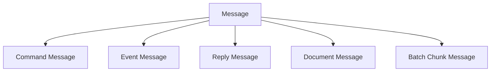

### 4.1 Command Message

Command message meminta receiver melakukan aksi.

```json
{
  "messageType": "GenerateNotice",
  "commandId": "cmd-123",
  "payload": {
    "caseId": "CASE-001",
    "noticeTemplate": "VIOLATION_NOTICE"
  }
}
```

Receiver boleh menerima atau menolak.

### 4.2 Event Message

Event message memberitahu fakta yang sudah terjadi.

```json
{
  "messageType": "NoticeIssued",
  "eventId": "evt-123",
  "payload": {
    "caseId": "CASE-001",
    "noticeId": "N-001"
  }
}
```

Consumer tidak boleh menganggap event sebagai permintaan agar fakta terjadi.

### 4.3 Reply Message

Reply message membawa hasil async.

```json
{
  "messageType": "NoticeGenerationCompleted",
  "correlationId": "cmd-123",
  "payload": {
    "noticeId": "N-001",
    "status": "GENERATED"
  }
}
```

---

## 5. Message Envelope Pattern

Seperti event, message production butuh envelope.

```json
{
  "messageId": "msg_01J2Z",
  "messageType": "GenerateNotice",
  "messageVersion": 1,
  "messageKind": "COMMAND",
  "source": "case-service",
  "destination": "notice-service",
  "tenantId": "tenant-a",
  "correlationId": "corr-777",
  "causationId": "evt-333",
  "traceId": "trace-999",
  "createdAt": "2026-06-27T10:00:00Z",
  "notBefore": "2026-06-27T10:05:00Z",
  "expiresAt": "2026-06-27T11:00:00Z",
  "priority": "NORMAL",
  "payload": {}
}
```

### 5.1 Envelope Field Reasoning

| Field | Fungsi |
|---|---|
| `messageId` | deduplication |
| `messageType` | dispatch |
| `messageVersion` | schema evolution |
| `messageKind` | command/event/reply/document |
| `source` | debugging dan authorization integration |
| `destination` | direct routing jika dibutuhkan |
| `tenantId` | isolation |
| `correlationId` | mengikat business flow |
| `causationId` | penyebab langsung |
| `traceId` | distributed tracing |
| `createdAt` | waktu message dibuat |
| `notBefore` | scheduled/deferred processing |
| `expiresAt` | message tidak valid setelah waktu tertentu |
| `priority` | scheduling hint, bukan invariant |

### 5.2 Java Record

```java
public record MessageEnvelope<T>(
        String messageId,
        String messageType,
        int messageVersion,
        MessageKind messageKind,
        String source,
        String destination,
        String tenantId,
        String correlationId,
        String causationId,
        String traceId,
        Instant createdAt,
        Instant notBefore,
        Instant expiresAt,
        Priority priority,
        T payload
) {
    public MessageEnvelope {
        Objects.requireNonNull(messageId);
        Objects.requireNonNull(messageType);
        Objects.requireNonNull(messageKind);
        Objects.requireNonNull(source);
        Objects.requireNonNull(createdAt);
        Objects.requireNonNull(payload);

        if (messageVersion < 1) {
            throw new IllegalArgumentException("messageVersion must be positive");
        }
    }
}

public enum MessageKind {
    COMMAND,
    EVENT,
    REPLY,
    DOCUMENT
}
```

---

## 6. Channel Pattern

Channel adalah jalur logical message.

Channel bisa berupa:

- queue;
- topic;
- exchange;
- stream;
- subscription;
- table-backed queue;
- file drop;
- webhook endpoint.

Yang penting bukan teknologi channel, tetapi semantic-nya.

### 6.1 Channel Naming

Buruk:

```text
data-topic
service-events
misc-queue
processor-input
```

Lebih baik:

```text
case.integration.events.v1
notice.commands.generate.v1
case.audit.journal.v1
payment.authorization.requests.v1
```

Naming channel harus membantu menjawab:

- siapa owner;
- message kind apa;
- domain apa;
- version contract apa;
- apakah public atau internal.

---

## 7. Point-to-Point Queue Pattern

Queue point-to-point berarti satu message diproses oleh satu consumer dari pool.

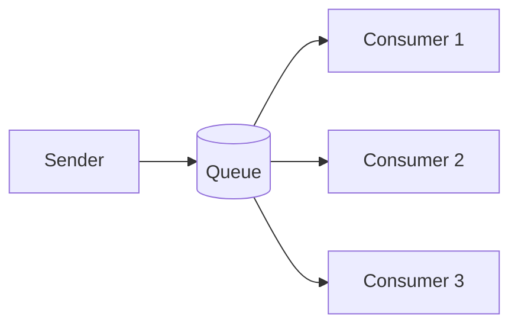

Cocok untuk command/work item:

- generate report;
- send email;
- resize image;
- process import chunk;
- calculate penalty;
- run validation job.

### 7.1 Java Interface

```java
public interface CommandQueue {
    void send(String queueName, String key, MessageEnvelope<?> message);
    void subscribe(String queueName, MessageHandler handler);
}
```

### 7.2 Queue Design Questions

| Pertanyaan | Dampak |
|---|---|
| Apakah message harus diproses tepat satu worker? | queue cocok |
| Apakah processing boleh parallel? | competing consumers |
| Apakah order penting? | perlu partition/key atau single consumer |
| Apakah command punya expiry? | gunakan `expiresAt` |
| Apakah command bisa retry? | desain idempotency |
| Apakah command menghasilkan reply? | request-reply pattern |

---

## 8. Publish-Subscribe Topic Pattern

Topic pub-sub berarti satu message bisa diterima banyak subscriber.

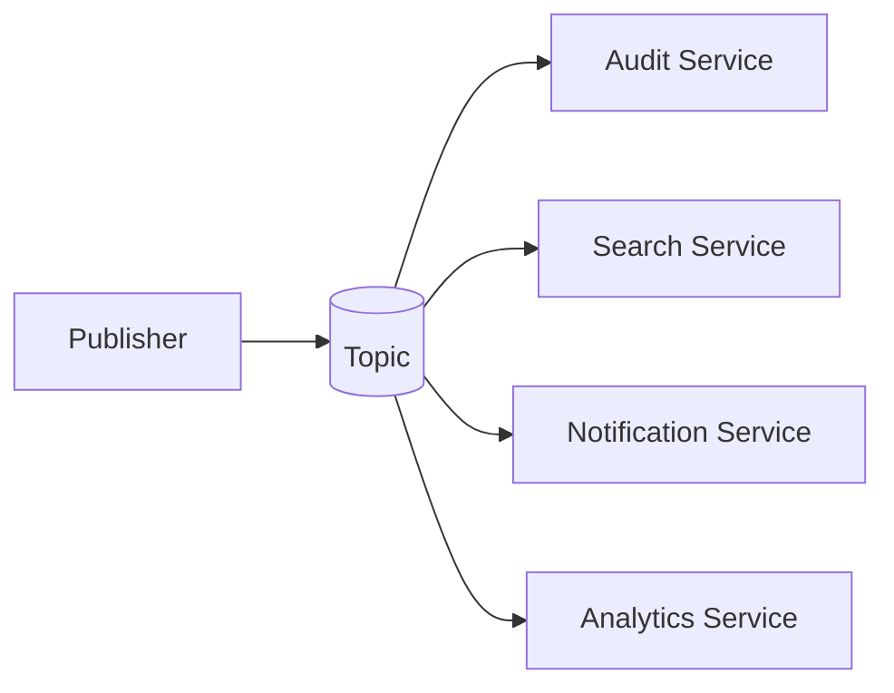

Cocok untuk event:

- `CaseOpened`;
- `PaymentCaptured`;
- `DocumentUploaded`;
- `UserSuspended`.

Publisher tidak perlu tahu semua subscriber.

### 8.1 Topic Risk

Pub-sub sering menciptakan hidden workflow.

Jika `CaseOpened` memicu 12 services dan salah satu service gagal, siapa owner business process?

Jika jawabannya tidak jelas, mungkin perlu process manager/orchestrator.

### 8.2 Subscriber Ownership

Setiap subscriber harus memiliki:

- consumer group/subscription name;
- retry policy;
- DLQ;
- idempotency strategy;
- lag metrics;
- schema compatibility test.

---

## 9. Request-Reply Pattern

Request-reply async mengirim request lewat message dan menerima reply lewat channel lain.

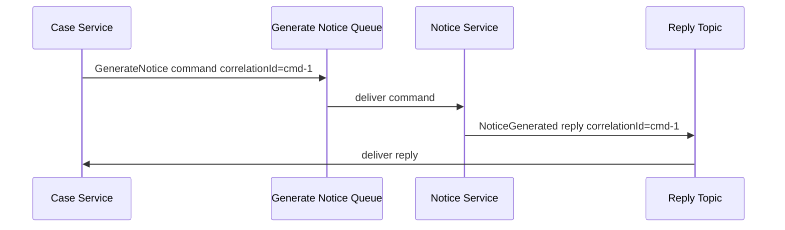

### 9.1 Use Case

Cocok untuk:

- pekerjaan lama;
- caller tidak ingin blocking thread;
- callee punya worker pool;
- hasil tetap dibutuhkan kemudian;
- workflow durable.

### 9.2 Java Model

```java
public record GenerateNoticeCommand(
        String caseId,
        String templateCode,
        String requestedBy
) {}

public record NoticeGeneratedReply(
        String commandId,
        String caseId,
        String noticeId,
        String status,
        String errorCode
) {}
```

### 9.3 Correlation Store

Caller perlu menyimpan pending request.

```sql
CREATE TABLE pending_request (
    command_id      VARCHAR(64) PRIMARY KEY,
    correlation_id  VARCHAR(64) NOT NULL,
    request_type    VARCHAR(100) NOT NULL,
    status          VARCHAR(30) NOT NULL,
    created_at      TIMESTAMP NOT NULL,
    expires_at      TIMESTAMP NOT NULL,
    completed_at    TIMESTAMP NULL,
    result_json      TEXT NULL
);
```

Handler reply:

```java
@Transactional
public void onReply(MessageEnvelope<NoticeGeneratedReply> reply) {
    PendingRequest request = pendingRequests.getRequired(reply.payload().commandId());

    if (request.isCompleted()) {
        return;
    }

    request.complete(reply.payload().noticeId(), clock.instant());
    pendingRequests.save(request);
}
```

### 9.4 Timeout

Async request-reply butuh timeout process.

```java
public void expireOldRequests() {
    List<PendingRequest> expired = pendingRequests.findExpired(clock.instant());

    for (PendingRequest request : expired) {
        request.markTimedOut(clock.instant());
        pendingRequests.save(request);
    }
}
```

Jangan menunggu reply selamanya.

---

## 10. Correlation Identifier Pattern

Correlation id mengikat beberapa message menjadi satu flow.

```text
CaseOpened evt-1 correlation=corr-100
GenerateNotice cmd-1 correlation=corr-100 causation=evt-1
NoticeGenerated reply-1 correlation=corr-100 causation=cmd-1
NoticeIssued evt-2 correlation=corr-100 causation=reply-1
```

Tanpa correlation id, observability menjadi fragmented.

### 10.1 Propagation Rule

- Jika message memulai flow baru, buat correlation id baru.
- Jika message dibuat sebagai reaksi terhadap message lain, salin correlation id.
- Set causation id ke id message penyebab langsung.

```java
public MessageEnvelope<GenerateNoticeCommand> createCommandFrom(EventEnvelope<CaseApproved> event) {
    return MessageEnvelope.command(
            idGenerator.newId(),
            "GenerateNotice",
            "case-service",
            "notice-service",
            event.tenantId(),
            event.correlationId(),
            event.eventId(),
            event.traceId(),
            clock.instant(),
            new GenerateNoticeCommand(event.payload().caseId(), "APPROVAL_NOTICE", event.actorId())
    );
}
```

---

## 11. Message Translator Pattern

Translator mengubah model satu boundary ke model boundary lain.

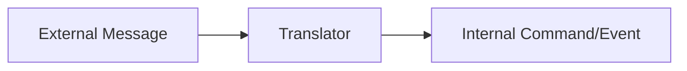

Contoh external payload:

```json
{
  "case_no": "CASE-001",
  "assignee": "john.doe@example.com",
  "assign_date": "27/06/2026 10:00"
}
```

Internal command:

```java
public record AssignCaseCommand(
        CaseId caseId,
        OfficerId assignedTo,
        Instant assignedAt,
        SourceSystem source
) {}
```

Translator:

```java
public final class ExternalAssignmentTranslator {
    private final OfficerDirectory directory;
    private final DateTimeFormatter formatter;

    public AssignCaseCommand translate(ExternalAssignmentMessage message) {
        return new AssignCaseCommand(
                new CaseId(message.caseNo()),
                directory.resolveOfficer(message.assigneeEmail()),
                LocalDateTime.parse(message.assignDate(), formatter)
                        .atZone(ZoneId.of("Asia/Jakarta"))
                        .toInstant(),
                SourceSystem.LEGACY_CASE_PORTAL
        );
    }
}
```

Translator adalah tempat yang tepat untuk:

- naming conversion;
- type conversion;
- timezone conversion;
- enum mapping;
- defaulting;
- backward compatibility;
- anti-corruption logic.

Jangan sebar mapping external model ke seluruh domain.

---

## 12. Content-Based Router Pattern

Router mengarahkan message berdasarkan isi.

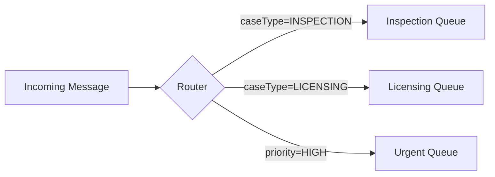

### 12.1 Java Router

```java
public final class CaseMessageRouter {
    public String route(MessageEnvelope<CaseSubmittedPayload> message) {
        CaseSubmittedPayload payload = message.payload();

        if (payload.priority() == Priority.HIGH) {
            return "case.urgent.commands.v1";
        }

        return switch (payload.caseType()) {
            case INSPECTION -> "case.inspection.commands.v1";
            case LICENSING -> "case.licensing.commands.v1";
            case COMPLAINT -> "case.complaint.commands.v1";
        };
    }
}
```

### 12.2 Router Smell

Router menjadi buruk jika:

- memiliki business logic berat;
- mengubah payload;
- menyimpan state kompleks;
- menjadi tempat semua exception;
- routing rule tidak bisa diuji;
- ownership rule tidak jelas.

Router sebaiknya memutuskan channel, bukan menjalankan proses bisnis.

---

## 13. Recipient List Pattern

Recipient list menentukan beberapa penerima untuk satu message.

Contoh:

```java
public final class NoticeIssuedRecipients {
    public List<String> recipients(EventEnvelope<NoticeIssuedPayload> event) {
        List<String> result = new ArrayList<>();

        result.add("audit.notice-events.v1");
        result.add("search.notice-events.v1");

        if (event.payload().deliveryMethod().equals("EMAIL")) {
            result.add("notification.email-events.v1");
        }

        if (event.payload().requiresSupervisorCopy()) {
            result.add("supervisor.notice-events.v1");
        }

        return result;
    }
}
```

Recipient list cocok jika routing penerima eksplisit dan bisa diuji.

Jika semua subscriber memang independen, broker pub-sub topic sering lebih sederhana.

---

## 14. Splitter Pattern

Splitter memecah message besar menjadi beberapa message kecil.

Contoh import file:

```text
ImportFileSubmitted
  -> ImportChunkRequested(chunk=1)
  -> ImportChunkRequested(chunk=2)
  -> ImportChunkRequested(chunk=3)
```

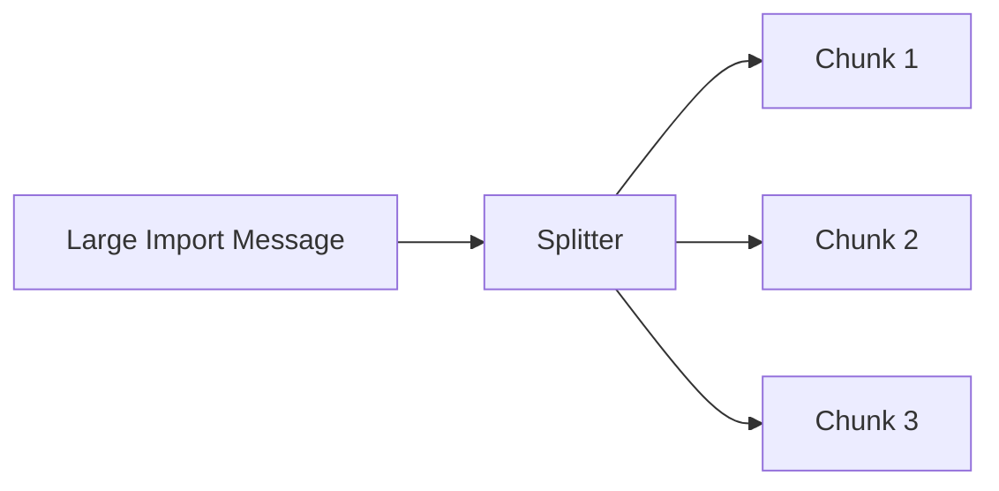

### 14.1 Java Splitter

```java
public final class ImportSplitter {
    public List<MessageEnvelope<ImportChunkCommand>> split(
            MessageEnvelope<ImportFileSubmittedPayload> message,
            int chunkSize
    ) {
        ImportFileSubmittedPayload payload = message.payload();
        int totalChunks = (int) Math.ceil((double) payload.totalRows() / chunkSize);

        List<MessageEnvelope<ImportChunkCommand>> chunks = new ArrayList<>();

        for (int i = 0; i < totalChunks; i++) {
            ImportChunkCommand command = new ImportChunkCommand(
                    payload.importId(),
                    i,
                    totalChunks,
                    i * chunkSize,
                    chunkSize
            );

            chunks.add(MessageEnvelope.command(
                    payload.importId() + "-chunk-" + i,
                    "ProcessImportChunk",
                    message.source(),
                    "import-worker",
                    message.tenantId(),
                    message.correlationId(),
                    message.messageId(),
                    message.traceId(),
                    Instant.now(),
                    command
            ));
        }

        return chunks;
    }
}
```

### 14.2 Splitter Requirements

- setiap chunk punya identity stabil;
- jumlah total chunk diketahui jika akan di-aggregate;
- chunk processing idempotent;
- chunk order tidak diasumsikan kecuali perlu;
- progress bisa dihitung;
- partial failure bisa diretry.

---

## 15. Aggregator Pattern

Aggregator menggabungkan beberapa message menjadi satu hasil.

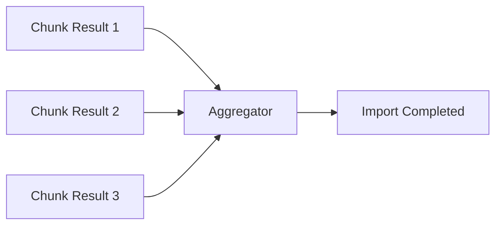

### 15.1 Aggregation Table

```sql
CREATE TABLE import_aggregation (
    import_id       VARCHAR(64) PRIMARY KEY,
    total_chunks    INTEGER NOT NULL,
    completed_chunks INTEGER NOT NULL,
    failed_chunks   INTEGER NOT NULL,
    status          VARCHAR(30) NOT NULL,
    created_at      TIMESTAMP NOT NULL,
    updated_at      TIMESTAMP NOT NULL
);

CREATE TABLE import_chunk_result (
    import_id       VARCHAR(64) NOT NULL,
    chunk_index     INTEGER NOT NULL,
    status          VARCHAR(30) NOT NULL,
    row_count       INTEGER NOT NULL,
    error_count     INTEGER NOT NULL,
    processed_at    TIMESTAMP NOT NULL,
    PRIMARY KEY (import_id, chunk_index)
);
```

### 15.2 Aggregator Handler

```java
@Transactional
public void onChunkCompleted(MessageEnvelope<ImportChunkCompleted> message) {
    ImportChunkCompleted payload = message.payload();

    boolean inserted = chunkResults.tryInsert(
            payload.importId(),
            payload.chunkIndex(),
            payload.status(),
            payload.rowCount(),
            payload.errorCount(),
            message.createdAt()
    );

    if (!inserted) {
        return; // duplicate chunk result
    }

    ImportAggregation aggregation = aggregations.getRequired(payload.importId());
    aggregation.recordChunk(payload.status());

    if (aggregation.isComplete()) {
        aggregation.markCompleted(clock.instant());
        outbox.append(ImportCompletedEvent.from(aggregation));
    }

    aggregations.save(aggregation);
}
```

### 15.3 Aggregator Completion Conditions

Aggregator harus punya completion rule.

| Rule | Contoh |
|---|---|
| Count-based | selesai jika 10 dari 10 chunk selesai |
| Timeout-based | selesai parsial setelah 30 menit |
| Quorum-based | selesai jika 3 dari 5 provider membalas |
| Predicate-based | selesai jika ada satu approval dan tidak ada rejection |
| Manual | operator menutup aggregation |

Tanpa completion rule, aggregator bisa menunggu selamanya.

---

## 16. Resequencer Pattern

Resequencer menyusun message yang datang out-of-order.

```text
Arrived: version 1, 3, 2
Apply:   version 1, 2, 3
```

### 16.1 Consumer Version Gate

```java
@Transactional
public void onCaseEvent(EventEnvelope<?> event) {
    ProjectionState state = states.get(event.aggregateId());

    long expected = state.lastVersion() + 1;

    if (event.aggregateVersion() < expected) {
        return;
    }

    if (event.aggregateVersion() > expected) {
        pendingEvents.store(event);
        return;
    }

    apply(event);
    state.advanceTo(event.aggregateVersion());

    applyPendingInOrder(state);
}
```

### 16.2 Pending Event Table

```sql
CREATE TABLE pending_ordered_event (
    aggregate_id       VARCHAR(100) NOT NULL,
    aggregate_version  BIGINT NOT NULL,
    event_id           VARCHAR(64) NOT NULL,
    payload_json       TEXT NOT NULL,
    received_at        TIMESTAMP NOT NULL,
    PRIMARY KEY (aggregate_id, aggregate_version)
);
```

### 16.3 Resequencer Risk

- memory/storage growth jika missing event tidak pernah datang;
- head-of-line blocking per aggregate;
- complexity meningkat;
- replay lebih sulit.

Sebelum menggunakan resequencer, pastikan order memang invariant, bukan preferensi.

---

## 17. Competing Consumers Pattern

Competing consumers adalah banyak worker membaca dari queue yang sama.

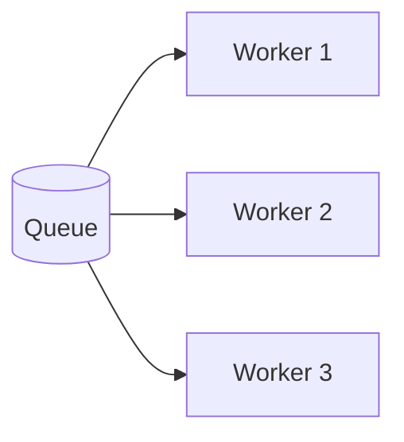

Cocok untuk meningkatkan throughput.

### 17.1 Safe Use

Aman jika:

- message independen;
- handler idempotent;
- order tidak penting;
- shared resource tidak menjadi bottleneck;
- consumer bisa diskalakan horizontal;
- retry tidak membuat duplicate side effect.

### 17.2 Unsafe Use

Berbahaya jika:

- dua message untuk aggregate sama diproses paralel dan order penting;
- handler update counter tanpa lock/idempotency;
- external API rate limit rendah;
- database row contention tinggi;
- message poison terus diambil worker.

### 17.3 Partitioned Competing Consumer

Jika order per key penting, partition by key.

```text
partition(caseId) -> one consumer owns partition at a time
```

Ini menjaga order per key sambil tetap parallel antar key.

---

## 18. Idempotent Receiver Pattern

Receiver harus aman menerima duplicate.

### 18.1 Dedup by Message ID

```java
@Transactional
public void handle(MessageEnvelope<GenerateNoticeCommand> message) {
    if (!inbox.tryStart("notice-service", message.messageId())) {
        return;
    }

    noticeGenerator.generate(message.payload());
    inbox.markProcessed("notice-service", message.messageId());
}
```

### 18.2 Dedup by Business Key

Untuk command, message id saja kadang kurang.

Jika caller retry dengan message id baru tetapi command semantic sama, receiver bisa tetap duplikat.

Gunakan idempotency key.

```json
{
  "messageId": "msg-002",
  "idempotencyKey": "generate-notice:CASE-001:VIOLATION_NOTICE",
  "messageType": "GenerateNotice"
}
```

Database:

```sql
CREATE TABLE idempotency_record (
    consumer_name    VARCHAR(100) NOT NULL,
    idempotency_key  VARCHAR(200) NOT NULL,
    message_id       VARCHAR(64) NOT NULL,
    status           VARCHAR(30) NOT NULL,
    result_json      TEXT NULL,
    created_at       TIMESTAMP NOT NULL,
    updated_at       TIMESTAMP NOT NULL,
    PRIMARY KEY (consumer_name, idempotency_key)
);
```

Jika command sama diproses ulang, receiver bisa mengembalikan hasil lama.

---

## 19. Retry Pattern

Retry adalah pattern paling sering disalahgunakan.

Retry hanya masuk akal untuk failure yang transient.

### 19.1 Error Classification

| Error | Retry? | Contoh |
|---|---:|---|
| Transient network timeout | Ya | broker timeout, HTTP 503 |
| Rate limited | Ya, dengan backoff | HTTP 429 |
| Validation error | Tidak | missing required field |
| Authorization error | Tidak biasanya | forbidden tenant |
| Unknown dependency state | Mungkin | dependency sedang deploy |
| Optimistic lock conflict | Ya, terbatas | concurrent update |
| Poison payload | Tidak | schema invalid |

### 19.2 Exponential Backoff

```java
public Duration nextDelay(int attempt) {
    long seconds = Math.min(300, (long) Math.pow(2, attempt));
    long jitter = ThreadLocalRandom.current().nextLong(0, 1000);
    return Duration.ofSeconds(seconds).plusMillis(jitter);
}
```

### 19.3 Retry Budget

Retry tanpa batas bisa menghancurkan downstream.

Gunakan:

- max attempts;
- max elapsed time;
- retry budget per dependency;
- circuit breaker untuk external calls;
- DLQ setelah gagal permanen;
- operational alert.

---

## 20. Dead Letter Channel Pattern

Dead letter channel menyimpan message yang tidak bisa atau tidak boleh diproses setelah retry policy.

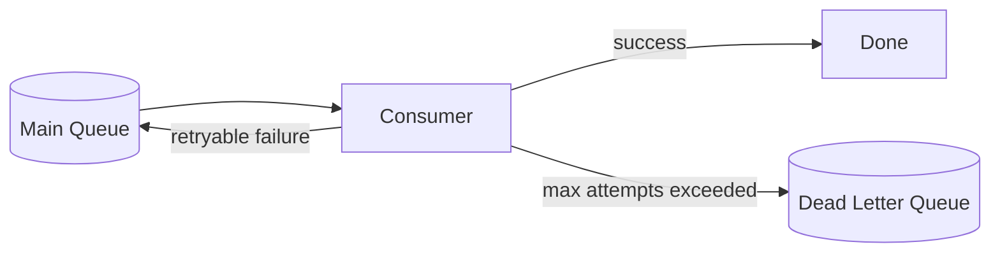

### 20.1 DLQ Payload

DLQ jangan hanya menyimpan original payload.

Simpan:

- original message;
- error type;
- error message;
- stack summary;
- attempt count;
- first failed at;
- last failed at;
- consumer name;
- dependency name jika ada;
- correlation id;
- tenant id;
- operator notes;
- replay status.

### 20.2 DLQ Table Example

```sql
CREATE TABLE dead_letter_message (
    id              VARCHAR(64) PRIMARY KEY,
    original_message_id VARCHAR(64) NOT NULL,
    message_type    VARCHAR(100) NOT NULL,
    consumer_name   VARCHAR(100) NOT NULL,
    payload_json    TEXT NOT NULL,
    metadata_json   TEXT NOT NULL,
    error_class     VARCHAR(300) NOT NULL,
    error_message   TEXT NOT NULL,
    attempt_count   INTEGER NOT NULL,
    first_failed_at TIMESTAMP NOT NULL,
    last_failed_at  TIMESTAMP NOT NULL,
    status          VARCHAR(30) NOT NULL
);
```

### 20.3 DLQ Operational Flow

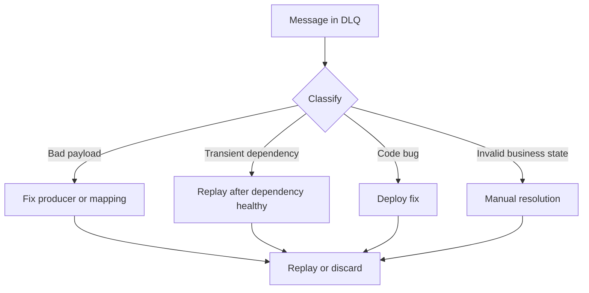

DLQ bukan tempat sampah. DLQ adalah work queue untuk recovery.

---

## 21. Poison Message Pattern

Poison message adalah message yang selalu membuat consumer gagal.

Contoh:

- payload invalid;
- enum unknown;
- tenant missing;
- referenced entity tidak pernah ada;
- handler bug untuk data tertentu;
- external API selalu reject.

Jika tidak ditangani, poison message bisa menyebabkan:

- retry storm;
- queue stuck;
- consumer starvation;
- log flood;
- cost spike;
- downstream overload.

### 21.1 Poison Guard

```java
try {
    handler.handle(message);
} catch (ValidationException e) {
    deadLetter.publish(message, e, DeadLetterReason.INVALID_PAYLOAD);
} catch (TransientDependencyException e) {
    retryScheduler.retryLater(message, e);
} catch (Exception e) {
    retryOrDeadLetter(message, e);
}
```

Error classification harus eksplisit.

---

## 22. Invalid Message Channel

Invalid message channel berbeda dari DLQ.

- DLQ: message valid tapi gagal diproses setelah retry atau error runtime.
- Invalid message channel: message tidak memenuhi contract sejak awal.

Contoh invalid:

```json
{
  "messageType": "CaseAssigned",
  "payload": {
    "caseId": null
  }
}
```

Message invalid sebaiknya tidak diretry berkali-kali.

---

## 23. Message Expiration Pattern

Beberapa message punya masa berlaku.

Contoh:

- send OTP;
- reserve slot;
- temporary approval;
- price quote;
- stale notification;
- generate preview.

Envelope:

```json
{
  "messageType": "ReserveInspectionSlot",
  "expiresAt": "2026-06-27T10:30:00Z"
}
```

Consumer:

```java
if (message.expiresAt() != null && clock.instant().isAfter(message.expiresAt())) {
    expiredMessageRepository.record(message);
    return;
}
```

Jangan memproses message stale yang secara bisnis sudah tidak valid.

---

## 24. Scheduled / Delayed Message Pattern

Message kadang harus diproses nanti.

Contoh:

- reminder 3 hari sebelum SLA;
- retry setelah backoff;
- follow-up after no response;
- delayed compensation.

Jika broker mendukung delayed message, gunakan fasilitas broker. Jika tidak, gunakan table-backed scheduler.

```sql
CREATE TABLE scheduled_message (
    id              VARCHAR(64) PRIMARY KEY,
    destination     VARCHAR(200) NOT NULL,
    payload_json    TEXT NOT NULL,
    scheduled_at    TIMESTAMP NOT NULL,
    status          VARCHAR(30) NOT NULL,
    created_at      TIMESTAMP NOT NULL
);
```

Scheduler poll:

```java
public void publishDueMessages() {
    List<ScheduledMessage> due = repository.claimDue(clock.instant(), 100);

    for (ScheduledMessage message : due) {
        broker.publish(message.destination(), message.key(), message.envelope());
        repository.markPublished(message.id(), clock.instant());
    }
}
```

---

## 25. Backpressure Pattern

Messaging bisa menyembunyikan overload. Queue yang tumbuh adalah sinyal backpressure.

### 25.1 Backpressure Signals

- queue depth naik;
- consumer lag naik;
- processing latency naik;
- retry count naik;
- DLQ rate naik;
- broker disk usage naik;
- producer publish latency naik.

### 25.2 Response Options

| Kondisi | Respons |
|---|---|
| Consumer CPU-bound | tambah consumer/partition |
| DB bottleneck | batching, index, reduce contention |
| Downstream rate limit | throttle consumer |
| Poison message | DLQ cepat |
| Burst sementara | buffer acceptable |
| Sustained overload | load shedding / capacity planning |

### 25.3 Consumer Throttling

```java
public final class RateLimitedConsumer {
    private final RateLimiter limiter;
    private final MessageHandler handler;

    public void onMessage(MessageEnvelope<?> message) {
        if (!limiter.tryAcquire()) {
            throw new RetryLaterException("consumer throttled");
        }

        handler.handle(message);
    }
}
```

Rate limiter dapat mencegah consumer menghancurkan dependency.

---

## 26. Broker Delivery Semantics

### 26.1 At-Most-Once

Message diproses nol atau satu kali. Bisa hilang.

Cocok untuk:

- telemetry non-critical;
- best-effort notification;
- metrics sample.

### 26.2 At-Least-Once

Message tidak hilang jika sistem bekerja sesuai guarantee, tetapi bisa duplicate.

Cocok untuk banyak business integration, dengan syarat consumer idempotent.

### 26.3 Exactly-Once: Hati-Hati

"Exactly-once" biasanya memiliki scope spesifik pada broker/stream processing tertentu, bukan jaminan magical bahwa side effect eksternal hanya terjadi sekali di seluruh dunia.

Jika consumer menulis ke database, mengirim email, memanggil payment gateway, atau membuat file, idempotency tetap diperlukan.

Mental model aman:

> Treat delivery as at-least-once unless you can prove the entire input-processing-output transaction boundary.

---

## 27. Offset / Acknowledgement Pattern

Consumer biasanya harus ack/commit setelah processing sukses.

### 27.1 Ack Before Processing

```text
receive -> ack -> process -> crash
```

Risiko: message hilang secara semantic.

### 27.2 Ack After Processing

```text
receive -> process -> ack -> crash before ack
```

Risiko: duplicate processing.

Karena duplicate lebih mudah dikendalikan dengan idempotency daripada lost message, business-critical consumer biasanya ack setelah commit lokal berhasil.

### 27.3 Transactional Handler Shape

```java
public void pollLoop() {
    while (running) {
        MessageEnvelope<?> message = broker.receive();

        try {
            transactionTemplate.executeWithoutResult(tx -> handler.handle(message));
            broker.ack(message);
        } catch (RetryableException e) {
            broker.nackRetry(message);
        } catch (NonRetryableException e) {
            broker.deadLetter(message, e);
            broker.ack(message);
        }
    }
}
```

---

## 28. Java Messaging Options: Conceptual Map

Java ecosystem punya beberapa gaya messaging.

| Option | Cocok Untuk | Catatan |
|---|---|---|
| Jakarta Messaging/JMS | enterprise queue/topic dengan API standar | sering di app server/enterprise broker |
| Kafka client | event log, stream, high throughput | partition/order/offset semantics penting |
| RabbitMQ client | queue routing, exchange, work queue | flexible routing |
| Spring messaging abstractions | productivity | jangan sembunyikan semantic broker |
| Java Flow API | in-process reactive stream abstraction | bukan broker durable |
| Database-backed queue | low dependency, transactional simplicity | throughput terbatas, perlu cleanup |

Poin penting: framework tidak menghapus kebutuhan memahami delivery, ordering, idempotency, dan recovery.

---

## 29. Jakarta Messaging/JMS Shape

Jakarta Messaging menyediakan API umum untuk Java programs membuat, mengirim, menerima, dan membaca message dari enterprise messaging system.

Contoh conceptual code:

```java
public final class JmsNoticeCommandSender {
    private final ConnectionFactory connectionFactory;
    private final Queue queue;
    private final ObjectMapper objectMapper;

    public void send(MessageEnvelope<GenerateNoticeCommand> envelope) throws JMSException, JsonProcessingException {
        try (JMSContext context = connectionFactory.createContext()) {
            String json = objectMapper.writeValueAsString(envelope);
            TextMessage message = context.createTextMessage(json);

            message.setStringProperty("messageType", envelope.messageType());
            message.setStringProperty("correlationId", envelope.correlationId());
            message.setStringProperty("tenantId", envelope.tenantId());

            context.createProducer().send(queue, message);
        }
    }
}
```

Production note:

- jangan taruh semua metadata hanya di payload jika broker filter/routing butuh header;
- jangan taruh data sensitif di header jika broker/log mengekspose header;
- pastikan transaction boundary jelas;
- pahami acknowledgement mode.

---

## 30. Kafka-Like Stream Shape

Kafka-like stream lebih dekat ke distributed append-only log dengan topic partition.

Conceptual producer:

```java
public final class KafkaEventPublisher {
    private final KafkaProducer<String, String> producer;
    private final ObjectMapper objectMapper;

    public void publish(EventEnvelope<?> event) throws JsonProcessingException {
        String key = event.aggregateId();
        String value = objectMapper.writeValueAsString(event);

        ProducerRecord<String, String> record = new ProducerRecord<>(
                "case.integration.events.v1",
                key,
                value
        );

        record.headers().add("eventType", event.eventType().getBytes(StandardCharsets.UTF_8));
        record.headers().add("correlationId", event.correlationId().getBytes(StandardCharsets.UTF_8));

        producer.send(record);
    }
}
```

Consumer harus memahami:

- consumer group;
- partition assignment;
- offset commit;
- rebalance;
- per-partition ordering;
- poison record handling;
- replay from offset;
- schema compatibility.

---

## 31. Database-Backed Queue Pattern

Tidak semua sistem perlu broker eksternal untuk semua use case.

Table-backed queue cocok jika:

- volume rendah/sedang;
- transactional coupling dengan DB penting;
- operational simplicity lebih penting dari throughput;
- team belum siap mengoperasikan broker;
- job bersifat internal.

Schema:

```sql
CREATE TABLE job_queue (
    id              VARCHAR(64) PRIMARY KEY,
    job_type        VARCHAR(100) NOT NULL,
    payload_json    TEXT NOT NULL,
    status          VARCHAR(30) NOT NULL,
    priority        INTEGER NOT NULL,
    run_after       TIMESTAMP NOT NULL,
    attempt_count   INTEGER NOT NULL,
    locked_by       VARCHAR(100) NULL,
    locked_until    TIMESTAMP NULL,
    created_at      TIMESTAMP NOT NULL,
    updated_at      TIMESTAMP NOT NULL
);
```

Claim:

```sql
SELECT *
FROM job_queue
WHERE status = 'PENDING'
  AND run_after <= now()
ORDER BY priority DESC, created_at ASC
LIMIT 50
FOR UPDATE SKIP LOCKED;
```

Trade-off:

| Kelebihan | Kekurangan |
|---|---|
| transactionally simple | throughput terbatas |
| easy debugging with SQL | DB load meningkat |
| no broker dependency | routing terbatas |
| easy local development | fan-out perlu custom |

---

## 32. Integration Boundary Pattern

Messaging sering menjadi boundary antar system. Jangan biarkan internal domain model bocor langsung.

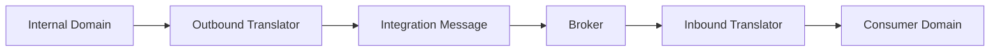

### 32.1 Anti-Corruption Layer

Inbound integration harus melindungi domain.

```java
public final class LegacyCaseMessageHandler {
    private final LegacyCaseTranslator translator;
    private final CaseApplicationService applicationService;

    public void handle(MessageEnvelope<LegacyCasePayload> message) {
        SubmitCaseCommand command = translator.toCommand(message.payload());
        applicationService.submit(command);
    }
}
```

Domain tidak perlu tahu format legacy.

### 32.2 Canonical Model Caution

Enterprise sering membuat canonical message model untuk semua system.

Kelebihan:

- konsistensi;
- lebih mudah integrasi banyak system;
- governance jelas.

Bahaya:

- canonical model menjadi god model;
- semua perubahan butuh committee;
- domain kehilangan language sendiri;
- model terlalu generic;
- delivery velocity turun.

Gunakan canonical model untuk stable shared concepts, bukan semua detail domain.

---

## 33. Security Patterns in Messaging

Messaging security sering terlupakan karena tidak ada HTTP request langsung.

Pertimbangkan:

- producer authorization;
- consumer authorization;
- tenant isolation;
- encryption at rest;
- encryption in transit;
- PII minimization;
- message retention;
- header leakage;
- replay authorization;
- DLQ access control.

### 33.1 Tenant Guard

```java
public void handle(MessageEnvelope<?> message) {
    if (!tenantAccessPolicy.canConsume(message.tenantId(), consumerName)) {
        throw new SecurityException("consumer not allowed for tenant " + message.tenantId());
    }

    handler.handle(message);
}
```

### 33.2 PII in Events

Jangan mengirim semua PII hanya karena consumer mungkin butuh.

Gunakan:

- reference id;
- tokenized value;
- encrypted payload;
- separate secure lookup;
- data classification;
- retention policy.

---

## 34. Observability Pattern

Messaging observability harus menjawab:

1. message ada di mana sekarang?
2. siapa yang memproses?
3. berapa lama lag?
4. gagal karena apa?
5. apakah duplicate terjadi?
6. apakah retry storm terjadi?
7. correlation flow lengkapnya apa?

### 34.1 Metrics

| Metric | Makna |
|---|---|
| publish rate | throughput producer |
| consume rate | throughput consumer |
| queue depth | backlog queue |
| consumer lag | ketertinggalan stream consumer |
| processing latency | waktu handler |
| end-to-end latency | created sampai processed |
| retry count | transient failure pressure |
| DLQ count | unrecovered failure |
| duplicate count | idempotency activity |
| expired message count | stale work |

### 34.2 Structured Log

```java
log.info("message_processed messageId={} messageType={} consumer={} correlationId={} latencyMs={}",
        message.messageId(),
        message.messageType(),
        consumerName,
        message.correlationId(),
        latencyMs);
```

### 34.3 Trace Propagation

Propagate trace context melalui message headers jika stack observability mendukung.

Jika tidak, minimal `traceId` dan `correlationId` harus ada.

---

## 35. Testing Messaging Patterns

### 35.1 Handler Unit Test

```java
@Test
void shouldIgnoreDuplicateMessage() {
    MessageEnvelope<GenerateNoticeCommand> message = fixtures.generateNotice();

    inbox.markProcessed("notice-service", message.messageId());

    handler.handle(message);

    verifyNoInteractions(noticeGenerator);
}
```

### 35.2 Contract Test

Pastikan payload producer bisa dibaca consumer.

```java
@Test
void generateNoticeCommandV1Contract() throws Exception {
    JsonNode root = objectMapper.readTree(fixture("generate-notice-v1.json"));

    assertThat(root.get("messageType").asText()).isEqualTo("GenerateNotice");
    assertThat(root.get("messageVersion").asInt()).isEqualTo(1);
    assertThat(root.get("payload").get("caseId").asText()).isNotBlank();
}
```

### 35.3 Integration Test

Test dengan broker nyata atau testcontainer jika memungkinkan:

- publish message;
- consumer receive;
- handler commit;
- ack;
- duplicate retry;
- DLQ path.

### 35.4 Failure Test

Simulasikan:

- handler throw transient exception;
- handler throw validation exception;
- broker unavailable;
- DB commit succeeds but ack fails;
- duplicate delivery;
- out-of-order delivery;
- poison message.

---

## 36. Messaging Anti-Patterns

### 36.1 Broker as Magic Reliability Box

Menganggap broker menyelesaikan semua masalah reliability.

Fakta: broker hanya satu bagian. Anda tetap butuh idempotency, transaction boundary, retry classification, DLQ recovery, dan observability.

### 36.2 Queue as Database

Menyimpan business state di queue terlalu lama tanpa source of truth.

Queue bukan pengganti database domain.

### 36.3 Infinite Retry

Retry tanpa batas membuat failure lebih mahal dan bisa menjatuhkan dependency.

### 36.4 No Dead Letter Strategy

Message gagal hilang di log atau terus retry selamanya.

### 36.5 All Events One Topic

Semua event dari semua domain masuk satu topic tanpa taxonomy.

Akibat:

- consumer filter terlalu banyak;
- schema governance kacau;
- retention tidak sesuai;
- access control sulit;
- replay mahal.

### 36.6 One Queue per Consumer per Use Case Without Governance

Kebalikannya: terlalu banyak queue tanpa naming, ownership, atau lifecycle.

Akibat:

- operasional kacau;
- monitoring sulit;
- dead queue terlupakan;
- cost naik.

### 36.7 Hidden Synchronous Dependency

Consumer memproses message lalu call 5 synchronous services. Queue hanya memindahkan bottleneck.

### 36.8 Ignoring Message Size

Mengirim payload besar seperti file binary lewat broker padahal lebih baik simpan di object storage dan kirim reference.

### 36.9 No Idempotency Key for Commands

Command retry membuat side effect ganda karena receiver hanya dedup message id, bukan business key.

### 36.10 Manual Replay Without Guard

Operator replay DLQ dan tanpa sengaja mengirim email/payment lagi.

---

## 37. Decision Framework

Gunakan pertanyaan ini untuk memilih pattern.

### 37.1 Sync vs Async

| Pertanyaan | Jika Ya | Pattern |
|---|---|---|
| Caller butuh jawaban segera? | Ya | synchronous API |
| Work bisa selesai nanti? | Ya | queue command |
| Banyak consumer perlu tahu fakta? | Ya | pub-sub event |
| Hasil async tetap dibutuhkan? | Ya | request-reply |
| Work besar bisa dipecah? | Ya | splitter/aggregator |
| Order per entity penting? | Ya | partition key/resequencer |
| Consumer bisa duplicate? | Ya | idempotent receiver |
| Failure bisa transient? | Ya | retry/backoff |
| Failure bisa permanen? | Ya | DLQ/invalid channel |

### 37.2 Queue vs Topic

Gunakan queue jika:

- satu message harus dikerjakan satu worker;
- message adalah command/work item;
- worker pool scaling penting.

Gunakan topic jika:

- message adalah event/fact;
- banyak subscriber independen;
- publisher tidak perlu tahu penerima.

Gunakan request-reply jika:

- command async tetapi hasil dibutuhkan;
- caller bisa menunggu secara durable;
- timeout dan correlation dikelola.

---

## 38. Production Checklist

### 38.1 Contract

- [ ] Message type jelas.
- [ ] Message kind jelas: command/event/reply/document.
- [ ] Versioning ada.
- [ ] Envelope konsisten.
- [ ] Payload tidak membocorkan internal model berlebihan.
- [ ] Schema compatibility diuji.

### 38.2 Reliability

- [ ] Producer failure mode jelas.
- [ ] Consumer idempotent.
- [ ] Ack setelah commit lokal.
- [ ] Retry policy berdasarkan error classification.
- [ ] DLQ tersedia.
- [ ] Poison message tidak membuat queue stuck.
- [ ] Replay aman.

### 38.3 Scaling

- [ ] Partition/key strategy jelas.
- [ ] Competing consumers aman.
- [ ] Hot key dianalisis.
- [ ] Consumer lag dimonitor.
- [ ] Backpressure response tersedia.

### 38.4 Operations

- [ ] Queue depth/lag metric ada.
- [ ] Processing latency metric ada.
- [ ] DLQ dashboard ada.
- [ ] Correlation id propagated.
- [ ] Message bisa ditemukan by id/correlation/tenant.
- [ ] Manual recovery process terdokumentasi.

### 38.5 Security

- [ ] Tenant isolation jelas.
- [ ] Producer/consumer authorization jelas.
- [ ] PII minimization dilakukan.
- [ ] Retention policy sesuai regulasi.
- [ ] DLQ access restricted.

---

## 39. Practice Drill

### Drill 1: Choose Pattern

Untuk setiap skenario, pilih pattern:

1. Kirim email welcome.
2. Banyak service perlu tahu `CaseClosed`.
3. Generate notice butuh hasil PDF id nanti.
4. Import 1 juta row CSV.
5. Consumer menerima event version 3 sebelum version 2.
6. Payload invalid karena required field kosong.
7. External API timeout 503.
8. Message selalu gagal karena enum unknown.

Jawaban contoh:

1. queue command;
2. pub-sub topic;
3. request-reply;
4. splitter + competing consumers + aggregator;
5. resequencer/version gate;
6. invalid message channel;
7. retry with backoff;
8. DLQ atau invalid channel tergantung root cause.

### Drill 2: Design Envelope

Buat envelope untuk command:

```text
GeneratePenaltyNotice
```

Wajib ada:

- message id;
- idempotency key;
- message type;
- version;
- source;
- destination;
- tenant id;
- correlation id;
- causation id;
- createdAt;
- expiresAt;
- payload.

### Drill 3: Retry Classification

Klasifikasikan error:

```text
HTTP 503
HTTP 400 invalid payload
DB deadlock
Unknown enum value
Optimistic lock conflict
Tenant not authorized
Broker timeout
```

### Drill 4: DLQ Recovery

Desain flow operator untuk replay DLQ setelah bug deserializer diperbaiki.

---

## 40. Mini Case Study: Notice Generation Pipeline

Skenario regulatory case management:

1. Case approved.
2. Notice harus dibuat.
3. PDF generation bisa memakan waktu.
4. Setelah generated, notice harus dikirim.
5. Jika gagal, operator harus bisa replay.

### 40.1 Pattern Composition

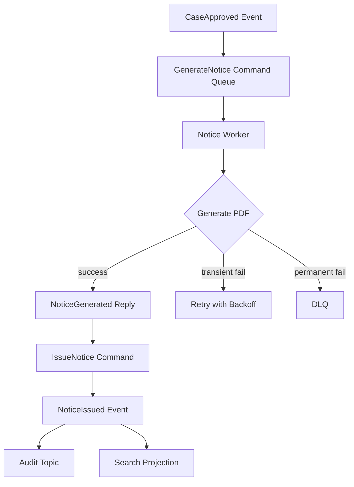

### 40.2 Design Notes

- `GenerateNotice` adalah command, bukan event.
- `NoticeGenerated` adalah reply/event-like result.
- `NoticeIssued` adalah domain/integration event.
- PDF generation command butuh idempotency key: `notice:{caseId}:{template}:{version}`.
- Worker harus menyimpan generated PDF reference, bukan mengirim binary besar lewat broker.
- DLQ harus menyimpan template id, case id, error, attempt count, dan correlation id.
- Replay tidak boleh membuat duplicate notice jika notice sudah ada.

---

## 41. Ringkasan

Messaging pattern matang berdiri di atas prinsip berikut:

1. message adalah container komunikasi, bukan selalu event;
2. queue cocok untuk command/work item satu consumer;
3. topic cocok untuk event/fact banyak subscriber;
4. request-reply cocok untuk hasil async yang tetap dibutuhkan;
5. envelope membuat message bisa dioperasikan;
6. correlation id dan causation id wajib untuk distributed debugging;
7. splitter dan aggregator harus punya identity, completion rule, dan idempotency;
8. competing consumers meningkatkan throughput tetapi bisa merusak ordering;
9. retry harus berdasarkan error classification dan budget;
10. DLQ adalah recovery workflow, bukan tempat sampah;
11. exactly-once harus dipahami berdasarkan scope, bukan sebagai jaminan universal;
12. broker tidak menggantikan desain boundary, transaction, security, dan observability.

Part berikutnya akan masuk ke pipeline patterns: stage, filter, transformer, router, splitter, aggregator, bounded queue, backpressure, dan bagaimana membangun pipeline Java yang bisa diuji, diukur, dan dioperasikan.
