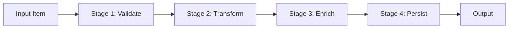
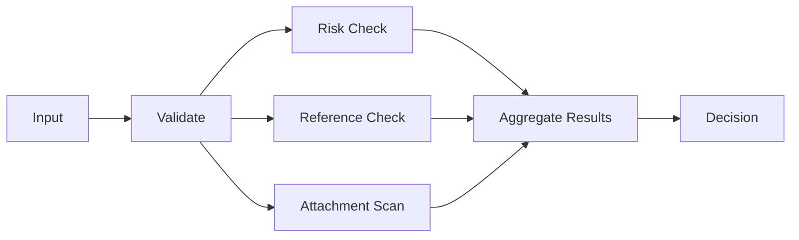
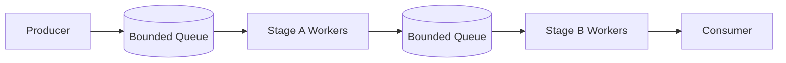
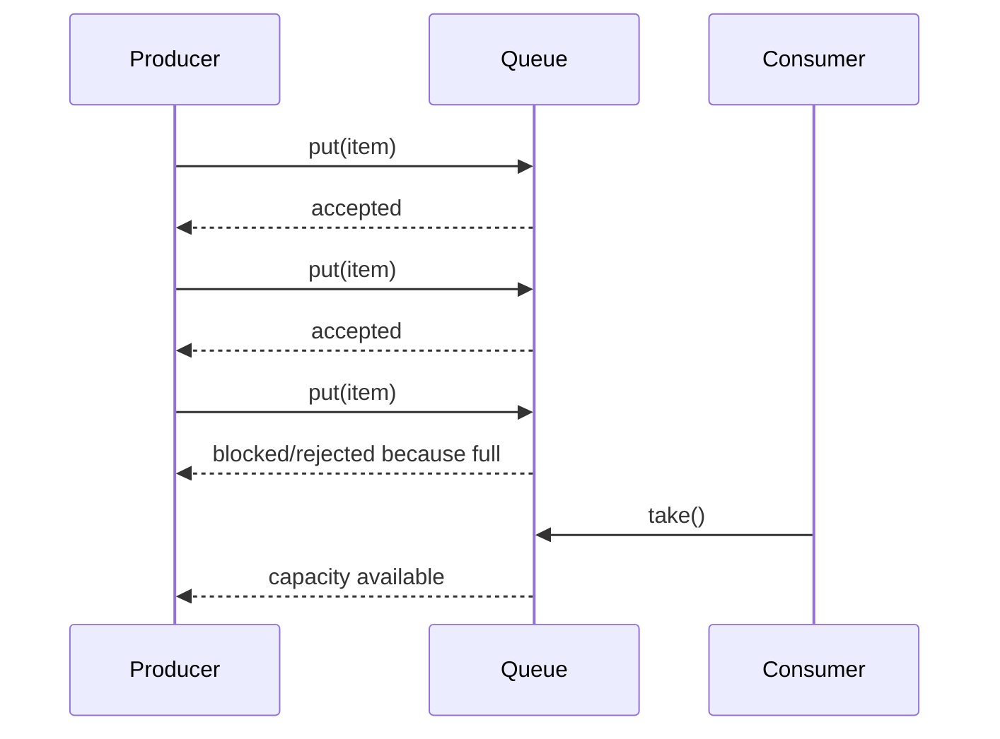

------
title: Learn Java Patterns - Part 013
description: Core pipeline patterns untuk Java production: stage, pipe, filter, transformer, validator, router, splitter, aggregator, fan-out/fan-in, bounded queue, backpressure, checkpoint, error channel, observability, testing, dan refactoring dari procedural flow.
series: learn-java-patterns
seriesTitle: Learn Java Patterns, Data Patterns, Pipeline Patterns, Concurrency Patterns, Common Patterns, and Anti-Patterns
order: 13
partTitle: Core Pipeline Patterns
tags:
- java
- patterns
- architecture
- advanced-java
- pipeline
- pipes-and-filters
- data-flow
- integration
- backpressure
date: 2026-06-27
---

# Learn Java Patterns - Part 013: Core Pipeline Patterns

## 1. Tujuan Part Ini

Part sebelumnya membahas messaging dan integration patterns. Part ini mempersempit fokus ke **pipeline**: cara menyusun proses besar menjadi rangkaian stage kecil yang eksplisit, testable, observable, dan bisa dikendalikan saat volume, latency, atau failure meningkat.

Kita akan membahas:

- pipeline sebagai model aliran kerja;
- stage;
- pipe/channel;
- filter;
- transformer;
- validator;
- enricher;
- router;
- splitter;
- aggregator;
- fan-out/fan-in;
- branching pipeline;
- bounded queue;
- backpressure;
- error channel;
- checkpoint;
- retry boundary;
- idempotency boundary;
- observability;
- testing;
- refactoring dari service procedural panjang ke pipeline.

> Pipeline bukan sekadar `stream().map().filter()`. Pipeline adalah cara mengontrol transformasi, ordering, failure, throughput, dan auditability dari sebuah aliran kerja.

---

## 2. Kaufman Lens: Sub-Skill yang Dilatih

Pipeline engineering adalah skill komposisi. Supaya cepat naik level, pecah menjadi sub-skill berikut.

| Sub-Skill | Target Praktis |
|---|---|
| Flow decomposition | Memecah proses besar menjadi stage yang punya input, output, dan invariant jelas |
| Stage contract design | Mendesain kontrak stage: pure/impure, sync/async, idempotent/non-idempotent |
| Data shape reasoning | Menentukan bentuk data antar stage: command, event, DTO, context, atau immutable record |
| Error routing | Membedakan invalid input, transient error, permanent error, poison data, dan bug |
| Throughput control | Menggunakan bounded queue, batching, dan backpressure untuk mencegah overload |
| Ordering reasoning | Menentukan kapan ordering harus dijaga dan kapan boleh dilepas |
| Fan-out/fan-in modeling | Memecah kerja paralel lalu menggabungkan hasil tanpa race dan ambiguity |
| Observability | Membuat tiap stage terlihat: count, latency, failure, dropped item, queue depth |
| Testability | Menguji stage secara isolasi dan pipeline secara end-to-end |
| Refactoring | Mengubah method procedural panjang menjadi pipeline tanpa big-bang rewrite |

Target setelah part ini:

1. bisa membedakan pipeline, workflow, stream, dan chain of responsibility;
2. bisa mendesain pipeline sync sederhana dan async bounded;
3. bisa memilih stage boundary yang tepat;
4. bisa menghindari pipeline yang terlihat rapi tapi operasionalnya rapuh;
5. bisa melakukan refactoring incremental dari service procedural ke pipeline.

---

## 3. Mental Model: Pipeline sebagai Aliran State yang Terkendali

Pipeline memiliki tiga elemen dasar:

1. **Item**: unit data/kerja yang mengalir.
2. **Stage**: komponen yang membaca item, melakukan keputusan/transformasi, lalu menghasilkan output.
3. **Pipe**: boundary yang membawa output stage A menjadi input stage B.



Pipeline yang baik membuat hal berikut eksplisit:

- bentuk data di setiap boundary;
- invariant yang sudah dijamin;
- efek samping yang terjadi;
- failure yang mungkin muncul;
- apakah proses bisa diulang;
- apakah ordering penting;
- bagaimana item dilacak.

Pipeline buruk biasanya hanya menyembunyikan kompleksitas procedural di balik nama `process()`.

---

## 4. Pipeline vs Workflow vs Stream vs Chain

Keempat istilah ini sering tumpang tindih.

| Konsep | Fokus | Unit Kerja | Durasi | Cocok Untuk |
|---|---|---|---|---|
| Pipeline | Transformasi bertahap | Item/batch | Pendek sampai menengah | Validasi, enrichment, ETL ringan, ingestion |
| Workflow | Lifecycle bisnis | Case/process instance | Menengah sampai panjang | Approval, investigation, escalation, compensation |
| Stream | Data/event kontinu | Event/message | Kontinu | Telemetry, event processing, read model, log processing |
| Chain of Responsibility | Dispatch handler | Request/command | Pendek | Validation chain, interceptor, policy evaluation |

Rule of thumb:

- gunakan **pipeline** ketika problem utamanya adalah aliran transformasi;
- gunakan **workflow** ketika problem utamanya adalah lifecycle bisnis, human task, timer, dan state durable;
- gunakan **stream** ketika input datang terus menerus dan perlu backpressure/windowing;
- gunakan **chain** ketika request melewati daftar handler yang bisa menangani atau meneruskan.

---

## 5. Pattern 1: Stage

### 5.1 Problem

Kita punya proses besar dengan banyak langkah. Kalau semua langkah berada dalam satu method/service, sulit mengetahui:

- input yang valid;
- output yang dijamin;
- langkah mana yang gagal;
- apakah langkah bisa diulang;
- apakah langkah boleh diparalelkan;
- apa yang harus dimonitor.

### 5.2 Solution

Pisahkan proses menjadi **stage**. Setiap stage punya kontrak eksplisit.

```java
public interface PipelineStage<I, O> {
    O process(I input) throws PipelineException;
}
```

Contoh stage validasi:

```java
public final class CaseIntakeValidationStage
        implements PipelineStage<RawCaseIntake, ValidatedCaseIntake> {

    @Override
    public ValidatedCaseIntake process(RawCaseIntake input) {
        if (input.caseType() == null) {
            throw PipelineException.invalid("caseType is required");
        }
        if (input.reportedAt() == null) {
            throw PipelineException.invalid("reportedAt is required");
        }
        return new ValidatedCaseIntake(
                input.caseType(),
                input.reportedAt(),
                input.reporterId(),
                input.payload()
        );
    }
}
```

### 5.3 Stage Contract Checklist

Setiap stage harus menjawab:

| Pertanyaan | Contoh Jawaban |
|---|---|
| Apa input type-nya? | `RawCaseIntake` |
| Apa output type-nya? | `ValidatedCaseIntake` |
| Invariant apa yang ditambahkan? | `caseType` dan `reportedAt` non-null |
| Apakah pure? | Ya, tidak ada IO |
| Apakah deterministic? | Ya |
| Apakah idempotent? | Ya |
| Error apa yang bisa muncul? | Invalid data |
| Apakah perlu metric? | Count valid/invalid |

> Stage yang tidak bisa dijelaskan kontraknya biasanya terlalu besar atau terlalu banyak tanggung jawab.

---

## 6. Pattern 2: Typed Pipeline

### 6.1 Problem

Pipeline sering melemah karena semua stage memakai tipe generik seperti `Map<String, Object>`, `JsonNode`, atau `PipelineContext`. Akibatnya compiler tidak bisa membantu menjaga urutan dan invariant.

### 6.2 Solution

Gunakan tipe berbeda di setiap boundary saat invariant berubah.

```java
public record RawCaseIntake(
        String caseType,
        Instant reportedAt,
        String reporterId,
        Map<String, Object> payload
) {}

public record ValidatedCaseIntake(
        String caseType,
        Instant reportedAt,
        String reporterId,
        Map<String, Object> payload
) {}

public record NormalizedCaseIntake(
        CaseType caseType,
        Instant reportedAt,
        ReporterRef reporter,
        Map<String, Object> normalizedPayload
) {}
```

Pipeline composition:

```java
public final class CaseIntakePipeline {
    private final PipelineStage<RawCaseIntake, ValidatedCaseIntake> validate;
    private final PipelineStage<ValidatedCaseIntake, NormalizedCaseIntake> normalize;
    private final PipelineStage<NormalizedCaseIntake, CaseDraft> createDraft;

    public CaseIntakePipeline(
            PipelineStage<RawCaseIntake, ValidatedCaseIntake> validate,
            PipelineStage<ValidatedCaseIntake, NormalizedCaseIntake> normalize,
            PipelineStage<NormalizedCaseIntake, CaseDraft> createDraft
    ) {
        this.validate = validate;
        this.normalize = normalize;
        this.createDraft = createDraft;
    }

    public CaseDraft process(RawCaseIntake input) {
        ValidatedCaseIntake validated = validate.process(input);
        NormalizedCaseIntake normalized = normalize.process(validated);
        return createDraft.process(normalized);
    }
}
```

### 6.3 Why This Matters

Typed pipeline mengubah invariant menjadi sesuatu yang terlihat di signature.

Buruk:

```java
Map<String, Object> process(Map<String, Object> input)
```

Lebih baik:

```java
CaseDraft process(RawCaseIntake input)
```

Dengan typed boundary, kita bisa melihat bahwa `CaseDraft` tidak boleh dibuat sebelum `RawCaseIntake` melewati validasi dan normalisasi.

---

## 7. Pattern 3: Filter

### 7.1 Problem

Tidak semua item harus melewati pipeline. Beberapa harus dibuang, ditolak, dikarantina, atau diarahkan ke jalur lain.

### 7.2 Solution

Gunakan **Filter** untuk mengambil keputusan apakah item lanjut.

```java
public interface ItemFilter<T> {
    FilterDecision<T> apply(T item);
}

public sealed interface FilterDecision<T> {
    record Accepted<T>(T item) implements FilterDecision<T> {}
    record Rejected<T>(T item, String reason) implements FilterDecision<T> {}
}
```

Contoh:

```java
public final class DuplicateIntakeFilter implements ItemFilter<ValidatedCaseIntake> {
    private final DuplicateRegistry duplicateRegistry;

    public DuplicateIntakeFilter(DuplicateRegistry duplicateRegistry) {
        this.duplicateRegistry = duplicateRegistry;
    }

    @Override
    public FilterDecision<ValidatedCaseIntake> apply(ValidatedCaseIntake item) {
        boolean duplicate = duplicateRegistry.exists(
                item.caseType(),
                item.reporterId(),
                item.reportedAt()
        );

        if (duplicate) {
            return new FilterDecision.Rejected<>(item, "duplicate intake");
        }
        return new FilterDecision.Accepted<>(item);
    }
}
```

### 7.3 Filter vs Validator

| Concern | Validator | Filter |
|---|---|---|
| Pertanyaan | Apakah item valid? | Apakah item perlu lanjut? |
| Failure semantics | Biasanya error/invalid | Bisa reject/drop/quarantine |
| Output | Validated item atau error | Accepted/rejected decision |
| Contoh | Required field kosong | Duplicate event, irrelevant event |

Validator menjaga **validitas**. Filter menjaga **relevansi aliran**.

---

## 8. Pattern 4: Transformer

### 8.1 Problem

Data dari luar jarang cocok dengan model internal. Kalau transformasi tersebar di banyak service, sistem menjadi sulit diubah.

### 8.2 Solution

Gunakan **Transformer** untuk mengubah bentuk data secara eksplisit.

```java
public interface Transformer<I, O> {
    O transform(I input);
}
```

Contoh:

```java
public final class IntakeNormalizer
        implements Transformer<ValidatedCaseIntake, NormalizedCaseIntake> {

    private final CaseTypeCatalog caseTypeCatalog;
    private final ReporterDirectory reporterDirectory;

    public IntakeNormalizer(CaseTypeCatalog caseTypeCatalog,
                            ReporterDirectory reporterDirectory) {
        this.caseTypeCatalog = caseTypeCatalog;
        this.reporterDirectory = reporterDirectory;
    }

    @Override
    public NormalizedCaseIntake transform(ValidatedCaseIntake input) {
        CaseType caseType = caseTypeCatalog.resolve(input.caseType());
        ReporterRef reporter = reporterDirectory.resolve(input.reporterId());

        return new NormalizedCaseIntake(
                caseType,
                input.reportedAt(),
                reporter,
                normalizePayload(input.payload())
        );
    }

    private Map<String, Object> normalizePayload(Map<String, Object> payload) {
        return Map.copyOf(payload);
    }
}
```

### 8.3 Pure vs Impure Transformer

Transformer idealnya pure. Namun production pipeline sering perlu enrichment dari database atau service lain.

| Jenis | Karakter | Risiko |
|---|---|---|
| Pure transformer | Deterministic, no IO | Mudah dites, aman |
| Impure transformer | Membaca DB/API/cache | Latency, timeout, inconsistency |
| Stateful transformer | Bergantung state internal | Race, memory leak, sulit replay |

Saat transformer melakukan IO, sebut dia **enricher** agar efek sampingnya terlihat.

---

## 9. Pattern 5: Enricher

### 9.1 Problem

Item pipeline perlu dilengkapi dengan data tambahan: profile user, reference data, risk score, feature flag, tenant config, atau previous state.

### 9.2 Solution

Gunakan **Enricher** sebagai stage yang menambah data tanpa mengubah makna item asli.

```java
public record CaseDraftInput(
        NormalizedCaseIntake intake,
        RiskProfile riskProfile,
        TenantPolicy tenantPolicy
) {}

public final class CaseIntakeEnrichmentStage
        implements PipelineStage<NormalizedCaseIntake, CaseDraftInput> {

    private final RiskProfileService riskProfileService;
    private final TenantPolicyRepository tenantPolicyRepository;

    public CaseIntakeEnrichmentStage(RiskProfileService riskProfileService,
                                     TenantPolicyRepository tenantPolicyRepository) {
        this.riskProfileService = riskProfileService;
        this.tenantPolicyRepository = tenantPolicyRepository;
    }

    @Override
    public CaseDraftInput process(NormalizedCaseIntake input) {
        RiskProfile riskProfile = riskProfileService.lookup(input.reporter());
        TenantPolicy tenantPolicy = tenantPolicyRepository.getPolicy(input.caseType().tenantId());
        return new CaseDraftInput(input, riskProfile, tenantPolicy);
    }
}
```

### 9.3 Enricher Failure Mode

Enrichment adalah salah satu stage paling rawan karena sering menyentuh dependency eksternal.

| Failure | Mitigasi |
|---|---|
| Reference data tidak ditemukan | Domain-specific error, fallback terbatas, atau quarantine |
| Service lambat | Timeout, cache, bulkhead |
| Data berubah saat pipeline berjalan | Snapshot atau version reference |
| Enrichment terlalu banyak | Split stage berdasarkan ownership |
| Enricher diam-diam menulis state | Pisahkan write stage |

---

## 10. Pattern 6: Router

### 10.1 Problem

Tidak semua item mengikuti jalur yang sama. Rule bisnis, tenant, tipe kasus, prioritas, atau risiko bisa menentukan stage berikutnya.

### 10.2 Solution

Gunakan **Router** untuk memilih jalur berikutnya.

```java
public enum IntakeRoute {
    STANDARD,
    HIGH_RISK,
    MANUAL_REVIEW,
    REJECTED
}

public interface Router<T, R> {
    R route(T item);
}
```

Contoh:

```java
public final class CaseIntakeRouter implements Router<CaseDraftInput, IntakeRoute> {
    @Override
    public IntakeRoute route(CaseDraftInput input) {
        if (input.riskProfile().score() >= 90) {
            return IntakeRoute.HIGH_RISK;
        }
        if (input.tenantPolicy().requiresManualReview(input.intake().caseType())) {
            return IntakeRoute.MANUAL_REVIEW;
        }
        return IntakeRoute.STANDARD;
    }
}
```

### 10.3 Router Anti-Pattern

Router menjadi anti-pattern ketika:

- memiliki terlalu banyak `if` tanpa policy model;
- memanggil banyak service eksternal;
- menulis database;
- menyembunyikan authorization decision;
- membuat jalur pipeline tidak bisa dilacak.

Router idealnya membuat keputusan. Ia tidak seharusnya melakukan seluruh pekerjaan jalur tersebut.

---

## 11. Pattern 7: Splitter

### 11.1 Problem

Satu input berisi banyak sub-item yang perlu diproses terpisah.

Contoh:

- file berisi 10.000 row;
- case berisi banyak allegation;
- request berisi beberapa attachment;
- batch settlement berisi banyak transaction;
- event aggregate berisi banyak child update.

### 11.2 Solution

Gunakan **Splitter** untuk mengubah satu item komposit menjadi beberapa item kecil.

```java
public interface Splitter<I, O> {
    List<O> split(I input);
}
```

Contoh:

```java
public record AttachmentScanRequest(
        UUID caseId,
        UUID attachmentId,
        URI location
) {}

public final class AttachmentSplitter
        implements Splitter<CaseDraft, AttachmentScanRequest> {

    @Override
    public List<AttachmentScanRequest> split(CaseDraft draft) {
        return draft.attachments().stream()
                .map(attachment -> new AttachmentScanRequest(
                        draft.caseId(),
                        attachment.attachmentId(),
                        attachment.location()
                ))
                .toList();
    }
}
```

### 11.3 Splitter Design Questions

| Question | Why It Matters |
|---|---|
| Apakah sub-item independent? | Menentukan bisa paralel atau tidak |
| Apakah ordering penting? | Menentukan perlu resequencing |
| Bagaimana correlation ke parent? | Diperlukan untuk aggregation dan audit |
| Bagaimana partial failure ditangani? | Menentukan retry, quarantine, compensation |
| Apakah split deterministic? | Diperlukan untuk replay |

---

## 12. Pattern 8: Aggregator

### 12.1 Problem

Setelah item di-split atau di-fan-out, hasilnya perlu digabungkan kembali.

### 12.2 Solution

Gunakan **Aggregator** untuk mengumpulkan hasil berdasarkan correlation key dan completion rule.

```java
public record ScanResult(
        UUID caseId,
        UUID attachmentId,
        ScanStatus status,
        List<String> findings
) {}

public record CaseScanSummary(
        UUID caseId,
        int total,
        int clean,
        int suspicious,
        int failed,
        List<String> findings
) {}

public final class AttachmentScanAggregator {

    public CaseScanSummary aggregate(UUID caseId, List<ScanResult> results) {
        int clean = 0;
        int suspicious = 0;
        int failed = 0;
        List<String> findings = new ArrayList<>();

        for (ScanResult result : results) {
            switch (result.status()) {
                case CLEAN -> clean++;
                case SUSPICIOUS -> {
                    suspicious++;
                    findings.addAll(result.findings());
                }
                case FAILED -> failed++;
            }
        }

        return new CaseScanSummary(
                caseId,
                results.size(),
                clean,
                suspicious,
                failed,
                List.copyOf(findings)
        );
    }
}
```

### 12.3 Completion Rule

Aggregator tidak lengkap tanpa completion rule.

| Completion Rule | Cocok Untuk | Risiko |
|---|---|---|
| Count-based | Jumlah sub-item diketahui | Stuck jika ada sub-item hilang |
| Timeout-based | External calls unreliable | Bisa hasil partial |
| Predicate-based | Menunggu condition tertentu | Condition bisa ambigu |
| First-success | Redundant provider | Bisa mengabaikan hasil lebih baik |
| Quorum | Voting/replica | Kompleks dan mahal |
| Manual close | Human workflow | Perlu audit kuat |

Production aggregator harus menjawab: **kapan kita berhenti menunggu?**

---

## 13. Pattern 9: Fan-Out/Fan-In

### 13.1 Problem

Beberapa stage bisa berjalan paralel karena tidak saling bergantung. Jika dijalankan serial, latency menjadi tinggi.

### 13.2 Solution

Gunakan **fan-out/fan-in**: pecah kerja ke beberapa cabang, lalu gabungkan.



Contoh dengan `CompletableFuture`:

```java
public final class ParallelAssessmentStage
        implements PipelineStage<CaseDraftInput, AssessmentSummary> {

    private final RiskService riskService;
    private final ReferenceCheckService referenceCheckService;
    private final AttachmentScanService attachmentScanService;
    private final Executor executor;

    public ParallelAssessmentStage(RiskService riskService,
                                   ReferenceCheckService referenceCheckService,
                                   AttachmentScanService attachmentScanService,
                                   Executor executor) {
        this.riskService = riskService;
        this.referenceCheckService = referenceCheckService;
        this.attachmentScanService = attachmentScanService;
        this.executor = executor;
    }

    @Override
    public AssessmentSummary process(CaseDraftInput input) {
        CompletableFuture<RiskResult> risk = CompletableFuture.supplyAsync(
                () -> riskService.assess(input), executor
        );

        CompletableFuture<ReferenceCheckResult> reference = CompletableFuture.supplyAsync(
                () -> referenceCheckService.check(input), executor
        );

        CompletableFuture<AttachmentScanSummary> scan = CompletableFuture.supplyAsync(
                () -> attachmentScanService.scan(input), executor
        );

        return CompletableFuture.allOf(risk, reference, scan)
                .thenApply(ignored -> new AssessmentSummary(
                        risk.join(),
                        reference.join(),
                        scan.join()
                ))
                .join();
    }
}
```

### 13.3 Fan-Out/Fan-In Guardrails

Fan-out meningkatkan concurrency, bukan menghapus cost. Guardrail:

- gunakan timeout per branch;
- batasi executor;
- jangan fan-out tanpa bulkhead;
- buat correlation id per branch;
- catat hasil partial;
- definisikan cancellation behavior;
- jangan gabungkan hasil tanpa completion rule.

---

## 14. Pattern 10: Bounded Queue Pipeline

### 14.1 Problem

Pipeline synchronous mudah dipahami tetapi tidak selalu cukup. Jika stage A lebih cepat dari stage B, item menumpuk. Kalau tidak dibatasi, memory habis.

### 14.2 Solution

Gunakan **bounded queue** antar stage.



Contoh minimal:

```java
public final class BoundedStage<I, O> implements AutoCloseable {
    private final BlockingQueue<I> inputQueue;
    private final BlockingQueue<O> outputQueue;
    private final PipelineStage<I, O> stage;
    private final ExecutorService executor;
    private final AtomicBoolean running = new AtomicBoolean(true);

    public BoundedStage(int inputCapacity,
                        int outputCapacity,
                        PipelineStage<I, O> stage,
                        int workers) {
        this.inputQueue = new ArrayBlockingQueue<>(inputCapacity);
        this.outputQueue = new ArrayBlockingQueue<>(outputCapacity);
        this.stage = stage;
        this.executor = Executors.newFixedThreadPool(workers);

        for (int i = 0; i < workers; i++) {
            executor.submit(this::runWorker);
        }
    }

    public void submit(I input) throws InterruptedException {
        inputQueue.put(input); // backpressure: caller blocks when full
    }

    public O take() throws InterruptedException {
        return outputQueue.take();
    }

    private void runWorker() {
        while (running.get() || !inputQueue.isEmpty()) {
            try {
                I input = inputQueue.poll(100, TimeUnit.MILLISECONDS);
                if (input == null) {
                    continue;
                }
                O output = stage.process(input);
                outputQueue.put(output);
            } catch (InterruptedException e) {
                Thread.currentThread().interrupt();
                break;
            } catch (RuntimeException e) {
                // In production, route to error channel with item context.
                // Do not just log and forget.
            }
        }
    }

    @Override
    public void close() {
        running.set(false);
        executor.shutdown();
    }
}
```

### 14.3 Bounded Queue Semantics

A bounded queue is a policy decision.

| Policy | Behavior | Risk |
|---|---|---|
| Block producer | Natural backpressure | Thread starvation if done blindly |
| Reject item | Fast failure | Caller must handle retry/drop |
| Drop newest | Protect old work | Data loss |
| Drop oldest | Prioritize freshness | Audit risk |
| Spill to disk | Survive burst | Complexity and replay semantics |

Tidak ada default universal. Pilih berdasarkan business semantics.

---

## 15. Pattern 11: Backpressure

### 15.1 Problem

Producer bisa menghasilkan item lebih cepat daripada consumer. Tanpa backpressure, sistem akan memilih salah satu secara tidak eksplisit:

- memory naik;
- latency naik;
- queue tidak terbatas;
- timeout cascade;
- GC pressure;
- broker lag;
- downstream overload;
- user melihat sistem “masih menerima” padahal tidak mampu menyelesaikan.

### 15.2 Solution

Backpressure adalah mekanisme agar downstream capacity memengaruhi upstream rate.

Bentuk backpressure:

| Bentuk | Contoh |
|---|---|
| Blocking | `BlockingQueue.put()` saat penuh |
| Rejection | `RejectedExecutionHandler` |
| Demand signal | Reactive Streams `request(n)` |
| Rate limit | Token bucket |
| Admission control | Reject request sebelum masuk pipeline |
| Load shedding | Drop non-critical work |
| Batching | Mengurangi overhead per item |
| Pause/resume | Consumer pause partition/channel |

### 15.3 Backpressure Diagram



### 15.4 Design Principle

Backpressure harus muncul di boundary yang benar.

Buruk:

- menerima request user;
- menulis item ke unbounded queue;
- return success;
- gagal memproses 30 menit kemudian.

Lebih baik:

- cek kapasitas;
- reject/slowdown lebih awal;
- beri error yang jujur;
- lindungi downstream.

---

## 16. Pattern 12: Error Channel

### 16.1 Problem

Dalam pipeline, error bisa terjadi di stage mana pun. Jika error hanya dilempar sebagai exception, kita kehilangan konteks item, stage, attempt, dan business impact.

### 16.2 Solution

Gunakan **Error Channel**: jalur eksplisit untuk item yang gagal.

```java
public record PipelineError<T>(
        String pipelineName,
        String stageName,
        T item,
        ErrorKind kind,
        String message,
        int attempt,
        Instant occurredAt
) {}

public enum ErrorKind {
    INVALID_INPUT,
    TRANSIENT_DEPENDENCY,
    PERMANENT_DEPENDENCY,
    BUSINESS_REJECTION,
    BUG,
    TIMEOUT,
    UNKNOWN
}
```

Stage wrapper:

```java
public final class ErrorCapturingStage<I, O> implements PipelineStage<I, StageResult<O>> {
    private final String pipelineName;
    private final String stageName;
    private final PipelineStage<I, O> delegate;
    private final ErrorSink<I> errorSink;

    public ErrorCapturingStage(String pipelineName,
                               String stageName,
                               PipelineStage<I, O> delegate,
                               ErrorSink<I> errorSink) {
        this.pipelineName = pipelineName;
        this.stageName = stageName;
        this.delegate = delegate;
        this.errorSink = errorSink;
    }

    @Override
    public StageResult<O> process(I input) {
        try {
            return StageResult.success(delegate.process(input));
        } catch (PipelineException e) {
            errorSink.accept(new PipelineError<>(
                    pipelineName,
                    stageName,
                    input,
                    e.kind(),
                    e.getMessage(),
                    e.attempt(),
                    Instant.now()
            ));
            return StageResult.failed(e.kind(), e.getMessage());
        }
    }
}
```

### 16.3 Error Channel Is Not Trash

Error channel harus punya lifecycle:

- record error;
- classify error;
- decide retry/quarantine/manual fix/drop;
- preserve input;
- track resolution;
- allow replay;
- report metrics.

Kalau error channel hanya tabel “failed_records” tanpa owner dan proses recovery, itu bukan pattern; itu kuburan data.

---

## 17. Pattern 13: Checkpoint

### 17.1 Problem

Pipeline panjang gagal di tengah. Jika diulang dari awal, bisa mahal atau berbahaya karena beberapa stage sudah melakukan side effect.

### 17.2 Solution

Gunakan checkpoint untuk mencatat progress aman.

```java
public record PipelineCheckpoint(
        String pipelineName,
        String itemId,
        String stageName,
        CheckpointStatus status,
        Instant completedAt,
        String outputReference
) {}

public enum CheckpointStatus {
    COMPLETED,
    FAILED,
    SKIPPED
}
```

Checkpoint cocok ketika:

- item mahal diproses;
- pipeline bisa berjalan lama;
- ada dependency eksternal;
- ada side effect;
- perlu restartability;
- audit penting.

### 17.3 Checkpoint Granularity

| Granularity | Kelebihan | Kekurangan |
|---|---|---|
| Per item | Mudah dipahami | Bisa banyak record |
| Per batch | Efisien | Partial failure lebih sulit |
| Per stage | Restart jelas | Output antar stage perlu disimpan |
| Per side effect | Aman untuk replay | Lebih kompleks |

---

## 18. Pattern 14: Idempotent Stage

### 18.1 Problem

Pipeline bisa mengulang item karena retry, crash, duplicate message, replay, atau manual recovery. Jika stage tidak idempotent, duplicate effect muncul.

### 18.2 Solution

Desain stage agar aman dipanggil lebih dari sekali untuk item yang sama.

```java
public final class PersistCaseDraftStage
        implements PipelineStage<CaseDraft, PersistedCaseDraft> {

    private final CaseDraftRepository repository;

    @Override
    public PersistedCaseDraft process(CaseDraft draft) {
        return repository.findByExternalIntakeId(draft.externalIntakeId())
                .orElseGet(() -> repository.insert(draft));
    }
}
```

### 18.3 Idempotency Techniques

| Technique | Example |
|---|---|
| Natural key | `externalIntakeId` unique |
| Idempotency record | `requestId` recorded before effect |
| Upsert | Insert or return existing |
| Compare-and-set | Update only from expected version |
| Deduplication table | Processed message IDs |
| Output determinism | Same input produces same output id |

Idempotency bukan hanya “tidak error jika duplicate”. Idempotency berarti duplicate tidak mengubah business outcome.

---

## 19. Pattern 15: Batch Stage

### 19.1 Problem

Per-item processing terlalu mahal karena overhead IO, transaction, network, serialization, atau lock.

### 19.2 Solution

Gunakan batch stage untuk memproses banyak item sekaligus.

```java
public interface BatchStage<I, O> {
    List<O> processBatch(List<I> inputs);
}
```

Contoh:

```java
public final class BatchReferenceEnrichmentStage
        implements BatchStage<ValidatedCaseIntake, EnrichedCaseIntake> {

    private final ReporterDirectory reporterDirectory;

    @Override
    public List<EnrichedCaseIntake> processBatch(List<ValidatedCaseIntake> inputs) {
        Set<String> reporterIds = inputs.stream()
                .map(ValidatedCaseIntake::reporterId)
                .collect(Collectors.toSet());

        Map<String, ReporterRef> reporters = reporterDirectory.findAll(reporterIds);

        return inputs.stream()
                .map(input -> new EnrichedCaseIntake(
                        input,
                        reporters.get(input.reporterId())
                ))
                .toList();
    }
}
```

### 19.3 Batch Trade-Off

| Benefit | Cost |
|---|---|
| Higher throughput | Higher latency per item |
| Lower network overhead | Partial failure handling |
| Better DB efficiency | Batch size tuning |
| Better cache locality | More memory pressure |

Batching adalah throughput optimization. Jangan pakai batch jika business membutuhkan low latency per item dan volume kecil.

---

## 20. Pattern 16: Pipeline Context

### 20.1 Problem

Beberapa metadata perlu ikut mengalir di semua stage: correlation id, tenant id, actor, trace id, deadline, attempt, feature flag snapshot.

Jika metadata dimasukkan ke setiap domain object, model domain menjadi tercemar. Jika memakai `ThreadLocal` sembarangan, async boundary dan virtual threads bisa membuat perilaku tidak jelas.

### 20.2 Solution

Gunakan `PipelineContext` eksplisit.

```java
public record PipelineContext(
        String correlationId,
        String tenantId,
        String actorId,
        Instant startedAt,
        Instant deadline,
        int attempt
) {
    public Duration remainingTime(Clock clock) {
        return Duration.between(clock.instant(), deadline);
    }
}
```

Stage dengan context:

```java
public interface ContextualStage<I, O> {
    O process(PipelineContext context, I input);
}
```

### 20.3 Context Rules

- context bukan tempat menaruh semua state;
- context harus kecil dan mostly immutable;
- context boleh berisi metadata operasional;
- context tidak boleh menjadi global mutable map;
- context harus bisa diserialisasi jika pipeline durable;
- context harus jelas mana business metadata dan technical metadata.

---

## 21. Pattern 17: Pipeline as Configuration

### 21.1 Problem

Beberapa pipeline berbeda berdasarkan tenant, jurisdiction, product, atau case type. Menulis `if` di seluruh service membuat variasi sulit dikontrol.

### 21.2 Solution

Representasikan pipeline sebagai konfigurasi stage yang eksplisit.

```java
public record PipelineDefinition(
        String name,
        List<StageDefinition> stages
) {}

public record StageDefinition(
        String stageName,
        String stageType,
        Map<String, String> parameters
) {}
```

Contoh konfigurasi konseptual:

```yaml
name: high-risk-case-intake
stages:
  - name: validate
    type: case-intake-validation
  - name: normalize
    type: case-intake-normalization
  - name: enrich-risk
    type: risk-enrichment
  - name: manual-review-routing
    type: manual-review-router
  - name: persist-draft
    type: case-draft-persistence
```

### 21.3 Warning

Configuration-driven pipeline bisa menjadi mini programming language yang buruk.

Gunakan konfigurasi ketika:

- variasi stage terbatas;
- stage sudah stabil;
- governance diperlukan;
- non-code review berguna;
- observability tetap jelas.

Jangan gunakan konfigurasi untuk menghindari desain domain yang benar.

---

## 22. Pattern 18: Pipeline Template

### 22.1 Problem

Banyak pipeline punya skeleton sama:

1. validate;
2. normalize;
3. enrich;
4. route;
5. persist;
6. publish outcome.

Jika setiap pipeline mengimplementasikan skeleton sendiri, behavior error, metric, retry, dan audit menjadi tidak konsisten.

### 22.2 Solution

Gunakan template pipeline yang mengatur cross-cutting behavior.

```java
public abstract class AbstractPipeline<I, O> {

    public final O run(PipelineContext context, I input) {
        long start = System.nanoTime();
        try {
            before(context, input);
            O output = doRun(context, input);
            afterSuccess(context, input, output, start);
            return output;
        } catch (RuntimeException e) {
            afterFailure(context, input, e, start);
            throw e;
        }
    }

    protected void before(PipelineContext context, I input) {}

    protected abstract O doRun(PipelineContext context, I input);

    protected void afterSuccess(PipelineContext context, I input, O output, long startNanos) {}

    protected void afterFailure(PipelineContext context, I input, RuntimeException error, long startNanos) {}
}
```

### 22.3 Template vs Framework

Template kecil membantu konsistensi. Framework internal besar bisa menjadi beban.

Framework pipeline layak jika:

- banyak tim memakai pola yang sama;
- operational behavior harus konsisten;
- compliance/audit butuh standardisasi;
- stage library reusable;
- ada ownership platform yang jelas.

---

## 23. Pipeline Design by Invariant

Cara terbaik menentukan stage boundary bukan berdasarkan “langkah teknis”, tetapi berdasarkan invariant.

Contoh case intake:

| Stage | Input | Output | Invariant Baru |
|---|---|---|---|
| Receive | HTTP payload | Raw intake | Request captured |
| Validate | Raw intake | Validated intake | Required fields valid |
| Normalize | Validated intake | Normalized intake | Domain references resolved |
| Enrich | Normalized intake | Draft input | Risk and tenant policy available |
| Route | Draft input | Draft route | Route decision explicit |
| Persist | Draft route | Persisted draft | Case draft durable |
| Publish | Persisted draft | Published outcome | Integration event emitted/outboxed |

Jika stage tidak menambah invariant, pertanyakan apakah stage itu perlu.

---

## 24. Pipeline Failure Taxonomy

Pipeline production harus membedakan error.

| Error Type | Meaning | Action |
|---|---|---|
| Invalid input | Data tidak memenuhi kontrak | Reject/quarantine, no retry |
| Business rejection | Valid tapi tidak boleh lanjut | Record decision |
| Transient dependency | Timeout, rate limit, network issue | Retry with backoff |
| Permanent dependency | Reference missing, forbidden | Quarantine/manual review |
| Poison item | Item selalu gagal di stage tertentu | Isolate, inspect, fix |
| Bug | Code defect | Stop/release fix/replay |
| Capacity error | Queue full, downstream overloaded | Backpressure/load shed |
| Partial failure | Beberapa branch gagal | Completion rule decides |

Exception tunggal seperti `RuntimeException` tidak cukup untuk pipeline serius.

---

## 25. Observability Pattern for Pipelines

Minimal setiap pipeline harus punya metric ini:

| Metric | Why |
|---|---|
| `pipeline.items.received` | Volume masuk |
| `pipeline.items.completed` | Throughput sukses |
| `pipeline.items.failed` | Failure rate |
| `pipeline.stage.duration` | Bottleneck stage |
| `pipeline.stage.errors` | Error per stage |
| `pipeline.queue.depth` | Pressure |
| `pipeline.queue.wait_time` | Latency sebelum stage |
| `pipeline.retries` | Dependency instability |
| `pipeline.dropped` | Data loss/load shedding |
| `pipeline.dead_lettered` | Manual recovery load |

Log harus punya minimal:

- pipeline name;
- stage name;
- correlation id;
- item id;
- attempt;
- route;
- error kind;
- latency.

Trace harus menunjukkan stage boundary, bukan hanya HTTP span.

---

## 26. Testing Strategy

### 26.1 Stage Unit Test

Test stage berdasarkan kontrak.

```java
class CaseIntakeValidationStageTest {

    private final CaseIntakeValidationStage stage = new CaseIntakeValidationStage();

    @Test
    void rejectsMissingCaseType() {
        RawCaseIntake input = new RawCaseIntake(
                null,
                Instant.parse("2026-06-27T00:00:00Z"),
                "reporter-1",
                Map.of()
        );

        PipelineException error = assertThrows(
                PipelineException.class,
                () -> stage.process(input)
        );

        assertEquals(ErrorKind.INVALID_INPUT, error.kind());
    }
}
```

### 26.2 Pipeline Contract Test

Test bahwa output part tertentu tidak bisa muncul tanpa invariant sebelumnya.

```java
@Test
void createsDraftOnlyAfterValidationAndNormalization() {
    CaseIntakePipeline pipeline = new CaseIntakePipeline(
            new CaseIntakeValidationStage(),
            new IntakeNormalizer(caseTypeCatalog, reporterDirectory),
            new CaseDraftCreationStage()
    );

    CaseDraft draft = pipeline.process(validRawIntake());

    assertNotNull(draft.caseId());
    assertEquals(CaseStatus.DRAFT, draft.status());
}
```

### 26.3 Failure Path Test

Jangan hanya test happy path.

Test:

- invalid item;
- dependency timeout;
- retry exhausted;
- duplicate input;
- partial fan-out failure;
- queue full;
- cancellation;
- replay.

---

## 27. Refactoring Path: Procedural Service ke Pipeline

Misalnya kita punya service seperti ini:

```java
public CaseResult process(CaseRequest request) {
    validate(request);
    var normalized = normalize(request);
    var reporter = reporterService.get(normalized.reporterId());
    var risk = riskService.assess(normalized, reporter);
    if (risk.high()) {
        createManualReview(normalized, risk);
    } else {
        createCase(normalized, risk);
    }
    audit(request);
    publishEvent(request);
    return result;
}
```

Refactoring incremental:

1. Extract pure validation stage.
2. Extract normalization stage with explicit output type.
3. Extract enrichment stage.
4. Extract route decision as value.
5. Extract branch handlers.
6. Add pipeline context.
7. Wrap stage metrics.
8. Add error taxonomy.
9. Add idempotency at side-effect stage.
10. Add checkpoint if replay/restart is needed.

Refactoring bukan langsung membuat framework. Mulai dari boundary dan invariant.

---

## 28. Common Anti-Patterns

### 28.1 Stringly-Typed Pipeline

Semua item berupa `Map<String, Object>`.

Dampak:

- invariant tersembunyi;
- runtime error;
- refactoring sulit;
- IDE dan compiler tidak membantu.

### 28.2 God Pipeline Context

`PipelineContext` menjadi tempat semua state.

Dampak:

- stage saling bergantung diam-diam;
- ordering rapuh;
- testing sulit;
- data lineage kabur.

### 28.3 Unbounded Queue

Queue tanpa kapasitas.

Dampak:

- memory leak;
- latency tidak terkendali;
- backpressure hilang;
- overload baru terlihat saat sudah parah.

### 28.4 Swallowed Error

Stage menangkap exception lalu hanya log.

Dampak:

- data hilang;
- pipeline terlihat sukses;
- recovery mustahil.

### 28.5 Pipeline for Everything

Semua logic dipaksa menjadi pipeline.

Dampak:

- domain model anemic;
- workflow durable jadi tidak jelas;
- control flow sulit dibaca;
- over-engineering.

### 28.6 No Ownership of Side Effects

Stage melakukan write, publish, email, cache invalidation, dan audit sekaligus.

Dampak:

- retry berbahaya;
- idempotency sulit;
- partial failure tidak jelas.

---

## 29. Production Checklist

Sebelum menerapkan pipeline, jawab checklist ini.

### 29.1 Design

- Apakah item utama jelas?
- Apakah setiap stage punya input/output type eksplisit?
- Apakah setiap stage menambah invariant atau keputusan?
- Apakah stage pure dan impure dipisahkan?
- Apakah side effect stage diberi idempotency?
- Apakah branch dan route terlihat?
- Apakah completion rule aggregator jelas?

### 29.2 Failure

- Apakah error taxonomy ada?
- Apakah retry hanya untuk transient error?
- Apakah invalid item tidak di-retry selamanya?
- Apakah ada quarantine/dead-letter path?
- Apakah ada replay path?
- Apakah partial failure sudah didesain?

### 29.3 Capacity

- Apakah queue bounded?
- Apakah ada backpressure?
- Apakah executor dibatasi?
- Apakah batch size ditentukan?
- Apakah queue depth dimonitor?
- Apakah overload behavior eksplisit?

### 29.4 Observability

- Apakah stage latency tercatat?
- Apakah item count per stage tercatat?
- Apakah correlation id ikut mengalir?
- Apakah error per stage terlihat?
- Apakah retry dan dropped item terlihat?

---

## 30. Practice Drill

Bangun pipeline `CaseEvidenceIngestionPipeline`.

Requirements:

1. Input berupa metadata evidence dan URI file.
2. Validate required metadata.
3. Normalize evidence type.
4. Enrich dengan case ownership dan tenant policy.
5. Split attachment jika file archive.
6. Scan setiap attachment.
7. Aggregate scan result.
8. Persist accepted evidence.
9. Route suspicious evidence ke manual review.
10. Publish event via outbox.

Constraints:

- scan service bisa timeout;
- duplicate evidence upload bisa terjadi;
- file archive bisa berisi 0 sampai 1000 item;
- high-risk tenant wajib manual review;
- pipeline harus observable per stage.

Deliverables:

- stage diagram Mermaid;
- typed input/output records;
- error taxonomy;
- idempotency key;
- retry policy;
- test cases.

---

## 31. Mini Design Review Template

Gunakan template ini saat review pipeline.

```md
# Pipeline Review

## Pipeline Name

## Business Purpose

## Input Item

## Output Item

## Stage List
| Stage | Input | Output | Invariant | Side Effect | Retry? |
|---|---|---|---|---|---|

## Failure Taxonomy

## Backpressure Strategy

## Idempotency Strategy

## Observability

## Replay / Recovery

## Known Trade-Offs
```

---

## 32. References

- Enterprise Integration Patterns: Pipes and Filters, Splitter, Aggregator, Routing Slip.
- Java `java.util.concurrent` package: `BlockingQueue`, `ExecutorService`, `CompletableFuture`.
- Reactive Streams specification for demand-based asynchronous streams.
- Production architecture patterns around bounded queues, admission control, idempotency, and operational observability.

---

## 33. Ringkasan

Core pipeline pattern membantu kita mengubah proses besar menjadi aliran kerja yang eksplisit.

Poin utama:

1. Pipeline adalah model transformasi dan control flow.
2. Stage boundary sebaiknya ditentukan oleh invariant, bukan hanya langkah teknis.
3. Typed pipeline membuat compiler membantu menjaga urutan dan validitas.
4. Filter, transformer, enricher, router, splitter, dan aggregator adalah building block utama.
5. Bounded queue dan backpressure wajib untuk pipeline async.
6. Error channel, checkpoint, dan idempotent stage membuat pipeline recoverable.
7. Pipeline bukan pengganti domain model atau workflow engine.
8. Pipeline production harus observable per stage.

Part berikutnya akan membahas **streaming dan reactive pipeline patterns**: `Flow.Publisher`, `Subscriber`, `Subscription`, demand, backpressure, processor chain, hot/cold stream, async boundary, dan failure mode reactive systems.
