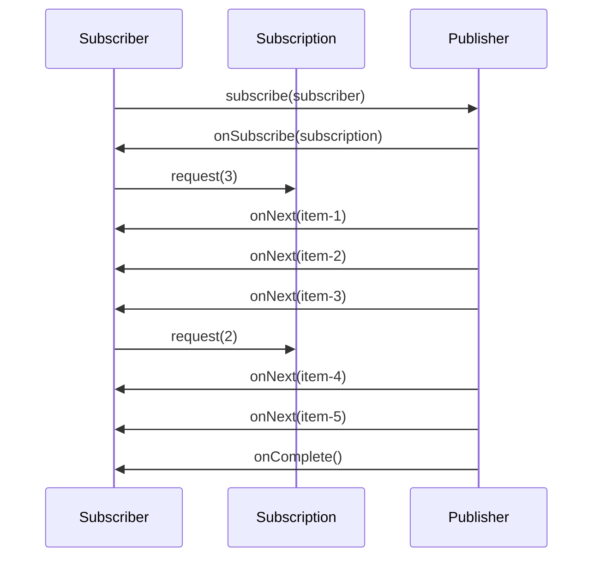
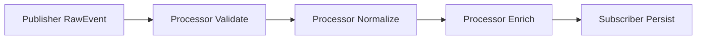
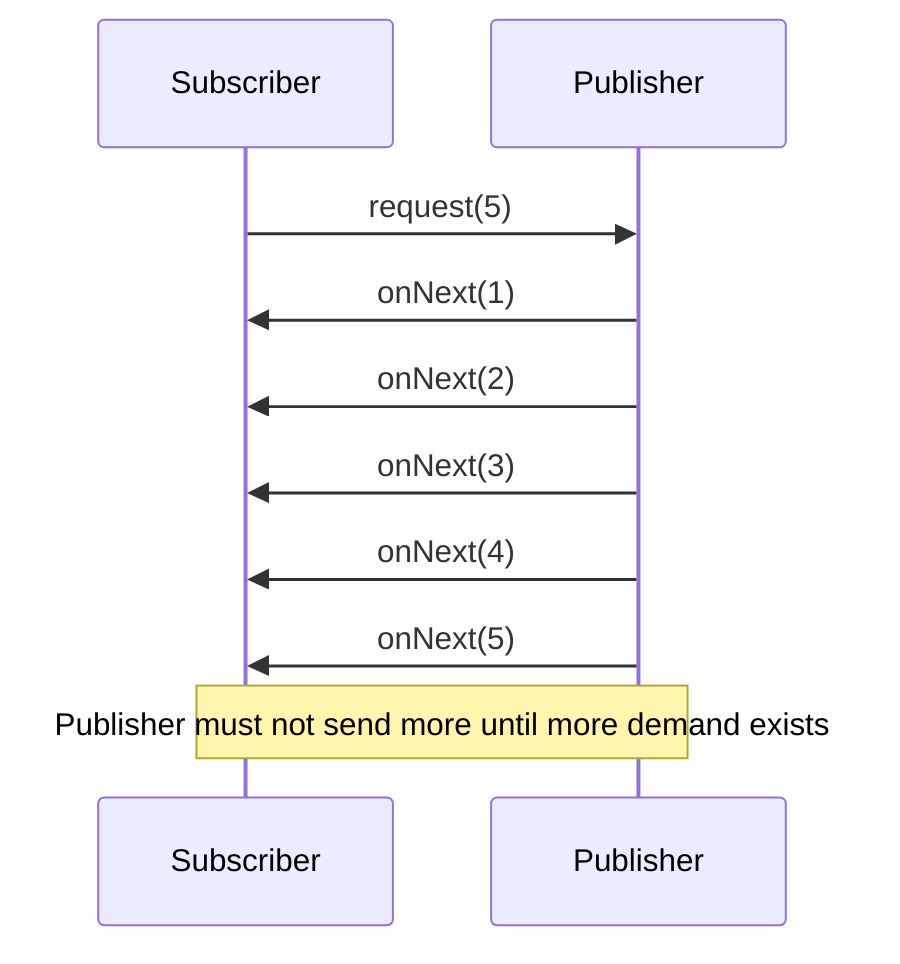
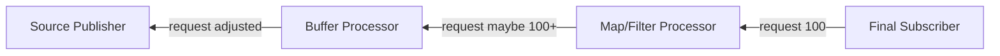
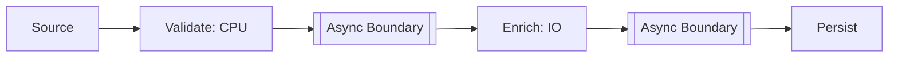
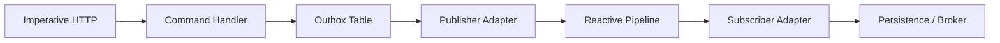

------
title: Learn Java Patterns - Part 014
description: Streaming dan reactive pipeline patterns untuk Java production: Flow API, Publisher, Subscriber, Subscription, Processor, demand, non-blocking backpressure, hot/cold stream, async boundary, operator chain, error semantics, testing, dan anti-pattern.
series: learn-java-patterns
seriesTitle: Learn Java Patterns, Data Patterns, Pipeline Patterns, Concurrency Patterns, Common Patterns, Anti-Patterns, and Production Architecture
order: 14
partTitle: Streaming and Reactive Pipeline Patterns
tags:
- java
- patterns
- architecture
- advanced-java
- reactive-streams
- flow-api
- streaming
- backpressure
- async
- pipeline
date: 2026-06-27
---

# Learn Java Patterns - Part 014: Streaming and Reactive Pipeline Patterns

## 1. Tujuan Part Ini

Part sebelumnya membahas core pipeline patterns: stage, filter, transformer, router, splitter, aggregator, bounded queue, error channel, checkpoint, dan idempotent stage. Part ini membahas bentuk pipeline yang lebih dinamis: **streaming dan reactive pipeline**.

Kita akan membahas:

- stream processing mental model;
- Reactive Streams vocabulary;
- Java `Flow` API;
- `Publisher`;
- `Subscriber`;
- `Subscription`;
- `Processor`;
- demand;
- non-blocking backpressure;
- hot vs cold stream;
- push vs pull;
- operator chain;
- async boundary;
- fan-out stream;
- windowing mental model;
- error channel;
- cancellation;
- ordering;
- resource lifecycle;
- testing reactive pipeline;
- anti-pattern.

> Reactive pipeline bukan “async supaya cepat”. Reactive pipeline adalah kontrak aliran data ketika producer dan consumer berjalan dengan rate berbeda, dependency bisa lambat, dan sistem harus tetap stabil.

---

## 2. Kaufman Lens: Sub-Skill yang Dilatih

Reactive programming sering sulit karena developer mencoba menghafal operator. Kita akan memecahnya menjadi sub-skill yang lebih fundamental.

| Sub-Skill | Target Praktis |
|---|---|
| Demand reasoning | Memahami bahwa consumer dapat mengontrol jumlah item yang diminta |
| Backpressure reasoning | Mendesain aliran agar producer tidak membanjiri consumer |
| Stream lifecycle | Memahami subscribe, request, emit, complete, error, cancel |
| Operator composition | Menyusun map/filter/flatMap/buffer/window tanpa kehilangan semantics |
| Async boundary | Menentukan kapan stage pindah thread/executor dan apa konsekuensinya |
| Error semantics | Membedakan item failure, stream failure, retry, resume, fallback |
| Hot/cold stream | Membedakan source yang mulai saat subscribed vs source yang terus berjalan |
| Ordering | Menentukan operator mana yang menjaga atau melepas urutan |
| Resource management | Menutup subscription, file, socket, DB cursor, dan scheduler |
| Testing | Menguji demand, cancellation, timeout, error, ordering, dan completion |

Target setelah part ini:

1. bisa membaca desain reactive pipeline tanpa tenggelam dalam operator;
2. bisa menjelaskan `Publisher`, `Subscriber`, `Subscription`, dan `Processor`;
3. bisa membedakan backpressure berbasis queue dan demand;
4. bisa mengenali kapan reactive pipeline cocok dan kapan hanya over-engineering;
5. bisa mendesain stream boundary production-ready.

---

## 3. Mental Model: Stream sebagai Kontrak Waktu

Pipeline biasa sering kita bayangkan sebagai daftar langkah. Streaming pipeline harus kita bayangkan sebagai **kontrak waktu** antara producer dan consumer.



Hal penting:

- producer tidak bebas mengirim tanpa batas;
- subscriber memberi demand;
- demand adalah kapasitas yang dinyatakan;
- stream punya terminal signal: complete atau error;
- cancellation harus menghentikan kerja yang tidak perlu;
- operator chain harus menjaga kontrak tersebut.

---

## 4. Reactive Streams Vocabulary

Reactive Streams mendefinisikan vocabulary inti:

| Concept | Role |
|---|---|
| `Publisher<T>` | Source yang menerbitkan item ke subscriber |
| `Subscriber<T>` | Consumer yang menerima item, error, dan completion |
| `Subscription` | Link antara publisher dan subscriber; dipakai untuk request/cancel |
| `Processor<T, R>` | Komponen yang sekaligus subscriber dan publisher; biasanya operator/stage |

Java mengadopsi vocabulary ini lewat `java.util.concurrent.Flow`.

```java
import java.util.concurrent.Flow.Publisher;
import java.util.concurrent.Flow.Subscriber;
import java.util.concurrent.Flow.Subscription;
import java.util.concurrent.Flow.Processor;
```

Model ini terlihat sederhana, tetapi behavior-nya sangat kaya karena ada demand, error, cancellation, dan async boundary.

---

## 5. Pattern 1: Publisher

### 5.1 Problem

Kita butuh source yang mengirim item secara asynchronous kepada satu atau lebih subscriber, tetapi tidak boleh membanjiri subscriber.

### 5.2 Solution

Gunakan `Publisher<T>`.

```java
public interface Publisher<T> {
    void subscribe(Subscriber<? super T> subscriber);
}
```

`Publisher` tidak sekadar collection async. Ia harus menghormati lifecycle reactive stream.

### 5.3 Minimal Publisher Thinking

Publisher perlu menjawab:

| Pertanyaan | Why |
|---|---|
| Dari mana item berasal? | DB cursor, queue, file, socket, in-memory source |
| Apakah source finite atau infinite? | Menentukan completion semantics |
| Apakah hot atau cold? | Menentukan replay dan subscriber behavior |
| Bagaimana demand dipenuhi? | Backpressure |
| Bagaimana error dikirim? | `onError` terminal signal |
| Bagaimana cancellation dihormati? | Resource cleanup |

---

## 6. Pattern 2: Subscriber

### 6.1 Problem

Consumer perlu menerima item, mengontrol demand, menangani error, dan membersihkan resource.

### 6.2 Solution

Gunakan `Subscriber<T>`.

```java
public final class LoggingSubscriber<T> implements Flow.Subscriber<T> {
    private Flow.Subscription subscription;
    private final int batchSize;
    private int processed;

    public LoggingSubscriber(int batchSize) {
        this.batchSize = batchSize;
    }

    @Override
    public void onSubscribe(Flow.Subscription subscription) {
        this.subscription = subscription;
        subscription.request(batchSize);
    }

    @Override
    public void onNext(T item) {
        System.out.println("received: " + item);
        processed++;

        if (processed % batchSize == 0) {
            subscription.request(batchSize);
        }
    }

    @Override
    public void onError(Throwable throwable) {
        System.err.println("stream failed: " + throwable.getMessage());
    }

    @Override
    public void onComplete() {
        System.out.println("stream completed");
    }
}
```

### 6.3 Subscriber Rules

- jangan request unbounded jika downstream tidak benar-benar mampu;
- jangan block lama di `onNext` kecuali sudah sengaja memakai executor/boundary;
- jangan swallow error;
- jangan memanggil `request` tanpa memahami capacity;
- jangan lupa cancellation untuk resource yang tidak lagi dibutuhkan.

---

## 7. Pattern 3: Subscription as Flow Control

### 7.1 Problem

Dalam push model biasa, producer menentukan rate. Jika producer lebih cepat, consumer rusak.

### 7.2 Solution

`Subscription` memberi consumer kontrol:

```java
public interface Subscription {
    void request(long n);
    void cancel();
}
```

`request(n)` berarti: “Saya siap menerima sampai n item lagi.”

`cancel()` berarti: “Saya tidak butuh item lagi; hentikan dan bersihkan resource.”

### 7.3 Demand Is Capacity, Not Desire

Kesalahan umum: menganggap `request(Long.MAX_VALUE)` sebagai default aman.

Itu hanya aman jika:

- consumer sangat cepat;
- source terbatas;
- item kecil;
- tidak ada downstream IO lambat;
- memory cukup;
- failure tidak membuat backlog.

Dalam sistem production, demand harus terkait dengan kapasitas nyata.

---

## 8. Pattern 4: Processor as Streaming Stage

### 8.1 Problem

Kita perlu stage yang menerima stream input dan menerbitkan stream output.

### 8.2 Solution

Gunakan `Processor<T, R>`.

```java
public interface Processor<T, R> extends Subscriber<T>, Publisher<R> {
}
```

Secara mental, processor adalah stage pipeline reactive.



### 8.3 Processor Responsibilities

Processor harus:

- menerima subscription upstream;
- menerima subscriber downstream;
- meneruskan demand downstream ke upstream dengan benar;
- transform item;
- propagate error;
- propagate completion;
- handle cancellation;
- menjaga ordering jika dijanjikan.

Membuat processor dari nol tidak trivial. Untuk production, biasanya gunakan library/framework reactive yang sudah mematuhi spec. Namun memahami contract-nya wajib agar tidak salah desain.

---

## 9. Pattern 5: Java SubmissionPublisher

### 9.1 Problem

Kita butuh publisher sederhana untuk bridging source imperative ke Flow API.

### 9.2 Solution

Java menyediakan `SubmissionPublisher<T>`.

```java
try (SubmissionPublisher<String> publisher = new SubmissionPublisher<>()) {
    publisher.subscribe(new LoggingSubscriber<>(10));

    for (int i = 0; i < 100; i++) {
        publisher.submit("item-" + i);
    }
}
```

`SubmissionPublisher` berguna untuk pembelajaran, adapter sederhana, atau source internal. Ia bukan jawaban universal untuk semua stream production.

### 9.3 Caveats

- pahami executor yang dipakai;
- pahami buffer capacity;
- pahami behavior saat subscriber lambat;
- jangan pakai sebagai broker durable;
- jangan pakai untuk menggantikan Kafka/JMS/queue;
- jangan mengabaikan `closeExceptionally` untuk failure.

---

## 10. Pattern 6: Demand-Based Backpressure

### 10.1 Problem

Bounded queue backpressure bekerja dengan blocking/rejecting saat kapasitas habis. Reactive Streams memakai model demand: subscriber menyatakan berapa item yang siap diterima.

### 10.2 Solution

Gunakan `request(n)` sebagai sinyal demand.



### 10.3 Demand Propagation

Dalam chain operator, demand dari subscriber terakhir harus bergerak upstream.



Operator seperti `filter` bisa membutuhkan lebih banyak upstream item daripada downstream demand karena sebagian item dibuang.

---

## 11. Pattern 7: Push, Pull, and Hybrid

| Model | Description | Example | Risk |
|---|---|---|---|
| Push | Producer mengirim saat item tersedia | Observer, event listener | Consumer overload |
| Pull | Consumer mengambil saat siap | Iterator, polling | Latency/poll overhead |
| Hybrid | Consumer memberi demand, producer push sesuai demand | Reactive Streams | Lebih kompleks |

Reactive stream adalah hybrid: consumer tidak menarik item satu per satu secara imperative, tetapi ia memberikan izin kapasitas.

---

## 12. Pattern 8: Hot vs Cold Stream

### 12.1 Cold Stream

Cold stream mulai menghasilkan item untuk setiap subscriber.

Contoh mental:

- membaca file dari awal per subscriber;
- query database per subscriber;
- generate range number.

Kelebihan:

- deterministic;
- mudah diuji;
- subscriber tidak kehilangan item sebelum subscribe.

Kekurangan:

- work bisa diulang;
- mahal untuk source besar;
- side effect perlu hati-hati.

### 12.2 Hot Stream

Hot stream berjalan terlepas dari subscriber.

Contoh mental:

- market price feed;
- telemetry live;
- queue consumer;
- event bus;
- socket stream.

Kelebihan:

- cocok untuk live data;
- efficient untuk shared source.

Kekurangan:

- subscriber bisa kehilangan item;
- replay perlu desain eksplisit;
- backpressure lebih sulit.

### 12.3 Design Question

Sebelum membuat stream, jawab:

> Kalau subscriber telat subscribe, apakah ia harus menerima data lama?

Jika ya, butuh replay/store. Jika tidak, hot stream bisa cocok.

---

## 13. Pattern 9: Operator Chain

### 13.1 Problem

Reactive pipeline perlu menyusun transformasi kecil tanpa membuat nested callback.

### 13.2 Solution

Gunakan operator chain secara disiplin.

Operator konseptual:

| Operator | Meaning |
|---|---|
| `map` | Transform satu item menjadi satu item |
| `filter` | Buang item yang tidak memenuhi predicate |
| `flatMap` | Transform satu item menjadi stream/async result lain |
| `buffer` | Kumpulkan item menjadi batch |
| `window` | Kelompokkan item berdasarkan waktu/jumlah/boundary |
| `merge` | Gabungkan beberapa stream |
| `concat` | Gabungkan stream secara berurutan |
| `zip` | Gabungkan item berdasarkan posisi/pairing |
| `retry` | Subscribe ulang/ulang operasi saat error tertentu |
| `timeout` | Gagal jika tidak ada signal dalam batas waktu |

### 13.3 Operator Discipline

- `map` harus pure jika memungkinkan;
- `filter` jangan menyembunyikan business rejection tanpa metric;
- `flatMap` bisa mengubah ordering;
- `buffer` meningkatkan latency dan memory;
- `retry` tanpa limit bisa membuat loop bencana;
- `timeout` perlu fallback/cancellation;
- `merge` bisa melepas ordering global;
- `zip` bisa stuck jika salah satu stream diam.

---

## 14. Pattern 10: Async Boundary

### 14.1 Problem

Tidak semua stage harus berjalan di thread yang sama. Namun pindah thread membuat reasoning lebih sulit.

### 14.2 Solution

Buat async boundary eksplisit.



Async boundary cocok ketika:

- stage melakukan IO;
- stage lambat dan perlu isolasi;
- stage punya capacity berbeda;
- perlu bulkhead;
- perlu parallelism.

Async boundary tidak cocok jika:

- stage sangat murah;
- ordering ketat dan simple;
- overhead scheduling lebih besar dari work;
- debugging dan trace belum siap.

### 14.3 Boundary Questions

| Question | Why |
|---|---|
| Executor/scheduler mana yang dipakai? | Capacity dan isolation |
| Apakah ordering dijaga? | Correctness |
| Bagaimana context propagation? | Trace, tenant, security |
| Apa timeout stage? | Liveness |
| Bagaimana cancellation diteruskan? | Resource cleanup |
| Bagaimana metric per boundary? | Bottleneck diagnosis |

---

## 15. Pattern 11: Reactive Enrichment

### 15.1 Problem

Setiap item perlu melakukan lookup eksternal. Jika lookup dilakukan serial, throughput rendah. Jika parallel unlimited, dependency overload.

### 15.2 Solution

Gunakan enrichment dengan concurrency limit.

Pseudo-code konseptual:

```java
// Pseudo-code: actual operator names depend on library.
source
    .filter(this::isRelevant)
    .flatMap(item -> riskClient.lookup(item.reporterId()), concurrency = 32)
    .map(risk -> enrich(item, risk))
    .subscribe(persistingSubscriber);
```

### 15.3 Guardrails

- limit concurrency;
- timeout per call;
- retry hanya untuk transient failure;
- circuit breaker untuk dependency buruk;
- cache reference data jika aman;
- preserve correlation id;
- jangan memecah ordering jika business membutuhkannya.

---

## 16. Pattern 12: Reactive Error Semantics

### 16.1 Problem

Dalam reactive stream, `onError` biasanya terminal: stream berakhir. Tetapi business sering butuh satu item gagal tanpa mematikan seluruh stream.

### 16.2 Solution

Bedakan **item error** dan **stream error**.

| Error | Meaning | Handling |
|---|---|---|
| Item error | Satu item invalid/gagal | Convert to result, route to error channel |
| Stream error | Source rusak, protocol error, fatal dependency | `onError`, stop/restart stream |
| Transient branch error | Dependency timeout per item | Retry/fallback/quarantine item |
| Bug | Operator throws unexpected exception | Fail fast, alert, replay after fix |

Gunakan result wrapper untuk item-level error.

```java
public sealed interface ItemResult<T> {
    record Success<T>(T value) implements ItemResult<T> {}
    record Failure<T>(T original, ErrorKind kind, String message) implements ItemResult<T> {}
}
```

Dengan wrapper, pipeline bisa tetap berjalan sambil mengirim item gagal ke jalur khusus.

---

## 17. Pattern 13: Cancellation

### 17.1 Problem

Subscriber berhenti membutuhkan data: user disconnect, timeout, workflow canceled, downstream shutdown. Jika upstream tidak berhenti, resource bocor.

### 17.2 Solution

Propagate cancellation.

```java
public final class CancelAfterNSubscriber<T> implements Flow.Subscriber<T> {
    private final int maxItems;
    private Flow.Subscription subscription;
    private int count;

    public CancelAfterNSubscriber(int maxItems) {
        this.maxItems = maxItems;
    }

    @Override
    public void onSubscribe(Flow.Subscription subscription) {
        this.subscription = subscription;
        subscription.request(1);
    }

    @Override
    public void onNext(T item) {
        count++;
        if (count >= maxItems) {
            subscription.cancel();
            return;
        }
        subscription.request(1);
    }

    @Override
    public void onError(Throwable throwable) {}

    @Override
    public void onComplete() {}
}
```

### 17.3 Cancellation Checklist

- Apakah DB cursor ditutup?
- Apakah HTTP call dibatalkan?
- Apakah file handle ditutup?
- Apakah scheduled task dihentikan?
- Apakah queued work dibuang atau diselesaikan?
- Apakah metric cancellation dicatat?

---

## 18. Pattern 14: Windowing and Buffering

### 18.1 Problem

Stream item per item terlalu granular. Kita perlu batch berdasarkan jumlah, waktu, atau condition.

### 18.2 Solution

Gunakan buffer/window.

| Pattern | Meaning | Example |
|---|---|---|
| Count buffer | Kumpulkan N item | Batch insert setiap 500 item |
| Time buffer | Kumpulkan selama durasi | Flush setiap 1 detik |
| Hybrid buffer | N item atau durasi, mana duluan | Batch API call |
| Sliding window | Window bergerak | Last 5 minutes metrics |
| Tumbling window | Window non-overlap | Per-minute aggregation |
| Session window | Berdasarkan aktivitas | User session events |

### 18.3 Risks

- memory pressure;
- latency meningkat;
- partial batch failure;
- duplicate pada retry;
- out-of-order event;
- late event;
- clock skew.

Part batch/ETL berikutnya akan membahas hal ini lebih dalam untuk pipeline data durable.

---

## 19. Pattern 15: Ordering in Reactive Pipeline

### 19.1 Problem

Operator async dan parallel dapat mengubah ordering.

### 19.2 Ordering Levels

| Level | Meaning |
|---|---|
| No ordering | Item boleh keluar dalam urutan apa pun |
| Per-key ordering | Urutan dijaga per aggregate/account/case id |
| Global ordering | Semua item harus urut total |
| Causal ordering | Event yang bergantung harus setelah penyebabnya |

Global ordering mahal. Banyak sistem sebenarnya hanya butuh per-key atau causal ordering.

### 19.3 Design Rule

Jangan tulis “ordering required” tanpa menjawab:

- ordering berdasarkan key apa?
- siapa producer ordering tersebut?
- operator mana yang bisa mengubahnya?
- apa behavior untuk late/out-of-order item?
- apakah replay menjaga ordering yang sama?

---

## 20. Pattern 16: Stream Boundary Adapter

### 20.1 Problem

Sistem Java production sering menggabungkan model imperative dan reactive. Misalnya HTTP controller imperative, service synchronous, broker async, dan stream reactive.

### 20.2 Solution

Gunakan adapter boundary yang eksplisit.



Adapter harus menjawab:

- bagaimana item masuk stream;
- bagaimana demand/backpressure diterjemahkan;
- apakah source durable;
- bagaimana failure dicatat;
- bagaimana cancellation diterjemahkan;
- apakah transaction boundary aman.

### 20.3 Anti-Corruption at Stream Boundary

Jangan biarkan reactive type bocor ke seluruh domain hanya karena infrastructure reactive.

Buruk:

```java
public Mono<CaseDecision> decide(Mono<CaseCommand> command)
```

Untuk domain core, sering lebih baik:

```java
public CaseDecision decide(CaseCommand command)
```

Lalu reactive boundary memanggil domain function.

---

## 21. Pattern 17: Backpressure at System Boundary

Reactive stream internal tidak cukup jika boundary eksternal tidak memahami backpressure.

Contoh problem:

- HTTP client mengirim request terus;
- Kafka topic terus punya backlog;
- file importer membaca file terlalu cepat;
- scheduled job membuka terlalu banyak stream.

Boundary backpressure options:

| Boundary | Strategy |
|---|---|
| HTTP | 429, admission control, request queue limit |
| Broker | Pause/resume consumer, max poll, partition assignment |
| File | Bounded read buffer, chunking |
| DB cursor | Fetch size, timeout, cancellation |
| WebSocket | Drop policy, slow-client handling |
| Internal queue | Bounded capacity, reject/block |

Backpressure harus end-to-end. Jika hanya ada di tengah pipeline, overload bisa tetap masuk dari depan.

---

## 22. Pattern 18: Reactive Resource Lifecycle

### 22.1 Problem

Reactive pipeline sering menyembunyikan resource lifecycle di balik operator. Resource tetap harus ditutup.

Resources:

- subscription;
- executor/scheduler;
- HTTP connection;
- DB cursor;
- file handle;
- socket;
- temporary buffer;
- metrics scope;
- trace span.

### 22.2 Solution

Desain lifecycle explicit:

```java
public final class StreamRuntime implements AutoCloseable {
    private final SubmissionPublisher<CaseEvent> publisher;
    private final ExecutorService executor;

    public StreamRuntime(ExecutorService executor) {
        this.executor = executor;
        this.publisher = new SubmissionPublisher<>(executor, 256);
    }

    public Flow.Publisher<CaseEvent> publisher() {
        return publisher;
    }

    public void publish(CaseEvent event) {
        publisher.submit(event);
    }

    @Override
    public void close() {
        publisher.close();
        executor.shutdown();
    }
}
```

### 22.3 Rule

Jika stream hidup lebih lama dari request, ia membutuhkan owner lifecycle.

Owner bisa:

- application runtime;
- consumer service;
- workflow instance;
- scheduled job;
- test fixture.

Tanpa owner, stream menjadi leak.

---

## 23. Testing Reactive Pipeline

### 23.1 Test Demand

Test bahwa publisher tidak emit lebih banyak dari demand.

```java
public final class RecordingSubscriber<T> implements Flow.Subscriber<T> {
    private final List<T> items = new CopyOnWriteArrayList<>();
    private Flow.Subscription subscription;
    private Throwable error;
    private boolean completed;

    @Override
    public void onSubscribe(Flow.Subscription subscription) {
        this.subscription = subscription;
    }

    @Override
    public void onNext(T item) {
        items.add(item);
    }

    @Override
    public void onError(Throwable throwable) {
        this.error = throwable;
    }

    @Override
    public void onComplete() {
        this.completed = true;
    }

    public void request(long n) {
        subscription.request(n);
    }

    public List<T> items() {
        return List.copyOf(items);
    }
}
```

### 23.2 Test Cases

- subscriber receives only after request;
- no item after cancel;
- onComplete called once;
- onError terminal;
- slow subscriber does not cause unbounded memory;
- item-level error goes to error channel;
- timeout cancels upstream;
- ordering preserved where promised;
- concurrency limit honored.

### 23.3 Avoid Sleep-Driven Tests

Reactive tests sering buruk karena memakai `Thread.sleep()`.

Lebih baik:

- gunakan latch dengan timeout;
- gunakan test scheduler jika library mendukung;
- expose hooks untuk deterministic execution;
- test pure operator sebagai function biasa;
- pisahkan IO adapter dari transformation logic.

---

## 24. Performance Considerations

Reactive pipeline bisa meningkatkan throughput dan resource efficiency, tetapi juga bisa memperburuk performance jika dipakai salah.

| Concern | Notes |
|---|---|
| Operator overhead | Banyak operator kecil bisa menambah allocation dan stack trace kompleks |
| Context switching | Async boundary berlebihan menambah overhead |
| Backpressure buffer | Buffer besar bisa menaikkan memory dan latency |
| FlatMap concurrency | Unlimited concurrency bisa membanjiri dependency |
| Blocking call | Blocking di event-loop/scheduler salah bisa menghentikan banyak stream |
| Serialization | Stream antar boundary sering mahal karena encode/decode |
| GC pressure | Item wrapper dan lambda capture bisa menambah allocation |

Rule: ukur sebelum dan sesudah. Reactive bukan otomatis lebih cepat; ia memberi model stabil untuk async flow dan backpressure.

---

## 25. Reactive vs Virtual Threads

Java modern membuat keputusan desain lebih menarik. Banyak workload request/response yang dulu dipaksa reactive bisa lebih sederhana dengan virtual threads.

| Problem | Reactive Pipeline | Virtual Threads |
|---|---|---|
| Continuous stream | Sangat cocok | Bisa, tapi bukan natural model utama |
| Backpressure demand | Built-in via stream contract | Perlu mekanisme eksplisit |
| Request/response IO banyak | Bisa | Sangat cocok untuk thread-per-task sederhana |
| Operator composition | Kuat | Imperative composition lebih natural |
| Debugging | Bisa kompleks | Lebih familiar |
| Integration dengan reactive broker | Cocok | Perlu adapter |
| Human-readable control flow | Kadang sulit | Lebih mudah |

Gunakan reactive ketika aliran data, backpressure, dan stream composition adalah pusat problem. Gunakan virtual threads ketika problem utama adalah concurrency IO request/response dengan alur imperative yang jelas.

---

## 26. Anti-Patterns

### 26.1 Reactive for Simple CRUD

Menggunakan reactive stack penuh untuk CRUD sederhana tanpa stream/backpressure nyata.

Dampak:

- kompleksitas naik;
- debugging sulit;
- tim harus belajar operator;
- tidak ada benefit nyata.

### 26.2 Blocking Inside Reactive Pipeline

Memanggil blocking IO di scheduler/event loop yang tidak dirancang untuk blocking.

Dampak:

- throughput turun drastis;
- stream lain ikut terlambat;
- timeout cascade.

### 26.3 Unbounded FlatMap

Melakukan fan-out async tanpa concurrency limit.

Dampak:

- dependency overload;
- memory naik;
- rate limit;
- failure storm.

### 26.4 onError as Business Error

Menggunakan terminal `onError` untuk setiap item invalid.

Dampak:

- satu item buruk mematikan stream;
- throughput berhenti;
- recovery berlebihan.

### 26.5 Lost Cancellation

Tidak meneruskan cancel ke upstream.

Dampak:

- resource leak;
- work tidak perlu tetap berjalan;
- cost naik.

### 26.6 Reactive Type Leakage

Domain model dipenuhi `Mono`, `Flux`, atau reactive-specific type.

Dampak:

- domain tergantung framework;
- testing domain lebih sulit;
- migration mahal.

### 26.7 Fake Backpressure

Ada buffer besar sehingga terlihat aman, tetapi sebenarnya hanya menunda overload.

Dampak:

- latency naik;
- memory pressure;
- failure muncul terlambat;
- user mendapat success palsu.

---

## 27. Production Checklist

### 27.1 Stream Contract

- Apakah stream finite atau infinite?
- Apakah hot atau cold?
- Apakah subscriber baru perlu replay?
- Apakah ordering dijanjikan?
- Apakah stream punya terminal signal jelas?

### 27.2 Backpressure

- Apakah demand dihormati?
- Apakah ada buffer capacity?
- Apa yang terjadi saat buffer penuh?
- Apakah source eksternal bisa diperlambat?
- Apakah boundary HTTP/broker/file juga punya pressure strategy?

### 27.3 Error

- Apakah item error dan stream error dibedakan?
- Apakah retry dibatasi?
- Apakah invalid item diarahkan ke error channel?
- Apakah terminal error memicu restart/alert?

### 27.4 Concurrency

- Apakah concurrency limit jelas?
- Apakah executor/scheduler sesuai workload?
- Apakah blocking call diisolasi?
- Apakah cancellation diteruskan?
- Apakah context propagation benar?

### 27.5 Observability

- Apakah demand, buffer depth, dropped item, retry, latency, dan error terlihat?
- Apakah trace span menunjukkan operator/stage penting?
- Apakah subscriber lag terlihat?
- Apakah slow subscriber bisa diidentifikasi?

---

## 28. Practice Drill

Bangun desain `CaseEventReactiveProjectionPipeline`.

Requirements:

1. Source menerima `CaseEvent` dari adapter broker.
2. Filter hanya event yang memengaruhi read model.
3. Normalize event payload berdasarkan version.
4. Enrich dengan case owner snapshot.
5. Update read model per `caseId`.
6. Preserve per-case ordering.
7. Invalid event masuk error channel.
8. Dependency timeout tidak mematikan seluruh stream.
9. Backpressure harus mencegah read model database overload.
10. Cancellation harus menutup subscription dan resource.

Deliverables:

- Mermaid stream diagram;
- hot/cold classification;
- demand/backpressure strategy;
- per-key ordering strategy;
- item error vs stream error policy;
- test cases untuk demand, error, ordering, dan cancellation.

---

## 29. Mini Design Review Template

```md
# Reactive Pipeline Review

## Stream Name

## Business Purpose

## Source
- finite/infinite:
- hot/cold:
- replay required:

## Item Type

## Operator / Stage Chain
| Stage | Type | Sync/Async | Ordering | Error Policy | Backpressure |
|---|---|---|---|---|---|

## Demand Model

## Buffer Policy

## Concurrency Limits

## Cancellation Behavior

## Error Semantics
- item error:
- stream error:

## Observability

## Recovery / Replay

## Known Trade-Offs
```

---

## 30. References

- Reactive Streams specification for asynchronous stream processing with non-blocking backpressure.
- Java `java.util.concurrent.Flow` API.
- Java `SubmissionPublisher` API.
- Enterprise Integration Patterns for pipes, filters, routing, splitting, and aggregation vocabulary.
- Java concurrency primitives for executors, cancellation, bounded queues, and completion.

---

## 31. Ringkasan

Reactive pipeline patterns membantu kita menangani aliran data asynchronous dengan backpressure eksplisit.

Poin utama:

1. Reactive stream adalah kontrak lifecycle: subscribe, request, onNext, onError, onComplete, cancel.
2. `Subscription.request(n)` adalah pusat demand-based backpressure.
3. `Publisher`, `Subscriber`, `Subscription`, dan `Processor` adalah vocabulary dasar.
4. Processor adalah stage pipeline reactive, tetapi implementasinya sulit jika dibuat dari nol.
5. Hot/cold stream menentukan replay dan subscriber semantics.
6. Operator chain harus dipahami berdasarkan effect terhadap demand, ordering, concurrency, dan error.
7. Async boundary harus eksplisit dan diukur.
8. Item error sebaiknya tidak selalu menjadi terminal stream error.
9. Cancellation adalah bagian dari correctness, bukan optimisasi opsional.
10. Reactive tidak otomatis lebih baik daripada virtual threads; pilih berdasarkan shape problem.

Part berikutnya akan membahas **batch, ETL, dan data pipeline patterns**: chunking, checkpointing, restartability, schema evolution, quarantine, late data, reconciliation, dan durable pipeline operations.
