------
title: Learn Java Patterns - Part 015
description: Batch, ETL, and data pipeline patterns for advanced Java systems: chunking, checkpointing, restartability, quarantine, reconciliation, idempotency, and schema evolution.
series: learn-java-patterns
seriesTitle: Learn Java Patterns, Data Patterns, Pipeline Patterns, Concurrency Patterns, Common Patterns, and Anti-Patterns
order: 15
partTitle: Batch, ETL, and Data Pipeline Patterns
tags:
- java
- patterns
- batch
- etl
- pipeline
- data-engineering
- spring-batch
- architecture
date: 2026-06-27
---

# Part 015 — Batch, ETL, and Data Pipeline Patterns

Batch processing looks simple until we need to operate it in production.

A junior implementation usually looks like this:

```java
for (Row row : rows) {
    process(row);
    save(row);
}
```

A production-grade implementation asks harder questions:

- What happens if the job fails after writing 70% of the data?
- Can we restart without duplicating effects?
- Can we process one million records without one giant transaction?
- Which records are safe to skip?
- Which failures should retry?
- How do we prove what was processed?
- How do we reconcile source, transformed output, and final side effects?
- How do we evolve the input schema without corrupting history?
- How do we handle late, duplicate, malformed, or out-of-order data?

This part is about building **restartable, auditable, idempotent, and observable batch/data pipelines** in Java.

We will not repeat basic file I/O, JDBC, collections, or stream syntax. The focus here is architectural pattern selection and operational correctness.

---

## 1. Kaufman Skill Target

The skill target for this part is:

> Given a batch or ETL requirement, design a pipeline that can process large data sets safely, restart after failure, isolate bad records, preserve auditability, and avoid duplicate side effects.

This is not the same as “knowing Spring Batch.” Spring Batch is a useful implementation framework, but the transferable skill is the ability to reason about **durable data movement**.

### 1.1 Sub-skills

We decompose batch mastery into these sub-skills:

| Sub-skill | What You Need To Be Able To Do |
|---|---|
| Batch boundary design | Decide what constitutes one job run, one step, one chunk, and one record. |
| Restartability | Persist progress so failed jobs resume safely. |
| Idempotency | Prevent duplicate side effects across retry, restart, and replay. |
| Error classification | Separate retryable, skippable, quarantinable, and fatal errors. |
| Transaction design | Choose commit boundaries that balance safety and throughput. |
| Data contract design | Version input, output, and transformation assumptions. |
| Reconciliation | Prove source count, processed count, skipped count, output count, and final effect count. |
| Observability | Expose enough telemetry to debug delayed, failed, or suspicious jobs. |
| Throughput tuning | Use chunking, batching, partitioning, and concurrency without losing correctness. |
| Operational recovery | Give operators safe levers: restart, rerun, repair, quarantine, replay, cancel. |

### 1.2 The 20-Hour Practice Split

For this part, a useful 20-hour practice split is:

| Time | Practice |
|---:|---|
| 2h | Implement a simple reader → processor → writer pipeline. |
| 3h | Add chunking and transaction boundaries. |
| 3h | Add checkpoint/restart behavior. |
| 3h | Add idempotent writer and duplicate detection. |
| 2h | Add retry, skip, and quarantine policies. |
| 2h | Add reconciliation report and audit trail. |
| 2h | Add partitioning or parallel step execution. |
| 2h | Add operational dashboards and failure drills. |
| 1h | Review anti-patterns and redesign a naive implementation. |

The point is not to cover every framework option. The point is to acquire fast feedback on correctness under failure.

---

## 2. Mental Model: Batch Is a Durable Pipeline

A batch job is not “a loop.”

A batch job is a **durable pipeline execution** over a bounded or semi-bounded data set.

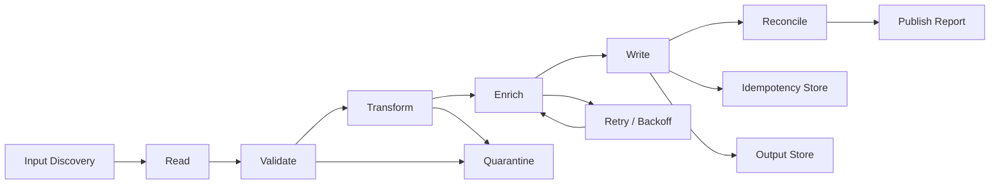

The key word is **durable**.

A normal in-memory pipeline disappears when the process dies. A batch pipeline must remember:

- which input was selected,
- which records were read,
- which chunks were committed,
- which records failed,
- which outputs were written,
- which side effects were emitted,
- and which run produced which result.

Without durability, failure turns every batch job into an investigation.

---

## 3. Core Vocabulary

### 3.1 Job

A **job** is the named batch process.

Examples:

- `ImportCustomerRiskScores`
- `GenerateMonthlyPenaltyNotices`
- `RecalculateCaseEscalationDeadlines`
- `LoadReferenceDataFromRegulatorFeed`

A job definition should be stable enough to have operational meaning.

Bad:

```text
ProcessFile
```

Better:

```text
ImportDailySanctionsScreeningResult
```

### 3.2 Job Instance

A **job instance** is a logical execution for a particular input identity.

Examples:

```text
ImportDailySanctionsScreeningResult(date=2026-06-27, source=provider-a)
GenerateMonthlyPenaltyNotices(period=2026-05)
```

This matters because retrying a failed run should usually be the same logical instance, not a new unrelated run.

Spring Batch models this distinction explicitly: a job instance is identified by the job plus identifying job parameters, and can have multiple executions.

### 3.3 Job Execution

A **job execution** is one attempt to run a job instance.

A failed execution and a restarted execution may belong to the same job instance.

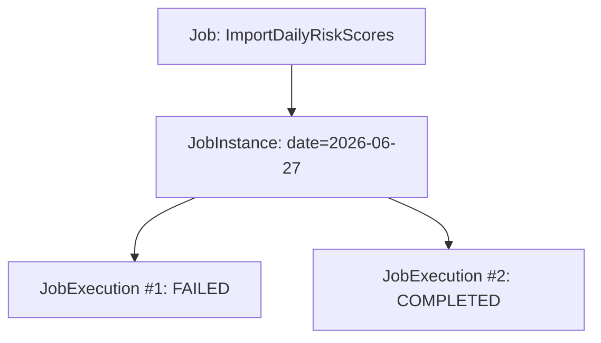

### 3.4 Step

A **step** is a meaningful phase inside a job.

Examples:

1. discover input files,
2. validate manifest,
3. import rows,
4. reconcile counts,
5. publish completion event.

A step should be independently observable and restartable where possible.

### 3.5 Chunk

A **chunk** is a group of records processed and committed together.

Chunking prevents two dangerous extremes:

- one transaction per entire file,
- one transaction per single record.

Spring Batch describes chunk-oriented processing as reading items one at a time and creating chunks that are written within a transaction boundary.

### 3.6 Checkpoint

A **checkpoint** records progress.

Examples:

- last processed line number,
- last processed offset,
- last processed primary key,
- committed chunk sequence,
- source file hash,
- watermark timestamp,
- cursor token.

Checkpointing is the foundation of restartability.

### 3.7 Quarantine

A **quarantine** is a safe holding area for records that cannot be processed but should not necessarily fail the whole job.

Quarantine is different from logging. A quarantined record is recoverable, inspectable, and often replayable.

### 3.8 Reconciliation

**Reconciliation** proves the relationship between input and output.

At minimum:

```text
input_count = processed_count + skipped_count + quarantined_count
output_count = successfully_written_count
side_effect_count = successfully_emitted_count
```

For high-integrity systems, reconciliation is not optional.

---

## 4. The Production Batch Architecture

A production batch pipeline usually has these layers:

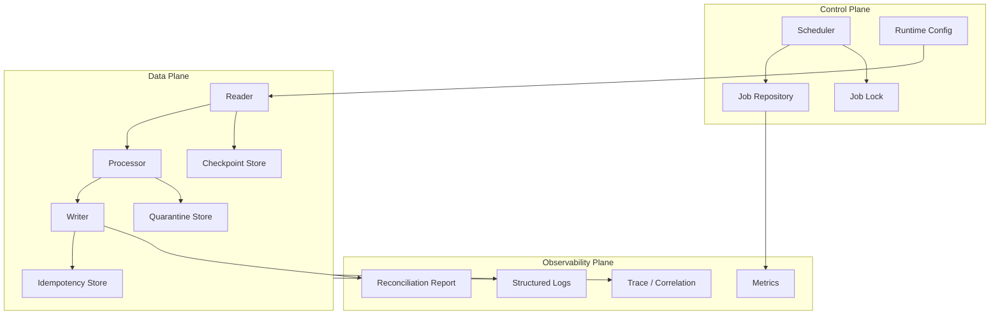

Separate these concerns mentally:

| Plane | Responsibility |
|---|---|
| Control plane | decides what runs, when, with which parameters, and whether it can restart. |
| Data plane | reads, transforms, validates, writes, and handles records. |
| Observability plane | explains what happened. |

Many fragile batch systems mix all three inside one giant method.

---

## 5. Pattern: Manifest-Based Input Discovery

### Problem

A batch job needs to know exactly which input belongs to a run.

Naive implementations scan a folder and process whatever appears.

That is dangerous because:

- files may still be uploading,
- duplicate files may exist,
- partial files may be processed,
- reruns may pick different files,
- operators cannot prove what input was used.

### Pattern

Use a **manifest** to define the input set.

Example manifest:

```json
{
  "feedName": "daily-risk-score",
  "businessDate": "2026-06-27",
  "schemaVersion": "3.2",
  "files": [
    {
      "name": "risk-score-2026-06-27-001.csv",
      "sha256": "...",
      "recordCount": 250000
    },
    {
      "name": "risk-score-2026-06-27-002.csv",
      "sha256": "...",
      "recordCount": 240000
    }
  ]
}
```

The manifest becomes the identity of the input.

### Java Model

```java
import java.time.LocalDate;
import java.util.List;

public record BatchManifest(
        String feedName,
        LocalDate businessDate,
        String schemaVersion,
        List<ManifestFile> files
) {
    public BatchManifest {
        if (feedName == null || feedName.isBlank()) {
            throw new IllegalArgumentException("feedName is required");
        }
        if (files == null || files.isEmpty()) {
            throw new IllegalArgumentException("manifest must contain at least one file");
        }
        files = List.copyOf(files);
    }
}

public record ManifestFile(
        String name,
        String sha256,
        long recordCount
) {}
```

### Invariants

A manifest-based run should enforce:

- every file exists,
- every checksum matches,
- declared record count matches actual count,
- schema version is supported,
- the same manifest cannot be processed twice unless explicitly rerun,
- a rerun processes the same input set.

### When To Use

Use this for:

- regulatory feeds,
- financial files,
- monthly reports,
- billing runs,
- risk scoring runs,
- enforcement lifecycle recalculations,
- any batch with audit requirements.

### When It Is Overkill

It may be overkill for:

- local developer scripts,
- disposable analytics exploration,
- small internal non-critical imports.

But be careful: many “temporary imports” become production obligations.

---

## 6. Pattern: Watermark-Based Incremental Extraction

### Problem

A batch job needs to process only new or changed data since the previous successful run.

Naive approach:

```sql
select * from cases where updated_at > ?
```

This can fail when:

- timestamps have low precision,
- clocks drift,
- updates arrive late,
- two rows share the same timestamp,
- a previous run partially succeeded,
- the source updates records during extraction.

### Pattern

Use a **watermark** with a stable tie-breaker.

```sql
select *
from cases
where (updated_at > :last_updated_at)
   or (updated_at = :last_updated_at and id > :last_id)
order by updated_at, id
limit :batch_size
```

Checkpoint:

```java
public record Watermark(
        java.time.Instant updatedAt,
        long id
) {}
```

### Safer Extraction Window

For systems with late updates, use an overlap window:

```text
extract_from = last_successful_watermark - overlap_duration
```

Then rely on idempotent writes to handle duplicates.

### Trade-off

| Approach | Benefit | Risk |
|---|---|---|
| strict watermark | efficient | misses late records |
| overlapping watermark | safer | duplicates must be handled |
| full reload | simple correctness | expensive |
| change-data-capture | strong incremental semantics | infrastructure complexity |

### Design Rule

A watermark is not a correctness guarantee by itself.

A watermark plus idempotent output plus reconciliation is much stronger.

---

## 7. Pattern: Chunk-Oriented Processing

### Problem

Processing a large data set in one transaction is unsafe.

Problems:

- transaction timeout,
- huge locks,
- massive rollback,
- memory pressure,
- poor restartability,
- poor operator visibility.

Processing one record per transaction also has costs:

- high commit overhead,
- poor throughput,
- too many round trips,
- fragmented observability.

### Pattern

Process records in chunks.

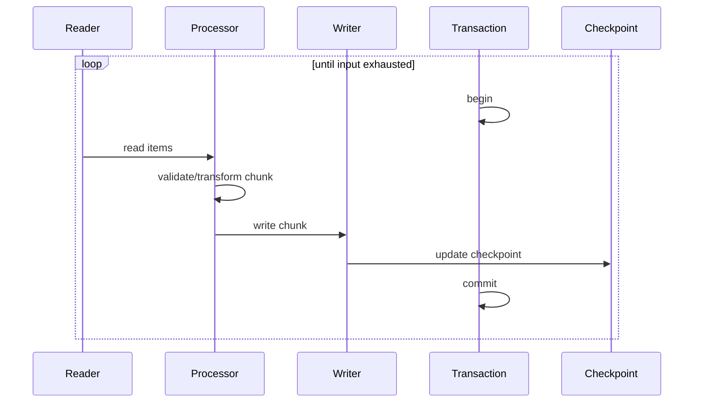

### Minimal Java Skeleton

```java
import java.util.ArrayList;
import java.util.List;

public interface ItemReader<T> {
    T read() throws Exception;
}

public interface ItemProcessor<I, O> {
    O process(I item) throws Exception;
}

public interface ItemWriter<O> {
    void write(List<O> items) throws Exception;
}

public final class ChunkRunner<I, O> {
    private final ItemReader<I> reader;
    private final ItemProcessor<I, O> processor;
    private final ItemWriter<O> writer;
    private final int chunkSize;

    public ChunkRunner(
            ItemReader<I> reader,
            ItemProcessor<I, O> processor,
            ItemWriter<O> writer,
            int chunkSize
    ) {
        if (chunkSize <= 0) {
            throw new IllegalArgumentException("chunkSize must be positive");
        }
        this.reader = reader;
        this.processor = processor;
        this.writer = writer;
        this.chunkSize = chunkSize;
    }

    public void run() throws Exception {
        while (true) {
            List<O> chunk = new ArrayList<>(chunkSize);

            for (int i = 0; i < chunkSize; i++) {
                I item = reader.read();
                if (item == null) {
                    break;
                }
                chunk.add(processor.process(item));
            }

            if (chunk.isEmpty()) {
                return;
            }

            writer.write(chunk);
        }
    }
}
```

This skeleton intentionally omits transactions, checkpointing, skip, and retry. That omission is the point: a real batch framework adds those production concerns.

### Chunk Size Selection

Chunk size is not just a performance knob.

It affects:

- rollback size,
- memory pressure,
- lock duration,
- duplicate replay size,
- checkpoint granularity,
- write batching efficiency,
- downstream side effects.

A useful starting heuristic:

| Record Type | Starting Chunk Size |
|---|---:|
| heavy enrichment / remote calls | 10–100 |
| database row import | 100–1,000 |
| simple file transform | 1,000–10,000 |
| large payload records | smaller, memory-bound |

Never choose chunk size based only on throughput. Choose it based on **failure blast radius**.

---

## 8. Pattern: Checkpoint and Restart

### Problem

A failed job should not force us to start from zero unless starting from zero is explicitly safe.

### Pattern

Persist enough progress to resume.

```java
import java.time.Instant;
import java.util.Map;

public record Checkpoint(
        String jobName,
        String jobInstanceId,
        String stepName,
        long chunkSequence,
        Map<String, String> cursor,
        Instant updatedAt
) {}
```

Example cursor values:

```json
{
  "file": "risk-score-2026-06-27-001.csv",
  "line": "250000",
  "lastCustomerId": "CUST-982881"
}
```

### Restart Modes

| Mode | Behavior | Use Case |
|---|---|---|
| resume | continue from last committed checkpoint | large input, idempotent chunks |
| replay chunk | reprocess last uncertain chunk | writer commit uncertainty |
| restart step | rerun current step from beginning | step is idempotent |
| restart job | rerun whole job | small input or full replacement output |
| manual repair | operator fixes data then resumes | quarantined or bad source data |

### Critical Rule

A checkpoint must be updated in the same transactional boundary as the effect it claims is complete, or it must be conservative.

Bad:

```text
1. update checkpoint
2. write output
3. crash before write completes
```

Now the job thinks output exists when it does not.

Safer:

```text
1. write output
2. update checkpoint
3. commit transaction
```

If output and checkpoint cannot share a transaction, use idempotency and reconciliation.

---

## 9. Pattern: Idempotent Writer

### Problem

Batch jobs retry, restart, and sometimes replay.

If the writer is not idempotent, duplicate side effects appear.

### Pattern

Give each output effect a deterministic idempotency key.

```java
public record OutputCommand(
        String idempotencyKey,
        String targetId,
        String payload
) {}
```

Example keys:

```text
risk-score-import:2026-06-27:provider-a:CUST-123
monthly-notice:2026-05:case-991
reference-load:v4:country-code:ID
```

### Database Upsert Example

```sql
insert into imported_risk_score (
    idempotency_key,
    customer_id,
    score,
    source_business_date,
    created_at
) values (?, ?, ?, ?, now())
on conflict (idempotency_key) do update
set score = excluded.score,
    source_business_date = excluded.source_business_date;
```

### Idempotency Store Example

```sql
create table batch_idempotency_record (
    idempotency_key varchar(300) primary key,
    job_instance_id varchar(100) not null,
    effect_type varchar(100) not null,
    effect_hash varchar(128) not null,
    status varchar(30) not null,
    created_at timestamp not null,
    updated_at timestamp not null
);
```

### Important Distinction

Idempotent does not always mean “ignore duplicate.”

It can mean:

| Duplicate Case | Correct Action |
|---|---|
| same key, same payload | ignore or return existing result |
| same key, different payload | raise conflict |
| same business entity, newer version | update if version is newer |
| same business entity, older version | reject or ignore |

### Java Conflict Check

```java
import java.security.MessageDigest;
import java.util.HexFormat;

public final class EffectHasher {
    public String sha256(String payload) {
        try {
            MessageDigest digest = MessageDigest.getInstance("SHA-256");
            return HexFormat.of().formatHex(digest.digest(payload.getBytes(java.nio.charset.StandardCharsets.UTF_8)));
        } catch (Exception e) {
            throw new IllegalStateException("Unable to hash effect payload", e);
        }
    }
}
```

Hashing the payload lets the writer detect whether a duplicate key is harmless or suspicious.

---

## 10. Pattern: Error Classification

### Problem

Not all errors should behave the same way.

A network timeout and an invalid customer identifier are not equivalent.

### Pattern

Classify errors into operational categories.

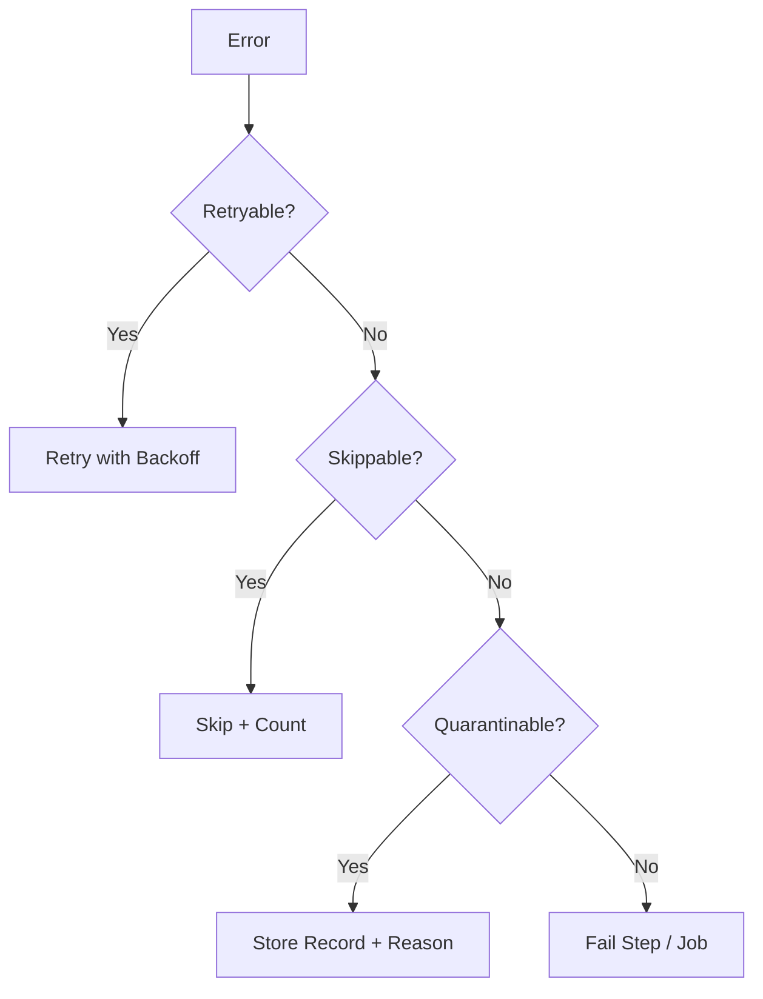

### Error Taxonomy

| Category | Examples | Action |
|---|---|---|
| transient infrastructure | timeout, temporary DB deadlock, broker unavailable | retry with backoff |
| source data invalid | bad date, malformed enum, missing required field | quarantine or skip |
| business rule violation | impossible transition, invalid status | quarantine or fail depending criticality |
| deterministic code bug | null pointer, mapping bug | fail job |
| downstream rejection | API validation error, constraint violation | classify based on cause |
| duplicate effect | same key already processed | idempotent success or conflict |
| data corruption | checksum mismatch, record count mismatch | fail job |

### Retry Policy

A retry policy needs:

- max attempts,
- backoff strategy,
- retryable exception list,
- non-retryable exception list,
- exhaustion action,
- observability.

```java
public record RetryPolicy(
        int maxAttempts,
        java.time.Duration initialBackoff,
        java.time.Duration maxBackoff
) {
    public RetryPolicy {
        if (maxAttempts < 1) {
            throw new IllegalArgumentException("maxAttempts must be at least 1");
        }
    }
}
```

### Skip Policy

A skip policy answers:

- Which exceptions are skippable?
- How many skips are allowed?
- Is the limit per chunk, step, file, or whole job?
- Does skip require a reconciliation warning?
- Does skip require human approval?

Spring Batch supports skip logic and retry logic as explicit fault-tolerance concerns in chunk-oriented steps.

### Rule of Thumb

Retry infrastructure uncertainty.

Quarantine data uncertainty.

Fail integrity uncertainty.

---

## 11. Pattern: Quarantine Store

### Problem

Invalid records should not disappear into logs.

Logs are not a data recovery system.

### Pattern

Persist invalid records with enough context to inspect, fix, and replay them.

```sql
create table batch_quarantine_record (
    id bigint generated always as identity primary key,
    job_instance_id varchar(100) not null,
    step_name varchar(100) not null,
    source_name varchar(300) not null,
    source_position varchar(300) not null,
    raw_payload text not null,
    error_code varchar(100) not null,
    error_message text not null,
    schema_version varchar(50),
    created_at timestamp not null,
    replay_status varchar(30) not null default 'PENDING'
);
```

### Java Model

```java
import java.time.Instant;

public record QuarantineRecord(
        String jobInstanceId,
        String stepName,
        String sourceName,
        String sourcePosition,
        String rawPayload,
        String errorCode,
        String errorMessage,
        String schemaVersion,
        Instant createdAt
) {}
```

### Quarantine vs Dead-Letter Queue

| Aspect | Quarantine Store | Dead-Letter Queue |
|---|---|---|
| Typical use | batch records, data repair | messaging failures |
| Access pattern | query, inspect, correct, replay | consume, inspect, requeue |
| Retention | often longer | often operationally bounded |
| Schema | structured metadata | message envelope |

### Good Quarantine Records Include

- raw payload,
- parsed fields where possible,
- source file/topic/table,
- source offset/line/key,
- job instance id,
- error code,
- error message,
- stack trace reference,
- schema version,
- remediation status,
- replay attempt count.

### Anti-pattern

Do not store only:

```text
Failed row: bad data
```

That is not actionable.

---

## 12. Pattern: Reconciliation Report

### Problem

A batch job may complete technically but still be wrong.

Examples:

- source declared 1,000,000 records, but only 998,000 were read,
- 10,000 records were skipped silently,
- output table received more rows than input because of duplicate effects,
- a downstream notification service accepted fewer notices than generated.

### Pattern

Generate a reconciliation report at the end of the job.

```java
public record ReconciliationReport(
        String jobInstanceId,
        long declaredInputCount,
        long actualReadCount,
        long processedCount,
        long skippedCount,
        long quarantinedCount,
        long writtenCount,
        long duplicateCount,
        long failedCount
) {
    public boolean isBalanced() {
        return actualReadCount == processedCount + skippedCount + quarantinedCount + failedCount;
    }
}
```

### Example Report

```text
Job: ImportDailyRiskScores
Instance: 2026-06-27/provider-a
Declared input: 490,000
Actual read: 490,000
Processed: 489,970
Quarantined: 30
Skipped: 0
Written: 489,970
Duplicates: 1,250
Failed: 0
Status: COMPLETED_WITH_QUARANTINE
```

### Completion States

Avoid binary `SUCCESS` / `FAILED` when the domain needs nuance.

Use states such as:

| State | Meaning |
|---|---|
| completed | all records processed and reconciled |
| completed_with_quarantine | processing completed but some records need review |
| completed_with_warnings | non-fatal anomalies exist |
| failed_integrity_check | reconciliation failed |
| failed_retry_exhausted | retryable failures exceeded policy |
| failed_fatal | deterministic fatal error |
| cancelled | operator cancelled safely |

### Regulatory Systems Note

For enforcement, compliance, or audit-sensitive systems, reconciliation is part of defensibility.

A system should answer:

> “Why did this case have this value at this time, and which batch run produced it?”

If it cannot answer that, the architecture is not yet production-grade.

---

## 13. Pattern: Snapshot Output

### Problem

Some batch outputs represent a point-in-time view.

Examples:

- daily risk score snapshot,
- monthly arrears report,
- case escalation candidate list,
- regulatory exposure summary.

Updating rows in place destroys history.

### Pattern

Write snapshot outputs with batch identity.

```sql
create table case_escalation_snapshot (
    snapshot_id varchar(100) not null,
    case_id varchar(100) not null,
    risk_level varchar(30) not null,
    escalation_due_date date,
    calculated_at timestamp not null,
    source_job_instance_id varchar(100) not null,
    primary key (snapshot_id, case_id)
);
```

### Query Current Snapshot

```sql
select *
from case_escalation_snapshot
where snapshot_id = (
    select max(snapshot_id)
    from snapshot_registry
    where snapshot_type = 'CASE_ESCALATION'
      and status = 'PUBLISHED'
);
```

### Publish Step

Use a publish marker:

```sql
insert into snapshot_registry (
    snapshot_id,
    snapshot_type,
    job_instance_id,
    status,
    published_at
) values (?, 'CASE_ESCALATION', ?, 'PUBLISHED', now());
```

This lets us prepare a snapshot and publish it atomically from the reader perspective.

---

## 14. Pattern: Staging Table

### Problem

Incoming data often needs validation before it becomes canonical.

Directly writing source data into domain tables causes:

- partial corruption,
- unclear validation status,
- difficult repair,
- poor traceability.

### Pattern

Use staging tables.

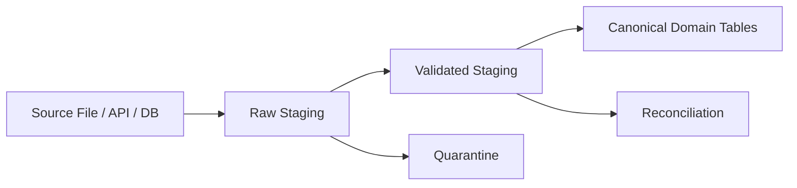

### Staging Levels

| Level | Description |
|---|---|
| raw staging | stores original input as received |
| parsed staging | stores parsed fields and parse errors |
| validated staging | stores records that pass technical validation |
| canonical tables | stores domain-approved facts or state |

### Benefits

- repeatable validation,
- easier debugging,
- safer schema migration,
- better auditability,
- supports replay,
- isolates source instability.

### Cost

- more tables,
- more storage,
- more cleanup policy,
- more explicit lifecycle management.

For critical data flows, this cost is usually justified.

---

## 15. Pattern: Replace-Set Load

### Problem

Some reference data is best treated as a complete set.

Examples:

- country codes,
- regulator category mappings,
- sanctions list snapshot,
- product taxonomy,
- valid license types.

Incremental updates may be more complex than loading a complete replacement set.

### Pattern

Load into a new version, validate, then publish the version.

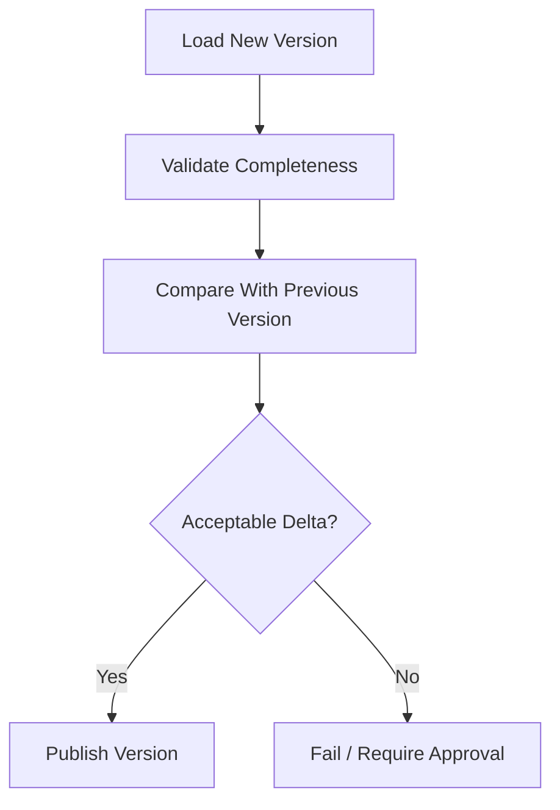

### Schema

```sql
create table reference_data_version (
    version_id varchar(100) primary key,
    reference_type varchar(100) not null,
    status varchar(30) not null,
    loaded_at timestamp not null,
    published_at timestamp
);

create table reference_country_code (
    version_id varchar(100) not null,
    country_code varchar(2) not null,
    country_name varchar(200) not null,
    primary key (version_id, country_code)
);
```

### Delta Guard

Before publishing, compare with previous version:

```text
previous_count = 251
new_count = 47
```

This is suspicious. It might be valid, but it should not publish silently.

---

## 16. Pattern: Slowly Changing Dimension

### Problem

A business attribute changes over time, but historical interpretation must remain correct.

Example:

A company’s risk category changed from `MEDIUM` to `HIGH` in June. A case decision in May should still reflect the May category.

### Pattern

Store effective-dated records.

```sql
create table customer_risk_category_history (
    customer_id varchar(100) not null,
    risk_category varchar(30) not null,
    effective_from date not null,
    effective_to date,
    source_job_instance_id varchar(100) not null,
    primary key (customer_id, effective_from)
);
```

### Query As-Of Date

```sql
select risk_category
from customer_risk_category_history
where customer_id = ?
  and effective_from <= ?
  and (effective_to is null or effective_to > ?);
```

### Invariants

- no overlapping effective intervals for same entity,
- every change has source identity,
- current row is easy to query,
- historical row is never mutated except to close interval.

### Anti-pattern

Do not overwrite a field if the domain requires historical explanation.

---

## 17. Pattern: Late Data Handling

### Problem

Data may arrive after the job window closes.

Examples:

- delayed external feed,
- backdated correction,
- delayed event delivery,
- manual data repair.

### Pattern Options

| Pattern | Description | Use When |
|---|---|---|
| ignore late data | reject records after cutoff | strict reporting window |
| process into next window | accept late data later | business allows delay |
| correction batch | generate adjustment facts | audit-sensitive reports |
| recompute window | rerun affected period | deterministic calculation |
| versioned snapshot | publish corrected snapshot version | historical reports need revision |

### Correction Fact Example

```java
public record CorrectionFact(
        String originalPeriod,
        String correctionPeriod,
        String entityId,
        String reason,
        String sourceJobInstanceId
) {}
```

### Design Rule

Never hide late data by silently mutating previous outputs without trace.

Late data is a lifecycle event.

---

## 18. Pattern: Schema Evolution Boundary

### Problem

Inputs change.

Fields are added, renamed, split, merged, deprecated, or reinterpreted.

A fragile batch job assumes one fixed schema forever.

### Pattern

Version the input contract and map each supported version explicitly.

```java
public sealed interface RiskScoreRow permits RiskScoreRowV1, RiskScoreRowV2, RiskScoreRowV3 {
    String customerId();
}

public record RiskScoreRowV1(
        String customerId,
        int score
) implements RiskScoreRow {}

public record RiskScoreRowV2(
        String customerId,
        int score,
        String scoreReason
) implements RiskScoreRow {}

public record RiskScoreRowV3(
        String customerId,
        int score,
        String scoreReason,
        String modelVersion
) implements RiskScoreRow {}
```

### Mapper

```java
public final class RiskScoreCanonicalMapper {
    public CanonicalRiskScore map(RiskScoreRow row) {
        return switch (row) {
            case RiskScoreRowV1 v1 -> new CanonicalRiskScore(
                    v1.customerId(),
                    v1.score(),
                    "UNKNOWN",
                    "legacy-v1"
            );
            case RiskScoreRowV2 v2 -> new CanonicalRiskScore(
                    v2.customerId(),
                    v2.score(),
                    v2.scoreReason(),
                    "legacy-v2"
            );
            case RiskScoreRowV3 v3 -> new CanonicalRiskScore(
                    v3.customerId(),
                    v3.score(),
                    v3.scoreReason(),
                    v3.modelVersion()
            );
        };
    }
}
```

### Invariant

Canonical output should not depend accidentally on source version.

Every version adaptation should be explicit.

---

## 19. Pattern: Partitioned Batch

### Problem

One sequential job is too slow.

### Pattern

Split the work into partitions that can run independently.

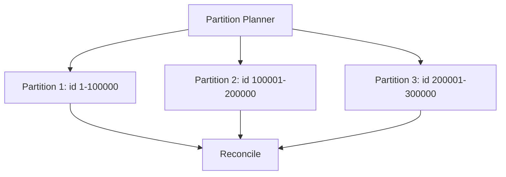

### Partition Strategies

| Strategy | Example | Risk |
|---|---|---|
| range partition | id 1–100000 | skew if IDs uneven |
| hash partition | hash(customer_id) mod N | hard to inspect manually |
| file partition | one file per worker | file size skew |
| tenant partition | one tenant per worker | hot tenant |
| date partition | one day/month per worker | uneven historical volume |
| status partition | pending/closed/escalated | skew and domain coupling |

### Partition Contract

Each partition needs:

- unique partition id,
- deterministic input range,
- independent checkpoint,
- independent idempotency keys,
- independent metrics,
- final aggregation into job-level reconciliation.

### Idempotency Key With Partition

```text
job:2026-06-27:partition-07:customer-123
```

But be careful: if partition assignment changes between reruns, partition-based idempotency can break.

Prefer idempotency keys based on business identity and job instance, not execution topology.

---

## 20. Pattern: Parallel Step Execution

### Problem

A job has independent phases that can run concurrently.

Example:

- load customer feed,
- load account feed,
- load product feed,
- then join and reconcile.

### Pattern

Run independent steps in parallel and join before dependent steps.

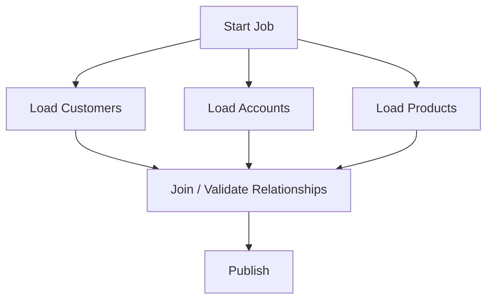

### Rule

Parallelize only when dependencies are explicit.

If steps share mutable state implicitly, concurrency will create nondeterministic failures.

---

## 21. Pattern: External Side-Effect Isolation

### Problem

Batch jobs often call external systems:

- send emails,
- publish messages,
- call APIs,
- generate documents,
- update third-party records.

External side effects are dangerous in restartable jobs.

### Pattern

Separate calculation from side-effect delivery.

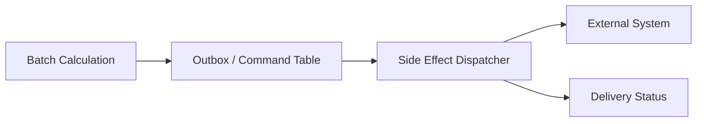

### Command Table

```sql
create table outbound_batch_command (
    command_id varchar(100) primary key,
    job_instance_id varchar(100) not null,
    command_type varchar(100) not null,
    target_id varchar(100) not null,
    payload text not null,
    status varchar(30) not null,
    attempt_count int not null,
    next_attempt_at timestamp,
    created_at timestamp not null,
    updated_at timestamp not null
);
```

### Why This Works

The batch job writes intended side effects durably. A dispatcher handles delivery with retries, idempotency, and monitoring.

This prevents a job restart from accidentally sending duplicate emails or API calls.

---

## 22. Pattern: Batch Saga for Multi-System Effects

### Problem

A batch job updates multiple systems and cannot use a single transaction.

Example:

1. create penalty notice record,
2. generate PDF,
3. store document,
4. send notification,
5. update case timeline.

### Pattern

Model the side effects as a saga-like process with explicit state.

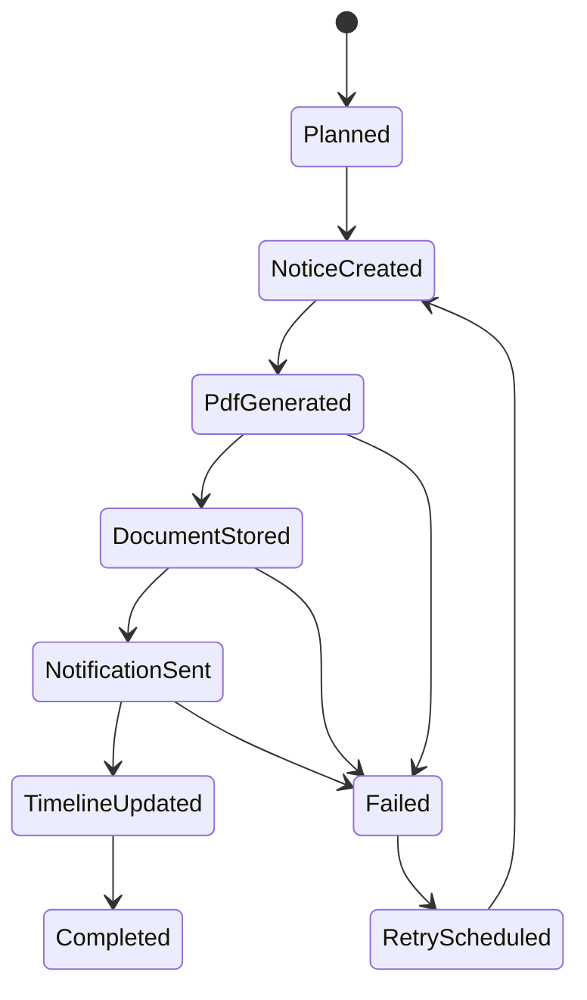

### Design Rule

If the side effect has business meaning, it deserves state.

Do not bury it inside a `catch` block.

---

## 23. Pattern: Data Quality Gate

### Problem

Bad data entering the canonical domain causes expensive downstream damage.

### Pattern

Put explicit data quality gates before canonical writes.

```java
public interface DataQualityRule<T> {
    ValidationResult validate(T item);
}

public record ValidationResult(
        boolean valid,
        String code,
        String message
) {
    public static ValidationResult ok() {
        return new ValidationResult(true, "OK", "valid");
    }

    public static ValidationResult fail(String code, String message) {
        return new ValidationResult(false, code, message);
    }
}
```

### Rule Categories

| Category | Example |
|---|---|
| technical format | date format, numeric field, enum value |
| required fields | customer id must exist |
| referential integrity | case id must exist |
| business consistency | closed case cannot receive active escalation |
| range constraint | score must be 0–100 |
| temporal constraint | effective date must not overlap existing interval |
| duplicate constraint | source id must be unique for this feed |

### Severity

Rules should have severity:

| Severity | Action |
|---|---|
| info | continue, report |
| warning | continue, report prominently |
| quarantine | isolate record |
| fatal | fail job |

---

## 24. Pattern: Operational Lock

### Problem

The same job instance may be triggered twice.

Causes:

- scheduler retry,
- manual operator action,
- deployment restart,
- multiple nodes,
- clock skew.

### Pattern

Use a job lock keyed by logical job instance.

```sql
create table batch_job_lock (
    lock_key varchar(300) primary key,
    owner_id varchar(100) not null,
    acquired_at timestamp not null,
    expires_at timestamp not null
);
```

### Lock Key

```text
ImportDailyRiskScores:2026-06-27:provider-a
```

### Lock Rules

- Acquire before running.
- Renew while running.
- Expire stale locks cautiously.
- Release on completion.
- Treat lock loss as a serious event.

### Warning

A lock prevents concurrent executions. It does not replace idempotency.

Assume the lock can fail under network partitions, process pauses, or misconfiguration.

---

## 25. Pattern: Batch Window and Cutoff

### Problem

Batch jobs often have time windows.

Examples:

- daily feed closes at 23:59,
- monthly penalty run includes cases active before month end,
- escalation recalculation uses the current regulatory calendar.

### Pattern

Represent the business window explicitly.

```java
import java.time.Instant;
import java.time.LocalDate;

public record BatchWindow(
        LocalDate businessDate,
        Instant extractFromInclusive,
        Instant extractToExclusive
) {}
```

### Why Not Use “Now” Everywhere?

Using `now()` inside processing creates nondeterminism.

Bad:

```java
if (caseFile.updatedAt().isBefore(Instant.now())) {
    process(caseFile);
}
```

Better:

```java
if (caseFile.updatedAt().isBefore(window.extractToExclusive())) {
    process(caseFile);
}
```

The window belongs to the job instance.

---

## 26. Pattern: Deterministic Transformation

### Problem

A replayed batch should produce the same output for the same input and same reference data.

Nondeterministic transformations make debugging difficult.

### Sources of Nondeterminism

- `Instant.now()` inside transformation,
- random IDs,
- unordered map iteration used for output ordering,
- external service calls returning changed data,
- mutable reference data,
- non-versioned rules,
- race conditions in parallel processing.

### Pattern

Inject execution context explicitly.

```java
public record BatchExecutionContext(
        String jobInstanceId,
        BatchWindow window,
        String ruleVersion,
        java.time.Clock clock
) {}
```

### Deterministic Processor

```java
public final class EscalationCandidateProcessor {
    public EscalationCandidate process(CaseFile caseFile, BatchExecutionContext context) {
        return new EscalationCandidate(
                caseFile.id(),
                context.window().businessDate(),
                context.ruleVersion(),
                calculateRiskBand(caseFile)
        );
    }

    private String calculateRiskBand(CaseFile caseFile) {
        // deterministic rule logic
        return caseFile.openViolationCount() >= 3 ? "HIGH" : "NORMAL";
    }
}
```

### Rule

Do not let hidden time, hidden randomness, or hidden mutable dependencies decide batch output.

---

## 27. Pattern: Reprocessing and Replay

### Problem

Operators need to repair and rerun failed or corrected data.

### Pattern

Support controlled replay modes.

| Replay Mode | Description |
|---|---|
| replay quarantined records | only records that failed data validation |
| replay job instance | same input, same parameters |
| replay with new rule version | same input, new transformation logic |
| replay affected entity | reprocess records for selected entity |
| replay window | reprocess a business date or period |

### Replay Safety Checklist

Before replaying, answer:

- Will output replace old output or create a new version?
- Are side effects suppressed, re-emitted, or deduplicated?
- Are idempotency keys stable?
- Is the rule version the same or changed?
- How will reconciliation distinguish original and replayed output?
- Who approved the replay?

### Replay as First-Class Operation

Do not treat replay as a manual SQL script.

Replay should be modeled as an auditable operation.

---

## 28. Pattern: Backfill

### Problem

A new rule, data model, or derived field must be applied to historical data.

### Pattern

Create a backfill job with bounded scope, progress tracking, and safety controls.

### Backfill Inputs

```java
public record BackfillRequest(
        String backfillId,
        String targetDataset,
        String fromInclusive,
        String toExclusive,
        String ruleVersion,
        boolean dryRun
) {}
```

### Backfill Controls

- dry run mode,
- maximum records per run,
- pause/resume,
- per-partition checkpoint,
- reconciliation sample,
- canary partition,
- operator approval before publish,
- rollback or versioned output.

### Anti-pattern

Running an unbounded backfill directly against production tables during business hours is not bravery. It is uncontrolled risk.

---

## 29. Pattern: Dry Run

### Problem

Some batch effects are high-impact and need preview.

Examples:

- enforcement notices,
- billing corrections,
- penalty recalculations,
- mass customer status changes.

### Pattern

Implement dry run as a real execution mode that computes intended effects without committing final side effects.

```java
public enum ExecutionMode {
    DRY_RUN,
    COMMIT
}
```

### Dry Run Output

Dry run should produce:

- records that would be changed,
- before/after values,
- counts by category,
- rule versions,
- warnings,
- sample anomalies,
- approval package.

### Warning

A dry run is useful only if it exercises the same logic as commit mode.

Avoid separate “preview logic” that drifts from real logic.

---

## 30. Transaction Boundary Design

### The Transaction Boundary Question

For each step, ask:

> What is the smallest unit of work that can be safely committed and safely replayed?

### Common Boundaries

| Boundary | Use When | Risk |
|---|---|---|
| whole job | tiny all-or-nothing job | timeout, locks, no progress |
| step | step is small and atomic | large rollback |
| chunk | large data, good restartability | partial job completion |
| record | high isolation needed | poor throughput |
| output command | external side effect isolation | more state machine complexity |

### Transaction + External Calls

Avoid this:

```text
begin transaction
write database
call external API
commit transaction
```

If the API succeeds and the DB commit fails, recovery is difficult.

Prefer:

```text
begin transaction
write database
write outbound command
commit transaction

dispatch outbound command separately
```

This is the same reasoning behind outbox-like designs.

---

## 31. Observability for Batch Jobs

A batch job needs more than “started” and “finished.”

### Required Logs

Use structured logs for:

- job start,
- job completion,
- step start,
- step completion,
- chunk commit,
- retry attempt,
- retry exhaustion,
- quarantine record,
- reconciliation failure,
- operator action,
- replay action.

### Required Metrics

| Metric | Meaning |
|---|---|
| job_duration_seconds | total job duration |
| step_duration_seconds | step duration |
| records_read_total | input volume |
| records_processed_total | successful transformations |
| records_written_total | output volume |
| records_quarantined_total | invalid data volume |
| retry_attempts_total | transient failure pressure |
| chunk_commit_duration_seconds | write performance |
| checkpoint_lag | progress delay |
| duplicate_effects_total | idempotency activity |
| reconciliation_failures_total | integrity alarms |

### Required Dimensions

- job name,
- job instance id,
- execution id,
- step name,
- partition id,
- source name,
- schema version,
- rule version,
- business date.

### Traceability

Every output row should ideally be traceable back to:

```text
source input -> job instance -> step -> transformation rule -> output effect
```

---

## 32. Testing Patterns for Batch

### 32.1 Golden File Test

Given a fixed input file, assert the exact output.

```text
input/customers-v1.csv
expected/imported-customers.json
```

Useful for transformation stability.

### 32.2 Restart Test

Force a failure after N chunks, restart, and assert final output has no duplicates.

Test scenario:

```text
1. process chunks 1, 2, 3
2. fail during chunk 4
3. restart
4. verify chunks 1-3 are not duplicated
5. verify chunk 4 completes exactly once
```

### 32.3 Quarantine Test

Input contains malformed rows.

Assert:

- valid rows are written,
- invalid rows are quarantined,
- reconciliation balances,
- job status matches policy.

### 32.4 Idempotency Test

Run the same job instance twice.

Assert:

- output count remains stable,
- duplicate count increments or remains observable,
- no duplicate external effects occur.

### 32.5 Schema Compatibility Test

Feed v1, v2, and v3 input.

Assert canonical output semantics are correct.

### 32.6 Performance Smoke Test

Run enough data to reveal:

- memory growth,
- slow chunk commits,
- transaction timeouts,
- lock contention,
- bad indexes,
- excessive logging.

---

## 33. Java Implementation: Small Batch Kernel

This is not meant to replace Spring Batch. It is a learning kernel that exposes the core concepts.

```java
import java.time.Instant;
import java.util.ArrayList;
import java.util.List;

public final class BatchKernel<I, O> {
    private final RestartableReader<I> reader;
    private final FaultClassifyingProcessor<I, O> processor;
    private final IdempotentChunkWriter<O> writer;
    private final QuarantineSink<I> quarantineSink;
    private final CheckpointStore checkpointStore;
    private final int chunkSize;

    public BatchKernel(
            RestartableReader<I> reader,
            FaultClassifyingProcessor<I, O> processor,
            IdempotentChunkWriter<O> writer,
            QuarantineSink<I> quarantineSink,
            CheckpointStore checkpointStore,
            int chunkSize
    ) {
        this.reader = reader;
        this.processor = processor;
        this.writer = writer;
        this.quarantineSink = quarantineSink;
        this.checkpointStore = checkpointStore;
        this.chunkSize = chunkSize;
    }

    public BatchRunSummary run(BatchRunContext context) throws Exception {
        Checkpoint checkpoint = checkpointStore.load(context.jobInstanceId());
        reader.restore(checkpoint);

        long read = 0;
        long processed = 0;
        long quarantined = 0;
        long written = 0;

        while (true) {
            List<O> outputChunk = new ArrayList<>(chunkSize);
            List<SourceRecord<I>> inputChunk = new ArrayList<>(chunkSize);

            for (int i = 0; i < chunkSize; i++) {
                SourceRecord<I> sourceRecord = reader.read();
                if (sourceRecord == null) {
                    break;
                }

                read++;
                inputChunk.add(sourceRecord);

                try {
                    outputChunk.add(processor.process(sourceRecord.payload(), context));
                    processed++;
                } catch (QuarantinableException e) {
                    quarantineSink.write(sourceRecord, e, context);
                    quarantined++;
                }
            }

            if (inputChunk.isEmpty()) {
                break;
            }

            writer.write(outputChunk, context);
            written += outputChunk.size();

            Checkpoint newCheckpoint = reader.currentCheckpoint(context.jobInstanceId(), Instant.now());
            checkpointStore.save(newCheckpoint);
        }

        return new BatchRunSummary(read, processed, quarantined, written);
    }
}
```

Supporting interfaces:

```java
public record BatchRunContext(
        String jobName,
        String jobInstanceId,
        String executionId,
        BatchWindow window,
        String schemaVersion,
        String ruleVersion
) {}

public record SourceRecord<T>(
        String sourceName,
        String sourcePosition,
        T payload
) {}

public interface RestartableReader<I> {
    void restore(Checkpoint checkpoint) throws Exception;
    SourceRecord<I> read() throws Exception;
    Checkpoint currentCheckpoint(String jobInstanceId, java.time.Instant updatedAt);
}

public interface FaultClassifyingProcessor<I, O> {
    O process(I input, BatchRunContext context) throws Exception;
}

public interface IdempotentChunkWriter<O> {
    void write(List<O> outputs, BatchRunContext context) throws Exception;
}

public interface QuarantineSink<I> {
    void write(SourceRecord<I> record, Exception error, BatchRunContext context) throws Exception;
}

public interface CheckpointStore {
    Checkpoint load(String jobInstanceId);
    void save(Checkpoint checkpoint);
}

public final class QuarantinableException extends Exception {
    public QuarantinableException(String message) {
        super(message);
    }
}

public record BatchRunSummary(
        long read,
        long processed,
        long quarantined,
        long written
) {}
```

This kernel is intentionally simplified. Production systems need transaction management, retry backoff, parallelism, locking, metrics, logs, and operator controls.

Still, it reveals the core idea:

> A batch pipeline is a controlled state machine over data movement.

---

## 34. Spring Batch Mapping

Spring Batch provides production abstractions for many of these patterns.

| Pattern Concept | Spring Batch Concept |
|---|---|
| job definition | `Job` |
| job identity | `JobInstance` + identifying parameters |
| run attempt | `JobExecution` |
| phase | `Step` |
| progress metadata | `JobRepository`, `ExecutionContext` |
| reader | `ItemReader` |
| processor | `ItemProcessor` |
| writer | `ItemWriter` |
| chunk transaction | chunk-oriented step |
| skip | skip policy / skip limit |
| retry | retry policy |
| partitioning | partitioned step |
| restartability | job repository metadata |

### Important Practical Advice

Do not use Spring Batch as a magical annotation layer.

Use it because it formalizes real concepts:

- job identity,
- restartability,
- transaction boundary,
- reader/processor/writer separation,
- execution metadata,
- skip/retry behavior,
- partitioning.

If we cannot explain those concepts without the framework, we are not yet designing the system; we are just configuring it.

---

## 35. Batch Failure Modes

| Failure Mode | Symptom | Prevention / Detection |
|---|---|---|
| duplicate run | same job triggered twice | job lock, idempotency, unique job instance |
| partial write | crash mid-chunk | transaction boundary, checkpoint discipline |
| checkpoint lies | checkpoint advanced before output commit | transactional checkpoint or conservative replay |
| duplicate side effect | emails/API calls sent twice | outbox, idempotency key, dispatcher |
| silent skip | invalid records disappear | quarantine, skip report, reconciliation |
| schema drift | parser misreads changed feed | schema versioning, compatibility tests |
| huge transaction | timeout/locks | chunking |
| unbounded memory | accumulating all records | streaming/chunking |
| poisoned record loop | retry same deterministic invalid record | error classification, quarantine |
| late data corruption | previous report changed silently | correction facts, versioned snapshots |
| no operator recovery | manual SQL required | restart/replay workflow |
| incorrect parallelism | duplicate partitions or missing ranges | deterministic partition plan + reconciliation |
| nondeterministic replay | rerun output differs unexpectedly | explicit context, rule versioning, reference snapshots |

---

## 36. Anti-Patterns

### 36.1 The Giant Batch Method

```java
public void runEverything() {
    readFiles();
    parse();
    validate();
    write();
    sendEmails();
    cleanup();
}
```

Symptoms:

- no restart boundary,
- hard to test,
- unclear state,
- poor observability,
- all failures look fatal.

Refactor into steps and chunks.

### 36.2 Log-Only Error Handling

```java
try {
    process(row);
} catch (Exception e) {
    log.warn("failed", e);
}
```

This loses data quality information.

Use quarantine or explicit skip policy.

### 36.3 One Huge Transaction

One transaction for a million records creates rollback and locking risk.

Use chunk transaction boundaries.

### 36.4 No Idempotency Because “The Scheduler Runs Once”

Schedulers retry. Humans rerun. Nodes restart. Deployments overlap.

Batch jobs need idempotency.

### 36.5 Timestamp Watermark Without Tie-Breaker

```sql
where updated_at > :last_updated_at
```

Records with the same timestamp can be missed.

Use `(updated_at, id)` or another stable cursor.

### 36.6 Side Effects Inside Processor

Processor should transform. It should not send emails, mutate remote systems, or publish irreversible effects.

Put side effects in a controlled writer/outbox/dispatcher boundary.

### 36.7 Successful Job Without Reconciliation

A green status without counts is not evidence.

Always reconcile high-value batch output.

---

## 37. Pattern Selection Matrix

| Requirement | Recommended Pattern |
|---|---|
| must rerun after failure | checkpoint + restart |
| cannot duplicate output | idempotent writer |
| input is file set | manifest-based discovery |
| input is incremental DB query | watermark with tie-breaker |
| invalid records should not block all data | quarantine |
| invalid records must stop processing | fatal data quality gate |
| output is point-in-time report | snapshot output |
| reference data is complete replacement | replace-set load |
| history must be explainable | effective-dated records |
| high volume | chunking + partitioning |
| external API call | outbound command/outbox |
| multiple systems | batch saga |
| operator preview needed | dry run |
| historical recomputation | backfill with controls |

---

## 38. Design Checklist

Before implementing a batch job, answer these questions.

### Identity

- What is the job name?
- What parameters identify a logical job instance?
- Can the same instance run twice?
- What is the run attempt id?

### Input

- How is the input discovered?
- Is there a manifest?
- Is there a schema version?
- Can input change during processing?
- How are duplicates detected?

### Processing

- What are the steps?
- What is the chunk size?
- What is the transaction boundary?
- What is deterministic and what is external?
- Which reference data version is used?

### Failure

- What is retryable?
- What is skippable?
- What is quarantinable?
- What is fatal?
- How are poisoned records handled?

### Restart

- What checkpoint is stored?
- When is it stored?
- Can checkpoint and output commit atomically?
- What happens after crash during write?

### Output

- Is output state, fact, snapshot, or command?
- What is the idempotency key?
- Can output be replayed?
- Can output be reconciled?

### Operations

- How is the job started?
- How is it stopped?
- How is it restarted?
- How is it replayed?
- What can an operator inspect?

### Observability

- What metrics exist?
- What logs exist?
- What report proves correctness?
- How is a specific output traced to source?

---

## 39. Practice Drill

Build a batch import for this scenario:

> A regulator sends a daily CSV file of entities under enhanced monitoring. The system must import the file, validate entities, update monitoring status, quarantine invalid records, and produce a reconciliation report. The job must restart safely after failure and must not duplicate status history.

### Requirements

- Input file has manifest with checksum and declared count.
- Each row contains `entity_id`, `monitoring_status`, `effective_date`, `reason_code`.
- `monitoring_status` must be one of `NORMAL`, `ENHANCED`, `SUSPENDED`.
- Invalid rows go to quarantine.
- Status history must be effective-dated.
- Duplicate rows must not create duplicate history.
- Job must support restart.
- Job must produce reconciliation report.

### Design Output

Produce:

1. job instance identity,
2. data model,
3. chunk size decision,
4. checkpoint model,
5. idempotency key,
6. quarantine schema,
7. reconciliation formula,
8. failure taxonomy,
9. restart scenario,
10. test plan.

### Stretch Goal

Add dry-run mode and operator approval before publishing status changes.

---

## 40. Summary

Batch and ETL systems fail when we treat them as scripts.

A production batch pipeline needs:

- explicit job identity,
- stable input discovery,
- chunk-based transaction boundaries,
- checkpoint/restart behavior,
- idempotent outputs,
- classified error handling,
- quarantine for bad records,
- reconciliation reports,
- deterministic transformation,
- versioned data contracts,
- operator recovery workflows,
- and observability.

The central mental model is:

> A batch job is a durable, replayable, auditable state machine over a bounded data set.

Once we think this way, batch design becomes less about loops and more about controlled data lifecycle.

---

## References

- Spring Batch Reference — Chunk-oriented processing, restart, skip, and retry concepts: https://docs.spring.io/spring-batch/reference/
- Spring Batch Reference — Configuring Skip Logic: https://docs.spring.io/spring-batch/reference/step/chunk-oriented-processing/configuring-skip.html
- Spring Batch Reference — Configuring Retry Logic: https://docs.spring.io/spring-batch/reference/step/chunk-oriented-processing/retry-logic.html
- Enterprise Integration Patterns — Pipes and Filters, Splitter, Aggregator, Dead Letter Channel: https://www.enterpriseintegrationpatterns.com/
- Microservices.io — Transactional Outbox: https://microservices.io/patterns/data/transactional-outbox.html
