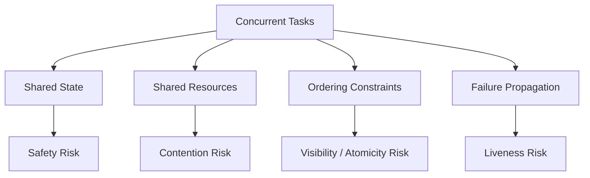
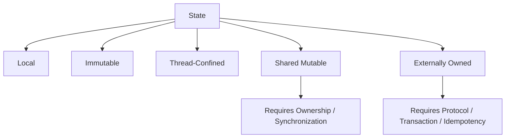
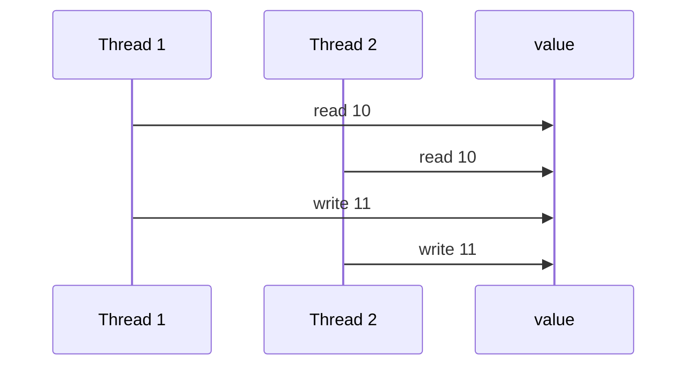
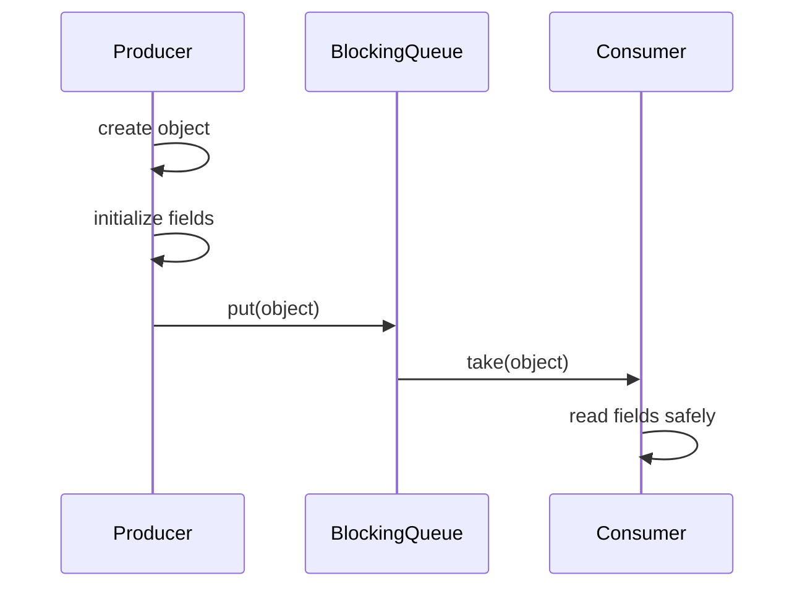
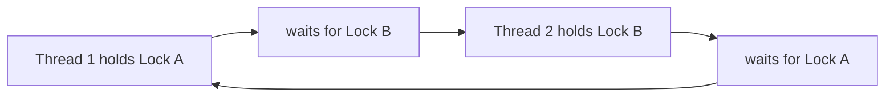
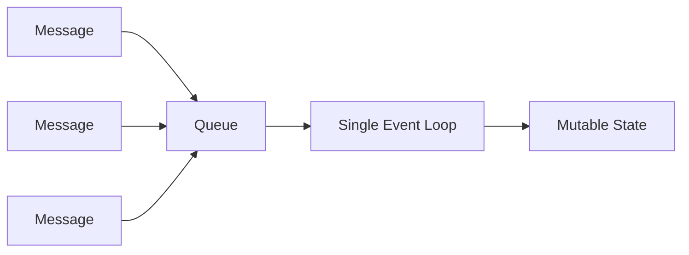
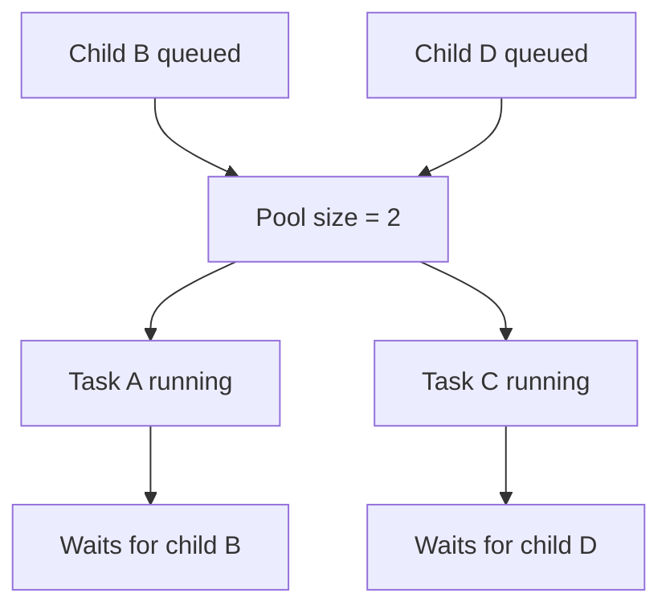

------
title: Learn Java Patterns - Part 016
description: Core concurrency mental models for advanced Java engineers: shared state, ownership, visibility, happens-before, contention, safety, liveness, cancellation, and failure reasoning.
series: learn-java-patterns
seriesTitle: Learn Java Patterns, Data Patterns, Pipeline Patterns, Concurrency Patterns, Common Patterns, and Anti-Patterns
order: 16
partTitle: Concurrency Mental Models
tags:
- java
- patterns
- concurrency
- jmm
- happens-before
- architecture
- advanced-java
date: 2026-06-27
---

# Part 016 — Concurrency Mental Models

Concurrency is where many otherwise strong Java engineers become unreliable.

The problem is not syntax. Most engineers know `synchronized`, `ExecutorService`, `CompletableFuture`, `AtomicInteger`, `ConcurrentHashMap`, and maybe virtual threads.

The problem is reasoning.

Concurrent programs fail because we misunderstand:

- which state is shared,
- who owns mutation,
- what visibility is guaranteed,
- whether operations are atomic,
- how tasks are cancelled,
- what blocks what,
- how queues grow,
- what happens under load,
- and how failure propagates.

This part builds the mental models needed before we study concrete locking, coordination, async, virtual thread, actor, and partitioning patterns in later parts.

---

## 1. Kaufman Skill Target

The skill target for this part is:

> Given a concurrent Java design, identify shared mutable state, define ownership, establish visibility and atomicity guarantees, reason about safety and liveness, and predict failure modes under contention, cancellation, and overload.

This is a diagnostic skill. You should be able to look at code and ask:

- What can happen concurrently?
- What is shared?
- Who can mutate it?
- What guarantees visibility?
- What guarantees atomicity?
- What prevents deadlock or starvation?
- What bounds work?
- What cancels work?
- What proves correctness?

### 1.1 Sub-skills

| Sub-skill | Outcome |
|---|---|
| State classification | Distinguish local, immutable, confined, shared, and externally owned state. |
| Ownership design | Assign mutation rights to one thread, one actor, one lock, one partition, or one transaction. |
| Atomicity reasoning | Identify operations that must be indivisible. |
| Visibility reasoning | Identify happens-before edges and safe publication boundaries. |
| Ordering reasoning | Know when operation order is guaranteed, weakly consistent, or accidental. |
| Contention modeling | Predict bottlenecks caused by locks, queues, pools, and hot keys. |
| Liveness analysis | Identify deadlock, livelock, starvation, thread leaks, and stuck cancellation. |
| Backpressure design | Bound queues, requests, resources, and concurrency. |
| Failure propagation | Decide how errors, timeouts, interrupts, and cancellations move through tasks. |
| Observability | Instrument concurrent systems so failures are explainable. |

### 1.2 The 20-Hour Practice Split

| Time | Practice |
|---:|---|
| 2h | Classify shared state in existing code. |
| 3h | Write broken concurrent examples and fix them. |
| 3h | Practice happens-before reasoning with small snippets. |
| 2h | Compare `synchronized`, `Lock`, `Atomic*`, and immutable designs. |
| 2h | Model deadlock, starvation, and queue overload. |
| 2h | Implement bounded producer-consumer with metrics. |
| 2h | Add cancellation and timeout behavior. |
| 2h | Stress test a concurrent component. |
| 2h | Review postmortems and identify failed mental models. |

The goal is not to memorize APIs. The goal is to reduce surprise.

---

## 2. Concurrency Is Coordination Around Scarcity

Concurrency is often described as “doing multiple things at the same time.”

That definition is too weak.

A more useful definition:

> Concurrency is the design of coordination when multiple flows of execution compete for state, time, CPU, memory, I/O, locks, queues, rate limits, or external resources.

A single-threaded system can be complex. A concurrent system adds competition.



The scarce thing may be:

- a database connection,
- a CPU core,
- a lock,
- a queue capacity,
- a remote API quota,
- a file handle,
- a partition key,
- memory,
- human attention,
- or a business invariant.

Concurrency design begins by identifying scarcity.

---

## 3. The Two Big Correctness Families

Concurrent correctness has two major families:

| Family | Question | Example Failure |
|---|---|---|
| Safety | Does the program avoid bad states? | lost update, duplicate transition, corrupted data |
| Liveness | Does the program keep making progress? | deadlock, starvation, stuck queue, leaked thread |

### 3.1 Safety

Safety means “nothing bad happens.”

Examples:

- a counter never goes backward,
- a case cannot transition from `CLOSED` to `UNDER_REVIEW`,
- two workers cannot assign the same task twice,
- a payment is not captured twice,
- a cache does not publish partially constructed values.

### 3.2 Liveness

Liveness means “something good eventually happens.”

Examples:

- queued work eventually runs,
- cancellation eventually stops work,
- retry eventually gives up,
- a lock is eventually released,
- a consumer eventually drains messages,
- a thread pool does not permanently saturate.

### 3.3 Why This Distinction Matters

A design can be safe but not live.

Example:

```java
synchronized void process() {
    while (true) {
        // no data corruption, but no progress either
    }
}
```

A design can be live but unsafe.

Example:

```java
counter++;
```

Multiple threads keep running, but increments are lost.

A top engineer asks both questions every time.

---

## 4. The Core State Classification

Before choosing a concurrency pattern, classify state.



### 4.1 Local State

Local variables that do not escape the thread are usually safe.

```java
public int sum(List<Integer> values) {
    int total = 0;
    for (int value : values) {
        total += value;
    }
    return total;
}
```

`total` is local. No other thread can access it.

### 4.2 Immutable State

Immutable objects can be shared safely if they are safely published.

```java
public record Money(String currency, long minorUnits) {}
```

A record is not automatically deeply immutable. If it contains mutable objects, copy defensively.

```java
public record CaseSnapshot(String caseId, List<String> violations) {
    public CaseSnapshot {
        violations = List.copyOf(violations);
    }
}
```

### 4.3 Thread-Confined State

Thread-confined state is mutable but only accessed by one thread.

Examples:

- local builder inside one request,
- actor internal state,
- partition-owned state,
- event-loop state,
- transaction-scoped persistence context.

Thread confinement is often simpler than locks.

### 4.4 Shared Mutable State

Shared mutable state is the dangerous category.

```java
private final List<String> events = new ArrayList<>();
```

If multiple threads mutate this list, we need a strategy.

Options:

- synchronize access,
- use a concurrent collection,
- copy-on-write,
- confine mutation to one owner,
- publish immutable snapshots,
- partition the state,
- remove sharing.

### 4.5 Externally Owned State

Examples:

- database rows,
- message broker offsets,
- remote API state,
- file system resources,
- distributed locks.

Java memory rules do not protect externally owned state. We need transactions, leases, idempotency, fencing tokens, version columns, or external consistency protocols.

---

## 5. Ownership Is the First Design Decision

The strongest concurrency designs begin with ownership.

> Every mutable fact should have a clear owner.

Ownership answers:

- Who is allowed to mutate this state?
- Under what protocol?
- How is ownership transferred?
- How is ownership observed?
- Can two owners exist at once?

### 5.1 Ownership Models

| Ownership Model | Description | Common Pattern |
|---|---|---|
| single-thread owner | one thread mutates state | event loop, actor |
| lock owner | whichever thread holds lock mutates | synchronized, `Lock` |
| atomic owner | mutation via atomic primitive | CAS, atomic reference |
| partition owner | key determines owner | sharding, single-writer partition |
| transaction owner | database transaction owns change | optimistic/pessimistic lock |
| immutable owner | no mutation after construction | value object, snapshot |
| message owner | state changes only via messages | actor/agent |

### 5.2 Bad Ownership

```java
public class CaseAssignmentService {
    private final Map<String, String> assigneeByCase = new HashMap<>();

    public void assign(String caseId, String userId) {
        assigneeByCase.put(caseId, userId);
    }

    public String assignee(String caseId) {
        return assigneeByCase.get(caseId);
    }
}
```

This class hides ownership. If used by multiple request threads, it is unsafe.

### 5.3 Better Options

Option A: synchronize.

```java
public class SynchronizedCaseAssignmentService {
    private final Map<String, String> assigneeByCase = new HashMap<>();

    public synchronized void assign(String caseId, String userId) {
        assigneeByCase.put(caseId, userId);
    }

    public synchronized String assignee(String caseId) {
        return assigneeByCase.get(caseId);
    }
}
```

Option B: concurrent collection.

```java
public class ConcurrentCaseAssignmentService {
    private final java.util.concurrent.ConcurrentMap<String, String> assigneeByCase =
            new java.util.concurrent.ConcurrentHashMap<>();

    public void assign(String caseId, String userId) {
        assigneeByCase.put(caseId, userId);
    }

    public String assignee(String caseId) {
        return assigneeByCase.get(caseId);
    }
}
```

Option C: single-writer partition.

```text
caseId -> partition -> worker owns assignment changes
```

Option D: database transaction.

```sql
update case_assignment
set assignee_user_id = ?, version = version + 1
where case_id = ? and version = ?;
```

The correct choice depends on invariants, scale, and process boundaries.

---

## 6. Atomicity: What Must Be Indivisible?

Atomicity means an operation appears indivisible from the outside.

### 6.1 Lost Update Example

```java
public final class BrokenCounter {
    private int value;

    public void increment() {
        value++;
    }

    public int value() {
        return value;
    }
}
```

`value++` is not one operation. It is roughly:

```text
read value
add one
write value
```

Two threads can interleave:



Expected result: `12`.

Actual result: `11`.

### 6.2 Synchronized Fix

```java
public final class SynchronizedCounter {
    private int value;

    public synchronized void increment() {
        value++;
    }

    public synchronized int value() {
        return value;
    }
}
```

### 6.3 Atomic Fix

```java
import java.util.concurrent.atomic.AtomicInteger;

public final class AtomicCounter {
    private final AtomicInteger value = new AtomicInteger();

    public void increment() {
        value.incrementAndGet();
    }

    public int value() {
        return value.get();
    }
}
```

### 6.4 LongAdder Throughput Option

```java
import java.util.concurrent.atomic.LongAdder;

public final class HighThroughputCounter {
    private final LongAdder value = new LongAdder();

    public void increment() {
        value.increment();
    }

    public long value() {
        return value.sum();
    }
}
```

`LongAdder` can reduce contention for high-throughput counters, but it is not a universal replacement for atomic values. It is best for statistics-like accumulation where exact instantaneous value is less important than update throughput.

### 6.5 Atomicity Beyond Counters

Most real atomicity problems are not counters.

Example:

```java
if (caseFile.status() == OPEN) {
    caseFile.assignTo(user);
}
```

The check and update must be atomic relative to other transitions.

Possible designs:

- synchronize on aggregate,
- use database optimistic version,
- serialize commands per case id,
- use actor per case,
- use workflow engine transition guard.

Atomicity is about invariant preservation, not just thread-safe primitives.

---

## 7. Visibility: Who Can See What?

A thread may write a value that another thread does not immediately see unless there is a proper visibility guarantee.

Oracle’s Java tutorials describe memory consistency errors as cases where different threads have inconsistent views of what should be the same data.

### 7.1 Broken Stop Flag

```java
public final class BrokenStopFlag {
    private boolean stop;

    public void requestStop() {
        stop = true;
    }

    public void runLoop() {
        while (!stop) {
            doWork();
        }
    }

    private void doWork() {}
}
```

One thread calls `requestStop()`. Another thread runs `runLoop()`.

The loop is not guaranteed to observe `stop = true` promptly, or at all in the way we intuitively expect.

### 7.2 Volatile Fix

```java
public final class VolatileStopFlag {
    private volatile boolean stop;

    public void requestStop() {
        stop = true;
    }

    public void runLoop() {
        while (!stop) {
            doWork();
        }
    }

    private void doWork() {}
}
```

`volatile` gives visibility and ordering properties for that variable. It does not make compound operations atomic.

### 7.3 Lock Fix

```java
public final class LockedStopFlag {
    private boolean stop;

    public synchronized void requestStop() {
        stop = true;
    }

    public synchronized boolean shouldStop() {
        return stop;
    }

    public void runLoop() {
        while (!shouldStop()) {
            doWork();
        }
    }

    private void doWork() {}
}
```

Locks can provide both visibility and mutual exclusion when used consistently.

---

## 8. Happens-Before: The Reasoning Tool

The Java Memory Model defines when writes by one thread are guaranteed to be visible to reads by another thread.

The practical concept is **happens-before**.

> If action A happens-before action B, then memory effects of A are visible to B, subject to the Java Memory Model rules.

### 8.1 Common Happens-Before Edges

| Edge | Meaning |
|---|---|
| program order | earlier action in a thread happens-before later action in same thread |
| monitor unlock → monitor lock | unlock of a monitor happens-before later lock of same monitor |
| volatile write → volatile read | write to volatile happens-before later read of same volatile |
| thread start | actions before `Thread.start()` happen-before actions in started thread |
| thread termination/join | actions in thread happen-before successful return from `join()` |
| concurrent collection handoff | actions before placing into a concurrent collection happen-before actions after access/removal in another thread, per collection guarantees |
| executor submission | actions before task submission are visible to task execution under executor memory consistency guarantees |
| future completion | actions in async computation happen-before retrieving result through `Future.get()` |

The `java.util.concurrent` package documentation explicitly documents memory consistency properties for its utilities, and the Java Language Specification defines the broader memory model and happens-before relation.

### 8.2 Happens-Before Diagram



The queue handoff establishes a visibility boundary when using the concurrency utilities correctly.

### 8.3 What Happens-Before Is Not

Happens-before is not wall-clock time.

It is not “this line appears first in the source file.”

It is not “I tested it and it worked.”

It is a formal visibility and ordering relationship.

---

## 9. Safe Publication

Safe publication means making an object visible to other threads in a way that guarantees they see a properly constructed state.

### 9.1 Unsafe Publication

```java
public final class UnsafeRegistry {
    static Config config;

    public static void initialize() {
        config = new Config("prod", Map.of("timeout", "30s"));
    }
}
```

Another thread may read `config` without a proper publication edge.

### 9.2 Safer Publication Options

| Method | Example |
|---|---|
| static initialization | `static final Config CONFIG = ...` |
| volatile reference | `private volatile Config config` |
| synchronized access | synchronized setter/getter |
| final field through constructor | immutable object assigned safely |
| concurrent collection handoff | put into `BlockingQueue` or `ConcurrentMap` |
| executor handoff | submit task after constructing input |

### 9.3 Immutable Config Example

```java
import java.util.Map;

public record Config(String environment, Map<String, String> values) {
    public Config {
        values = Map.copyOf(values);
    }
}
```

### 9.4 Initialization-on-Demand Holder

```java
public final class ConfigProvider {
    private ConfigProvider() {}

    private static final class Holder {
        private static final Config INSTANCE = loadConfig();
    }

    public static Config get() {
        return Holder.INSTANCE;
    }

    private static Config loadConfig() {
        return new Config("prod", Map.of("timeout", "30s"));
    }
}
```

This uses class initialization semantics for safe lazy initialization.

---

## 10. Volatile Is Not a Lock

`volatile` solves visibility for reads/writes of the variable. It does not make multi-step operations atomic.

### Broken Volatile Counter

```java
public final class BrokenVolatileCounter {
    private volatile int value;

    public void increment() {
        value++;
    }
}
```

Still broken.

Why?

Because `value++` is read-modify-write.

`volatile` makes the read and write visible, but it does not make the pair indivisible.

### Good Uses of Volatile

Use `volatile` for:

- stop flags,
- state publication,
- single-writer/many-reader latest value,
- double-checked locking with care,
- low-cost visibility where no compound invariant is involved.

Avoid `volatile` for:

- counters,
- compound updates,
- multi-field invariants,
- check-then-act logic,
- collections mutation.

---

## 11. Multi-Field Invariants

A concurrency bug often corrupts relationships between fields.

### Broken Range

```java
public final class BrokenRange {
    private int lower;
    private int upper;

    public void setLower(int lower) {
        if (lower > upper) {
            throw new IllegalArgumentException();
        }
        this.lower = lower;
    }

    public void setUpper(int upper) {
        if (upper < lower) {
            throw new IllegalArgumentException();
        }
        this.upper = upper;
    }
}
```

If multiple threads call these methods, the invariant `lower <= upper` may not be protected consistently.

### Locked Range

```java
public final class Range {
    private int lower;
    private int upper;

    public synchronized void setLower(int lower) {
        if (lower > upper) {
            throw new IllegalArgumentException("lower cannot exceed upper");
        }
        this.lower = lower;
    }

    public synchronized void setUpper(int upper) {
        if (upper < lower) {
            throw new IllegalArgumentException("upper cannot be below lower");
        }
        this.upper = upper;
    }

    public synchronized int lower() {
        return lower;
    }

    public synchronized int upper() {
        return upper;
    }
}
```

### Immutable Snapshot Alternative

```java
public record RangeSnapshot(int lower, int upper) {
    public RangeSnapshot {
        if (lower > upper) {
            throw new IllegalArgumentException("lower cannot exceed upper");
        }
    }
}
```

Then publish snapshots atomically through an `AtomicReference`.

```java
import java.util.concurrent.atomic.AtomicReference;

public final class AtomicRange {
    private final AtomicReference<RangeSnapshot> current =
            new AtomicReference<>(new RangeSnapshot(0, 100));

    public void update(RangeSnapshot next) {
        current.set(next);
    }

    public RangeSnapshot snapshot() {
        return current.get();
    }
}
```

This works when updates can replace the whole state as a value.

---

## 12. Contention: The Hidden Cost

Contention occurs when multiple tasks compete for the same resource.

### 12.1 Lock Contention

```java
public synchronized void recordMetric(String name, long value) {
    metrics.computeIfAbsent(name, ignored -> new ArrayList<>()).add(value);
}
```

All metric writes serialize on one monitor.

### 12.2 Hot Key Contention

```java
map.compute("GLOBAL", (key, value) -> update(value));
```

A concurrent map does not remove contention if all updates target the same key.

### 12.3 Queue Contention

A single queue can become a bottleneck:

```text
many producers -> one queue -> few consumers
```

### 12.4 Database Contention

Concurrency in Java can move the bottleneck to the database:

- row locks,
- index hot spots,
- sequence contention,
- connection pool exhaustion,
- optimistic lock conflicts,
- deadlocks.

### 12.5 Contention Model


This feedback loop can collapse a system.

Concurrency without backpressure amplifies load.

---

## 13. Backpressure: Bound the System

Backpressure means upstream work is slowed, rejected, queued, or shaped when downstream cannot keep up.

Without backpressure, concurrency becomes unbounded memory growth.

### 13.1 Unbounded Queue Anti-pattern

```java
ExecutorService executor = Executors.newFixedThreadPool(16);
```

Some factory methods hide unbounded queues. A fixed thread pool can still accumulate unbounded pending tasks depending on construction.

### 13.2 Bounded Executor

```java
import java.util.concurrent.ArrayBlockingQueue;
import java.util.concurrent.ThreadPoolExecutor;
import java.util.concurrent.TimeUnit;

public final class BoundedExecutors {
    public static ThreadPoolExecutor ioPool() {
        return new ThreadPoolExecutor(
                16,
                16,
                0L,
                TimeUnit.MILLISECONDS,
                new ArrayBlockingQueue<>(1_000),
                new ThreadPoolExecutor.CallerRunsPolicy()
        );
    }
}
```

`CallerRunsPolicy` pushes back on submitters by running work in the caller when the queue is full.

### 13.3 Backpressure Signals

| Signal | Meaning |
|---|---|
| bounded queue full | downstream cannot accept more work |
| HTTP 429 | rate limit reached |
| timeout | dependency too slow or overloaded |
| circuit breaker open | dependency unhealthy |
| semaphore unavailable | concurrency limit reached |
| reactive demand zero | subscriber is not ready |

### 13.4 Design Rule

Every queue needs an answer to:

> What happens when this queue is full?

If the answer is “it never fills,” the design is incomplete.

---

## 14. Liveness Failure Modes

### 14.1 Deadlock

Two or more tasks wait forever for each other.



Prevention:

- consistent lock ordering,
- lock timeout,
- avoid nested locks,
- reduce lock scope,
- use higher-level concurrency structures.

### 14.2 Livelock

Tasks keep reacting but make no progress.

Example:

- two workers repeatedly yield to each other,
- retry loop constantly reschedules conflicting work,
- optimistic lock conflict retries with no backoff.

### 14.3 Starvation

A task never gets enough resource to progress.

Causes:

- unfair locking,
- priority imbalance,
- hot partition,
- overloaded executor,
- long-running tasks blocking short tasks.

### 14.4 Thread Leak

Threads or tasks are started and never stopped.

Causes:

- missing shutdown,
- ignored cancellation,
- blocked I/O without timeout,
- scheduled task created repeatedly,
- executor per request.

### 14.5 Queue Stall

A queue stops draining.

Causes:

- consumers died,
- poison message blocks processing,
- downstream dependency stuck,
- retry loop monopolizes workers,
- lock inside consumer deadlocked.

---

## 15. Cancellation Is a Protocol

Cancellation is not magic.

Calling `cancel()` or interrupting a thread only works if the task cooperates.

### 15.1 Cooperative Cancellation

```java
public final class CancellableWorker implements Runnable {
    private volatile boolean cancelled;

    public void cancel() {
        cancelled = true;
    }

    @Override
    public void run() {
        while (!cancelled) {
            doOneUnitOfWork();
        }
    }

    private void doOneUnitOfWork() {}
}
```

### 15.2 Interrupt-Aware Cancellation

```java
public final class InterruptAwareWorker implements Runnable {
    @Override
    public void run() {
        while (!Thread.currentThread().isInterrupted()) {
            try {
                doBlockingWork();
            } catch (InterruptedException e) {
                Thread.currentThread().interrupt();
                return;
            }
        }
    }

    private void doBlockingWork() throws InterruptedException {
        Thread.sleep(1000);
    }
}
```

### 15.3 Cancellation Checklist

For every concurrent task, ask:

- How is cancellation requested?
- How quickly does it observe cancellation?
- Does it release locks/resources?
- Does it leave partial state?
- Does it update status?
- Does it propagate cancellation to child tasks?
- Does it distinguish cancellation from failure?

Virtual threads make blocking cheaper, not cancellation optional.

---

## 16. Thread Pools Are Resource Governors

A thread pool is not merely a way to run code asynchronously.

It is a resource governor.

### 16.1 Pool Dimensions

A pool controls:

- concurrency level,
- queue size,
- scheduling behavior,
- rejection behavior,
- thread lifecycle,
- failure isolation,
- observability boundary.

### 16.2 Pool Sizing Is Not Universal

CPU-bound work:

```text
pool size roughly near CPU cores
```

I/O-bound work:

```text
pool size depends on waiting time, dependency capacity, connection pools, and rate limits
```

Virtual-thread-per-task designs change the cost of blocking threads, but they do not remove downstream limits such as database connections, locks, API quotas, or memory.

Oracle describes virtual threads as lightweight threads intended to reduce the effort of writing, maintaining, and debugging high-throughput concurrent applications.

### 16.3 Separate Pools by Failure Domain

Do not mix unrelated workloads in one executor.

Bad:

```text
same pool for HTTP requests, email sending, batch import, audit publishing
```

Better:

```text
request handling pool
email dispatcher pool
batch worker pool
audit publisher pool
```

Or with virtual threads, use separate semaphores/rate limits per downstream dependency.

### 16.4 Pool Saturation Questions

- What happens when all workers are busy?
- What happens when the queue is full?
- Are tasks timed out?
- Are tasks cancellable?
- Are long tasks isolated from short tasks?
- Is saturation visible in metrics?

---

## 17. Shared Collections Are Not Automatically Safe Designs

Using a concurrent collection fixes some memory safety problems. It does not automatically make the business operation safe.

### 17.1 Check-Then-Act Bug

```java
if (!map.containsKey(caseId)) {
    map.put(caseId, assignment);
}
```

Two threads can both observe absence.

### 17.2 Atomic Map Operation

```java
map.putIfAbsent(caseId, assignment);
```

Or:

```java
map.compute(caseId, (id, existing) -> {
    if (existing != null) {
        return existing;
    }
    return assignment;
});
```

### 17.3 Invariant Across Multiple Keys

```java
assignmentsByCase.put(caseId, userId);
caseIdsByUser.get(userId).add(caseId);
```

Two concurrent collections do not make a multi-collection invariant atomic.

Options:

- one lock around both,
- immutable aggregate snapshot,
- single-writer actor,
- database transaction,
- redesign index as derived projection.

---

## 18. Ordering Guarantees

Concurrent systems often fail because ordering assumptions are implicit.

### 18.1 Types of Ordering

| Ordering Type | Example |
|---|---|
| program order | statements in one thread |
| lock order | operations under same lock |
| queue order | FIFO queue delivery |
| partition order | Kafka-like per-partition order |
| timestamp order | ordered by event time |
| causal order | event B depends on event A |
| total order | all observers see same order |

### 18.2 Dangerous Assumption

```text
Because event A was created before event B, every consumer will process A before B.
```

Not necessarily.

Order depends on transport, partitioning, retries, concurrency, and consumer behavior.

### 18.3 Design Rule

State which ordering guarantee the invariant requires.

Examples:

| Invariant | Required Ordering |
|---|---|
| case cannot close before opened | per-case causal order |
| metrics aggregation | no strict order, commutative |
| payment capture after authorization | causal order and idempotency |
| latest profile wins | version order or timestamp order with tie-breaker |
| audit timeline | append order with monotonic sequence |

---

## 19. Concurrency and Domain Invariants

Concurrency bugs are domain bugs wearing technical clothing.

### Example: Case Escalation

Rule:

> A case can be escalated only once while in `UNDER_REVIEW`.

Naive code:

```java
if (caseFile.status() == Status.UNDER_REVIEW && !caseFile.escalated()) {
    caseFile.escalate();
    repository.save(caseFile);
}
```

Two requests can both pass the check.

### Stronger Options

Option A: optimistic locking.

```sql
update case_file
set escalated = true,
    version = version + 1
where id = ?
  and status = 'UNDER_REVIEW'
  and escalated = false
  and version = ?;
```

Option B: unique constraint on escalation fact.

```sql
create unique index ux_case_single_open_escalation
on case_escalation(case_id)
where status = 'OPEN';
```

Option C: command serialization by case id.

```text
caseId -> partition -> one worker processes all commands for that case
```

Option D: workflow engine transition guard.

The right choice depends on consistency requirements, scaling model, and operational visibility.

---

## 20. Immutability as a Concurrency Pattern

Immutability is one of the strongest concurrency tools.

### 20.1 Immutable Snapshot

```java
public record CaseView(
        String caseId,
        Status status,
        List<String> activeViolations,
        long version
) {
    public CaseView {
        activeViolations = List.copyOf(activeViolations);
    }
}
```

### 20.2 Atomic Snapshot Publication

```java
import java.util.concurrent.atomic.AtomicReference;

public final class CaseViewCache {
    private final AtomicReference<CaseView> current = new AtomicReference<>();

    public void publish(CaseView next) {
        current.set(next);
    }

    public CaseView current() {
        return current.get();
    }
}
```

Readers never see partially mutated state.

### 20.3 Copy-on-Write

Copy-on-write works well when reads dominate writes.

```java
import java.util.concurrent.CopyOnWriteArrayList;

public final class ListenerRegistry {
    private final CopyOnWriteArrayList<Listener> listeners = new CopyOnWriteArrayList<>();

    public void add(Listener listener) {
        listeners.add(listener);
    }

    public void publish(Event event) {
        for (Listener listener : listeners) {
            listener.onEvent(event);
        }
    }
}
```

It is poor for high-write workloads.

---

## 21. Thread Confinement as a Concurrency Pattern

Thread confinement means mutable state is accessible only from one execution context.

### 21.1 Event Loop Model



The state is mutable, but only one loop touches it.

### 21.2 Actor-Like Model

```java
public sealed interface CaseCommand permits AssignCase, CloseCase {}

public record AssignCase(String caseId, String userId) implements CaseCommand {}
public record CloseCase(String caseId, String reason) implements CaseCommand {}
```

A worker owns commands for a partition of case IDs.

This reduces locks but introduces queueing, mailbox overload, and ordering concerns.

Later parts will cover actor, agent, and single-writer patterns in depth.

---

## 22. Blocking Is Not Always Bad

Before virtual threads, Java server designs often avoided blocking aggressively because platform threads were expensive.

With virtual threads, blocking can be a reasonable programming model for high-throughput I/O-bound applications.

But blocking is still a resource interaction.

Blocking can hold:

- database connections,
- locks,
- memory,
- semaphores,
- transaction contexts,
- external system capacity.

### Design Rule

Virtual threads reduce thread scarcity. They do not remove every other scarcity.

So the question changes from:

> “Can I afford a thread waiting here?”

To:

> “Can the system afford this many concurrent waits against this dependency?”

That usually means combining virtual threads with:

- timeouts,
- semaphores,
- rate limits,
- connection pool limits,
- cancellation,
- structured concurrency,
- dependency-specific bulkheads.

---

## 23. Timeouts Are Part of Concurrency Correctness

A concurrent system without timeouts can accumulate stuck work forever.

### 23.1 Timeout Boundaries

Use timeouts for:

- HTTP calls,
- database queries,
- lock acquisition,
- queue offer/poll,
- future get,
- batch step execution,
- workflow tasks,
- external API delivery.

### 23.2 Timeout Is Not Cancellation

A timeout only means the caller stopped waiting.

The work may still be running unless cancellation is propagated.

```java
try {
    return future.get(500, java.util.concurrent.TimeUnit.MILLISECONDS);
} catch (java.util.concurrent.TimeoutException e) {
    future.cancel(true);
    throw e;
}
```

Even then, `cancel(true)` relies on cooperative interruption.

### 23.3 Timeout Budget

Do not assign arbitrary timeouts independently.

For a request with a 2-second SLA:

```text
authz: 100ms
read case: 300ms
policy evaluation: 200ms
external scoring: 800ms
write audit: 200ms
margin: 400ms
```

Concurrency design should respect time budgets.

---

## 24. Failure Propagation

When one concurrent task fails, what happens to its siblings?

### 24.1 Fire-and-Forget Anti-pattern

```java
executor.submit(() -> sendEmail(command));
return "accepted";
```

Questions:

- Where does failure go?
- Is it retried?
- Is it logged with correlation id?
- Is it visible to operators?
- Can it be cancelled?
- Does the caller need to know?

### 24.2 Explicit Future Handling

```java
Future<?> future = executor.submit(() -> sendEmail(command));
try {
    future.get();
} catch (ExecutionException e) {
    throw new EmailDispatchFailedException(e.getCause());
}
```

This is synchronous waiting, but at least failure is observed.

### 24.3 Durable Async Boundary

For business-critical effects, prefer durable command/outbox patterns over in-memory fire-and-forget.

```text
request transaction -> write command -> dispatcher sends -> status tracked
```

### 24.4 Structured Failure

Structured concurrency, covered later, addresses the problem of managing groups of related subtasks with clear cancellation and failure propagation.

---

## 25. Observability for Concurrent Systems

Concurrency bugs are often timing-sensitive. Logs alone may not be enough, but structured telemetry helps.

### 25.1 Metrics

| Metric | Why It Matters |
|---|---|
| active_threads | detects saturation/leaks |
| queued_tasks | detects backlog |
| queue_capacity_remaining | detects backpressure |
| task_duration | detects slow tasks |
| lock_wait_time | detects contention |
| timeout_count | detects dependency pressure |
| cancellation_count | detects aborted work |
| rejection_count | detects overload |
| retry_count | detects transient instability |
| dead_letter_count | detects poisoned work |

### 25.2 Logs

Log with:

- correlation id,
- task id,
- parent task id,
- thread name or virtual thread marker where useful,
- partition key,
- lock name,
- queue name,
- timeout budget,
- cancellation reason,
- attempt number.

### 25.3 Thread Dumps

Thread dumps are useful for:

- deadlocks,
- stuck blocking calls,
- pool exhaustion,
- lock contention,
- runaway thread creation.

Virtual threads require updated diagnostic habits because there may be many more threads.

---

## 26. Concurrency Design Algorithm

When reviewing a concurrent design, use this algorithm.

### Step 1: List Execution Flows

Examples:

- HTTP request threads,
- scheduler thread,
- batch workers,
- message consumers,
- async callbacks,
- virtual-thread tasks,
- background dispatchers.

### Step 2: List Shared State

Examples:

- maps,
- caches,
- counters,
- mutable domain objects,
- database rows,
- queues,
- connection pools,
- rate limiters,
- file handles.

### Step 3: Assign Ownership

For each mutable state item, choose:

- immutable,
- thread-confined,
- synchronized,
- atomic,
- partition-owned,
- transaction-owned,
- external protocol-owned.

### Step 4: Define Invariants

Examples:

- one open assignment per case,
- sequence number increases monotonically,
- cache never exposes partially built object,
- output command emitted once per business key.

### Step 5: Establish Happens-Before Edges

Ask what guarantees visibility:

- lock,
- volatile,
- concurrent collection,
- executor handoff,
- future get,
- thread start/join,
- immutable static initialization,
- database transaction boundary.

### Step 6: Bound Resources

For each queue/pool/dependency:

- capacity,
- timeout,
- rejection policy,
- retry policy,
- cancellation policy,
- metrics.

### Step 7: Analyze Liveness

Look for:

- nested locks,
- unbounded queues,
- blocking calls under locks,
- tasks waiting on same saturated pool,
- retry storms,
- missing timeouts,
- ignored interrupts.

### Step 8: Design Failure Propagation

For every subtask:

- where does error go?
- who cancels siblings?
- who records status?
- who retries?
- who alerts?

### Step 9: Test Under Stress

Correctness tests are not enough.

Run stress tests with:

- high concurrency,
- artificial delays,
- forced failures,
- timeouts,
- cancellation,
- repeated runs,
- randomized scheduling where possible.

---

## 27. Example Review: Naive In-Memory Deduplication

### Code

```java
public final class DeduplicatingDispatcher {
    private final Set<String> sent = new HashSet<>();
    private final EmailClient emailClient;

    public DeduplicatingDispatcher(EmailClient emailClient) {
        this.emailClient = emailClient;
    }

    public void send(String noticeId, Email email) {
        if (sent.contains(noticeId)) {
            return;
        }
        emailClient.send(email);
        sent.add(noticeId);
    }
}
```

### Problems

| Problem | Explanation |
|---|---|
| `HashSet` not thread-safe | concurrent mutation can corrupt state |
| check-then-act race | two threads can both send |
| side effect before marker | crash after send before add causes duplicate on restart |
| in-memory only | restart loses deduplication history |
| no failure state | email failure not tracked |

### Better Direction

For important notices:

```text
1. write outbound_notice_command with unique notice_id
2. dispatcher claims pending command
3. sends email with provider idempotency key if available
4. records delivery result
5. retries with backoff
```

Concurrency design often pushes us from in-memory structures toward durable protocols.

---

## 28. Example Review: Cache Initialization

### Broken Lazy Cache

```java
public final class BrokenCacheProvider {
    private Map<String, Rule> rules;

    public Map<String, Rule> rules() {
        if (rules == null) {
            rules = loadRules();
        }
        return rules;
    }

    private Map<String, Rule> loadRules() {
        return Map.of();
    }
}
```

Problems:

- multiple threads may load at once,
- unsafe publication,
- mutable map risk if not copied,
- no refresh policy,
- no failure policy.

### Synchronized Lazy Cache

```java
public final class SynchronizedCacheProvider {
    private Map<String, Rule> rules;

    public synchronized Map<String, Rule> rules() {
        if (rules == null) {
            rules = Map.copyOf(loadRules());
        }
        return rules;
    }

    private Map<String, Rule> loadRules() {
        return Map.of();
    }
}
```

### Atomic Snapshot Refresh

```java
import java.util.Map;
import java.util.concurrent.atomic.AtomicReference;

public final class RefreshableRuleCache {
    private final AtomicReference<Map<String, Rule>> current =
            new AtomicReference<>(Map.of());

    public Map<String, Rule> currentRules() {
        return current.get();
    }

    public void refresh() {
        Map<String, Rule> loaded = Map.copyOf(loadRules());
        current.set(loaded);
    }

    private Map<String, Rule> loadRules() {
        return Map.of();
    }
}
```

This pattern works well when readers need a consistent immutable snapshot.

---

## 29. Example Review: Executor Deadlock

### Code

```java
ExecutorService pool = Executors.newFixedThreadPool(2);

Future<String> a = pool.submit(() -> {
    Future<String> b = pool.submit(() -> loadB());
    return "A + " + b.get();
});

Future<String> c = pool.submit(() -> {
    Future<String> d = pool.submit(() -> loadD());
    return "C + " + d.get();
});
```

If both pool threads are occupied by tasks waiting for child tasks submitted to the same pool, child tasks may never run.

### Mental Model



### Fix Directions

- do not block pool tasks waiting for tasks in same bounded pool,
- use separate executor for child tasks,
- use async composition,
- use structured concurrency,
- increase pool only if it solves the resource model, not as a blind fix,
- avoid nested task submission where possible.

---

## 30. Common Anti-Patterns

### 30.1 “It Is Thread-Safe Because I Used ConcurrentHashMap”

Concurrent collections protect collection internals. They do not automatically protect business invariants across multiple operations or multiple collections.

### 30.2 “Volatile Fixes Concurrency”

Volatile fixes visibility for a variable. It does not fix compound atomicity.

### 30.3 “Async Means Faster”

Async can increase throughput, reduce blocking, or improve responsiveness. It can also create queue buildup, hidden failures, and complex cancellation.

### 30.4 “Virtual Threads Remove Concurrency Limits”

Virtual threads reduce the cost of blocking threads. They do not remove limits on database connections, locks, memory, downstream APIs, or transaction capacity.

### 30.5 “Fire and Forget”

Fire-and-forget often means “fail and disappear.”

For business effects, use durable commands, outbox, or tracked task state.

### 30.6 “No Timeout Because It Usually Returns”

Systems fail in the tail. Missing timeouts create resource leaks and cascading failure.

### 30.7 “One Global Lock”

A global lock may be correct but can destroy throughput and create liveness risk.

Use it only when the invariant is truly global and the cost is acceptable.

### 30.8 “Unbounded Queue for Safety”

Unbounded queues convert overload into memory pressure and delayed failure.

Bound the queue and define rejection/backpressure.

### 30.9 “Sleep-Based Coordination”

```java
Thread.sleep(1000);
```

Sleep is not coordination. Use latches, barriers, futures, queues, conditions, or structured task scopes.

### 30.10 “Ignoring InterruptedException”

Bad:

```java
catch (InterruptedException e) {
    // ignore
}
```

Better:

```java
catch (InterruptedException e) {
    Thread.currentThread().interrupt();
    return;
}
```

Ignoring interrupts breaks cancellation protocols.

---

## 31. Concurrency Pattern Map

This part gives the mental model. Later parts apply it.

| Next Part | Main Concern |
|---|---|
| Part 017 | locking and synchronization patterns |
| Part 018 | coordination and work distribution |
| Part 019 | async, future, and completion patterns |
| Part 020 | virtual threads and structured concurrency |
| Part 021 | actor, agent, and single-writer patterns |
| Part 022 | partitioning, affinity, and sharding patterns |
| Part 029 | concurrency testing patterns |
| Part 030 | performance patterns |

---

## 32. Review Checklist

Use this checklist when reviewing concurrent Java code.

### Shared State

- What mutable state is shared?
- Is the shared state deeply mutable?
- Can references escape during construction?
- Are snapshots immutable?

### Ownership

- Who owns mutation?
- Is ownership exclusive?
- Can ownership transfer?
- Is ownership represented in code or only assumed?

### Atomicity

- Which operations must be indivisible?
- Are check-then-act sequences protected?
- Are multi-field invariants protected?
- Are multi-collection invariants protected?

### Visibility

- What creates happens-before edges?
- Is publication safe?
- Are volatile variables used correctly?
- Are final fields and immutable objects used properly?

### Ordering

- What ordering does the business require?
- Does the implementation guarantee that order?
- What happens under retry, partitioning, or parallelism?

### Liveness

- Can deadlock occur?
- Can starvation occur?
- Can tasks wait on the same saturated pool?
- Are there timeouts?
- Is cancellation cooperative?

### Backpressure

- Are queues bounded?
- Are pools bounded?
- Are downstream calls rate-limited?
- What is the rejection policy?

### Observability

- Can we see queue depth?
- Can we see active task count?
- Can we see lock wait time?
- Can we see cancellation and timeout counts?
- Can we correlate parent and child tasks?

---

## 33. Practice Drills

### Drill 1: Classify State

Take a service from your codebase and classify every field as:

- immutable,
- thread-confined,
- shared mutable,
- external state handle,
- derived/cache state.

For each shared mutable field, define ownership.

### Drill 2: Fix Lost Update

Implement a counter with:

1. broken `int`,
2. `synchronized`,
3. `AtomicInteger`,
4. `LongAdder`.

Stress test with many threads. Compare correctness and throughput.

### Drill 3: Build a Bounded Dispatcher

Build an email command dispatcher with:

- bounded queue,
- worker pool,
- timeout,
- retry limit,
- cancellation,
- metrics,
- rejection policy.

Then force the email client to sleep and fail.

### Drill 4: Review an Async API

Find code that uses `CompletableFuture` or `ExecutorService`.

Answer:

- Where does failure go?
- Who waits?
- Who cancels?
- What executor runs each stage?
- Is the queue bounded?
- Are timeouts present?

### Drill 5: Design Per-Key Serialization

Design a worker model where all commands for the same `caseId` are processed sequentially, but different cases can process concurrently.

Define:

- partition function,
- queue per partition or shared queue,
- ordering guarantee,
- failure handling,
- backpressure,
- rebalance behavior.

---

## 34. Summary

Concurrency is not primarily about threads. It is about coordination under shared state and scarce resources.

The key mental models are:

- classify state,
- assign ownership,
- protect invariants,
- establish happens-before edges,
- distinguish atomicity from visibility,
- bound resources,
- design cancellation,
- analyze safety and liveness,
- expose observability,
- and test under stress.

The most important habit is to stop asking:

> “Is this class thread-safe?”

and start asking:

> “What invariant must hold while multiple flows interact, and what mechanism guarantees it?”

That question is the gateway to advanced Java concurrency pattern design.

---

## References

- Java Language Specification, Chapter 17 — Threads and Locks: https://docs.oracle.com/javase/specs/jls/se8/html/jls-17.html
- Oracle Java Tutorial — Concurrency: https://docs.oracle.com/javase/tutorial/essential/concurrency/
- Oracle Java Tutorial — Memory Consistency Errors: https://docs.oracle.com/javase/tutorial/essential/concurrency/memconsist.html
- Oracle Java API — `java.util.concurrent` package memory consistency properties: https://docs.oracle.com/en/java/javase/11/docs/api/java.base/java/util/concurrent/package-summary.html
- Oracle Java Documentation — Virtual Threads: https://docs.oracle.com/en/java/javase/21/core/virtual-threads.html
- OpenJDK JEP 444 — Virtual Threads: https://openjdk.org/jeps/444
