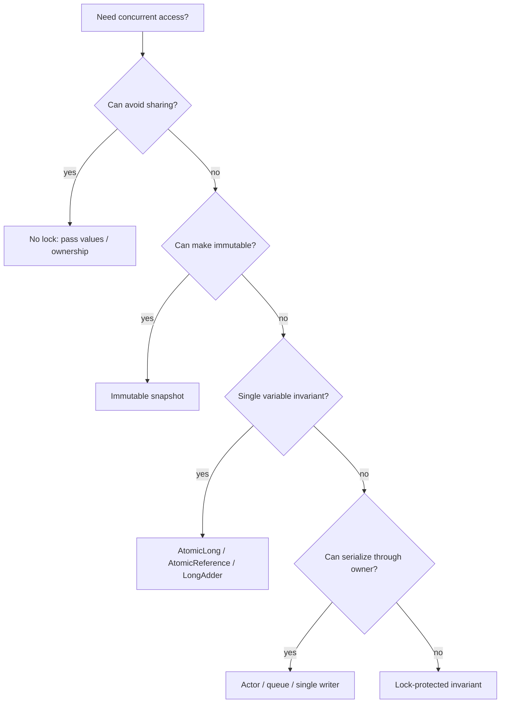
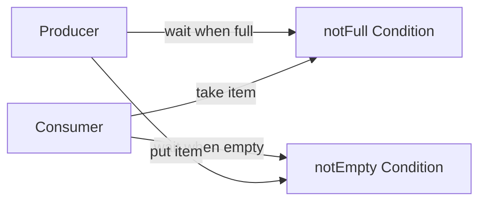
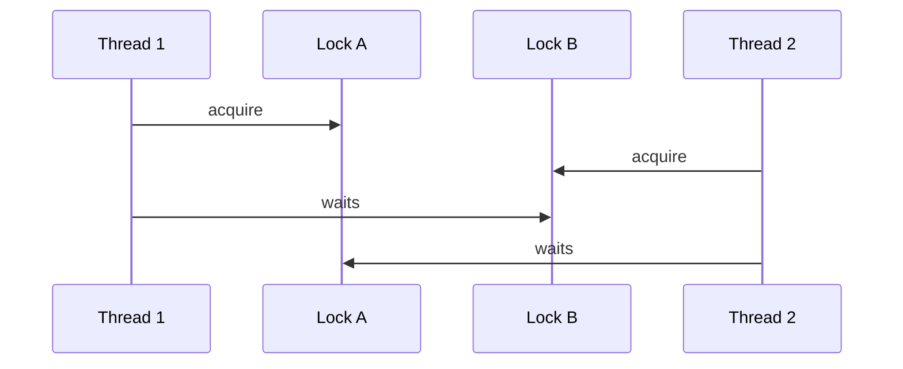

------
title: Learn Java Patterns - Part 017
description: Locking and synchronization patterns for advanced Java systems: intrinsic locks, explicit locks, read-write locks, stamped locks, conditions, lock ordering, striping, guards, and production failure modes.
series: learn-java-patterns
seriesTitle: Learn Java Patterns, Data Patterns, Pipeline Patterns, Concurrency Patterns, Common Patterns, and Anti-Patterns
order: 17
partTitle: Locking and Synchronization Patterns
tags:
- java
- patterns
- concurrency
- synchronization
- locks
- advanced-java
date: 2026-06-27
---

# Part 017 — Locking and Synchronization Patterns

> Goal: mampu merancang, membaca, dan mereview kode sinkronisasi Java dengan fokus pada correctness lebih dulu, lalu throughput, latency, fairness, cancellation, observability, dan kemudahan evolusi.

Part sebelumnya membangun mental model concurrency: shared mutable state adalah sumber risiko; safety dan liveness adalah dua kelas kegagalan utama; visibility dan ordering harus dibuktikan, bukan diasumsikan. Part ini turun ke pattern sinkronisasi konkret.

Kunci utama: lock bukan sekadar alat untuk “mencegah dua thread masuk bersamaan”. Lock adalah **kontrak kepemilikan sementara atas invariant**.

Jika invariant tidak jelas, lock tidak akan menyelamatkan desain. Ia hanya membuat bug lebih sulit direproduksi.

---

## 1. Kaufman Skill Slice

Dalam pendekatan Josh Kaufman, kita tidak mulai dari katalog API. Kita pecah kemampuan menjadi sub-skill yang langsung bisa dilatih.

Untuk part ini, sub-skill yang perlu dikuasai:

1. Menentukan data mana yang benar-benar shared mutable state.
2. Menentukan invariant yang harus dilindungi.
3. Memilih level sinkronisasi: confinement, immutability, atomic variable, intrinsic lock, explicit lock, read-write lock, stamped lock, atau redesign.
4. Menentukan scope critical section sekecil mungkin tanpa memecah invariant.
5. Membuktikan visibility dan atomicity.
6. Menghindari deadlock, starvation, livelock, priority inversion, dan convoying.
7. Membuat kode lock observable dan testable.
8. Menulis review checklist yang bisa dipakai sebelum kode masuk production.

Praktik deliberate untuk part ini: ambil satu mutable service yang terlihat aman, lalu tulis invariant-nya. Jika invariant tidak bisa ditulis dalam 3-5 kalimat, desain concurrency-nya belum siap.

---

## 2. Mental Model: Lock Protects an Invariant, Not a Line of Code

Misalkan kita punya account balance:

```java
final class Account {
    private long balance;

    void withdraw(long amount) {
        if (balance >= amount) {
            balance -= amount;
        }
    }
}
```

Bug-nya bukan hanya `balance -= amount` tidak atomic. Bug-nya adalah invariant `balance >= 0` bisa rusak karena check dan mutation tidak satu critical section.

Correct version:

```java
final class Account {
    private long balance;

    synchronized boolean withdraw(long amount) {
        if (amount <= 0) {
            throw new IllegalArgumentException("amount must be positive");
        }
        if (balance < amount) {
            return false;
        }
        balance -= amount;
        return true;
    }

    synchronized long balance() {
        return balance;
    }
}
```

Yang dilindungi bukan baris assignment. Yang dilindungi adalah invariant:

```text
For every Account:
- balance is never negative
- withdraw check and balance update are atomic with respect to other account operations
- all readers observe a valid balance
```

Pattern review question:

> Invariant apa yang menjadi tidak benar jika lock ini dihapus?

Jika jawabannya tidak jelas, lock tersebut kemungkinan accidental atau misplaced.

---

## 3. Concurrency Design Ladder

Jangan langsung memilih lock. Urutan preferensi desain biasanya:

```text
1. No sharing
2. Immutable sharing
3. Thread confinement
4. Message passing / queue ownership
5. Atomic single-variable update
6. Lock-protected multi-field invariant
7. Read-write / stamped / specialized lock
8. Distributed coordination
```

Mermaid model:



A top-level engineer treats locking as a cost, not a default.

---

## 4. Intrinsic Lock Pattern: `synchronized`

### 4.1 Problem

You need mutual exclusion and visibility around an object invariant, and the synchronization policy is simple enough to attach to the object itself.

### 4.2 Pattern

Use Java's intrinsic monitor via `synchronized` methods or blocks.

```java
final class InventoryCounter {
    private int available;
    private int reserved;

    InventoryCounter(int available) {
        if (available < 0) {
            throw new IllegalArgumentException("available must be non-negative");
        }
        this.available = available;
    }

    synchronized boolean reserve(int quantity) {
        if (quantity <= 0) {
            throw new IllegalArgumentException("quantity must be positive");
        }
        if (available < quantity) {
            return false;
        }
        available -= quantity;
        reserved += quantity;
        return true;
    }

    synchronized void release(int quantity) {
        if (quantity <= 0 || quantity > reserved) {
            throw new IllegalArgumentException("invalid release quantity");
        }
        reserved -= quantity;
        available += quantity;
    }

    synchronized Snapshot snapshot() {
        return new Snapshot(available, reserved);
    }

    record Snapshot(int available, int reserved) {}
}
```

### 4.3 Forces

Use `synchronized` when:

- invariant is local to one object;
- lock acquisition is straightforward;
- no timeout/cancellation needed;
- no multiple condition queues needed;
- simplicity is more valuable than advanced control.

Avoid or reconsider when:

- operations call remote systems while holding the lock;
- you need timed lock acquisition;
- you need interruptible acquisition;
- you need separate wait conditions;
- you need diagnostic metadata around lock acquisition;
- the lock object is externally visible.

### 4.4 Method vs Block

` synchronized` method:

```java
synchronized void update() {
    // locks this
}
```

`synchronized` block:

```java
private final Object monitor = new Object();

void update() {
    synchronized (monitor) {
        // protected critical section
    }
}
```

Prefer private lock object when the class is non-trivial.

Why?

Because `synchronized` instance methods lock `this`. External code can accidentally or maliciously lock the same object:

```java
synchronized (service) {
    // unexpected lock interference
}
```

A private monitor prevents external interference:

```java
private final Object lock = new Object();
```

### 4.5 The Synchronization Policy Must Be Documented

Good concurrent classes state the policy:

```java
/**
 * Thread-safety policy:
 * - `lock` protects available and reserved.
 * - No external calls are made while holding lock.
 * - Snapshots are immutable and safe to publish.
 */
final class InventoryCounter {
    private final Object lock = new Object();
    private int available;
    private int reserved;
}
```

This is not noise. It is design documentation for reviewers.

---

## 5. Guarded Suspension Pattern

### 5.1 Problem

A thread can proceed only when a condition over shared state becomes true.

Example:

- consumer waits until buffer is not empty;
- producer waits until buffer is not full;
- worker waits until configuration is loaded;
- job runner waits until permit is available.

### 5.2 Incorrect Pattern: `if` Around `wait()`

```java
synchronized T take() throws InterruptedException {
    if (queue.isEmpty()) {
        wait();
    }
    return queue.removeFirst();
}
```

This is wrong because threads may wake without the condition being true, or another thread may consume the item before this thread resumes.

### 5.3 Correct Pattern: Condition Loop

```java
final class BoundedBuffer<T> {
    private final Deque<T> queue = new ArrayDeque<>();
    private final int capacity;

    BoundedBuffer(int capacity) {
        if (capacity <= 0) {
            throw new IllegalArgumentException("capacity must be positive");
        }
        this.capacity = capacity;
    }

    synchronized void put(T item) throws InterruptedException {
        Objects.requireNonNull(item, "item");
        while (queue.size() == capacity) {
            wait();
        }
        queue.addLast(item);
        notifyAll();
    }

    synchronized T take() throws InterruptedException {
        while (queue.isEmpty()) {
            wait();
        }
        T item = queue.removeFirst();
        notifyAll();
        return item;
    }
}
```

Pattern rule:

```text
Always wait in a loop.
The loop condition is the guard.
The lock protects both the guard and the state transition.
```

### 5.4 Why `notifyAll()` Is Often Safer Than `notify()`

`notify()` wakes one arbitrary waiter. If multiple conditions share one monitor, it may wake a thread whose condition is still false.

`notifyAll()` wakes all waiters; each rechecks its guard.

Cost: more wakeups.

Benefit: avoids missed progress in mixed-condition monitor designs.

For complex condition sets, prefer `Lock` + multiple `Condition` objects.

---

## 6. Explicit Lock Pattern: `ReentrantLock`

### 6.1 Problem

You need lock behavior that intrinsic locks do not provide:

- timed acquisition;
- interruptible acquisition;
- fairness option;
- multiple condition queues;
- explicit unlock in complex control flow;
- better diagnostics via lock state methods.

### 6.2 Pattern

```java
final class ReservationLedger {
    private final ReentrantLock lock = new ReentrantLock();
    private final Map<String, Reservation> reservations = new HashMap<>();

    boolean tryReserve(String key, Reservation reservation, Duration timeout)
            throws InterruptedException {
        Objects.requireNonNull(key, "key");
        Objects.requireNonNull(reservation, "reservation");
        Objects.requireNonNull(timeout, "timeout");

        if (!lock.tryLock(timeout.toMillis(), TimeUnit.MILLISECONDS)) {
            return false;
        }
        try {
            if (reservations.containsKey(key)) {
                return false;
            }
            reservations.put(key, reservation);
            return true;
        } finally {
            lock.unlock();
        }
    }
}
```

The `finally` is non-negotiable.

### 6.3 Lock Acquisition Policy

Use explicit lock when the caller should not wait forever.

```java
if (!lock.tryLock(100, TimeUnit.MILLISECONDS)) {
    throw new BusyResourceException("ledger is busy");
}
```

This moves lock contention from invisible blocking to explicit failure handling.

### 6.4 Fair vs Non-Fair Locks

`new ReentrantLock(true)` uses a fairness policy that tends to grant access to longest-waiting threads.

Trade-off:

| Option | Benefit | Cost |
|---|---|---|
| Non-fair lock | usually higher throughput | possible starvation under heavy contention |
| Fair lock | more predictable access | lower throughput due to scheduling constraints |

Production rule:

> Do not turn on fairness because it sounds morally better. Turn it on only when starvation risk matters more than throughput.

### 6.5 Diagnostic Wrapper

For critical systems, hide lock acquisition behind a small helper.

```java
final class TimedLock {
    private final ReentrantLock delegate = new ReentrantLock();
    private final String name;

    TimedLock(String name) {
        this.name = name;
    }

    <T> T withLock(Supplier<T> action) {
        long start = System.nanoTime();
        delegate.lock();
        long waited = System.nanoTime() - start;
        try {
            if (waited > TimeUnit.MILLISECONDS.toNanos(50)) {
                // replace with structured log / metrics in real systems
                System.out.printf("lock_wait name=%s waitedMs=%d%n", name, waited / 1_000_000);
            }
            return action.get();
        } finally {
            delegate.unlock();
        }
    }
}
```

The goal is not to create a framework. The goal is to make pathological contention observable.

---

## 7. Condition Queue Pattern

### 7.1 Problem

A shared object has multiple wait conditions, and one monitor wait-set is too coarse.

Example bounded buffer:

- producers wait on `notFull`;
- consumers wait on `notEmpty`.

### 7.2 Pattern

```java
final class LockBasedBoundedBuffer<T> {
    private final ReentrantLock lock = new ReentrantLock();
    private final Condition notFull = lock.newCondition();
    private final Condition notEmpty = lock.newCondition();

    private final Deque<T> queue = new ArrayDeque<>();
    private final int capacity;

    LockBasedBoundedBuffer(int capacity) {
        if (capacity <= 0) {
            throw new IllegalArgumentException("capacity must be positive");
        }
        this.capacity = capacity;
    }

    void put(T item) throws InterruptedException {
        Objects.requireNonNull(item, "item");
        lock.lockInterruptibly();
        try {
            while (queue.size() == capacity) {
                notFull.await();
            }
            queue.addLast(item);
            notEmpty.signal();
        } finally {
            lock.unlock();
        }
    }

    T take() throws InterruptedException {
        lock.lockInterruptibly();
        try {
            while (queue.isEmpty()) {
                notEmpty.await();
            }
            T item = queue.removeFirst();
            notFull.signal();
            return item;
        } finally {
            lock.unlock();
        }
    }
}
```

### 7.3 Why This Is Better Than Single Monitor

Each condition has a separate wait queue. Producers signal consumers; consumers signal producers.



This reduces unnecessary wakeups and makes intent explicit.

---

## 8. Read-Write Lock Pattern

### 8.1 Problem

Many threads read shared state, few threads mutate it, and reads must be consistent.

### 8.2 Pattern

```java
final class ProductCatalog {
    private final ReentrantReadWriteLock rw = new ReentrantReadWriteLock();
    private final Lock readLock = rw.readLock();
    private final Lock writeLock = rw.writeLock();

    private final Map<String, Product> products = new HashMap<>();

    Optional<Product> findBySku(String sku) {
        readLock.lock();
        try {
            return Optional.ofNullable(products.get(sku));
        } finally {
            readLock.unlock();
        }
    }

    void upsert(Product product) {
        writeLock.lock();
        try {
            products.put(product.sku(), product);
        } finally {
            writeLock.unlock();
        }
    }
}
```

### 8.3 Use Carefully

Read-write locks are not automatically faster. They help when:

- read operations are frequent;
- read operations are long enough to justify lock overhead;
- write operations are rare;
- readers can safely run together;
- writer starvation is understood.

They often disappoint when:

- critical sections are tiny;
- writes are frequent;
- there is lock upgrade pressure;
- the protected state should be replaced by immutable snapshots or copy-on-write.

### 8.4 Avoid Lock Upgrade

Bad:

```java
readLock.lock();
try {
    if (!products.containsKey(sku)) {
        writeLock.lock(); // dangerous: upgrade can deadlock
        try {
            products.put(sku, product);
        } finally {
            writeLock.unlock();
        }
    }
} finally {
    readLock.unlock();
}
```

Better:

```java
Optional<Product> findOrInsert(String sku, Supplier<Product> factory) {
    readLock.lock();
    try {
        Product existing = products.get(sku);
        if (existing != null) {
            return Optional.of(existing);
        }
    } finally {
        readLock.unlock();
    }

    writeLock.lock();
    try {
        return Optional.of(products.computeIfAbsent(sku, ignored -> factory.get()));
    } finally {
        writeLock.unlock();
    }
}
```

Notice the second check under write lock.

---

## 9. Stamped Lock Pattern

### 9.1 Problem

You have read-heavy access and want optimistic reads, accepting more complex control flow.

`StampedLock` supports:

- write lock;
- read lock;
- optimistic read.

### 9.2 Pattern

```java
final class CoordinateStore {
    private final StampedLock lock = new StampedLock();
    private double x;
    private double y;

    void move(double deltaX, double deltaY) {
        long stamp = lock.writeLock();
        try {
            x += deltaX;
            y += deltaY;
        } finally {
            lock.unlockWrite(stamp);
        }
    }

    double distanceFromOrigin() {
        long stamp = lock.tryOptimisticRead();
        double currentX = x;
        double currentY = y;

        if (!lock.validate(stamp)) {
            stamp = lock.readLock();
            try {
                currentX = x;
                currentY = y;
            } finally {
                lock.unlockRead(stamp);
            }
        }

        return Math.hypot(currentX, currentY);
    }
}
```

### 9.3 Mental Model

Optimistic read says:

```text
I will read without blocking writers.
After reading, I will verify that no write invalidated my read.
If invalid, I will retry under a real read lock.
```

### 9.4 When Not To Use

Avoid `StampedLock` when:

- team is not comfortable with its semantics;
- code clarity matters more than micro-optimization;
- protected operations are not read-heavy;
- optimistic read cannot be easily retried;
- the protected state has complex object graphs with unsafe intermediate visibility.

Advanced tools are not badges. They are liabilities unless justified.

---

## 10. Lock Striping Pattern

### 10.1 Problem

One global lock protects many independent keys, causing unnecessary contention.

Example: per-customer rate bucket, per-account ledger, per-tenant cache.

### 10.2 Pattern

Use multiple locks and map each key to one stripe.

```java
final class StripedCounter {
    private final Object[] locks;
    private final Map<String, Long> counts = new HashMap<>();

    StripedCounter(int stripes) {
        if (Integer.bitCount(stripes) != 1) {
            throw new IllegalArgumentException("stripes must be power of two");
        }
        this.locks = new Object[stripes];
        Arrays.setAll(locks, ignored -> new Object());
    }

    void increment(String key) {
        Object lock = lockFor(key);
        synchronized (lock) {
            counts.merge(key, 1L, Long::sum);
        }
    }

    long get(String key) {
        Object lock = lockFor(key);
        synchronized (lock) {
            return counts.getOrDefault(key, 0L);
        }
    }

    private Object lockFor(String key) {
        int index = key.hashCode() & (locks.length - 1);
        return locks[index];
    }
}
```

### 10.3 Caveat: Protected Data Must Match Stripe

The example above has a subtle issue: a plain `HashMap` is accessed under different locks. That is unsafe because the map's internal structure is shared globally.

Better version: partition the data too.

```java
final class SafeStripedCounter {
    private final Stripe[] stripes;

    SafeStripedCounter(int stripeCount) {
        if (Integer.bitCount(stripeCount) != 1) {
            throw new IllegalArgumentException("stripeCount must be power of two");
        }
        this.stripes = new Stripe[stripeCount];
        Arrays.setAll(stripes, ignored -> new Stripe());
    }

    void increment(String key) {
        Stripe stripe = stripeFor(key);
        synchronized (stripe) {
            stripe.counts.merge(key, 1L, Long::sum);
        }
    }

    long get(String key) {
        Stripe stripe = stripeFor(key);
        synchronized (stripe) {
            return stripe.counts.getOrDefault(key, 0L);
        }
    }

    private Stripe stripeFor(String key) {
        return stripes[key.hashCode() & (stripes.length - 1)];
    }

    private static final class Stripe {
        private final Map<String, Long> counts = new HashMap<>();
    }
}
```

Pattern rule:

```text
If you stripe locks, stripe ownership too.
```

---

## 11. Lock Ordering Pattern

### 11.1 Problem

Operations need multiple locks. Without a consistent acquisition order, deadlock is possible.

### 11.2 Deadlock Shape



### 11.3 Pattern

Define a total ordering for locks and always acquire in that order.

```java
final class AccountTransferService {
    void transfer(Account from, Account to, long amount) {
        if (from.id().equals(to.id())) {
            return;
        }

        Account first = from.id().compareTo(to.id()) < 0 ? from : to;
        Account second = first == from ? to : from;

        synchronized (first.monitor()) {
            synchronized (second.monitor()) {
                from.withdraw(amount);
                to.deposit(amount);
            }
        }
    }
}
```

But avoid exposing raw monitors in domain objects. A better design centralizes the transfer invariant in one aggregate/service boundary.

### 11.4 Tie-Breaker

If no natural ordering exists, use a tie lock.

```java
private static final Object tieLock = new Object();
```

But this is a smell. If object identity is the only ordering, ask whether the operation should be serialized at a higher level.

---

## 12. Open Call Pattern: Do Not Call Out While Holding a Lock

### 12.1 Problem

Calling external code while holding a lock can cause deadlocks, latency amplification, and reentrancy bugs.

External code includes:

- database calls;
- HTTP calls;
- message publishing;
- callbacks;
- logging appenders that may block;
- user-provided lambdas;
- event listeners;
- framework hooks.

### 12.2 Bad

```java
synchronized void complete(Order order) {
    orders.put(order.id(), order.complete());
    eventPublisher.publish(new OrderCompleted(order.id())); // external call under lock
}
```

### 12.3 Better

```java
OrderCompleted complete(OrderId id) {
    OrderCompleted event;
    synchronized (lock) {
        Order order = orders.get(id);
        Order completed = order.complete();
        orders.put(id, completed);
        event = new OrderCompleted(id);
    }
    eventPublisher.publish(event);
    return event;
}
```

Critical section mutates local invariant only. External call happens after releasing lock.

### 12.4 But What About Transactional Atomicity?

If publishing must be atomic with state change, do not hold a Java lock across a broker call. Use a transactional outbox or durable state transition. Java locks coordinate memory inside one JVM. They do not provide distributed atomicity.

---

## 13. Snapshot Under Lock Pattern

### 13.1 Problem

A caller needs to iterate or process data, but keeping the lock during processing is too expensive.

### 13.2 Pattern

Copy a snapshot under lock, process outside lock.

```java
final class ListenerRegistry<E> {
    private final Object lock = new Object();
    private final List<Consumer<E>> listeners = new ArrayList<>();

    void add(Consumer<E> listener) {
        synchronized (lock) {
            listeners.add(listener);
        }
    }

    void publish(E event) {
        List<Consumer<E>> snapshot;
        synchronized (lock) {
            snapshot = List.copyOf(listeners);
        }

        for (Consumer<E> listener : snapshot) {
            listener.accept(event);
        }
    }
}
```

This avoids calling listeners under lock.

### 13.3 Alternative: CopyOnWriteArrayList

If writes are rare and reads/iteration are frequent:

```java
final class CopyOnWriteListenerRegistry<E> {
    private final CopyOnWriteArrayList<Consumer<E>> listeners = new CopyOnWriteArrayList<>();

    void add(Consumer<E> listener) {
        listeners.add(listener);
    }

    void publish(E event) {
        for (Consumer<E> listener : listeners) {
            listener.accept(event);
        }
    }
}
```

Trade-off: mutation copies the underlying array. Great for listener lists, bad for high-write collections.

---

## 14. Atomic Reference Guard Pattern

### 14.1 Problem

You need lock-free update of a single immutable state object.

Instead of locking multiple mutable fields, combine state into one immutable record and update via compare-and-set.

### 14.2 Pattern

```java
final class Quota {
    private final AtomicReference<State> state;

    Quota(long limit) {
        this.state = new AtomicReference<>(new State(limit, 0));
    }

    boolean tryConsume(long amount) {
        if (amount <= 0) {
            throw new IllegalArgumentException("amount must be positive");
        }

        while (true) {
            State current = state.get();
            if (current.used + amount > current.limit) {
                return false;
            }
            State next = new State(current.limit, current.used + amount);
            if (state.compareAndSet(current, next)) {
                return true;
            }
        }
    }

    record State(long limit, long used) {}
}
```

### 14.3 Forces

Use this when:

- state is small;
- state can be represented immutably;
- update logic is quick;
- contention is moderate;
- retry is acceptable.

Avoid when:

- update logic has side effects;
- retry is expensive;
- state object is large;
- fairness matters;
- multiple external resources must be coordinated.

Pattern rule:

```text
CAS update function must be pure.
```

If the loop retries, side effects would repeat.

---

## 15. Lock-Free Counter Pattern: `LongAdder` vs `AtomicLong`

### 15.1 Problem

You need high-throughput counting under contention.

### 15.2 Options

`AtomicLong`:

```java
private final AtomicLong requests = new AtomicLong();

void recordRequest() {
    requests.incrementAndGet();
}
```

`LongAdder`:

```java
private final LongAdder requests = new LongAdder();

void recordRequest() {
    requests.increment();
}

long count() {
    return requests.sum();
}
```

### 15.3 Trade-Off

| Tool | Best for | Caveat |
|---|---|---|
| `AtomicLong` | exact single-value CAS operations | contention can hurt throughput |
| `LongAdder` | high-write metrics counters | `sum()` is not an atomic snapshot across concurrent updates |

Use `LongAdder` for metrics, not for business invariants like “do not exceed quota”.

---

## 16. Semaphore as Synchronization Boundary

Semaphore is not a lock over a data invariant. It controls permits.

Example: limit concurrent external calls.

```java
final class LimitedClient {
    private final Semaphore permits;
    private final HttpClient client;

    LimitedClient(int maxConcurrentCalls, HttpClient client) {
        this.permits = new Semaphore(maxConcurrentCalls);
        this.client = client;
    }

    HttpResponse<String> get(URI uri) throws IOException, InterruptedException {
        if (!permits.tryAcquire(500, TimeUnit.MILLISECONDS)) {
            throw new RejectedExecutionException("too many concurrent calls");
        }
        try {
            HttpRequest request = HttpRequest.newBuilder(uri).GET().build();
            return client.send(request, HttpResponse.BodyHandlers.ofString());
        } finally {
            permits.release();
        }
    }
}
```

Use semaphore for capacity, not for protecting arbitrary shared maps.

---

## 17. Double-Checked Locking Pattern

### 17.1 Problem

You want lazy initialization without paying synchronization on every access.

### 17.2 Correct Java Version Requires `volatile`

```java
final class LazyRulesEngine {
    private volatile RulesEngine engine;

    RulesEngine get() {
        RulesEngine local = engine;
        if (local == null) {
            synchronized (this) {
                local = engine;
                if (local == null) {
                    local = new RulesEngine(loadRules());
                    engine = local;
                }
            }
        }
        return local;
    }
}
```

### 17.3 Prefer Initialization-on-Demand Holder When Static

```java
final class GlobalRulesEngine {
    private GlobalRulesEngine() {}

    static RulesEngine get() {
        return Holder.INSTANCE;
    }

    private static final class Holder {
        private static final RulesEngine INSTANCE = new RulesEngine(loadRules());
    }
}
```

Use double-checked locking only when you understand safe publication.

---

## 18. Reentrancy: Feature and Trap

Intrinsic locks and `ReentrantLock` are reentrant. A thread holding the lock can acquire it again.

This allows:

```java
synchronized void outer() {
    inner();
}

synchronized void inner() {
    // same thread can enter
}
```

But reentrancy can hide poor layering:

```java
synchronized void approve(CaseId id) {
    validate(id); // also synchronized, maybe calls back
    transition(id, APPROVED);
}
```

If reentrancy is required because methods are tangled, consider extracting lock-protected internal methods:

```java
void approve(CaseId id) {
    synchronized (lock) {
        validateLocked(id);
        transitionLocked(id, APPROVED);
    }
}
```

The suffix `Locked` makes the precondition explicit.

---

## 19. Anti-Patterns

### 19.1 Locking on Public Objects

Bad:

```java
synchronized (customerId.toString()) {
    // string interning or shared references can cause unrelated lock contention
}
```

Better:

- use private lock objects;
- use striped locks;
- use per-key lock registry with lifecycle management;
- use database unique constraints or transactional boundaries when needed.

### 19.2 Locking Without a Protected Invariant

Bad:

```java
synchronized void sendEmail(Email email) {
    smtp.send(email);
}
```

This serializes throughput without protecting memory invariant.

### 19.3 Holding Locks Across I/O

Bad:

```java
synchronized void updateAndNotify(Order order) {
    repository.save(order);     // database I/O
    httpClient.send(...);       // network I/O
}
```

A JVM lock cannot make remote systems atomic. It only amplifies latency.

### 19.4 Split Locking

Bad:

```java
synchronized void debit(long amount) { balance -= amount; }
synchronized boolean canDebit(long amount) { return balance >= amount; }
```

Caller may do:

```java
if (account.canDebit(amount)) {
    account.debit(amount);
}
```

Check and act are not atomic from caller perspective. Provide atomic operation instead:

```java
synchronized boolean tryDebit(long amount) { ... }
```

### 19.5 Mixed Synchronization

Bad:

```java
private int count;

synchronized void increment() { count++; }

int count() { return count; } // unsynchronized read
```

Every access to the protected state must follow the same policy.

### 19.6 Locking a Concurrent Collection Then Assuming Compound Atomicity

```java
ConcurrentHashMap<String, Integer> counts = new ConcurrentHashMap<>();

void badIncrement(String key) {
    Integer current = counts.get(key);
    counts.put(key, current == null ? 1 : current + 1);
}
```

Use atomic map operation:

```java
counts.merge(key, 1, Integer::sum);
```

Concurrent collection operations are thread-safe individually; your multi-step logic may not be.

---

## 20. Production Review Checklist

Before approving lock-based code, answer:

### Protected State

- What fields are protected by which lock?
- Is every read/write using the same synchronization policy?
- Are snapshots immutable?
- Is safe publication guaranteed?

### Critical Section

- Is the critical section minimal but invariant-complete?
- Are external calls avoided while holding lock?
- Is lock acquisition order documented for multi-lock operations?
- Are callbacks invoked outside locks?

### Liveness

- Can deadlock occur?
- Can starvation occur?
- Can a thread wait forever?
- Are timeouts or interruption needed?
- Are condition waits in loops?

### Performance

- Is contention measured or guessed?
- Is the lock too coarse?
- Would confinement, immutable snapshot, queue ownership, or atomic reference be simpler?
- Does fairness reduce throughput unnecessarily?

### Observability

- Can lock wait time be measured?
- Can blocked threads be diagnosed with thread dumps?
- Are high-contention paths visible in metrics?

### Testability

- Is there a deterministic unit test for invariant safety?
- Is there a stress test for race windows?
- Are timeout/cancellation paths tested?

---

## 21. Practice Drill

### Drill 1 — Write the Invariant

Given:

```java
final class CaseAssignment {
    private final Map<String, String> caseToOfficer = new HashMap<>();
    private final Map<String, Integer> officerLoad = new HashMap<>();
}
```

Write invariants:

```text
- each case is assigned to at most one officer
- officerLoad[officer] equals number of cases assigned to officer
- no officer has load above configured capacity
```

Then design the locking policy.

### Drill 2 — Remove External Calls Under Lock

Refactor:

```java
synchronized void approve(CaseFile file) {
    file.approve();
    repository.save(file);
    auditClient.sendApproval(file.id());
    notificationClient.notify(file.owner());
}
```

Goal:

- local invariant protected under lock;
- database transaction handled separately;
- audit/notification emitted through outbox or after commit;
- no network I/O under JVM lock.

### Drill 3 — Choose the Tool

Choose between:

- `synchronized`
- `ReentrantLock`
- `ReentrantReadWriteLock`
- `StampedLock`
- `AtomicReference`
- `LongAdder`
- `Semaphore`
- `BlockingQueue`
- redesign with single writer

For each scenario:

1. high-throughput metrics counter;
2. case workflow state transition;
3. tenant-level external API concurrency cap;
4. read-mostly immutable configuration map;
5. mutable graph with multiple invariants;
6. producer-consumer task queue.

---

## 22. Production Heuristics

1. Prefer no sharing over clever locking.
2. Prefer immutable snapshots over read-write locks when update frequency is low.
3. Prefer queue ownership over shared mutable worker state.
4. Prefer atomic operations only for single-variable invariants.
5. Prefer `synchronized` for simple local invariants.
6. Prefer `ReentrantLock` when timeout, interruption, or multiple conditions are needed.
7. Prefer `BlockingQueue` over hand-written wait/notify for producer-consumer workflows.
8. Avoid `StampedLock` unless the performance case is real and the team can maintain it.
9. Never hold a JVM lock while calling remote systems.
10. Every lock should have a named invariant.

---

## 23. References

- Oracle Java API, `java.util.concurrent`: https://docs.oracle.com/en/java/javase/21/docs/api/java.base/java/util/concurrent/package-summary.html
- Oracle Java API, `java.util.concurrent.locks`: https://docs.oracle.com/en/java/javase/21/docs/api/java.base/java/util/concurrent/locks/package-summary.html
- Oracle Java Tutorials, Guarded Blocks: https://docs.oracle.com/javase/tutorial/essential/concurrency/guardmeth.html
- Oracle Java Tutorials, Deadlock: https://docs.oracle.com/javase/tutorial/essential/concurrency/deadlock.html
- Oracle Java Tutorials, Immutable Objects: https://docs.oracle.com/javase/tutorial/essential/concurrency/immutable.html
- Java Language Specification, Threads and Locks: https://docs.oracle.com/javase/specs/jls/se21/html/jls-17.html

---

## 24. Key Takeaways

Locking is not an implementation detail. It is a design boundary.

A strong engineer does not ask, “Should I use synchronized or ReentrantLock?” first.

A strong engineer asks:

```text
What invariant is shared?
Who owns it?
Can I avoid sharing?
What happens under contention?
What happens under cancellation?
What happens if the external world is slow?
Can I prove this stays correct?
```

Once those questions are answered, the API choice becomes much easier.
