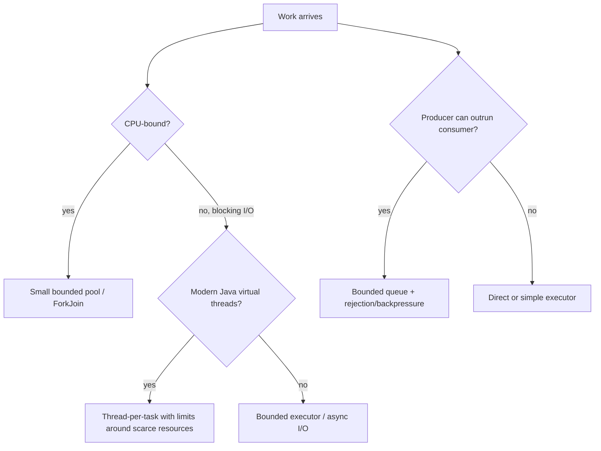
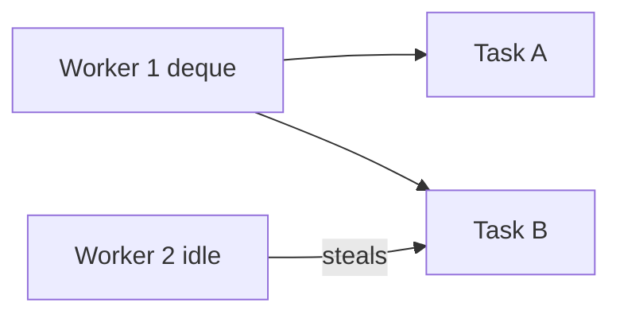
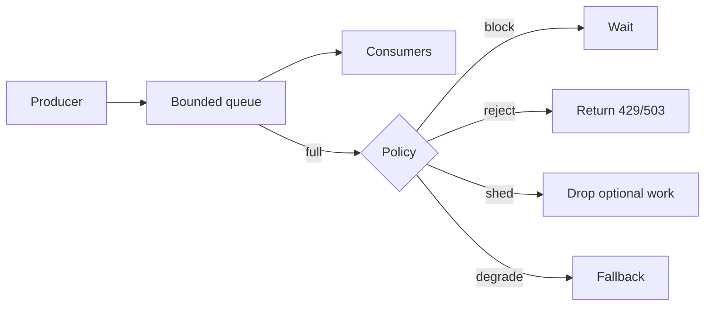
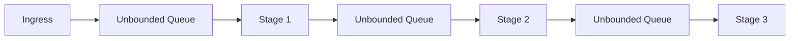

------
title: Learn Java Patterns - Part 018
description: Coordination and work distribution patterns in Java: producer-consumer, bounded queues, worker pools, work stealing, fork-join, latch, barrier, phaser, semaphore, graceful shutdown, and production backpressure.
series: learn-java-patterns
seriesTitle: Learn Java Patterns, Data Patterns, Pipeline Patterns, Concurrency Patterns, Common Patterns, and Anti-Patterns
order: 18
partTitle: Coordination and Work Distribution Patterns
tags:
- java
- patterns
- concurrency
- coordination
- executors
- work-distribution
- advanced-java
date: 2026-06-27
---

# Part 018 — Coordination and Work Distribution Patterns

> Goal: mampu merancang cara kerja dibagi, dijadwalkan, dibatasi, ditunggu, dibatalkan, dan dimatikan dengan aman dalam aplikasi Java production.

Part 017 membahas lock sebagai alat melindungi invariant. Part ini membahas koordinasi: bagaimana banyak thread atau task bekerja bersama tanpa menciptakan chaos.

Perbedaan penting:

```text
Synchronization asks: who may access this state now?
Coordination asks: who should do which work, when, and under what capacity limit?
```

Banyak bug production bukan karena `synchronized` salah, tetapi karena desain distribusi kerja tidak punya jawaban untuk:

- queue boleh tumbuh sampai mana?
- task boleh menunggu berapa lama?
- siapa yang membatalkan pekerjaan saat request timeout?
- apakah failure satu task membatalkan group?
- apakah shutdown akan drain, reject, atau interrupt?
- apakah producer lebih cepat dari consumer?
- apakah work stealing cocok atau malah merusak locality?

---

## 1. Kaufman Skill Slice

Sub-skill yang harus dilatih:

1. Membedakan task, worker, queue, scheduler, dan coordinator.
2. Memilih antara direct execution, executor, queue, fork-join, semaphore, latch, barrier, phaser, dan virtual thread per task.
3. Menentukan capacity boundary.
4. Mendesain backpressure, rejection, timeout, dan cancellation.
5. Mendesain graceful shutdown.
6. Menjaga context propagation dan observability.
7. Menghindari thread pool starvation dan queue explosion.
8. Membuktikan bahwa work distribution tidak merusak domain invariant.

Learning target:

> Setelah part ini, Anda harus bisa melihat kode executor/queue dan langsung bertanya: “Di mana capacity limit-nya? Di mana cancellation path-nya? Apa yang terjadi saat downstream lambat?”

---

## 2. Mental Model: Work Has Shape

Sebelum memilih API, klasifikasikan pekerjaan.

| Dimension | Questions |
|---|---|
| CPU-bound vs I/O-bound | Apakah task memakai CPU terus, atau banyak menunggu I/O? |
| Independent vs dependent | Apakah task bisa berjalan sendiri, atau perlu hasil task lain? |
| Bounded vs unbounded | Apakah jumlah task punya batas natural? |
| Short vs long-lived | Apakah task selesai cepat atau berjalan lama? |
| Ordered vs unordered | Apakah urutan hasil penting? |
| Idempotent vs non-idempotent | Apakah aman retry? |
| Latency-sensitive vs throughput-oriented | Apakah tail latency lebih penting dari total throughput? |
| Cancelable vs non-cancelable | Apakah task bisa berhenti saat request tidak lagi berguna? |

Pattern selection starts here.



---

## 3. Producer-Consumer Pattern

### 3.1 Problem

One part of the system produces work; another part consumes it. Their rates differ.

Examples:

- HTTP request creates audit event; audit writer persists it;
- parser reads records; validators process them;
- case transition emits notification job;
- crawler discovers URLs; workers fetch them.

### 3.2 Pattern

Use a queue between producers and consumers.

```java
final class AuditEventProcessor implements AutoCloseable {
    private final BlockingQueue<AuditEvent> queue;
    private final ExecutorService workers;
    private final AtomicBoolean running = new AtomicBoolean(true);

    AuditEventProcessor(int capacity, int workerCount) {
        this.queue = new ArrayBlockingQueue<>(capacity);
        this.workers = Executors.newFixedThreadPool(workerCount);

        for (int i = 0; i < workerCount; i++) {
            workers.submit(this::consumeLoop);
        }
    }

    boolean publish(AuditEvent event, Duration timeout) throws InterruptedException {
        if (!running.get()) {
            return false;
        }
        return queue.offer(event, timeout.toMillis(), TimeUnit.MILLISECONDS);
    }

    private void consumeLoop() {
        while (running.get() || !queue.isEmpty()) {
            try {
                AuditEvent event = queue.poll(500, TimeUnit.MILLISECONDS);
                if (event != null) {
                    persist(event);
                }
            } catch (InterruptedException e) {
                Thread.currentThread().interrupt();
                break;
            } catch (Exception e) {
                // In production: classify, retry, dead-letter, or alert.
                System.err.println("failed to process audit event: " + e.getMessage());
            }
        }
    }

    private void persist(AuditEvent event) {
        // database write
    }

    @Override
    public void close() {
        running.set(false);
        workers.shutdown();
    }
}
```

### 3.3 Forces

Producer-consumer helps when:

- producer and consumer run at different rates;
- you need buffering;
- you need a clear handoff boundary;
- you want to isolate producer latency from consumer latency;
- you can define capacity and failure policy.

It hurts when:

- queue is unbounded;
- producer assumes successful handoff means successful processing;
- consumer failure is hidden;
- ordering requirements are unclear;
- shutdown semantics are undefined.

### 3.4 Core Invariant

```text
Every accepted item is either processed, explicitly rejected, retried, quarantined, or durably recoverable.
```

If accepted items can silently disappear during crash, the pattern is incomplete.

---

## 4. Bounded Queue Pattern

### 4.1 Problem

Unbounded queues hide overload until memory, latency, or downstream systems collapse.

### 4.2 Pattern

Use bounded queues and define what happens when full.

```java
BlockingQueue<Job> queue = new ArrayBlockingQueue<>(10_000);

boolean accepted = queue.offer(job, 100, TimeUnit.MILLISECONDS);
if (!accepted) {
    throw new RejectedExecutionException("job queue is full");
}
```

### 4.3 Full Queue Policies

| Policy | Use When | Risk |
|---|---|---|
| Block producer | producer can safely wait | request thread pile-up |
| Timed offer | caller can handle backpressure | must define error response |
| Reject | overload should be visible | callers must retry or degrade |
| Drop newest | telemetry / lossy stream | data loss |
| Drop oldest | recent value matters more | breaks audit/business data |
| Spill to disk | durability matters | complexity and recovery cost |
| Scale consumers | bottleneck is parallelizable | can overload downstream |

Top 1% heuristic:

> A queue without a capacity and rejection policy is not a buffer. It is an outage with delayed visibility.

---

## 5. Worker Pool Pattern

### 5.1 Problem

You need a fixed number of workers processing independent tasks.

### 5.2 Pattern

Use `ThreadPoolExecutor` explicitly when production behavior matters.

```java
final class BoundedExecutor implements AutoCloseable {
    private final ThreadPoolExecutor executor;

    BoundedExecutor(int threads, int queueCapacity, String namePrefix) {
        BlockingQueue<Runnable> queue = new ArrayBlockingQueue<>(queueCapacity);
        ThreadFactory factory = Thread.ofPlatform()
                .name(namePrefix + "-", 0)
                .factory();

        this.executor = new ThreadPoolExecutor(
                threads,
                threads,
                0L,
                TimeUnit.MILLISECONDS,
                queue,
                factory,
                new ThreadPoolExecutor.AbortPolicy()
        );
    }

    Future<?> submit(Runnable task) {
        return executor.submit(task);
    }

    @Override
    public void close() {
        executor.shutdown();
    }
}
```

### 5.3 Why Avoid Blind `Executors` Factories?

Some convenience factories hide critical choices:

- queue type;
- queue capacity;
- max threads;
- rejection policy;
- thread names;
- lifecycle ownership.

Example risk:

```java
ExecutorService executor = Executors.newFixedThreadPool(8);
```

A fixed thread pool created this way uses an unbounded queue internally. That may be fine for small tools, but risky in server-side systems unless upstream capacity is already bounded.

### 5.4 Pool Sizing Heuristic

For CPU-bound tasks:

```text
threads ≈ number of available processors
```

For blocking I/O on platform threads:

```text
threads may need to exceed CPU count, but must be bounded by downstream capacity
```

For virtual threads:

```text
do not pool virtual threads for CPU sizing;
limit scarce resources with semaphores, connection pools, rate limiters, or structured concurrency
```

Virtual threads make blocking cheaper; they do not make databases, APIs, memory, or rate limits infinite.

---

## 6. Work Stealing Pattern

### 6.1 Problem

Parallel tasks create more sub-tasks recursively, and load is uneven.

Examples:

- recursive tree processing;
- divide-and-conquer computation;
- parallel search;
- independent CPU-bound subproblems.

### 6.2 Pattern

Use `ForkJoinPool` and `RecursiveTask`/`RecursiveAction`.

```java
final class SumTask extends RecursiveTask<Long> {
    private static final int THRESHOLD = 10_000;

    private final long[] values;
    private final int start;
    private final int end;

    SumTask(long[] values, int start, int end) {
        this.values = values;
        this.start = start;
        this.end = end;
    }

    @Override
    protected Long compute() {
        int length = end - start;
        if (length <= THRESHOLD) {
            long sum = 0;
            for (int i = start; i < end; i++) {
                sum += values[i];
            }
            return sum;
        }

        int mid = start + length / 2;
        SumTask left = new SumTask(values, start, mid);
        SumTask right = new SumTask(values, mid, end);

        left.fork();
        long rightResult = right.compute();
        long leftResult = left.join();

        return leftResult + rightResult;
    }
}
```

Use:

```java
long result = ForkJoinPool.commonPool().invoke(new SumTask(values, 0, values.length));
```

### 6.3 Mental Model

Work stealing means idle workers steal tasks from other workers' deques.



This helps balance recursive CPU work.

### 6.4 Misuse

Avoid work stealing for:

- blocking I/O without managed blocking strategy;
- tasks that require strict ordering;
- tasks with shared mutable state and heavy locking;
- very small tasks below useful granularity;
- request-scoped tasks where cancellation and failure propagation matter more than recursive parallelism.

---

## 7. Fan-Out/Fan-In Pattern

### 7.1 Problem

A request requires several independent subcalls, then combines the result.

Examples:

- load customer, risk score, open cases, and entitlement;
- validate document through multiple independent rules;
- fetch prices from multiple providers.

### 7.2 Basic Executor Version

```java
final class CaseSummaryService {
    private final ExecutorService executor;

    CaseSummaryService(ExecutorService executor) {
        this.executor = executor;
    }

    CaseSummary load(CaseId id) throws InterruptedException, ExecutionException {
        Future<CaseFile> file = executor.submit(() -> loadFile(id));
        Future<RiskScore> risk = executor.submit(() -> loadRisk(id));
        Future<List<Action>> actions = executor.submit(() -> loadActions(id));

        return new CaseSummary(file.get(), risk.get(), actions.get());
    }
}
```

### 7.3 Production Problems

This naive version has issues:

- no timeout;
- if one subcall fails, others may continue wasting resources;
- blocking `get()` can wait indefinitely;
- cancellation is not coordinated;
- context propagation may be missing;
- executor saturation is not handled.

### 7.4 Better with Timeouts and Cancellation

```java
CaseSummary load(CaseId id, Duration timeout) throws Exception {
    List<Future<?>> futures = new ArrayList<>();
    try {
        Future<CaseFile> file = executor.submit(() -> loadFile(id));
        Future<RiskScore> risk = executor.submit(() -> loadRisk(id));
        Future<List<Action>> actions = executor.submit(() -> loadActions(id));

        futures.add(file);
        futures.add(risk);
        futures.add(actions);

        long deadline = System.nanoTime() + timeout.toNanos();

        return new CaseSummary(
                getBefore(file, deadline),
                getBefore(risk, deadline),
                getBefore(actions, deadline)
        );
    } catch (Exception e) {
        for (Future<?> future : futures) {
            future.cancel(true);
        }
        throw e;
    }
}

private static <T> T getBefore(Future<T> future, long deadlineNanos) throws Exception {
    long remaining = deadlineNanos - System.nanoTime();
    if (remaining <= 0) {
        throw new TimeoutException("deadline exceeded");
    }
    return future.get(remaining, TimeUnit.NANOSECONDS);
}
```

This still has complexity. Structured concurrency, covered later in the series, gives a cleaner model for related subtasks.

---

## 8. Completion Service Pattern

### 8.1 Problem

You submit many tasks and want to process results as they complete, not in submission order.

### 8.2 Pattern

```java
ExecutorCompletionService<Result> completion = new ExecutorCompletionService<>(executor);

for (Input input : inputs) {
    completion.submit(() -> process(input));
}

List<Result> results = new ArrayList<>();
for (int i = 0; i < inputs.size(); i++) {
    Future<Result> completed = completion.take();
    results.add(completed.get());
}
```

This reduces head-of-line blocking when early-submitted tasks are slow.

### 8.3 Use Cases

- first successful response wins;
- process results incrementally;
- reduce latency when tasks have variable duration;
- scatter-gather with partial result handling.

### 8.4 Add Timeout

```java
Future<Result> completed = completion.poll(200, TimeUnit.MILLISECONDS);
if (completed == null) {
    throw new TimeoutException("no task completed in time");
}
```

---

## 9. CountDownLatch Pattern

### 9.1 Problem

One or more threads must wait until a fixed number of events happen.

Examples:

- wait until N services are initialized;
- start workers together in a stress test;
- wait until N parallel tasks complete;
- block test thread until async callback fires.

### 9.2 Pattern

```java
CountDownLatch ready = new CountDownLatch(workerCount);
CountDownLatch start = new CountDownLatch(1);
CountDownLatch done = new CountDownLatch(workerCount);

for (int i = 0; i < workerCount; i++) {
    executor.submit(() -> {
        ready.countDown();
        try {
            start.await();
            doWork();
        } catch (InterruptedException e) {
            Thread.currentThread().interrupt();
        } finally {
            done.countDown();
        }
    });
}

ready.await();      // all workers ready
start.countDown();  // release them together
done.await();       // wait completion
```

### 9.3 Properties

- one-shot;
- count only decreases;
- cannot be reset;
- useful for tests and startup gates.

Do not use latch as a general workflow engine.

---

## 10. CyclicBarrier Pattern

### 10.1 Problem

A fixed group of threads must meet at a barrier repeatedly before moving to the next phase.

Examples:

- simulation steps;
- parallel iterative computation;
- coordinated benchmark phases.

### 10.2 Pattern

```java
CyclicBarrier barrier = new CyclicBarrier(workerCount, () -> {
    System.out.println("phase completed");
});

Runnable worker = () -> {
    try {
        while (!Thread.currentThread().isInterrupted()) {
            computePhase();
            barrier.await();
            applyPhaseResult();
            barrier.await();
        }
    } catch (InterruptedException e) {
        Thread.currentThread().interrupt();
    } catch (BrokenBarrierException e) {
        // another participant failed or barrier was reset
    }
};
```

### 10.3 Failure Semantics

If one participant fails or times out, the barrier can become broken. Every participant must handle that.

Barrier coordination is brittle if participants have uneven reliability.

---

## 11. Phaser Pattern

### 11.1 Problem

You need phased coordination, but parties may register/deregister dynamically.

### 11.2 Pattern

```java
Phaser phaser = new Phaser(1); // main party

for (Task task : tasks) {
    phaser.register();
    executor.submit(() -> {
        try {
            doPhaseOne(task);
            phaser.arriveAndAwaitAdvance();

            doPhaseTwo(task);
            phaser.arriveAndAwaitAdvance();
        } finally {
            phaser.arriveAndDeregister();
        }
    });
}

phaser.arriveAndDeregister(); // main deregisters
```

### 11.3 When Phaser Is Better

Use `Phaser` when:

- number of participants changes;
- phases repeat;
- you need more flexible lifecycle than `CountDownLatch` or `CyclicBarrier`;
- hierarchical coordination might matter.

Avoid it when a simple latch is enough.

---

## 12. Semaphore Pattern for Capacity Coordination

### 12.1 Problem

You need to limit concurrent access to a scarce resource.

Examples:

- no more than 20 concurrent calls to payment provider;
- no more than 5 expensive report generations;
- no more than N concurrent per-tenant jobs;
- no more than M uploads consuming disk bandwidth.

### 12.2 Pattern

```java
final class ReportLimiter {
    private final Semaphore semaphore = new Semaphore(5);

    Report generate(ReportRequest request) throws InterruptedException {
        if (!semaphore.tryAcquire(1, TimeUnit.SECONDS)) {
            throw new RejectedExecutionException("report capacity exhausted");
        }
        try {
            return generateReport(request);
        } finally {
            semaphore.release();
        }
    }
}
```

### 12.3 Per-Key Semaphore

```java
final class TenantLimiter {
    private final ConcurrentHashMap<TenantId, Semaphore> semaphores = new ConcurrentHashMap<>();
    private final int permitsPerTenant;

    TenantLimiter(int permitsPerTenant) {
        this.permitsPerTenant = permitsPerTenant;
    }

    <T> T withPermit(TenantId tenantId, Callable<T> action) throws Exception {
        Semaphore semaphore = semaphores.computeIfAbsent(
                tenantId,
                ignored -> new Semaphore(permitsPerTenant)
        );

        if (!semaphore.tryAcquire(500, TimeUnit.MILLISECONDS)) {
            throw new RejectedExecutionException("tenant capacity exhausted");
        }
        try {
            return action.call();
        } finally {
            semaphore.release();
        }
    }
}
```

Caveat: per-key limiter maps need lifecycle cleanup if key cardinality is high.

---

## 13. Backpressure Pattern

### 13.1 Problem

Upstream can generate work faster than downstream can process.

Without backpressure, systems fail by:

- memory growth;
- latency explosion;
- timeout storms;
- retry amplification;
- downstream collapse;
- thread exhaustion.

### 13.2 Pattern

Backpressure is not one technique. It is a family of techniques.



### 13.3 Common Java Forms

| Mechanism | Backpressure Form |
|---|---|
| `ArrayBlockingQueue.offer(timeout)` | producer waits bounded time |
| `ThreadPoolExecutor.AbortPolicy` | reject when saturated |
| `Semaphore.tryAcquire(timeout)` | capacity limit |
| Reactive Streams `request(n)` | demand signaling |
| HTTP 429 / 503 | external caller backpressure |
| Circuit breaker open | reject early |
| Rate limiter | shape arrival rate |

### 13.4 Backpressure Must Be Visible

Track:

- queue depth;
- offer timeout count;
- rejection count;
- worker active count;
- task age in queue;
- processing duration;
- downstream error rate.

A system with backpressure but no metrics still fails mysteriously.

---

## 14. Graceful Shutdown Pattern

### 14.1 Problem

Application is stopping. Some work is in flight. Some work is queued. New work may still arrive.

You need a deterministic shutdown policy.

### 14.2 Pattern

```java
final class ExecutorShutdown {
    static void shutdownGracefully(ExecutorService executor, Duration timeout) {
        executor.shutdown();
        try {
            if (!executor.awaitTermination(timeout.toMillis(), TimeUnit.MILLISECONDS)) {
                List<Runnable> dropped = executor.shutdownNow();
                System.err.println("forced shutdown; dropped tasks=" + dropped.size());

                if (!executor.awaitTermination(timeout.toMillis(), TimeUnit.MILLISECONDS)) {
                    System.err.println("executor did not terminate");
                }
            }
        } catch (InterruptedException e) {
            executor.shutdownNow();
            Thread.currentThread().interrupt();
        }
    }
}
```

### 14.3 Policy Choices

| Policy | Meaning |
|---|---|
| Stop accepting new work | reject new tasks immediately |
| Drain queue | finish accepted work before stop |
| Interrupt running work | ask tasks to stop |
| Persist unfinished work | recover after restart |
| Drop optional work | acceptable for telemetry, not audit |

### 14.4 Task Cooperation

Shutdown works only if tasks cooperate:

```java
while (!Thread.currentThread().isInterrupted()) {
    Task task = queue.poll(500, TimeUnit.MILLISECONDS);
    if (task != null) {
        process(task);
    }
}
```

Blocking APIs should use timeout or be interruptible where possible.

---

## 15. Poison Pill Pattern

### 15.1 Problem

Consumers block on a queue. You need to tell them to stop using the same communication channel.

### 15.2 Pattern

```java
enum WorkItem {
    POISON
}
```

A more realistic sealed model:

```java
sealed interface WorkItem permits RealWork, StopWork {}
record RealWork(String payload) implements WorkItem {}
record StopWork() implements WorkItem {}
```

Consumer:

```java
void consumeLoop(BlockingQueue<WorkItem> queue) throws InterruptedException {
    while (true) {
        WorkItem item = queue.take();
        if (item instanceof StopWork) {
            return;
        }
        process((RealWork) item);
    }
}
```

For N consumers, usually enqueue N poison pills.

### 15.3 Caveat

Poison pill is simple but can be wrong when:

- producers are still active;
- priority queues reorder stop signals;
- work must be drained before stop;
- multiple queues/stages need coordinated shutdown.

---

## 16. Bulkhead Pattern Inside a JVM

### 16.1 Problem

One class of work can consume all executor capacity and starve unrelated work.

Example:

- slow report generation consumes API request pool;
- notification retry storm blocks case workflow transitions;
- external provider outage consumes common pool.

### 16.2 Pattern

Use separate executors or semaphores for different work classes.

```java
final class WorkBulkheads implements AutoCloseable {
    private final ExecutorService caseTransitions = Executors.newFixedThreadPool(16);
    private final ExecutorService reports = Executors.newFixedThreadPool(4);
    private final ExecutorService notifications = Executors.newFixedThreadPool(8);

    Future<?> submitCaseTransition(Runnable task) {
        return caseTransitions.submit(task);
    }

    Future<?> submitReport(Runnable task) {
        return reports.submit(task);
    }

    Future<?> submitNotification(Runnable task) {
        return notifications.submit(task);
    }

    @Override
    public void close() {
        caseTransitions.shutdown();
        reports.shutdown();
        notifications.shutdown();
    }
}
```

### 16.3 Trade-Off

Bulkheads protect critical flows but reduce resource sharing. Too many pools create operational complexity.

Use bulkheads around failure domains, not around every class.

---

## 17. Priority Queue Pattern

### 17.1 Problem

Some work is more important than other work.

### 17.2 Pattern

```java
record PrioritizedTask(int priority, long sequence, Runnable task)
        implements Comparable<PrioritizedTask> {

    @Override
    public int compareTo(PrioritizedTask other) {
        int byPriority = Integer.compare(other.priority, this.priority);
        if (byPriority != 0) {
            return byPriority;
        }
        return Long.compare(this.sequence, other.sequence);
    }
}
```

Use `PriorityBlockingQueue<PrioritizedTask>`.

### 17.3 Starvation Risk

Priority queues can starve low-priority work.

Mitigations:

- aging;
- separate pools;
- per-class quotas;
- max wait time promotion;
- explicit SLOs.

Do not introduce priority unless you can define starvation policy.

---

## 18. Scheduled Work Pattern

### 18.1 Problem

Work must run later or periodically.

### 18.2 Pattern

```java
ScheduledExecutorService scheduler = Executors.newScheduledThreadPool(2);

ScheduledFuture<?> future = scheduler.scheduleAtFixedRate(
        () -> refreshCacheSafely(),
        0,
        30,
        TimeUnit.SECONDS
);
```

### 18.3 Fixed Rate vs Fixed Delay

| Mode | Behavior | Use When |
|---|---|---|
| fixed rate | tries to maintain schedule frequency | regular sampling, clock-like tasks |
| fixed delay | waits delay after previous run finishes | avoid overlap, processing loops |

### 18.4 Production Safety Wrapper

```java
void refreshCacheSafely() {
    try {
        refreshCache();
    } catch (Exception e) {
        // never let scheduled task die silently
        System.err.println("cache refresh failed: " + e.getMessage());
    }
}
```

Scheduled tasks need logging, metrics, timeout, and ownership. They are production workflows, not background magic.

---

## 19. Thread Pool Starvation Anti-Pattern

### 19.1 Shape

A task running in a pool submits another task to the same pool and waits for it. If all threads do this, the pool deadlocks/starves.

```java
ExecutorService pool = Executors.newFixedThreadPool(2);

Callable<String> outer = () -> {
    Future<String> inner = pool.submit(() -> "inner");
    return inner.get();
};

pool.submit(outer);
pool.submit(outer);
```

Both pool threads may block waiting for inner tasks that cannot run.

### 19.2 Fixes

- avoid blocking inside same executor;
- use structured concurrency;
- use separate executor for nested work;
- compose async without blocking;
- increase pool only if dependency shape is understood;
- avoid nested task submission when direct method call is enough.

---

## 20. Common Pool Contamination Anti-Pattern

Java APIs may use the common `ForkJoinPool` by default, especially parallel streams and some `CompletableFuture` async methods.

Bad:

```java
CompletableFuture.supplyAsync(() -> slowBlockingHttpCall());
```

This can put blocking work into the common pool.

Better:

```java
CompletableFuture.supplyAsync(
        () -> slowBlockingHttpCall(),
        blockingIoExecutor
);
```

Or in modern Java, consider virtual threads for blocking I/O while still limiting downstream resources.

---

## 21. Queue Explosion Anti-Pattern

### 21.1 Shape

Every stage has its own unbounded queue.



Symptoms:

- latency grows before error rate rises;
- memory grows;
- retries amplify;
- shutdown takes too long;
- old work completes after it is no longer useful.

### 21.2 Fix

- bound every queue;
- propagate backpressure upstream;
- measure task age;
- collapse unnecessary queues;
- use synchronous handoff where appropriate;
- define stale work cancellation.

---

## 22. Work Distribution Decision Matrix

| Situation | Prefer |
|---|---|
| Simple short task offload | bounded `ThreadPoolExecutor` |
| Recursive CPU divide-and-conquer | `ForkJoinPool` |
| Blocking I/O per request in modern Java | virtual thread per task + capacity limits |
| Producer/consumer rate mismatch | bounded `BlockingQueue` |
| Limit access to scarce resource | `Semaphore` |
| Wait for fixed number of events | `CountDownLatch` |
| Repeated fixed-party phase sync | `CyclicBarrier` |
| Dynamic phased participants | `Phaser` |
| Process results as completed | `ExecutorCompletionService` |
| Isolate failure domains | separate executor/semaphore bulkhead |
| Strict ordering per key | partitioned single-writer workers |
| High-volume lossy telemetry | bounded queue with drop policy |
| Auditable business work | durable queue/outbox, not memory-only queue |

---

## 23. Partitioned Worker Pattern

### 23.1 Problem

You need parallelism across keys but serial processing within each key.

Examples:

- process case events in order per case;
- update account ledger sequentially per account;
- enforce tenant-local ordering;
- maintain per-aggregate consistency.

### 23.2 Pattern

Route each key to a partition worker.

```java
final class PartitionedExecutor implements AutoCloseable {
    private final ExecutorService[] executors;

    PartitionedExecutor(int partitions) {
        this.executors = new ExecutorService[partitions];
        for (int i = 0; i < partitions; i++) {
            executors[i] = Executors.newSingleThreadExecutor(
                    Thread.ofPlatform().name("partition-" + i + "-", 0).factory()
            );
        }
    }

    Future<?> submit(String key, Runnable task) {
        return executorFor(key).submit(task);
    }

    private ExecutorService executorFor(String key) {
        int index = Math.floorMod(key.hashCode(), executors.length);
        return executors[index];
    }

    @Override
    public void close() {
        for (ExecutorService executor : executors) {
            executor.shutdown();
        }
    }
}
```

### 23.3 Invariant

```text
Tasks for the same key execute sequentially.
Tasks for different keys may execute concurrently.
```

### 23.4 Caveats

- hot keys can overload one partition;
- partition count changes require migration strategy;
- per-partition queues must be bounded in production;
- failure handling must preserve per-key ordering if required.

This pattern is a JVM-local cousin of Kafka partitioning and actor mailboxes.

---

## 24. Idempotent Worker Pattern

### 24.1 Problem

Work may be retried after failure, timeout, crash, or duplicate delivery.

### 24.2 Pattern

Make worker side effects idempotent.

```java
final class EmailWorker {
    private final ProcessedMessageRepository processed;
    private final EmailGateway gateway;

    void handle(EmailJob job) {
        if (processed.exists(job.id())) {
            return;
        }

        gateway.send(job.recipient(), job.subject(), job.body());
        processed.markProcessed(job.id());
    }
}
```

This naive version has a race if multiple workers process same job. Better use database uniqueness:

```sql
insert into processed_message(message_id, processed_at)
values (?, current_timestamp)
```

If insert fails due to unique constraint, another worker already claimed it.

For non-idempotent side effects, use an outbox/state machine approach and external idempotency keys when available.

---

## 25. Observability for Work Distribution

Minimum metrics:

```text
executor.active_threads
executor.pool_size
executor.queue_depth
executor.completed_tasks
executor.rejected_tasks
executor.task_duration
executor.task_queue_age
worker.failures_by_type
worker.retries
worker.dead_letters
shutdown.drain_duration
```

Minimum logs:

```text
event=task_rejected queue=case-transition reason=queue_full tenant=...
event=task_timeout taskType=report durationMs=...
event=worker_failure taskId=... exceptionClass=...
event=shutdown_forced droppedTasks=...
```

Minimum traces:

- enqueue span;
- dequeue span;
- processing span;
- downstream call spans;
- retry attempt attributes;
- correlation id propagation.

Concurrency without observability is guesswork.

---

## 26. Testing Patterns

### 26.1 Deterministic Unit Test

Test logic without threads first.

```java
@Test
void rejectsWhenQueueFull() throws Exception {
    BlockingQueue<Job> queue = new ArrayBlockingQueue<>(1);
    queue.put(new Job("existing"));

    boolean accepted = queue.offer(new Job("new"), 10, TimeUnit.MILLISECONDS);

    assertFalse(accepted);
}
```

### 26.2 Latch-Based Concurrency Test

```java
@Test
void workersStartTogether() throws Exception {
    int workers = 10;
    CountDownLatch ready = new CountDownLatch(workers);
    CountDownLatch start = new CountDownLatch(1);
    CountDownLatch done = new CountDownLatch(workers);
    AtomicInteger counter = new AtomicInteger();

    ExecutorService executor = Executors.newFixedThreadPool(workers);
    try {
        for (int i = 0; i < workers; i++) {
            executor.submit(() -> {
                ready.countDown();
                try {
                    start.await();
                    counter.incrementAndGet();
                } catch (InterruptedException e) {
                    Thread.currentThread().interrupt();
                } finally {
                    done.countDown();
                }
            });
        }

        assertTrue(ready.await(1, TimeUnit.SECONDS));
        start.countDown();
        assertTrue(done.await(1, TimeUnit.SECONDS));
        assertEquals(workers, counter.get());
    } finally {
        executor.shutdownNow();
    }
}
```

### 26.3 Shutdown Test

Test that shutdown:

- rejects new work;
- drains accepted work if policy says drain;
- interrupts long-running work if forced;
- does not hang indefinitely.

### 26.4 Saturation Test

Saturation is not an edge case. It is the main case that proves backpressure.

Test:

- queue full;
- downstream slow;
- worker exception loop;
- retry storm;
- partial outage;
- cancellation after timeout.

---

## 27. Design Review Checklist

### Work Shape

- Is the work CPU-bound, I/O-bound, mixed, or scheduled?
- Is ordering required globally, per key, or not at all?
- Is the task idempotent?
- Is stale work still useful?

### Capacity

- What is the max queue size?
- What is the max concurrent worker count?
- What downstream resource limits exist?
- What is the rejection policy?

### Failure

- What happens when task processing fails?
- What happens when downstream is slow?
- What happens when downstream is down?
- What happens when the process crashes after accepting work?

### Cancellation

- Does caller timeout cancel work?
- Do workers observe interrupts?
- Are blocking calls timeout-bounded?
- Does fan-out cancel siblings on failure?

### Shutdown

- Are new tasks rejected?
- Is accepted work drained or dropped?
- Is unfinished work recoverable?
- Is forced shutdown bounded?

### Observability

- Can we see queue depth?
- Can we see task age?
- Can we see rejections?
- Can we see worker failures?
- Can we correlate work to original request?

---

## 28. Practice Drill

### Drill 1 — Design a Case Event Processor

Requirements:

```text
- events for the same case must be processed in order
- events for different cases may run concurrently
- queue must be bounded
- failed event must not silently disappear
- shutdown should drain accepted events for up to 30 seconds
```

Design:

- partitioning strategy;
- queue capacity;
- retry/dead-letter policy;
- shutdown behavior;
- metrics;
- test plan.

### Drill 2 — Fix the Executor

Bad code:

```java
final class NotificationService {
    private final ExecutorService executor = Executors.newFixedThreadPool(20);

    void notifyLater(Notification notification) {
        executor.submit(() -> send(notification));
    }
}
```

Problems to identify:

- unbounded queue;
- no rejection path;
- no shutdown ownership;
- no metrics;
- no timeout;
- no retry/dead-letter;
- no idempotency;
- no tenant/provider capacity limit.

### Drill 3 — Choose the Coordinator

Pick the best tool:

1. wait until 5 initialization tasks complete;
2. limit report generation to 3 concurrent jobs;
3. process 1 million CPU-bound independent array chunks;
4. process audit jobs with bounded memory;
5. run 10 simulation workers phase-by-phase;
6. allow dynamic participants in multi-phase import;
7. process first successful result from 4 providers;
8. serialize updates per account but parallelize across accounts.

---

## 29. Key Takeaways

Coordination patterns are about flow control.

A mature Java engineer does not merely ask:

```text
Which executor should I use?
```

They ask:

```text
What work exists?
Who owns it?
How is it bounded?
How does it fail?
How is it cancelled?
How is it observed?
How does it shut down?
What invariant must not be broken by parallelism?
```

If those questions are answered, `BlockingQueue`, `ThreadPoolExecutor`, `ForkJoinPool`, `CountDownLatch`, `CyclicBarrier`, `Phaser`, and `Semaphore` become implementation choices, not architecture guesses.

---

## 30. References

- Oracle Java API, `java.util.concurrent`: https://docs.oracle.com/en/java/javase/21/docs/api/java.base/java/util/concurrent/package-summary.html
- Oracle Java API, `ThreadPoolExecutor`: https://docs.oracle.com/en/java/javase/21/docs/api/java.base/java/util/concurrent/ThreadPoolExecutor.html
- Oracle Java API, `BlockingQueue`: https://docs.oracle.com/en/java/javase/21/docs/api/java.base/java/util/concurrent/BlockingQueue.html
- Oracle Java API, `ForkJoinPool`: https://docs.oracle.com/en/java/javase/21/docs/api/java.base/java/util/concurrent/ForkJoinPool.html
- Oracle Java API, `CountDownLatch`, `CyclicBarrier`, `Phaser`, `Semaphore`: https://docs.oracle.com/en/java/javase/21/docs/api/java.base/java/util/concurrent/package-summary.html
- Oracle Java Tutorials, Executors: https://docs.oracle.com/javase/tutorial/essential/concurrency/executors.html
- Oracle Java Documentation, Virtual Threads: https://docs.oracle.com/en/java/javase/21/core/virtual-threads.html
