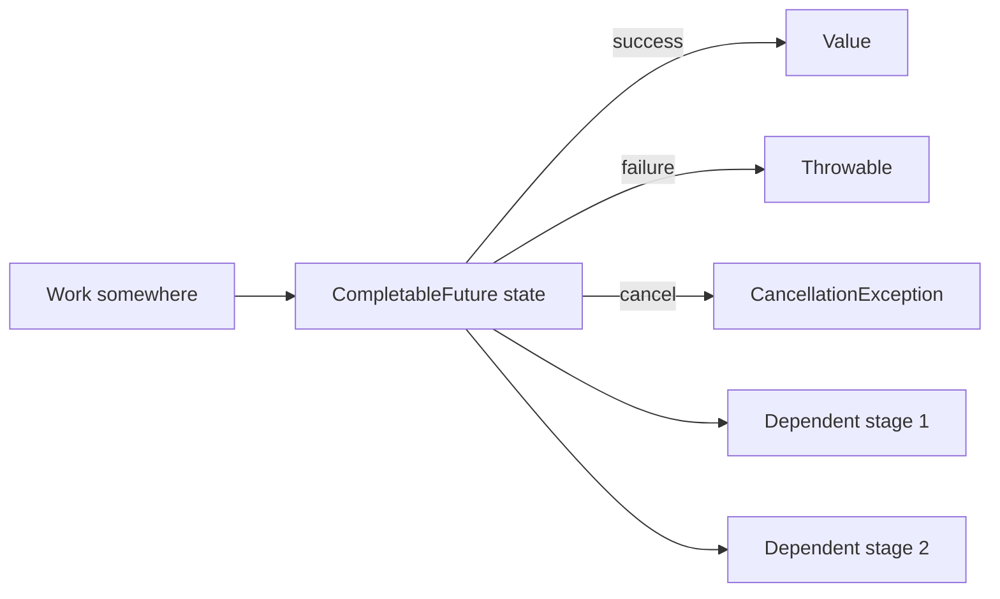
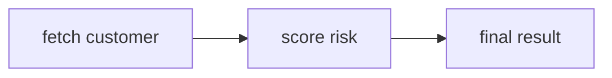
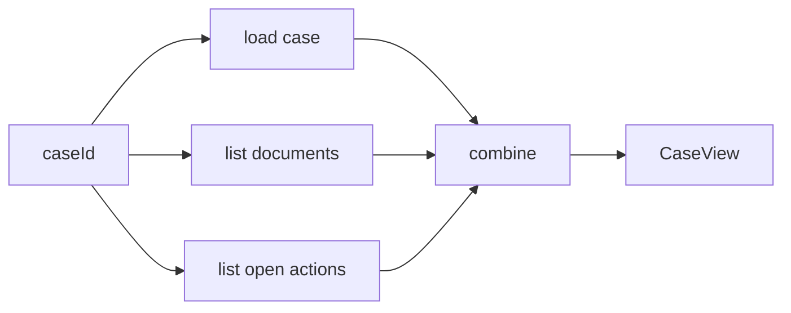

------
title: Learn Java Patterns - Part 019
description: Async, Future, and Completion patterns in Java: Future, CompletableFuture, CompletionStage, fan-out/fan-in, timeout, cancellation, exception composition, executor isolation, and production failure modes.
series: learn-java-patterns
seriesTitle: Learn Java Patterns, Data Patterns, Pipeline Patterns, Concurrency Patterns, Common Patterns, and Anti-Patterns
order: 19
partTitle: Async, Future, and Completion Patterns
tags:
- java
- patterns
- concurrency
- async
- future
- completablefuture
- completionstage
- advanced-java
date: 2026-06-27
---

# Part 019 — Async, Future, and Completion Patterns

> Goal: mampu merancang komposisi asynchronous Java yang jelas ownership-nya, bounded resource-nya, predictable failure behavior-nya, dan tidak berubah menjadi graph callback yang sulit dibatalkan.

Part 018 membahas koordinasi kerja: queue, worker pool, semaphore, latch, barrier, fork-join, dan graceful shutdown. Part ini membahas bentuk yang lebih ekspresif: **future** dan **completion graph**.

Future bukan sekadar “jalan paralel”. Future adalah **janji atas hasil yang belum tersedia**.

```text
Synchronous call:
caller waits here until result exists.

Future-based call:
caller receives a handle to a result that may exist later.

Completion-based call:
caller describes what should happen when that result exists.
```

Kesalahan umum engineer adalah menganggap `CompletableFuture` sebagai magic performance tool. Padahal ia adalah alat komposisi. Ia tidak otomatis membuat operasi cepat, aman, cancellable, bounded, atau observable. Semua itu tetap desain kita.

---

## 1. Kaufman Skill Slice

Sub-skill yang harus dilatih:

1. Membedakan `Future`, `CompletionStage`, dan `CompletableFuture`.
2. Mendesain async boundary: bagian mana yang async dan bagian mana yang tetap synchronous.
3. Memilih executor yang benar, bukan selalu memakai common pool.
4. Mengomposisi dependent tasks dengan `thenApply`, `thenCompose`, `thenCombine`, `allOf`, dan `anyOf`.
5. Mendesain timeout, cancellation, fallback, dan exception recovery.
6. Menghindari callback graph yang tidak bisa dibaca.
7. Menghindari blocking di executor yang salah.
8. Menjaga context propagation: correlation ID, tenant, auth, request metadata.
9. Menguji async code secara deterministik sebisa mungkin.
10. Menentukan kapan `CompletableFuture` harus diganti dengan virtual threads atau structured concurrency.

Learning target:

> Setelah part ini, Anda harus bisa membaca `CompletableFuture` chain dan menjawab: task mana berjalan di executor mana, failure menyebar ke mana, timeout berlaku di mana, cancellation menghentikan apa, dan invariant apa yang tetap aman.

---

## 2. Mental Model: Future Is a Handle, Not the Work

`CompletableFuture<T>` sering membuat orang salah paham.

Ia bukan selalu “thread”. Ia adalah object yang merepresentasikan completion state:

- incomplete,
- completed with value,
- completed exceptionally,
- cancelled sebagai bentuk exceptional completion.

Work yang menghasilkan completion bisa berasal dari:

- `supplyAsync`,
- network callback,
- scheduled timeout,
- manual call `complete(value)`,
- manual call `completeExceptionally(error)`,
- completion dari stage lain.



Jadi pertanyaan desainnya bukan hanya “pakai future atau tidak”, tetapi:

```text
Who owns the work?
Who owns the future?
Who completes it?
Who observes it?
Who cancels it?
Who times it out?
Who records it?
```

Kalau tidak ada jawaban, async code menjadi sulit dikendalikan.

---

## 3. `Future` Pattern: Handle to a Running or Scheduled Task

`Future<T>` adalah pattern klasik:

```java
ExecutorService executor = Executors.newFixedThreadPool(8);

Future<CustomerProfile> future = executor.submit(() -> profileClient.fetch(customerId));

try {
    CustomerProfile profile = future.get(300, TimeUnit.MILLISECONDS);
    return profile;
} catch (TimeoutException ex) {
    future.cancel(true);
    throw new ProfileTimeoutException(customerId, ex);
}
```

Kekuatan `Future`:

- sederhana,
- cocok untuk submit task ke executor,
- punya blocking wait,
- punya cancel signal,
- mudah dipahami.

Kelemahannya:

- komposisi buruk,
- `get()` blocking,
- error handling verbose,
- sulit membuat chain non-blocking,
- cancellation tetap cooperative.

`Future` cocok ketika:

- Anda hanya butuh submit dan wait,
- task jumlahnya kecil,
- orchestration sederhana,
- Anda ingin explicit timeout saat menunggu.

`Future` kurang cocok ketika:

- ada banyak dependent step,
- butuh fan-out/fan-in elegan,
- butuh fallback per stage,
- butuh menggabungkan hasil dari banyak service.

---

## 4. `CompletableFuture` Pattern: Completion Graph

`CompletableFuture` menggabungkan dua peran:

1. **Future**: sebuah result handle.
2. **CompletionStage**: node dalam graph komposisi.

Contoh:

```java
CompletableFuture<Customer> customerFuture =
    CompletableFuture.supplyAsync(() -> customerClient.fetch(customerId), ioExecutor);

CompletableFuture<RiskScore> riskFuture =
    customerFuture.thenCompose(customer ->
        CompletableFuture.supplyAsync(() -> riskClient.score(customer), ioExecutor));

RiskScore score = riskFuture.join();
```

Graph-nya:



Hal penting:

- `thenApply` mengubah value secara synchronous terhadap completion thread.
- `thenApplyAsync` menjadwalkan callback ke executor.
- `thenCompose` melakukan flatten dari `Future<Future<T>>` menjadi `Future<T>`.
- `thenCombine` menggabungkan dua independent completion.
- `allOf` menunggu semua completion.
- `anyOf` menunggu completion pertama.

---

## 5. Pattern: Async Boundary

Async boundary adalah titik di mana eksekusi keluar dari call stack synchronous.

```java
public CompletableFuture<Decision> evaluateAsync(CaseId caseId) {
    return CompletableFuture
        .supplyAsync(() -> repository.load(caseId), ioExecutor)
        .thenApply(policyEngine::evaluate);
}
```

Boundary-nya ada di `supplyAsync`.

Pertanyaan review:

```text
Apakah repository.load blocking?
Executor mana yang dipakai?
Berapa capacity executor itu?
Apa yang terjadi jika request dibatalkan?
Apa yang terjadi jika repository lambat?
```

Async boundary yang sehat punya:

- alasan jelas,
- executor eksplisit,
- timeout,
- error mapping,
- observability,
- cancellation expectation.

Async boundary yang buruk:

```java
return CompletableFuture.supplyAsync(() -> doEverything());
```

Masalah:

- memakai common pool default,
- tidak ada capacity model domain,
- tidak jelas blocking atau CPU-bound,
- tidak ada timeout lokal,
- sulit tracing.

---

## 6. Pattern: Executor Isolation

Jangan mencampur semua workload dalam satu executor.

```text
CPU-bound work     -> fixed pool near CPU count, or direct with virtual thread context depending workload
blocking I/O       -> virtual threads or dedicated bounded executor
slow external API  -> isolated executor/bulkhead
scheduler/timer    -> scheduled executor
common pool        -> only if intentionally acceptable
```

Contoh buruk:

```java
CompletableFuture<Report> f = CompletableFuture.supplyAsync(() -> {
    Customer customer = customerClient.fetch(id); // blocking I/O
    RiskScore score = riskModel.compute(customer); // CPU heavy
    auditClient.write(customer, score); // blocking I/O
    return new Report(customer, score);
});
```

Masalah:

- external blocking I/O masuk common pool,
- CPU-heavy dan I/O-heavy bercampur,
- audit failure mengganggu report creation,
- tidak ada timeout per dependency,
- tidak ada isolation.

Lebih baik:

```java
public CompletableFuture<Report> buildReport(CustomerId id) {
    CompletableFuture<Customer> customer =
        CompletableFuture.supplyAsync(() -> customerClient.fetch(id), customerIoExecutor)
            .orTimeout(300, TimeUnit.MILLISECONDS);

    return customer
        .thenApplyAsync(riskModel::compute, cpuExecutor)
        .thenCompose(score ->
            CompletableFuture.supplyAsync(() -> reportAssembler.assemble(id, score), appExecutor));
}
```

Catatan: contoh ini tetap perlu context propagation dan error mapping. Pattern ini menunjukkan pemisahan executor, bukan template final.

---

## 7. Pattern: Transform vs Compose

Ini salah satu sumber bug paling umum.

### Use `thenApply` when function returns plain value

```java
CompletableFuture<CustomerDto> dto = customerFuture
    .thenApply(customerMapper::toDto);
```

Tipe:

```text
Customer -> CustomerDto
CompletableFuture<Customer> -> CompletableFuture<CustomerDto>
```

### Use `thenCompose` when function returns another future

```java
CompletableFuture<Decision> decision = customerFuture
    .thenCompose(customer -> policyService.evaluateAsync(customer));
```

Tipe:

```text
Customer -> CompletableFuture<Decision>
CompletableFuture<Customer> -> CompletableFuture<Decision>
```

Kalau salah memakai `thenApply`:

```java
CompletableFuture<CompletableFuture<Decision>> nested = customerFuture
    .thenApply(customer -> policyService.evaluateAsync(customer));
```

Nested future biasanya smell kecuali Anda memang sengaja membuat future-of-future.

Rule praktis:

```text
thenApply  = map
thenCompose = flatMap
thenCombine = zip two independent futures
```

---

## 8. Pattern: Fan-Out / Fan-In

Fan-out/fan-in digunakan ketika beberapa operasi independent bisa berjalan bersamaan dan hasilnya digabung.

```java
public CompletableFuture<CaseView> loadCaseView(CaseId caseId) {
    CompletableFuture<CaseRecord> caseRecord =
        CompletableFuture.supplyAsync(() -> caseRepository.get(caseId), ioExecutor);

    CompletableFuture<List<Document>> documents =
        CompletableFuture.supplyAsync(() -> documentClient.list(caseId), ioExecutor);

    CompletableFuture<List<Action>> actions =
        CompletableFuture.supplyAsync(() -> actionRepository.listOpen(caseId), ioExecutor);

    return caseRecord.thenCombine(documents, CasePartial::new)
        .thenCombine(actions, (partial, acts) ->
            new CaseView(partial.caseRecord(), partial.documents(), acts));
}
```

Diagram:



Checklist:

- Apakah semua branch independent?
- Apakah setiap branch punya timeout?
- Apakah failure satu branch harus menggagalkan semua?
- Apakah partial response boleh?
- Apakah fan-out dibatasi?
- Apakah downstream dependency sanggup menerima parallelism?

Fan-out tanpa limit adalah DDoS internal.

---

## 9. Pattern: `allOf` with Typed Results

`CompletableFuture.allOf()` mengembalikan `CompletableFuture<Void>`, bukan list typed result.

Helper:

```java
public static <T> CompletableFuture<List<T>> sequence(List<CompletableFuture<T>> futures) {
    CompletableFuture<Void> all = CompletableFuture.allOf(
        futures.toArray(CompletableFuture[]::new)
    );

    return all.thenApply(ignored ->
        futures.stream()
            .map(CompletableFuture::join)
            .toList()
    );
}
```

Pemakaian:

```java
List<CompletableFuture<ValidationResult>> validations = rules.stream()
    .map(rule -> CompletableFuture.supplyAsync(() -> rule.validate(command), validationExecutor))
    .toList();

CompletableFuture<List<ValidationResult>> result = sequence(validations);
```

Caveat:

- `join()` aman di `thenApply` setelah `allOf` selesai, karena semua futures sudah complete.
- Jika salah satu future gagal, `allOf` gagal.
- Exception yang muncul perlu di-unpack dan dimapping.
- Semua task sudah dijadwalkan sebelum `allOf`; `allOf` bukan concurrency limiter.

Untuk concurrency limiter, gunakan semaphore, bounded executor, atau structured concurrency dengan capacity boundary di atasnya.

---

## 10. Pattern: First Successful Result

Kadang Anda punya beberapa source dan ingin memakai yang pertama berhasil.

Contoh use case:

- read replica fastest response,
- cache tier race,
- alternate provider,
- redundant metadata source.

`anyOf` memberi completion pertama, termasuk failure pertama. Itu bukan “first success”.

Simple first-success implementation:

```java
public static <T> CompletableFuture<T> firstSuccess(List<CompletableFuture<T>> futures) {
    CompletableFuture<T> result = new CompletableFuture<>();
    AtomicInteger failures = new AtomicInteger();

    for (CompletableFuture<T> future : futures) {
        future.whenComplete((value, error) -> {
            if (error == null) {
                result.complete(value);
            } else if (failures.incrementAndGet() == futures.size()) {
                result.completeExceptionally(error);
            }
        });
    }

    return result;
}
```

Production concerns:

- setelah satu berhasil, apakah future lain harus dibatalkan?
- apakah cancellation efektif untuk underlying work?
- apakah provider yang lambat tetap membakar resource?
- apakah error terakhir cukup informatif?
- apakah result deterministic perlu dijaga?

Lebih kuat:

```java
public static <T> CompletableFuture<T> firstSuccessAndCancelOthers(
    List<CompletableFuture<T>> futures
) {
    CompletableFuture<T> result = firstSuccess(futures);

    result.whenComplete((value, error) -> {
        if (error == null) {
            futures.forEach(f -> f.cancel(true));
        }
    });

    return result;
}
```

Tetapi ingat: membatalkan `CompletableFuture` tidak selalu menghentikan task yang sedang berjalan. Underlying task harus cooperative.

---

## 11. Pattern: Timeout as a Stage Policy

Timeout harus eksplisit.

Java menyediakan beberapa cara penting:

```java
CompletableFuture<Decision> decision = evaluateAsync(command)
    .orTimeout(500, TimeUnit.MILLISECONDS);
```

`orTimeout` menyelesaikan future secara exceptional jika belum selesai sebelum timeout.

Fallback timeout:

```java
CompletableFuture<Decision> decision = evaluateAsync(command)
    .completeOnTimeout(Decision.manualReview("risk-timeout"), 500, TimeUnit.MILLISECONDS);
```

Pertanyaan desain:

```text
Timeout ini timeout untuk menunggu result, atau timeout untuk menghentikan work?
```

Dalam banyak kasus, timeout pada future hanya mengubah completion state yang terlihat oleh caller. Work di belakangnya mungkin tetap berjalan.

Jadi untuk operasi mahal, desain cancellation cooperative:

```java
final class CancellableRiskTask {
    private final AtomicBoolean cancelled = new AtomicBoolean();

    RiskScore run(CaseRecord record) {
        for (RiskRule rule : rules) {
            if (cancelled.get() || Thread.currentThread().isInterrupted()) {
                throw new CancellationException("risk scoring cancelled");
            }
            rule.evaluate(record);
        }
        return score;
    }

    void cancel() {
        cancelled.set(true);
    }
}
```

Pattern yang benar:

```text
Timeout visible to caller + cancellation signal to worker + worker checks signal.
```

---

## 12. Pattern: Deadline Propagation

Timeout lokal sering salah karena tiap layer menambah timeout sendiri.

Buruk:

```text
API request timeout: 1s
service A timeout: 800ms
service B timeout: 800ms
service C timeout: 800ms
```

Total bisa melewati budget request.

Lebih baik gunakan deadline:

```java
public record Deadline(Instant expiresAt) {
    public Duration remaining(Clock clock) {
        Duration left = Duration.between(clock.instant(), expiresAt);
        return left.isNegative() ? Duration.ZERO : left;
    }

    public boolean expired(Clock clock) {
        return !remaining(clock).isPositive();
    }
}
```

Pemakaian:

```java
public CompletableFuture<Decision> evaluateAsync(Command command, Deadline deadline) {
    Duration remaining = deadline.remaining(clock);

    if (remaining.isZero()) {
        return CompletableFuture.failedFuture(new TimeoutException("deadline exceeded"));
    }

    return CompletableFuture
        .supplyAsync(() -> repository.load(command.caseId()), ioExecutor)
        .orTimeout(remaining.toMillis(), TimeUnit.MILLISECONDS)
        .thenCompose(record -> policyClient.evaluateAsync(record, deadline));
}
```

Mental model:

```text
Timeout = duration for this operation.
Deadline = absolute budget for the whole operation tree.
```

Deadline membuat fan-out lebih aman karena setiap branch tahu sisa budget.

---

## 13. Pattern: Exception Mapping and Recovery

Exception dalam `CompletableFuture` mudah menjadi kabur.

Basic tools:

```java
future.exceptionally(error -> fallbackValue);
future.handle((value, error) -> transformBoth(value, error));
future.whenComplete((value, error) -> observeOnly(value, error));
```

Perbedaan:

```text
exceptionally = recover from failure into value
handle        = transform success or failure into new value
whenComplete  = observe side-effect, preserve result unless callback throws
```

Contoh:

```java
CompletableFuture<Decision> decision = policyClient.evaluateAsync(command)
    .exceptionally(error -> {
        if (isTimeout(error)) {
            return Decision.manualReview("policy-timeout");
        }
        throw new CompletionException(error);
    });
```

Namun recovery yang terlalu luas berbahaya:

```java
.exceptionally(error -> Decision.approve()) // dangerous
```

Pattern recovery sehat:

- recover hanya dari error yang expected,
- mapping error menjadi domain outcome harus defensible,
- log/metric harus mencatat error asli,
- jangan menyembunyikan corruption/invariant violation,
- jangan fallback ke keputusan yang lebih permisif tanpa policy.

Contoh policy defensible:

```java
private Decision fallback(Throwable error) {
    Throwable cause = unwrap(error);

    if (cause instanceof TimeoutException) {
        return Decision.manualReview("risk-service-timeout");
    }

    if (cause instanceof RiskServiceUnavailableException) {
        return Decision.manualReview("risk-service-unavailable");
    }

    throw new CompletionException(cause);
}
```

---

## 14. Pattern: Error Channel vs Exceptional Completion

Tidak semua failure harus menjadi exception.

Dalam domain workflow, “validation failed” sering bukan exception. Itu outcome.

```java
sealed interface ValidationOutcome permits ValidationOutcome.Accepted, ValidationOutcome.Rejected {
    record Accepted() implements ValidationOutcome {}
    record Rejected(List<String> reasons) implements ValidationOutcome {}
}
```

Async validation:

```java
CompletableFuture<ValidationOutcome> outcome =
    CompletableFuture.supplyAsync(() -> validator.validate(command), validationExecutor);
```

Gunakan exceptional completion untuk:

- dependency timeout,
- infrastructure failure,
- interrupted execution,
- unexpected bug,
- invariant corruption.

Gunakan domain result untuk:

- business rejection,
- validation issue,
- no eligible transition,
- policy requires manual review,
- duplicate command detected.

Pattern:

```text
Expected domain negative result -> value channel.
Unexpected execution failure -> exceptional channel.
```

Ini membuat chain lebih jelas dan audit lebih defensible.

---

## 15. Pattern: Async Command Handler

Command handler yang async harus menjaga invariant domain.

Buruk:

```java
public CompletableFuture<Void> approve(CaseId id) {
    return CompletableFuture.runAsync(() -> {
        CaseRecord record = repository.load(id);
        record.approve();
        repository.save(record);
        eventBus.publish(new CaseApproved(id));
    });
}
```

Masalah:

- executor default,
- transaction boundary tidak jelas,
- event publish mungkin terjadi walau save gagal,
- no idempotency,
- cancellation bisa terjadi di tengah side effect,
- no audit.

Lebih sehat:

```java
public CompletableFuture<CommandResult> approveAsync(ApproveCase command) {
    return CompletableFuture.supplyAsync(() -> transactionTemplate.execute(status -> {
        IdempotencyResult existing = idempotencyStore.find(command.commandId());
        if (existing != null) {
            return existing.result();
        }

        CaseAggregate aggregate = repository.getForUpdate(command.caseId());
        aggregate.approve(command.actor(), command.reason(), clock.instant());

        repository.save(aggregate);
        outbox.addAll(aggregate.releaseEvents());

        CommandResult result = CommandResult.accepted(aggregate.id(), aggregate.version());
        idempotencyStore.record(command.commandId(), result);
        return result;
    }), commandExecutor);
}
```

Catatan:

- Async hanya membungkus boundary eksekusi.
- Invariant tetap dijaga synchronous dalam transaction.
- Event keluar lewat outbox, bukan publish langsung.
- Idempotency explicit.

---

## 16. Pattern: Async Read Aggregator

Read aggregator cocok untuk `CompletableFuture`, terutama ketika menyusun view dari beberapa source.

```java
public CompletableFuture<CaseDashboard> dashboard(CaseId id, Deadline deadline) {
    CompletableFuture<CaseSummary> summary =
        timed(() -> caseClient.summary(id), deadline, caseExecutor);

    CompletableFuture<List<TaskSummary>> tasks =
        timed(() -> taskClient.openTasks(id), deadline, taskExecutor);

    CompletableFuture<List<DocumentSummary>> documents =
        timed(() -> documentClient.recentDocuments(id), deadline, documentExecutor);

    return summary.thenCombine(tasks, DashboardPartial::new)
        .thenCombine(documents, (partial, docs) ->
            new CaseDashboard(partial.summary(), partial.tasks(), docs));
}

private <T> CompletableFuture<T> timed(
    Supplier<T> supplier,
    Deadline deadline,
    Executor executor
) {
    Duration remaining = deadline.remaining(clock);
    return CompletableFuture.supplyAsync(supplier, executor)
        .orTimeout(remaining.toMillis(), TimeUnit.MILLISECONDS);
}
```

Read aggregator biasanya boleh punya partial fallback:

```java
CompletableFuture<List<DocumentSummary>> documents =
    timed(() -> documentClient.recentDocuments(id), deadline, documentExecutor)
        .exceptionally(error -> List.of());
```

Tapi jangan sembunyikan failure tanpa visibility:

```java
.exceptionally(error -> {
    metrics.increment("dashboard.documents.fallback");
    log.warn("Documents unavailable for case {}", id, error);
    return List.of();
});
```

---

## 17. Pattern: Async Side Effect Isolation

Side effect yang tidak critical jangan menghambat main flow, tetapi jangan sampai hilang tanpa jejak.

Contoh: audit enrichment, notification, metrics enrichment.

Buruk:

```java
return approveAsync(command)
    .thenApply(result -> {
        emailClient.sendApprovalEmail(command.caseId());
        return result;
    });
```

Masalah:

- email failure menggagalkan approval result,
- side effect blocking di completion thread,
- no retry model,
- no audit.

Lebih baik:

```java
return approveAsync(command)
    .whenComplete((result, error) -> {
        if (error == null) {
            notificationOutbox.enqueueApprovalEmail(command.caseId(), result.version());
        }
    });
```

Atau async terisolasi:

```java
return approveAsync(command)
    .thenApply(result -> {
        CompletableFuture.runAsync(
            () -> notificationClient.sendApprovalEmail(command.caseId()),
            notificationExecutor
        ).exceptionally(error -> {
            log.warn("Approval notification failed for {}", command.caseId(), error);
            metrics.increment("approval.notification.failed");
            return null;
        });

        return result;
    });
```

Namun untuk system-of-record, outbox lebih defensible daripada fire-and-forget future.

---

## 18. Pattern: Cancellation Token

`CompletableFuture.cancel(true)` sering tidak cukup sebagai cancellation model. Untuk long-running domain work, buat cancellation token.

```java
public final class CancellationToken {
    private final AtomicBoolean cancelled = new AtomicBoolean();

    public void cancel() {
        cancelled.set(true);
    }

    public void throwIfCancelled() {
        if (cancelled.get() || Thread.currentThread().isInterrupted()) {
            throw new CancellationException();
        }
    }
}
```

Pemakaian:

```java
public CompletableFuture<RiskScore> scoreAsync(CaseRecord record, CancellationToken token) {
    return CompletableFuture.supplyAsync(() -> {
        RiskAccumulator acc = new RiskAccumulator();
        for (RiskRule rule : rules) {
            token.throwIfCancelled();
            acc.add(rule.evaluate(record));
        }
        return acc.toScore();
    }, riskExecutor);
}
```

Menghubungkan timeout ke token:

```java
CancellationToken token = new CancellationToken();

CompletableFuture<RiskScore> score = scoreAsync(record, token)
    .orTimeout(500, TimeUnit.MILLISECONDS)
    .whenComplete((value, error) -> {
        if (isTimeout(error)) {
            token.cancel();
        }
    });
```

Pattern:

```text
Future cancellation controls completion graph.
Cancellation token controls domain work.
Thread interruption controls blocking operations that support interrupt.
```

Ketiganya tidak identik.

---

## 19. Pattern: Context Propagation

Async boundary sering memutus context:

- correlation ID,
- tenant ID,
- actor/user,
- locale,
- security principal,
- deadline,
- tracing span,
- MDC logging context.

Buruk:

```java
CompletableFuture.supplyAsync(() -> service.doWork());
```

`service.doWork()` mungkin tidak tahu request context.

Lebih sehat: jadikan context eksplisit.

```java
public record RequestContext(
    String correlationId,
    TenantId tenantId,
    Actor actor,
    Deadline deadline
) {}
```

```java
public CompletableFuture<Decision> evaluateAsync(Command command, RequestContext context) {
    return CompletableFuture.supplyAsync(
        () -> policyEngine.evaluate(command, context),
        contextAwareExecutor
    );
}
```

Wrapper executor:

```java
public final class ContextAwareExecutor implements Executor {
    private final Executor delegate;
    private final ContextSnapshotFactory snapshotFactory;

    public ContextAwareExecutor(Executor delegate, ContextSnapshotFactory snapshotFactory) {
        this.delegate = delegate;
        this.snapshotFactory = snapshotFactory;
    }

    @Override
    public void execute(Runnable command) {
        ContextSnapshot snapshot = snapshotFactory.capture();
        delegate.execute(() -> snapshot.run(command));
    }
}
```

Namun hati-hati: context propagation implisit bisa menyembunyikan dependency. Untuk domain-critical data, parameter eksplisit lebih baik.

---

## 20. Pattern: Completion Observer

Jangan campur business transformation dengan observability.

```java
return evaluateAsync(command)
    .whenComplete((decision, error) -> {
        long elapsedMs = stopwatch.elapsedMillis();
        if (error == null) {
            metrics.timer("policy.evaluate").record(elapsedMs);
            audit.observe(command.caseId(), decision.outcome());
        } else {
            metrics.counter("policy.evaluate.failed").increment();
            log.warn("Policy evaluation failed: commandId={}", command.commandId(), error);
        }
    });
```

`whenComplete` cocok untuk observer karena ia tidak dimaksudkan mengubah result. Tetapi callback yang throw exception dapat mengubah completion. Jadi observer harus defensive:

```java
.whenComplete((value, error) -> {
    try {
        observer.record(value, error);
    } catch (RuntimeException observerError) {
        log.warn("Completion observer failed", observerError);
    }
});
```

Rule:

```text
Observability must not corrupt business completion.
```

---

## 21. Pattern: Controlled Async Batch

Jangan membuat 100.000 future sekaligus.

Buruk:

```java
List<CompletableFuture<Result>> futures = ids.stream()
    .map(id -> CompletableFuture.supplyAsync(() -> client.fetch(id), ioExecutor))
    .toList();

return sequence(futures);
```

Masalah:

- semua task dijadwalkan langsung,
- memory pressure,
- downstream overload,
- executor queue explosion,
- cancellation sulit.

Gunakan batching:

```java
public List<Result> fetchInBatches(List<Id> ids, int batchSize) {
    List<Result> results = new ArrayList<>();

    for (List<Id> batch : partition(ids, batchSize)) {
        List<CompletableFuture<Result>> futures = batch.stream()
            .map(id -> CompletableFuture.supplyAsync(() -> client.fetch(id), ioExecutor))
            .toList();

        results.addAll(sequence(futures).join());
    }

    return results;
}
```

Atau semaphore limiter:

```java
public CompletableFuture<Result> limitedFetch(Id id, Semaphore permits) {
    return CompletableFuture.supplyAsync(() -> {
        boolean acquired = false;
        try {
            permits.acquire();
            acquired = true;
            return client.fetch(id);
        } catch (InterruptedException e) {
            Thread.currentThread().interrupt();
            throw new CompletionException(e);
        } finally {
            if (acquired) {
                permits.release();
            }
        }
    }, ioExecutor);
}
```

Pattern:

```text
Future count must be bounded by memory, executor, and downstream capacity.
```

---

## 22. Pattern: Avoid Blocking Join Inside Async Graph

Smell:

```java
CompletableFuture<A> a = loadA();
CompletableFuture<B> b = loadB();

CompletableFuture<C> c = a.thenApply(valueA -> {
    B valueB = b.join(); // blocks completion thread
    return combine(valueA, valueB);
});
```

Gunakan `thenCombine`:

```java
CompletableFuture<C> c = a.thenCombine(b, this::combine);
```

Smell lain:

```java
CompletableFuture<Result> f = CompletableFuture.supplyAsync(() ->
    otherAsyncCall().join(), executor
);
```

Gunakan `thenCompose`:

```java
CompletableFuture<Result> f = CompletableFuture
    .supplyAsync(this::loadInput, executor)
    .thenCompose(this::otherAsyncCall);
```

Rule:

```text
Inside completion chain, prefer composition over blocking.
```

Blocking boleh di boundary paling luar:

- CLI main method,
- test assertion,
- adapter yang harus memenuhi synchronous API,
- migration seam.

---

## 23. Pattern: Async Adapter for Synchronous API

Kadang API lama synchronous, tetapi client baru ingin async.

```java
public final class AsyncCaseRepository {
    private final CaseRepository delegate;
    private final Executor executor;

    public AsyncCaseRepository(CaseRepository delegate, Executor executor) {
        this.delegate = delegate;
        this.executor = executor;
    }

    public CompletableFuture<CaseRecord> getAsync(CaseId id) {
        return CompletableFuture.supplyAsync(() -> delegate.get(id), executor);
    }
}
```

Ini adapter, bukan transformasi magical. Jika delegate blocking, thread tetap blocking.

Pertanyaan:

- executor-nya bounded?
- timeout-nya di mana?
- connection pool downstream cukup?
- apakah virtual threads lebih cocok?
- apakah synchronous API sebenarnya lebih mudah dan aman?

Dengan virtual threads, sering kali synchronous API + virtual thread lebih sederhana daripada `CompletableFuture` chain yang dipaksakan. Part 020 membahas ini.

---

## 24. Pattern: CompletableFuture as Promise Boundary

Tidak semua `CompletableFuture` berasal dari executor. Kadang ia adalah promise yang diselesaikan oleh callback.

```java
public CompletableFuture<PaymentResult> chargeAsync(PaymentRequest request) {
    CompletableFuture<PaymentResult> promise = new CompletableFuture<>();

    paymentGateway.charge(request, new PaymentCallback() {
        @Override
        public void onSuccess(PaymentResult result) {
            promise.complete(result);
        }

        @Override
        public void onFailure(Throwable error) {
            promise.completeExceptionally(error);
        }
    });

    return promise.orTimeout(2, TimeUnit.SECONDS);
}
```

Design concerns:

- callback bisa dipanggil dua kali? `complete` hanya satu yang menang.
- callback tidak pernah dipanggil? perlu timeout.
- cancellation dari future harus membatalkan gateway request?
- callback thread aman untuk menjalankan dependent stage?
- apakah error perlu mapping?

Cancellation bridge:

```java
public CompletableFuture<PaymentResult> chargeAsync(PaymentRequest request) {
    CompletableFuture<PaymentResult> promise = new CompletableFuture<>();

    GatewayHandle handle = paymentGateway.charge(request, new PaymentCallback() {
        @Override
        public void onSuccess(PaymentResult result) {
            promise.complete(result);
        }

        @Override
        public void onFailure(Throwable error) {
            promise.completeExceptionally(error);
        }
    });

    promise.whenComplete((value, error) -> {
        if (promise.isCancelled()) {
            handle.cancel();
        }
    });

    return promise;
}
```

---

## 25. Pattern: Synchronous Facade over Async Core

Kadang Anda punya async core tetapi perlu synchronous API.

```java
public Decision evaluate(Command command) {
    try {
        return evaluateAsync(command)
            .orTimeout(500, TimeUnit.MILLISECONDS)
            .join();
    } catch (CompletionException ex) {
        throw mapToDomainException(ex.getCause());
    }
}
```

Ini boleh sebagai boundary, tetapi jangan menyebarkan `.join()` ke seluruh domain logic.

Better boundary:

```java
public Decision evaluate(Command command) {
    return futureGateway.await(
        evaluateAsync(command),
        Duration.ofMillis(500),
        errorMapper::toPolicyException
    );
}
```

Centralized await membuat:

- timeout konsisten,
- exception unwrap konsisten,
- metrics konsisten,
- interruption policy konsisten,
- testing lebih mudah.

---

## 26. Anti-Pattern: CompletableFuture Everywhere

Gejala:

```java
CompletableFuture<CompletableFuture<Optional<List<CompletableFuture<Result>>>>>
```

Atau semua method service menjadi async tanpa alasan:

```java
CompletableFuture<User> getUser(UserId id);
CompletableFuture<Boolean> isActive(User user);
CompletableFuture<String> formatName(User user);
```

Masalah:

- domain logic kehilangan keterbacaan,
- error channel sulit dipahami,
- cancellation tidak nyata,
- debugging stack trace buruk,
- executor coupling tersembunyi,
- latency bisa memburuk karena scheduling overhead.

Rule:

```text
Make boundaries async, not every function async.
```

Pure domain transformation tetap synchronous:

```java
Decision decision = policy.evaluate(caseRecord);
```

Bukan:

```java
CompletableFuture<Decision> decision = policy.evaluateAsync(caseRecord);
```

Kecuali policy memang melakukan I/O atau CPU work yang perlu dijadwalkan.

---

## 27. Anti-Pattern: Swallowing Exceptions

Buruk:

```java
return callAsync()
    .exceptionally(error -> null);
```

Masalah:

- null menyembunyikan failure,
- downstream mungkin NPE,
- observability hilang,
- root cause hilang.

Lebih baik:

```java
return callAsync()
    .exceptionally(error -> {
        Throwable cause = unwrap(error);
        log.warn("Dependency failed", cause);
        return fallbackFor(cause);
    });
```

Atau kalau tidak boleh fallback:

```java
return callAsync()
    .exceptionally(error -> {
        throw new CompletionException(map(error));
    });
```

---

## 28. Anti-Pattern: Async Transaction Leakage

Buruk:

```java
@Transactional
public CompletableFuture<Void> approve(ApproveCommand command) {
    CaseAggregate aggregate = repository.load(command.caseId());

    return CompletableFuture.runAsync(() -> {
        aggregate.approve(command.actor());
        repository.save(aggregate);
    });
}
```

Masalah:

- transaction annotation berlaku pada method synchronous, bukan otomatis pada task async,
- aggregate mungkin detached,
- persistence context tidak aman lintas thread,
- lazy loading bisa gagal,
- error terjadi di luar transaction boundary yang diharapkan.

Lebih benar:

```java
public CompletableFuture<CommandResult> approveAsync(ApproveCommand command) {
    return CompletableFuture.supplyAsync(() ->
        transactionTemplate.execute(tx -> approveInsideTransaction(command)),
        commandExecutor
    );
}
```

Transaction dibuka di thread yang menjalankan work.

---

## 29. Anti-Pattern: Blocking Common Pool

Buruk:

```java
CompletableFuture.supplyAsync(() -> jdbcTemplate.queryForObject(sql, mapper));
```

Tanpa executor, operasi masuk default async execution facility, yang sering terkait common fork-join pool.

Risiko:

- blocking I/O menghabiskan worker,
- task CPU lain terganggu,
- starvation,
- latency tail naik,
- sulit mengukur ownership resource.

Gunakan executor eksplisit atau virtual threads:

```java
CompletableFuture.supplyAsync(() -> jdbcTemplate.queryForObject(sql, mapper), jdbcExecutor);
```

Atau pada Java modern, pertimbangkan synchronous code di virtual thread untuk I/O blocking. Jangan memakai `CompletableFuture` hanya untuk menghindari blocking syntax.

---

## 30. Testing Patterns

### Test completed success

```java
@Test
void mapsCustomerToDecision() {
    CompletableFuture<Decision> future = service.evaluateAsync(command);

    assertThat(future.join().outcome()).isEqualTo(Outcome.APPROVED);
}
```

### Test exceptional completion

```java
@Test
void failsWhenPolicyServiceUnavailable() {
    CompletableFuture<Decision> future = service.evaluateAsync(command);

    CompletionException error = assertThrows(CompletionException.class, future::join);
    assertThat(error.getCause()).isInstanceOf(PolicyUnavailableException.class);
}
```

### Test timeout without sleeping too much

Prefer injecting scheduler/time abstraction where possible. If not possible, keep timeout small but avoid flaky tests.

```java
@Test
void returnsManualReviewOnTimeout() {
    policyClient.delay(Duration.ofSeconds(10));

    Decision decision = service.evaluateAsync(command)
        .completeOnTimeout(Decision.manualReview("timeout"), 50, TimeUnit.MILLISECONDS)
        .join();

    assertThat(decision.outcome()).isEqualTo(Outcome.MANUAL_REVIEW);
}
```

### Test executor ownership

Gunakan executor test yang merekam task.

```java
final class RecordingExecutor implements Executor {
    private final List<Runnable> tasks = new ArrayList<>();

    @Override
    public void execute(Runnable command) {
        tasks.add(command);
    }

    void runAll() {
        while (!tasks.isEmpty()) {
            tasks.remove(0).run();
        }
    }
}
```

Ini membantu memverifikasi async boundary tanpa race.

---

## 31. Observability Checklist

Untuk setiap async graph, catat:

- correlation ID,
- executor name,
- task type,
- queue wait time,
- execution time,
- timeout count,
- cancellation count,
- exceptional completion count,
- fallback count,
- fan-out size,
- downstream dependency,
- result outcome.

Logging shape:

```text
async_task_completed
  correlation_id=...
  task=policy-evaluation
  executor=policy-io
  elapsed_ms=...
  outcome=success|timeout|failed|cancelled|fallback
  case_id=...
```

Metrics:

```text
executor.queue.depth
executor.active.threads
async.task.duration
async.task.timeout.count
async.task.cancelled.count
async.fallback.count
fanout.size
```

Tanpa observability, async bugs terlihat seperti “kadang lambat”.

---

## 32. Decision Matrix

| Problem | Good fit | Avoid |
|---|---|---|
| Submit one task and wait | `Future` | Complex callback graph |
| Compose async dependent steps | `CompletableFuture` | Manual thread management |
| Combine independent reads | `thenCombine`, `allOf` helper | Blocking `join` inside chain |
| Race multiple providers | first-success wrapper | Raw `anyOf` if failure-first unacceptable |
| Need cancellation tree | Structured concurrency | Ad-hoc future graph |
| Blocking I/O high concurrency | Virtual threads | Huge platform-thread pool |
| CPU-heavy parallelism | bounded CPU executor / fork-join | unbounded async submission |
| Domain validation | value channel | exception-as-business-result |
| System-of-record side effect | outbox | fire-and-forget future |

---

## 33. Production Review Checklist

Sebelum merge async code, jawab:

1. Apa async boundary-nya?
2. Executor mana yang menjalankan setiap stage?
3. Apakah executor itu bounded dan observable?
4. Apakah operasi blocking masuk executor yang tepat?
5. Apakah ada timeout per dependency?
6. Apakah timeout menghentikan work atau hanya menghentikan wait?
7. Apakah cancellation cooperative?
8. Apakah fan-out dibatasi?
9. Apakah failure satu branch menggagalkan semua atau partial fallback?
10. Apakah exception dimapping ke domain/infrastructure taxonomy?
11. Apakah context propagation aman?
12. Apakah transaction boundary berada di thread yang benar?
13. Apakah side effect critical memakai outbox?
14. Apakah `.join()` hanya ada di boundary?
15. Apakah ada tests untuk success, failure, timeout, cancellation, dan fallback?

---

## 34. Practice Drill

Ambil service synchronous berikut:

```java
public CaseDashboard dashboard(CaseId id) {
    CaseSummary summary = caseClient.summary(id);
    List<TaskSummary> tasks = taskClient.openTasks(id);
    List<DocumentSummary> docs = documentClient.recentDocuments(id);
    RiskBadge risk = riskClient.badge(id);
    return new CaseDashboard(summary, tasks, docs, risk);
}
```

Latihan:

1. Buat versi `CompletableFuture` fan-out/fan-in.
2. Beri timeout berbeda per dependency.
3. Buat `documents` fallback ke empty list.
4. Buat `risk` fallback ke `UNKNOWN`.
5. Jangan fallback untuk `summary`.
6. Tambahkan deadline global 700 ms.
7. Tambahkan metric untuk fallback.
8. Pastikan tidak ada `.join()` sebelum boundary akhir.
9. Jelaskan executor per dependency.
10. Jelaskan apa yang terjadi jika caller membatalkan request.

Kriteria benar:

```text
- critical data failure menggagalkan dashboard.
- optional data failure menghasilkan degraded response.
- fan-out tidak unbounded.
- timeout tidak disembunyikan.
- fallback terlihat di logs/metrics.
- code tetap bisa dibaca.
```

---

## 35. Key Takeaways

1. `CompletableFuture` adalah completion graph, bukan magic performance feature.
2. Async boundary harus eksplisit.
3. Executor ownership adalah bagian dari desain, bukan detail implementasi.
4. `thenApply`, `thenCompose`, dan `thenCombine` adalah vocabulary utama.
5. Timeout tidak selalu menghentikan work.
6. Cancellation harus cooperative.
7. Fan-out harus bounded.
8. Expected domain negative result lebih baik menjadi value, bukan exception.
9. Side effect critical jangan fire-and-forget; gunakan outbox.
10. Dengan Java modern, virtual threads sering lebih sederhana untuk blocking I/O daripada future graph yang berlebihan.

---

## 36. References

- Oracle Java SE 25 API — `CompletableFuture`: https://docs.oracle.com/en/java/javase/25/docs/api/java.base/java/util/concurrent/CompletableFuture.html
- Oracle Java SE 21 API — `CompletableFuture`: https://docs.oracle.com/en/java/javase/21/docs/api/java.base/java/util/concurrent/CompletableFuture.html
- Oracle Java Tutorials — Executors: https://docs.oracle.com/javase/tutorial/essential/concurrency/executors.html
- Oracle Java SE API — `ExecutorService`: https://docs.oracle.com/en/java/javase/25/docs/api/java.base/java/util/concurrent/ExecutorService.html
- OpenJDK JEP 444 — Virtual Threads: https://openjdk.org/jeps/444
