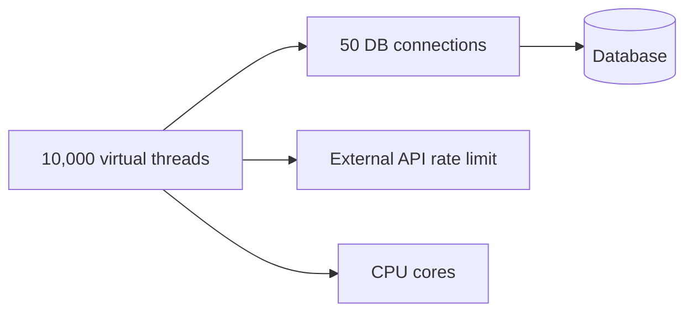
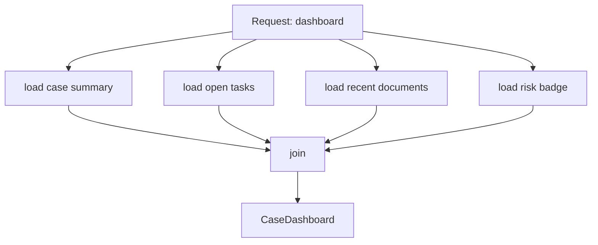
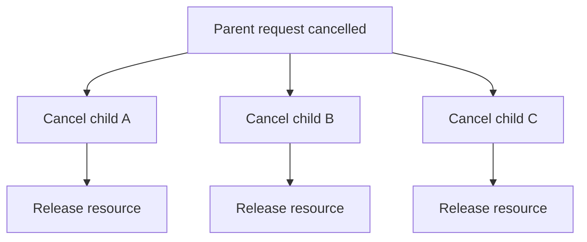

------
title: Learn Java Patterns - Part 020
description: Virtual threads and structured concurrency patterns in modern Java: thread-per-task, request-scoped task tree, StructuredTaskScope, ScopedValue, cancellation tree, deadline propagation, pinning, resource limits, and migration from async callback code.
series: learn-java-patterns
seriesTitle: Learn Java Patterns, Data Patterns, Pipeline Patterns, Concurrency Patterns, Common Patterns, and Anti-Patterns
order: 20
partTitle: Virtual Threads and Structured Concurrency Patterns
tags:
- java
- patterns
- concurrency
- virtual-threads
- structured-concurrency
- scoped-values
- project-loom
- advanced-java
date: 2026-06-27
---

# Part 020 — Virtual Threads and Structured Concurrency Patterns

> Goal: mampu menggunakan virtual threads dan structured concurrency untuk membuat concurrent Java code yang lebih sederhana, bounded, cancellable, observable, dan selaras dengan request lifecycle.

Part 019 membahas `Future` dan `CompletableFuture`. Tool itu tetap penting, tetapi Java modern mengubah kalkulus desain concurrency.

Dulu, banyak Java service menjadi async callback-heavy karena platform thread mahal. Blocking dianggap musuh. Akibatnya, kode I/O sederhana berubah menjadi graph future yang rumit.

Virtual threads mengubah trade-off:

```text
Old assumption:
blocking thread is expensive, so avoid blocking style.

Modern Java assumption:
blocking virtual thread can be cheap, but resource limits, cancellation, and structure still matter.
```

Virtual threads bukan pengganti desain concurrency. Mereka mengurangi biaya thread-per-task, tetapi tidak menghapus kebutuhan capacity limit, timeout, transaction boundary, database pool, rate limit, dan observability.

Structured concurrency melengkapi virtual threads dengan prinsip:

```text
Concurrent subtasks should have a clear parent scope.
The parent should wait for, cancel, and observe the children as one unit of work.
```

---

## 1. Kaufman Skill Slice

Sub-skill yang harus dilatih:

1. Membedakan platform thread, virtual thread, carrier thread, dan task.
2. Menentukan kapan thread-per-task lebih baik daripada callback/future graph.
3. Mendesain request-scoped concurrency tree.
4. Menggunakan `Executor` virtual-thread-per-task dengan benar.
5. Mendesain structured fan-out/fan-in.
6. Mendesain cancellation propagation.
7. Mendesain deadline dan timeout pada task tree.
8. Menggunakan `ScopedValue` untuk immutable request context, bukan mutable thread-local state.
9. Menghindari pinning dan resource bottleneck tersembunyi.
10. Memigrasi `CompletableFuture` code ke synchronous-looking structured code dengan aman.

Learning target:

> Setelah part ini, Anda harus bisa melihat concurrent request handler dan menjawab: task tree-nya apa, siapa parent-nya, siapa child-nya, kapan semua child selesai, apa yang terjadi saat satu child gagal, bagaimana cancellation menyebar, dan resource apa yang tetap menjadi bottleneck.

---

## 2. Mental Model: Cheap Threads Are Not Infinite Resources

Virtual thread adalah thread ringan yang dikelola JVM. Ia cocok untuk aplikasi dengan banyak operasi blocking, terutama I/O.

Namun virtual thread bukan berarti:

- database connection menjadi infinite,
- downstream API menjadi infinite,
- CPU menjadi infinite,
- memory menjadi infinite,
- lock contention hilang,
- transaction boleh dibuka lama,
- timeout tidak perlu,
- cancellation otomatis sempurna.

Mental model yang benar:

```text
Virtual thread reduces the cost of waiting.
It does not reduce the cost of the thing being waited on.
```

Jika 10.000 virtual threads menunggu database, database pool tetap mungkin hanya 50 connection.



Jadi desain tetap perlu:

- connection pool limit,
- semaphore/bulkhead,
- rate limit,
- timeout,
- bounded queue atau admission control,
- structured cancellation.

---

## 3. Pattern: Thread-Per-Task Revisited

Sebelum virtual threads, thread-per-request atau thread-per-task bisa mahal pada high concurrency.

Dengan virtual threads:

```java
try (ExecutorService executor = Executors.newVirtualThreadPerTaskExecutor()) {
    Future<Customer> customer = executor.submit(() -> customerClient.fetch(customerId));
    Future<RiskScore> risk = executor.submit(() -> riskClient.score(customerId));

    return new CaseView(customer.get(), risk.get());
}
```

Ini tampak synchronous, tetapi dua I/O call berjalan concurrent.

Kelebihan:

- code lebih linear,
- stack trace lebih natural,
- debugging lebih mudah,
- blocking I/O tidak memakan platform thread per request,
- lebih sedikit callback graph.

Kekurangan:

- masih perlu timeout,
- `Future.get()` perlu exception handling,
- cancellation antar task tidak otomatis ideal,
- executor scope harus jelas,
- resource downstream tetap perlu limit.

Thread-per-task cocok untuk:

- service request yang melakukan banyak blocking I/O,
- aggregator API,
- orchestration read path,
- blocking client library yang sudah stabil,
- migrasi dari callback hell ke code linear.

Kurang cocok untuk:

- CPU-bound heavy parallelism tanpa limit,
- extremely low-level event-loop framework,
- operasi yang memegang monitor lama,
- long-lived background stream tanpa lifecycle jelas,
- code yang bergantung pada mutable ThreadLocal besar.

---

## 4. Pattern: Virtual Thread Executor Boundary

Cara umum membuat executor virtual thread:

```java
try (ExecutorService executor = Executors.newVirtualThreadPerTaskExecutor()) {
    Future<Result> future = executor.submit(() -> service.call());
    return future.get();
}
```

Atau sebagai dependency aplikasi:

```java
public final class VirtualThreadTaskRunner implements AutoCloseable {
    private final ExecutorService executor = Executors.newVirtualThreadPerTaskExecutor();

    public <T> Future<T> submit(Callable<T> task) {
        return executor.submit(task);
    }

    @Override
    public void close() {
        executor.close();
    }
}
```

Namun hati-hati dengan executor global tanpa lifecycle. Executor adalah resource boundary. Ia perlu:

- nama thread factory bila diperlukan,
- shutdown policy,
- metrics,
- ownership jelas,
- limit eksternal di layer yang tepat.

Virtual thread executor biasanya tidak membatasi jumlah task. Jika perlu limit, tambahkan bulkhead:

```java
public final class LimitedRunner {
    private final ExecutorService executor;
    private final Semaphore permits;

    public LimitedRunner(ExecutorService executor, int maxConcurrent) {
        this.executor = executor;
        this.permits = new Semaphore(maxConcurrent);
    }

    public <T> Future<T> submit(Callable<T> task) {
        return executor.submit(() -> {
            permits.acquire();
            try {
                return task.call();
            } finally {
                permits.release();
            }
        });
    }
}
```

Capacity belongs to the constrained resource, not to virtual threads themselves.

---

## 5. Pattern: Request-Scoped Task Tree

Sistem production sering punya request yang bercabang:

```text
Build case dashboard
  - load case summary
  - load open tasks
  - load documents
  - load risk badge
```

Dengan ad-hoc futures, task tree tersembunyi.

Dengan structured thinking:



Invariant:

```text
No child task should outlive the request scope unless explicitly detached as durable background work.
```

Ini membedakan:

- request-scoped concurrent work,
- fire-and-forget async side effects,
- durable background jobs.

Jangan campur ketiganya.

---

## 6. Structured Concurrency Mental Model

Structured concurrency membawa ide structured programming ke concurrency:

```text
If a task forks child tasks, those children are joined/cancelled before parent scope exits.
```

Analogi:

```java
{
    // local variables live here
}
```

Structured concurrency:

```java
try (var scope = StructuredTaskScope.open()) {
    // subtasks live here
}
```

Subtask tidak bocor keluar scope.

Manfaat:

- lifecycle jelas,
- cancellation terpusat,
- failure handling konsisten,
- observability lebih mudah,
- stack/task dump lebih bermakna,
- menghindari thread leak.

---

## 7. Pattern: Structured Fan-Out / Fan-In

Dengan Java 25 preview API style, structured concurrency menggunakan `StructuredTaskScope`.

Contoh konseptual:

```java
public CaseDashboard dashboard(CaseId id) throws Exception {
    try (var scope = StructuredTaskScope.open()) {
        Subtask<CaseSummary> summary = scope.fork(() -> caseClient.summary(id));
        Subtask<List<TaskSummary>> tasks = scope.fork(() -> taskClient.openTasks(id));
        Subtask<List<DocumentSummary>> docs = scope.fork(() -> documentClient.recentDocuments(id));
        Subtask<RiskBadge> risk = scope.fork(() -> riskClient.badge(id));

        scope.join();

        return new CaseDashboard(
            summary.get(),
            tasks.get(),
            docs.get(),
            risk.get()
        );
    }
}
```

Catatan: API structured concurrency masih preview di Java 25, sehingga detail syntax dapat berubah antar versi. Mental model-nya lebih penting daripada menghafal satu bentuk API.

Keunggulan dibanding `CompletableFuture`:

- code linear,
- child lifetime jelas,
- failure handling lebih terstruktur,
- debugging lebih dekat ke synchronous code,
- tidak perlu nested callback.

---

## 8. Pattern: Shutdown-on-Failure Scope

Banyak use case butuh rule:

```text
Jika satu critical subtask gagal, batalkan subtasks lain.
```

Contoh:

```java
public EligibilityResult evaluate(CaseId id) throws Exception {
    try (var scope = StructuredTaskScope.open()) {
        Subtask<CaseRecord> record = scope.fork(() -> caseRepository.get(id));
        Subtask<ApplicantProfile> profile = scope.fork(() -> applicantClient.profile(id));
        Subtask<SanctionResult> sanction = scope.fork(() -> sanctionClient.screen(id));

        scope.join();

        return eligibilityEngine.evaluate(
            record.get(),
            profile.get(),
            sanction.get()
        );
    }
}
```

Dalam implementation nyata, gunakan joiner/policy yang sesuai:

- wait all,
- fail fast,
- first success,
- collect successful partials,
- timeout.

Mental model:

```text
Join policy is part of the domain semantics.
```

Jika sanction screening gagal, apakah result boleh approve? Biasanya tidak. Mungkin harus manual review atau fail closed.

---

## 9. Pattern: Partial Result Scope

Read dashboard sering boleh degraded.

```java
public CaseDashboard dashboard(CaseId id) throws Exception {
    try (var scope = StructuredTaskScope.open()) {
        Subtask<CaseSummary> summary = scope.fork(() -> caseClient.summary(id));
        Subtask<List<TaskSummary>> tasks = scope.fork(() -> taskClient.openTasks(id));
        Subtask<List<DocumentSummary>> docs = scope.fork(() -> documentClient.recentDocuments(id));

        scope.join();

        CaseSummary requiredSummary = summary.get();
        List<TaskSummary> optionalTasks = valueOrEmpty(tasks);
        List<DocumentSummary> optionalDocs = valueOrEmpty(docs);

        return new CaseDashboard(requiredSummary, optionalTasks, optionalDocs);
    }
}

private static <T> T valueOr(Subtask<T> task, T fallback) {
    try {
        return task.get();
    } catch (RuntimeException ex) {
        return fallback;
    }
}
```

Tetapi partial result harus observable:

```text
dashboard.degraded=true
dashboard.degraded_component=documents
```

Dan domain harus jelas:

- optional docs boleh kosong,
- summary tidak boleh fallback,
- risk badge timeout menjadi UNKNOWN,
- sanction screening timeout menjadi MANUAL_REVIEW atau fail closed.

---

## 10. Pattern: Deadline Scope

Structured concurrency harus memakai deadline, bukan hanya timeout lokal acak.

```java
public record Deadline(Instant expiresAt) {
    public Duration remaining(Clock clock) {
        Duration duration = Duration.between(clock.instant(), expiresAt);
        return duration.isNegative() ? Duration.ZERO : duration;
    }

    public void throwIfExpired(Clock clock) throws TimeoutException {
        if (remaining(clock).isZero()) {
            throw new TimeoutException("deadline exceeded");
        }
    }
}
```

Pemakaian konseptual:

```java
public CaseDashboard dashboard(CaseId id, Deadline deadline) throws Exception {
    deadline.throwIfExpired(clock);

    try (var scope = StructuredTaskScope.open()) {
        Subtask<CaseSummary> summary = scope.fork(() ->
            caseClient.summary(id, deadline.remaining(clock)));

        Subtask<List<TaskSummary>> tasks = scope.fork(() ->
            taskClient.openTasks(id, deadline.remaining(clock)));

        scope.join();

        return new CaseDashboard(summary.get(), tasks.get());
    }
}
```

Deadline propagation mencegah masalah:

```text
parent request budget: 800 ms
child A timeout: 1 s
child B timeout: 1 s
child C timeout: 1 s
```

Jika child timeout lebih besar dari parent budget, cancellation akan terlambat dan resource tetap terbakar.

---

## 11. Pattern: Cancellation Tree

Structured concurrency membuat cancellation tree lebih natural.



Namun cancellation tetap cooperative:

- blocking I/O harus mendukung interrupt atau timeout,
- loop CPU harus check interruption,
- locks harus tidak menunggu selamanya,
- external requests perlu cancellation/timeout di client,
- transaction harus rollback dengan benar.

Contoh CPU loop:

```java
RiskScore score(CaseRecord record) {
    RiskAccumulator accumulator = new RiskAccumulator();

    for (RiskRule rule : rules) {
        if (Thread.currentThread().isInterrupted()) {
            throw new CancellationException("risk scoring interrupted");
        }
        accumulator.add(rule.evaluate(record));
    }

    return accumulator.toScore();
}
```

Contoh blocking call harus punya timeout:

```java
HttpRequest request = HttpRequest.newBuilder(uri)
    .timeout(Duration.ofMillis(300))
    .GET()
    .build();
```

Jangan mengandalkan cancellation parent jika child blocking call tidak punya timeout.

---

## 12. Pattern: Scoped Values for Immutable Context

ThreadLocal sering dipakai untuk:

- tenant,
- correlation ID,
- actor,
- locale,
- request deadline,
- security principal.

Masalah ThreadLocal pada virtual-thread-heavy system:

- mudah lupa dibersihkan,
- mutable context bisa bocor,
- inheritance membingungkan,
- memory cost bisa meningkat,
- implicit dependency sulit diuji.

Scoped value adalah model untuk berbagi immutable data dalam scope tertentu.

Konseptual:

```java
public final class RequestContextHolder {
    public static final ScopedValue<RequestContext> REQUEST_CONTEXT = ScopedValue.newInstance();
}
```

Pemakaian konseptual:

```java
ScopedValue.where(REQUEST_CONTEXT, context).run(() -> {
    handler.handle(request);
});
```

Di dalam call tree:

```java
RequestContext context = REQUEST_CONTEXT.get();
```

Mental model:

```text
ScopedValue is bound for a lexical/dynamic scope.
It is immutable from the perspective of callees.
Child tasks in structured concurrency can inherit it.
```

Pattern sehat:

- gunakan untuk request metadata yang immutable,
- jangan gunakan untuk mutable aggregate state,
- jangan sembunyikan domain-critical input jika parameter eksplisit lebih baik,
- jangan pakai sebagai global variable baru.

---

## 13. Pattern: Explicit Domain Input, Scoped Operational Context

Bedakan domain input dan operational context.

Domain input:

```java
ApproveCase command
CaseId caseId
Actor actor
Reason reason
```

Operational context:

```java
correlationId
deadline
trace context
tenant context for infrastructure routing
```

Rule:

```text
If business decision depends on it, prefer explicit parameter.
If infrastructure observation/routing depends on it, ScopedValue can be acceptable.
```

Contoh:

```java
public Decision evaluate(ApproveCase command) {
    RequestContext context = REQUEST_CONTEXT.get();
    log.info("Evaluating command: correlationId={}", context.correlationId());

    return policy.evaluate(command); // actor remains in command, not hidden in scoped context
}
```

Jangan:

```java
public Decision evaluate(CaseId id) {
    Actor actor = REQUEST_CONTEXT.get().actor();
    // business decision depends on hidden actor
}
```

Kecuali architectural standard Anda memang menjadikan principal sebagai context dan test utilities mendukungnya secara eksplisit. Untuk regulatory/audit-heavy systems, explicit command biasanya lebih defensible.

---

## 14. Pattern: Virtual Threads for Blocking I/O

Virtual threads paling kuat untuk blocking I/O:

```java
public CaseDashboard dashboard(CaseId id) throws Exception {
    try (ExecutorService executor = Executors.newVirtualThreadPerTaskExecutor()) {
        Future<CaseSummary> summary = executor.submit(() -> caseClient.summary(id));
        Future<List<TaskSummary>> tasks = executor.submit(() -> taskClient.openTasks(id));
        Future<List<DocumentSummary>> docs = executor.submit(() -> documentClient.recentDocuments(id));

        return new CaseDashboard(summary.get(), tasks.get(), docs.get());
    }
}
```

Namun jangan lupa bottleneck:

```java
private final Semaphore documentClientPermits = new Semaphore(50);

List<DocumentSummary> recentDocumentsLimited(CaseId id) throws Exception {
    if (!documentClientPermits.tryAcquire(100, TimeUnit.MILLISECONDS)) {
        throw new TooBusyException("document client bulkhead full");
    }
    try {
        return documentClient.recentDocuments(id);
    } finally {
        documentClientPermits.release();
    }
}
```

Virtual threads membuat wait murah, tetapi membanjiri dependency tetap buruk.

---

## 15. Pattern: Virtual Threads and Database Access

Database access sering blocking. Virtual threads dapat membuat code lebih sederhana, tetapi database pool tetap membatasi concurrency.

Buruk:

```java
for (CaseId id : ids) {
    executor.submit(() -> repository.load(id));
}
```

Jika `ids` berisi 100.000 dan pool database 50 connection, Anda membuat 100.000 virtual threads yang sebagian besar menunggu pool.

Lebih baik:

```java
public List<CaseRecord> loadCases(List<CaseId> ids) throws Exception {
    Semaphore dbPermits = new Semaphore(50);

    try (ExecutorService executor = Executors.newVirtualThreadPerTaskExecutor()) {
        List<Future<CaseRecord>> futures = new ArrayList<>();

        for (CaseId id : ids) {
            futures.add(executor.submit(() -> {
                dbPermits.acquire();
                try {
                    return repository.load(id);
                } finally {
                    dbPermits.release();
                }
            }));
        }

        List<CaseRecord> result = new ArrayList<>();
        for (Future<CaseRecord> future : futures) {
            result.add(future.get());
        }
        return result;
    }
}
```

Namun untuk database, batching query sering lebih baik daripada parallel single-row load:

```java
List<CaseRecord> records = repository.loadAll(ids);
```

Pattern decision:

```text
First improve data access shape.
Then use concurrency where independence remains.
```

---

## 16. Pattern: Pinning Awareness

Virtual threads can be mounted/unmounted from carrier threads. Tetapi ada kondisi yang dapat membuat virtual thread pin carrier, misalnya operasi tertentu di dalam synchronized block atau native/foreign blocking calls.

Praktisnya:

- hindari blocking I/O lama di dalam `synchronized`,
- hindari memegang monitor saat memanggil external service,
- gunakan `ReentrantLock` untuk kasus tertentu bila lebih cocok,
- minimalkan critical section,
- jangan menyimpan transaction/connection/lock terlalu lama,
- observasi pinning dengan tooling/JFR/log yang tersedia.

Buruk:

```java
public synchronized Report generate(CaseId id) {
    CaseRecord record = repository.load(id);      // blocking
    RiskScore score = riskClient.score(record);   // blocking external call
    return reportAssembler.assemble(record, score);
}
```

Lebih baik:

```java
public Report generate(CaseId id) {
    CaseRecord record = repository.load(id);
    RiskScore score = riskClient.score(record);

    synchronized (this) {
        return reportCache.computeIfAbsent(id, ignored ->
            reportAssembler.assemble(record, score));
    }
}
```

Bahkan ini pun perlu review: apakah cache update perlu synchronized? Apakah `ConcurrentHashMap` lebih cocok? Apakah compute function boleh mahal?

Rule:

```text
Never hold a lock while doing slow or blocking work.
```

Rule ini sudah benar sebelum virtual threads; dengan virtual threads ia makin penting.

---

## 17. Pattern: One Request, Many Virtual Threads, One Transaction?

Jangan menyebarkan satu transaction/persistence context ke banyak virtual threads.

Buruk:

```java
@Transactional
public Report generate(CaseId id) throws Exception {
    CaseAggregate aggregate = repository.load(id);

    try (ExecutorService executor = Executors.newVirtualThreadPerTaskExecutor()) {
        Future<RiskScore> risk = executor.submit(() -> riskService.score(aggregate));
        Future<List<Document>> docs = executor.submit(() -> documentRepository.findByCase(id));
        return assemble(aggregate, risk.get(), docs.get());
    }
}
```

Masalah:

- persistence context umumnya thread-bound,
- lazy loading lintas thread berbahaya,
- transaction boundary tidak jelas,
- aggregate mutable dibaca oleh banyak thread,
- lock/connection bisa ditahan lama.

Lebih sehat:

```java
public Report generate(CaseId id) throws Exception {
    CaseSnapshot snapshot = transactionTemplate.execute(tx -> {
        CaseAggregate aggregate = repository.load(id);
        return CaseSnapshot.from(aggregate); // immutable detached snapshot
    });

    try (ExecutorService executor = Executors.newVirtualThreadPerTaskExecutor()) {
        Future<RiskScore> risk = executor.submit(() -> riskService.score(snapshot));
        Future<List<DocumentSummary>> docs = executor.submit(() -> documentClient.list(snapshot.id()));
        return assemble(snapshot, risk.get(), docs.get());
    }
}
```

Pattern:

```text
Use transactions to create consistent snapshots.
Use concurrency over immutable snapshots.
Commit changes in a clear transaction boundary.
```

---

## 18. Pattern: Structured Command Execution

Command flow biasanya harus lebih hati-hati daripada read aggregation.

Contoh command:

```text
Approve case
  - load aggregate
  - validate transition
  - screen sanctions
  - update aggregate
  - persist
  - outbox event
```

Sanction screening mungkin external I/O dan dapat berjalan sebelum transaction write. Tetapi update aggregate harus transactional.

```java
public CommandResult approve(ApproveCase command) throws Exception {
    CaseSnapshot snapshot = transactionTemplate.execute(tx -> {
        CaseAggregate aggregate = repository.load(command.caseId());
        aggregate.assertCanApprove(command.actor());
        return CaseSnapshot.from(aggregate);
    });

    SanctionResult sanction = sanctionClient.screen(snapshot.applicantId(), command.deadline());
    if (sanction.requiresManualReview()) {
        return CommandResult.manualReview("sanction-review");
    }

    return transactionTemplate.execute(tx -> {
        CaseAggregate aggregate = repository.load(command.caseId());
        aggregate.approve(command.actor(), command.reason(), clock.instant());
        repository.save(aggregate);
        outbox.addAll(aggregate.releaseEvents());
        return CommandResult.accepted(aggregate.id(), aggregate.version());
    });
}
```

Mengapa reload aggregate?

Karena state bisa berubah antara snapshot dan final write. Perlu optimistic locking/version check.

Pattern:

```text
Concurrency may accelerate pre-checks.
State mutation still needs a single defensible transaction boundary.
```

---

## 19. Pattern: Hybrid `CompletableFuture` and Virtual Threads

Tidak semua harus dipilih secara absolut.

`CompletableFuture` cocok untuk API contract async:

```java
public CompletableFuture<Decision> evaluateAsync(Command command)
```

Tetapi implementation bisa memakai virtual thread:

```java
public CompletableFuture<Decision> evaluateAsync(Command command) {
    CompletableFuture<Decision> promise = new CompletableFuture<>();

    virtualThreadExecutor.submit(() -> {
        try {
            promise.complete(evaluate(command));
        } catch (Throwable error) {
            promise.completeExceptionally(error);
        }
    });

    return promise;
}
```

Atau lebih sederhana:

```java
public CompletableFuture<Decision> evaluateAsync(Command command) {
    return CompletableFuture.supplyAsync(() -> evaluate(command), virtualThreadExecutor);
}
```

Caveat:

- cancellation bridge tetap perlu jika caller cancel future,
- executor virtual thread tidak otomatis bounded,
- jangan memakai async API hanya untuk ikut tren.

---

## 20. Pattern: Migration from CompletableFuture Chain to Structured Code

Sebelum:

```java
public CompletableFuture<CaseDashboard> dashboardAsync(CaseId id) {
    CompletableFuture<CaseSummary> summary =
        CompletableFuture.supplyAsync(() -> caseClient.summary(id), caseExecutor);

    CompletableFuture<List<TaskSummary>> tasks =
        CompletableFuture.supplyAsync(() -> taskClient.openTasks(id), taskExecutor);

    CompletableFuture<List<DocumentSummary>> docs =
        CompletableFuture.supplyAsync(() -> documentClient.recentDocuments(id), docExecutor)
            .exceptionally(error -> List.of());

    return summary.thenCombine(tasks, DashboardPartial::new)
        .thenCombine(docs, (partial, documents) ->
            new CaseDashboard(partial.summary(), partial.tasks(), documents));
}
```

Sesudah, synchronous-looking with virtual threads:

```java
public CaseDashboard dashboard(CaseId id) throws Exception {
    try (ExecutorService executor = Executors.newVirtualThreadPerTaskExecutor()) {
        Future<CaseSummary> summary = executor.submit(() -> caseClient.summary(id));
        Future<List<TaskSummary>> tasks = executor.submit(() -> taskClient.openTasks(id));
        Future<List<DocumentSummary>> docs = executor.submit(() -> {
            try {
                return documentClient.recentDocuments(id);
            } catch (RuntimeException ex) {
                metrics.increment("dashboard.documents.fallback");
                return List.of();
            }
        });

        return new CaseDashboard(summary.get(), tasks.get(), docs.get());
    }
}
```

Structured version is easier to read. Tetapi masih perlu:

- deadline,
- cancellation,
- bulkhead,
- error taxonomy,
- observability.

Migration checklist:

1. Identifikasi async boundary.
2. Identifikasi branch independent.
3. Ubah domain transformation menjadi synchronous function.
4. Gunakan virtual threads untuk blocking I/O branch.
5. Tambahkan deadline.
6. Tambahkan failure policy per branch.
7. Tambahkan bulkhead per dependency.
8. Tambahkan metrics degraded response.
9. Hapus `.join()` yang tidak perlu.
10. Buat tests untuk success, failure, timeout, cancellation.

---

## 21. Pattern: Server Request Handling with Virtual Threads

Banyak framework modern dapat menjalankan request di virtual thread. Mental model:

```text
One request -> one virtual thread
Blocking code becomes acceptable when downstream resources are bounded.
```

Controller/service code bisa tetap linear:

```java
public CaseView getCase(CaseId id) {
    CaseRecord record = caseRepository.load(id);
    List<Action> actions = actionRepository.listOpen(id);
    return mapper.toView(record, actions);
}
```

Namun jangan salah interpretasi:

- virtual thread tidak membuat N+1 query aman,
- virtual thread tidak menghapus need pagination,
- virtual thread tidak memperbaiki slow SQL,
- virtual thread tidak membuat external API reliable,
- virtual thread tidak menghapus need timeout.

Pattern review:

```text
Virtual thread simplifies the thread model.
Architecture still owns data access, resource shaping, and failure semantics.
```

---

## 22. Pattern: Backpressure with Virtual Threads

Karena virtual threads murah, backpressure sering harus dipindah dari thread pool ke resource boundary.

Contoh dependency bulkhead:

```java
public final class ExternalServiceBulkhead {
    private final Semaphore permits;
    private final ExternalClient client;

    public ExternalServiceBulkhead(int maxConcurrent, ExternalClient client) {
        this.permits = new Semaphore(maxConcurrent);
        this.client = client;
    }

    public Response call(Request request, Deadline deadline) throws Exception {
        Duration waitBudget = deadline.remaining(Clock.systemUTC());
        if (!permits.tryAcquire(waitBudget.toMillis(), TimeUnit.MILLISECONDS)) {
            throw new TooBusyException("bulkhead full");
        }

        try {
            return client.call(request, deadline.remaining(Clock.systemUTC()));
        } finally {
            permits.release();
        }
    }
}
```

Backpressure options:

| Boundary | Strategy |
|---|---|
| HTTP ingress | rate limit, admission control |
| DB | connection pool, query budget, batching |
| External API | semaphore, circuit breaker, timeout |
| CPU-heavy work | CPU executor or work queue |
| Messaging consumer | pause/limit poll, max inflight |
| Batch | chunk size, partition limit |

Virtual threads should not be your only limiter.

---

## 23. Pattern: Long-Lived Tasks

Virtual threads are good for many tasks, but long-lived tasks require lifecycle design.

Examples:

- websocket session,
- subscription stream,
- polling loop,
- background scheduler,
- file watcher,
- message consumer.

Do not create unowned long-lived virtual threads.

Bad:

```java
Thread.startVirtualThread(() -> {
    while (true) {
        poll();
    }
});
```

Better:

```java
public final class PollingWorker implements AutoCloseable {
    private final ExecutorService executor = Executors.newVirtualThreadPerTaskExecutor();
    private final AtomicBoolean running = new AtomicBoolean();
    private Future<?> future;

    public void start() {
        if (!running.compareAndSet(false, true)) {
            return;
        }
        future = executor.submit(this::runLoop);
    }

    private void runLoop() {
        while (running.get() && !Thread.currentThread().isInterrupted()) {
            pollOnce();
        }
    }

    @Override
    public void close() {
        running.set(false);
        if (future != null) {
            future.cancel(true);
        }
        executor.close();
    }
}
```

Better still: use framework lifecycle primitives for consumers/schedulers where available.

---

## 24. Pattern: Observability for Virtual Threads

Virtual threads can create huge task counts. Observability must focus on task semantics, not only thread names.

Capture:

- request ID,
- task name,
- scope name,
- dependency name,
- deadline remaining,
- wait time for permit/connection,
- execution duration,
- cancellation reason,
- timeout reason,
- degraded component,
- downstream status.

Example log:

```text
scope_task_completed
  request_id=...
  scope=case-dashboard
  task=recent-documents
  dependency=document-service
  elapsed_ms=184
  permit_wait_ms=12
  outcome=fallback
```

Metrics:

```text
virtual_task.duration
virtual_task.cancelled.count
scope.duration
scope.failed.count
scope.degraded.count
bulkhead.permits.available
bulkhead.rejected.count
pinning.events
```

Thread dumps become more useful when task names and scope names are meaningful. Use naming facilities/framework support where available.

---

## 25. Pattern: Testing Structured Concurrency

Test behavior, not scheduling internals.

### Success

```java
@Test
void buildsDashboardFromAllSources() throws Exception {
    CaseDashboard dashboard = service.dashboard(caseId);

    assertThat(dashboard.summary()).isNotNull();
    assertThat(dashboard.tasks()).hasSize(2);
    assertThat(dashboard.documents()).hasSize(3);
}
```

### Failure policy

```java
@Test
void failsWhenRequiredSummaryFails() {
    caseClient.failWith(new ServiceUnavailableException("case service down"));

    assertThrows(ServiceUnavailableException.class, () -> service.dashboard(caseId));
}
```

### Degraded optional dependency

```java
@Test
void degradesWhenDocumentsFail() throws Exception {
    documentClient.failWith(new TimeoutException("documents timeout"));

    CaseDashboard dashboard = service.dashboard(caseId);

    assertThat(dashboard.documents()).isEmpty();
    assertThat(metrics.counter("dashboard.documents.fallback").count()).isEqualTo(1);
}
```

### Cancellation/timeout

Avoid flaky sleeps when possible. Use fake clients with latches or controllable blockers.

```java
@Test
void cancelsChildrenWhenDeadlineExpires() {
    documentClient.blockUntilInterrupted();

    assertThrows(TimeoutException.class, () ->
        service.dashboard(caseId, Deadline.after(Duration.ofMillis(50), clock))
    );

    assertThat(documentClient.wasInterrupted()).isTrue();
}
```

---

## 26. Anti-Pattern: Virtual Thread as Excuse for No Limits

Bad reasoning:

```text
Virtual threads are cheap, therefore we can start as many as needed.
```

Better reasoning:

```text
Virtual threads are cheap enough to represent concurrent waits directly.
Every constrained downstream still needs a limit.
```

Symptoms:

- DB pool saturated,
- downstream 429/503 spikes,
- memory grows with request burst,
- timeout storms,
- retry amplification,
- dashboard endpoint kills document service.

Fix:

- bulkhead per dependency,
- rate limit at ingress,
- deadline propagation,
- bounded fan-out,
- retry budget,
- circuit breaker,
- observability.

---

## 27. Anti-Pattern: Holding Locks Across Blocking Calls

Bad:

```java
synchronized void updateCache(CaseId id) {
    CaseRecord record = repository.load(id);
    cache.put(id, record);
}
```

Even with virtual threads, this serializes all callers and may pin carrier resources depending operation path.

Better:

```java
void updateCache(CaseId id) {
    CaseRecord record = repository.load(id);
    cache.put(id, record);
}
```

If cache mutation needs atomicity:

```java
cache.compute(id, (key, oldValue) -> merge(oldValue, record));
```

But do not put slow I/O inside `compute` either.

---

## 28. Anti-Pattern: ThreadLocal Heavy Context

Bad:

```java
static final ThreadLocal<MutableRequestContext> CONTEXT = new ThreadLocal<>();
```

Issues:

- mutable state can be changed by any callee,
- cleanup is easy to forget,
- inheritance semantics can surprise,
- memory overhead multiplied by many virtual threads,
- tests become order-dependent.

Prefer:

- explicit command fields for domain data,
- `ScopedValue` for immutable operational context,
- framework-supported context propagation for tracing,
- small context object.

---

## 29. Anti-Pattern: Detached Fire-and-Forget Virtual Thread

Bad:

```java
Thread.startVirtualThread(() -> emailClient.send(email));
return result;
```

Problems:

- email failure disappears,
- no retry,
- no ownership,
- no shutdown tracking,
- no audit,
- no backpressure,
- no correlation.

Better for durable side effect:

```java
outbox.enqueue(new SendEmailRequested(email));
return result;
```

Better for best-effort non-critical side effect:

```java
notificationExecutor.submit(() -> {
    try {
        emailClient.send(email);
    } catch (Exception ex) {
        log.warn("Best-effort email failed: correlationId={}", correlationId, ex);
        metrics.increment("email.best_effort.failed");
    }
});
```

Still give it lifecycle and metrics.

---

## 30. Pattern Selection: CompletableFuture vs Virtual Threads vs Structured Concurrency

| Use case | Prefer | Why |
|---|---|---|
| Async API contract with callbacks | `CompletableFuture` | Result handle and composition |
| Simple concurrent blocking I/O | Virtual threads | Linear code, cheap waiting |
| Parent task forks children and must join/cancel them | Structured concurrency | Clear lifecycle and cancellation tree |
| CPU-heavy parallel computation | bounded CPU executor / fork-join | CPU is the bottleneck |
| Reactive stream with backpressure | Reactive Streams / Flow / framework | Demand protocol matters |
| Durable background work | Queue/job/outbox | Survives process/request lifecycle |
| Fire-and-forget audit/event | Outbox | Reliability and auditability |
| Request-scoped optional read aggregation | Virtual threads or structured scope | Simpler than callback graph |
| Complex non-blocking event-loop stack | Framework-native async/reactive | Avoid blocking event loop |

Rule:

```text
Use the concurrency model that makes lifecycle, failure, and capacity easiest to reason about.
```

---

## 31. Production Review Checklist

Before merging virtual-thread/structured-concurrency code:

1. Is this workload I/O-bound, CPU-bound, or mixed?
2. Does the task have a parent scope?
3. Can any child task outlive the request unintentionally?
4. What is the failure policy if one child fails?
5. What is the cancellation policy?
6. Is deadline propagated to all blocking calls?
7. Are downstream resources bounded?
8. Is database access batched before parallelized?
9. Are transactions thread-confined?
10. Are aggregates/snapshots immutable across threads?
11. Are locks held only for short critical sections?
12. Is `ThreadLocal` usage audited?
13. Could `ScopedValue` or explicit context be better?
14. Are metrics attached to task semantics, not just thread count?
15. Are degraded responses visible?
16. Are tests covering timeout, failure, cancellation, and partial fallback?
17. Is preview API usage acceptable for this runtime/support policy?

---

## 32. Practice Drill

Take this `CompletableFuture` aggregator:

```java
public CompletableFuture<CaseDashboard> dashboardAsync(CaseId id) {
    CompletableFuture<CaseSummary> summary = CompletableFuture.supplyAsync(() -> caseClient.summary(id));
    CompletableFuture<List<TaskSummary>> tasks = CompletableFuture.supplyAsync(() -> taskClient.openTasks(id));
    CompletableFuture<List<DocumentSummary>> docs = CompletableFuture.supplyAsync(() -> documentClient.recentDocuments(id));

    return summary.thenCombine(tasks, DashboardPartial::new)
        .thenCombine(docs, (partial, documents) ->
            new CaseDashboard(partial.summary(), partial.tasks(), documents));
}
```

Refactor exercise:

1. Buat synchronous-looking implementation dengan virtual threads.
2. Tambahkan deadline 700 ms.
3. `summary` wajib berhasil.
4. `tasks` timeout menjadi empty list plus degraded flag.
5. `documents` timeout menjadi empty list plus metric.
6. Tambahkan semaphore limit untuk document client.
7. Pastikan tidak ada child task yang bocor setelah method return.
8. Pastikan domain data tidak diambil dari ThreadLocal mutable.
9. Tambahkan test untuk success, summary failure, document timeout, dan cancellation.
10. Jelaskan apakah structured concurrency preview API boleh digunakan di target runtime Anda.

Kriteria benar:

```text
- code lebih linear daripada future graph.
- failure semantics lebih eksplisit.
- deadline digunakan, bukan timeout acak.
- external dependency punya limit.
- optional degradation observable.
- transaction boundary tidak bocor lintas thread.
```

---

## 33. Key Takeaways

1. Virtual threads membuat blocking style scalable untuk banyak I/O-bound workloads.
2. Virtual threads tidak membuat downstream resources infinite.
3. Structured concurrency membuat child task lifecycle eksplisit.
4. Request-scoped concurrency harus membentuk task tree, bukan task cloud.
5. Cancellation tetap cooperative.
6. Deadline propagation lebih baik daripada timeout lokal acak.
7. `ScopedValue` cocok untuk immutable operational context, bukan mutable domain state.
8. Jangan memegang lock saat blocking I/O.
9. Jangan menyebarkan transaction/persistence context lintas threads.
10. Pilih model concurrency berdasarkan lifecycle, failure, capacity, dan operability.

---

## 34. References

- Oracle Java SE 25 — Virtual Threads: https://docs.oracle.com/en/java/javase/25/core/virtual-threads.html
- Oracle Java SE 25 — Structured Concurrency: https://docs.oracle.com/en/java/javase/25/core/structured-concurrency.html
- Oracle Java SE 25 API — `StructuredTaskScope`: https://docs.oracle.com/en/java/javase/25/docs/api/java.base/java/util/concurrent/StructuredTaskScope.html
- Oracle Java SE 25 API — `StructuredTaskScope.Configuration`: https://docs.oracle.com/en/java/javase/25/docs/api/java.base/java/util/concurrent/StructuredTaskScope.Configuration.html
- OpenJDK JEP 444 — Virtual Threads: https://openjdk.org/jeps/444
- OpenJDK JEP 505 — Structured Concurrency Fifth Preview: https://openjdk.org/jeps/505
- OpenJDK JEP 506 — Scoped Values: https://openjdk.org/jeps/506
