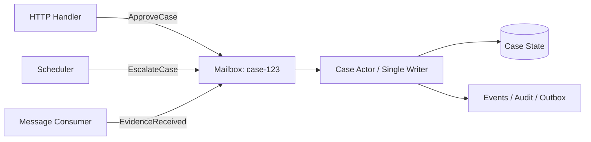
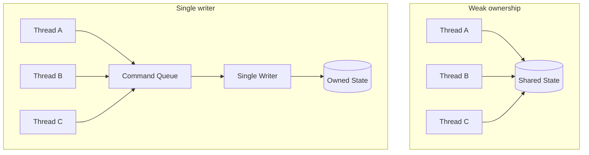
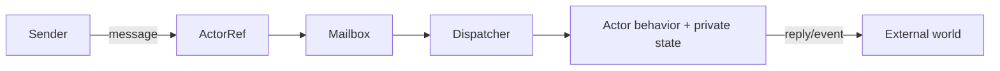
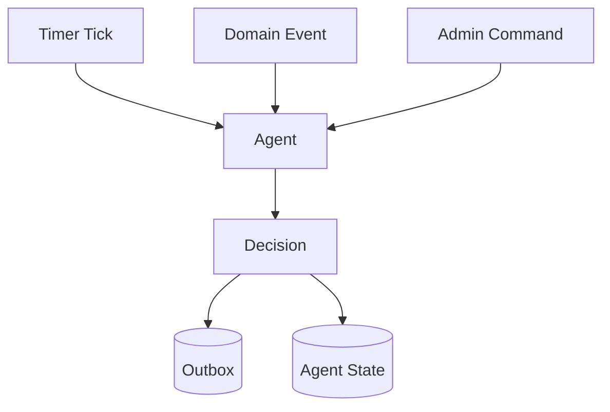
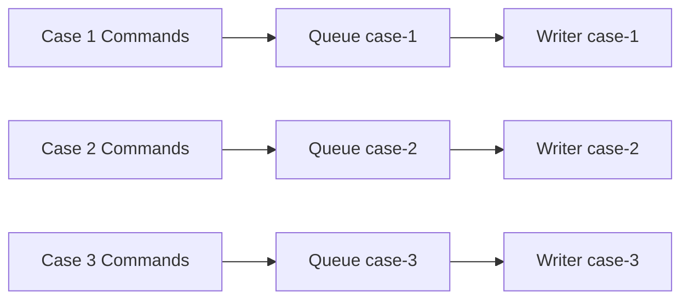
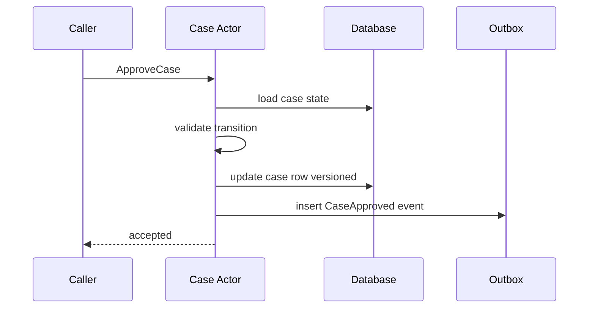
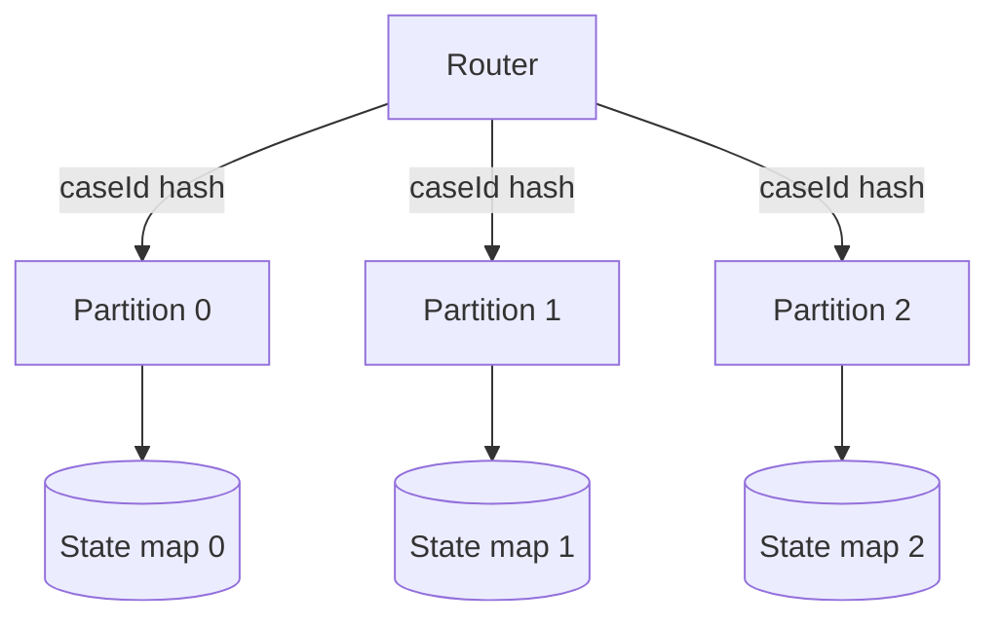
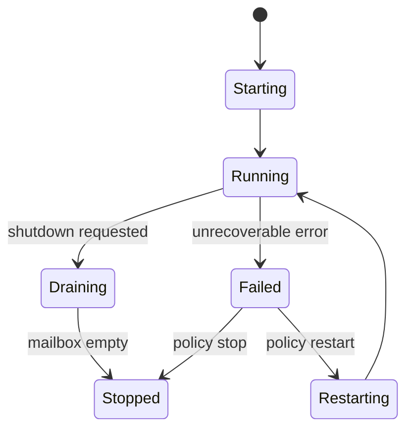
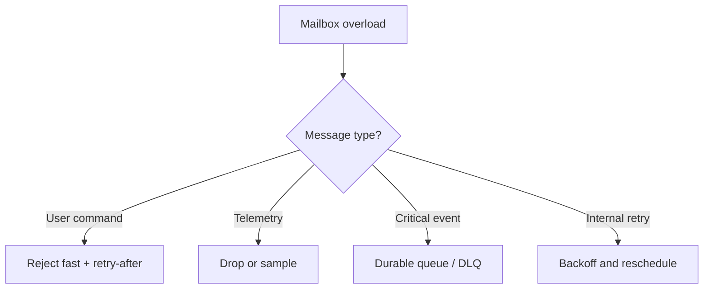

------
title: Learn Java Patterns - Part 021
description: Actor, agent, mailbox, command serialization, single-writer principle, partition-owned mutation, supervision, backpressure, and failure modeling for Java systems that need safe concurrent state without pervasive locking.
series: learn-java-patterns
seriesTitle: Learn Java Patterns, Data Patterns, Pipeline Patterns, Concurrency Patterns, Common Patterns, and Anti-Patterns
order: 21
partTitle: Actor, Agent, and Single-Writer Patterns
tags:
- java
- patterns
- concurrency
- actor-model
- agent
- single-writer
- mailbox
- advanced-java
date: 2026-06-27
---

# Part 021 — Actor, Agent, and Single-Writer Patterns

> Goal: mampu mendesain komponen concurrent yang aman dengan cara mengurangi shared mutable state, bukan hanya menambahkan lock di mana-mana.

Part 017 dan 018 membahas locking, synchronization, dan work distribution. Bagian ini mengambil arah berbeda:

```text
Instead of protecting shared mutable state with many locks,
move mutation behind one owner and communicate by messages.
```

Actor, agent, dan single-writer pattern bukan sekadar alternatif syntax concurrency. Mereka adalah cara berpikir untuk membuat state mutation menjadi **serial, owned, auditable, dan easier to reason about**.

Di sistem production, bug concurrency sering muncul bukan karena developer tidak tahu `synchronized`, tetapi karena ownership state tidak jelas:

- siapa yang boleh mengubah object ini?
- apakah perubahan ini atomic terhadap invariant bisnis?
- apakah dua command bisa race?
- apakah read boleh melihat state setengah jadi?
- apakah retry bisa menggandakan efek?
- apakah callback async diam-diam mengubah state dari thread berbeda?

Actor/single-writer menjawab pertanyaan itu dengan rule keras:

> Untuk satu unit mutable state, hanya satu execution context yang boleh melakukan mutation.

---

## 1. Kaufman Skill Slice

Sub-skill yang harus dilatih:

1. Membedakan actor, agent, worker, service, thread, dan queue.
2. Mendesain message contract yang immutable dan explicit.
3. Menentukan state ownership boundary.
4. Mengubah shared mutation menjadi command serialization.
5. Mendesain mailbox, dispatcher, dan processing loop.
6. Menghindari blocking call di actor hot path.
7. Mendesain backpressure saat mailbox overload.
8. Mendesain supervision dan restart policy.
9. Mendesain ask/reply tanpa future spaghetti.
10. Menguji ordering, idempotency, dan lifecycle actor.
11. Menghindari distributed actor illusion.
12. Menghubungkan actor dengan partitioning dan sharding pada Part 022.

Learning target:

> Setelah bagian ini, Anda harus bisa melihat komponen concurrent dan menjawab: state apa yang dimiliki, siapa satu-satunya writer, message apa yang boleh mengubahnya, bagaimana failure ditangani, bagaimana overload dikendalikan, dan bagaimana state dipulihkan setelah restart.

---

## 2. Mental Model: State Belongs Somewhere

Kesalahan umum dalam desain concurrent Java adalah memperlakukan object mutable sebagai benda bebas yang bisa disentuh oleh siapa pun.

```java
class CaseFile {
    private CaseStatus status;
    private int riskScore;
    private List<String> notes = new ArrayList<>();

    void approve(String userId) { ... }
    void addNote(String note) { ... }
    void recalculateRisk() { ... }
}
```

Class di atas terlihat normal. Tetapi pertanyaan pentingnya:

- apakah method itu bisa dipanggil paralel?
- apakah `approve()` boleh berjalan bersamaan dengan `recalculateRisk()`?
- apakah `notes` aman dibaca saat sedang dimodifikasi?
- apakah semua invariant berubah dalam satu transaction?
- apakah status transition perlu audit event?

Lock bisa membantu, tetapi lock tidak otomatis menjelaskan ownership bisnis.

Single-writer model memindahkan desain menjadi:

```text
CaseFile state is owned by CaseActor(caseId).
All mutations arrive as commands.
CaseActor processes commands one at a time.
```

Diagram:



Invariant-nya sederhana:

```text
For a given caseId, all state mutations are serialized by one owner.
```

Ini tidak berarti seluruh sistem single-threaded. Sistem bisa punya ribuan actor/owners, masing-masing memproses state berbeda secara serial.

---

## 3. Actor vs Agent vs Worker vs Service

Istilah ini sering campur. Gunakan definisi operasional berikut.

| Konsep | Fokus | Memiliki state? | Input | Output |
|---|---|---:|---|---|
| Worker | Menjalankan pekerjaan | Biasanya tidak | Job/task | Result/effect |
| Service | Menyediakan operasi | Kadang | Method/API call | Return/effect |
| Agent | Owner state + behavior otonom | Ya | Command/message | State/effect/reply |
| Actor | Agent dengan mailbox dan message passing | Ya | Message async | Message/effect |
| Single-writer owner | Execution context tunggal untuk mutation | Ya | Command/event | State/effect |

Actor adalah bentuk spesifik dari agent. Single-writer adalah prinsip yang bisa diimplementasikan dengan actor, queue, partitioned executor, event loop, atau database transaction discipline.

---

## 4. Forces: Mengapa Pattern Ini Ada

Actor/single-writer berguna saat beberapa force berikut muncul bersamaan:

1. **Mutable state punya invariant penting**
   - Contoh: case tidak boleh `CLOSED` sebelum semua mandatory checks selesai.

2. **Banyak input source ingin mengubah state yang sama**
   - HTTP request, scheduler, consumer event, admin tool.

3. **Locking mulai menyebar dan sulit diaudit**
   - Banyak object punya `synchronized`, tetapi deadlock dan race tetap ada.

4. **Ordering per entity penting**
   - `SubmitEvidence` harus diproses sebelum `MakeDecision` untuk case yang sama.

5. **Throughput global butuh paralelisme**
   - Banyak case bisa diproses paralel, tetapi satu case harus serial.

6. **Auditability penting**
   - Command masuk, state berubah, event keluar.

7. **Backpressure perlu explicit**
   - Kalau actor lambat, mailbox tumbuh. Itu harus terlihat.

---

## 5. Core Pattern: Single-Writer Owner

### 5.1 Problem

Banyak thread ingin mengubah object yang sama.

### 5.2 Solution

Pilih satu owner untuk state tersebut. Semua mutation harus melewati owner.



### 5.3 Java Skeleton

```java
public interface CaseCommand {
    CaseId caseId();
}

public record ApproveCase(CaseId caseId, UserId approver, Instant at) implements CaseCommand {}
public record AddEvidence(CaseId caseId, EvidenceId evidenceId, Instant at) implements CaseCommand {}
public record EscalateCase(CaseId caseId, EscalationReason reason, Instant at) implements CaseCommand {}
```

Owned state:

```java
final class CaseState {
    private final CaseId id;
    private CaseStatus status;
    private final List<EvidenceId> evidence = new ArrayList<>();
    private int version;

    CaseState(CaseId id) {
        this.id = Objects.requireNonNull(id);
        this.status = CaseStatus.OPEN;
    }

    List<DomainEvent> handle(CaseCommand command) {
        return switch (command) {
            case ApproveCase approve -> approve(approve);
            case AddEvidence add -> addEvidence(add);
            case EscalateCase escalate -> escalate(escalate);
            default -> throw new IllegalArgumentException("Unsupported command: " + command);
        };
    }

    private List<DomainEvent> approve(ApproveCase command) {
        if (status != CaseStatus.READY_FOR_DECISION) {
            throw new InvalidTransitionException(status, CaseStatus.APPROVED);
        }
        status = CaseStatus.APPROVED;
        version++;
        return List.of(new CaseApproved(id, command.approver(), command.at(), version));
    }

    private List<DomainEvent> addEvidence(AddEvidence command) {
        if (status.isTerminal()) {
            throw new CaseAlreadyClosedException(id);
        }
        evidence.add(command.evidenceId());
        version++;
        return List.of(new EvidenceAdded(id, command.evidenceId(), command.at(), version));
    }

    private List<DomainEvent> escalate(EscalateCase command) {
        if (status.isTerminal()) {
            return List.of(); // idempotent no-op, depending on domain rule
        }
        status = CaseStatus.ESCALATED;
        version++;
        return List.of(new CaseEscalated(id, command.reason(), command.at(), version));
    }
}
```

Single writer loop:

```java
public final class CaseOwner implements AutoCloseable {
    private final BlockingQueue<Envelope> mailbox;
    private final Thread worker;
    private final CaseState state;
    private final DomainEventPublisher publisher;
    private volatile boolean running = true;

    public CaseOwner(
            CaseId caseId,
            int mailboxCapacity,
            DomainEventPublisher publisher
    ) {
        this.mailbox = new ArrayBlockingQueue<>(mailboxCapacity);
        this.state = new CaseState(caseId);
        this.publisher = Objects.requireNonNull(publisher);
        this.worker = Thread.ofVirtual().name("case-owner-" + caseId.value()).start(this::runLoop);
    }

    public CompletionStage<CommandResult> submit(CaseCommand command) {
        var reply = new CompletableFuture<CommandResult>();
        var accepted = mailbox.offer(new Envelope(command, reply));

        if (!accepted) {
            reply.completeExceptionally(new MailboxFullException(command.caseId()));
        }
        return reply;
    }

    private void runLoop() {
        while (running || !mailbox.isEmpty()) {
            try {
                Envelope envelope = mailbox.poll(250, TimeUnit.MILLISECONDS);
                if (envelope == null) {
                    continue;
                }
                process(envelope);
            } catch (InterruptedException e) {
                Thread.currentThread().interrupt();
                running = false;
            }
        }
    }

    private void process(Envelope envelope) {
        try {
            var events = state.handle(envelope.command());
            publisher.publish(events);
            envelope.reply().complete(CommandResult.accepted(events));
        } catch (Exception e) {
            envelope.reply().completeExceptionally(e);
        }
    }

    @Override
    public void close() throws InterruptedException {
        running = false;
        worker.interrupt();
        worker.join();
    }

    private record Envelope(CaseCommand command, CompletableFuture<CommandResult> reply) {}
}
```

Catatan penting:

- `CaseState` tidak thread-safe secara internal.
- Ia tidak perlu thread-safe karena hanya dimutasi oleh satu owner.
- Thread safety didapat dari **confinement**, bukan lock.
- `submit()` thread-safe karena hanya berinteraksi dengan `BlockingQueue`.
- Backpressure explicit melalui bounded mailbox.

---

## 6. Pattern: Actor

### 6.1 Problem

Komponen perlu menerima message asynchronous, menyimpan state privat, dan merespons tanpa expose lock atau mutable state.

### 6.2 Solution

Buat actor dengan elemen:

1. Address / identity
2. Mailbox
3. Message contract
4. State private
5. Processing loop
6. Optional reply channel
7. Supervision policy



### 6.3 ActorRef: Jangan Expose Actor Instance

Actor instance tidak boleh dipanggil langsung oleh banyak thread. Expose `ActorRef` yang hanya menerima message.

```java
public interface ActorRef<M> {
    boolean tell(M message);
}
```

Actor implementation:

```java
public abstract class AbstractActor<M> implements ActorRef<M>, AutoCloseable {
    private final BlockingQueue<M> mailbox;
    private final Thread thread;
    private volatile boolean running = true;

    protected AbstractActor(String name, int capacity) {
        this.mailbox = new ArrayBlockingQueue<>(capacity);
        this.thread = Thread.ofVirtual().name(name).start(this::run);
    }

    @Override
    public boolean tell(M message) {
        return mailbox.offer(Objects.requireNonNull(message));
    }

    private void run() {
        while (running || !mailbox.isEmpty()) {
            try {
                var message = mailbox.poll(100, TimeUnit.MILLISECONDS);
                if (message != null) {
                    onMessage(message);
                }
            } catch (InterruptedException e) {
                Thread.currentThread().interrupt();
                running = false;
            } catch (Throwable t) {
                onFailure(t);
            }
        }
    }

    protected abstract void onMessage(M message) throws Exception;

    protected void onFailure(Throwable error) {
        // Default: log and continue.
        // Production code should use explicit supervision policy.
        error.printStackTrace();
    }

    @Override
    public void close() throws InterruptedException {
        running = false;
        thread.interrupt();
        thread.join();
    }
}
```

Concrete actor:

```java
public final class CaseActor extends AbstractActor<CaseCommand> {
    private final CaseState state;
    private final DomainEventPublisher publisher;

    public CaseActor(CaseId id, DomainEventPublisher publisher) {
        super("case-actor-" + id.value(), 10_000);
        this.state = new CaseState(id);
        this.publisher = publisher;
    }

    @Override
    protected void onMessage(CaseCommand command) {
        var events = state.handle(command);
        publisher.publish(events);
    }
}
```

### 6.4 Kapan Actor Cocok

Actor cocok ketika:

- state per entity harus dimutasi serial,
- message bisa diproses asynchronous,
- sender tidak harus menunggu response synchronous,
- ordering per actor penting,
- actor bisa di-shard berdasarkan key,
- lifecycle actor jelas,
- message dapat dibuat immutable.

Actor kurang cocok ketika:

- operasi harus satu transaction database besar lintas banyak aggregate,
- latency reply synchronous sangat ketat dan actor menambah hop tidak perlu,
- state tidak punya ownership jelas,
- semua message membutuhkan blocking I/O lama,
- team belum siap mengoperasikan mailbox/backpressure/supervision.

---

## 7. Pattern: Agent

Agent lebih umum daripada actor. Agent adalah komponen yang:

- memiliki state,
- menerima input,
- melakukan decision,
- mengeluarkan effect,
- bisa berjalan periodik atau event-driven.

Contoh agent:

- risk recalculation agent,
- escalation agent,
- fraud scoring agent,
- reconciliation agent,
- SLA monitoring agent,
- retry agent,
- settlement agent.

Agent tidak selalu satu actor. Ia bisa berupa scheduler + repository + state machine. Tetapi jika agent memiliki mutable in-memory state, gunakan single-writer boundary.



### Example: Escalation Agent

```java
public sealed interface EscalationMessage permits Tick, CaseUpdated, Shutdown {}
public record Tick(Instant now) implements EscalationMessage {}
public record CaseUpdated(CaseId caseId, CaseStatus status, Instant at) implements EscalationMessage {}
public record Shutdown() implements EscalationMessage {}
```

```java
public final class EscalationAgent extends AbstractActor<EscalationMessage> {
    private final Map<CaseId, CaseSnapshot> trackedCases = new HashMap<>();
    private final EscalationPolicy policy;
    private final CommandBus commandBus;

    public EscalationAgent(EscalationPolicy policy, CommandBus commandBus) {
        super("escalation-agent", 50_000);
        this.policy = policy;
        this.commandBus = commandBus;
    }

    @Override
    protected void onMessage(EscalationMessage message) {
        switch (message) {
            case CaseUpdated updated -> update(updated);
            case Tick tick -> evaluate(tick.now());
            case Shutdown ignored -> throw new StopActorException();
        }
    }

    private void update(CaseUpdated updated) {
        trackedCases.put(
            updated.caseId(),
            new CaseSnapshot(updated.caseId(), updated.status(), updated.at())
        );
    }

    private void evaluate(Instant now) {
        for (var snapshot : trackedCases.values()) {
            policy.evaluate(snapshot, now)
                .ifPresent(commandBus::send);
        }
    }
}
```

Risk:

- jika `trackedCases` terlalu besar, agent menjadi memory hotspot,
- jika evaluation terlalu lama, mailbox menumpuk,
- jika command duplicate, downstream harus idempotent,
- jika agent restart, state harus bisa dipulihkan dari durable source.

---

## 8. Pattern: Command Serialization

Command serialization adalah inti actor/single-writer.

### 8.1 Problem

Banyak command terhadap entity yang sama dapat race.

### 8.2 Solution

Serialize command berdasarkan identity.

```text
same entity key  -> same owner/queue/thread
other entity key -> can run concurrently
```



Dalam Java sederhana:

```java
public final class KeyedSerialExecutor<K> implements AutoCloseable {
    private final int partitions;
    private final ExecutorService[] executors;

    public KeyedSerialExecutor(int partitions) {
        if (partitions <= 0) throw new IllegalArgumentException("partitions must be positive");
        this.partitions = partitions;
        this.executors = IntStream.range(0, partitions)
            .mapToObj(i -> Executors.newSingleThreadExecutor(r ->
                Thread.ofVirtual().name("keyed-writer-" + i).unstarted(r)))
            .toArray(ExecutorService[]::new);
    }

    public <T> CompletableFuture<T> submit(K key, Callable<T> task) {
        var result = new CompletableFuture<T>();
        executors[indexOf(key)].submit(() -> {
            try {
                result.complete(task.call());
            } catch (Throwable t) {
                result.completeExceptionally(t);
            }
        });
        return result;
    }

    private int indexOf(K key) {
        return Math.floorMod(key.hashCode(), partitions);
    }

    @Override
    public void close() {
        for (var executor : executors) {
            executor.shutdown();
        }
    }
}
```

Ini bukan actor penuh. Ini **partitioned single-writer executor**. Berguna untuk transisi dari service biasa ke serial mutation per key.

---

## 9. Pattern: Mailbox

Mailbox adalah queue input actor.

### 9.1 Mailbox Design Questions

Untuk setiap mailbox, jawab:

1. Apakah bounded atau unbounded?
2. Apa policy saat penuh?
3. Apakah FIFO cukup?
4. Apakah priority dibutuhkan?
5. Apakah message bisa expire?
6. Apakah duplicate boleh?
7. Apakah message durable?
8. Apakah mailbox metric terlihat?

### 9.2 Bounded Mailbox

Default production sebaiknya bounded.

```java
public final class BoundedMailbox<M> {
    private final BlockingQueue<M> queue;

    public BoundedMailbox(int capacity) {
        this.queue = new ArrayBlockingQueue<>(capacity);
    }

    public void sendOrReject(M message) {
        if (!queue.offer(message)) {
            throw new MailboxFullException();
        }
    }

    public M take() throws InterruptedException {
        return queue.take();
    }

    public int depth() {
        return queue.size();
    }
}
```

Policy saat penuh:

| Policy | Cocok untuk | Risiko |
|---|---|---|
| Reject | Command user-facing | Caller harus handle retry/backoff |
| Drop newest | Telemetry low-value | Data hilang |
| Drop oldest | Signal terbaru lebih penting | Event lama hilang |
| Block sender | Internal bounded pipeline | Bisa menyebabkan thread starvation |
| Spill to disk | Durable workload | Kompleksitas operational |
| Redirect to DLQ | Async broker integration | Butuh recovery process |

### 9.3 Priority Mailbox

Jangan buru-buru memakai priority mailbox. Priority bisa menyebabkan starvation.

Contoh valid:

- shutdown command,
- cancellation command,
- health probe,
- administrative pause/resume.

Contoh berbahaya:

- semua request VIP diberi priority tinggi sampai request biasa tidak pernah diproses,
- retry diberi priority tinggi sehingga poison message menguasai actor.

---

## 10. Pattern: Immutable Message

Message actor harus immutable.

Good:

```java
public record AssignInvestigator(
    CaseId caseId,
    UserId investigatorId,
    UserId assignedBy,
    Instant assignedAt,
    UUID commandId
) implements CaseCommand {}
```

Bad:

```java
public final class AssignInvestigator implements CaseCommand {
    public CaseId caseId;
    public List<String> notes;
}
```

Mengapa immutable?

- sender tidak bisa mengubah message setelah dikirim,
- actor bisa menyimpan message untuk audit,
- retry lebih aman,
- serialization lebih mudah,
- reasoning ordering lebih jelas.

Jika message membawa collection:

```java
public record AddTags(CaseId caseId, List<String> tags) implements CaseCommand {
    public AddTags {
        tags = List.copyOf(tags);
    }
}
```

---

## 11. Pattern: Ask, Tell, and Reply

Actor biasanya punya dua gaya komunikasi:

```text
tell: fire-and-forget message
ask : send message and wait for reply
```

### 11.1 Tell

```java
actor.tell(new AddEvidence(caseId, evidenceId, clock.instant()));
```

Cocok ketika:

- caller tidak butuh hasil langsung,
- failure ditangani async,
- event/audit bisa diamati terpisah.

### 11.2 Ask

```java
CompletionStage<Decision> decision = actor.ask(new EvaluateCase(caseId));
```

Ask perlu timeout.

```java
public interface RequestReplyActor<M, R> {
    CompletionStage<R> ask(M message, Duration timeout);
}
```

Implementation idea:

```java
public record Request<M, R>(
    M message,
    CompletableFuture<R> reply,
    Instant deadline
) {}
```

### 11.3 Ask Anti-Pattern

Berbahaya:

```text
Actor A asks Actor B and blocks its own actor thread.
Actor B asks Actor A and waits.
Deadlock / starvation.
```

Dalam actor processing loop, hindari blocking wait ke actor lain.

Bad:

```java
protected void onMessage(Command command) {
    var result = otherActor.ask(new Query(...)).toCompletableFuture().join();
    mutateState(result);
}
```

Better:

```text
1. A receives command.
2. A sends query to B with correlation id.
3. A stores pending state.
4. B replies later.
5. A resumes when reply message arrives.
```

Atau gunakan structured concurrency di boundary luar sebelum command masuk actor.

---

## 12. Pattern: Supervision

Actor bisa gagal. Pertanyaannya bukan “bagaimana mencegah semua failure”, tetapi:

> Apa policy saat actor gagal memproses message?

### 12.1 Failure Types

| Failure | Contoh | Policy umum |
|---|---|---|
| Bad message | invalid transition | reject message, continue |
| Transient dependency | DB timeout | retry/backoff atau stop sementara |
| Bug in actor logic | NPE | restart actor, alert |
| Corrupted state | invariant broken | stop actor, quarantine state |
| Resource exhaustion | mailbox full/OOM risk | shed load, alert, scale/shard |

### 12.2 Supervision Policy

```java
public enum SupervisionDecision {
    RESUME,
    RESTART,
    STOP,
    ESCALATE
}
```

```java
public interface SupervisionPolicy<M> {
    SupervisionDecision decide(M message, Throwable failure);
}
```

Example:

```java
public final class CaseActorSupervision implements SupervisionPolicy<CaseCommand> {
    @Override
    public SupervisionDecision decide(CaseCommand message, Throwable failure) {
        if (failure instanceof InvalidTransitionException) {
            return SupervisionDecision.RESUME;
        }
        if (failure instanceof OptimisticPersistenceException) {
            return SupervisionDecision.RESTART;
        }
        if (failure instanceof OutOfMemoryError) {
            return SupervisionDecision.ESCALATE;
        }
        return SupervisionDecision.STOP;
    }
}
```

### 12.3 Restart Is Not Magic

Restart actor in-memory berarti:

- state harus reload dari durable store,
- in-flight message harus jelas statusnya,
- side effect sebelum crash mungkin sudah terjadi,
- replay harus idempotent,
- event publication harus transactional/outbox jika butuh reliability.

---

## 13. Pattern: Durable Actor State

In-memory actor mudah, tetapi production state biasanya perlu durable.

Pilihan:

1. Actor state is cache, database is source of truth.
2. Actor persists snapshot after each command.
3. Actor persists events and rebuilds state by replay.
4. Actor owns volatile state only; authoritative changes happen elsewhere.

### 13.1 Database Source of Truth



Pros:

- restart sederhana,
- audit bisa di database,
- consistency familiar.

Cons:

- actor hot path kena DB latency,
- actor tidak lagi purely in-memory,
- perlu transaction boundary jelas.

### 13.2 Event-Sourced Actor

```text
command -> validate against current state -> append event -> apply event -> publish event
```

Pros:

- audit kuat,
- replay possible,
- temporal reasoning kuat.

Cons:

- schema evolution event sulit,
- snapshot perlu,
- replay cost,
- exactly-once illusion sering menjebak.

---

## 14. Pattern: Actor as Aggregate Boundary

Actor sering cocok dengan DDD aggregate.

```text
One aggregate instance = one actor identity = one serial mutation boundary.
```

Contoh:

```text
CaseAggregate(caseId) -> CaseActor(caseId)
InvestigationPlan(planId) -> PlanActor(planId)
TenantQuota(tenantId) -> QuotaActor(tenantId)
```

Namun jangan otomatis membuat actor untuk setiap class.

Gunakan actor ketika aggregate:

- menerima command dari banyak source,
- butuh ordering per identity,
- punya lifecycle panjang,
- punya state/invariant non-trivial,
- mutation rate cukup tinggi untuk mendapat benefit.

Jangan gunakan actor untuk:

- immutable reference data,
- simple CRUD tanpa invariant,
- stateless transformation,
- entity yang jarang berubah dan tidak ada concurrency issue.

---

## 15. Pattern: Single-Writer With Database Row Lock

Single-writer tidak harus in-memory.

Kadang single writer adalah transaction yang mengambil lock row.

```java
@Transactional
public void approve(CaseId caseId, UserId userId) {
    CaseRecord record = repository.findForUpdate(caseId)
        .orElseThrow();

    CaseState state = mapper.toDomain(record);
    List<DomainEvent> events = state.handle(new ApproveCase(caseId, userId, clock.instant()));

    repository.save(mapper.toRecord(state));
    outbox.insert(events);
}
```

Pattern ini cocok jika:

- command rate per entity rendah/sedang,
- database transaction cukup cepat,
- HA/restart lebih penting daripada in-memory throughput,
- deployment multi-instance tidak ingin actor placement kompleks.

Trade-off:

- contention pindah ke database,
- lock wait perlu timeout,
- distributed transaction tetap harus dihindari,
- hot entity tetap bottleneck.

---

## 16. Pattern: Event Loop

Event loop adalah single-threaded loop yang memproses event.

Actor adalah banyak event loop kecil atau logical owner di atas dispatcher. Event loop sering terlihat di network server, UI, Node.js, Netty, dan high-throughput queue processor.

Rule:

```text
Do not block the event loop.
```

Jika event loop melakukan blocking I/O lama, semua event di belakangnya tertunda.

Dalam Java modern, virtual threads membuat thread-per-task lebih murah, tetapi event loop masih relevan untuk:

- high-throughput networking,
- single-writer low-latency engine,
- ordered event processing,
- memory locality.

---

## 17. Pattern: Partitioned Actor Pool

Membuat satu actor per entity bisa terlalu banyak. Alternatif: partitioned actor pool.

```text
N partitions. Each partition is single writer.
Key maps to partition.
All commands for same key go to same partition.
```



Java sketch:

```java
public final class PartitionedCaseEngine implements AutoCloseable {
    private final List<CasePartition> partitions;

    public PartitionedCaseEngine(int partitionCount, DomainEventPublisher publisher) {
        this.partitions = IntStream.range(0, partitionCount)
            .mapToObj(i -> new CasePartition(i, publisher))
            .toList();
    }

    public CompletionStage<CommandResult> submit(CaseCommand command) {
        return partition(command.caseId()).submit(command);
    }

    private CasePartition partition(CaseId id) {
        int index = Math.floorMod(id.hashCode(), partitions.size());
        return partitions.get(index);
    }

    @Override
    public void close() {
        partitions.forEach(CasePartition::closeQuietly);
    }
}
```

Partition state:

```java
public final class CasePartition implements AutoCloseable {
    private final BlockingQueue<Envelope> mailbox = new ArrayBlockingQueue<>(100_000);
    private final Map<CaseId, CaseState> states = new HashMap<>();
    private final Thread thread;
    private final DomainEventPublisher publisher;
    private volatile boolean running = true;

    public CasePartition(int index, DomainEventPublisher publisher) {
        this.publisher = publisher;
        this.thread = Thread.ofVirtual().name("case-partition-" + index).start(this::run);
    }

    public CompletionStage<CommandResult> submit(CaseCommand command) {
        var result = new CompletableFuture<CommandResult>();
        if (!mailbox.offer(new Envelope(command, result))) {
            result.completeExceptionally(new MailboxFullException(command.caseId()));
        }
        return result;
    }

    private void run() {
        while (running || !mailbox.isEmpty()) {
            try {
                var envelope = mailbox.poll(100, TimeUnit.MILLISECONDS);
                if (envelope != null) process(envelope);
            } catch (InterruptedException e) {
                Thread.currentThread().interrupt();
                running = false;
            }
        }
    }

    private void process(Envelope envelope) {
        try {
            var command = envelope.command();
            var state = states.computeIfAbsent(command.caseId(), CaseState::new);
            var events = state.handle(command);
            publisher.publish(events);
            envelope.result().complete(CommandResult.accepted(events));
        } catch (Throwable t) {
            envelope.result().completeExceptionally(t);
        }
    }

    @Override
    public void close() {
        running = false;
        thread.interrupt();
    }

    private record Envelope(CaseCommand command, CompletableFuture<CommandResult> result) {}
}
```

Ini menjembatani Part 021 dan Part 022.

---

## 18. Pattern: Actor Isolation

Actor isolation berarti actor tidak membagi mutable state dengan actor lain.

Bad:

```java
public final class SharedRiskCache {
    final Map<CaseId, RiskScore> scores = new HashMap<>();
}
```

Jika beberapa actor menulis ke `SharedRiskCache`, single-writer hilang.

Better:

- cache immutable snapshot,
- cache concurrent dengan ownership jelas,
- cache per partition,
- actor mengirim message ke RiskActor,
- database/read model sebagai boundary.

### Rule

```text
Never pass mutable object references between actors.
Pass immutable messages or ownership-transferred data.
```

Ownership transfer berarti setelah sender mengirim object, sender tidak boleh mengubahnya lagi. Java tidak enforce ini secara type-level secara umum, jadi discipline dan immutability lebih aman.

---

## 19. Pattern: Actor Timer

Banyak actor perlu time-based behavior:

- timeout pending request,
- SLA escalation,
- retry backoff,
- inactivity cleanup,
- periodic reconciliation.

Jangan biarkan banyak thread langsung mutate actor state dari scheduler. Scheduler harus mengirim message ke actor.

Bad:

```java
scheduler.schedule(() -> actor.forceEscalate(caseId), 1, TimeUnit.HOURS);
```

Better:

```java
scheduler.schedule(
    () -> actor.tell(new EscalationTimerFired(caseId, Instant.now())),
    1,
    TimeUnit.HOURS
);
```

Timer event masuk mailbox, sehingga ordering dan state ownership tetap konsisten.

---

## 20. Pattern: Lifecycle Control

Actor punya lifecycle:



Lifecycle decisions:

1. Kapan actor dibuat?
2. Kapan actor dihentikan?
3. Apakah actor idle boleh evict?
4. Bagaimana command saat actor sedang starting?
5. Bagaimana shutdown graceful?
6. Bagaimana recovery state?
7. Bagaimana inflight reply diselesaikan saat stop?

Untuk actor per entity, idle eviction penting supaya memory tidak bocor.

```java
public boolean isIdleSince(Instant threshold) {
    return mailbox.isEmpty() && lastMessageAt.isBefore(threshold);
}
```

Tetapi eviction harus hati-hati:

- command baru bisa datang saat actor sedang dihentikan,
- perlu registry atomic,
- state harus persisted sebelum stop,
- timer harus dibatalkan.

---

## 21. Pattern: Actor Registry

Actor registry memetakan identity ke actor reference.

```java
public final class ActorRegistry<K, M> {
    private final ConcurrentHashMap<K, ActorRef<M>> actors = new ConcurrentHashMap<>();
    private final Function<K, ActorRef<M>> factory;

    public ActorRegistry(Function<K, ActorRef<M>> factory) {
        this.factory = factory;
    }

    public ActorRef<M> get(K key) {
        return actors.computeIfAbsent(key, factory);
    }
}
```

Hati-hati dengan `computeIfAbsent` jika factory berat atau bisa gagal. Dalam production, registry perlu:

- lifecycle hooks,
- eviction,
- metrics,
- failure handling,
- duplicate creation prevention,
- concurrency control saat stop/start.

---

## 22. Pattern: Backpressure on Actor Boundary

Mailbox adalah backpressure signal. Jangan sembunyikan.

Metrics minimum:

- mailbox depth,
- enqueue rate,
- dequeue rate,
- processing latency,
- queue wait time,
- rejection count,
- actor failure count,
- oldest message age,
- per-message-type count.

```java
public record MailboxMetrics(
    int depth,
    long enqueuedTotal,
    long rejectedTotal,
    Duration oldestMessageAge,
    Duration p95ProcessingTime
) {}
```

Policy saat overload:



Rule:

> Unbounded mailbox is not reliability. It is delayed failure.

---

## 23. Pattern: Actor + Outbox

Actor yang melakukan side effect perlu hati-hati.

Bad:

```java
state.approve();
emailClient.sendApprovalEmail(caseId);
eventPublisher.publish(new CaseApproved(caseId));
```

Jika email berhasil tetapi publish gagal, state/effect tidak sinkron.

Better:

```text
actor command -> DB transaction -> state update + outbox event -> relay publishes later
```

```java
@Transactional
void persistDecision(CaseState state, List<DomainEvent> events) {
    caseRepository.save(state);
    outboxRepository.insertAll(events);
}
```

Actor dapat tetap menjadi single-writer untuk decision, tetapi durable consistency tetap memakai transaction local.

---

## 24. Pattern: Agent as Policy Evaluator

Agent sering tidak perlu own semua state. Ia bisa menjadi policy evaluator terhadap immutable snapshots.

```java
public interface EscalationPolicy {
    Optional<EscalateCase> evaluate(CaseSnapshot snapshot, Instant now);
}
```

```java
public record CaseSnapshot(
    CaseId id,
    CaseStatus status,
    Instant openedAt,
    Optional<UserId> assignedInvestigator,
    int pendingEvidenceCount
) {}
```

Benefit:

- policy easy to test,
- agent hanya orchestration,
- state authoritative tetap di database/read model,
- retry lebih aman.

---

## 25. Pattern: Combining Actor With Structured Concurrency

Actor memproses message serial. Tetapi di luar actor, request handler bisa memakai structured concurrency untuk mengumpulkan data sebelum mengirim command.

```java
public DecisionResponse decide(CaseId caseId, UserId userId) throws Exception {
    try (var scope = new StructuredTaskScope.ShutdownOnFailure()) {
        var caseData = scope.fork(() -> caseClient.fetch(caseId));
        var permissions = scope.fork(() -> authzClient.permissions(userId, caseId));
        var risk = scope.fork(() -> riskClient.currentScore(caseId));

        scope.join();
        scope.throwIfFailed();

        var command = new DecideCase(
            caseId,
            userId,
            caseData.get().version(),
            permissions.get(),
            risk.get(),
            clock.instant()
        );

        return caseActorRouter.ask(command, Duration.ofSeconds(2)).toCompletableFuture().join();
    }
}
```

Rule:

- concurrent read/enrichment di boundary luar,
- serial mutation di actor/aggregate boundary.

---

## 26. Refactoring Path: From Synchronized Service to Single Writer

Starting point:

```java
public synchronized void approve(CaseId id, UserId userId) {
    var state = cases.get(id);
    state.approve(userId);
}
```

Problem:

- global lock menghambat semua case,
- hidden coupling,
- sulit scale,
- no backpressure,
- no message audit.

Step 1: Extract command.

```java
public record ApproveCase(CaseId caseId, UserId userId, Instant at) {}
```

Step 2: Extract handler per command.

```java
public List<DomainEvent> handle(ApproveCase command) { ... }
```

Step 3: Move mutable state behind keyed executor.

```java
serialExecutor.submit(command.caseId(), () -> handler.handle(command));
```

Step 4: Add bounded mailbox and metrics.

Step 5: Add durable transaction/outbox.

Step 6: Add actor registry/partitioning if needed.

---

## 27. Anti-Patterns

### 27.1 Actor as God Object

Satu actor mengurus semuanya:

```text
CaseSystemActor handles all cases, all users, all timers, all reports.
```

Akibat:

- no parallelism,
- mailbox besar,
- failure blast radius besar,
- code sulit dipahami.

Fix:

- shard by key,
- split by bounded context,
- separate read/report pipeline,
- move policy to pure objects.

### 27.2 Blocking Actor

Actor melakukan blocking call lama di processing loop.

Akibat:

- mailbox wait naik,
- timeout caller,
- actor terlihat “mati” padahal sedang menunggu I/O.

Fix:

- prefetch data sebelum command,
- delegate blocking work ke worker pool,
- model response sebagai message lanjutan,
- gunakan database transaction singkat.

### 27.3 Mutable Message

Sender mengirim object lalu mengubahnya.

Akibat:

- actor menerima state yang berubah tanpa ordering,
- bug intermittent,
- audit tidak valid.

Fix:

- gunakan record,
- defensive copy collection,
- immutable value object.

### 27.4 Ask Chain

A ask B, B ask C, C ask D, semua dengan timeout berbeda.

Akibat:

- latency sulit diprediksi,
- cancellation tidak menyebar,
- future graph tersembunyi,
- deadlock jika actor thread blocking.

Fix:

- orchestration di boundary luar,
- explicit saga/process manager,
- reply as message,
- structured concurrency untuk fan-out/fan-in.

### 27.5 Unbounded Mailbox

Mailbox tanpa batas.

Akibat:

- memory leak disguised as queue,
- latency tak terlihat,
- failure datang terlambat sebagai OOM.

Fix:

- bounded queue,
- reject/backoff/drop policy,
- metric oldest message age.

### 27.6 Distributed Actor Illusion

Menganggap remote actor sama seperti local actor.

Akibat:

- network failure diabaikan,
- serialization cost terlupakan,
- partial failure tidak dimodelkan,
- ordering antar node diasumsikan terlalu kuat.

Fix:

- treat remote message as unreliable distributed communication,
- idempotency,
- retry/backoff,
- durable inbox/outbox,
- correlation ID.

---

## 28. Testing Patterns

### 28.1 Test Command Ordering

```java
@Test
void commandsForSameCaseAreAppliedInOrder() throws Exception {
    var actor = new CaseOwner(caseId, 100, eventPublisher);

    actor.submit(new AddEvidence(caseId, evidence1, t1)).toCompletableFuture().join();
    actor.submit(new AddEvidence(caseId, evidence2, t2)).toCompletableFuture().join();
    actor.submit(new EscalateCase(caseId, reason, t3)).toCompletableFuture().join();

    assertThat(eventPublisher.events())
        .extracting(DomainEvent::type)
        .containsExactly("EvidenceAdded", "EvidenceAdded", "CaseEscalated");
}
```

### 28.2 Test Mailbox Full

```java
@Test
void rejectsWhenMailboxIsFull() {
    var actor = new SlowCaseOwner(caseId, 1);

    actor.submit(command1);
    actor.submit(command2);

    assertThatThrownBy(() -> actor.submit(command3).toCompletableFuture().join())
        .hasCauseInstanceOf(MailboxFullException.class);
}
```

### 28.3 Test Idempotency

```java
@Test
void duplicateCommandDoesNotDuplicateEvent() {
    var commandId = UUID.randomUUID();
    var command = new ApproveCase(caseId, approver, now, commandId);

    actor.submit(command).toCompletableFuture().join();
    actor.submit(command).toCompletableFuture().join();

    assertThat(eventsOfType(CaseApproved.class)).hasSize(1);
}
```

### 28.4 Test Restart Recovery

Test restart harus membuktikan:

- state reload benar,
- command duplicate aman,
- outbox tidak menggandakan event tidak valid,
- in-flight reply gagal dengan error jelas,
- actor bisa menerima command baru setelah recovery.

---

## 29. Production Checklist

Sebelum memakai actor/agent/single-writer, jawab:

### Ownership

- State apa yang dimiliki actor?
- Siapa yang boleh mutate state?
- Apakah ada mutable reference yang bocor?
- Apakah read boleh langsung ke state atau harus lewat snapshot?

### Message

- Apakah message immutable?
- Apakah message punya id/correlation id?
- Apakah command idempotent?
- Apakah message schema bisa berubah?

### Ordering

- Ordering dijamin per apa?
- Apakah key yang sama selalu ke owner yang sama?
- Apakah timer/retry ikut ordering yang sama?

### Backpressure

- Mailbox bounded?
- Apa policy saat penuh?
- Apakah metric queue wait terlihat?
- Apakah overload bisa dikomunikasikan ke caller?

### Failure

- Apa policy bad message?
- Apa policy dependency timeout?
- Apa policy corrupted state?
- Bagaimana restart reload state?
- Bagaimana side effect dibuat reliable?

### Operations

- Bagaimana actor shutdown?
- Bagaimana actor eviction?
- Bagaimana rebalancing jika partition berubah?
- Bagaimana debug satu actor identity?
- Bagaimana melihat timeline command/event?

---

## 30. Decision Matrix

| Situasi | Pattern yang lebih cocok |
|---|---|
| Simple CRUD, low concurrency | Transaction script + optimistic lock |
| Per-entity invariant kuat, banyak concurrent command | Single-writer actor/partition |
| High-throughput ordered stream per key | Partitioned single-writer processor |
| Periodic policy evaluation | Agent + immutable snapshots |
| Remote distributed interaction | Messaging + inbox/outbox, not naive local actor assumptions |
| CPU-bound parallel computation | ForkJoin/work stealing, not actor per item |
| Long blocking I/O per request | Virtual threads + resource bulkhead |
| Event-sourced aggregate | Actor-like command handler + event store |

---

## 31. Practice Drill

### Drill 1: Convert Shared Service to Single Writer

Ambil service dengan mutable map:

```java
Map<CaseId, CaseState> cases;
```

Ubah menjadi:

- command records,
- keyed serial executor,
- bounded mailbox,
- event output,
- rejection policy.

### Drill 2: Model Actor Failure

Untuk `CaseActor`, definisikan policy:

- invalid command,
- DB timeout,
- duplicate command,
- corrupted state,
- mailbox full,
- shutdown while processing.

### Drill 3: Design Metrics

Buat metric untuk:

- queue depth,
- oldest message age,
- processing time by command type,
- rejected command count,
- actor restart count,
- event publish failure count.

### Drill 4: Remove Blocking Ask

Cari actor flow yang melakukan blocking wait ke actor lain. Refactor menjadi:

- external orchestration, atau
- reply-as-message state machine.

---

## 32. Summary

Actor, agent, dan single-writer pattern adalah alat untuk membuat concurrency lebih mudah dipahami melalui ownership.

Inti pattern:

```text
Do not let many threads mutate the same state.
Give the state one owner.
Send immutable commands to that owner.
Process commands serially.
Expose backpressure and failure explicitly.
```

Yang harus diingat:

- Actor bukan magic scalability.
- Mailbox harus bounded.
- Message harus immutable.
- Actor tidak boleh sembarang blocking.
- Restart butuh durable state model.
- Remote actor adalah distributed messaging, bukan method call.
- Single-writer bisa diimplementasikan dengan actor, partitioned executor, event loop, atau database transaction.

Part berikutnya memperluas ide ini ke **Partitioning, Affinity, and Sharding Patterns**: bagaimana memilih key, membagi ownership, menjaga ordering, menghindari hot partition, dan melakukan rebalancing tanpa merusak correctness.

---

## References

- Oracle Java Documentation — Structured Concurrency: `https://docs.oracle.com/en/java/javase/25/core/structured-concurrency.html`
- Oracle Java Documentation — Virtual Threads: `https://docs.oracle.com/en/java/javase/25/core/virtual-threads.html`
- Martin Thompson — Single Writer Principle: `https://mechanical-sympathy.blogspot.com/2011/09/single-writer-principle.html`
- Akka Documentation / Actor Model Concepts: `https://doc.akka.io/`
- Reactive Manifesto background for responsive/resilient message-driven systems: `https://www.reactivemanifesto.org/`
