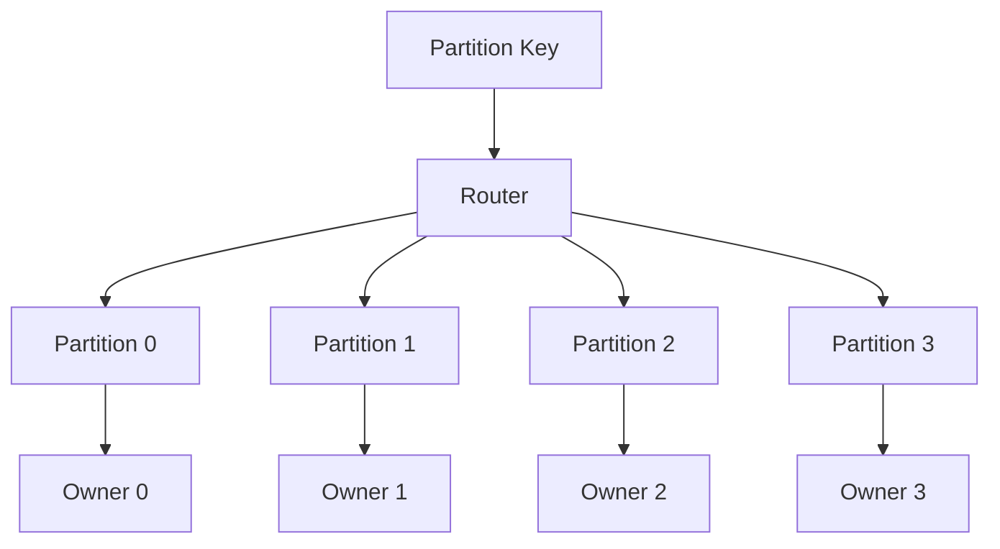
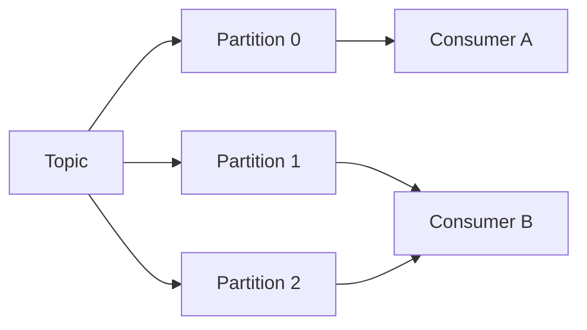
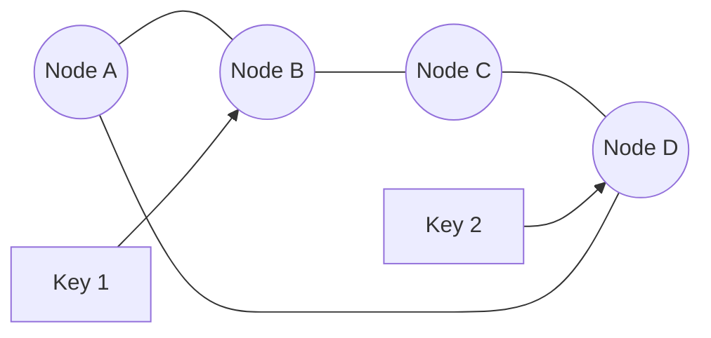
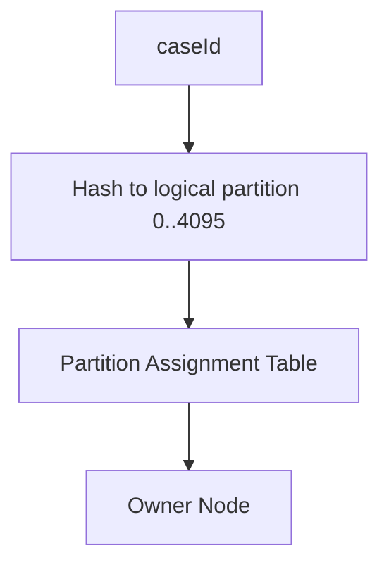
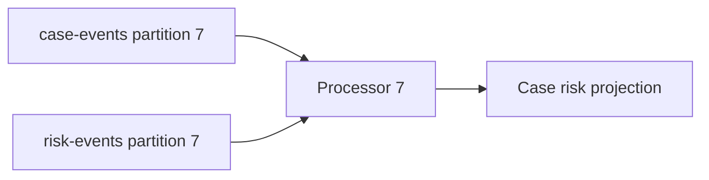
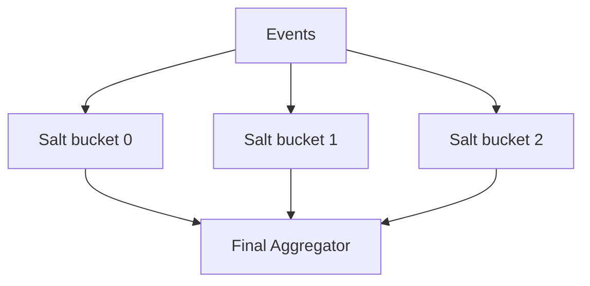
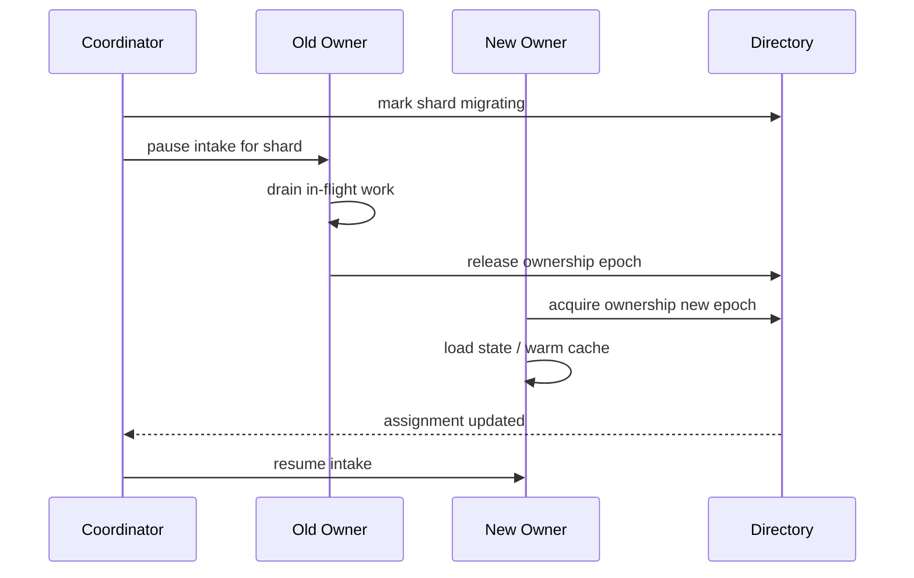
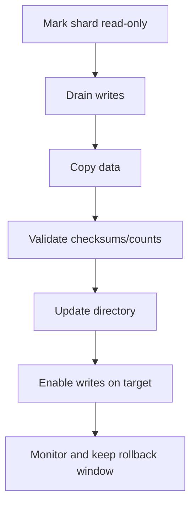
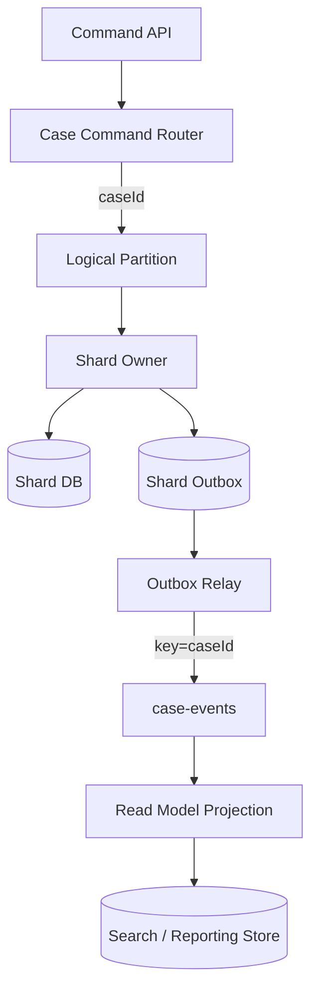

------
title: Learn Java Patterns - Part 022
description: Partitioning, affinity, and sharding patterns for Java systems: key selection, routing, ordered processing, shard ownership, hot partition mitigation, rebalancing, co-partitioning, consistency, observability, and production failure modes.
series: learn-java-patterns
seriesTitle: Learn Java Patterns, Data Patterns, Pipeline Patterns, Concurrency Patterns, Common Patterns, and Anti-Patterns
order: 22
partTitle: Partitioning, Affinity, and Sharding Patterns
tags:
- java
- patterns
- partitioning
- sharding
- affinity
- distributed-systems
- concurrency
- scalability
- advanced-java
date: 2026-06-27
---

# Part 022 — Partitioning, Affinity, and Sharding Patterns

> Goal: mampu membagi workload dan data ke beberapa owner tanpa merusak ordering, invariant, consistency, observability, dan operability.

Part 021 membahas single-writer:

```text
For one mutable state unit, use one writer.
```

Part ini menjawab pertanyaan berikutnya:

> Jika satu writer hanya aman untuk satu unit state, bagaimana sistem tetap scale untuk jutaan unit state?

Jawabannya adalah partitioning, affinity, dan sharding.

```text
Partitioning = membagi data/workload berdasarkan key.
Affinity     = memastikan key yang sama diproses oleh owner yang sama.
Sharding     = menempatkan partition ke node/resource berbeda.
```

Dalam sistem production, partitioning bukan hanya teknik performance. Ia adalah decision yang memengaruhi:

- correctness,
- ordering,
- transaction boundary,
- failure isolation,
- data locality,
- hot spot,
- operational recovery,
- tenant fairness,
- capacity planning,
- migration strategy.

---

## 1. Kaufman Skill Slice

Sub-skill yang harus dilatih:

1. Memilih partition key berdasarkan invariant, bukan hanya distribusi hash.
2. Membedakan partition, shard, replica, segment, bucket, dan owner.
3. Mendesain key-to-partition routing.
4. Menjaga ordering per key.
5. Menghindari hot partition dan skew.
6. Mendesain affinity executor untuk Java service.
7. Mendesain shard map dan shard registry.
8. Mendesain rebalancing tanpa double writer.
9. Mendesain co-partitioning untuk join lokal.
10. Mendesain tenant isolation dan noisy-neighbor control.
11. Mendesain observability per partition/shard.
12. Mengetahui kapan partitioning justru membuat sistem lebih buruk.

Learning target:

> Setelah part ini, Anda harus bisa melihat workload dan menjawab: partition key-nya apa, ordering dijamin per apa, owner-nya siapa, apa hot key-nya, bagaimana rebalancing dilakukan, apa yang terjadi saat owner mati, dan bagaimana membuktikan tidak ada dua writer untuk shard yang sama.

---

## 2. Mental Model: Split by Ownership, Not by Accident

Partitioning yang buruk biasanya dimulai dari pertanyaan salah:

```text
How do we distribute load evenly?
```

Pertanyaan itu penting, tetapi bukan yang pertama.

Pertanyaan pertama:

```text
What must stay together to preserve correctness?
```

Contoh case management:

- semua command untuk `caseId` yang sama harus ordered,
- semua quota update untuk `tenantId` yang sama harus serial,
- semua ledger entry untuk `accountId` tertentu harus konsisten,
- semua events dengan correlation tertentu mungkin perlu timeline yang mudah dibaca.

Jika correctness butuh `caseId`, partition by `caseId`.
Jika correctness butuh `tenantId`, partition by `tenantId`.
Jika query/report butuh region, mungkin data placement by `region`.

Mental model:



Core invariant:

```text
At any point in time, one partition has one active writer owner.
```

---

## 3. Vocabulary

| Term | Meaning |
|---|---|
| Key | Domain value used for routing, e.g. `caseId`, `tenantId`, `accountId` |
| Partition | Logical bucket calculated from key |
| Shard | Physical/logical placement of one or more partitions |
| Owner | Process/thread/node currently responsible for shard/partition |
| Affinity | Same key tends to go to same owner/resource |
| Replica | Copy for availability/read scaling |
| Rebalance | Moving ownership from one owner to another |
| Hot key | One key receives disproportionate load |
| Hot partition | One partition receives disproportionate load |
| Co-partitioning | Related streams/tables use compatible partitioning so same key lands together |
| Consistent hashing | Hashing strategy that reduces key movement when nodes change |
| Rendezvous hashing | Highest-random-weight hashing for stable node selection |

---

## 4. Forces: Mengapa Partitioning Sulit

Partitioning harus menyeimbangkan force yang sering bertentangan.

| Force | Ingin | Risiko |
|---|---|---|
| Correctness | Related data bersama | Load tidak rata |
| Throughput | Banyak partition | Rebalancing dan overhead naik |
| Ordering | Same key same partition | Hot key jadi bottleneck |
| Locality | Data dekat compute | Placement kompleks |
| Availability | Failover cepat | Double-writer risk |
| Fairness | Tenant tidak saling ganggu | Fragmentasi capacity |
| Operability | Shard mudah dipindah | Routing registry perlu kuat |
| Cost | Resource efisien | Noisy neighbor |

Rule:

> Partitioning is a correctness decision first and a performance decision second.

---

## 5. Pattern: Hash Partitioning

### 5.1 Problem

Kita perlu membagi key ke N bucket dengan distribusi relatif merata.

### 5.2 Solution

Gunakan hash key modulo jumlah partition.

```java
public final class HashPartitioner<K> {
    private final int partitionCount;

    public HashPartitioner(int partitionCount) {
        if (partitionCount <= 0) throw new IllegalArgumentException("partitionCount must be positive");
        this.partitionCount = partitionCount;
    }

    public int partition(K key) {
        return Math.floorMod(stableHash(key), partitionCount);
    }

    private int stableHash(K key) {
        return key.toString().hashCode();
    }
}
```

### 5.3 Important Caveat

`Object.hashCode()` tidak selalu ideal untuk distributed routing karena:

- implementasi bisa berubah,
- custom object hash bisa tidak stabil,
- berbeda bahasa/platform bisa berbeda,
- `String.hashCode()` stabil di Java tetapi bukan cross-language standard.

Untuk distributed systems, gunakan stable hash eksplisit seperti Murmur3/xxHash/SHA-256 truncated sesuai kebutuhan.

```java
public interface StableHasher<K> {
    long hash(K key);
}

public final class Sha256Hasher implements StableHasher<String> {
    @Override
    public long hash(String key) {
        try {
            var digest = MessageDigest.getInstance("SHA-256").digest(key.getBytes(StandardCharsets.UTF_8));
            return ByteBuffer.wrap(digest).getLong();
        } catch (NoSuchAlgorithmException e) {
            throw new IllegalStateException(e);
        }
    }
}
```

### 5.4 Kapan Cocok

Hash partitioning cocok ketika:

- key cardinality tinggi,
- load relatif merata,
- ordering hanya perlu per key,
- perubahan partition count jarang,
- routing sederhana lebih penting daripada movement minimal.

Kurang cocok ketika:

- key skew tinggi,
- partition count sering berubah,
- perlu locality berdasarkan region/tenant,
- perlu range scan.

---

## 6. Pattern: Range Partitioning

### 6.1 Problem

Kita perlu membagi data berdasarkan rentang nilai agar range query efisien.

Contoh:

```text
createdAt 2026-01 -> partition A
createdAt 2026-02 -> partition B
createdAt 2026-03 -> partition C
```

Atau:

```text
caseNumber 000000-199999 -> shard 1
caseNumber 200000-399999 -> shard 2
```

### 6.2 Solution

Gunakan range map.

```java
public record Range<T extends Comparable<T>>(T startInclusive, T endExclusive) {
    boolean contains(T value) {
        return value.compareTo(startInclusive) >= 0 && value.compareTo(endExclusive) < 0;
    }
}
```

```java
public final class RangePartitioner<T extends Comparable<T>> {
    private final List<Range<T>> ranges;

    public RangePartitioner(List<Range<T>> ranges) {
        this.ranges = List.copyOf(ranges);
    }

    public int partition(T value) {
        for (int i = 0; i < ranges.size(); i++) {
            if (ranges.get(i).contains(value)) return i;
        }
        throw new IllegalArgumentException("No range for " + value);
    }
}
```

### 6.3 Kapan Cocok

Cocok untuk:

- time-series archival,
- range scan,
- partition pruning,
- regulatory retention by period,
- data lifecycle management.

Risiko:

- write hotspot di range terbaru,
- manual split/merge,
- uneven distribution,
- tricky rebalancing.

Untuk write-heavy current data, range by time sering membuat partition terbaru panas.

---

## 7. Pattern: Directory-Based Sharding

### 7.1 Problem

Hash/range rule terlalu kaku. Kita butuh routing yang bisa dikontrol eksplisit.

### 7.2 Solution

Gunakan shard directory.

```text
key/tenant/partition -> shard owner/location
```

```java
public record ShardId(String value) {}
public record ShardLocation(ShardId shardId, URI endpoint, boolean writable) {}
```

```java
public interface ShardDirectory<K> {
    ShardLocation locate(K key);
}
```

Implementation:

```java
public final class TenantShardDirectory implements ShardDirectory<TenantId> {
    private final ConcurrentHashMap<TenantId, ShardLocation> locations = new ConcurrentHashMap<>();

    @Override
    public ShardLocation locate(TenantId tenantId) {
        var location = locations.get(tenantId);
        if (location == null) {
            throw new UnknownShardException(tenantId.value());
        }
        return location;
    }

    public void update(TenantId tenantId, ShardLocation location) {
        locations.put(tenantId, location);
    }
}
```

### 7.3 Kapan Cocok

Cocok untuk:

- tenant-based sharding,
- enterprise customer isolation,
- manual placement,
- regulatory/data residency placement,
- moving large tenants independently,
- mixed capacity shards.

Risiko:

- directory menjadi critical dependency,
- stale routing,
- split-brain writer,
- migration complexity,
- extra operational tooling.

---

## 8. Pattern: Affinity Executor

### 8.1 Problem

Dalam satu JVM, kita ingin semua task untuk key yang sama diproses serial, tetapi key berbeda bisa paralel.

### 8.2 Solution

Gunakan partitioned executors.

```java
public final class AffinityExecutor<K> implements AutoCloseable {
    private final List<ExecutorService> executors;
    private final StableHasher<K> hasher;

    public AffinityExecutor(int partitions, StableHasher<K> hasher, String name) {
        this.hasher = hasher;
        this.executors = IntStream.range(0, partitions)
            .mapToObj(i -> Executors.newSingleThreadExecutor(r ->
                Thread.ofVirtual().name(name + "-partition-" + i).unstarted(r)))
            .toList();
    }

    public <T> CompletableFuture<T> submit(K key, Callable<T> task) {
        var result = new CompletableFuture<T>();
        executorFor(key).execute(() -> {
            try {
                result.complete(task.call());
            } catch (Throwable t) {
                result.completeExceptionally(t);
            }
        });
        return result;
    }

    private ExecutorService executorFor(K key) {
        int index = Math.floorMod(hasher.hash(key), executors.size());
        return executors.get(index);
    }

    @Override
    public void close() {
        executors.forEach(ExecutorService::shutdown);
    }
}
```

### 8.3 Use Case

```java
public CompletionStage<CommandResult> handle(CaseCommand command) {
    return affinityExecutor.submit(command.caseId(), () -> {
        var state = repository.load(command.caseId());
        var events = state.handle(command);
        repository.save(state);
        outbox.insertAll(events);
        return CommandResult.accepted(events);
    });
}
```

Guarantee:

```text
Within one JVM instance, commands with same caseId are serialized.
```

Tidak menjamin:

- serialization lintas JVM,
- persistence consistency,
- exactly-once processing,
- stable routing saat partition count berubah.

Untuk multi-instance, perlu distributed ownership atau database/broker partitioning.

---

## 9. Pattern: Partitioned Consumer

Broker seperti Kafka mengajarkan model penting:

```text
A partition is an ordered log.
A partition is consumed by one consumer in a group at a time.
Ordering is guaranteed within a partition, not across partitions.
```

Java service yang consume event harus sadar:

- key menentukan partition,
- partition menentukan ordering,
- consumer group menentukan parallelism,
- rebalance memindahkan partition ownership,
- offset commit menentukan recovery behavior.



### Consumer Handler Rule

Jika event untuk `caseId` yang sama harus ordered, producer harus menggunakan key yang sama untuk semua event case itu.

```java
producer.send(new ProducerRecord<>(
    "case-events",
    caseId.value(),
    event
));
```

Jika key berubah antar event, ordering hilang.

---

## 10. Pattern: Shard Ownership

### 10.1 Problem

Dalam cluster, siapa yang boleh memproses shard tertentu?

### 10.2 Solution

Gunakan ownership lease/assignment.

```java
public record ShardAssignment(
    ShardId shardId,
    NodeId owner,
    long epoch,
    Instant leaseUntil
) {}
```

Important invariant:

```text
For a shard, at most one active writer with the highest valid epoch may mutate state.
```

### 10.3 Epoch / Fencing Token

Fencing token mencegah old owner menulis setelah ownership berpindah.

```java
public interface ShardLeaseStore {
    ShardAssignment acquire(ShardId shardId, NodeId nodeId, Duration ttl);
    boolean renew(ShardId shardId, NodeId nodeId, long epoch, Duration ttl);
}
```

Every write includes epoch:

```java
repository.save(shardId, epoch, state);
```

Database rejects stale epoch:

```sql
UPDATE case_state
SET status = ?, shard_epoch = ?
WHERE case_id = ?
  AND shard_epoch <= ?;
```

Better version uses separate ownership table and transaction constraint.

### 10.4 Why Lease Alone Is Not Enough

Lease timeout can be wrong under:

- GC pause,
- network partition,
- clock skew,
- scheduler stall,
- node overload.

Fencing token is stronger because storage/resource rejects stale writer.

---

## 11. Pattern: Consistent Hashing

### 11.1 Problem

Modulo hashing moves many keys when node count changes.

```text
partition = hash(key) % nodes
```

Jika nodes berubah dari 10 ke 11, banyak key pindah.

### 11.2 Solution

Consistent hashing maps keys and nodes onto a ring. Saat node ditambah/dihapus, hanya sebagian key yang pindah.



### 11.3 Virtual Nodes

Agar distribusi lebih rata, setiap physical node punya banyak virtual nodes.

```text
node-A#1, node-A#2, node-A#3, ...
```

### 11.4 Kapan Cocok

- cache cluster,
- distributed in-memory state,
- routing ke node dinamis,
- minimizing key movement.

Risiko:

- implementation complexity,
- operational debugging lebih sulit,
- uneven load tetap mungkin jika key skew,
- not enough for strict ownership tanpa lease/fencing.

---

## 12. Pattern: Rendezvous Hashing

Rendezvous hashing memilih node dengan score tertinggi untuk key tertentu.

```java
public final class RendezvousRouter<K, N> {
    private final List<N> nodes;
    private final BiFunction<K, N, Long> scoreFunction;

    public RendezvousRouter(List<N> nodes, BiFunction<K, N, Long> scoreFunction) {
        if (nodes.isEmpty()) throw new IllegalArgumentException("nodes must not be empty");
        this.nodes = List.copyOf(nodes);
        this.scoreFunction = scoreFunction;
    }

    public N route(K key) {
        return nodes.stream()
            .max(Comparator.comparingLong(node -> scoreFunction.apply(key, node)))
            .orElseThrow();
    }
}
```

Score can be hash of `key + nodeId`.

Pros:

- simple,
- stable under node changes,
- no ring data structure,
- good for client-side routing.

Cons:

- naive implementation checks all nodes,
- need weighted version for heterogeneous nodes,
- still not a complete ownership protocol.

---

## 13. Pattern: Fixed Logical Partitions, Movable Shards

A robust architecture often separates:

```text
logical partition count != physical node count
```

Example:

```text
4096 logical partitions.
10 service nodes.
Each node owns ~409 partitions.
```

When adding node:

```text
move some logical partitions to new node.
key -> partition stays stable.
partition -> owner changes.
```



Benefit:

- key mapping stable,
- rebalancing only changes assignment table,
- easier operational control,
- hot partitions can be moved.

Trade-off:

- assignment table needed,
- routing cache invalidation,
- ownership protocol,
- metric per partition required.

---

## 14. Pattern: Co-Partitioning

### 14.1 Problem

Dua stream/table perlu di-join atau diproses bersama by key.

Example:

```text
case-events keyed by caseId
case-risk-events keyed by caseId
```

Jika partitioning compatible, events untuk case yang sama bisa diproses local oleh owner yang sama.



### 14.2 Solution

Gunakan key dan partition count/assignment yang kompatibel.

### 14.3 Kapan Cocok

- stream joins,
- local aggregation,
- projection per aggregate,
- avoiding cross-node calls,
- low-latency materialized views.

Risiko:

- semua stream harus maintain partition compatibility,
- repartitioning mahal,
- key design menjadi locked-in,
- hot key memengaruhi banyak stream.

---

## 15. Pattern: Tenant Sharding

### 15.1 Problem

Multi-tenant system perlu isolate data/load per tenant.

### 15.2 Options

| Model | Description | Cocok untuk |
|---|---|---|
| Shared everything | Semua tenant di DB/schema sama | Small tenants, low cost |
| Shared DB, tenant partition | Tenant ID jadi partition key | SaaS umum |
| Dedicated schema | Tenant besar punya schema sendiri | Medium enterprise |
| Dedicated database | Tenant besar isolated penuh | Regulated/large tenant |
| Dedicated cluster | Tenant sangat besar/sensitif | High isolation |

### 15.3 Tenant Directory

```java
public record TenantPlacement(
    TenantId tenantId,
    ShardId shardId,
    Region region,
    IsolationLevel isolationLevel
) {}
```

Routing:

```java
public final class TenantRouter {
    private final TenantDirectory directory;
    private final Map<ShardId, DataSource> dataSources;

    public DataSource dataSourceFor(TenantId tenantId) {
        var placement = directory.placementOf(tenantId);
        return Optional.ofNullable(dataSources.get(placement.shardId()))
            .orElseThrow(() -> new ShardUnavailableException(placement.shardId()));
    }
}
```

### 15.4 Tenant Sharding Failure Modes

- tenant moves but cache stale,
- cross-tenant query accidentally scans all shards,
- noisy tenant overloads shared shard,
- small tenants fragmented inefficiently,
- data residency rule violated by wrong placement,
- reporting requires fan-out query across shards.

---

## 16. Pattern: Hot Key Mitigation

### 16.1 Problem

One key dominates traffic.

Example:

```text
tenantId = large-bank receives 40% of all traffic.
caseId = viral case receives thousands of updates.
accountId = settlement account receives all postings.
```

Hashing cannot fix one hot key. Same key must map to one partition if ordering/invariant requires it.

### 16.2 Strategy 1: Split by Sub-Key

Instead of partition by `tenantId`, partition by `tenantId + caseId` if correctness allows.

```text
Bad for large tenants:
key = tenantId

Better if case independence exists:
key = tenantId + caseId
```

### 16.3 Strategy 2: Separate Hot Tenant

Move tenant to dedicated shard.

```text
small tenants -> shared shards
large tenant -> dedicated shard/cluster
```

### 16.4 Strategy 3: Command Type Split

If some operations are independent, split lanes.

```text
case mutation lane      -> ordered by caseId
case read projection    -> scalable read model
case analytics events   -> separate pipeline
```

### 16.5 Strategy 4: Key Salting

Salting spreads one logical key into multiple physical keys.

```text
tenantId + salt(0..N)
```

Caution: salting breaks strict per-key ordering unless operation is commutative or later aggregation handles it.

Good for:

- counters,
- metrics,
- approximate aggregation,
- independent events.

Bad for:

- state transitions,
- ledger ordering,
- case lifecycle mutation.

### 16.6 Strategy 5: Two-Level Aggregation



Useful for high-volume counts, not strict workflows.

---

## 17. Pattern: Rebalancing

### 17.1 Problem

Workload changes. Nodes are added/removed. Shards must move.

### 17.2 Rebalance Phases



### 17.3 Rebalance Invariants

- no two active writers for same shard,
- old owner stops accepting new work before release,
- in-flight work either completes or is retried idempotently,
- new owner uses higher epoch/fencing token,
- routing clients refresh assignment,
- metrics show migration state.

### 17.4 Stop-the-World vs Incremental

| Approach | Pros | Cons |
|---|---|---|
| Stop-the-world rebalance | Simpler correctness | Availability dip |
| Incremental rebalance | Smoother | More states/failures |
| Lazy move on access | Simple for cache | First access latency |
| Dual-write migration | Zero downtime possible | High correctness risk |

Avoid dual-write unless absolutely necessary and heavily tested.

---

## 18. Pattern: Read/Write Split by Shard

Writes often need strong ownership. Reads can be more flexible.

```text
writes -> primary shard owner
reads  -> replica/read model/cache
```

But read-your-writes semantics matter.

Options:

1. Read from primary after write.
2. Return write result directly.
3. Use version token and wait until projection catches up.
4. Accept eventual consistency in UI.
5. Use session consistency per user.

Example response:

```java
public record CommandAccepted(
    CaseId caseId,
    long newVersion,
    URI readAfterWriteUri
) {}
```

Client can request:

```text
GET /cases/{id}?minVersion=42
```

Server waits until projection version >= 42 or returns `202 Accepted`.

---

## 19. Pattern: Shard-Aware Repository

Repository should not hide expensive cross-shard behavior.

Bad:

```java
List<Case> findAllOpenCases(); // across all shards silently
```

Better:

```java
List<Case> findOpenCases(TenantId tenantId, PageRequest page);
ShardQueryPlan planOpenCasesAcrossShards(OpenCaseFilter filter);
```

Shard-aware repository exposes:

- routing key required,
- fan-out query explicit,
- pagination limitations,
- partial failure handling,
- timeout per shard,
- result merge policy.

```java
public interface ShardAwareCaseRepository {
    Optional<CaseRecord> findById(TenantId tenantId, CaseId caseId);
    Page<CaseRecord> findByTenant(TenantId tenantId, CaseFilter filter, PageRequest pageRequest);
    FanOutResult<CaseRecord> searchAcrossShards(CaseSearchQuery query, FanOutPolicy policy);
}
```

---

## 20. Pattern: Fan-Out Query

### 20.1 Problem

Query cannot be routed to one shard.

Example:

```text
Find all high-risk open cases across all tenants.
```

### 20.2 Solution

Make fan-out explicit and bounded.

```java
public record FanOutPolicy(
    Duration totalTimeout,
    Duration perShardTimeout,
    int maxShards,
    PartialResultPolicy partialResultPolicy
) {}
```

```java
public enum PartialResultPolicy {
    FAIL_WHOLE_QUERY,
    RETURN_PARTIAL_WITH_WARNING
}
```

Use structured concurrency:

```java
public FanOutResult<CaseSummary> searchAcrossShards(CaseSearchQuery query, FanOutPolicy policy)
        throws InterruptedException {
    try (var scope = new StructuredTaskScope.ShutdownOnFailure()) {
        List<Subtask<List<CaseSummary>>> tasks = shardClients.stream()
            .limit(policy.maxShards())
            .map(client -> scope.fork(() -> client.search(query, policy.perShardTimeout())))
            .toList();

        scope.joinUntil(Instant.now().plus(policy.totalTimeout()));
        scope.throwIfFailed();

        var results = tasks.stream()
            .flatMap(task -> task.get().stream())
            .toList();

        return FanOutResult.complete(results);
    } catch (TimeoutException e) {
        throw new QueryTimeoutException(query, e);
    }
}
```

Fan-out query should have:

- strict timeout,
- max shard count,
- result limit,
- partial failure policy,
- observability per shard.

---

## 21. Pattern: Partitioned Locking

Sometimes state is still in shared memory, but lock granularity can be partitioned.

```java
public final class StripedLock<K> {
    private final ReentrantLock[] locks;

    public StripedLock(int stripes) {
        this.locks = IntStream.range(0, stripes)
            .mapToObj(i -> new ReentrantLock())
            .toArray(ReentrantLock[]::new);
    }

    public Lock lockFor(K key) {
        return locks[Math.floorMod(key.hashCode(), locks.length)];
    }
}
```

Usage:

```java
var lock = stripedLock.lockFor(caseId);
lock.lock();
try {
    mutateCase(caseId);
} finally {
    lock.unlock();
}
```

This is not as clean as actor/single-writer, but useful for incremental refactoring.

Risks:

- two keys in same stripe block each other,
- multi-key operations can deadlock,
- lock ownership is less visible than queue ownership.

---

## 22. Pattern: Multi-Key Operation

Partitioning becomes hard when one command touches multiple keys.

Example:

```text
Transfer case from investigator A to investigator B.
Move quota from team X to team Y.
Merge duplicate cases case-1 and case-2.
```

Options:

### Option 1: Choose One Aggregate Owner

One key owns the operation and emits event for others.

```text
Case owns assignment.
Investigator workload projection updates eventually.
```

### Option 2: Deterministic Lock Ordering

If strong consistency required in one process:

```java
List<CaseId> ordered = Stream.of(caseA, caseB)
    .sorted(Comparator.comparing(CaseId::value))
    .toList();
```

Acquire locks/owners in deterministic order.

### Option 3: Saga / Process Manager

For distributed multi-shard work:

```text
step 1: reserve source
step 2: reserve target
step 3: commit both
compensate if failure
```

### Option 4: Redesign Invariant

Often best answer:

```text
Do we really need synchronous invariant across these keys?
Can one side be a projection?
Can we accept eventual consistency with reconciliation?
```

---

## 23. Pattern: Locality-Aware Routing

Routing can optimize locality:

- route user to same region as tenant data,
- route compute to shard with cached state,
- route workflow timer to owner node,
- route read to nearest replica.

But locality must not violate correctness.

Bad:

```text
Route to nearest node even if it is not shard owner.
```

Better:

```text
Route to nearest eligible owner or read replica, depending on operation semantics.
```

Operation classification:

| Operation | Routing requirement |
|---|---|
| Command mutation | Primary owner |
| Strong read | Primary or synchronized replica |
| Eventual read | Read replica/projection |
| Analytics query | Data lake/search index |
| Timer firing | Current shard owner |

---

## 24. Pattern: Shard Health and Circuit Breaker

Shard can be unhealthy independently.

Track:

- latency per shard,
- error rate per shard,
- queue depth per shard,
- ownership changes,
- rebalance state,
- stale assignment count,
- hot key count.

Circuit breaker can be shard-specific:

```java
public final class ShardClient {
    private final CircuitBreaker breaker;
    private final HttpClient client;

    public CompletionStage<Response> send(Command command) {
        if (!breaker.allowRequest()) {
            return CompletableFuture.failedFuture(new ShardUnavailableException(command.shardId()));
        }
        return client.sendAsync(toRequest(command), BodyHandlers.ofString())
            .whenComplete((response, error) -> {
                if (error != null || response.statusCode() >= 500) breaker.recordFailure();
                else breaker.recordSuccess();
            });
    }
}
```

Important:

- shard breaker should not open entire service unnecessarily,
- routing should avoid unhealthy read replicas,
- write owner failure requires ownership protocol, not only retry.

---

## 25. Pattern: Partition-Aware Idempotency

Idempotency key should align with partition key when possible.

```java
public record IdempotencyKey(
    TenantId tenantId,
    String clientRequestId
) {}
```

Store idempotency record in same shard as operation.

```text
same transaction:
- check idempotency key
- mutate state
- store response/event
```

If idempotency store is global while data is sharded, you introduce cross-shard dependency.

Better:

```text
route request by tenantId/caseId -> same shard checks idempotency
```

---

## 26. Pattern: Partition-Aware Outbox

Outbox should be shard-aware.

Options:

1. Outbox table per shard database.
2. Outbox partitioned by aggregate key.
3. Event topic key matches aggregate key.
4. Relay preserves ordering per aggregate.

```java
public record OutboxEvent(
    UUID eventId,
    String aggregateType,
    String aggregateId,
    String partitionKey,
    long aggregateVersion,
    String payload
) {}
```

Relay publishes with key:

```java
producer.send(new ProducerRecord<>(
    "case-events",
    event.partitionKey(),
    event.payload()
));
```

Rule:

> If consumers rely on per-aggregate ordering, outbox relay must publish with the same partition key consistently.

---

## 27. Pattern: Shard Migration

Shard migration is one of the most dangerous operations.

### 27.1 Migration Types

| Type | Description | Risk |
|---|---|---|
| Cold migration | Stop writes, copy, switch | Downtime |
| Live migration | Copy while serving | Dual-write/stale read risk |
| Logical migration | Move key assignment gradually | Requires directory and compatibility |
| Tenant extraction | Move tenant to dedicated shard | Cross-shard references |
| Split shard | Divide overloaded shard | Key rewrite/reassignment |
| Merge shard | Combine underutilized shards | Large copy/reindex |

### 27.2 Safe Cold Migration



### 27.3 Migration Checklist

- source of truth defined,
- writes paused or dual-write proven,
- idempotency records migrated,
- outbox/inbox migrated,
- offsets migrated,
- sequence/version preserved,
- directory update atomic,
- old route rejects writes after cutover,
- reconciliation report generated,
- rollback plan exists.

---

## 28. Pattern: Partition Observability

Global averages hide partition issues.

Bad dashboard:

```text
average latency = 80ms
```

Better:

```text
p95 latency by shard
queue depth by partition
top 20 hot keys
rebalance duration by shard
rejected commands by partition
oldest outbox event by shard
```

Minimum metrics:

```java
public record PartitionMetrics(
    int partitionId,
    long inputRatePerSecond,
    long outputRatePerSecond,
    int queueDepth,
    Duration oldestQueuedAge,
    Duration p95ProcessingLatency,
    long rejectedCount,
    Optional<String> hottestKey
) {}
```

Logs must include:

- partition id,
- shard id,
- owner node,
- key,
- assignment epoch,
- correlation id.

```java
logger.info(
    "case command processed partition={} shard={} owner={} epoch={} caseId={} commandId={}",
    partitionId,
    shardId,
    ownerNode,
    epoch,
    caseId,
    commandId
);
```

---

## 29. Pattern: Capacity Model

Partitioning needs capacity math.

Basic variables:

```text
R = total requests per second
P = partition count
N = nodes
C = capacity per node
H = hot-key multiplier
```

Average load per partition:

```text
R / P
```

Average load per node:

```text
R / N
```

But production bottleneck follows max load, not average.

```text
max(partition_load) matters more than average(partition_load)
```

Ask:

- top 1 key contributes how much traffic?
- top 10 tenants contribute how much?
- does one partition have 10x more load?
- what is queue depth per partition?
- what is shard p99 latency?
- can partition split without breaking ordering?

---

## 30. Pattern Selection Matrix

| Requirement | Recommended pattern |
|---|---|
| Ordered processing per entity | Hash partition by entity id |
| Range query by time | Range partition + current hot range mitigation |
| Tenant isolation | Tenant directory sharding |
| Dynamic cluster membership | Consistent/rendezvous hashing + ownership protocol |
| Stable key mapping with flexible placement | Fixed logical partitions + assignment table |
| Stream join by key | Co-partitioning |
| Hot tenant | Dedicated shard or split by lower-level key |
| Hot counter | Salted keys + aggregation |
| Multi-key transaction | Redesign aggregate, deterministic locking, or saga |
| Cross-shard search | Explicit fan-out or separate search index |
| Per-key in-JVM serialization | Affinity executor |

---

## 31. Anti-Patterns

### 31.1 Partition by Random UUID for Everything

Random UUID distributes well but may destroy locality.

Problem:

- case and related records scatter,
- queries need fan-out,
- transaction boundary unclear.

Fix:

- choose key based on access/invariant,
- separate write partition key from analytics storage if needed.

### 31.2 Partition by Tenant Without Checking Tenant Skew

Looks logical, but one tenant may dominate.

Fix:

- measure tenant distribution,
- use tenant tiering,
- dedicated shard for large tenant,
- split large tenant by sub-key if correctness allows.

### 31.3 Changing Partition Count Casually

Modulo hashing with changed partition count moves many keys.

Fix:

- fixed logical partitions,
- consistent hashing,
- planned migration,
- assignment table.

### 31.4 Hidden Cross-Shard Query

Repository hides fan-out query.

Fix:

- explicit API name,
- timeout,
- partial result policy,
- separate search/read model.

### 31.5 Double Writer During Rebalance

Old and new owner process same shard.

Fix:

- lease + epoch,
- fencing token at storage,
- pause/drain/acquire protocol,
- idempotent replay.

### 31.6 Hot Partition Denial

Team says “hashing should distribute it”, but hot key dominates.

Fix:

- top-key dashboard,
- model skew,
- split key if possible,
- dedicated capacity,
- redesign invariant if necessary.

### 31.7 Cross-Shard Transaction by Accident

One request touches multiple shards synchronously and assumes rollback everywhere.

Fix:

- saga/process manager,
- local transaction + outbox,
- compensation,
- avoid distributed transaction unless justified.

---

## 32. Testing Patterns

### 32.1 Routing Stability Test

```java
@Test
void sameKeyAlwaysMapsToSamePartition() {
    var partitioner = new HashPartitioner<String>(64);

    int first = partitioner.partition("case-123");

    for (int i = 0; i < 10_000; i++) {
        assertThat(partitioner.partition("case-123")).isEqualTo(first);
    }
}
```

### 32.2 Distribution Test

```java
@Test
void keysAreReasonablyDistributed() {
    var partitioner = new HashPartitioner<String>(128);
    var counts = new int[128];

    for (int i = 0; i < 1_000_000; i++) {
        counts[partitioner.partition("case-" + i)]++;
    }

    int max = Arrays.stream(counts).max().orElseThrow();
    int min = Arrays.stream(counts).min().orElseThrow();

    assertThat(max / (double) min).isLessThan(1.25);
}
```

This is not a proof, but catches obviously bad hash/routing functions.

### 32.3 Same-Key Serialization Test

```java
@Test
void sameKeyTasksDoNotOverlap() throws Exception {
    var executor = new AffinityExecutor<CaseId>(16, CaseId::stableHash, "test");
    var active = new AtomicInteger();
    var maxActive = new AtomicInteger();

    List<CompletableFuture<Void>> futures = IntStream.range(0, 1000)
        .mapToObj(i -> executor.submit(caseId, () -> {
            int current = active.incrementAndGet();
            maxActive.updateAndGet(prev -> Math.max(prev, current));
            Thread.sleep(1);
            active.decrementAndGet();
            return null;
        }))
        .map(f -> f.thenApply(ignored -> null))
        .toList();

    CompletableFuture.allOf(futures.toArray(CompletableFuture[]::new)).join();

    assertThat(maxActive.get()).isEqualTo(1);
}
```

### 32.4 Rebalance Fencing Test

Test that old owner cannot write after new owner acquired higher epoch.

```java
@Test
void staleOwnerCannotWriteAfterRebalance() {
    var shard = new ShardId("shard-1");
    var oldEpoch = leaseStore.acquire(shard, nodeA, ttl).epoch();
    var newEpoch = leaseStore.forceMove(shard, nodeB, ttl).epoch();

    assertThatThrownBy(() -> repository.saveWithEpoch(shard, oldEpoch, state))
        .isInstanceOf(StaleShardOwnerException.class);

    assertThatCode(() -> repository.saveWithEpoch(shard, newEpoch, state))
        .doesNotThrowAnyException();
}
```

### 32.5 Hot Key Simulation

```java
@Test
void detectsHotKeySkew() {
    var events = new ArrayList<String>();
    for (int i = 0; i < 500_000; i++) events.add("tenant-large");
    for (int i = 0; i < 500_000; i++) events.add("tenant-" + i);

    var top = HotKeyDetector.topKeys(events.stream(), 10);

    assertThat(top.getFirst().key()).isEqualTo("tenant-large");
    assertThat(top.getFirst().percentage()).isGreaterThan(40.0);
}
```

---

## 33. Production Checklist

### Key Design

- Apa partition key utama?
- Apakah key dipilih karena invariant atau hanya distribusi?
- Apakah key cardinality cukup tinggi?
- Apakah ada hot key?
- Apakah key stabil sepanjang lifecycle object?

### Ordering

- Ordering dijamin per apa?
- Apakah producer/route selalu memakai key yang sama?
- Apakah retry/timer masuk partition yang sama?
- Apakah cross-partition ordering diasumsikan secara tidak sengaja?

### Ownership

- Siapa owner setiap partition/shard?
- Bagaimana owner dipilih?
- Bagaimana mencegah double writer?
- Apakah ada fencing token?
- Apa yang terjadi saat owner pause/GC/network partition?

### Rebalancing

- Apakah partition count logical stabil?
- Bagaimana shard dipindah?
- Bagaimana in-flight work ditangani?
- Apakah routing cache bisa stale?
- Apakah migration punya reconciliation report?

### Hotspot

- Dashboard top key ada?
- Dashboard partition p95/p99 ada?
- Apakah tenant besar bisa dipindah?
- Apakah salting aman untuk operation ini?

### Data

- Apakah idempotency record berada di shard yang sama?
- Apakah outbox partition key benar?
- Apakah read model tahu versi/write lag?
- Apakah cross-shard query explicit?

### Operations

- Bisa disable satu shard?
- Bisa drain partition?
- Bisa replay partition?
- Bisa inspect timeline per key?
- Bisa explain route key -> partition -> shard -> node?

---

## 34. Case Study: Regulatory Case Platform

Bayangkan platform enforcement lifecycle:

- tenant = regulator/agency,
- case = enforcement case,
- evidence = uploaded document/event,
- workflow = case state machine,
- SLA = escalation policy,
- audit = immutable event log.

### Candidate Partition Keys

| Data/Workload | Candidate key | Reason |
|---|---|---|
| Case command | `caseId` | Lifecycle invariant per case |
| Tenant quota | `tenantId` | Quota invariant per tenant |
| Evidence processing | `evidenceId` or `caseId` | Depends whether evidence independent |
| Case event topic | `caseId` | Preserve case event ordering |
| SLA scan | `tenantId + dueDate bucket` | Operational scan locality |
| Reporting | separate projection | Avoid cross-shard transactional query |

### Design



### Correctness Rules

1. Case lifecycle mutation is partitioned by `caseId`.
2. Case events are published with `caseId` as key.
3. Idempotency key is stored in the same shard as case command.
4. Tenant quota is separate aggregate, not silently updated in same case transaction unless same shard guarantee exists.
5. Reporting is eventually consistent via projection.
6. SLA escalation emits command to case partition, not direct state mutation.

---

## 35. Summary

Partitioning, affinity, dan sharding adalah cara memperluas single-writer tanpa kembali ke shared mutable chaos.

Core idea:

```text
Choose a key that preserves correctness.
Route same key to same owner.
Keep ownership exclusive.
Make rebalancing explicit.
Measure skew, not only average throughput.
```

Yang harus diingat:

- Partitioning adalah keputusan correctness sebelum performance.
- Key yang salah menciptakan fan-out, hot spot, atau broken ordering.
- Same key harus routed konsisten untuk ordering.
- Hot key tidak bisa diselesaikan hanya dengan hash.
- Rebalancing membutuhkan ownership protocol dan fencing.
- Cross-shard query harus explicit dan bounded.
- Idempotency/outbox/projection harus shard-aware.

Part berikutnya masuk ke **Cache Patterns**: cache-aside, read-through, write-through, write-behind, invalidation, TTL, stampede control, negative caching, consistency, dan cache failure modes.

---

## References

- Apache Kafka Documentation: `https://kafka.apache.org/documentation/`
- Confluent — Kafka Partition Key: `https://www.confluent.io/learn/kafka-partition-key/`
- Martin Thompson — Single Writer Principle: `https://mechanical-sympathy.blogspot.com/2011/09/single-writer-principle.html`
- Oracle Java Documentation — Structured Concurrency: `https://docs.oracle.com/en/java/javase/25/core/structured-concurrency.html`
- Enterprise Integration Patterns — Message Routing and Aggregation: `https://www.enterpriseintegrationpatterns.com/`
