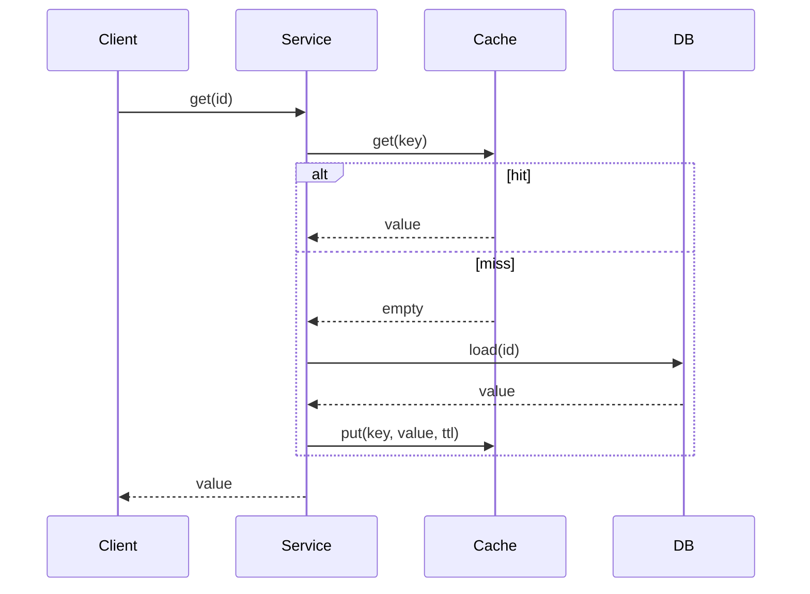
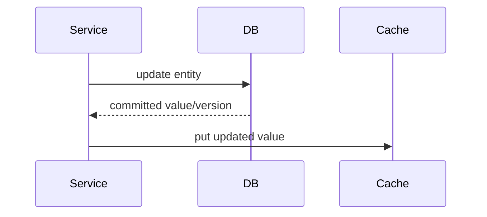
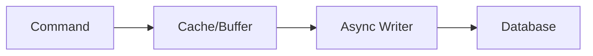
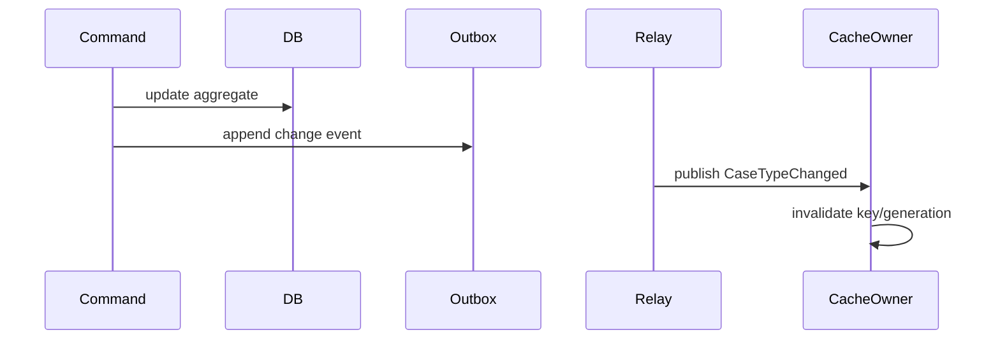
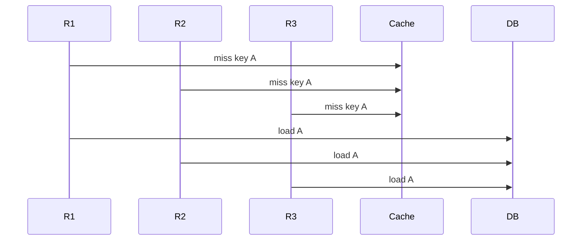
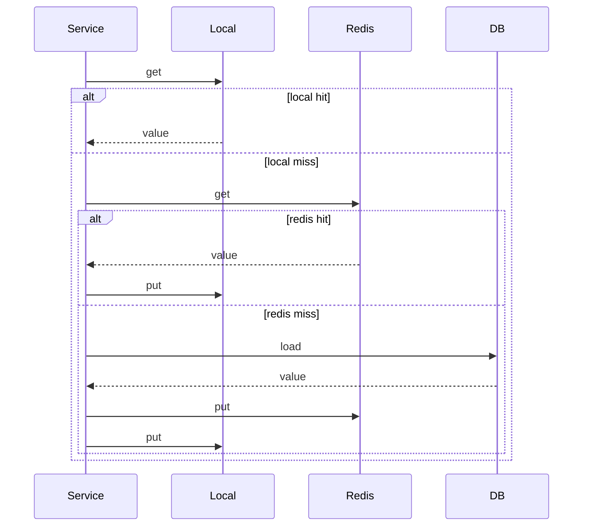
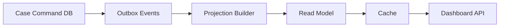

------
title: Learn Java Patterns - Part 023
description: Cache patterns for advanced Java systems: cache-aside, read-through, write-through, write-behind, refresh-ahead, negative cache, multi-level cache, invalidation, stampede control, consistency budget, observability, testing, and production failure modes.
series: learn-java-patterns
seriesTitle: Learn Java Patterns, Data Patterns, Pipeline Patterns, Concurrency Patterns, Common Patterns, and Anti-Patterns
order: 23
partTitle: Cache Patterns
tags:
- java
- patterns
- cache
- performance
- consistency
- distributed-systems
- resilience
- advanced-java
date: 2026-06-27
---

# Part 023 — Cache Patterns

> Goal: mampu menggunakan cache untuk mengurangi latency dan load tanpa merusak correctness, security, auditability, consistency, dan operability.

Cache sering terlihat sederhana:

```java
var value = cache.get(key);
if (value == null) {
    value = database.load(key);
    cache.put(key, value);
}
return value;
```

Di production, kode seperti ini bisa menjadi sumber:

- stale authorization,
- data leak antar tenant,
- cache stampede,
- inconsistent read,
- memory pressure,
- hidden dependency outage,
- invalidation race,
- duplicate expensive computation,
- phantom behavior yang sulit direproduksi.

Mental model utama:

```text
Cache is not a faster database.
Cache is a bounded, partial, derived, possibly stale copy of truth.
```

Jika definisi ini tidak diterima sejak awal, cache akan dipakai sebagai jalan pintas. Jika diterima, cache menjadi pattern engineering yang bisa dirancang, diuji, diobservasi, dan dihapus dengan aman.

---

## 1. Kaufman Skill Slice

Sub-skill yang harus dilatih:

1. Membedakan source of truth, cache, replica, materialized view, dan memoization.
2. Menentukan cache key yang aman, stabil, tenant-aware, dan version-aware.
3. Menentukan consistency budget: berapa lama stale data masih boleh diterima.
4. Memilih caching pattern: cache-aside, read-through, write-through, write-behind, refresh-ahead, negative cache.
5. Mendesain invalidation: TTL, event-based, versioned key, generational namespace.
6. Mengendalikan stampede: single-flight, request coalescing, stale-while-revalidate, jittered TTL.
7. Mengendalikan memory: size limit, weight limit, eviction, admission.
8. Membedakan local cache, distributed cache, near cache, dan two-level cache.
9. Menghindari caching data yang tidak boleh stale.
10. Mengobservasi cache dengan hit rate, miss rate, load latency, eviction, stale read, dan error rate.
11. Menguji cache behavior, bukan hanya happy path.
12. Mengetahui kapan cache harus dihapus.

Learning target:

> Setelah part ini, Anda harus bisa melihat endpoint/service dan menjawab: apa source of truth-nya, cache key-nya apa, data boleh stale berapa lama, invalidation-nya bagaimana, apa yang terjadi saat cache down, bagaimana stampede dicegah, apa metric-nya, dan bagaimana membuktikan tidak ada tenant/data leak.

---

## 2. Problem yang Diselesaikan Cache

Cache dipakai untuk mengurangi biaya read atau compute.

Biaya dapat berupa:

- latency database,
- CPU expensive transformation,
- remote API call,
- authorization policy lookup,
- schema/metadata lookup,
- configuration lookup,
- reference data lookup,
- repeated aggregation,
- serialization/deserialization,
- expensive rendering.

Tetapi cache selalu menukar sesuatu:

```text
Lower latency / lower load
        exchanged for
More state / more invalidation / more inconsistency risk
```

Pattern cache yang sehat selalu eksplisit tentang trade-off tersebut.

---

## 3. Cache Decision Model

Sebelum memilih library atau anotasi, jawab empat pertanyaan.

### 3.1 Apa source of truth?

Source of truth adalah tempat yang memiliki kewenangan akhir.

Contoh:

| Data | Source of truth | Cache candidate? |
|---|---|---:|
| User display name | user database | yes |
| Permission effective decision | policy engine + subject state | careful |
| Account balance | ledger | usually no for command path |
| Product reference data | catalog service/db | yes |
| Case workflow state | case database/event log | careful |
| Regulatory deadline | workflow state + calendar rules | careful |

Rule:

```text
If no one can name the source of truth, do not add a cache.
```

### 3.2 Apa key-nya?

Cache key adalah identity dari hasil, bukan hanya parameter method.

Cache key harus mencakup semua input yang memengaruhi output.

Contoh buruk:

```java
String key = "case:" + caseId;
```

Jika output sebenarnya tergantung tenant, actor, permission, locale, date, atau feature flag, key tersebut salah.

Contoh lebih aman:

```java
record CaseViewCacheKey(
        String tenantId,
        UUID caseId,
        String actorRole,
        Locale locale,
        int schemaVersion,
        String policyVersion
) {}
```

Cache key yang tidak lengkap menghasilkan bug paling berbahaya: data benar untuk satu konteks, salah untuk konteks lain.

### 3.3 Berapa stale budget?

Stale budget adalah toleransi bisnis terhadap data lama.

Contoh:

| Data | Stale budget |
|---|---:|
| Country list | days/weeks |
| Product category | minutes/hours |
| User display name | minutes |
| Authorization decision | seconds or none |
| Fraud risk score | depends on command/read path |
| Regulatory case status | often near-zero for command path |
| Dashboard aggregate | minutes acceptable |

Rule:

```text
TTL is not a technical value.
TTL is a business correctness value expressed as time.
```

### 3.4 Apa behavior saat cache gagal?

Cache failure strategy harus jelas:

- fail-open: bypass cache dan load source,
- fail-closed: reject request,
- serve stale: pakai stale value,
- degrade: return partial response,
- protect source: reject jika source sedang overloaded.

Pattern yang dipilih tergantung data.

Untuk display metadata, fail-open mungkin cukup. Untuk authorization, fail-open bisa menjadi security incident.

---

## 4. Cache Taxonomy

```mermaid
flowchart TD
    A[Cache Patterns] --> B[Read Patterns]
    A --> C[Write Patterns]
    A --> D[Invalidation Patterns]
    A --> E[Stampede Control]
    A --> F[Topology]

    B --> B1[Cache-Aside]
    B --> B2[Read-Through]
    B --> B3[Refresh-Ahead]
    B --> B4[Negative Cache]

    C --> C1[Write-Through]
    C --> C2[Write-Behind]
    C --> C3[Write-Around]

    D --> D1[TTL]
    D --> D2[Event Invalidation]
    D --> D3[Versioned Key]
    D --> D4[Generational Namespace]

    E --> E1[Single-Flight]
    E --> E2[Soft TTL]
    E --> E3[Jittered TTL]
    E --> E4[Stale-While-Revalidate]

    F --> F1[Local Cache]
    F --> F2[Distributed Cache]
    F --> F3[Two-Level Cache]
    F --> F4[Near Cache]
```



---

## 5. Cache-Aside Pattern

### 5.1 Intent

Application code mengontrol read dari cache dan fallback ke source of truth.



### 5.2 Java Example

```java
public final class CaseTypeLookup {
    private final Cache<String, CaseType> cache;
    private final CaseTypeRepository repository;

    public CaseTypeLookup(Cache<String, CaseType> cache, CaseTypeRepository repository) {
        this.cache = Objects.requireNonNull(cache);
        this.repository = Objects.requireNonNull(repository);
    }

    public CaseType get(String tenantId, String code) {
        var key = tenantId + ":case-type:" + code;
        var cached = cache.getIfPresent(key);
        if (cached != null) {
            return cached;
        }

        var loaded = repository.findByTenantAndCode(tenantId, code)
                .orElseThrow(() -> new NoSuchElementException("Unknown case type: " + code));

        cache.put(key, loaded);
        return loaded;
    }
}
```

### 5.3 Kapan Cocok

Gunakan cache-aside ketika:

- read jauh lebih sering daripada write,
- data boleh stale sesuai TTL,
- application perlu kontrol failure behavior,
- source of truth dapat diload ulang secara aman,
- invalidation tidak harus strongly consistent.

### 5.4 Failure Modes

| Failure | Penyebab | Mitigasi |
|---|---|---|
| Stampede | banyak request miss key yang sama | single-flight, lock per key |
| Stale read | update source tidak invalidate cache | TTL pendek, event invalidation, version key |
| Tenant leak | key tidak mencakup tenant/security context | typed key, cache key review |
| Memory leak | unbounded cache | maximum size/weight |
| Mutable cached object | object dimutasi setelah dicache | immutable DTO/value object |

### 5.5 Review Checklist

- Apakah key mencakup semua input output?
- Apakah TTL didasarkan pada stale budget?
- Apakah cache miss path aman saat traffic tinggi?
- Apakah object cached immutable?
- Apakah cache bisa dimatikan tanpa merusak correctness?
- Apakah hit/miss/load latency dimonitor?

---

## 6. Read-Through / Loading Cache Pattern

### 6.1 Intent

Cache bertanggung jawab memanggil loader saat miss.

Dengan Caffeine, `LoadingCache` dan `AsyncLoadingCache` sering menjadi bentuk read-through di Java process.

```java
LoadingCache<CaseTypeKey, CaseType> cache = Caffeine.newBuilder()
        .maximumSize(50_000)
        .expireAfterWrite(Duration.ofMinutes(10))
        .recordStats()
        .build(key -> repository.loadCaseType(key.tenantId(), key.code()));

CaseType type = cache.get(new CaseTypeKey(tenantId, code));
```

### 6.2 Kelebihan

- caller lebih sederhana,
- duplicate loader untuk key yang sama dapat dikurangi oleh cache implementation,
- cache policy terpusat,
- stats lebih konsisten.

### 6.3 Bahaya

Loader sering diam-diam menjadi remote dependency.

Jika `cache.get(key)` terlihat murah tetapi loader melakukan network call, caller bisa salah memperkirakan latency.

Rule:

```text
A loading cache hides miss complexity. Expose miss latency through metrics.
```

### 6.4 Pattern Interface

```java
public interface Lookup<K, V> {
    V get(K key);
}

public final class CachedLookup<K, V> implements Lookup<K, V> {
    private final LoadingCache<K, V> cache;

    public CachedLookup(LoadingCache<K, V> cache) {
        this.cache = cache;
    }

    @Override
    public V get(K key) {
        return cache.get(key);
    }
}
```

Dengan interface, service tidak bergantung langsung pada Caffeine/Spring/Redis. Ini membuat cache mudah diganti atau dimatikan.

---

## 7. Refresh-Ahead Pattern

### 7.1 Intent

Cache refresh value sebelum expired agar request user tidak menanggung load latency.

```text
Hard TTL: kapan value tidak boleh digunakan lagi.
Refresh TTL: kapan value mulai di-refresh async.
```

Caffeine mendukung `refreshAfterWrite` untuk loading cache.

```java
LoadingCache<CaseTypeKey, CaseType> cache = Caffeine.newBuilder()
        .maximumSize(100_000)
        .refreshAfterWrite(Duration.ofMinutes(5))
        .expireAfterWrite(Duration.ofMinutes(30))
        .build(key -> repository.loadCaseType(key.tenantId(), key.code()));
```

### 7.2 Kapan Cocok

- value mahal diload,
- request latency sensitif,
- stale sementara masih boleh,
- key cukup sering diakses,
- loader failure tidak boleh langsung menjatuhkan read path.

### 7.3 Bahaya

Refresh-ahead bisa menjadi background load generator.

Jika terlalu agresif:

- database tetap overload,
- cache refresh bersaing dengan request utama,
- stale value terus disajikan karena refresh gagal diam-diam,
- metric hit rate terlihat bagus tetapi data tidak fresh.

Checklist:

- Ada metric refresh success/failure?
- Ada timeout loader?
- Ada circuit breaker/bulkhead untuk loader?
- Ada max cache size?
- Ada hard expiry?

---

## 8. Negative Cache Pattern

### 8.1 Intent

Cache hasil “tidak ditemukan” atau “tidak valid” untuk menghindari repeated expensive miss.

Contoh:

- unknown reference code,
- absent user setting,
- missing feature flag,
- invalid token introspection result,
- nonexistent resource path.

### 8.2 Java Example

Jangan cache `null` secara implisit. Gunakan wrapper eksplisit.

```java
sealed interface LookupResult<V> permits LookupResult.Found, LookupResult.NotFound {
    record Found<V>(V value) implements LookupResult<V> {}
    record NotFound<V>() implements LookupResult<V> {}
}

LoadingCache<ReferenceKey, LookupResult<ReferenceData>> cache = Caffeine.newBuilder()
        .maximumSize(20_000)
        .expireAfterWrite(Duration.ofMinutes(2))
        .build(key -> repository.find(key)
                .<LookupResult<ReferenceData>>map(LookupResult.Found::new)
                .orElseGet(LookupResult.NotFound::new));
```

### 8.3 TTL Negative Cache Harus Pendek

Negative result sering berubah dari not found menjadi found.

Contoh: admin baru saja menambahkan reference data. Jika negative cache terlalu lama, user tetap melihat error.

Rule:

```text
Negative cache TTL is usually shorter than positive cache TTL.
```

---

## 9. Write-Through Pattern

### 9.1 Intent

Write ke source of truth dan cache dilakukan dalam satu command path.



### 9.2 Kapan Cocok

- cache harus warm setelah write,
- write throughput relatif rendah,
- cache update failure bisa ditangani,
- value hasil write jelas dan lengkap,
- cache key diketahui pada write path.

### 9.3 Bahaya Race

Race umum:

```text
T1 update DB to version 2
T2 update DB to version 3
T2 puts cache version 3
T1 puts cache version 2 late
cache now stale with version 2
```

Mitigasi:

- cache value membawa version,
- put-if-newer,
- invalidate instead of put,
- event ordering per aggregate,
- source-of-truth read on uncertain state.

Contoh version-aware cache update:

```java
record CachedCase(UUID id, long version, String status) {}

public void putIfNewer(UUID caseId, CachedCase next) {
    cache.asMap().compute(caseId, (id, existing) -> {
        if (existing == null) return next;
        return next.version() >= existing.version() ? next : existing;
    });
}
```

---

## 10. Write-Behind Pattern

### 10.1 Intent

Application menulis ke cache/queue terlebih dahulu, lalu perubahan dipersist ke source of truth secara async.



### 10.2 Kapan Cocok

- write latency harus sangat rendah,
- kehilangan data bisa dicegah dengan durable buffer,
- conflict semantics jelas,
- replay bisa dilakukan,
- bisnis menerima eventual persistence.

### 10.3 Kapan Berbahaya

Untuk regulatory, financial, enforcement, legal, atau audit-critical command, write-behind sering tidak cocok kecuali durable log menjadi source of truth.

Jika cache menerima write sebelum database, maka cache bukan hanya cache. Ia menjadi write buffer atau log.

Rule:

```text
If losing the cache means losing committed business state, it is not a cache.
```

### 10.4 Safer Alternative

Gunakan durable command/event log sebagai source of truth, lalu projection/cache dibangun dari log.

```text
Command -> Transactional Log -> Async Projection -> Cache/Read Model
```

---

## 11. Write-Around Pattern

### 11.1 Intent

Write hanya ke source of truth. Cache tidak langsung diperbarui. Read berikutnya akan miss dan reload.

Kelebihan:

- menghindari cache pollution untuk data yang jarang dibaca,
- write path lebih sederhana,
- mengurangi race put stale.

Kekurangan:

- read setelah write bisa stale jika old value masih ada,
- perlu invalidation,
- first read setelah write lebih lambat.

Pattern umum:

```java
@Transactional
public void renameCaseType(String tenantId, String code, String newName) {
    repository.rename(tenantId, code, newName);
    cache.invalidate(new CaseTypeKey(tenantId, code));
}
```

---

## 12. TTL Pattern

### 12.1 Intent

Entry otomatis dianggap expired setelah durasi tertentu.

TTL sederhana, tetapi sering disalahgunakan.

TTL bukan pengganti reasoning consistency.

```java
Cache<Key, Value> cache = Caffeine.newBuilder()
        .maximumSize(100_000)
        .expireAfterWrite(Duration.ofMinutes(5))
        .build();
```

### 12.2 TTL Semantics

| TTL Type | Meaning | Cocok untuk |
|---|---|---|
| expire-after-write | expired setelah dibuat/update | reference data, config |
| expire-after-access | expired jika tidak digunakan | session-like local data, memoization |
| refresh-after-write | eligible refresh setelah durasi | frequently read expensive data |
| custom expiry | per-entry TTL | data dengan freshness berbeda |

### 12.3 Jittered TTL

Jika semua entry dimuat pada waktu yang sama dengan TTL sama, semua akan expired bersama.

Gunakan jitter untuk mengurangi synchronized expiry.

```java
Duration ttlWithJitter(Duration base, double jitterRatio) {
    long baseMillis = base.toMillis();
    long maxJitter = Math.round(baseMillis * jitterRatio);
    long jitter = ThreadLocalRandom.current().nextLong(-maxJitter, maxJitter + 1);
    return Duration.ofMillis(Math.max(1, baseMillis + jitter));
}
```

---

## 13. Event-Based Invalidation Pattern

### 13.1 Intent

Cache di-invalidate saat source of truth berubah.



### 13.2 Kapan Cocok

- stale budget kecil,
- data diubah oleh beberapa service,
- cache tersebar di banyak node,
- TTL saja terlalu lambat,
- event source reliable.

### 13.3 Invalidation Race

Race klasik:

```text
1. Service reads old value from DB
2. Update commits new value
3. Invalidation event clears cache
4. Service puts old value into cache
```

Mitigasi:

- version-aware put,
- invalidate after load if observed version < invalidation version,
- short TTL,
- load through source version,
- avoid putting if load started before invalidation.

### 13.4 Versioned Invalidation Event

```java
record CaseTypeChanged(
        String tenantId,
        String code,
        long version,
        Instant changedAt
) {}
```

Cache value:

```java
record CachedValue<V>(V value, long version, Instant loadedAt) {}
```

Invalidation:

```java
void onChanged(CaseTypeChanged event) {
    var key = new CaseTypeKey(event.tenantId(), event.code());
    cache.asMap().computeIfPresent(key, (k, existing) ->
            existing.version() <= event.version() ? null : existing
    );
}
```

---

## 14. Versioned Key Pattern

### 14.1 Intent

Alih-alih invalidate key lama, buat key baru ketika version berubah.

```text
case-view:{tenantId}:{caseId}:v{caseVersion}:schema{schemaVersion}
```

Kelebihan:

- menghindari stale overwrite,
- aman untuk concurrent readers,
- invalidation lebih sederhana,
- cocok untuk immutable snapshots.

Kekurangan:

- membutuhkan version diketahui sebelum read,
- key lama tetap ada sampai eviction,
- cardinality meningkat.

### 14.2 Cocok Untuk

- rendered view dari immutable version,
- report snapshot,
- policy evaluation version,
- compiled template/schema,
- expensive derived artifact.

---

## 15. Generational Namespace Pattern

### 15.1 Intent

Tambahkan generation token ke key. Untuk invalidate banyak entry, naikkan generation.

```text
tenant:{tenantId}:refdata:g{generation}:code:{code}
```

Ketika reference data tenant berubah:

```java
long nextGeneration = generationStore.increment("tenant:" + tenantId + ":refdata");
```

Read path:

```java
long generation = generationStore.current("tenant:" + tenantId + ":refdata");
String key = "tenant:%s:refdata:g%d:code:%s".formatted(tenantId, generation, code);
```

### 15.2 Kapan Cocok

- banyak key harus invalidated bersama,
- tidak praktis enumerate semua key,
- stale key boleh dibiarkan sampai eviction,
- generation lookup murah.

### 15.3 Bahaya

- generation store menjadi dependency tambahan,
- race jika generation dibaca sebelum commit,
- old generations dapat menumpuk,
- observability harus memantau generation cardinality.

---

## 16. Cache Stampede Control

### 16.1 Problem

Cache stampede terjadi ketika banyak request miss/expire key yang sama lalu semua memukul source of truth.



### 16.2 Single-Flight Pattern

Hanya satu loader aktif per key. Request lain menunggu hasil yang sama.

```java
public final class SingleFlightCache<K, V> {
    private final ConcurrentMap<K, CompletableFuture<V>> inFlight = new ConcurrentHashMap<>();
    private final Executor executor;

    public SingleFlightCache(Executor executor) {
        this.executor = executor;
    }

    public CompletableFuture<V> load(K key, Supplier<V> loader) {
        return inFlight.computeIfAbsent(key, ignored ->
                CompletableFuture.supplyAsync(loader, executor)
                        .whenComplete((value, error) -> inFlight.remove(key))
        );
    }
}
```

Usage:

```java
public CompletableFuture<CaseView> get(CaseViewKey key) {
    var cached = cache.getIfPresent(key);
    if (cached != null) {
        return CompletableFuture.completedFuture(cached);
    }

    return singleFlight.load(key, () -> {
        var loaded = repository.loadView(key);
        cache.put(key, loaded);
        return loaded;
    });
}
```

### 16.3 Stale-While-Revalidate Pattern

Serve stale value while refreshing asynchronously.

```text
freshUntil < now < hardExpireAt => serve stale + trigger refresh
now > hardExpireAt              => block or fail/degrade
```

```java
record TimedValue<V>(V value, Instant freshUntil, Instant hardExpireAt) {
    boolean fresh(Clock clock) {
        return clock.instant().isBefore(freshUntil);
    }

    boolean usable(Clock clock) {
        return clock.instant().isBefore(hardExpireAt);
    }
}
```

Read logic:

```java
public V get(Key key) {
    TimedValue<V> cached = cache.getIfPresent(key);
    if (cached != null && cached.fresh(clock)) {
        return cached.value();
    }

    if (cached != null && cached.usable(clock)) {
        refreshAsync(key);
        return cached.value();
    }

    return loadSynchronously(key);
}
```

### 16.4 Trade-Off

Stale-while-revalidate reduces latency spikes but can serve stale data.

Gunakan hanya jika stale budget jelas.

---

## 17. Local Cache Pattern

### 17.1 Intent

Cache berada di memory process.

Kelebihan:

- latency sangat rendah,
- tidak ada network hop,
- failure isolated per process,
- cocok untuk hot reference data.

Kekurangan:

- setiap node punya copy berbeda,
- invalidation sulit,
- memory per node meningkat,
- cold start per node,
- data stale antar node.

### 17.2 Cocok Untuk

- reference data jarang berubah,
- compiled regex/template/schema,
- permission metadata, bukan permission decision final,
- expensive pure function,
- feature flag snapshot dengan bounded staleness,
- small lookup table.

### 17.3 Tidak Cocok Untuk

- high-cardinality per-user cache tanpa size control,
- data sangat sensitif terhadap update,
- large payload tanpa weight limit,
- command-path correctness,
- cross-node coordination.

---

## 18. Distributed Cache Pattern

### 18.1 Intent

Cache berada di shared external system seperti Redis, Memcached, Hazelcast, atau data grid.

Kelebihan:

- shared antar app node,
- invalidation lebih terpusat,
- memory app lebih kecil,
- bisa bertahan melewati app restart.

Kekurangan:

- network latency,
- dependency baru,
- serialization overhead,
- cluster failure mode,
- cache outage dapat menjatuhkan service jika tidak ada fallback,
- operational complexity.

### 18.2 Rule

```text
A distributed cache is a dependency, not a free optimization.
```

Ia butuh:

- timeout,
- circuit breaker/bulkhead,
- connection pool limit,
- serialization versioning,
- namespace/key discipline,
- metrics,
- security boundary,
- backup/eviction policy.

---

## 19. Two-Level Cache Pattern

### 19.1 Intent

Gabungkan local cache dan distributed cache.



### 19.2 Cocok Untuk

- data sangat hot,
- shared cache latency masih terlalu tinggi,
- data cukup aman untuk stale beberapa detik/menit,
- ada event invalidation untuk local cache,
- distributed cache dipakai sebagai shared warming layer.

### 19.3 Bahaya

Two-level cache melipatgandakan invalidation problem.

Jika ada L1 local dan L2 distributed, Anda harus menjawab:

- siapa invalidate L1?
- apakah L1 TTL lebih pendek dari L2?
- apakah L2 value membawa version?
- apa yang terjadi jika event invalidation hilang?
- apakah L1 boleh serve stale saat L2 sudah fresh?

Rule praktis:

```text
L1 TTL should usually be short and bounded.
L2 may hold longer-lived derived values.
```

---

## 20. Spring Cache Abstraction Pattern

Spring Cache berguna untuk caching deklaratif di boundary method.

```java
@Service
public class ReferenceDataService {

    @Cacheable(cacheNames = "caseTypes", key = "#tenantId + ':' + #code")
    public CaseType getCaseType(String tenantId, String code) {
        return repository.loadCaseType(tenantId, code);
    }

    @CacheEvict(cacheNames = "caseTypes", key = "#tenantId + ':' + #code")
    public void evictCaseType(String tenantId, String code) {
    }
}
```

### 20.1 Kapan Cocok

- method pure-ish untuk parameter tertentu,
- cache key sederhana dan jelas,
- caching concern cross-cutting,
- invalidation sederhana,
- team disiplin memahami proxy/AOP semantics.

### 20.2 Pitfalls

| Pitfall | Explanation |
|---|---|
| self-invocation | call method cached dari class yang sama bisa bypass proxy |
| key incomplete | SpEL key tidak memasukkan semua input |
| mutable return | caller memodifikasi object cached |
| no TTL | annotation tidak otomatis mendefinisikan TTL provider |
| cache exception hidden | cache provider failure tidak selalu terlihat |
| transaction timing | cache evict/put bisa terjadi sebelum/di luar commit jika tidak hati-hati |

### 20.3 Recommendation

Untuk logic critical, prefer wrapper eksplisit atau domain-specific cached service daripada annotation tersebar.

```java
public interface CaseTypeDirectory {
    CaseType get(String tenantId, String code);
    void invalidate(String tenantId, String code);
}
```

Annotation boleh digunakan di implementation, bukan menyebar di domain service utama.

---

## 21. Cache Key Pattern

### 21.1 Typed Cache Key

Gunakan record agar key eksplisit.

```java
record PolicyDecisionCacheKey(
        String tenantId,
        UUID actorId,
        String actorRole,
        UUID resourceId,
        String action,
        String policyVersion,
        Instant effectiveAt
) {}
```

### 21.2 Stable Serialization

Untuk distributed cache, key harus stabil.

```java
public final class CacheKeys {
    public static String policyDecision(PolicyDecisionCacheKey key) {
        return String.join(":",
                "policy-decision",
                "v3",
                key.tenantId(),
                key.actorId().toString(),
                key.actorRole(),
                key.resourceId().toString(),
                key.action(),
                key.policyVersion(),
                key.effectiveAt().truncatedTo(ChronoUnit.MINUTES).toString()
        );
    }
}
```

### 21.3 Key Review Questions

- Apakah tenant masuk key?
- Apakah actor/security context masuk key?
- Apakah locale/timezone masuk key?
- Apakah schema version masuk key?
- Apakah policy/config version masuk key?
- Apakah time/effective date masuk key?
- Apakah key high-cardinality?
- Apakah key bisa ditebak oleh attacker jika exposed?

---

## 22. Caching Authorization Decisions

Authorization caching adalah area berbahaya.

Ada dua jenis:

1. Cache policy metadata.
2. Cache final decision.

Policy metadata lebih aman:

```text
role -> permissions
policy id -> compiled policy
resource type -> action matrix
```

Final decision lebih berisiko:

```text
actor A may approve case C at time T under policy P
```

Final decision tergantung:

- actor,
- role,
- tenant,
- resource state,
- relationship,
- policy version,
- time,
- delegation,
- emergency override,
- active suspension,
- workflow state.

Jika tetap dicache, TTL harus pendek dan key harus lengkap.

Rule:

```text
Caching authorization metadata is usually safer than caching authorization decisions.
```

---

## 23. Caching Workflow and Case Data

Untuk case management/regulatory systems, command path dan read path harus dibedakan.

### 23.1 Command Path

Command path perlu correctness.

Contoh:

- approve case,
- escalate enforcement,
- issue notice,
- close investigation,
- change deadline,
- assign officer.

Jangan mengambil keputusan command berdasarkan cache stale.

```text
Command decision should normally read authoritative state or validated version.
```

### 23.2 Read Path

Read path seperti dashboard, list view, timeline view, search index, dan report boleh menggunakan projection/cache dengan stale budget jelas.

```text
Dashboard stale 2 minutes: acceptable.
Case closure command stale 2 minutes: dangerous.
```

### 23.3 Pattern

Gunakan read model/projection untuk view berat.



Dalam model ini, cache bukan pengganti invariant command.

---

## 24. Eviction and Admission

### 24.1 Eviction

Eviction menjawab: entry mana yang dikeluarkan saat cache penuh?

Policy umum:

- size-based,
- weight-based,
- time-based,
- reference-based,
- custom.

Caffeine menyediakan size/weight based eviction, time-based expiration, dan reference-based eviction. Untuk object besar, `maximumWeight` lebih baik daripada `maximumSize`.

```java
Cache<ReportKey, ReportView> cache = Caffeine.newBuilder()
        .maximumWeight(200_000_000)
        .weigher((ReportKey key, ReportView view) -> view.estimatedBytes())
        .expireAfterWrite(Duration.ofMinutes(15))
        .recordStats()
        .build();
```

### 24.2 Admission

Admission menjawab: apakah item baru layak masuk cache?

Jangan cache semua response.

Contoh jangan cache:

- one-off export besar,
- query dengan filter unik,
- error transient,
- sensitive payload,
- very large object,
- response dengan low reuse probability.

Rule:

```text
A cache should optimize repeated useful work, not become a landfill for random results.
```

---

## 25. Serialization Pattern

Distributed cache membutuhkan serialization.

Masalah umum:

- class rename merusak deserialization,
- field ditambah/hapus,
- Java native serialization risk,
- timezone/date precision berubah,
- enum value berubah,
- payload besar,
- compression overhead.

Recommendation:

- gunakan explicit DTO,
- sertakan schema version,
- hindari caching entity JPA,
- hindari lazy proxy,
- gunakan stable wire format,
- set max payload size,
- treat cache payload as external contract if distributed.

```java
record CachedCaseViewV2(
        int schemaVersion,
        UUID caseId,
        long caseVersion,
        String status,
        List<String> visibleActions,
        Instant generatedAt
) {}
```

---

## 26. Cache and Transactions

Cache update dalam transaction sering tricky.

Masalah:

```text
transaction updates DB
cache evicted before commit
another request reloads old DB value
transaction commits
cache now holds old value
```

Safer patterns:

1. Evict after commit.
2. Publish outbox event after commit.
3. Use versioned keys.
4. Use read model projection.
5. Use short TTL as safety net.

Spring-style conceptual pattern:

```java
@Transactional
public void changeCaseType(String tenantId, String code, String name) {
    repository.updateName(tenantId, code, name);
    domainEvents.add(new CaseTypeChanged(tenantId, code));
}

// after commit listener / outbox relay
public void onCaseTypeChanged(CaseTypeChanged event) {
    cache.invalidate(new CaseTypeKey(event.tenantId(), event.code()));
}
```

Do not couple cache mutation blindly to pre-commit domain mutation.

---

## 27. Cache Observability

Minimum metrics:

| Metric | Meaning |
|---|---|
| hit count/rate | apakah cache dipakai |
| miss count/rate | beban ke source |
| load latency | biaya miss |
| load success/error | apakah loader sehat |
| eviction count | memory pressure |
| estimated size/weight | footprint |
| stale served count | degraded freshness |
| refresh failure | hidden staleness |
| invalidation count | update pressure |
| key cardinality | memory/risk |

Caffeine stats example:

```java
CacheStats stats = cache.stats();

log.info("cache=caseTypes hitRate={} missCount={} loadFailure={} evictionCount={}",
        stats.hitRate(),
        stats.missCount(),
        stats.loadFailureCount(),
        stats.evictionCount());
```

Distributed cache metrics:

- command latency,
- connection pool saturation,
- timeout rate,
- serialization failure,
- payload size,
- network errors,
- server memory/eviction,
- keyspace cardinality.

---

## 28. Cache Testing Patterns

### 28.1 Deterministic Clock

Jangan test TTL dengan `Thread.sleep` jika bisa dihindari.

```java
public final class MutableClock extends Clock {
    private Instant now;
    private final ZoneId zone;

    public MutableClock(Instant now, ZoneId zone) {
        this.now = now;
        this.zone = zone;
    }

    public void advance(Duration duration) {
        now = now.plus(duration);
    }

    @Override public ZoneId getZone() { return zone; }
    @Override public Clock withZone(ZoneId zone) { return new MutableClock(now, zone); }
    @Override public Instant instant() { return now; }
}
```

### 28.2 Loader Count Test

```java
@Test
void cacheShouldLoadOnlyOnceForSameKey() {
    AtomicInteger loads = new AtomicInteger();

    LoadingCache<String, String> cache = Caffeine.newBuilder()
            .build(key -> {
                loads.incrementAndGet();
                return "value-" + key;
            });

    assertEquals("value-a", cache.get("a"));
    assertEquals("value-a", cache.get("a"));
    assertEquals(1, loads.get());
}
```

### 28.3 Tenant Isolation Test

```java
@Test
void cacheKeyMustIncludeTenant() {
    var service = new CachedCaseTypeService(repository);

    repository.stub("tenant-a", "HIGH", new CaseType("HIGH", "High Risk A"));
    repository.stub("tenant-b", "HIGH", new CaseType("HIGH", "High Risk B"));

    assertEquals("High Risk A", service.get("tenant-a", "HIGH").name());
    assertEquals("High Risk B", service.get("tenant-b", "HIGH").name());
}
```

### 28.4 Stampede Test

```java
@Test
void concurrentMissesShouldCoalesce() throws Exception {
    AtomicInteger loads = new AtomicInteger();
    var executor = Executors.newFixedThreadPool(16);
    var singleFlight = new SingleFlightCache<String, String>(executor);

    List<CompletableFuture<String>> futures = IntStream.range(0, 100)
            .mapToObj(i -> singleFlight.load("k", () -> {
                loads.incrementAndGet();
                sleep(50);
                return "v";
            }))
            .toList();

    CompletableFuture.allOf(futures.toArray(CompletableFuture[]::new)).join();
    assertEquals(1, loads.get());

    executor.shutdown();
}
```

---

## 29. Anti-Patterns

### 29.1 Cache as Source of Truth

Symptom:

- data only exists in cache,
- cache clear causes business data loss,
- no recovery path.

Correction:

- define durable source,
- use event log/outbox/projection,
- rebuild cache from truth.

### 29.2 Annotation Everywhere

Symptom:

- `@Cacheable` tersebar tanpa key review,
- no TTL standard,
- no ownership,
- invalidation unpredictable.

Correction:

- create cache policy catalog,
- wrap cache in domain-specific components,
- add review checklist.

### 29.3 Caching Mutable Entities

Symptom:

- JPA entity cached,
- lazy proxy serialized,
- caller mutates cached object.

Correction:

- cache immutable DTO/record,
- copy on read if needed,
- avoid session-bound objects.

### 29.4 Unbounded Cache

Symptom:

- `ConcurrentHashMap` used as cache,
- no eviction,
- memory grows with traffic.

Correction:

- use bounded cache,
- set maximum size/weight,
- monitor memory.

### 29.5 Caching Errors Forever

Symptom:

- transient 500 cached as not found,
- downstream outage becomes sticky failure.

Correction:

- distinguish not-found from error,
- short TTL for negative cache,
- do not cache transient failures unless intentionally protecting source.

### 29.6 No Stale Budget

Symptom:

- TTL chosen because “5 minutes sounds okay”,
- no business sign-off,
- stale bugs debated after incident.

Correction:

- define stale budget per data class,
- document it in cache policy.

---

## 30. Production Cache Policy Template

Gunakan template ini untuk setiap cache baru.

```md
# Cache Policy: <name>

## Purpose
- What expensive work is avoided?

## Source of Truth
- System/table/API:

## Cached Value
- Type:
- Payload size estimate:
- Mutable or immutable:

## Key
- Fields:
- Tenant-aware: yes/no
- Security-context-aware: yes/no
- Version-aware: yes/no

## Freshness
- Positive TTL:
- Negative TTL:
- Stale budget:
- Serve stale allowed: yes/no

## Invalidation
- TTL only / event / versioned key / generation:
- After commit behavior:

## Failure Behavior
- Cache unavailable:
- Loader unavailable:
- Serialization error:

## Stampede Control
- Single-flight: yes/no
- Jittered TTL: yes/no
- Refresh-ahead: yes/no

## Limits
- Maximum size:
- Maximum weight:
- Payload max:

## Observability
- Hit/miss:
- Load latency:
- Eviction:
- Stale served:
- Error rate:

## Test Cases
- Tenant isolation:
- TTL expiry:
- Invalidation:
- Concurrent miss:
- Cache outage:
```

---

## 31. Pattern Selection Matrix

| Situation | Prefer |
|---|---|
| Pure function, small hot data | local loading cache |
| Shared expensive read across nodes | distributed cache or read model |
| Read mostly reference data | cache-aside/read-through + TTL |
| Freshness important after write | event invalidation or versioned key |
| Expensive render by version | versioned key |
| Many keys invalidated together | generational namespace |
| High concurrent miss same key | single-flight |
| Miss path expensive and stale allowed | stale-while-revalidate |
| Command correctness critical | avoid cache or validate version against truth |
| Authorization metadata | cache carefully |
| Authorization final decision | usually avoid or very short TTL with full key |
| Large dashboard aggregates | projection/read model + cache |
| Large unique queries | avoid caching results blindly |

---

## 32. Java Implementation Guidance

### 32.1 Prefer Domain-Specific Cache Component

Bad:

```java
@Service
class CaseService {
    private final Cache<String, Object> cache;
}
```

Better:

```java
public interface CaseViewCache {
    Optional<CaseView> get(CaseViewKey key);
    void put(CaseViewKey key, CaseView value);
    void invalidate(UUID caseId);
}
```

### 32.2 Keep Cache Behind Port

```java
public interface ReferenceDataDirectory {
    CaseType caseType(String tenantId, String code);
}
```

Production:

```java
public final class CachedReferenceDataDirectory implements ReferenceDataDirectory {
    private final LoadingCache<CaseTypeKey, CaseType> caseTypes;

    @Override
    public CaseType caseType(String tenantId, String code) {
        return caseTypes.get(new CaseTypeKey(tenantId, code));
    }
}
```

Test/no-cache:

```java
public final class DirectReferenceDataDirectory implements ReferenceDataDirectory {
    private final CaseTypeRepository repository;

    @Override
    public CaseType caseType(String tenantId, String code) {
        return repository.loadCaseType(tenantId, code);
    }
}
```

### 32.3 Immutable Values

```java
public record CaseType(
        String code,
        String name,
        boolean active,
        long version
) {}
```

Avoid:

```java
class MutableCaseType {
    String code;
    String name;
    boolean active;
}
```

---

## 33. Cache Review for Regulatory Systems

For regulatory/enforcement lifecycle systems, cache review must include defensibility:

- Can stale data change legal outcome?
- Can stale data change deadline/escalation?
- Can stale data expose restricted case information?
- Can stale data hide mandatory action?
- Is cache behavior auditable after incident?
- Can read model/cache be reconstructed?
- Are command decisions based on authoritative version?
- Are stale dashboards clearly labeled if necessary?
- Is invalidation linked to committed events?
- Are policy/version/effective time included in keys?

Rule:

```text
Cache may speed up decision support.
Cache should rarely be the basis for irreversible decision execution.
```

---

## 34. Practice Drill

### Drill 1 — Add Cache Safely

Given:

```java
public CaseType getCaseType(String tenantId, String code) {
    return repository.findByTenantAndCode(tenantId, code)
            .orElseThrow();
}
```

Task:

1. Define cache policy.
2. Create typed key.
3. Add Caffeine loading cache.
4. Add max size and TTL.
5. Add negative cache decision.
6. Add tenant isolation test.
7. Add loader count test.
8. Add metric logging.

### Drill 2 — Fix Incomplete Key

Given:

```java
@Cacheable(cacheNames = "caseView", key = "#caseId")
public CaseView getCaseView(UUID caseId, User user) {
    return renderer.render(caseId, user);
}
```

Find all missing key dimensions.

Expected:

- tenant,
- actor/user or role,
- permissions/policy version,
- locale,
- case version,
- schema/view version,
- feature flag/version if relevant.

### Drill 3 — Prevent Stampede

Given endpoint `/dashboard` that loads expensive aggregate. During TTL expiry, DB spikes.

Design:

- single-flight per dashboard key,
- jittered TTL,
- stale-while-revalidate,
- max stale limit,
- loader timeout,
- metric for stale served.

---

## 35. Summary

Cache patterns are not primarily about speed. They are about controlled duplication.

Core invariant:

```text
Every cache must have a named source of truth, explicit key, bounded staleness, bounded memory, clear invalidation, and observable failure behavior.
```

Use cache when:

- repeated work is expensive,
- stale budget is acceptable,
- source of truth is clear,
- cache can be bounded,
- invalidation strategy is defined,
- failure behavior is safe.

Avoid cache when:

- command correctness depends on fresh state,
- key cannot be made complete,
- stale data creates security/legal risk,
- memory/cardinality cannot be bounded,
- team cannot operate invalidation.

Top 1% engineering behavior is not “add Redis” or “add @Cacheable”. It is the ability to say:

> This value may be cached for these contexts, under this key, with this stale budget, this invalidation mechanism, this stampede control, this fallback behavior, and these metrics. Otherwise, do not cache it.

---

## References

- Caffeine documentation: high-performance Java caching, eviction, expiration, loading cache, stats.
- Spring Framework Cache Abstraction documentation: declarative caching model and annotations.
- Enterprise Integration and distributed systems practice: materialized view, projection, outbox-based invalidation.
- AWS Builders Library: timeout/retry and overload protection principles relevant to cache loaders and dependency isolation.
