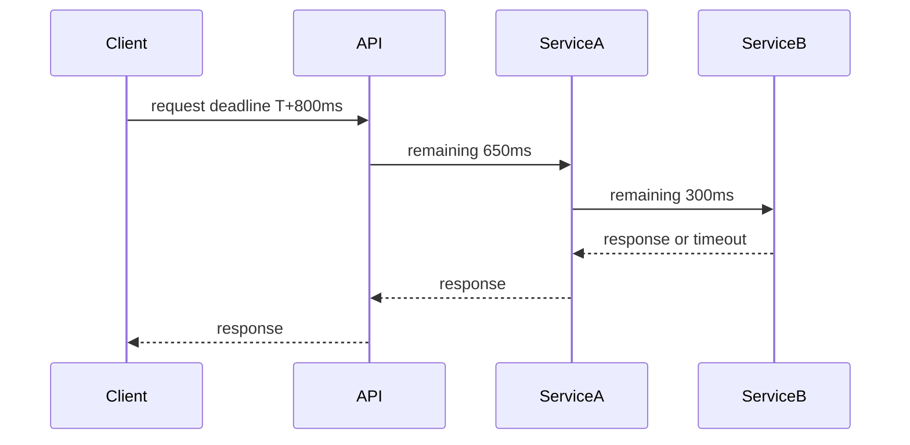
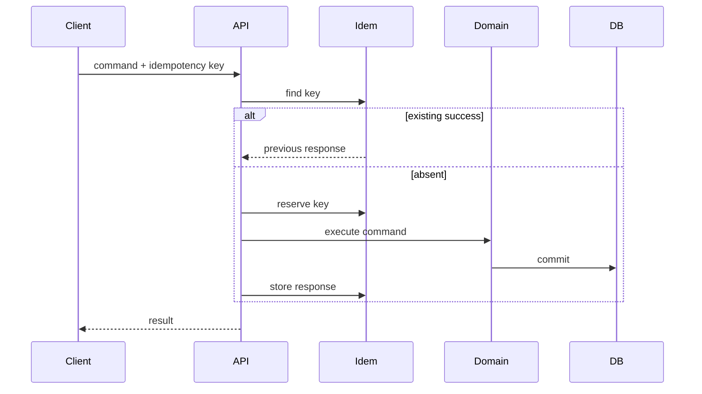
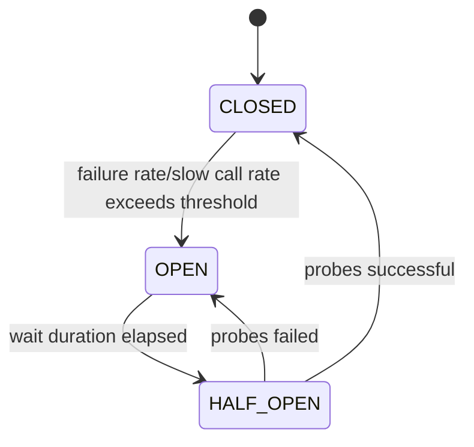
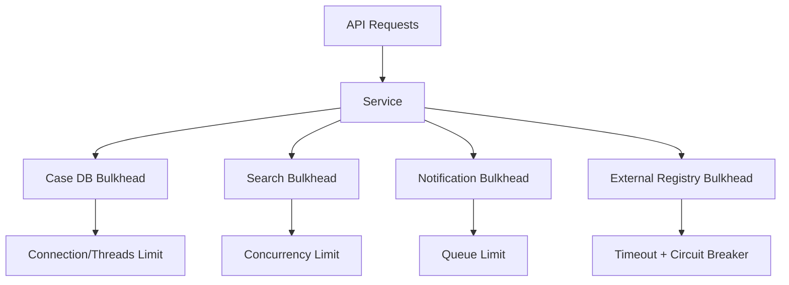
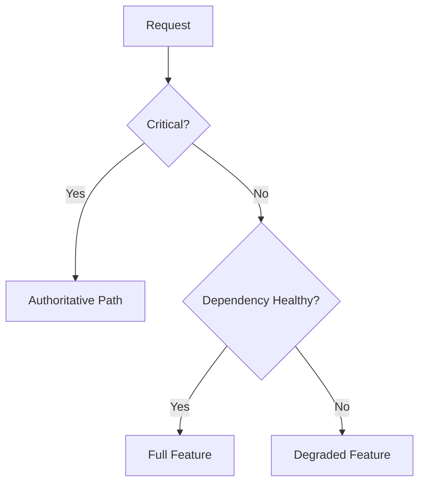
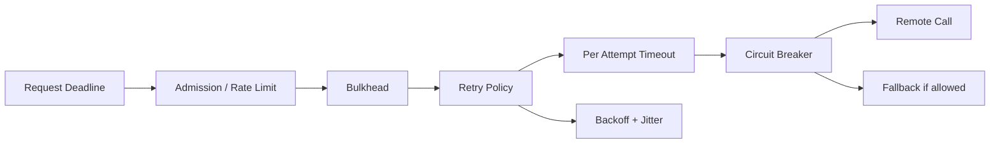

------
title: Learn Java Patterns - Part 024
description: Resilience patterns for Java systems: timeout, deadline, retry, exponential backoff, jitter, circuit breaker, bulkhead, rate limiter, load shedding, fallback, graceful degradation, idempotency, observability, testing, and production anti-patterns.
series: learn-java-patterns
seriesTitle: Learn Java Patterns, Data Patterns, Pipeline Patterns, Concurrency Patterns, Common Patterns, and Anti-Patterns
order: 24
partTitle: Resilience Patterns
tags:
- java
- patterns
- resilience
- reliability
- distributed-systems
- microservices
- fault-tolerance
- advanced-java
date: 2026-06-27
---

# Part 024 — Resilience Patterns

> Goal: mampu mendesain Java service yang tetap terkendali saat dependency lambat, error, overload, partial outage, retry storm, traffic spike, dan resource exhaustion.

Resilience bukan berarti sistem tidak pernah gagal.

Resilience berarti:

```text
Failures are expected, bounded, observable, and recoverable.
```

Pattern seperti timeout, retry, circuit breaker, bulkhead, rate limiter, dan fallback bukan dekorasi. Mereka mengubah bentuk failure.

Pattern yang salah dapat memperburuk outage:

- retry storm memperbesar load,
- timeout terlalu panjang menghabiskan thread,
- circuit breaker salah threshold membuat recovery lambat,
- fallback diam-diam menyembunyikan data salah,
- rate limiter salah tempat menghukum traffic penting,
- queue tanpa batas membuat latency tak terkendali,
- bulkhead terlalu kecil menurunkan availability.

Part ini membahas resilience sebagai engineering of failure boundaries.

---

## 1. Kaufman Skill Slice

Sub-skill yang harus dilatih:

1. Mengklasifikasikan failure: transient, persistent, overload, partial, slow, corrupt, timeout, rejected.
2. Menentukan timeout dan deadline dari latency budget.
3. Menentukan kapan retry aman berdasarkan idempotency dan error taxonomy.
4. Mendesain retry dengan exponential backoff dan jitter.
5. Mendesain circuit breaker dengan threshold, state, dan recovery strategy.
6. Mendesain bulkhead untuk isolasi dependency/resource.
7. Mendesain rate limiter dan load shedding untuk admission control.
8. Mendesain fallback tanpa menyembunyikan correctness problem.
9. Menggabungkan pattern tanpa efek samping berbahaya.
10. Mengobservasi resilience behavior dengan metric yang tepat.
11. Menguji slow dependency, partial outage, retry storm, dan recovery.
12. Mengetahui kapan pattern resilience tidak cocok.

Learning target:

> Setelah part ini, Anda harus bisa melihat call graph service dan menjawab: timeout per dependency berapa, retry boleh untuk error apa, idempotency key-nya apa, circuit breaker threshold-nya apa, bulkhead resource-nya apa, rate limit di mana, fallback-nya apa, dan metric apa yang membuktikan sistem tidak sedang menciptakan retry storm.

---

## 2. Failure Taxonomy

Sebelum memilih pattern, klasifikasikan failure.

| Failure Type | Example | Pattern Candidate |
|---|---|---|
| transient network error | connection reset | retry + backoff + jitter |
| downstream slow | p99 latency spike | timeout/deadline, circuit breaker |
| downstream overload | 503, queue full | backoff, circuit breaker, load shedding |
| persistent bug | 400/validation error | no retry |
| data conflict | optimistic lock failed | domain-specific retry or user resolution |
| partial response | one backend unavailable | fallback/degrade |
| resource saturation | thread pool exhausted | bulkhead, queue bound, load shedding |
| rate exceeded | 429 | respect retry-after, client-side rate limit |
| corrupt/invalid data | deserialization error | fail fast, quarantine, alert |

Rule:

```text
Do not retry what you do not understand.
```

---

## 3. Resilience Pattern Map

```mermaid
flowchart TD
    A[Resilience Patterns] --> B[Time Control]
    A --> C[Attempt Control]
    A --> D[Failure Isolation]
    A --> E[Admission Control]
    A --> F[Degradation]
    A --> G[Recovery]
    A --> H[Observability]

    B --> B1[Timeout]
    B --> B2[Deadline]
    B --> B3[Cancellation]

    C --> C1[Retry]
    C --> C2[Backoff]
    C --> C3[Jitter]
    C --> C4[Idempotency]

    D --> D1[Circuit Breaker]
    D --> D2[Bulkhead]
    D --> D3[Dependency Isolation]

    E --> E1[Rate Limiter]
    E --> E2[Concurrency Limit]
    E --> E3[Load Shedding]

    F --> F1[Fallback]
    F --> F2[Graceful Degradation]
    F --> F3[Stale Cache]

    G --> G1[Half-Open Probe]
    G --> G2[Health Check]
    G --> G3[Warmup]

    H --> H1[Metrics]
    H --> H2[Trace]
    H --> H3[Structured Logs]
```



---

## 4. Timeout Pattern

### 4.1 Intent

Timeout membatasi berapa lama caller menunggu operation.

Tanpa timeout, slow dependency dapat menghabiskan:

- request threads,
- virtual threads,
- database connections,
- HTTP connections,
- heap,
- queue capacity,
- user patience,
- upstream latency budget.

Rule:

```text
Every remote call must have a timeout.
```

### 4.2 Timeout vs Deadline

Timeout relatif terhadap operation.

```text
Call payment service with timeout 300 ms.
```

Deadline adalah batas waktu absolut dari request end-to-end.

```text
Request must finish before 10:00:01.250Z.
```

Deadline lebih kuat karena mencegah setiap layer menghabiskan timeout penuh.



### 4.3 Java HttpClient Timeout

```java
HttpClient client = HttpClient.newBuilder()
        .connectTimeout(Duration.ofMillis(200))
        .build();

HttpRequest request = HttpRequest.newBuilder(uri)
        .timeout(Duration.ofMillis(500))
        .GET()
        .build();

HttpResponse<String> response = client.send(request, HttpResponse.BodyHandlers.ofString());
```

Differentiate:

- connect timeout,
- request/response timeout,
- read timeout,
- pool acquisition timeout,
- total deadline.

### 4.4 Deadline Object

```java
public final class Deadline {
    private final Instant expiresAt;
    private final Clock clock;

    private Deadline(Instant expiresAt, Clock clock) {
        this.expiresAt = expiresAt;
        this.clock = clock;
    }

    public static Deadline after(Duration duration, Clock clock) {
        return new Deadline(clock.instant().plus(duration), clock);
    }

    public Duration remaining() {
        Duration remaining = Duration.between(clock.instant(), expiresAt);
        return remaining.isNegative() ? Duration.ZERO : remaining;
    }

    public boolean expired() {
        return !clock.instant().isBefore(expiresAt);
    }

    public void throwIfExpired() {
        if (expired()) {
            throw new TimeoutException("Deadline expired");
        }
    }
}
```

### 4.5 Timeout Selection

Timeout tidak boleh dipilih acak.

Pertimbangkan:

- user-facing latency budget,
- downstream latency distribution,
- network distance,
- retry budget,
- connection setup cost,
- cold start/warmup,
- false timeout rate,
- workload type.

Contoh:

```text
End-to-end API budget: 1000 ms
API overhead: 100 ms
Service A local work: 100 ms
Dependency B budget: 300 ms
Dependency C budget: 300 ms
Retry reserve: 200 ms
```

---

## 5. Cancellation Pattern

Timeout tanpa cancellation hanya berhenti menunggu, tetapi work mungkin tetap berjalan.

Dalam Java:

- `Future.cancel(true)` mengirim interrupt,
- `CompletableFuture.cancel` tidak selalu menghentikan underlying work,
- virtual thread blocking operation umumnya lebih cancellation-friendly jika interruptible,
- structured concurrency membantu propagate cancellation ke child tasks.

Pattern:

```java
public interface CancellationToken {
    boolean cancelled();
    void throwIfCancelled();
}
```

Simple implementation:

```java
public final class AtomicCancellationToken implements CancellationToken {
    private final AtomicBoolean cancelled = new AtomicBoolean();

    public void cancel() {
        cancelled.set(true);
    }

    @Override
    public boolean cancelled() {
        return cancelled.get();
    }

    @Override
    public void throwIfCancelled() {
        if (cancelled()) {
            throw new CancellationException();
        }
    }
}
```

Long-running tasks must poll cancellation at safe points.

```java
for (Chunk chunk : chunks) {
    token.throwIfCancelled();
    process(chunk);
}
```

---

## 6. Retry Pattern

### 6.1 Intent

Retry mengulang operation yang gagal karena failure mungkin transient.

Retry aman jika:

- operation idempotent, atau
- duplicate side effects dicegah, atau
- operation belum mencapai server, atau
- domain memiliki conflict resolution.

Retry tidak aman jika:

- command menyebabkan irreversible side effect,
- tidak ada idempotency key,
- error adalah validation/business error,
- downstream overload dan retry memperparah load,
- timeout meninggalkan unknown commit state.

### 6.2 Retry Error Taxonomy

```java
public enum RetryDecision {
    RETRY,
    DO_NOT_RETRY,
    UNKNOWN
}

public final class RetryClassifier {
    public RetryDecision classify(Throwable error) {
        if (error instanceof SocketTimeoutException) return RetryDecision.RETRY;
        if (error instanceof ConnectException) return RetryDecision.RETRY;
        if (error instanceof IllegalArgumentException) return RetryDecision.DO_NOT_RETRY;
        if (error instanceof BusinessRuleViolation) return RetryDecision.DO_NOT_RETRY;
        return RetryDecision.UNKNOWN;
    }
}
```

HTTP guideline:

| Status | Retry? | Notes |
|---:|---|---|
| 400 | no | bad request |
| 401/403 | no | auth/authz problem |
| 404 | usually no | unless eventual consistency expected |
| 409 | domain-specific | may retry with reload/rebase |
| 408 | maybe | timeout |
| 429 | yes, if allowed | respect `Retry-After` |
| 500 | maybe | depends on idempotency |
| 502/503/504 | often yes | with backoff and jitter |

### 6.3 Retry with Deadline

Retry should consume a total budget, not reset time each attempt.

```java
public <T> T retryWithinDeadline(
        Supplier<T> operation,
        Deadline deadline,
        int maxAttempts,
        RetryClassifier classifier
) {
    Throwable last = null;

    for (int attempt = 1; attempt <= maxAttempts; attempt++) {
        deadline.throwIfExpired();

        try {
            return operation.get();
        } catch (Throwable error) {
            last = error;
            if (classifier.classify(error) != RetryDecision.RETRY) {
                throw error;
            }
            if (attempt == maxAttempts) {
                throw error;
            }
            sleep(backoffWithJitter(attempt, deadline.remaining()));
        }
    }

    throw new IllegalStateException("unreachable", last);
}
```

---

## 7. Backoff and Jitter Pattern

### 7.1 Intent

Backoff menunda retry agar downstream punya waktu pulih. Jitter menambahkan randomization agar clients tidak retry serentak.

Tanpa jitter:

```text
1000 clients fail at T0
1000 clients retry at T0 + 100ms
1000 clients retry at T0 + 200ms
1000 clients retry at T0 + 400ms
```

Dengan jitter, retry tersebar.

### 7.2 Exponential Backoff with Jitter

```java
public Duration backoffWithJitter(int attempt, Duration maxAllowed) {
    long baseMillis = 50L;
    long capMillis = Math.min(1_000L, Math.max(1L, maxAllowed.toMillis()));
    long exponential = Math.min(capMillis, baseMillis * (1L << Math.min(attempt - 1, 10)));
    long jittered = ThreadLocalRandom.current().nextLong(0, exponential + 1);
    return Duration.ofMillis(jittered);
}
```

This is closer to “full jitter” than deterministic sleep.

### 7.3 Retry Budget

Retry budget limits total additional traffic caused by retries.

Example policy:

```text
Max attempts: 3
Max total elapsed: 800 ms
Retryable errors: connect timeout, 502, 503, 504
Do not retry: 400, 401, 403, 409, business validation
Jitter: full jitter
Idempotency required: yes for POST/command
```

---

## 8. Idempotency Pattern

### 8.1 Intent

Idempotency ensures repeated attempts have the same effect as one attempt.

For command APIs, use idempotency key.

```java
record CommandIdempotencyKey(
        String tenantId,
        UUID actorId,
        String operation,
        UUID clientRequestId
) {}
```

### 8.2 Idempotency Record

```java
record IdempotencyRecord(
        CommandIdempotencyKey key,
        String requestHash,
        String responseBody,
        CommandStatus status,
        Instant createdAt
) {}
```

Command flow:



### 8.3 Unknown Outcome

Timeout after sending command is dangerous.

The server may have committed, but client did not receive response.

Idempotency key lets retry discover prior result.

Rule:

```text
Retrying commands without idempotency is gambling with side effects.
```

---

## 9. Circuit Breaker Pattern

### 9.1 Intent

Circuit breaker stops calls to a dependency that is likely failing, allowing fast failure and recovery probes.

State model:



### 9.2 Why It Exists

Without circuit breaker:

- every request waits for timeout,
- caller resources saturate,
- downstream receives more pressure,
- upstream queue grows,
- user sees latency spike.

With circuit breaker:

- calls fail fast while open,
- dependency gets time to recover,
- caller resources are preserved,
- recovery is probed carefully.

### 9.3 Resilience4j Example

```java
CircuitBreakerConfig config = CircuitBreakerConfig.custom()
        .failureRateThreshold(50)
        .slowCallRateThreshold(50)
        .slowCallDurationThreshold(Duration.ofMillis(500))
        .minimumNumberOfCalls(20)
        .slidingWindowSize(50)
        .waitDurationInOpenState(Duration.ofSeconds(10))
        .permittedNumberOfCallsInHalfOpenState(5)
        .build();

CircuitBreaker breaker = CircuitBreaker.of("case-search", config);

Supplier<SearchResult> decorated = CircuitBreaker
        .decorateSupplier(breaker, () -> searchClient.search(query));

SearchResult result = Try.ofSupplier(decorated)
        .recover(CallNotPermittedException.class, error -> fallbackSearch(query))
        .get();
```

### 9.4 Circuit Breaker Tuning

Important parameters:

| Parameter | Meaning |
|---|---|
| failure rate threshold | when closed becomes open |
| slow call threshold | slow calls considered unhealthy |
| sliding window | sample size/time window |
| minimum calls | avoid opening on tiny sample |
| open wait duration | cooling period |
| half-open permitted calls | recovery probes |

### 9.5 Failure Modes

| Failure | Cause | Mitigation |
|---|---|---|
| flapping | thresholds too sensitive | larger window, better minimum calls |
| hidden outage | fallback masks all errors | alert on breaker open/fallback count |
| slow recovery | open duration too long | tune half-open probes |
| overload in half-open | too many probes | limit permitted calls |
| one breaker for many ops | mixed health signals | breaker per dependency/operation class |

Rule:

```text
Circuit breaker is not an error handler. It is a load and failure isolation mechanism.
```

---

## 10. Bulkhead Pattern

### 10.1 Intent

Bulkhead isolates resource pools so one dependency/workload cannot consume all capacity.

Ship compartments inspire the name: flooding one compartment should not sink the whole ship.



### 10.2 Java Semaphore Bulkhead

```java
public final class SemaphoreBulkhead {
    private final Semaphore permits;

    public SemaphoreBulkhead(int maxConcurrentCalls) {
        this.permits = new Semaphore(maxConcurrentCalls);
    }

    public <T> T execute(Supplier<T> supplier) {
        boolean acquired = permits.tryAcquire();
        if (!acquired) {
            throw new RejectedExecutionException("Bulkhead full");
        }
        try {
            return supplier.get();
        } finally {
            permits.release();
        }
    }
}
```

### 10.3 Thread Pool Bulkhead

Use separate executor per dependency/workload if blocking or isolation is needed.

```java
ExecutorService searchExecutor = Executors.newFixedThreadPool(20);
ExecutorService notificationExecutor = Executors.newFixedThreadPool(5);
```

With virtual threads, do not assume thread count is the only resource. You still need bulkheads for:

- DB connections,
- HTTP connection pools,
- downstream QPS,
- memory,
- CPU-heavy work,
- tenant fairness.

### 10.4 Bulkhead Failure Modes

| Failure | Cause | Mitigation |
|---|---|---|
| global pool starvation | all work shares same executor | separate pools/limits |
| unbounded queue | queue absorbs infinite requests | bounded queue + rejection |
| wrong rejection handling | caller retries immediately | backoff/load shedding |
| too small bulkhead | availability drops | capacity test/tune |
| too large bulkhead | downstream overload | align with dependency capacity |

---

## 11. Rate Limiter Pattern

### 11.1 Intent

Rate limiter controls number of operations per time window.

Used for:

- protecting downstream,
- enforcing tenant limits,
- controlling expensive operations,
- smoothing spikes,
- complying with external API quotas.

### 11.2 Token Bucket Mental Model

```text
bucket has capacity N
tokens refill at rate R
each request consumes token
if no token, reject/wait/degrade
```

Simple Java sketch:

```java
public final class SimpleTokenBucket {
    private final long capacity;
    private final long refillPerSecond;
    private long tokens;
    private long lastRefillNanos;

    public SimpleTokenBucket(long capacity, long refillPerSecond) {
        this.capacity = capacity;
        this.refillPerSecond = refillPerSecond;
        this.tokens = capacity;
        this.lastRefillNanos = System.nanoTime();
    }

    public synchronized boolean tryAcquire() {
        refill();
        if (tokens <= 0) {
            return false;
        }
        tokens--;
        return true;
    }

    private void refill() {
        long now = System.nanoTime();
        long elapsed = now - lastRefillNanos;
        long add = elapsed * refillPerSecond / 1_000_000_000L;
        if (add > 0) {
            tokens = Math.min(capacity, tokens + add);
            lastRefillNanos = now;
        }
    }
}
```

Production code should use battle-tested libraries, but this mental model matters.

### 11.3 Rate Limit Dimensions

- global,
- per tenant,
- per user,
- per API key,
- per operation,
- per dependency,
- per priority class.

Do not use one global limiter for all traffic if priority matters.

---

## 12. Load Shedding Pattern

### 12.1 Intent

Reject lower-value work when system is overloaded, before collapse.

Load shedding is not failure. It is controlled refusal.

```text
Better to reject early than accept work that will timeout later.
```

Signals:

- queue depth,
- CPU saturation,
- heap pressure,
- GC pause,
- DB pool saturation,
- p99 latency,
- downstream breaker open,
- request deadline already too short.

### 12.2 Example

```java
public void ensureAdmissible(RequestContext context) {
    if (context.deadline().remaining().compareTo(Duration.ofMillis(50)) < 0) {
        throw new RejectedExecutionException("Insufficient deadline remaining");
    }

    if (dbPoolMetrics.pendingAcquire() > 100) {
        throw new ServiceUnavailableException("Database pool saturated");
    }
}
```

### 12.3 Priority-Aware Shedding

In regulatory systems:

- emergency action > background report,
- command path > dashboard refresh,
- statutory deadline task > notification digest,
- human interactive request > batch backfill.

Do not shed blindly.

```java
enum Priority {
    CRITICAL_COMMAND,
    INTERACTIVE_READ,
    BACKGROUND_TASK,
    BEST_EFFORT
}
```

---

## 13. Fallback Pattern

### 13.1 Intent

Provide alternative response when primary path fails.

Fallback examples:

- cached/stale data,
- partial response,
- default configuration,
- empty recommendation list,
- degraded search,
- manual review queue,
- async accepted response.

### 13.2 Safe vs Unsafe Fallback

| Scenario | Safe Fallback? | Notes |
|---|---:|---|
| dashboard chart unavailable | yes | show partial UI |
| notification provider down | yes | enqueue retry |
| authorization service down | often no | fail closed or emergency policy |
| regulatory deadline calculation fails | no | cannot invent deadline |
| case search down | maybe | fallback to DB basic search |
| fraud risk unavailable | maybe | route to manual review |

### 13.3 Java Example

```java
public CaseSummary getCaseSummary(UUID caseId) {
    try {
        return primarySummaryClient.fetch(caseId);
    } catch (TimeoutException | CircuitBreakerOpenException error) {
        return cache.getIfPresent(caseId)
                .map(summary -> summary.markStale("summary-service-unavailable"))
                .orElseThrow(() -> new ServiceUnavailableException("Case summary unavailable", error));
    }
}
```

### 13.4 Fallback Must Be Observable

A fallback that users cannot see and operators cannot measure becomes silent data corruption.

Minimum:

- metric: fallback count by reason,
- log: dependency, request id, fallback type,
- trace tag: degraded=true,
- response metadata if user-visible stale/partial data.

---

## 14. Graceful Degradation Pattern

### 14.1 Intent

System reduces non-critical functionality while preserving critical path.

Example case platform:

| Component | Degraded Behavior |
|---|---|
| audit timeline enrichment | show raw events |
| search ranking | basic exact search |
| notification digest | delay digest |
| dashboard aggregate | show stale snapshot |
| export service | queue job instead of synchronous export |
| external registry lookup | mark pending verification |

### 14.2 Design



Degradation must be product/business-approved, not invented during incident.

---

## 15. Hedged Request Pattern

### 15.1 Intent

Send duplicate request after delay to reduce tail latency.

```text
send request to replica A
if no response after p95 delay, send hedge to replica B
use first successful response
cancel loser
```

### 15.2 Kapan Cocok

- read-only/idempotent requests,
- multiple equivalent replicas,
- tail latency dominates,
- extra load acceptable,
- cancellation possible.

### 15.3 Kapan Berbahaya

- write commands,
- overloaded downstream,
- expensive operations,
- no cancellation,
- duplicate side effects.

Hedging is advanced. Use only after measuring tail latency.

---

## 16. Retry + Circuit Breaker + Timeout Composition

Composition is tricky.

Bad:

```text
retry 3 times, each with 5s timeout, inside 1s API budget
```

Good:

```text
one request deadline controls all attempts
per-attempt timeout derived from remaining budget
retry count bounded
backoff jittered
circuit breaker observes actual failures/slow calls
bulkhead protects resource
```

### 16.1 Conceptual Order

There is no universal order, but a common client-side shape:



Important nuance:

- If breaker wraps all retries, it sees final outcome only.
- If breaker wraps each attempt, it sees per-attempt failures.
- If retry wraps breaker, open breaker may be retried pointlessly unless classified non-retryable.
- If timeout wraps whole retry block, individual attempts may run too long unless also bounded.

Define semantics explicitly.

### 16.2 Recommended Reasoning

For each dependency:

1. Decide total call budget.
2. Decide idempotency and retryable errors.
3. Decide max attempts and backoff.
4. Decide concurrency limit.
5. Decide circuit breaker thresholds.
6. Decide fallback.
7. Decide observability.

---

## 17. Resilience4j Decorator Example

```java
Supplier<Response> supplier = () -> client.call(request);

Supplier<Response> decorated = Decorators.ofSupplier(supplier)
        .withBulkhead(bulkhead)
        .withCircuitBreaker(circuitBreaker)
        .withRetry(retry)
        .withFallback(List.of(CallNotPermittedException.class, TimeoutException.class),
                error -> fallbackResponse(request, error))
        .decorate();

Response response = decorated.get();
```

The exact order must be reviewed for semantics. The point is not “use all decorators”. The point is to encode a dependency policy.

Policy object:

```java
record DependencyPolicy(
        String name,
        Duration totalBudget,
        int maxAttempts,
        Duration slowCallThreshold,
        int maxConcurrentCalls,
        boolean fallbackAllowed
) {}
```

---

## 18. Dependency Policy Catalog

Create one policy per dependency/operation class.

```md
# Dependency Policy: external-registry.lookupCompany

## Purpose
Lookup legal company metadata.

## Criticality
Interactive read support. Not command-authoritative.

## Timeout
- connect: 200ms
- per attempt: 500ms
- total deadline: 900ms

## Retry
- max attempts: 2
- retryable: connect timeout, 502, 503, 504
- non-retryable: 400, 401, 403, 404
- backoff: full jitter, cap 200ms
- idempotency: read-only

## Circuit Breaker
- sliding window: 100 calls
- failure threshold: 50%
- slow call threshold: 50% over 500ms
- open duration: 10s
- half-open probes: 5

## Bulkhead
- max concurrent calls: 25
- queue: none

## Fallback
- stale cache up to 24h
- mark response as unverified

## Observability
- latency histogram
- timeout count
- retry count
- breaker state
- fallback count
- stale age
```

This catalog prevents resilience settings from being magic numbers hidden in annotations.

---

## 19. Queue Bound Pattern

Queues create decoupling, but unbounded queues create invisible failure.

Bad:

```java
ExecutorService executor = Executors.newFixedThreadPool(10);
```

`newFixedThreadPool` uses an unbounded queue. Under overload, latency and memory can grow until collapse.

Better: explicit bounded queue.

```java
ThreadPoolExecutor executor = new ThreadPoolExecutor(
        10,
        10,
        0L,
        TimeUnit.MILLISECONDS,
        new ArrayBlockingQueue<>(100),
        new ThreadPoolExecutor.AbortPolicy()
);
```

With virtual threads, queueing can still happen at:

- DB pool,
- HTTP pool,
- semaphore bulkhead,
- message broker,
- downstream service,
- CPU scheduler.

Rule:

```text
Every queue must have a bound, owner, metric, and rejection behavior.
```

---

## 20. Health Check and Readiness Pattern

### 20.1 Liveness vs Readiness

- Liveness: should process be restarted?
- Readiness: should traffic be sent here?

Do not put every downstream dependency in liveness. A temporary downstream outage should not always restart your service.

Readiness should reflect whether this instance can serve its assigned traffic.

### 20.2 Dependency Health

Health checks should avoid becoming DDoS tools.

Bad:

```text
Every instance hits every dependency every second with expensive query.
```

Better:

- cheap checks,
- cached health status,
- backoff,
- separate critical and optional dependencies,
- circuit breaker metrics integrated.

---

## 21. Resilience Observability

Minimum metrics per dependency:

| Metric | Why |
|---|---|
| request count | load baseline |
| success/failure count | health |
| latency histogram | timeout tuning |
| timeout count | slowness |
| retry attempts | retry storm detection |
| retry success after retry | retry usefulness |
| circuit breaker state | failure isolation |
| rejected by bulkhead | saturation |
| rate limited count | admission pressure |
| fallback count | degraded mode |
| queue depth | overload early warning |
| pending duration | hidden latency |

Trace tags:

```text
dependency=external-registry
attempt=2
retry=true
circuitBreaker=closed
bulkheadRejected=false
fallback=stale-cache
deadlineRemainingMs=132
```

Structured log example:

```java
log.warn("dependency_call_degraded dependency={} operation={} reason={} fallback={} requestId={} tenantId={}",
        "external-registry",
        "lookupCompany",
        error.getClass().getSimpleName(),
        "stale-cache",
        context.requestId(),
        context.tenantId());
```

Do not log sensitive payloads.

---

## 22. Testing Resilience Patterns

### 22.1 Fake Slow Dependency

```java
public final class FakeRegistryClient implements RegistryClient {
    private Duration delay = Duration.ZERO;
    private RuntimeException error;

    public void delay(Duration delay) {
        this.delay = delay;
    }

    public void failWith(RuntimeException error) {
        this.error = error;
    }

    @Override
    public Company lookup(String id) {
        sleep(delay);
        if (error != null) throw error;
        return new Company(id, "ACME");
    }
}
```

### 22.2 Timeout Test

```java
@Test
void shouldTimeoutSlowDependency() {
    fakeRegistry.delay(Duration.ofSeconds(2));

    assertThrows(TimeoutException.class, () ->
            service.lookupCompany("123", Deadline.after(Duration.ofMillis(200), clock))
    );
}
```

### 22.3 Retry Classification Test

```java
@Test
void shouldNotRetryBusinessError() {
    fake.failWith(new BusinessRuleViolation("invalid"));

    assertThrows(BusinessRuleViolation.class, () -> client.call());
    assertEquals(1, fake.callCount());
}
```

### 22.4 Circuit Breaker Test

```java
@Test
void shouldOpenCircuitAfterFailures() {
    fake.failWith(new ConnectException("down"));

    for (int i = 0; i < 20; i++) {
        ignoreFailure(() -> protectedClient.call());
    }

    assertEquals(CircuitBreaker.State.OPEN, breaker.getState());
}
```

### 22.5 Bulkhead Test

```java
@Test
void shouldRejectWhenBulkheadFull() throws Exception {
    var bulkhead = new SemaphoreBulkhead(1);
    var latch = new CountDownLatch(1);
    var executor = Executors.newFixedThreadPool(2);

    Future<?> first = executor.submit(() -> bulkhead.execute(() -> {
        await(latch);
        return null;
    }));

    eventually(() -> assertEquals(0, bulkhead.availablePermits()));

    assertThrows(RejectedExecutionException.class,
            () -> bulkhead.execute(() -> "second"));

    latch.countDown();
    first.get();
    executor.shutdown();
}
```

---

## 23. Chaos and Fault Injection

Resilience must be tested with realistic failure:

- latency injection,
- connection reset,
- DNS failure,
- partial error rate,
- slow response body,
- 429/503 storm,
- dependency blackhole,
- queue saturation,
- DB pool exhaustion,
- cache outage,
- message broker lag.

Start in lower environment, then controlled production experiments if organization maturity allows.

Fault injection checklist:

- blast radius limited,
- rollback switch exists,
- alerts active,
- SLO defined,
- customer impact understood,
- on-call aware,
- experiment duration bounded.

---

## 24. Anti-Patterns

### 24.1 Retry Storm

Symptom:

- downstream slows,
- callers retry,
- traffic multiplies,
- downstream collapses further.

Correction:

- retry budget,
- exponential backoff,
- jitter,
- circuit breaker,
- respect 429/Retry-After,
- shed load.

### 24.2 Timeout Too High

Symptom:

- requests hang,
- thread/connection pools exhausted,
- p99 latency explodes.

Correction:

- derive timeout from latency budget,
- set per-dependency deadlines,
- fail fast.

### 24.3 Timeout Too Low

Symptom:

- false failures,
- unnecessary retries,
- user-visible errors during normal p99.

Correction:

- use latency histogram,
- account for cold connection/TLS,
- warm connections,
- tune based on false timeout target.

### 24.4 Fallback Lies

Symptom:

- system returns default as if authoritative,
- users make wrong decisions,
- metrics show green while degraded.

Correction:

- mark stale/partial data,
- alert on fallback,
- avoid fallback for correctness-critical commands.

### 24.5 One Global Circuit Breaker

Symptom:

- one operation opens breaker for all operations,
- low-value call blocks high-value call,
- health signal too coarse.

Correction:

- breaker per dependency and operation class,
- priority-aware policy.

### 24.6 Shared Executor for Everything

Symptom:

- notification failure blocks command processing,
- background jobs starve API requests.

Correction:

- bulkheads,
- bounded queues,
- separate resource pools.

### 24.7 Infinite Queue

Symptom:

- system accepts work it cannot finish,
- latency becomes invisible backlog,
- OOM risk.

Correction:

- bounded queue,
- rejection,
- load shedding,
- backpressure.

---

## 25. Regulatory / Enforcement System Considerations

For enforcement lifecycle systems, resilience has defensibility implications.

### 25.1 Command Path

Commands like:

- issue notice,
- approve enforcement action,
- close case,
- assign legal officer,
- extend deadline,
- escalate violation,
- freeze account,
- publish sanction,

should not silently fallback to stale or default authority.

Better:

- fail closed,
- route to manual review,
- persist pending command with clear status,
- require authoritative revalidation,
- record reason and dependency state.

### 25.2 Read Path

Read paths can degrade more safely:

- dashboard partial data,
- stale search results,
- timeline without enrichment,
- external registry marked unavailable,
- export queued.

### 25.3 Auditability

Every degraded command-affecting behavior should be auditable:

- which dependency failed,
- which fallback was used,
- what stale version was served,
- who acted,
- whether action was blocked or allowed,
- whether manual review was required.

Rule:

```text
Resilience must not erase accountability.
```

---

## 26. Virtual Threads and Resilience

Virtual threads reduce the cost of blocking threads, but they do not remove downstream capacity limits.

They help with:

- thread-per-request simplicity,
- blocking I/O scalability,
- structured cancellation,
- simpler code than callback chains.

They do not solve:

- DB connection exhaustion,
- remote service overload,
- rate limits,
- memory pressure,
- CPU saturation,
- unbounded request admission,
- missing timeouts.

Rule:

```text
Virtual threads make waiting cheaper for the caller, not cheaper for the dependency.
```

Still use:

- timeouts,
- deadlines,
- bulkheads,
- rate limits,
- bounded queues,
- cancellation,
- observability.

---

## 27. Pattern Selection Matrix

| Problem | Primary Pattern | Supporting Pattern |
|---|---|---|
| dependency slow | timeout/deadline | circuit breaker, fallback |
| transient network error | retry | backoff, jitter, idempotency |
| downstream overload | circuit breaker | load shedding, rate limit |
| one dependency consumes all resources | bulkhead | bounded queue, timeout |
| traffic spike | rate limiter | load shedding, priority |
| command unknown outcome | idempotency | retry, status lookup |
| user-facing optional data unavailable | fallback | stale cache, partial response |
| p99 tail latency high | timeout | maybe hedging for idempotent reads |
| background job backlog | bounded queue | priority, load shedding |
| regulatory command cannot validate | fail closed | manual review queue |

---

## 28. Resilience Review Checklist

For every remote dependency:

- Is there a total deadline?
- Is there a connect/request/read timeout?
- Is retry allowed?
- Which errors are retryable?
- Is operation idempotent?
- Is there an idempotency key for commands?
- Is backoff jittered?
- Is retry budget bounded?
- Is there a circuit breaker?
- Is circuit breaker scoped correctly?
- Is there a bulkhead/concurrency limit?
- Is queue bounded?
- Is rate limit needed?
- Is fallback safe?
- Is fallback observable?
- Are metrics emitted per dependency/operation?
- Are slow calls measured?
- Are rejections measured?
- Are timeouts tested?
- Are partial outages tested?
- Does behavior preserve auditability?

---

## 29. Practice Drill

### Drill 1 — Protect External Registry Lookup

Given:

```java
public Company lookupCompany(String registrationNumber) {
    return httpClient.get("/companies/" + registrationNumber);
}
```

Add:

1. connect timeout,
2. request timeout,
3. total deadline,
4. retry for 502/503/504 only,
5. exponential backoff with jitter,
6. circuit breaker,
7. semaphore bulkhead,
8. stale cache fallback,
9. metric tags,
10. tests for slow dependency and breaker open.

### Drill 2 — Make Command Retry-Safe

Given command:

```java
POST /cases/{id}/approve
```

Design:

- idempotency key,
- request hash,
- duplicate command behavior,
- unknown outcome retry,
- response replay,
- audit trail.

### Drill 3 — Prevent Retry Storm

Given 5 services all call downstream X and each retries 3 times.

Task:

- calculate amplification,
- move retry to one layer,
- add backoff + jitter,
- add circuit breaker,
- add rate limit,
- define retry budget.

Amplification example:

```text
3 attempts across 5 layers = 3^5 = 243 possible downstream attempts
```

This is why retry must be designed globally, not casually added locally.

---

## 30. Summary

Resilience patterns are not a checklist of libraries. They are a way to keep failure bounded.

Core invariant:

```text
Every dependency call must have bounded time, bounded attempts, bounded concurrency, bounded queueing, explicit fallback, and observable behavior.
```

Use:

- timeout/deadline to bound waiting,
- cancellation to stop wasted work,
- retry for transient idempotent failures,
- backoff and jitter to prevent synchronized retry,
- idempotency to make command retry safe,
- circuit breaker to fail fast during dependency failure,
- bulkhead to isolate resource pools,
- rate limiter/load shedding to control admission,
- fallback/graceful degradation for non-critical features,
- observability to prove what happened.

Top 1% engineering behavior is not “add Resilience4j”. It is the ability to say:

> For this dependency, under this business criticality, the total budget is X, attempts are Y, retryable failures are Z, idempotency is guaranteed by K, concurrency is bounded by B, fallback is F, and all degraded behavior is visible in metrics, traces, logs, and audit records.

---

## References

- Resilience4j documentation: circuit breaker, retry, bulkhead, rate limiter, time limiter, decorators.
- AWS Builders Library: timeouts, retries, exponential backoff, jitter, overload behavior, and dependency isolation.
- Java platform documentation: `HttpClient`, executors, futures, interrupts, structured concurrency, and virtual threads.
- Martin Fowler pattern writing on Circuit Breaker and distributed system failure boundaries.
