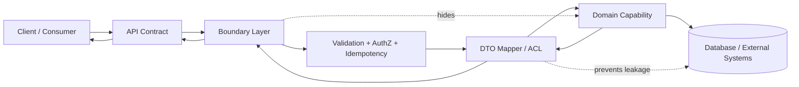
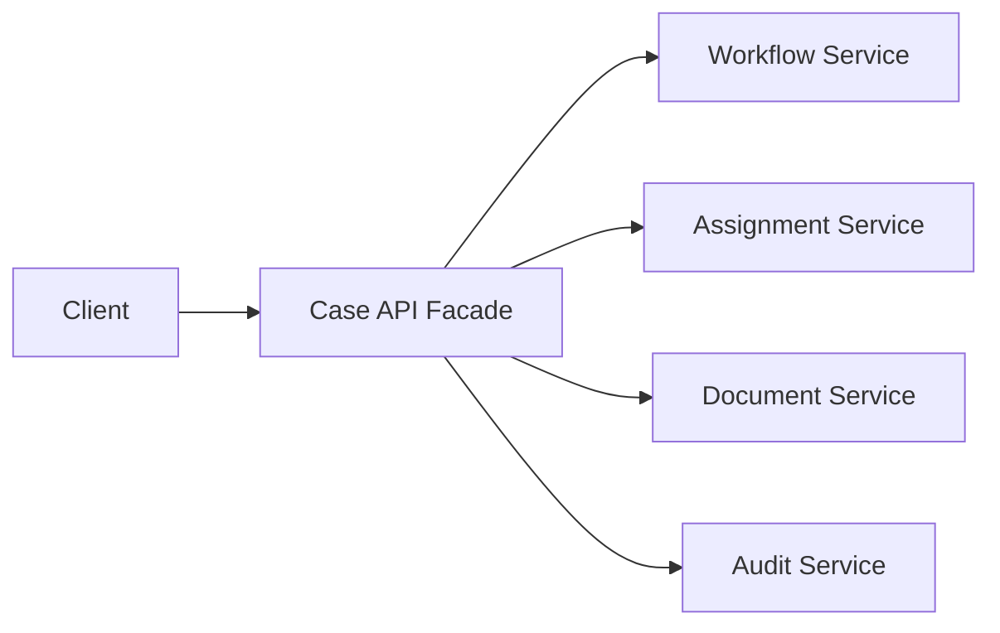
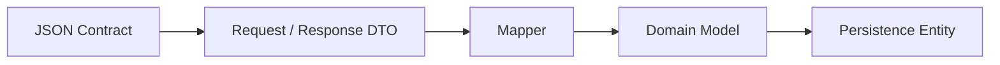
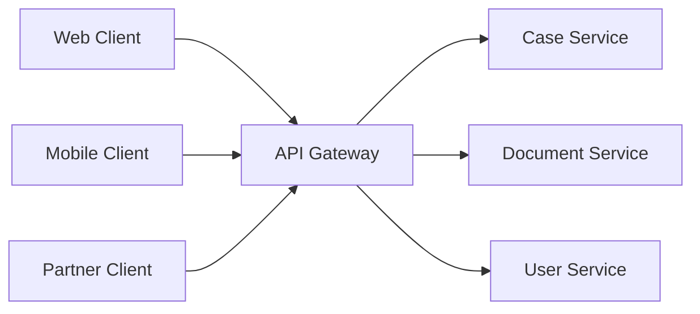
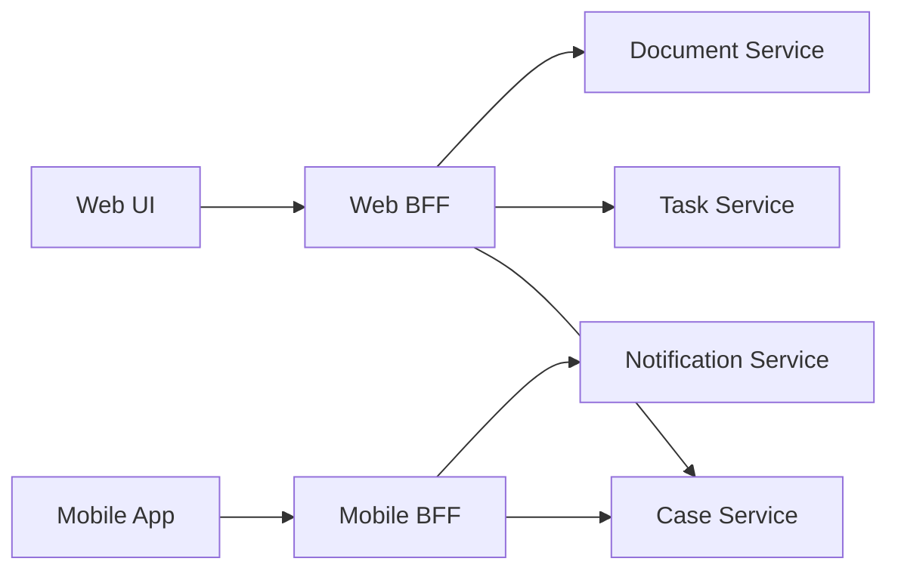
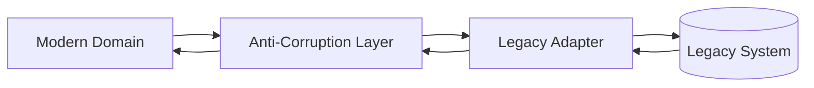
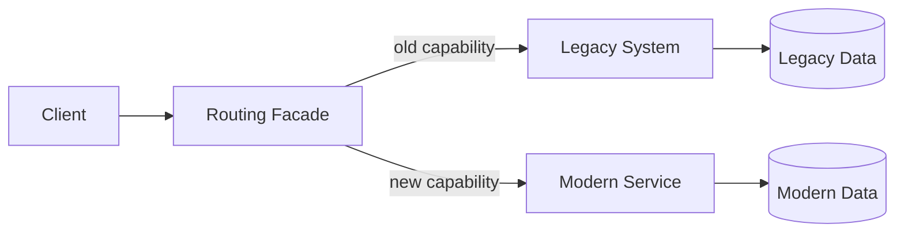
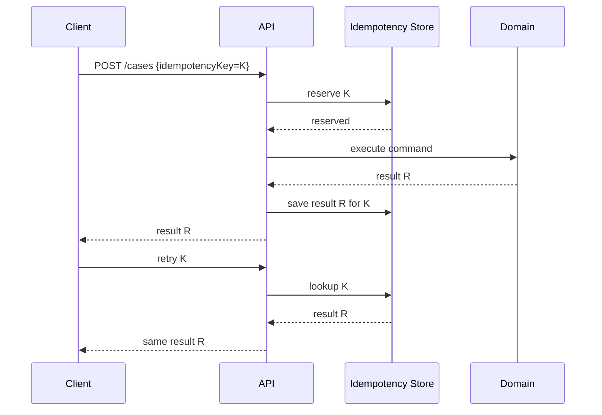
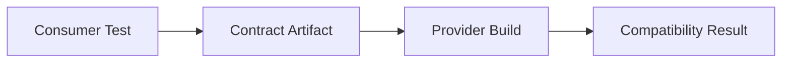

------
title: Learn Java Patterns - Part 025
description: API and boundary patterns for advanced Java systems: gateway, BFF, anti-corruption layer, DTO, mapper, contract compatibility, idempotency, pagination, errors, versioning, observability, and strangler migration.
series: learn-java-patterns
seriesTitle: Learn Java Patterns, Data Patterns, Pipeline Patterns, Concurrency Patterns, Common Patterns, and Anti-Patterns
order: 25
partTitle: API and Boundary Patterns
tags:
- java
- patterns
- api-design
- architecture
- boundary
- integration
- advanced-java
date: 2026-06-27
------

# Part 025 — API and Boundary Patterns

> Goal: build the judgment to design API boundaries that are stable, evolvable, observable, secure, and honest about the domain behind them.

This part is not a REST tutorial. It is about **boundary design**.

A top-tier engineer does not treat an API as a controller method with JSON attached. An API is a controlled membrane between different forces:

- product/user needs
- domain invariants
- security policy
- data consistency
- latency budget
- backward compatibility
- operational ownership
- client diversity
- migration pressure
- observability and forensic traceability

Good API boundaries reduce accidental coupling. Bad API boundaries leak internals, freeze bad models, and create long-lived compatibility debt.

---

## 1. Kaufman Skill Map

Josh Kaufman's method works well here because API design is not one skill. It is a bundle of smaller sub-skills.

### 1.1 Target performance level

After this part, you should be able to:

1. identify what each API boundary is protecting;
2. decide whether a boundary should expose a resource, command, query, workflow action, or event-style contract;
3. separate domain model, persistence model, transport DTO, and client view model;
4. design API contracts that can evolve without breaking existing clients;
5. place validation, authorization, idempotency, correlation, and error mapping at the correct boundary;
6. choose between API Gateway, BFF, Anti-Corruption Layer, Facade, Adapter, and Strangler Fig patterns;
7. evaluate failure modes before shipping an API.

### 1.2 Sub-skills

| Sub-skill | What you practice | Failure if ignored |
|---|---|---|
| Contract modeling | Define request, response, error, version, semantics | accidental breaking changes |
| Boundary placement | Decide where translation and policy live | domain leakage, duplicated logic |
| Compatibility reasoning | Add fields, deprecate behavior, support old clients | forced big-bang migration |
| Client segmentation | Different APIs for different client needs | bloated one-size-fits-none API |
| Integration shielding | Isolate legacy/external models | corruption of domain model |
| Idempotency | Make retries safe | duplicate commands, double charges, repeated transitions |
| Error taxonomy | Map internal failures to external contract | confusing clients, security leakage |
| Observability | Trace request across layers | un-debuggable production behavior |

### 1.3 Practice loop

For each API pattern, use this loop:

```text
1. Name the boundary.
2. Name the client.
3. Name the domain capability.
4. Name the invariants protected behind the boundary.
5. Name the data that must not leak.
6. Name the compatibility promise.
7. Name the failure modes.
8. Write the smallest Java example.
9. Write the negative tests.
10. Decide what would force a version or a new endpoint.
```

---

## 2. Mental Model: API as Controlled Membrane

An API boundary is not just a technical interface. It is a membrane with selective permeability.

It should allow through:

- allowed operations;
- stable concepts;
- safe identifiers;
- intentional state transitions;
- bounded query shapes;
- diagnostic metadata.

It should block:

- persistence schema details;
- internal class names;
- security decisions hidden inside UI assumptions;
- workflow states clients should not manipulate directly;
- accidental enum leakage;
- transaction implementation details;
- internal exception names;
- backend topology.



The boundary should be intentionally boring. The domain can be rich. The persistence model can be optimized. The API contract should be stable.

---

## 3. Boundary Types

Not every API boundary has the same purpose.

| Boundary | Primary job | Typical pattern |
|---|---|---|
| Public API | long-term external contract | API Gateway, Versioned Contract, DTO |
| Internal service API | team-to-team contract | Facade, Contract Test, Compatibility Rules |
| UI API | serve specific frontend journey | BFF, View Model, Aggregation |
| Legacy integration | isolate external semantics | Anti-Corruption Layer, Adapter |
| Migration boundary | move old system to new system gradually | Strangler Fig, Facade, Dual Write Avoidance |
| Domain module boundary | protect internal model | Application Service, Command/Query DTO |
| Async boundary | decouple temporal availability | Message Contract, Event Envelope, Outbox |

The same endpoint shape can represent different boundaries. The important question is: **what coupling are we controlling?**

---

## 4. Core Boundary Invariants

A strong API boundary has explicit invariants.

### 4.1 Contract invariant

The API contract must not accidentally expose unstable internals.

Bad:

```java
public record CaseResponse(
    Long id,
    String dbStatusCode,
    String internalQueueName,
    String assignedOfficerUsername,
    String hibernateLazyProxyType
) {}
```

Better:

```java
public record CaseSummaryResponse(
    String caseId,
    String status,
    String assignedTo,
    Instant lastUpdatedAt,
    List<ActionLink> availableActions
) {}
```

The improved response exposes what the client can use, not what the storage layer happens to contain.

### 4.2 Semantic invariant

The meaning of fields must remain stable.

If `status = "CLOSED"` originally means "no more user action allowed", later changing it to mean "closed but reopenable by some users" may be a breaking change even if the JSON schema is unchanged.

Schema compatibility is not enough. **Semantic compatibility** matters.

### 4.3 Security invariant

The boundary must not rely on the client to hide forbidden operations.

Bad:

```java
if (request.showApproveButton()) {
    caseService.approve(caseId);
}
```

Better:

```java
caseActionPolicy.requireAllowed(actor, caseId, CaseAction.APPROVE);
caseService.approve(caseId, command);
```

Client-side visibility is convenience. Server-side authorization is the source of truth.

### 4.4 Evolution invariant

Every contract needs a story for change.

Questions:

- Can we add optional fields?
- Can clients ignore unknown fields?
- Can old clients continue to call old endpoints?
- How do we deprecate fields?
- How do we monitor old-version usage?
- How do we communicate behavior changes?

---

## 5. Pattern: API Facade

### 5.1 Problem

Clients need a simpler, stable interface than the internal system provides.

### 5.2 Mental model

A facade says:

> "The external world talks to this stable capability surface, not to our internal object graph."



The facade is not just a pass-through. It composes multiple internal operations into a contract that makes sense to the consumer.

### 5.3 Java shape

```java
public final class CaseApiFacade {
    private final CaseQueryService caseQueryService;
    private final ActionPolicy actionPolicy;
    private final CaseDtoMapper mapper;

    public CaseApiFacade(
        CaseQueryService caseQueryService,
        ActionPolicy actionPolicy,
        CaseDtoMapper mapper
    ) {
        this.caseQueryService = caseQueryService;
        this.actionPolicy = actionPolicy;
        this.mapper = mapper;
    }

    public CaseDetailResponse getCaseDetail(Actor actor, CaseId caseId) {
        CaseDetail detail = caseQueryService.getDetail(caseId);
        List<CaseAction> allowedActions = actionPolicy.allowedActions(actor, detail);
        return mapper.toResponse(detail, allowedActions);
    }
}
```

### 5.4 When it works

Use a facade when:

- internal services are too granular for consumers;
- you need a stable public surface;
- you want to hide refactoring behind a contract;
- multiple internal calls should look like one capability.

### 5.5 Failure modes

| Failure | Cause | Fix |
|---|---|---|
| God facade | every use case dumped into one class | split by capability or client journey |
| Pass-through facade | no real boundary value | remove it or add real translation/policy |
| Hidden transaction soup | facade starts owning too many writes | move orchestration into application service/workflow |
| Tight coupling | response mirrors internal model | introduce DTO and mapper policy |

---

## 6. Pattern: DTO Boundary

### 6.1 Problem

Domain objects, persistence entities, and API payloads change for different reasons. Using one class for all of them couples unrelated concerns.

### 6.2 Mental model

A DTO is not "anemic domain". It is a **transport contract**.



Each layer has a different reason to change:

| Model | Optimized for | Should contain |
|---|---|---|
| Request DTO | input contract | client intent, raw fields, validation shape |
| Response DTO | output contract | stable client view |
| Domain model | business invariants | behavior, state transitions, policy concepts |
| Persistence entity | storage mapping | database identity, relations, persistence metadata |

### 6.3 Bad coupling example

```java
@Entity
public class EnforcementCase {
    @Id
    private Long id;

    @Column(name = "case_status_cd")
    private String statusCode;

    @OneToMany(fetch = FetchType.LAZY)
    private List<DocumentEntity> documents;
}
```

Exposing this entity directly through JSON leaks:

- database identity style;
- column-driven status representation;
- lazy-loading behavior;
- persistence relation shape;
- fields not intended for the client;
- future schema migration cost.

### 6.4 Better DTOs

```java
public record SubmitCaseRequest(
    String subjectId,
    String allegationType,
    String narrative,
    List<String> documentIds,
    String idempotencyKey
) {}

public record SubmitCaseResponse(
    String caseId,
    String status,
    Instant submittedAt,
    List<ActionLink> links
) {}

public record ActionLink(
    String rel,
    String href,
    String method
) {}
```

The request expresses intent. The response expresses result and next actions.

### 6.5 DTO design rules

1. DTOs should be immutable where possible.
2. Do not expose database primary keys unless they are designed as public identifiers.
3. Do not expose internal enum names unless they are contract values.
4. Avoid putting domain behavior in DTOs.
5. Avoid using DTOs inside the domain core.
6. Separate command DTOs from query DTOs.
7. Validate syntactic shape at boundary; validate semantic invariants in domain/application services.

---

## 7. Pattern: Mapper / Assembler

### 7.1 Problem

If every controller maps fields manually, mapping logic becomes inconsistent. If mapping is hidden too deeply, important semantics disappear.

### 7.2 Mental model

Mapping is a policy decision, not just field copying.

```java
public final class CaseDtoMapper {
    public CaseDetailResponse toResponse(CaseDetail detail, List<CaseAction> allowedActions) {
        return new CaseDetailResponse(
            detail.caseId().value(),
            detail.title(),
            detail.status().publicName(),
            detail.assignedOfficer().map(Officer::displayName).orElse("Unassigned"),
            allowedActions.stream().map(this::toLink).toList(),
            detail.lastUpdatedAt()
        );
    }

    private ActionLink toLink(CaseAction action) {
        return switch (action) {
            case APPROVE -> new ActionLink("approve", "/actions/approve", "POST");
            case REJECT -> new ActionLink("reject", "/actions/reject", "POST");
            case REQUEST_INFO -> new ActionLink("request-info", "/actions/request-info", "POST");
        };
    }
}
```

Notice the mapper decides:

- how status is named publicly;
- how absent assignment appears;
- which actions are represented;
- how links are shaped.

### 7.3 Mapping anti-patterns

| Anti-pattern | Symptom | Consequence |
|---|---|---|
| Magic mapper everywhere | all mapping generated blindly | semantics hidden, security leaks |
| Controller mapping soup | field mapping in every endpoint | duplication and inconsistency |
| Domain imports DTO | domain depends on API layer | architecture inversion |
| Entity-as-DTO | persistence leaks out | compatibility pain |
| One DTO for everything | request and response share class | accidental writable fields |

### 7.4 Rule of thumb

Use explicit mapping when:

- field semantics are non-trivial;
- security filtering is involved;
- public enum names differ from internal states;
- the mapping is part of a compatibility promise.

Generated mapping is acceptable for boring internal transfer where semantics are already aligned.

---

## 8. Pattern: API Gateway

### 8.1 Problem

Many services expose many endpoints. Clients need a single entry point for routing, cross-cutting controls, and operational policy.

### 8.2 Mental model

An API Gateway is an **edge control plane**.

It often handles:

- routing;
- TLS termination;
- authentication integration;
- rate limiting;
- coarse request validation;
- request size limits;
- response compression;
- observability headers;
- canary routing;
- coarse authorization;
- API key enforcement.



### 8.3 What gateway should not become

The gateway should not become your domain brain.

Avoid putting these in the gateway:

- detailed domain workflow transitions;
- complex business authorization;
- persistence-specific mapping;
- multi-step write orchestration;
- hidden business rules;
- ad hoc data joins that belong in a BFF or query service.

### 8.4 Good gateway policies

| Policy | Gateway level | Domain service level |
|---|---|---|
| request body size | yes | maybe |
| authentication required | yes | yes, defense in depth |
| tenant header exists | yes | yes, verify against data |
| `approve case` allowed | no, unless very coarse | yes |
| rate limit per API key | yes | maybe |
| status transition guard | no | yes |
| idempotency storage | sometimes | often service/application layer |

### 8.5 Java implication

Even if you use a platform gateway, your Java service still needs a local boundary.

Bad assumption:

> "The gateway already checked it."

Better assumption:

> "The gateway reduced invalid traffic. The service still protects its invariants."

---

## 9. Pattern: Backend for Frontend (BFF)

### 9.1 Problem

Different clients need different shapes, latency profiles, and interaction models. A single general-purpose API becomes bloated.

### 9.2 Mental model

A BFF is a client-journey-specific API.



A BFF optimizes for client experience without forcing core services to expose UI-specific contracts.

### 9.3 Java BFF example

```java
public final class OfficerDashboardBff {
    private final TaskClient taskClient;
    private final CaseClient caseClient;
    private final NotificationClient notificationClient;

    public OfficerDashboardResponse loadDashboard(Actor officer) {
        List<TaskDto> tasks = taskClient.openTasksFor(officer.id());
        Map<String, CaseSummaryDto> cases = caseClient.summariesFor(
            tasks.stream().map(TaskDto::caseId).toList()
        );
        int unread = notificationClient.unreadCount(officer.id());

        return OfficerDashboardResponse.from(tasks, cases, unread);
    }
}
```

### 9.4 When BFF is useful

Use BFF when:

- web and mobile need significantly different payloads;
- UI needs aggregation across services;
- you need to reduce client round trips;
- client release cadence differs from backend cadence;
- UI-specific behavior would pollute core services.

### 9.5 BFF failure modes

| Failure | Symptom | Fix |
|---|---|---|
| Business logic duplication | web BFF and mobile BFF implement different rules | move rule to domain service/policy service |
| BFF as mini-monolith | all frontend logic moves into backend | split by journey/capability |
| Hidden N+1 fan-out | dashboard endpoint calls 500 services | batch APIs, query model, caching |
| Authorization drift | BFF filters actions differently from service | centralize authorization decision |

A BFF can shape data. It should not invent domain truth.

---

## 10. Pattern: Anti-Corruption Layer (ACL)

### 10.1 Problem

You need to integrate with a legacy or external system whose model does not match your domain.

Without protection, foreign concepts leak into your core model.

### 10.2 Mental model

An Anti-Corruption Layer says:

> "We will translate external semantics at the boundary. Our domain will not speak legacy dialect."



### 10.3 Example

Legacy response:

```java
public record LegacyCasePayload(
    String case_no,
    String st_cd,
    String usr_grp,
    String action_flag,
    String close_dt
) {}
```

Domain model:

```java
public record CaseSnapshot(
    CaseId caseId,
    CaseStatus status,
    AssignmentGroup assignmentGroup,
    Set<CaseAction> availableActions,
    Optional<Instant> closedAt
) {}
```

ACL translator:

```java
public final class LegacyCaseTranslator {
    public CaseSnapshot toDomain(LegacyCasePayload payload) {
        return new CaseSnapshot(
            new CaseId(payload.case_no()),
            translateStatus(payload.st_cd()),
            new AssignmentGroup(payload.usr_grp()),
            translateActions(payload.action_flag()),
            parseCloseDate(payload.close_dt())
        );
    }

    private CaseStatus translateStatus(String code) {
        return switch (code) {
            case "N" -> CaseStatus.NEW;
            case "P" -> CaseStatus.IN_PROGRESS;
            case "C" -> CaseStatus.CLOSED;
            default -> throw new UnknownLegacyCodeException("Unknown status: " + code);
        };
    }
}
```

### 10.4 ACL placement

Put ACL at the integration edge, not inside domain objects.

Bad:

```java
public enum CaseStatus {
    NEW("N"),
    IN_PROGRESS("P"),
    CLOSED("C");
}
```

This makes the domain permanently aware of legacy codes.

Better:

```java
public enum CaseStatus {
    NEW,
    IN_PROGRESS,
    CLOSED
}
```

Legacy codes belong in a translator.

### 10.5 ACL failure modes

| Failure | Cause | Fix |
|---|---|---|
| Thin wrapper | only forwards legacy DTO | actually translate semantics |
| Leaky enum | legacy codes inside domain | map at boundary |
| Silent unknown codes | default to `UNKNOWN` everywhere | fail fast or quarantine depending on use case |
| Two-way corruption | modern concepts forced into legacy model | isolate write translator separately |

---

## 11. Pattern: Strangler Fig

### 11.1 Problem

You need to replace or modernize a system without a big-bang rewrite.

### 11.2 Mental model

A Strangler Fig migration routes selected capabilities to a new system while the old system continues to run.



### 11.3 Migration steps

1. Put a facade/router in front of the old system.
2. Pick one capability boundary.
3. Build new implementation behind the same external contract or a controlled new contract.
4. Route a small slice of traffic.
5. Compare outputs if safe.
6. Move ownership of data or behavior gradually.
7. Retire legacy path once traffic and data are migrated.

### 11.4 Java routing example

```java
public final class CaseRoutingFacade {
    private final LegacyCaseClient legacy;
    private final ModernCaseApi modern;
    private final MigrationPolicy migrationPolicy;

    public CaseDetailResponse getCase(Actor actor, CaseId caseId) {
        if (migrationPolicy.useModernCaseRead(caseId)) {
            return modern.getCase(actor, caseId);
        }
        return legacy.getCase(actor, caseId);
    }
}
```

### 11.5 Strangler failure modes

| Failure | Symptom | Fix |
|---|---|---|
| Permanent bridge | migration layer becomes forever architecture | define retirement criteria |
| Dual-write inconsistency | both systems mutate same truth | prefer ownership transfer, outbox, reconciliation |
| Capability not isolated | one feature touches all legacy tables | shrink migration slice |
| No observability | cannot compare old/new behavior | add migration metrics and audit |

---

## 12. Pattern: Command API vs Resource API

### 12.1 Problem

Not every operation fits cleanly into CRUD.

A workflow-heavy domain often has commands:

- submit case;
- approve case;
- request information;
- escalate case;
- close investigation;
- reopen case.

Forcing these into `PUT /cases/{id}` makes the API ambiguous.

### 12.2 Resource API

Good for simple resource lifecycle:

```http
GET /cases/{caseId}
PATCH /cases/{caseId}
DELETE /cases/{caseId}
```

### 12.3 Command API

Better for explicit domain actions:

```http
POST /cases/{caseId}/actions/approve
POST /cases/{caseId}/actions/request-information
POST /cases/{caseId}/actions/escalate
```

### 12.4 Java command boundary

```java
public record ApproveCaseRequest(
    String decisionReason,
    String idempotencyKey
) {}

public final class ApproveCaseEndpoint {
    private final ApproveCaseUseCase useCase;

    public ApproveCaseResponse approve(
        Actor actor,
        String caseId,
        ApproveCaseRequest request
    ) {
        ApproveCaseCommand command = new ApproveCaseCommand(
            actor,
            new CaseId(caseId),
            request.decisionReason(),
            new IdempotencyKey(request.idempotencyKey())
        );
        return useCase.handle(command);
    }
}
```

Command APIs are often better when:

- the domain operation has a name;
- the transition has a guard;
- the operation requires audit;
- the operation is not equivalent to setting fields;
- the result may be accepted, rejected, queued, or pending.

---

## 13. Pattern: Query API / Read Model

### 13.1 Problem

Clients need efficient reads that do not match write-side aggregates.

### 13.2 Mental model

A query API exposes a **read shape**, not the internal write model.

```java
public record CaseSearchRequest(
    String status,
    String assignedTo,
    Instant updatedAfter,
    PageCursor cursor,
    int limit
) {}

public record CaseSearchResponse(
    List<CaseSearchItem> items,
    PageCursor nextCursor
) {}
```

### 13.3 Query boundary rules

1. Query DTOs can be denormalized.
2. Query endpoints should not expose write-side aggregate internals.
3. Search filters must be bounded.
4. Sorting must be deterministic.
5. Pagination must be stable under concurrent writes.
6. Authorization must apply to every returned item.

### 13.4 Cursor pagination

Offset pagination is simple but unstable for large mutable datasets.

Cursor pagination encodes a position:

```java
public record PageCursor(
    Instant lastSeenUpdatedAt,
    String lastSeenCaseId
) {}
```

Query:

```sql
WHERE (updated_at, case_id) < (:lastSeenUpdatedAt, :lastSeenCaseId)
ORDER BY updated_at DESC, case_id DESC
LIMIT :limit
```

The cursor must include enough fields to preserve deterministic ordering.

### 13.5 Failure modes

| Failure | Cause | Fix |
|---|---|---|
| Missing stable sort | records appear twice or disappear | sort by timestamp + unique id |
| Over-flexible filter | API becomes arbitrary SQL endpoint | whitelist filters |
| Unauthorized rows | filter after pagination | authorize before/within query |
| Count dependency | every list requires expensive total count | make total optional or approximate |

---

## 14. Pattern: Idempotency Key at API Boundary

### 14.1 Problem

Clients retry. Networks fail. Users double-click. Gateways time out after the server committed.

Without idempotency, commands can run more than once.

### 14.2 Mental model

An idempotency key says:

> "For this client and operation, this command identity has one logical result."



### 14.3 Java shape

```java
public interface IdempotencyRepository {
    Optional<StoredResult> find(ClientId clientId, IdempotencyKey key, OperationName operation);
    Reservation reserve(ClientId clientId, IdempotencyKey key, OperationName operation, RequestHash hash);
    void complete(Reservation reservation, StoredResult result);
}
```

### 14.4 Important invariants

1. The key must be scoped by client/tenant/user where appropriate.
2. The request hash should be stored to prevent key reuse with different payload.
3. The result should be replayable or safely reconstructable.
4. The reservation must handle concurrent duplicate requests.
5. Idempotency records need TTL/retention policy.
6. Idempotency does not replace domain uniqueness constraints.

### 14.5 Common bug

Bad:

```java
if (!repository.exists(key)) {
    executeCommand();
    repository.save(key);
}
```

This has a race.

Better:

```java
Reservation reservation = repository.reserveOrGetExisting(clientId, key, operation, hash);
if (reservation.alreadyCompleted()) {
    return reservation.storedResponse();
}

CommandResult result = useCase.handle(command);
repository.complete(reservation, StoredResult.from(result));
return result;
```

The reserve operation should be backed by a unique constraint.

---

## 15. Pattern: Error Contract

### 15.1 Problem

Internal exceptions are not API contracts.

Bad response:

```json
{
  "error": "java.lang.NullPointerException at CaseService.java:82"
}
```

Better response:

```json
{
  "type": "https://example.com/problems/invalid-transition",
  "title": "Invalid case transition",
  "status": 409,
  "detail": "Case CASE-123 cannot be approved from status CLOSED.",
  "correlationId": "8f6f3b2d",
  "errors": []
}
```

### 15.2 Error taxonomy

| Error class | HTTP shape | Example |
|---|---:|---|
| malformed request | 400 | invalid JSON, bad date format |
| validation failure | 422 or 400 | missing required business input |
| authentication required | 401 | missing/invalid token |
| forbidden | 403 | actor lacks permission |
| not found | 404 | resource absent or intentionally hidden |
| conflict | 409 | version conflict, invalid state transition |
| rate limited | 429 | client exceeded budget |
| dependency unavailable | 503 | downstream outage |
| timeout | 504 | gateway/dependency deadline exceeded |

The exact status code convention matters less than consistency and client clarity.

### 15.3 Java exception mapper

```java
public sealed interface ApiError permits ValidationError, ConflictError, ForbiddenError, NotFoundError {
    String code();
    String message();
}

public record ConflictError(String code, String message) implements ApiError {}
public record ForbiddenError(String code, String message) implements ApiError {}
public record NotFoundError(String code, String message) implements ApiError {}
public record ValidationError(String code, String message, List<FieldViolation> fields) implements ApiError {}

public final class ApiErrorMapper {
    public ProblemResponse map(Throwable error, CorrelationId correlationId) {
        return switch (error) {
            case InvalidTransitionException e -> ProblemResponse.conflict(
                "invalid-transition",
                e.safeMessage(),
                correlationId
            );
            case ForbiddenActionException e -> ProblemResponse.forbidden(
                "forbidden-action",
                "You are not allowed to perform this action.",
                correlationId
            );
            default -> ProblemResponse.internal(
                "internal-error",
                "Unexpected server error.",
                correlationId
            );
        };
    }
}
```

### 15.4 Error contract rules

1. Never expose stack traces to clients.
2. Include correlation ID.
3. Use stable error codes.
4. Distinguish retryable vs non-retryable failures.
5. Avoid leaking whether a forbidden resource exists when that matters.
6. Keep field-level validation errors machine-readable.
7. Document conflict semantics.

---

## 16. Pattern: Versioned Contract

### 16.1 Problem

APIs evolve. Clients do not all upgrade at the same time.

### 16.2 Breaking vs non-breaking changes

Usually non-breaking:

- adding an optional response field;
- adding a new endpoint;
- adding an optional request field with safe default;
- adding new enum value only if clients tolerate unknown values;
- improving performance without semantic change.

Usually breaking:

- removing field;
- renaming field;
- changing field meaning;
- changing default behavior;
- narrowing accepted input;
- changing error code semantics;
- changing pagination order;
- making formerly optional field required;
- adding enum value when clients switch exhaustively.

### 16.3 Versioning approaches

| Approach | Example | Pros | Cons |
|---|---|---|---|
| path version | `/v1/cases` | obvious, easy routing | version sprawl |
| header version | `Api-Version: 1` | cleaner URLs | harder manual testing |
| media type | `application/vnd.company.case.v1+json` | precise contract | operational complexity |
| compatible evolution only | same endpoint | low friction | requires strict discipline |

### 16.4 Semantic compatibility checklist

Before changing API behavior, ask:

1. Could a client have hard-coded this value?
2. Could a client depend on this ordering?
3. Could a client treat missing field differently from null?
4. Could a client retry based on this status code?
5. Could a client use this error code for UX flow?
6. Could a client assume this action is synchronous?
7. Could a client depend on eventual vs immediate consistency?

### 16.5 Compatibility tests

```java
class CaseApiCompatibilityTest {
    @Test
    void v1ResponseStillContainsRequiredFields() {
        CaseDetailResponse response = api.getCaseDetail(actor, caseId);

        assertThat(response.caseId()).isNotBlank();
        assertThat(response.status()).isIn("NEW", "IN_PROGRESS", "CLOSED");
        assertThat(response.availableActions()).isNotNull();
    }
}
```

This is not enough for full contract testing, but it shows the mindset: contracts are tested as contracts, not just implementation byproduct.

---

## 17. Pattern: Consumer-Driven Contract

### 17.1 Problem

Providers change APIs without knowing which assumptions consumers depend on.

### 17.2 Mental model

A consumer-driven contract captures the consumer's expectations and runs them against the provider.



### 17.3 What to contract-test

- required fields;
- allowed enum values;
- error shapes;
- status codes;
- pagination behavior;
- idempotency behavior;
- authorization failures;
- timeout/retry expectations;
- compatibility of optional fields.

### 17.4 What not to contract-test

Avoid freezing irrelevant details:

- field order in JSON;
- internal generated IDs except format constraints;
- exact timestamps;
- debug messages;
- backend service names;
- volatile metadata.

Contract tests should protect meaningful assumptions, not implementation noise.

---

## 18. Pattern: HATEOAS / Action Links for Workflow APIs

### 18.1 Problem

Clients often need to know what actions are available next. Hard-coding workflow rules in clients duplicates policy.

### 18.2 Mental model

Expose available actions as links or action descriptors.

```json
{
  "caseId": "CASE-123",
  "status": "IN_REVIEW",
  "availableActions": [
    { "rel": "approve", "href": "/cases/CASE-123/actions/approve", "method": "POST" },
    { "rel": "request-info", "href": "/cases/CASE-123/actions/request-info", "method": "POST" }
  ]
}
```

### 18.3 Java shape

```java
public record CaseDetailResponse(
    String caseId,
    String status,
    List<ActionLink> availableActions
) {}
```

The available actions must come from server-side authorization and workflow state, not UI guesses.

### 18.4 When useful

Especially useful for:

- regulatory workflows;
- case management;
- approval systems;
- complex role/state/action matrices;
- clients that should not embed workflow logic.

### 18.5 Failure mode

Do not assume links are authorization. Links are affordances. The server still enforces permission when the action endpoint is called.

---

## 19. Pattern: Boundary Validation

### 19.1 Three validation layers

| Layer | Validates | Example |
|---|---|---|
| transport validation | shape and type | date format, required field |
| application validation | use case prerequisites | actor, command, resource existence |
| domain validation | invariant | cannot approve closed case |

### 19.2 Boundary DTO validation

```java
public record CreateCaseRequest(
    String subjectId,
    String allegationType,
    String narrative
) {
    public void validateShape() {
        if (subjectId == null || subjectId.isBlank()) {
            throw new FieldValidationException("subjectId", "required");
        }
        if (narrative == null || narrative.length() < 20) {
            throw new FieldValidationException("narrative", "too_short");
        }
    }
}
```

This only validates shape. Domain rules still belong elsewhere.

### 19.3 Avoid this mistake

```java
public record ApproveCaseRequest(boolean forceApproveEvenIfClosed) {}
```

This API gives the client a flag to bypass domain invariants. The boundary should expose legitimate domain intent, not internal override switches.

---

## 20. Pattern: Correlation and Request Context

### 20.1 Problem

A production incident cannot be debugged if one user action becomes 30 logs across 7 services with no shared identity.

### 20.2 Request context

```java
public record RequestContext(
    CorrelationId correlationId,
    RequestId requestId,
    TenantId tenantId,
    Actor actor,
    Instant receivedAt
) {}
```

### 20.3 Propagation rule

Every outbound call should carry:

- correlation ID;
- tenant ID if relevant;
- actor or service principal identity where safe;
- deadline/timeout budget;
- idempotency key for write commands where relevant.

### 20.4 Scoped context warning

Thread locals can work in traditional request-per-thread models, but async execution and virtual threads require discipline. Prefer explicit context parameters for domain/application code. Framework context can exist at the edge, but core logic should remain testable without hidden ambient state.

---

## 21. API Boundary Decision Matrix

| Situation | Prefer | Avoid |
|---|---|---|
| Many clients need same stable capability | public API facade | exposing internal services directly |
| Web and mobile need different shapes | BFF | one giant generalized endpoint |
| Legacy model differs from domain | ACL | importing legacy codes into domain |
| Need gradual migration | Strangler Fig | big-bang rewrite |
| Operation is a named business action | command endpoint | pretending it is generic field update |
| Large mutable list | cursor pagination | offset-only pagination at scale |
| Client retries writes | idempotency key | best-effort duplicate prevention |
| Complex workflow actions | server-generated action links | duplicated client-side workflow rules |
| Long-lived external clients | explicit versioning/deprecation | silent breaking changes |

---

## 22. Common API Boundary Anti-Patterns

### 22.1 Entity Exposure

Symptom:

```java
@GetMapping("/cases/{id}")
public EnforcementCaseEntity getCase(@PathVariable Long id) {
    return repository.findById(id).orElseThrow();
}
```

Impact:

- persistence leaks;
- lazy-loading bugs;
- accidental fields exposed;
- compatibility tied to database schema;
- security filtering difficult.

Fix:

- response DTO;
- mapper;
- explicit authorization;
- query service/read model.

### 22.2 Generic Update Endpoint

Symptom:

```http
PATCH /cases/{id}
{
  "status": "APPROVED"
}
```

Impact:

- bypasses domain transitions;
- unclear audit trail;
- authorization hard to express;
- no business reason captured.

Fix:

```http
POST /cases/{id}/actions/approve
{
  "reason": "Evidence complete",
  "idempotencyKey": "..."
}
```

### 22.3 One DTO Across All Layers

Symptom:

- controller, service, repository, and external integration all use `CaseDto`.

Impact:

- no ownership of semantics;
- field changes ripple everywhere;
- validation confusion.

Fix:

- request DTO;
- command object;
- domain model;
- persistence entity;
- response DTO.

### 22.4 Internal Exception Contract

Symptom:

- clients depend on exception class names or raw messages.

Fix:

- stable error code;
- safe message;
- correlation ID;
- internal logs keep details.

### 22.5 API Gateway as Domain Layer

Symptom:

- gateway contains business transitions, approval rules, role checks, and data mapping.

Fix:

- move domain rules to service/application layer;
- gateway remains edge policy and routing.

---

## 23. Production Checklist

Use this before approving an API boundary.

### 23.1 Contract

- [ ] Is the client explicitly known?
- [ ] Is the contract stable enough for that client?
- [ ] Are request and response DTOs separate?
- [ ] Are public identifiers intentional?
- [ ] Are enum values public contract values?
- [ ] Are unknown fields tolerated where appropriate?
- [ ] Are null vs missing semantics documented?

### 23.2 Behavior

- [ ] Is the operation a resource update, command, query, or workflow action?
- [ ] Are state transitions guarded by domain/application logic?
- [ ] Are retries safe for write operations?
- [ ] Are duplicate submissions handled?
- [ ] Are conflicts explicit?

### 23.3 Security

- [ ] Is authorization enforced server-side?
- [ ] Is tenant context verified against data?
- [ ] Are hidden resources handled safely?
- [ ] Are action links generated from real permissions?
- [ ] Are error messages safe?

### 23.4 Evolution

- [ ] Is there a compatibility policy?
- [ ] Are breaking changes detectable?
- [ ] Are old clients observable?
- [ ] Is deprecation planned?
- [ ] Are contract tests in place?

### 23.5 Operations

- [ ] Is correlation ID propagated?
- [ ] Are latency budgets known?
- [ ] Are dependency failures mapped safely?
- [ ] Are rate limits and payload limits defined?
- [ ] Are API metrics labeled by endpoint, status class, client, and version?

---

## 24. Practice Drill

Design an API boundary for this workflow:

> A regulatory officer reviews a case, requests more information, receives documents, escalates the case, and either closes or recommends enforcement action.

Produce:

1. list endpoint for officer work queue;
2. case detail endpoint;
3. action endpoint for requesting information;
4. action endpoint for escalation;
5. action endpoint for closure;
6. response shape with available actions;
7. error contract;
8. idempotency behavior;
9. authorization placement;
10. versioning policy.

Then review:

- Which fields are stable contract fields?
- Which fields are internal only?
- What happens if client retries `escalate`?
- What happens if case state changes between detail view and action submit?
- Which actions can be represented as links?
- Which operation must be command-style rather than CRUD-style?

---

## 25. Summary

API boundary patterns are not about endpoint aesthetics. They are about controlling coupling.

Key takeaways:

1. API contracts must not mirror persistence entities.
2. DTOs are transport contracts, not domain models.
3. Facades simplify internal complexity for consumers.
4. BFFs optimize for specific client journeys.
5. Anti-Corruption Layers protect domain language from foreign models.
6. Strangler Fig enables gradual migration.
7. Command APIs fit workflow-heavy domains better than fake CRUD.
8. Idempotency belongs near write boundaries.
9. Error contracts must be stable, safe, and machine-readable.
10. Compatibility is semantic, not just schema-based.

A strong boundary lets the inside evolve without breaking the outside.

---

## References

- Azure Architecture Center — Web API design best practices: https://learn.microsoft.com/en-us/azure/architecture/best-practices/api-design
- Microsoft Graph — Versioning, support, and breaking change policies: https://learn.microsoft.com/en-us/graph/versioning-and-support
- Sam Newman — Backends for Frontends: https://samnewman.io/patterns/architectural/bff/
- Martin Fowler — Strangler Fig Application: https://martinfowler.com/bliki/StranglerFigApplication.html
- Enterprise Integration Patterns — Message Endpoint and translators: https://www.enterpriseintegrationpatterns.com/
- RFC 9457 — Problem Details for HTTP APIs: https://www.rfc-editor.org/rfc/rfc9457
