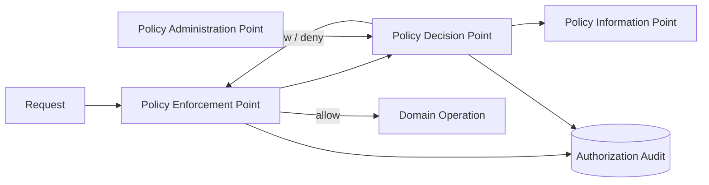
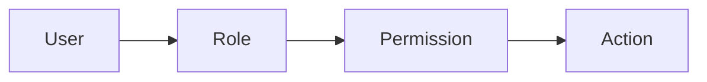
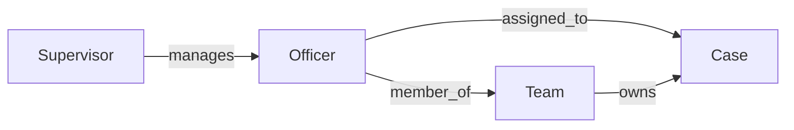

------
title: Learn Java Patterns - Part 026
description: Security and authorization patterns for advanced Java systems: RBAC, ABAC, ReBAC, policy objects, PDP/PEP/PIP/PAP, tenant boundary, ownership guard, capability pattern, auditability, workflow authorization, testing, and anti-patterns.
series: learn-java-patterns
seriesTitle: Learn Java Patterns, Data Patterns, Pipeline Patterns, Concurrency Patterns, Common Patterns, and Anti-Patterns
order: 26
partTitle: Security and Authorization Patterns
tags:
- java
- patterns
- security
- authorization
- access-control
- architecture
- advanced-java
date: 2026-06-27
------

# Part 026 — Security and Authorization Patterns

> Goal: design authorization as a first-class domain and platform concern, not as scattered `if role == admin` checks.

Security is too broad for one part. This part focuses on **authorization patterns**: deciding whether an actor may perform an operation on a resource in a context.

Authentication answers:

> Who are you?

Authorization answers:

> Given who you are, this resource, this action, this tenant, this state, this time, and this policy version, are you allowed?

A top-tier engineer treats authorization as an invariant-bearing subsystem. It must be testable, observable, auditable, and hard to bypass.

---

## 1. Kaufman Skill Map

### 1.1 Target performance level

After this part, you should be able to:

1. distinguish authentication, authorization, entitlement, permission, role, policy, and ownership;
2. choose RBAC, ABAC, ReBAC, ACL, capability, or hybrid patterns intentionally;
3. place authorization checks at API, application service, domain, query, and data boundaries;
4. design tenant isolation and ownership checks that resist IDOR-style failures;
5. build Java policy objects and permission evaluators;
6. audit authorization decisions with enough evidence for forensic review;
7. test negative authorization paths systematically;
8. identify security anti-patterns before they become production incidents.

### 1.2 Sub-skills

| Sub-skill | What you practice | Failure if ignored |
|---|---|---|
| Access decision modeling | actor + action + resource + context | role-string sprawl |
| Deny-by-default design | make absence of allow fail closed | accidental open access |
| Policy placement | decide where checks belong | bypassable rules |
| Tenant isolation | enforce data partition boundaries | cross-tenant data exposure |
| Ownership checks | verify subject-resource relationship | IDOR vulnerabilities |
| Audit evidence | record why decision happened | non-defensible enforcement |
| Negative testing | prove forbidden paths fail | happy-path-only security |
| Policy evolution | version rules over time | unexplainable historical decisions |

### 1.3 Practice loop

For every protected operation:

```text
1. Name the actor.
2. Name the action.
3. Name the resource.
4. Name the tenant or jurisdiction.
5. Name the resource state.
6. Name the relationship between actor and resource.
7. Name the policy rule.
8. Name the fallback when attributes are missing.
9. Name the audit record.
10. Write allow and deny tests.
```

---

## 2. Mental Model: Authorization Is a Decision Function

A useful abstraction:

```text
Decision = f(actor, action, resource, context, policy)
```

Where:

- **actor**: user, service account, system process, delegated actor;
- **action**: read, create, approve, escalate, export, assign, close;
- **resource**: case, document, tenant, task, report, workflow transition;
- **context**: tenant, time, network, risk level, case state, jurisdiction;
- **policy**: rule set, role mapping, attribute rule, relationship rule.



Terms:

- **PEP**: place that enforces the decision, such as API filter, application service, repository guard.
- **PDP**: component that evaluates policy and returns allow/deny.
- **PIP**: source of attributes, such as user directory, case assignment, tenant metadata.
- **PAP**: where policy is authored or administered.

Even if you do not build formal XACML-style infrastructure, this mental model helps separate responsibilities.

---

## 3. Non-Negotiable Authorization Invariants

### 3.1 Deny by default

If policy cannot prove access is allowed, deny.

Bad:

```java
boolean allowed = true;
if (caseRecord.isSensitive()) {
    allowed = actor.hasRole("SENSITIVE_CASE_REVIEWER");
}
```

Better:

```java
Decision decision = policy.evaluate(actor, action, resource, context);
if (decision.isDenied()) {
    throw new ForbiddenActionException(decision.safeReason());
}
```

### 3.2 Validate every request

Do not rely on:

- hidden UI buttons;
- previous page loads;
- frontend route guards;
- gateway-only checks;
- client-provided roles;
- object IDs that are hard to guess.

Every state-changing operation must enforce authorization server-side.

### 3.3 Least privilege

Grant only the permission needed for the task.

A role named `CASE_ADMIN` that can read, assign, approve, close, export, delete, and override policy is not a role. It is a blast radius multiplier.

### 3.4 Fail closed on missing attributes

If a policy needs `case.tenantId` and it cannot be loaded, do not default to allow.

```java
if (resource.tenantId().isEmpty()) {
    return Decision.deny("missing_tenant_attribute");
}
```

### 3.5 Authorization must be auditable

For regulated systems, "403" is not enough. You need to know:

- actor;
- action;
- resource;
- tenant;
- policy version;
- decision;
- reason code;
- relevant attributes;
- timestamp;
- correlation ID.

---

## 4. Pattern: RBAC — Role-Based Access Control

### 4.1 Problem

You need a simple way to group permissions by job function.

### 4.2 Mental model

RBAC says:

> Users have roles. Roles grant permissions. Permissions allow actions.



### 4.3 Java model

```java
public enum Permission {
    CASE_READ,
    CASE_ASSIGN,
    CASE_APPROVE,
    CASE_ESCALATE,
    CASE_CLOSE,
    DOCUMENT_EXPORT
}

public record Role(String name, Set<Permission> permissions) {}

public record Actor(
    ActorId id,
    TenantId tenantId,
    Set<Role> roles
) {
    public boolean hasPermission(Permission permission) {
        return roles.stream().anyMatch(role -> role.permissions().contains(permission));
    }
}
```

### 4.4 RBAC use case

RBAC works well for coarse-grained access:

- can access officer dashboard;
- can create case;
- can view assigned tasks;
- can administer reference data;
- can export reports.

### 4.5 RBAC failure mode: role explosion

When rules become contextual, RBAC alone becomes messy:

```text
CASE_REVIEWER_REGION_A_SENSITIVE_TIER_2_ACTING_MANAGER_TEMPORARY
```

This indicates missing attributes or relationships.

### 4.6 RBAC rule of thumb

Use RBAC for **job capability**, not for every contextual condition.

Good:

```text
Role: Case Reviewer
Permission: CASE_REVIEW
```

Then combine with ABAC/ReBAC:

```text
Only if case.region == actor.region
Only if case.sensitivity <= actor.clearance
Only if actor is assigned to case or supervisor of assigned officer
```

---

## 5. Pattern: ABAC — Attribute-Based Access Control

### 5.1 Problem

Access depends on attributes of actor, resource, action, and environment.

Examples:

- officer region must match case region;
- clearance level must be high enough;
- case sensitivity controls access;
- action allowed only during business hours;
- jurisdiction determines eligible users;
- tenant feature flag enables operation.

### 5.2 Mental model

ABAC says:

> Evaluate attributes, not just roles.

```java
public record AuthorizationContext(
    Actor actor,
    Action action,
    ResourceDescriptor resource,
    EnvironmentContext environment
) {}

public record ResourceDescriptor(
    ResourceType type,
    ResourceId id,
    TenantId tenantId,
    Map<String, Object> attributes
) {}
```

### 5.3 Policy example

```java
public final class RegionalCaseReadPolicy implements AuthorizationPolicy {
    @Override
    public Decision evaluate(AuthorizationContext ctx) {
        if (!ctx.actor().hasPermission(Permission.CASE_READ)) {
            return Decision.deny("missing_permission_case_read");
        }

        String actorRegion = ctx.actor().attribute("region");
        String caseRegion = ctx.resource().attribute("region");

        if (actorRegion == null || caseRegion == null) {
            return Decision.deny("missing_region_attribute");
        }

        if (!actorRegion.equals(caseRegion)) {
            return Decision.deny("region_mismatch");
        }

        return Decision.allow("regional_case_read_allowed");
    }
}
```

### 5.4 ABAC strengths

- flexible;
- expressive;
- reduces role explosion;
- fits regulated access rules;
- can incorporate environment and risk;
- easier to model jurisdiction, sensitivity, and clearance.

### 5.5 ABAC failure modes

| Failure | Symptom | Fix |
|---|---|---|
| Attribute soup | no one knows required attributes | define policy schema |
| Missing attribute allows access | fail-open behavior | deny on missing required attributes |
| Inconsistent attribute source | different services evaluate differently | centralize PIP or attribute contract |
| Hard-to-debug decisions | no reason code | return structured decision evidence |
| Policy drift | rules copied across services | centralize policy modules or shared library |

---

## 6. Pattern: ReBAC — Relationship-Based Access Control

### 6.1 Problem

Access depends on relationships:

- assigned officer can view case;
- supervisor can view subordinate's case;
- document owner can update document;
- investigator assigned to team can see team cases;
- delegate can act on behalf of another actor.

### 6.2 Mental model

ReBAC says:

> Access follows graph relationships.



### 6.3 Java example

```java
public interface RelationshipService {
    boolean isAssignedToCase(ActorId actorId, CaseId caseId);
    boolean supervises(ActorId supervisorId, ActorId officerId);
    boolean isMemberOfTeam(ActorId actorId, TeamId teamId);
}

public final class AssignedCasePolicy implements AuthorizationPolicy {
    private final RelationshipService relationships;

    public AssignedCasePolicy(RelationshipService relationships) {
        this.relationships = relationships;
    }

    @Override
    public Decision evaluate(AuthorizationContext ctx) {
        CaseId caseId = new CaseId(ctx.resource().id().value());

        if (relationships.isAssignedToCase(ctx.actor().id(), caseId)) {
            return Decision.allow("actor_assigned_to_case");
        }

        return Decision.deny("actor_not_assigned_to_case");
    }
}
```

### 6.4 ReBAC cautions

Relationship checks can be expensive and dynamic.

Watch for:

- graph traversal depth;
- stale relationship cache;
- circular delegation;
- ambiguous ownership;
- historical vs current assignment;
- cross-tenant relationship bugs.

---

## 7. Pattern: ACL — Access Control List

### 7.1 Problem

Some resources have explicit per-resource grants.

Example:

```text
Document DOC-123:
- user alice: READ
- user bob: READ, UPDATE
- team enforcement-a: READ
```

### 7.2 Java shape

```java
public record AclEntry(
    PrincipalRef principal,
    Set<Permission> permissions,
    Instant grantedAt,
    ActorId grantedBy
) {}

public interface AclRepository {
    List<AclEntry> entriesFor(ResourceId resourceId);
}
```

### 7.3 When ACL fits

Use ACL when:

- resource sharing is explicit;
- grants differ per resource;
- users can delegate access;
- document-level permissions matter;
- ad hoc collaboration is required.

### 7.4 ACL failure modes

| Failure | Cause | Fix |
|---|---|---|
| ACL sprawl | too many per-resource entries | combine with groups/roles |
| Orphan grants | user/team deleted | lifecycle cleanup |
| Invisible inherited access | parent grants unclear | explain decision evidence |
| Cross-tenant grant | principal and resource tenant mismatch | enforce tenant invariant at grant time |

---

## 8. Pattern: Capability / Token-Based Authorization

### 8.1 Problem

Sometimes access should be represented by possession of a specific capability.

Examples:

- password reset link;
- one-time document upload link;
- temporary delegated approval token;
- signed download URL;
- service-to-service scoped token.

### 8.2 Mental model

A capability says:

> Possession of this unforgeable token grants this specific action on this specific resource under constraints.

### 8.3 Capability record

```java
public record Capability(
    CapabilityId id,
    ResourceId resourceId,
    Action action,
    TenantId tenantId,
    Instant expiresAt,
    Optional<ActorId> boundActor,
    Set<String> constraints
) {}
```

### 8.4 Validation

```java
public final class CapabilityPolicy {
    public Decision evaluate(Capability capability, Actor actor, Action action, ResourceId resourceId, Instant now) {
        if (now.isAfter(capability.expiresAt())) {
            return Decision.deny("capability_expired");
        }
        if (!capability.resourceId().equals(resourceId)) {
            return Decision.deny("capability_resource_mismatch");
        }
        if (!capability.action().equals(action)) {
            return Decision.deny("capability_action_mismatch");
        }
        if (capability.boundActor().isPresent() && !capability.boundActor().get().equals(actor.id())) {
            return Decision.deny("capability_actor_mismatch");
        }
        return Decision.allow("capability_valid");
    }
}
```

### 8.5 Capability rules

1. Capabilities must be hard to guess.
2. Use expiration.
3. Scope narrowly.
4. Bind to actor when possible.
5. Log use.
6. Support revocation if risk requires it.
7. Never put broad admin capability into a bearer token without constraints.

---

## 9. Pattern: Policy Object

### 9.1 Problem

Authorization logic scattered across controllers and services becomes inconsistent.

### 9.2 Mental model

Policy Object turns authorization into explicit, testable code.

```java
public interface AuthorizationPolicy {
    Decision evaluate(AuthorizationContext context);
}

public sealed interface Decision permits Allow, Deny {
    boolean allowed();
    String reasonCode();

    static Decision allow(String reasonCode) {
        return new Allow(reasonCode);
    }

    static Decision deny(String reasonCode) {
        return new Deny(reasonCode);
    }
}

public record Allow(String reasonCode) implements Decision {
    @Override public boolean allowed() { return true; }
}

public record Deny(String reasonCode) implements Decision {
    @Override public boolean allowed() { return false; }
}
```

### 9.3 Composite policy

```java
public final class AllOfPolicy implements AuthorizationPolicy {
    private final List<AuthorizationPolicy> policies;

    public AllOfPolicy(List<AuthorizationPolicy> policies) {
        this.policies = List.copyOf(policies);
    }

    @Override
    public Decision evaluate(AuthorizationContext context) {
        for (AuthorizationPolicy policy : policies) {
            Decision decision = policy.evaluate(context);
            if (!decision.allowed()) {
                return decision;
            }
        }
        return Decision.allow("all_policies_allowed");
    }
}
```

### 9.4 Example: approve case policy

```java
public final class ApproveCasePolicy implements AuthorizationPolicy {
    @Override
    public Decision evaluate(AuthorizationContext ctx) {
        if (!ctx.actor().hasPermission(Permission.CASE_APPROVE)) {
            return Decision.deny("missing_case_approve_permission");
        }

        String status = ctx.resource().attribute("status");
        if (!"IN_REVIEW".equals(status)) {
            return Decision.deny("case_not_in_review");
        }

        String actorRegion = ctx.actor().attribute("region");
        String caseRegion = ctx.resource().attribute("region");
        if (!Objects.equals(actorRegion, caseRegion)) {
            return Decision.deny("region_mismatch");
        }

        return Decision.allow("approve_case_allowed");
    }
}
```

### 9.5 Why this matters

Policy objects are:

- unit-testable;
- composable;
- auditable;
- easier to review;
- less likely to be bypassed accidentally;
- easier to migrate to an external policy engine later.

---

## 10. Pattern: Policy Enforcement Point in Application Service

### 10.1 Problem

Endpoint filters can check coarse roles, but domain operations need resource-specific decisions.

### 10.2 Application service enforcement

```java
public final class ApproveCaseUseCase {
    private final CaseRepository cases;
    private final AuthorizationService authorization;
    private final CaseAudit audit;

    public ApproveCaseResult handle(ApproveCaseCommand command) {
        CaseRecord caseRecord = cases.get(command.caseId());

        AuthorizationContext context = AuthorizationContext.forResource(
            command.actor(),
            Action.APPROVE_CASE,
            ResourceDescriptor.from(caseRecord)
        );

        Decision decision = authorization.evaluate(context);
        audit.authorizationDecision(context, decision);

        if (!decision.allowed()) {
            throw new ForbiddenActionException(decision.reasonCode());
        }

        caseRecord.approve(command.reason(), command.actor().id());
        cases.save(caseRecord);
        return ApproveCaseResult.from(caseRecord);
    }
}
```

### 10.3 Why application service is often the right PEP

It has access to:

- actor;
- command;
- loaded resource;
- transaction boundary;
- audit boundary;
- domain operation.

Endpoint-level authorization alone often lacks resource state.

---

## 11. Pattern: Domain Guard

### 11.1 Problem

Some invariants are so central that even internal callers should not bypass them.

### 11.2 Domain-level guard

```java
public final class EnforcementCase {
    private CaseStatus status;
    private OfficerId assignedOfficer;

    public void approve(ActorId actorId, ApprovalReason reason, CasePermission permission) {
        if (!permission.canApprove()) {
            throw new ForbiddenDomainOperation("actor_cannot_approve_case");
        }
        if (status != CaseStatus.IN_REVIEW) {
            throw new InvalidTransitionException(status, CaseStatus.APPROVED);
        }
        this.status = CaseStatus.APPROVED;
    }
}
```

### 11.3 Caution

Do not pass a giant `Actor` object into every entity casually. Domain guard works best when permission is reduced to a domain-relevant capability object:

```java
public record CasePermission(
    boolean canRead,
    boolean canApprove,
    boolean canEscalate,
    boolean canClose
) {}
```

This keeps the entity from depending on identity infrastructure.

---

## 12. Pattern: Ownership Guard

### 12.1 Problem

A user can guess or modify an object ID and access another user's resource.

This class of bug is often called insecure direct object reference or broken object-level authorization.

### 12.2 Bad code

```java
public DocumentResponse getDocument(String documentId) {
    Document document = documents.get(new DocumentId(documentId));
    return mapper.toResponse(document);
}
```

This checks only that the document exists.

### 12.3 Better code

```java
public DocumentResponse getDocument(Actor actor, String documentId) {
    Document document = documents.get(new DocumentId(documentId));

    Decision decision = authorization.evaluate(
        AuthorizationContext.forResource(
            actor,
            Action.READ_DOCUMENT,
            ResourceDescriptor.from(document)
        )
    );

    if (!decision.allowed()) {
        throw new NotFoundOrForbiddenException();
    }

    return mapper.toResponse(document);
}
```

### 12.4 Query-level ownership

For list endpoints, do not load all rows then filter in memory.

Bad:

```java
List<CaseRecord> all = caseRepository.findAll();
return all.stream()
    .filter(caseRecord -> authorization.canRead(actor, caseRecord))
    .map(mapper::toResponse)
    .toList();
```

Better:

```java
public interface CaseQueryRepository {
    Page<CaseSearchItem> searchVisibleCases(Actor actor, CaseSearchCriteria criteria, PageCursor cursor);
}
```

Authorization constraints should be pushed into the query where possible.

---

## 13. Pattern: Tenant Boundary

### 13.1 Problem

Multi-tenant systems must prevent cross-tenant access.

Tenant isolation is not just a filter. It is an architectural invariant.

### 13.2 Tenant context

```java
public record TenantContext(
    TenantId tenantId,
    TenantIsolationMode isolationMode
) {}
```

### 13.3 Tenant enforcement points

| Layer | Enforcement |
|---|---|
| API gateway | require tenant header/subdomain/token claim |
| authentication | bind actor to allowed tenants |
| application service | verify requested tenant is allowed |
| repository | include tenant predicate in queries |
| database | tenant column constraints, schema/db isolation, row-level security where used |
| messaging | tenant in event envelope |
| cache | tenant in cache key |
| logs/audit | tenant in every record |

### 13.4 Tenant-safe repository

```java
public interface TenantScopedCaseRepository {
    Optional<CaseRecord> findById(TenantId tenantId, CaseId caseId);
}
```

Avoid repository methods that do not require tenant context in multi-tenant code:

```java
Optional<CaseRecord> findById(CaseId caseId); // dangerous in tenant-scoped domain
```

### 13.5 Cache bug

Bad cache key:

```java
String key = "case:" + caseId.value();
```

Better:

```java
String key = "tenant:" + tenantId.value() + ":case:" + caseId.value();
```

Tenant must be part of derived data identity.

---

## 14. Pattern: Authorization Decision Record

### 14.1 Problem

When access is challenged later, you need evidence.

### 14.2 Decision record

```java
public record AuthorizationDecisionRecord(
    CorrelationId correlationId,
    Instant decidedAt,
    ActorId actorId,
    TenantId tenantId,
    Action action,
    ResourceType resourceType,
    ResourceId resourceId,
    boolean allowed,
    String reasonCode,
    String policyVersion,
    Map<String, String> evidence
) {}
```

### 14.3 Evidence examples

```json
{
  "actorRegion": "WEST",
  "caseRegion": "WEST",
  "caseStatus": "IN_REVIEW",
  "permission": "CASE_APPROVE",
  "policyVersion": "case-approval-v4"
}
```

### 14.4 Audit caution

Do not log sensitive values unnecessarily. Evidence should be enough to explain the decision without creating a new data leak.

---

## 15. Pattern: Permission Matrix

### 15.1 Problem

Complex systems hide access rules across code, tickets, and tribal knowledge.

### 15.2 Matrix example

| Action | Case status | Role/permission | Relationship | Result |
|---|---|---|---|---|
| Read case | any non-sealed | CASE_READ | same region or assigned | allow |
| Approve case | IN_REVIEW | CASE_APPROVE | same region and not submitter | allow |
| Close case | APPROVED | CASE_CLOSE | supervisor | allow |
| Export document | any | DOCUMENT_EXPORT | tenant match | allow |
| Delete case | any | none | none | deny |

### 15.3 Test generation

A matrix can drive tests:

```java
@ParameterizedTest
@MethodSource("approvalCases")
void approveCasePolicyMatchesMatrix(PolicyFixture fixture, boolean expectedAllowed) {
    Decision decision = approveCasePolicy.evaluate(fixture.context());
    assertThat(decision.allowed()).isEqualTo(expectedAllowed);
}
```

### 15.4 Matrix benefits

- easier review with product/legal/security;
- easier negative testing;
- explicit edge cases;
- documentation close to code;
- less reliance on role names as behavior.

---

## 16. Pattern: Workflow Authorization

### 16.1 Problem

Workflow systems combine state, role, assignment, timing, and action.

Authorization cannot be independent of workflow state.

### 16.2 Example

```java
public final class WorkflowActionPolicy {
    public Decision canPerform(Actor actor, CaseRecord caseRecord, CaseAction action) {
        if (!actor.tenantId().equals(caseRecord.tenantId())) {
            return Decision.deny("tenant_mismatch");
        }

        if (!caseRecord.availableActions().contains(action)) {
            return Decision.deny("action_not_available_in_state");
        }

        return switch (action) {
            case APPROVE -> canApprove(actor, caseRecord);
            case ESCALATE -> canEscalate(actor, caseRecord);
            case CLOSE -> canClose(actor, caseRecord);
            case REQUEST_INFO -> canRequestInfo(actor, caseRecord);
        };
    }
}
```

### 16.3 Available actions response

```java
public record CaseDetailResponse(
    String caseId,
    String status,
    List<ActionDescriptor> availableActions
) {}
```

The same policy used to enforce action should generate available actions.

### 16.4 Avoid split-brain policy

Bad:

- frontend computes available buttons;
- BFF computes available buttons differently;
- backend action endpoint checks only role.

Better:

- one policy computes allowed actions;
- response exposes affordances;
- command endpoint re-checks policy at execution time.

---

## 17. Pattern: Delegation and Acting-On-Behalf-Of

### 17.1 Problem

Users sometimes act for another user, team, or role.

Examples:

- assistant submits report for supervisor;
- temporary delegate approves routine tasks;
- service account performs scheduled action for tenant;
- support engineer accesses account under approved session.

### 17.2 Model explicitly

```java
public record Actor(
    ActorId effectiveActorId,
    Optional<ActorId> originalActorId,
    Set<Permission> permissions,
    TenantId tenantId,
    ActorMode mode
) {}

public enum ActorMode {
    SELF,
    DELEGATED,
    SUPPORT,
    SERVICE_ACCOUNT
}
```

### 17.3 Delegation rules

1. Delegation must have scope.
2. Delegation must expire.
3. Delegation must be auditable.
4. Original actor must be retained.
5. Some actions must be non-delegable.
6. Delegation cannot cross tenant unless explicitly designed.

### 17.4 Anti-pattern

```java
actor = supervisor; // overwrite original actor
```

This destroys auditability.

Better:

```java
Actor delegated = Actor.delegated(originalActor, effectiveActor, delegationGrant);
```

---

## 18. Pattern: Break-Glass Access

### 18.1 Problem

Emergency access may be required, but it is high risk.

### 18.2 Model

Break-glass access should be:

- explicit;
- time-limited;
- reason-required;
- heavily audited;
- alert-triggering;
- reviewed after use;
- unavailable for some operations.

### 18.3 Java shape

```java
public record BreakGlassContext(
    String reason,
    Instant expiresAt,
    ApprovalId approvalId
) {}

public final class BreakGlassPolicy implements AuthorizationPolicy {
    @Override
    public Decision evaluate(AuthorizationContext ctx) {
        BreakGlassContext bg = ctx.environment().breakGlass().orElse(null);
        if (bg == null) {
            return Decision.deny("no_break_glass_context");
        }
        if (Instant.now().isAfter(bg.expiresAt())) {
            return Decision.deny("break_glass_expired");
        }
        return Decision.allow("break_glass_allowed_with_audit");
    }
}
```

### 18.4 Warning

Break-glass is not a replacement for normal authorization. It is an exception path with governance.

---

## 19. Pattern: Service-to-Service Authorization

### 19.1 Problem

Internal services also need authorization. Network location is not permission.

### 19.2 Questions

For every service call:

- Which service is calling?
- Is it acting as itself or on behalf of a user?
- Which tenant is in scope?
- Which action is requested?
- Is the target resource allowed?
- What scopes/claims are required?

### 19.3 Service principal

```java
public record ServicePrincipal(
    String serviceName,
    Set<String> scopes,
    Optional<ActorId> onBehalfOf,
    TenantId tenantId
) {}
```

### 19.4 Common mistake

```java
if (request.isInternal()) {
    allow();
}
```

Internal traffic can be compromised, misconfigured, or accidentally overpowered.

---

## 20. Pattern: Authorization Cache

### 20.1 Problem

Authorization decisions can be expensive.

### 20.2 Caution

Caching authorization is dangerous because permissions change.

Cache only when:

- decision is low-risk;
- TTL is short;
- invalidation path exists;
- tenant/resource/action/actor are in key;
- policy version is in key;
- deny/allow semantics are understood.

### 20.3 Cache key

```java
public record AuthorizationCacheKey(
    ActorId actorId,
    TenantId tenantId,
    Action action,
    ResourceType resourceType,
    ResourceId resourceId,
    String resourceVersion,
    String policyVersion
) {}
```

### 20.4 Never cache this casually

- break-glass decisions;
- highly sensitive resource access;
- delegated access near expiration;
- rapidly changing assignment;
- policy under incident response.

---

## 21. Pattern: Data-Level Authorization

### 21.1 Problem

Application checks can be bypassed by new queries, reports, exports, or admin tools.

### 21.2 Strategies

| Strategy | Example | Pros | Cons |
|---|---|---|---|
| repository predicate | `WHERE tenant_id = ?` | explicit, portable | easy to forget |
| tenant-scoped repository API | requires tenant parameter | safer interface | requires discipline |
| database row-level security | DB enforces policy | strong defense | DB-specific complexity |
| separate schema/db per tenant | isolation | strong blast-radius control | operational cost |
| projection per actor/team | fast reads | good UX | staleness complexity |

### 21.3 Repository guard pattern

```java
public final class AuthorizedCaseQueries {
    private final CaseQueryRepository repository;
    private final CaseVisibility visibility;

    public Page<CaseSearchItem> search(Actor actor, CaseSearchCriteria criteria, PageCursor cursor) {
        CaseVisibilityPredicate predicate = visibility.predicateFor(actor);
        return repository.search(criteria, predicate, cursor);
    }
}
```

The repository receives a visibility predicate instead of relying on caller memory.

---

## 22. Testing Authorization

### 22.1 Test categories

| Test type | Purpose |
|---|---|
| policy unit test | verify rule logic |
| matrix test | cover role/state/action combinations |
| negative API test | prove forbidden endpoints fail |
| query authorization test | prove unauthorized rows are absent |
| tenant isolation test | prove cross-tenant IDs fail |
| mutation test | catch missing checks |
| audit test | prove decision record emitted |
| regression test | freeze prior vulnerability fix |

### 22.2 Example policy test

```java
class ApproveCasePolicyTest {
    @Test
    void deniesWhenActorLacksApprovePermission() {
        AuthorizationContext ctx = fixture()
            .actorWithout(Permission.CASE_APPROVE)
            .caseStatus("IN_REVIEW")
            .sameRegion()
            .build();

        Decision decision = policy.evaluate(ctx);

        assertThat(decision.allowed()).isFalse();
        assertThat(decision.reasonCode()).isEqualTo("missing_case_approve_permission");
    }

    @Test
    void deniesWhenCaseIsClosed() {
        AuthorizationContext ctx = fixture()
            .actorWith(Permission.CASE_APPROVE)
            .caseStatus("CLOSED")
            .sameRegion()
            .build();

        Decision decision = policy.evaluate(ctx);

        assertThat(decision.allowed()).isFalse();
        assertThat(decision.reasonCode()).isEqualTo("case_not_in_review");
    }
}
```

### 22.3 Tenant isolation test

```java
@Test
void cannotReadCaseFromAnotherTenantEvenWhenCaseIdIsKnown() {
    Actor actor = actorInTenant("tenant-a");
    CaseId caseId = createCaseInTenant("tenant-b");

    assertThatThrownBy(() -> api.getCase(actor, caseId.value()))
        .isInstanceOf(NotFoundOrForbiddenException.class);
}
```

### 22.4 Authorization mutation mindset

Ask:

- What test fails if I remove this authorization check?
- What test fails if I remove tenant predicate?
- What test fails if I change deny to allow on missing attribute?
- What test fails if a user changes resource ID in URL?
- What test fails if frontend hides button but API is called directly?

If no test fails, you do not have authorization coverage.

---

## 23. Observability for Authorization

### 23.1 Metrics

Track:

- decision count by action/resource/result;
- deny reason count;
- missing attribute count;
- policy evaluation latency;
- cross-tenant access attempts;
- break-glass use;
- admin override use;
- cache hit/miss for authorization cache.

### 23.2 Logs

Authorization logs should be structured:

```json
{
  "event": "authorization_decision",
  "correlationId": "c-123",
  "actorId": "u-456",
  "tenantId": "t-001",
  "action": "APPROVE_CASE",
  "resourceType": "CASE",
  "resourceId": "CASE-789",
  "allowed": false,
  "reasonCode": "region_mismatch",
  "policyVersion": "case-approval-v4"
}
```

### 23.3 Alert candidates

- sudden spike in forbidden access;
- repeated cross-tenant access attempts;
- break-glass activation;
- high number of missing attributes;
- authorization service unavailable;
- policy evaluation timing out.

---

## 24. Common Authorization Anti-Patterns

### 24.1 UI-Only Authorization

Symptom:

- button hidden in UI, but endpoint still works.

Fix:

- enforce at server endpoint/application service;
- generate UI affordances from same policy.

### 24.2 Endpoint-Only Role Check

Symptom:

```java
@PreAuthorize("hasRole('CASE_REVIEWER')")
public CaseResponse getCase(String id) { ... }
```

This checks role but not resource ownership, tenant, sensitivity, or state.

Fix:

- role check can be coarse gate;
- resource-specific policy still required.

### 24.3 God Admin

Symptom:

- one role bypasses every rule.

Fix:

- split permissions;
- require break-glass for exceptional access;
- audit privileged actions;
- make some operations non-overridable.

### 24.4 Role Explosion

Symptom:

- hundreds of roles encode region, level, department, workflow state, and temporary duty.

Fix:

- RBAC for job capability;
- ABAC for attributes;
- ReBAC for relationships.

### 24.5 Stringly Typed Permission Checks

Symptom:

```java
if (actor.has("approve")) { ... }
```

Fix:

```java
actor.hasPermission(Permission.CASE_APPROVE)
```

Better still: use policy objects that include resource context.

### 24.6 Hidden Allow on Error

Symptom:

```java
try {
    return policy.allowed(ctx);
} catch (Exception e) {
    return true;
}
```

Fix:

- fail closed;
- emit metric;
- return safe error.

### 24.7 Authorization After Side Effect

Symptom:

```java
caseRecord.approve(reason);
authorization.requireAllowed(actor, APPROVE_CASE, caseRecord);
```

Fix:

- authorize before side effect;
- re-check after load if state changed;
- keep transition atomic.

### 24.8 Missing Tenant in Cache Key

Symptom:

- user in tenant A sees cached result from tenant B.

Fix:

- tenant in every cache key;
- tenant in every event envelope;
- tenant in every query predicate.

---

## 25. Authorization Design Checklist

### 25.1 For every operation

- [ ] Who is the actor?
- [ ] Is actor authenticated?
- [ ] Is actor acting as self, service, delegate, or support?
- [ ] What is the action?
- [ ] What is the resource?
- [ ] What is the tenant?
- [ ] What resource state matters?
- [ ] What relationship matters?
- [ ] What permission is required?
- [ ] What attributes are required?
- [ ] What happens if attributes are missing?
- [ ] Is decision audited?
- [ ] Are deny paths tested?

### 25.2 For every query/list/export

- [ ] Are unauthorized rows excluded before pagination/export?
- [ ] Is tenant predicate mandatory?
- [ ] Are filters safe?
- [ ] Are aggregate counts permission-aware?
- [ ] Is export permission stronger than view permission?
- [ ] Is bulk access audited?

### 25.3 For every policy

- [ ] Is deny default?
- [ ] Is reason code stable?
- [ ] Is policy versioned?
- [ ] Is policy independently testable?
- [ ] Are missing attributes denied?
- [ ] Is policy duplicated elsewhere?

### 25.4 For every admin path

- [ ] Is privilege split?
- [ ] Is break-glass explicit?
- [ ] Is reason required?
- [ ] Is use alerted?
- [ ] Is review possible?

---

## 26. Practice Drill

Design authorization for this system:

> A regulatory case-management platform where officers review assigned cases, supervisors can reassign cases in their region, investigators can upload evidence, legal reviewers can approve enforcement recommendations, and support staff can access cases only through break-glass approval.

Produce:

1. actor model;
2. role/permission set;
3. ABAC attributes;
4. ReBAC relationships;
5. tenant boundary rules;
6. policy object for `APPROVE_ENFORCEMENT_RECOMMENDATION`;
7. query visibility rule for case search;
8. break-glass model;
9. audit record;
10. negative test matrix.

Then answer:

- Which rules are pure RBAC?
- Which rules require ABAC?
- Which rules require ReBAC?
- Which operations should never be delegated?
- Which actions require stronger audit?
- What happens if assignment changes while a user has the case open?
- How do you prevent cross-tenant cache leakage?

---

## 27. Summary

Authorization is not a decorator on endpoints. It is a decision system.

Key takeaways:

1. Authorization is `actor + action + resource + context + policy`.
2. Deny by default.
3. Validate permissions on every request.
4. RBAC is useful but insufficient for contextual systems.
5. ABAC handles attributes like region, clearance, tenant, and sensitivity.
6. ReBAC handles relationships like assignment, ownership, supervision, and delegation.
7. Policy Objects make authorization testable and reviewable.
8. Tenant isolation must exist at API, application, repository, cache, event, and audit boundaries.
9. Authorization decisions need reason codes and audit evidence.
10. Negative tests are as important as happy-path tests.

A strong authorization design makes illegal states hard to represent and unauthorized behavior hard to execute.

---

## References

- OWASP Authorization Cheat Sheet: https://cheatsheetseries.owasp.org/cheatsheets/Authorization_Cheat_Sheet.html
- OWASP Top 10 — Broken Access Control: https://owasp.org/Top10/2021/A01_2021-Broken_Access_Control/
- NIST SP 800-162 — Guide to Attribute Based Access Control: https://csrc.nist.gov/pubs/sp/800/162/upd2/final
- NIST SP 800-53 — Security and Privacy Controls: https://csrc.nist.gov/publications/detail/sp/800-53/rev-5/final
- OAuth 2.0 Security Best Current Practice: https://datatracker.ietf.org/doc/html/draft-ietf-oauth-security-topics
- Spring Security Authorization Architecture: https://docs.spring.io/spring-security/reference/servlet/authorization/architecture.html
