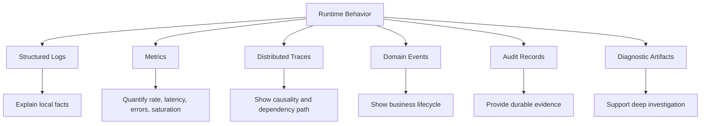
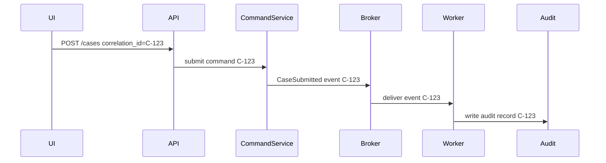
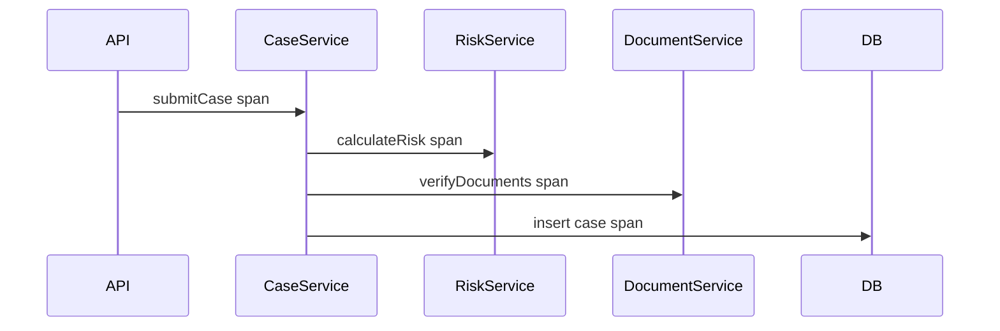
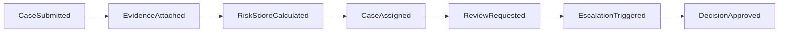

------
title: Learn Java Patterns - Part 027
description: Observability and diagnostics patterns for advanced Java systems: telemetry contract, structured logs, metrics, traces, correlation, causality, forensic timelines, workflow diagnostics, signal quality, cardinality control, and production debugging.
series: learn-java-patterns
seriesTitle: Learn Java Patterns, Data Patterns, Pipeline Patterns, Concurrency Patterns, Common Patterns, and Anti-Patterns
order: 27
partTitle: Observability and Diagnostics Patterns
tags:
- java
- patterns
- observability
- diagnostics
- opentelemetry
- logging
- metrics
- tracing
- architecture
- advanced-java
date: 2026-06-27
------

# Part 027 — Observability and Diagnostics Patterns

> Goal: design systems that explain their own behavior under failure, latency, contention, data inconsistency, authorization denial, and workflow escalation.

Observability is often misunderstood as “we have logs, metrics, and dashboards.” That is not enough.

A top-tier engineer asks a sharper question:

> When the system behaves incorrectly, can we reconstruct **what happened, why it happened, who/what caused it, which boundary made the decision, and what invariant was protected or violated**?

This part treats observability as a set of design patterns. These patterns make runtime behavior explainable.

Observability is not only an operations concern. It changes API design, workflow modeling, event envelopes, cache policy, retry behavior, authorization, and transaction boundaries.

---

## 1. Kaufman Skill Map

### 1.1 Target performance level

After this part, you should be able to:

1. define a telemetry contract for a Java service;
2. distinguish logs, metrics, traces, events, audits, and diagnostics;
3. propagate correlation context across HTTP, messaging, async tasks, and virtual threads;
4. design low-cardinality metrics that answer useful questions;
5. create structured logs that are queryable without leaking sensitive data;
6. use traces to understand latency, dependency behavior, and causality;
7. build domain-level timelines for workflows and case management;
8. diagnose retries, dead letters, stuck workflows, cache inconsistencies, and authorization denials;
9. avoid dashboard theater, cardinality explosions, and noisy alerts;
10. design evidence packages for incident review and regulatory defensibility.

### 1.2 Sub-skills

| Sub-skill | What you practice | Failure if ignored |
|---|---|---|
| Signal modeling | decide what each signal is for | duplicate noisy telemetry |
| Correlation | connect events across boundaries | impossible incident reconstruction |
| Structured logging | emit queryable facts | grep-driven debugging |
| Metric design | measure rate, latency, errors, saturation | dashboards that do not answer questions |
| Trace design | model causality and dependency latency | blind distributed calls |
| Cardinality control | keep dimensions bounded | monitoring cost explosion |
| Sensitive-data discipline | prevent secret/PII leaks | security and compliance incidents |
| Workflow diagnostics | explain lifecycle movement | unresolved case-state mysteries |
| Failure taxonomy | classify errors consistently | retry storms and ambiguous alerts |
| Forensic reconstruction | reconstruct timelines after failure | weak postmortems and weak auditability |

### 1.3 Practice loop

For every operation, ask:

```text
1. What is the operation name?
2. What is the resource or aggregate?
3. What is the correlation ID?
4. What is the actor or system principal?
5. What state transition, command, event, or query occurred?
6. Which dependency was called?
7. What was the latency budget?
8. What decision was made?
9. What invariant was protected?
10. What evidence will exist after the fact?
```

Observability skill improves when you repeatedly inspect your own design and ask: “Could an on-call engineer answer this at 03:00 without reading the source code?”

---

## 2. Mental Model: Observability Is Runtime Explainability

Monitoring asks:

> Is the system healthy?

Observability asks:

> Why is the system behaving this way?

Diagnostics asks:

> How do we isolate the failing component, input, state, or decision?

Audit asks:

> What happened, who did it, under which policy/version/time, and can we defend the record?

These overlap, but they are not the same.



A good system does not emit random telemetry. It emits **runtime evidence** aligned with engineering questions.

---

## 3. Signal Taxonomy

### 3.1 Logs

A log is an append-only diagnostic statement. In modern systems, logs should usually be structured events, not free-text prose.

Good logs answer:

- what happened;
- where it happened;
- which entity was involved;
- which correlation/request/trace was involved;
- what decision was made;
- what class of failure occurred;
- whether the operation succeeded, failed, retried, skipped, quarantined, or degraded.

Bad logs say:

```text
Error occurred
Something went wrong
Failed to process
Invalid request
```

Those messages are not diagnostic. They are emotional support for the code.

### 3.2 Metrics

A metric is an aggregated measurement over time.

Metrics should answer:

- is latency increasing?
- is error rate increasing?
- is throughput dropping?
- is the queue growing?
- is saturation increasing?
- are retries increasing?
- are workflows stuck?
- are dead letters increasing?

Metrics are not good at preserving individual stories. They are good at showing trends and thresholds.

### 3.3 Traces

A trace shows a causality path through distributed or asynchronous work.

A trace should answer:

- what did this request do?
- which services were called?
- where was time spent?
- which retries occurred?
- which dependency degraded?
- which branch of fan-out failed?
- did cancellation propagate?

### 3.4 Domain events

A domain event says something meaningful happened in the business domain.

Examples:

```text
CaseSubmitted
EvidenceAttached
RiskScoreCalculated
CaseAssigned
EscalationTriggered
ReviewCompleted
EnforcementActionApproved
```

Domain events are not just integration messages. They are also a source of domain timeline reconstruction.

### 3.5 Audit records

An audit record is durable evidence for accountability and defensibility.

Examples:

```text
actor=user:123
operation=APPROVE_ENFORCEMENT_ACTION
resource=case:ABC-2026-00091
policyVersion=authz-policy-2026.06.12
result=ALLOW
reason=actor has role SENIOR_REVIEWER and case state is PENDING_APPROVAL
```

Audit records should not depend on log retention. If the organization has a legal, regulatory, or governance need, audit belongs in durable storage with explicit schema and retention policy.

### 3.6 Diagnostic artifacts

Diagnostic artifacts include:

- heap dumps;
- thread dumps;
- dead-letter payloads;
- quarantine records;
- reconciliation reports;
- failed validation reports;
- replay manifests;
- incident timelines.

These artifacts are often more useful than generic logs when debugging complex failures.

---

## 4. Pattern: Telemetry Contract

### 4.1 Problem

Teams add logs and metrics ad hoc. Every service names fields differently. Some logs contain PII. Some metrics explode in cardinality. Some spans do not contain useful attributes. Incident response becomes archaeology.

### 4.2 Solution

Define a **telemetry contract**: a stable vocabulary for operation names, field names, metric names, span names, error classes, and context identifiers.

### 4.3 Contract shape

```yaml
service:
  name: case-command-service
  domain: enforcement

context_fields:
  correlation_id: string
  trace_id: string
  actor_id: string?
  tenant_id: string
  case_id: string?
  command_id: string?
  workflow_instance_id: string?
  policy_version: string?

operation_fields:
  operation: string
  outcome: SUCCESS | FAILED | REJECTED | RETRIED | SKIPPED | QUARANTINED
  error_class: string?
  latency_ms: number

sensitive_fields:
  never_log:
    - password
    - token
    - raw_document_content
    - national_id
    - full_address
```

### 4.4 Java representation

```java
public record TelemetryContext(
        String correlationId,
        String traceId,
        String tenantId,
        String actorId,
        String caseId,
        String workflowInstanceId,
        String policyVersion
) {
    public Map<String, String> logFields() {
        Map<String, String> fields = new LinkedHashMap<>();
        putIfPresent(fields, "correlation_id", correlationId);
        putIfPresent(fields, "trace_id", traceId);
        putIfPresent(fields, "tenant_id", tenantId);
        putIfPresent(fields, "actor_id", actorId);
        putIfPresent(fields, "case_id", caseId);
        putIfPresent(fields, "workflow_instance_id", workflowInstanceId);
        putIfPresent(fields, "policy_version", policyVersion);
        return Map.copyOf(fields);
    }

    private static void putIfPresent(Map<String, String> map, String key, String value) {
        if (value != null && !value.isBlank()) {
            map.put(key, value);
        }
    }
}
```

### 4.5 Forces

| Force | Implication |
|---|---|
| Standardization | makes cross-service investigation possible |
| Flexibility | services need domain-specific fields |
| Privacy | some fields must never be logged |
| Cost | high-cardinality telemetry can be expensive |
| Evolution | telemetry schemas need versioning |

### 4.6 Production checklist

```text
[ ] Every service has a stable service.name.
[ ] Every inbound request receives or creates a correlation ID.
[ ] Every log has operation and outcome.
[ ] Every failure has error_class.
[ ] Every metric has bounded labels.
[ ] Sensitive fields are explicitly blocked.
[ ] Audit fields are not dependent on best-effort logs.
[ ] The contract is tested or linted.
```

---

## 5. Pattern: Correlation Context

### 5.1 Problem

One business operation crosses HTTP calls, queue messages, asynchronous tasks, retries, and database writes. Without a shared context, every component emits isolated facts.

### 5.2 Solution

Propagate a correlation context across boundaries.



### 5.3 Correlation ID vs trace ID

| ID | Purpose | Lifetime |
|---|---|---|
| Correlation ID | business/request-level grouping | may cross many traces and async hops |
| Trace ID | distributed tracing causality tree | usually one request or one propagated trace |
| Span ID | one operation inside a trace | short-lived |
| Command ID | idempotency and command identity | domain/application-level |
| Event ID | event identity and deduplication | event-level |
| Workflow instance ID | lifecycle identity | long-lived |

Do not force one identifier to do every job.

### 5.4 Java boundary example

```java
public final class CorrelationIds {
    public static final String HEADER = "X-Correlation-Id";

    private CorrelationIds() {}

    public static String fromInboundHeader(String value) {
        if (value == null || value.isBlank()) {
            return UUID.randomUUID().toString();
        }
        if (value.length() > 128) {
            throw new IllegalArgumentException("Correlation ID is too long");
        }
        return value;
    }
}
```

### 5.5 Messaging envelope

```java
public record MessageEnvelope<T>(
        UUID eventId,
        String eventType,
        String correlationId,
        String causationId,
        String tenantId,
        Instant occurredAt,
        int schemaVersion,
        T payload
) {}
```

`correlationId` groups related work. `causationId` points to the command, event, or message that caused this message.

### 5.6 Failure modes

| Failure | Cause | Prevention |
|---|---|---|
| New ID at each hop | boundary ignores inbound context | context extraction/injection middleware |
| PII in correlation ID | user data used as identifier | generate opaque IDs |
| Correlation ID confused with idempotency key | one ID used for two semantics | separate command/event IDs |
| Lost async context | thread-local assumptions | explicit context object or supported propagation |
| Untrusted external IDs | client controls log fields | validation and normalization |

---

## 6. Pattern: Structured Log Event

### 6.1 Problem

Text logs are hard to query and compare. Humans write inconsistent messages. Important fields are buried in prose.

### 6.2 Solution

Emit logs as structured events with stable fields.

### 6.3 Example event

```json
{
  "level": "INFO",
  "service": "case-command-service",
  "operation": "case.submit",
  "outcome": "SUCCESS",
  "correlation_id": "8ec9f6d2-8c8a-4e4b-98f8-23f071a71d45",
  "tenant_id": "tenant-01",
  "actor_id": "user-778",
  "case_id": "CASE-2026-0091",
  "workflow_instance_id": "wf-4451",
  "latency_ms": 84,
  "message": "Case submitted"
}
```

### 6.4 Java log event builder

```java
public final class LogEvent {
    private final Map<String, Object> fields = new LinkedHashMap<>();

    private LogEvent(String operation) {
        fields.put("operation", operation);
    }

    public static LogEvent operation(String operation) {
        return new LogEvent(operation);
    }

    public LogEvent field(String key, Object value) {
        if (value != null) {
            fields.put(key, value);
        }
        return this;
    }

    public LogEvent context(TelemetryContext context) {
        fields.putAll(context.logFields());
        return this;
    }

    public Map<String, Object> fields() {
        return Map.copyOf(fields);
    }
}
```

Usage:

```java
log.info("case.submitted {}", LogEvent.operation("case.submit")
        .context(context)
        .field("case_id", caseId.value())
        .field("outcome", "SUCCESS")
        .field("latency_ms", elapsed.toMillis())
        .fields());
```

In real production code, prefer logging framework support for key-value fields rather than serializing maps manually.

### 6.5 Log level policy

| Level | Meaning | Example |
|---|---|---|
| TRACE | deep local debugging | parser token details |
| DEBUG | developer diagnosis | selected strategy, branch choice |
| INFO | important normal event | case submitted, workflow advanced |
| WARN | abnormal but handled | retry scheduled, stale cache used |
| ERROR | operation failed | command rejected by unexpected exception |

`ERROR` should usually mean the operation failed or a background process failed after exhausting policy. A validation rejection is often not an error; it may be `INFO` or `WARN` depending on semantics.

### 6.6 Sensitive-data discipline

Never log:

- credentials;
- session tokens;
- authorization headers;
- raw documents;
- personal identifiers unless explicitly approved and masked;
- full request/response bodies by default;
- secrets in exception messages.

Instead log stable opaque identifiers and safe classifications.

### 6.7 Anti-pattern: log exception and continue

```java
try {
    transitionCase(command);
} catch (Exception e) {
    log.error("Failed", e);
}
```

This silently converts a failed invariant into an unknown state. Either handle the error intentionally or let the boundary fail.

Better:

```java
try {
    transitionCase(command);
} catch (InvalidTransitionException e) {
    audit.denied(command, e.reason());
    throw e;
} catch (Exception e) {
    diagnostics.operationFailed("case.transition", command.caseId(), e);
    throw e;
}
```

---

## 7. Pattern: Metrics Facade

### 7.1 Problem

Business code directly depends on a specific metrics library. Metric names, tags, and labels are inconsistent. Engineers add high-cardinality labels such as user ID or case ID.

### 7.2 Solution

Expose a small domain-specific metrics facade.

```java
public interface CaseMetrics {
    void commandAccepted(String commandType);
    void commandRejected(String commandType, String reasonClass);
    void transitionCompleted(String fromState, String toState);
    void transitionFailed(String fromState, String toState, String errorClass);
    void workflowLagRecorded(Duration lag);
    void deadLetterCreated(String messageType, String reasonClass);
}
```

Implementation can use Micrometer, OpenTelemetry metrics, or another provider. The application code only knows the semantic metric contract.

### 7.3 Metric naming

Prefer names that include domain and unit.

```text
case_command_total
case_command_latency_seconds
case_transition_total
case_workflow_lag_seconds
case_dead_letter_total
case_outbox_pending
case_retry_total
```

### 7.4 Label discipline

Good labels:

```text
command_type=SUBMIT_CASE
outcome=SUCCESS
error_class=VALIDATION
dependency=identity-service
state=UNDER_REVIEW
```

Dangerous labels:

```text
user_id=user-123
case_id=CASE-2026-0091
email=person@example.com
exception_message=Connection refused to 10.1.2.3
raw_path=/cases/CASE-2026-0091/evidence/EV-123
```

High-cardinality labels can make metric storage expensive and queries slow. Keep unique identifiers in logs/traces, not metric dimensions.

### 7.5 RED and USE mental models

For request-serving systems, RED is useful:

| Letter | Meaning | Java service example |
|---|---|---|
| Rate | requests per second | command submissions per second |
| Errors | failed requests | command failures by class |
| Duration | latency distribution | p50/p95/p99 command latency |

For resources, USE is useful:

| Letter | Meaning | Example |
|---|---|---|
| Utilization | how busy | worker pool active count |
| Saturation | queued/waiting work | queue depth |
| Errors | failed operations | rejected tasks, DB errors |

### 7.6 Histogram vs counter vs gauge

| Type | Use for | Example |
|---|---|---|
| Counter | monotonically increasing count | commands accepted total |
| Gauge | current value | queue depth |
| Histogram | distribution | request latency |
| Summary | client-side distribution | less portable across systems |

### 7.7 Failure modes

| Failure | Result | Prevention |
|---|---|---|
| Case ID as metric label | cardinality explosion | use case ID in logs/traces only |
| Only average latency | tail latency hidden | use histograms/percentiles |
| No error class | errors impossible to classify | standard error taxonomy |
| Metrics emitted after transaction rollback | false success | emit success after commit or use outcome carefully |
| Business metric mixed with debug metric | confusing ownership | separate operational and domain metrics |

---

## 8. Pattern: Distributed Trace Boundary

### 8.1 Problem

Latency occurs across service calls, queues, database access, retries, and async subtasks. Logs show local facts but not causality.

### 8.2 Solution

Represent each meaningful operation as a span and propagate trace context across process boundaries.



### 8.3 Span naming

Bad:

```text
handle
process
call
run
execute
```

Good:

```text
HTTP POST /cases
case.submit
risk.calculate
document.verify
outbox.persist
```

### 8.4 Span attributes

Useful attributes:

```text
service.name
operation.name
tenant.id
case.type
command.type
outcome
error.class
dependency.name
messaging.system
messaging.destination
```

Avoid unique identifiers as span attributes unless your tracing backend and policy allow them. Unique IDs can be useful for search, but they can also increase storage and privacy risk. Decide intentionally.

### 8.5 Java conceptual example

```java
public final class TracedCaseSubmissionHandler {
    private final Tracer tracer;
    private final SubmitCaseHandler delegate;

    public TracedCaseSubmissionHandler(Tracer tracer, SubmitCaseHandler delegate) {
        this.tracer = tracer;
        this.delegate = delegate;
    }

    public CaseId handle(SubmitCase command) {
        Span span = tracer.spanBuilder("case.submit")
                .setAttribute("command.type", "SubmitCase")
                .setAttribute("tenant.id", command.tenantId().value())
                .startSpan();

        try (Scope ignored = span.makeCurrent()) {
            CaseId id = delegate.handle(command);
            span.setAttribute("outcome", "SUCCESS");
            return id;
        } catch (DomainException e) {
            span.setAttribute("outcome", "REJECTED");
            span.setAttribute("error.class", e.errorClass());
            throw e;
        } catch (RuntimeException e) {
            span.setAttribute("outcome", "FAILED");
            span.recordException(e);
            throw e;
        } finally {
            span.end();
        }
    }
}
```

This is intentionally conceptual. In many Java applications, framework instrumentation should create HTTP/database/messaging spans automatically, while custom spans are reserved for domain-significant operations.

### 8.6 Trace sampling

Sampling is necessary at scale. But naive sampling can hide rare failures.

Common policies:

| Policy | Use case | Risk |
|---|---|---|
| Head-based sampling | simple, cheap | decision made before outcome known |
| Tail-based sampling | keep slow/error traces | more infrastructure complexity |
| Always sample errors | incident diagnosis | cost during error storm |
| Sample by route/operation | protect high-volume paths | blind spots if misconfigured |

### 8.7 Async trace propagation

Trace context is easy in synchronous HTTP. It becomes harder with:

- queues;
- scheduled jobs;
- `CompletableFuture`;
- worker pools;
- virtual threads;
- reactive streams;
- batch chunks.

Pattern: carry context in the message envelope and restore it at the processing boundary.

```java
public record WorkItem<T>(
        String correlationId,
        String traceParent,
        T payload
) {}
```

---

## 9. Pattern: Domain Timeline

### 9.1 Problem

Logs and traces are too technical for business lifecycle reconstruction. In case/workflow systems, the key question is often:

> How did this case reach this state?

### 9.2 Solution

Maintain a domain timeline composed of durable lifecycle facts.



### 9.3 Timeline record

```java
public record CaseTimelineEntry(
        CaseId caseId,
        Instant occurredAt,
        String eventType,
        String actorId,
        String source,
        String fromState,
        String toState,
        String reasonCode,
        String correlationId,
        Map<String, String> safeAttributes
) {}
```

### 9.4 Observability vs audit

A domain timeline may support operational investigation. Audit records support accountability. They may be stored differently.

| Concern | Domain timeline | Audit record |
|---|---|---|
| Purpose | explain lifecycle | prove accountability |
| Audience | support, engineering, case ops | compliance, legal, governance |
| Retention | business-dependent | policy/regulatory-dependent |
| Mutability | usually append-only | strictly append-only |
| Schema | domain event oriented | actor/action/resource/policy/result |

### 9.5 Workflow diagnostics

For every workflow transition, capture:

```text
workflow_instance_id
case_id
from_state
to_state
trigger
actor/system
guard_result
action_result
latency_ms
correlation_id
policy_version
failure_class
```

This lets you answer:

- Why did the case not move?
- Which guard blocked it?
- Did escalation fire?
- Was the timer late?
- Did compensation run?
- Was the transition manual or automated?

---

## 10. Pattern: Error Taxonomy

### 10.1 Problem

Every layer throws different exceptions. Logs contain arbitrary messages. Retry logic cannot distinguish validation, conflict, dependency timeout, authorization failure, and corruption.

### 10.2 Solution

Define stable error classes.

```java
public enum ErrorClass {
    VALIDATION,
    AUTHENTICATION,
    AUTHORIZATION,
    CONFLICT,
    NOT_FOUND,
    RATE_LIMITED,
    DEPENDENCY_TIMEOUT,
    DEPENDENCY_UNAVAILABLE,
    SERIALIZATION,
    DATA_INTEGRITY,
    INVARIANT_VIOLATION,
    BUG,
    UNKNOWN
}
```

### 10.3 Error class usage

| Error class | Retry? | Alert? | HTTP-ish mapping |
|---|---:|---:|---|
| VALIDATION | no | no | 400 |
| AUTHORIZATION | no | maybe security metric | 403 |
| CONFLICT | maybe after refresh | no/low | 409 |
| DEPENDENCY_TIMEOUT | maybe | yes if elevated | 504 |
| DEPENDENCY_UNAVAILABLE | maybe | yes | 503 |
| DATA_INTEGRITY | no until fixed | yes | 500 |
| INVARIANT_VIOLATION | no | yes | 500 |
| BUG | no | yes | 500 |

### 10.4 Java exception mapping

```java
public interface ClassifiedFailure {
    ErrorClass errorClass();
}

public final class InvalidCaseTransitionException extends RuntimeException implements ClassifiedFailure {
    private final ErrorClass errorClass = ErrorClass.CONFLICT;

    public InvalidCaseTransitionException(String message) {
        super(message);
    }

    @Override
    public ErrorClass errorClass() {
        return errorClass;
    }
}
```

### 10.5 Benefits

Error taxonomy improves:

- logging;
- metrics;
- API error contract;
- retry policy;
- circuit breaker behavior;
- alert routing;
- test expectations;
- incident analysis.

---

## 11. Pattern: Diagnostic Event Envelope

### 11.1 Problem

Different systems emit events with inconsistent metadata. When an event fails, you cannot tell who produced it, what caused it, or whether it is safe to replay.

### 11.2 Solution

Use an event envelope that includes diagnostic fields.

```java
public record DiagnosticEnvelope<T>(
        UUID messageId,
        String messageType,
        String schemaVersion,
        String producer,
        String correlationId,
        String causationId,
        String tenantId,
        Instant producedAt,
        int attempt,
        T payload
) {}
```

### 11.3 Required fields

| Field | Purpose |
|---|---|
| messageId | deduplication and traceability |
| messageType | routing and metrics |
| schemaVersion | compatibility |
| producer | ownership |
| correlationId | cross-boundary grouping |
| causationId | event chain reconstruction |
| tenantId | isolation |
| producedAt | lag calculation |
| attempt | retry diagnosis |

### 11.4 Dead-letter diagnostics

A dead-letter record should include:

```text
message_id
message_type
consumer
failure_class
failure_message_sanitized
first_failed_at
last_failed_at
attempt_count
correlation_id
payload_pointer
replay_eligible
quarantine_reason
```

Do not store sensitive payloads in logs. If payload retention is required, store it in a controlled quarantine store with access control and retention policy.

---

## 12. Pattern: Health, Readiness, and Liveness

### 12.1 Problem

A service exposes `/health`, but nobody agrees what it means. Orchestrators restart services unnecessarily. Load balancers send traffic to instances that cannot serve.

### 12.2 Solution

Separate health concepts.

| Check | Meaning | Should include dependencies? |
|---|---|---|
| Liveness | process is alive and not deadlocked | usually no |
| Readiness | instance can receive traffic | selected critical dependencies/config |
| Startup | initialization completed | startup prerequisites |
| Deep diagnostic | detailed dependency status | yes, but not for hot load-balancer path |

### 12.3 Dangerous health check

```java
@GetMapping("/health")
public String health() {
    database.query("select count(*) from huge_table");
    downstream.callExpensiveEndpoint();
    return "ok";
}
```

This turns health checking into production load.

### 12.4 Better mental model

```text
liveness: should the orchestrator restart this process?
readiness: should traffic be routed here?
diagnostics: what is degraded and why?
```

### 12.5 Failure modes

| Failure | Result | Prevention |
|---|---|---|
| liveness depends on DB | cascading restarts during DB outage | keep liveness local |
| readiness ignores critical config | broken instance receives traffic | validate startup/readiness gates |
| health endpoint too expensive | self-inflicted load | cache diagnostic results briefly |
| binary health only | no degradation detail | expose component status for humans |

---

## 13. Pattern: Observability for Resilience Patterns

Resilience patterns without observability are dangerous. A retry policy can hide dependency failure until the system melts.

### 13.1 Retry telemetry

Capture:

```text
operation
dependency
attempt
max_attempts
backoff_ms
jittered=true|false
error_class
final_outcome
```

Metrics:

```text
retry_attempt_total{dependency,error_class}
retry_exhausted_total{dependency,error_class}
retry_delay_seconds{dependency}
```

### 13.2 Circuit breaker telemetry

Capture:

```text
breaker_name
state=CLOSED|OPEN|HALF_OPEN
state_transition
failure_rate
slow_call_rate
permitted_calls
rejected_calls
```

### 13.3 Bulkhead telemetry

Capture:

```text
bulkhead_name
active_calls
max_concurrent_calls
queue_depth
rejected_calls
wait_time
```

### 13.4 Load shedding telemetry

Capture:

```text
shed_reason
priority
queue_depth
capacity_limit
request_class
```

### 13.5 Fallback telemetry

Every fallback must be visible. Silent fallback creates data-quality mysteries.

```text
fallback_used_total{operation,fallback_type,reason_class}
```

---

## 14. Pattern: Observability for Cache Patterns

Cache bugs are often not obvious failures. They are stale reads, missed invalidations, hot keys, stampedes, and inconsistent authorization.

### 14.1 Cache metrics

```text
cache_request_total{cache_name,outcome=hit|miss|load_success|load_failure}
cache_load_latency_seconds{cache_name}
cache_eviction_total{cache_name,reason}
cache_entry_count{cache_name}
cache_stampede_prevented_total{cache_name}
cache_stale_served_total{cache_name}
```

### 14.2 Cache logs

Log only meaningful lifecycle events:

- loader failure;
- stale value served;
- invalidation failed;
- stampede lock timeout;
- write-behind flush failed;
- cache disabled due to config.

Do not log every cache hit in production.

### 14.3 Diagnostic fields

```text
cache_name
key_class
key_hash
version
source_version
ttl_ms
age_ms
loader_latency_ms
```

Use a safe hash/classification instead of raw sensitive keys.

---

## 15. Pattern: Observability for Workflow Systems

Workflow observability must explain time and state.

### 15.1 Workflow metrics

```text
workflow_instance_started_total{workflow_type}
workflow_transition_total{workflow_type,from_state,to_state,outcome}
workflow_transition_latency_seconds{workflow_type,transition}
workflow_stuck_instance_total{workflow_type,state}
workflow_timer_lag_seconds{workflow_type,timer_type}
workflow_compensation_total{workflow_type,outcome}
workflow_escalation_total{workflow_type,reason}
```

### 15.2 Workflow stuck detector

```java
public record StuckWorkflowRule(
        String workflowType,
        String state,
        Duration maxAge,
        String escalationReason
) {}
```

```java
public List<StuckWorkflow> detect(Instant now, List<WorkflowInstance> instances) {
    return instances.stream()
            .filter(instance -> instance.stateEnteredAt().plus(maxAgeFor(instance)).isBefore(now))
            .map(instance -> new StuckWorkflow(
                    instance.id(),
                    instance.workflowType(),
                    instance.state(),
                    Duration.between(instance.stateEnteredAt(), now)))
            .toList();
}
```

### 15.3 Workflow timeline queries

A good system can answer:

```text
Show all transitions for case CASE-2026-0091.
Show all failed guard evaluations for workflow wf-4451.
Show all cases stuck in UNDER_REVIEW for more than 5 days.
Show all escalations triggered by SLA timer between date A and B.
Show all compensation actions after external dependency failure.
```

---

## 16. Pattern: Observability for Authorization

Authorization failures need careful observability. You need enough detail to debug, but not enough to leak policy or sensitive resource data.

### 16.1 Authorization decision event

```java
public record AuthorizationDecisionEvent(
        String decisionId,
        String actorId,
        String action,
        String resourceType,
        String resourceIdHash,
        String tenantId,
        String policyVersion,
        String result,
        String reasonCode,
        Instant decidedAt,
        String correlationId
) {}
```

### 16.2 Metrics

```text
authz_decision_total{action,resource_type,result,reason_code}
authz_policy_error_total{policy_version,error_class}
authz_cache_request_total{outcome}
```

### 16.3 Dangerous log

```text
User john@example.com denied because salary=123456 and investigationFlag=true
```

Better:

```text
actor_id=user-778 action=CASE_VIEW resource_type=CASE result=DENY reason_code=OWNERSHIP_MISMATCH policy_version=2026.06.12
```

---

## 17. Pattern: Incident Evidence Package

### 17.1 Problem

After an incident, teams manually gather screenshots, dashboards, logs, deployment commits, traces, tickets, and database snapshots. The postmortem becomes incomplete.

### 17.2 Solution

Define an evidence package template.

```text
Incident ID:
Time window:
Affected tenants/users/resources:
Primary symptom:
Relevant deployments:
Relevant feature flags:
Top-level metrics:
Representative traces:
Error classes:
Dead-letter/quarantine records:
Workflow timeline:
Audit records:
Data reconciliation result:
Root cause hypothesis:
Confirmed root cause:
Corrective actions:
Preventive telemetry gaps:
```

### 17.3 Engineering benefit

Evidence packages turn incidents into reusable learning loops. They also expose telemetry gaps.

If you cannot fill a field, ask:

> Is this information unnecessary, or did the system fail to preserve evidence?

---

## 18. Pattern: Diagnostic Feature Flag

### 18.1 Problem

Deep diagnostics are too expensive or sensitive to keep always enabled.

### 18.2 Solution

Use controlled diagnostic flags that enable additional telemetry for a bounded scope.

Examples:

```text
Enable debug spans for tenant tenant-01 for 30 minutes.
Capture sanitized validation failure details for command type SubmitCase.
Increase sampling for correlation ID C-123.
Enable dead-letter payload pointer capture for consumer X.
```

### 18.3 Guardrails

```text
[ ] Scope is narrow.
[ ] Duration is bounded.
[ ] Access is authorized.
[ ] Sensitive fields are still blocked.
[ ] Flag usage is audited.
[ ] Cost impact is understood.
```

---

## 19. Java Context Propagation Strategies

### 19.1 Explicit context parameter

```java
public CaseId submit(TelemetryContext context, SubmitCase command) {
    return handler.handle(context, command);
}
```

Pros:

- clear;
- testable;
- no hidden thread-local dependency.

Cons:

- more plumbing;
- can pollute signatures if poorly designed.

### 19.2 Thread-local/MDC context

Useful for logging. Dangerous if treated as primary business context.

Problems:

- async tasks may lose context;
- thread pools may leak context;
- virtual thread behavior differs from platform thread pooling but still needs disciplined scoping;
- tests may accidentally pass because context remains from previous test.

### 19.3 Scoped context pattern

```java
public final class ContextScope implements AutoCloseable {
    private final Map<String, String> previous;

    private ContextScope(Map<String, String> previous) {
        this.previous = previous;
    }

    public static ContextScope open(TelemetryContext context) {
        Map<String, String> previous = captureMdc();
        context.logFields().forEach(MDC::put);
        return new ContextScope(previous);
    }

    @Override
    public void close() {
        restoreMdc(previous);
    }

    private static Map<String, String> captureMdc() {
        Map<String, String> copy = MDC.getCopyOfContextMap();
        return copy == null ? Map.of() : copy;
    }

    private static void restoreMdc(Map<String, String> previous) {
        MDC.clear();
        previous.forEach(MDC::put);
    }
}
```

Usage:

```java
try (ContextScope ignored = ContextScope.open(context)) {
    service.handle(command);
}
```

The scope prevents context leakage.

---

## 20. Diagnostics for Concurrency

Concurrency failures often do not produce clean stack traces. They produce symptoms:

- stuck tasks;
- growing queues;
- increasing tail latency;
- lock contention;
- deadlock;
- starvation;
- cancellation not propagating;
- executor saturation;
- virtual-thread pinning or blocking surprises;
- retry storms.

### 20.1 Concurrency telemetry

```text
executor_active_threads
executor_queue_depth
executor_completed_task_total
executor_rejected_task_total
executor_task_latency_seconds
lock_wait_seconds
lock_hold_seconds
semaphore_available_permits
structured_scope_cancelled_total
```

### 20.2 Diagnostic log events

Emit events when:

- task rejected;
- queue crosses threshold;
- lock wait exceeds threshold;
- shutdown exceeds deadline;
- cancellation ignored;
- worker repeatedly fails same item;
- partition backlog becomes skewed.

### 20.3 Partition backlog metric

```text
partition_backlog{partition="17"} 10420
partition_lag_seconds{partition="17"} 912
```

This helps identify hot partitions.

---

## 21. Alert Design Pattern

### 21.1 Problem

Teams alert on every warning log or every dependency blip. On-call fatigue increases. Important alerts are ignored.

### 21.2 Solution

Alert on symptoms and user-impacting risk, not every internal event.

Good alerts:

```text
p95 command latency exceeds SLO for 10 minutes
error budget burn rate too high
outbox pending age exceeds threshold
workflow stuck count increasing
DLQ count increasing for critical consumer
authorization policy evaluation failing
```

Bad alerts:

```text
any ERROR log
CPU above 70% for 1 minute
one dependency timeout
one retry happened
cache miss rate changed slightly
```

### 21.3 Alert fields

Every alert should include:

```text
what is broken
why it matters
scope of impact
current value
threshold
start time
runbook link
recent deploy link
relevant dashboard
example trace/log query
```

---

## 22. Anti-Patterns

### 22.1 Dashboard Theater

Many dashboards exist, but none answer incident questions.

Symptom:

```text
We have 30 graphs. Nobody knows which one matters.
```

Fix:

- build dashboards around engineering questions;
- include SLO, dependency health, queue age, and failure classes;
- remove decorative graphs.

### 22.2 Log Everything

Logging every payload and every branch creates cost, noise, and privacy risk.

Fix:

- log state changes and decisions;
- sample high-volume diagnostic events;
- never log sensitive payloads by default.

### 22.3 Metric Cardinality Explosion

Using user ID, case ID, request ID, raw path, exception message, or SQL as metric labels.

Fix:

- use bounded enums/classes;
- move unique identifiers to logs/traces;
- define metric label review.

### 22.4 Silent Fallback

Fallback returns stale or default data without telemetry.

Fix:

- emit fallback-used metric;
- include fallback reason;
- expose degraded response where appropriate.

### 22.5 Swallowed Exceptions

Catching exceptions only to log them.

Fix:

- classify;
- handle intentionally;
- retry intentionally;
- fail intentionally;
- audit if policy-relevant.

### 22.6 Audit in Logs Only

Using operational logs as the only evidence for regulated decisions.

Fix:

- create explicit audit records;
- store them durably;
- version policy decisions;
- protect retention and access.

### 22.7 Trace Without Domain Meaning

Every HTTP and DB call is traced, but no domain operation is named.

Fix:

- add spans for business-significant operations;
- name command, transition, and policy spans.

---

## 23. Refactoring Path

### 23.1 From random logs to telemetry contract

```text
1. Inventory current logs, metrics, traces, and audit records.
2. Identify the top 10 production questions that are hard to answer.
3. Define common fields: correlation_id, tenant_id, operation, outcome, error_class.
4. Add boundary middleware for correlation context.
5. Standardize error taxonomy.
6. Add metrics facade per domain/service.
7. Add tracing around domain-significant operations.
8. Add workflow/domain timelines where needed.
9. Remove sensitive/noisy logs.
10. Add telemetry tests for critical flows.
```

### 23.2 Before

```java
log.info("processing case " + caseId);
try {
    service.process(caseId);
    log.info("done");
} catch (Exception e) {
    log.error("error", e);
}
```

### 23.3 After

```java
OperationTimer timer = OperationTimer.start();

try (ContextScope ignored = ContextScope.open(context)) {
    service.process(caseId);

    metrics.commandAccepted("ProcessCase");
    log.info("case.process completed operation=case.process outcome=SUCCESS case_id={} latency_ms={}",
            caseId.value(), timer.elapsedMillis());
} catch (ClassifiedFailure e) {
    metrics.commandRejected("ProcessCase", e.errorClass().name());
    log.warn("case.process rejected operation=case.process outcome=REJECTED case_id={} error_class={}",
            caseId.value(), e.errorClass());
    throw e;
} catch (RuntimeException e) {
    metrics.commandRejected("ProcessCase", ErrorClass.UNKNOWN.name());
    log.error("case.process failed operation=case.process outcome=FAILED case_id={}",
            caseId.value(), e);
    throw e;
}
```

---

## 24. Testing Observability

Telemetry is part of behavior. Critical telemetry deserves tests.

### 24.1 What to test

```text
[ ] correlation ID is created when absent;
[ ] inbound correlation ID is propagated;
[ ] sensitive fields are redacted;
[ ] metrics are emitted with bounded labels;
[ ] failure classes are mapped correctly;
[ ] audit record is written for authorization decision;
[ ] workflow transition timeline entry is written;
[ ] dead-letter contains replay metadata;
[ ] fallback emits degraded metric;
[ ] retry emits attempt count.
```

### 24.2 Fake metrics sink

```java
public final class RecordingCaseMetrics implements CaseMetrics {
    private final List<String> events = new ArrayList<>();

    @Override
    public void commandAccepted(String commandType) {
        events.add("accepted:" + commandType);
    }

    @Override
    public void commandRejected(String commandType, String reasonClass) {
        events.add("rejected:" + commandType + ":" + reasonClass);
    }

    @Override
    public void transitionCompleted(String fromState, String toState) {
        events.add("transition:" + fromState + "->" + toState);
    }

    @Override
    public void transitionFailed(String fromState, String toState, String errorClass) {
        events.add("transition_failed:" + fromState + "->" + toState + ":" + errorClass);
    }

    @Override
    public void workflowLagRecorded(Duration lag) {
        events.add("workflow_lag:" + lag.toMillis());
    }

    @Override
    public void deadLetterCreated(String messageType, String reasonClass) {
        events.add("dead_letter:" + messageType + ":" + reasonClass);
    }

    public boolean contains(String event) {
        return events.contains(event);
    }
}
```

---

## 25. Review Checklist

Use this checklist when reviewing a service.

```text
Context
[ ] Is there a correlation ID at every entry boundary?
[ ] Is trace context propagated across HTTP/messaging/async?
[ ] Are command/event/workflow IDs distinct from correlation IDs?

Logs
[ ] Are logs structured?
[ ] Do logs include operation, outcome, and error_class?
[ ] Are sensitive fields excluded or redacted?
[ ] Are validation rejections not logged as noisy errors?

Metrics
[ ] Are metrics named consistently?
[ ] Are labels bounded?
[ ] Are latency distributions captured?
[ ] Are queue depth, lag, retries, DLQs, and fallback visible?

Traces
[ ] Are domain-significant spans named?
[ ] Are dependency calls visible?
[ ] Is sampling policy appropriate for errors and slow requests?

Workflow/Data
[ ] Can we reconstruct a case timeline?
[ ] Can we explain stuck states?
[ ] Can we link audit records to decisions?

Reliability
[ ] Are retries observable?
[ ] Are circuit breaker transitions observable?
[ ] Are bulkhead rejections observable?
[ ] Are cache stale/fallback behaviors observable?

Operations
[ ] Do alerts map to user impact or risk?
[ ] Does each alert include a runbook?
[ ] Is there an incident evidence package template?
```

---

## 26. Practice Drills

### Drill 1 — Telemetry contract

Pick one service you know. Define:

```text
service.name
operation names
context fields
error classes
metric names
sensitive fields
required audit records
```

### Drill 2 — Workflow timeline

Model a case workflow with 8 states. For each transition, define:

```text
transition event
guard result
action result
metric
log event
audit record if needed
stuck detector rule
```

### Drill 3 — Retry diagnosis

Given a dependency call with timeout and retry, define telemetry for:

```text
first attempt timeout
second attempt success
retry exhausted
circuit opened
fallback used
```

### Drill 4 — Remove dangerous telemetry

Find examples of:

```text
PII in logs
unique IDs in metric labels
ambiguous ERROR logs
silent fallback
catch-and-log-only
```

Refactor them.

---

## 27. Source Notes

This part aligns with the current OpenTelemetry model for Java telemetry signals including traces, metrics, and logs, and with the broader practice of using distributed tracing and structured telemetry for runtime diagnosis.

Useful references:

- OpenTelemetry Java documentation: https://opentelemetry.io/docs/languages/java/
- OpenTelemetry Java instrumentation documentation: https://opentelemetry.io/docs/languages/java/instrumentation/
- OpenTelemetry semantic conventions: https://opentelemetry.io/docs/specs/semconv/
- SLF4J manual: https://www.slf4j.org/manual.html
- Micrometer documentation: https://docs.micrometer.io/
- Google SRE Book, Monitoring Distributed Systems: https://sre.google/sre-book/monitoring-distributed-systems/

---

## 28. Key Takeaways

1. Observability is runtime explainability, not dashboard quantity.
2. Logs, metrics, traces, domain events, and audits have different jobs.
3. Correlation context is the backbone of cross-boundary diagnosis.
4. Metrics need bounded labels; unique IDs belong in logs/traces, not metric dimensions.
5. Workflow systems need domain timelines, not only technical logs.
6. Resilience, cache, authorization, and concurrency patterns are unsafe without telemetry.
7. Audit records are not just logs; they are durable accountability evidence.
8. A system that cannot explain its behavior will eventually fail in ways the team cannot defend.

Part 027 is complete. The series continues with Part 028: Testing Patterns for Patterned Systems.
