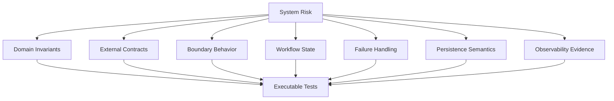

------
title: Learn Java Patterns - Part 028
description: Testing patterns for advanced Java systems: test strategy, characterization tests, contract tests, property tests, fixture builders, test doubles, integration tests, Testcontainers, workflow tests, event tests, observability tests, and anti-patterns.
series: learn-java-patterns
seriesTitle: Learn Java Patterns, Data Patterns, Pipeline Patterns, Concurrency Patterns, Common Patterns, and Anti-Patterns
order: 28
partTitle: Testing Patterns for Patterned Systems
tags:
- java
- patterns
- testing
- junit
- testcontainers
- contract-testing
- architecture
- advanced-java
date: 2026-06-27
------

# Part 028 — Testing Patterns for Patterned Systems

> Goal: design tests that validate behavior, boundaries, invariants, contracts, state transitions, and failure handling without making the codebase brittle.

Testing pattern-heavy Java systems is not about increasing coverage numbers. Coverage is a signal, not the goal.

The goal is confidence:

> If we change this system, will tests reveal broken invariants, broken contracts, unsafe concurrency assumptions, incorrect workflow transitions, lost events, broken idempotency, or invalid error handling?

A top-tier engineer treats tests as an executable specification of the system’s most important promises.

---

## 1. Kaufman Skill Map

### 1.1 Target performance level

After this part, you should be able to:

1. design a test strategy around risk, not dogma;
2. choose unit, slice, integration, contract, property, golden-master, and end-to-end tests intentionally;
3. test domain invariants without tying tests to implementation details;
4. test repositories, transactions, outbox/inbox, and messaging boundaries;
5. use test doubles without over-mocking;
6. design fixture builders that keep tests readable;
7. test workflow state transitions and illegal transitions;
8. test resilience behavior: timeout, retry, fallback, idempotency, DLQ;
9. test observability and audit behavior where it is part of the contract;
10. identify brittle tests, mock-heavy tests, fixture hell, and false confidence.

### 1.2 Sub-skills

| Sub-skill | What you practice | Failure if ignored |
|---|---|---|
| Test intent | know what risk a test covers | meaningless coverage |
| Invariant testing | assert domain truth | happy-path-only system |
| Boundary testing | verify integration contracts | production-only failures |
| Fixture design | create clear test data | unreadable tests |
| Test double selection | fake/stub/mock intentionally | brittle interaction tests |
| State transition testing | cover lifecycle paths | illegal state bugs |
| Failure testing | assert timeouts/retries/rejections | resilience theater |
| Data testing | verify persistence semantics | transaction and mapping bugs |
| Contract testing | protect API/event compatibility | consumer breakage |
| Test maintainability | keep tests stable through refactor | tests block good design |

### 1.3 Practice loop

For every feature, ask:

```text
1. What invariant must always hold?
2. What behavior must consumers rely on?
3. What boundary can fail?
4. What state transition is legal?
5. What transition is illegal?
6. What duplicate/retry path can happen?
7. What persistence behavior matters?
8. What telemetry/audit evidence is required?
9. What test would fail if the implementation regressed?
10. What test would still pass after an internal refactor?
```

---

## 2. Mental Model: Tests Are Risk Controls

A weak test suite asks:

> Did we execute these lines?

A strong test suite asks:

> Did we protect the promises that matter?



Good testing is not one technique. It is a portfolio.

---

## 3. Test Portfolio Pattern

### 3.1 Problem

Teams argue about “unit vs integration” as if one kind of test can cover all risk.

### 3.2 Solution

Build a portfolio of test types, each with clear purpose.

| Test type | Main question | Example |
|---|---|---|
| Unit test | does this small behavior work? | `RiskScorePolicyTest` |
| Domain invariant test | does the model prevent impossible states? | cannot approve rejected case |
| Slice test | does one layer/boundary work? | controller validation test |
| Repository test | does persistence mapping/query work? | optimistic lock version increments |
| Integration test | do real components collaborate? | service + DB + broker |
| Contract test | will provider/consumer remain compatible? | API/event schema contract |
| Property test | does invariant hold over many inputs? | money amount never negative |
| Characterization test | what does legacy behavior currently do? | protect refactoring |
| Golden master | does complex output remain stable? | report generation snapshot |
| End-to-end test | does a critical user journey work? | submit case to approval |

### 3.3 Cost model

| Test type | Speed | Fidelity | Debuggability | Maintenance cost |
|---|---:|---:|---:|---:|
| Unit | high | low-medium | high | low |
| Slice | high-medium | medium | high | medium |
| Integration | medium | high | medium | medium-high |
| Contract | medium | high for compatibility | medium | medium |
| E2E | low | very high | low | high |

Use fast tests for invariants and decision logic. Use realistic tests for boundaries where mocks lie.

---

## 4. Pattern: Test Names as Behavior Specifications

### 4.1 Problem

Tests are named after methods, not behavior.

Bad:

```java
@Test
void testSubmit() {}
```

### 4.2 Solution

Name tests as executable behavior statements.

```java
@Test
void submitCase_createsDraftCase_whenApplicantProvidesRequiredData() {}

@Test
void approveCase_rejectsCommand_whenCaseIsAlreadyClosed() {}

@Test
void processMessage_doesNotApplySideEffectTwice_whenMessageIsRedelivered() {}
```

### 4.3 Naming template

```text
operation_expectedBehavior_whenCondition
```

or:

```text
givenCondition_whenAction_thenExpectedBehavior
```

Do not worship one naming convention. The key is intent clarity.

---

## 5. Pattern: Arrange-Act-Assert / Given-When-Then

### 5.1 Problem

Tests mix setup, execution, and verification. Readers cannot see the behavior.

### 5.2 Solution

Separate the phases.

```java
@Test
void approve_rejects_whenCaseIsNotPendingApproval() {
    // Arrange
    CaseFile caseFile = CaseFileTestBuilder.aCase()
            .inState(CaseState.DRAFT)
            .build();

    ApproveCase command = new ApproveCase(caseFile.id(), reviewer());

    // Act
    InvalidTransitionException error = assertThrows(
            InvalidTransitionException.class,
            () -> caseFile.approve(command)
    );

    // Assert
    assertEquals(ErrorClass.CONFLICT, error.errorClass());
    assertEquals(CaseState.DRAFT, caseFile.state());
}
```

### 5.3 Rule

If the arrange section is larger than the behavior, introduce a fixture builder or test data factory.

---

## 6. Pattern: Fixture Builder

### 6.1 Problem

Tests require large object graphs. Every test repeats irrelevant setup. Minor constructor changes break many tests.

### 6.2 Solution

Use fluent builders for test fixtures.

```java
public final class CaseFileTestBuilder {
    private CaseId id = CaseId.random();
    private TenantId tenantId = new TenantId("tenant-01");
    private CaseState state = CaseState.DRAFT;
    private Applicant applicant = ApplicantTestBuilder.validApplicant().build();
    private List<Evidence> evidence = new ArrayList<>();

    private CaseFileTestBuilder() {}

    public static CaseFileTestBuilder aCase() {
        return new CaseFileTestBuilder();
    }

    public CaseFileTestBuilder inState(CaseState state) {
        this.state = state;
        return this;
    }

    public CaseFileTestBuilder withEvidence(Evidence evidence) {
        this.evidence.add(evidence);
        return this;
    }

    public CaseFile build() {
        return CaseFile.restore(id, tenantId, state, applicant, List.copyOf(evidence));
    }
}
```

### 6.3 Builder rules

```text
[ ] Defaults should create a valid object.
[ ] Test should override only what matters.
[ ] Builder should not hide important domain meaning.
[ ] Avoid global mutable fixture state.
[ ] Avoid random data unless the test controls seed or does not depend on value.
```

### 6.4 Anti-pattern: mystery guest

```java
CaseFile caseFile = TestFixtures.caseFileScenario17();
```

If the reader must open another file to know why the test passes, the fixture is too magical.

---

## 7. Pattern: Object Mother vs Builder

### 7.1 Object Mother

An object mother provides named fixtures.

```java
public final class CaseFiles {
    public static CaseFile pendingApproval() {
        return CaseFileTestBuilder.aCase()
                .inState(CaseState.PENDING_APPROVAL)
                .withEvidence(EvidenceTestBuilder.validEvidence().build())
                .build();
    }
}
```

### 7.2 Builder

A builder provides composable customization.

```java
CaseFile caseFile = CaseFileTestBuilder.aCase()
        .inState(CaseState.UNDER_REVIEW)
        .withEvidence(expiredEvidence())
        .build();
```

### 7.3 Use both carefully

Use Object Mother for named domain scenarios. Use Builder for local test-specific variation.

---

## 8. Pattern: Test Double Selection

### 8.1 Problem

Teams use mocks for everything. Tests verify implementation calls instead of observable behavior.

### 8.2 Vocabulary

| Double | Meaning | Example |
|---|---|---|
| Dummy | passed but not used | unused callback |
| Fake | working simplified implementation | in-memory repository |
| Stub | returns controlled answers | risk service returns HIGH |
| Spy | records interactions | email sender recording messages |
| Mock | pre-programmed interaction expectation | verify gateway called once |

### 8.3 Selection rule

```text
Use a fake when behavior matters.
Use a stub when an answer matters.
Use a spy when an emitted side effect matters.
Use a mock when the interaction itself is the contract.
```

### 8.4 Example: stub

```java
final class StubRiskScoringClient implements RiskScoringClient {
    private final RiskLevel riskLevel;

    StubRiskScoringClient(RiskLevel riskLevel) {
        this.riskLevel = riskLevel;
    }

    @Override
    public RiskLevel score(CaseFile caseFile) {
        return riskLevel;
    }
}
```

### 8.5 Example: spy

```java
final class RecordingDomainEventPublisher implements DomainEventPublisher {
    private final List<DomainEvent> published = new ArrayList<>();

    @Override
    public void publish(DomainEvent event) {
        published.add(event);
    }

    public List<DomainEvent> published() {
        return List.copyOf(published);
    }
}
```

### 8.6 Mock when interaction is the contract

A mock is appropriate when you are testing that:

- a payment authorization is not called after validation fails;
- an external irreversible side effect is called exactly once;
- a transaction boundary invokes a collaborator in a specific sequence required by protocol.

But if the test only verifies internal method calls, it becomes brittle.

---

## 9. Pattern: Domain Invariant Test

### 9.1 Problem

Domain objects allow invalid transitions because tests only cover happy paths.

### 9.2 Solution

Write tests around invariants and illegal states.

```java
@Test
void close_rejects_whenCaseHasUnresolvedEscalation() {
    CaseFile caseFile = CaseFileTestBuilder.aCase()
            .inState(CaseState.UNDER_REVIEW)
            .withEscalation(Escalation.open("SLA_BREACH"))
            .build();

    InvalidTransitionException error = assertThrows(
            InvalidTransitionException.class,
            () -> caseFile.close(bySupervisor())
    );

    assertEquals(CaseState.UNDER_REVIEW, caseFile.state());
    assertEquals("OPEN_ESCALATION", error.reasonCode());
}
```

### 9.3 Invariant test checklist

```text
[ ] legal transition succeeds;
[ ] illegal transition fails;
[ ] state remains unchanged after failure;
[ ] domain event is emitted on success;
[ ] no domain event is emitted on failure;
[ ] version or audit metadata changes only when appropriate;
[ ] error class/reason is stable.
```

---

## 10. Pattern: Parameterized Decision Table Test

### 10.1 Problem

Policy logic has many combinations. Individual tests are repetitive and incomplete.

### 10.2 Solution

Use a decision table with parameterized tests.

```java
@ParameterizedTest
@MethodSource("transitionCases")
void transitionPolicy_returnsExpectedDecision(
        CaseState from,
        Action action,
        Role role,
        boolean expectedAllowed
) {
    TransitionPolicy policy = new TransitionPolicy();

    boolean allowed = policy.canPerform(from, action, role);

    assertEquals(expectedAllowed, allowed);
}

static Stream<Arguments> transitionCases() {
    return Stream.of(
            Arguments.of(CaseState.DRAFT, Action.SUBMIT, Role.APPLICANT, true),
            Arguments.of(CaseState.DRAFT, Action.APPROVE, Role.REVIEWER, false),
            Arguments.of(CaseState.PENDING_APPROVAL, Action.APPROVE, Role.REVIEWER, true),
            Arguments.of(CaseState.CLOSED, Action.APPROVE, Role.REVIEWER, false)
    );
}
```

### 10.3 When to use

Use parameterized decision tables for:

- authorization policies;
- transition rules;
- validation matrices;
- routing logic;
- retry classification;
- fee/tax/risk calculations.

---

## 11. Pattern: Property-Based Test

### 11.1 Problem

Example-based tests cover a few cases. Edge cases remain hidden.

### 11.2 Solution

Generate many inputs and assert properties that must always hold.

Example properties:

```text
A case cannot move from CLOSED to UNDER_REVIEW.
Total allocation cannot exceed available budget.
Sorted output is always non-decreasing.
Serialization then deserialization preserves value.
Applying same idempotent command twice has same final state.
```

### 11.3 Conceptual example

```java
@Property
void normalizedEmail_isAlwaysLowercase(@ForAll String input) {
    assumeFalse(input.isBlank());

    Email email = Email.normalize(input + "@example.com");

    assertEquals(email.value(), email.value().toLowerCase(Locale.ROOT));
}
```

Java libraries such as jqwik integrate property-based testing with JUnit-style workflows.

### 11.4 Good property characteristics

```text
[ ] independent of implementation;
[ ] true for broad input range;
[ ] meaningful when it fails;
[ ] shrinks to understandable counterexample;
[ ] does not depend on external nondeterminism.
```

---

## 12. Pattern: Characterization Test

### 12.1 Problem

Legacy code has unclear behavior. Refactoring is risky because nobody knows which behavior is intentional.

### 12.2 Solution

Write tests that capture current observable behavior before changing internals.

```java
@Test
void legacyRiskScore_preservesCurrentBoundaryBehavior_forHighValueCase() {
    LegacyRiskService service = new LegacyRiskService();

    RiskScore score = service.calculate(legacyHighValueCase());

    assertEquals(new RiskScore(87), score);
}
```

### 12.3 Warning

Characterization tests do not prove behavior is correct. They prove behavior remains stable while you refactor.

Use them as scaffolding. After refactoring, replace unclear characterization tests with intentional domain tests.

---

## 13. Pattern: Golden Master / Approval Test

### 13.1 Problem

Complex output is hard to assert field by field.

Examples:

- generated PDF metadata;
- exported CSV;
- risk report;
- rendered notification;
- migration output;
- generated policy explanation.

### 13.2 Solution

Compare generated output against an approved baseline.

```java
@Test
void enforcementReport_matchesApprovedOutput() {
    EnforcementReport report = reportGenerator.generate(caseScenario());

    String actual = normalize(report.toMarkdown());

    assertEquals(readResource("approved/enforcement-report.md"), actual);
}
```

### 13.3 Normalize nondeterminism

Before comparing, remove or normalize:

- timestamps;
- generated IDs;
- ordering that is not semantically meaningful;
- environment-specific paths;
- localized formatting if not part of contract.

### 13.4 Failure mode

Golden master tests can freeze bad behavior. Use them for stable output contracts or temporary refactoring safety, not as a substitute for understanding.

---

## 14. Pattern: Contract Test

### 14.1 Problem

Provider and consumer evolve independently. Unit tests pass, but production integration breaks.

### 14.2 Solution

Test the contract at the boundary.

Contracts can cover:

- REST API request/response;
- event schema;
- message headers;
- error response shape;
- idempotency behavior;
- pagination behavior;
- authorization failure shape.

### 14.3 API contract example

```json
{
  "request": {
    "method": "POST",
    "path": "/cases",
    "headers": {
      "Idempotency-Key": "string"
    }
  },
  "response": {
    "status": 201,
    "body": {
      "caseId": "string",
      "state": "DRAFT"
    }
  }
}
```

### 14.4 Event contract example

```json
{
  "eventType": "CaseSubmitted",
  "schemaVersion": 3,
  "requiredHeaders": [
    "eventId",
    "correlationId",
    "tenantId",
    "occurredAt"
  ],
  "payload": {
    "caseId": "string",
    "caseType": "string",
    "submittedBy": "string"
  }
}
```

### 14.5 Contract checklist

```text
[ ] Required fields are explicit.
[ ] Optional fields are explicit.
[ ] Unknown fields policy is explicit.
[ ] Error format is tested.
[ ] Backward compatibility is tested.
[ ] Event schema version is tested.
[ ] Consumer assumptions are captured.
```

---

## 15. Pattern: Repository Integration Test

### 15.1 Problem

Repository tests use in-memory fakes, but production uses SQL constraints, transaction isolation, indexes, JSON columns, timestamps, and optimistic locking.

### 15.2 Solution

Test persistence behavior against a real or production-like database.

### 15.3 What to test

```text
[ ] mapping between entity and table;
[ ] required columns and constraints;
[ ] unique constraints;
[ ] optimistic locking version;
[ ] pagination order;
[ ] query filters including tenant boundary;
[ ] soft-delete behavior;
[ ] temporal validity queries;
[ ] transaction rollback;
[ ] outbox insert in same transaction.
```

### 15.4 Example shape

```java
@Test
void save_incrementsVersion_whenAggregateIsUpdated() {
    CaseFile saved = repository.save(CaseFileTestBuilder.aCase().build());

    saved.submit(byApplicant());
    CaseFile updated = repository.save(saved);

    assertEquals(1, updated.version());
}
```

### 15.5 Testcontainers pattern

Use Testcontainers when production behavior depends on real database semantics.

```java
@Testcontainers
class CaseRepositoryTest {
    @Container
    static PostgreSQLContainer<?> postgres = new PostgreSQLContainer<>("postgres:16-alpine");

    @Test
    void findByTenant_doesNotReturnOtherTenantCases() {
        CaseRepository repository = repositoryConnectedTo(postgres);

        repository.save(caseFor("tenant-a"));
        repository.save(caseFor("tenant-b"));

        List<CaseFile> result = repository.findByTenant(new TenantId("tenant-a"));

        assertEquals(1, result.size());
        assertEquals(new TenantId("tenant-a"), result.getFirst().tenantId());
    }
}
```

The example is illustrative. Exact container classes and setup depend on your build and framework.

---

## 16. Pattern: Transaction Boundary Test

### 16.1 Problem

Code writes domain state, outbox records, audit records, and projections in separate operations. Partial failure creates inconsistency.

### 16.2 Solution

Test transaction atomicity explicitly.

```java
@Test
void submit_rollsBackCaseAndOutbox_whenAuditWriteFails() {
    AuditWriter failingAudit = auditWriterThatFails();
    SubmitCaseService service = serviceWith(failingAudit);

    assertThrows(AuditWriteException.class, () -> service.submit(validCommand()));

    assertTrue(caseRepository.findAll().isEmpty());
    assertTrue(outboxRepository.findAll().isEmpty());
}
```

### 16.3 Transaction test checklist

```text
[ ] success commits all required writes;
[ ] failure rolls back all transactional writes;
[ ] outbox write is atomic with aggregate write;
[ ] audit behavior is intentionally transactional or non-transactional;
[ ] duplicate command does not duplicate side effect;
[ ] optimistic lock conflict is surfaced as conflict, not generic error.
```

---

## 17. Pattern: Outbox / Inbox Test

### 17.1 Outbox test

```java
@Test
void submitCase_persistsOutboxEvent_inSameTransaction() {
    SubmitCase command = validSubmitCase();

    CaseId caseId = service.submit(command);

    List<OutboxRecord> records = outboxRepository.findPending();
    assertEquals(1, records.size());
    assertEquals("CaseSubmitted", records.getFirst().eventType());
    assertEquals(caseId.value(), records.getFirst().aggregateId());
}
```

### 17.2 Inbox idempotency test

```java
@Test
void consume_doesNotApplySideEffectTwice_whenMessageIsRedelivered() {
    MessageEnvelope<CaseSubmitted> message = caseSubmittedMessage();

    consumer.consume(message);
    consumer.consume(message);

    assertEquals(1, projectionRepository.countByCaseId(message.payload().caseId()));
    assertTrue(inboxRepository.wasProcessed(message.eventId()));
}
```

### 17.3 DLQ test

```java
@Test
void consume_movesToDeadLetter_whenMessageIsPoisonAfterMaxAttempts() {
    MessageEnvelope<CaseSubmitted> message = invalidMessage();

    repeat(3, () -> consumer.consume(message));

    DeadLetterRecord deadLetter = deadLetterRepository.findByMessageId(message.eventId()).orElseThrow();
    assertEquals("VALIDATION", deadLetter.failureClass());
    assertFalse(deadLetter.replayEligible());
}
```

---

## 18. Pattern: Workflow State Machine Test

### 18.1 Problem

Workflow logic is tested only through large end-to-end scenarios. Illegal transitions and guard behavior are missed.

### 18.2 Solution

Test state transitions directly.

```java
@ParameterizedTest
@MethodSource("illegalTransitions")
void illegalTransitions_areRejected(CaseState from, CaseAction action) {
    CaseWorkflow workflow = CaseWorkflowTestBuilder.workflow()
            .inState(from)
            .build();

    assertThrows(InvalidTransitionException.class, () -> workflow.apply(action));
}

static Stream<Arguments> illegalTransitions() {
    return Stream.of(
            Arguments.of(CaseState.DRAFT, CaseAction.APPROVE),
            Arguments.of(CaseState.CLOSED, CaseAction.SUBMIT),
            Arguments.of(CaseState.REJECTED, CaseAction.ESCALATE)
    );
}
```

### 18.3 Transition side-effect test

```java
@Test
void escalate_recordsTimelineEntry_andPublishesEvent() {
    RecordingDomainEventPublisher events = new RecordingDomainEventPublisher();
    RecordingTimeline timeline = new RecordingTimeline();
    CaseWorkflow workflow = workflowUnderReview(events, timeline);

    workflow.escalate(reason("SLA_BREACH"));

    assertEquals(CaseState.ESCALATED, workflow.state());
    assertTrue(events.containsEvent("CaseEscalated"));
    assertTrue(timeline.containsTransition("UNDER_REVIEW", "ESCALATED"));
}
```

---

## 19. Pattern: Resilience Behavior Test

### 19.1 Problem

Retry, timeout, fallback, circuit breaker, and bulkhead are configured but not behaviorally tested.

### 19.2 Solution

Test observable resilience behavior.

### 19.3 Retry success after transient failure

```java
@Test
void call_retriesAndSucceeds_whenDependencyFailsOnce() {
    FlakyRiskClient client = new FlakyRiskClient()
            .failTimes(1)
            .thenReturn(RiskLevel.HIGH);

    RiskLevel result = serviceWith(client).calculateRisk(caseFile());

    assertEquals(RiskLevel.HIGH, result);
    assertEquals(2, client.callCount());
}
```

### 19.4 Retry exhaustion

```java
@Test
void call_failsWithDependencyUnavailable_whenRetriesExhausted() {
    AlwaysFailingRiskClient client = new AlwaysFailingRiskClient();

    DependencyUnavailableException error = assertThrows(
            DependencyUnavailableException.class,
            () -> serviceWith(client).calculateRisk(caseFile())
    );

    assertEquals(ErrorClass.DEPENDENCY_UNAVAILABLE, error.errorClass());
    assertEquals(3, client.callCount());
}
```

### 19.5 Fallback visible

```java
@Test
void call_usesFallback_andEmitsMetric_whenRiskServiceUnavailable() {
    RecordingCaseMetrics metrics = new RecordingCaseMetrics();
    RiskService service = serviceWith(alwaysUnavailableRiskClient(), metrics);

    RiskLevel result = service.calculateRisk(caseFile());

    assertEquals(RiskLevel.UNKNOWN, result);
    assertTrue(metrics.contains("fallback:risk.calculate:DEPENDENCY_UNAVAILABLE"));
}
```

---

## 20. Pattern: Observability Test

### 20.1 Problem

Telemetry is critical but not tested. Refactors silently remove correlation IDs, error classes, or audit records.

### 20.2 Solution

Test telemetry when it is part of operational or regulatory behavior.

```java
@Test
void submit_emitsTimelineAndAuditRecord() {
    RecordingTimeline timeline = new RecordingTimeline();
    RecordingAuditLog audit = new RecordingAuditLog();
    SubmitCaseService service = serviceWith(timeline, audit);

    CaseId caseId = service.submit(validCommand());

    assertTrue(timeline.contains("CaseSubmitted", caseId));
    assertTrue(audit.containsDecision("CASE_SUBMIT", "ALLOW"));
}
```

### 20.3 Sensitive data test

```java
@Test
void validationFailure_doesNotLogRawDocumentContent() {
    RecordingLogSink logs = new RecordingLogSink();
    SubmitCaseService service = serviceWith(logs);

    assertThrows(ValidationException.class, () -> service.submit(commandWithSensitiveDocument()));

    assertFalse(logs.contains("raw passport text"));
    assertTrue(logs.contains("error_class=VALIDATION"));
}
```

Telemetry tests should be targeted. Do not assert every log message. Assert critical evidence contracts.

---

## 21. Pattern: Slice Test

### 21.1 Problem

Full integration tests are slow. Unit tests miss framework binding, validation, serialization, and mapping errors.

### 21.2 Solution

Test one vertical slice of the framework boundary.

Examples:

- controller serialization + validation + error mapping;
- repository + database mapping;
- message handler deserialization + idempotency;
- security policy adapter;
- mapper from API DTO to command.

### 21.3 Controller slice test concerns

```text
[ ] request JSON maps to command;
[ ] validation errors produce stable response shape;
[ ] authorization denial produces 403 shape;
[ ] idempotency header is required where needed;
[ ] correlation ID is returned/propagated;
[ ] API does not expose internal exception names.
```

---

## 22. Pattern: End-to-End Critical Journey Test

### 22.1 Problem

Many local tests pass, but the critical user journey fails due to wiring, config, permissions, migration, or cross-service assumptions.

### 22.2 Solution

Keep a small number of high-value end-to-end tests.

Critical journey example:

```text
1. Applicant submits case.
2. Evidence is attached.
3. Risk is calculated.
4. Case is assigned.
5. Reviewer approves.
6. Enforcement action is created.
7. Audit trail is visible.
```

### 22.3 Rules

```text
[ ] Keep E2E tests few.
[ ] Test business-critical paths only.
[ ] Avoid asserting implementation details.
[ ] Make failures easy to diagnose.
[ ] Do not replace lower-level invariant tests with E2E tests.
```

---

## 23. Pattern: Time-Controlled Test

### 23.1 Problem

Tests depend on wall-clock time. They become flaky.

### 23.2 Solution

Inject `Clock`.

```java
public final class SlaPolicy {
    private final Clock clock;

    public SlaPolicy(Clock clock) {
        this.clock = clock;
    }

    public boolean isBreached(CaseFile caseFile) {
        Instant now = clock.instant();
        return caseFile.submittedAt().plus(Duration.ofDays(5)).isBefore(now);
    }
}
```

Test:

```java
@Test
void isBreached_returnsTrue_afterFiveDays() {
    Clock fixed = Clock.fixed(Instant.parse("2026-06-27T00:00:00Z"), ZoneOffset.UTC);
    SlaPolicy policy = new SlaPolicy(fixed);

    CaseFile caseFile = CaseFileTestBuilder.aCase()
            .submittedAt(Instant.parse("2026-06-20T00:00:00Z"))
            .build();

    assertTrue(policy.isBreached(caseFile));
}
```

### 23.3 Rule

Never call `Instant.now()` deep inside domain logic. Inject time at boundary or policy level.

---

## 24. Pattern: Deterministic ID Test

### 24.1 Problem

Random IDs make tests hard to assert.

### 24.2 Solution

Inject ID generator.

```java
public interface IdGenerator {
    CaseId nextCaseId();
}
```

```java
final class FixedIdGenerator implements IdGenerator {
    @Override
    public CaseId nextCaseId() {
        return new CaseId("CASE-TEST-001");
    }
}
```

Now tests can assert exact outputs.

---

## 25. Pattern: Test Data Isolation

### 25.1 Problem

Tests pass alone but fail together because they share database rows, caches, static state, or clock state.

### 25.2 Solution

Use isolation strategy deliberately.

Options:

| Strategy | Use case | Trade-off |
|---|---|---|
| transaction rollback | repository tests | may hide commit hooks |
| truncate tables | integration tests | slower |
| unique tenant/test ID | parallel tests | requires cleanup |
| fresh container | high isolation | slowest |
| reset fake state | unit/slice tests | must not leak static state |

### 25.3 Checklist

```text
[ ] Tests can run in any order.
[ ] Tests can run repeatedly.
[ ] Tests can run in parallel or are explicitly marked not parallel.
[ ] Static mutable state is reset.
[ ] Caches are cleared or isolated.
[ ] Clocks and ID generators are deterministic.
```

---

## 26. Pattern: Mutation-Oriented Thinking

### 26.1 Problem

Tests assert weak conditions. Code can be broken without failing tests.

Example weak assertion:

```java
assertNotNull(result);
```

### 26.2 Solution

Ask what code mutation should fail this test.

Would the test fail if:

```text
condition is inverted?
state transition target is wrong?
event is not published?
authorization check is removed?
idempotency check is removed?
tenant filter is removed?
retry count changes from 3 to 1?
```

### 26.3 Stronger assertion

```java
assertEquals(CaseState.PENDING_APPROVAL, result.state());
assertEquals(1, events.count("CaseSubmitted"));
assertEquals(command.idempotencyKey(), result.creationCommandKey());
```

---

## 27. Pattern: Approval of Failure Modes

### 27.1 Problem

Tests verify success but not failure semantics.

### 27.2 Solution

For every important operation, define failure mode tests.

```text
Validation failure
Authorization failure
Conflict/optimistic lock
Dependency timeout
Duplicate command
Serialization failure
Poison message
Dead-letter after max attempts
Transaction rollback
Partial external failure
Cancellation
```

### 27.3 Example matrix

| Scenario | Expected behavior |
|---|---|
| invalid command | rejected, no state change, no outbox |
| duplicate command | same result or no-op, no duplicate side effect |
| stale version | conflict, no overwrite |
| dependency timeout | retry according to policy |
| retry exhausted | classified failure, metric emitted |
| poison message | DLQ/quarantine after max attempts |

---

## 28. Testing Pattern Selection Matrix

| Risk | Best first test pattern |
|---|---|
| Domain rule wrong | domain invariant test |
| Many policy combinations | parameterized decision table |
| Unknown legacy behavior | characterization test |
| API compatibility | contract test |
| Event compatibility | schema/consumer contract test |
| Database mapping | repository integration test |
| Transaction atomicity | transaction boundary test |
| Duplicate message | inbox idempotency test |
| Async side effect | spy/recording fake |
| Complex generated output | golden master |
| Edge cases broad | property-based test |
| Framework binding | slice test |
| Cross-service critical path | small E2E test |
| Time-dependent SLA | time-controlled test |
| Observability evidence | telemetry/audit test |

---

## 29. Anti-Patterns

### 29.1 Coverage Worship

High line coverage does not mean high confidence.

Fix:

- measure risk coverage;
- include failure paths;
- test invariants and contracts.

### 29.2 Over-Mocking

Tests verify internal method calls instead of behavior.

Symptom:

```java
verify(repository).save(any());
verify(publisher).publish(any());
verify(metrics).increment(any());
```

But the test never checks final state or observable result.

Fix:

- use fakes/spies for behavior;
- mock only interactions that are the contract;
- prefer state verification where possible.

### 29.3 Brittle Fixture Hell

Every test has 50 lines of setup.

Fix:

- fixture builders;
- domain scenario factories;
- remove irrelevant fields.

### 29.4 Sleep-Based Async Test

```java
Thread.sleep(5000);
assertTrue(done);
```

Fix:

- use latches, polling with timeout, fake scheduler, or deterministic executor.

### 29.5 In-Memory Fake Lies

A fake repository does not enforce SQL constraints, transaction isolation, or query behavior.

Fix:

- use fakes for domain/application tests;
- use real DB integration tests for persistence semantics.

### 29.6 Snapshot Everything

Golden master snapshots are used for all tests. Changes become painful.

Fix:

- snapshot stable output contracts only;
- assert semantics directly when possible.

### 29.7 E2E Pyramid Inversion

Most tests are slow end-to-end tests.

Fix:

- move invariant and boundary tests lower;
- keep E2E few and critical.

### 29.8 Tests Mirror Implementation

A refactor breaks tests even though behavior is unchanged.

Fix:

- test public behavior;
- avoid verifying private call sequences;
- test through stable boundaries.

---

## 30. Refactoring Path for a Weak Test Suite

### 30.1 Step-by-step

```text
1. Identify top production risks and recent bugs.
2. Add characterization tests around risky legacy behavior.
3. Add domain invariant tests for critical aggregates/policies.
4. Add repository tests for important persistence assumptions.
5. Add contract tests for APIs/events with external consumers.
6. Add idempotency tests for commands/messages.
7. Add workflow transition matrix tests.
8. Add resilience tests for retry/timeout/fallback paths.
9. Remove or rewrite brittle over-mocked tests.
10. Keep a small E2E smoke suite for critical journeys.
```

### 30.2 Do not rewrite everything

A test suite is a socio-technical asset. Improve it incrementally around change hotspots and high-risk areas.

---

## 31. Production-Grade Test Review Checklist

```text
Intent
[ ] Does each test have a clear behavioral reason?
[ ] Would a reader know what risk this test protects?

Domain
[ ] Are invariants tested?
[ ] Are illegal transitions tested?
[ ] Are edge cases tested?

Boundaries
[ ] Are API contracts tested?
[ ] Are event contracts tested?
[ ] Are database constraints tested against real DB semantics?
[ ] Are tenant and authorization boundaries tested?

Failure
[ ] Are validation, conflict, timeout, dependency failure, duplicate, and poison-message paths tested?
[ ] Are retry/fallback/circuit behaviors observable and tested?

Fixtures
[ ] Are fixtures readable?
[ ] Do defaults create valid objects?
[ ] Are irrelevant details hidden?

Doubles
[ ] Are mocks used only where interaction is the contract?
[ ] Are fakes realistic enough for the test purpose?
[ ] Do tests avoid verifying private implementation details?

Determinism
[ ] Is time controlled?
[ ] Are IDs controlled?
[ ] Are tests order-independent?
[ ] Are async tests not sleep-based?

Maintainability
[ ] Would the test survive a safe refactor?
[ ] Are assertions strong enough to catch meaningful mutation?
```

---

## 32. Practice Drills

### Drill 1 — Invariant suite

Pick an aggregate. Write tests for:

```text
3 legal transitions
5 illegal transitions
failure state unchanged
success event emitted
failure event not emitted
```

### Drill 2 — Repository reality check

Pick one repository. Test against a real DB:

```text
tenant filter
unique constraint
optimistic lock
pagination order
soft delete
temporal query
```

### Drill 3 — Event idempotency

Write a consumer test:

```text
first delivery applies side effect
second delivery does not duplicate side effect
inbox record is created
metric/log indicates duplicate
```

### Drill 4 — Replace over-mocked test

Find a test that verifies 3+ internal method calls. Rewrite it to assert:

```text
final state
published domain event
persisted record
visible output
classified failure
```

### Drill 5 — Failure matrix

For one command handler, define tests for:

```text
invalid input
authorization denied
stale version
dependency timeout
duplicate command
transaction failure
```

---

## 33. Source Notes

Useful references:

- JUnit User Guide: https://docs.junit.org/current/user-guide/
- Testcontainers for Java documentation: https://java.testcontainers.org/
- Martin Fowler, “Mocks Aren’t Stubs”: https://martinfowler.com/articles/mocksArentStubs.html
- xUnit Test Patterns by Gerard Meszaros: http://xunitpatterns.com/
- jqwik property-based testing: https://jqwik.net/
- Pact contract testing: https://docs.pact.io/
- Spring Boot testing documentation: https://docs.spring.io/spring-boot/reference/testing/

---

## 34. Key Takeaways

1. Tests are risk controls, not coverage decorations.
2. Pattern-heavy systems need tests for invariants, boundaries, state transitions, failure behavior, and contracts.
3. Use mocks sparingly. Prefer fakes/stubs/spies when behavior is more important than interaction sequence.
4. Persistence behavior deserves real database tests when SQL semantics matter.
5. Event-driven systems need idempotency, outbox, inbox, and DLQ tests.
6. Workflow systems need transition matrix tests, not only end-to-end journeys.
7. Time, IDs, async execution, and external dependencies must be controlled to avoid flakiness.
8. A good test suite supports safe refactoring instead of freezing implementation details.

Part 028 is complete. The series continues with Part 029: Concurrency Testing Patterns.
