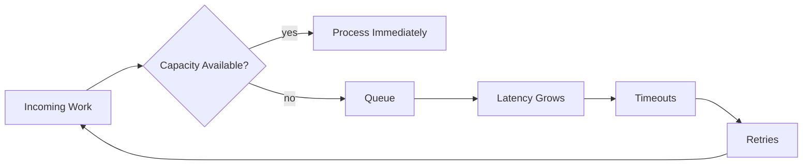
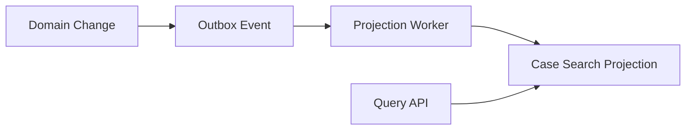

------
title: Learn Java Patterns - Part 030
description: Performance patterns for advanced Java systems: measurement discipline, latency/throughput mental models, batching, pooling, allocation control, locality, contention reduction, cache behavior, JMH benchmarking, JFR profiling, GC-aware design, backpressure, and production performance review.
series: learn-java-patterns
seriesTitle: Learn Java Patterns, Data Patterns, Pipeline Patterns, Concurrency Patterns, Common Patterns, and Anti-Patterns
order: 30
partTitle: Performance Patterns
tags:
- java
- patterns
- performance
- jmh
- jfr
- gc
- architecture
- advanced-java
date: 2026-06-27
------

# Part 030 — Performance Patterns

> Goal: learn performance patterns as engineering trade-offs, not folklore: measure first, protect invariants, reduce waste, bound work, and optimize only the right bottleneck.

Performance engineering is not a bag of tricks.

It is disciplined reasoning about:

- work done;
- work avoided;
- work delayed;
- work parallelized;
- work batched;
- work cached;
- work serialized;
- memory allocated;
- memory retained;
- contention introduced;
- latency budget consumed;
- operational risk accepted.

A top-tier Java engineer does not say, “This is faster.” They say:

> “For this workload, under this data shape, with this latency target, this pattern reduces this bottleneck, introduces these risks, and is validated by these measurements.”

---

## 1. Kaufman Skill Map

### 1.1 Target performance level

After this part, you should be able to:

1. define performance goals precisely: latency, throughput, utilization, cost, memory, tail behavior;
2. distinguish algorithmic, allocation, I/O, contention, GC, serialization, and coordination bottlenecks;
3. choose batching, caching, pooling, streaming, partitioning, async, or backpressure based on force analysis;
4. avoid misleading micro-optimizations;
5. use JMH for focused benchmarks and JFR/profilers for system behavior;
6. reason about tail latency and queueing;
7. design APIs and pipelines that do bounded work;
8. reduce allocation without destroying clarity;
9. understand when object pooling is harmful;
10. create production performance review checklists.

### 1.2 Sub-skills

| Sub-skill | What you practice | Failure if ignored |
|---|---|---|
| Goal definition | specify SLO and workload | optimization without target |
| Bottleneck finding | profile before changing | tuning wrong layer |
| Cost modeling | estimate CPU/I/O/memory/lock cost | pattern chosen by fashion |
| Measurement design | isolate and validate changes | misleading benchmark |
| Allocation control | reduce garbage on hot path | GC pressure and tail spikes |
| Contention reduction | reduce shared mutable pressure | throughput collapse |
| Batching | amortize fixed cost | chatty slow system |
| Backpressure | bound overload | memory and latency collapse |
| Locality | keep data close to compute | cache misses and remote calls |
| Regression guard | prevent performance decay | slow drift over time |

### 1.3 Practice loop

```text
1. Name the performance symptom.
2. Identify the workload shape.
3. Measure baseline.
4. Form one bottleneck hypothesis.
5. Choose one pattern that targets that bottleneck.
6. Measure again under the same workload.
7. Check correctness and failure modes.
8. Check tail latency, not only average.
9. Document the trade-off.
10. Add a regression guard if the gain matters.
```

Performance is engineering when it is falsifiable.

---

## 2. Performance Mental Model

A system is slow because some constrained resource is being consumed inefficiently or waited on too much.

Common constraints:

| Constraint | Symptom | Typical patterns |
|---|---|---|
| CPU | high CPU, slow computation | better algorithm, precompute, vectorize, reduce parsing |
| Memory allocation | high GC, allocation rate | reuse immutable constants, avoid temporary objects, streaming |
| I/O | threads waiting, remote latency | batching, caching, async, timeout, bulkhead |
| Database | slow queries, lock waits | indexing, pagination, query model, batching, transaction reduction |
| Lock contention | blocked threads, low CPU, high wait | striping, single-writer, immutable snapshot, partitioning |
| Queueing | rising latency under load | backpressure, load shedding, capacity planning |
| Serialization | CPU and allocation spike | schema choice, streaming serializer, avoid over-fetching |
| Coordination | too many round trips | aggregation, co-location, data denormalization |

Do not optimize Java code before knowing which constraint dominates.

---

## 3. Latency, Throughput, and Tail Behavior

### 3.1 Definitions

| Term | Meaning |
|---|---|
| Latency | time for one request/work item |
| Throughput | work completed per unit time |
| Utilization | how busy a resource is |
| Tail latency | high percentile latency: p95, p99, p999 |
| Saturation | resource has no spare capacity |
| Queueing delay | time waiting before service starts |

Average latency hides pain.

A system with 20 ms average and 5 second p99 can be operationally terrible.

### 3.2 Queueing intuition

When utilization approaches saturation, queueing delay rises sharply.



Retries can convert small overload into large overload.

### 3.3 Performance design rule

A performance pattern must usually do one of these:

1. reduce work;
2. reduce waiting;
3. reduce coordination;
4. reduce allocation;
5. increase useful parallelism;
6. bound demand;
7. move work out of critical path;
8. precompute work safely.

If a change does none of those, it is probably not a performance pattern.

---

## 4. Pattern: Measurement Before Mutation

### 4.1 Problem

Teams often optimize based on intuition.

Common mistakes:

- replacing clear code with clever code without evidence;
- optimizing cold paths;
- benchmarking a method that is not the bottleneck;
- ignoring database/network latency;
- measuring average only;
- measuring dev machine behavior and assuming production behavior;
- ignoring GC and allocation rate;
- ignoring coordinated omission in load tests.

### 4.2 Pattern

Create a measurement ladder.

```text
1. User symptom
2. SLO / target
3. Production telemetry
4. Profiling / tracing / JFR
5. Load test
6. Focused benchmark
7. Code change
8. Regression guard
```

### 4.3 Good performance issue statement

Bad:

```text
The API is slow.
```

Good:

```text
Case search p99 increased from 350 ms to 1.8 s for tenants with >1M cases.
Trace shows 80% of time in authorization filtering after database fetch.
Allocation rate doubled after adding per-row DTO enrichment.
```

### 4.4 Rule

A performance change without a baseline is a guess.

---

## 5. Pattern: Hot Path Isolation

### 5.1 Problem

Not all code matters equally.

A hot path is executed frequently or sits on a latency-critical path.

Examples:

- authorization check per request;
- idempotency lookup per command;
- event envelope parsing per message;
- cache key creation;
- workflow transition guard;
- serialization in API response;
- database row mapping;
- metrics/logging inside high-volume loops.

### 5.2 Pattern

Separate hot path from cold path.

```java
final class CaseAuthorizationService {
    private final PermissionIndex permissionIndex;
    private final AuditSink auditSink;

    AuthorizationDecision canView(UserId user, CaseSummary caze) {
        // Hot path: pure, fast, allocation-light.
        var allowed = permissionIndex.hasPermission(user, caze.tenantId(), caze.classification());

        // Cold path: only emit detailed audit when needed.
        if (!allowed) {
            auditSink.denied(user, caze.caseId(), "missing permission");
        }

        return allowed ? AuthorizationDecision.allow() : AuthorizationDecision.deny();
    }
}
```

### 5.3 Rule

Make the common path simple, bounded, and measurable. Push rare diagnostics, formatting, and deep object creation off the hot path unless they are required evidence.

---

## 6. Pattern: Batching

### 6.1 Problem

A fixed cost is paid too often.

Examples:

- one database call per item;
- one HTTP call per case;
- one message publish per tiny event;
- one transaction per row;
- one log flush per event;
- one authorization lookup per item.

### 6.2 Pattern

Group work to amortize fixed overhead.

```java
final class BatchCaseLoader {
    private final CaseRepository repository;

    Map<CaseId, CaseRecord> loadAll(Set<CaseId> ids) {
        if (ids.isEmpty()) {
            return Map.of();
        }
        return repository.findByIds(ids);
    }
}
```

### 6.3 Before and after

Bad:

```java
List<CaseRecord> loadCases(List<CaseId> ids) {
    return ids.stream()
        .map(repository::findById)
        .flatMap(Optional::stream)
        .toList();
}
```

Better:

```java
List<CaseRecord> loadCases(List<CaseId> ids) {
    var recordsById = repository.findByIds(new LinkedHashSet<>(ids));
    return ids.stream()
        .map(recordsById::get)
        .filter(Objects::nonNull)
        .toList();
}
```

### 6.4 Forces

| Benefit | Cost |
|---|---|
| fewer round trips | larger payloads |
| higher throughput | more memory per batch |
| better DB efficiency | partial failure handling |
| fewer transactions | larger lock windows |
| lower per-item overhead | more complex retry semantics |

### 6.5 Batch size rule

Batch size is a control knob, not a constant from heaven.

Expose it:

```yaml
case-export:
  batch-size: 500
  max-batch-bytes: 4MB
```

### 6.6 Failure model

Batching must define:

- all-or-nothing vs partial success;
- retry whole batch vs failed items only;
- duplicate handling;
- ordering requirements;
- timeout budget;
- memory bound;
- observability per batch and per item.

---

## 7. Pattern: Chunked Processing

### 7.1 Problem

Processing all data at once consumes too much memory or creates too large a transaction.

### 7.2 Pattern

Read/process/write in chunks.

```java
final class ChunkedExporter {
    private final CaseRepository repository;
    private final CaseFileWriter writer;

    void exportCases(TenantId tenantId, int chunkSize) {
        var cursor = Cursor.start();

        while (true) {
            var page = repository.findNextPage(tenantId, cursor, chunkSize);
            if (page.records().isEmpty()) {
                return;
            }

            writer.write(page.records());
            cursor = page.nextCursor();
        }
    }
}
```

### 7.3 Keyset pagination

For large datasets, prefer keyset/cursor pagination over deep offset pagination when possible.

```sql
SELECT *
FROM cases
WHERE tenant_id = ?
  AND case_id > ?
ORDER BY case_id
LIMIT ?
```

Offset pagination can become expensive because the database may still need to scan skipped rows.

### 7.4 Rule

Chunked processing should track:

```text
last cursor
items read
items written
failed items
elapsed time
checkpoint time
```

---

## 8. Pattern: Streaming Instead of Materializing

### 8.1 Problem

Code loads everything into memory before doing work.

Bad:

```java
var all = repository.findAllLargeRecords();
var json = objectMapper.writeValueAsString(all);
return json.getBytes(StandardCharsets.UTF_8);
```

### 8.2 Pattern

Stream records through the pipeline.

```java
void export(OutputStream output, TenantId tenantId) throws IOException {
    try (var writer = new BufferedWriter(new OutputStreamWriter(output, StandardCharsets.UTF_8))) {
        repository.streamCases(tenantId, caze -> {
            try {
                writer.write(toJsonLine(caze));
                writer.newLine();
            } catch (IOException e) {
                throw new UncheckedIOException(e);
            }
        });
    }
}
```

### 8.3 Forces

| Streaming benefit | Streaming cost |
|---|---|
| lower memory | harder retry |
| lower latency to first byte | resource lifetime longer |
| handles large data | error after partial output |
| natural backpressure | transaction boundaries tricky |

### 8.4 Rule

Streaming APIs must define what happens when failure occurs after partial output.

---

## 9. Pattern: Precomputation and Projection

### 9.1 Problem

A query recomputes expensive derived state every time.

Examples:

- case dashboard counts;
- workflow SLA status;
- latest event per case;
- authorization-expanded view;
- search index document;
- aggregate risk score.

### 9.2 Pattern

Precompute a read model or projection.



### 9.3 Java shape

```java
record CaseSearchDocument(
    CaseId caseId,
    TenantId tenantId,
    String status,
    Instant lastUpdatedAt,
    boolean overdue,
    Set<String> searchableTerms
) {}

final class CaseProjectionUpdater {
    void on(CaseApproved event) {
        projectionStore.update(event.caseId(), doc -> doc.approved(event.approvedAt()));
    }
}
```

### 9.4 Forces

| Benefit | Cost |
|---|---|
| fast reads | eventual consistency |
| lower query complexity | projection rebuild needed |
| query-specific model | duplicate data |
| isolates read load | lag monitoring required |

### 9.5 Rule

Projection is a performance pattern only if you can tolerate and observe staleness.

---

## 10. Pattern: Cache With Explicit Consistency Budget

### 10.1 Problem

Cache is introduced without defining staleness tolerance.

### 10.2 Pattern

Write cache policy as code/config.

```java
record CachePolicy(
    Duration ttl,
    Duration staleWhileRevalidate,
    boolean tenantScoped,
    boolean negativeCachingAllowed
) {}
```

Example:

```java
var permissionCachePolicy = new CachePolicy(
    Duration.ofSeconds(30),
    Duration.ZERO,
    true,
    false
);
```

Authorization cache should usually have stricter staleness tolerance than reference-data cache.

### 10.3 Rule

Cache must answer:

```text
What can be stale?
For how long?
Who can invalidate it?
Is key tenant/user/security scoped?
What happens on loader failure?
How are stampedes prevented?
How is hit/miss/load/error measured?
```

---

## 11. Pattern: Allocation Reduction on Hot Path

### 11.1 Problem

High allocation rate causes GC pressure and CPU waste.

Common sources:

- creating temporary lists/maps in loops;
- string concatenation in logging before log level check;
- regex in hot path;
- boxing primitives;
- per-item object mapper creation;
- building DTOs that are immediately discarded;
- stream pipelines in extremely hot micro paths;
- defensive copies repeated unnecessarily.

### 11.2 Pattern

Reduce unnecessary temporary objects without making code unreadable.

Bad logging:

```java
log.debug("Loaded case " + caseId + " with payload " + expensiveToString(payload));
```

Better:

```java
log.debug("Loaded case {} with payload {}", caseId, payload);
```

For expensive rendering:

```java
if (log.isDebugEnabled()) {
    log.debug("Loaded case {} with payload {}", caseId, expensiveToString(payload));
}
```

### 11.3 Reuse immutable constants

```java
private static final Pattern CASE_REFERENCE_PATTERN =
    Pattern.compile("[A-Z]{3}-\\d{8}");
```

### 11.4 Avoid accidental boxing

```java
// Higher allocation if used heavily with boxed Long.
Map<Long, Long> counts = new HashMap<>();
```

For high-volume counters:

```java
LongAdder count = new LongAdder();
```

### 11.5 Rule

Allocation reduction should be driven by allocation profiling, not aesthetic dislike of objects.

---

## 12. Pattern: Object Pooling — Rarely

### 12.1 Problem

Engineers sometimes pool ordinary Java objects to “reduce allocation”.

This often makes things worse:

- objects live longer;
- GC cannot collect short-lived garbage cheaply;
- pool adds contention;
- stale state leaks;
- lifecycle becomes complex;
- memory footprint increases.

### 12.2 Good pooling candidates

| Candidate | Why pooling can make sense |
|---|---|
| database connections | external resource setup expensive and limited |
| network connections | handshake cost and server limits |
| buffers for high-throughput I/O | large memory chunks |
| heavyweight parser/encoder state | expensive initialization |

### 12.3 Bad pooling candidates

| Candidate | Why usually bad |
|---|---|
| DTOs | cheap and short-lived |
| domain objects | identity/state bugs |
| collections without strict clearing | stale data leaks |
| random small objects | GC is usually better |

### 12.4 Pool checklist

```text
[ ] Is creation actually expensive?
[ ] Is resource externally limited?
[ ] Is state fully reset before reuse?
[ ] Is pool bounded?
[ ] What happens when pool is exhausted?
[ ] Are wait times measured?
[ ] Does pool increase tail latency?
[ ] Does it interact with virtual threads safely?
```

---

## 13. Pattern: Connection Pool Bulkhead

### 13.1 Problem

Concurrency exceeds downstream capacity.

Virtual threads can create thousands of concurrent blocking calls. The downstream database may only support tens or hundreds of useful concurrent connections.

### 13.2 Pattern

Bound access to scarce resources.

```java
final class DbBulkhead {
    private final Semaphore permits;

    DbBulkhead(int maxConcurrent) {
        this.permits = new Semaphore(maxConcurrent);
    }

    <T> T call(Callable<T> action) throws Exception {
        if (!permits.tryAcquire(500, TimeUnit.MILLISECONDS)) {
            throw new RejectedExecutionException("database bulkhead full");
        }
        try {
            return action.call();
        } finally {
            permits.release();
        }
    }
}
```

### 13.3 Rule

Increasing threads without increasing downstream capacity often increases latency, not throughput.

---

## 14. Pattern: Contention Reduction

### 14.1 Problem

Many threads fight over the same lock, atomic variable, cache entry, partition, or queue.

### 14.2 Options

| Pattern | How it helps | Risk |
|---|---|---|
| Lock striping | split one lock into many | wrong stripe key breaks safety |
| Partitioning | route key to owner | hot partitions |
| Single-writer | serialize per entity | mailbox backlog |
| Immutable snapshot | readers do not lock | stale snapshot |
| Copy-on-write | cheap reads | expensive writes |
| LongAdder | reduce counter contention | not exact during concurrent update |
| Local aggregation | merge periodically | delayed visibility |

### 14.3 Example: striped locks

```java
final class StripedCaseLock {
    private final Object[] locks;

    StripedCaseLock(int stripes) {
        this.locks = IntStream.range(0, stripes)
            .mapToObj(i -> new Object())
            .toArray();
    }

    Object lockFor(CaseId caseId) {
        int index = Math.floorMod(caseId.hashCode(), locks.length);
        return locks[index];
    }
}
```

Usage:

```java
void transition(CaseId caseId, Transition transition) {
    synchronized (stripedLock.lockFor(caseId)) {
        workflow.apply(caseId, transition);
    }
}
```

### 14.4 Rule

Contention reduction must preserve the invariant boundary. If the invariant spans two keys, per-key locking may be insufficient.

---

## 15. Pattern: Local Aggregation

### 15.1 Problem

Updating shared counters or metrics from many threads creates contention.

### 15.2 Pattern

Aggregate locally, then merge.

```java
final class LocalBatchCounter {
    private final LongAdder total = new LongAdder();
    private final ThreadLocal<Integer> local = ThreadLocal.withInitial(() -> 0);

    void increment() {
        int value = local.get() + 1;
        if (value >= 100) {
            total.add(value);
            local.set(0);
        } else {
            local.set(value);
        }
    }

    long approximateTotal() {
        return total.sum();
    }
}
```

### 15.3 Better default

Use `LongAdder` for high-contention counters unless you need strict atomic read-after-write semantics.

```java
private final LongAdder processed = new LongAdder();
```

### 15.4 Rule

Counters used for money, capacity, or authorization are not approximate metrics. Do not use approximate patterns for exact invariants.

---

## 16. Pattern: Data Locality

### 16.1 Problem

Data needed together is scattered across services, databases, or memory structures.

Symptoms:

- N+1 remote calls;
- excessive joins;
- repeated deserialization;
- cache misses;
- high object graph traversal cost;
- poor CPU cache locality.

### 16.2 Pattern

Move frequently accessed data closer to the computation.

Examples:

| Situation | Locality pattern |
|---|---|
| API needs case summary and SLA | read model projection |
| authorization checks need permissions | permission index/cache |
| event consumer needs reference data | local reference snapshot |
| workflow transition needs current state | aggregate load by ID |
| reporting scans large rows | columnar/export projection |

### 16.3 Rule

Locality improves speed by duplicating or reshaping data. That creates freshness and consistency responsibilities.

---

## 17. Pattern: N+1 Elimination

### 17.1 Problem

Code performs one query/call per item.

```java
List<CaseView> views = cases.stream()
    .map(caze -> new CaseView(caze, userRepository.findById(caze.ownerId())))
    .toList();
```

### 17.2 Pattern

Collect keys, batch load, assemble.

```java
List<CaseView> toViews(List<CaseRecord> cases) {
    var ownerIds = cases.stream()
        .map(CaseRecord::ownerId)
        .collect(Collectors.toSet());

    var owners = userRepository.findByIds(ownerIds);

    return cases.stream()
        .map(caze -> new CaseView(caze, owners.get(caze.ownerId())))
        .toList();
}
```

### 17.3 Rule

DTO mapping is allowed to be boring. N+1 mapping is not.

---

## 18. Pattern: Pagination With Explicit Bound

### 18.1 Problem

APIs return unbounded result sets.

Bad:

```java
@GetMapping("/cases")
List<CaseDto> allCases() {
    return repository.findAll();
}
```

### 18.2 Pattern

Require page size limits.

```java
record PageRequest(Cursor cursor, int size) {
    PageRequest {
        if (size < 1 || size > 500) {
            throw new IllegalArgumentException("size must be between 1 and 500");
        }
    }
}
```

### 18.3 API response

```java
record Page<T>(
    List<T> items,
    Cursor nextCursor,
    boolean hasMore
) {}
```

### 18.4 Rule

Every list API is a performance and availability decision. Unbounded reads are an anti-pattern.

---

## 19. Pattern: Async Boundary for Latency Hiding

### 19.1 Problem

Independent remote calls are performed sequentially.

Bad:

```java
var caze = caseClient.get(caseId);
var notes = notesClient.get(caseId);
var audit = auditClient.get(caseId);
return assemble(caze, notes, audit);
```

### 19.2 Pattern

Use parallelism only when calls are independent and downstream capacity allows it.

```java
CaseSummary load(CaseId caseId) throws Exception {
    try (var scope = new StructuredTaskScope.ShutdownOnFailure()) {
        var caze = scope.fork(() -> caseClient.get(caseId));
        var notes = scope.fork(() -> notesClient.get(caseId));
        var audit = scope.fork(() -> auditClient.get(caseId));

        scope.join();
        scope.throwIfFailed();

        return assemble(caze.get(), notes.get(), audit.get());
    }
}
```

### 19.3 Forces

| Benefit | Cost |
|---|---|
| lower latency | higher concurrent load |
| clearer task tree with structured concurrency | cancellation semantics needed |
| independent failure handling | harder capacity planning |

### 19.4 Rule

Parallelism reduces latency only when there is spare capacity and independence. Otherwise it moves the bottleneck.

---

## 20. Pattern: Lazy Loading — Carefully

### 20.1 Problem

Expensive data is loaded even when unused.

### 20.2 Pattern

Defer work until needed.

```java
final class CaseDetailsView {
    private final CaseRecord record;
    private final Supplier<List<Note>> notes;

    CaseDetailsView(CaseRecord record, Supplier<List<Note>> notes) {
        this.record = record;
        this.notes = memoize(notes);
    }

    List<Note> notes() {
        return notes.get();
    }
}
```

### 20.3 Danger

Lazy loading can cause:

- hidden N+1 queries;
- transaction boundary leaks;
- unpredictable latency;
- serialization surprises;
- circular loading;
- unclear ownership.

### 20.4 Rule

Lazy loading is acceptable when the boundary is explicit. Hidden ORM lazy loading across service/API boundaries is often dangerous.

---

## 21. Pattern: Memoization

### 21.1 Problem

A pure expensive computation repeats for the same input.

### 21.2 Pattern

Cache result by input.

```java
final class Memoizer<K, V> {
    private final ConcurrentHashMap<K, CompletableFuture<V>> cache = new ConcurrentHashMap<>();
    private final Function<K, V> loader;

    Memoizer(Function<K, V> loader) {
        this.loader = loader;
    }

    V get(K key) {
        return cache.computeIfAbsent(key, k ->
            CompletableFuture.supplyAsync(() -> loader.apply(k))
        ).join();
    }
}
```

### 21.3 Danger

This simple version has issues:

- no TTL;
- no max size;
- failed future can poison cache;
- default executor risk;
- no tenant/security scoping;
- no metrics.

For production, use a mature cache library or implement policy explicitly.

### 21.4 Rule

Memoization is cache-aside for pure functions. It still needs bounds.

---

## 22. Pattern: Load Shedding

### 22.1 Problem

When overloaded, a service accepts all work, becomes slower, triggers retries, and collapses.

### 22.2 Pattern

Reject early when capacity is gone.

```java
final class LoadShedder {
    private final Semaphore permits;

    LoadShedder(int maxInFlight) {
        this.permits = new Semaphore(maxInFlight);
    }

    <T> T execute(Supplier<T> action) {
        if (!permits.tryAcquire()) {
            throw new ServiceUnavailableException("too many in-flight requests");
        }
        try {
            return action.get();
        } finally {
            permits.release();
        }
    }
}
```

### 22.3 Rule

A fast rejection is often better than a slow timeout.

---

## 23. Pattern: Backpressure

### 23.1 Problem

Producers generate work faster than consumers can process it.

### 23.2 Pattern

Make overload visible to producer.

Options:

| Backpressure style | Example |
|---|---|
| bounded queue | reject or block when full |
| rate limit | allow N per interval |
| demand signal | reactive streams request(n) |
| semaphore | max in-flight work |
| caller-runs | producer pays execution cost |
| adaptive limit | tune capacity based on latency/errors |

### 23.3 Java queue example

```java
final class BoundedCommandBus {
    private final BlockingQueue<Command> queue;

    BoundedCommandBus(int capacity) {
        this.queue = new ArrayBlockingQueue<>(capacity);
    }

    void submit(Command command) {
        if (!queue.offer(command)) {
            throw new RejectedExecutionException("command queue full");
        }
    }
}
```

### 23.4 Rule

If there is no backpressure, there is only hidden buffering.

---

## 24. Pattern: Serialization Boundary Optimization

### 24.1 Problem

Serialization dominates CPU or allocation.

Common causes:

- giant DTOs;
- over-fetching;
- reflection-heavy mapping;
- repeated object mapper construction;
- deep object graphs;
- circular references;
- unnecessary pretty printing;
- compressing small payloads;
- serializing unused fields.

### 24.2 Pattern

Design DTOs for the use case.

```java
record CaseListItemDto(
    String caseId,
    String status,
    String title,
    Instant lastUpdatedAt
) {}

record CaseDetailDto(
    String caseId,
    String status,
    String title,
    List<CaseNoteDto> notes,
    List<CaseActionDto> availableActions
) {}
```

Do not return `CaseDetailDto` from list endpoints if the list only needs summary fields.

### 24.3 Rule

API shape is performance design.

---

## 25. Pattern: Fast Failure Before Expensive Work

### 25.1 Problem

The system performs expensive work before rejecting invalid requests.

Bad:

```java
var caseData = repository.loadLargeCase(command.caseId());
authorization.requireCanApprove(user, caseData);
validator.validate(command);
```

Better:

```java
validator.validate(command);
authorization.requireCanAccessCase(user, command.caseId());
var caseData = repository.loadForApproval(command.caseId());
authorization.requireCanApprove(user, caseData);
```

### 25.2 Rule

Put cheap deterministic rejection before expensive I/O, but do not skip domain authorization that requires loaded state.

---

## 26. Pattern: Index-Aware Query Design

### 26.1 Problem

Application code asks the database questions that indexes cannot answer efficiently.

### 26.2 Pattern

Design query model and index together.

Example query:

```sql
SELECT case_id, title, status, updated_at
FROM cases
WHERE tenant_id = ?
  AND status = ?
  AND updated_at < ?
ORDER BY updated_at DESC
LIMIT ?
```

Likely index:

```sql
CREATE INDEX idx_cases_tenant_status_updated
ON cases (tenant_id, status, updated_at DESC);
```

### 26.3 Rule

Repository methods should reflect access patterns, not generic CRUD fantasy.

Bad:

```java
List<Case> findAll();
```

Better:

```java
Page<CaseListItem> findOpenCasesForTenant(TenantId tenantId, Cursor cursor, int limit);
```

---

## 27. Pattern: Performance Budget Per Boundary

### 27.1 Problem

Each layer assumes someone else owns latency.

### 27.2 Pattern

Assign budgets.

```text
API p95 target: 300 ms
- authentication/authorization: 25 ms
- case query: 120 ms
- enrichment: 60 ms
- serialization: 30 ms
- network/framework overhead: 25 ms
- buffer: 40 ms
```

### 27.3 Java policy

```java
record Deadline(Instant expiresAt) {
    Duration remaining(Clock clock) {
        return Duration.between(clock.instant(), expiresAt);
    }

    boolean expired(Clock clock) {
        return !remaining(clock).isPositive();
    }
}
```

### 27.4 Rule

Timeouts should derive from end-to-end deadlines where possible. Random per-call timeouts produce inconsistent tail behavior.

---

## 28. Pattern: JMH Microbenchmark

### 28.1 Problem

Measuring Java code with `System.nanoTime()` in a loop is often misleading because of JIT, warmup, dead-code elimination, constant folding, escape analysis, and runtime profile effects.

### 28.2 Pattern

Use JMH for focused JVM benchmarks.

Conceptual example:

```java
@State(Scope.Thread)
public class CaseReferenceBenchmark {
    private static final Pattern PATTERN = Pattern.compile("[A-Z]{3}-\\d{8}");
    private String value;

    @Setup
    public void setup() {
        value = "ABC-20260627";
    }

    @Benchmark
    public boolean precompiledPattern() {
        return PATTERN.matcher(value).matches();
    }

    @Benchmark
    public boolean compileEveryTime() {
        return Pattern.compile("[A-Z]{3}-\\d{8}").matcher(value).matches();
    }
}
```

### 28.3 JMH rule

Use JMH to compare small alternatives. Do not use it as proof of whole-system performance.

A microbenchmark can tell you:

```text
Under this artificial workload, method A is faster than method B.
```

It cannot automatically tell you:

```text
The production service will be faster.
```

### 28.4 Benchmark checklist

```text
[ ] Is the benchmarked code actually hot in production?
[ ] Is input realistic?
[ ] Are results consumed to avoid dead-code elimination?
[ ] Are warmup and measurement separated?
[ ] Are allocations measured?
[ ] Are multiple data sizes tested?
[ ] Is the benchmark reviewed?
[ ] Is system-level profiling also available?
```

---

## 29. Pattern: JFR-Driven Profiling

### 29.1 Problem

You need to understand real JVM behavior: CPU, allocation, GC, locks, threads, file/network I/O, exceptions, and latency events.

### 29.2 Pattern

Use Java Flight Recorder to collect low-overhead runtime data.

Operational flow:

```text
1. Start recording for a representative window.
2. Reproduce load or observe production symptom.
3. Inspect CPU hotspots.
4. Inspect allocation hotspots.
5. Inspect lock contention.
6. Inspect GC pauses and heap behavior.
7. Correlate with application traces/metrics/logs.
8. Form one hypothesis.
9. Change one thing.
10. Record again.
```

### 29.3 What to look for

| Signal | Possible meaning |
|---|---|
| high allocation by mapper | DTO churn, serialization overhead |
| monitor blocked events | lock contention |
| long socket reads | downstream latency |
| high exception rate | exceptions used as control flow |
| frequent GC pauses | allocation pressure or heap sizing |
| many parked threads | queueing or blocking |
| virtual thread pinning events | synchronized/blocking interaction issue |

### 29.4 Rule

A profiler is not a replacement for design thinking. It tells where time and allocation go. You still need to understand why.

---

## 30. Pattern: GC-Aware Design

### 30.1 Problem

Application creates too much garbage or retains too much memory.

### 30.2 Allocation rate vs retention

| Problem | Meaning | Typical fix |
|---|---|---|
| high allocation rate | many short-lived objects | reduce hot-path temporaries, stream, reuse heavy objects |
| high retention | objects live too long | fix cache bounds, clear references, reduce session state |
| fragmentation/large objects | memory layout issue | chunking, avoid huge arrays, tune collector |
| pause spikes | GC cannot meet latency target | reduce allocation/retention, choose/tune collector |

### 30.3 Dangerous retention patterns

- unbounded cache;
- static map;
- thread-local not cleared;
- request objects captured in futures;
- listener not deregistered;
- actor mailbox grows unbounded;
- metrics labels with high cardinality;
- retaining full event payload when only ID needed.

### 30.4 Rule

GC tuning is often less effective than reducing allocation and retention at the design level.

---

## 31. Pattern: High-Cardinality Guard

### 31.1 Problem

Metrics or logs include unbounded labels such as case ID, user ID, request ID, or raw error message.

This can destroy observability backend performance and cost.

Bad:

```java
metrics.counter("case.transition", "caseId", caseId.value()).increment();
```

Better:

```java
metrics.counter(
    "case.transition",
    "tenantTier", tenantTier,
    "from", fromStatus.name(),
    "to", toStatus.name()
).increment();
```

Use logs/traces/audit for high-cardinality identifiers, not metric labels.

### 31.2 Rule

Observability has a performance budget too.

---

## 32. Pattern: Performance Regression Guard

### 32.1 Problem

Performance slowly degrades through harmless-looking changes.

### 32.2 Pattern

Create regression checks at the right level.

| Level | Guard |
|---|---|
| micro | JMH benchmark threshold/trend |
| component | integration performance test |
| API | load test scenario |
| production | SLO alert and dashboard |
| code review | performance checklist |

### 32.3 Example guard

```text
Case search for 100k-case tenant:
- p95 < 300 ms
- p99 < 700 ms
- allocation < 4 MB/request
- DB queries <= 3
- no N+1 query pattern
```

### 32.4 Rule

Use trend-based review where possible. Hard thresholds can be noisy across environments.

---

## 33. Pattern: Performance-Aware Error Handling

### 33.1 Problem

Error handling itself becomes expensive.

Examples:

- stack traces for expected validation failures;
- repeated exception construction in hot loops;
- logging full payload for every failure;
- retrying non-retryable failures;
- serializing huge error responses;
- sending synchronous audit calls on rejection path.

### 33.2 Pattern

Separate expected rejection from exceptional failure.

```java
sealed interface CommandResult permits CommandAccepted, CommandRejected, CommandFailed {}

record CommandAccepted(String id) implements CommandResult {}
record CommandRejected(String code, String message) implements CommandResult {}
record CommandFailed(Throwable cause) implements CommandResult {}
```

Use exceptions for exceptional cases, not common branch decisions in high-volume paths.

### 33.3 Rule

Correctness first, but do not make expected failure path catastrophically expensive.

---

## 34. Pattern: Performance-Aware Logging

### 34.1 Problem

Logging creates CPU, allocation, I/O, lock, and storage pressure.

### 34.2 Pattern

Use structured, sampled, level-controlled logging.

```java
log.info("case transition completed caseId={} from={} to={} durationMs={}",
    caseId, from, to, duration.toMillis());
```

For high-volume events:

```java
if (sampler.shouldSample(caseId)) {
    log.debug("case enrichment detail caseId={} detail={}", caseId, detail);
}
```

### 34.3 Rule

Logging is part of the hot path unless proven otherwise.

---

## 35. Pattern: Choosing Between Threads, Virtual Threads, Async, and Reactive

### 35.1 Problem

Teams choose execution model by trend.

### 35.2 Decision guide

| Workload | Good default |
|---|---|
| blocking request/response I/O | virtual thread per task |
| CPU-bound computation | bounded platform thread pool / fork-join |
| high-volume streaming with demand control | reactive streams / Flow / specialized stream engine |
| per-key serialized mutation | actor/single-writer/partition executor |
| independent remote aggregation | structured concurrency |
| GUI/event loop style | event loop model |

### 35.3 Rule

Execution model does not remove capacity limits.

Virtual threads reduce the cost of blocking threads. They do not make the database, broker, API dependency, heap, CPU, or lock infinite.

---

## 36. Performance Anti-Patterns

### 36.1 Optimization without target

Changing code because it “looks faster” is not engineering.

### 36.2 Microbenchmark as architecture proof

A method benchmark does not prove system throughput.

### 36.3 Unbounded everything

Unbounded queue, unbounded cache, unbounded result set, unbounded executor, unbounded retry.

This is not scalability. It is deferred failure.

### 36.4 Pooling cheap objects

Often increases complexity, contention, and memory retention.

### 36.5 Logging inside tight loop without guard

Can dominate the work.

### 36.6 Parallelizing the bottleneck

If the bottleneck is the database, adding more parallel DB calls can make everything worse.

### 36.7 Hiding remote calls in getters

Turns simple mapping into invisible I/O.

### 36.8 Cache without invalidation story

Fast wrong answer is still wrong.

### 36.9 Ignoring p99

Users and upstream systems often experience tail latency, not average latency.

### 36.10 Performance vs correctness false trade-off

A wrong system that is fast is not high performance. It is just fast at producing defects.

---

## 37. Production Performance Review Checklist

```text
Goal
[ ] What exact performance target matters: p95, p99, throughput, memory, cost?
[ ] What workload shape is assumed?
[ ] Is there a baseline?

Measurement
[ ] Is production telemetry available?
[ ] Is tracing available for slow requests?
[ ] Is JFR/profiling evidence available for JVM-level bottlenecks?
[ ] Are benchmarks representative?

Work reduction
[ ] Are there N+1 calls/queries?
[ ] Is the result set bounded?
[ ] Is expensive data loaded only when needed?
[ ] Can derived data be projected/precomputed?

Memory
[ ] Is allocation rate known?
[ ] Are caches bounded?
[ ] Are ThreadLocals cleared?
[ ] Are high-cardinality metrics avoided?

Concurrency
[ ] Is contention measured?
[ ] Are resources bulkheaded?
[ ] Are queues bounded?
[ ] Does virtual-thread concurrency respect downstream limits?

I/O
[ ] Are remote calls batched where safe?
[ ] Are independent calls parallelized only when capacity allows?
[ ] Are timeouts and deadlines explicit?

Failure
[ ] What happens under overload?
[ ] Are retries bounded and jittered?
[ ] Is load shedding possible?
[ ] Is partial failure handled?

Regression
[ ] Is there a performance regression guard?
[ ] Is the trade-off documented?
```

---

## 38. Practice Drills

### Drill 1: Find the bottleneck

Take an endpoint that loads a list and enriches each row.

Measure:

1. number of database queries;
2. number of remote calls;
3. allocation per request;
4. p95/p99 latency;
5. serialization time.

Refactor to remove N+1 behavior.

### Drill 2: Batch safely

Implement a batch writer with:

- max item count;
- max byte size;
- partial failure policy;
- retry policy;
- metrics.

### Drill 3: Cache policy

Design cache policy for:

1. country reference data;
2. user permission check;
3. case details;
4. workflow transition rules.

For each, define TTL, invalidation, key scope, and stale tolerance.

### Drill 4: JMH benchmark

Benchmark precompiled regex vs compile-per-call for a case reference validator. Then explain why this benchmark does or does not matter for the full API.

### Drill 5: JFR investigation

Run a simple load test and capture JFR. Identify top allocation sites and one lock/contention signal.

### Drill 6: Virtual thread bulkhead

Build a virtual-thread aggregator that calls three fake downstream services. Add a semaphore bulkhead per dependency. Measure latency and rejected calls under overload.

---

## 39. Part Summary

Performance patterns are not isolated tricks. They are responses to specific forces.

Key takeaways:

1. define the target before optimizing;
2. measure baseline and bottleneck;
3. reduce work before adding complexity;
4. use batching to amortize fixed cost;
5. use chunking and streaming to bound memory;
6. use projections when reads need a different shape than writes;
7. treat cache as controlled inconsistency;
8. reduce allocation only on proven hot paths;
9. pool scarce resources, not ordinary objects;
10. reduce contention by preserving invariant boundaries;
11. use backpressure and load shedding before overload collapse;
12. use JMH for focused benchmarks and JFR for JVM/system insight;
13. optimize p95/p99, not only average;
14. make performance regressions visible.

The senior performance mindset is simple:

> Make less work, do it closer, do it fewer times, bound it, measure it, and never break correctness to make a graph look better.

---

## References

- OpenJDK JMH project: https://openjdk.org/projects/code-tools/jmh/
- JMH source and samples: https://github.com/openjdk/jmh
- Oracle JDK Flight Recorder API: https://docs.oracle.com/en/java/javase/25/docs/api/jdk.jfr/jdk/jfr/package-summary.html
- Oracle troubleshooting performance with JFR: https://docs.oracle.com/en/java/javase/25/troubleshoot/troubleshoot-performance-issues-using-jfr.html
- Oracle HotSpot Garbage Collection Tuning Guide, JDK 25: https://docs.oracle.com/en/java/javase/25/gctuning/
- Oracle virtual threads guide: https://docs.oracle.com/en/java/javase/25/core/virtual-threads.html
