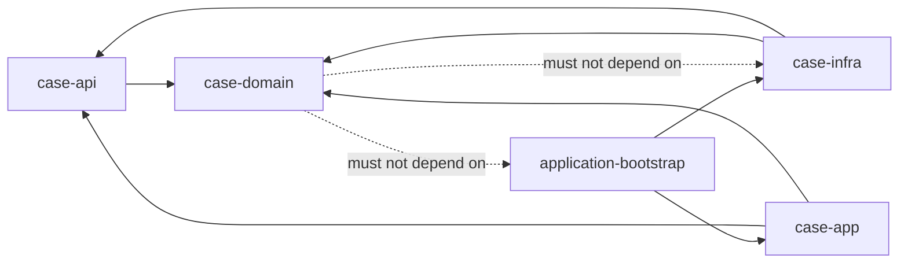
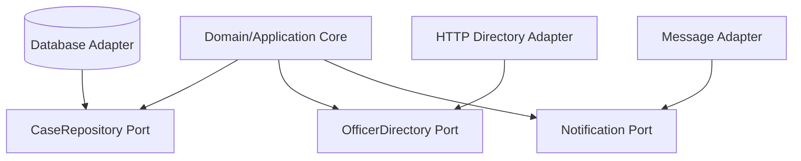
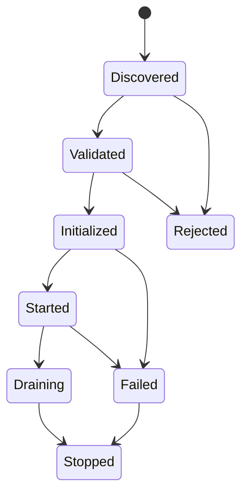
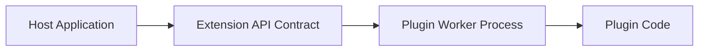
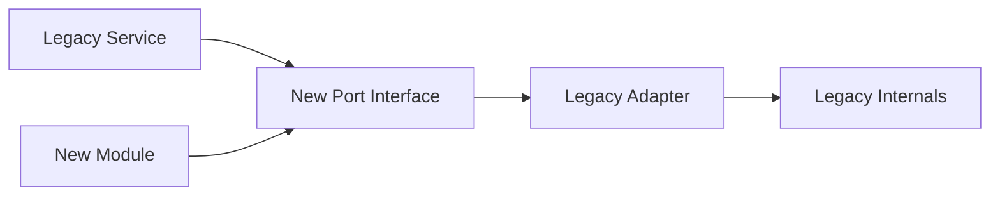

------
title: Learn Java Patterns - Part 031
description: Modularity, plugin, and extension patterns for advanced Java systems: package boundaries, JPMS, ServiceLoader, ports and adapters, extension registries, plugin lifecycle, class loading, versioning, architectural fitness functions, and production-grade extension governance.
series: learn-java-patterns
seriesTitle: Learn Java Patterns, Data Patterns, Pipeline Patterns, Concurrency Patterns, Common Patterns, and Anti-Patterns
order: 31
partTitle: Modularity, Plugin, and Extension Patterns
tags:
- java
- patterns
- modularity
- plugin-architecture
- jpms
- serviceloader
- architecture
- advanced-java
date: 2026-06-27
------

# Part 031 — Modularity, Plugin, and Extension Patterns

> Goal: learn how to design Java systems that can grow without turning every new feature into a risky edit of the core.

Modularity is not folder organization.

Plugin architecture is not “load some classes dynamically.”

Extension design is not “make everything configurable.”

A production-grade modular system answers a harder question:

> Which parts of the system are allowed to change independently, under what contract, with what lifecycle, and with what operational guardrails?

This part is about controlling system evolution.

At small scale, code can be organized by taste. At production scale, code must be organized by **change pressure**, **ownership**, **dependency direction**, **runtime lifecycle**, **security boundary**, and **failure containment**.

---

## 1. Kaufman Skill Map

### 1.1 Target skill

After this part, you should be able to:

1. distinguish package organization from true modularity;
2. design explicit module boundaries around business capabilities;
3. define stable extension points without leaking core internals;
4. use Java interfaces, sealed types, records, JPMS, and `ServiceLoader` as modularity tools;
5. choose between compile-time modules, runtime plugins, configuration-driven extension, and workflow extension;
6. design plugin lifecycle: discovery, validation, initialization, execution, shutdown, and diagnostics;
7. prevent plugin systems from becoming arbitrary-code chaos;
8. enforce architecture rules with tests and build constraints;
9. version extension contracts safely;
10. refactor a monolith toward modular boundaries without a big-bang rewrite.

### 1.2 Sub-skills

| Sub-skill | What you practice | Failure if ignored |
|---|---|---|
| Boundary discovery | identify change axis and ownership | random technical packages |
| Contract design | expose stable API, hide internals | leaky extension point |
| Dependency direction | core does not depend on volatile details | circular architecture |
| Extension governance | define what can be extended | configuration explosion |
| Runtime lifecycle | start/stop/health/error handling | plugins crash the host |
| Versioning | evolve extension API safely | every plugin breaks on release |
| Isolation | contain failure and state | plugin corrupts core invariants |
| Discoverability | register capabilities explicitly | magic classpath behavior |
| Observability | trace plugin decisions | impossible production debugging |
| Fitness functions | make architecture executable | rules rot in diagrams |

### 1.3 Practice loop

Use this loop for every modularity decision:

1. identify the change that should be isolated;
2. name the boundary in business language;
3. define the minimum contract;
4. hide everything else;
5. write a test that prevents dependency inversion from being violated;
6. add one extension implementation;
7. add one fake implementation for testing;
8. simulate contract evolution;
9. simulate plugin failure;
10. delete one obsolete extension without touching the core.

If deletion is hard, modularity is not real yet.

---

## 2. Mental Model: Modularity Is Change Containment

A module is a unit of change.

A good module has:

- a clear reason to exist;
- a small public surface;
- private internals;
- explicit dependencies;
- stable invariants;
- testable behavior;
- independent ownership;
- understandable failure modes.

A bad module is just a directory with many classes.

### 2.1 The central question

Ask:

> “What changes together, and what must remain stable when it changes?”

This is stronger than asking:

> “Where should this class live?”

Class placement is an implementation detail. Change containment is the design problem.

### 2.2 Modularity levels

| Level | Boundary mechanism | Typical use | Risk |
|---|---|---|---|
| Package | Java package visibility, convention | internal organization | weak enforcement |
| Build module | Maven/Gradle module | team/codebase boundary | build complexity |
| JPMS module | `module-info.java` exports/requires | strong encapsulation | migration friction |
| Runtime plugin | SPI, class loader, registry | independent extension | lifecycle/versioning risk |
| Service boundary | process/network/API | independent deployment | distributed systems cost |
| Product boundary | separate product capability | business ownership | integration complexity |

Do not jump to microservices when a package, build module, or JPMS module would solve the change problem.

---

## 3. Pattern: Explicit Module Boundary

### 3.1 Problem

A codebase grows until every feature can import every other feature.

Symptoms:

- service classes call repositories from other features directly;
- domain objects leak persistence annotations everywhere;
- UI/API DTOs appear inside domain logic;
- feature A changes because feature B changed;
- tests require half the application context;
- new engineers cannot tell what is internal and what is public.

### 3.2 Solution

Create modules with explicit public APIs and private internals.

```text
case-management/
  case-api/
    CaseCommandService.java
    CaseQueryService.java
    CaseView.java
  case-domain/
    Case.java
    CaseState.java
    CasePolicy.java
  case-infra/
    JpaCaseRepository.java
    CaseJpaMapper.java
  case-app/
    AssignCaseHandler.java
```

This is still only a folder until dependency direction is controlled.

### 3.3 Dependency rule



The domain can define ports. Infrastructure implements them. Bootstrap wires them.

### 3.4 Java package rule

A strong package layout separates public API from internals:

```text
com.acme.casework.caseapi
com.acme.casework.caseapi.command
com.acme.casework.caseapi.query
com.acme.casework.caseinternal.domain
com.acme.casework.caseinternal.persistence
com.acme.casework.caseinternal.workflow
```

Naming `internal` is not enforcement, but it communicates intent.

### 3.5 Build module rule

A stronger version uses build modules:

```text
case-api        <-- consumed by other modules
case-impl       <-- not consumed directly
case-testkit    <-- fixtures and contract tests
```

Other features depend only on `case-api`.

---

## 4. Pattern: JPMS Module Boundary

### 4.1 Problem

Java packages alone do not prevent accidental imports. The classpath allows too much by default.

### 4.2 Solution

Use Java Platform Module System when strong compile-time/runtime encapsulation is worth the migration cost.

Example:

```java
module com.acme.casework.caseapi {
    exports com.acme.casework.caseapi;
    exports com.acme.casework.caseapi.command;
    exports com.acme.casework.caseapi.query;
}
```

Implementation module:

```java
module com.acme.casework.caseimpl {
    requires com.acme.casework.caseapi;
    requires java.sql;

    exports com.acme.casework.caseimpl.bootstrap;

    // Domain internals are not exported.
}
```

### 4.3 Mental model

JPMS turns the boundary from “please do not import this” into “you cannot import this unless it is exported.”

### 4.4 When JPMS helps

Use JPMS when:

- you maintain a large library or platform;
- internal APIs are repeatedly abused;
- dependency graph clarity matters;
- plugin/service discovery should use module-level `uses` and `provides`;
- runtime images and explicit dependencies matter.

Avoid forcing JPMS too early when:

- the team does not own the full dependency graph;
- frameworks rely heavily on reflection;
- your main problem is domain coupling, not package encapsulation;
- migration cost would block more valuable refactoring.

### 4.5 `module-info.java` pattern

```java
module com.acme.policy.core {
    exports com.acme.policy.api;

    uses com.acme.policy.api.PolicyProvider;
}
```

Provider module:

```java
module com.acme.policy.defaultprovider {
    requires com.acme.policy.core;

    provides com.acme.policy.api.PolicyProvider
        with com.acme.policy.defaultprovider.DefaultPolicyProvider;
}
```

This says:

- the core knows the service contract;
- providers know the contract;
- the core does not know provider classes;
- the module graph documents extension intent.

---

## 5. Pattern: Public API + Internal Implementation

### 5.1 Problem

Every class becomes part of the accidental API because someone imported it.

Once imported, removing it breaks callers.

### 5.2 Solution

Design each module with two explicit zones:

1. **public contract**: stable enough for other modules;
2. **internal implementation**: changeable without external migration.

```text
module case-management
  api/
    AssignCaseCommand
    CaseAssignmentResult
    CaseAssignmentPort
  internal/
    AssignmentPolicy
    AssignmentWorkflow
    JpaAssignmentRepository
    AssignmentMetrics
```

### 5.3 Contract design rules

Public APIs should:

- use domain language;
- avoid framework-specific types unless the framework is part of the contract;
- avoid leaking JPA entities;
- avoid exposing mutable collections;
- model errors deliberately;
- be small;
- be testable with fake implementations;
- have compatibility tests.

Example API:

```java
public interface CaseAssignmentPort {
    AssignmentResult assign(AssignCaseCommand command);
}

public record AssignCaseCommand(
        CaseId caseId,
        OfficerId officerId,
        UserId requestedBy,
        Instant requestedAt,
        String reason
) {}

public sealed interface AssignmentResult
        permits AssignmentResult.Assigned,
                AssignmentResult.Rejected,
                AssignmentResult.AlreadyAssigned {

    record Assigned(CaseId caseId, OfficerId officerId) implements AssignmentResult {}
    record AlreadyAssigned(CaseId caseId, OfficerId existingOfficerId) implements AssignmentResult {}
    record Rejected(CaseId caseId, String code, String message) implements AssignmentResult {}
}
```

This is better than returning `boolean`, throwing random exceptions, or exposing persistence entities.

---

## 6. Pattern: Port and Adapter Boundary

### 6.1 Problem

Domain logic depends directly on unstable technology:

- HTTP clients;
- repositories;
- message brokers;
- caches;
- framework annotations;
- external vendor SDKs.

Changing infrastructure forces domain changes.

### 6.2 Solution

Define ports at the boundary of the stable core. Implement adapters outside.



The core depends on abstractions it owns.

### 6.3 Java example

```java
public interface OfficerDirectory {
    Optional<OfficerProfile> findOfficer(OfficerId officerId);
}
```

Adapter:

```java
final class HttpOfficerDirectory implements OfficerDirectory {
    private final OfficerDirectoryClient client;

    HttpOfficerDirectory(OfficerDirectoryClient client) {
        this.client = client;
    }

    @Override
    public Optional<OfficerProfile> findOfficer(OfficerId officerId) {
        return client.getOfficer(officerId.value())
                .map(dto -> new OfficerProfile(
                        new OfficerId(dto.id()),
                        dto.name(),
                        dto.active()));
    }
}
```

### 6.4 Failure mode

A port is not useful if it merely mirrors a vendor SDK:

```java
interface OfficerDirectory {
    VendorOfficerResponse callVendorOfficerEndpoint(VendorRequest request);
}
```

That is not a port. That is a vendor leak with an interface.

A good port speaks in the language of the module that owns it.

---

## 7. Pattern: Service Provider Interface

### 7.1 Problem

The core needs to use capabilities supplied by external implementations.

Examples:

- rule providers;
- document renderers;
- notification channels;
- data importers;
- workflow step handlers;
- jurisdiction-specific policy engines;
- tenant-specific validation extensions.

The core must not compile against every implementation.

### 7.2 Solution

Define a Service Provider Interface, then discover implementations through explicit registration.

```java
public interface DocumentRendererProvider {
    RendererDescriptor descriptor();
    DocumentRenderer create(RendererContext context);
}
```

```java
public record RendererDescriptor(
        String rendererId,
        Set<String> supportedDocumentTypes,
        int priority,
        String version
) {}
```

Provider:

```java
public final class PdfNoticeRendererProvider implements DocumentRendererProvider {
    @Override
    public RendererDescriptor descriptor() {
        return new RendererDescriptor(
                "pdf-notice-renderer",
                Set.of("NOTICE", "WARNING_LETTER"),
                100,
                "1.0.0");
    }

    @Override
    public DocumentRenderer create(RendererContext context) {
        return new PdfNoticeRenderer(context.templateRepository());
    }
}
```

### 7.3 ServiceLoader discovery

Classpath style:

```text
META-INF/services/com.acme.documents.DocumentRendererProvider
```

File content:

```text
com.acme.documents.pdf.PdfNoticeRendererProvider
```

Loader:

```java
public final class RendererRegistry {
    private final Map<String, DocumentRendererProvider> providers;

    public RendererRegistry(ServiceLoader<DocumentRendererProvider> loader) {
        this.providers = loader.stream()
                .map(ServiceLoader.Provider::get)
                .collect(Collectors.toUnmodifiableMap(
                        provider -> provider.descriptor().rendererId(),
                        Function.identity(),
                        RendererRegistry::rejectDuplicate));
    }

    public DocumentRenderer renderer(String rendererId, RendererContext context) {
        var provider = providers.get(rendererId);
        if (provider == null) {
            throw new UnknownRendererException(rendererId);
        }
        return provider.create(context);
    }

    private static DocumentRendererProvider rejectDuplicate(
            DocumentRendererProvider left,
            DocumentRendererProvider right) {
        throw new IllegalStateException(
                "Duplicate renderer id: " + left.descriptor().rendererId());
    }
}
```

Use it:

```java
var loader = ServiceLoader.load(DocumentRendererProvider.class);
var registry = new RendererRegistry(loader);
```

### 7.4 JPMS style

Consumer module:

```java
module com.acme.documents.core {
    exports com.acme.documents.api;
    uses com.acme.documents.api.DocumentRendererProvider;
}
```

Provider module:

```java
module com.acme.documents.pdf {
    requires com.acme.documents.core;

    provides com.acme.documents.api.DocumentRendererProvider
        with com.acme.documents.pdf.PdfNoticeRendererProvider;
}
```

### 7.5 SPI design rules

An SPI should:

- expose a narrow capability;
- avoid giving plugins full access to host internals;
- declare lifecycle clearly;
- include metadata;
- make duplicate registration deterministic;
- define error semantics;
- provide testkit utilities;
- include compatibility tests;
- avoid static global access.

---

## 8. Pattern: Extension Registry

### 8.1 Problem

Multiple extensions exist, but selecting the correct one becomes scattered across `if` statements.

```java
if (type.equals("PDF")) {
    return pdfRenderer.render(document);
}
if (type.equals("HTML")) {
    return htmlRenderer.render(document);
}
if (type.equals("DOCX")) {
    return docxRenderer.render(document);
}
```

This does not scale.

### 8.2 Solution

Centralize extension lookup in a registry that resolves by capability.

```java
public interface ExtensionRegistry<E, K> {
    E resolve(K key);
    Collection<E> all();
}
```

Concrete registry:

```java
public final class RendererRegistry {
    private final Map<DocumentType, DocumentRenderer> byType;

    public RendererRegistry(Collection<DocumentRenderer> renderers) {
        Map<DocumentType, DocumentRenderer> map = new HashMap<>();
        for (var renderer : renderers) {
            for (var type : renderer.supportedTypes()) {
                var previous = map.putIfAbsent(type, renderer);
                if (previous != null) {
                    throw new DuplicateRendererException(type, previous, renderer);
                }
            }
        }
        this.byType = Map.copyOf(map);
    }

    public DocumentRenderer resolve(DocumentType type) {
        var renderer = byType.get(type);
        if (renderer == null) {
            throw new UnsupportedDocumentTypeException(type);
        }
        return renderer;
    }
}
```

### 8.3 Registry responsibilities

A production registry should handle:

- duplicate detection;
- capability lookup;
- priority conflict rules;
- version compatibility;
- health status;
- metrics labels;
- diagnostics endpoint;
- feature flag visibility;
- safe fallback when allowed.

### 8.4 What not to put in a registry

Do not hide business decisions inside a generic registry.

Bad:

```java
registry.resolve(anyString).execute(anyObject);
```

Better:

```java
var policy = policyRegistry.policyFor(jurisdiction, caseType);
var decision = policy.evaluate(caseContext);
```

The key and output should preserve domain meaning.

---

## 9. Pattern: Plugin Lifecycle

### 9.1 Problem

A plugin is not just a class. It is code with lifecycle, configuration, dependencies, failures, and ownership.

Common failures:

- plugin starts before dependencies are ready;
- plugin loads invalid configuration;
- plugin throws during discovery;
- plugin cannot be shut down cleanly;
- plugin holds threads forever;
- plugin blocks host startup;
- plugin version is incompatible;
- plugin fails silently.

### 9.2 Solution

Model plugin lifecycle explicitly.



### 9.3 Java contract

```java
public interface Plugin {
    PluginDescriptor descriptor();
    void validate(PluginValidationContext context);
    void initialize(PluginContext context);
    void start();
    void stop();
    PluginHealth health();
}
```

Descriptor:

```java
public record PluginDescriptor(
        PluginId id,
        String name,
        Semver version,
        Set<Capability> capabilities,
        Set<Permission> requestedPermissions
) {}
```

Health:

```java
public sealed interface PluginHealth {
    record Healthy() implements PluginHealth {}
    record Degraded(String reason) implements PluginHealth {}
    record Unhealthy(String reason, Throwable cause) implements PluginHealth {}
}
```

### 9.4 Lifecycle manager

```java
public final class PluginManager {
    private final List<Plugin> plugins;
    private final PluginContext context;

    public PluginManager(List<Plugin> plugins, PluginContext context) {
        this.plugins = List.copyOf(plugins);
        this.context = context;
    }

    public void boot() {
        for (var plugin : plugins) {
            plugin.validate(context.validation());
        }
        for (var plugin : plugins) {
            plugin.initialize(context);
        }
        for (var plugin : plugins) {
            plugin.start();
        }
    }

    public void shutdown() {
        ListIterator<Plugin> iterator = plugins.listIterator(plugins.size());
        while (iterator.hasPrevious()) {
            var plugin = iterator.previous();
            try {
                plugin.stop();
            } catch (RuntimeException ex) {
                context.logger().warn("Plugin stop failed: {}", plugin.descriptor().id(), ex);
            }
        }
    }
}
```

### 9.5 Design rule

Plugin startup should be deterministic.

Do not let plugin order depend on classpath ordering. If order matters, model dependencies explicitly:

```java
public record PluginDependency(PluginId pluginId, VersionRange versionRange) {}
```

Then topologically sort or reject cycles.

---

## 10. Pattern: Capability-Based Extension

### 10.1 Problem

A plugin registry keyed only by plugin name forces callers to know implementation identity.

That causes brittle coupling.

### 10.2 Solution

Resolve plugins by capability.

```java
public record Capability(
        String type,
        String target,
        Map<String, String> attributes
) {}
```

Example capabilities:

```text
renderer:document-type=NOTICE
validator:jurisdiction=ID-JK
workflow-step:case-type=MARKET_ABUSE
notification-channel=email
```

### 10.3 Resolver

```java
public final class CapabilityResolver<T> {
    private final List<Extension<T>> extensions;

    public Optional<T> resolve(CapabilityRequest request) {
        return extensions.stream()
                .filter(extension -> extension.supports(request))
                .sorted(Comparator.comparingInt(Extension::priority).reversed())
                .map(Extension::implementation)
                .findFirst();
    }
}
```

### 10.4 Conflict policy

Never leave conflict resolution implicit.

Choose one:

| Conflict policy | Behavior | Good for |
|---|---|---|
| Reject duplicate | fail startup | critical deterministic behavior |
| Highest priority | choose largest priority | override systems |
| Most specific | choose most constrained capability | jurisdiction/tenant rules |
| Chain all | execute all in order | validators/interceptors |
| First configured | admin-defined order | workflow plugins |

For regulatory systems, prefer explicit rejection or audited admin-defined order.

---

## 11. Pattern: Extension Point

### 11.1 Problem

Teams add `if tenant == X`, `if jurisdiction == Y`, `if product == Z` across the codebase.

This spreads variation everywhere.

### 11.2 Solution

Create named extension points where variation is allowed.

```java
public interface CaseValidationExtension {
    ExtensionPoint point();
    ValidationResult validate(CaseDraft draft, ValidationContext context);
}
```

```java
public enum ExtensionPoint {
    CASE_DRAFT_VALIDATION,
    CASE_ASSIGNMENT_POLICY,
    CASE_CLOSURE_POLICY,
    DOCUMENT_RENDERING,
    NOTIFICATION_ROUTING
}
```

### 11.3 Extension host

```java
public final class CaseDraftValidator {
    private final List<CaseValidationExtension> extensions;

    public ValidationResult validate(CaseDraft draft, ValidationContext context) {
        var result = ValidationResult.ok();
        for (var extension : extensions) {
            result = result.merge(extension.validate(draft, context));
            if (result.hasFatalError()) {
                break;
            }
        }
        return result;
    }
}
```

### 11.4 Extension-point contract

Every extension point needs:

- input model;
- output model;
- execution order;
- failure behavior;
- timeout policy;
- permission model;
- observability labels;
- compatibility version;
- whether extension can mutate state;
- whether extension can call external dependencies.

The default should be read-only unless mutation is explicitly required.

---

## 12. Pattern: Testkit for Extension Authors

### 12.1 Problem

Plugin authors implement the interface but violate hidden assumptions.

The host team says:

> “Plugins must be well-behaved.”

That is not a contract.

### 12.2 Solution

Publish a testkit that validates extension behavior.

```java
public abstract class CaseValidationExtensionContractTest {

    protected abstract CaseValidationExtension extension();

    @Test
    void doesNotMutateInputDraft() {
        var draft = CaseDraftFixtures.validDraft();
        var before = draft.snapshot();

        extension().validate(draft, ValidationContextFixtures.defaultContext());

        assertThat(draft.snapshot()).isEqualTo(before);
    }

    @Test
    void returnsStructuredErrorCodeForRejection() {
        var invalid = CaseDraftFixtures.invalidDraft();

        var result = extension().validate(invalid, ValidationContextFixtures.defaultContext());

        assertThat(result.errors())
                .allSatisfy(error -> assertThat(error.code()).isNotBlank());
    }
}
```

Plugin implementation test:

```java
class JakartaCaseValidationExtensionTest extends CaseValidationExtensionContractTest {
    @Override
    protected CaseValidationExtension extension() {
        return new JakartaCaseValidationExtension();
    }
}
```

### 12.3 Testkit should include

- contract tests;
- fixtures;
- fake host context;
- compatibility assertions;
- sample plugin;
- performance expectation;
- lifecycle simulation;
- failure simulation;
- observability assertions.

This reduces tribal knowledge.

---

## 13. Pattern: Architectural Fitness Function

### 13.1 Problem

Architecture diagrams say one thing. Code gradually does another.

### 13.2 Solution

Encode architectural rules as tests.

Example using an ArchUnit-style rule:

```java
@AnalyzeClasses(packages = "com.acme.casework")
class ArchitectureTest {

    @ArchTest
    static final ArchRule domain_should_not_depend_on_infrastructure =
            noClasses()
                    .that().resideInAPackage("..domain..")
                    .should().dependOnClassesThat()
                    .resideInAnyPackage("..infrastructure..", "..persistence..", "..web..");

    @ArchTest
    static final ArchRule api_should_not_expose_jpa =
            noClasses()
                    .that().resideInAPackage("..api..")
                    .should().dependOnClassesThat()
                    .resideInAnyPackage("jakarta.persistence..", "org.hibernate..");
}
```

### 13.3 Useful rules

| Rule | Why it matters |
|---|---|
| Domain does not depend on infrastructure | preserves core stability |
| API does not expose persistence | prevents leaky contract |
| Internal packages not imported by other modules | protects implementation freedom |
| No cycles between feature modules | keeps replacement possible |
| Controllers call application services only | avoids bypassing use cases |
| Repositories not used from controllers | preserves transaction boundary |
| Workflow transitions through state machine only | preserves audit and guards |
| Authorization checked in application boundary | avoids accidental bypass |

### 13.4 Do not overdo it

Architecture tests are guardrails, not a second compiler full of arbitrary taste.

Use them for important invariants:

- dependency direction;
- forbidden frameworks in core;
- package boundary;
- module cycles;
- critical annotation placement;
- security/audit boundary.

---

## 14. Pattern: Module-Level Ownership

### 14.1 Problem

A module exists technically, but no one owns its contract.

Changes become committee-driven or chaotic.

### 14.2 Solution

Define module ownership explicitly.

```mdx
# Module: Case Assignment

Owner: Enforcement Workflow Team
Public API:
- CaseAssignmentPort
- AssignCaseCommand
- AssignmentResult

Internal packages:
- com.acme.casework.assignment.internal.domain
- com.acme.casework.assignment.internal.persistence

Allowed consumers:
- case-api
- workflow-engine
- notification-service

Change rules:
- API changes require compatibility review
- internal changes require normal PR
- new extension points require architecture review

Operational owner:
- Enforcement Workflow Team
```

### 14.3 Ownership signals

A module should have:

- owner;
- public API documentation;
- examples;
- testkit if extensible;
- compatibility policy;
- deprecation policy;
- operational dashboard;
- on-call responsibility if runtime-critical.

Without ownership, modularity decays.

---

## 15. Pattern: Plugin Configuration Boundary

### 15.1 Problem

Plugins read arbitrary application configuration.

This couples plugins to host internals and makes secrets unsafe.

### 15.2 Solution

Pass a scoped configuration object.

```java
public interface PluginContext {
    PluginConfiguration configuration();
    PluginLogger logger();
    PluginMetrics metrics();
    Clock clock();
}
```

```java
public interface PluginConfiguration {
    Optional<String> get(String key);
    String require(String key);
    Duration requireDuration(String key);
}
```

### 15.3 Rule

A plugin should not know:

- host database credentials;
- unrelated feature flags;
- internal bean names;
- raw application context;
- transaction manager internals;
- global mutable registries.

Give the plugin the smallest capability it needs.

---

## 16. Pattern: Plugin Permission Model

### 16.1 Problem

A plugin can do anything the host can do.

That is dangerous.

### 16.2 Solution

Model plugin permissions even if enforcement is initially simple.

```java
public enum Permission {
    READ_CASE,
    WRITE_CASE_NOTE,
    RENDER_DOCUMENT,
    SEND_NOTIFICATION,
    READ_REFERENCE_DATA,
    CALL_EXTERNAL_SERVICE
}
```

Descriptor:

```java
public record PluginDescriptor(
        PluginId id,
        Set<Capability> capabilities,
        Set<Permission> requestedPermissions
) {}
```

Validation:

```java
public final class PluginPermissionValidator {
    public void validate(PluginDescriptor descriptor, PluginPolicy policy) {
        var denied = new HashSet<>(descriptor.requestedPermissions());
        denied.removeAll(policy.allowedPermissionsFor(descriptor.id()));

        if (!denied.isEmpty()) {
            throw new PluginRejectedException(
                    descriptor.id(),
                    "Denied permissions: " + denied);
        }
    }
}
```

### 16.3 Important reality check

A Java plugin loaded into the same process is not a strong security sandbox by default.

Permissions are still useful because they:

- document intent;
- allow validation;
- drive review;
- limit host-provided capabilities;
- improve diagnostics;
- support future isolation.

For hostile plugins, use process isolation or stronger runtime containment.

---

## 17. Pattern: Configuration-Driven Extension

### 17.1 Problem

Not every variation deserves Java code.

Teams over-engineer plugin systems when a table, YAML file, or rule configuration would be safer.

### 17.2 Solution

Use configuration-driven extension when variation is declarative.

Example:

```yaml
case-assignment:
  rules:
    - jurisdiction: ID-JK
      caseType: MARKET_ABUSE
      allowedRoles:
        - SENIOR_INVESTIGATOR
      requireSupervisorApproval: true
    - jurisdiction: ID-BA
      caseType: LICENSING
      allowedRoles:
        - LICENSING_OFFICER
      requireSupervisorApproval: false
```

Java model:

```java
public record AssignmentRule(
        Jurisdiction jurisdiction,
        CaseType caseType,
        Set<Role> allowedRoles,
        boolean requireSupervisorApproval
) {}
```

### 17.3 Choose code vs configuration

| Variation type | Prefer |
|---|---|
| Static threshold/value | configuration |
| Permission matrix | configuration/table |
| Simple routing | configuration |
| Complex algorithm | plugin/code |
| External integration | adapter/plugin |
| Jurisdiction-specific policy with logic | policy plugin or DSL |
| User-editable workflow | workflow model |
| Safety-critical transition guard | code with tests |

Configuration is not automatically safer. Bad configuration can still break production.

Use validation, versioning, and approval workflow.

---

## 18. Pattern: Policy Plugin

### 18.1 Problem

Regulatory/business rules vary by jurisdiction, case type, tenant, or time period.

Putting all policy variation into one service creates conditional explosion.

### 18.2 Solution

Create policy plugins with explicit input and decision output.

```java
public interface EscalationPolicy {
    PolicyDescriptor descriptor();
    EscalationDecision evaluate(EscalationContext context);
}
```

```java
public record EscalationContext(
        CaseId caseId,
        CaseType caseType,
        Jurisdiction jurisdiction,
        Duration age,
        RiskScore riskScore,
        Set<ViolationCode> allegedViolations,
        UserId evaluatedBy,
        Instant evaluatedAt
) {}
```

```java
public sealed interface EscalationDecision {
    record Escalate(QueueId queueId, String reasonCode) implements EscalationDecision {}
    record KeepCurrent(String reasonCode) implements EscalationDecision {}
    record RequireReview(String reasonCode) implements EscalationDecision {}
}
```

### 18.3 Why this works

The policy plugin does not mutate the case directly.

It returns a decision. The application service applies the decision through normal workflow logic.

```java
var decision = policy.evaluate(context);
caseWorkflow.applyEscalationDecision(caseId, decision, actor);
```

This preserves:

- audit;
- authorization;
- workflow guards;
- transaction boundary;
- error handling;
- observability.

---

## 19. Pattern: Workflow Extension Point

### 19.1 Problem

Workflow logic needs extension, but arbitrary custom code can bypass guards.

### 19.2 Solution

Expose workflow extension points around stable lifecycle events.

Examples:

- before transition validation;
- after transition notification;
- assignment policy;
- escalation policy;
- document generation;
- SLA timer calculation;
- closure checklist.

```java
public interface TransitionGuardExtension {
    boolean supports(TransitionGuardContext context);
    GuardResult evaluate(TransitionGuardContext context);
}
```

```java
public record TransitionGuardContext(
        CaseId caseId,
        CaseState from,
        CaseState to,
        TransitionName transition,
        UserId actor,
        Instant requestedAt,
        CaseSnapshot snapshot
) {}
```

### 19.3 Critical rule

A workflow extension should not perform the transition.

It should only return an answer:

```java
public sealed interface GuardResult {
    record Allowed() implements GuardResult {}
    record Denied(String code, String message) implements GuardResult {}
    record RequiresApproval(String code) implements GuardResult {}
}
```

The workflow engine/application service remains the only transition executor.

---

## 20. Pattern: Plugin Observability Envelope

### 20.1 Problem

When a plugin fails, logs say:

```text
NullPointerException at SomePlugin.java:42
```

But no one knows:

- which plugin;
- which version;
- which extension point;
- which tenant/jurisdiction;
- which input class;
- which decision;
- whether fallback was used;
- whether the result was audited.

### 20.2 Solution

Wrap every plugin invocation in an observability envelope.

```java
public final class ObservedExtensionInvoker {
    private final MeterRegistry metrics;
    private final Logger log;

    public <I, O> O invoke(
            ExtensionDescriptor descriptor,
            String extensionPoint,
            I input,
            Function<I, O> operation) {

        var start = System.nanoTime();
        try {
            var output = operation.apply(input);
            metrics.counter("extension.invocation",
                    "plugin", descriptor.id().value(),
                    "version", descriptor.version().value(),
                    "point", extensionPoint,
                    "outcome", "success").increment();
            return output;
        } catch (RuntimeException ex) {
            metrics.counter("extension.invocation",
                    "plugin", descriptor.id().value(),
                    "version", descriptor.version().value(),
                    "point", extensionPoint,
                    "outcome", "failure").increment();
            log.warn("Extension invocation failed plugin={} version={} point={}",
                    descriptor.id(), descriptor.version(), extensionPoint, ex);
            throw ex;
        } finally {
            metrics.timer("extension.duration",
                    "plugin", descriptor.id().value(),
                    "point", extensionPoint)
                    .record(System.nanoTime() - start, TimeUnit.NANOSECONDS);
        }
    }
}
```

### 20.3 Production labels

Use low-cardinality labels:

- plugin id;
- plugin version;
- extension point;
- capability type;
- outcome;
- tenant tier, not tenant id if cardinality is high;
- jurisdiction only if bounded.

Do not put case id into metrics labels. Put it into logs/traces.

---

## 21. Pattern: Plugin Versioning

### 21.1 Problem

A plugin contract changes. Some plugins update. Some do not.

The host cannot safely start.

### 21.2 Solution

Version extension contracts separately from plugin implementation versions.

```java
public record ExtensionContractVersion(int major, int minor) {
    public boolean isCompatibleWith(ExtensionContractVersion required) {
        return this.major == required.major && this.minor >= required.minor;
    }
}
```

Descriptor:

```java
public record ExtensionDescriptor(
        PluginId pluginId,
        String extensionPoint,
        ExtensionContractVersion contractVersion,
        Semver implementationVersion
) {}
```

### 21.3 Compatibility rules

| Change | Compatibility |
|---|---|
| Add optional field to input record? | usually minor, but records complicate constructor compatibility |
| Add method to interface? | breaking unless default method is safe |
| Add new output subtype? | breaking for exhaustive consumers |
| Add enum value? | often breaking for switch logic |
| Rename field | breaking |
| Change semantic meaning | breaking even if binary compatible |
| Add new extension point | non-breaking |
| Remove extension point | breaking |

### 21.4 Safer evolution pattern

Instead of changing the existing interface:

```java
public interface CaseValidationExtensionV1 {
    ValidationResult validate(CaseDraft draft, ValidationContext context);
}
```

Add a new version:

```java
public interface CaseValidationExtensionV2 {
    ValidationResult validate(CaseDraft draft, ValidationContext context, ValidationOptions options);
}
```

Then adapt V1 to V2 if possible.

```java
public final class V1ValidationAdapter implements CaseValidationExtensionV2 {
    private final CaseValidationExtensionV1 delegate;

    @Override
    public ValidationResult validate(
            CaseDraft draft,
            ValidationContext context,
            ValidationOptions options) {
        return delegate.validate(draft, context);
    }
}
```

---

## 22. Pattern: Stable Domain Kernel

### 22.1 Problem

Multiple modules share primitive strings, duplicated enums, and inconsistent interpretations.

Each module defines its own `caseId`, `userId`, `jurisdiction`, `money`, and `riskScore` differently.

### 22.2 Solution

Create a small shared kernel for stable concepts.

```text
shared-kernel/
  CaseId
  UserId
  Jurisdiction
  Money
  TimeRange
  Version
  DomainError
```

### 22.3 Strict rules

A shared kernel must be boring.

It should contain:

- value objects;
- basic domain primitives;
- stable error abstractions;
- no application services;
- no repositories;
- no workflow logic;
- no external SDKs;
- no framework annotations if avoidable.

### 22.4 Failure mode

The shared kernel becomes a dumping ground.

```text
shared-kernel/
  UserService
  CaseRepository
  EmailSender
  WorkflowEngine
  EverythingUtil
```

That is not a kernel. That is a distributed dependency trap.

---

## 23. Pattern: Feature Module

### 23.1 Problem

Layered modules produce horizontal coupling:

```text
controllers/
services/
repositories/
domain/
dtos/
```

Every feature touches every layer.

### 23.2 Solution

Organize by capability, with layers inside the capability.

```text
case-assignment/
  api/
  application/
  domain/
  persistence/
  web/
  messaging/
  testkit/

case-escalation/
  api/
  application/
  domain/
  persistence/
  scheduler/
  testkit/
```

### 23.3 Benefit

Feature modules align with:

- ownership;
- change sets;
- test scope;
- deployment planning;
- architecture review;
- eventual extraction if needed.

### 23.4 Rule

Feature modules should communicate through public APIs or events, not internal repositories.

Bad:

```java
caseEscalationService.escalate(caseAssignmentRepository.find(...));
```

Better:

```java
var caseSummary = caseQueryPort.getSummary(caseId);
escalationService.evaluate(caseSummary);
```

---

## 24. Pattern: Extension Sandbox by Process Boundary

### 24.1 Problem

Some extensions are untrusted, expensive, unstable, or owned by external teams.

Loading them in-process is too risky.

### 24.2 Solution

Move extension execution behind a process boundary.



### 24.3 Trade-off

| In-process plugin | Out-of-process plugin |
|---|---|
| low latency | higher latency |
| simple data sharing | explicit serialization |
| harder isolation | better isolation |
| same deployment unit | independent deployment possible |
| plugin can corrupt process | failure contained |
| easier debugging locally | more distributed diagnostics |

Use out-of-process execution when isolation matters more than latency.

### 24.4 Host contract

Even out-of-process plugins should return structured decisions, not arbitrary side effects.

```java
public record PluginRequest(
        String contractVersion,
        String extensionPoint,
        Map<String, Object> payload,
        RequestContext context
) {}

public record PluginResponse(
        String outcome,
        List<PluginError> errors,
        Map<String, Object> result
) {}
```

---

## 25. Pattern: Internal Event Extension

### 25.1 Problem

Modules want to react to events without coupling to the command flow.

### 25.2 Solution

Publish internal domain/application events to extension handlers.

```java
public interface ApplicationEventHandler<E extends ApplicationEvent> {
    Class<E> eventType();
    void handle(E event);
}
```

Registry:

```java
public final class ApplicationEventBus {
    private final Map<Class<?>, List<ApplicationEventHandler<?>>> handlers;

    public <E extends ApplicationEvent> void publish(E event) {
        var matching = handlers.getOrDefault(event.getClass(), List.of());
        for (var handler : matching) {
            invoke(handler, event);
        }
    }

    @SuppressWarnings("unchecked")
    private <E extends ApplicationEvent> void invoke(
            ApplicationEventHandler<?> handler,
            E event) {
        ((ApplicationEventHandler<E>) handler).handle(event);
    }
}
```

### 25.3 Critical distinction

Internal event extension is not the same as distributed eventing.

Internal event:

- same process;
- same deployment;
- often same transaction boundary unless designed otherwise;
- used for decoupling local modules.

Distributed event:

- brokered;
- durable;
- asynchronous;
- failure/retry/idempotency semantics required.

Do not confuse them.

---

## 26. Pattern: Module Migration Seam

### 26.1 Problem

You want modularity, but the existing monolith has tangled dependencies.

### 26.2 Solution

Introduce a seam before moving code.



Step 1: create interface around current behavior.

```java
public interface CaseLookupPort {
    Optional<CaseSummary> findSummary(CaseId caseId);
}
```

Step 2: implement it using legacy code.

```java
public final class LegacyCaseLookupAdapter implements CaseLookupPort {
    private final LegacyCaseService legacyCaseService;

    @Override
    public Optional<CaseSummary> findSummary(CaseId caseId) {
        return legacyCaseService.find(caseId.value()).map(LegacyCaseMapper::toSummary);
    }
}
```

Step 3: make new module depend on seam, not legacy internals.

Step 4: replace adapter later.

### 26.3 Why it works

A seam gives you a stable replacement point.

Without a seam, moving code is surgery. With a seam, replacement becomes routing.

---

## 27. Decision Framework

### 27.1 Which modularity pattern should I use?

| Situation | Better choice |
|---|---|
| Classes are messy but same team owns them | package + architecture tests |
| Feature has independent lifecycle | build module |
| Library internals are abused | JPMS module |
| Several implementations of same capability | SPI + registry |
| Business rule varies by jurisdiction | policy plugin or config rule |
| Workflow step varies by case type | workflow extension point |
| External team supplies logic | plugin with testkit |
| Extension is untrusted | process boundary |
| Legacy area needs gradual replacement | seam + adapter + strangler |
| Teams need independent deployability | service boundary, but only after local modularity |

### 27.2 Top-tier rule

Choose the weakest boundary that reliably controls the risk.

Weak boundaries are cheaper but leak more. Strong boundaries protect more but cost more.

Do not use a service boundary to solve a package problem.

---

## 28. Anti-Patterns

### 28.1 Plugin Everything

Every variation becomes code loaded through an extension point.

Result:

- too many extension contracts;
- impossible testing matrix;
- unclear ownership;
- runtime surprises;
- configuration chaos.

Fix:

- prefer configuration for declarative variation;
- reserve plugin code for real behavioral variation;
- review new extension points as architecture decisions.

### 28.2 Global Service Locator

```java
var service = GlobalRegistry.get("caseService");
```

This hides dependencies and makes tests brittle.

Fix:

- use constructor injection;
- expose typed registries;
- avoid raw string lookup.

### 28.3 Leaky Public API

The module API exposes internal classes.

```java
public JpaCaseEntity getCase(String id);
```

Fix:

- return DTOs/value objects;
- map internally;
- write architecture tests preventing persistence types in API packages.

### 28.4 Internal Package Import

Other modules import `..internal..` because it is convenient.

Fix:

- expose missing capability intentionally;
- block import with architecture test or JPMS;
- remove accidental dependency gradually.

### 28.5 Reflection-Based Magic Extension

The host scans everything and guesses extensions by annotation.

Fix:

- use explicit registration;
- validate descriptor;
- publish registry diagnostics.

### 28.6 Versionless Plugin Contract

Plugins compile today but break silently tomorrow.

Fix:

- version contracts;
- publish testkit;
- fail startup on incompatible version.

### 28.7 Shared Kernel Dumping Ground

The shared module becomes where all inconvenient code goes.

Fix:

- only stable value objects and primitives;
- no services;
- no repositories;
- no vendor dependencies.

---

## 29. Production Checklist

Before approving a module/plugin design, ask:

### Boundary

- What change does this boundary isolate?
- Who owns the module?
- What is public and what is internal?
- Can internals change without external migration?
- Are dependencies directional and acyclic?

### Contract

- Is the API domain-oriented?
- Does it leak framework/vendor types?
- Are errors modeled?
- Are outputs immutable?
- Is compatibility documented?

### Extension

- Is code extension necessary, or would configuration be safer?
- Is the extension point named and scoped?
- Can extensions mutate state?
- Is execution order deterministic?
- Are duplicate capabilities handled?

### Lifecycle

- How are plugins discovered?
- How are they validated?
- How do they start and stop?
- What happens if startup fails?
- What happens if invocation fails?

### Observability

- Are plugin id/version/extension point visible in logs/metrics/traces?
- Is there a diagnostic endpoint listing active plugins?
- Are failures classified?
- Are fallback decisions auditable?

### Security

- What capabilities does the plugin receive?
- Does the plugin get raw host context?
- Can the plugin access secrets?
- Is process isolation required?

### Testing

- Is there a contract test?
- Is there a fake extension?
- Are duplicate/invalid plugins tested?
- Are compatibility tests automated?
- Are architecture rules enforced?

---

## 30. Practice Drills

### Drill 1: Extract a module API

Take an existing service with 10 public methods.

Create:

- public API interface;
- command records;
- result sealed interface;
- internal implementation;
- architecture test preventing external import of internals.

### Drill 2: Build a ServiceLoader SPI

Create a `DocumentRendererProvider` SPI with:

- descriptor;
- two implementations;
- duplicate detection;
- unsupported type handling;
- testkit.

### Drill 3: Convert conditionals to policy plugin

Start from:

```java
if (jurisdiction.equals("ID-JK")) { ... }
else if (jurisdiction.equals("ID-BA")) { ... }
else { ... }
```

Refactor to:

- `Policy` interface;
- policy descriptor;
- registry;
- explicit conflict policy;
- unit tests.

### Drill 4: Add architecture fitness functions

Write tests for:

- no domain to persistence dependency;
- no API exposing JPA;
- no cycles between feature modules;
- controllers use application services only.

### Drill 5: Design a plugin lifecycle

Model discovery, validation, initialization, start, stop, and health for a plugin system.

Inject one plugin that fails validation and one that fails invocation.

---

## 31. Summary

Modularity is the discipline of protecting change boundaries.

Plugin architecture is useful only when variation is real, contracts are stable, lifecycle is explicit, and observability is built in.

Use:

- packages for light internal organization;
- build modules for ownership and dependency control;
- JPMS when strong encapsulation matters;
- SPI and `ServiceLoader` for provider discovery;
- registries for capability lookup;
- testkits for extension contracts;
- architecture tests for dependency rules;
- process boundaries when isolation matters.

The key principle:

> A good extension point increases optionality without weakening the core.

In the next part, we will learn how to refactor toward these patterns safely, step by step, without stopping delivery or rewriting the system.
