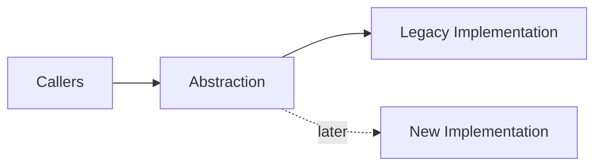
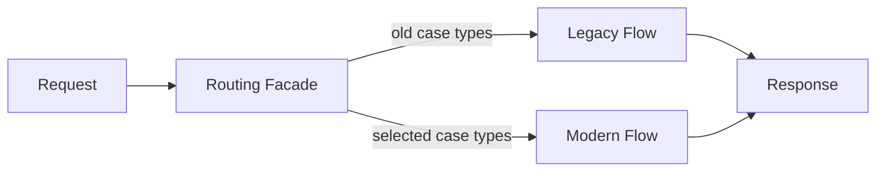
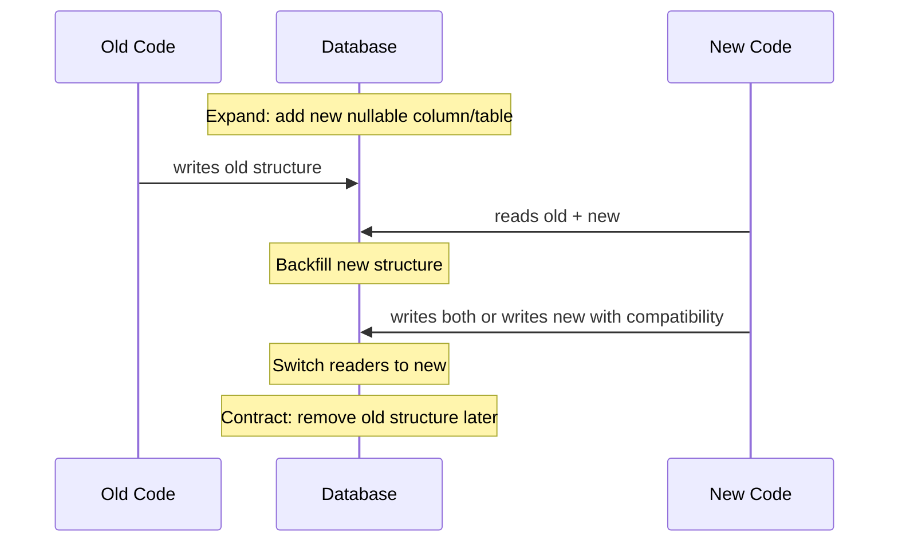
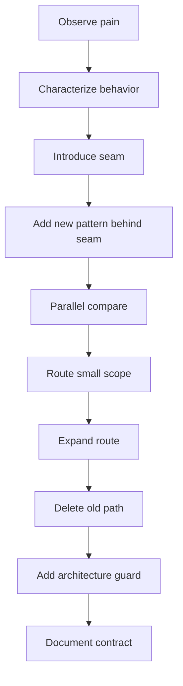

------
title: Learn Java Patterns - Part 032
description: Refactoring to patterns for advanced Java systems: safe seams, characterization tests, branch by abstraction, strangler fig, parallel run, expand-contract migration, extracting policy, replacing conditionals, modularizing legacy code, and making pattern adoption incremental and reversible.
series: learn-java-patterns
seriesTitle: Learn Java Patterns, Data Patterns, Pipeline Patterns, Concurrency Patterns, Common Patterns, and Anti-Patterns
order: 32
partTitle: Refactoring to Patterns
tags:
- java
- patterns
- refactoring
- legacy-code
- modernization
- architecture
- advanced-java
date: 2026-06-27
------

# Part 032 — Refactoring to Patterns

> Goal: learn how to move from messy Java code to pattern-shaped design safely, incrementally, and with evidence.

Patterns are not only for greenfield design.

In production systems, the higher-value skill is usually:

> recognizing a design pressure inside existing code, then refactoring toward the right pattern without breaking behavior.

A top-tier engineer does not say:

> “We should rewrite this using Strategy, Repository, State Machine, and Event Sourcing.”

They say:

> “This area has repeated policy variation, hidden state transitions, persistence leakage, and unsafe side effects. We can first freeze behavior with tests, introduce a seam, extract policy behind an interface, route one case type through the new path, compare outputs, then delete the old branch.”

This part is about that skill.

---

## 1. Kaufman Skill Map

### 1.1 Target skill

After this part, you should be able to:

1. identify which pattern a messy structure is trying to become;
2. avoid pattern-driven rewrites;
3. introduce safe seams around legacy behavior;
4. use characterization tests before changing logic;
5. refactor conditionals into Strategy, Policy, Specification, State, Command, or Pipeline;
6. migrate persistence leakage toward Repository/Mapper boundaries;
7. migrate hidden workflow logic toward explicit state machines;
8. use branch by abstraction and strangler-style routing;
9. control risk with parallel run, feature flags, expand-contract, and observability;
10. know when not to refactor.

### 1.2 Sub-skills

| Sub-skill | What you practice | Failure if ignored |
|---|---|---|
| Smell diagnosis | identify force, not just symptom | wrong pattern chosen |
| Behavior capture | freeze current behavior | regression risk |
| Seam creation | isolate change point | risky invasive edits |
| Incremental migration | small reversible steps | big-bang rewrite failure |
| Pattern extraction | introduce abstraction after evidence | speculative abstraction |
| Parallel verification | compare old/new behavior | silent semantic drift |
| Contract stabilization | narrow public surface | new design leaks old design |
| Deletion | remove old path | permanent duplication |
| Fitness function | prevent regression | architecture decays again |
| Stop condition | know when enough is enough | endless refactoring |

### 1.3 Practice loop

For each refactoring:

1. name the pain in operational terms;
2. identify the invariant at risk;
3. capture current behavior;
4. introduce the smallest seam;
5. route one scenario through the new shape;
6. compare old/new output;
7. increase coverage gradually;
8. delete old code;
9. add an architecture guard;
10. document the new contract.

---

## 2. Mental Model: Refactoring Is Risk Management

Refactoring is not “cleaning code.”

Refactoring is changing internal structure while preserving externally observable behavior.

In production, behavior includes:

- return values;
- database writes;
- emitted events;
- audit records;
- logs relied on by operations;
- metrics used in alerts;
- authorization decisions;
- timing assumptions;
- retries and idempotency;
- error contracts;
- compatibility with clients.

A refactoring that preserves method output but changes audit behavior may still be a production regression.

### 2.1 Pattern refactoring equation

```text
messy behavior + tests + seam + incremental routing + deletion = safe pattern adoption
```

Without tests, refactoring becomes guessing.

Without seams, refactoring becomes surgery.

Without deletion, refactoring creates two systems.

---

## 3. The Pattern Smell Map

A smell is not a pattern yet. It is evidence of a force.

| Smell | Likely design pressure | Candidate pattern |
|---|---|---|
| huge `if/else` by type | behavioral variation | Strategy, Policy, Command |
| repeated validation logic | business rule composition | Specification, Policy |
| boolean flags controlling flow | hidden lifecycle | State Machine, State |
| service method does 20 steps | transformation flow | Pipeline |
| controller calls repositories | boundary collapse | Application Service, Repository |
| JPA entity returned to API | leaky persistence | DTO, Mapper, Facade |
| duplicate remote-call logic | integration concern | Adapter, Gateway Client |
| retry everywhere | resilience scattered | Resilience Policy wrapper |
| audit writes forgotten | cross-cutting invariant | Decorator, Template, Domain Event |
| many module imports internals | weak boundary | Facade, Public API, JPMS/build module |
| async callbacks nested | composition complexity | CompletableFuture composition, Structured Concurrency |
| cache invalidation scattered | consistency concern | Cache policy object, event invalidation |
| workflow status updated directly | invariant bypass | State transition service |
| tenant-specific branches everywhere | extension pressure | Policy Plugin, Configuration Rule |

The smell does not decide the pattern. The invariant does.

---

## 4. Safety Pattern: Characterization Test

### 4.1 Problem

Legacy code lacks tests, but business depends on it.

You want to improve design without accidentally changing behavior.

### 4.2 Solution

Write tests that describe what the code currently does, even if the behavior is ugly.

```java
class LegacyAssignmentServiceCharacterizationTest {

    @Test
    void assignsSeniorCaseToSeniorInvestigatorInJakarta() {
        var service = legacyServiceWithKnownDependencies();

        var result = service.assign("CASE-1", "ID-JK", "MARKET_ABUSE", "HIGH");

        assertThat(result.status()).isEqualTo("ASSIGNED");
        assertThat(result.queue()).isEqualTo("SENIOR_INVESTIGATION");
        assertThat(auditSink.records())
                .extracting(AuditRecord::action)
                .contains("CASE_ASSIGNED");
    }
}
```

### 4.3 What to capture

Capture:

- normal outputs;
- edge-case outputs;
- error behavior;
- persistence writes;
- event emissions;
- audit records;
- authorization behavior;
- idempotency behavior;
- time behavior;
- null/empty handling;
- known bugs if clients depend on them.

### 4.4 Rule

Do not make characterization tests prettier than the legacy behavior.

Their job is to protect current behavior while you create room to improve it.

---

## 5. Safety Pattern: Golden Master

### 5.1 Problem

A function has many input combinations and complex output.

Writing precise expected values manually is too slow.

### 5.2 Solution

Generate a stable corpus of inputs and record current outputs as the golden master.

```java
class NoticeGenerationGoldenMasterTest {

    @Test
    void generatedNoticeMatchesApprovedOutput() {
        var input = NoticeFixtures.marketAbuseWarningLetter();
        var output = legacyNoticeGenerator.generate(input);

        Approvals.verify(output.body());
    }
}
```

### 5.3 Use cases

Golden master is useful for:

- document generation;
- rule-heavy decision tables;
- fee calculations;
- serialization payloads;
- mapping logic;
- legacy reporting;
- generated SQL;
- notification templates.

### 5.4 Risk

Golden master can freeze bad behavior.

Use it to create a safety net, then explicitly decide which behaviors should change.

---

## 6. Safety Pattern: Seam

### 6.1 Problem

You cannot replace behavior because callers are tightly coupled to implementation.

### 6.2 Solution

Introduce a seam: a place where behavior can be changed without editing callers again.

```java
public interface AssignmentPolicy {
    AssignmentDecision decide(AssignmentContext context);
}
```

Legacy adapter:

```java
public final class LegacyAssignmentPolicyAdapter implements AssignmentPolicy {
    private final LegacyAssignmentService legacy;

    @Override
    public AssignmentDecision decide(AssignmentContext context) {
        var result = legacy.calculateAssignment(
                context.caseType().code(),
                context.jurisdiction().code(),
                context.riskScore().value());
        return LegacyAssignmentMapper.toDecision(result);
    }
}
```

New policy:

```java
public final class RuleBasedAssignmentPolicy implements AssignmentPolicy {
    private final List<AssignmentRule> rules;

    @Override
    public AssignmentDecision decide(AssignmentContext context) {
        return rules.stream()
                .filter(rule -> rule.matches(context))
                .findFirst()
                .map(rule -> rule.toDecision(context))
                .orElseGet(() -> AssignmentDecision.manualReview("NO_RULE"));
    }
}
```

### 6.3 Why a seam matters

Once callers depend on `AssignmentPolicy`, you can swap the implementation.

The seam is more important than the new implementation.

---

## 7. Migration Pattern: Branch by Abstraction

### 7.1 Problem

A feature is too large to replace in one commit.

### 7.2 Solution

Introduce an abstraction, then migrate implementations behind it.



Steps:

1. create abstraction matching current behavior;
2. route callers through abstraction;
3. keep legacy implementation behind abstraction;
4. build new implementation behind same abstraction;
5. switch traffic gradually;
6. compare results;
7. remove legacy implementation.

### 7.3 Java example

```java
public interface CaseClosureService {
    ClosureResult close(CloseCaseCommand command);
}
```

Router:

```java
public final class RoutingCaseClosureService implements CaseClosureService {
    private final CaseClosureService legacy;
    private final CaseClosureService modern;
    private final FeatureDecisions decisions;

    @Override
    public ClosureResult close(CloseCaseCommand command) {
        if (decisions.useModernClosure(command.caseType())) {
            return modern.close(command);
        }
        return legacy.close(command);
    }
}
```

### 7.4 Rule

The abstraction should be based on business capability, not the legacy class name.

Bad:

```java
interface LegacyCaseService2
```

Better:

```java
interface CaseClosureService
```

---

## 8. Migration Pattern: Strangler Routing

### 8.1 Problem

A legacy subsystem is too large to replace safely.

### 8.2 Solution

Route a subset of traffic to the new implementation while the old system remains intact.



### 8.3 Routing dimensions

Route by:

- case type;
- tenant;
- jurisdiction;
- user group;
- feature flag;
- new records only;
- read-only first;
- low-risk workflow state;
- percentage rollout, if behavior is safe to compare.

### 8.4 Safety requirements

Before routing production traffic:

- characterize old behavior;
- define equivalence criteria;
- add observability comparing outcomes;
- create rollback switch;
- isolate writes;
- document known semantic differences;
- train support/on-call.

---

## 9. Migration Pattern: Parallel Run

### 9.1 Problem

You need confidence that new logic matches old logic before switching.

### 9.2 Solution

Execute old and new implementations, use one as source of truth, compare outputs.

```java
public final class ComparingAssignmentPolicy implements AssignmentPolicy {
    private final AssignmentPolicy primary;
    private final AssignmentPolicy candidate;
    private final DifferenceSink differences;

    @Override
    public AssignmentDecision decide(AssignmentContext context) {
        var primaryDecision = primary.decide(context);

        try {
            var candidateDecision = candidate.decide(context);
            if (!equivalent(primaryDecision, candidateDecision)) {
                differences.record(context, primaryDecision, candidateDecision);
            }
        } catch (RuntimeException ex) {
            differences.recordFailure(context, ex);
        }

        return primaryDecision;
    }
}
```

### 9.3 Rule

Parallel run is easy for pure decisions and dangerous for side effects.

Safe:

- validation result;
- policy decision;
- price calculation;
- routing decision;
- generated preview;
- read model query.

Dangerous:

- sending email;
- mutating workflow state;
- writing audit event;
- charging payment;
- publishing integration event.

For side effects, compare plans rather than executing both.

---

## 10. Migration Pattern: Expand-Contract

### 10.1 Problem

You need to change database schema or API contract without breaking running code.

### 10.2 Solution

Use expand-contract migration.



### 10.3 Steps

1. add new schema without removing old schema;
2. deploy code that can read both;
3. backfill;
4. deploy code that writes both or writes new with compatibility;
5. switch readers;
6. verify metrics;
7. remove old writes;
8. remove old schema.

### 10.4 Rule

Do not combine expand and contract in one risky deployment.

Database compatibility is a runtime concern, not just migration syntax.

---

## 11. Refactoring: Conditional to Strategy

### 11.1 Starting point

```java
public BigDecimal calculatePenalty(CaseRecord record) {
    if (record.type() == CaseType.MARKET_ABUSE) {
        return record.baseAmount().multiply(new BigDecimal("1.25"));
    }
    if (record.type() == CaseType.LICENSING) {
        return record.baseAmount().multiply(new BigDecimal("0.75"));
    }
    if (record.type() == CaseType.CONSUMER_PROTECTION) {
        return record.baseAmount().add(new BigDecimal("1000"));
    }
    throw new UnsupportedOperationException("Unsupported case type");
}
```

### 11.2 Introduce strategy

```java
public interface PenaltyStrategy {
    boolean supports(CaseType caseType);
    Money calculate(CaseRecord record);
}
```

Implementations:

```java
public final class MarketAbusePenaltyStrategy implements PenaltyStrategy {
    @Override
    public boolean supports(CaseType caseType) {
        return caseType == CaseType.MARKET_ABUSE;
    }

    @Override
    public Money calculate(CaseRecord record) {
        return record.baseAmount().multiply("1.25");
    }
}
```

Resolver:

```java
public final class PenaltyCalculator {
    private final List<PenaltyStrategy> strategies;

    public Money calculate(CaseRecord record) {
        return strategies.stream()
                .filter(strategy -> strategy.supports(record.type()))
                .findFirst()
                .orElseThrow(() -> new UnsupportedCaseTypeException(record.type()))
                .calculate(record);
    }
}
```

### 11.3 When this is good

Use Strategy when:

- behaviors vary by type;
- each branch has meaningful logic;
- branches evolve independently;
- new behavior is added regularly;
- behavior needs isolated tests.

### 11.4 When not to use it

Do not replace a three-line stable `switch` with ten classes just to “use Strategy.”

A pattern is justified by change pressure.

---

## 12. Refactoring: Conditional to Policy Object

### 12.1 Starting point

```java
if (user.hasRole("SUPERVISOR") && caseFile.ageDays() > 30 && caseFile.risk() == HIGH) {
    escalate(caseFile);
}
```

This embeds policy inside application flow.

### 12.2 Extract policy

```java
public interface EscalationPolicy {
    EscalationDecision evaluate(EscalationContext context);
}
```

```java
public final class DefaultEscalationPolicy implements EscalationPolicy {
    @Override
    public EscalationDecision evaluate(EscalationContext context) {
        if (context.actor().hasRole(Role.SUPERVISOR)
                && context.caseAge().compareTo(Duration.ofDays(30)) > 0
                && context.riskScore().isHigh()) {
            return EscalationDecision.escalate("HIGH_RISK_AGED_CASE");
        }
        return EscalationDecision.keepCurrent("NO_ESCALATION_RULE_MATCHED");
    }
}
```

### 12.3 Benefit

The application service now reads like workflow:

```java
var decision = escalationPolicy.evaluate(context);
caseWorkflow.apply(caseId, decision, actor);
```

Policy becomes testable, replaceable, auditable, and versionable.

---

## 13. Refactoring: Conditional to Specification

### 13.1 Problem

Validation and filtering rules are duplicated.

```java
if (caseFile.status() == OPEN
        && caseFile.assignee() != null
        && caseFile.riskScore().isHigh()) {
    ...
}
```

### 13.2 Extract specification

```java
public interface Specification<T> {
    boolean isSatisfiedBy(T candidate);

    default Specification<T> and(Specification<T> other) {
        return candidate -> this.isSatisfiedBy(candidate) && other.isSatisfiedBy(candidate);
    }

    default Specification<T> or(Specification<T> other) {
        return candidate -> this.isSatisfiedBy(candidate) || other.isSatisfiedBy(candidate);
    }

    default Specification<T> not() {
        return candidate -> !this.isSatisfiedBy(candidate);
    }
}
```

```java
public final class HighRiskOpenAssignedCase implements Specification<CaseFile> {
    @Override
    public boolean isSatisfiedBy(CaseFile candidate) {
        return candidate.status() == CaseStatus.OPEN
                && candidate.assignee().isPresent()
                && candidate.riskScore().isHigh();
    }
}
```

### 13.3 Caution

In-memory specification is not automatically a database query specification.

If a specification must translate to SQL, model that separately.

Do not hide expensive queries behind a boolean method.

---

## 14. Refactoring: Flags to State Machine

### 14.1 Starting point

```java
caseFile.setReviewed(true);
caseFile.setApproved(false);
caseFile.setEscalated(true);
caseFile.setClosed(false);
```

This creates impossible states.

### 14.2 Introduce explicit state

```java
public enum CaseState {
    DRAFT,
    SUBMITTED,
    UNDER_REVIEW,
    ESCALATED,
    APPROVED,
    CLOSED,
    REJECTED
}
```

### 14.3 Transition service

```java
public final class CaseStateMachine {
    private static final Map<CaseState, Set<CaseState>> ALLOWED = Map.of(
            CaseState.DRAFT, Set.of(CaseState.SUBMITTED),
            CaseState.SUBMITTED, Set.of(CaseState.UNDER_REVIEW, CaseState.REJECTED),
            CaseState.UNDER_REVIEW, Set.of(CaseState.ESCALATED, CaseState.APPROVED, CaseState.REJECTED),
            CaseState.ESCALATED, Set.of(CaseState.APPROVED, CaseState.REJECTED),
            CaseState.APPROVED, Set.of(CaseState.CLOSED),
            CaseState.REJECTED, Set.of(CaseState.CLOSED),
            CaseState.CLOSED, Set.of()
    );

    public void transition(CaseFile caseFile, CaseState target, TransitionContext context) {
        var allowedTargets = ALLOWED.getOrDefault(caseFile.state(), Set.of());
        if (!allowedTargets.contains(target)) {
            throw new InvalidTransitionException(caseFile.state(), target);
        }
        caseFile.transitionTo(target, context.actor(), context.now(), context.reason());
    }
}
```

### 14.4 Migration steps

1. add `state` next to old flags;
2. compute state from flags for old records;
3. dual-write flags and state temporarily;
4. route transitions through state machine;
5. remove direct flag mutation;
6. remove obsolete flags after compatibility window.

---

## 15. Refactoring: Long Service Method to Pipeline

### 15.1 Starting point

```java
public Result process(Input input) {
    validate(input);
    var normalized = normalize(input);
    var enriched = enrich(normalized);
    var scored = score(enriched);
    var decision = decide(scored);
    audit(decision);
    notify(decision);
    return result(decision);
}
```

This may be acceptable if simple. It becomes a problem when each step has branching, retry, metrics, skip/quarantine, or independent tests.

### 15.2 Introduce stage

```java
public interface PipelineStage<I, O> {
    O process(I input);
}
```

Context:

```java
public record CasePipelineContext(
        CaseDraft draft,
        ValidationResult validation,
        Optional<OfficerProfile> officer,
        Optional<RiskScore> riskScore
) {}
```

Pipeline:

```java
public final class CaseIntakePipeline {
    private final PipelineStage<CasePipelineContext, CasePipelineContext> validate;
    private final PipelineStage<CasePipelineContext, CasePipelineContext> enrich;
    private final PipelineStage<CasePipelineContext, CasePipelineContext> score;
    private final PipelineStage<CasePipelineContext, IntakeDecision> decide;

    public IntakeDecision process(CaseDraft draft) {
        var context = new CasePipelineContext(draft, ValidationResult.empty(), Optional.empty(), Optional.empty());
        context = validate.process(context);
        context = enrich.process(context);
        context = score.process(context);
        return decide.process(context);
    }
}
```

### 15.3 Rule

A pipeline is useful when stages have meaningful independent behavior.

Do not turn every readable method into a framework.

---

## 16. Refactoring: Persistence Leakage to Repository + Mapper

### 16.1 Starting point

```java
@RestController
class CaseController {
    private final CaseJpaRepository repository;

    @GetMapping("/cases/{id}")
    CaseEntity get(@PathVariable String id) {
        return repository.findById(id).orElseThrow();
    }
}
```

Problems:

- API exposes persistence shape;
- controller bypasses application boundary;
- transaction behavior is unclear;
- lazy loading may leak into serialization;
- domain invariant may be bypassed.

### 16.2 Introduce query port

```java
public interface CaseQueryService {
    CaseView getCase(CaseId id);
}
```

DTO:

```java
public record CaseView(
        String id,
        String title,
        String state,
        String assigneeName,
        Instant lastUpdatedAt
) {}
```

Implementation:

```java
public final class DefaultCaseQueryService implements CaseQueryService {
    private final CaseReadRepository repository;

    @Override
    public CaseView getCase(CaseId id) {
        return repository.findViewById(id).orElseThrow(() -> new CaseNotFoundException(id));
    }
}
```

Controller:

```java
@RestController
class CaseController {
    private final CaseQueryService queryService;

    @GetMapping("/cases/{id}")
    CaseView get(@PathVariable String id) {
        return queryService.getCase(new CaseId(id));
    }
}
```

### 16.3 Migration path

1. create DTO matching existing API response;
2. map entity to DTO;
3. switch controller return type;
4. move query logic to service;
5. hide repository inside implementation package;
6. add architecture test blocking entity exposure.

---

## 17. Refactoring: Side Effects to Command Handler

### 17.1 Starting point

A controller does everything:

```java
@PostMapping("/cases/{id}/assign")
void assign(@PathVariable String id, @RequestBody AssignRequest request) {
    var entity = repository.findById(id).orElseThrow();
    entity.setAssignee(request.officerId());
    repository.save(entity);
    audit.write("ASSIGNED");
    email.send(...);
}
```

### 17.2 Extract command

```java
public record AssignCaseCommand(
        CaseId caseId,
        OfficerId officerId,
        UserId actor,
        Instant requestedAt,
        String reason
) {}
```

Handler:

```java
public final class AssignCaseHandler {
    private final CaseRepository repository;
    private final AssignmentPolicy policy;
    private final AuditSink auditSink;
    private final DomainEventPublisher events;

    public AssignmentResult handle(AssignCaseCommand command) {
        var caseFile = repository.get(command.caseId());
        var decision = policy.decide(AssignmentContext.from(caseFile, command));
        caseFile.assign(command.officerId(), command.actor(), command.requestedAt(), decision.reason());
        repository.save(caseFile);
        auditSink.record(AuditRecord.caseAssigned(command.caseId(), command.actor(), command.requestedAt()));
        events.publish(new CaseAssigned(command.caseId(), command.officerId(), command.requestedAt()));
        return AssignmentResult.assigned(command.caseId(), command.officerId());
    }
}
```

Controller now only adapts HTTP to command.

### 17.3 Benefit

The use case becomes reusable by:

- REST;
- message consumer;
- batch job;
- workflow engine;
- test harness.

---

## 18. Refactoring: Direct Event Publish to Outbox

### 18.1 Starting point

```java
repository.save(caseFile);
eventPublisher.publish(new CaseAssigned(caseId));
```

If database commit succeeds but publish fails, the system is inconsistent.

### 18.2 Move to outbox

```java
transactionTemplate.executeWithoutResult(tx -> {
    repository.save(caseFile);
    outbox.append(EventEnvelope.of(new CaseAssigned(caseId, officerId)));
});
```

Relay publishes later:

```java
public final class OutboxRelay {
    public void pollAndPublish() {
        var batch = outboxRepository.claimBatch(100);
        for (var message : batch) {
            try {
                broker.publish(message.topic(), message.key(), message.payload());
                outboxRepository.markPublished(message.id());
            } catch (RuntimeException ex) {
                outboxRepository.markFailedAttempt(message.id(), ex);
            }
        }
    }
}
```

### 18.3 Migration path

1. create outbox table;
2. write old event and outbox event in parallel if safe;
3. run relay in shadow mode;
4. compare broker output;
5. switch producer to outbox-only;
6. enforce idempotent consumers;
7. remove direct publish.

---

## 19. Refactoring: Retry Scattering to Resilience Policy

### 19.1 Starting point

```java
try {
    return client.call(request);
} catch (Exception ex) {
    Thread.sleep(1000);
    return client.call(request);
}
```

Problems:

- catches too broadly;
- blocks blindly;
- ignores deadline;
- duplicates retry logic;
- may retry non-idempotent operation;
- no metrics.

### 19.2 Extract resilience wrapper

```java
public interface RemoteCallPolicy {
    <T> T execute(String dependency, Supplier<T> operation);
}
```

Usage:

```java
return remoteCallPolicy.execute("officer-directory", () -> client.findOfficer(officerId));
```

### 19.3 Policy responsibilities

The wrapper owns:

- timeout;
- retry classification;
- backoff;
- circuit breaker;
- bulkhead;
- metrics;
- logging;
- failure mapping.

The domain/application logic owns what to do if dependency is unavailable.

---

## 20. Refactoring: Cache Scattering to Cache Policy

### 20.1 Starting point

```java
var cached = cache.get(key);
if (cached != null) return cached;
var loaded = repository.find(key);
cache.put(key, loaded);
return loaded;
```

Repeated everywhere.

### 20.2 Extract cache policy

```java
public final class ReferenceDataCache {
    private final LoadingCache<ReferenceDataKey, ReferenceData> cache;

    public ReferenceData get(ReferenceDataKey key) {
        return cache.get(key);
    }

    public void invalidate(ReferenceDataKey key) {
        cache.invalidate(key);
    }
}
```

### 20.3 Policy document

Every cache should have:

- owner;
- source of truth;
- key shape;
- value shape;
- TTL;
- max size;
- invalidation trigger;
- stale behavior;
- authorization constraint;
- metrics;
- failure behavior.

If you cannot write this, you are not ready to add the cache.

---

## 21. Refactoring: Module Internals to Public Facade

### 21.1 Starting point

Many modules import `assignment.internal.*`.

### 21.2 Add facade

```java
public interface AssignmentFacade {
    AssignmentSummary getAssignment(CaseId caseId);
    AssignmentResult assign(AssignCaseCommand command);
}
```

Internal adapter:

```java
public final class DefaultAssignmentFacade implements AssignmentFacade {
    private final AssignCaseHandler assignCaseHandler;
    private final AssignmentQueryService queryService;

    @Override
    public AssignmentSummary getAssignment(CaseId caseId) {
        return queryService.getAssignment(caseId);
    }

    @Override
    public AssignmentResult assign(AssignCaseCommand command) {
        return assignCaseHandler.handle(command);
    }
}
```

### 21.3 Migration path

1. identify external imports of internal packages;
2. add facade methods for legitimate use cases;
3. migrate callers gradually;
4. block new internal imports with architecture test;
5. remove obsolete internal access.

---

## 22. Refactoring: Legacy Static Utility to Domain Service or Value Object

### 22.1 Starting point

```java
public final class CaseUtils {
    public static boolean isHighRisk(String caseType, int score, String jurisdiction) {
        ...
    }
}
```

### 22.2 If behavior belongs to a value object

```java
public record RiskScore(int value) {
    public boolean isHigh() {
        return value >= 80;
    }
}
```

### 22.3 If behavior needs several objects

```java
public final class RiskClassificationService {
    public RiskClassification classify(CaseType type, RiskScore score, Jurisdiction jurisdiction) {
        ...
    }
}
```

### 22.4 Migration path

1. write tests around utility;
2. introduce value objects;
3. delegate old utility to new service/value object;
4. migrate callers;
5. deprecate utility;
6. remove after usage reaches zero.

---

## 23. Refactoring: Primitive Obsession to Value Object

### 23.1 Starting point

```java
void assign(String caseId, String officerId, String jurisdiction, String reason) { ... }
```

### 23.2 Introduce value objects

```java
public record CaseId(String value) {
    public CaseId {
        if (value == null || value.isBlank()) {
            throw new IllegalArgumentException("caseId is required");
        }
    }
}

public record OfficerId(String value) {
    public OfficerId {
        if (value == null || value.isBlank()) {
            throw new IllegalArgumentException("officerId is required");
        }
    }
}
```

### 23.3 Migration strategy

Do not change every method at once.

Start at boundaries:

- command records;
- domain methods;
- repository ports;
- event payloads;
- DTO mapper edge.

Then move inward.

### 23.4 Benefit

The compiler prevents accidental parameter swaps.

```java
assign(new OfficerId("O-1"), new CaseId("C-1")); // cannot compile if types are correct
```

---

## 24. Refactoring: Anemic Workflow to Domain Transition

### 24.1 Starting point

```java
caseFile.setStatus("APPROVED");
caseFile.setApprovedBy(userId);
caseFile.setApprovedAt(now);
caseFile.setClosureDueDate(now.plusDays(30));
```

This allows callers to forget part of the invariant.

### 24.2 Move invariant into domain method

```java
public final class CaseFile {
    public void approve(UserId approver, Instant approvedAt) {
        if (state != CaseState.UNDER_REVIEW) {
            throw new InvalidTransitionException(state, CaseState.APPROVED);
        }
        this.state = CaseState.APPROVED;
        this.approvedBy = approver;
        this.approvedAt = approvedAt;
        this.closureDueDate = approvedAt.plus(Period.ofDays(30));
        this.events.add(new CaseApproved(id, approver, approvedAt));
    }
}
```

### 24.3 Application service

```java
public ApprovalResult approve(ApproveCaseCommand command) {
    var caseFile = repository.get(command.caseId());
    authorization.requireCanApprove(command.actor(), caseFile);
    caseFile.approve(command.actor(), command.approvedAt());
    repository.save(caseFile);
    outbox.appendAll(caseFile.pullEvents());
    return ApprovalResult.approved(command.caseId());
}
```

The invariant now has one home.

---

## 25. Refactoring: God Service to Use Cases

### 25.1 Starting point

`CaseService` has 80 methods:

```text
createCase
assignCase
approveCase
closeCase
reopenCase
sendNotice
calculatePenalty
uploadEvidence
deleteEvidence
...
```

### 25.2 Split by use case

```text
CreateCaseHandler
AssignCaseHandler
ApproveCaseHandler
CloseCaseHandler
UploadEvidenceHandler
```

Shared domain objects remain shared. Use cases become small orchestration units.

### 25.3 Migration path

1. choose one high-change use case;
2. introduce command and result;
3. move logic from god service to handler;
4. let old service delegate to handler;
5. migrate callers;
6. repeat;
7. delete empty old service.

```java
public final class LegacyCaseService {
    private final AssignCaseHandler assignCaseHandler;

    public LegacyAssignmentResult assignCase(String caseId, String officerId) {
        var result = assignCaseHandler.handle(new AssignCaseCommand(
                new CaseId(caseId),
                new OfficerId(officerId),
                CurrentUser.id(),
                Instant.now(),
                "legacy-call"));
        return LegacyAssignmentMapper.toLegacy(result);
    }
}
```

This allows gradual migration without breaking old callers.

---

## 26. Tool Pattern: Automated Refactoring Recipe

### 26.1 Problem

A refactoring is simple but repeated across hundreds of files.

Manual editing is slow and inconsistent.

### 26.2 Solution

Use automated refactoring when the transformation is mechanical.

Examples:

- package rename;
- deprecated API replacement;
- annotation migration;
- import cleanup;
- framework version migration;
- replacing old assertion style;
- changing method signature with predictable mapping;
- adding standard timeout wrapper.

### 26.3 Rule

Automate mechanics, not judgment.

A recipe can replace `oldApi.call(x)` with `newApi.call(x)`. It cannot decide the correct domain boundary for you.

### 26.4 Safety

Before automated refactoring:

- commit clean baseline;
- run tests;
- run recipe on small module;
- inspect diff;
- run static analysis;
- run full tests;
- apply broadly;
- review generated diff by risk category.

---

## 27. Tool Pattern: Architecture Guard After Refactoring

### 27.1 Problem

You clean up a boundary. Two months later, someone imports internals again.

### 27.2 Solution

Add a guard immediately after migration.

```java
@ArchTest
static final ArchRule no_external_access_to_assignment_internals =
        noClasses()
                .that().resideOutsideOfPackage("..assignment..")
                .should().dependOnClassesThat()
                .resideInAPackage("..assignment.internal..");
```

### 27.3 Rule

Every architecture refactoring should end with a failing test that would have caught the old problem.

If there is no guard, the refactoring is temporary.

---

## 28. Refactoring Decision Framework

### 28.1 Should we refactor?

Ask:

1. Is this code changing frequently?
2. Does it cause bugs?
3. Does it slow delivery?
4. Does it threaten a domain invariant?
5. Does it hide operational risk?
6. Is there enough test coverage or can we add it?
7. Can we refactor incrementally?
8. Can we stop halfway safely?
9. Can we delete old code?
10. Is the business value clear?

If most answers are no, do not refactor now.

### 28.2 Refactoring priority matrix

| Impact | Change frequency | Priority |
|---|---|---|
| high | high | refactor soon |
| high | low | refactor only if risk/security/compliance demands |
| low | high | refactor opportunistically |
| low | low | leave it |

### 28.3 Avoid aesthetic refactoring

Aesthetic refactoring is when code is changed because a design looks nicer, not because a force requires it.

Professional refactoring must be tied to:

- reduced defect rate;
- safer change;
- clearer invariant;
- lower operational risk;
- faster delivery;
- better testability;
- regulatory defensibility;
- measurable performance or reliability need.

---

## 29. Pattern Adoption Sequence

A safe sequence for adopting patterns in legacy Java systems:



This sequence works for:

- Strategy extraction;
- Repository boundary;
- State machine migration;
- Pipeline introduction;
- plugin extension point;
- outbox migration;
- cache policy extraction;
- resilience wrapper standardization;
- module boundary cleanup.

---

## 30. Example: End-to-End Refactoring Scenario

### 30.1 Starting point

A regulatory case system has this method:

```java
public void submitCase(String caseId, String userId) {
    var entity = caseRepo.findById(caseId).get();

    if (!security.canSubmit(userId, entity.getJurisdiction())) {
        throw new RuntimeException("Forbidden");
    }

    if (entity.getStatus().equals("DRAFT")) {
        entity.setStatus("SUBMITTED");
    } else {
        throw new RuntimeException("Invalid status");
    }

    if (entity.getType().equals("MARKET_ABUSE") && entity.getRisk() > 80) {
        entity.setQueue("SENIOR_REVIEW");
    } else {
        entity.setQueue("NORMAL_REVIEW");
    }

    caseRepo.save(entity);
    auditRepo.save(new AuditEntity(caseId, "SUBMITTED", userId));
    kafka.send("case-submitted", caseId);
}
```

Problems:

- primitive IDs;
- direct entity mutation;
- weak authorization error;
- hidden state transition;
- embedded assignment policy;
- direct event publish after DB write;
- audit can be forgotten elsewhere;
- generic runtime exceptions;
- no idempotency;
- hard to test.

### 30.2 Step 1: Characterize

```java
@Test
void draftHighRiskMarketAbuseCaseGoesToSeniorReview() {
    var result = legacy.submitCase("C-1", "U-1");

    assertThat(caseRepo.get("C-1").getStatus()).isEqualTo("SUBMITTED");
    assertThat(caseRepo.get("C-1").getQueue()).isEqualTo("SENIOR_REVIEW");
    assertThat(auditRepo.recordsFor("C-1")).hasSize(1);
    assertThat(kafka.records("case-submitted")).hasSize(1);
}
```

### 30.3 Step 2: Introduce command

```java
public record SubmitCaseCommand(
        CaseId caseId,
        UserId actor,
        Instant submittedAt,
        IdempotencyKey idempotencyKey
) {}
```

### 30.4 Step 3: Extract authorization

```java
authorization.requireCanSubmit(command.actor(), caseFile);
```

### 30.5 Step 4: Extract state transition

```java
caseFile.submit(command.actor(), command.submittedAt());
```

### 30.6 Step 5: Extract assignment policy

```java
var queue = assignmentPolicy.initialQueueFor(caseFile.snapshot());
caseFile.assignToQueue(queue, command.actor(), command.submittedAt());
```

### 30.7 Step 6: Move event to outbox

```java
repository.save(caseFile);
outbox.appendAll(caseFile.pullEvents());
```

### 30.8 Final shape

```java
public final class SubmitCaseHandler {
    private final CaseRepository repository;
    private final AuthorizationService authorization;
    private final InitialReviewQueuePolicy queuePolicy;
    private final Outbox outbox;
    private final IdempotencyService idempotency;

    public SubmitCaseResult handle(SubmitCaseCommand command) {
        return idempotency.execute(command.idempotencyKey(), () -> {
            var caseFile = repository.get(command.caseId());

            authorization.requireCanSubmit(command.actor(), caseFile);

            caseFile.submit(command.actor(), command.submittedAt());

            var queue = queuePolicy.initialQueueFor(caseFile.snapshot());
            caseFile.assignToQueue(queue, command.actor(), command.submittedAt());

            repository.save(caseFile);
            outbox.appendAll(caseFile.pullEvents());

            return SubmitCaseResult.submitted(command.caseId(), queue);
        });
    }
}
```

### 30.9 What changed?

The behavior is not merely “cleaner.”

Now:

- state transition has one home;
- authorization is explicit;
- policy is replaceable;
- events are transactionally safe through outbox;
- idempotency is modeled;
- audit/domain events are attached to domain transition;
- command boundary is testable;
- future workflow extension is easier.

---

## 31. Anti-Patterns

### 31.1 Pattern-Led Rewrite

Team starts with:

> “Let’s rewrite this using DDD, CQRS, event-driven architecture, and plugins.”

Instead of:

> “Which invariant is at risk, and what is the smallest pattern that protects it?”

Fix:

- diagnose force first;
- introduce one pattern at a time;
- prove value with tests and reduced risk.

### 31.2 Half-Migration Forever

New code exists, old code exists, both are active, and no one knows which is correct.

Fix:

- define deletion milestone;
- track old-path usage;
- set owner and deadline;
- block new usage of old path.

### 31.3 Abstraction Before Evidence

Interfaces are created for everything before there are multiple implementations or clear volatility.

Fix:

- introduce abstraction when it enables seam, testing, or variation;
- keep concrete code until pressure appears.

### 31.4 Refactor Without Observability

New path is deployed but no one can compare behavior.

Fix:

- add metrics and logs before routing;
- record old/new differences;
- create rollback switch.

### 31.5 Test Rewrite Instead of Behavior Capture

Team rewrites tests to match the desired design and loses old behavior evidence.

Fix:

- keep characterization tests initially;
- add new semantic tests separately;
- delete old tests only after migration decision.

### 31.6 Big-Bang Modularization

Team attempts to split the whole monolith into perfect modules at once.

Fix:

- start with one high-change boundary;
- add architecture guard;
- repeat.

---

## 32. Production Checklist

Before starting pattern refactoring:

### Diagnosis

- What problem are we solving?
- Which invariant is currently hard to protect?
- Is the pain frequent enough to justify refactoring?
- Which pattern best matches the force?

### Safety

- Do we have characterization tests?
- Can we add them without huge cost?
- What behavior must not change?
- What behavior is allowed to change?
- How will we detect regression?

### Migration

- What is the seam?
- Can old and new implementations coexist?
- Can we route a small slice first?
- Is rollback simple?
- What is the deletion plan?

### Data

- Is schema migration needed?
- Do we need expand-contract?
- Is backfill required?
- How do we validate data equivalence?

### Operations

- What metrics compare old/new behavior?
- What logs/traces identify route path?
- What alerts may change?
- Does on-call understand the new failure modes?

### Governance

- Who owns the new abstraction?
- Is contract documented?
- Is architecture guard added?
- Is old usage blocked?

---

## 33. Practice Drills

### Drill 1: Conditional to Strategy

Take a method with branching by case type.

Do:

1. write characterization tests;
2. extract strategy interface;
3. keep old method delegating to strategy registry;
4. add one new strategy;
5. delete one old branch.

### Drill 2: Flags to State Machine

Take an object with boolean lifecycle flags.

Do:

1. infer valid states;
2. add state enum;
3. map old flags to state;
4. route one transition through state machine;
5. block direct status mutation.

### Drill 3: Controller to Command Handler

Take a controller that writes DB and sends events.

Do:

1. create command record;
2. extract handler;
3. model result;
4. move event publish to outbox;
5. controller becomes adapter only.

### Drill 4: Repository Leak Cleanup

Take an API returning an entity.

Do:

1. create DTO preserving response shape;
2. map entity to DTO;
3. introduce query service;
4. block entity exposure with architecture test.

### Drill 5: Parallel Run

Take a pure policy method.

Do:

1. create old adapter;
2. create new implementation;
3. execute both;
4. log differences;
5. switch one low-risk route.

---

## 34. Summary

Refactoring to patterns is not about making code look like a design-pattern catalog.

It is about making important behavior safer to change.

The production-grade sequence is:

1. diagnose the force;
2. freeze current behavior;
3. introduce a seam;
4. add the pattern behind the seam;
5. route gradually;
6. compare behavior;
7. delete old path;
8. add a guard so the problem does not return.

Patterns are powerful when they are pulled by real pressure:

- Strategy for behavioral variation;
- Policy for decision ownership;
- Specification for composable predicates;
- State Machine for lifecycle invariants;
- Pipeline for staged processing;
- Repository/Mapper for persistence boundaries;
- Command Handler for use-case orchestration;
- Outbox for transactional event publishing;
- Facade/API module for boundary control;
- Strangler/Branch by Abstraction for safe migration.

The most important habit:

> Never introduce a pattern without a migration path and a deletion path.

In the next part, we will study Java and enterprise anti-patterns: the recurring failure shapes that make systems hard to change, hard to operate, and hard to defend.
