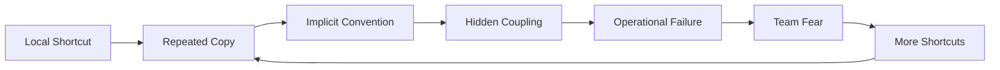
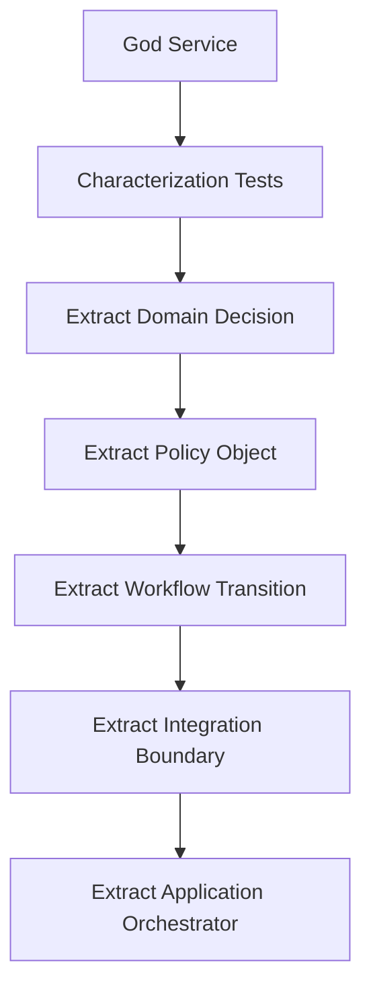
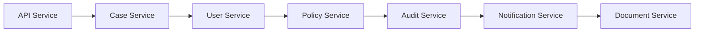
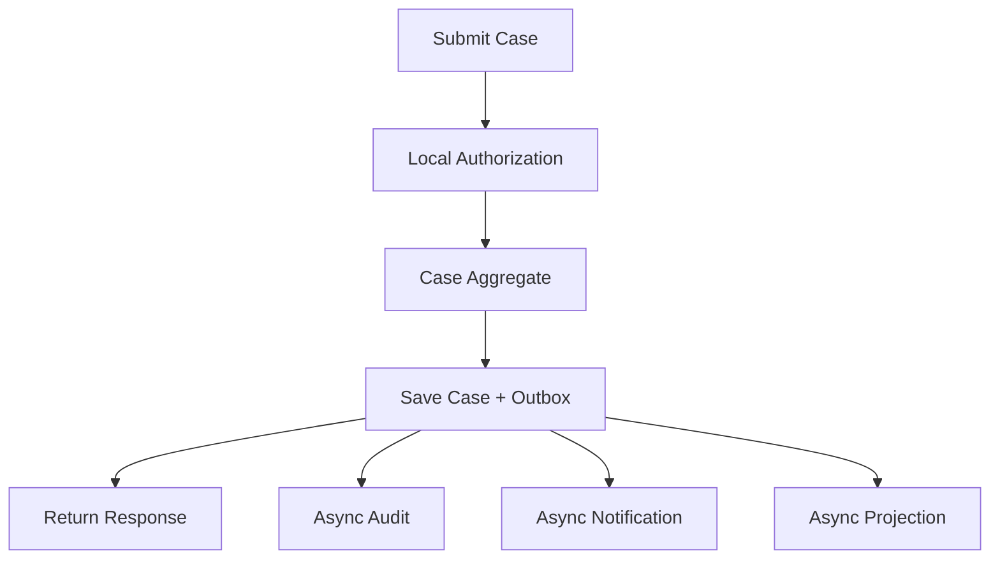
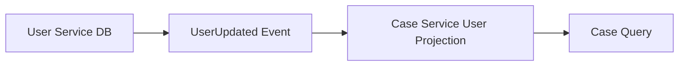
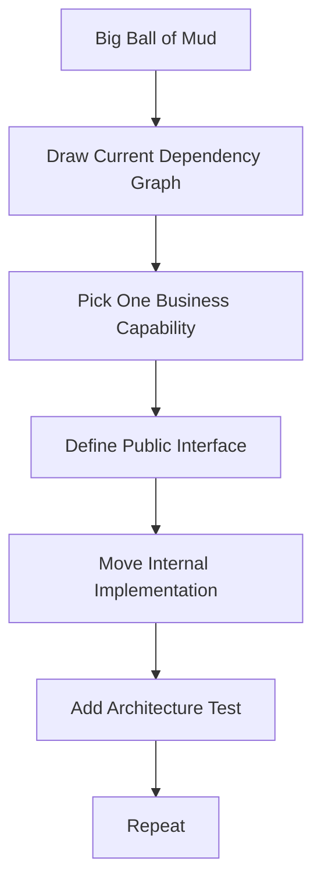
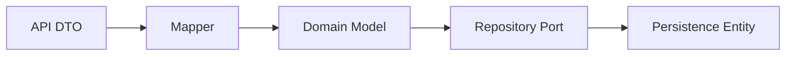

------
title: Learn Java Patterns - Part 033
description: Java and enterprise anti-patterns catalog for advanced engineers: how bad designs form, how to detect them, and how to refactor them safely.
series: learn-java-patterns
seriesTitle: Learn Java Patterns, Data Patterns, Pipeline Patterns, Concurrency Patterns, Common Patterns, and Anti-Patterns
order: 33
partTitle: Java and Enterprise Anti-Patterns Catalog
tags:
- java
- patterns
- anti-patterns
- architecture
- refactoring
- advanced-java
date: 2026-06-27
---

# Java and Enterprise Anti-Patterns Catalog

Anti-pattern bukan sekadar "bad practice". Anti-pattern adalah **solusi yang terlihat masuk akal dalam konteks lokal**, tetapi menghasilkan konsekuensi buruk ketika sistem tumbuh: coupling meningkat, invariant tersebar, failure sulit didiagnosis, perubahan menjadi mahal, dan tim mulai takut menyentuh kode.

Top engineer tidak hanya tahu pattern. Mereka juga cepat mengenali kapan sebuah pattern berubah menjadi anti-pattern.

## 1. Learning Goal

Setelah menyelesaikan part ini, kita ingin mampu:

1. mengenali anti-pattern dari gejala desain, bukan dari nama populer;
2. menghubungkan anti-pattern ke root cause struktural;
3. membedakan masalah code style dari masalah architecture fitness;
4. memilih refactoring path yang aman;
5. menjelaskan risiko anti-pattern dengan bahasa engineering, bukan selera pribadi;
6. mencegah anti-pattern muncul kembali lewat guardrail, testing, review, dan observability.

Anti-pattern sering muncul karena keputusan yang awalnya benar dalam skala kecil tidak di-review ulang saat constraints berubah.



## 2. How to Read an Anti-Pattern

Setiap anti-pattern akan dibahas dengan struktur:

| Aspect | Meaning |
|---|---|
| Symptom | Yang terlihat di codebase, incident, atau delivery flow |
| Hidden force | Tekanan yang membuat anti-pattern muncul |
| Damage | Konsekuensi teknis dan organisasi |
| Detection | Cara menemukan secara manual atau otomatis |
| Refactoring path | Urutan aman untuk memperbaiki |
| Guardrail | Cara mencegah regresi |

Kita tidak memakai anti-pattern sebagai label untuk menyalahkan tim. Kita memakainya sebagai vocabulary untuk memperbaiki sistem.

## 3. God Service

### Symptom

Satu service class melakukan hampir semua hal:

- validasi request;
- authorization;
- loading entity;
- business rule;
- workflow transition;
- persistence;
- event publishing;
- audit;
- notification;
- integration call;
- retry logic;
- mapping response.

Contoh:

```java
public class CaseService {
    public CaseResponse submit(SubmitCaseRequest request) {
        validateRequest(request);
        checkPermission(request.userId(), request.tenantId());
        CaseRecord record = caseRepository.findById(request.caseId())
            .orElseThrow();
        if (!record.status().equals("DRAFT")) {
            throw new IllegalStateException("Invalid status");
        }
        if (request.amount().compareTo(new BigDecimal("100000")) > 0) {
            record = record.withRiskLevel("HIGH");
        }
        record = record.withStatus("SUBMITTED");
        caseRepository.save(record);
        auditRepository.insert(...);
        eventPublisher.publish(...);
        notificationClient.send(...);
        return mapper.toResponse(record);
    }
}
```

### Hidden Force

God Service biasanya muncul karena service layer dianggap sebagai tempat aman untuk semua logic. Tim ingin cepat deliver, sehingga semua perubahan dimasukkan ke method yang sudah ada.

### Damage

God Service merusak sistem karena:

- invariant domain tidak punya pemilik jelas;
- test menjadi besar dan rapuh;
- perubahan kecil memicu regression besar;
- transaction boundary tidak eksplisit;
- observability tercampur dengan business logic;
- authorization dan audit mudah terlewat;
- sulit melakukan parallel development.

### Detection

Indikator:

- class > 500 baris tanpa alasan jelas;
- method > 50 baris dan punya banyak dependency;
- constructor injection berisi lebih dari 7 dependency;
- banyak private helper dengan nama procedural;
- test fixture sangat besar;
- perubahan fitur kecil selalu menyentuh service yang sama.

### Refactoring Path

Jangan langsung pecah class secara mekanis. Pecah berdasarkan responsibility yang memiliki invariant.



Contoh arah perbaikan:

```java
public final class SubmitCaseHandler {
    private final CaseRepository cases;
    private final SubmitCasePolicy submitPolicy;
    private final AuthorizationService authorization;
    private final Outbox outbox;

    public SubmitCaseResult handle(SubmitCaseCommand command) {
        authorization.require(command.actor(), Permission.SUBMIT_CASE, command.caseId());

        Case caseAggregate = cases.get(command.caseId());
        SubmitCaseDecision decision = submitPolicy.evaluate(caseAggregate, command);

        caseAggregate.submit(decision);
        cases.save(caseAggregate);
        outbox.append(CaseSubmitted.from(caseAggregate, command.actor()));

        return SubmitCaseResult.from(caseAggregate);
    }
}
```

Perhatikan bahwa handler masih mengorkestrasi. Namun domain decision, authorization, persistence, dan integration event tidak lagi bercampur.

### Guardrail

- Batasi service sebagai application use-case orchestrator.
- Pindahkan rule domain ke aggregate, policy, specification, atau domain service.
- Pindahkan integration reliability ke outbox/resilience boundary.
- Tambahkan architecture test: package `application` tidak boleh berisi SQL, HTTP client detail, atau entity mapping detail.

## 4. Anemic Domain Model

### Symptom

Entity hanya berisi field/getter/setter. Semua rule berada di service.

```java
public class CaseEntity {
    private UUID id;
    private String status;
    private BigDecimal amount;
    private String riskLevel;

    public void setStatus(String status) {
        this.status = status;
    }
}
```

Service menjadi tempat semua business rule:

```java
if (caseEntity.getStatus().equals("DRAFT")) {
    caseEntity.setStatus("SUBMITTED");
}
```

### Hidden Force

Anemic model sering muncul dari ORM-first design. Karena entity dipandang sebagai tabel, bukan pemilik invariant.

### Damage

- Rule tersebar di banyak service.
- Illegal state mudah terbentuk.
- Transition tidak bisa diaudit secara domain-level.
- Test domain menjadi lambat karena perlu service + repository.
- Perubahan rule sulit dilokalisasi.

### Better Direction

Entity atau aggregate harus menjaga invariant utamanya.

```java
public final class Case {
    private final CaseId id;
    private CaseStatus status;
    private RiskLevel riskLevel;
    private final List<DomainEvent> events = new ArrayList<>();

    public void submit(SubmissionPolicyResult policyResult, Actor actor, Instant now) {
        if (status != CaseStatus.DRAFT) {
            throw new InvalidCaseTransition(id, status, CaseStatus.SUBMITTED);
        }
        this.riskLevel = policyResult.riskLevel();
        this.status = CaseStatus.SUBMITTED;
        this.events.add(new CaseSubmitted(id, actor.id(), now, riskLevel));
    }
}
```

ORM entity boleh tetap anemic jika kita sengaja memisahkan persistence model dari domain model. Yang berbahaya adalah ketika **seluruh domain model ikut anemic**.

## 5. Primitive Obsession

### Symptom

Domain concept direpresentasikan dengan `String`, `BigDecimal`, `UUID`, `int`, atau `Map<String, Object>` tanpa tipe bermakna.

```java
void approve(String caseId, String userId, String tenantId, String reason) { ... }
```

### Damage

- Parameter tertukar tanpa compile-time error.
- Validasi tersebar.
- Format parsing berulang.
- Security boundary lemah.
- Domain vocabulary hilang.

### Refactoring

Gunakan value object.

```java
public record CaseId(UUID value) {
    public CaseId {
        Objects.requireNonNull(value, "value");
    }
}

public record ApprovalReason(String value) {
    public ApprovalReason {
        if (value == null || value.isBlank()) {
            throw new IllegalArgumentException("approval reason is required");
        }
        if (value.length() > 500) {
            throw new IllegalArgumentException("approval reason is too long");
        }
    }
}
```

Kemudian ubah signature:

```java
void approve(CaseId caseId, ActorId actorId, TenantId tenantId, ApprovalReason reason) { ... }
```

### Guardrail

- Value object untuk identity, money, date range, tenant, status, permission, transition reason.
- Jangan jadikan semua hal value object; prioritaskan konsep dengan invariant, risk, atau sering salah pakai.

## 6. Stringly-Typed Workflow

### Symptom

State dan action direpresentasikan sebagai string literal.

```java
if (status.equals("SUBMITTED") && action.equals("APPROVE")) {
    status = "APPROVED";
}
```

### Damage

- Typo menjadi runtime bug.
- Transition tidak bisa dianalisis statically.
- Authorization sulit dikaitkan dengan transition.
- Observability tidak konsisten.
- Workflow versioning kacau.

### Refactoring

Gunakan enum atau sealed type untuk state dan action.

```java
public enum CaseStatus {
    DRAFT,
    SUBMITTED,
    UNDER_REVIEW,
    APPROVED,
    REJECTED,
    CLOSED
}

public enum CaseAction {
    SUBMIT,
    ASSIGN_REVIEWER,
    APPROVE,
    REJECT,
    CLOSE
}
```

Lalu buat transition table eksplisit.

```java
public final class CaseTransitionPolicy {
    private static final Map<TransitionKey, CaseStatus> TRANSITIONS = Map.of(
        new TransitionKey(CaseStatus.DRAFT, CaseAction.SUBMIT), CaseStatus.SUBMITTED,
        new TransitionKey(CaseStatus.SUBMITTED, CaseAction.ASSIGN_REVIEWER), CaseStatus.UNDER_REVIEW,
        new TransitionKey(CaseStatus.UNDER_REVIEW, CaseAction.APPROVE), CaseStatus.APPROVED,
        new TransitionKey(CaseStatus.UNDER_REVIEW, CaseAction.REJECT), CaseStatus.REJECTED,
        new TransitionKey(CaseStatus.APPROVED, CaseAction.CLOSE), CaseStatus.CLOSED
    );

    public CaseStatus next(CaseStatus current, CaseAction action) {
        CaseStatus next = TRANSITIONS.get(new TransitionKey(current, action));
        if (next == null) {
            throw new InvalidTransition(current, action);
        }
        return next;
    }

    private record TransitionKey(CaseStatus current, CaseAction action) {}
}
```

## 7. Map-Driven Domain

### Symptom

Core domain dikirim sebagai map fleksibel.

```java
Map<String, Object> payload = new HashMap<>();
payload.put("caseId", caseId);
payload.put("status", "SUBMITTED");
payload.put("riskScore", 80);
```

### Hidden Force

Map memberi ilusi fleksibilitas. Ia menarik ketika schema sering berubah, event banyak, atau integrasi belum stabil.

### Damage

- Tidak ada compile-time contract.
- Refactoring sulit.
- Type conversion tersebar.
- Validation terlambat.
- Observability tidak konsisten.
- Consumer mudah rusak diam-diam.

### When Map Is Acceptable

Map masih masuk akal untuk:

- raw ingestion zone;
- generic metadata yang benar-benar tidak diketahui;
- diagnostic attributes;
- extension properties dengan schema registry;
- adapter layer sebelum mapping ke tipe domain.

### Refactoring

Ubah map menjadi boundary DTO atau event envelope.

```java
public record CaseSubmittedEvent(
    EventId eventId,
    CaseId caseId,
    TenantId tenantId,
    ActorId submittedBy,
    Instant submittedAt,
    RiskLevel riskLevel
) {}
```

Untuk extension properties, buat tipe eksplisit.

```java
public record ExtensionAttributes(Map<String, String> values) {
    public ExtensionAttributes {
        values = Map.copyOf(values);
    }
}
```

## 8. Leaky Abstraction

### Symptom

Layer atas harus tahu detail layer bawah.

Contoh:

- service tahu nama tabel;
- controller tahu exception database;
- domain tahu HTTP status;
- API response expose internal enum;
- client tahu partition key broker;
- business code tahu retry library detail.

```java
catch (PSQLException e) {
    if (e.getSQLState().equals("23505")) {
        throw new DuplicateCaseException(...);
    }
}
```

Jika ini terjadi di repository adapter, wajar. Jika terjadi di application service, itu bocor.

### Damage

- Perubahan teknologi menyebar.
- Testing perlu infrastruktur detail.
- Domain vocabulary kalah oleh vendor vocabulary.
- Migration mahal.

### Refactoring

Buat boundary exception dan adapter translation.

```java
public final class PostgresCaseRepository implements CaseRepository {
    @Override
    public void save(Case caseAggregate) {
        try {
            // JDBC/JPA detail
        } catch (PSQLException ex) {
            throw translate(ex);
        }
    }

    private RuntimeException translate(PSQLException ex) {
        if ("23505".equals(ex.getSQLState())) {
            return new DuplicateCaseReference(ex);
        }
        return new CasePersistenceFailure(ex);
    }
}
```

Application layer cukup tahu:

```java
catch (DuplicateCaseReference ex) {
    return Conflict.problem("CASE_REFERENCE_ALREADY_EXISTS");
}
```

## 9. Distributed Monolith

### Symptom

Sistem sudah dibagi menjadi banyak service, tetapi coupling tetap seperti monolith:

- deployment harus berurutan;
- schema berubah serentak;
- service A tidak bisa jalan tanpa service B/C/D;
- synchronous chain panjang;
- shared database;
- shared domain model library;
- release kecil membutuhkan koordinasi banyak tim.



### Hidden Force

Tim mengejar microservices sebagai struktur organisasi/deployment, tetapi belum menyelesaikan ownership data, contract, dan failure isolation.

### Damage

- Latency tail tinggi.
- Failure cascade.
- Sulit testing end-to-end.
- Setiap service butuh mocking kompleks.
- Autonomy palsu.
- Observability wajib tapi sering terlambat.

### Refactoring Direction

1. Identifikasi synchronous chain terpanjang.
2. Klasifikasikan call: command, query, enrichment, notification, audit, validation.
3. Pisahkan call yang tidak perlu blocking.
4. Tambahkan local read model untuk data referensi stabil.
5. Gunakan outbox untuk side effect event.
6. Perjelas service ownership.



## 10. Chatty Service

### Symptom

Satu user request menghasilkan banyak remote call kecil.

```java
CaseDto dto = caseClient.getCase(id);
UserDto owner = userClient.getUser(dto.ownerId());
List<TaskDto> tasks = taskClient.getTasks(id);
List<CommentDto> comments = commentClient.getComments(id);
List<DocumentDto> documents = documentClient.getDocuments(id);
```

### Damage

- Latency bertambah secara kumulatif.
- Failure probability meningkat.
- Rate limit cepat habis.
- Observability noisy.
- Pagination dan consistency kacau.

### Refactoring

- Gunakan coarse-grained query API.
- Buat BFF untuk journey tertentu.
- Buat read model/projection.
- Parallelize dengan structured concurrency jika call memang independen.
- Tambahkan deadline dan fallback.

```java
try (var scope = new StructuredTaskScope.ShutdownOnFailure()) {
    Subtask<CaseDto> caseTask = scope.fork(() -> caseClient.getCase(id));
    Subtask<List<TaskDto>> taskTask = scope.fork(() -> taskClient.getTasks(id));
    Subtask<List<DocumentDto>> docTask = scope.fork(() -> documentClient.getDocuments(id));

    scope.join();
    scope.throwIfFailed();

    return CaseOverview.of(caseTask.get(), taskTask.get(), docTask.get());
}
```

Parallelization bukan pengganti desain boundary. Ia hanya mengurangi wall-clock latency jika dependency tetap harus remote.

## 11. Shared Database Integration

### Symptom

Service membaca/menulis tabel milik service lain.

```sql
SELECT * FROM user_service.users WHERE id = ?;
```

### Damage

- Ownership data hilang.
- Migration schema berisiko.
- Security boundary bocor.
- Invariant bisa dilanggar oleh service lain.
- Audit tidak lengkap.

### Better Pattern

- API contract untuk command/query.
- Event untuk asynchronous replication.
- Read model lokal untuk query high-volume.
- CDC hanya sebagai adapter, bukan excuse untuk melanggar ownership.



## 12. Big Ball of Mud

### Symptom

Tidak ada boundary stabil. Semua module bergantung pada semua module.

Indikator:

- package cyclic dependencies;
- utility class global;
- shared mutable context;
- naming tidak konsisten;
- code ownership tidak jelas;
- tidak ada architecture test;
- business rule bercampur dengan framework glue.

### Hidden Force

Big Ball of Mud bukan muncul karena satu keputusan buruk. Ia muncul karena banyak keputusan kecil tanpa feedback architecture.

### Refactoring Path

Mulai dari seam yang paling berharga.



Jangan mencoba membersihkan semua sekaligus. Pilih bounded slice yang sering berubah atau sering menyebabkan incident.

## 13. Layered Architecture in Name Only

### Symptom

Ada package `controller`, `service`, `repository`, tetapi dependency dan responsibility bocor.

Contoh:

- controller memanggil repository langsung;
- repository mengembalikan response DTO;
- domain class memakai annotation HTTP;
- service berisi SQL string;
- entity dipakai sebagai API contract.

### Damage

Layer tidak lagi memberi protection. Ia hanya menjadi folder.

### Guardrail

Gunakan architecture rules:

```java
@AnalyzeClasses(packages = "com.acme.caseplatform")
class ArchitectureTest {

    @ArchTest
    static final ArchRule controllers_should_not_access_repositories =
        noClasses()
            .that().resideInAPackage("..web..")
            .should().accessClassesThat().resideInAPackage("..persistence..");
}
```

Architecture test bukan untuk membuat desain kaku. Ia untuk menjaga boundary yang sudah disepakati.

## 14. Over-Engineered Pattern Soup

### Symptom

Terlalu banyak pattern dipakai untuk masalah sederhana.

```text
Request -> CommandFactory -> CommandBuilder -> CommandAdapter -> CommandExecutorFactory
        -> CommandExecutorProxy -> CommandHandlerFacade -> DomainServiceStrategy
        -> RepositoryBridge -> PersistenceAdapterFactory
```

### Hidden Force

Engineer ingin desain terlihat scalable, extensible, dan enterprise-grade. Namun extension point dibuat sebelum ada variasi nyata.

### Damage

- Onboarding sulit.
- Stack trace panjang.
- Debugging lambat.
- Business logic tersembunyi.
- Perubahan sederhana butuh banyak file.
- Performance overhead tanpa manfaat.

### Decision Rule

Jangan tambahkan indirection kecuali ada salah satu dari ini:

1. variasi nyata sekarang;
2. variasi sangat probable dan mahal jika terlambat;
3. boundary ownership berbeda;
4. dependency arah harus dibalik;
5. testing membutuhkan seam;
6. operational policy perlu dipisah;
7. compatibility contract harus dijaga.

## 15. Speculative Generality

### Symptom

Kode dibuat generik untuk use case yang belum ada.

```java
public interface GenericWorkflowEngine<TState, TAction, TContext, TResult> { ... }
```

Padahal sistem baru punya satu workflow.

### Damage

- Generic type menyembunyikan domain vocabulary.
- Extension point salah arah.
- Constraint sebenarnya tidak terlihat.
- Future use case tetap tidak cocok.

### Refactoring

Mulai dari domain-specific design. Generalisasi setelah ada minimal dua atau tiga variasi nyata.

```java
public final class CaseWorkflow {
    public CaseTransitionResult transition(Case current, CaseAction action, Actor actor) { ... }
}
```

Jika variasi muncul:

```java
public interface WorkflowPolicy<S, A, C> {
    S next(S current, A action, C context);
}
```

Generalisasi yang baik diekstrak dari kenyataan, bukan dari imajinasi.

## 16. Boolean Parameter Trap

### Symptom

Method punya boolean yang mengubah perilaku besar.

```java
caseService.close(caseId, true, false, true);
```

### Damage

- Call site tidak terbaca.
- Kombinasi flag tidak valid.
- Test matrix meledak.
- Behavior tersembunyi.

### Refactoring

Gunakan command object atau explicit method.

```java
public record CloseCaseCommand(
    CaseId caseId,
    Actor actor,
    CloseReason reason,
    NotificationPolicy notificationPolicy,
    AuditPolicy auditPolicy
) {}
```

Atau:

```java
closeWithNotification(command);
closeSilently(command);
```

Jika pilihan adalah domain policy, beri nama domain.

```java
public enum NotificationPolicy {
    NOTIFY_PARTIES,
    SUPPRESS_NOTIFICATION
}
```

## 17. Null-Driven Design

### Symptom

`null` dipakai untuk banyak arti:

- tidak ditemukan;
- tidak diisi;
- tidak berlaku;
- belum dihitung;
- error terjadi;
- field disembunyikan karena authorization.

### Damage

- NPE;
- semantics kabur;
- serialization tidak konsisten;
- authorization leak;
- branching tersebar.

### Refactoring

Gunakan tipe yang menjelaskan meaning.

```java
sealed interface Assignee permits Assigned, Unassigned, AssignmentHidden {}

record Assigned(UserId userId) implements Assignee {}
record Unassigned() implements Assignee {}
record AssignmentHidden() implements Assignee {}
```

Untuk return optional:

```java
Optional<Case> findById(CaseId id);
```

Untuk result domain:

```java
sealed interface AssignmentResult permits AssignmentAccepted, AssignmentRejected {}
```

Jangan gunakan `Optional` sebagai field entity secara sembarangan. Gunakan ketika ia benar-benar memperjelas API boundary.

## 18. Exception-Driven Control Flow

### Symptom

Exception dipakai untuk alur normal.

```java
try {
    repository.find(caseId);
} catch (NotFoundException ex) {
    repository.create(...);
}
```

### Damage

- Intent tidak jelas.
- Performance buruk di hot path.
- Logging noisy.
- Error observability tercampur dengan normal branch.

### Better Design

Gunakan explicit result.

```java
Optional<Case> existing = repository.find(caseId);
if (existing.isPresent()) {
    return existing.get();
}
return repository.create(command);
```

Untuk domain decision:

```java
sealed interface ApprovalDecision permits Approved, Rejected, RequiresEscalation {}
```

Exception tetap tepat untuk invariant violation, infrastructure failure, atau kondisi yang tidak bisa diproses normal.

## 19. Swallowed Exception

### Symptom

Exception ditangkap tetapi diabaikan.

```java
try {
    notificationClient.send(message);
} catch (Exception ignored) {
}
```

### Damage

- Failure hilang.
- Audit tidak lengkap.
- Retry tidak terjadi.
- Incident sulit ditelusuri.
- Data inconsistency tersembunyi.

### Refactoring

Klasifikasikan side effect.

| Side Effect | Failure Handling |
|---|---|
| Required for transaction | fail command |
| Async but required eventually | outbox + retry + DLQ |
| Best effort | log structured + metric + fallback |
| User-visible optional | degrade response explicitly |

Contoh:

```java
outbox.append(new NotificationRequested(caseId, recipient, template));
```

Kemudian worker menangani retry dan failure.

## 20. Retry Storm

### Symptom

Semua layer melakukan retry tanpa koordinasi.

```text
Client retry x3
  API retry x3
    Service retry x3
      HTTP client retry x3
        Database retry x3
```

Worst case: 243 attempts untuk satu user action.

### Damage

- Dependency makin overload.
- Recovery lambat.
- Duplicate side effect.
- Latency tail ekstrem.
- Circuit breaker terlambat membuka.

### Refactoring

- Tentukan retry owner.
- Gunakan deadline global.
- Retry hanya untuk transient failure.
- Tambahkan jitter.
- Pastikan operation idempotent.
- Kombinasikan dengan circuit breaker dan bulkhead.

```java
public record DependencyPolicy(
    Duration timeout,
    int maxAttempts,
    Duration baseBackoff,
    boolean idempotentRequired
) {}
```

## 21. Timeoutless Integration

### Symptom

Remote call tanpa timeout eksplisit.

```java
httpClient.send(request, BodyHandlers.ofString());
```

### Damage

- Thread tertahan.
- Queue penuh.
- Virtual thread pun tetap menahan resource downstream seperti connection.
- Request pile-up.
- Failure cascade.

### Guardrail

Setiap dependency call harus punya:

- connect timeout;
- read/response timeout;
- overall deadline;
- cancellation behavior;
- metric untuk timeout;
- fallback atau explicit failure.

```java
HttpRequest request = HttpRequest.newBuilder(uri)
    .timeout(Duration.ofSeconds(2))
    .GET()
    .build();
```

## 22. Cache as Source of Truth

### Symptom

Cache diperlakukan sebagai database utama tanpa ownership dan consistency rule.

```java
cache.put(caseId, updatedCase);
return cache.get(caseId);
```

### Damage

- Data hilang saat eviction.
- Stale data tidak terdeteksi.
- Invalidation bug menjadi domain bug.
- Audit tidak lengkap.
- Recovery sulit.

### Better Model

Cache adalah derived state. Ia butuh:

- source of truth;
- TTL atau invalidation;
- version;
- rebuild path;
- observability;
- fallback behavior.

## 23. Hidden Global State

### Symptom

Static mutable field, singleton mutable registry, thread-local context, atau global cache dipakai tanpa ownership jelas.

```java
public final class CurrentTenant {
    private static final ThreadLocal<String> VALUE = new ThreadLocal<>();
}
```

### Damage

- Test saling bocor.
- Context salah di async boundary.
- Memory leak.
- Tenant/security leak.
- Behavior tergantung order eksekusi.

### Refactoring

- Prefer explicit context object.
- Gunakan scoped context untuk request boundary.
- Clear context dengan disiplin `try/finally`.
- Jangan simpan authorization decision global.

```java
public record RequestContext(
    CorrelationId correlationId,
    TenantId tenantId,
    Actor actor,
    Instant requestStartedAt
) {}
```

## 24. ThreadLocal Abuse

### Symptom

`ThreadLocal` dipakai untuk tenant, user, transaction, locale, request ID, feature flag, dan authorization.

### Damage

- Context tidak otomatis mengikuti async task.
- Thread pool reuse membawa stale value jika lupa clear.
- Virtual thread mengubah cost model tetapi tidak menghapus risiko semantic.
- Test sulit diprediksi.

### Refactoring

- Explicit parameter untuk domain/application context.
- Scoped values untuk immutable scoped context di Java modern.
- Context propagation library hanya di boundary tertentu.

```java
final class RequestScope {
    static final ScopedValue<RequestContext> CONTEXT = ScopedValue.newInstance();
}

ScopedValue.where(RequestScope.CONTEXT, context)
    .run(() -> handler.handle(command));
```

## 25. Unbounded Queue

### Symptom

Queue atau executor dibuat tanpa batas yang jelas.

```java
ExecutorService executor = Executors.newFixedThreadPool(32);
```

Beberapa factory executor memakai unbounded queue internal. Ini terlihat aman sampai traffic naik.

### Damage

- Memory pressure.
- Latency meningkat diam-diam.
- Backpressure tidak sampai ke caller.
- System tampak hidup tetapi sudah tidak sehat.

### Refactoring

Gunakan bounded queue dan rejection policy yang disengaja.

```java
ThreadPoolExecutor executor = new ThreadPoolExecutor(
    16,
    16,
    0L,
    TimeUnit.MILLISECONDS,
    new ArrayBlockingQueue<>(1000),
    new ThreadPoolExecutor.CallerRunsPolicy()
);
```

Pilih rejection policy sesuai domain: fail fast, caller-runs, drop oldest, atau enqueue to durable broker.

## 26. Blocking in Event Loop

### Symptom

Kode blocking dijalankan di event loop/reactive scheduler yang tidak boleh blocking.

```java
public Mono<CaseDto> getCase(CaseId id) {
    return Mono.just(repository.findById(id)); // blocking call hidden here
}
```

### Damage

- Throughput reactive runtuh.
- Latency semua request naik.
- Deadlock starvation.
- Monitoring misleading karena thread count kecil.

### Refactoring

- Pindahkan blocking call ke bounded elastic scheduler jika memakai reactive framework.
- Atau gunakan model thread-per-task dengan virtual threads secara konsisten.
- Jangan campur model concurrency tanpa boundary jelas.

## 27. Fire-and-Forget Side Effect

### Symptom

Side effect asynchronous dilakukan tanpa durability, retry, observability, atau ownership.

```java
CompletableFuture.runAsync(() -> emailClient.send(email));
return response;
```

### Damage

- Email/event/audit bisa hilang.
- Exception tidak diamati.
- Shutdown membatalkan task.
- User melihat success palsu.

### Refactoring

Gunakan outbox untuk side effect yang harus eventually happen.

```java
transactionTemplate.executeWithoutResult(tx -> {
    caseRepository.save(caseAggregate);
    outbox.append(NotificationRequested.from(caseAggregate));
});
```

Untuk best effort, tetap catat metric dan structured log.

## 28. Transaction Script Everywhere

### Symptom

Semua use case adalah script procedural panjang.

```java
@Transactional
public void process(...) {
    loadA();
    validateB();
    updateC();
    callD();
    insertE();
}
```

### Damage

- Domain rule tidak punya model.
- Workflow sulit di-version.
- Testing lambat.
- Transaction boundary sering terlalu besar.

### Refactoring

- Pisahkan command handler dari domain model.
- Extract policy untuk decision.
- Extract aggregate method untuk invariant.
- Extract outbox untuk external side effect.
- Extract workflow transition table.

Transaction script tidak selalu buruk. Ia cocok untuk CRUD sederhana atau use case administratif low-risk. Ia menjadi anti-pattern ketika kompleksitas domain tinggi.

## 29. Long Transaction with Remote Call

### Symptom

Database transaction tetap terbuka saat memanggil service eksternal.

```java
@Transactional
public void approve(CaseId id) {
    Case c = repository.get(id);
    c.approve();
    paymentClient.reserve(...);
    repository.save(c);
}
```

### Damage

- Lock tertahan lama.
- Deadlock meningkat.
- Remote failure menggagalkan DB transaction.
- Retry berbahaya.
- Throughput turun.

### Refactoring

Gunakan state transition + outbox/saga.

```java
@Transactional
public void approve(CaseId id) {
    Case c = repository.get(id);
    c.markApprovalPending();
    repository.save(c);
    outbox.append(new PaymentReservationRequested(id));
}
```

Worker memproses external call dan mengirim event hasil.

## 30. Magic Annotation Architecture

### Symptom

Sistem bergantung pada annotation tanpa model eksplisit.

```java
@Retryable
@Cacheable
@Transactional
@Async
@Secured
public CaseDto submit(...) { ... }
```

### Damage

- Order behavior tidak jelas.
- Self-invocation bug.
- Test tidak merepresentasikan runtime.
- Cross-cutting policy tersembunyi.
- Debugging sulit.

### Refactoring

Gunakan annotation dengan policy eksplisit.

```java
public final class SubmitCaseUseCase {
    private final TransactionRunner tx;
    private final ResiliencePolicy policy;

    public SubmitCaseResult submit(SubmitCaseCommand command) {
        return policy.execute("submit-case", () ->
            tx.required(() -> doSubmit(command))
        );
    }
}
```

Annotation boleh dipakai, tetapi production-critical behavior harus mudah dilihat dan diuji.

## 31. Annotation-Driven Security Only

### Symptom

Authorization hanya diletakkan di controller annotation.

```java
@PreAuthorize("hasRole('ADMIN')")
@PostMapping("/cases/{id}/approve")
public ResponseEntity<?> approve(...) { ... }
```

### Damage

- Internal call bypass authorization.
- Domain transition tidak tahu actor.
- Audit kehilangan alasan decision.
- Data-level authorization sulit.

### Refactoring

Gunakan layered authorization:

1. coarse-grained route guard;
2. application use-case guard;
3. domain/workflow guard;
4. query/data filter;
5. audit decision record.

```java
authorization.require(actor, Permission.APPROVE_CASE, caseAggregate);
caseAggregate.approve(actor, policyDecision, now);
```

## 32. Copy-Paste Policy Logic

### Symptom

Rule yang sama disalin ke banyak endpoint/service.

```java
if (user.hasRole("SUPERVISOR") && amount.compareTo(LIMIT) < 0) { ... }
```

### Damage

- Rule divergen.
- Bug authorization.
- Audit tidak konsisten.
- Perubahan regulasi mahal.

### Refactoring

Extract policy object.

```java
public final class ApprovalPolicy {
    public ApprovalDecision evaluate(Case c, Actor actor) { ... }
}
```

Untuk rule kompleks, gunakan specification/decision table.

## 33. Temporal Coupling

### Symptom

Caller harus memanggil method dalam urutan tertentu, tetapi urutan itu tidak terlihat dari type system.

```java
builder.setTenant(tenant);
builder.loadCase(id);
builder.validate();
builder.applyTransition();
builder.save();
```

Jika urutan salah, runtime error.

### Refactoring

Gunakan command handler, step builder, atau explicit workflow object.

```java
SubmitCaseCommand command = SubmitCaseCommand.of(caseId, actor, reason);
submitCaseHandler.handle(command);
```

Jika proses memang multi-step, representasikan state step secara eksplisit.

## 34. Temporal Data Blindness

### Symptom

Sistem hanya menyimpan state terbaru, tanpa history.

```sql
cases(id, status, assigned_to, updated_at)
```

Untuk domain regulasi, ini sering tidak cukup.

### Damage

- Tidak bisa menjawab siapa mengubah apa, kapan, dan kenapa.
- SLA/escalation sulit dihitung ulang.
- Audit defensibility lemah.
- Dispute resolution buruk.

### Refactoring

Tambahkan status history, audit event, atau immutable fact table.

```sql
case_status_history(
    case_id,
    from_status,
    to_status,
    action,
    actor_id,
    reason,
    occurred_at,
    correlation_id
)
```

## 35. N+1 Query Pattern

### Symptom

Loop memanggil query per item.

```java
for (CaseSummary summary : summaries) {
    summary.setAssignee(userRepository.findById(summary.assigneeId()));
}
```

### Damage

- Latency naik linear.
- Database overload.
- Pagination tidak stabil.
- Performance regression tersembunyi.

### Refactoring

- Batch load.
- Join/projection query.
- Read model.
- DataLoader-style batching.

```java
Set<UserId> ids = summaries.stream()
    .map(CaseSummary::assigneeId)
    .collect(Collectors.toSet());

Map<UserId, User> users = userRepository.findAllById(ids);
```

## 36. Overshared Library

### Symptom

Banyak service memakai shared library berisi domain model, DTO, exceptions, client, validation, constants, dan util.

### Damage

- Service release coupling.
- Breaking change menyebar.
- Domain ownership kabur.
- Versi library menjadi bottleneck.

### Refactoring

Pisahkan library berdasarkan stability:

| Library Type | Acceptable Content |
|---|---|
| API client | generated client or stable contract |
| common observability | correlation/logging helpers |
| testkit | fixtures and contract test support |
| platform policy | stable infrastructure standard |

Hindari shared domain model lintas bounded context.

## 37. Utility Junk Drawer

### Symptom

Class `CommonUtils`, `DateUtils`, `StringUtils`, `CaseUtils` tumbuh tanpa ownership.

### Damage

- Domain logic tersembunyi sebagai helper.
- Dependency acak.
- Test tidak jelas.
- Reuse palsu.

### Refactoring

Pindahkan method ke owner yang tepat:

- value object;
- domain service;
- policy object;
- adapter helper private;
- library kecil dengan contract jelas.

```java
// Bad
CaseUtils.canApprove(case, actor)

// Better
approvalPolicy.canApprove(case, actor)
```

## 38. Logging as Control Flow

### Symptom

Sistem hanya log error tetapi tidak mengubah behavior.

```java
if (!authorized) {
    log.warn("unauthorized approval attempt");
}
case.approve();
```

### Damage

- Security incident.
- Log menjadi ilusi safety.
- Behavior tidak sesuai policy.

### Refactoring

Log bukan enforcement. Enforce dulu, log evidence kemudian.

```java
authorization.require(actor, Permission.APPROVE_CASE, caseAggregate);
audit.recordAuthorizationGranted(...);
```

## 39. Metrics Without Decision Use

### Symptom

Banyak metrics dibuat, tetapi tidak dipakai untuk alert, SLO, capacity, atau debugging.

### Damage

- Cardinality meledak.
- Cost naik.
- Dashboard vanity.
- Incident tetap sulit.

### Refactoring

Setiap metric harus menjawab satu pertanyaan:

- Apakah dependency sehat?
- Apakah backlog naik?
- Apakah SLA dilanggar?
- Apakah retry storm terjadi?
- Apakah cache membantu atau merusak?
- Apakah workflow stuck?

## 40. Test Pyramid Inversion

### Symptom

Mayoritas test adalah E2E lambat. Unit/domain test sedikit.

### Damage

- Feedback lambat.
- Debugging sulit.
- CI flakey.
- Refactoring menakutkan.

### Refactoring

Bangun test portfolio:

```mermaid
pyramid
    title Test Portfolio
    section Few
      Critical E2E Journeys
    section Some
      Contract and Integration Tests
    section Many
      Domain, Policy, State Machine, and Unit Tests
```

Jika renderer tidak mendukung `pyramid`, gunakan diagram mental: makin bawah makin banyak, cepat, deterministik.

## 41. Sleep-Based Test

### Symptom

Test concurrency/asynchronous memakai `Thread.sleep`.

```java
Thread.sleep(1000);
assertEquals(1, repository.count());
```

### Damage

- Test flakey.
- CI lambat.
- Race tetap tidak tertangkap.

### Refactoring

Gunakan await dengan condition dan timeout jelas.

```java
await().atMost(Duration.ofSeconds(2))
    .untilAsserted(() -> assertEquals(1, repository.count()));
```

Atau inject deterministic executor/test clock.

## 42. Mock Everything

### Symptom

Test memock semua dependency sampai test hanya memverifikasi implementation detail.

```java
verify(repository).save(any());
verify(eventPublisher).publish(any());
verify(mapper).toDto(any());
```

### Damage

- Refactoring memecahkan test tanpa mengubah behavior.
- Bug integration tidak tertangkap.
- Test tidak menjelaskan requirement.

### Refactoring

- Unit test domain dengan object nyata.
- Gunakan fake untuk repository jika behavior penting.
- Gunakan contract test untuk boundary.
- Mock hanya external unpredictable dependency.

## 43. Framework-Centric Domain

### Symptom

Domain object dipenuhi annotation framework.

```java
@Entity
@RestController
@JsonIgnore
@Cacheable
public class Case { ... }
```

### Damage

- Domain tidak bisa diuji tanpa framework.
- Persistence concern mengendalikan model.
- API compatibility memengaruhi invariant.

### Refactoring

Pisahkan domain model dari persistence/API model jika domain kompleks.



Untuk CRUD sederhana, pemisahan penuh mungkin terlalu mahal. Gunakan judgment.

## 44. Configuration Sprawl

### Symptom

Behavior production tersebar di property tanpa ownership.

```properties
case.retry.max=5
case.timeout=3000
case.cache.ttl=600
case.workflow.escalation=72h
```

### Damage

- Tidak jelas siapa boleh mengubah.
- Config tidak tervalidasi.
- Runtime behavior sulit direproduksi.
- Incident karena config drift.

### Refactoring

Buat typed configuration dengan validation.

```java
public record CaseWorkflowProperties(
    Duration escalationAfter,
    int maxAutoAssignmentAttempts
) {
    public CaseWorkflowProperties {
        if (escalationAfter.isNegative() || escalationAfter.isZero()) {
            throw new IllegalArgumentException("escalationAfter must be positive");
        }
    }
}
```

## 45. Silent Data Corruption

### Symptom

Sistem menerima data tidak valid lalu mencoba memperbaiki diam-diam.

```java
if (amount == null) {
    amount = BigDecimal.ZERO;
}
```

### Damage

- Laporan salah.
- Audit defensibility rusak.
- Bug upstream tersembunyi.
- User tidak tahu data bermasalah.

### Refactoring

- Fail fast untuk mandatory domain data.
- Quarantine invalid input di ingestion pipeline.
- Catat validation error eksplisit.
- Jangan default nilai domain kritikal tanpa rule formal.

## 46. Event as Database Dump

### Symptom

Event berisi seluruh entity snapshot tanpa semantic action.

```json
{
  "eventType": "CaseUpdated",
  "case": { "id": "...", "status": "APPROVED", "...": "..." }
}
```

### Damage

- Consumer tidak tahu apa yang berubah.
- Schema coupling tinggi.
- Sensitive data bocor.
- Event replay ambiguity.

### Refactoring

Gunakan semantic event.

```java
public record CaseApproved(
    EventId eventId,
    CaseId caseId,
    ActorId approvedBy,
    Instant approvedAt,
    ApprovalReason reason
) {}
```

Snapshot boleh ada sebagai projection event jika memang tujuannya replication, tetapi jangan campur dengan domain event.

## 47. Event Without Ownership

### Symptom

Banyak event dipublish, tetapi tidak jelas siapa owner schema, versioning, dan semantic compatibility.

### Damage

- Consumer rusak tanpa notice.
- Event field ditambah/dihapus sembarangan.
- Replay tidak aman.

### Guardrail

- Event catalog.
- Schema version.
- Compatibility rule.
- Consumer contract test.
- Deprecation process.
- Ownership per event type.

## 48. Inbox/Outbox Half-Implementation

### Symptom

Outbox ada, tetapi relay tidak idempotent. Inbox ada, tetapi deduplication tidak transactional.

### Damage

- Duplicate processing.
- Lost event.
- Exactly-once illusion.
- Repair manual mahal.

### Checklist

Outbox perlu:

- write dalam transaction yang sama dengan state change;
- durable event table;
- relay with retry;
- published marker;
- idempotent publish behavior;
- monitoring backlog;
- replay tool.

Inbox perlu:

- event ID unique constraint;
- processed marker;
- transactional side effect;
- dead-letter/quarantine;
- duplicate metric.

## 49. Pattern Name as Argument

### Symptom

Design review berhenti pada kalimat: "Ini pakai Strategy Pattern", "Ini Hexagonal", "Ini CQRS".

### Damage

Nama pattern menjadi shield dari analisis.

### Better Review Question

Tanyakan:

- Force apa yang diselesaikan?
- Coupling apa yang dikurangi?
- Complexity apa yang ditambah?
- Failure mode apa yang berubah?
- Bagaimana testing-nya?
- Bagaimana observability-nya?
- Bagaimana migration path-nya?
- Bagaimana rollback-nya?

Pattern bukan bukti desain benar. Pattern hanya vocabulary.

## 50. Anti-Pattern Detection Matrix

| Anti-Pattern | Primary Smell | Risk Level | Fastest Detection |
|---|---|---:|---|
| God Service | Class/method terlalu besar | High | Static analysis + code review |
| Anemic Domain | Rule tersebar di service | High | Search setters + service conditions |
| Primitive Obsession | String/UUID everywhere | Medium | Signature scan |
| Distributed Monolith | Synchronous chain panjang | Critical | Trace analysis |
| Retry Storm | Multi-layer retry | Critical | Config review + dependency metrics |
| Timeoutless Integration | Remote call tanpa timeout | Critical | HTTP client config scan |
| Unbounded Queue | Queue tanpa capacity | Critical | Executor construction scan |
| Fire-and-Forget | Async side effect tanpa durability | High | Search runAsync/new Thread |
| Shared DB | Cross-service table access | Critical | DB query audit |
| Cache as Truth | Cache write tanpa source | High | Cache usage review |
| Annotation Magic | Cross-cutting behavior tersembunyi | Medium | Annotation clustering |
| Test Pyramid Inversion | E2E dominan | Medium | CI timing/report |

## 51. Refactoring Priority Model

Tidak semua anti-pattern perlu diperbaiki sekarang. Prioritaskan dengan formula sederhana:

```text
Priority = Business Criticality × Change Frequency × Failure Severity × Refactoring Leverage
```

Contoh:

| Area | Criticality | Change Frequency | Failure Severity | Leverage | Priority |
|---|---:|---:|---:|---:|---:|
| Authorization policy copy-paste | 5 | 4 | 5 | 4 | 400 |
| Utility date helper messy | 2 | 2 | 2 | 2 | 16 |
| Outbox half-implementation | 5 | 3 | 5 | 5 | 375 |
| God service in admin CRUD | 2 | 2 | 2 | 3 | 24 |

Ini mencegah refactoring vanity.

## 52. Anti-Pattern Review Checklist

Gunakan checklist ini saat review desain atau PR besar:

1. Apakah ada satu class yang memegang terlalu banyak responsibility?
2. Apakah domain concept penting masih primitive?
3. Apakah state transition eksplisit?
4. Apakah transaction boundary jelas?
5. Apakah remote call punya timeout dan retry policy?
6. Apakah retry aman secara idempotency?
7. Apakah side effect durable jika wajib terjadi?
8. Apakah authorization terjadi di boundary yang tepat?
9. Apakah event memiliki semantic ownership?
10. Apakah cache punya consistency policy?
11. Apakah concurrency primitive punya ownership state jelas?
12. Apakah queue bounded?
13. Apakah test memverifikasi behavior, bukan implementation detail?
14. Apakah observability menjawab pertanyaan incident?
15. Apakah pattern menambah complexity lebih besar dari problem yang diselesaikan?

## 53. Practice Drill

Ambil satu service nyata atau contoh service. Buat tabel:

| Finding | Evidence | Damage | Refactoring Path | Guardrail |
|---|---|---|---|---|
| God Service | `CaseService` 1400 LOC | regression risk | extract policy + workflow | architecture test |
| Timeoutless Integration | `DocumentClient` no timeout | thread pile-up | dependency policy | config validation |
| Fire-and-forget audit | `runAsync(audit)` | lost audit | outbox | outbox backlog alert |

Lalu pilih satu perbaikan dengan priority tertinggi dan refactor secara bertahap.

## 54. Key Takeaways

1. Anti-pattern biasanya lahir dari local optimization yang tidak pernah dievaluasi ulang.
2. Nama anti-pattern berguna hanya jika membantu menemukan root cause dan refactoring path.
3. Banyak anti-pattern Java modern berkaitan dengan boundary: transaction, async, event, cache, authorization, observability.
4. Pattern yang benar di satu konteks bisa menjadi anti-pattern di konteks lain.
5. Refactoring anti-pattern harus diprioritaskan berdasarkan risiko, frekuensi perubahan, dan leverage.
6. Guardrail terbaik adalah kombinasi architecture test, contract test, metrics, code review checklist, dan ownership yang jelas.

Part berikutnya akan mengubah semua katalog pattern dan anti-pattern menjadi **Pattern Selection Framework**: cara memilih pattern secara sistematis, membandingkan trade-off, dan menulis design decision yang defensible.
