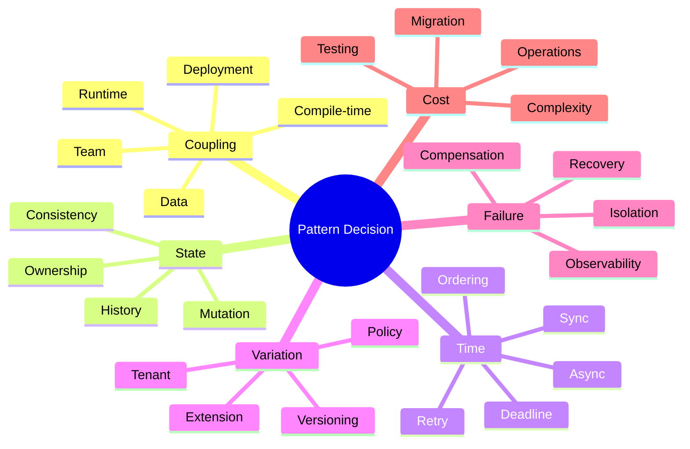
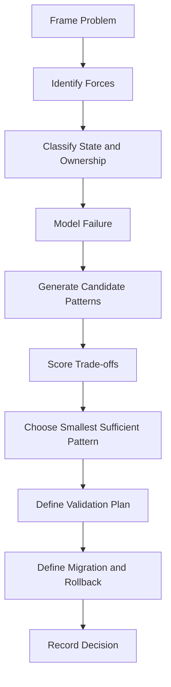
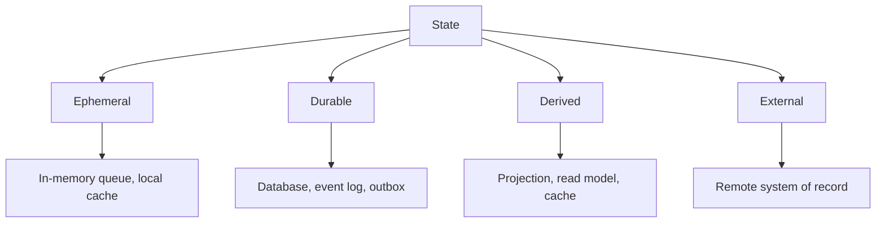
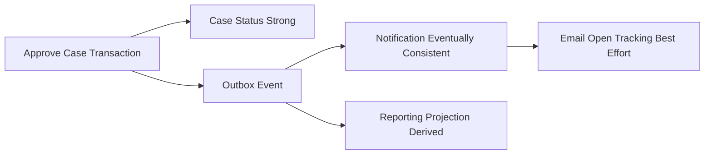
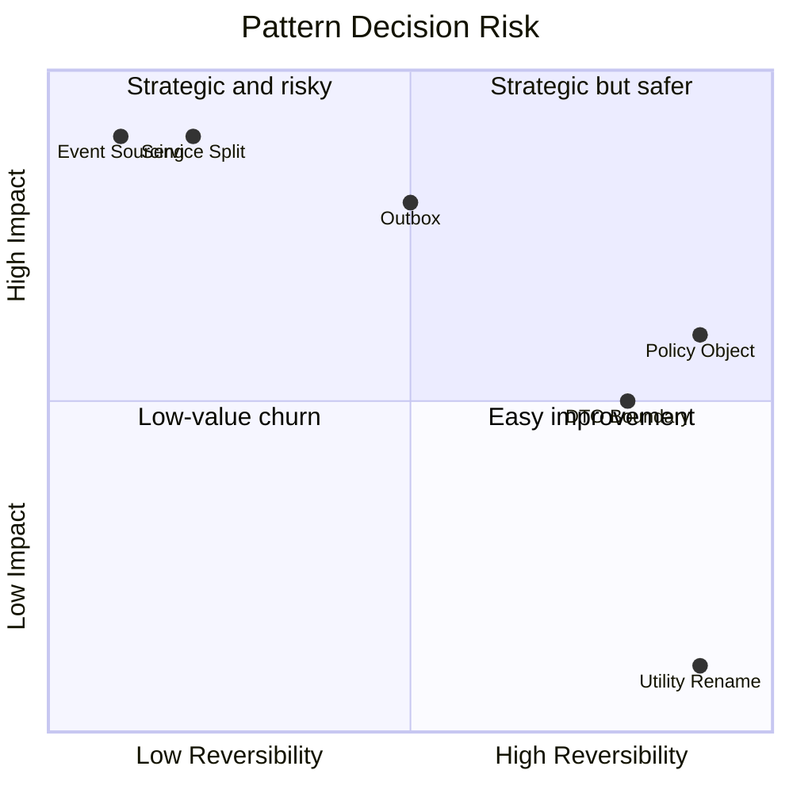
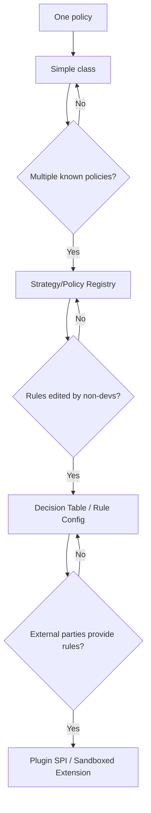
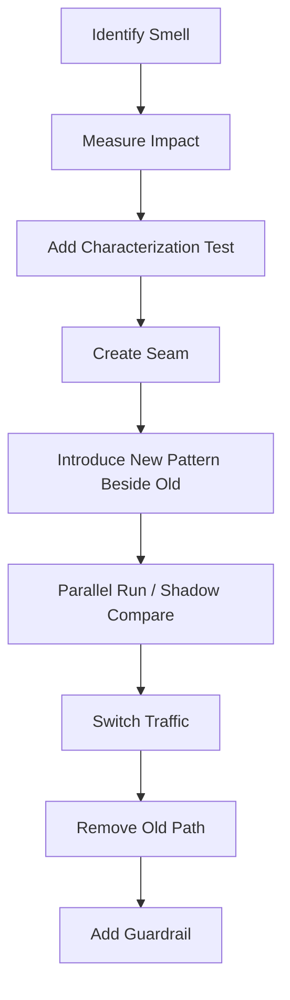
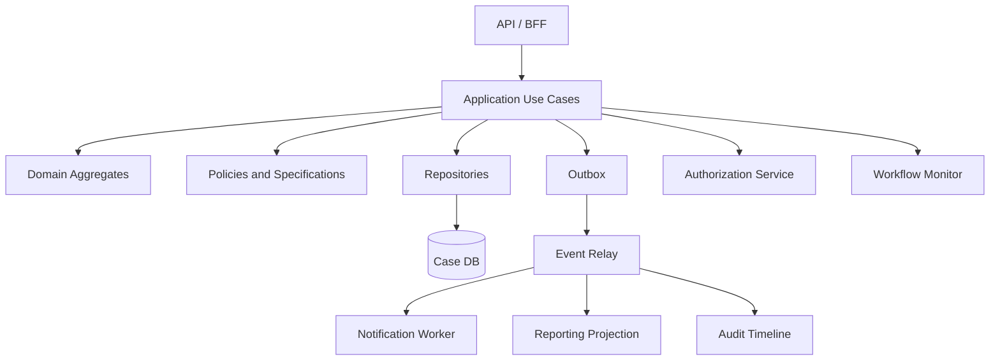

------
title: Learn Java Patterns - Part 034
description: A practical pattern selection framework for advanced Java engineers: decision matrix, force ranking, failure modeling, reversibility, and operational cost.
series: learn-java-patterns
seriesTitle: Learn Java Patterns, Data Patterns, Pipeline Patterns, Concurrency Patterns, Common Patterns, and Anti-Patterns
order: 34
partTitle: Pattern Selection Framework
tags:
- java
- patterns
- architecture
- decision-making
- adr
- advanced-java
date: 2026-06-27
---

# Pattern Selection Framework

Pattern engineering bukan tentang menjawab, "Pattern apa yang populer untuk masalah ini?" Pertanyaan yang lebih benar adalah:

> Dengan constraints kita sekarang, force apa yang dominan, failure apa yang paling mahal, dan pattern mana yang memberi trade-off terbaik dengan complexity paling kecil?

Part ini menyatukan seluruh seri menjadi framework pemilihan pattern yang bisa dipakai dalam design review, RFC, ADR, technical discovery, refactoring plan, atau incident remediation.

## 1. Learning Goal

Setelah part ini, kita ingin mampu:

1. memilih pattern berdasarkan forces, bukan preferensi;
2. membandingkan beberapa opsi desain secara eksplisit;
3. membuat keputusan yang bisa diuji, diobservasi, dan direvisi;
4. menghindari over-engineering dan under-engineering;
5. menulis architecture decision record yang defensible;
6. mengevaluasi pattern dari sisi domain, data, concurrency, reliability, security, dan operations.

## 2. Core Mental Model

Pattern adalah alat untuk mengatur **coupling, state, time, ownership, variation, and failure**.



Jika sebuah pattern tidak mengubah minimal satu dari aspek itu secara positif, kemungkinan ia hanya ceremony.

## 3. The Pattern Selection Pipeline

Gunakan pipeline berikut sebelum memilih pattern.



Setiap step memaksa kita memperjelas asumsi. Pattern yang dipilih tanpa pipeline ini sering hanya hasil kebiasaan tim.

## 4. Step 1 — Frame the Problem

Masalah desain harus ditulis dalam bentuk operasional, bukan general.

Bad framing:

```text
We need to use event-driven architecture.
```

Better framing:

```text
When a case is approved, audit record and notification must eventually be produced without keeping the approval transaction open during remote calls. Duplicate notifications must be prevented or tolerated. Approval response should not wait for notification delivery.
```

Framing yang baik menyebut:

| Dimension | Question |
|---|---|
| Trigger | Apa event/use case yang memulai proses? |
| State | State apa yang berubah? |
| Invariant | Rule apa yang tidak boleh dilanggar? |
| Time | Harus sync atau boleh async? |
| Failure | Failure apa yang harus ditoleransi? |
| User impact | Apa yang user lihat saat partial failure? |
| Operations | Bagaimana mendeteksi stuck/failed case? |
| Evolution | Apa yang kemungkinan berubah? |

## 5. Step 2 — Identify Forces

Force adalah tekanan desain yang saling bertentangan. Pattern dipilih untuk menyeimbangkan force.

Contoh force umum:

| Force | Meaning | Common Pattern Response |
|---|---|---|
| Need low latency | User menunggu response | cache, projection, async side effect, batching |
| Need strong invariant | Rule tidak boleh dilanggar | aggregate, transaction boundary, lock, unique constraint |
| Need independent deployment | Tim/service berubah sendiri | API boundary, event, anti-corruption layer |
| Need high throughput | Banyak work concurrent | partitioning, single-writer, bounded queue, virtual threads |
| Need auditability | Harus menjelaskan history | domain event, audit trail, temporal table, workflow log |
| Need extensibility | Variasi bertambah | strategy, policy, plugin, SPI |
| Need failure isolation | Dependency sering gagal | timeout, bulkhead, circuit breaker, outbox |
| Need schema evolution | Consumer banyak | versioned DTO/event, compatibility contract |

### Force Ranking

Tidak semua force sama penting. Beri ranking 1–5.

| Force | Weight | Why |
|---|---:|---|
| Audit defensibility | 5 | regulatory case decision must be explainable |
| Throughput | 3 | expected load moderate |
| Low latency | 2 | user can wait a few seconds |
| Independent deployment | 4 | separate teams own notification and audit |
| Simplicity | 4 | team must operate solution confidently |

Pattern terbaik adalah yang menyelesaikan force berbobot tinggi tanpa membuat force lain runtuh.

## 6. Step 3 — Classify State

State classification sering menentukan pattern lebih kuat daripada preferensi arsitektur.



Tanyakan:

1. Siapa owner state?
2. Apakah state bisa hilang?
3. Apakah state bisa direbuild?
4. Apakah mutation harus atomic?
5. Apakah history diperlukan?
6. Apakah stale value dapat diterima?
7. Apakah state dipartisi?
8. Apakah update order penting?

### State Decision Table

| State Type | Good Pattern | Dangerous Pattern |
|---|---|---|
| Core domain state | Aggregate + transaction | cache as source of truth |
| Audit record | append-only fact/outbox | fire-and-forget async log |
| Read-heavy derived view | projection/cache | direct cross-service join |
| Workflow status | state machine/history | stringly typed status update |
| Temporary work | bounded queue | unbounded executor queue |
| External dependency state | adapter + cache policy | direct scattered client calls |

## 7. Step 4 — Classify Consistency Requirement

Consistency bukan binary. Banyak desain gagal karena semua hal diperlakukan harus strongly consistent atau semuanya dibiarkan eventually consistent.

| Requirement | Meaning | Pattern |
|---|---|---|
| Strong local consistency | Perubahan harus atomic dalam satu boundary | transaction, aggregate, unique constraint |
| Strong cross-boundary consistency | Beberapa system harus commit bersama | avoid if possible; saga/compensation if not |
| Eventual consistency | Boleh tertunda tapi harus selesai | outbox, inbox, retry worker, reconciliation |
| Best effort | Boleh gagal tanpa retry wajib | structured log, metric, degraded response |
| Derived consistency | Bisa direbuild dari source | projection, cache invalidation, snapshot |

### Example

Approval state harus strong dalam case database. Notification boleh eventual. Email open tracking best effort. Reporting projection derived.



## 8. Step 5 — Model Failure Before Pattern

Jangan pilih pattern sebelum tahu failure yang ingin dikendalikan.

Gunakan tabel:

| Failure | Cause | Impact | Detection | Recovery | Pattern Candidate |
|---|---|---|---|---|---|
| Notification service down | dependency outage | user not notified | outbox backlog metric | retry + DLQ | outbox, retry, circuit breaker |
| Duplicate event delivery | broker retry | duplicate email | idempotency metric | dedupe key | inbox/idempotent consumer |
| Case update race | concurrent approval | invalid status | optimistic lock exception | retry command/load latest | aggregate + optimistic locking |
| Cache stale | missed invalidation | wrong decision | version mismatch | bypass/reload | versioned cache key |
| Long dependency latency | downstream slowness | thread pile-up | timeout metric | fallback/fail fast | timeout + bulkhead |

Pattern without failure model is guesswork.

## 9. Step 6 — Generate Candidate Patterns

Buat minimal 2–4 opsi. Jangan hanya satu opsi favorit.

Contoh problem: approval should trigger audit + notification.

Candidate:

1. Synchronous call inside transaction.
2. Synchronous call after transaction commit.
3. Fire-and-forget `CompletableFuture`.
4. Transactional outbox + worker.
5. Broker publish directly from transaction code without outbox.

Kemudian eliminasi berdasarkan invariant dan failure.

| Option | Pros | Cons | Verdict |
|---|---|---|---|
| Sync inside transaction | simple mental model | long transaction, remote failure blocks approval | reject |
| Sync after commit | approval safe | side effect lost if process dies | weak |
| Fire-and-forget | low latency | lost task, no durability | reject |
| Outbox + worker | durable, retryable | more infra/ops | choose if side effect required |
| Direct broker publish | simpler than outbox | DB commit/publish split-brain | risky |

## 10. Step 7 — Score Trade-Offs

Gunakan scoring sederhana. Angka tidak membuat keputusan objektif sempurna, tetapi memaksa eksplisit.

| Criterion | Weight | Strategy | State Machine | Rule Engine |
|---|---:|---:|---:|---:|
| Domain clarity | 5 | 3 | 5 | 3 |
| Change frequency support | 4 | 4 | 4 | 5 |
| Debuggability | 5 | 5 | 4 | 2 |
| Team familiarity | 3 | 5 | 4 | 2 |
| Runtime safety | 5 | 4 | 5 | 3 |
| Operational complexity | 4 | 5 | 4 | 2 |
| Total | | 105 | 112 | 73 |

Dalam contoh ini, state machine menang tipis karena domain lifecycle eksplisit dan runtime safety tinggi. Rule engine kalah bukan karena buruk, tetapi karena operational/debugging cost tidak sebanding untuk kebutuhan saat ini.

## 11. Step 8 — Choose the Smallest Sufficient Pattern

Prinsip:

> Pilih pattern paling sederhana yang menjaga invariant utama, failure mode utama, dan evolution path utama.

Contoh:

| Problem | Too Little | Smallest Sufficient | Too Much |
|---|---|---|---|
| 3 variasi calculation | if/else tersebar | Strategy/Policy | plugin engine |
| 5 lifecycle state | string status update | State machine table | BPMN engine |
| async audit required | fire-and-forget | outbox worker | full event sourcing |
| high read latency | repeated joins | projection/cache | CQRS everywhere |
| occasional remote failure | no timeout | timeout + retry policy | service mesh-only complexity |
| simple CRUD | domain aggregate heavy | transaction script | event-driven workflow |

Smallest sufficient bukan berarti short-term shortcut. Artinya cukup kuat untuk force nyata, tidak lebih.

## 12. Pattern Decision Heuristics

### 12.1 Use Strategy / Policy When

Gunakan Strategy/Policy jika:

- ada variasi behavior yang jelas;
- variasi berubah lebih sering dari caller;
- behavior bisa diuji terpisah;
- pilihan strategy bisa dibuat eksplisit;
- rule tidak bergantung pada shared mutable state.

Hindari jika hanya ada satu behavior dan belum ada variasi nyata.

### 12.2 Use State Machine When

Gunakan state machine jika:

- object punya lifecycle terbatas;
- transition valid/invalid penting;
- authorization bergantung pada state/action;
- audit transition diperlukan;
- escalation/timer bergantung pada state;
- concurrent transition harus dikontrol.

Hindari jika state hanya label display tanpa rule.

### 12.3 Use Pipeline When

Gunakan pipeline jika:

- proses terdiri dari stage berurutan;
- stage bisa diuji/diobservasi terpisah;
- error handling per stage berbeda;
- throughput/backpressure penting;
- enrichment/transformation/filtering dominan.

Hindari jika domain invariant membutuhkan satu aggregate decision atomic yang sederhana.

### 12.4 Use Event-Driven Pattern When

Gunakan event-driven jika:

- producer tidak perlu menunggu consumer;
- consumer banyak atau berubah;
- side effect harus decoupled;
- eventual consistency diterima;
- replay/projection berguna;
- integration reliability butuh outbox/inbox.

Hindari jika caller membutuhkan immediate answer dari consumer untuk menjaga invariant.

### 12.5 Use Repository When

Gunakan repository jika:

- domain perlu collection-like access;
- persistence detail harus disembunyikan;
- aggregate loading/saving memiliki invariant;
- test domain/application perlu fake persistence.

Hindari repository generik yang expose query arbitrer dan membuat domain boundary palsu.

### 12.6 Use Cache When

Gunakan cache jika:

- read path mahal;
- stale value punya budget jelas;
- invalidation/rebuild bisa didefinisikan;
- metric hit/miss/stale bisa diamati;
- source of truth tetap jelas.

Hindari cache untuk correctness-critical decision tanpa version/validation.

### 12.7 Use Virtual Threads When

Gunakan virtual threads jika:

- workload mostly blocking I/O;
- thread-per-task menyederhanakan code;
- dependency calls punya timeout;
- resource pool tetap bounded;
- thread-local behavior dipahami.

Hindari menganggap virtual threads sebagai pengganti backpressure, connection limits, atau failure isolation.

### 12.8 Use Reactive Streams When

Gunakan reactive streams jika:

- stream panjang/asynchronous;
- demand/backpressure adalah core concern;
- non-blocking stack end-to-end tersedia;
- operator composition memberi value nyata;
- team mampu debugging reactive execution.

Hindari untuk CRUD blocking sederhana yang lebih jelas dengan virtual threads.

### 12.9 Use Actor / Single-Writer When

Gunakan actor/single-writer jika:

- state partitioned by key;
- mutation order per key penting;
- lock contention tinggi;
- command serialization lebih mudah daripada shared locks;
- backpressure per actor bisa dikontrol.

Hindari jika actor hanya membungkus service stateless dan menambah mailbox tanpa manfaat.

### 12.10 Use Plugin / SPI When

Gunakan plugin/SPI jika:

- extension owner berbeda;
- variasi tidak bisa dikompilasi bersama core;
- lifecycle extension jelas;
- permission/capability bisa dibatasi;
- compatibility contract kuat.

Hindari plugin system internal jika Strategy sederhana cukup.

## 13. The Coupling Matrix

Pattern sering dipilih untuk memindahkan coupling, bukan menghilangkannya.

| Coupling Type | Example | Pattern That Helps | Trade-Off |
|---|---|---|---|
| Compile-time | direct class dependency | interface, port, SPI | indirection |
| Runtime | sync remote call | async event, projection | eventual consistency |
| Data | shared table | API/event ownership | duplication |
| Temporal | call order required | workflow/state machine | explicit lifecycle model |
| Deployment | shared library version | contract/client generation | compatibility process |
| Team | one team bottleneck | bounded context/plugin | governance |
| Operational | shared thread pool | bulkhead | capacity fragmentation |

Saat seseorang berkata "decoupled", tanyakan: coupling mana yang berkurang, coupling mana yang bertambah?

## 14. Reversibility Analysis

Keputusan desain tidak sama biayanya untuk dibatalkan.

| Decision | Reversibility | Notes |
|---|---|---|
| Extract policy object | High | easy to inline or replace |
| Add DTO boundary | High | mapper overhead but reversible |
| Add local cache | Medium | invalidation behavior must be removed carefully |
| Introduce outbox | Medium | schema/worker/ops added |
| Split service | Low | data ownership and deployment affected |
| Adopt event sourcing | Low | persistence model changes deeply |
| Adopt BPMN engine | Medium/Low | process model and ops dependency added |
| Introduce plugin API | Low | compatibility promise created |

Prefer reversible decisions when uncertainty is high.



## 15. Operational Cost Model

Pattern tidak selesai ketika code compile. Pattern punya operational cost.

| Pattern | Operational Cost |
|---|---|
| Cache | hit/miss/stale metric, invalidation, warmup, eviction tuning |
| Outbox | relay, backlog alert, DLQ, replay tooling |
| Circuit breaker | threshold tuning, state metrics, fallback behavior |
| Bulkhead | capacity planning, queue rejection handling |
| Event-driven | schema registry/catalog, consumer lag, replay, idempotency |
| State machine | transition audit, stuck state detection, versioning |
| Plugin | compatibility, permission, lifecycle, isolation |
| Reactive stream | backpressure visibility, scheduler monitoring |
| Actor | mailbox depth, supervision, poison message handling |
| Sharding | rebalancing, hot shard detection, migration tooling |

Pattern yang tidak bisa dioperasikan adalah liability.

## 16. Testing Cost Model

Setiap pattern mengubah testing strategy.

| Pattern | Required Tests |
|---|---|
| Strategy/Policy | decision table, parameterized tests |
| State machine | transition matrix, invalid transition, authorization |
| Repository | integration test, transaction boundary, optimistic lock |
| Outbox/Inbox | duplicate delivery, relay retry, atomic write |
| Cache | stale, invalidation, stampede, TTL |
| Retry/Circuit breaker | transient/permanent failure, fallback, timeout |
| Actor | message ordering, mailbox overflow, supervision |
| Pipeline | stage contract, partial failure, checkpoint/restart |
| Plugin | compatibility testkit, permission violation |
| API boundary | contract test, error contract, version compatibility |

Jika tim tidak mampu menulis test untuk pattern itu, pattern terlalu kompleks atau belum dipahami.

## 17. Observability Cost Model

Setiap pattern juga harus menjawab pertanyaan incident.

| Pattern | Incident Question | Needed Telemetry |
|---|---|---|
| Outbox | Why was event not delivered? | backlog, attempts, last error, age |
| Cache | Are users seeing stale data? | hit/miss, version mismatch, evictions |
| Retry | Are we amplifying failure? | attempts, final outcome, dependency status |
| Circuit breaker | Is dependency isolated? | breaker state, rejected calls, fallback count |
| State machine | Why is case stuck? | state age, transition history, timer status |
| Actor | Is a partition blocked? | mailbox depth, processing latency, poison messages |
| Pipeline | Which stage fails? | stage duration, input/output counts, error channel |
| API Gateway/BFF | Which downstream causes latency? | per-dependency span, timeout, response code |

Pattern without observability is a black box.

## 18. Security and Compliance Filter

Sebelum memilih pattern, lewati security/compliance filter:

1. Apakah pattern mengubah trust boundary?
2. Apakah data sensitif diduplikasi?
3. Apakah authorization decision tetap enforceable?
4. Apakah audit trail lengkap?
5. Apakah tenant isolation terjaga?
6. Apakah replay/debug tool bisa membocorkan data?
7. Apakah cache menyimpan data yang perlu masking/encryption?
8. Apakah plugin punya permission boundary?
9. Apakah event schema mengekspos PII tidak perlu?
10. Apakah fallback bisa menampilkan data yang tidak authorized?

Untuk sistem regulasi atau case management, filter ini bukan tambahan. Ini bagian dari correctness.

## 19. Domain Criticality Filter

Semua bagian sistem tidak perlu pattern berat. Klasifikasikan domain criticality.

| Level | Example | Design Style |
|---|---|---|
| Critical domain | enforcement decision, approval, sanction | explicit domain model, audit, state machine, strong tests |
| Supporting domain | notification template, assignment queue | pragmatic model, policy extraction where needed |
| Generic domain | user preference, lookup list | simple CRUD, framework-friendly |
| Commodity infrastructure | health endpoint, admin config | simple, standardized |

Jangan gunakan pattern yang sama beratnya untuk semua area.

## 20. The Decision Matrix Template

Gunakan template ini untuk design review.

```mdx
## Decision: <title>

### Problem
<clear operational problem>

### Context
- Domain:
- Traffic:
- Consistency requirement:
- Failure tolerance:
- Team/operational constraints:

### Forces
| Force | Weight | Notes |
|---|---:|---|

### Options
| Option | Summary | Pros | Cons |
|---|---|---|---|

### Scoring
| Criteria | Weight | Option A | Option B | Option C |
|---|---:|---:|---:|---:|

### Decision
<chosen option>

### Why
<force-based reasoning>

### Consequences
Positive:
- ...

Negative:
- ...

### Validation Plan
- tests:
- metrics:
- rollout:

### Reversibility
<how to roll back or migrate away>

### Follow-up
- ...
```

## 21. Worked Example 1 — Workflow Transition Design

### Problem

Case lifecycle has states: `DRAFT`, `SUBMITTED`, `UNDER_REVIEW`, `APPROVED`, `REJECTED`, `CLOSED`. Transitions need authorization, audit, and escalation.

### Candidate Options

1. String status with if/else in service.
2. Enum + transition policy table.
3. State pattern class per state.
4. External workflow/BPMN engine.

### Forces

| Force | Weight |
|---|---:|
| Transition correctness | 5 |
| Auditability | 5 |
| Team simplicity | 4 |
| Future workflow complexity | 3 |
| Runtime operability | 4 |

### Scoring

| Criteria | Weight | If/Else | Transition Table | State Classes | BPMN Engine |
|---|---:|---:|---:|---:|---:|
| Correctness | 5 | 2 | 5 | 4 | 5 |
| Auditability | 5 | 2 | 5 | 5 | 5 |
| Simplicity | 4 | 4 | 4 | 3 | 2 |
| Extensibility | 3 | 2 | 4 | 4 | 5 |
| Operability | 4 | 3 | 4 | 4 | 3 |
| Total | | 49 | 89 | 82 | 83 |

### Decision

Use enum + transition policy table now. Keep transition event history and design an adapter seam if external workflow engine becomes necessary later.

### Why

The state space is explicit and moderate. A transition table gives correctness, auditability, and testability with lower operational cost than BPMN.

## 22. Worked Example 2 — Notification Side Effect

### Problem

After approval, notification must be sent eventually. Approval should not wait for email provider. Notification must not be silently lost.

### Candidate Options

1. Send email inside transaction.
2. Send after commit synchronously.
3. Fire-and-forget future.
4. Outbox + notification worker.

### Decision

Use outbox + worker.

### Reasoning

| Force | Outbox Fit |
|---|---|
| Approval latency | good, response does not wait |
| Durability | good, event stored with transaction |
| Duplicate handling | requires idempotency but manageable |
| Ops complexity | higher, but justified |
| Auditability | good, event lifecycle visible |

### Validation

- Transaction test: approval and outbox write commit together.
- Worker test: duplicate event does not send duplicate external notification or uses idempotency key.
- Operational metric: outbox backlog age.
- DLQ path: poison message is quarantined.

## 23. Worked Example 3 — Read Performance Problem

### Problem

Case overview page loads slowly because it joins case, tasks, documents, comments, assignee, SLA, and latest audit events.

### Candidate Options

1. Optimize current query.
2. Add cache-aside to each dependency call.
3. Add BFF with parallel calls.
4. Build case overview projection.
5. Full CQRS/event-sourced read model.

### Force Analysis

| Force | Weight |
|---|---:|
| Latency | 5 |
| Freshness | 3 |
| Simplicity | 4 |
| Data ownership | 4 |
| Operational cost | 4 |

### Decision Path

- If current query is bad: optimize first.
- If data comes from multiple services and page is high traffic: BFF + parallel calls may help short-term.
- If repeated read shape is stable: projection is better.
- Full CQRS/event sourcing only if multiple read models and historical replay justify it.

### Likely Decision

Start with projection for case overview if the page is a critical repeated journey and slight staleness is acceptable. Use event-driven updates from source systems.

## 24. Worked Example 4 — Concurrency Race in Approval

### Problem

Two reviewers can approve/reject the same case concurrently.

### Candidate Options

1. `synchronized` in service.
2. Database optimistic locking.
3. Pessimistic lock.
4. Single-writer actor per case.
5. Distributed lock.

### Evaluation

| Option | Good For | Problems |
|---|---|---|
| `synchronized` | single JVM only | fails across replicas |
| Optimistic locking | low/medium contention | retry conflict needed |
| Pessimistic lock | high conflict critical section | lock wait/deadlock risk |
| Single-writer actor | ordered commands per key | mailbox/ownership complexity |
| Distributed lock | cross-resource coordination | operational risk, lease bugs |

### Decision

Start with aggregate invariant + optimistic locking. Move to single-writer partition only if contention is high or ordering becomes core requirement.

## 25. Worked Example 5 — Extensible Risk Scoring

### Problem

Risk scoring has tenant-specific policy. Some tenants may add custom rule packs later.

### Candidate Options

1. `if tenant == X` branches.
2. Strategy map by tenant.
3. Rule table/decision table.
4. Plugin SPI.
5. External rules engine.

### Decision Ladder



Do not jump directly to plugin or rules engine unless ownership and change model require it.

## 26. Pattern Combination Rules

Real systems use pattern combinations. The danger is accidental combinations.

### Good Combination Examples

| Goal | Pattern Combination |
|---|---|
| Reliable async side effect | transaction + outbox + retry worker + idempotent consumer + DLQ |
| Auditable workflow | state machine + transition history + authorization policy + domain event |
| High-throughput per-key mutation | partitioning + single-writer + bounded mailbox + backpressure |
| Fast case overview | projection + cache + versioned event update + freshness metric |
| Safe external call | timeout + retry with jitter + circuit breaker + bulkhead + fallback |
| Extensible domain rule | policy object + specification + decision table + contract tests |

### Dangerous Combination Examples

| Combination | Why Dangerous |
|---|---|
| retry + non-idempotent command | duplicate side effect |
| cache + authorization result without context | privilege leak |
| async event + no inbox | duplicate processing |
| virtual threads + unbounded connection pool assumption | downstream overload |
| plugin + full internal object access | security/coupling breach |
| reactive stream + hidden blocking call | scheduler starvation |
| outbox + no backlog monitoring | invisible stuck side effects |
| state machine + string transitions | false sense of control |

## 27. Pattern Escalation Ladder

Untuk menghindari over-engineering, gunakan escalation ladder.

### 27.1 Variation Handling

```text
if/else local
→ named method
→ policy object
→ strategy registry
→ decision table
→ plugin SPI
→ external rule engine
```

Naik ladder hanya jika variasi, ownership, atau runtime change model menuntut.

### 27.2 Workflow Handling

```text
simple status field
→ enum status + guarded method
→ transition table
→ state machine with history
→ process manager/saga
→ workflow engine
```

### 27.3 Integration Reliability

```text
sync call with timeout
→ retry for idempotent transient failure
→ circuit breaker/bulkhead
→ async event
→ transactional outbox
→ saga/process manager
```

### 27.4 Read Performance

```text
index/query optimization
→ batching
→ DTO projection query
→ cache
→ materialized projection
→ CQRS read model
```

### 27.5 Concurrency Control

```text
single-threaded request
→ immutable state
→ synchronized/lock
→ optimistic locking
→ partitioned single-writer
→ distributed coordination
```

## 28. Design Review Questions by Pattern Family

### Domain Pattern Review

1. Apa invariant yang dijaga?
2. Siapa pemilik state?
3. Apakah illegal state representable?
4. Apakah transition tercatat?
5. Apakah domain object framework-independent secukupnya?

### Data Pattern Review

1. Apa source of truth?
2. Apakah history diperlukan?
3. Apakah delete berarti remove, soft delete, tombstone, atau revoke visibility?
4. Apakah schema evolution aman?
5. Apakah idempotency record diperlukan?

### Concurrency Pattern Review

1. State apa yang shared?
2. Siapa writer?
3. Apa happens-before guarantee?
4. Apakah queue bounded?
5. Bagaimana cancellation/shutdown?
6. Apakah test concurrency deterministik?

### Integration Pattern Review

1. Sync atau async?
2. Apa timeout?
3. Apa retry owner?
4. Apakah operation idempotent?
5. Apa DLQ/quarantine behavior?
6. Bagaimana correlation ID mengalir?

### Security Pattern Review

1. Di mana authorization enforced?
2. Apakah data-level permission diterapkan?
3. Apakah cache/event/projection menyimpan data sensitif?
4. Apakah audit decision lengkap?
5. Apakah tenant isolation bisa diuji?

## 29. ADR Example — Outbox for Case Approval Side Effects

```mdx
# ADR: Use Transactional Outbox for Case Approval Side Effects

## Status
Accepted

## Context
When a case is approved, the system must persist the approval, create audit evidence, update reporting projection, and request notification. Approval must not keep a database transaction open while calling external notification infrastructure. Notification should be eventually delivered and must not be silently lost.

## Forces
| Force | Weight | Notes |
|---|---:|---|
| Approval correctness | 5 | case status must be committed atomically |
| Audit defensibility | 5 | event trail required |
| Low latency | 3 | response should not wait for email provider |
| Operational simplicity | 3 | worker/backlog adds ops cost |
| Duplicate tolerance | 4 | notification must be idempotent |

## Options
1. Synchronous notification inside transaction.
2. Synchronous notification after commit.
3. Fire-and-forget async task.
4. Transactional outbox and worker.

## Decision
Use transactional outbox and a notification worker.

## Consequences
Positive:
- approval state and side-effect request are committed atomically;
- notification can be retried;
- backlog is observable;
- worker can be paused/replayed.

Negative:
- additional table and worker required;
- duplicate delivery still possible;
- consumer idempotency required;
- operational alerting required.

## Validation
- integration test verifies case update and outbox insert in same transaction;
- worker test verifies duplicate event handling;
- metric `outbox_oldest_unpublished_age_seconds` must be alertable;
- DLQ/quarantine path must be documented.
```

## 30. Lightweight RFC Template for PR-Level Decisions

Tidak semua keputusan butuh ADR panjang. Untuk PR besar, gunakan lightweight RFC:

```mdx
## Problem

## Chosen Pattern

## Why This Pattern

## Alternatives Rejected

## Failure Modes Covered

## Tests Added

## Metrics/Logs Added

## Rollback Plan
```

Ini cukup untuk perubahan seperti menambah cache, menambah retry policy, atau extract strategy.

## 31. Pattern Smell: When to Reconsider

Pattern yang dulu benar bisa menjadi salah saat constraints berubah.

| Signal | Reconsider |
|---|---|
| Strategy registry punya 1 strategy selama 1 tahun | inline or simplify |
| State machine transition sering butuh dynamic runtime edits | consider workflow/rule config |
| Cache hit rate rendah dan stale bug tinggi | remove or redesign cache |
| Outbox backlog sering naik | scale worker or fix poison messages |
| Circuit breaker sering open | dependency contract/capacity problem |
| Actor mailbox hot | repartition or split hot key |
| Plugin API sering breaking | contract too leaky |
| E2E tests dominate CI | move behavior tests lower |

## 32. Refactoring Decision Framework

Saat pattern sudah salah, gunakan framework refactoring.



Jangan mengganti pattern produksi kritikal tanpa evidence dan rollback.

## 33. Pattern Selection Anti-Biases

### Bias 1: Resume-Driven Design

Memilih pattern karena terlihat modern. Remedy: tulis force dan rejected alternatives.

### Bias 2: Familiarity Bias

Selalu memakai pattern yang tim kuasai. Remedy: compare operational fit.

### Bias 3: Framework Gravity

Framework membuat beberapa pattern mudah, lalu semua masalah dipaksa ke sana. Remedy: mulai dari domain/failure model.

### Bias 4: Premature Distribution

Membagi service sebelum data ownership jelas. Remedy: modular monolith or strong module boundary first.

### Bias 5: Performance Panic

Menambah cache/async tanpa measurement. Remedy: profile, trace, measure p95/p99, then choose.

### Bias 6: Consistency Overreach

Memaksa strong consistency lintas boundary. Remedy: classify consistency per state.

### Bias 7: Simplism

Menolak pattern karena "terlalu enterprise" padahal failure cost tinggi. Remedy: evaluate blast radius and audit need.

## 34. Production Readiness Checklist

Sebelum pattern dianggap selesai, cek:

### Correctness

- invariant tertulis jelas;
- invalid state tidak mudah terbentuk;
- concurrency conflict ditangani;
- idempotency jelas;
- data ownership jelas.

### Failure

- timeout ada;
- retry policy bounded;
- cancellation behavior jelas;
- fallback eksplisit;
- DLQ/quarantine ada jika perlu.

### Operations

- metrics menjawab incident question;
- logs structured;
- tracing/correlation tersedia;
- backlog/queue depth terlihat;
- runbook tersedia untuk failure penting.

### Security

- authorization enforced di layer tepat;
- sensitive data tidak bocor ke event/cache/log;
- tenant boundary diuji;
- audit evidence lengkap.

### Evolution

- versioning strategy ada;
- compatibility contract jelas;
- migration path jelas;
- rollback path jelas;
- ownership jelas.

### Testing

- unit/domain test;
- integration/contract test;
- failure test;
- concurrency test jika perlu;
- performance regression guard jika hot path.

## 35. One-Page Pattern Decision Canvas

Gunakan canvas ini saat whiteboard atau design meeting.

```text
Problem:

Invariant:

State owner:

Consistency requirement:

Expected traffic:

Failure we must survive:

Failure we explicitly do not handle:

Candidate patterns:
1.
2.
3.

Chosen pattern:

Why not simpler:

Why not more complex:

Operational cost:

Testing plan:

Observability plan:

Security/compliance notes:

Rollback/migration:

Decision owner:
```

Kalimat "why not simpler" dan "why not more complex" sangat penting. Ia memaksa keseimbangan.

## 36. Applying the Framework to a Regulatory Case Platform

Misal kita membangun enforcement lifecycle platform.

### Core Capabilities

- case intake;
- triage;
- assignment;
- investigation;
- evidence review;
- approval/rejection;
- escalation;
- sanction decision;
- notification;
- audit/reporting.

### Pattern Map

| Capability | Dominant Forces | Pattern Choice |
|---|---|---|
| Intake | validation, idempotency, audit | command handler, idempotency key, audit event |
| Triage | policy variation, explainability | policy object, specification, decision table |
| Assignment | concurrency, fairness | single-writer per queue or optimistic lock |
| Investigation | workflow, evidence history | state machine, status history, document boundary |
| Approval | invariant, authorization, audit | aggregate, transition guard, authorization policy |
| Escalation | time, workflow stuck detection | durable timer, workflow monitor |
| Notification | async side effect | outbox, worker, retry, DLQ |
| Reporting | read performance, history | projection, immutable facts, reconciliation |
| Search | derived view, latency | index projection, eventual consistency |
| External integration | failure isolation | adapter, timeout, circuit breaker, idempotency |

### Architecture Sketch



### Why This Is Not Over-Engineering

Karena setiap pattern maps to a force:

- state machine: lifecycle correctness;
- audit timeline: regulatory defensibility;
- outbox: reliable side effects;
- projection: reporting performance;
- policy object: explainable decision variation;
- authorization guard: security correctness;
- workflow monitor: stuck case detection.

Jika sebuah pattern tidak map to force, jangan tambahkan.

## 37. Kaufman-Style Practice Plan

Gunakan 20 jam latihan efektif untuk pattern selection, bukan sekadar membaca.

### Hour 1–3: Pattern Recognition

Ambil 5 PR atau service lama. Tandai:

- state owner;
- invariant;
- failure mode;
- coupling type;
- anti-pattern smell.

### Hour 4–7: Decision Matrix

Tulis 3 decision matrix:

1. workflow design;
2. async side effect;
3. read performance.

### Hour 8–11: Refactoring Drill

Refactor satu procedural service menjadi:

- command handler;
- policy object;
- aggregate method;
- outbox event.

### Hour 12–15: Failure Modeling

Untuk satu integration flow, tulis failure table:

- timeout;
- duplicate;
- partial commit;
- stale cache;
- authorization failure;
- stuck workflow.

### Hour 16–18: Observability Design

Tambahkan telemetry contract:

- metric;
- structured log;
- trace span;
- audit event;
- dashboard question.

### Hour 19–20: ADR Writing

Tulis ADR 1 halaman dan minta review. Fokus pada:

- alternatives;
- trade-off;
- validation;
- rollback.

## 38. Common Senior-Level Mistakes

1. Memilih pattern terlalu cepat sebelum failure model.
2. Menganggap async selalu lebih scalable.
3. Menganggap cache selalu aman untuk performance.
4. Menganggap microservice mengurangi coupling otomatis.
5. Menganggap virtual threads menghapus kebutuhan backpressure.
6. Menganggap event-driven berarti tidak perlu transaction.
7. Menganggap annotation cukup untuk security/transaction/resilience.
8. Menganggap test setelah implementasi cukup untuk pattern kompleks.
9. Menganggap operational complexity bisa diserahkan ke platform team tanpa design input.
10. Menganggap pattern catalog lebih penting daripada domain invariant.

## 39. Final Decision Checklist

Sebelum menyetujui pattern di design review:

```text
[ ] Problem framed operationally
[ ] Invariant identified
[ ] State owner identified
[ ] Consistency requirement classified
[ ] Main failure modes modeled
[ ] At least two alternatives compared
[ ] Simpler option rejected with reason
[ ] More complex option rejected with reason
[ ] Testing plan defined
[ ] Observability plan defined
[ ] Security/compliance implications checked
[ ] Operational cost accepted
[ ] Migration/rollback path defined
[ ] Decision recorded
```

## 40. Key Takeaways

1. Pattern selection is force balancing, not catalog lookup.
2. State ownership and failure model usually determine the correct pattern family.
3. Choose the smallest sufficient pattern, not the smallest possible code.
4. Every pattern must be testable, observable, operable, and reversible enough for its risk level.
5. Rejected alternatives matter; they show the decision was reasoned, not habitual.
6. For high-stakes systems, auditability, authorization, and recovery are part of correctness.
7. The best engineers can explain both why a pattern is used and why a stronger/weaker pattern was not used.

Part berikutnya adalah capstone terakhir: kita akan merancang production-style architecture end-to-end dengan workflow, data, concurrency, resilience, authorization, observability, testing, dan pattern decision review dalam satu sistem utuh.
