------
title: Learn Java Patterns - Part 035
description: Capstone arsitektur production untuk menggabungkan domain modeling, workflow, data, event, pipeline, concurrency, resilience, security, observability, testing, performance, modularity, dan anti-pattern control dalam sistem Java modern.
series: learn-java-patterns
seriesTitle: Learn Java Patterns, Data Patterns, Pipeline Patterns, Concurrency Patterns, Common Patterns, and Anti-Patterns
order: 35
partTitle: Capstone: Production Pattern Architecture
tags:
- java
- patterns
- architecture
- capstone
- workflow
- event-driven
- concurrency
- resilience
- observability
date: 2026-06-27
---

# Capstone: Production Pattern Architecture

Part ini adalah bagian terakhir dari seri `learn-java-patterns`.

Tujuannya bukan menambah katalog pattern baru, tetapi melatih kemampuan yang lebih penting: **menggabungkan pattern menjadi arsitektur production yang punya alasan, boundary, invariant, failure model, dan operational contract yang jelas**.

Kita akan memakai contoh sistem yang cukup kompleks: **regulatory case management platform**. Domain ini sengaja dipilih karena kaya akan workflow, auditability, authorization, state transition, SLA, escalation, evidence, concurrency, event, reporting, dan integration boundary. Kalau pattern bisa bekerja di domain seperti ini, mental model-nya biasanya bisa dipindahkan ke domain enterprise lain: loan origination, insurance claim, healthcare case, fraud investigation, permit/licensing, order fulfillment, dispute resolution, dan compliance lifecycle.

> Prinsip utama capstone: production architecture bukan kumpulan pattern. Production architecture adalah kumpulan keputusan yang mempertahankan invariant ketika sistem berubah, gagal, lambat, diakses paralel, dan diaudit.

---

## 1. Target Skill

Setelah part ini, kita ingin mampu:

1. Mengambil problem bisnis kompleks dan memecahnya menjadi domain, workflow, data, integration, concurrency, security, dan observability boundary.
2. Memilih pattern dengan alasan eksplisit, bukan karena pattern terlihat “enterprise”.
3. Mendesain arsitektur Java yang mempertahankan invariant di bawah concurrency, failure, retry, duplicate message, partial outage, versioning, dan audit pressure.
4. Menulis review checklist untuk menilai apakah desain siap production.
5. Menghindari over-engineering dengan memilih pattern terkecil yang cukup.
6. Membedakan bagian yang harus strongly consistent, eventually consistent, asynchronously derived, atau immutable evidence.
7. Mendesain sistem yang bisa berevolusi tanpa rewrite besar.

---

## 2. Capstone Problem

Kita akan mendesain platform bernama **RegCase**.

RegCase dipakai oleh organisasi regulator untuk mengelola lifecycle enforcement case.

### 2.1 Use Case Utama

Platform harus mendukung:

1. Intake laporan atau temuan.
2. Triage awal.
3. Assignment investigator.
4. Evidence collection.
5. Risk scoring.
6. Review hukum.
7. Decision recommendation.
8. Approval berjenjang.
9. Notice generation.
10. Appeal/dispute handling.
11. Escalation jika SLA lewat.
12. Audit trail lengkap.
13. Reporting dan analytics.
14. Integration dengan document store, identity provider, notification service, dan external registry.

### 2.2 Kualitas Sistem

Sistem harus:

- defensible secara audit;
- aman secara authorization;
- tahan duplicate event dan retry;
- bisa menangani workflow panjang;
- mendukung perubahan policy;
- punya traceability dari decision ke evidence;
- bisa dioperasikan saat dependency lambat atau gagal;
- tidak kehilangan event penting;
- bisa melakukan replay projection;
- bisa mengisolasi tenant atau unit organisasi;
- bisa melakukan review historical state.

---

## 3. Kaufman Deconstruction untuk Capstone

Dalam kerangka Josh Kaufman, kita tidak belajar “arsitektur” sebagai satu benda besar. Kita pecah menjadi sub-skill yang bisa dilatih.

| Sub-skill | Pertanyaan Latihan | Output Konkret |
|---|---|---|
| Domain boundary | Apa aggregate utama dan invariant-nya? | Aggregate map |
| Workflow modeling | State apa saja yang valid dan transisinya apa? | State machine |
| Data pattern | Data mana state, fact, audit, projection, cache? | Data classification table |
| Transaction boundary | Perubahan apa harus atomik? | Transaction script/use case boundary |
| Event design | Event apa yang merepresentasikan fakta bisnis? | Event catalog |
| Concurrency model | State mana bisa ditulis paralel? | Ownership model |
| Integration model | Boundary eksternal mana unreliable? | Adapter + resilience policy |
| Security model | Siapa boleh melakukan aksi apa, pada konteks apa? | Authorization matrix |
| Observability model | Bagaimana reconstruct kejadian saat incident? | Diagnostic timeline |
| Testing model | Failure apa harus dibuktikan? | Test portfolio |
| Evolution model | Bagaimana pattern berubah tanpa rewrite? | Migration/refactoring plan |

Capstone ini adalah latihan menggabungkan semua sub-skill tersebut.

---

## 4. High-Level Architecture

Kita mulai dari view paling besar.

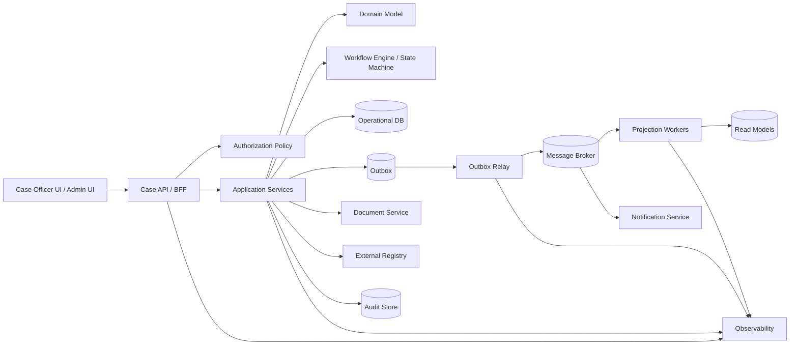

View ini belum cukup. High-level diagram sering menipu karena tampak rapi, padahal bug production muncul dari detail: transaction boundary, duplicate handling, authorization, retry, ordering, dan state transition.

Karena itu, kita akan mendesain dari invariant ke pattern, bukan dari komponen ke pattern.

---

## 5. Domain Core

### 5.1 Aggregate Utama

RegCase memiliki aggregate utama:

1. `CaseFile`
2. `EvidenceItem`
3. `Assignment`
4. `ReviewDecision`
5. `Notice`
6. `Appeal`
7. `SlaClock`
8. `AuditRecord`

Tidak semuanya harus menjadi aggregate root. Aggregate root dipilih berdasarkan invariant dan transaction boundary.

### 5.2 Aggregate Map

| Aggregate | Root? | Alasan |
|---|---:|---|
| `CaseFile` | Ya | Mengontrol lifecycle case, status, assignment aktif, risk summary, decision reference |
| `EvidenceItem` | Ya, jika file besar/independen | Evidence bisa upload, verify, revoke, dan audit secara terpisah |
| `ReviewDecision` | Ya | Decision punya approval chain dan legal basis |
| `Notice` | Ya | Notice generation dan delivery lifecycle independen |
| `Appeal` | Ya | Appeal membuka lifecycle turunan setelah decision |
| `AuditRecord` | Tidak dimutasi | Immutable append-only fact, bukan aggregate behavioral biasa |

### 5.3 Domain Invariant

Contoh invariant:

1. Case tidak bisa masuk `UNDER_INVESTIGATION` tanpa investigator aktif.
2. Evidence yang sudah dipakai dalam final decision tidak boleh dihapus fisik.
3. Decision final harus punya legal basis, approver, dan snapshot evidence reference.
4. Notice tidak boleh dikirim sebelum decision final.
5. Appeal hanya bisa dibuat untuk decision yang sudah notified.
6. SLA escalation tidak boleh membuat duplicate escalation untuk milestone yang sama.
7. Assignment aktif hanya boleh satu per role tertentu.
8. Case closed tidak boleh menerima evidence baru kecuali lewat reopening workflow.

Invariant adalah alasan utama memilih aggregate dan transaction boundary.

---

## 6. Domain Model Skeleton

Kita tidak mulai dari framework. Kita mulai dari domain object yang melindungi invariant.

```java
public final class CaseFile {
    private final CaseId id;
    private CaseStatus status;
    private Version version;
    private AssignmentSnapshot activeInvestigator;
    private RiskScore riskScore;
    private final List<EvidenceReference> evidence = new ArrayList<>();
    private final List<DomainEvent> pendingEvents = new ArrayList<>();

    public CaseFile(CaseId id, CaseStatus initialStatus, Version version) {
        this.id = Objects.requireNonNull(id);
        this.status = Objects.requireNonNull(initialStatus);
        this.version = Objects.requireNonNull(version);
    }

    public void assignInvestigator(UserId investigatorId, Actor actor, Instant now) {
        requireStatus(CaseStatus.TRIAGED, CaseStatus.REOPENED);
        requireActor(actor.canAssignInvestigator(), "actor cannot assign investigator");

        this.activeInvestigator = new AssignmentSnapshot(investigatorId, now);
        pendingEvents.add(new InvestigatorAssigned(id, investigatorId, actor.id(), now));
    }

    public void startInvestigation(Actor actor, Instant now) {
        requireStatus(CaseStatus.TRIAGED, CaseStatus.REOPENED);
        if (activeInvestigator == null) {
            throw new DomainRuleViolation("case requires an active investigator");
        }
        transitionTo(CaseStatus.UNDER_INVESTIGATION, actor, now);
    }

    public void attachEvidence(EvidenceReference ref, Actor actor, Instant now) {
        requireStatus(CaseStatus.UNDER_INVESTIGATION, CaseStatus.LEGAL_REVIEW);
        requireActor(actor.canAttachEvidenceTo(id), "actor cannot attach evidence");

        evidence.add(ref);
        pendingEvents.add(new EvidenceAttached(id, ref.evidenceId(), actor.id(), now));
    }

    public void submitForLegalReview(Actor actor, Instant now) {
        requireStatus(CaseStatus.UNDER_INVESTIGATION);
        if (evidence.isEmpty()) {
            throw new DomainRuleViolation("case requires at least one evidence item");
        }
        transitionTo(CaseStatus.LEGAL_REVIEW, actor, now);
    }

    private void transitionTo(CaseStatus next, Actor actor, Instant now) {
        CaseStatus previous = this.status;
        this.status = next;
        pendingEvents.add(new CaseStatusChanged(id, previous, next, actor.id(), now));
    }

    private void requireStatus(CaseStatus... allowed) {
        for (CaseStatus candidate : allowed) {
            if (status == candidate) return;
        }
        throw new InvalidCaseTransition("status " + status + " is not allowed");
    }

    private static void requireActor(boolean condition, String message) {
        if (!condition) throw new AuthorizationDomainViolation(message);
    }

    public List<DomainEvent> pullEvents() {
        List<DomainEvent> copy = List.copyOf(pendingEvents);
        pendingEvents.clear();
        return copy;
    }
}
```

Perhatikan beberapa keputusan:

- `CaseFile` tidak mengekspos setter status.
- Transition menghasilkan domain event.
- Authorization dasar bisa dilakukan sebelum domain method, tetapi domain tetap boleh menjaga guard kritis yang melekat pada invariant.
- Event belum langsung dikirim ke broker. Event dikumpulkan dan ditulis ke outbox dalam transaction yang sama dengan perubahan aggregate.

---

## 7. State Machine sebagai Explicit Workflow Contract

Case lifecycle jangan dibiarkan tersebar dalam `if` di service layer.

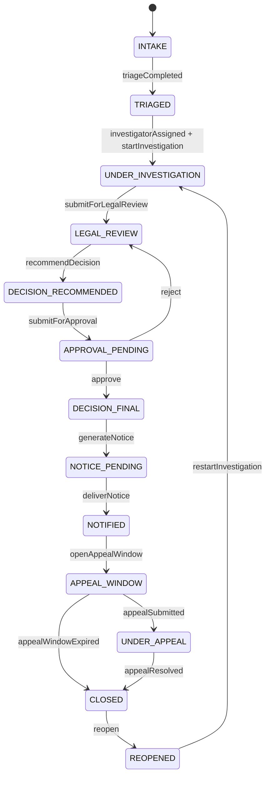

### 7.1 State Transition Table

| Current | Command | Next | Guard | Side Effect |
|---|---|---|---|---|
| `INTAKE` | `CompleteTriage` | `TRIAGED` | triage outcome valid | emit `CaseTriaged` |
| `TRIAGED` | `StartInvestigation` | `UNDER_INVESTIGATION` | investigator assigned | emit `InvestigationStarted` |
| `UNDER_INVESTIGATION` | `SubmitForLegalReview` | `LEGAL_REVIEW` | evidence exists | emit `LegalReviewRequested` |
| `LEGAL_REVIEW` | `RecommendDecision` | `DECISION_RECOMMENDED` | legal basis exists | emit `DecisionRecommended` |
| `APPROVAL_PENDING` | `ApproveDecision` | `DECISION_FINAL` | approver has authority | emit `DecisionFinalized` |
| `DECISION_FINAL` | `GenerateNotice` | `NOTICE_PENDING` | notice template valid | emit `NoticeGenerated` |
| `NOTICE_PENDING` | `MarkNoticeDelivered` | `NOTIFIED` | delivery proof exists | emit `NoticeDelivered` |
| `APPEAL_WINDOW` | `SubmitAppeal` | `UNDER_APPEAL` | within appeal period | emit `AppealSubmitted` |
| `CLOSED` | `ReopenCase` | `REOPENED` | reopening reason approved | emit `CaseReopened` |

### 7.2 Pattern Decision

Kita bisa implement workflow dengan:

1. Code-based state machine.
2. Database-driven transition table.
3. Workflow engine.
4. Hybrid: core lifecycle in code, long-running timers in scheduler/engine.

Untuk RegCase, pilihan pragmatic:

- core invariant transition ada di domain/service code;
- durable timers dan escalation ada di scheduler/workflow process manager;
- approval chain bisa configurable, tetapi command tetap divalidasi oleh domain policy;
- audit trail immutable untuk semua transition.

Alasannya: regulatory case lifecycle perlu defensibility. Kalau semua logic dibuat dynamic lewat konfigurasi, review dan testing bisa menjadi lemah. Kalau semua hardcoded, policy evolution menjadi mahal. Hybrid menjaga kedua sisi.

---

## 8. Application Service Boundary

Application service mengorkestrasi use case. Ia bukan tempat business rule utama, tetapi tempat transaction boundary, repository, authorization, external call policy, dan outbox integration bertemu.

```java
public final class StartInvestigationService {
    private final CaseRepository caseRepository;
    private final AuthorizationService authorizationService;
    private final Outbox outbox;
    private final AuditTrail auditTrail;
    private final Clock clock;

    @Transactional
    public StartInvestigationResult handle(StartInvestigationCommand command) {
        Instant now = clock.instant();
        Actor actor = authorizationService.requireActor(command.actorId());

        CaseFile caseFile = caseRepository.findForUpdate(command.caseId())
            .orElseThrow(() -> new CaseNotFound(command.caseId()));

        authorizationService.requireAllowed(
            actor,
            Permission.START_INVESTIGATION,
            Resource.caseFile(caseFile.id())
        );

        caseFile.startInvestigation(actor, now);

        caseRepository.save(caseFile);

        List<DomainEvent> events = caseFile.pullEvents();
        outbox.appendAll(events, Correlation.current(), now);

        auditTrail.record(AuditRecord.domainAction(
            command.commandId(),
            actor.id(),
            caseFile.id(),
            "START_INVESTIGATION",
            now
        ));

        return new StartInvestigationResult(caseFile.id(), caseFile.status());
    }
}
```

### 8.1 Boundary Rules

Application service boleh:

- membuka transaction;
- memuat aggregate;
- mengecek authorization;
- memanggil domain method;
- menyimpan aggregate;
- menulis outbox;
- menulis audit record;
- mengembalikan result DTO.

Application service tidak boleh:

- mengubah field domain secara langsung;
- mengirim event broker langsung sebelum commit;
- memanggil remote service di tengah transaction tanpa alasan kuat;
- menyembunyikan business rule di mapper;
- membuat retry tanpa idempotency;
- mengubah state workflow tanpa transition guard.

---

## 9. Data Classification

Sebelum memilih database table, klasifikasikan data.

| Data | Classification | Write Model | Read Model | Notes |
|---|---|---|---|---|
| Case status | Mutable state | `case_file` | `case_summary_view` | optimistic locking |
| Evidence metadata | Mutable + immutable references | `evidence_item` | `case_evidence_view` | physical object external |
| Uploaded document bytes | External object | document store | document preview | hash required |
| Domain event | Immutable fact | `outbox_event` then broker | replay/projection | append-only |
| Audit record | Immutable evidence | `audit_record` | audit timeline | never mutate |
| Risk score | Derived state | `case_risk` | dashboard projection | recomputable |
| SLA milestone | Durable timer state | `sla_clock` | escalation queue | idempotent trigger |
| Authorization decision | Ephemeral derived | not stored or short cache | none | cache carefully |
| Reporting aggregate | Projection | worker generated | analytics/read DB | eventual consistency |

This table prevents a common mistake: treating every table as the same kind of data.

State, fact, evidence, cache, projection, and configuration have different rules.

---

## 10. Persistence Model

### 10.1 Operational Tables

A simplified schema:

```sql
create table case_file (
    id uuid primary key,
    tenant_id varchar(64) not null,
    case_number varchar(64) not null unique,
    status varchar(64) not null,
    version bigint not null,
    active_investigator_id varchar(128),
    risk_score numeric(10, 2),
    created_at timestamp not null,
    updated_at timestamp not null
);

create table evidence_item (
    id uuid primary key,
    case_id uuid not null references case_file(id),
    tenant_id varchar(64) not null,
    document_id varchar(256) not null,
    sha256 varchar(64) not null,
    status varchar(64) not null,
    version bigint not null,
    created_at timestamp not null,
    updated_at timestamp not null
);

create table audit_record (
    id uuid primary key,
    tenant_id varchar(64) not null,
    resource_type varchar(64) not null,
    resource_id varchar(128) not null,
    actor_id varchar(128) not null,
    action varchar(128) not null,
    command_id uuid not null,
    occurred_at timestamp not null,
    payload jsonb not null
);

create table outbox_event (
    id uuid primary key,
    aggregate_type varchar(128) not null,
    aggregate_id varchar(128) not null,
    event_type varchar(128) not null,
    event_version int not null,
    correlation_id varchar(128) not null,
    causation_id varchar(128),
    occurred_at timestamp not null,
    payload jsonb not null,
    status varchar(32) not null,
    published_at timestamp
);

create table processed_message (
    consumer_name varchar(128) not null,
    message_id uuid not null,
    processed_at timestamp not null,
    primary key (consumer_name, message_id)
);
```

### 10.2 Optimistic Locking

Case transition harus dilindungi oleh version.

```java
public interface CaseRepository {
    Optional<CaseFile> findById(CaseId id);

    Optional<CaseFile> findForUpdate(CaseId id);

    void save(CaseFile caseFile);
}
```

Jika memakai JPA:

```java
@Entity
@Table(name = "case_file")
class CaseFileEntity {
    @Id
    private UUID id;

    @Version
    private long version;

    @Column(nullable = false)
    private String status;

    // fields omitted
}
```

Tetapi jangan biarkan entity persistence menjadi domain model jika framework constraint mulai merusak invariant. Untuk domain kompleks, mapper eksplisit sering lebih jelas.

---

## 11. Transaction and Outbox Pattern

### 11.1 Why Outbox

Jika service menyimpan `case_file` lalu publish event langsung ke broker, ada risiko:

1. DB commit berhasil, publish gagal.
2. Publish berhasil, DB rollback.
3. Request timeout tetapi operasi sebenarnya sukses.
4. Retry menghasilkan duplicate publish.

Transactional outbox menyimpan event di database yang sama dengan perubahan aggregate. Relay kemudian menerbitkan event setelah commit.

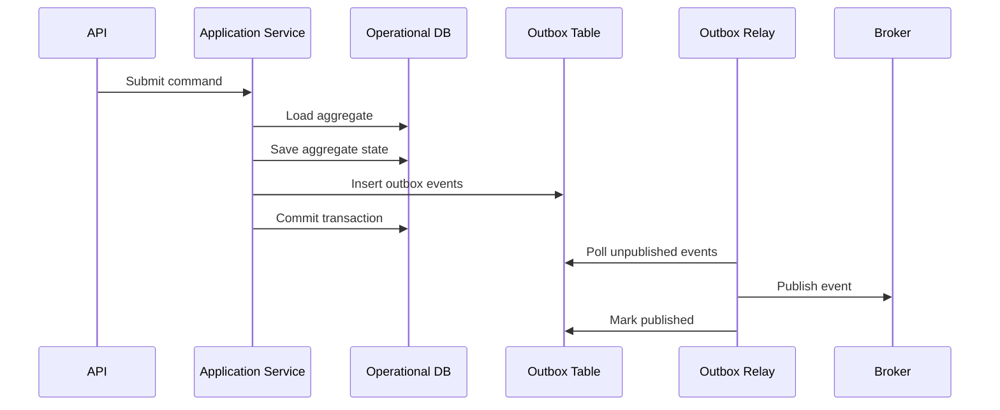

### 11.2 Outbox Event Contract

```java
public record OutboxMessage(
    UUID id,
    String aggregateType,
    String aggregateId,
    String eventType,
    int eventVersion,
    String correlationId,
    String causationId,
    Instant occurredAt,
    JsonNode payload
) {}
```

### 11.3 Relay Idempotency

Relay can publish duplicate messages if it crashes after publish but before marking event as published. Consumers must be idempotent.

```java
public final class IdempotentEventConsumer {
    private final ProcessedMessageRepository processedMessages;
    private final ProjectionUpdater projectionUpdater;

    @Transactional
    public void handle(EventEnvelope envelope) {
        boolean firstTime = processedMessages.tryInsert(
            "case-summary-projection",
            envelope.messageId()
        );

        if (!firstTime) {
            return;
        }

        projectionUpdater.apply(envelope);
    }
}
```

Rule: outbox reduces lost event risk. It does not remove duplicate delivery risk.

---

## 12. Event Catalog

Events should be facts, not commands disguised as events.

| Event | Source | Meaning | Consumer Examples |
|---|---|---|---|
| `CaseCreated` | Case service | New case exists | dashboard projection, notification |
| `CaseTriaged` | Case service | Triage completed | SLA scheduler, assignment service |
| `InvestigatorAssigned` | Case service | Investigator assigned | notification, workload projection |
| `InvestigationStarted` | Case service | Investigation started | SLA scheduler |
| `EvidenceAttached` | Case service | Evidence linked to case | evidence projection, audit timeline |
| `LegalReviewRequested` | Case service | Case moved to legal review | legal queue projection |
| `DecisionRecommended` | Decision service | Recommendation created | approval workflow |
| `DecisionFinalized` | Decision service | Decision approved/final | notice generation |
| `NoticeGenerated` | Notice service | Notice document created | notification delivery |
| `NoticeDelivered` | Notice service | Notice delivery confirmed | appeal window scheduler |
| `AppealSubmitted` | Appeal service | Appeal received | case workflow update |
| `SlaBreached` | SLA scheduler | SLA milestone missed | escalation service |

### 12.1 Event Envelope

```java
public record EventEnvelope<T>(
    UUID messageId,
    String eventType,
    int eventVersion,
    String aggregateType,
    String aggregateId,
    String tenantId,
    String correlationId,
    String causationId,
    Instant occurredAt,
    T payload
) {}
```

Envelope is not decoration. It is part of the operational contract.

Without envelope fields, debugging distributed event flow becomes guesswork.

---

## 13. Command Catalog

Commands are requests to perform action. Events are facts that action happened.

| Command | Handler | Idempotency Key | Expected Event |
|---|---|---|---|
| `CreateCase` | Case app service | external intake id | `CaseCreated` |
| `CompleteTriage` | Case app service | command id | `CaseTriaged` |
| `AssignInvestigator` | Case app service | command id | `InvestigatorAssigned` |
| `StartInvestigation` | Case app service | command id | `InvestigationStarted` |
| `AttachEvidence` | Case app service | document id + case id | `EvidenceAttached` |
| `SubmitForLegalReview` | Case app service | command id | `LegalReviewRequested` |
| `RecommendDecision` | Decision app service | command id | `DecisionRecommended` |
| `ApproveDecision` | Decision app service | command id | `DecisionFinalized` |
| `GenerateNotice` | Notice app service | decision id | `NoticeGenerated` |
| `MarkNoticeDelivered` | Notice app service | delivery proof id | `NoticeDelivered` |
| `SubmitAppeal` | Appeal app service | external appeal id | `AppealSubmitted` |

Command idempotency is not optional in distributed systems. UI retry, gateway timeout, mobile reconnection, batch replay, and broker redelivery all create repeat attempts.

---

## 14. API Boundary

### 14.1 Command API

```http
POST /cases/{caseId}/commands/start-investigation
Idempotency-Key: 63ffeb7e-6e01-4fd4-b094-70c817dbec3d
X-Correlation-Id: c-20260627-001
Content-Type: application/json

{
  "actorId": "user-123",
  "reason": "Initial triage completed and investigator assigned"
}
```

Why command endpoint?

Because `StartInvestigation` is not just `PATCH status = UNDER_INVESTIGATION`. It is a domain action with guard, authorization, audit, event, and side effects.

### 14.2 Query API

```http
GET /cases/{caseId}
GET /cases?status=LEGAL_REVIEW&assignedTo=user-123&pageToken=...
GET /cases/{caseId}/timeline
GET /cases/{caseId}/evidence
GET /cases/{caseId}/permissions
```

Separate command and query models when read needs diverge from write model.

### 14.3 Error Contract

```json
{
  "errorCode": "INVALID_CASE_TRANSITION",
  "message": "Case cannot start investigation from LEGAL_REVIEW",
  "correlationId": "c-20260627-001",
  "details": {
    "caseId": "...",
    "currentStatus": "LEGAL_REVIEW",
    "allowedStatuses": ["TRIAGED", "REOPENED"]
  }
}
```

Error contract should help clients recover without leaking sensitive internals.

---

## 15. Authorization Architecture

Authorization must protect every command, query, and sensitive field.

### 15.1 Permission Model

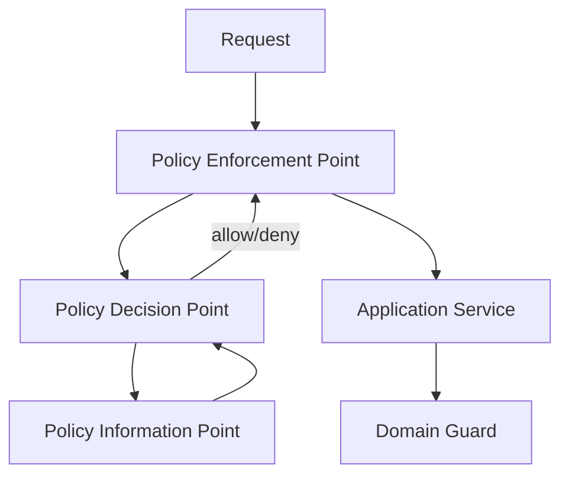

### 15.2 Authorization Matrix

| Action | Required Conditions |
|---|---|
| View case | same tenant and role has case read scope |
| Assign investigator | supervisor role and case in assignable status |
| Start investigation | assigned investigator or supervisor override |
| Attach evidence | assigned investigator and case active |
| Submit legal review | investigator and evidence exists |
| Recommend decision | legal reviewer role and conflict check passed |
| Approve decision | approver role, approval threshold, not same as recommender |
| Reopen case | supervisor role and reopening reason approved |
| Break glass access | special permission, reason required, audit mandatory |

### 15.3 Pattern Choice

Use:

- RBAC for coarse role capability;
- ABAC for tenant, assignment, case status, risk level, conflict status;
- policy object for complex domain-specific decision;
- audit record for sensitive access;
- deny-by-default;
- field-level filtering for sensitive data.

```java
public interface AuthorizationPolicy {
    AuthorizationDecision evaluate(Actor actor, Action action, Resource resource, RequestContext context);
}

public final class CaseAuthorizationPolicy implements AuthorizationPolicy {
    @Override
    public AuthorizationDecision evaluate(
        Actor actor,
        Action action,
        Resource resource,
        RequestContext context
    ) {
        if (!actor.tenantId().equals(resource.tenantId())) {
            return AuthorizationDecision.deny("cross-tenant access denied");
        }

        if (action == Action.START_INVESTIGATION) {
            return actor.hasRole("INVESTIGATOR") && context.isAssignedTo(actor.id())
                ? AuthorizationDecision.allow()
                : AuthorizationDecision.deny("actor is not assigned investigator");
        }

        return AuthorizationDecision.deny("no matching policy");
    }
}
```

Avoid scattering `if (user.isAdmin())` in controllers. That is not authorization architecture; it is permission drift.

---

## 16. Concurrency Model

Concurrency design starts from ownership.

### 16.1 State Ownership Table

| State | Owner | Concurrency Control |
|---|---|---|
| Case lifecycle status | Case service / `CaseFile` aggregate | optimistic lock |
| Evidence metadata | Evidence service or case service depending boundary | optimistic lock |
| Document bytes | Document service | immutable object hash |
| Decision approval | Decision aggregate | optimistic lock + approval uniqueness |
| SLA timers | Scheduler/process manager | idempotency key per milestone |
| Read projection | Projection worker | idempotent consumer |
| Cache entry | Cache component | TTL/versioned key |
| Audit record | Audit writer | append-only unique command id |

### 16.2 Handling Concurrent Transition

Scenario: two users try to move the same case.

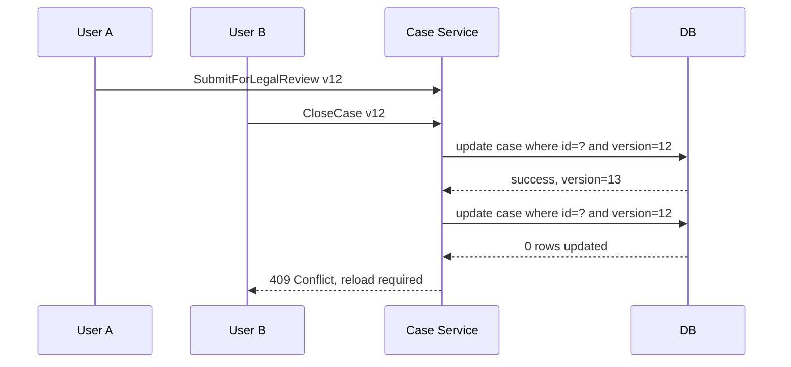

### 16.3 Conflict Response

Return conflict as a domain-aware response:

```json
{
  "errorCode": "CASE_VERSION_CONFLICT",
  "message": "The case was changed by another operation. Reload and retry if still applicable.",
  "currentVersion": 13,
  "correlationId": "c-20260627-002"
}
```

Do not silently overwrite.

### 16.4 Single-Writer Option

For extremely high contention on a case, use partitioned command processing:

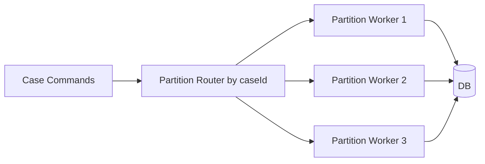

This serializes commands per case id. It reduces write conflict but adds queueing latency and operational complexity. Use it only when conflict rate justifies it.

---

## 17. Structured Concurrency in Request Flow

Java modern concurrency changes how we compose independent I/O.

Example: loading case detail page requires:

- case summary;
- evidence list;
- permission set;
- SLA status;
- latest decision;
- read-model statistics.

With virtual threads and structured concurrency, we can keep code direct while bounding failure and cancellation.

```java
public CaseDetailView loadCaseDetail(CaseId caseId, Actor actor) throws Exception {
    try (var scope = new StructuredTaskScope.ShutdownOnFailure()) {
        Supplier<CaseSummary> summary = scope.fork(() -> caseQuery.loadSummary(caseId));
        Supplier<List<EvidenceView>> evidence = scope.fork(() -> evidenceQuery.listForCase(caseId));
        Supplier<PermissionView> permissions = scope.fork(() -> permissionQuery.forCase(actor, caseId));
        Supplier<SlaView> sla = scope.fork(() -> slaQuery.forCase(caseId));

        scope.join();
        scope.throwIfFailed();

        return new CaseDetailView(
            summary.get(),
            evidence.get(),
            permissions.get(),
            sla.get()
        );
    }
}
```

Production notes:

- still use timeouts/deadlines;
- still use connection pools carefully;
- still separate bulkheads per dependency;
- cancellation must propagate;
- avoid hiding expensive fan-out behind innocent getter methods.

---

## 18. Resilience Policy by Dependency

Not every dependency deserves the same retry/circuit/bulkhead policy.

| Dependency | Failure Impact | Timeout | Retry | Circuit Breaker | Fallback |
|---|---|---:|---|---|---|
| Identity provider | cannot authorize | short | limited | yes | deny or cached low-risk only |
| Document service | evidence unavailable | medium | safe reads only | yes | show metadata, disable preview |
| External registry | enrichment unavailable | medium | yes with jitter | yes | mark enrichment pending |
| Notification service | delivery delayed | medium | async retry | yes | outbox retry |
| Analytics DB | dashboard degraded | short | no for user request | yes | return partial view |
| Audit store | critical | short | limited | yes | fail closed for sensitive action |

### 18.1 Deadline Propagation

```java
public record Deadline(Instant expiresAt) {
    public Duration remaining(Clock clock) {
        Duration duration = Duration.between(clock.instant(), expiresAt);
        return duration.isNegative() ? Duration.ZERO : duration;
    }

    public boolean expired(Clock clock) {
        return !remaining(clock).isPositive();
    }
}
```

A timeout is local. A deadline is end-to-end.

### 18.2 Retry Rule

Retry only when:

1. operation is idempotent or protected by idempotency key;
2. failure is transient;
3. retry has bounded attempts;
4. retry uses jitter;
5. total deadline is respected;
6. downstream can tolerate retry load.

---

## 19. Cache Strategy

RegCase should not cache everything.

### 19.1 Cache Candidates

| Data | Cache? | Strategy | Reason |
|---|---:|---|---|
| Permission policy metadata | Yes | short TTL + version key | frequent, slow-changing |
| Case detail | Maybe | per-user/tenant careful | authorization-sensitive |
| Reference data | Yes | read-through + refresh | stable |
| External registry result | Yes | TTL + source timestamp | expensive remote call |
| Case status | Usually no | DB/read model | high correctness requirement |
| Audit timeline | No or projection only | immutable query index | evidence integrity |
| SLA queue | No | durable DB/scheduler | correctness critical |

### 19.2 Versioned Cache Key

```java
public record CaseCacheKey(
    TenantId tenantId,
    CaseId caseId,
    long caseVersion,
    UserId viewerId
) {}
```

Including version prevents stale state from looking fresh. Including viewer prevents leaking field-level authorization differences.

---

## 20. Observability and Audit

Observability and audit are related but not the same.

| Concern | Observability | Audit |
|---|---|---|
| Purpose | operate/debug system | prove who did what and why |
| Mutability | retention/aggregation allowed | immutable or tamper-evident |
| Audience | engineers/SRE | legal/compliance/business |
| Data | metrics, traces, logs | actor, action, resource, decision, evidence |
| Failure handling | degrade if telemetry backend down | fail closed for critical actions if audit cannot be recorded |

### 20.1 Correlation Model

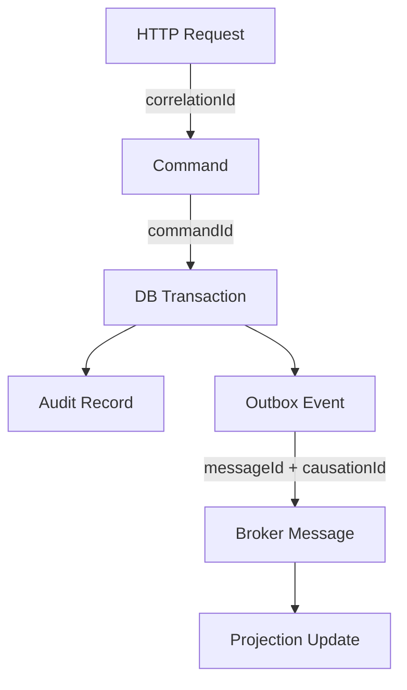

### 20.2 Diagnostic Envelope

Every important log/event should carry:

- `correlationId`
- `causationId`
- `commandId`
- `messageId`
- `tenantId`
- `resourceType`
- `resourceId`
- `actorId` if safe
- `operation`
- `outcome`
- `durationMs`
- `errorCode`
- `dependency`

Example structured log:

```json
{
  "level": "INFO",
  "operation": "StartInvestigation",
  "outcome": "SUCCESS",
  "caseId": "case-123",
  "tenantId": "tenant-a",
  "actorId": "user-123",
  "commandId": "cmd-456",
  "correlationId": "corr-789",
  "durationMs": 42
}
```

---

## 21. Projection Architecture

Read models are derived, disposable, and rebuildable.

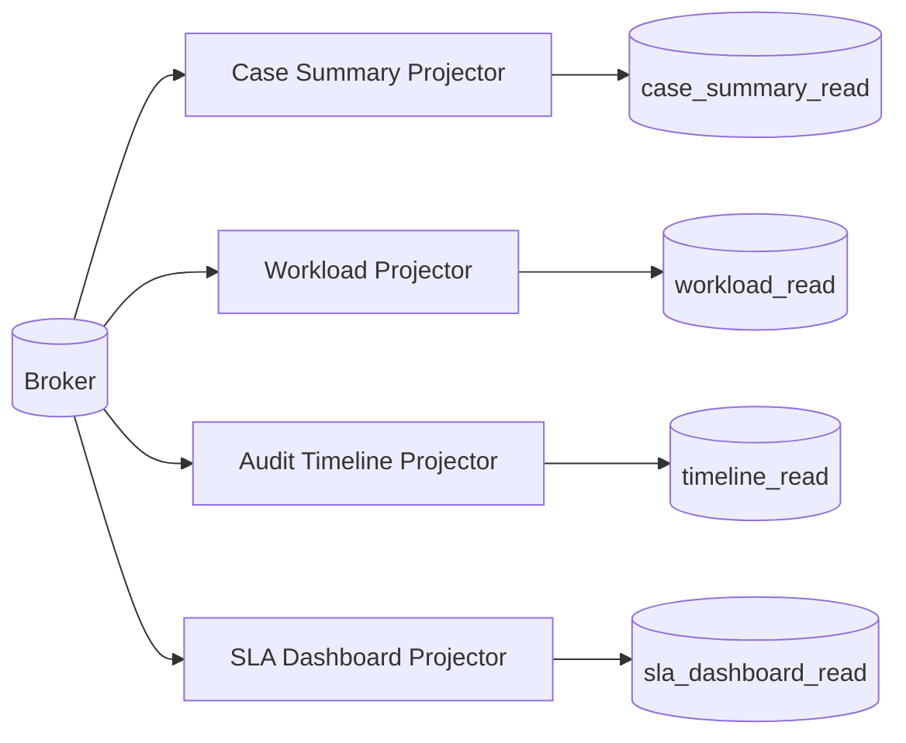

### 21.1 Projection Rule

Projection must be:

- idempotent;
- replayable;
- tolerant of duplicate messages;
- observable;
- version-aware;
- isolated from command transaction;
- rebuildable from event/audit source where possible.

### 21.2 Projection Handler

```java
public final class CaseSummaryProjector {
    private final ProcessedMessageRepository processed;
    private final CaseSummaryReadRepository readRepository;

    @Transactional
    public void handle(EventEnvelope<?> envelope) {
        if (!processed.tryInsert("case-summary", envelope.messageId())) {
            return;
        }

        switch (envelope.eventType()) {
            case "CaseCreated" -> apply((CaseCreated) envelope.payload());
            case "CaseStatusChanged" -> apply((CaseStatusChanged) envelope.payload());
            case "InvestigatorAssigned" -> apply((InvestigatorAssigned) envelope.payload());
            default -> {
                // ignore unrelated event explicitly
            }
        }
    }

    private void apply(CaseStatusChanged event) {
        readRepository.updateStatus(event.caseId(), event.nextStatus(), event.occurredAt());
    }
}
```

---

## 22. SLA and Escalation Process Manager

SLA is not just a query. SLA creates future obligations.

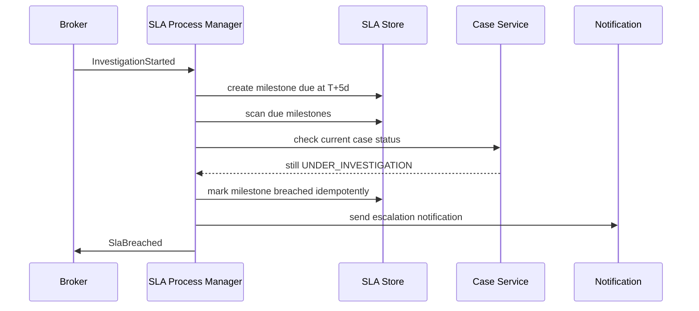

### 22.1 SLA Idempotency Key

Use natural uniqueness:

```text
caseId + milestoneType + milestoneVersion
```

Without this, retries can create duplicate escalation.

### 22.2 Durable Timer Table

```sql
create table sla_milestone (
    id uuid primary key,
    case_id uuid not null,
    milestone_type varchar(64) not null,
    due_at timestamp not null,
    status varchar(32) not null,
    version bigint not null,
    unique(case_id, milestone_type)
);
```

---

## 23. Notice Generation Pipeline

Notice generation is a pipeline because it has multiple stages, each with different failure modes.

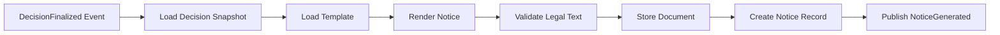

### 23.1 Stage Contract

| Stage | Idempotency | Failure Handling |
|---|---|---|
| Load decision snapshot | read-only | retry safe |
| Load template | read-only/cache | fallback to versioned template only if valid |
| Render notice | deterministic | retry safe |
| Validate legal text | deterministic | fail to manual review |
| Store document | content hash key | idempotent by hash |
| Create notice record | unique decision id | transactional |
| Publish event | outbox | duplicate-safe consumer |

### 23.2 Pipeline Context

```java
public record NoticePipelineContext(
    DecisionId decisionId,
    CaseId caseId,
    TenantId tenantId,
    String templateVersion,
    String correlationId,
    Instant startedAt
) {}
```

Pipeline context should carry metadata, not become a mutable garbage bag.

---

## 24. Module Structure

A production Java codebase should make bad dependency direction difficult.

```text
regcase/
  case-domain/
  case-application/
  case-adapters-web/
  case-adapters-persistence/
  case-adapters-messaging/
  decision-domain/
  decision-application/
  notice-domain/
  notice-application/
  shared-kernel/
  platform-observability/
  platform-security/
  platform-resilience/
```

### 24.1 Dependency Direction

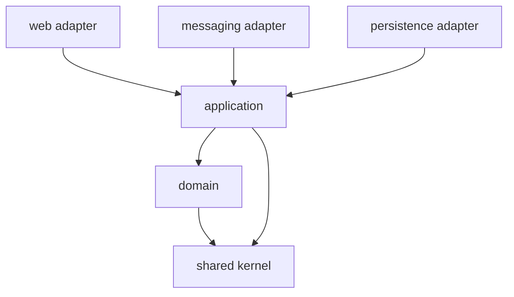

Domain should not depend on Spring, JPA, Kafka, HTTP, or metrics library.

### 24.2 Example Module Descriptor

```java
module regcase.case.application {
    requires regcase.case.domain;
    requires regcase.shared.kernel;

    exports com.example.regcase.case.application.api;
}
```

---

## 25. Testing Portfolio

Capstone architecture is only real if it can be tested.

| Test Type | What It Proves |
|---|---|
| Domain invariant test | aggregate rejects invalid transition |
| State machine table test | every allowed transition is explicit |
| Authorization matrix test | deny/allow decisions are stable |
| Repository integration test | mapping and optimistic locking work |
| Transaction boundary test | aggregate state and outbox commit together |
| Idempotency test | repeated command/message has same outcome |
| Projection replay test | read model can rebuild from events |
| Contract test | API and event schema stay compatible |
| Resilience test | timeout/retry/circuit policy behaves as expected |
| Concurrency test | conflicting transitions do not corrupt state |
| Audit test | sensitive action records actor/action/resource/reason |
| Observability test | important operation emits correlation metadata |
| End-to-end critical journey | happy path and major failure path work together |

### 25.1 Domain Test Example

```java
@Test
void cannotStartInvestigationWithoutAssignedInvestigator() {
    CaseFile caseFile = new CaseFile(new CaseId(UUID.randomUUID()), CaseStatus.TRIAGED, Version.initial());
    Actor actor = Actor.investigator("user-1");

    assertThatThrownBy(() -> caseFile.startInvestigation(actor, Instant.now()))
        .isInstanceOf(DomainRuleViolation.class)
        .hasMessageContaining("active investigator");
}
```

### 25.2 Transaction + Outbox Test

```java
@Test
void savesCaseAndOutboxEventInSameTransaction() {
    StartInvestigationCommand command = validCommand();

    service.handle(command);

    CaseFileEntity caseFile = caseDao.get(command.caseId());
    List<OutboxEventEntity> events = outboxDao.findByAggregateId(command.caseId().toString());

    assertThat(caseFile.status()).isEqualTo("UNDER_INVESTIGATION");
    assertThat(events).extracting(OutboxEventEntity::eventType)
        .contains("CaseStatusChanged");
}
```

### 25.3 Concurrency Test Sketch

```java
@Test
void concurrentTransitionsResultInSingleWinner() throws Exception {
    CaseId caseId = fixture.createTriagedCaseWithInvestigator();

    ExecutorService executor = Executors.newFixedThreadPool(2);
    CountDownLatch start = new CountDownLatch(1);

    Callable<Result> a = () -> {
        start.await();
        return attempt(() -> service.startInvestigation(command(caseId)));
    };

    Callable<Result> b = () -> {
        start.await();
        return attempt(() -> service.closeCase(closeCommand(caseId)));
    };

    Future<Result> fa = executor.submit(a);
    Future<Result> fb = executor.submit(b);
    start.countDown();

    List<Result> results = List.of(fa.get(), fb.get());

    assertThat(results).filteredOn(Result::success).hasSize(1);
    assertThat(results).filteredOn(Result::conflict).hasSize(1);
}
```

---

## 26. Performance Design

Performance should be designed from access patterns.

### 26.1 Hot Paths

| Hot Path | Risk | Pattern |
|---|---|---|
| Case list by queue/status | slow joins | read projection |
| Case detail | fan-out latency | structured concurrency + partial fallback |
| Permission check | repeated policy lookup | short TTL policy cache |
| Evidence preview | document service latency | metadata first, preview async |
| SLA scan | full table scan | indexed due_at + partitioning |
| Audit timeline | huge history | append-only index + pagination |
| Reporting | heavy aggregate query | analytics projection |

### 26.2 Batching Rule

Batch where it reduces overhead without hiding failure.

Good batching:

- projection updates in bounded chunks;
- notification delivery retry batch;
- SLA due milestone scan;
- export generation.

Bad batching:

- giant transaction over thousands of cases;
- batch command that partially changes domain without per-item result;
- unbounded queue before batch worker;
- retrying entire batch because one item failed.

---

## 27. Failure Scenarios

A top engineer reviews architecture by failure scenario, not by happy-path diagram.

### 27.1 Failure Scenario Matrix

| Scenario | Expected Behavior |
|---|---|
| API times out after DB commit | client retry uses idempotency key; no duplicate state change |
| Outbox relay crashes after publish | consumer idempotency prevents duplicate projection |
| Projection worker lags | command path unaffected; read model shows staleness indicator |
| Document service down | evidence metadata preserved; preview disabled; retry async |
| Authorization service slow | fail closed or use bounded low-risk cache |
| Two approvers act concurrently | optimistic lock/approval uniqueness picks valid result |
| SLA scheduler runs twice | unique milestone breach prevents duplicate escalation |
| Broker redelivers old event | processed message table prevents duplicate effect |
| Cache returns stale policy | version/TTL limits exposure; sensitive action revalidates |
| Audit store unavailable | sensitive command fails closed |

### 27.2 Incident Reconstruction

For any critical command, we should reconstruct:

1. request received;
2. actor identity;
3. authorization decision;
4. loaded aggregate version;
5. domain transition;
6. DB commit;
7. outbox event id;
8. broker publish;
9. projection update;
10. notification/escalation outcome.

If this cannot be reconstructed, observability and audit design is incomplete.

---

## 28. Pattern Selection Summary

This capstone uses many patterns. Each has a reason.

| Problem | Selected Pattern | Why |
|---|---|---|
| Case lifecycle correctness | State machine + aggregate | explicit valid transitions |
| Complex domain rules | Entity/value object/policy/specification | localizes invariant |
| Reliable event publish | Transactional outbox | DB change and event recorded atomically |
| Duplicate event handling | Idempotent consumer/inbox | broker redelivery safe |
| Long-running SLA | Process manager + durable timer | future obligation persisted |
| Read performance | Projection/read model | avoid heavy write-model query |
| External unreliability | Timeout/retry/circuit/bulkhead | bounded failure impact |
| Case detail fan-out | Structured concurrency | clear cancellation/failure tree |
| Sensitive access | ABAC/RBAC + policy object | contextual authorization |
| Audit defensibility | Immutable audit record | evidence-quality history |
| Extension | Module + SPI/registry | controlled evolvability |
| Migration | Strangler/branch by abstraction | incremental replacement |

---

## 29. Anti-Pattern Review

Before calling design complete, look for these smells.

### 29.1 Domain Smells

- status changed with generic setter;
- rule hidden in controller;
- `Map<String, Object>` payload passed through domain;
- invalid state representable without error;
- decision finalization does not snapshot evidence references;
- workflow transition not audited.

### 29.2 Data Smells

- audit record mutable;
- cache treated as source of truth;
- event payload is entire DB row dump;
- projection cannot be rebuilt;
- idempotency key absent;
- optimistic lock conflict ignored.

### 29.3 Integration Smells

- remote call inside DB transaction;
- retry without timeout;
- retry without idempotency;
- fire-and-forget side effect;
- dead-letter queue not monitored;
- consumer assumes exactly-once delivery.

### 29.4 Concurrency Smells

- shared mutable singleton;
- `ThreadLocal` context not cleared;
- unbounded executor queue;
- parallel stream over blocking I/O;
- virtual threads used to hide missing backpressure;
- lock held during remote call.

### 29.5 Security Smells

- authorization only in frontend;
- admin bypass without audit;
- tenant id trusted from request body;
- permission cache with no invalidation strategy;
- field-level sensitivity ignored;
- cross-tenant query missing predicate.

---

## 30. Architecture Review Checklist

Use this checklist before approving a serious Java pattern architecture.

### 30.1 Problem and Boundary

- [ ] Is the business invariant written explicitly?
- [ ] Is the aggregate boundary justified by invariant and transaction scope?
- [ ] Are command and query responsibilities separated where useful?
- [ ] Are external boundaries isolated behind adapters?
- [ ] Are dependency directions enforceable?

### 30.2 Workflow

- [ ] Are states and transitions explicit?
- [ ] Are invalid transitions impossible or rejected?
- [ ] Are transition guards tested?
- [ ] Are long-running timers durable?
- [ ] Are escalation actions idempotent?

### 30.3 Data

- [ ] Is data classified as state/fact/audit/cache/projection/config?
- [ ] Is audit immutable?
- [ ] Is versioning used for concurrent updates?
- [ ] Are projections rebuildable?
- [ ] Is schema evolution planned?

### 30.4 Events and Messaging

- [ ] Are events facts, not commands?
- [ ] Is outbox used for reliable publish?
- [ ] Are consumers idempotent?
- [ ] Are correlation and causation ids included?
- [ ] Is ordering requirement explicit?

### 30.5 Concurrency

- [ ] Is state ownership clear?
- [ ] Are shared mutable states minimized?
- [ ] Are lock scopes small?
- [ ] Are thread pools/bulkheads bounded?
- [ ] Are cancellation and timeout handled?

### 30.6 Resilience

- [ ] Does every remote dependency have timeout?
- [ ] Are retries bounded and jittered?
- [ ] Are retries idempotent?
- [ ] Are circuit breaker and bulkhead policies per dependency?
- [ ] Is fallback safe and visible?

### 30.7 Security

- [ ] Is authorization deny-by-default?
- [ ] Is permission checked on every sensitive request?
- [ ] Is tenant boundary enforced server-side?
- [ ] Is break-glass access audited?
- [ ] Are sensitive fields filtered in read models?

### 30.8 Observability

- [ ] Are logs structured?
- [ ] Are metrics low-cardinality and useful?
- [ ] Are traces propagated across async boundaries?
- [ ] Can critical incidents be reconstructed?
- [ ] Are audit and observability separated?

### 30.9 Testing

- [ ] Are domain invariants tested?
- [ ] Are concurrency conflicts tested?
- [ ] Are event duplicates tested?
- [ ] Are projection replays tested?
- [ ] Are contract tests present?
- [ ] Are resilience policies tested?

---

## 31. Minimum Viable Architecture vs Over-Engineering

A top engineer does not always choose the most sophisticated pattern.

### 31.1 Start Smaller When

- team is small;
- domain is still unstable;
- throughput is low;
- compliance pressure is low;
- read/write models are simple;
- operations maturity is limited.

Possible starting design:

- modular monolith;
- explicit domain model;
- relational DB;
- transaction + outbox table;
- async worker in same deployable;
- read projection table;
- structured logs;
- basic authorization policy;
- focused test portfolio.

### 31.2 Evolve When Pressure Appears

| Pressure | Evolution |
|---|---|
| read query slow | add projection/read model |
| event delivery unreliable | strengthen outbox relay and consumer inbox |
| workflow gets complex | introduce workflow engine/process manager |
| policy changes often | extract policy object/configurable rule table |
| contention high | partition command processing |
| tenant isolation required | shard by tenant or enforce stronger partitioning |
| release coupling painful | split module/service boundary |

Avoid starting with microservices just because the architecture diagram looks mature.

---

## 32. Production Readiness Review

A pattern architecture is production-ready when the team can answer these questions without improvisation.

1. What happens if the same command is received twice?
2. What happens if event publish fails after DB commit?
3. What happens if consumer processes the same message twice?
4. What happens if two users update the same case concurrently?
5. What happens if authorization metadata is stale?
6. What happens if projection is 15 minutes behind?
7. What happens if audit cannot be written?
8. What happens if notification service is down for 2 hours?
9. What happens if a workflow rule changes mid-case?
10. What happens if a case must be reconstructed for legal review?
11. What happens if a tenant-specific policy is misconfigured?
12. What happens if a retry storm starts?
13. What happens if a cache stampede occurs?
14. What happens if an external registry returns inconsistent data?
15. What happens if an event schema changes?

If the answer is “we hope it works”, the design is not complete.

---

## 33. Practice Drill

Build a mini RegCase module with these constraints:

1. Implement `CaseFile` aggregate with statuses:
   - `INTAKE`
   - `TRIAGED`
   - `UNDER_INVESTIGATION`
   - `LEGAL_REVIEW`
   - `DECISION_FINAL`
   - `CLOSED`
2. Implement commands:
   - `CreateCase`
   - `CompleteTriage`
   - `AssignInvestigator`
   - `StartInvestigation`
   - `SubmitForLegalReview`
   - `FinalizeDecision`
3. Use optimistic locking.
4. Write outbox event rows in same transaction.
5. Build one projection: `case_summary_read`.
6. Make projection consumer idempotent.
7. Add authorization policy for each command.
8. Add audit record for every transition.
9. Add at least one concurrency conflict test.
10. Add one duplicate command/idempotency test.
11. Add one duplicate event delivery test.
12. Add structured logs with correlation id.

### 33.1 Scoring Rubric

| Score | Meaning |
|---:|---|
| 1 | Code works only on happy path |
| 2 | Domain rules exist but transaction/event boundary weak |
| 3 | Outbox, idempotency, and authorization exist |
| 4 | Concurrency, projection replay, and audit are tested |
| 5 | Failure scenarios are documented and observable |

The goal is not a perfect system. The goal is to build muscle memory for production pattern composition.

---

## 34. Final Mental Model

Across this series, every pattern can be understood through six questions:

1. **What force does this pattern resolve?**
2. **What invariant does it protect?**
3. **What coupling does it introduce or remove?**
4. **What failure mode does it handle or create?**
5. **What operational burden does it add?**
6. **How can we test that it actually works?**

When engineers misuse patterns, they usually skip at least one of those questions.

A pattern is not good because it is famous.

A pattern is good when it makes a specific system easier to reason about under change, failure, concurrency, scale, and audit.

---

## 35. Series Completion

This is the final part of the series:

```text
learn-java-patterns-part-035-capstone-production-pattern-architecture.mdx
```

The `learn-java-patterns` series is now complete at **35 parts**.

---

## 36. Recommended Next Mastery Tracks

After finishing this series, the next high-leverage tracks are:

1. **Distributed Systems for Java Engineers**
   - consensus basics;
   - distributed transaction trade-offs;
   - partition tolerance;
   - stream processing;
   - service mesh realities;
   - data consistency models.

2. **Regulatory Workflow and Case Management Architecture**
   - BPMN vs code workflow;
   - audit defensibility;
   - escalation lifecycle;
   - evidence chain;
   - decision provenance;
   - appeal/reopen lifecycle.

3. **Production Java Performance Engineering**
   - JFR;
   - GC tuning;
   - latency profiling;
   - allocation analysis;
   - JMH;
   - async vs virtual-thread benchmarking.

4. **Secure Enterprise Java Architecture**
   - threat modeling;
   - authorization architecture;
   - tenant isolation;
   - secure audit;
   - secrets management;
   - supply-chain security.

5. **Architecture Governance and Refactoring at Scale**
   - ADR/RFC practice;
   - fitness functions;
   - modularity enforcement;
   - OpenRewrite recipes;
   - dependency governance;
   - migration strategy.

---

## 37. References for Continued Reading

- Oracle Java documentation on virtual threads and structured concurrency.
- Java Language Specification, Java Memory Model section.
- Enterprise Integration Patterns by Hohpe and Woolf.
- Microservices.io patterns: Transactional Outbox, Idempotent Consumer, Saga.
- OpenTelemetry Java documentation.
- OWASP Authorization Cheat Sheet.
- Martin Fowler: Strangler Fig Application, BFF, Circuit Breaker, Patterns of Enterprise Application Architecture.
- OpenJDK JMH and jcstress projects.
- Spring Batch reference documentation.
- Resilience4j documentation.

