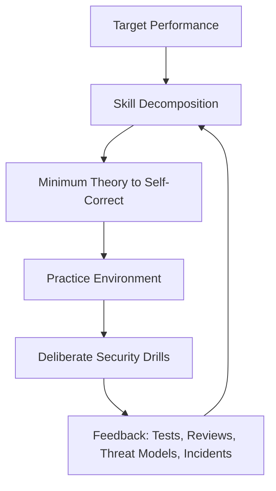
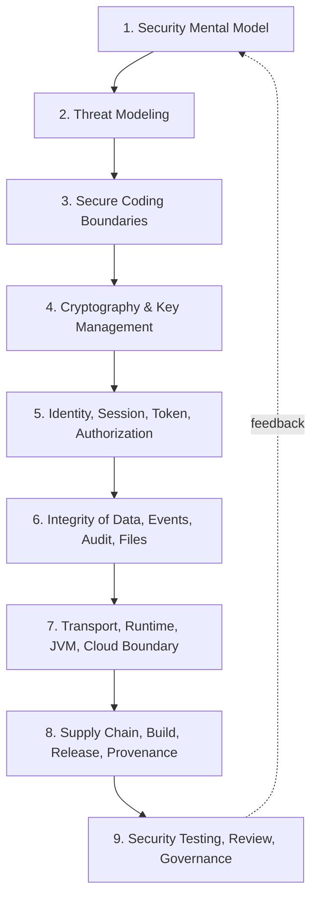
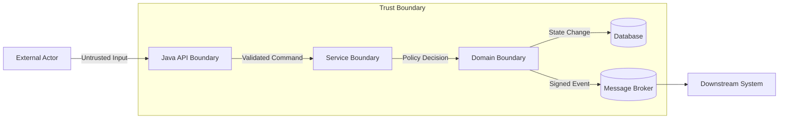
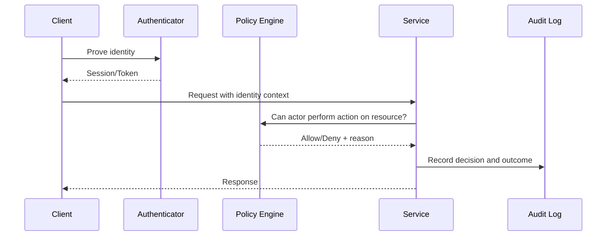
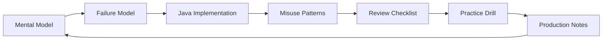

------
title: Learn Java Security, Cryptography and Integrity - Part 001
description: Kaufman skill map, target performance, mental model, practice loop, and engineering frame for mastering Java security, cryptography, and integrity.
series: learn-java-security-cryptography-integrity
seriesTitle: Learn Java Security, Cryptography and Integrity
order: 1
partTitle: Kaufman Skill Map & Security Mental Model
tags:
  - java
  - security
  - cryptography
  - integrity
  - secure-engineering
date: 2026-06-30
---

# Part 001 — Kaufman Skill Map & Security Mental Model

> Target part ini: membangun peta belajar yang membuat security tidak terasa seperti daftar checklist acak, tetapi sebagai disiplin engineering yang punya tujuan, invariants, boundary, failure model, dan practice loop.

Kita tidak mulai dari `Cipher.getInstance(...)`, Spring Security annotation, JWT, atau OWASP checklist. Itu semua penting, tetapi terlalu cepat jika mental model-nya belum benar.

Security engineering yang kuat dimulai dari pertanyaan ini:

> **Apa yang harus tetap benar ketika sistem digunakan oleh pihak yang tidak sepenuhnya kita percaya, berjalan di lingkungan yang bisa gagal, menerima input yang hostile, bergantung pada dependency eksternal, dan harus tetap dapat diaudit setelah insiden terjadi?**

Java security, cryptography, dan integrity bukan satu skill tunggal. Ini adalah gabungan dari beberapa kemampuan:

1. **Membaca sistem sebagai attack surface.**
2. **Membuat security requirement yang bisa diuji.**
3. **Memilih primitive crypto yang tepat tanpa misuse.**
4. **Mengelola identity, authorization, session, token, dan boundary.**
5. **Menjamin integrity data, event, audit trail, build artifact, dan runtime configuration.**
6. **Mendesain sistem agar failure tidak berubah menjadi compromise.**
7. **Membuat keputusan security yang bisa dijelaskan, direview, dan dipertanggungjawabkan.**

Oracle mendeskripsikan Java Security API sebagai framework luas yang mencakup cryptography, public key infrastructure, secure communication, authentication, dan access control. Itu berarti fokus kita bukan hanya “pakai library security”, tetapi memahami bagaimana security decision bergerak dari desain sampai runtime. Referensi utama Java modern untuk seri ini adalah Java SE/JDK 25 Security Documentation, termasuk Java Security Overview, JCA Reference Guide, JSSE, PKI, tools seperti `keytool`, dan perubahan penting seperti Security Manager yang sudah permanently disabled sejak JDK 24.

Referensi:

- Java Security Overview: https://docs.oracle.com/en/java/javase/25/security/java-security-overview1.html
- JCA Reference Guide: https://docs.oracle.com/en/java/javase/25/security/java-cryptography-architecture-jca-reference-guide.html
- Security Manager permanently disabled: https://docs.oracle.com/en/java/javase/25/security/security-manager-is-permanently-disabled.html
- OWASP ASVS: https://owasp.org/www-project-application-security-verification-standard/
- OWASP Top 10: https://owasp.org/www-project-top-ten/
- OWASP Threat Modeling Cheat Sheet: https://cheatsheetseries.owasp.org/cheatsheets/Threat_Modeling_Cheat_Sheet.html
- NIST SSDF SP 800-218: https://csrc.nist.gov/pubs/sp/800/218/final
- NIST SP 800-57 Key Management: https://csrc.nist.gov/pubs/sp/800/57/pt1/r5/final

---

## 1. Cara Menggunakan Kaufman untuk Skill Security

Josh Kaufman menekankan bahwa belajar cepat bukan berarti belajar dangkal. Intinya adalah:

1. **Tentukan target performance yang konkret.**
2. **Pecah skill menjadi sub-skill kecil.**
3. **Pelajari cukup untuk bisa self-correct.**
4. **Hilangkan hambatan praktik.**
5. **Latihan sengaja dengan feedback cepat.**

Untuk security, pendekatan ini sangat cocok karena masalah terbesar bukan kekurangan informasi. Masalah terbesar adalah informasi security terlalu banyak, sering kontradiktif, dan mudah berubah menjadi ritual tanpa reasoning.

Kita akan memakai framework Kaufman seperti ini:



### 1.1 Target Performance Seri Ini

Target kita bukan sekadar bisa menjawab interview question seperti:

- Apa itu hashing vs encryption?
- Apa itu JWT?
- Apa itu CSRF?
- Apa itu TLS?

Target kita lebih tinggi:

> **Anda mampu mendesain, mengimplementasikan, mereview, dan mengoperasikan sistem Java enterprise yang memiliki confidentiality, integrity, availability, authentication, authorization, auditability, dan supply-chain integrity yang dapat dipertahankan secara teknis.**

Dalam konteks top engineering, seseorang dianggap kuat di security bukan karena hafal semua attack, tetapi karena mampu:

- menemukan trust boundary yang tersembunyi,
- menolak desain yang kelihatannya aman tetapi tidak punya invariant,
- membedakan risk yang benar-benar exploitable dari noise scanner,
- memahami kapan crypto diperlukan dan kapan justru menjadi theater,
- membuat failure mode yang aman,
- membuat audit trail yang berguna untuk investigasi,
- memvalidasi identity dan authorization pada boundary yang benar,
- mengubah standar seperti OWASP ASVS, NIST SSDF, dan internal policy menjadi engineering control.

---

## 2. Peta Besar Skill Java Security

Security di Java bisa dipetakan menjadi 9 lapisan.



### 2.1 Layer 1 — Security Mental Model

Ini adalah kemampuan untuk berpikir dalam bentuk:

- asset,
- actor,
- privilege,
- trust boundary,
- attacker capability,
- invariant,
- abuse path,
- failure mode,
- evidence.

Tanpa layer ini, engineer cenderung menganggap security sebagai plugin, bukan properti sistem.

Contoh salah:

```java
// Salah secara mental model: menganggap secure = punya annotation
@PreAuthorize("hasRole('ADMIN')")
public void approveCase(UUID caseId) {
    caseService.approve(caseId);
}
```

Kode di atas mungkin benar, tetapi belum cukup untuk dinyatakan aman. Pertanyaan yang harus muncul:

- Apakah `ADMIN` global, tenant-specific, atau case-specific?
- Apakah user boleh approve case yang dia buat sendiri?
- Apakah case sedang berada di state yang boleh di-approve?
- Apakah approval butuh four-eyes control?
- Apakah approval idempotent?
- Apakah audit trail mencatat before/after, actor, reason, policy version, dan correlation id?
- Apakah authorization diverifikasi ulang di service boundary, bukan hanya controller?
- Apakah event yang dipublish setelah approval bisa dipalsukan atau di-replay?

Security mental model yang benar melihat annotation sebagai salah satu enforcement point, bukan sumber kebenaran tunggal.

### 2.2 Layer 2 — Threat Modeling

Threat modeling menjawab empat pertanyaan operasional:

1. Apa yang sedang kita bangun?
2. Apa yang bisa salah?
3. Apa yang akan kita lakukan terhadap hal itu?
4. Bagaimana kita tahu mitigasi tersebut bekerja?

OWASP Threat Modeling Cheat Sheet memakai bentuk serupa: decomposition, threat identification/ranking, mitigations, review/validation.

Dalam seri ini, threat model bukan dokumen compliance. Threat model adalah alat desain.

Output minimal threat model:

- context diagram,
- data flow diagram,
- asset list,
- trust boundary list,
- threat list,
- control decision,
- residual risk,
- validation plan.

### 2.3 Layer 3 — Secure Coding Boundaries

Secure coding bukan daftar `do` dan `don't` saja. Secure coding adalah cara menjaga boundary antara:

- data dan code,
- user input dan trusted data,
- external ID dan internal object,
- path string dan filesystem object,
- serialized bytes dan object graph,
- display text dan executable browser context,
- local time dan global time,
- principal claim dan actual authorization.

Banyak vulnerability terjadi karena boundary collapse: sistem memperlakukan data dari dunia luar seolah-olah sudah menjadi fakta internal.

### 2.4 Layer 4 — Cryptography & Key Management

Crypto adalah salah satu area paling sering disalahgunakan. JCA/JCE menyediakan primitive dan provider model yang powerful, tetapi API yang flexible juga bisa membuat engineer memilih mode, padding, key size, IV, nonce, random source, atau verification logic yang salah.

Mental model utama:

- **Hash** membuktikan data tidak berubah terhadap digest yang diketahui, bukan membuktikan siapa yang membuat data.
- **MAC** membuktikan integritas dan origin dalam konteks shared secret.
- **Signature** membuktikan integritas dan origin dalam konteks private/public key.
- **Encryption without authentication** sering tidak cukup.
- **Key management lebih penting daripada algoritma yang terlihat di kode.**
- **Nonce/IV discipline adalah bagian dari security, bukan detail teknis kecil.**

### 2.5 Layer 5 — Identity, Session, Token, Authorization

Identity menjawab “siapa atau apa actor ini?”

Authorization menjawab “apakah actor ini boleh melakukan aksi ini terhadap resource ini dalam konteks ini?”

Kesalahan umum adalah mencampur keduanya:

```text
Authenticated != Authorized
JWT valid != allowed to access object
Role ADMIN != allowed for every tenant/resource/state
MFA passed != transaction safe
```

Seri ini akan memisahkan:

- authentication,
- identity proofing,
- session bootstrap,
- token validation,
- delegation,
- authorization policy,
- enforcement point,
- audit decision.

### 2.6 Layer 6 — Integrity of Data, Events, Audit, Files

Integrity bukan hanya `SHA-256(file)`.

Integrity berarti sistem dapat menjawab:

- Apakah data berubah?
- Siapa yang mengubah?
- Dalam state apa perubahan terjadi?
- Apakah perubahan allowed oleh policy saat itu?
- Apakah event bisa di-replay?
- Apakah audit log bisa ditamper?
- Apakah evidence bisa diverifikasi setelah berbulan-bulan atau bertahun-tahun?
- Apakah downstream system bisa membedakan event asli, duplicate, stale, dan forged?

Untuk sistem regulasi, finansial, enforcement, case management, healthcare, telecom, dan public sector, integrity sering lebih kritis daripada confidentiality.

### 2.7 Layer 7 — Transport, Runtime, JVM, Cloud Boundary

Security runtime modern tidak lagi mengandalkan Java Security Manager. Sejak JDK 24, Security Manager permanently disabled. Jadi isolasi harus dipindahkan ke boundary lain:

- process isolation,
- container isolation,
- network policy,
- service identity,
- OS-level permission,
- JVM flags,
- secrets delivery,
- mTLS,
- egress control,
- cloud IAM,
- runtime monitoring.

Ini mengubah cara engineer Java berpikir. Sandbox di dalam JVM bukan strategi utama. Boundary ada di deployment architecture.

### 2.8 Layer 8 — Supply Chain, Build, Release, Provenance

Sistem Java tidak hanya terdiri dari source code sendiri.

Sistem juga bergantung pada:

- Maven/Gradle plugin,
- transitive dependency,
- annotation processor,
- code generation tool,
- build image,
- CI runner,
- artifact repository,
- container base image,
- deployment manifest,
- environment configuration,
- signing key,
- SBOM,
- provenance statement.

Security breach bisa masuk dari salah satu titik tersebut. Maka integrity build dan release adalah bagian dari Java security.

### 2.9 Layer 9 — Testing, Review, Governance

Security yang tidak diuji hanyalah asumsi.

Validation harus mencakup:

- unit test untuk security invariant,
- integration test untuk authz boundary,
- property-based test untuk parser/input,
- misuse test untuk crypto,
- SAST/SCA/DAST/fuzzing,
- review checklist,
- threat model review,
- production alert,
- incident drill,
- audit evidence.

NIST SSDF menempatkan secure software development sebagai praktik yang diintegrasikan ke SDLC, bukan aktivitas setelah aplikasi selesai.

---

## 3. Mental Model: Security as Invariant Engineering

Dalam software engineering biasa, kita sering berpikir dalam fitur:

```text
User dapat approve case.
Admin dapat upload document.
System mengirim event ke downstream.
API menerima request dari partner.
```

Dalam security engineering, kita berpikir dalam invariant:

```text
Tidak ada user yang dapat approve case di luar tenant-nya.
Tidak ada pembuat case yang dapat menjadi approver final untuk case yang sama.
Tidak ada document yang dapat dieksekusi sebagai script setelah diupload.
Tidak ada event approval yang dapat diterima downstream tanpa valid signature dan monotonic sequence.
Tidak ada token dari issuer tak dikenal yang dapat dipakai untuk akses resource internal.
Tidak ada dependency tanpa provenance yang dapat masuk release production.
```

Fitur menjelaskan happy path. Invariant menjelaskan apa yang tidak boleh dilanggar.

### 3.1 Security Invariant yang Baik

Invariant yang baik memiliki ciri:

1. **Spesifik.** Tidak memakai kata kabur seperti “aman”, “proper”, atau “secure enough”.
2. **Context-aware.** Menyebut resource, actor, state, tenant, atau boundary.
3. **Testable.** Bisa diuji dengan automated test, review, log query, atau runtime check.
4. **Enforceable.** Ada enforcement point yang jelas.
5. **Observable.** Pelanggaran atau percobaannya bisa terlihat.
6. **Auditable.** Keputusan dapat direkonstruksi.

Contoh buruk:

```text
Only authorized users can approve cases.
```

Contoh lebih baik:

```text
A case can be approved only by an active user who belongs to the same tenant,
has the APPROVE_CASE permission for the case category, is not the case creator,
has completed required MFA within the last 10 minutes for high-risk cases,
and the case is currently in REVIEWED state.
```

Dalam Java, invariant seperti ini tidak boleh hidup hanya di controller atau UI. Ia harus direpresentasikan di domain/service layer dan diuji.

```java
public final class CaseApprovalPolicy {

    public ApprovalDecision evaluate(Actor actor, RegulatoryCase caze, Clock clock) {
        if (!actor.tenantId().equals(caze.tenantId())) {
            return ApprovalDecision.deny("CROSS_TENANT");
        }
        if (actor.userId().equals(caze.createdBy())) {
            return ApprovalDecision.deny("MAKER_CHECKER_VIOLATION");
        }
        if (!caze.status().equals(CaseStatus.REVIEWED)) {
            return ApprovalDecision.deny("INVALID_CASE_STATE");
        }
        if (caze.riskLevel().isHigh() && !actor.hasRecentStrongAuth(clock)) {
            return ApprovalDecision.deny("STRONG_AUTH_REQUIRED");
        }
        if (!actor.permissions().contains(Permission.APPROVE_CASE)) {
            return ApprovalDecision.deny("MISSING_PERMISSION");
        }
        return ApprovalDecision.allow("POLICY_V3");
    }
}
```

Poin penting: policy mengembalikan reason code. Reason code penting untuk audit, testing, observability, dan debugging. Jangan jadikan authorization sebagai boolean gelap.

---

## 4. Security as Boundary Engineering

Security boundary adalah garis di mana asumsi berubah.

Contoh boundary:

| Boundary | Sebelum Boundary | Setelah Boundary | Risiko Utama |
|---|---|---|---|
| HTTP request masuk | hostile bytes | parsed request object | injection, parser confusion, request smuggling |
| Authentication | anonymous actor | authenticated principal | credential theft, weak session, token replay |
| Authorization | principal claims | allowed action | IDOR, confused deputy, tenant escape |
| Database write | proposed state change | durable fact | invalid transition, tampering, race condition |
| Message broker publish | local event | distributed fact | replay, duplicate, forged event |
| File upload | untrusted bytes | stored content | malware, polyglot file, path traversal |
| Build pipeline | source/dependency | release artifact | dependency confusion, compromised runner |
| TLS connection | network bytes | peer identity + encrypted channel | broken truststore, hostname bypass |

Diagram sederhana:



Kesalahan umum: engineer menggambar component diagram tetapi tidak menandai trust boundary. Akibatnya security control diletakkan berdasarkan convenience, bukan berdasarkan perubahan asumsi.

### 4.1 Boundary Collapse

Boundary collapse terjadi ketika data melewati boundary tanpa transformasi keamanan yang tepat.

Contoh:

```java
UUID caseId = UUID.fromString(request.getParameter("caseId"));
caseRepository.findById(caseId)
    .ifPresent(caseService::approve);
```

Masalahnya bukan `UUID.fromString`. Masalahnya adalah sistem mengubah external identifier menjadi internal action tanpa:

- tenant check,
- object-level authorization,
- state transition check,
- actor separation,
- audit reason,
- replay/idempotency handling.

Perbaikan mental model:

```java
ApprovalCommand command = ApprovalCommand.from(request, authenticatedActor);
ApprovalDecision decision = approvalUseCase.approve(command);
securityAudit.record(decision.toAuditEvent());
```

`ApprovalCommand` bukan sekadar DTO. Ia adalah representasi dari intent yang melewati boundary.

---

## 5. Security as Failure Engineering

Sistem aman bukan sistem yang tidak pernah gagal. Sistem aman adalah sistem yang gagal dengan cara yang terkendali.

### 5.1 Failure Mode Penting

| Failure | Failure Tidak Aman | Failure Lebih Aman |
|---|---|---|
| Authorization service timeout | allow by default | deny with retryable error or degraded read-only mode |
| JWKS tidak bisa diambil | accept token tanpa verify | use cached valid keys within strict TTL; reject unknown key |
| Audit sink down | lanjut tanpa audit untuk aksi sensitif | block high-risk actions or spool tamper-evident local log |
| KMS unavailable | fallback ke hardcoded key | fail closed or use pre-approved cached data key policy |
| Feature flag service down | enable risky feature | default to safe configuration |
| Dependency scanner down | skip release gate silently | mark build inconclusive, require explicit risk acceptance |

Security failure engineering membutuhkan keputusan eksplisit:

- fail open atau fail closed,
- degrade atau block,
- cache atau reject,
- retry atau quarantine,
- alert atau page,
- compensate atau rollback.

### 5.2 Fail Closed Tidak Selalu Sederhana

“Fail closed” terdengar ideal, tetapi bisa menyebabkan outage jika diterapkan membabi buta.

Contoh:

- Payment authorization service down: fail closed mungkin benar.
- Read-only public catalog authz service down: mungkin degrade ke anonymous read lebih masuk akal.
- Emergency healthcare access: bisa membutuhkan break-glass dengan audit kuat.
- Regulatory case approval: fail closed untuk approval, tetapi read-only access bisa tetap dibuka untuk investigator tertentu.

Maka keputusan security harus mempertimbangkan:

```text
risk = asset criticality × attacker opportunity × blast radius × reversibility × detection capability
```

---

## 6. Security as Evidence Engineering

Security tidak berhenti saat request berhasil ditolak. Untuk sistem enterprise, kita perlu menjawab setelah kejadian:

- Siapa melakukan apa?
- Dari mana?
- Dengan identity assurance apa?
- Dalam session/token mana?
- Terhadap resource apa?
- Berdasarkan policy versi apa?
- Input apa yang relevan?
- State sebelum dan sesudah apa?
- Apakah event downstream asli?
- Apakah log bisa ditamper?

Audit log yang buruk:

```text
User approved case.
```

Audit log yang jauh lebih berguna:

```json
{
  "eventType": "CASE_APPROVAL_DECISION",
  "eventId": "01J...",
  "occurredAt": "2026-06-30T08:10:00Z",
  "actorId": "user-123",
  "tenantId": "tenant-9",
  "caseId": "case-456",
  "caseVersion": 17,
  "decision": "ALLOW",
  "policyId": "case-approval-policy",
  "policyVersion": "3.2.1",
  "authStrength": "MFA_RECENT",
  "reasonCode": "APPROVED_BY_ELIGIBLE_REVIEWER",
  "correlationId": "req-789",
  "previousHash": "...",
  "eventHash": "..."
}
```

Poin penting: evidence engineering bukan hanya logging. Ia menggabungkan identity, authorization, integrity, time, causality, retention, access control, dan tamper evidence.

---

## 7. Skill Decomposition: Apa yang Harus Dikuasai

Berikut skill map detail yang akan dipakai sepanjang seri.

### 7.1 Design-Level Security

Anda harus bisa:

- membuat context diagram,
- mengidentifikasi trust boundary,
- menulis asset inventory,
- membuat abuse case,
- memakai STRIDE/LINDDUN secara pragmatis,
- menilai risk tanpa terjebak checklist,
- mengubah risk menjadi requirement,
- membuat security decision record.

### 7.2 Java Platform Security

Anda harus bisa menjelaskan:

- `java.security`, `javax.crypto`, `javax.net.ssl`, `java.security.cert`, `java.security.spec`, `java.security.interfaces`,
- provider model,
- keystore/truststore,
- `SecureRandom`,
- `MessageDigest`, `Mac`, `Signature`, `Cipher`, `KeyAgreement`, `KeyFactory`, `KeyStore`,
- TLS configuration melalui JSSE,
- perubahan Security Manager modern.

### 7.3 Crypto Engineering

Anda harus bisa:

- memilih primitive sesuai tujuan,
- menghindari mode/padding lemah,
- mengelola nonce/IV,
- membedakan key encryption key dan data encryption key,
- membuat envelope encryption,
- mendesain key rotation,
- memahami signature verification,
- membuat request signing,
- merencanakan crypto migration.

### 7.4 Identity and Access Control

Anda harus bisa:

- memisahkan authentication dan authorization,
- memvalidasi token OIDC/JWT dengan benar,
- memahami issuer, audience, subject, expiry, key id, algorithm,
- mendesain RBAC/ABAC/ReBAC,
- menangani tenant boundary,
- membuat object-level authorization,
- mendesain session lifecycle,
- mengelola account recovery dan step-up authentication.

### 7.5 Integrity Engineering

Anda harus bisa:

- membuat audit event yang defensible,
- membuat hash chain,
- membedakan checksum, MAC, dan signature,
- mendesain replay prevention,
- mengikat event ke state version,
- mengelola idempotency,
- mengamankan file upload/storage,
- memverifikasi artifact dan dependency.

### 7.6 Runtime and Operational Security

Anda harus bisa:

- harden container/JVM runtime,
- mengelola secret delivery,
- membatasi egress,
- menerapkan mTLS,
- mengatur observability tanpa leaking sensitive data,
- membuat security alert,
- melakukan incident review,
- menilai blast radius.

### 7.7 Supply Chain and Release Integrity

Anda harus bisa:

- membaca dependency tree,
- memahami Maven/Gradle risk,
- menghasilkan dan memakai SBOM,
- menilai CVE berdasarkan reachability,
- membuat release signing,
- memahami provenance,
- mendesain CI/CD trust boundary,
- menghubungkan SLSA/NIST SSDF ke pipeline engineering.

---

## 8. Minimum Theory to Self-Correct

Kaufman tidak menyarankan membaca semua teori sebelum praktik. Tetapi untuk security, ada teori minimum yang wajib karena tanpa itu kita mudah membuat keputusan berbahaya.

### 8.1 CIA Triad Tidak Cukup

CIA triad:

- confidentiality,
- integrity,
- availability.

Ini penting, tetapi terlalu kasar untuk Java enterprise. Kita perlu menambahkan:

- authenticity,
- authorization,
- accountability,
- non-repudiation dalam batas teknis,
- privacy,
- isolation,
- freshness,
- provenance,
- recoverability.

### 8.2 Threat, Vulnerability, Control, Risk

Definisi kerja:

| Istilah | Arti Engineering |
|---|---|
| Asset | Hal yang bernilai dan harus dilindungi |
| Threat | Skenario yang dapat merusak asset |
| Vulnerability | Kelemahan yang membuat threat bisa terjadi |
| Control | Mekanisme untuk mengurangi likelihood/impact |
| Risk | Kombinasi likelihood, impact, exposure, dan uncertainty |
| Residual Risk | Risk yang tersisa setelah control |
| Abuse Case | Cara sistem disalahgunakan untuk melanggar invariant |
| Security Invariant | Properti yang harus selalu benar |

### 8.3 Authentication, Authorization, Accounting



Kesalahan paling sering: service menerima token valid lalu langsung mengakses resource tanpa object-level authorization.

### 8.4 Crypto Purpose Matrix

| Tujuan | Primitive Umum | Catatan |
|---|---|---|
| Menyimpan password | Password hashing/KDF | Jangan pakai hash cepat biasa seperti SHA-256 langsung untuk password |
| Menjaga data rahasia | AEAD encryption | Butuh key management dan nonce discipline |
| Membuktikan data tidak berubah | Hash/checksum | Hanya aman jika digest-nya sendiri trusted |
| Membuktikan origin dengan shared secret | MAC | Cocok untuk request signing antar service/partner |
| Membuktikan origin dengan public key | Digital signature | Cocok untuk distribusi/verifikasi lintas trust domain |
| Membuat channel aman | TLS | Butuh truststore, hostname verification, certificate lifecycle |
| Membuat token sulit ditebak | CSPRNG | Gunakan `SecureRandom`, bukan `Random` |

---

## 9. Practice Loop Seri Ini

Setiap part ke depan akan memakai pola:

1. **Mental model.** Apa konsep yang harus dipahami?
2. **Failure model.** Apa yang bisa salah?
3. **Java implementation.** Bagaimana menulisnya dengan Java modern?
4. **Misuse patterns.** Bagaimana biasanya engineer salah?
5. **Review checklist.** Bagaimana mengecek desain/kode?
6. **Practice drill.** Latihan kecil yang memberi feedback.
7. **Production notes.** Apa konsekuensi operasionalnya?



---

## 10. Lab Minimal yang Disarankan

Seri ini tidak bergantung pada satu framework tertentu. Namun praktik akan lebih efektif jika Anda punya repository kecil berisi:

```text
security-lab/
  build.gradle.kts atau pom.xml
  src/main/java/
    id/lab/security/
      crypto/
      identity/
      authorization/
      integrity/
      audit/
      tls/
      supplychain/
  src/test/java/
  docker-compose.yml
```

Komponen minimal:

- Java 21+ atau Java 25 jika tersedia di environment Anda,
- JUnit 5,
- AssertJ atau assertion library sejenis,
- Testcontainers untuk boundary database/broker bila diperlukan,
- Bouncy Castle untuk beberapa primitive yang tidak selalu tersedia di provider default,
- OWASP Dependency-Check atau Snyk/OSV Scanner/Gradle dependency verification sesuai kebutuhan,
- lokal PostgreSQL atau H2 hanya untuk lab tertentu,
- local key material yang disposable, bukan secret production.

### 10.1 Aturan Lab

1. Jangan memakai credential production.
2. Jangan menaruh secret nyata di repository.
3. Jangan reuse key lab untuk sistem nyata.
4. Pisahkan test vector dari secret.
5. Commit deliberate insecure examples hanya jika jelas diberi label `insecure-demo`.
6. Setiap contoh insecure harus disertai versi corrected.
7. Jangan membuat tool eksploit untuk target pihak ketiga.

---

## 11. Security Decision Record

Security decision harus bisa dibaca kembali enam bulan kemudian.

Template ringan:

```md
# Security Decision Record: <Title>

## Context
Apa sistem, asset, boundary, dan constraint-nya?

## Decision
Apa keputusan security yang diambil?

## Rationale
Mengapa keputusan ini dipilih dibanding alternatif?

## Controls
Control apa yang diterapkan?

## Failure Mode
Apa yang terjadi jika control gagal?

## Validation
Bagaimana kita membuktikan control bekerja?

## Residual Risk
Risk apa yang masih diterima?

## Review Date
Kapan keputusan ini harus direview ulang?
```

Contoh ringkas:

```md
# Security Decision Record: Webhook Request Signing

## Context
Partner mengirim event case status update ke API publik. Event dapat memicu perubahan status internal.

## Decision
Setiap request wajib memiliki HMAC-SHA-256 signature atas canonical request, timestamp, nonce, method, path, dan body hash.

## Rationale
TLS melindungi channel, tetapi tidak cukup untuk membuktikan request berasal dari partner setelah melewati proxy/log/retry path. HMAC memberi origin authentication berbasis shared secret.

## Controls
- Signature header wajib.
- Timestamp window 5 menit.
- Nonce disimpan 10 menit untuk replay prevention.
- Secret per partner.
- Rotation dual-secret selama masa transisi.

## Failure Mode
Jika signature invalid atau timestamp stale, request ditolak dan security event dicatat.

## Validation
Integration test untuk valid, invalid, stale, replay, body tampering, wrong partner secret.

## Residual Risk
Compromised partner secret masih dapat menghasilkan signature valid sampai secret dicabut.

## Review Date
Setiap 6 bulan atau saat onboarding partner baru.
```

---

## 12. Misconceptions yang Harus Dihapus Sejak Awal

### Misconception 1 — “Security adalah tanggung jawab framework.”

Framework membantu, tetapi tidak tahu semua business invariant Anda.

Spring Security bisa membantu authentication/session/filtering/method security. Tetapi framework tidak tahu bahwa investigator tidak boleh approve case yang dia buat sendiri, atau bahwa tenant tertentu memiliki legal hold policy berbeda.

### Misconception 2 — “HTTPS berarti aman.”

TLS melindungi channel, bukan seluruh workflow. Setelah data masuk service, Anda tetap perlu authorization, input validation, audit, replay defense, dan integrity check.

### Misconception 3 — “Hash berarti data aman.”

Hash tanpa trusted reference hanya checksum. Untuk membuktikan origin, gunakan MAC atau signature sesuai trust model.

### Misconception 4 — “JWT valid berarti akses boleh.”

JWT valid hanya berarti token lolos validasi cryptographic dan claim dasar. Authorization tetap harus mengecek resource, tenant, state, delegation, dan policy.

### Misconception 5 — “Security Manager bisa dipakai untuk sandbox modern.”

Tidak untuk Java modern. Sejak JDK 24, Security Manager permanently disabled. Gunakan OS/process/container/cloud boundary.

### Misconception 6 — “Scanner clean berarti secure.”

Scanner menemukan sebagian known issue. Scanner tidak membuktikan business authorization benar, audit defensible, threat model lengkap, atau crypto key lifecycle aman.

### Misconception 7 — “Encryption menyelesaikan integrity.”

Encryption menjaga confidentiality. Integrity butuh authenticated encryption, MAC, signature, hash chain, database constraint, versioning, atau mekanisme lain sesuai konteks.

---

## 13. Review Rubric Awal

Gunakan rubric ini untuk menilai desain Java service apa pun.

| Area | Pertanyaan Review |
|---|---|
| Asset | Asset apa yang paling bernilai? Data, action, identity, key, event, artifact? |
| Actor | Siapa actor internal/eksternal? Apakah service account dihitung? |
| Boundary | Di mana data berubah dari untrusted menjadi trusted? |
| Authn | Bagaimana identity dibuktikan? Assurance-nya cukup? |
| Authz | Apakah izin dicek terhadap resource, state, tenant, dan action? |
| Input | Apakah input diparse, divalidasi, dan dikanonikal dengan benar? |
| Crypto | Apakah primitive sesuai tujuan? Apakah key dan nonce aman? |
| Integrity | Apakah perubahan data/event/file bisa diverifikasi? |
| Audit | Apakah decision dan outcome tercatat dengan context cukup? |
| Failure | Saat dependency security gagal, sistem fail open atau fail closed? |
| Supply Chain | Apakah dependency/build/release dapat dipercaya? |
| Observability | Apakah percobaan pelanggaran terlihat tanpa leaking sensitive data? |

---

## 14. Practice Drill Part 001

Ambil satu service Java yang pernah Anda bangun. Pilih satu action sensitif, misalnya:

- approve case,
- transfer money,
- create user,
- reset password,
- upload evidence,
- publish regulatory decision,
- generate report,
- export customer data.

Tuliskan:

1. Asset yang dilindungi.
2. Actor yang boleh melakukan action.
3. Actor yang tidak boleh melakukan action.
4. State yang valid.
5. Trust boundary yang dilewati request.
6. Security invariant dalam satu kalimat.
7. Enforcement point.
8. Audit evidence yang harus ada.
9. Failure mode jika authorization dependency down.
10. Satu automated test yang membuktikan invariant.

Contoh jawaban singkat:

```text
Action: approve regulatory case
Invariant: A high-risk case can be approved only by a reviewer in the same tenant,
not the creator, with APPROVE_HIGH_RISK_CASE permission, recent MFA, and case state REVIEWED.
Enforcement: CaseApprovalPolicy in domain service, not only controller annotation.
Audit: actor, tenant, case id, case version, policy version, MFA age, decision, reason, correlation id.
Failure: if policy dependency unavailable, approval is blocked; read-only view remains available.
Test: creator cannot approve own case even if role is ADMIN.
```

---

## 15. Summary

Java security mastery dimulai dari mental model, bukan API.

Yang perlu dibawa dari Part 001:

1. Security adalah invariant engineering.
2. Boundary adalah tempat asumsi berubah.
3. Failure mode harus didesain, bukan dibiarkan.
4. Evidence adalah bagian dari security, terutama untuk sistem enterprise/regulatory.
5. Crypto hanyalah salah satu alat; key management, identity, authorization, integrity, runtime, dan supply chain sama pentingnya.
6. Framework membantu, tetapi tidak menggantikan reasoning.
7. Java modern tidak mengandalkan Security Manager untuk sandboxing.
8. Setiap keputusan security harus bisa diuji, direview, dan diaudit.

Part berikutnya akan masuk ke fondasi praktis: **Threats, Assets, Trust Boundaries**. Di sana kita akan mulai memetakan sistem sebagai attack surface dan membuat threat model yang benar-benar bisa dipakai engineer, bukan hanya dokumen formalitas.
