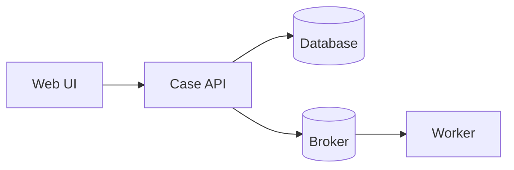
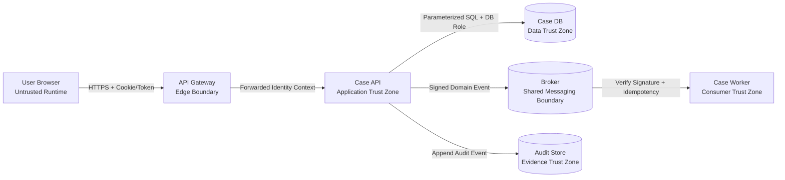
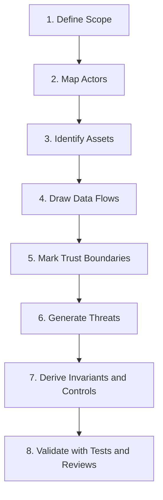
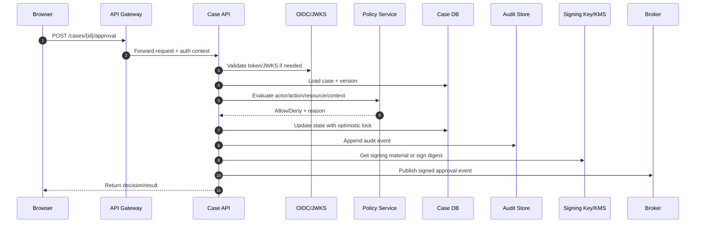
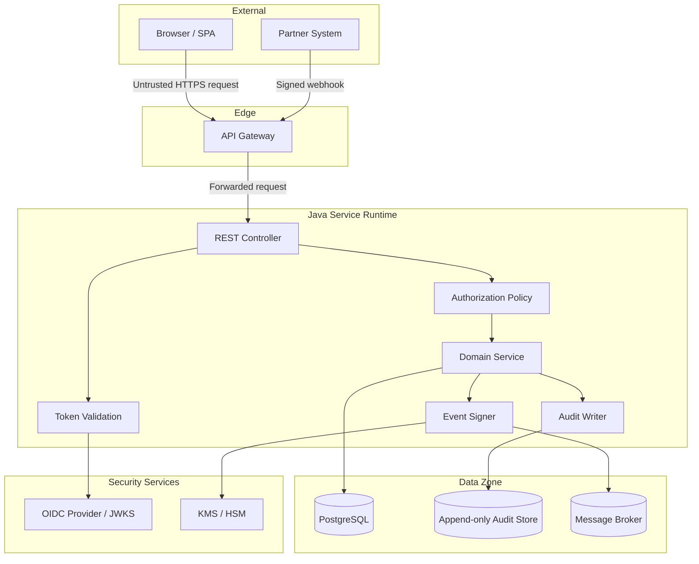

------
title: Learn Java Security, Cryptography and Integrity - Part 002
description: Threat, asset, actor, data flow, trust boundary, abuse case, and security invariant modeling for Java enterprise systems.
series: learn-java-security-cryptography-integrity
seriesTitle: Learn Java Security, Cryptography and Integrity
order: 2
partTitle: Threats, Assets, Trust Boundaries
tags:
  - java
  - security
  - threat-modeling
  - trust-boundary
  - secure-design
date: 2026-06-30
---

# Part 002 — Threats, Assets, Trust Boundaries

> Target part ini: Anda mampu membaca sistem Java sebagai sekumpulan asset, actor, data flow, trust boundary, dan abuse path. Output akhirnya bukan diagram cantik, tetapi daftar security invariant dan control yang bisa diimplementasikan.

Threat modeling sering gagal karena terlalu formal di awal. Engineer menggambar diagram, menempelkan label STRIDE, lalu berhenti. Hasilnya tidak mengubah desain, tidak menghasilkan test, dan tidak masuk ke backlog.

Kita akan memakai threat modeling secara praktis:

```text
system understanding -> asset discovery -> boundary discovery -> abuse path -> invariant -> control -> validation
```

OWASP Threat Modeling Cheat Sheet merangkum threat modeling dalam beberapa langkah utama: decomposition, threat identification/ranking, mitigations, dan review/validation. Dalam seri ini, setiap langkah harus menghasilkan artefak engineering yang actionable: policy code, test case, configuration, alert, audit field, atau deployment control.

Referensi:

- OWASP Threat Modeling Cheat Sheet: https://cheatsheetseries.owasp.org/cheatsheets/Threat_Modeling_Cheat_Sheet.html
- OWASP ASVS: https://owasp.org/www-project-application-security-verification-standard/
- OWASP Top 10: https://owasp.org/www-project-top-ten/
- NIST Cybersecurity Framework 2.0: https://www.nist.gov/cyberframework
- NIST SSDF SP 800-218: https://csrc.nist.gov/pubs/sp/800/218/final
- Java Security Overview: https://docs.oracle.com/en/java/javase/25/security/java-security-overview1.html

---

## 1. Threat Modeling: Definisi yang Berguna untuk Engineer

Threat modeling adalah proses menjawab:

1. **Apa yang sedang kita bangun?**
2. **Apa yang harus dilindungi?**
3. **Siapa atau apa yang bisa berinteraksi dengan sistem?**
4. **Di mana asumsi trust berubah?**
5. **Apa yang bisa salah?**
6. **Control apa yang mengurangi risk?**
7. **Bagaimana kita membuktikan control bekerja?**

Definisi yang terlalu akademis sering tidak membantu. Definisi praktis:

> **Threat modeling adalah desain review yang memaksa kita melihat sistem dari sudut pandang penyalahgunaan, bukan hanya happy path.**

Dalam Java enterprise, threat modeling harus menjangkau:

- HTTP API,
- background worker,
- scheduler,
- message consumer,
- database transaction,
- file/object storage,
- authentication provider,
- authorization policy,
- audit log,
- cryptographic keys,
- build pipeline,
- deployment runtime,
- admin/operator workflow,
- integration partner,
- third-party SaaS.

Jangan hanya threat-model controller. Banyak compromise terjadi di job, event consumer, import/export pipeline, migration script, atau admin endpoint.

---

## 2. Vocabulary Inti

### 2.1 Asset

Asset adalah sesuatu yang bernilai dan perlu dilindungi.

Asset bukan hanya data. Dalam sistem Java, asset bisa berupa:

| Asset Type | Contoh | Security Concern |
|---|---|---|
| Business data | case record, customer profile, payment instruction | confidentiality, integrity, privacy |
| Sensitive action | approve case, waive fee, reset password | authorization, non-repudiation, auditability |
| Identity data | user id, role, group, tenant, assurance level | impersonation, privilege escalation |
| Secret | API key, signing key, DB password, refresh token | leakage, misuse, rotation |
| Cryptographic key | DEK, KEK, private key, HMAC secret | key lifecycle, compromise response |
| Audit event | approval log, login event, policy decision | tampering, retention, evidentiary quality |
| Message/event | domain event, integration event, webhook | replay, forgery, ordering |
| Build artifact | JAR, container image, SBOM, provenance | supply-chain integrity |
| Runtime capability | network egress, file write, cloud IAM permission | lateral movement, blast radius |
| Availability | approval workflow, payment channel, regulatory portal | DoS, dependency failure |

A mature engineer tidak hanya bertanya “data apa yang rahasia?” tetapi juga “action apa yang irreversible?” dan “evidence apa yang harus dipercaya nanti?”

### 2.2 Actor

Actor adalah entitas yang dapat melakukan aksi atau memengaruhi sistem.

Actor bisa berupa:

- anonymous user,
- authenticated user,
- admin,
- support operator,
- auditor,
- service account,
- scheduled job,
- message broker,
- partner system,
- CI runner,
- developer,
- dependency maintainer,
- cloud provider identity,
- attacker controlling a legitimate account,
- attacker controlling network path,
- attacker controlling dependency artifact.

Perhatikan dua hal:

1. Actor tidak selalu manusia.
2. Actor tidak selalu malicious dari awal.

Banyak insiden terjadi dari legitimate actor dengan privilege terlalu luas, credential bocor, atau confused deputy.

### 2.3 Threat

Threat adalah skenario yang dapat merusak asset.

Contoh:

```text
A compromised support account exports all cases across tenants.
A partner replays yesterday's webhook to revert a case status.
A message consumer accepts unsigned events from a shared broker topic.
A developer accidentally commits signing key to repository.
A stale JWT remains valid after user deactivation.
A malicious file upload is served back with executable content type.
A build plugin injects code during compilation.
```

Threat yang baik memiliki struktur:

```text
Actor + capability + path + asset + impact
```

Contoh buruk:

```text
JWT attack.
```

Contoh lebih baik:

```text
An attacker with a stolen refresh token can obtain new access tokens after the user is disabled because refresh token revocation is not checked during rotation.
```

### 2.4 Vulnerability

Vulnerability adalah kelemahan yang membuat threat bisa terjadi.

Contoh vulnerability:

- object-level authorization tidak ada,
- token audience tidak divalidasi,
- `alg` header JWT dipercaya tanpa allowlist,
- custom `TrustManager` menerima semua certificate,
- file path dibangun dari input user tanpa canonical path check,
- message event tidak punya signature atau source authentication,
- audit event bisa diupdate,
- build pipeline mengambil dependency dari repository publik tanpa verification,
- secret disimpan di config file.

### 2.5 Control

Control adalah mekanisme yang menurunkan risk.

Control bisa bersifat:

| Control Type | Contoh |
|---|---|
| Preventive | authorization check, input validation, mTLS, policy-as-code |
| Detective | audit log, anomaly alert, SCA scanner, auth failure metric |
| Corrective | key rotation, token revocation, incident rollback |
| Compensating | manual approval, break-glass audit, temporary allowlist |
| Deterrent | legal notice, admin action recording, dual control |

Engineer sering terlalu fokus preventive control. Sistem enterprise juga perlu detective dan corrective control karena tidak semua hal dapat dicegah sempurna.

### 2.6 Trust Boundary

Trust boundary adalah titik di mana data, identity, privilege, or control berpindah dari satu trust assumption ke assumption lain.

Contoh:

- internet ke API gateway,
- API gateway ke Java service,
- Java service ke database,
- service A ke service B,
- application ke KMS,
- CI pipeline ke artifact repository,
- admin UI ke internal privileged API,
- message broker ke consumer,
- object storage ke download endpoint,
- partner webhook ke domain event handler.

Trust boundary bukan selalu network boundary. Boundary bisa terjadi dalam satu process:

- controller ke service,
- DTO ke domain command,
- principal claim ke authorization decision,
- serialized payload ke object graph,
- file bytes ke parsed document,
- string path ke filesystem object,
- unsigned event ke business fact.

---

## 3. Mengapa Trust Boundary Lebih Penting dari Component Diagram

Component diagram menunjukkan struktur. Trust boundary menunjukkan perubahan asumsi.

Diagram komponen tanpa boundary:



Diagram ini kurang berguna untuk security karena tidak menunjukkan mana yang trusted, mana yang hostile, dan mana yang privileged.

Versi lebih baik:



Sekarang kita bisa bertanya:

- Apakah gateway boleh dipercaya untuk identity?
- Apakah Java service memvalidasi ulang token atau hanya menerima header?
- Apakah DB role terlalu luas?
- Apakah broker topic shared dengan service lain?
- Apakah worker memverifikasi event source?
- Apakah audit store append-only?

---

## 4. Proses Threat Modeling yang Efektif

Gunakan proses 7 langkah.



Ya, diagram menunjukkan 8 node. Langkah ke-8 adalah feedback, bukan discovery. Dalam praktik, threat model tanpa validation adalah dugaan.

---

## 5. Step 1 — Define Scope

Scope menjawab: “apa yang sedang kita threat-model?”

Scope buruk:

```text
Threat model aplikasi case management.
```

Scope baik:

```text
Threat model untuk workflow approval high-risk regulatory case dari request API sampai audit event dan domain event dipublish.
```

Scope harus menyebut:

- use case,
- entry point,
- exit point,
- data store,
- external dependency,
- environment,
- out-of-scope eksplisit.

Contoh:

```md
## Scope

In scope:
- POST /cases/{id}/approval
- authentication context from OIDC provider
- object-level authorization
- case state transition REVIEWED -> APPROVED
- audit event append
- domain event publish to Kafka
- notification worker consuming approval event

Out of scope:
- user registration
- case creation
- payment integration
- document upload
```

Scope yang tajam mencegah threat modeling menjadi diskusi tanpa ujung.

---

## 6. Step 2 — Map Actors

Buat daftar actor dengan capability dan trust level.

| Actor | Trust Level | Capability | Concern |
|---|---|---|---|
| Anonymous internet user | Untrusted | call public endpoint | enumeration, injection, DoS |
| Authenticated reviewer | Partially trusted | approve assigned cases | over-approval, tenant escape |
| Case creator | Partially trusted | submit evidence | maker-checker bypass |
| Support operator | Privileged human | assist users, view limited data | privilege abuse, social engineering |
| Admin | Highly privileged | manage policy/config | toxic privilege, audit bypass |
| Case API service | Internal service | read/write cases | confused deputy |
| Notification worker | Internal service | consume events | forged/replayed events |
| OIDC provider | External trusted dependency | issue tokens | stale claims, outage |
| KMS | External trusted dependency | unwrap/generate keys | key availability, misuse |
| CI runner | Build-time actor | produce artifact | supply-chain compromise |

### 6.1 Actor State Matters

Actor yang sama bisa berada dalam state berbeda:

```text
user active
user suspended
user deleted
user with stale session
user with stolen token
user after MFA
user before MFA
user acting through delegation
user acting through support impersonation
```

Authorization yang matang tidak hanya melihat `role`, tetapi juga actor state.

Contoh:

```java
public record ActorContext(
        UserId userId,
        TenantId tenantId,
        Set<Role> roles,
        Set<Permission> permissions,
        AuthStrength authStrength,
        Instant authenticatedAt,
        boolean active,
        Optional<DelegationContext> delegation
) {}
```

Jangan jadikan actor sebagai `String username` jika domain Anda butuh security decision yang kaya.

---

## 7. Step 3 — Identify Assets

Asset discovery harus lebih detail daripada “database”.

Untuk workflow approval case:

| Asset | Why It Matters | Security Property |
|---|---|---|
| Case data | basis keputusan regulator | integrity, confidentiality |
| Approval action | mengubah status legal/operasional | authorization, non-repudiation-like evidence |
| Case state transition | menentukan workflow | integrity, consistency |
| Actor identity | dasar accountability | authenticity, freshness |
| Authorization policy | menentukan siapa boleh apa | integrity, change control |
| Audit event | bukti investigasi | tamper evidence, completeness |
| Domain event | memicu downstream action | authenticity, replay resistance |
| Signing/MAC key | melindungi event/request | confidentiality, access control, rotation |
| Notification content | bisa mengandung PII | confidentiality, minimization |
| Build artifact | menjalankan logic approval | provenance, integrity |

### 7.1 Asset Criticality

Gunakan skala sederhana:

| Level | Meaning | Example |
|---|---|---|
| Critical | compromise bisa menyebabkan legal/regulatory/financial damage besar | approval action, signing key, audit log |
| High | compromise berdampak serius tapi bisa dikompensasi | case evidence, export data |
| Medium | compromise terbatas | notification preference |
| Low | public/non-sensitive | static public content |

Asset criticality menentukan control. Tidak semua data butuh encryption field-level. Tetapi approval action mungkin butuh step-up auth dan four-eyes control.

---

## 8. Step 4 — Draw Data Flows

Data flow menjelaskan bagaimana data bergerak, berubah bentuk, dan menjadi fakta.

Contoh flow approval:



Untuk setiap arrow, tanya:

- Data apa yang lewat?
- Apakah data trusted?
- Apakah identity ikut terbawa?
- Apakah ada replay risk?
- Apakah ada tampering risk?
- Apakah ada ordering/freshness requirement?
- Apakah kegagalan dependency membuat sistem fail open?

### 8.1 Data Transformation Points

Security sering gagal di titik transformasi:

| From | To | Risk |
|---|---|---|
| HTTP string | UUID | IDOR jika dianggap authorized |
| JWT claim | principal | stale/forged/misvalidated claim |
| DTO | domain command | missing invariant |
| domain event | Kafka message | forged/replayed event |
| uploaded bytes | stored object | malware/content-type confusion |
| JSON/XML | object graph | parser abuse/deserialization risk |
| database row | audit evidence | tampering atau incomplete context |

---

## 9. Step 5 — Mark Trust Boundaries

Trust boundary harus eksplisit.

Contoh boundary list:

| Boundary ID | Boundary | Assumption Change | Required Control |
|---|---|---|---|
| TB-01 | Internet -> API Gateway | hostile network to controlled edge | TLS, rate limit, WAF where useful |
| TB-02 | Gateway -> Java API | forwarded identity becomes app context | token/header validation, trusted proxy config |
| TB-03 | Controller -> Domain Service | request DTO becomes command | validation, canonicalization, invariant check |
| TB-04 | Domain -> DB | proposed state becomes durable fact | transaction, optimistic lock, DB constraints |
| TB-05 | Domain -> Audit Store | event becomes evidence | append-only, hash chain/signing, retention |
| TB-06 | API -> Broker | local fact becomes distributed message | signing/MAC, schema, idempotency key |
| TB-07 | Broker -> Worker | external message becomes action trigger | signature verification, replay defense |
| TB-08 | CI -> Artifact Repo | build output becomes deployable artifact | signing, provenance, SBOM, access control |

### 9.1 Hidden Trust Boundaries in Java Code

Be careful with these hidden boundaries:

#### 9.1.1 `Principal` Boundary

```java
String tenantId = jwt.getClaim("tenant_id");
```

Questions:

- Is the token signature verified?
- Is issuer trusted?
- Is audience correct?
- Is token expired?
- Is tenant claim authoritative?
- Can tenant membership change before token expiry?

#### 9.1.2 Repository Boundary

```java
caseRepository.findById(caseId)
```

Question:

- Is object-level authorization enforced?

Prefer repository methods that make tenant boundary explicit when possible:

```java
caseRepository.findByIdAndTenantId(caseId, actor.tenantId())
```

But do not stop there. Tenant filter is not complete authorization; it is one boundary control.

#### 9.1.3 Event Consumer Boundary

```java
@KafkaListener(topics = "case-events")
public void consume(CaseApprovedEvent event) {
    notificationService.notify(event.caseId());
}
```

Questions:

- Who can publish to the topic?
- Is schema validated?
- Is event signed or authenticated?
- Is event idempotent?
- Can old event be replayed?
- Does consumer check event version/order?

#### 9.1.4 File Boundary

```java
Path target = uploadRoot.resolve(fileName);
```

Questions:

- Was `fileName` canonicalized?
- Can it escape directory?
- Is content type trusted from client?
- Is stored object executable or served inline?
- Is malware scanning asynchronous or blocking?

---

## 10. Step 6 — Generate Threats

Kita bisa memakai STRIDE sebagai prompt, bukan sebagai tujuan akhir.

| STRIDE | Pertanyaan | Java Enterprise Example |
|---|---|---|
| Spoofing | Bisa berpura-pura menjadi actor lain? | forged JWT, trusted header spoofing, stolen service token |
| Tampering | Bisa mengubah data/event/config/artifact? | unsigned Kafka event, mutable audit row, modified JAR |
| Repudiation | Bisa menyangkal aksi? | audit log incomplete, no actor/session/policy version |
| Information Disclosure | Bisa melihat data yang tidak boleh? | IDOR, verbose error, log leaking secret |
| Denial of Service | Bisa membuat sistem unavailable? | expensive parser input, auth service exhaustion |
| Elevation of Privilege | Bisa mendapat privilege lebih tinggi? | missing object authz, role confusion, CI token abuse |

### 10.1 Threat Template

Gunakan format ini:

```md
## Threat: <short title>

Actor:
Capability:
Asset:
Path:
Boundary:
Impact:
Existing Controls:
Missing Controls:
Proposed Invariant:
Validation:
Residual Risk:
```

Contoh:

```md
## Threat: Cross-Tenant Case Approval

Actor:
Authenticated reviewer from Tenant A.

Capability:
Can call approval endpoint with arbitrary case UUID.

Asset:
Case approval action and case state integrity for Tenant B.

Path:
POST /cases/{caseId}/approval -> load case by id -> approve.

Boundary:
External case id becomes internal case object.

Impact:
Unauthorized approval, regulatory breach, audit trust loss.

Existing Controls:
User is authenticated and has APPROVE_CASE role.

Missing Controls:
Object-level tenant authorization, maker-checker rule, state check.

Proposed Invariant:
A user can approve only a case in the same tenant, not created by the user,
with required permission for category and valid state REVIEWED.

Validation:
Integration test: Tenant A reviewer cannot approve Tenant B case even if UUID is known.

Residual Risk:
Compromised same-tenant reviewer account can still attempt malicious approval;
mitigated by maker-checker, step-up auth, audit, anomaly detection.
```

---

## 11. Step 7 — Derive Invariants and Controls

Threats harus berubah menjadi invariants.

Threat:

```text
Attacker replays old webhook and changes case status.
```

Invariant:

```text
No webhook event may change case state unless it has a valid signature,
fresh timestamp, unused nonce/event id, expected partner id, and monotonic case version.
```

Controls:

- HMAC or digital signature,
- canonical request format,
- timestamp freshness window,
- nonce/event id replay cache,
- partner-specific key,
- state/version check,
- idempotency handling,
- audit record for accept/reject,
- alert on repeated invalid signatures.

Validation:

- valid request accepted,
- stale timestamp rejected,
- reused nonce rejected,
- changed body rejected,
- wrong partner key rejected,
- lower case version rejected,
- duplicate event returns idempotent response.

### 11.1 Control Placement

Control harus ditempatkan pada boundary yang benar.

| Threat | Wrong Control Placement | Better Placement |
|---|---|---|
| Cross-tenant access | Hide button in UI | enforce in service/domain/repository query |
| Forged event | trust Kafka topic name | verify event signature/producer identity in consumer |
| Secret leakage | tell devs not to log | structured redaction + logging policy + scanner |
| Invalid state transition | frontend disables action | domain state machine + DB constraint/optimistic lock |
| JWT misuse | decode token manually in business code | centralized validated principal + explicit authz context |
| Upload malware | check filename extension | inspect content, store safely, scan, serve with safe headers |

Security control di UI bisa meningkatkan UX, tetapi bukan enforcement utama.

---

## 12. Data Flow Diagram untuk Java Service

Gunakan level yang cukup detail untuk melihat boundary.



Boundary questions:

1. Is Gateway allowed to inject identity headers?
2. Can clients bypass Gateway and hit Java service directly?
3. Does Controller trust request fields that should come from token?
4. Does Authz check object and tenant, or only role?
5. Can Domain update DB without audit write?
6. Is AuditStore append-only or merely another mutable table?
7. Does EventSigner sign canonical event or serialized incidental JSON?
8. Can Broker accept messages from untrusted producer?
9. What happens if KMS is down?

---

## 13. Java-Oriented Threat Catalog

Berikut katalog awal yang akan sering muncul di seri ini.

### 13.1 Identity and Token Threats

| Threat | Symptom | Control |
|---|---|---|
| Token audience ignored | token for service A accepted by service B | validate `aud` |
| Issuer confusion | token from dev/rogue issuer accepted | strict issuer allowlist |
| Algorithm confusion | weak/unexpected JWT alg accepted | algorithm allowlist, library config |
| Stale authorization | role changed but token still valid | short TTL, introspection, policy check |
| Session fixation | attacker sets session id before login | rotate session after auth |
| Weak account recovery | attacker resets account | recovery risk model, step-up verification |

### 13.2 Authorization Threats

| Threat | Symptom | Control |
|---|---|---|
| IDOR | user accesses object by guessed ID | object-level authz |
| Tenant escape | global query by id | tenant-scoped query + authz |
| Confused deputy | service uses own privilege for user action | propagate actor intent, policy evaluation |
| Role explosion | roles become unreviewable | permission model + policy ownership |
| Missing state authz | action allowed in invalid workflow state | domain invariant/state machine |
| Admin overreach | admin can bypass all control silently | dual control, break-glass audit |

### 13.3 Crypto and Integrity Threats

| Threat | Symptom | Control |
|---|---|---|
| Random token predictable | uses `Random` | `SecureRandom` |
| Encryption without auth | ciphertext tampering possible | AEAD such as AES-GCM where appropriate |
| Key hardcoded | secret in repository/config | KMS/Vault, secret scanning |
| Nonce reuse | repeated AES-GCM IV under same key | nonce generation discipline |
| Hash mistaken for proof | attacker recalculates hash | MAC/signature |
| Unsigned event | consumer trusts event blindly | signature/MAC + replay defense |

### 13.4 Java Runtime and Supply Chain Threats

| Threat | Symptom | Control |
|---|---|---|
| Dependency confusion | internal artifact name pulled from public repo | repository policy, verification |
| Malicious build plugin | plugin executes during build | plugin pinning, provenance, isolated CI |
| Overprivileged container | app runs root with broad FS/network | non-root, read-only FS, egress control |
| Secret in heap dump | production dump contains credentials | dump policy, redaction, secret handling |
| Trust-all TLS | custom TrustManager disables validation | standard JSSE validation, tests |
| Log injection | attacker controls log lines | structured logging, encoding |

---

## 14. Risk Ranking without Theater

Risk ranking sering menjadi permainan angka. Kita butuh cukup struktur untuk prioritas, bukan kepalsuan presisi.

Gunakan faktor:

| Factor | Question |
|---|---|
| Impact | Jika terjadi, apa kerusakannya? |
| Likelihood | Seberapa realistis path-nya? |
| Exposure | Apakah reachable dari internet, internal, atau privileged-only? |
| Exploitability | Butuh skill/credential/position apa? |
| Blast Radius | Satu user, satu tenant, semua tenant, semua system? |
| Detectability | Apakah kita akan tahu? |
| Reversibility | Apakah efeknya bisa dibatalkan? |
| Regulatory Weight | Apakah berdampak legal/compliance? |

Contoh scoring ringan:

```text
Risk = Impact(1-5) × Exposure(1-5) × Exploitability(1-5) × BlastRadius(1-5)
```

Namun skor tidak boleh menggantikan reasoning. Dua risk dengan skor sama bisa punya prioritas berbeda karena satu risk irreversible atau punya konsekuensi regulator.

### 14.1 Example Ranking

| Threat | Impact | Exposure | Exploitability | Blast Radius | Notes |
|---|---:|---:|---:|---:|---|
| Cross-tenant case approval | 5 | 4 | 3 | 5 | critical, regulatory impact |
| Verbose validation error | 2 | 4 | 5 | 2 | fix but lower priority |
| Unsigned approval event | 5 | 2 | 3 | 4 | internal boundary but high integrity risk |
| Secret in debug log | 5 | 3 | 2 | 4 | depends log access and retention |
| Dependency with unreachable CVE | 2 | 1 | 1 | 1 | triage, not emergency |

---

## 15. Threat Model to Backlog

Threat model harus menghasilkan backlog yang bisa dieksekusi.

Bad backlog:

```text
Improve security.
```

Good backlog:

```md
## Story: Enforce tenant-scoped case approval

As a case approval service,
I must deny approval if actor tenant differs from case tenant,
so that cross-tenant approval is impossible even when case UUID is known.

Acceptance Criteria:
- approval policy checks actor tenant against case tenant
- repository query is tenant-scoped where possible
- denial reason CROSS_TENANT is audited
- integration test proves Tenant A reviewer cannot approve Tenant B case
- metric security.authorization.denied increments with reason=CROSS_TENANT
```

Security backlog yang baik menyebut:

- invariant,
- control,
- test,
- audit/observability,
- rollout consideration.

---

## 16. Example: End-to-End Threat Model Slice

### 16.1 Scope

High-risk case approval API.

### 16.2 Assets

- case state,
- approval decision,
- actor identity,
- authorization policy,
- audit event,
- approval domain event.

### 16.3 Actors

- reviewer,
- case creator,
- admin,
- compromised account,
- internal service,
- message consumer.

### 16.4 Trust Boundaries

- browser to gateway,
- gateway to Java service,
- controller to domain,
- service to database,
- service to audit store,
- service to broker,
- broker to worker.

### 16.5 Threats and Controls

| Threat | Invariant | Control | Validation |
|---|---|---|---|
| Creator approves own case | maker cannot be checker | domain policy | unit + integration test |
| Tenant A approves Tenant B case | actor tenant must equal case tenant | tenant-scoped load + authz | integration test |
| Approval event forged | only signed event accepted | event signature/MAC | consumer negative test |
| Approval replayed | event id/version must be fresh | idempotency/replay store | replay test |
| Audit missing | approval cannot commit without audit | transactional outbox/audit policy | failure injection test |
| Stale token used after disable | inactive user cannot approve | active status/policy check | test disabled user |

### 16.6 Derived Java Policy

```java
public final class HighRiskCaseApprovalPolicy {

    public ApprovalDecision evaluate(ActorContext actor, RegulatoryCase caze, Instant now) {
        if (!actor.active()) {
            return ApprovalDecision.deny("ACTOR_INACTIVE");
        }
        if (!actor.tenantId().equals(caze.tenantId())) {
            return ApprovalDecision.deny("CROSS_TENANT");
        }
        if (actor.userId().equals(caze.createdBy())) {
            return ApprovalDecision.deny("MAKER_CHECKER_VIOLATION");
        }
        if (!caze.status().equals(CaseStatus.REVIEWED)) {
            return ApprovalDecision.deny("INVALID_STATE");
        }
        if (!actor.permissions().contains(Permission.APPROVE_HIGH_RISK_CASE)) {
            return ApprovalDecision.deny("MISSING_PERMISSION");
        }
        if (!actor.authStrength().isStrongWithin(now, Duration.ofMinutes(10))) {
            return ApprovalDecision.deny("STEP_UP_AUTH_REQUIRED");
        }
        return ApprovalDecision.allow("HIGH_RISK_APPROVAL_POLICY_V1");
    }
}
```

### 16.7 Derived Tests

```java
class HighRiskCaseApprovalPolicyTest {

    private final HighRiskCaseApprovalPolicy policy = new HighRiskCaseApprovalPolicy();
    private final Instant now = Instant.parse("2026-06-30T00:00:00Z");

    @Test
    void deniesCrossTenantApproval() {
        ActorContext actor = Fixtures.reviewer()
                .tenant("tenant-a")
                .permission(Permission.APPROVE_HIGH_RISK_CASE)
                .strongAuthAt(now.minusSeconds(60))
                .build();

        RegulatoryCase caze = Fixtures.highRiskCase()
                .tenant("tenant-b")
                .status(CaseStatus.REVIEWED)
                .createdBy("someone-else")
                .build();

        ApprovalDecision decision = policy.evaluate(actor, caze, now);

        assertThat(decision.allowed()).isFalse();
        assertThat(decision.reasonCode()).isEqualTo("CROSS_TENANT");
    }

    @Test
    void deniesMakerCheckerViolation() {
        ActorContext actor = Fixtures.reviewer()
                .user("user-1")
                .tenant("tenant-a")
                .permission(Permission.APPROVE_HIGH_RISK_CASE)
                .strongAuthAt(now.minusSeconds(60))
                .build();

        RegulatoryCase caze = Fixtures.highRiskCase()
                .tenant("tenant-a")
                .status(CaseStatus.REVIEWED)
                .createdBy("user-1")
                .build();

        ApprovalDecision decision = policy.evaluate(actor, caze, now);

        assertThat(decision.allowed()).isFalse();
        assertThat(decision.reasonCode()).isEqualTo("MAKER_CHECKER_VIOLATION");
    }
}
```

Tests seperti ini mengubah security dari dokumen menjadi executable invariant.

---

## 17. Common Mistakes dalam Threat Modeling

### 17.1 Mulai dari Technology, Bukan Asset

Salah:

```text
Kita pakai JWT, AES, dan TLS. Jadi threat model-nya apa?
```

Benar:

```text
Asset apa yang harus dilindungi? Dari actor mana? Pada boundary mana? Dengan invariant apa?
```

Technology adalah jawaban setelah pertanyaan jelas.

### 17.2 Menganggap Internal Network Trusted

Internal tidak otomatis trusted. Dalam architecture modern:

- service account bisa compromised,
- broker bisa shared,
- CI runner bisa disalahgunakan,
- developer laptop bisa bocor,
- internal admin endpoint bisa diakses melalui SSRF,
- log system bisa mengekspos secret.

Gunakan prinsip “trusted enough for purpose”, bukan “internal berarti aman”.

### 17.3 Mengabaikan Background Jobs

Scheduler dan worker sering punya privilege besar dan validasi kecil.

Checklist:

- Apakah job hanya mengambil data yang boleh diproses?
- Apakah input job bisa dipengaruhi user?
- Apakah job idempotent?
- Apakah job menulis audit?
- Apakah job memakai service account terlalu luas?
- Apakah retry bisa menggandakan efek?

### 17.4 Menganggap Audit Log sebagai Afterthought

Audit harus didesain bersama workflow. Jika audit ditambahkan di akhir, biasanya ia tidak punya context cukup.

Audit event untuk decision harus merekam:

- actor,
- resource,
- action,
- decision,
- reason,
- policy version,
- state/version,
- timestamp,
- correlation id,
- authentication context,
- source address/device jika relevan,
- integrity metadata jika perlu.

### 17.5 Tidak Menghubungkan Threat ke Test

Threat yang tidak punya validation plan akan terlupakan.

Rule sederhana:

> Setiap high-risk threat harus menghasilkan minimal satu negative test, satu review checklist item, atau satu runtime detection.

---

## 18. Threat Modeling Checklist untuk Java Review

Gunakan checklist ini saat review desain PR besar.

### 18.1 Scope

- [ ] Use case sensitif terdefinisi jelas.
- [ ] Entry point dan exit point jelas.
- [ ] External dependency disebut.
- [ ] Out-of-scope ditulis eksplisit.

### 18.2 Actors

- [ ] Anonymous, authenticated, admin, service account dipisahkan.
- [ ] Compromised legitimate account dipertimbangkan.
- [ ] Partner/external service dipertimbangkan.
- [ ] CI/build actor dipertimbangkan jika terkait release.

### 18.3 Assets

- [ ] Data asset terdaftar.
- [ ] Action asset terdaftar.
- [ ] Key/secret asset terdaftar.
- [ ] Audit/evidence asset terdaftar.
- [ ] Event/artifact asset terdaftar.

### 18.4 Boundaries

- [ ] Network boundary ditandai.
- [ ] Identity boundary ditandai.
- [ ] Authorization boundary ditandai.
- [ ] Parser/serialization boundary ditandai.
- [ ] DB transaction boundary ditandai.
- [ ] Message/event boundary ditandai.
- [ ] Build/runtime boundary ditandai bila relevan.

### 18.5 Threats

- [ ] Spoofing scenario ada.
- [ ] Tampering scenario ada.
- [ ] Repudiation scenario ada.
- [ ] Information disclosure scenario ada.
- [ ] DoS scenario ada.
- [ ] Elevation of privilege scenario ada.
- [ ] Business abuse case ada.

### 18.6 Controls

- [ ] Control ditempatkan di boundary yang benar.
- [ ] Control punya owner.
- [ ] Control punya test/review/detection.
- [ ] Failure mode control ditentukan.
- [ ] Residual risk dicatat.

---

## 19. Practice Drill Part 002

Pilih satu workflow Java yang Anda pahami. Buat threat model slice maksimal 2 halaman.

Template:

```md
# Threat Model Slice: <Workflow>

## Scope
In scope:
Out of scope:

## Actors
| Actor | Capability | Trust Level | Concern |

## Assets
| Asset | Criticality | Security Property |

## Data Flow
<Mermaid sequence or flowchart>

## Trust Boundaries
| ID | Boundary | Assumption Change | Control |

## Threats
| Threat | Actor | Asset | Boundary | Impact | Proposed Invariant |

## Validation
| Invariant | Test/Review/Detection |

## Residual Risk
What remains after controls?
```

Minimal hasil yang baik:

- 5 actor,
- 5 asset,
- 5 trust boundary,
- 6 threat,
- 6 invariant,
- 6 validation item.

---

## 20. Summary

Yang harus dibawa dari Part 002:

1. Threat modeling adalah alat desain, bukan dokumen formalitas.
2. Asset mencakup data, action, key, audit, event, artifact, dan runtime capability.
3. Actor mencakup manusia, service, job, CI runner, dependency, dan compromised legitimate actor.
4. Trust boundary adalah titik perubahan asumsi, bukan hanya network line.
5. Threat yang baik memiliki actor, capability, path, asset, dan impact.
6. Threat harus berubah menjadi invariant, control, dan validation.
7. Dalam Java enterprise, hidden boundary sering muncul pada token claim, repository query, event consumer, file parser, dan DTO-to-domain conversion.
8. High-risk threat tanpa test atau detection adalah risk yang belum benar-benar dikelola.

Part berikutnya akan masuk ke **Java Security Architecture in Modern JDK**: package, provider model, JCA/JCE/JSSE, keystore/truststore, dan konsekuensi desain setelah Security Manager tidak lagi menjadi boundary security modern.
