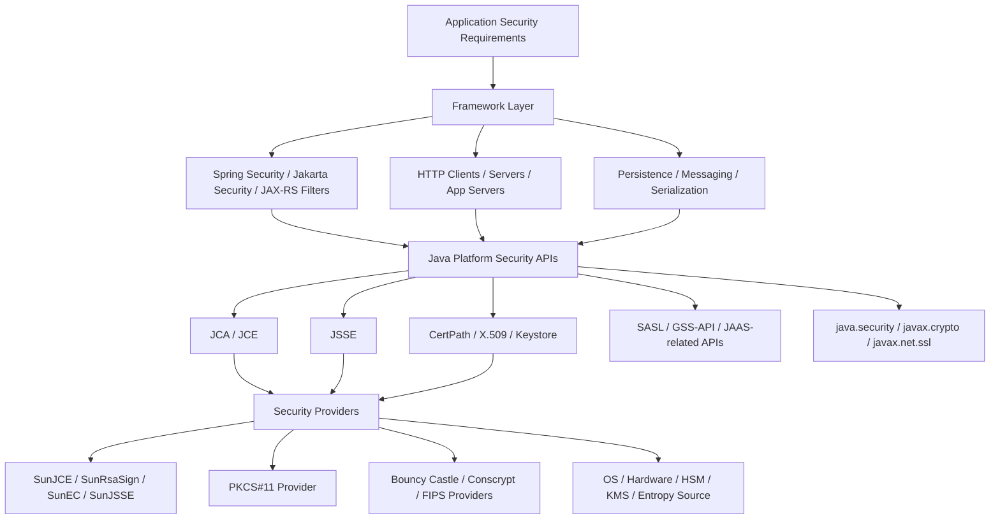
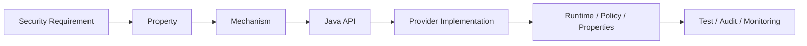
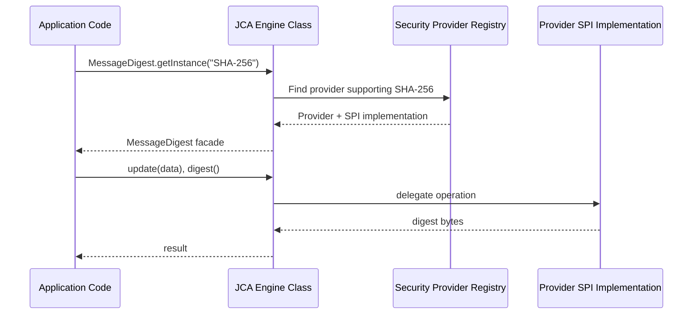
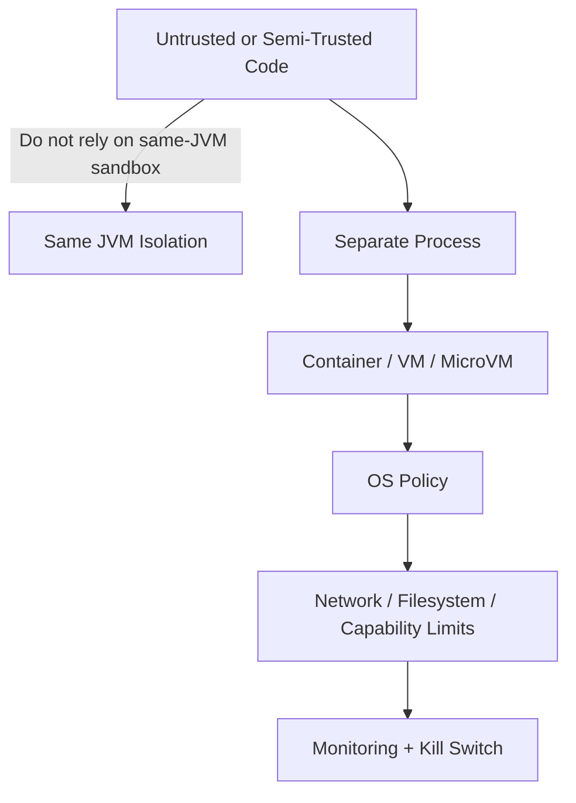
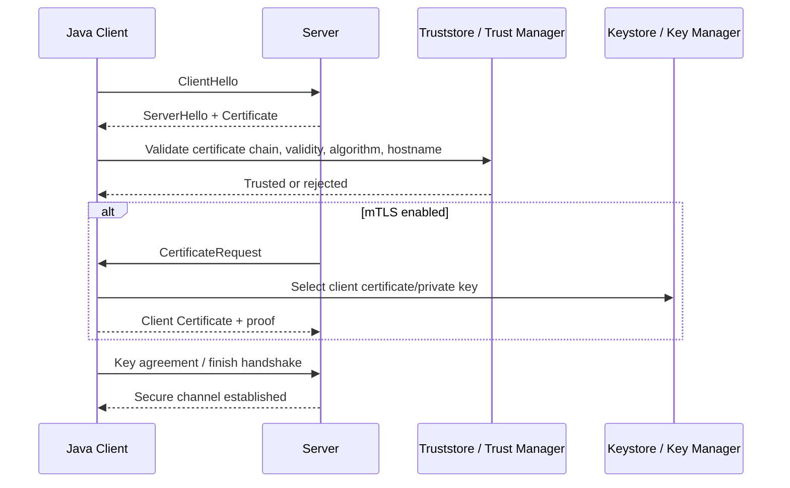
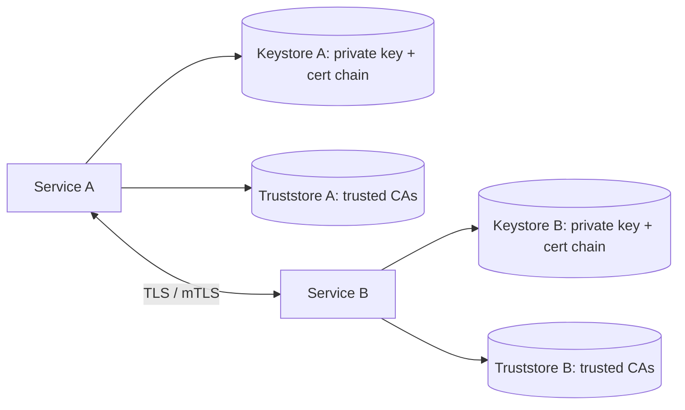
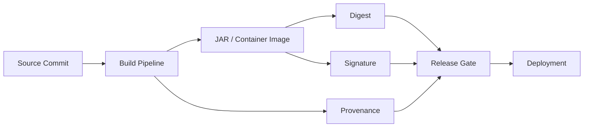

------
title: Learn Java Security, Cryptography and Integrity - Part 003
description: Java security architecture in the modern JDK: JCA, JCE, JSSE, providers, keys, keystores, certificates, signed artifacts, legacy Security Manager context, and practical design rules for production Java systems.
series: learn-java-security-cryptography-integrity
seriesTitle: Learn Java Security, Cryptography and Integrity
order: 3
partTitle: Java Security Architecture in Modern JDK
tags:
  - java
  - security
  - cryptography
  - integrity
  - jca
  - jce
  - jsse
  - jdk
  - secure-engineering
date: 2026-06-30
---

# Part 003 — Java Security Architecture in Modern JDK

> Target bagian ini: memahami **peta arsitektur Java security modern** secara cukup presisi sehingga kamu tahu API mana yang harus dipakai, API mana yang legacy, di mana trust decision terjadi, dan failure mode apa yang biasanya membuat aplikasi Java enterprise terlihat "menggunakan security" tetapi sebenarnya tidak aman.

Bagian ini bukan tutorial crypto detail. Crypto primitive akan dibahas lebih dalam di Part 007 sampai Part 015. Di sini kita membangun **mental model platform**: Java menyediakan security framework yang luas, tetapi framework itu tidak otomatis membuat sistem aman. Engineer tetap harus menentukan threat model, trust boundary, data sensitivity, key lifecycle, identity semantics, dan verification strategy.

---

## 1. Kaufman Framing: Apa Skill yang Sedang Kita Akuisisi?

Dalam kerangka Josh Kaufman, skill yang harus didekonstruksi bukan "hafal API security Java", melainkan:

> **Mampu memilih, mengonfigurasi, membatasi, dan memverifikasi mekanisme keamanan Java secara benar dalam sistem nyata.**

Skill ini punya beberapa sub-skill:

| Sub-skill | Pertanyaan yang harus bisa dijawab |
|---|---|
| Platform map | Komponen security apa saja yang disediakan JDK? |
| Trust decision | Di titik mana sistem memutuskan "percaya" atau "tidak percaya"? |
| Provider literacy | Implementasi algorithm berasal dari provider mana? Apa konsekuensinya? |
| Key/cert literacy | Kunci, certificate, keystore, truststore, dan certificate chain dipakai untuk apa? |
| Secure communication | Bagaimana TLS/JSSE berinteraksi dengan HTTP client/server/framework? |
| Legacy avoidance | API/konsep lama apa yang tidak boleh dijadikan fondasi desain baru? |
| Verification | Bagaimana membuktikan konfigurasi benar, bukan sekadar compile? |

Deliberate practice di bagian ini: setiap kali melihat kode Java security, biasakan bertanya:

1. **Apa security property yang ingin dicapai?** Confidentiality? Integrity? Authenticity? Freshness? Non-replay? Non-repudiation? Authorization?
2. **Siapa yang dipercaya?** OS? JDK? provider? CA? keystore? identity provider? build pipeline? network peer?
3. **Di mana failure-nya terlihat?** Exception? handshake failure? invalid token? rejected signature? silent fallback?
4. **Apa yang terjadi kalau konfigurasi salah?** Fail closed, fail open, atau degrade diam-diam?

---

## 2. Peta Besar Java Security

Java security modern dapat dilihat sebagai beberapa lapisan:



Cara membacanya:

- **Application layer** menentukan apa yang perlu dilindungi.
- **Framework layer** sering menjadi tempat developer melakukan authentication, authorization, CSRF, CORS, session, dan token validation.
- **Java platform security APIs** menyediakan building block standar.
- **Provider layer** menyediakan implementasi algorithm aktual.
- **OS/hardware/cloud layer** menyediakan entropy, file protection, secret storage, network isolation, hardware-backed key protection, atau HSM/KMS.

Kesalahan umum: engineer langsung memilih primitive, misalnya `AES` atau `SHA-256`, tanpa mendefinisikan property yang dibutuhkan. Akibatnya solusi sering salah level: memakai hash untuk password, encryption tanpa authentication, signature tanpa canonicalization, atau TLS tanpa hostname verification.

---

## 3. Java Security Bukan Satu Fitur, Melainkan Ekosistem API

JDK menyediakan beberapa area security besar:

| Area | API / package dominan | Untuk apa |
|---|---|---|
| Cryptography architecture | `java.security`, `javax.crypto` | Digest, MAC, encryption, signature, key generation, key agreement, KDF/KEM support, secure random |
| Provider model | `java.security.Provider`, `Security` | Memilih implementasi algorithm |
| Certificates & PKI | `java.security.cert`, `javax.security.auth.x500` | X.509 certificate, chain validation, trust anchor, revocation model |
| Keystore | `java.security.KeyStore` | Repository key, secret, private key, certificate |
| Secure communication | `javax.net.ssl`, JSSE | TLS, server/client authentication, mTLS |
| Authentication integration | JAAS-related APIs, SASL, GSS-API | Login module, subject, Kerberos/SPNEGO, enterprise auth integrations |
| Signed code/artifacts | `jarsigner`, `JarSigner`, JAR manifest/signature | Integrity and origin checks for JAR artifacts |
| Security properties | `java.security` config file, disabled algorithms | Global crypto/security configuration |

Mental model yang tepat:



Contoh:

| Requirement | Property | Mechanism | Java API | Verification |
|---|---|---|---|---|
| Token tidak bisa dipalsukan | Integrity + authenticity | HMAC | `Mac` | Tampered token rejected |
| Payload rahasia dan tidak bisa dimodifikasi | Confidentiality + integrity | AEAD | `Cipher` with AES-GCM | Wrong tag fails |
| Client yakin bicara dengan server benar | Peer authentication | TLS certificate validation | JSSE | Hostname mismatch fails |
| Audit event tidak bisa diubah diam-diam | Tamper evidence | Hash chain + signing | `MessageDigest`, `Signature` | Chain verification fails after mutation |
| Build artifact berasal dari pipeline resmi | Origin + integrity | Artifact signing + provenance | `jarsigner`/external signing | Signature/provenance verification |

---

## 4. JCA: Java Cryptography Architecture

JCA adalah fondasi desain crypto di Java. Ia menyediakan:

1. **API abstrak** untuk operasi security.
2. **Provider architecture** untuk implementasi algorithm.
3. **Algorithm naming** dan lookup mechanism.
4. **Key, certificate, secure random, signature, digest, cipher, MAC, KEM, dan utility classes.**

JCA membuat aplikasi memanggil API seperti:

```java
MessageDigest digest = MessageDigest.getInstance("SHA-256");
Signature signature = Signature.getInstance("SHA256withRSA");
SecureRandom random = SecureRandom.getInstanceStrong();
```

Tetapi implementasi konkretnya diambil dari provider yang tersedia di runtime.



### 4.1 Engine Class vs SPI

JCA memakai pola **engine class** dan **Service Provider Interface**.

| Konsep | Contoh | Peran |
|---|---|---|
| Engine class | `MessageDigest`, `Signature`, `Cipher`, `Mac` | API yang dipakai aplikasi |
| SPI class | `MessageDigestSpi`, `SignatureSpi`, `CipherSpi` | Interface implementasi provider |
| Provider | `SunJCE`, `SunRsaSign`, `SunEC`, Bouncy Castle, PKCS#11 provider | Paket implementasi algorithm |
| Transformation | `AES/GCM/NoPadding` | Nama algorithm/mode/padding untuk `Cipher` |

Konsekuensi desain:

- Code dapat portable antar provider, tetapi detail support algorithm bisa berbeda.
- Algorithm string adalah bagian dari contract; salah memilih string bisa menjadi vulnerability.
- Provider order dapat memengaruhi implementasi yang dipilih.
- Untuk sistem regulated/FIPS, provider choice bukan detail teknis kecil; itu bagian dari compliance dan threat model.

### 4.2 Jangan Anggap Algorithm Name Cukup

Kode seperti ini terlihat eksplisit tetapi belum cukup:

```java
Cipher cipher = Cipher.getInstance("AES");
```

Masalahnya: `"AES"` tidak menyatakan mode dan padding secara eksplisit. Provider bisa memilih default yang tidak sesuai untuk data protection modern. Biasakan menulis transformation penuh, misalnya:

```java
Cipher cipher = Cipher.getInstance("AES/GCM/NoPadding");
```

Tetapi bahkan itu belum cukup. Kamu masih perlu:

- IV/nonce unik untuk setiap encryption dengan key yang sama.
- Authentication tag diverifikasi.
- Associated data bila ada metadata yang harus ikut dilindungi.
- Key lifecycle jelas.
- Error handling yang tidak membocorkan informasi berlebihan.
- Test yang membuktikan tampering gagal.

### 4.3 Provider Discovery Harus Dipahami, Bukan Ditebak

Untuk troubleshooting, kamu perlu bisa melihat provider di runtime:

```java
import java.security.Provider;
import java.security.Security;

public class ProvidersDemo {
    public static void main(String[] args) {
        for (Provider provider : Security.getProviders()) {
            System.out.println(provider.getName() + " " + provider.getVersionStr());
        }
    }
}
```

Untuk audit algorithm support:

```java
import java.security.Provider;
import java.security.Security;
import java.util.Comparator;

public class ServicesDemo {
    public static void main(String[] args) {
        Security.getProviders()[0].getServices().stream()
            .sorted(Comparator.comparing(Provider.Service::getType)
                .thenComparing(Provider.Service::getAlgorithm))
            .limit(50)
            .forEach(s -> System.out.printf("%s / %s / %s%n",
                s.getProvider().getName(), s.getType(), s.getAlgorithm()));
    }
}
```

Production lesson: security behavior bisa berubah ketika JDK berubah, provider berubah, container image berubah, FIPS mode berubah, atau security properties berubah. Jadi konfigurasi security tidak boleh dianggap pure application code saja.

---

## 5. JCE: Cryptographic Operations untuk Confidentiality dan Integrity

JCE historically adalah bagian cryptography extension, tetapi dalam praktik modern ia adalah bagian standar dari platform Java. Area yang paling sering dipakai:

| Class | Property utama | Contoh penggunaan |
|---|---|---|
| `Cipher` | Confidentiality, kadang integrity bila AEAD | AES-GCM, RSA-OAEP |
| `Mac` | Integrity + authenticity dengan shared secret | HMAC webhook, request signing |
| `SecretKey` | Symmetric key | AES/HMAC key |
| `SecretKeyFactory` | Derive/generate secret from spec | PBKDF2 password-based derivation |
| `KeyGenerator` | Generate symmetric keys | AES keys |
| `KeyAgreement` | Shared secret establishment | ECDH |
| `KEM` | Key encapsulation mechanism | Modern/hybrid key establishment when supported |

Kesalahan arsitektural yang sering terjadi:

| Anti-pattern | Mengapa berbahaya | Prinsip koreksi |
|---|---|---|
| Encrypt tanpa authenticate | Attacker bisa memodifikasi ciphertext dalam beberapa mode | Gunakan AEAD seperti AES-GCM/ChaCha20-Poly1305 bila tersedia dan sesuai |
| Pakai `MessageDigest` untuk password | Hash cepat mudah di-bruteforce | Gunakan password hashing/KDF yang memang dirancang untuk password |
| Pakai `Random` untuk token | Bukan CSPRNG | Gunakan `SecureRandom` |
| Hard-code key di source | Key ikut bocor melalui repo/build artifact | Gunakan KMS/vault/secrets manager dengan lifecycle |
| Reuse IV/nonce GCM | Bisa menghancurkan confidentiality dan integrity | Enforce unique nonce per key |
| Catch semua exception lalu lanjut | Security failure jadi silent bypass | Fail closed dan observability aman |

---

## 6. `java.security`: Fondasi Public-Key, Digest, Signature, Cert, Random

Package `java.security` adalah salah satu pusat security framework Java. Di dalamnya ada konsep:

| Konsep | Class / interface | Catatan desain |
|---|---|---|
| Digest | `MessageDigest` | Integrity checksum cryptographic, bukan authenticity |
| Signature | `Signature` | Integrity + origin authentication dengan private/public key |
| Randomness | `SecureRandom` | Token, nonce, key material; jangan diganti `Random` |
| Key pair | `KeyPair`, `KeyPairGenerator` | RSA/EC/EdDSA/dll tergantung provider |
| Key conversion | `KeyFactory`, specs | Convert encoded key material ke object key |
| Provider | `Provider`, `Security` | Provider registry and algorithm discovery |
| Key storage | `KeyStore` | Key/cert repository, bukan magic vault universal |
| Permission APIs | `Permission`, `Policy`, `AccessController` | Banyak terkait Security Manager legacy |

Security engineer Java harus memisahkan dua hal:

1. **API crypto/security yang tetap relevan** seperti digest, signature, key, provider, keystore.
2. **API access-control JVM legacy** yang dulu terhubung ke Security Manager dan tidak lagi menjadi strategi sandbox modern.

---

## 7. Security Manager: Konteks Legacy yang Harus Diketahui

Security Manager dulu dipakai untuk membatasi apa yang boleh dilakukan code di dalam JVM: file access, network access, reflection, classloader, system properties, dan sejenisnya. Dalam aplikasi modern, model ini terbukti sulit dipakai dengan benar, banyak library tidak kompatibel, dan tidak lagi cocok sebagai fondasi isolasi utama.

Sejak JDK 24, Security Manager sudah **permanently disabled**. Artinya:

- Jangan mendesain sistem baru dengan asumsi Security Manager akan menahan library/plugin tidak dipercaya.
- Jangan mengandalkan `doPrivileged`, `Policy`, atau permission checks sebagai boundary runtime utama.
- Jangan menganggap satu JVM adalah sandbox aman untuk menjalankan arbitrary untrusted code.
- Gunakan isolasi proses/container/VM, OS sandbox, seccomp/AppArmor, network policy, resource limit, dan boundary service untuk untrusted execution.

Mental model modern:



Prinsip praktis:

> **JVM class boundary bukan security boundary yang cukup untuk adversarial code.**

Contoh keputusan desain:

| Use case | Jangan | Lebih aman |
|---|---|---|
| Menjalankan user-submitted script | Load class/plugin dalam JVM utama | Isolated worker process/container dengan resource/network/file limits |
| Tenant-specific plugin | Classloader + Security Manager | Remote plugin service dengan contract sempit |
| Rule execution regulatory system | Dynamic Java code in-process | Declarative rule DSL, sandboxed interpreter, atau external isolated rule runner |
| Report template execution | Runtime expression unrestricted | Allowlisted template engine + no arbitrary code execution |

---

## 8. JSSE: TLS sebagai Security Boundary Transport

JSSE menyediakan framework dan implementation untuk komunikasi aman berbasis TLS. Dalam sistem Java enterprise, JSSE sering dipakai secara tidak langsung oleh:

- `java.net.http.HttpClient`
- servlet container
- application server
- JDBC driver
- Kafka/RabbitMQ client
- gRPC/Netty stack
- LDAP client
- custom TCP client/server

JSSE memberi property:

| Property | Makna |
|---|---|
| Confidentiality | Pihak lain di jaringan tidak bisa membaca plaintext |
| Integrity | Modifikasi traffic terdeteksi |
| Server authentication | Client memverifikasi identitas server lewat certificate chain + hostname |
| Optional client authentication | Server memverifikasi certificate client untuk mTLS |

TLS handshake sederhana:



Kesalahan JSSE yang fatal:

| Anti-pattern | Dampak |
|---|---|
| Trust-all `X509TrustManager` | TLS tidak lagi authenticate peer; MITM mudah |
| Disable hostname verification | Certificate valid untuk host lain bisa diterima |
| Pinning tanpa rotation plan | Outage saat certificate/key rotation |
| Custom truststore lupa CA internal | Production outage atau bypass sementara yang menjadi permanen |
| Log full TLS material/secrets | Confidentiality runtuh |
| Terlalu longgar protocol/cipher | Downgrade/legacy risk |

Rule:

> Custom TLS code harus dianggap security-sensitive code. Default platform/framework biasanya lebih aman daripada trust manager buatan sendiri yang tidak lengkap.

---

## 9. Keystore vs Truststore: Jangan Dicampur Secara Mental

Di Java, `KeyStore` adalah API umum untuk menyimpan key/certificate entries. Tetapi secara operasional, engineer sering membedakan:

| Istilah operasional | Isi | Dipakai untuk |
|---|---|---|
| Keystore | Private key + certificate chain milik service | Membuktikan identitas diri, misalnya server TLS atau mTLS client |
| Truststore | CA certificate / trust anchor yang dipercaya | Memverifikasi identitas pihak lain |

Diagram:



Mental model:

- **Keystore menjawab:** “Siapa saya dan private key apa yang saya miliki?”
- **Truststore menjawab:** “Siapa yang saya percayai untuk menyatakan identitas orang lain?”

Kesalahan umum:

| Kesalahan | Dampak |
|---|---|
| Menaruh private key pihak lain di truststore | Confusion dan potensi leakage |
| Menganggap truststore adalah authorization list | CA trust bukan business authorization |
| Memakai satu truststore global untuk semua outbound call | Blast radius tinggi jika CA internal salah |
| Certificate rotation manual tanpa overlap | Downtime saat expiry/rotation |
| Tidak memonitor expiry | Incident berulang dan predictable |

---

## 10. Certificate, Chain Validation, dan Hostname Verification

TLS certificate validation tidak hanya “certificate ada”. Minimal ada beberapa check:

1. Certificate chain bisa dibangun ke trust anchor yang dipercaya.
2. Certificate belum expired dan belum berlaku di masa depan.
3. Signature chain valid.
4. Algorithm dan key size tidak disabled.
5. Extended Key Usage sesuai konteks.
6. Revocation policy sesuai environment jika diterapkan.
7. Hostname cocok dengan Subject Alternative Name.

Hostname verification adalah titik yang sering salah. Certificate bisa valid secara CA tetapi bukan untuk host yang sedang diakses.

Contoh mental model:

```text
CA says: "This public key belongs to api.internal.example.com"
Client connects to: payments.internal.example.com
Correct result: reject unless certificate SAN covers payments.internal.example.com
```

Jangan pernah memperbaiki error TLS dengan:

```java
// Anti-pattern. Jangan dipakai di production.
new X509TrustManager() {
    public void checkClientTrusted(X509Certificate[] chain, String authType) {}
    public void checkServerTrusted(X509Certificate[] chain, String authType) {}
    public X509Certificate[] getAcceptedIssuers() { return new X509Certificate[0]; }
};
```

Solusi yang benar biasanya salah satu dari:

- Perbaiki DNS/hostname/certificate SAN.
- Tambahkan CA internal yang benar ke truststore terbatas.
- Perbaiki chain certificate di server.
- Perbaiki expiry/rotation.
- Gunakan service mesh/mTLS policy bila sesuai, tetapi tetap pahami trust modelnya.

---

## 11. Signed JAR dan Artifact Integrity

Java punya tooling untuk signing JAR, terutama melalui `jarsigner` dan API terkait. Secara historis ini penting untuk applet/Web Start; dalam sistem modern, artifact signing tetap relevan sebagai bagian supply-chain integrity.

Namun, bedakan beberapa level:

| Level | Pertanyaan |
|---|---|
| Checksum | Apakah file berubah secara accidental? |
| Cryptographic hash | Apakah content sama dengan digest yang diketahui? |
| Signature | Apakah pemilik private key tertentu menandatangani artifact? |
| Provenance | Di pipeline mana artifact dibuat, dari source/commit apa, dengan builder apa? |
| Deployment authorization | Apakah artifact ini boleh dipromosikan ke environment ini? |

JAR signing saja tidak cukup untuk supply-chain modern karena ia tidak otomatis menjawab seluruh provenance. Tetapi signing tetap berguna untuk integrity/origin check bila verification policy jelas.



Pertanyaan review:

- Private key signing disimpan di mana?
- Siapa/apa yang boleh menandatangani artifact?
- Apakah signature diverifikasi sebelum deploy?
- Apakah verification fail closed?
- Apakah signature mengikat artifact ke source commit/provenance?
- Apa proses revocation bila key compromise?

Detail supply-chain akan dibahas di Part 026 dan Part 027.

---

## 12. Java Module, Reflection, Unsafe, dan Integrity Boundary

Java module system membantu encapsulation, tetapi bukan pengganti authorization/security boundary. Reflection, method handles, serialization, dynamic proxies, annotation processors, agents, JNI, dan `Unsafe`-adjacent APIs dapat mengubah asumsi integrity internal.

Untuk security review, tanyakan:

| Mechanism | Risiko security |
|---|---|
| Reflection | Bypass encapsulation, access private state, invoke unintended methods |
| Dynamic class loading | Load untrusted code, plugin supply-chain, classpath confusion |
| Java agents | Instrumentasi runtime, data exfiltration, policy bypass |
| JNI/FFM/native library | Memory safety dan OS-level compromise risk |
| Serialization hooks | Gadget chain, unexpected object graph behavior |
| Annotation processing | Build-time code execution dan supply-chain risk |
| Expression languages | Injection/RCE bila input user dievaluasi |

Rule praktis:

> Treat dynamic execution and dynamic loading as privileged operations requiring explicit review.

Contoh policy engineering:

```text
Dynamic code execution is forbidden in request-serving JVMs unless:
1. source is trusted and pinned,
2. execution capability is explicitly registered,
3. input language is non-Turing-complete or sandboxed outside process,
4. resource and network access are bounded,
5. execution is audited,
6. rollback/kill-switch exists.
```

---

## 13. Security Properties dan Disabled Algorithms

JDK memiliki security properties, termasuk konfigurasi algorithm yang disabled atau dibatasi. Ini penting karena:

- Algorithm yang dulu diterima bisa ditolak di JDK baru.
- Certificate chain bisa gagal karena key size/signature algorithm disabled.
- TLS protocol/cipher bisa berubah akibat update security baseline.
- Runtime container image bisa punya konfigurasi berbeda dari laptop developer.

Hal yang harus dipraktikkan:

1. Catat JDK vendor, version, dan security properties penting di environment.
2. Test TLS/certificate/signature di environment yang mirip production.
3. Jangan pin algorithm legacy hanya demi kompatibilitas tanpa risk acceptance.
4. Buat automated test untuk certificate chain dan handshake critical integration.
5. Monitor JDK security update notes.

Contoh melihat properties tertentu:

```java
import java.security.Security;

public class SecurityPropertiesDemo {
    public static void main(String[] args) {
        System.out.println("jdk.tls.disabledAlgorithms = "
            + Security.getProperty("jdk.tls.disabledAlgorithms"));
        System.out.println("jdk.certpath.disabledAlgorithms = "
            + Security.getProperty("jdk.certpath.disabledAlgorithms"));
    }
}
```

Jangan menjadikan output lokal sebagai kebenaran universal. Output bisa berbeda antar JDK/vendor/distribution/container.

---

## 14. Framework Security vs JDK Security

Banyak aplikasi Java modern memakai Spring Security, Quarkus, Micronaut, Jakarta Security, Keycloak adapter, atau library JWT/OAuth. Framework tersebut sering membungkus JDK security APIs.

Contoh mapping:

| Kebutuhan aplikasi | Framework layer | JDK/platform layer |
|---|---|---|
| Validate JWT signature | JWT library / Spring Resource Server | `Signature`, `KeyFactory`, provider |
| HTTPS outbound call | HTTP client config | JSSE, trust manager, truststore |
| Password hashing | Spring Security PasswordEncoder / library | `SecureRandom`, KDF provider/library |
| mTLS service-to-service | Server/client framework | JSSE, keystore, truststore |
| Encrypt field | App/library abstraction | `Cipher`, `KeyStore`, KMS SDK |
| Verify webhook HMAC | Custom filter/controller | `Mac`, `MessageDigest.isEqual` |

Framework membuat integrasi lebih mudah, tetapi tidak menghapus tanggung jawab desain:

- Apakah issuer/audience JWT divalidasi?
- Apakah key rotation/JWKS caching aman?
- Apakah authorization dicek di object level?
- Apakah TLS custom trust manager benar?
- Apakah secret exposure di logs dicegah?
- Apakah failure mode fail closed?

---

## 15. Integrity Model di Java: Lebih Luas daripada Cryptography

Integrity dalam sistem Java bukan hanya `Signature` atau hash. Integrity berarti state dan evidence tidak berubah tanpa otorisasi/deteksi.

Tipe integrity:

| Jenis integrity | Contoh mekanisme |
|---|---|
| Message integrity | HMAC, AEAD tag, digital signature |
| Storage integrity | Checksum, signed records, content-addressed storage |
| Workflow integrity | State machine invariants, transition authorization |
| Audit integrity | Append-only log, hash chain, signed audit batch |
| Build integrity | Artifact signing, provenance, reproducible build |
| Runtime integrity | Immutable config, locked-down container, dependency verification |
| Identity integrity | Token validation, key rotation, account lifecycle |

Dalam regulatory/case-management system, integrity sering lebih penting daripada secrecy. Contoh:

- Enforcement case tidak boleh pindah status tanpa actor dan reason yang sah.
- Evidence upload tidak boleh diganti tanpa trace.
- Decision note tidak boleh dimutasi tanpa audit event.
- Deadline calculation harus explainable.
- External notification harus idempotent dan verifiable.

JDK security APIs membantu sebagian property, tetapi business invariants tetap harus didesain di domain layer.

---

## 16. Failure Modes: Di Mana Java Security Sering Gagal?

| Area | Failure mode | Contoh |
|---|---|---|
| Crypto | Misuse primitive | AES/ECB, GCM nonce reuse, hash password cepat |
| TLS | Trust bypass | Trust-all manager, hostname verification off |
| Key management | Secret leak | Key in repo, logs, heap dump, container env exposure |
| Provider | Environment drift | Provider algorithm beda antara dev/prod |
| Authn/Authz | Confused identity | Token valid tapi wrong audience/tenant |
| Deserialization | Gadget execution | `ObjectInputStream` menerima untrusted stream |
| Dynamic code | Privilege confusion | Plugin mendapat DB/network access terlalu luas |
| Audit | Mutable evidence | Update audit row tanpa append-only trail |
| Supply chain | Dependency compromise | Pull transitive dependency tanpa pin/review |

Pattern penyebab:

1. API dipakai tanpa property-level reasoning.
2. Default dianggap aman tanpa verification.
3. Exception security dianggap nuisance lalu dibypass.
4. Development shortcut masuk production.
5. Key/certificate lifecycle tidak dimodelkan.
6. Framework abstraction menutupi trust decision.
7. Test hanya happy path.

---

## 17. Design Rules untuk Java Security Architecture

Gunakan aturan berikut sebagai baseline sebelum masuk detail implementasi:

### Rule 1 — Start from property, not primitive

Jangan mulai dari “pakai AES”. Mulai dari:

```text
Data X harus rahasia terhadap actor Y, tidak boleh dimodifikasi tanpa deteksi, dan harus bisa diverifikasi selama 7 tahun.
```

Baru pilih mechanism.

### Rule 2 — Treat provider/runtime as part of security design

JDK version, provider order, disabled algorithms, container image, truststore, keystore, dan security properties adalah bagian dari design, bukan noise operasional.

### Rule 3 — Fail closed on security failure

Signature invalid, TLS validation fail, token issuer mismatch, MAC mismatch, malformed canonical request, dan replay detected harus menghasilkan rejection yang aman.

### Rule 4 — Separate identity, authentication, and authorization

TLS certificate valid tidak otomatis berarti actor boleh melakukan action bisnis. JWT valid tidak otomatis berarti tenant/object access benar.

### Rule 5 — Keep truststores narrow when possible

Truststore global terlalu luas memperbesar blast radius. Untuk high-value outbound integration, pertimbangkan truststore/certificate policy spesifik.

### Rule 6 — Avoid custom crypto protocols

Gunakan protocol dan library mature. Custom boleh hanya untuk wrapper/canonicalization/protocol binding yang direview, bukan menciptakan primitive/security protocol sendiri.

### Rule 7 — Dynamic execution is a privileged feature

Classloading, scripting, expression evaluation, agents, JNI, dan reflection harus masuk threat model.

### Rule 8 — Verification must include negative tests

Security test tidak cukup “valid token works”. Harus ada:

- expired token rejected,
- wrong audience rejected,
- tampered payload rejected,
- wrong host certificate rejected,
- replay rejected,
- old key behavior jelas,
- invalid chain rejected.

---

## 18. Practical Lab: Runtime Security Inventory

Buat command-line kecil untuk menginventarisasi runtime security. Ini bukan production tool, melainkan latihan agar kamu tidak menganggap platform sebagai black box.

```java
import javax.net.ssl.SSLContext;
import java.security.Provider;
import java.security.Security;
import java.util.Arrays;

public class RuntimeSecurityInventory {
    public static void main(String[] args) throws Exception {
        System.out.println("Java version: " + Runtime.version());
        System.out.println("Java vendor : " + System.getProperty("java.vendor"));
        System.out.println("Default TLS : " + SSLContext.getDefault().getProtocol());

        System.out.println("\nSecurity properties:");
        for (String property : Arrays.asList(
                "jdk.tls.disabledAlgorithms",
                "jdk.certpath.disabledAlgorithms",
                "securerandom.source")) {
            System.out.println(property + " = " + Security.getProperty(property));
        }

        System.out.println("\nProviders:");
        for (Provider provider : Security.getProviders()) {
            System.out.println("- " + provider.getName() + " " + provider.getVersionStr());
        }
    }
}
```

Latihan:

1. Jalankan di laptop, container base image, dan CI runner.
2. Bandingkan provider order dan security properties.
3. Catat perbedaan yang bisa memengaruhi TLS/certificate/crypto behavior.
4. Tambahkan output ke dokumentasi engineering environment, bukan source repo publik bila ada informasi sensitif.

---

## 19. Practical Lab: Detecting Dangerous TLS Customization

Cari pola ini di codebase:

```text
X509TrustManager
HostnameVerifier
SSLContext.getInstance
setHostnameVerifier
TrustAll
NoopHostnameVerifier
checkServerTrusted
getAcceptedIssuers
```

Klasifikasikan hasil:

| Kategori | Makna | Action |
|---|---|---|
| Safe default | Tidak ada custom trust bypass | Pertahankan, tambahkan regression test |
| Legit custom truststore | Truststore spesifik dipakai benar | Dokumentasikan CA, rotation, test expiry |
| Suspicious bypass | Trust-all atau hostname off | Block release, ganti dengan truststore benar |
| Test-only unsafe | Ada di test fixtures | Pastikan tidak masuk production artifact |
| Legacy workaround | Shortcut karena expired/misconfigured cert | Buat remediation plan dan risk acceptance sementara |

Tambahkan negative integration test:

```text
Given a server certificate for wrong hostname
When client connects
Then connection must fail
```

---

## 20. Practical Lab: Security Decision Record

Buat ADR kecil untuk setiap security mechanism penting.

Template:

```md
# Security Decision Record: <Decision Title>

## Context
What asset, actor, and threat does this decision address?

## Security property
Confidentiality / integrity / authenticity / freshness / authorization / auditability.

## Decision
What mechanism, API, provider, and configuration are used?

## Trust assumptions
What roots of trust are assumed?

## Failure mode
How does it fail closed?

## Verification
What tests, reviews, or runtime checks prove the decision?

## Rotation / lifecycle
How are keys/certs/config updated and revoked?

## Known limitations
What remains out of scope?
```

Contoh singkat:

```md
# SDR: Outbound mTLS to Payment Gateway

## Context
Payment service calls external gateway over public network.

## Security property
Server authentication, client authentication, confidentiality, message integrity.

## Decision
Use JSSE with dedicated gateway truststore and service keystore. No trust-all manager.

## Trust assumptions
Gateway CA is controlled by approved partner PKI. Client private key stored in KMS-backed secret distribution.

## Failure mode
Handshake failure rejects payment submission. No automatic downgrade to plaintext or trust-all.

## Verification
Integration test rejects wrong hostname, expired cert, and unknown CA. Expiry monitored 30/14/7 days before expiration.

## Rotation / lifecycle
Partner certificate overlap window: 14 days. Client cert rotated quarterly or on compromise.
```

---

## 21. Review Checklist

Gunakan checklist ini ketika membaca desain Java security:

### Platform & Runtime

- [ ] JDK version dan vendor diketahui.
- [ ] Provider yang dipakai diketahui untuk operasi security penting.
- [ ] Security properties critical dicatat.
- [ ] Tidak ada asumsi Security Manager sebagai sandbox modern.
- [ ] Container/runtime isolation dipakai untuk untrusted execution.

### Crypto/API

- [ ] Security property didefinisikan sebelum primitive dipilih.
- [ ] Algorithm/mode/padding eksplisit.
- [ ] Randomness memakai `SecureRandom`.
- [ ] Key lifecycle dijelaskan.
- [ ] Negative tests membuktikan tampering/replay/invalid signature gagal.

### TLS/PKI

- [ ] Tidak ada trust-all trust manager.
- [ ] Hostname verification aktif.
- [ ] Keystore dan truststore dibedakan.
- [ ] Certificate expiry dimonitor.
- [ ] Rotation punya overlap plan.
- [ ] mTLS tidak disalahartikan sebagai authorization bisnis penuh.

### Integrity & Supply Chain

- [ ] Artifact integrity diverifikasi di release/deploy gate.
- [ ] Signed artifact/provenance policy dijelaskan.
- [ ] Dynamic loading/execution direview sebagai privileged feature.
- [ ] Build-time code execution dari annotation processor/plugin dipertimbangkan.

---

## 22. Common Interview / Staff-Level Questions

Gunakan pertanyaan ini untuk menguji pemahaman:

1. Apa perbedaan JCA, JCE, dan JSSE?
2. Mengapa provider model penting untuk security dan compliance?
3. Mengapa `Cipher.getInstance("AES")` adalah red flag?
4. Apa bedanya keystore dan truststore?
5. Apa yang dilakukan hostname verification yang tidak dilakukan certificate chain validation saja?
6. Mengapa Security Manager tidak boleh dijadikan sandbox untuk desain baru?
7. Dalam mTLS, kapan certificate identity cukup dan kapan masih perlu authorization layer?
8. Apa yang berubah jika aplikasi dipindah ke container image JDK/vendor berbeda?
9. Bagaimana membuktikan TLS configuration benar?
10. Mengapa signed JAR tidak otomatis sama dengan supply-chain security lengkap?

Jawaban staff-level harus menyebut property, trust boundary, failure mode, lifecycle, dan verification. Bukan hanya nama class.

---

## 23. Summary

Java security architecture modern harus dilihat sebagai **stack of trust decisions**:

1. Application menentukan assets dan security property.
2. Framework menerapkan authn/authz/session/token/protocol integration.
3. JDK security APIs menyediakan primitive dan protocol building blocks.
4. Provider mengimplementasikan algorithm.
5. Keystore/truststore/PKI/KMS/HSM mengelola roots of trust dan key material.
6. Runtime/container/OS menyediakan isolation boundary.
7. Tests, audit, dan monitoring membuktikan failure mode.

Pemahaman top-tier bukan “tahu class `Cipher`”, tetapi tahu kapan `Cipher` bukan jawaban, kapan TLS bukan authorization, kapan keystore bukan vault, kapan certificate valid tetapi identity salah, kapan provider drift mengubah behavior, dan kapan JVM boundary bukan security boundary.

---

## References

- Oracle Java Security Overview: https://docs.oracle.com/en/java/javase/25/security/java-security-overview1.html
- Oracle JCA Reference Guide: https://docs.oracle.com/en/java/javase/25/security/java-cryptography-architecture-jca-reference-guide.html
- Oracle JSSE Reference Guide: https://docs.oracle.com/en/java/javase/25/security/java-secure-socket-extension-jsse-reference-guide.html
- Oracle `java.security` API package summary: https://docs.oracle.com/en/java/javase/25/docs/api/java.base/java/security/package-summary.html
- Oracle Security Manager Permanently Disabled: https://docs.oracle.com/en/java/javase/25/security/security-manager-is-permanently-disabled.html
- Oracle Secure Coding Guidelines for Java SE: https://www.oracle.com/java/technologies/javase/seccodeguide.html
- OWASP Threat Modeling Cheat Sheet: https://cheatsheetseries.owasp.org/cheatsheets/Threat_Modeling_Cheat_Sheet.html
