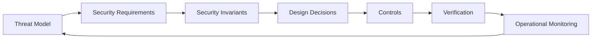
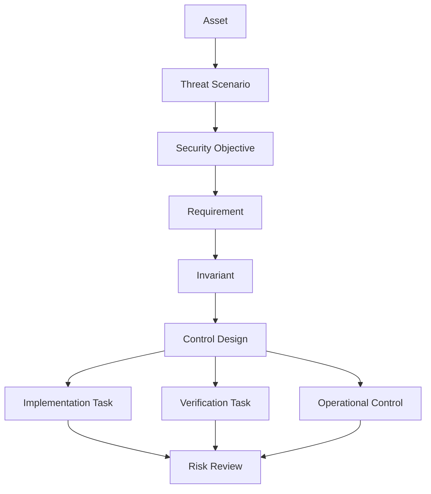
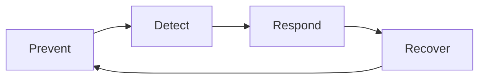
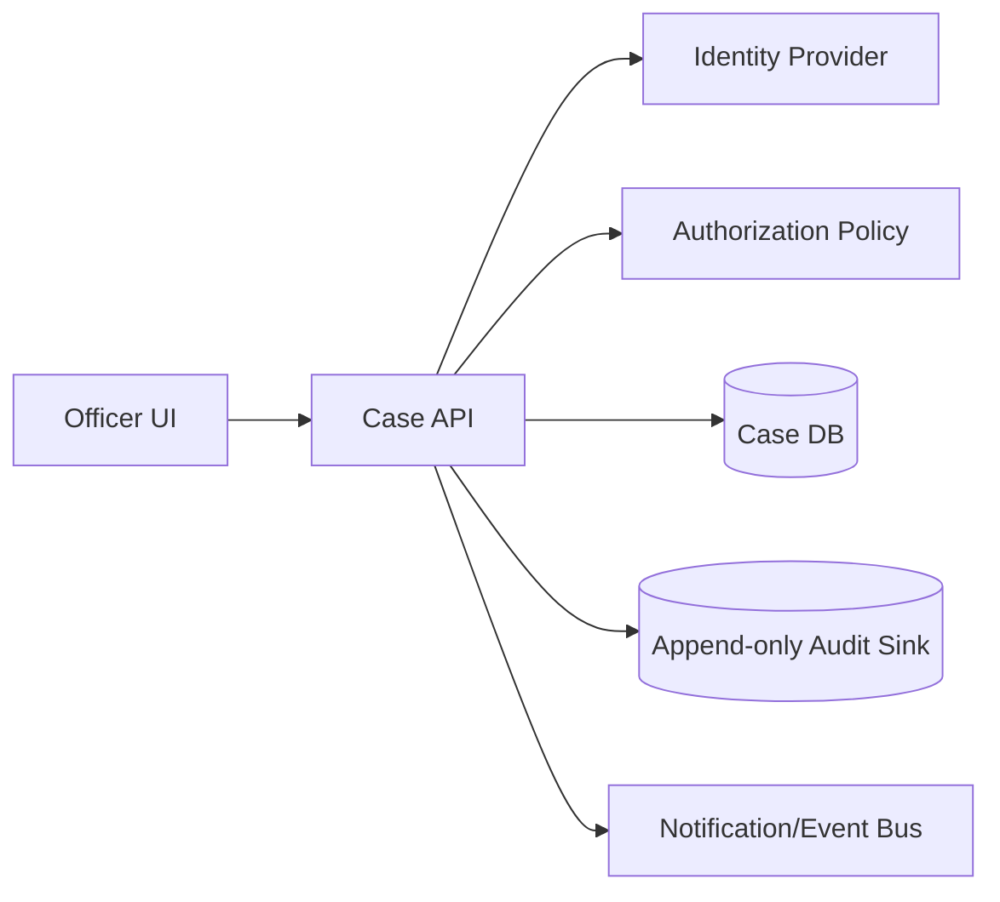

------
title: Learn Java Security, Cryptography and Integrity - Part 004
description: How to turn threat models into secure design requirements, measurable security invariants, risk decisions, verification criteria, and implementation-ready Java engineering work.
series: learn-java-security-cryptography-integrity
seriesTitle: Learn Java Security, Cryptography and Integrity
order: 4
partTitle: Secure Design, Requirements & Risk Modeling
tags:
  - java
  - security
  - secure-design
  - threat-modeling
  - requirements
  - risk-modeling
  - owasp-asvs
  - nist-ssdf
date: 2026-06-30
---

# Part 004 — Secure Design, Requirements & Risk Modeling

> Target bagian ini: mampu mengubah threat model menjadi **security requirements yang bisa diimplementasikan, diuji, diaudit, dan dipertahankan secara engineering**. Ini adalah jembatan antara Part 002 tentang asset/threat/trust boundary dan bagian implementasi Java security berikutnya.

Security design yang matang bukan daftar “pakai HTTPS, pakai JWT, pakai encryption”. Itu terlalu mekanis. Security design yang kuat menyatakan:

- asset apa yang dilindungi,
- actor mana yang boleh melakukan apa,
- threat mana yang dianggap credible,
- property apa yang harus dipertahankan,
- invariant apa yang tidak boleh dilanggar,
- control apa yang dipilih,
- failure mode apa yang harus fail closed,
- bagaimana requirement diverifikasi,
- siapa yang menerima residual risk.

---

## 1. Kaufman Framing: Skill yang Dibangun

Dalam kerangka Kaufman, kita menghindari belajar security sebagai tumpukan checklist. Kita pecah skill menjadi operasi praktis:



Skill target:

> **Diberi sebuah Java system design, kamu mampu menghasilkan secure design pack yang cukup jelas untuk developer, reviewer, tester, auditor, SRE, dan incident responder.**

Secure design pack minimal berisi:

1. System context dan trust boundary.
2. Asset classification.
3. Abuse cases.
4. Security requirements.
5. Security invariants.
6. Control mapping.
7. Verification plan.
8. Risk register.
9. Decision records.
10. Operational hooks.

---

## 2. Mengapa Requirement Security Sering Gagal?

Requirement security sering gagal karena terlalu vague.

| Requirement buruk | Masalah | Versi lebih baik |
|---|---|---|
| “System must be secure.” | Tidak bisa diuji | “All case status transitions require authenticated actor, object-level authorization, valid transition rule, reason code, and immutable audit event.” |
| “Encrypt sensitive data.” | Tidak jelas data, key, scope, lifecycle | “National ID field must be encrypted at application boundary using envelope encryption; DEK rotated every 90 days; KMS CMK access restricted to case-service runtime identity.” |
| “Use OAuth.” | OAuth bukan authorization bisnis otomatis | “API accepts access tokens from issuer X only, validates issuer/audience/expiry/signature, maps subject to tenant, then enforces object-level policy.” |
| “Audit all actions.” | Audit bisa mutable/noisy/tidak berguna | “Every enforcement decision mutation emits append-only audit event with actor, subject, previous state, new state, reason, correlation ID, and hash-chain link.” |
| “Prevent replay.” | Tidak jelas replay di boundary mana | “Webhook receiver rejects duplicate event IDs within 24h and rejects signed requests outside ±5 minute timestamp window.” |

Requirement bagus punya properti:

- Specific: asset dan action jelas.
- Measurable: bisa diuji/diinspeksi.
- Bounded: boundary dan environment jelas.
- Verifiable: ada positive dan negative test.
- Owned: ada owner engineering/risk.
- Lifecycle-aware: rotation, expiry, revocation, migration dipikirkan.

---

## 3. Dari Threat ke Requirement: Pipeline Praktis

Gunakan pipeline ini untuk setiap threat credible:



Contoh:

| Step | Contoh |
|---|---|
| Asset | Enforcement case decision record |
| Threat scenario | Internal user modifies decision reason after approval to hide procedural defect |
| Security objective | Preserve decision integrity and evidentiary traceability |
| Requirement | Approved decision reason must not be mutable in place; correction must create superseding record linked to original |
| Invariant | No approved decision record is updated without append-only correction event |
| Control | DB constraint + service state machine + audit hash chain + reviewer permission |
| Implementation | Add immutable decision table semantics and correction workflow |
| Verification | Test direct update rejected; correction emits audit event; hash chain detects mutation |
| Operational | Alert on DB update attempt against immutable fields |
| Residual risk | DBA privileged tampering mitigated by external log sink and separation of duties |

---

## 4. Security Requirement Taxonomy untuk Java Enterprise

Gunakan taxonomy ini agar requirement tidak hanya fokus pada crypto.

| Category | Pertanyaan requirement |
|---|---|
| Identity | Bagaimana actor dikenali? Apa issuer/source of truth? |
| Authentication | Bagaimana actor membuktikan identitas? MFA/passkey/session? |
| Authorization | Action/object/tenant apa yang boleh diakses? |
| Data confidentiality | Data mana yang rahasia, terhadap siapa, di state apa? |
| Data integrity | State/payload/evidence mana yang tidak boleh berubah tanpa deteksi? |
| Freshness/replay | Request/event mana yang harus one-time atau time-bounded? |
| Auditability | Apa yang harus bisa dijelaskan setelah kejadian? |
| Non-repudiation/evidence | Apa yang harus bisa dibuktikan secara defensible? |
| Availability/abuse | Bagaimana sistem bertahan terhadap abuse, flood, lockout? |
| Privacy/minimization | Data apa yang tidak boleh dikumpulkan/disimpan/log? |
| Key/secret lifecycle | Bagaimana key dibuat, dipakai, dirotasi, dicabut, dihancurkan? |
| Supply chain | Bagaimana dependency/build/artifact dipercaya? |
| Operational security | Bagaimana config, secrets, logging, monitoring dikendalikan? |
| Incident response | Apa containment dan recovery path? |

Untuk setiap category, tulis minimal satu invariant atau nyatakan explicit out-of-scope. Diam adalah sumber risk.

---

## 5. Security Invariant: Inti dari Secure Design

Security invariant adalah kondisi yang harus selalu benar agar sistem aman. Ini lebih kuat daripada requirement biasa karena invariant mengikat design, code, test, dan monitoring.

Contoh invariant:

```text
A case may only transition from INVESTIGATION_OPEN to ENFORCEMENT_RECOMMENDED if:
1. actor has CASE_RECOMMEND permission for the case jurisdiction,
2. all mandatory evidence items are attached and hash-verified,
3. conflict-of-interest check is clear or overridden by authorized supervisor,
4. transition emits an immutable audit event,
5. previous state version matches optimistic lock version.
```

Invariant bagus punya elemen:

| Elemen | Fungsi |
|---|---|
| Subject | Entity yang dilindungi |
| Condition | Syarat yang harus benar |
| Boundary | Di mana invariant ditegakkan |
| Failure mode | Apa yang terjadi jika gagal |
| Evidence | Apa bukti enforcement-nya |

Contoh format:

```text
Invariant: <Subject> must/must not <condition> when <context>, unless <explicit exception>, and violation must <failure mode + evidence>.
```

Contoh:

```text
Invariant: A submitted evidence file must not be replaced in place after case submission; any correction must create a new version linked to the original, preserve original content hash, and emit an audit event.
```

---

## 6. Requirement Pattern: Actor–Action–Object–Context–Evidence

Untuk authorization/integrity-heavy systems, gunakan format:

```text
<Actor> may perform <Action> on <Object> only when <Context/Policy> and system records <Evidence>.
```

Contoh:

```text
A regional enforcement officer may approve a preliminary finding on a case only when the case jurisdiction matches the officer assignment, the case is in REVIEW_READY state, no conflict flag is active, and the system records actor ID, assignment snapshot, decision reason, previous state, new state, timestamp, request ID, and audit hash-chain link.
```

Keunggulan format ini:

- Menyambungkan authorization dan audit.
- Memaksa object-level access, bukan endpoint-level saja.
- Memasukkan context seperti tenant, jurisdiction, state, deadline, conflict flag.
- Menghasilkan test cases yang jelas.

---

## 7. Requirement Pattern untuk Cryptography

Jangan menulis “encrypt data”. Gunakan template:

```text
<Data asset> must be protected for <property> against <threat actor> while <state: in transit/at rest/in use/in logs/backups> using <mechanism class>, with <key ownership/lifecycle>, and verified by <test/control>.
```

Contoh:

```text
Citizen national ID must be protected for confidentiality against database read-only compromise while stored in the application database using application-layer envelope encryption; data keys are generated per record group, wrapped by KMS-managed key, rotated every 90 days, and verified by tests proving plaintext does not appear in DB rows, application logs, traces, or message payloads.
```

Crypto requirement harus menjawab:

| Field | Pertanyaan |
|---|---|
| Asset | Data/payload/key mana? |
| Property | Confidentiality, integrity, authenticity, freshness? |
| Attacker | DB admin? network attacker? malicious tenant? compromised service? |
| State | In transit, at rest, in memory, in logs, in backup, in queue? |
| Mechanism | AEAD, HMAC, signature, TLS, KMS, hash chain? |
| Key lifecycle | Generate, store, access, rotate, revoke, destroy? |
| Associated data | Metadata apa yang harus terikat cryptographically? |
| Error behavior | Apa yang terjadi saat verify/decrypt gagal? |
| Verification | Test negatif apa? |

---

## 8. Requirement Pattern untuk Replay Defense

Replay sering dilupakan karena request valid secara cryptographic tetapi tidak fresh.

Template:

```text
A request/event carrying <operation> must be accepted only once within <scope> and <time window>; duplicate or stale requests must be rejected or idempotently resolved with auditable outcome.
```

Contoh:

```text
A signed partner webhook for enforcement payment confirmation must include event ID, timestamp, body hash, and HMAC signature. The receiver rejects timestamps outside ±5 minutes, rejects duplicate event IDs for 24 hours, and stores verification outcome with correlation ID.
```

Design decision penting:

| Decision | Trade-off |
|---|---|
| Timestamp window | Semakin pendek semakin aman, tetapi sensitif terhadap clock skew |
| Nonce/event ID storage | Butuh state/cache; failure cache bisa memengaruhi availability |
| Idempotency semantics | Duplicate valid bisa return previous result tanpa mengulang side effect |
| Scope | Per tenant? per integration? global? |
| Failure mode | Reject, quarantine, or manual review? |

---

## 9. Requirement Pattern untuk Auditability

Auditability bukan “log banyak hal”. Auditability berarti sistem bisa menjawab pertanyaan pasca-kejadian dengan bukti yang dapat dipercaya.

Template:

```text
For <security-relevant action>, the system must emit <audit event fields> to <append-only sink> before/within the same transaction as <state mutation>, and failure must <fail closed or defined compensating control>.
```

Contoh:

```text
For every case status transition, the system must emit an audit event containing actor ID, acting role, tenant/jurisdiction, case ID, previous state, new state, reason code, request ID, source IP category, timestamp, and previous audit hash before committing the transition; if audit emission fails, the transition must fail closed.
```

Audit requirement harus menjawab:

- Apakah audit event transactional dengan business state?
- Apakah audit event append-only?
- Apakah event bisa diubah oleh application admin?
- Apakah log mengandung secret/PII berlebihan?
- Apakah correlation ID mengikat request, event, dan DB mutation?
- Apakah retention sesuai kebutuhan legal/regulatory?
- Apakah time source jelas?

---

## 10. Risk Modeling: Jangan Semua Risiko Disamakan

Risk modeling membantu memprioritaskan. Namun, skor bukan pengganti reasoning. Untuk engineering design, gunakan kombinasi:

| Dimensi | Pertanyaan |
|---|---|
| Impact | Apa kerusakan jika threat berhasil? Legal, financial, safety, trust, regulatory? |
| Likelihood | Seberapa credible threat dengan attacker capability realistis? |
| Exposure | Apakah boundary public, partner, internal, admin-only? |
| Exploitability | Butuh credential? timing? privileged access? social engineering? |
| Detectability | Apakah serangan terlihat? Ada alert? Ada audit? |
| Recoverability | Bisa rollback? Bisa revoke key? Bisa reconstruct evidence? |
| Blast radius | Satu user, satu tenant, semua tenant, seluruh platform? |
| Time sensitivity | Apakah compromise lama tidak terdeteksi memperburuk dampak? |

### 10.1 Lightweight Risk Matrix

| Impact \ Likelihood | Low | Medium | High |
|---|---|---|---|
| Low | Accept/monitor | Backlog | Planned fix |
| Medium | Backlog | Fix before release | Block release |
| High | Review | Block release | Stop ship / incident-grade |

Tetapi matrix ini hanya starting point. Untuk sistem regulated, risiko integrity dan audit defensibility sering harus dinaikkan prioritasnya walaupun likelihood terlihat rendah.

### 10.2 Risk Statement Format

Gunakan format ini:

```text
Because <condition/design weakness>, <threat actor> can <attack action>, causing <impact>, affecting <scope>, unless <control> is implemented and verified by <evidence>.
```

Contoh:

```text
Because case transition authorization is checked only at endpoint role level, an internal officer with generic REVIEWER role can approve cases outside their jurisdiction, causing unauthorized enforcement decisions and regulatory challenge exposure across all tenants, unless object-level jurisdiction policy is enforced and verified by negative authorization tests.
```

---

## 11. Control Selection: Prevent, Detect, Respond, Recover

Security requirement sebaiknya tidak hanya memilih preventive control. Untuk high-value asset, pikirkan empat control class:



| Control class | Contoh Java/system control |
|---|---|
| Prevent | Authz policy, input validation, TLS, HMAC verification, DB constraints |
| Detect | Audit events, anomaly alerts, integrity verification job, SCA alerts |
| Respond | Key revocation, account disablement, quarantine queue, kill switch |
| Recover | Rebuild from event log, rotate keys, replay clean events, restore evidence from immutable store |

Contoh: evidence tampering.

| Class | Control |
|---|---|
| Prevent | Object storage write-once policy, no in-place replace after submission |
| Detect | Content hash verification, audit hash chain, external log sink |
| Respond | Quarantine case, disable actor, preserve forensic snapshot |
| Recover | Restore original content by hash/version, issue correction workflow |

---

## 12. Mapping ke OWASP ASVS dan NIST SSDF

Untuk engineering handbook, requirement lokal harus bisa dipetakan ke standar. Bukan supaya terlihat compliance-heavy, tetapi agar coverage tidak buta.

### 12.1 ASVS sebagai Verification Vocabulary

OWASP ASVS berguna sebagai katalog verification requirement aplikasi. Gunakan ASVS untuk memastikan desain mencakup area seperti:

- architecture, design, threat modeling,
- authentication,
- session management,
- access control,
- validation/sanitization,
- stored cryptography,
- error/logging,
- data protection,
- communication security,
- malicious code controls,
- business logic,
- API/web service,
- configuration.

Cara pakai:

```text
Local requirement -> ASVS category -> Implementation task -> Test evidence -> Residual risk
```

Jangan copy ASVS mentah ke backlog. Turunkan menjadi requirement spesifik domain.

### 12.2 NIST SSDF sebagai Operating Model

NIST SSDF membantu memastikan secure design tidak berhenti di code. Praktiknya mengelompokkan aktivitas secure development seperti prepare organization, protect software, produce well-secured software, dan respond to vulnerabilities.

Mapping praktis:

| Local work item | SSDF-style concern |
|---|---|
| Threat modeling before high-risk feature | Produce well-secured software |
| Secret scanning and signed commits/artifacts | Protect software |
| Secure coding guidelines and review gates | Prepare + produce |
| Vulnerability triage and patch SLA | Respond to vulnerabilities |
| SBOM generation and dependency governance | Protect + respond |

---

## 13. Secure Design Document: Struktur Minimum

Untuk fitur/security boundary besar, tulis design doc yang singkat tetapi lengkap.

```md
# Secure Design: <Feature/System>

## 1. Context
- Business purpose
- Data flow
- Trust boundaries
- External dependencies

## 2. Assets
- Data assets
- Identity assets
- Integrity assets
- Operational assets

## 3. Actors
- Human actors
- Service actors
- Admin actors
- External/partner actors
- Attacker assumptions

## 4. Abuse Cases
- Abuse case list
- Credibility and impact

## 5. Security Requirements
- Actor-action-object-context-evidence requirements
- Crypto/data protection requirements
- Audit requirements
- Availability/abuse requirements

## 6. Security Invariants
- Always-true rules
- Enforcement points

## 7. Controls
- Prevent/detect/respond/recover controls
- Java/framework/API choices

## 8. Verification Plan
- Unit tests
- Integration tests
- Negative security tests
- Manual review
- Operational checks

## 9. Residual Risk
- Accepted risks
- Owner
- Expiry/review date

## 10. Decision Records
- Key/cert/token/session/authz decisions
```

---

## 14. Example: Secure Design for Case Status Transition

### 14.1 Context

A Java service exposes API to transition regulatory enforcement cases across workflow states.



### 14.2 Assets

| Asset | Security property |
|---|---|
| Case state | Integrity, authorization, auditability |
| Decision reason | Integrity, evidence defensibility, privacy |
| Actor identity | Authenticity, accountability |
| Evidence reference | Integrity, traceability |
| Audit trail | Tamper evidence, retention |

### 14.3 Abuse Cases

| Abuse case | Threat actor | Impact |
|---|---|---|
| Officer approves case outside jurisdiction | Malicious/curious insider | Unauthorized enforcement action |
| User replays old transition request | Compromised client/session | Duplicate or invalid transition |
| Admin edits reason after approval | Privileged insider | Evidence integrity failure |
| Service emits event without DB commit | System failure | Downstream inconsistency |
| DB update bypasses audit | Compromised service/DB access | Regulatory defensibility failure |

### 14.4 Requirements

```text
REQ-CASE-001: A case status transition must be accepted only when the authenticated actor has object-level permission for the case jurisdiction, the requested transition is valid from current state, and the actor satisfies role/state separation constraints.
```

```text
REQ-CASE-002: Every successful case status transition must create an append-only audit event containing actor, subject, jurisdiction, previous state, new state, reason code, evidence version references, request ID, timestamp, and previous audit hash.
```

```text
REQ-CASE-003: A transition request must include idempotency key scoped to actor + case + requested transition; duplicate request with same body returns original outcome, while same key with different body is rejected and audited.
```

```text
REQ-CASE-004: Approved decision fields must not be updated in place. Correction requires a superseding decision record, correction reason, supervisor authorization, and audit linkage to original record.
```

### 14.5 Invariants

```text
INV-CASE-001: No case state change is committed without an audit event in the same transaction boundary or a fail-closed equivalent.
```

```text
INV-CASE-002: No actor can approve a case where actor.jurisdiction does not include case.jurisdiction at decision time.
```

```text
INV-CASE-003: Approved decision records are immutable; corrections are append-only superseding records.
```

### 14.6 Java Implementation Hints

This is not full implementation yet, but the design implies:

- service-layer state machine enforcement,
- object-level policy evaluation,
- optimistic locking/version check,
- DB constraints where possible,
- append-only audit table or external sink,
- idempotency table with request hash,
- structured security event logging,
- negative tests for authorization and replay.

Pseudo-code:

```java
@Transactional
public TransitionResult transitionCase(TransitionCommand command, Actor actor) {
    CaseRecord current = caseRepository.loadForUpdate(command.caseId());

    authorization.requireAllowed(actor, "case.transition", current);
    stateMachine.requireValidTransition(current.status(), command.targetStatus());
    separationOfDuties.requireSatisfied(actor, current, command.targetStatus());

    IdempotencyDecision idem = idempotency.checkOrReserve(
        command.idempotencyKey(),
        actor.id(),
        command.caseId(),
        command.canonicalHash()
    );

    if (idem.isReplayOfSameRequest()) {
        return idem.previousResult();
    }

    CaseRecord updated = current.transitionTo(command.targetStatus(), command.reasonCode());

    AuditEvent event = AuditEvent.caseTransition()
        .actor(actor)
        .caseId(current.id())
        .previousState(current.status())
        .newState(updated.status())
        .reason(command.reasonCode())
        .requestId(command.requestId())
        .previousAuditHash(auditRepository.latestHash(current.id()))
        .build();

    caseRepository.save(updated);
    auditRepository.append(event); // must fail closed with transaction
    idempotency.complete(command.idempotencyKey(), updated.resultReference());

    return TransitionResult.success(updated.id(), updated.status());
}
```

Key point: security requirement menghasilkan shape code, transaction boundary, data model, dan test plan.

---

## 15. Verification Design: Positive, Negative, Abuse, Regression

Security requirement tanpa verification adalah aspirasi.

| Test type | Contoh |
|---|---|
| Positive | Authorized officer transitions valid case state |
| Negative | Officer outside jurisdiction rejected |
| Abuse | Replay same transition with modified body rejected |
| Boundary | Expired/invalid token rejected before business logic |
| Integrity | Direct mutation of approved decision fails or is detected |
| Observability | Rejected transition emits security event without leaking secret |
| Concurrency | Two approvers racing cannot create invalid double transition |
| Recovery | Audit hash verification detects tampered row |

### 15.1 Given-When-Then Template

```text
Given <asset/context/state>
And <actor identity/policy>
When <action/attack/failure>
Then <expected security decision>
And <evidence/side effect>
And <no forbidden side effect>
```

Contoh:

```text
Given a case in REVIEW_READY under jurisdiction A
And an authenticated officer assigned only to jurisdiction B
When the officer requests APPROVE transition
Then the API returns authorization failure
And no case state is changed
And an authorization-denied audit event is recorded
And no decision notification is published
```

---

## 16. Requirement Traceability Matrix

Untuk sistem kompleks, buat matrix sederhana.

| ID | Threat | Requirement | Control | Test | Evidence | Owner |
|---|---|---|---|---|---|---|
| T-001 | Unauthorized cross-jurisdiction approval | REQ-CASE-001 | Object-level policy | `CaseAuthzTest.rejectsWrongJurisdiction` | CI + review | Case Platform |
| T-002 | Replay transition | REQ-CASE-003 | Idempotency + request hash | `IdempotencyTest.rejectsChangedReplay` | CI | API Platform |
| T-003 | Audit bypass | REQ-CASE-002 | Transactional audit append | `AuditAtomicityTest` | CI + DB migration review | Case Platform |
| T-004 | Evidence replacement | REQ-EVD-004 | Versioned immutable storage | `EvidenceMutationTest` | CI + storage policy | Evidence Team |

Traceability tidak perlu birokratis. Tujuannya agar ketika threat berubah, kamu tahu requirement dan test mana yang harus diperbarui.

---

## 17. Risk Acceptance yang Sehat

Tidak semua risk bisa dihilangkan. Tetapi risk acceptance harus eksplisit.

Bad acceptance:

```text
We accept the risk because unlikely.
```

Good acceptance:

```text
Risk: Partner webhook replay beyond 24 hours could duplicate notification processing if event ID store is lost.
Reason accepted: Downstream operation is idempotent by payment reference; financial mutation has independent uniqueness constraint.
Compensating controls: Daily reconciliation detects duplicate notification outcomes; duplicate mutation impossible due to DB unique constraint.
Owner: Payments Engineering + Risk Owner.
Review date: 2026-09-30.
```

Risk acceptance fields:

| Field | Required? | Why |
|---|---|---|
| Risk statement | Yes | Defines what is accepted |
| Impact | Yes | Clarifies consequence |
| Existing controls | Yes | Avoids blind acceptance |
| Missing controls | Yes | Shows gap |
| Owner | Yes | Accountability |
| Expiry/review date | Yes | Prevents permanent exception |
| Compensating controls | Usually | Makes acceptance defensible |
| Evidence | Yes | Supports audit/review |

---

## 18. Secure Design Review Rubric

Gunakan rubric ini untuk review desain Java security.

### 18.1 Context Quality

| Level | Signal |
|---|---|
| Weak | Diagram hanya komponen, tanpa trust boundary |
| Good | Data flow, actor, external systems, trust boundary jelas |
| Strong | Menjelaskan roots of trust, privileged operations, failure modes, lifecycle |

### 18.2 Requirement Quality

| Level | Signal |
|---|---|
| Weak | “Use encryption/authentication/logging” |
| Good | Asset + property + actor + mechanism + verification |
| Strong | Invariant + control + negative tests + operational evidence |

### 18.3 Authorization Quality

| Level | Signal |
|---|---|
| Weak | Role check di controller saja |
| Good | Object-level policy di service/domain layer |
| Strong | Policy has context, tenant/jurisdiction, state, SoD, tests, audit evidence |

### 18.4 Crypto Quality

| Level | Signal |
|---|---|
| Weak | Algorithm names without lifecycle or misuse handling |
| Good | Approved mechanism, key lifecycle, fail closed |
| Strong | Crypto agility, rotation, tamper tests, associated data, threat-specific design |

### 18.5 Audit Quality

| Level | Signal |
|---|---|
| Weak | Application logs only |
| Good | Structured audit events for security-relevant actions |
| Strong | Append-only/tamper-evident design, retention, access separation, verification job |

---

## 19. Common Design Smells

| Smell | Why it matters | Better approach |
|---|---|---|
| Endpoint-level authorization only | Object/tenant bypass | Policy per object/action/context |
| “Admin can do everything” | Privileged abuse unbounded | Break-glass flow, SoD, audit, approval |
| Crypto without key lifecycle | Rotations/compromise impossible | KMS/vault lifecycle design |
| TLS errors bypassed in code | MITM exposure | Fix truststore/cert/hostname |
| Audit after commit best-effort | State mutation without evidence | Transactional audit or fail-closed outbox |
| Mutable evidence | Regulatory defensibility weak | Versioned immutable evidence store |
| No negative tests | Security behavior unproven | Abuse case tests |
| Same secret across tenants | Blast radius huge | Tenant/usage scoped keys/secrets |
| Risk accepted forever | Hidden permanent debt | Owner + expiry + review |
| Confusing authentication with authorization | Valid user can still be unauthorized | Separate authn/authz decisions |

---

## 20. How This Applies to Java Implementation Work

Secure requirements should shape Java work items.

| Requirement type | Java work item |
|---|---|
| Object-level authorization | Policy service, method-level guard, repository scoping, test fixtures |
| Replay defense | Idempotency table/cache, request canonicalization, HMAC verification, timestamp validation |
| Data encryption | Crypto service abstraction, key reference model, KMS integration, migration job |
| Audit integrity | Audit event model, transactional outbox/append-only sink, hash chain verifier |
| TLS/mTLS | JSSE config, keystore/truststore management, certificate monitoring |
| Secrets | Secret provider abstraction, startup validation, no secret logging, rotation readiness |
| Supply chain | Dependency policy, SBOM generation, artifact signing verification |
| Abuse resilience | Rate limiting, circuit breaker, lockout policy, monitoring |

Bad backlog item:

```text
Add encryption.
```

Good backlog item:

```text
Implement application-layer envelope encryption for citizen national ID in CaseProfile table:
- AES-GCM using per-record DEK
- DEK wrapped by KMS key alias/case-pii-v1
- key reference stored with ciphertext
- plaintext absent from DB/logs/traces
- migration supports existing rows
- tests cover decrypt failure, wrong AAD, tampered ciphertext, and key unavailable behavior
```

---

## 21. Practice: Build a Secure Design Pack in 60–90 Minutes

Pilih satu feature dari sistemmu, misalnya:

- file upload evidence,
- webhook receiver,
- case approval workflow,
- partner API integration,
- admin role management,
- export report containing PII,
- password reset flow.

Kerjakan ini:

1. Draw data flow + trust boundary.
2. List top 5 assets.
3. Write 5 abuse cases.
4. Convert each abuse case to 1 requirement.
5. Write 3 invariants.
6. Choose prevent/detect/respond/recover controls.
7. Write 5 negative tests.
8. Write 1 risk acceptance if any gap remains.
9. Map to ASVS/NIST SSDF category loosely.
10. Identify one Java API/framework point that must be configured carefully.

Output harus cukup jelas sehingga engineer lain bisa implement tanpa menebak security intent.

---

## 22. Mini Capstone: Webhook Receiver Requirement Set

### Context

A partner sends signed webhooks to a Java service.

### Security requirements

```text
REQ-WH-001: The webhook receiver must accept requests only over HTTPS from configured endpoint path and must not rely on source IP as sole authentication.
```

```text
REQ-WH-002: Each webhook request must include partner ID, event ID, timestamp, body SHA-256 digest, key ID, and HMAC signature over canonical request components.
```

```text
REQ-WH-003: The receiver must select the verification secret by partner ID and key ID, reject unknown key IDs, and support overlapping active keys during rotation.
```

```text
REQ-WH-004: The receiver must reject timestamps outside ±5 minutes unless partner-specific risk acceptance exists.
```

```text
REQ-WH-005: The receiver must reject duplicate event IDs within 24 hours; duplicate event with identical body returns previous processing result if idempotent, while duplicate event ID with different body is rejected and audited.
```

```text
REQ-WH-006: Signature comparison must use constant-time comparison and must fail closed on malformed canonicalization input.
```

```text
REQ-WH-007: Verification failures must emit security events without logging raw secrets, full signatures, or sensitive payload fields.
```

### Invariants

```text
INV-WH-001: No webhook side effect occurs before signature, timestamp, and replay checks pass.
```

```text
INV-WH-002: A webhook event ID maps to exactly one canonical body hash within the replay retention window.
```

```text
INV-WH-003: Unknown partner ID or key ID never falls back to a default shared secret.
```

### Negative tests

| Test | Expected result |
|---|---|
| Valid body but tampered signature | Rejected, no side effect |
| Valid signature but stale timestamp | Rejected, no side effect |
| Same event ID different body | Rejected and audited |
| Unknown key ID | Rejected, no default fallback |
| Malformed timestamp | Rejected, no parser exception leak |
| Signature verified over different canonical form | Rejected |

This capstone will become implementation material later when we discuss HMAC, canonicalization, replay defense, and API request signing.

---

## 23. Summary

Secure design is the conversion layer between threat awareness and production Java engineering.

The core flow is:

```text
Threat -> Requirement -> Invariant -> Control -> Code shape -> Test -> Operational evidence -> Risk decision
```

Top-tier engineering quality appears when requirements are:

- asset-specific,
- property-specific,
- actor-aware,
- object-level,
- lifecycle-aware,
- failure-mode-aware,
- testable with negative cases,
- mapped to operational evidence,
- tied to explicit ownership.

This is how security becomes part of architecture instead of becoming a late checklist.

---

## References

- OWASP Threat Modeling Cheat Sheet: https://cheatsheetseries.owasp.org/cheatsheets/Threat_Modeling_Cheat_Sheet.html
- OWASP Threat Modeling overview: https://owasp.org/www-community/Threat_Modeling
- OWASP Application Security Verification Standard: https://owasp.org/www-project-application-security-verification-standard/
- OWASP Top 10 2025 — Insecure Design: https://owasp.org/Top10/2025/A06_2025-Insecure_Design/
- NIST SP 800-218 Secure Software Development Framework: https://csrc.nist.gov/pubs/sp/800/218/final
- Oracle Java Security Overview: https://docs.oracle.com/en/java/javase/25/security/java-security-overview1.html
- Oracle Secure Coding Guidelines for Java SE: https://www.oracle.com/java/technologies/javase/seccodeguide.html
