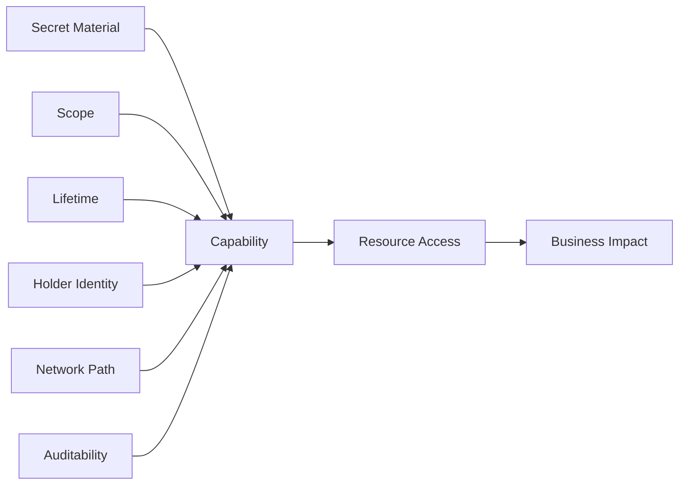
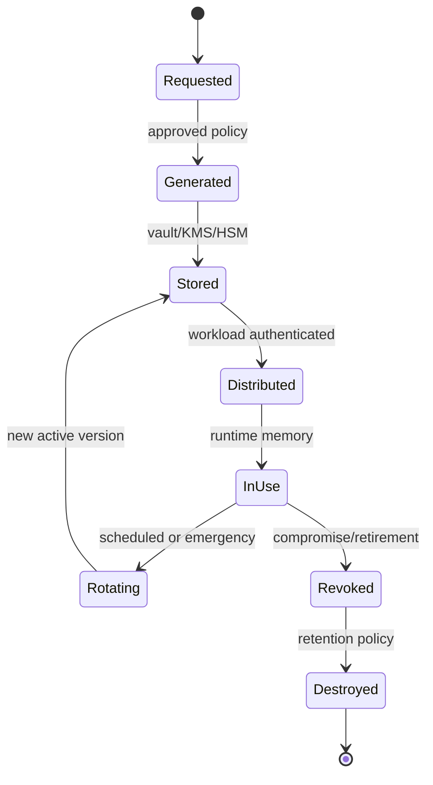
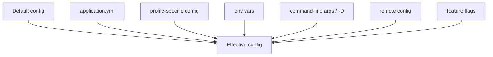
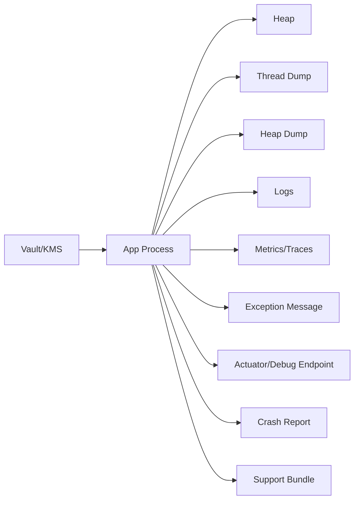
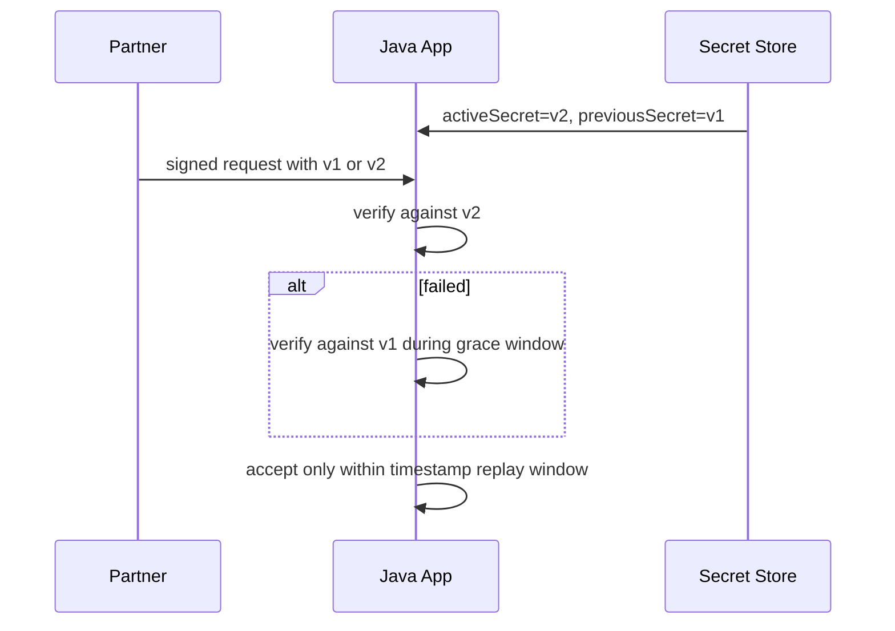
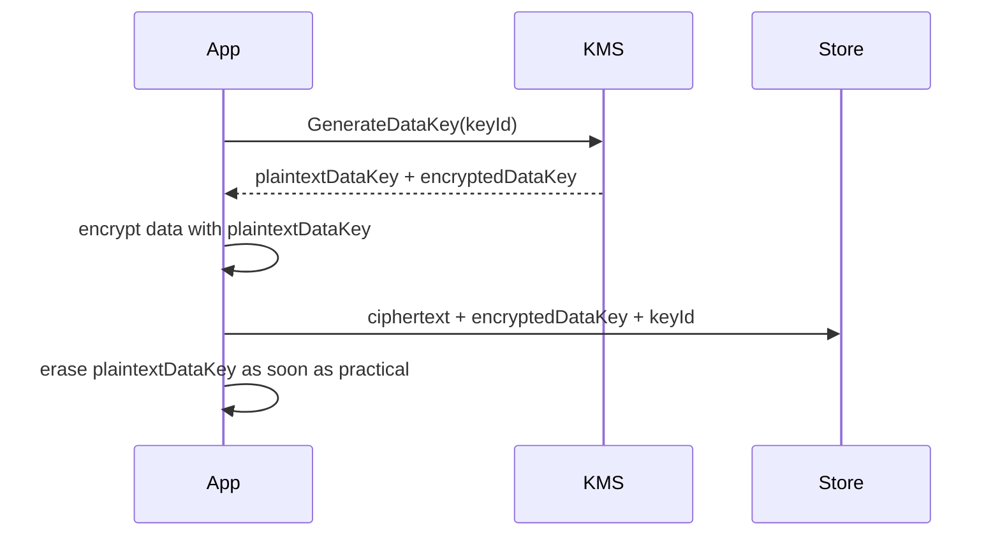

------
title: Learn Java Security, Cryptography and Integrity - Part 006
description: Secrets, configuration, and runtime exposure in Java systems: secret lifecycle, configuration injection, secret zero, vault and KMS patterns, environment variable risks, heap/thread dump exposure, rotation, and operational controls.
series: learn-java-security-cryptography-integrity
seriesTitle: Learn Java Security, Cryptography and Integrity
order: 6
partTitle: Secrets, Configuration & Runtime Exposure
tags:
  - java
  - security
  - secrets-management
  - configuration
  - runtime-security
  - kms
  - vault
  - secure-engineering
date: 2026-06-30
---

# Part 006 — Secrets, Configuration & Runtime Exposure

> Target bagian ini: mampu mendesain, mereview, dan mengoperasikan **secret lifecycle** dan **configuration boundary** untuk aplikasi Java production tanpa bergantung pada asumsi rapuh seperti "secret ada di env var jadi aman" atau "hanya admin yang bisa melihat log".

Secret adalah data yang memberikan capability.

Contoh secret:

- database password;
- API key partner;
- OAuth client secret;
- private key TLS/mTLS;
- signing key JWT;
- encryption key wrapping key;
- webhook HMAC secret;
- service account credential;
- cloud provider temporary credential;
- bootstrap token untuk mengambil secret lain.

Configuration adalah data yang mengubah perilaku sistem.

Contoh configuration yang security-sensitive:

- auth issuer URL;
- JWKS endpoint;
- allowed CORS origins;
- redirect URI allowlist;
- feature flag bypass approval;
- TLS truststore path;
- token expiry;
- rate limit;
- tenant isolation mode;
- logging redaction toggle;
- outbound proxy/egress target.

Secret dan configuration sering dipisahkan dalam organisasi, tetapi dalam threat model keduanya sama-sama menentukan **capability dan trust decision**.

---

## 1. Kaufman Framing: Skill yang Sebenarnya

Skill utama:

> Mampu memastikan secret dan security-sensitive configuration hanya tersedia kepada workload yang benar, pada waktu yang benar, dalam bentuk yang benar, dengan observability dan rotasi yang memadai.

Sub-skill:

| Sub-skill | Pertanyaan praktis |
|---|---|
| Secret inventory | Secret apa saja yang dipakai sistem ini, siapa owner-nya, dan capability apa yang diberikan? |
| Secret lifecycle | Bagaimana secret dibuat, disimpan, didistribusikan, digunakan, diputar, dicabut, dan dihancurkan? |
| Bootstrap problem | Workload membuktikan identitasnya ke vault/KMS dengan apa? |
| Runtime exposure | Di mana secret bisa muncul: env, args, heap, logs, dumps, metrics, traces, exceptions, shell history? |
| Configuration integrity | Siapa boleh mengubah config yang memengaruhi security? Apakah perubahan auditable? |
| Rotation safety | Bisakah secret diputar tanpa downtime dan tanpa split-brain? |
| Least privilege | Apakah secret memberi akses terlalu luas? |
| Incident response | Jika secret bocor, apa blast radius dan playbook revoke-nya? |

Latihan 20 jam di area ini: buat secret inventory untuk satu service nyata, lalu gambar jalur secret dari creation sampai runtime memory.

---

## 2. Mental Model: Secret adalah Capability, Bukan String

Jangan berpikir:

> "Password database adalah string rahasia."

Berpikirlah:

> "Password database adalah capability untuk membaca/menulis data tertentu pada scope tertentu selama periode tertentu dari network identity tertentu."



Security design harus mengurangi:

- scope;
- lifetime;
- number of holders;
- copy count;
- places of exposure;
- privilege granted;
- ambiguity of ownership.

---

## 3. Secret Taxonomy untuk Java Systems

| Secret type | Contoh | Risiko utama |
|---|---|---|
| Static application secret | DB password, partner API key | long-lived leak, reuse, hard rotation |
| Cryptographic key | AES key, HMAC key, private key | data compromise, forged signatures |
| Identity credential | service account JSON, client secret | impersonation, lateral movement |
| Bootstrap credential | token to vault/KMS | secret zero compromise |
| Temporary credential | STS token, short-lived DB token | refresh abuse, replay within TTL |
| User secret | password, recovery code, OTP seed | account takeover, privacy breach |
| Build/release secret | signing key, deploy token | supply-chain compromise |
| Operational secret | break-glass credential | high blast radius, poor audit if unmanaged |

Untuk setiap secret, jawab:

1. Apa capability-nya?
2. Siapa holder-nya?
3. Di mana disimpan?
4. Di mana muncul di runtime?
5. Berapa TTL-nya?
6. Bagaimana rotasinya?
7. Apa indikator kebocoran?
8. Bagaimana revoke-nya?

---

## 4. Secret Lifecycle



### 4.1 Lifecycle Controls

| Stage | Control |
|---|---|
| Requested | owner, purpose, scope, expiry, approval |
| Generated | CSPRNG/KMS/HSM, no human-chosen values |
| Stored | encrypted at rest, access policy, audit |
| Distributed | workload identity, short-lived token, secure channel |
| In use | least privilege, no logs, memory exposure reduction |
| Rotating | dual-read/dual-write strategy, versioning |
| Revoked | disable old version, audit dependent workloads |
| Destroyed | cryptographic erasure where appropriate |

Secret lifecycle yang matang tidak bergantung pada heroics. Ia harus normal operation.

---

## 5. The Secret Zero Problem

Untuk mengambil secret dari vault, aplikasi harus membuktikan identitasnya. Credential pertama ini disebut secret zero.

Solusi buruk:

```properties
vault.token=s.very-long-static-root-token
```

Solusi lebih baik bergantung environment:

| Environment | Better bootstrap identity |
|---|---|
| Kubernetes | service account token projected with audience + workload identity |
| Cloud VM | instance metadata identity with strict IAM and IMDS hardening |
| CI/CD | OIDC federation from CI to cloud provider, short-lived credential |
| On-prem | mTLS workload certificate, Kerberos, SPIFFE/SPIRE, HSM-backed identity |
| Developer machine | SSO-backed local auth, short TTL, no prod secret access by default |

Prinsip:

- bootstrap credential harus short-lived;
- identity harus terikat workload/environment;
- tidak boleh ada root token statis di image;
- akses vault harus auditable;
- policy harus scoped per service.

---

## 6. Storage Patterns: Dari Terburuk ke Lebih Baik

| Pattern | Penilaian |
|---|---|
| Hardcoded in source | Hampir selalu salah; masuk git, artifact, scanner, cache |
| Committed encrypted file with shared key | Masih bermasalah jika key management buruk |
| Plain env var | Umum, tetapi mudah bocor lewat process/env introspection, dumps, debug, accidental logs |
| Mounted secret file | Lebih mudah dikontrol daripada env, tetapi permission/rotation perlu benar |
| Runtime secret agent/sidecar | Bagus untuk rotation dan isolation, bergantung platform |
| Vault/KMS dynamic secret | Lebih baik untuk TTL, audit, scoped access |
| HSM/KMS non-exportable key | Ideal untuk private key tertentu; aplikasi tidak pernah melihat raw key |

Tidak ada pattern universal. Pilihan benar tergantung threat model, platform, operability, latency, dan compliance.

---

## 7. Environment Variables: Praktis tetapi Bukan Benteng

Env var populer karena mudah:

```bash
DB_PASSWORD=secret java -jar app.jar
```

Risiko:

- bisa muncul di crash report, debug endpoint, support bundle;
- bisa dibaca oleh proses/agent tertentu tergantung OS/container policy;
- sering masuk log saat config dump;
- sulit dirotasi tanpa restart;
- tidak punya metadata version/lease;
- raw secret tersebar ke banyak process.

Env var boleh dipakai untuk low-risk local dev atau bootstrap non-prod tertentu, tetapi untuk production high-value systems, lebih baik gunakan secret manager/vault dengan identity-aware access dan audit.

### 7.1 Rule of Thumb

| Case | Env var cukup? |
|---|---|
| Local dev throwaway secret | Bisa |
| Non-prod isolated app | Bisa dengan kontrol |
| Production DB credential | Hindari jika ada vault/dynamic secret |
| Signing private key | Hindari; prefer KMS/HSM/non-exportable |
| OAuth client secret | Gunakan secret manager + rotation |
| Break-glass secret | Jangan env var; butuh audit ketat |

---

## 8. Configuration as Attack Surface

Security-sensitive configuration sering lebih berbahaya daripada code karena bisa diubah tanpa review yang sama.

Contoh:

```yaml
security:
  cors:
    allowedOrigins: "*"
  jwt:
    verifySignature: false
  approval:
    requireSecondReviewer: false
```

Jika config ini bisa diubah oleh operator tanpa security review, maka sistem punya backdoor administratif.

### 8.1 Config Classification

| Config class | Contoh | Required control |
|---|---|---|
| Non-security operational | page size, UI label | normal change |
| Availability-sensitive | pool size, timeout | ops review |
| Security-sensitive | auth issuer, CORS, TLS, token TTL | code/security review + audit |
| Integrity-critical | approval bypass, signing mode | dual approval + strong audit |
| Secret material | password, private key | secret manager only |

### 8.2 Configuration Integrity Invariant

> Security-sensitive configuration must be versioned, reviewable, auditable, and recoverable.

Practical controls:

- config-as-code;
- signed configuration bundle;
- protected branches;
- separation of duties;
- immutable deployment artifact;
- runtime config diff alert;
- allowlist of config keys editable at runtime;
- no hidden debug bypass toggles in prod.

---

## 9. Java Configuration Loading Risks

Java apps often combine many config sources:

- JVM system properties: `-Dkey=value`;
- environment variables;
- property files;
- YAML files;
- command-line arguments;
- Spring profiles;
- Kubernetes ConfigMaps/Secrets;
- service discovery;
- remote config server;
- database-backed flags.

The risk is not only leakage. The risk is **precedence confusion**.



If an attacker or compromised operator can influence a higher-precedence source, they may override safe defaults.

### 9.1 Controls

- Document config precedence.
- Reject unknown config keys in strict mode where practical.
- On startup, log config metadata, not secret values.
- Fail startup if critical security config is missing.
- Pin production profile; do not auto-detect by hostname string.
- Test production config with security assertions.
- Forbid insecure values in prod, even if config says so.

Example guard:

```java
public final class SecurityConfigGuard {
    public static void validate(SecurityProperties p, Environment env) {
        if (env.isProduction()) {
            if (!p.jwt().verifySignature()) {
                throw new IllegalStateException("JWT signature verification cannot be disabled in prod");
            }
            if (p.cors().allowedOrigins().contains("*")) {
                throw new IllegalStateException("Wildcard CORS origin is forbidden in prod");
            }
            if (p.session().cookieSecure() == false) {
                throw new IllegalStateException("Secure cookies required in prod");
            }
        }
    }
}
```

Security config should fail closed.

---

## 10. Runtime Exposure Map

Secret may be stored correctly but exposed at runtime.



Each exposure location needs a control.

| Exposure | Control |
|---|---|
| Heap | minimize lifetime, avoid unnecessary copies, prefer non-exportable key handles |
| Thread dump | avoid putting secret in thread names/MDC; restrict dump access |
| Heap dump | disable automatic dumps in prod or secure storage/access |
| Logs | redaction, structured logging, secret scanner |
| Metrics | never use secret as label/tag |
| Traces | sanitize headers/attributes |
| Exceptions | generic client error, safe server log |
| Debug endpoints | disable or strongly protect in prod |
| Support bundles | redaction pipeline and approval |

---

## 11. Java Memory Handling: Be Honest About Limits

Java strings are immutable. If you load a secret into `String`, you cannot reliably erase its content from memory.

```java
String password = System.getenv("DB_PASSWORD");
```

Some APIs accept `char[]`, allowing overwrite:

```java
char[] password = readPassword();
try {
    use(password);
} finally {
    Arrays.fill(password, '\0');
}
```

But modern Java systems still copy data internally: config binders, drivers, TLS libraries, logging frameworks, exception messages, heap snapshots. `char[]` helps in narrow contexts, especially interactive password handling, but does not solve runtime secret exposure alone.

For high-value cryptographic keys, prefer designs where raw key material is not exported to the Java process:

- KMS encrypt/decrypt/sign APIs;
- HSM-backed provider;
- PKCS#11 token;
- envelope encryption with data key lifetime minimized;
- key handles instead of raw keys.

---

## 12. Secret Injection Patterns

### 12.1 Startup Fetch

App fetches secrets during boot.

Pros:

- simple;
- fail fast;
- easy dependency model.

Cons:

- rotation needs restart unless refreshed;
- startup dependency on vault;
- secret stays in memory for process lifetime.

### 12.2 Lazy Fetch with Cache

Fetch when needed, cache with TTL.

Pros:

- supports rotation;
- reduces startup coupling;
- can use short-lived credentials.

Cons:

- more failure modes;
- latency;
- cache invalidation complexity.

### 12.3 Dynamic Credentials

Vault/KMS issues short-lived credential, e.g., DB credential with lease.

Pros:

- small blast radius;
- clear audit;
- revocation easier.

Cons:

- application must renew/refresh;
- database connection pool must handle credential rollover;
- outages in identity/vault path can affect availability.

### 12.4 Non-exportable Operation

App never sees private key. It asks KMS/HSM to sign/decrypt.

Pros:

- strongest key protection;
- audit every operation;
- easier compliance story.

Cons:

- latency/cost;
- availability dependency;
- API quota;
- harder local testing.

---

## 13. Rotation Without Downtime

Rotation fails when system assumes only one active secret.

### 13.1 Symmetric Verification Secret Rotation

For HMAC webhook verification:



Rules:

- signing should move to new secret first;
- verification accepts old + new during grace period;
- log usage of old secret;
- remove old secret after window;
- timestamp/nonce replay defense remains required.

### 13.2 JWT Signing Key Rotation

Use key IDs (`kid`) and JWKS:

- issuer publishes new public key before signing with new private key;
- consumers cache JWKS with sane TTL;
- tokens signed with old key remain valid until expiry;
- old key removed only after max token lifetime + cache TTL;
- unknown `kid` should trigger controlled refresh, not disable verification.

### 13.3 Database Password Rotation

DB rotation is harder because of connection pools.

Patterns:

- two valid users: `app_user_a`, `app_user_b`;
- rotate inactive user password;
- deploy app using inactive/new credential;
- drain old connections;
- revoke old credential;
- monitor failed auth.

Or use dynamic DB credentials with short lease and pool refresh support.

---

## 14. Secret Scope and Least Privilege

A secret should be scoped by:

| Scope | Example |
|---|---|
| Service | `case-service` cannot use `payment-service` secret |
| Environment | dev/stage/prod separated |
| Tenant | high-sensitivity multi-tenant systems may use tenant-scoped keys |
| Operation | read-only vs write vs admin |
| Resource | specific bucket/path/database/schema |
| Network | only usable from certain workload/network identity |
| Time | TTL/expiry |

Bad:

```text
one-prod-super-api-key-used-by-17-services
```

Better:

```text
case-service-prod-partner-x-webhook-verify-v3
case-service-prod-evidence-bucket-write-v5
case-service-prod-audit-signing-key-v2
```

Naming alone is not security, but clear naming improves inventory, audit, and incident response.

---

## 15. Secrets in Logs, Metrics, and Traces

### 15.1 Dangerous Logging Examples

```java
log.info("Starting with config {}", config);
log.debug("Authorization header: {}", request.getHeader("Authorization"));
log.error("Partner call failed: request={} response={}", requestBody, responseBody, ex);
```

These lines often leak secrets accidentally.

### 15.2 Redaction Strategy

Redaction should be multi-layered:

1. do not log sensitive fields at source;
2. use safe DTOs for logging;
3. configure logging framework masking;
4. scan logs for secret patterns;
5. restrict log access;
6. define retention by sensitivity.

Example safe object:

```java
public record PartnerCallLogEvent(
    String partner,
    String endpointCode,
    int status,
    String correlationId,
    Duration latency
) {}
```

Avoid generic `toString()` on config/request objects.

### 15.3 MDC Risks

MDC values propagate widely.

Bad MDC fields:

- token;
- email if not needed;
- full request body;
- session ID;
- raw external reference containing secret.

Good MDC fields:

- correlation ID;
- tenant ID if allowed by policy;
- hashed actor ID;
- stable request route pattern.

---

## 16. Debug, Admin, and Actuator Endpoints

Java production apps often expose debug/management endpoints. These are high-risk.

Risky endpoint classes:

- environment/config dump;
- heap dump;
- thread dump;
- metrics with labels;
- log level changer;
- refresh config;
- shutdown/restart;
- cache inspector;
- route mappings;
- health details showing dependency credentials/URLs.

Controls:

- bind management endpoint to private network/interface;
- require strong authentication and authorization;
- expose minimal health details publicly;
- disable heapdump/env endpoints in prod unless strictly needed;
- audit admin endpoint access;
- separate admin port and policy;
- no unauthenticated actuator in prod.

---

## 17. Build-Time and CI/CD Secrets

Secrets in CI/CD are especially dangerous because they often can:

- publish artifact;
- deploy production;
- sign release;
- access cloud account;
- modify infrastructure.

### 17.1 Bad Patterns

- long-lived cloud access key in CI secret store;
- same deploy token for all repos;
- secret available to pull requests from forks;
- printing env during debug;
- artifact signing key loaded into general build job;
- CI logs retained broadly.

### 17.2 Better Patterns

- OIDC federation from CI to cloud provider;
- short-lived credentials;
- environment protection rules;
- least-privilege deploy roles;
- signing job isolated from test job;
- no secrets in untrusted PR context;
- provenance and artifact signing in controlled release workflow.

This topic will connect to Part 026 and Part 027 on supply-chain security.

---

## 18. Local Development Secrets

Local dev is a common leak source.

Controls:

- `.env` in `.gitignore`;
- pre-commit secret scanning;
- no production secret on developer laptop by default;
- short-lived dev credential;
- separate dev tenant/data;
- safe sample config committed as `.env.example`;
- clear onboarding docs;
- local secret store integration where practical.

Example `.env.example`:

```bash
DB_URL=jdbc:postgresql://localhost:5432/app
DB_USERNAME=app
DB_PASSWORD=change-me-local-only
JWT_ISSUER=http://localhost:8080
```

Never commit real secret as example.

---

## 19. Secret Scanning and Detection

Secret prevention fails sometimes. Detection matters.

### 19.1 Where to Scan

- git pre-commit;
- pull request diff;
- full repository history;
- build logs;
- container image layers;
- artifacts;
- IaC repositories;
- wiki/docs;
- ticket attachments;
- log storage;
- object storage buckets.

### 19.2 Triage Rule

If a real secret is committed to git:

1. assume compromised;
2. revoke/rotate it;
3. remove from current branch;
4. decide whether history rewrite is needed;
5. scan logs/artifacts for exposure;
6. investigate usage;
7. add prevention rule.

Do not only delete the line in a follow-up commit. Git history and remote caches may retain it.

---

## 20. Secret Versioning Model

A robust secret reference includes name and version/stage.

Example conceptual model:

```java
public record SecretRef(
    String namespace,
    String name,
    String version
) {}
```

Stages:

- `pending`;
- `active`;
- `previous`;
- `deprecated`;
- `revoked`.

A service should know how to:

- fetch active version;
- optionally accept previous version for verification;
- report version in safe telemetry, not value;
- alert if using deprecated version;
- fail closed if required secret missing.

---

## 21. Java Pattern: Secret Provider Abstraction

Avoid scattering secret retrieval across code.

```java
public interface SecretProvider {
    SecretValue get(SecretName name);
}

public record SecretName(String value) {}

public final class SecretValue implements AutoCloseable {
    private final char[] value;

    public SecretValue(char[] value) {
        this.value = Objects.requireNonNull(value);
    }

    public char[] copyValue() {
        return Arrays.copyOf(value, value.length);
    }

    @Override
    public void close() {
        Arrays.fill(value, '\0');
    }
}
```

Caveat: many real clients need `String`; do not pretend this abstraction magically erases all copies. Its value is centralization, testability, and policy enforcement.

### 21.1 Better Boundary

```java
public final class PartnerClientFactory {
    private final SecretProvider secrets;

    public PartnerClient create(PartnerId partnerId) {
        try (SecretValue apiKey = secrets.get(secretNameFor(partnerId))) {
            return PartnerClient.withApiKey(apiKey.copyValue());
        }
    }
}
```

But if `PartnerClient` stores API key internally forever, rotation still needs client refresh design. Abstraction is not enough; lifecycle matters.

---

## 22. KMS and Envelope Encryption Preview

Part 014 will discuss key management in depth. For now, understand the pattern.

Envelope encryption:



Benefits:

- KMS master key does not leave KMS;
- each object/record can have different data key;
- key rotation can rewrap encrypted data keys;
- audit can show KMS operations.

Risks:

- app still temporarily sees plaintext data key;
- caching data keys increases exposure;
- incorrect AEAD usage can break integrity;
- metadata must include algorithm/key version safely.

---

## 23. Configuration Guardrails as Code

Treat security config as code with tests.

```java
class ProductionSecurityConfigTest {
    @Test
    void productionConfigMustFailClosed() {
        SecurityProperties p = loadProductionSecurityProperties();

        assertThat(p.jwt().verifySignature()).isTrue();
        assertThat(p.session().cookieSecure()).isTrue();
        assertThat(p.session().sameSite()).isIn("Lax", "Strict");
        assertThat(p.cors().allowedOrigins()).doesNotContain("*");
        assertThat(p.tls().trustAll()).isFalse();
        assertThat(p.debug().enabled()).isFalse();
    }
}
```

This is not exhaustive, but it prevents accidental insecure toggles.

### 23.1 Startup Fingerprint

On startup, log a safe fingerprint:

```text
security_config_loaded env=prod version=2026.06.30.3 jwtIssuerHash=... corsOriginCount=3 debug=false
```

Do not log secret values. Log enough metadata for incident reconstruction.

---

## 24. Incident Response: Secret Compromise Playbook

When a secret may be compromised, speed and order matter.

### 24.1 Generic Playbook

1. Identify secret name, version, owner, environment, scope.
2. Determine capability and resources accessible.
3. Revoke or disable compromised version.
4. Issue replacement secret.
5. Deploy/refresh consumers.
6. Validate old secret no longer works.
7. Search logs for use of old secret after revocation.
8. Investigate unauthorized access.
9. Preserve evidence.
10. Add prevention/detection control.

### 24.2 Common Mistake

Only rotating the secret without investigating use.

Rotation stops future use. It does not answer:

- who used it?
- from where?
- what data was accessed?
- when did exposure start?
- what downstream credentials were reached?

---

## 25. Secrets and Regulatory Defensibility

For regulatory/case-management systems, secret management must support evidence.

You need to prove:

- who could access secret metadata;
- who could access secret value or invoke key operation;
- when secret was rotated;
- which workload used which secret version;
- whether key material was exportable;
- how break-glass was approved;
- whether logs were tamper-resistant;
- whether privileged operations were reviewed.

This is not bureaucracy. It directly affects incident investigation and defensibility of enforcement lifecycle systems.

---

## 26. Secure Defaults for Java Production Services

A solid baseline:

- no hardcoded secrets;
- no production secrets in developer machines by default;
- secret manager/vault/KMS integrated;
- service identity scoped per environment;
- startup fails if required secret missing;
- security config validated at startup;
- secret values never logged;
- debug endpoints restricted/disabled;
- heap/thread dumps access-controlled;
- CI secrets short-lived or OIDC-federated;
- secret scanning in repo and CI;
- rotation tested before emergency;
- incident playbook documented;
- owner assigned to each secret.

---

## 27. Mini Lab: Secret Inventory for Case Service

Create a table for one Java service.

| Secret | Capability | Holder | Storage | TTL | Rotation | Blast radius |
|---|---|---|---|---|---|---|
| `case-db-write` | write case DB | case-service prod | vault dynamic DB | 1h | automatic | case DB writes |
| `audit-log-signing-key` | sign audit events | audit service only | KMS non-exportable | key version | manual planned | forged audit events if compromised |
| `partner-x-webhook-hmac` | verify partner webhook | case-service prod | secret manager | 90d | dual-secret | forged partner events |
| `oidc-client-secret` | token exchange | web BFF | secret manager | 180d | rolling deploy | user auth flow abuse |
| `ci-deploy-role` | deploy prod | CI release job | OIDC federation | 15m | automatic | production deployment |

Then answer:

1. Which secret has highest blast radius?
2. Which can be made dynamic?
3. Which should be non-exportable?
4. Which needs dual-verification rotation?
5. Which appears in logs today?
6. Which is shared by too many services?
7. Which has no owner?

---

## 28. Mini Lab: Config Attack Review

Review this config:

```yaml
security:
  jwt:
    issuer: ${JWT_ISSUER}
    jwksUri: ${JWKS_URI}
    verifySignature: ${JWT_VERIFY_SIGNATURE:true}
  cors:
    allowedOrigins: ${CORS_ALLOWED_ORIGINS:*}
  debug:
    exposeEnv: ${EXPOSE_ENV:false}
  approval:
    requireSecondReviewer: ${REQUIRE_SECOND_REVIEWER:true}
```

Find problems:

- default CORS origin is wildcard;
- `JWT_VERIFY_SIGNATURE` can disable critical control;
- env can override critical control;
- no production guard;
- config can expose env;
- approval control is runtime toggle without stated audit/approval;
- no issuer allowlist;
- no config version.

Better policy:

- production config forbids wildcard origin;
- signature verification cannot be disabled in prod;
- critical integrity flags are immutable per release or dual-approved;
- config changes produce audit events;
- app logs safe config fingerprint;
- startup fails on invalid security config.

---

## 29. Secure Review Checklist

### 29.1 Secret Inventory

- [ ] Every secret has owner, purpose, scope, environment, and rotation policy.
- [ ] No shared super-secret across unrelated services.
- [ ] Production and non-production secrets are separated.
- [ ] Secret names reveal metadata, not values.
- [ ] Compromise blast radius is understood.

### 29.2 Storage and Distribution

- [ ] No secret hardcoded in source.
- [ ] No real secret in sample config/docs/tests.
- [ ] Secret storage has access policy and audit.
- [ ] Bootstrap identity is not a long-lived root token.
- [ ] Workload identity is environment-bound.
- [ ] Secret access is least privilege.

### 29.3 Runtime Exposure

- [ ] Secret values are never logged.
- [ ] Config dump redacts sensitive values.
- [ ] Heap/thread dump access is restricted.
- [ ] Management endpoints do not expose env/secret details.
- [ ] Metrics/traces do not include secret values.
- [ ] Exception messages do not contain credentials.

### 29.4 Rotation

- [ ] Rotation has been tested.
- [ ] Consumers support versioning/grace period where needed.
- [ ] Old secret usage is observable.
- [ ] Emergency revoke playbook exists.
- [ ] DB pool/client refresh is accounted for.

### 29.5 Configuration Integrity

- [ ] Security-sensitive config is classified.
- [ ] Prod guardrails prevent unsafe values.
- [ ] Config precedence is documented.
- [ ] Runtime config changes are auditable.
- [ ] Debug/bypass flags cannot be enabled casually in prod.

---

## 30. Common Failure Modes

| Failure mode | Example | Fix |
|---|---|---|
| Secret in git | API key committed | revoke, rotate, scan, add pre-commit/CI scanning |
| Env var overconfidence | prod DB password in env | use vault/dynamic secret/mounted file with controls |
| Config override bypass | `JWT_VERIFY=false` in prod | immutable guardrail + startup validation |
| Rotation outage | old DB password revoked before app refresh | dual-user/dynamic credential strategy |
| Secret in log | Authorization header logged | source-level suppression + redaction |
| Shared secret sprawl | one webhook key for many partners | per-partner/per-env secret |
| No owner | orphaned secret never rotated | inventory ownership and expiry |
| Debug endpoint exposure | `/actuator/env` public | restrict/disable management endpoints |
| Overbroad cloud role | app credential can list all buckets | least privilege IAM/resource policy |
| CI secret exfiltration | secret available to fork PR | isolate untrusted jobs, use OIDC, protected environments |

---

## 31. What Top 1% Engineers Do Differently

Top engineers treat secret management as a **distributed systems problem**, not a property file problem.

They ask:

1. What capability does this secret grant?
2. Can the capability be narrowed?
3. Can the lifetime be shortened?
4. Can raw material stay outside the JVM?
5. How is the workload identity proven?
6. Can this rotate without downtime?
7. How do we detect old secret usage?
8. What happens if vault/KMS is unavailable?
9. What appears in logs/dumps/traces during failure?
10. How do we prove who used what during incident review?

The shift is from "hide the string" to "control the capability".

---

## 32. Practice Plan

### Hari 1 — Inventory

Pick one service. List every secret and security-sensitive config.

### Hari 2 — Exposure Walkthrough

Trace where each secret appears:

- repo;
- CI;
- artifact;
- deployment manifest;
- process env;
- heap;
- logs;
- dumps;
- monitoring;
- support tooling.

### Hari 3 — Rotation Drill

Choose one non-prod secret. Rotate it and document:

- steps;
- downtime/no downtime;
- dependent service behavior;
- old secret usage detection;
- rollback.

### Hari 4 — Config Guardrails

Add startup validation for prod security config.

### Hari 5 — Incident Tabletop

Simulate leaked webhook HMAC secret:

- revoke;
- dual-secret transition;
- replay detection;
- forged event investigation;
- partner communication;
- postmortem control.

---

## 33. Ringkasan

Secrets dan configuration adalah control plane dari security sistem Java.

Prinsip inti:

1. Secret adalah capability, bukan string.
2. Configuration dapat menjadi backdoor jika tidak dikontrol.
3. Env var praktis tetapi bukan proteksi kuat.
4. Secret zero adalah problem utama dalam bootstrap.
5. Runtime exposure sering lebih berbahaya daripada storage exposure.
6. Java memory tidak memberi penghapusan rahasia yang sempurna.
7. Untuk key bernilai tinggi, prefer KMS/HSM/non-exportable operation.
8. Rotation harus didesain sebelum incident.
9. CI/CD secret punya blast radius supply-chain.
10. Auditability menentukan apakah organisasi bisa membuktikan kontrolnya.

Setelah ini, Part 007 akan masuk ke **JCA/JCE Provider Model & Crypto Agility**: bagaimana Java memilih provider cryptography, bagaimana primitive dipanggil, apa risiko provider/default algorithm, dan bagaimana membuat sistem siap migrasi algoritma.

---

## References

- OWASP Cheat Sheet Series, *Secrets Management Cheat Sheet*.
- OWASP Cheat Sheet Series, *Secure Code Review Cheat Sheet*.
- NIST SP 800-57, *Recommendation for Key Management*.
- NIST SP 800-218, *Secure Software Development Framework*.
- Oracle, *Secure Coding Guidelines for Java SE*.
- Oracle, *Java Cryptography Architecture Reference Guide*.
- SLSA, *Supply-chain Levels for Software Artifacts*.
