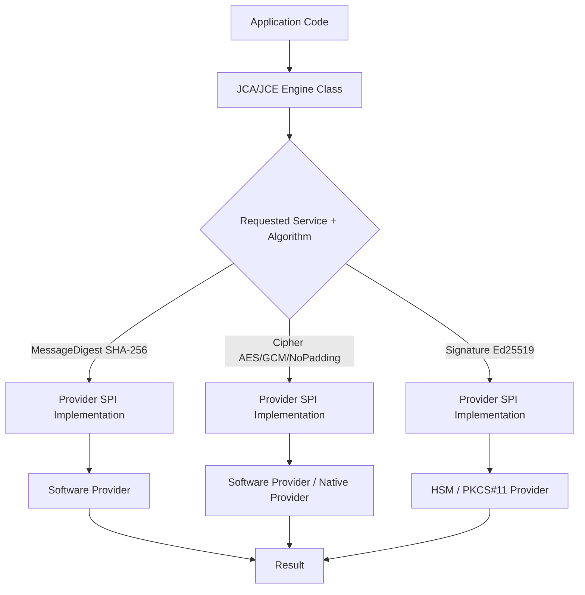
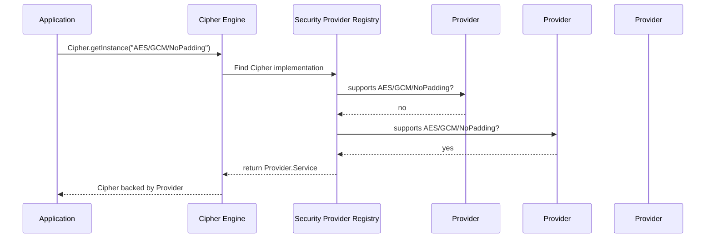
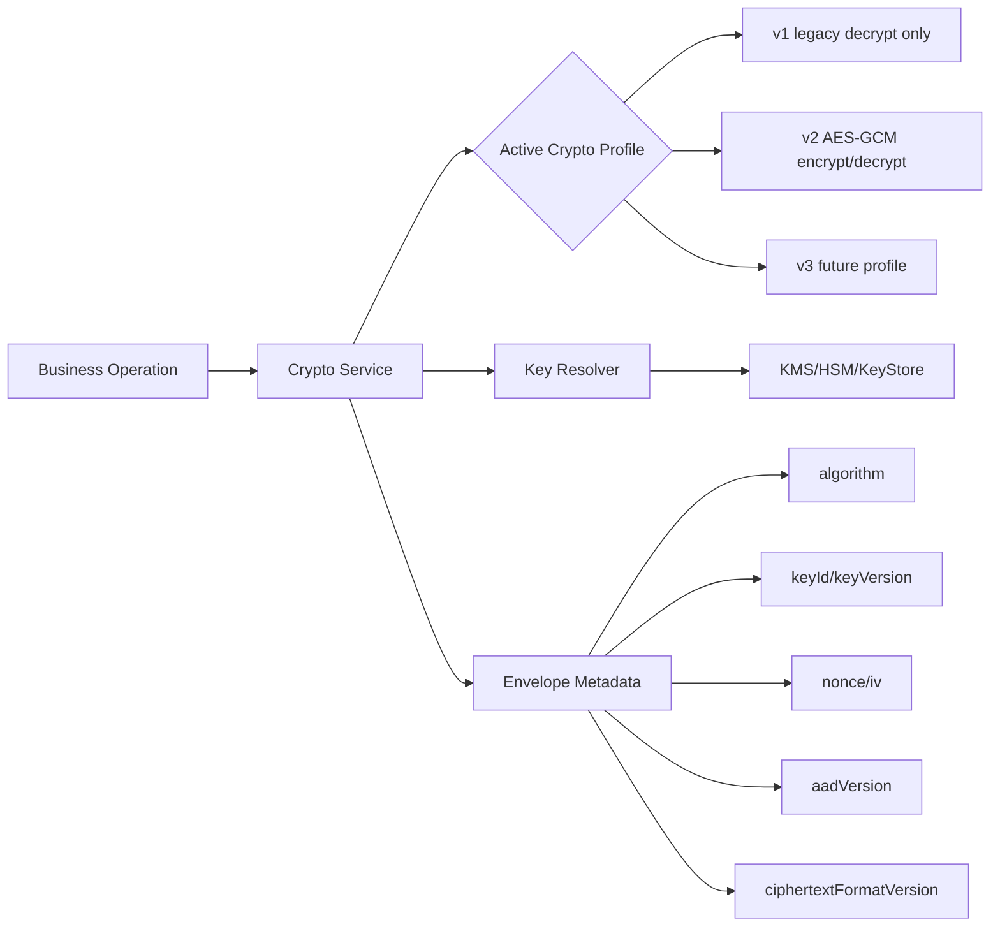
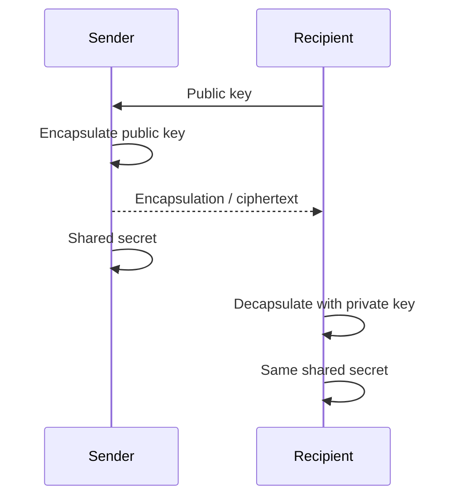
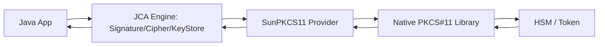

------
title: Learn Java Security, Cryptography and Integrity - Part 007
description: JCA/JCE provider model, crypto agility, provider resolution, algorithm naming, FIPS/HSM integration, and production-grade Java cryptographic design rules.
series: learn-java-security-cryptography-integrity
seriesTitle: Learn Java Security, Cryptography and Integrity
order: 7
partTitle: JCA/JCE Provider Model & Crypto Agility
tags:
  - java
  - security
  - cryptography
  - jca
  - jce
  - provider
  - crypto-agility
  - fips
  - hsm
  - pkcs11
  - secure-engineering
date: 2026-06-30
---

# Part 007 — JCA/JCE Provider Model & Crypto Agility

> Target bagian ini: memahami **bagaimana Java benar-benar mengeksekusi operasi cryptography** melalui JCA/JCE provider model, mampu memilih algoritma secara aman, menghindari crypto misuse, dan membangun desain yang **crypto-agile** sehingga algoritma, provider, key source, dan compliance mode dapat berubah tanpa rewrite besar.

Di banyak sistem enterprise, bug crypto tidak muncul sebagai syntax error. Bug crypto muncul sebagai:

- algoritma tampak kuat, tetapi mode/padding salah;
- provider yang dipakai berbeda antara laptop, CI, staging, production, dan FIPS environment;
- ciphertext tidak menyimpan metadata algoritma sehingga migrasi crypto mustahil;
- key rotation hanya dipikirkan setelah incident;
- library menerima default transformation seperti `AES` lalu runtime memilih mode yang tidak kita maksud;
- sistem tidak bisa menjawab pertanyaan sederhana: “data ini dienkripsi dengan key versi berapa, algoritma apa, provider apa, dan policy apa?”

Bagian ini bukan sekadar “cara pakai `Cipher`”. Kita akan membangun mental model yang bisa dipakai untuk review design, review code, forensic debugging, compliance review, dan incident response.

---

## 1. Kaufman Deconstruction: Skill yang Harus Dikuasai

Josh Kaufman menekankan bahwa belajar cepat dimulai dari **membongkar skill menjadi sub-skill kecil**. Untuk JCA/JCE, skill utamanya bukan menghafal class. Skill utamanya adalah mampu menjawab lima pertanyaan berikut sebelum menulis crypto code:

1. **Primitive apa yang dibutuhkan?**
   - hash, MAC, AEAD encryption, digital signature, key agreement, KDF, keystore, certificate validation, atau KEM.

2. **Security property apa yang harus dijamin?**
   - confidentiality, integrity, authenticity, replay resistance, non-repudiation, forward secrecy, misuse resistance, atau auditability.

3. **Provider mana yang menjalankan operasi?**
   - default JDK provider, Bouncy Castle, FIPS provider, HSM melalui PKCS#11, cloud KMS wrapper, atau provider custom.

4. **Metadata apa yang harus ikut disimpan?**
   - algorithm, mode, padding, key id, key version, nonce/IV, tag length, AAD version, provider/compliance profile, dan ciphertext format version.

5. **Bagaimana sistem akan berubah nanti?**
   - algorithm deprecation, provider migration, key rotation, FIPS requirement, PQC migration, interoperability, dan legacy data re-encryption.

Kalau engineer hanya tahu “panggil `Cipher.getInstance()`”, dia masih berada di level API usage. Top-tier engineer harus bisa mendesain **cryptographic subsystem** yang bisa berevolusi.

---

## 2. Mental Model: JCA/JCE Itu Service Registry + Stateful Engine

Java Cryptography Architecture/JCA menyediakan abstraksi umum untuk operasi crypto. Java Cryptography Extension/JCE historisnya mencakup encryption, key agreement, dan MAC; pada Java modern, keduanya dipakai sebagai satu ekosistem crypto API.

Model sederhananya:



Aplikasi tidak langsung memanggil implementasi algoritma. Aplikasi memanggil **engine class** seperti:

- `MessageDigest`
- `Mac`
- `Cipher`
- `Signature`
- `SecureRandom`
- `KeyGenerator`
- `KeyPairGenerator`
- `KeyFactory`
- `SecretKeyFactory`
- `KeyAgreement`
- `KEM`
- `KeyStore`
- `CertificateFactory`
- `CertPathValidator`

Engine class lalu mencari implementasi di provider yang terdaftar.

Konsekuensi penting:

- API yang sama bisa berjalan dengan implementasi berbeda.
- Hasil dan support algoritma bisa berbeda antar provider/JDK/distribution.
- Objek crypto sering **stateful** dan tidak boleh dianggap thread-safe.
- Pilihan algorithm string adalah bagian dari security design, bukan detail kecil.

---

## 3. Provider Model: Apa Itu Provider?

Provider adalah paket implementasi cryptographic services. Provider mendaftarkan daftar service yang didukung, misalnya:

- `Cipher.AES/GCM/NoPadding`
- `MessageDigest.SHA-256`
- `Mac.HmacSHA256`
- `Signature.SHA256withRSA`
- `Signature.Ed25519`
- `SecureRandom.DRBG`
- `KeyStore.PKCS12`
- `KeyStore.PKCS11`

Provider bisa berupa:

1. **JDK built-in provider**
   - Contoh: `SUN`, `SunJCE`, `SunJSSE`, `SunRsaSign`, `SunEC`, `SunPKCS11`, tergantung JDK dan konfigurasi.

2. **Third-party software provider**
   - Contoh umum: Bouncy Castle.

3. **FIPS validated/provider khusus compliance**
   - Dipakai ketika organisasi harus membatasi algoritma dan implementasi sesuai profil compliance tertentu.

4. **PKCS#11 bridge ke HSM/token**
   - Provider Java meneruskan operasi ke library native PKCS#11.

5. **Provider internal perusahaan**
   - Kadang dipakai untuk policy enforcement, wrapping, audit, atau integrasi service crypto internal.

Provider bukan hanya dependency. Provider adalah bagian dari **runtime trust boundary**.

---

## 4. Provider Resolution: Apa yang Terjadi Saat `getInstance()` Dipanggil?

Contoh:

```java
Cipher cipher = Cipher.getInstance("AES/GCM/NoPadding");
```

JCA akan mencari provider terdaftar yang mendukung service `Cipher` dengan transformation `AES/GCM/NoPadding`. Biasanya pencarian mengikuti urutan provider di security configuration.



Untuk melihat provider yang aktif:

```java
import java.security.Provider;
import java.security.Security;

public final class ProvidersDump {
    public static void main(String[] args) {
        for (Provider provider : Security.getProviders()) {
            System.out.println(provider.getName() + " - " + provider.getInfo());
        }
    }
}
```

Untuk melihat provider yang benar-benar dipakai:

```java
import javax.crypto.Cipher;

public final class ProviderUsed {
    public static void main(String[] args) throws Exception {
        Cipher cipher = Cipher.getInstance("AES/GCM/NoPadding");
        System.out.println(cipher.getProvider().getName());
    }
}
```

### Invariant

Production crypto code harus bisa menjawab:

- provider apa yang dipakai untuk operasi ini;
- apakah provider tersebut expected di environment ini;
- apakah algoritma yang diminta benar-benar tersedia;
- apakah fallback provider boleh terjadi atau harus dianggap error.

---

## 5. Jangan Salah Paham: Provider Pinning Tidak Selalu Baik

Ada dua ekstrem yang sama-sama buruk:

### Ekstrem 1 — Tidak peduli provider sama sekali

```java
Cipher cipher = Cipher.getInstance("AES/GCM/NoPadding");
```

Ini bisa baik untuk general-purpose app, tetapi berisiko kalau production butuh FIPS provider, HSM-backed signing, atau deterministic interoperability.

### Ekstrem 2 — Selalu hardcode provider

```java
Cipher cipher = Cipher.getInstance("AES/GCM/NoPadding", "SunJCE");
```

Ini juga berisiko karena:

- mengikat aplikasi ke provider tertentu;
- menyulitkan migrasi ke FIPS/HSM provider;
- dapat gagal di JDK/distribution berbeda;
- bisa menutup peluang provider yang lebih sesuai di runtime.

### Rule of thumb

| Kondisi | Strategi |
|---|---|
| Aplikasi umum, tidak ada compliance/provider requirement | Pakai standard algorithm names, jangan pin provider. Validasi dengan integration tests. |
| Sistem harus FIPS/compliance | Provider pinning atau provider policy enforcement boleh/wajib. Jadikan explicit configuration. |
| Signing key berada di HSM | Provider harus dikontrol, biasanya via `PKCS11`/HSM provider. |
| Library reusable | Jangan hardcode provider; expose provider/profile option. |
| Platform internal enterprise | Gunakan crypto profile terpusat, bukan ad-hoc provider call di semua service. |

Top-tier design bukan “pin provider atau tidak”. Top-tier design adalah membuat keputusan provider menjadi **explicit, testable, configurable, dan auditable**.

---

## 6. Engine Classes: Peta Operasi Crypto di Java

Berikut peta praktis JCA/JCE engine class.

| Engine Class | Kapan Dipakai | Security Property | Catatan Review |
|---|---|---|---|
| `MessageDigest` | Hash data | Integrity fingerprint, bukan authenticity | Jangan pakai MD5/SHA-1 untuk security. Hash tidak membuktikan siapa pembuat data. |
| `Mac` | HMAC/request signing | Integrity + authenticity dengan shared secret | Secret management dan canonicalization lebih penting daripada API call. |
| `Cipher` | Encryption/decryption | Confidentiality; AEAD memberi integrity/authenticity ciphertext | Hindari default transformation. Pakai AEAD untuk data baru. |
| `Signature` | Digital signature | Authenticity dengan private key; non-repudiation terbatas konteks | Signing harus atas canonical representation. |
| `SecureRandom` | Random bytes | Unpredictability | Jangan ganti dengan `Random`, `ThreadLocalRandom`, atau timestamp. |
| `KeyGenerator` | Generate symmetric key | Key material generation | Gunakan `SecureRandom` dan key size sesuai policy. |
| `KeyPairGenerator` | Generate asymmetric key pair | Identity/signing/key agreement | Parameter/key size harus eksplisit. |
| `KeyFactory` | Convert key spec/material | Interop key handling | Jangan log/serialize raw private key sembarangan. |
| `SecretKeyFactory` | KDF/password-based key derivation | Derive key from password/input secret | Untuk password storage, pilih password hashing; PBKDF2 bukan silver bullet. |
| `KeyAgreement` | ECDH/DH shared secret | Establish shared secret | Harus dipasangkan dengan KDF dan authentication. |
| `KEM` | Key encapsulation | Establish secret via public key encapsulation | Relevan untuk modern/hybrid crypto design. |
| `KeyStore` | Store keys/certs | Storage abstraction | Keystore password bukan otomatis HSM-level security. |
| `CertificateFactory` | Parse certificates | Certificate handling | Parsing bukan validation. |
| `CertPathValidator` | Validate certificate chain | Trust validation | Butuh trust anchors, constraints, revocation policy. |

---

## 7. Algorithm Name vs Transformation: Detail yang Sering Menjadi Vulnerability

Untuk beberapa engine class, Java meminta **algorithm name**. Untuk `Cipher`, Java meminta **transformation**.

Contoh algorithm name:

```java
MessageDigest.getInstance("SHA-256");
Mac.getInstance("HmacSHA256");
Signature.getInstance("Ed25519");
KeyPairGenerator.getInstance("RSA");
```

Contoh transformation:

```java
Cipher.getInstance("AES/GCM/NoPadding");
```

Format umum transformation:

```text
algorithm/mode/padding
```

Contoh:

```text
AES/GCM/NoPadding
AES/CBC/PKCS5Padding
RSA/ECB/OAEPWithSHA-256AndMGF1Padding
```

### Dangerous default

Jangan pakai:

```java
Cipher.getInstance("AES"); // buruk untuk code baru
```

Kenapa? Karena transformation tidak menyebut mode dan padding. Provider dapat memakai default tertentu, dan historically default seperti ECB adalah masalah besar.

### Invariant

Untuk encryption production code:

- transformation harus eksplisit;
- mode harus sesuai property yang dibutuhkan;
- padding harus sesuai primitive;
- IV/nonce harus benar;
- AAD harus digunakan bila ada metadata yang perlu diikat;
- ciphertext format harus menyimpan metadata yang cukup untuk decrypt/migrate.

---

## 8. Crypto Agility: Kemampuan Mengganti Crypto Tanpa Rewrite Sistem

Crypto agility adalah kemampuan sistem untuk mengganti algoritma, parameter, key, provider, atau compliance profile dengan risiko terkendali.

Crypto agility bukan berarti algoritma bisa diganti sembarang lewat config. Itu berbahaya.

Crypto agility berarti:

1. keputusan crypto terpusat;
2. algoritma dinyatakan sebagai profile/version;
3. ciphertext/signature/token membawa metadata versi;
4. decrypt/verify bisa membaca format lama;
5. encrypt/sign baru selalu memakai profile aktif;
6. migration plan jelas;
7. weak profile bisa dimatikan secara bertahap;
8. audit bisa melihat profile mana yang dipakai.



### Anti-pattern: crypto scattered across codebase

```java
// Service A
Cipher.getInstance("AES/GCM/NoPadding");

// Service B
Cipher.getInstance("AES/CBC/PKCS5Padding");

// Service C
Mac.getInstance("HmacSHA1");

// Service D
MessageDigest.getInstance("SHA-1");
```

Masalah:

- tidak ada inventory;
- tidak ada policy enforcement;
- migration mahal;
- review sulit;
- vulnerability triage lambat;
- compliance tidak defensible.

### Better pattern: crypto profile registry

```java
public enum CryptoProfileId {
    DATA_ENCRYPTION_V2,
    WEBHOOK_HMAC_V1,
    AUDIT_LOG_SIGNATURE_V1
}

public record CryptoProfile(
        CryptoProfileId id,
        String purpose,
        String algorithm,
        String transformation,
        int keySizeBits,
        int nonceSizeBytes,
        int tagSizeBits,
        boolean encryptAllowed,
        boolean decryptAllowed,
        String minimumProviderPolicy
) {}
```

Contoh registry sederhana:

```java
import java.util.Map;

public final class CryptoProfiles {
    private static final Map<CryptoProfileId, CryptoProfile> PROFILES = Map.of(
        CryptoProfileId.DATA_ENCRYPTION_V2,
        new CryptoProfile(
            CryptoProfileId.DATA_ENCRYPTION_V2,
            "Field-level AEAD encryption for sensitive application data",
            "AES",
            "AES/GCM/NoPadding",
            256,
            12,
            128,
            true,
            true,
            "DEFAULT_OR_FIPS_APPROVED"
        ),
        CryptoProfileId.WEBHOOK_HMAC_V1,
        new CryptoProfile(
            CryptoProfileId.WEBHOOK_HMAC_V1,
            "Webhook request authentication",
            "HmacSHA256",
            "",
            256,
            0,
            0,
            true,
            true,
            "DEFAULT_OR_FIPS_APPROVED"
        )
    );

    public static CryptoProfile get(CryptoProfileId id) {
        CryptoProfile profile = PROFILES.get(id);
        if (profile == null) {
            throw new IllegalArgumentException("Unknown crypto profile: " + id);
        }
        return profile;
    }

    private CryptoProfiles() {}
}
```

Ini bukan library final. Ini pattern berpikir: **jangan biarkan crypto decision tersebar sebagai string literal random**.

---

## 9. Envelope Metadata: Bedanya Crypto yang Bisa Dimigrasi dan yang Akan Menyakitkan

Ciphertext tanpa metadata adalah technical debt.

Contoh buruk:

```text
base64(ciphertext)
```

Masalah:

- tidak tahu algoritma;
- tidak tahu key id;
- tidak tahu nonce/IV;
- tidak tahu tag length;
- tidak tahu version;
- tidak tahu apakah ini AES-GCM, AES-CBC, atau format legacy;
- migration membutuhkan guesswork.

Contoh envelope yang lebih baik:

```json
{
  "version": 2,
  "profile": "DATA_ENCRYPTION_V2",
  "alg": "AES-256-GCM",
  "kid": "customer-data-key",
  "kver": "2026-06",
  "nonce": "base64url...",
  "aad": "base64url...",
  "ciphertext": "base64url...",
  "tagBits": 128
}
```

Untuk storage yang sensitif terhadap ukuran, metadata bisa dibuat compact/binary. Tapi prinsipnya tetap sama: ciphertext harus self-describing secukupnya untuk decrypt dan migrate secara aman.

### Invariant envelope

- `version` wajib.
- `profile` wajib.
- `kid`/`keyVersion` wajib bila key rotation mungkin terjadi. Hampir selalu mungkin.
- `nonce/iv` wajib bila primitive membutuhkannya.
- `tag length` harus fixed oleh profile atau tersimpan.
- AAD harus bisa direkonstruksi deterministik atau disimpan sebagai versi.
- Decrypt harus reject profile yang sudah disabled untuk decrypt.

---

## 10. MessageDigest: Hash Bukan Authentication

Hash sering disalahgunakan.

```java
import java.security.MessageDigest;
import java.util.HexFormat;

public final class Sha256Example {
    public static String sha256Hex(byte[] input) throws Exception {
        MessageDigest digest = MessageDigest.getInstance("SHA-256");
        byte[] hash = digest.digest(input);
        return HexFormat.of().formatHex(hash);
    }
}
```

Ini berguna untuk:

- content fingerprint;
- deduplication;
- non-secret integrity check terhadap accidental corruption;
- checksum kuat untuk artifact identification.

Ini tidak cukup untuk:

- membuktikan request berasal dari partner;
- menyimpan password;
- mencegah attacker mengganti payload dan hash sekaligus;
- menandatangani audit event.

### Review rule

Kalau melihat code seperti:

```java
String expected = sha256(payload);
```

Tanyakan:

1. siapa yang bisa menghitung hash ini?
2. apakah attacker bisa mengganti payload dan hash sekaligus?
3. apakah butuh secret key? Kalau iya, gunakan MAC.
4. apakah butuh private-key authenticity? Kalau iya, gunakan signature.
5. apakah hash dipakai untuk password? Kalau iya, gunakan password hashing/KDF yang sesuai.

---

## 11. Mac: Integrity + Authenticity dengan Shared Secret

MAC, khususnya HMAC, membuktikan bahwa pihak yang membuat tag memiliki shared secret.

```java
import javax.crypto.Mac;
import javax.crypto.spec.SecretKeySpec;
import java.nio.charset.StandardCharsets;
import java.util.HexFormat;

public final class HmacExample {
    public static String hmacSha256Hex(byte[] key, String message) throws Exception {
        Mac mac = Mac.getInstance("HmacSHA256");
        mac.init(new SecretKeySpec(key, "HmacSHA256"));
        byte[] tag = mac.doFinal(message.getBytes(StandardCharsets.UTF_8));
        return HexFormat.of().formatHex(tag);
    }
}
```

Tetapi MAC aman hanya jika tiga hal benar:

1. secret key kuat dan disimpan aman;
2. data yang ditandatangani memiliki canonical representation;
3. verifikasi memakai constant-time comparison.

### Constant-time comparison

Jangan pakai:

```java
if (provided.equals(expected)) {
    // accept
}
```

Gunakan:

```java
import java.security.MessageDigest;

boolean ok = MessageDigest.isEqual(providedTagBytes, expectedTagBytes);
```

`MessageDigest.isEqual` membantu menghindari timing leak sederhana dalam perbandingan byte array. Ini bukan magic yang menyelesaikan semua side-channel, tetapi jauh lebih baik daripada early-exit comparison.

---

## 12. Cipher: Encryption API yang Paling Sering Disalahgunakan

Contoh minimal AES-GCM encryption:

```java
import javax.crypto.Cipher;
import javax.crypto.KeyGenerator;
import javax.crypto.SecretKey;
import javax.crypto.spec.GCMParameterSpec;
import java.security.SecureRandom;

public final class AesGcmMinimal {
    private static final int KEY_BITS = 256;
    private static final int NONCE_BYTES = 12;
    private static final int TAG_BITS = 128;

    public static SecretKey generateKey() throws Exception {
        KeyGenerator keyGenerator = KeyGenerator.getInstance("AES");
        keyGenerator.init(KEY_BITS, SecureRandom.getInstanceStrong());
        return keyGenerator.generateKey();
    }

    public static byte[] encrypt(SecretKey key, byte[] plaintext, byte[] aad) throws Exception {
        byte[] nonce = new byte[NONCE_BYTES];
        SecureRandom random = SecureRandom.getInstanceStrong();
        random.nextBytes(nonce);

        Cipher cipher = Cipher.getInstance("AES/GCM/NoPadding");
        cipher.init(Cipher.ENCRYPT_MODE, key, new GCMParameterSpec(TAG_BITS, nonce));
        if (aad != null) {
            cipher.updateAAD(aad);
        }
        byte[] ciphertextAndTag = cipher.doFinal(plaintext);

        // Production code must return/store nonce + ciphertextAndTag + metadata envelope.
        return combine(nonce, ciphertextAndTag);
    }

    private static byte[] combine(byte[] a, byte[] b) {
        byte[] out = new byte[a.length + b.length];
        System.arraycopy(a, 0, out, 0, a.length);
        System.arraycopy(b, 0, out, a.length, b.length);
        return out;
    }
}
```

Catatan penting: contoh ini sengaja minimal. Production implementation harus punya envelope metadata, key resolver, profile registry, error taxonomy, dan test vector.

### AES-GCM invariants

- Nonce/IV harus unik per key.
- 96-bit/12-byte nonce adalah pilihan umum untuk GCM.
- Tag length umum 128-bit.
- AAD harus sama saat encrypt dan decrypt.
- Jangan reuse key+nonce.
- Jangan decrypt partial plaintext sebelum authentication berhasil.
- Jangan downgrade ke CBC tanpa kebutuhan legacy yang jelas.

### Bad smell dalam review

```java
Cipher.getInstance("AES");
Cipher.getInstance("AES/ECB/PKCS5Padding");
Cipher.getInstance("DESede");
Cipher.getInstance("RC4");
Cipher.getInstance("RSA");
```

Tidak semua string di atas selalu berarti exploit langsung dalam semua konteks, tetapi semuanya harus memicu review serius.

---

## 13. Signature: Authenticity Berbasis Private Key

Digital signature cocok ketika verifier tidak boleh punya secret signing key.

Contoh Ed25519:

```java
import java.security.KeyPair;
import java.security.KeyPairGenerator;
import java.security.Signature;

public final class Ed25519Example {
    public static KeyPair generate() throws Exception {
        KeyPairGenerator generator = KeyPairGenerator.getInstance("Ed25519");
        return generator.generateKeyPair();
    }

    public static byte[] sign(byte[] data, KeyPair keyPair) throws Exception {
        Signature signature = Signature.getInstance("Ed25519");
        signature.initSign(keyPair.getPrivate());
        signature.update(data);
        return signature.sign();
    }

    public static boolean verify(byte[] data, byte[] sig, KeyPair keyPair) throws Exception {
        Signature signature = Signature.getInstance("Ed25519");
        signature.initVerify(keyPair.getPublic());
        signature.update(data);
        return signature.verify(sig);
    }
}
```

### Signature design questions

Sebelum memilih `Signature`, jawab:

- siapa signer?
- bagaimana public key didistribusikan?
- bagaimana key rotation dilakukan?
- apakah verifier harus offline?
- apakah signature perlu timestamp?
- apakah canonicalization deterministic?
- apakah signature melindungi metadata penting?
- apakah perlu certificate chain atau raw public key cukup?

Signature gagal bukan hanya karena algoritma. Signature sering gagal karena data yang diverifikasi tidak sama secara semantik dengan data yang ditandatangani.

---

## 14. KeyGenerator, KeyPairGenerator, KeyFactory, SecretKeyFactory

### Symmetric key generation

```java
import javax.crypto.KeyGenerator;
import javax.crypto.SecretKey;
import java.security.SecureRandom;

public final class AesKeyGen {
    public static SecretKey aes256() throws Exception {
        KeyGenerator generator = KeyGenerator.getInstance("AES");
        generator.init(256, SecureRandom.getInstanceStrong());
        return generator.generateKey();
    }
}
```

Untuk production, key sering tidak dibuat oleh aplikasi langsung, tetapi oleh KMS/HSM. Aplikasi menerima key handle, wrapped key, data key, atau melakukan operasi crypto melalui remote/local cryptographic module.

### Asymmetric key generation

```java
import java.security.KeyPair;
import java.security.KeyPairGenerator;
import java.security.spec.NamedParameterSpec;

public final class EcKeyGen {
    public static KeyPair x25519() throws Exception {
        KeyPairGenerator generator = KeyPairGenerator.getInstance("X25519");
        generator.initialize(new NamedParameterSpec("X25519"));
        return generator.generateKeyPair();
    }
}
```

### KeyFactory

`KeyFactory` mengubah key spec menjadi key object dan sebaliknya. Ini sering dipakai untuk import/export public key, private key, atau interoperability dengan PEM/DER.

Security review:

- private key raw material tidak boleh masuk log;
- private key export harus policy-controlled;
- file permission dan secret scanning harus diterapkan;
- public key import tetap perlu trust validation;
- key type/curve/size harus divalidasi, bukan dipercaya dari input.

### SecretKeyFactory

`SecretKeyFactory` sering dipakai untuk password-based key derivation seperti PBKDF2.

Catatan penting:

- password storage bukan sekadar `PBKDF2WithHmacSHA256` lalu selesai;
- password hashing memerlukan parameter yang dapat dinaikkan, salt unik, dan idealnya algoritma memory-hard seperti Argon2/bcrypt/scrypt bila tersedia dan sesuai platform;
- PBKDF2 masih sering tersedia di JDK standard, tetapi harus dievaluasi terhadap threat model modern.

Detail password storage akan dibahas di Part 009.

---

## 15. KEM: Key Encapsulation Mechanism dalam Mental Model Modern

KEM adalah primitive untuk membuat shared secret dengan public key penerima.

Mental model:



KEM menjadi penting untuk:

- hybrid encryption;
- TLS/internal protocol evolution;
- post-quantum migration;
- envelope encryption pattern;
- menghindari desain ad-hoc RSA encryption.

Prinsip design:

- KEM hanya menghasilkan shared secret; biasanya masih perlu KDF dan AEAD;
- public key harus trustworthy;
- encapsulation output harus disimpan/dikirim bersama envelope;
- algorithm agility sangat penting karena PQC ecosystem berkembang.

Detail asymmetric crypto dan PQC akan dibahas di Part 011 dan Part 032.

---

## 16. KeyStore: Repository Bukan Jaminan Keamanan Sempurna

Java `KeyStore` menyediakan abstraction untuk menyimpan key dan certificate.

Jenis umum:

- `PKCS12`
- `JKS` legacy
- `PKCS11` untuk token/HSM via provider

Contoh load PKCS12:

```java
import java.io.InputStream;
import java.nio.file.Files;
import java.nio.file.Path;
import java.security.KeyStore;

public final class KeyStoreLoad {
    public static KeyStore loadPkcs12(Path path, char[] password) throws Exception {
        KeyStore keyStore = KeyStore.getInstance("PKCS12");
        try (InputStream in = Files.newInputStream(path)) {
            keyStore.load(in, password);
        }
        return keyStore;
    }
}
```

### Keystore review questions

- Di mana file keystore berada?
- Bagaimana password keystore disediakan?
- Apakah password hanya environment variable?
- Siapa yang bisa membaca keystore di container/host?
- Apakah keystore dibundel ke image?
- Bagaimana rotation dilakukan?
- Apakah private key bisa diexport?
- Apakah production memakai keystore file atau HSM/KMS?
- Apakah certificate chain divalidasi?

Keystore adalah storage abstraction. Ia tidak otomatis menyelesaikan key management.

---

## 17. PKCS#11 dan HSM: Ketika Key Tidak Boleh Keluar

Dalam desain high-assurance, private key sering tidak boleh pernah keluar dari cryptographic module. Aplikasi mengirim data/hash untuk ditandatangani; HSM melakukan signing internal.

Dengan `SunPKCS11`, Java bisa menggunakan native PKCS#11 module sebagai provider. Modelnya:



### Benefit

- private key tidak diexport;
- akses bisa dikontrol di hardware/module;
- audit HSM bisa mendukung compliance;
- key lifecycle lebih terpusat.

### Trade-off

- latency lebih tinggi;
- concurrency terbatas slot/session;
- operational complexity tinggi;
- local dev/CI sulit;
- provider behavior bisa berbeda;
- error message sering rendah kualitas;
- backup/restore key harus dipikirkan sejak awal.

### Design rule

Jangan desain abstraction seolah HSM sama seperti byte array secret key. HSM-backed crypto memiliki failure mode dan performance model berbeda.

---

## 18. FIPS Mode: Compliance Profile Bukan Sekadar “Algoritma Kuat”

FIPS requirement biasanya bukan hanya “pakai AES”. Yang penting adalah:

- implementasi cryptographic module;
- mode operasi;
- approved algorithms;
- key generation;
- provider/module configuration;
- runtime environment;
- audit evidence;
- operational process.

Anti-pattern:

```java
// "Aman karena AES"
Cipher.getInstance("AES/GCM/NoPadding");
```

Untuk FIPS environment, pertanyaan yang benar:

- provider apa yang menyediakan AES-GCM?
- apakah provider/module tervalidasi untuk use case ini?
- apakah key generation juga dari approved source?
- apakah fallback non-FIPS provider dimatikan?
- apakah test membuktikan provider yang dipakai benar?
- apakah exception handling tidak fallback diam-diam?

Crypto agility harus memasukkan compliance profile:

```java
public enum ComplianceMode {
    STANDARD,
    FIPS_REQUIRED
}
```

Lalu factory harus menolak operasi yang tidak sesuai:

```java
public interface CryptoPolicy {
    void assertAllowed(CryptoProfile profile, String providerName);
}
```

---

## 19. Thread Safety dan Lifecycle Engine Object

Banyak JCA/JCE object stateful:

- `Cipher` punya mode, key, IV, AAD, buffer internal;
- `Mac` punya key dan state update;
- `Signature` punya state update/sign/verify;
- `MessageDigest` punya state digest;
- `SecureRandom` behavior tergantung implementation.

Rule aman:

- jangan share `Cipher`, `Mac`, atau `Signature` antar thread;
- buat instance per operation atau gunakan pool dengan disiplin reset/init yang ketat;
- jangan simpan object stateful dalam singleton service tanpa guard;
- jangan reuse `Cipher` encryption mode untuk banyak message dengan nonce yang salah;
- selalu treat engine object sebagai mutable state machine.

Contoh buruk:

```java
public final class BadCryptoService {
    private final Cipher cipher; // shared mutable state: dangerous

    public BadCryptoService(Cipher cipher) {
        this.cipher = cipher;
    }
}
```

Contoh lebih baik:

```java
public final class CipherFactory {
    private final String transformation;

    public CipherFactory(String transformation) {
        this.transformation = transformation;
    }

    public Cipher newCipher() throws Exception {
        return Cipher.getInstance(transformation);
    }
}
```

---

## 20. Error Handling: Crypto Error Tidak Boleh Jadi Oracle

Crypto exception sering informatif bagi engineer, tetapi berbahaya jika bocor ke attacker.

Contoh exception:

- `BadPaddingException`
- `AEADBadTagException`
- `InvalidKeyException`
- `InvalidAlgorithmParameterException`
- `NoSuchAlgorithmException`
- `NoSuchPaddingException`
- `SignatureException`
- `KeyStoreException`

### Rule external response

Untuk user/attacker:

```text
Invalid request.
```

atau:

```text
Authentication failed.
```

Jangan bocorkan:

```text
GCM tag mismatch for key version customer-key-2026-06
```

### Rule internal logging

Untuk internal log:

- log correlation id;
- log operation purpose;
- log crypto profile id;
- log key id hanya jika tidak sensitif menurut policy;
- jangan log plaintext;
- jangan log raw key;
- jangan log full ciphertext jika bisa menjadi sensitive data;
- bedakan operational misconfiguration vs attacker-controlled failure.

Contoh taxonomy:

| Error | Kemungkinan Penyebab | External Response | Internal Action |
|---|---|---|---|
| `NoSuchAlgorithmException` | Provider/config salah | 500 generic | alert deployment/config |
| `InvalidKeyException` | Key corrupt/wrong provider | 500 generic | alert key management |
| `AEADBadTagException` | Tampering/wrong key/wrong AAD | 400/401 generic | security metric |
| `SignatureException` verify false | Invalid signature | 401/403 generic | security metric |
| Keystore load failed | secret/config/runtime issue | 503/500 generic | alert ops |

---

## 21. Algorithm Deprecation dan Denylist

Aplikasi mature harus punya policy untuk menolak algoritma lemah.

Minimal denylist untuk code baru:

- MD5 untuk security;
- SHA-1 untuk signature/security integrity baru;
- DES;
- 3DES untuk desain baru;
- RC4;
- ECB mode;
- RSA PKCS#1 v1.5 encryption untuk desain baru;
- raw RSA encryption;
- custom crypto;
- hardcoded keys;
- static IV/nonce;
- unauthenticated encryption untuk sensitive data baru.

Contoh guard sederhana:

```java
import java.util.Set;

public final class AlgorithmPolicy {
    private static final Set<String> DENIED = Set.of(
        "MD5",
        "SHA-1",
        "DES",
        "DESede",
        "RC4",
        "AES/ECB/PKCS5Padding",
        "AES/ECB/NoPadding"
    );

    public static void assertAllowed(String algorithmOrTransformation) {
        if (DENIED.contains(algorithmOrTransformation)) {
            throw new IllegalArgumentException("Denied cryptographic algorithm/profile");
        }
    }
}
```

Production policy harus lebih canggih: support purpose, legacy decrypt-only, compliance mode, expiry date, owner, migration ticket, dan exception process.

---

## 22. Crypto Wrapper yang Baik: Sedikit API, Banyak Invariant

Crypto wrapper bukan untuk “menyembunyikan crypto agar mudah”. Crypto wrapper dibuat untuk mengunci invariant.

Contoh API yang lebih baik:

```java
public interface DataEncryptionService {
    EncryptedValue encrypt(String purpose, byte[] plaintext, byte[] aad);
    byte[] decrypt(EncryptedValue encryptedValue, byte[] aad);
}

public record EncryptedValue(
        int version,
        String profile,
        String keyId,
        String keyVersion,
        byte[] nonce,
        byte[] ciphertextAndTag
) {}
```

Yang tidak diexpose ke caller:

- caller tidak memilih `Cipher.getInstance`;
- caller tidak memilih IV length;
- caller tidak memilih tag length;
- caller tidak bisa downgrade algorithm;
- caller tidak mengirim raw key;
- caller tidak mengatur provider sembarangan.

Yang diexpose:

- purpose;
- plaintext;
- AAD;
- hasil envelope;
- decrypt berdasarkan envelope.

Ini membuat crypto misuse lebih sulit.

---

## 23. Testing Provider dan Crypto Agility

Security testing untuk JCA/JCE bukan hanya unit test happy path.

### 23.1 Provider availability test

```java
import javax.crypto.Cipher;
import org.junit.jupiter.api.Test;

import static org.junit.jupiter.api.Assertions.assertDoesNotThrow;

class CryptoProviderTest {
    @Test
    void aesGcmIsAvailable() {
        assertDoesNotThrow(() -> Cipher.getInstance("AES/GCM/NoPadding"));
    }
}
```

### 23.2 Provider expectation test

```java
import javax.crypto.Cipher;
import org.junit.jupiter.api.Test;

import static org.junit.jupiter.api.Assertions.assertEquals;

class CryptoProviderExpectationTest {
    @Test
    void expectedProviderIsUsedInThisEnvironment() throws Exception {
        Cipher cipher = Cipher.getInstance("AES/GCM/NoPadding");
        String provider = cipher.getProvider().getName();

        // Example only. In real code, expected provider comes from environment profile.
        assertEquals("SunJCE", provider);
    }
}
```

Jangan copy test ini mentah-mentah kalau deployment Anda tidak boleh pin provider. Intinya: environment yang membutuhkan provider tertentu harus membuktikannya.

### 23.3 Round-trip test dengan envelope

```java
class DataEncryptionServiceTest {
    @Test
    void encryptedValueCanBeDecryptedWithSameAad() {
        // encrypt -> decrypt -> equals
    }

    @Test
    void decryptRejectsDifferentAad() {
        // encrypt with aad A, decrypt with aad B -> fail
    }

    @Test
    void decryptRejectsTamperedCiphertext() {
        // flip one bit -> fail
    }

    @Test
    void decryptRejectsTamperedNonce() {
        // flip nonce -> fail
    }

    @Test
    void decryptRejectsDisabledProfile() {
        // profile policy denies decrypt -> fail
    }
}
```

### 23.4 Known-answer tests

Untuk interoperability, gunakan test vector/known-answer tests:

- input key;
- nonce/IV;
- AAD;
- plaintext;
- expected ciphertext/tag;
- expected signature;
- expected MAC.

Ini penting jika beberapa bahasa/platform harus saling decrypt/verify.

---

## 24. Review Checklist: JCA/JCE Provider Model

Gunakan checklist ini saat code review.

### Algorithm dan primitive

- [ ] Primitive sesuai security property?
- [ ] Tidak memakai custom crypto?
- [ ] Tidak memakai algorithm/mode/padding lemah untuk desain baru?
- [ ] `Cipher` transformation eksplisit?
- [ ] Hash tidak disalahgunakan sebagai authentication?
- [ ] Encryption menggunakan AEAD untuk data sensitif baru?

### Provider dan runtime

- [ ] Provider behavior dipahami?
- [ ] Provider requirement explicit?
- [ ] Tidak ada fallback provider diam-diam di compliance environment?
- [ ] FIPS/HSM requirement diuji di integration environment?
- [ ] Provider version dan JDK version tercatat dalam build/runtime evidence?

### Key dan metadata

- [ ] Key tidak hardcoded?
- [ ] Key id/version disimpan?
- [ ] Envelope menyimpan version/profile?
- [ ] Key rotation didukung?
- [ ] Legacy decrypt-only profile jelas?

### API lifecycle

- [ ] `Cipher`/`Mac`/`Signature` tidak dishare antar thread?
- [ ] Object di-init ulang per operation?
- [ ] Error tidak bocor ke attacker?
- [ ] Log tidak mengandung key/plaintext/sensitive ciphertext?

### Testing

- [ ] Ada round-trip test?
- [ ] Ada tamper test?
- [ ] Ada wrong AAD test?
- [ ] Ada provider availability test?
- [ ] Ada known-answer test untuk interop?
- [ ] Ada test untuk disabled legacy algorithm?

---

## 25. Common Failure Modes

| Failure Mode | Penyebab | Dampak | Pencegahan |
|---|---|---|---|
| Default `Cipher.getInstance("AES")` | Tidak eksplisit mode/padding | Provider default insecure/ambigu | Wajib transformation eksplisit |
| Provider drift | Runtime provider berbeda | Behavior/compliance berubah | Provider tests dan runtime diagnostics |
| No metadata ciphertext | Format terlalu sederhana | Migration/decrypt sulit | Envelope version/profile/kid |
| Reused GCM nonce | RNG/counter salah | Catastrophic confidentiality/integrity failure | Nonce strategy dan tests |
| Shared `Cipher` singleton | Stateful object dishare | Race/corruption/security bug | Instance per operation |
| Hash for auth | Salah paham hash | Attacker bisa forge | Gunakan HMAC/signature |
| Key in config file | Convenience | Secret leakage | KMS/HSM/Vault/secret manager |
| Silent fallback | Provider unavailable | Compliance bypass | Fail closed |
| Over-configurable crypto | Caller bisa pilih algorithm | Downgrade | Crypto profile registry |
| No migration plan | Semua data encrypted satu format | Algorithm/key deprecation mahal | Crypto agility sejak awal |

---

## 26. Mini Lab: Bangun Crypto Profile Inspector

Tujuan lab: membuat util kecil yang mencetak provider dan algorithm support di environment.

```java
import java.security.Provider;
import java.security.Security;
import java.util.Comparator;

public final class CryptoInspector {
    public static void main(String[] args) {
        for (Provider provider : Security.getProviders()) {
            System.out.println("Provider: " + provider.getName());
            provider.getServices().stream()
                    .filter(s -> s.getType().equals("Cipher")
                            || s.getType().equals("Mac")
                            || s.getType().equals("Signature")
                            || s.getType().equals("MessageDigest")
                            || s.getType().equals("SecureRandom"))
                    .sorted(Comparator.comparing(Provider.Service::getType)
                            .thenComparing(Provider.Service::getAlgorithm))
                    .forEach(s -> System.out.printf("  %-16s %s%n", s.getType(), s.getAlgorithm()));
        }
    }
}
```

Pertanyaan review:

1. Algoritma apa yang tersedia di local tetapi tidak di CI?
2. Provider apa yang berbeda antara container image dan host developer?
3. Apakah production punya provider tambahan?
4. Apakah ada algorithm lemah yang tetap tersedia tetapi harus ditolak oleh policy app?
5. Bagaimana aplikasi membuktikan provider yang dipakai untuk operation tertentu?

---

## 27. Mini Lab: Envelope Design Review

Desain envelope untuk field-level encryption berikut:

```json
{
  "version": 1,
  "ciphertext": "..."
}
```

Review:

- tidak ada profile;
- tidak ada key id;
- tidak ada nonce;
- tidak ada tag length;
- tidak jelas apakah ciphertext sudah include tag;
- tidak ada AAD version;
- tidak ada migration path.

Perbaiki menjadi:

```json
{
  "version": 2,
  "profile": "DATA_ENCRYPTION_V2",
  "kid": "pii-field-key",
  "kver": "2026-06",
  "nonce": "base64url...",
  "ciphertext": "base64url...",
  "tagBits": 128,
  "aadVersion": 1
}
```

AAD bisa berupa canonical bytes dari:

```text
tenantId | entityType | entityId | fieldName | schemaVersion
```

Dengan AAD, ciphertext untuk `customer.email` tidak bisa dipindahkan diam-diam menjadi `customer.taxId` tanpa gagal decrypt.

---

## 28. Deliberate Practice

### Latihan 1 — Crypto string audit

Cari semua pemanggilan berikut di codebase:

```text
getInstance(
MessageDigest
Mac
Cipher
Signature
KeyGenerator
KeyPairGenerator
SecretKeyFactory
SecureRandom
KeyStore
```

Buat inventory:

| Location | Engine | Algorithm/Transformation | Purpose | Provider | Key Source | Risk | Action |
|---|---|---|---|---|---|---|---|

### Latihan 2 — Provider drift test

Jalankan `CryptoInspector` di:

- laptop;
- CI;
- container image;
- staging;
- production-like runtime.

Bandingkan hasilnya.

### Latihan 3 — Crypto profile design

Buat tiga profile:

1. field-level encryption;
2. webhook signing;
3. audit log signing.

Untuk masing-masing, tentukan:

- algorithm;
- key type;
- key source;
- metadata;
- rotation plan;
- allowed operation;
- legacy migration rule;
- test vector requirement.

### Latihan 4 — Misuse test

Tulis test yang memastikan decrypt gagal ketika:

- ciphertext diubah;
- nonce diubah;
- AAD diubah;
- profile disabled;
- key version tidak ditemukan;
- algorithm string tidak sesuai policy.

---

## 29. Ringkasan

JCA/JCE bukan sekadar kumpulan class crypto. Ia adalah framework provider-based yang memisahkan API dari implementasi. Ini memberi fleksibilitas besar, tetapi juga membuka risiko provider drift, default ambiguity, dan compliance bypass jika tidak dikelola.

Prinsip utama:

1. gunakan primitive sesuai security property;
2. jangan pakai default transformation;
3. buat crypto decision menjadi profile/version;
4. simpan metadata cukup dalam envelope;
5. kendalikan provider sesuai environment;
6. treat crypto engine object sebagai stateful;
7. fail closed ketika provider/policy tidak sesuai;
8. test tampering, wrong AAD, provider expectation, dan migration;
9. jangan sebar string algorithm di seluruh codebase;
10. desain crypto untuk bisa diganti sebelum dipaksa incident.

Di part berikutnya kita akan memperdalam fondasi yang sering diremehkan: randomness, entropy, `SecureRandom`, nonce, IV, token generation, dan failure mode ketika random source salah.

---

## Referensi Utama

- Oracle Java Cryptography Architecture Reference Guide, Java SE 25.
- Oracle Java Security Standard Algorithm Names.
- Oracle Java Security Overview.
- Oracle PKCS#11 Reference Guide.
- OWASP Cryptographic Storage Cheat Sheet.
- OWASP Key Management Cheat Sheet.
- NIST SP 800-57, Recommendation for Key Management.
- NIST SP 800-90A, Recommendation for Random Number Generation Using Deterministic Random Bit Generators.
