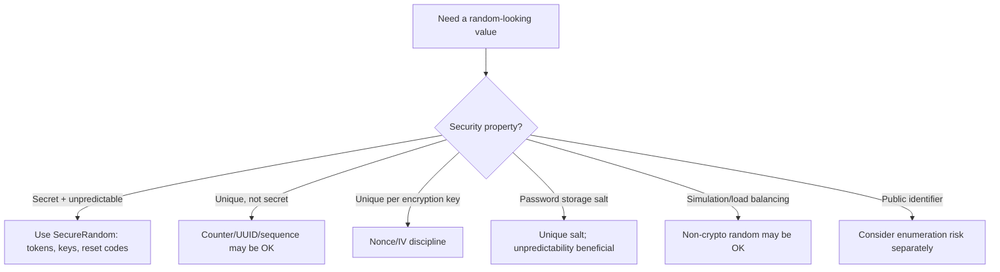
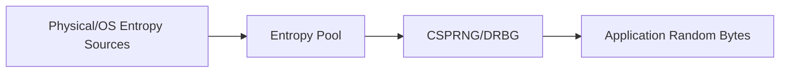
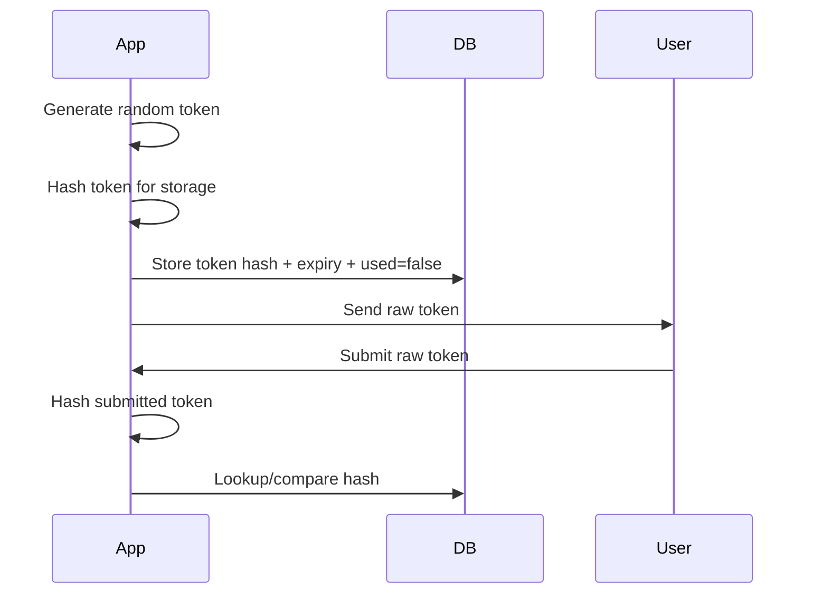
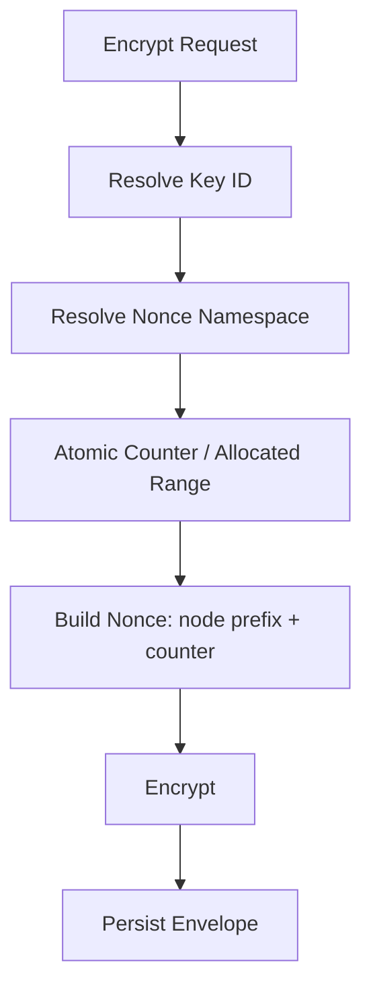
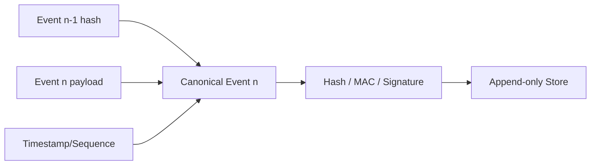

------
title: Learn Java Security, Cryptography and Integrity - Part 008
description: Randomness, entropy, SecureRandom, DRBG, nonce/IV generation, token generation, collision risk, and production failure modes in Java cryptographic systems.
series: learn-java-security-cryptography-integrity
seriesTitle: Learn Java Security, Cryptography and Integrity
order: 8
partTitle: Randomness, Entropy & SecureRandom
tags:
  - java
  - security
  - cryptography
  - randomness
  - entropy
  - securerandom
  - nonce
  - iv
  - token
  - drbg
  - secure-engineering
date: 2026-06-30
---

# Part 008 — Randomness, Entropy & SecureRandom

> Target bagian ini: mampu membedakan **randomness, uniqueness, unpredictability, entropy, nonce, IV, salt, token, key material**, lalu menggunakan `SecureRandom` secara benar di Java untuk crypto, authentication, integrity, dan distributed systems.

Randomness adalah fondasi banyak mekanisme security. Tetapi kata “random” sering membuat engineer salah fokus.

Dalam security, kita tidak sekadar butuh angka yang “kelihatan acak”. Kita butuh nilai yang sesuai dengan property tertentu:

- **unpredictable**: attacker tidak bisa menebak sebelum nilai dipakai;
- **unique**: nilai tidak berulang dalam scope tertentu;
- **uniform**: distribusi tidak bias untuk ruang nilai tertentu;
- **secret**: nilai tidak boleh diketahui pihak lain;
- **non-secret but unique**: nilai boleh publik tetapi tidak boleh reuse;
- **high entropy**: ruang kemungkinan cukup besar dan tidak mudah ditebak.

Bug randomness sering fatal karena sistem tetap berjalan normal. Token tetap dibuat. IV tetap ada. Signature tetap valid. Tetapi attacker bisa menebak, mereplay, atau mengeksploitasi collision.

---

## 1. Kaufman Deconstruction: Sub-skill Randomness

Untuk menguasai randomness di Java security, pecah menjadi sub-skill berikut:

1. **Terminologi security**
   - entropy, CSPRNG, PRNG, DRBG, seed, nonce, IV, salt, token, key.

2. **API selection**
   - kapan memakai `SecureRandom`, kapan tidak boleh memakai `Random`, `ThreadLocalRandom`, `SplittableRandom`, atau timestamp.

3. **Scope uniqueness**
   - unique per key, per tenant, per object, per request, per process, atau global.

4. **Collision reasoning**
   - memahami birthday bound dan token length.

5. **Nonce discipline**
   - terutama untuk AEAD seperti AES-GCM.

6. **Operational failure mode**
   - VM snapshot, container cloning, low entropy boot, blocking random, provider drift, bad seeding, logging secret random values.

7. **Testing dan review**
   - bukan “test random terlihat acak”, tetapi test invariant: length, uniqueness strategy, source API, encoding, rejection, dan no deterministic seed.

---

## 2. Mental Model: Randomness Bukan Satu Hal



Pertanyaan pertama bukan “pakai random apa?”. Pertanyaan pertama adalah:

> Nilai ini harus tidak bisa ditebak, tidak boleh berulang, atau keduanya?

Contoh:

| Use Case | Butuh Unpredictable? | Butuh Unique? | Secret? | Contoh |
|---|---:|---:|---:|---|
| AES key | Ya | Praktis ya | Ya | 256-bit key |
| Session token | Ya | Ya | Ya | 128-256 bit random token |
| CSRF token | Ya | Ya per session/request | Ya | 128+ bit token |
| Password reset token | Ya | Ya | Ya | short-lived 192+ bit token |
| AES-GCM nonce | Tidak harus secret | Wajib unique per key | Tidak | 96-bit nonce |
| Password salt | Tidak harus secret | Wajib unique per password | Tidak | 128-bit salt |
| Database id | Tergantung | Ya | Biasanya tidak | sequence/UUID/ULID |
| Correlation id | Tidak | Ya praktis | Tidak | UUID random/structured |
| Lottery/game fairness | Ya, domain-specific | Tergantung | Tergantung | CSPRNG/verifiable RNG |
| Load balancing | Tidak | Tidak | Tidak | `ThreadLocalRandom` OK |

---

## 3. Java Random APIs: Mana yang Boleh untuk Security?

Java punya beberapa API yang menghasilkan nilai pseudo-random:

| API | Cocok untuk Security? | Catatan |
|---|---:|---|
| `java.security.SecureRandom` | Ya | Gunakan untuk token, key, nonce random, salt, secret material. |
| `java.util.Random` | Tidak | Predictable untuk attacker yang bisa observe state/output. |
| `java.util.concurrent.ThreadLocalRandom` | Tidak | Bagus untuk concurrency/performance non-security, bukan crypto. |
| `java.util.SplittableRandom` | Tidak | Bagus untuk stream/simulation non-security, bukan crypto. |
| `Math.random()` | Tidak | Convenience API non-security. |
| Timestamp/currentTimeMillis | Tidak | Mudah ditebak. |
| UUID v4 | Tergantung implementation/source | Boleh untuk non-secret unique id; jangan treat sebagai token secret kecuali yakin source dan entropy. |

### Golden rule

Untuk security-sensitive randomness, gunakan:

```java
import java.security.SecureRandom;

SecureRandom random = new SecureRandom();
byte[] bytes = new byte[32];
random.nextBytes(bytes);
```

atau ketika environment membutuhkan strong algorithm/provider tertentu:

```java
SecureRandom random = SecureRandom.getInstanceStrong();
```

Tetapi `getInstanceStrong()` bisa memiliki behavior blocking/latency tergantung konfigurasi platform. Untuk high-throughput services, pilihan `SecureRandom` harus diuji di runtime target, bukan diasumsikan.

---

## 4. Apa Itu Entropy?

Entropy adalah ukuran ketidakpastian. Dalam konteks security, high entropy berarti attacker memiliki banyak kemungkinan yang harus ditebak.

Contoh:

- PIN 6 digit: `10^6` kemungkinan, sekitar 20 bit entropy jika uniformly random.
- Token 128-bit random: `2^128` kemungkinan.
- Password manusia: sering jauh lebih rendah dari panjang string-nya karena pola manusia.

### Entropy bukan panjang string

String 32 karakter ini lemah:

```text
aaaaaaaaaaaaaaaaaaaaaaaaaaaaaaaa
```

String 32 karakter ini juga lemah:

```text
PasswordPasswordPassword123!!!
```

Token 32 byte dari CSPRNG kuat karena setiap bit mendekati unpredictable.

### Entropy source vs DRBG

Secara sederhana:



Aplikasi Java umumnya tidak langsung mengelola entropy source. Aplikasi menggunakan `SecureRandom` yang mengambil seed/entropy dari sistem/provider dan menghasilkan random bytes melalui implementasi CSPRNG/DRBG.

---

## 5. `SecureRandom`: API, Provider, dan Algorithm

`SecureRandom` adalah JCA engine class. Artinya implementasinya disediakan oleh provider.

Contoh inspeksi:

```java
import java.security.SecureRandom;

public final class SecureRandomInfo {
    public static void main(String[] args) throws Exception {
        SecureRandom random = new SecureRandom();
        System.out.println("Algorithm: " + random.getAlgorithm());
        System.out.println("Provider : " + random.getProvider().getName());

        SecureRandom strong = SecureRandom.getInstanceStrong();
        System.out.println("Strong Algorithm: " + strong.getAlgorithm());
        System.out.println("Strong Provider : " + strong.getProvider().getName());
    }
}
```

Output bisa berbeda antar OS/JDK/provider. Ini normal, tetapi untuk production high-assurance harus diketahui dan diuji.

### `new SecureRandom()` vs `getInstanceStrong()`

| Pilihan | Kelebihan | Risiko/Trade-off |
|---|---|---|
| `new SecureRandom()` | Simple, umum, biasanya cukup untuk aplikasi | Algorithm/provider default tergantung runtime |
| `SecureRandom.getInstanceStrong()` | Meminta strong algorithm dari konfigurasi JDK | Bisa blocking/lebih lambat; harus diuji |
| `SecureRandom.getInstance("DRBG")` | Lebih eksplisit jika tersedia | Provider/config dependent; butuh compatibility testing |
| Provider-specific | Compliance/control | Portability lebih rendah |

### Practical guidance

- Untuk mayoritas aplikasi server modern: `new SecureRandom()` singleton untuk generate random bytes biasanya cukup, tetapi tetap test di runtime target.
- Untuk key generation/compliance-sensitive operations: gunakan provider/profile yang disetujui security team.
- Untuk high-throughput token generation: benchmark dan observability latency.
- Jangan membuat instance `SecureRandom` baru untuk setiap request tanpa alasan; inisialisasi bisa mahal tergantung provider.
- Jangan seed manual dengan timestamp/user id.

---

## 6. Seeding: Area yang Sering Dirusak Engineer Sendiri

Anti-pattern:

```java
SecureRandom random = new SecureRandom();
random.setSeed(System.currentTimeMillis()); // buruk sebagai desain security
```

Masalahnya bukan semata `setSeed`. Masalahnya engineer mengira timestamp adalah entropy kuat. Timestamp predictable.

Anti-pattern lain:

```java
Random random = new Random(System.nanoTime());
String token = Long.toHexString(random.nextLong());
```

Ini bukan token aman.

### Rule

- Jangan seed CSPRNG secara manual kecuali Anda benar-benar memahami provider behavior dan entropy source.
- Jangan pakai timestamp, PID, hostname, username, tenant id, IP, atau counter sebagai secret entropy.
- Kalau butuh deterministic randomness untuk test, jangan gunakan implementation yang sama dengan production security path.

### Testability pattern

Buat abstraction:

```java
public interface RandomBytesGenerator {
    byte[] randomBytes(int length);
}
```

Production:

```java
import java.security.SecureRandom;

public final class SecureRandomBytesGenerator implements RandomBytesGenerator {
    private final SecureRandom secureRandom;

    public SecureRandomBytesGenerator(SecureRandom secureRandom) {
        this.secureRandom = secureRandom;
    }

    @Override
    public byte[] randomBytes(int length) {
        if (length <= 0) {
            throw new IllegalArgumentException("length must be positive");
        }
        byte[] out = new byte[length];
        secureRandom.nextBytes(out);
        return out;
    }
}
```

Test deterministic implementation:

```java
import java.util.Arrays;

public final class FixedRandomBytesGenerator implements RandomBytesGenerator {
    private final byte value;

    public FixedRandomBytesGenerator(byte value) {
        this.value = value;
    }

    @Override
    public byte[] randomBytes(int length) {
        byte[] out = new byte[length];
        Arrays.fill(out, value);
        return out;
    }
}
```

Tetapi pastikan deterministic generator tidak bisa masuk production melalui config salah.

---

## 7. Token Generation: Jangan Buat Token dari String yang Mudah Ditebak

Token aman biasanya random bytes lalu encoded.

Contoh:

```java
import java.security.SecureRandom;
import java.util.Base64;

public final class TokenGenerator {
    private static final int TOKEN_BYTES = 32; // 256-bit
    private final SecureRandom random;

    public TokenGenerator(SecureRandom random) {
        this.random = random;
    }

    public String generateToken() {
        byte[] bytes = new byte[TOKEN_BYTES];
        random.nextBytes(bytes);
        return Base64.getUrlEncoder().withoutPadding().encodeToString(bytes);
    }
}
```

### Token length guideline

| Token Type | Minimum Practical Randomness | Notes |
|---|---:|---|
| CSRF token | 128 bit | Bound to session/user. |
| Session id | 128-256 bit | Treat as bearer secret. |
| Password reset token | 192-256 bit | Short TTL, one-time use. |
| Email verification token | 128-192 bit | Depends abuse model. |
| API key secret part | 192-256 bit | Prefix may be public identifier. |
| Webhook signing secret | 256 bit | Rotation and partner handling matter. |
| OAuth state/nonce | 128+ bit | Bind to browser/session context. |

### Encoding

Base64url tanpa padding umum untuk URL-safe token.

```java
Base64.getUrlEncoder().withoutPadding().encodeToString(bytes);
```

Hex lebih panjang: 32 random bytes menjadi 64 hex chars. Base64url lebih compact.

### Storage

Untuk token yang dikirim ke user, simpan hash token di database, bukan token plaintext, jika token berfungsi seperti password.

Pattern:



Detail hashing/MAC/password storage dibahas Part 009, tetapi prinsipnya: bearer token plaintext di database memperbesar dampak database leak.

---

## 8. Constant-Time Token Verification

Jika token diverifikasi dengan membandingkan bytes, gunakan comparison yang tidak early-exit.

```java
import java.security.MessageDigest;
import java.util.Base64;

public final class TokenVerifier {
    public boolean matches(String providedBase64Url, byte[] expectedHash) {
        byte[] providedHash = hash(decode(providedBase64Url));
        return MessageDigest.isEqual(providedHash, expectedHash);
    }

    private byte[] decode(String value) {
        return Base64.getUrlDecoder().decode(value);
    }

    private byte[] hash(byte[] token) {
        // Example placeholder. Use a real hash/MAC strategy from your token design.
        throw new UnsupportedOperationException("Implement with approved digest/MAC profile");
    }
}
```

Jangan bocorkan apakah token tidak ditemukan, expired, sudah dipakai, atau hash salah jika itu memberi oracle ke attacker. Untuk UX tertentu, boleh ada pesan berbeda setelah authentication kuat, tetapi default external response harus generic.

---

## 9. Salt: Unique, Tidak Harus Secret

Salt dipakai untuk memastikan dua input yang sama tidak menghasilkan derived hash yang sama dan untuk menghambat precomputed/rainbow table attack.

Salt untuk password storage:

- unik per password;
- cukup panjang, misalnya 128 bit;
- boleh disimpan bersama hash;
- dihasilkan dengan CSPRNG;
- tidak menggantikan pepper;
- tidak menggantikan password hashing algorithm.

Contoh generate salt:

```java
import java.security.SecureRandom;

public final class SaltGenerator {
    private static final int SALT_BYTES = 16; // 128-bit
    private final SecureRandom random;

    public SaltGenerator(SecureRandom random) {
        this.random = random;
    }

    public byte[] newSalt() {
        byte[] salt = new byte[SALT_BYTES];
        random.nextBytes(salt);
        return salt;
    }
}
```

Salt boleh publik, tetapi tetap jangan reuse secara sengaja.

---

## 10. Nonce dan IV: Tidak Sama dengan Salt

Nonce/IV dipakai dalam encryption mode. Requirement-nya tergantung mode.

| Mode/Primitive | Requirement IV/Nonce | Fatal Jika Reuse? | Catatan |
|---|---|---:|---|
| AES-GCM | Unique per key | Ya, sangat fatal | 96-bit nonce umum. |
| ChaCha20-Poly1305 | Unique per key | Ya, fatal | Nonce discipline wajib. |
| AES-CBC | Unpredictable/random IV | Reuse membocorkan pola | Butuh MAC terpisah; legacy only. |
| AES-CTR | Unique per key/counter | Ya, fatal | Keystream reuse. |

### AES-GCM nonce

Untuk AES-GCM, nonce tidak harus secret, tetapi harus unik untuk key yang sama.

Contoh random nonce:

```java
byte[] nonce = new byte[12];
secureRandom.nextBytes(nonce);
```

Dengan 96-bit random nonce, collision risk sangat kecil untuk volume moderat, tetapi tidak nol. Untuk extremely high-volume encryption dengan key yang sama, pertimbangkan nonce strategy berbasis counter yang didesain ketat atau rotate key lebih agresif.

### Random nonce vs counter nonce

| Strategy | Kelebihan | Risiko |
|---|---|---|
| Random 96-bit | Simple, stateless | Collision probability naik dengan volume; bergantung RNG |
| Counter | Collision bisa dihindari jika state benar | State persistence, concurrency, rollback, snapshot sulit |
| Hybrid prefix + counter | Cocok distributed systems | Butuh desain node id/prefix dan persistence |

---

## 11. Birthday Bound: Kenapa “Besar” Tetap Harus Dihitung

Collision probability untuk random values mengikuti birthday bound. Intuisi sederhananya:

- dengan ruang `2^n`, collision mulai relevan sekitar `2^(n/2)` samples;
- 128-bit random token punya margin besar;
- 64-bit random id bisa collision pada skala besar;
- 96-bit nonce aman untuk banyak use case, tetapi volume per key tetap perlu dikontrol.

Approximation:

```text
p ≈ q^2 / 2^(n+1)
```

Di mana:

- `p` = probabilitas collision;
- `q` = jumlah nilai yang digenerate;
- `n` = jumlah bit random.

Contoh mental model:

| Random Bits | 1 juta samples | 1 miliar samples | Catatan |
|---:|---:|---:|---|
| 64 | mulai perlu perhatian | berisiko | Jangan untuk token security skala besar. |
| 96 | sangat kecil | masih kecil, tapi hitung untuk nonce per key | Umum untuk GCM nonce. |
| 128 | sangat kecil | sangat kecil | Minimum nyaman untuk token. |
| 192 | sangat besar margin | sangat besar margin | Cocok token recovery high assurance. |
| 256 | sangat besar margin | sangat besar margin | Cocok secret keys/tokens. |

Top-tier engineer tidak hanya berkata “random 128 bit aman”. Ia bisa menjelaskan scope sample dan threat model.

---

## 12. Distributed Systems: Randomness dan Uniqueness Lebih Sulit

Dalam distributed Java systems, nilai unik bisa gagal karena:

- process restart;
- container cloning;
- VM snapshot rollback;
- clock rollback;
- duplicate node id;
- counter tidak persisted;
- concurrent generation tanpa atomicity;
- multi-region replication;
- key reuse across tenants;
- entropy starvation saat boot massal.

### Nonce per key dalam distributed encryption

Jika banyak node mengenkripsi dengan key yang sama, random nonce biasanya lebih simple. Namun volume harus dikontrol.

Jika memakai counter nonce, harus ada desain:



Failure mode counter nonce:

- counter rollback setelah crash;
- dua node memakai prefix sama;
- range allocation double-issued;
- snapshot mengembalikan counter lama;
- key rotation tidak reset namespace dengan jelas.

Karena itulah random 96-bit nonce sering dipilih untuk simplicity, selama volume per key masuk akal dan key rotation sehat.

---

## 13. UUID: Jangan Salah Pakai

`UUID.randomUUID()` sering dipakai untuk identifier.

```java
import java.util.UUID;

String id = UUID.randomUUID().toString();
```

UUID v4 secara umum memiliki random component yang besar, tetapi:

- format UUID memiliki fixed bits untuk version/variant;
- tidak semua environment/library guarantee yang sama untuk security token use case;
- UUID sering masuk log, URL, analytics, dan referer;
- identifier bukan otomatis secret;
- UUID untuk public resource id tidak menggantikan authorization.

### Rule

- Untuk database public id: UUID bisa OK, tetapi tetap butuh authorization.
- Untuk bearer secret token: generate sendiri 128-256 bit dengan `SecureRandom`, encode Base64url, dan treat sebagai secret.
- Untuk correlation id: UUID OK, tidak perlu CSPRNG kecuali ada anti-enumeration requirement.

---

## 14. Random Password dan API Secret Generation

Untuk generated secrets, jangan pilih karakter dengan modulo bias secara naïf.

Anti-pattern:

```java
int index = random.nextInt() % alphabet.length(); // bisa negatif dan bias
```

Lebih baik gunakan `SecureRandom.nextInt(bound)`:

```java
import java.security.SecureRandom;

public final class SecretStringGenerator {
    private static final char[] ALPHABET =
            "ABCDEFGHJKLMNPQRSTUVWXYZabcdefghijkmnopqrstuvwxyz23456789".toCharArray();

    private final SecureRandom random;

    public SecretStringGenerator(SecureRandom random) {
        this.random = random;
    }

    public String generate(int length) {
        if (length < 16) {
            throw new IllegalArgumentException("Secret length too short");
        }
        char[] out = new char[length];
        for (int i = 0; i < length; i++) {
            out[i] = ALPHABET[random.nextInt(ALPHABET.length)];
        }
        return new String(out);
    }
}
```

Namun untuk machine token, random bytes + Base64url biasanya lebih sederhana dan memiliki entropy lebih jelas.

---

## 15. Modulo Bias dan Uniform Sampling

Modulo bias terjadi ketika random number range tidak habis dibagi ukuran alphabet.

Contoh buruk:

```java
byte b = randomByte();
int idx = (b & 0xff) % 62;
```

Karena 256 tidak habis dibagi 62, beberapa index lebih sering muncul.

Untuk banyak use case, bias kecil mungkin tidak langsung praktis dieksploitasi, tetapi untuk crypto/security token sebaiknya hindari. Gunakan API bounded yang benar atau rejection sampling.

Contoh rejection sampling:

```java
import java.security.SecureRandom;

public final class UniformAlphabet {
    private final SecureRandom random;
    private final char[] alphabet;

    public UniformAlphabet(SecureRandom random, String alphabet) {
        this.random = random;
        this.alphabet = alphabet.toCharArray();
    }

    public String generate(int length) {
        int bound = alphabet.length;
        int max = 256 - (256 % bound);
        char[] out = new char[length];
        int pos = 0;
        byte[] one = new byte[1];

        while (pos < length) {
            random.nextBytes(one);
            int v = one[0] & 0xff;
            if (v < max) {
                out[pos++] = alphabet[v % bound];
            }
        }
        return new String(out);
    }
}
```

Untuk kebanyakan Java code, `random.nextInt(bound)` cukup dan lebih jelas.

---

## 16. Randomness untuk Keys

Key material harus dihasilkan dari CSPRNG atau KMS/HSM approved generator.

Contoh local AES key generation:

```java
import javax.crypto.KeyGenerator;
import javax.crypto.SecretKey;
import java.security.SecureRandom;

public final class LocalKeyGeneration {
    public static SecretKey generateAes256(SecureRandom random) throws Exception {
        KeyGenerator generator = KeyGenerator.getInstance("AES");
        generator.init(256, random);
        return generator.generateKey();
    }
}
```

Tetapi production key management sering lebih baik:

- generate key di KMS/HSM;
- gunakan envelope encryption;
- aplikasi tidak menyimpan long-term master key;
- data key di-wrap oleh master key;
- rotate key via key management service;
- log key id/version, bukan raw key.

Randomness kuat tidak menyelesaikan lifecycle key.

---

## 17. Randomness untuk OAuth/OIDC State dan Nonce

Dalam OAuth/OIDC, `state` dan `nonce` sering disalahpahami.

- `state` membantu bind authorization response ke browser/session flow dan mitigasi CSRF/mix-up jika didesain benar.
- `nonce` dalam OIDC membantu bind ID token ke authentication request dan mencegah replay pada konteks tertentu.

Keduanya harus unpredictable dan bound ke session/flow.

Pattern:

```java
public record AuthFlowState(
        String state,
        String nonce,
        String sessionId,
        long expiresAtEpochSecond
) {}
```

Jangan buat:

```java
String state = userId + ":" + System.currentTimeMillis();
```

Gunakan random token:

```java
String state = tokenGenerator.generateToken();
String nonce = tokenGenerator.generateToken();
```

Simpan server-side atau integrity-protected client-side dengan expiry dan binding.

---

## 18. Randomness untuk Idempotency Key

Idempotency key tidak selalu harus secret. Ia harus cukup unik dalam scope tertentu.

Untuk public API idempotency key:

- client boleh generate;
- server harus scope by tenant/client/endpoint;
- key harus punya TTL;
- collision behavior harus jelas;
- idempotency key bukan authorization.

Server-generated idempotency key bisa pakai random token atau structured id.

Threat model:

- attacker menebak idempotency key untuk melihat response replay?
- idempotency record berisi sensitive response?
- key scoped per user/client?
- TTL terlalu panjang?

Randomness hanya satu bagian. Scope dan storage menentukan safety.

---

## 19. Randomness untuk Audit Integrity

Audit log integrity sering memakai hash chain atau signature. Randomness bisa muncul sebagai:

- event id;
- batch id;
- signing nonce;
- salt untuk commitment;
- key generation;
- challenge value dalam verification protocol.

Namun audit integrity tidak boleh bergantung hanya pada random id. Harus ada struktur:



Random event id membantu uniqueness, tetapi tamper evidence berasal dari hash/MAC/signature chain dan storage controls.

---

## 20. Blocking, Latency, dan Startup Behavior

Random source bisa menjadi performance issue jika salah dipakai.

Risiko operational:

- startup lambat karena entropy blocking;
- request latency spike saat token generation;
- repeated `SecureRandom.getInstanceStrong()` per request;
- container cold start massal;
- embedded/minimal OS entropy buruk;
- FIPS provider lebih lambat;
- HSM-backed random source memiliki throughput limit.

### Good practice

- Buat `SecureRandom` reusable singleton untuk general token generation.
- Ukur latency random generation di environment target.
- Jangan panggil `getInstanceStrong()` per request tanpa benchmark.
- Expose metric untuk token generation latency jika critical path.
- Untuk compliance, uji provider/DRBG sesuai policy.

Contoh singleton bean:

```java
import java.security.SecureRandom;

public final class SecurityRandomProvider {
    private static final SecureRandom SECURE_RANDOM = new SecureRandom();

    public static SecureRandom secureRandom() {
        return SECURE_RANDOM;
    }

    private SecurityRandomProvider() {}
}
```

`SecureRandom` implementations umumnya dirancang aman digunakan secara concurrent, tetapi performance bisa berbeda. Untuk very high throughput, benchmark dengan realistis.

---

## 21. VM Snapshot, Fork, dan Container Cloning

Randomness bisa bermasalah ketika runtime state diduplikasi.

Skenario:

- VM snapshot dibuat setelah CSPRNG initialized;
- container image tidak menyimpan runtime state, tetapi proses di-fork dari state yang sama;
- embedded system boot dengan entropy rendah;
- test environment memakai deterministic seed lalu config bocor ke production;
- autoscaling besar membuat banyak instance boot bersamaan.

Modern OS/JDK biasanya menangani banyak kasus ini lebih baik daripada masa lalu, tetapi high-assurance systems tetap harus punya threat model.

Mitigasi:

- gunakan JDK/OS modern;
- jangan override seed dengan deterministic value;
- avoid custom PRNG;
- run startup self-check untuk provider/algorithm;
- monitor token collision/anomaly;
- jangan snapshot production process setelah secret/random state initialized;
- untuk HSM/KMS, gunakan generator dari module bila diwajibkan.

---

## 22. Testing Randomness: Jangan Menulis Test yang Salah

Test buruk:

```java
@Test
void randomLooksRandom() {
    // generate 10 bytes and assert not equal to previous output
}
```

Masalah:

- random test bisa flaky;
- statistik kecil tidak membuktikan security;
- test seperti ini sering memberi false confidence.

Test yang lebih baik memverifikasi invariant:

### Length test

```java
@Test
void tokenHasExpectedLength() {
    String token = generator.generateToken();
    assertTrue(token.length() >= 43); // 32 bytes base64url without padding ~= 43 chars
}
```

### Decode test

```java
@Test
void tokenIsBase64UrlDecodable() {
    String token = generator.generateToken();
    byte[] decoded = Base64.getUrlDecoder().decode(token);
    assertEquals(32, decoded.length);
}
```

### No deterministic generator in production profile

```java
@Test
void productionUsesSecureRandomGenerator() {
    assertInstanceOf(SecureRandomBytesGenerator.class, productionRandomBytesGenerator);
}
```

### Collision smoke test

Collision smoke test boleh, tetapi jangan terlalu besar/flaky:

```java
@Test
void generatedTokensAreUniqueInSmallSample() {
    Set<String> tokens = new HashSet<>();
    for (int i = 0; i < 10_000; i++) {
        assertTrue(tokens.add(generator.generateToken()));
    }
}
```

Test ini bukan proof. Ini hanya menangkap bug fatal seperti fixed token generator.

### Crypto misuse test

Untuk nonce:

- pastikan encrypt dua plaintext sama menghasilkan envelope dengan nonce berbeda;
- pastikan decrypt gagal jika nonce diubah;
- pastikan nonce length sesuai profile;
- pastikan nonce tersimpan dalam envelope.

---

## 23. Static Analysis dan Code Search Heuristics

Cari pattern berikut:

```text
new Random(
Math.random(
ThreadLocalRandom
SplittableRandom
System.currentTimeMillis
System.nanoTime
UUID.randomUUID
setSeed
SecureRandom.getInstanceStrong
new SecureRandom
nextInt() %
Cipher.getInstance("AES/GCM
```

Bukan semua hasil adalah bug. Tujuan search adalah mengklasifikasikan usage.

| Pattern | Pertanyaan Review |
|---|---|
| `new Random()` | Apakah output dipakai untuk security? |
| `Math.random()` | Apakah dipakai untuk token/id secret? |
| `ThreadLocalRandom` | Apakah hanya untuk non-security? |
| `setSeed` | Seed berasal dari mana? Kenapa manual? |
| `UUID.randomUUID()` | Identifier atau bearer secret? |
| `currentTimeMillis` | Apakah menjadi token/nonce/id? |
| `% alphabet.length` | Ada modulo bias? |
| `new SecureRandom()` per request | Ada latency issue? |

---

## 24. Security Review: Token Generator Buruk

Code:

```java
public String resetToken(String email) {
    return DigestUtils.sha256Hex(email + System.currentTimeMillis());
}
```

Masalah:

- email sering diketahui attacker;
- timestamp bisa ditebak;
- hash tidak menambah entropy;
- token bisa brute forced dalam time window;
- tidak ada random secret;
- tidak ada one-time semantics terlihat;
- tidak ada expiry terlihat;
- jika hash disimpan plaintext, DB leak fatal.

Perbaikan:

```java
public final class PasswordResetTokenService {
    private final TokenGenerator tokenGenerator;
    private final TokenRepository repository;
    private final TokenHasher tokenHasher;

    public PasswordResetToken issue(String userId) {
        String token = tokenGenerator.generateToken();
        byte[] tokenHash = tokenHasher.hash(token);

        repository.save(new PasswordResetTokenRecord(
                userId,
                tokenHash,
                Instant.now().plus(Duration.ofMinutes(15)),
                false
        ));

        return new PasswordResetToken(token);
    }
}
```

Security property:

- raw token high entropy;
- DB menyimpan hash token;
- token scoped ke user;
- expiry pendek;
- one-time use;
- verification constant-time;
- response generic.

---

## 25. Security Review: AES-GCM Nonce Buruk

Code:

```java
byte[] iv = new byte[12];
Arrays.fill(iv, (byte) 0);
cipher.init(Cipher.ENCRYPT_MODE, key, new GCMParameterSpec(128, iv));
```

Ini fatal. Dengan AES-GCM, reuse nonce dengan key sama bisa menghancurkan security.

Perbaikan minimal:

```java
byte[] nonce = new byte[12];
secureRandom.nextBytes(nonce);
cipher.init(Cipher.ENCRYPT_MODE, key, new GCMParameterSpec(128, nonce));
```

Tetapi production juga harus:

- menyimpan nonce dalam envelope;
- memastikan key rotation;
- memiliki tamper test;
- menghindari deterministic nonce kecuali counter strategy benar;
- monitor duplicate nonce jika memungkinkan.

---

## 26. Security Review: API Key Design

API key sering terdiri dari dua bagian:

```text
ak_live_7F3K...publicPrefix... . secretRandomPart
```

Pattern yang baik:

- prefix/key id bisa dipakai untuk lookup cepat;
- secret random part high entropy;
- database menyimpan hash dari secret part;
- key punya scope/permissions;
- key punya createdAt/lastUsedAt/expiresAt;
- key bisa dirotasi;
- key bisa dicabut;
- display hanya sekali;
- log redaction mengenali prefix.

Randomness di sini hanya secret part. Sistem authorization dan lifecycle tetap wajib.

---

## 27. Randomness dan Logging

Jangan log:

- session token;
- reset token;
- API secret;
- OAuth state/nonce raw jika bisa disalahgunakan;
- raw key material;
- raw seed;
- private nonce? Catatan: nonce encryption biasanya tidak secret, tetapi log tetap bisa menjadi sensitive metadata dalam beberapa konteks.

Boleh log secara hati-hati:

- token id/prefix;
- key id, bukan raw key;
- crypto profile id;
- nonce collision count, bukan semua nonce;
- failure metric;
- correlation id non-secret.

Log redaction harus dirancang untuk format token.

---

## 28. Production Checklist

### SecureRandom usage

- [ ] Semua token/security random memakai `SecureRandom` atau KMS/HSM approved generator.
- [ ] Tidak ada `Random`, `Math.random`, `ThreadLocalRandom`, `SplittableRandom` untuk security.
- [ ] Tidak ada manual seed dari timestamp/PID/user input.
- [ ] Provider/algorithm diketahui untuk environment high-assurance.
- [ ] Latency random generation diuji.

### Token

- [ ] Token minimal 128-bit untuk normal auth security; 192-256 bit untuk high-risk recovery/API secret.
- [ ] Token encoded Base64url/format aman.
- [ ] Token disimpan hashed jika bearer secret.
- [ ] Token punya expiry.
- [ ] Token one-time use bila reset/recovery.
- [ ] Verification constant-time.
- [ ] Response tidak memberi oracle.

### Nonce/IV

- [ ] Nonce/IV requirement sesuai mode.
- [ ] AES-GCM nonce unique per key.
- [ ] Nonce tersimpan bersama ciphertext.
- [ ] Tidak ada static zero IV.
- [ ] Tidak ada key+nonce reuse.
- [ ] Distributed nonce strategy jelas.

### Salt

- [ ] Salt unik per password/derived value.
- [ ] Salt cukup panjang.
- [ ] Salt digenerate CSPRNG.
- [ ] Salt disimpan bersama hash.

### Distributed systems

- [ ] Counter nonce tidak rollback.
- [ ] Node prefix unik bila dipakai.
- [ ] VM/container snapshot risk dipertimbangkan.
- [ ] Collision/anomaly monitoring tersedia untuk token/id penting.

---

## 29. Common Failure Modes

| Failure Mode | Contoh | Dampak | Pencegahan |
|---|---|---|---|
| Timestamp token | `sha256(email + time)` | Token bisa ditebak | CSPRNG token |
| Non-crypto PRNG | `new Random()` | Predictable | `SecureRandom` |
| Static IV | zero IV di AES-GCM/CBC | Pattern leak/catastrophic AEAD failure | Random/unique nonce sesuai mode |
| GCM nonce reuse | same key + same nonce | Confidentiality/integrity collapse | Nonce strategy + key rotation |
| Manual weak seed | `setSeed(currentTimeMillis)` | Entropy turun | Jangan manual seed |
| UUID as secret | reset token = UUID | Ambigu/security assumption lemah | 192/256-bit token generator |
| Logging token | access logs berisi token | Bearer token theft | Redaction + no token in URL |
| Modulo bias | `byte % alphabet` | Distribution bias | `nextInt(bound)`/rejection sampling |
| Deterministic test generator in prod | config salah | Semua token predictable | Profile guard/startup fail |
| Blocking random source | per-request `getInstanceStrong()` | Latency/outage | Benchmark/reuse generator |

---

## 30. Mini Lab: Build Secure Token Generator

Requirement:

- 32 random bytes;
- Base64url tanpa padding;
- injectable random generator untuk test;
- production guard memakai `SecureRandom`;
- no logging raw token.

Implementation skeleton:

```java
import java.security.SecureRandom;
import java.util.Base64;
import java.util.Objects;

public final class SecureTokenGenerator {
    private final SecureRandom random;
    private final int byteLength;

    public SecureTokenGenerator(SecureRandom random, int byteLength) {
        this.random = Objects.requireNonNull(random);
        if (byteLength < 16) {
            throw new IllegalArgumentException("byteLength must be at least 16");
        }
        this.byteLength = byteLength;
    }

    public String generate() {
        byte[] bytes = new byte[byteLength];
        random.nextBytes(bytes);
        return Base64.getUrlEncoder().withoutPadding().encodeToString(bytes);
    }
}
```

Tests:

```java
class SecureTokenGeneratorTest {
    @Test
    void tokenDecodesToExpectedBytes() {
        SecureTokenGenerator generator = new SecureTokenGenerator(new SecureRandom(), 32);
        String token = generator.generate();
        byte[] decoded = Base64.getUrlDecoder().decode(token);
        assertEquals(32, decoded.length);
    }

    @Test
    void rejectsTooShortTokenLength() {
        assertThrows(IllegalArgumentException.class,
                () -> new SecureTokenGenerator(new SecureRandom(), 8));
    }
}
```

Tambahkan test collision smoke sesuai batas wajar.

---

## 31. Mini Lab: Review Nonce Strategy untuk AES-GCM

Anda punya service yang mengenkripsi 10 juta record per hari per tenant. Semua tenant memakai key berbeda. Nonce random 96-bit.

Pertanyaan:

1. Berapa volume encrypt per key per hari?
2. Apakah key per tenant dirotasi?
3. Apakah nonce disimpan di envelope?
4. Apakah duplicate nonce bisa dideteksi offline?
5. Apakah batch re-encryption memakai key lama atau key baru?
6. Apakah retry bisa mengulang nonce yang sama?
7. Apakah encryption dilakukan di beberapa node?
8. Apakah ada VM snapshot risk?
9. Apakah compliance mengharuskan deterministic counter?
10. Apakah volume mendekati batas yang membuat collision perlu dihitung formal?

Jawaban yang baik bukan otomatis “random nonce buruk” atau “counter nonce lebih baik”. Jawaban yang baik menjelaskan trade-off, volume, failure mode, dan operational controls.

---

## 32. Deliberate Practice

### Latihan 1 — Randomness inventory

Cari semua sumber randomness/id generation di codebase dan isi tabel:

| Location | API | Use Case | Security Sensitive? | Required Property | Risk | Action |
|---|---|---|---:|---|---|---|

### Latihan 2 — Token threat model

Untuk password reset token:

- siapa attacker?
- apa yang attacker tahu?
- apakah email/user id diketahui?
- berapa TTL?
- ada rate limit?
- token disimpan plaintext atau hashed?
- token one-time use?
- apakah token masuk URL/log?
- apakah verification response generic?

### Latihan 3 — Nonce invariant tests

Tulis tests untuk encryption service:

- nonce length 12 byte;
- dua encryption menghasilkan nonce berbeda;
- nonce tersimpan dalam envelope;
- decrypt gagal jika nonce diubah;
- decrypt gagal jika ciphertext diubah;
- decrypt gagal jika AAD diubah.

### Latihan 4 — Production startup check

Tambahkan startup diagnostic:

- `SecureRandom` algorithm;
- provider name;
- token byte length;
- crypto profile id;
- fail jika test/deterministic generator aktif di production.

Pastikan diagnostic tidak mencetak token random atau secret.

---

## 33. Ringkasan

Randomness dalam security bukan soal “nilai acak”. Ia adalah soal property: unpredictable, unique, uniform, secret, dan scoped.

Prinsip utama:

1. gunakan `SecureRandom` untuk security-sensitive random;
2. jangan pakai `Random`, `Math.random`, `ThreadLocalRandom`, atau timestamp untuk token/key/nonce security;
3. bedakan token, salt, nonce, IV, key, dan id;
4. AES-GCM nonce harus unique per key;
5. token bearer harus high entropy, short-lived sesuai risk, dan idealnya disimpan hashed;
6. distributed systems membuat uniqueness lebih sulit;
7. test invariant, bukan “random terlihat acak”;
8. benchmark random source di runtime target;
9. jangan seed manual dengan entropy lemah;
10. desain observability tanpa membocorkan random secret.

Di Part 009 kita akan masuk ke hashing, MAC, KDF, password storage, dan bagaimana membedakan checksum, digest, HMAC, password hashing, dan key derivation dalam sistem Java.

---

## Referensi Utama

- Oracle Java Cryptography Architecture Reference Guide, Java SE 25.
- Oracle `java.security.SecureRandom` API documentation.
- Oracle Java Security Standard Algorithm Names.
- OWASP Cryptographic Storage Cheat Sheet.
- OWASP Key Management Cheat Sheet.
- OWASP Password Storage Cheat Sheet.
- NIST SP 800-90A Rev. 1, Recommendation for Random Number Generation Using Deterministic Random Bit Generators.
- NIST SP 800-90B, Recommendation for the Entropy Sources Used for Random Bit Generation.
- NIST SP 800-57, Recommendation for Key Management.
