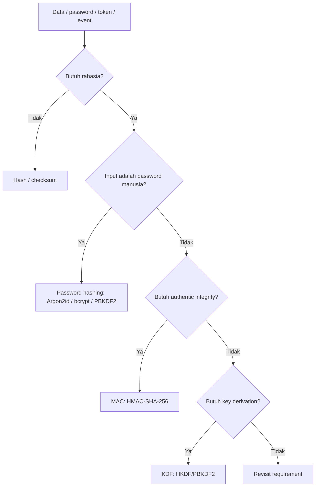
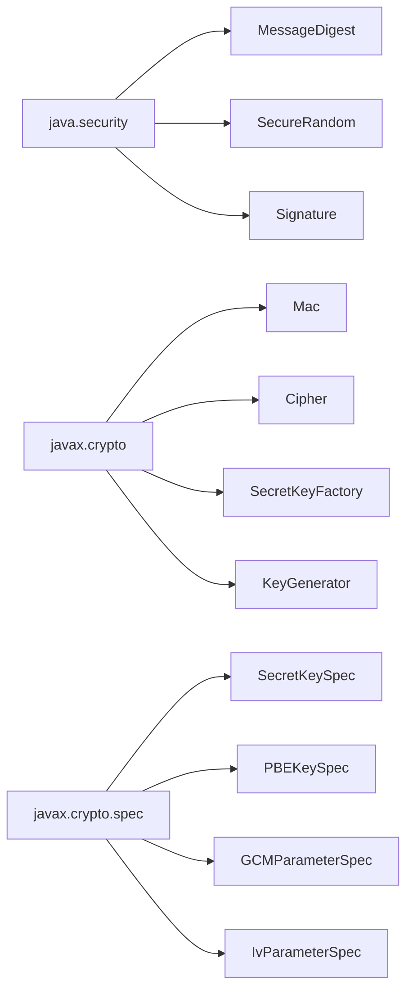
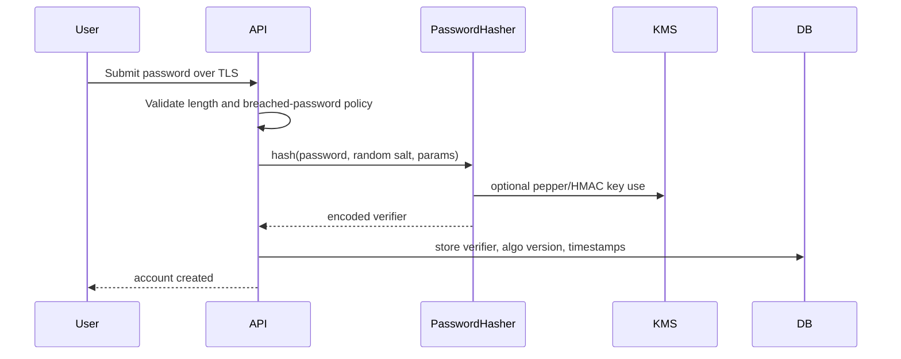
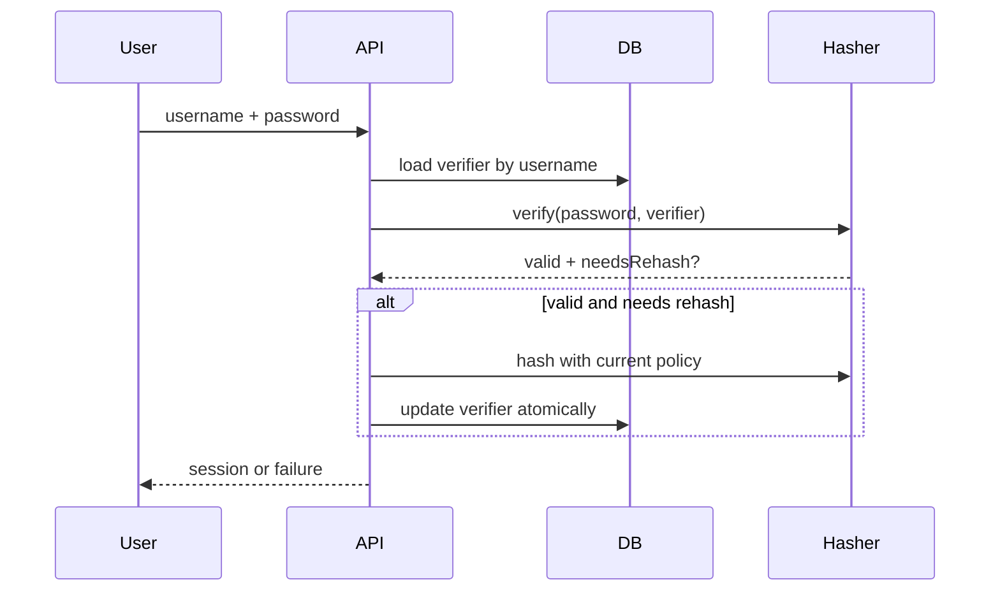
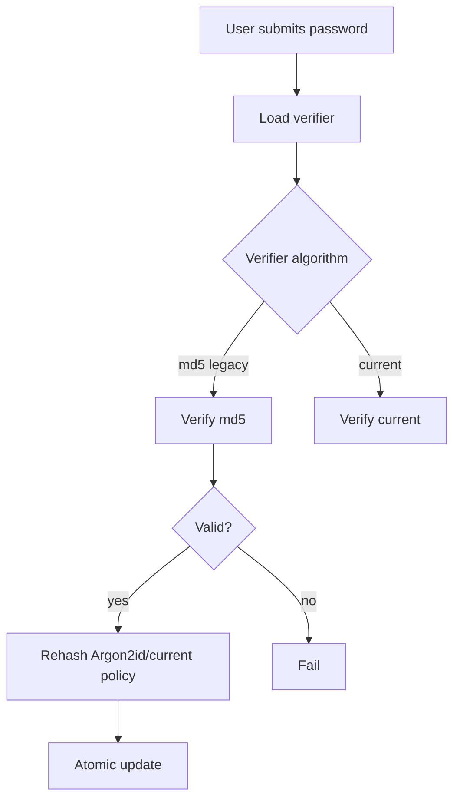

------
title: Learn Java Security, Cryptography and Integrity - Part 009
description: Hashing, MAC, KDF, dan password storage untuk Java engineer yang perlu membedakan integrity primitive, authentication primitive, derivation primitive, dan credential verifier secara benar.
series: learn-java-security-cryptography-integrity
seriesTitle: Learn Java Security, Cryptography and Integrity
order: 9
partTitle: Hashing, MAC, KDF & Password Storage
tags:
  - java
  - security
  - cryptography
  - hashing
  - hmac
  - kdf
  - password-storage
date: 2026-06-30
---

# Part 009 — Hashing, MAC, KDF & Password Storage

Materi ini adalah titik pertama di mana banyak engineer Java terlihat “bisa crypto”, tetapi sebenarnya masih mencampuradukkan primitive yang berbeda. `SHA-256`, `HmacSHA256`, `PBKDF2WithHmacSHA256`, Argon2id, checksum, token hash, request signature, password hash, dan encryption key derivation **bukan varian dari satu hal yang sama**. Mereka menjawab ancaman yang berbeda.

Target part ini: setelah selesai, kamu bisa membaca sebuah desain atau pull request dan langsung menjawab:

1. data ini butuh *integrity detection* atau *authenticity*?
2. apakah penyerang tahu input dan bisa precompute?
3. apakah ada secret key?
4. apakah output dipakai sebagai verifier, key material, cache key, deduplication key, atau audit evidence?
5. apakah primitive dipakai untuk konteks yang salah?

Kita tidak akan mengulang Java Collections, REST, persistence, atau JSON mapping. Semua contoh hanya dipakai untuk security reasoning.

---

## 1. Kaufman Deconstruction

Josh Kaufman mendorong kita memecah skill kompleks menjadi sub-skill kecil yang bisa dilatih. Untuk topik ini, sub-skill-nya adalah:

| Sub-skill | Pertanyaan inti | Primitive umum | Kegagalan umum |
|---|---|---|---|
| Hashing | “Apakah data berubah?” | `MessageDigest` SHA-256/SHA-512/SHA-3 | Mengira hash membuktikan siapa pembuat data |
| MAC | “Apakah data dibuat oleh pihak yang punya secret?” | `Mac` HMAC-SHA-256/HMAC-SHA-512 | Membandingkan MAC dengan `equals`, tidak canonicalize input |
| KDF | “Bagaimana menurunkan key yang berbeda dari secret/master key?” | HKDF, PBKDF2 | Memakai raw password sebagai AES key |
| Password hashing | “Bagaimana menyimpan verifier yang mahal untuk ditebak offline?” | Argon2id, scrypt, bcrypt, PBKDF2 | Memakai SHA-256 cepat tanpa salt/work factor |
| Peppering | “Bagaimana menambah lapisan defense ketika DB bocor?” | HMAC pepper, KMS secret | Menyimpan pepper di DB yang sama |
| Upgrade | “Bagaimana migrasi hash lama tanpa memutus login?” | versioned verifier | Tidak menyimpan metadata algoritma |

Mental model praktis:



Security engineering bukan memilih algoritma paling “kuat” secara abstrak. Security engineering adalah memilih primitive yang **membatasi kemampuan attacker pada boundary tertentu**.

---

## 2. Vocabulary yang Harus Tidak Tertukar

### 2.1 Hash

Hash cryptographic mengambil input berukuran bebas dan menghasilkan digest ukuran tetap.

Contoh:

```java
MessageDigest digest = MessageDigest.getInstance("SHA-256");
byte[] output = digest.digest(inputBytes);
```

Properti yang biasanya diharapkan:

- **preimage resistance**: dari hash sulit menemukan input asli.
- **second preimage resistance**: dari input tertentu sulit menemukan input lain dengan hash sama.
- **collision resistance**: sulit menemukan dua input berbeda dengan hash sama.

Tetapi hash **tidak punya secret**. Jika attacker bisa memilih input, dia juga bisa menghitung hash. Maka hash tidak membuktikan authenticity.

Gunakan hash untuk:

- content address: `sha256(file)` sebagai identifier konten.
- deduplication fingerprint.
- tamper detection ketika digest disimpan di channel terpisah yang trusted.
- hash chain/tamper-evident log sebagai komponen, bukan seluruh solusi.
- token lookup ketika token plaintext hanya ditampilkan sekali.

Jangan gunakan hash biasa untuk:

- password storage.
- API request signature.
- webhook verification.
- session token generation.
- encryption.
- “signing” data.

### 2.2 MAC

MAC atau Message Authentication Code memakai secret key untuk menghasilkan tag. Pihak yang bisa memverifikasi tag harus punya secret yang sama.

```java
Mac mac = Mac.getInstance("HmacSHA256");
mac.init(secretKey);
byte[] tag = mac.doFinal(canonicalBytes);
```

MAC menjawab: “Data ini kemungkinan dibuat oleh pihak yang tahu secret key dan tidak berubah sejak tag dibuat.”

Gunakan MAC untuk:

- webhook signature.
- internal service request signing.
- signed callback parameters.
- tamper-proof stateless payload internal.
- post-hash pepper untuk password verifier.

Jangan gunakan MAC ketika:

- verifier perlu dicek publik tanpa secret; gunakan digital signature.
- setiap verifier tidak boleh bisa membuat tag baru; gunakan asymmetric signature.
- data juga butuh confidentiality; gunakan AEAD encryption, bukan MAC saja.

### 2.3 KDF

KDF atau Key Derivation Function menurunkan key dari secret material. Tujuannya bukan hashing umum, tetapi menghasilkan key yang domain-separated.

Contoh kebutuhan:

- dari master key, turunkan `encryptionKey` dan `macKey` yang berbeda.
- dari shared secret hasil ECDH, turunkan key AEAD.
- dari password, turunkan key untuk membuka encrypted local file.

Untuk password manusia, KDF harus deliberately slow atau memory-hard. Untuk key material yang sudah high entropy, gunakan KDF yang cepat dan aman seperti HKDF.

### 2.4 Password Hashing

Password hashing adalah verifier design. Password manusia low entropy; attacker yang mencuri database dapat melakukan offline guessing. Maka verifier harus:

- punya unique salt per password.
- memakai algoritma adaptive/slow/memory-hard.
- menyimpan parameter cost.
- bisa di-upgrade.
- tidak reversible.

OWASP Password Storage Cheat Sheet merekomendasikan password tidak disimpan plain text, memakai strong slow hashing seperti Argon2id, bcrypt, atau PBKDF2, dengan unique salt; OWASP juga memberi parameter minimum untuk Argon2id, scrypt, bcrypt, dan PBKDF2 untuk FIPS context.

---

## 3. Integrity Primitive Decision Table

| Use case | Primitive | Secret? | Java API | Notes |
|---|---:|---:|---|---|
| File checksum untuk detect corruption | Hash | No | `MessageDigest` | Tidak cukup jika attacker bisa mengganti file dan checksum |
| Artifact integrity dari vendor | Digital signature | Private/public | `Signature`, jarsigner/sigstore | Verifier tidak butuh signing key |
| Internal webhook verification | HMAC | Shared secret | `Mac` | Canonicalization adalah bagian security |
| Password verifier | Password hashing | Salt + optional pepper | Argon2id/bcrypt library, PBKDF2 via JCA | Jangan SHA-256 biasa |
| API token lookup | Hash token | No, if token high entropy | `MessageDigest` | Token harus random high entropy |
| Derive AES key from password | Password KDF | Password+salt | PBKDF2/Argon2id | Untuk stored data, bukan login verifier saja |
| Derive subkeys from KMS data key | HKDF | Master key | JDK 25 includes HKDF specs | Domain separation penting |
| Tamper-evident audit chain | Hash + signature/MAC | Usually yes | `MessageDigest`, `Mac`, `Signature` | Hash chain tanpa protected head bisa dipotong |

---

## 4. Java API Map



Oracle JCA Reference Guide menjelaskan engine classes seperti `Provider`, `Security`, `SecureRandom`, `MessageDigest`, `Signature`, `Cipher`, `Mac`, dan `KEM`. Part ini berfokus pada `MessageDigest`, `Mac`, dan `SecretKeyFactory`.

---

## 5. Hashing dengan `MessageDigest`

### 5.1 Correct basic usage

```java
import java.security.MessageDigest;
import java.security.NoSuchAlgorithmException;
import java.util.HexFormat;

public final class Sha256 {
    private Sha256() {}

    public static String hex(byte[] input) {
        try {
            MessageDigest md = MessageDigest.getInstance("SHA-256");
            return HexFormat.of().formatHex(md.digest(input));
        } catch (NoSuchAlgorithmException e) {
            throw new IllegalStateException("SHA-256 is required by the platform", e);
        }
    }
}
```

Important details:

- `MessageDigest` instances are mutable and not thread-safe by design; create per operation or use careful pooling.
- Always specify charset for text: `input.getBytes(StandardCharsets.UTF_8)`.
- Store digest with algorithm metadata if long-lived: `sha256:<hex>`.
- Do not truncate unless collision/security reasoning is explicit.

### 5.2 Streaming large input

```java
import java.io.InputStream;
import java.security.DigestInputStream;
import java.security.MessageDigest;
import java.util.HexFormat;

public final class FileDigest {
    public static String sha256Hex(InputStream in) throws Exception {
        MessageDigest md = MessageDigest.getInstance("SHA-256");
        try (DigestInputStream din = new DigestInputStream(in, md)) {
            din.transferTo(OutputStream.nullOutputStream());
        }
        return HexFormat.of().formatHex(md.digest());
    }
}
```

Security note: a digest proves “same bytes as digest”. It does not prove “safe file”, “right uploader”, “not malicious”, or “authorized”.

### 5.3 Dangerous hash patterns

```java
// WRONG: password hash
String stored = sha256(password);

// WRONG: request signature without secret
String sig = sha256(timestamp + body);

// WRONG: token generated by hashing predictable data
String token = sha256(userId + System.currentTimeMillis());

// WRONG: compare sensitive digests with String.equals when timing matters
if (provided.equals(expected)) { ... }
```

The key failure is not API syntax. The failure is threat model mismatch.

---

## 6. Constant-Time Comparison

For MACs, token hashes, and password hash comparison, avoid early-exit comparisons that can leak information through timing in some contexts.

```java
import java.security.MessageDigest;

public final class ConstantTime {
    public static boolean same(byte[] a, byte[] b) {
        return MessageDigest.isEqual(a, b);
    }
}
```

Do not overclaim: constant-time comparison is not a magic shield against all timing leaks. It only reduces one comparison leak. You still need stable parsing, length handling, canonicalization, and uniform error behavior.

A practical verification flow:

```java
byte[] expected = computeMac(canonicalRequest, key);
byte[] provided = decodeBase64(header);

if (!MessageDigest.isEqual(expected, provided)) {
    throw new UnauthorizedException("Invalid signature");
}
```

Avoid logs like:

```java
log.warn("Invalid MAC. expected={}, provided={}", hex(expected), hex(provided));
```

Logging expected MAC values turns operational telemetry into sensitive material.

---

## 7. HMAC with `Mac`

### 7.1 Minimal HMAC utility

```java
import javax.crypto.Mac;
import javax.crypto.SecretKey;
import javax.crypto.spec.SecretKeySpec;
import java.nio.charset.StandardCharsets;
import java.security.GeneralSecurityException;
import java.util.Base64;

public final class HmacSigner {
    private static final String ALG = "HmacSHA256";

    private final SecretKey key;

    public HmacSigner(byte[] rawKey) {
        if (rawKey.length < 32) {
            throw new IllegalArgumentException("HMAC key must be at least 256 bits");
        }
        this.key = new SecretKeySpec(rawKey.clone(), ALG);
    }

    public String signBase64Url(byte[] canonicalMessage) {
        try {
            Mac mac = Mac.getInstance(ALG);
            mac.init(key);
            byte[] tag = mac.doFinal(canonicalMessage);
            return Base64.getUrlEncoder().withoutPadding().encodeToString(tag);
        } catch (GeneralSecurityException e) {
            throw new IllegalStateException("Cannot compute HMAC", e);
        }
    }

    public boolean verify(byte[] canonicalMessage, String encodedTag) {
        byte[] expected = signRaw(canonicalMessage);
        byte[] provided;
        try {
            provided = Base64.getUrlDecoder().decode(encodedTag);
        } catch (IllegalArgumentException invalidBase64) {
            return false;
        }
        return MessageDigest.isEqual(expected, provided);
    }

    private byte[] signRaw(byte[] canonicalMessage) {
        try {
            Mac mac = Mac.getInstance(ALG);
            mac.init(key);
            return mac.doFinal(canonicalMessage);
        } catch (GeneralSecurityException e) {
            throw new IllegalStateException("Cannot compute HMAC", e);
        }
    }
}
```

Key points:

- HMAC key should be random, high entropy, and managed as a secret.
- Do not use user password as HMAC key.
- Do not use API key ID as HMAC secret.
- Do not use `String.getBytes()` without charset.
- `Mac` instances are mutable; create per operation unless you have careful lifecycle control.

### 7.2 Canonicalization is part of security

Bad signing design:

```java
String data = request.getMethod() + request.getPath() + request.getBody();
```

Problems:

- path encoding ambiguity: `/a%2Fb` vs `/a/b`.
- query parameter order ambiguity.
- header casing/spacing ambiguity.
- JSON object key order ambiguity.
- newline normalization ambiguity.
- duplicate headers.
- content decompression boundary.

Better design:

```text
METHOD \n
CANONICAL_PATH \n
CANONICAL_QUERY \n
LOWERCASE_SIGNED_HEADERS \n
SHA256_HEX_BODY \n
TIMESTAMP \n
NONCE
```

Example canonical request:

```java
public record CanonicalRequest(
    String method,
    String path,
    String canonicalQuery,
    String signedHeaders,
    String bodySha256Hex,
    Instant timestamp,
    String nonce
) {
    public byte[] bytes() {
        String canonical = String.join("\n",
            method.toUpperCase(Locale.ROOT),
            path,
            canonicalQuery,
            signedHeaders,
            bodySha256Hex,
            timestamp.toString(),
            nonce
        );
        return canonical.getBytes(StandardCharsets.UTF_8);
    }
}
```

If canonicalization is underspecified, two services can verify different semantic requests as the same string or the same semantic request as different strings.

---

## 8. Length Extension and Why HMAC Exists

A common broken construction:

```text
SHA256(secret || message)
```

For Merkle–Damgård hash functions such as SHA-256, constructions like `hash(secret || message)` can be vulnerable to length-extension attacks depending on usage. HMAC exists to avoid this class of mistake. Do not invent keyed hash constructions.

Correct:

```java
Mac.getInstance("HmacSHA256")
```

The deeper rule: if a standard primitive exists for the security property, use the standard primitive. Crypto is not an area where “simpler custom construction” is safer.

---

## 9. KDF: Derive, Do Not Reuse

### 9.1 Why key separation matters

Bad:

```text
sameKey used for AES-GCM encryption, HMAC request signing, and token signing
```

If one protocol leaks information or has oracle behavior, other protocols are impacted. Key separation limits blast radius.

Better:

```text
master secret
  -> HKDF(info="orders:v1:field-encryption") -> encryption key
  -> HKDF(info="orders:v1:webhook-signing") -> hmac key
  -> HKDF(info="orders:v1:audit-chain") -> audit mac key
```

Domain separation metadata should include:

- application/system name.
- environment.
- purpose.
- algorithm suite.
- version.
- tenant or key scope when applicable.

### 9.2 PBKDF2 with `SecretKeyFactory`

PBKDF2 is available through JCA and useful where FIPS compatibility or platform availability matters. It is not memory-hard, so Argon2id is generally preferred for password storage when policy allows.

```java
import javax.crypto.SecretKeyFactory;
import javax.crypto.spec.PBEKeySpec;
import java.security.SecureRandom;

public final class Pbkdf2 {
    private static final int SALT_BYTES = 16;
    private static final int ITERATIONS = 600_000;
    private static final int KEY_BITS = 256;

    public static PasswordHash hash(char[] password) throws Exception {
        byte[] salt = new byte[SALT_BYTES];
        SecureRandom.getInstanceStrong().nextBytes(salt);

        PBEKeySpec spec = new PBEKeySpec(password, salt, ITERATIONS, KEY_BITS);
        byte[] derived;
        try {
            SecretKeyFactory skf = SecretKeyFactory.getInstance("PBKDF2WithHmacSHA256");
            derived = skf.generateSecret(spec).getEncoded();
        } finally {
            spec.clearPassword();
        }

        return new PasswordHash("PBKDF2WithHmacSHA256", ITERATIONS, salt, derived);
    }
}
```

OWASP recommends PBKDF2 with HMAC-SHA-256 and a work factor of 600,000 or more when FIPS-140 compliance is required. NIST SP 800-132 covers password-based key derivation for storage applications and notes that the publication is planned for revision.

### 9.3 Char arrays: useful, but do not exaggerate

`PBEKeySpec` accepts `char[]` so password memory can be cleared after use:

```java
Arrays.fill(password, '\0');
```

But in real Java apps, the password often came from:

- HTTP body parser.
- JSON binding.
- framework request object.
- logs/traces if misconfigured.
- heap snapshots.

So `char[]` is useful hygiene, not complete memory secrecy.

---

## 10. Password Storage Architecture

### 10.1 Password verifier format

Never store only raw digest bytes. Store a structured verifier:

```text
$algorithm$version$params$salt$hash
```

Example conceptual format:

```text
$argon2id$v=19$m=19456,t=2,p=1$<base64-salt>$<base64-hash>
```

For PBKDF2:

```text
$pbkdf2-sha256$v=1$i=600000,l=32$<base64-salt>$<base64-hash>
```

The verifier must be self-describing because security parameters change.

### 10.2 Registration flow



Registration invariants:

- password never logged.
- password is never stored encrypted for login.
- salt is unique per password.
- hash parameters are stored.
- verifier has version.
- optional pepper is outside the DB trust boundary.

### 10.3 Login flow with upgrade



Login invariants:

- same generic error for unknown user and wrong password.
- rate limiting and abuse detection exist outside password hash itself.
- upgrade happens only after successful verification.
- old hash parameters remain verifiable until migrated.
- account lockout design does not enable trivial denial of service.

---

## 11. Argon2id, bcrypt, scrypt, PBKDF2

### 11.1 Practical selection

| Algorithm | Strength | Weakness | Java notes |
|---|---|---|---|
| Argon2id | Memory-hard, OWASP-preferred modern default | May need external vetted library; FIPS constraints | Use a reputable maintained library; store params |
| scrypt | Memory-hard, mature | Parameter tuning matters; library dependency | Good fallback when Argon2id unavailable |
| bcrypt | Mature, widely deployed | 72-byte input limit; not memory-hard like Argon2id | Good for legacy compatibility |
| PBKDF2-HMAC-SHA-256 | JCA available, FIPS-friendly | CPU-hard but not memory-hard | Use high iteration count; monitor latency |

### 11.2 Parameter tuning

A password hashing work factor is a product decision and security decision:

- too low: offline cracking too cheap.
- too high: login latency, scaling cost, and DoS risk increase.
- too static: hardware improvement erodes defense.

Treat it as an SLO-backed security parameter:

```text
p95 password verification latency <= 250ms under normal load
p99 <= 750ms under expected login burst
memory cost does not evict critical service working set
work factor reviewed every 6-12 months
```

Do not benchmark on your laptop only. Benchmark on production-like instance types and container memory limits.

### 11.3 Password max length

You need a maximum password length to prevent resource exhaustion. This max should be high enough for passphrases and password managers, but bounded enough to protect hashing work.

Policy example:

```text
min length: 12 for normal password policy, lower only if paired with strong MFA/passkeys policy
max length: 256 Unicode code points after normalization policy
reject common/breached passwords
allow password managers and paste
never silently truncate
```

bcrypt has a 72-byte input limit. If using bcrypt, never silently truncate; either reject over-limit or use a carefully specified pre-hash strategy with domain separation and encoding discipline.

---

## 12. Salts

A salt is not secret. It prevents identical passwords from producing identical verifiers and blocks precomputed rainbow-table reuse.

Correct salt properties:

- unique per password hash.
- generated by CSPRNG.
- at least 128 bits is common.
- stored next to verifier.

Wrong assumptions:

- “Salt must be hidden.” No. Pepper is secret; salt is not.
- “One application-wide salt is enough.” No. Use unique per-password salt.
- “Username can be salt.” Avoid; usernames change, collide across systems, and are attacker-known structured data.

Java salt generation:

```java
byte[] salt = new byte[16];
SecureRandom random = SecureRandom.getInstanceStrong();
random.nextBytes(salt);
```

For high-volume login services, choose a platform-appropriate `SecureRandom` strategy as covered in Part 008; avoid per-request blocking surprises.

---

## 13. Peppering

A pepper is a secret used in addition to salt. It should live outside the password database boundary, often in KMS/HSM/secret manager.

Two common patterns:

### 13.1 Pre-hash pepper

```text
password' = HMAC(pepper, normalizedPassword)
passwordHash = Argon2id(password', salt, params)
```

Risk: changes password input semantics; library encoding and length limits matter.

### 13.2 Post-hash pepper

```text
baseHash = Argon2id(password, salt, params)
storedVerifier = HMAC(pepper, baseHash)
```

Risk: rotation requires password knowledge or multi-pepper verification strategy.

Operational pepper requirements:

- not stored in DB.
- access is auditable.
- rotation plan exists.
- compromise response exists.
- service can handle KMS latency/failure.

Failure mode: adding pepper by putting `PEPPER=...` in the same Kubernetes secret dump as DB credentials and app config may not materially improve breach resistance.

---

## 14. Legacy Hash Migration

Assume you inherit this:

```text
users.password_hash = md5(password)
```

Do not attempt to “decrypt” hashes. You cannot. Migrate on login:



Migration design:

- Store algorithm marker for every row.
- Rehash only after successful login.
- Force password reset for dormant accounts after deadline.
- Monitor percentage migrated.
- Do not layer insecure hash without understanding cracking implications.
- Consider breach/reset campaign if legacy verifier exposure is suspected.

Example verifier parser:

```java
sealed interface PasswordVerifier permits Argon2Verifier, Pbkdf2Verifier, LegacyMd5Verifier {
    boolean verify(char[] password);
    boolean needsRehash(PasswordPolicy policy);
}
```

Security review question: “Can any path create new legacy hashes after migration starts?” If yes, migration will never converge.

---

## 15. Token Hashing

API tokens and password reset tokens should be generated as high-entropy random secrets, displayed once, and stored as hashes.

```java
public record TokenIssueResult(String plaintextToken, String tokenHash) {}

public TokenIssueResult issueToken() throws Exception {
    byte[] token = new byte[32];
    secureRandom.nextBytes(token);

    String plaintext = Base64.getUrlEncoder().withoutPadding().encodeToString(token);
    String hash = sha256Hex(token);

    return new TokenIssueResult(plaintext, "sha256:" + hash);
}
```

Why normal SHA-256 is acceptable here but not for passwords:

- random token has high entropy.
- attacker cannot run a useful dictionary of likely human choices.
- token length can be controlled by system.

Important:

- Hash the raw random bytes or a canonical encoded form consistently.
- Use constant-time comparison for verification.
- Expire reset tokens quickly.
- Bind token to purpose and subject in DB metadata.
- Do not send token in logs, analytics, referrer-leaking URLs when possible.

---

## 16. Hashing PII: Usually Not Anonymous

Hashing email, phone number, national ID, or other low-entropy structured identifier does not anonymize it.

Bad:

```text
sha256("alice@example.com")
```

An attacker can precompute likely emails. For privacy-preserving lookup, use keyed hashing:

```text
HMAC(lookupKey, normalizedEmail)
```

But even keyed hashing is still personal data in many governance contexts because the system can link it back under its key. Treat it as pseudonymization, not deletion.

Java pattern:

```java
String normalizedEmail = email.trim().toLowerCase(Locale.ROOT);
byte[] digest = hmacSha256(lookupKey, normalizedEmail.getBytes(StandardCharsets.UTF_8));
```

Pitfall: normalization itself is domain-specific. Email local-part case sensitivity, Unicode, Gmail aliases, phone number formats, and national ID formatting all need product/legal decisions.

---

## 17. Hash Chain for Integrity

A simple hash chain:

```text
entryHash[i] = SHA256(entryCanonicalBytes[i])
chainHash[i] = SHA256(chainHash[i-1] || entryHash[i])
```

This detects modification inside the chain, but it does not prevent:

- deleting suffix and presenting older head.
- rewriting entire chain if attacker controls storage.
- creating alternative chain if no signed checkpoint exists.

For audit-grade integrity, protect checkpoints:

```text
checkpoint = sign(systemSigningKey, chainId || sequence || chainHead || timestamp)
```

or MAC them with a key outside the log storage boundary. This will be deepened in Part 023.

---

## 18. Common Java Code Review Findings

### 18.1 Fast hash for password

```java
String passwordHash = DigestUtils.sha256Hex(password);
```

Fix: use Argon2id/bcrypt/PBKDF2 with salt, work factor, versioned verifier.

### 18.2 Static salt

```java
private static final byte[] SALT = "company".getBytes(UTF_8);
```

Fix: generate unique salt per password.

### 18.3 HMAC key from config literal

```java
new SecretKeySpec("secret".getBytes(UTF_8), "HmacSHA256")
```

Fix: load random 256-bit key from secret manager/KMS, rotate with key ID.

### 18.4 Concatenation ambiguity

```java
mac(userId + amount + currency);
```

`userId=12, amount=34` collides structurally with `userId=1, amount=234` under naive concatenation.

Fix: length-prefix, canonical JSON, protobuf deterministic encoding, or explicit delimiter escaping.

```text
len(userId) || userId || len(amount) || amount || len(currency) || currency
```

### 18.5 Base64 vs hex confusion

```java
byte[] provided = header.getBytes(UTF_8); // comparing encoded text to raw bytes
```

Fix: decode exactly once and compare bytes to bytes, or compare canonical encoded strings only after strict canonical encoding.

### 18.6 Provider drift

```java
Mac.getInstance("HmacSHA256")
```

This is fine in most apps, but high-assurance contexts may need provider pinning and startup verification:

```java
Mac mac = Mac.getInstance("HmacSHA256", "SunJCE");
```

Do this only when you understand portability/FIPS implications. Crypto agility from Part 007 applies.

---

## 19. Password Hashing Service Design

A production service should hide algorithm details behind a narrow interface.

```java
public interface PasswordHasher {
    EncodedPasswordHash hash(char[] password);
    VerificationResult verify(char[] password, EncodedPasswordHash encoded);
}

public record VerificationResult(boolean valid, boolean needsRehash) {}
```

Design invariants:

- all new hashes use current policy.
- old verifiers are read-only except during upgrade.
- verifier string parse failures are authentication failures, not 500 leaks.
- metrics expose algorithm distribution, not secrets.
- implementation can be swapped behind interface.

Example policy:

```java
public record PasswordHashPolicy(
    String algorithm,
    int memoryKiB,
    int iterations,
    int parallelism,
    int saltBytes,
    int hashBytes,
    int version
) {}
```

For PBKDF2:

```java
public record Pbkdf2Policy(
    String algorithm,
    int iterations,
    int saltBytes,
    int derivedKeyBytes,
    int version
) {
    public static Pbkdf2Policy current() {
        return new Pbkdf2Policy("PBKDF2WithHmacSHA256", 600_000, 16, 32, 2);
    }
}
```

---

## 20. Failure Modeling

| Failure | Cause | Impact | Control |
|---|---|---|---|
| DB leak exposes password verifiers | SQLi, backup leak, insider | Offline cracking | Argon2id/PBKDF2, salt, pepper, breached password prevention |
| MAC bypass | canonicalization mismatch | Unauthorized requests accepted | Exact canonical spec, shared test vectors |
| Timing leak | early-exit comparison | Tag/token guessing acceleration | `MessageDigest.isEqual`, uniform errors |
| Hash collision concern overblown | using SHA-256 for content ID | Usually low practical risk | Keep algorithm agility, avoid weak hashes |
| Token hash cracked | token generated predictably | Account takeover | 256-bit random tokens, CSPRNG |
| Pepper unavailable | KMS outage | Login outage | circuit policy, cached key with TTL, runbook |
| Cost too high | work factor not load-tested | Login DoS | benchmark, rate limit, capacity plan |
| Cost too low | old hardware assumptions | Cheap cracking | periodic review, rehash-on-login |

---

## 21. Test Vectors and Interop

For HMAC/request signing, create shared test vectors:

```json
{
  "name": "simple-post-v1",
  "secretBase64": "MDEyMzQ1Njc4OWFiY2RlZjAxMjM0NTY3ODlhYmNkZWY=",
  "canonicalRequest": "POST\n/v1/orders\npage=1\nhost;x-date\n4f8...\n2026-06-30T00:00:00Z\nn-123",
  "hmacSha256Base64Url": "..."
}
```

Test vectors catch:

- charset mismatch.
- newline mismatch.
- query ordering mismatch.
- Base64 padding mismatch.
- clock/timestamp format mismatch.
- JSON canonicalization mismatch.

For password hashing, tests should verify:

- valid password passes.
- invalid password fails.
- changed parameters return `needsRehash=true`.
- malformed verifier fails safely.
- extremely long password is bounded.
- Unicode behavior is explicit.

---

## 22. Operational Metrics

Recommended metrics:

```text
password_hash.verify.latency
password_hash.verify.failure_count
password_hash.algorithm_distribution
password_hash.needs_rehash_count
hmac.verify.failure_count by key_id/purpose, not by secret
hmac.verify.clock_skew_reject_count
hmac.verify.replay_reject_count
kms.pepper.fetch.latency
kms.pepper.fetch.failure_count
```

Avoid metrics labels containing user ID, email, token, hash, MAC, or raw key ID if key ID itself is sensitive. Use stable non-sensitive identifiers.

---

## 23. Practical Java Libraries

JDK gives you PBKDF2 and HMAC. It does not necessarily give a first-class Argon2id password hashing API in standard Java SE. In production, prefer:

- framework-provided password encoders with active maintenance.
- vetted Argon2id/bcrypt library.
- dependency scanning and pinned versions.
- explicit verifier format.
- known test vectors.

Do not copy random Argon2 Java code from a blog. The risk is not only algorithm implementation; it is parameter encoding, memory clearing claims, side-channel handling, and maintenance.

---

## 24. Review Checklist

### Hashing

- [ ] Is a plain hash sufficient for the threat model?
- [ ] Is the algorithm modern enough, e.g. SHA-256/SHA-512/SHA-3 rather than MD5/SHA-1?
- [ ] Is charset/canonicalization explicit?
- [ ] Is digest stored with algorithm metadata if long-lived?
- [ ] Is hash not being used as authentication?

### HMAC

- [ ] Is key random and high entropy?
- [ ] Is key stored outside attacker-controlled data store?
- [ ] Is canonicalization specified and tested?
- [ ] Is comparison constant-time?
- [ ] Are timestamp/nonce/replay protections included where relevant?
- [ ] Is key rotation supported by key ID?

### KDF

- [ ] Is key derivation used rather than key reuse?
- [ ] Is purpose/domain separation explicit?
- [ ] Are derived key lengths correct?
- [ ] Is password-derived key using password KDF rather than normal HKDF/hash?

### Password storage

- [ ] Is password stored only as verifier, not reversible encryption?
- [ ] Is unique salt used?
- [ ] Is algorithm adaptive/slow/memory-hard when policy allows?
- [ ] Is verifier self-describing?
- [ ] Is upgrade path implemented?
- [ ] Is max password length bounded but user-friendly?
- [ ] Are failures generic and logs safe?

---

## 25. Deliberate Practice

### Exercise 1 — Primitive classification

Classify each requirement:

1. “Detect whether uploaded PDF bytes changed after storage.”
2. “Verify GitHub-style webhook came from expected sender.”
3. “Store user login password.”
4. “Find customer by email without storing raw email in lookup index.”
5. “Generate two independent keys from a KMS data key.”
6. “Allow public clients to verify release artifact origin.”

Expected direction:

1. hash plus protected metadata.
2. HMAC with canonical request and replay controls.
3. Argon2id/bcrypt/PBKDF2 verifier.
4. HMAC of normalized email.
5. HKDF/domain-separated KDF.
6. digital signature, not HMAC.

### Exercise 2 — Review this code

```java
String sign(String secret, String userId, String amount) throws Exception {
    MessageDigest md = MessageDigest.getInstance("SHA-256");
    return HexFormat.of().formatHex(
        md.digest((secret + userId + amount).getBytes())
    );
}
```

Findings:

- custom keyed hash instead of HMAC.
- default charset.
- concatenation ambiguity.
- no purpose/version.
- secret is `String`, hard to clear and easy to log.

Improved shape:

```java
byte[] canonical = lengthPrefix(userId, amount, currency, timestamp, nonce);
byte[] tag = hmacSha256(secretKey, canonical);
```

### Exercise 3 — Password migration plan

Given `users.password_hash` currently stores unsalted SHA-1 hex, design:

- new verifier format.
- login migration.
- dormant account reset.
- metrics.
- rollback plan.
- incident response if old hashes are suspected leaked.

---

## 26. Key Takeaways

1. Hash, MAC, KDF, and password hashing are different primitives for different threat models.
2. Hashes do not authenticate because they do not use a secret.
3. HMAC is the default for symmetric authenticity, not `SHA256(secret || message)`.
4. Passwords require adaptive slow/memory-hard verifiers because attackers can guess offline.
5. Salt is public and per-password; pepper is secret and operationally managed.
6. Verifier formats must be versioned because algorithms and cost factors evolve.
7. Canonicalization is not formatting polish; it is part of the security boundary.
8. For tokens generated with high entropy, normal hashing is acceptable for lookup storage.
9. Security review should focus on attacker capability, not algorithm names alone.

---

## 27. References

- Oracle Java SE 25, Java Cryptography Architecture Reference Guide: https://docs.oracle.com/en/java/javase/25/security/java-cryptography-architecture-jca-reference-guide.html
- Oracle Java SE 25 `Mac`: https://docs.oracle.com/en/java/javase/25/docs/api/java.base/javax/crypto/Mac.html
- OWASP Password Storage Cheat Sheet: https://cheatsheetseries.owasp.org/cheatsheets/Password_Storage_Cheat_Sheet.html
- OWASP Cryptographic Storage Cheat Sheet: https://cheatsheetseries.owasp.org/cheatsheets/Cryptographic_Storage_Cheat_Sheet.html
- NIST SP 800-132, Password-Based Key Derivation: https://csrc.nist.gov/pubs/sp/800/132/final
- RFC 2104, HMAC: https://www.rfc-editor.org/rfc/rfc2104
