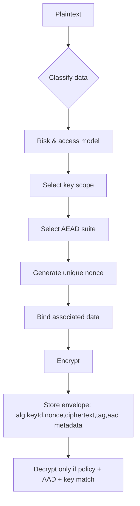
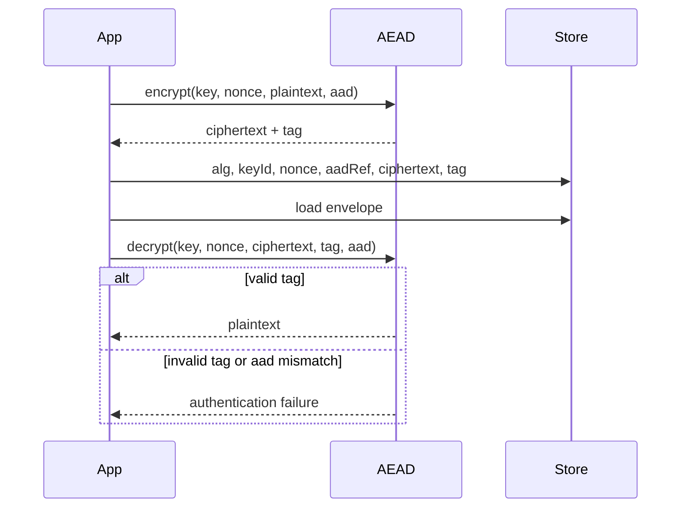
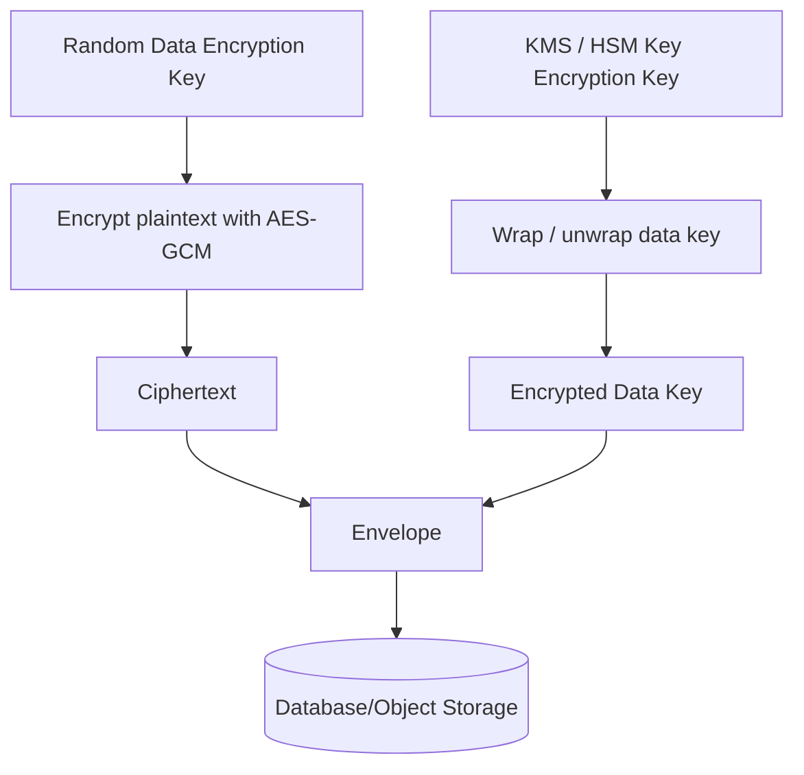
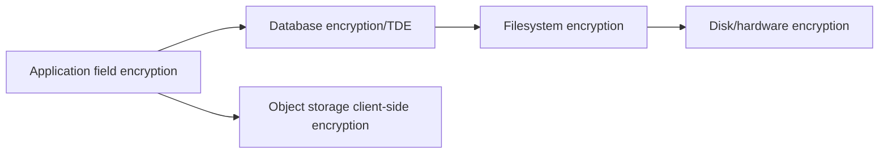
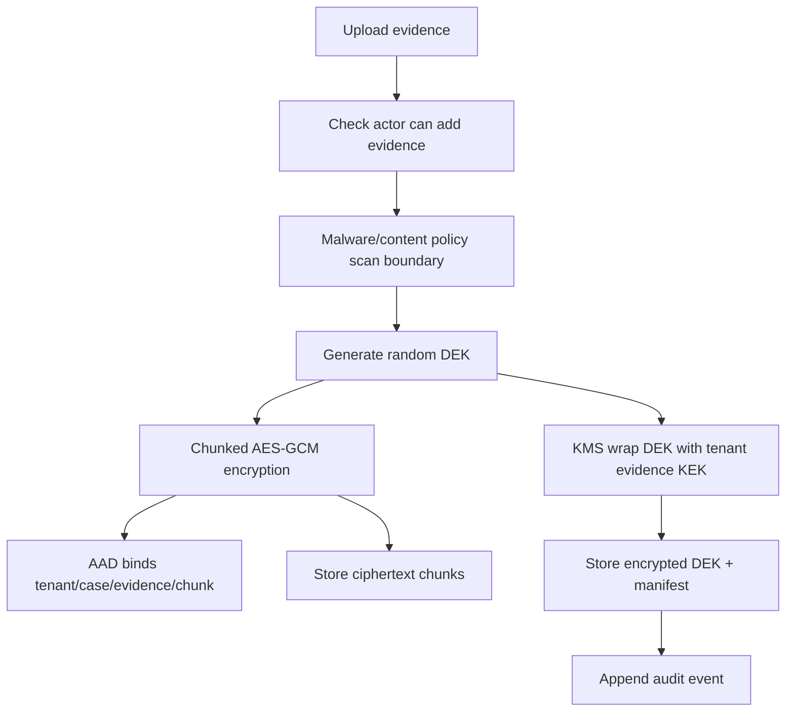

------
title: Learn Java Security, Cryptography and Integrity - Part 010
description: Symmetric encryption, AEAD, AES-GCM, ChaCha20-Poly1305, nonce discipline, associated data, envelope encryption, and data protection design for Java systems.
series: learn-java-security-cryptography-integrity
seriesTitle: Learn Java Security, Cryptography and Integrity
order: 10
partTitle: Symmetric Encryption, AEAD & Data Protection
tags:
  - java
  - security
  - cryptography
  - encryption
  - aes-gcm
  - aead
  - data-protection
date: 2026-06-30
---

# Part 010 — Symmetric Encryption, AEAD & Data Protection

Part ini membahas encryption untuk data protection. Fokusnya bukan “cara memanggil `Cipher` sampai tidak error”, tetapi bagaimana membuat desain encryption yang punya invariants jelas: confidentiality, integrity, key lifecycle, nonce discipline, associated data, metadata, rotation, dan failure behavior.

Satu kalimat yang harus selalu diingat:

> Encryption tanpa integrity adalah setengah kontrol yang sering berubah menjadi vulnerability.

Karena itu, default modern untuk aplikasi Java adalah **AEAD**: Authenticated Encryption with Associated Data. Dalam praktik Java server-side, ini biasanya berarti `AES/GCM/NoPadding` atau `ChaCha20-Poly1305` ketika tersedia dan sesuai environment.

NIST SP 800-38D mendefinisikan GCM/GMAC sebagai mode untuk authenticated encryption with associated data, dan Java SE 25 secara eksplisit mengaitkan `GCMParameterSpec` dengan spesifikasi GCM/GMAC. OWASP Cryptographic Storage Cheat Sheet menekankan threat model, minimisasi penyimpanan data sensitif, pilihan layer encryption, secure random, dan key management.

---

## 1. Kaufman Deconstruction

Untuk menguasai symmetric encryption, pecah menjadi sub-skill berikut:

| Sub-skill | Pertanyaan inti | Kegagalan umum |
|---|---|---|
| Plaintext classification | Data apa yang benar-benar perlu dienkripsi? | Mengenkripsi semua hal tanpa model akses dan operasi |
| Algorithm suite | Algoritma, mode, key size, tag size apa? | `AES/ECB/PKCS5Padding`, CBC tanpa MAC, custom mode |
| Nonce/IV discipline | Apakah nonce unik untuk key ini? | Reuse nonce AES-GCM, random IV terlalu kecil, counter reset |
| Associated data | Metadata apa yang harus ikut diautentikasi? | Tenant ID, record ID, purpose tidak di-bind |
| Key management | Key datang dari mana, disimpan di mana, dirotasi bagaimana? | Hardcoded key, same key semua purpose, no key ID |
| Envelope format | Bagaimana ciphertext self-describing? | Tidak simpan algorithm/key version/nonce/tag |
| Error handling | Bagaimana gagal decrypt? | Padding oracle, detail error leak, fallback insecure |
| Migration | Bagaimana ganti algorithm/key? | Tidak punya version atau rewrap path |

Mental model:



---

## 2. What Encryption Does and Does Not Do

Encryption can provide:

- confidentiality of plaintext against parties without key access.
- integrity/authenticity of ciphertext when AEAD is used.
- blast-radius reduction when keys are scoped well.
- safer storage/backups/log shipping when data is encrypted before persistence.

Encryption does not automatically provide:

- authorization.
- deletion.
- anonymization.
- non-repudiation.
- protection from application that legitimately decrypts and then leaks.
- protection from SQL injection that reads decrypted API response.
- protection from compromised KMS permission.
- protection from logging plaintext before encryption.

The key engineering question is not “is this encrypted?” but:

> Who can cause decryption, under what policy, with what audit trail, and what else can they observe once plaintext exists?

---

## 3. AEAD Mental Model

AEAD takes:

```text
key
nonce / IV
plaintext
associated data (AAD)
```

and outputs:

```text
ciphertext + authentication tag
```

During decrypt, the same key, nonce, ciphertext, tag, and AAD must be supplied. If any protected value differs, decryption fails.



AAD is not encrypted. It is authenticated. Use it to bind context:

- tenant ID.
- table/collection name.
- record ID.
- field name.
- data classification.
- algorithm suite version.
- business purpose.

Example:

```text
aad = "customer-service:v1:tenant=acme:table=customers:field=tax_id:record=123"
```

If attacker copies ciphertext from one record to another, AAD mismatch should make decrypt fail.

---

## 4. Why Not ECB/CBC by Default

### 4.1 ECB leaks patterns

`AES/ECB/PKCS5Padding` encrypts identical plaintext blocks into identical ciphertext blocks under the same key. It is almost never appropriate for application data.

```java
Cipher.getInstance("AES/ECB/PKCS5Padding"); // reject in code review
```

### 4.2 CBC without MAC is fragile

CBC can be secure in specific constructions, but application teams often get composition wrong:

- unpredictable IV requirements.
- padding oracle risk.
- decrypt-then-parse behavior.
- MAC order mistakes.
- inconsistent error handling.

For new application-level encryption, choose AEAD unless forced by interoperability.

### 4.3 “NoPadding” in GCM is not no security

`AES/GCM/NoPadding` uses `NoPadding` because GCM internally behaves like a stream mode and does not need PKCS padding. Do not interpret `NoPadding` as insecure in the GCM transformation.

---

## 5. AES-GCM in Java

### 5.1 Envelope record

Design encryption output as an envelope, not just bytes.

```java
public record EncryptedValue(
    String suite,
    String keyId,
    String nonceBase64Url,
    String ciphertextBase64Url,
    String tagBase64Url,
    String aadVersion
) {}
```

In Java's `Cipher` API for GCM, ciphertext and tag are usually returned concatenated by `doFinal`. You can store them combined or split. Combined is simpler; split is sometimes clearer for interop.

```java
public record AeadEnvelope(
    String suite,
    String keyId,
    String nonce,
    String ciphertextAndTag,
    String aadVersion
) {}
```

### 5.2 AES-GCM encrypt utility

```java
import javax.crypto.Cipher;
import javax.crypto.SecretKey;
import javax.crypto.spec.GCMParameterSpec;
import java.security.SecureRandom;
import java.util.Base64;

public final class AesGcmEncryptor {
    private static final String TRANSFORMATION = "AES/GCM/NoPadding";
    private static final int NONCE_BYTES = 12;       // 96-bit nonce is the usual GCM choice
    private static final int TAG_BITS = 128;

    private final SecureRandom random;

    public AesGcmEncryptor(SecureRandom random) {
        this.random = random;
    }

    public AeadEnvelope encrypt(SecretKey key, String keyId, byte[] plaintext, byte[] aad) {
        try {
            byte[] nonce = new byte[NONCE_BYTES];
            random.nextBytes(nonce);

            Cipher cipher = Cipher.getInstance(TRANSFORMATION);
            cipher.init(Cipher.ENCRYPT_MODE, key, new GCMParameterSpec(TAG_BITS, nonce));
            cipher.updateAAD(aad);
            byte[] ciphertextAndTag = cipher.doFinal(plaintext);

            Base64.Encoder enc = Base64.getUrlEncoder().withoutPadding();
            return new AeadEnvelope(
                "AES-256-GCM:v1",
                keyId,
                enc.encodeToString(nonce),
                enc.encodeToString(ciphertextAndTag),
                "aad:v1"
            );
        } catch (Exception e) {
            throw new IllegalStateException("Encryption failed", e);
        }
    }
}
```

Notes:

- 96-bit nonce is standard practice for GCM.
- 128-bit authentication tag is a conservative default.
- `updateAAD` must be called before `doFinal`.
- `Cipher` instance is mutable and not thread-safe; create per operation.
- key ID is metadata; it is not secret.

### 5.3 AES-GCM decrypt utility

```java
public byte[] decrypt(SecretKey key, AeadEnvelope envelope, byte[] aad) {
    try {
        Base64.Decoder dec = Base64.getUrlDecoder();
        byte[] nonce = dec.decode(envelope.nonce());
        byte[] ciphertextAndTag = dec.decode(envelope.ciphertextAndTag());

        Cipher cipher = Cipher.getInstance("AES/GCM/NoPadding");
        cipher.init(Cipher.DECRYPT_MODE, key, new GCMParameterSpec(128, nonce));
        cipher.updateAAD(aad);
        return cipher.doFinal(ciphertextAndTag);
    } catch (javax.crypto.AEADBadTagException badTag) {
        throw new SecurityException("Ciphertext authentication failed");
    } catch (Exception e) {
        throw new SecurityException("Cannot decrypt value");
    }
}
```

Do not distinguish to clients between:

- wrong key.
- wrong AAD.
- tampered ciphertext.
- corrupted tag.
- wrong nonce.

For external responses, return a generic failure. Internally, log event type without sensitive values.

---

## 6. Nonce Discipline

For AES-GCM, reusing a nonce with the same key can be catastrophic. This is one of the most important invariants in the whole series.

```text
Invariant: (keyId, nonce) must be unique for every encryption operation.
```

### 6.1 Random nonce

Random 96-bit nonces are common for application encryption. Collision probability remains low for sane volumes, but systems with huge encryption counts per key need formal limits and monitoring.

Controls:

- rotate keys before nonce collision risk becomes non-negligible.
- avoid copying VM/container snapshots with duplicated RNG state.
- include key ID in envelope.
- add duplicate nonce detection for high-assurance systems.

### 6.2 Counter nonce

Counter nonces avoid randomness collision but require durable monotonic state per key.

Problems:

- distributed writers.
- rollback/replay of counter state.
- crash before persist.
- region failover.
- key rotation coordination.

Counter nonce is appropriate only when you can prove monotonic uniqueness.

### 6.3 Derived nonce

Sometimes nonce is derived from record ID:

```text
nonce = first_96_bits(HMAC(nonceKey, tenantId || recordId || fieldName || version))
```

This can be safe only if every encryption under the same key has a unique derivation input and rewriting semantics are handled. If the same record field is encrypted twice with different plaintext but same key and same derived nonce, GCM nonce reuse occurs. For mutable fields, add version/counter or use random nonce.

---

## 7. Associated Data Design

AAD should bind ciphertext to the context in which it is valid.

### 7.1 Field-level encryption example

```java
public record CustomerTaxIdAad(
    String system,
    String tenantId,
    String table,
    String field,
    String customerId,
    String classification,
    int aadVersion
) {
    public byte[] canonicalBytes() {
        return String.join("\n",
            system,
            tenantId,
            table,
            field,
            customerId,
            classification,
            Integer.toString(aadVersion)
        ).getBytes(StandardCharsets.UTF_8);
    }
}
```

Benefits:

- ciphertext copied to another tenant fails.
- ciphertext copied to another field fails.
- old AAD version is explicit.
- policy can audit what was protected.

### 7.2 AAD pitfalls

- AAD must be exactly reproducible at decrypt time.
- Do not include mutable display names unless old value is stored.
- Do not include data that changes without re-encryption.
- Canonicalization must be stable across services and languages.
- If AAD includes record ID, migration/import must preserve it or re-encrypt.

---

## 8. Envelope Encryption

Envelope encryption separates data encryption key from key encryption key.



Typical envelope fields:

```json
{
  "suite": "AES-256-GCM:v1",
  "keyProvider": "aws-kms",
  "kekId": "alias/customer-pii-prod",
  "encryptedDataKey": "base64url...",
  "nonce": "base64url...",
  "ciphertextAndTag": "base64url...",
  "aadVersion": "customer-pii-aad:v1"
}
```

Why envelope encryption helps:

- KMS/HSM does not process every large plaintext.
- Data key can be cached briefly under policy.
- KEK rotation can rewrap data keys without decrypting all data.
- Blast radius can be scoped per tenant/record/bucket.

Risks:

- data key cache becomes sensitive runtime state.
- KMS permissions become decryption permissions.
- envelope metadata must be authenticated or bound.
- rewrap jobs can become massive privileged operations.

---

## 9. Key Scope

A key scope is a blast-radius boundary.

| Scope | Pros | Cons | Use case |
|---|---|---|---|
| Global app key | Simple | Huge blast radius | Avoid for sensitive multi-tenant data |
| Per environment | Separates dev/stage/prod | Still broad | Minimum baseline |
| Per service | Limits cross-service impact | More key inventory | Good default |
| Per tenant | Strong tenant isolation | More KMS operations/metadata | Regulated multi-tenant systems |
| Per record/data key | Small blast radius | Complex lifecycle/storage | High-sensitivity fields/files |
| Per purpose | Prevents cross-protocol reuse | More derivation/management | Always desirable conceptually |

The best system often combines scopes:

```text
KEK per tenant + purpose
DEK per object/record
HKDF subkeys per field/operation
```

But complexity has a cost. Use risk-based design, not cryptographic maximalism.

---

## 10. Data Protection Layering

Encryption can happen at several layers:



Layer comparison:

| Layer | Protects against | Does not protect against |
|---|---|---|
| Disk encryption | stolen disks/snapshots at infrastructure layer | DBA/app reads, SQLi, app compromise |
| Database TDE | storage media/backups | query-level access, app misuse |
| Column encryption by DB | some DBA/storage scenarios | app with decrypt privilege |
| App field encryption | DB read compromise, backup leakage | app compromise, KMS misuse, logs before encryption |
| Client-side encryption | server-side compromise | client compromise, key recovery complexity |

OWASP Cryptographic Storage Cheat Sheet starts from architecture and threat model because encryption layer choice depends on whom you are protecting data from.

---

## 11. Data Minimization First

Before encryption, ask:

1. Can we avoid collecting this data?
2. Can we tokenize it externally?
3. Can we store only last four characters or irreversible verifier?
4. Can we reduce retention?
5. Can we segregate access?
6. Can we derive needed decision without plaintext?

Encryption is not a reason to store unnecessary data. Unnecessary encrypted data still creates:

- key management burden.
- breach notification analysis burden.
- access-control complexity.
- incident response scope.
- compliance evidence burden.

---

## 12. Choosing AES-GCM vs ChaCha20-Poly1305

| Suite | Strength | Operational notes |
|---|---|---|
| AES-GCM | Standard, hardware acceleration common, widely supported | Catastrophic nonce reuse; excellent default on server CPUs with AES acceleration |
| ChaCha20-Poly1305 | Good software performance, widely used in TLS/mobile contexts | Availability depends on provider/JDK; nonce discipline still required |

Java SE 25 external specs list RFC 7539 ChaCha20/Poly1305 references associated with `Cipher` and `ChaCha20ParameterSpec`. Use runtime provider checks if you plan to depend on it across environments.

For enterprise Java service encryption, a conservative default remains:

```text
AES-256-GCM with 96-bit nonce and 128-bit tag
```

unless compliance, provider, hardware, or interop constraints dictate otherwise.

---

## 13. Key Generation

Use `KeyGenerator` for AES keys:

```java
import javax.crypto.KeyGenerator;
import javax.crypto.SecretKey;

public final class AesKeys {
    public static SecretKey generateAes256() throws Exception {
        KeyGenerator kg = KeyGenerator.getInstance("AES");
        kg.init(256);
        return kg.generateKey();
    }
}
```

Do not do this:

```java
byte[] key = "my secret password".getBytes(UTF_8);
new SecretKeySpec(key, "AES");
```

Human passwords are not AES keys. If a password must unlock local encrypted data, use a password KDF with salt and work factor, then derive an AES key.

---

## 14. Metadata and Algorithm Agility

A ciphertext without metadata is technical debt.

Minimum metadata:

```text
suite/version: AES-256-GCM:v1
key id: identifies key lookup/unwrap path
nonce: unique per encryption under key
aad version: how to reconstruct AAD
ciphertext+tag: encoded bytes
created at: useful for migration/retention
```

Recommended envelope:

```java
public record CryptoEnvelope(
    String envelopeVersion,
    String suite,
    String keyId,
    String nonceBase64Url,
    String ciphertextAndTagBase64Url,
    String aadVersion,
    Instant createdAt
) {}
```

Migration logic:

```java
byte[] plaintext = decryptWithEnvelope(envelope, aad);
if (policy.requiresReencrypt(envelope)) {
    CryptoEnvelope upgraded = encryptWithCurrentPolicy(plaintext, aad);
    repository.compareAndSwap(envelope.id(), envelope.version(), upgraded);
}
```

Do not silently fallback from `AES-GCM` to weaker algorithms if decryption fails. Fallback should be based on explicit envelope metadata, not trial-and-error.

---

## 15. Encrypting Database Fields

Example entity shape:

```java
public final class CustomerRecord {
    private UUID id;
    private String tenantId;
    private String name;
    private CryptoEnvelope taxIdEncrypted;
}
```

Encryption service:

```java
public CryptoEnvelope encryptTaxId(String tenantId, UUID customerId, String taxId) {
    byte[] aad = new CustomerTaxIdAad(
        "crm-service",
        tenantId,
        "customers",
        "tax_id",
        customerId.toString(),
        "restricted",
        1
    ).canonicalBytes();

    SecretKey key = keyResolver.currentKey("customer-pii", tenantId);
    return aead.encrypt(key, keyResolver.currentKeyId("customer-pii", tenantId),
        taxId.getBytes(StandardCharsets.UTF_8), aad);
}
```

Decrypt:

```java
public String decryptTaxId(CustomerRecord record) {
    byte[] aad = CustomerTaxIdAad.forRecord(record).canonicalBytes();
    SecretKey key = keyResolver.resolve(record.taxIdEncrypted().keyId());
    byte[] plaintext = aead.decrypt(key, record.taxIdEncrypted(), aad);
    return new String(plaintext, StandardCharsets.UTF_8);
}
```

Critical design issue: if the application can decrypt freely, authorization must wrap decryption:

```java
if (!policy.canViewTaxId(actor, tenantId, customerId)) {
    throw new ForbiddenException();
}
String taxId = cryptoService.decryptTaxId(record);
```

Never decrypt first and authorize later.

---

## 16. Search over Encrypted Data

Encryption breaks ordinary search/sort/indexing over plaintext.

Options:

| Need | Option | Risk |
|---|---|---|
| Exact lookup | keyed blind index, e.g. HMAC(normalized value) | Equality leakage |
| Prefix search | avoid if possible; specialized design | Significant leakage |
| Range query | usually avoid app-layer encryption; use specialized systems | Order leakage |
| Display only | encrypt field, decrypt on authorized view | Simpler |
| Deduplicate | keyed digest or content hash depending threat model | Linkability |

Blind index example:

```text
email_lookup = HMAC(tenantLookupKey, normalize(email))
email_ciphertext = AEAD(email, aad=tenantId|field|recordId)
```

This leaks whether two normalized values are equal within the key scope. Decide if that is acceptable.

Do not use deterministic encryption casually. It may leak equality and can fail badly if nonce rules are misunderstood.

---

## 17. Object/File Encryption

For large files:

- use streaming/chunked encryption design.
- each chunk needs unique nonce.
- chunk index should be authenticated.
- manifest should be authenticated/signed.
- partial read must verify chunk tag before returning plaintext.

Conceptual manifest:

```json
{
  "suite": "AES-256-GCM-CHUNKED:v1",
  "keyId": "tenant/acme/files/v3",
  "fileId": "...",
  "chunkSize": 1048576,
  "chunks": [
    {"index": 0, "nonce": "...", "ciphertext": "...", "tag": "..."},
    {"index": 1, "nonce": "...", "ciphertext": "...", "tag": "..."}
  ],
  "manifestMacOrSignature": "..."
}
```

AAD per chunk:

```text
system || tenantId || fileId || chunkIndex || chunkSize || totalChunks || manifestVersion
```

Do not use one GCM operation for unbounded streams without understanding memory and failure semantics.

---

## 18. Error Handling and Oracles

Bad external error behavior:

```text
Invalid padding
Invalid tag
Unknown key id
Wrong tenant AAD
Expired key
```

Better external behavior:

```text
Unable to decrypt protected value
```

Internal event model:

```json
{
  "event": "crypto.decrypt.failed",
  "suite": "AES-256-GCM:v1",
  "keyIdHash": "...",
  "reasonClass": "AUTHENTICATION_FAILURE",
  "tenantId": "acme",
  "recordType": "customer",
  "severity": "WARN"
}
```

Do not log:

- plaintext.
- raw key ID if sensitive.
- nonce/ciphertext for sensitive data unless policy allows.
- decrypted value on exception.
- full envelope in generic error logs.

Oracle thinking:

```text
Can attacker submit modified ciphertext and observe distinguishable behavior?
Can attacker learn whether key ID exists?
Can attacker learn whether tenant ID/AAD was correct?
Can attacker trigger fallback to legacy decryptor?
```

---

## 19. Rotation, Rewrap, and Re-encryption

### 19.1 Rotate KEK vs DEK

Envelope encryption lets you rotate key encryption key by rewrapping data keys:

```text
old KEK unwraps encryptedDataKey -> dataKey
new KEK wraps dataKey -> new encryptedDataKey
ciphertext unchanged
```

This is cheaper than decrypting/re-encrypting all plaintext.

### 19.2 Re-encrypt data

Needed when:

- algorithm suite changes.
- nonce concern exists.
- DEK compromised.
- AAD design changes and cannot be reproduced.
- data classification changes.

### 19.3 Rotation metadata

Track:

```text
keyId
keyVersion
createdAt
notBefore
notAfter for encryption
notAfter for decryption
status: active / decrypt-only / disabled / destroyed
compromise status
```

A common production model:

- active key: encrypt + decrypt.
- previous keys: decrypt-only.
- disabled keys: no decrypt except break-glass.
- destroyed keys: impossible to decrypt data; this must be deliberate.

---

## 20. Multi-Tenant Design

For a regulatory or case-management platform, multi-tenant data protection must be explicit.

Recommended invariant:

```text
No ciphertext from tenant A can decrypt under tenant B context.
```

Controls:

- tenant-scoped key or tenant in AAD.
- tenant in authorization decision.
- tenant in key resolver.
- tenant in audit event.
- tenant in blind index key scope.
- tenant in backup/restore process.

Bad key resolver:

```java
SecretKey key = keyResolver.currentKey("pii");
```

Better:

```java
SecretKey key = keyResolver.currentKey("pii", tenantId, "field-encryption");
```

Even if using global KEK for cost reasons, bind tenant via AAD and policy.

---

## 21. Concurrency and Consistency

Encryption interacts with state updates.

### 21.1 Mutable encrypted fields

If encrypting a mutable field with random nonce, updates are straightforward but require optimistic locking:

```text
UPDATE customers
SET tax_id_envelope = ?, version = version + 1
WHERE id = ? AND version = ?
```

### 21.2 Derived nonce with mutable field

If nonce derived from record ID only, re-encrypting the field with new plaintext under same key repeats nonce. That is dangerous for GCM.

Safe derived nonce input must include mutation version:

```text
nonce = HMAC(nonceKey, tenantId || recordId || fieldName || fieldVersion)
```

But then rollback and concurrent update semantics must be controlled.

### 21.3 Retry behavior

If encryption happens inside retry loop, random nonce makes each attempt produce different ciphertext. That is usually fine. But ensure:

- failed DB write does not leak envelope elsewhere.
- idempotency logic does not require byte-identical ciphertext.
- audit events do not record multiple misleading “encrypted” transitions.

---

## 22. Performance and Capacity

AES-GCM is fast, but real cost may come from:

- KMS unwrap/wrap calls.
- network latency to key service.
- Base64/JSON envelope overhead.
- object storage operations.
- large file chunking.
- authorization checks before decrypt.
- cache misses.

Production pattern:

```text
KMS KEK -> unwrap DEK -> cache DEK for short TTL in process -> AEAD local operation
```

Cache controls:

- TTL short enough for revocation needs.
- max entries bounded.
- key material never logged.
- cache cleared on shutdown.
- metrics for hit/miss/error.
- emergency flush endpoint or rollout procedure.

Do not cache plaintext unless you can justify it separately.

---

## 23. Memory Exposure

Encryption often creates multiple plaintext copies:

- request body buffer.
- JSON object string.
- validation errors.
- domain object field.
- log context.
- tracing attributes.
- encryption input byte array.
- decrypted output string.

Java cannot guarantee immediate memory wipe for all object types, especially `String`. Reduce exposure by design:

- keep plaintext lifetime short.
- avoid logging and tracing plaintext.
- decrypt as late as possible.
- authorize before decrypt.
- avoid storing sensitive plaintext in long-lived caches.
- use `byte[]`/`char[]` where meaningful and clear after use.
- restrict heap dump access.
- configure crash dump policy.

---

## 24. Spring/Framework Boundary

Even if using a framework encryption abstraction, review these:

- exact transformation and provider.
- key source and rotation.
- nonce generation and storage.
- AAD support.
- envelope metadata.
- error behavior.
- test vectors.
- migration path.

Avoid annotations that hide too much:

```java
@Encrypted
private String taxId;
```

This is convenient, but it can obscure authorization-before-decrypt, AAD construction, audit, and key scope.

A safer pattern is explicit protected-value types:

```java
public record ProtectedTaxId(CryptoEnvelope envelope) {}
```

and explicit decrypt use case:

```java
TaxId viewTaxId(Actor actor, CustomerId id) {
    Customer c = repo.get(id);
    authz.requireCanViewTaxId(actor, c);
    return crypto.decryptTaxId(c.protectedTaxId(), CustomerTaxIdAad.from(c));
}
```

---

## 25. Misuse Cases

### 25.1 Hardcoded key

```java
private static final byte[] KEY = "0123456789abcdef".getBytes(UTF_8);
```

Impact: code leak equals data leak. Fix with KMS/secret manager/HSM and rotation.

### 25.2 Static IV

```java
byte[] iv = new byte[12];
```

Impact: nonce reuse under same key. Fix with unique nonce per encryption.

### 25.3 Encrypting without AAD

```java
cipher.doFinal(plaintext); // no binding to record context
```

Impact: ciphertext can be swapped across records if same key can decrypt. Fix with stable AAD.

### 25.4 Catch and fallback

```java
try {
    return decryptGcm(value);
} catch (Exception e) {
    return decryptLegacyCbc(value);
}
```

Impact: downgrade/fallback oracle. Fix: choose decryptor from explicit version metadata.

### 25.5 Key ID controlled by attacker

```java
SecretKey key = keyResolver.resolve(request.keyId());
```

Impact: attacker probes keys or forces wrong context. Fix: resolve key ID from trusted envelope and authorize access to key scope.

### 25.6 Decrypt in logs/debug endpoint

```java
return debugDump(entityWithDecryptedSecrets);
```

Impact: encryption defeated by observability/debug tooling. Fix with data classification and debug redaction.

---

## 26. Testing Strategy

### 26.1 Unit tests

- encrypt then decrypt returns original plaintext.
- wrong AAD fails.
- wrong key fails.
- tampered ciphertext fails.
- tampered tag fails.
- tampered nonce fails.
- unknown suite fails safely.
- malformed Base64 fails safely.
- nonce length validation works.

Example:

```java
@Test
void decryptFailsWithWrongAad() {
    AeadEnvelope env = crypto.encrypt(key, keyId, plaintext, aad("record-1"));
    assertThrows(SecurityException.class,
        () -> crypto.decrypt(key, env, aad("record-2")));
}
```

### 26.2 Property tests

Properties:

```text
for random plaintext and aad:
  decrypt(encrypt(p,a),a) == p
  decrypt(encrypt(p,a),differentAad) fails
  encrypt(p,a) twice produces different ciphertext for random nonce mode
```

### 26.3 Static checks

Reject:

- `AES/ECB`.
- `DES`, `DESede` for new design.
- `RC4`.
- `Cipher.getInstance("AES")` because provider default mode/padding is ambiguous.
- static IV constants.
- raw key literals.

### 26.4 Integration tests with KMS

- key active/decrypt-only states.
- KMS outage behavior.
- key rotation path.
- rewrap job idempotency.
- access denied from KMS.
- tenant isolation.

---

## 27. Security Review Checklist

### Data decision

- [ ] Is encryption the right control, or should data be minimized/tokenized?
- [ ] Is data classification documented?
- [ ] Is plaintext lifetime minimized?
- [ ] Is authorization checked before decrypt?

### Algorithm suite

- [ ] Is AEAD used for new design?
- [ ] Is transformation explicit, e.g. `AES/GCM/NoPadding`?
- [ ] Are key size, nonce size, and tag size specified?
- [ ] Are weak modes rejected?

### Nonce/IV

- [ ] Is `(keyId, nonce)` unique for every encryption?
- [ ] Is nonce stored with ciphertext?
- [ ] Is nonce generation safe under concurrency/retry/snapshot?
- [ ] Are derived nonce inputs unique for mutable data?

### AAD

- [ ] Is AAD used to bind tenant/record/field/purpose?
- [ ] Is AAD reproducible across time?
- [ ] Is AAD canonicalization tested?
- [ ] Is AAD versioned?

### Key management

- [ ] Is key generated by CSPRNG/KMS/HSM, not password/string literal?
- [ ] Is key scope appropriate?
- [ ] Is key ID stored?
- [ ] Is rotation/rewrap/re-encryption strategy defined?
- [ ] Are key permissions audited?

### Envelope

- [ ] Is algorithm suite version stored?
- [ ] Is key ID stored?
- [ ] Is nonce stored?
- [ ] Is ciphertext/tag encoded unambiguously?
- [ ] Is malformed envelope handled safely?

### Operations

- [ ] Are crypto failures observable without leaking sensitive values?
- [ ] Are KMS failures handled intentionally?
- [ ] Are heap dumps/logs/traces controlled?
- [ ] Are migration jobs idempotent and audited?

---

## 28. Capstone Slice: Encrypted Evidence Attachment

Scenario: regulatory case management platform stores evidence attachments. Requirements:

- evidence file confidentiality at rest.
- evidence integrity and tenant/case binding.
- case officer can view only authorized cases.
- storage admin cannot read plaintext from object storage alone.
- key rotation supported.
- audit trail records decrypt access.

Design:



AAD per chunk:

```text
reg-case-platform:v1
tenant=<tenantId>
case=<caseId>
evidence=<evidenceId>
chunk=<index>
classification=<classification>
```

Decrypt flow:

```text
authorize actor -> load manifest -> unwrap DEK -> decrypt chunk with AAD -> stream plaintext -> audit access
```

Failure invariants:

- unauthorized actor never triggers unwrap.
- wrong tenant/case AAD fails tag validation.
- tampered chunk fails before plaintext release.
- deleted/destroyed key makes data intentionally unrecoverable.

---

## 29. Deliberate Practice

### Exercise 1 — Fix the encryption helper

Review:

```java
class Crypto {
    static final byte[] KEY = "1234567890123456".getBytes();
    static final byte[] IV = "1234567890123456".getBytes();

    static byte[] encrypt(byte[] data) throws Exception {
        Cipher c = Cipher.getInstance("AES/CBC/PKCS5Padding");
        c.init(Cipher.ENCRYPT_MODE, new SecretKeySpec(KEY, "AES"), new IvParameterSpec(IV));
        return c.doFinal(data);
    }
}
```

Find at least 8 issues:

1. hardcoded key.
2. default charset.
3. static IV.
4. CBC without MAC.
5. no key ID.
6. no envelope.
7. no AAD.
8. no rotation.
9. no error model.
10. fixed 128-bit key from ASCII literal, not generated.

### Exercise 2 — Design an envelope

For `customer.national_id`, define:

- key scope.
- AAD fields.
- envelope JSON.
- decrypt authorization rule.
- migration strategy.
- failure logging shape.

### Exercise 3 — Nonce risk calculation discussion

Given a service encrypts 100 million records per year under one AES-GCM key with random 96-bit nonces, decide:

- whether key rotation frequency should change.
- whether nonce collision monitoring is justified.
- whether per-tenant/per-period keys reduce risk.
- whether counter nonces are operationally safer or riskier.

---

## 30. Key Takeaways

1. Use AEAD for new application-level encryption; encryption without integrity is fragile.
2. `AES/GCM/NoPadding` is a normal modern Java transformation; `NoPadding` is expected for GCM.
3. The invariant `(keyId, nonce)` must be unique for AES-GCM.
4. AAD binds ciphertext to tenant, record, field, purpose, and version.
5. Ciphertext must be stored as an envelope with algorithm, key ID, nonce, AAD version, and ciphertext/tag.
6. Key scope is blast-radius design.
7. Envelope encryption separates data encryption from key encryption and enables rewrap-based rotation.
8. Encryption does not replace authorization, minimization, logging control, or secure runtime policy.
9. Search over encrypted data leaks patterns unless carefully designed.
10. Decrypt failures must not become oracles.

---

## 31. References

- Oracle Java SE 25 `Cipher`: https://docs.oracle.com/en/java/javase/25/docs/api/java.base/javax/crypto/Cipher.html
- Oracle Java SE 25 External Specifications, GCM/GMAC and ChaCha20-Poly1305 references: https://docs.oracle.com/en/java/javase/25/docs/api/external-specs.html
- Oracle Java SE 25 JCA Reference Guide: https://docs.oracle.com/en/java/javase/25/security/java-cryptography-architecture-jca-reference-guide.html
- NIST SP 800-38D, Galois/Counter Mode and GMAC: https://csrc.nist.gov/pubs/sp/800/38/d/final
- OWASP Cryptographic Storage Cheat Sheet: https://cheatsheetseries.owasp.org/cheatsheets/Cryptographic_Storage_Cheat_Sheet.html
- RFC 7539, ChaCha20 and Poly1305 for IETF Protocols: https://www.rfc-editor.org/rfc/rfc7539
