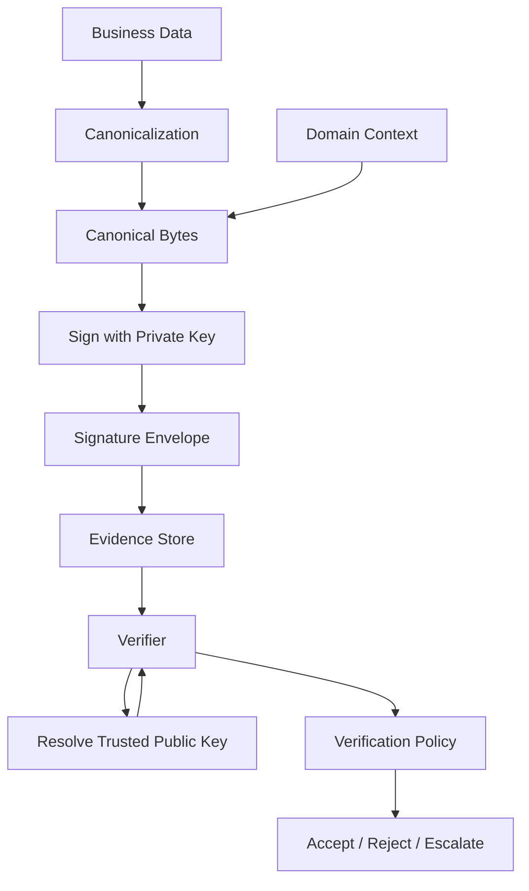
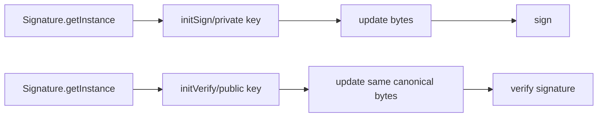
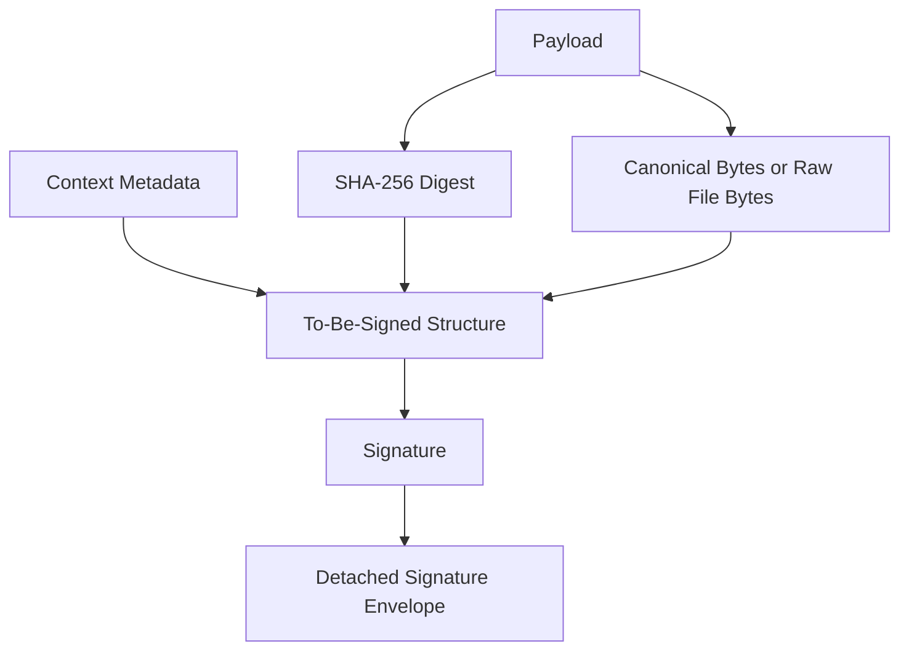
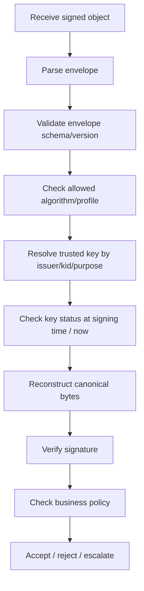
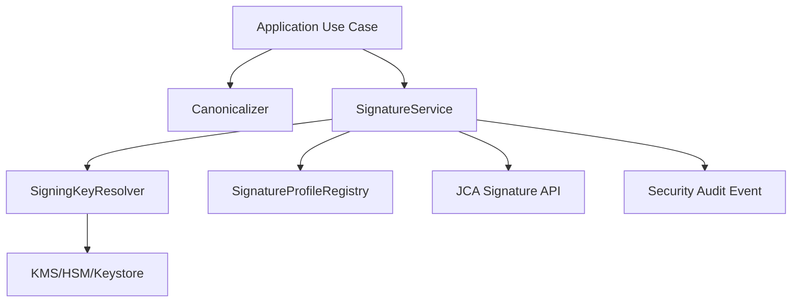

------
title: Learn Java Security, Cryptography and Integrity - Part 012
description: Digital signatures in Java: signature semantics, canonical signing, detached signatures, RSA-PSS, Ed25519, verification pipelines, non-repudiation limits, audit-grade evidence, and integrity failure modes.
series: learn-java-security-cryptography-integrity
seriesTitle: Learn Java Security, Cryptography and Integrity
order: 12
partTitle: Digital Signatures, Non-Repudiation & Integrity
tags:
  - java
  - security
  - cryptography
  - digital-signature
  - integrity
  - non-repudiation
  - audit
  - jca
date: 2026-06-30
---

# Part 012 — Digital Signatures, Non-Repudiation & Integrity

> Target: setelah part ini, kamu mampu mendesain signature flow yang benar secara teknis dan operasional: apa yang ditandatangani, bagaimana canonical bytes dibentuk, bagaimana key identity diverifikasi, bagaimana evidence disimpan, dan kapan klaim “non-repudiation” terlalu berlebihan.

Digital signature sering diperlakukan seperti “hash yang pakai private key”. Mental model itu terlalu dangkal dan berbahaya. Signature bukan hanya operasi cryptographic. Dalam sistem nyata, signature adalah kontrak antara data, format, key identity, waktu, policy, dan verifier.

Signature yang kuat secara algoritma tetap bisa tidak berguna jika:

- data yang ditandatangani tidak canonical,
- verifier memakai public key yang disuplai attacker,
- tidak ada domain separation,
- key ID tidak diautentikasi,
- signed data tidak mengandung business intent,
- tanda tangan tidak mengikat versi schema,
- sistem tidak tahu status key pada waktu signing,
- audit trail tidak menyimpan bukti yang cukup untuk verifikasi masa depan.

Referensi utama:

- Java SE 25 `Signature`: <https://docs.oracle.com/en/java/javase/25/docs/api/java.base/java/security/Signature.html>
- Java SE 25 Security Standard Algorithm Names: <https://docs.oracle.com/en/java/javase/25/docs/specs/security/standard-names.html>
- Java SE 25 JCA Reference Guide: <https://docs.oracle.com/en/java/javase/25/security/java-cryptography-architecture-jca-reference-guide.html>
- NIST FIPS 186-5, Digital Signature Standard: <https://csrc.nist.gov/pubs/fips/186-5/final>
- RFC 8017, RSA PKCS #1 v2.2: <https://www.rfc-editor.org/rfc/rfc8017.html>
- RFC 8032, EdDSA: <https://www.rfc-editor.org/rfc/rfc8032.html>
- OWASP Cryptographic Storage Cheat Sheet: <https://cheatsheetseries.owasp.org/cheatsheets/Cryptographic_Storage_Cheat_Sheet.html>

---

## 1. Kaufman Deconstruction: Signature Skill Map

Untuk belajar digital signature secara efektif, pecah skill menjadi capability berikut.

| Capability | Pertanyaan korektif | Output engineering |
|---|---|---|
| Signature semantics | Apa yang dibuktikan signature ini? | Security property eksplisit. |
| Canonicalization | Byte yang ditandatangani stabil lintas platform? | Canonical format versioned. |
| Domain separation | Signature tidak bisa dipakai ulang di konteks lain? | Protocol label, purpose, schema, audience. |
| Key identity | Public key diverifikasi dari trust source? | Trusted key resolver. |
| Verification policy | Kapan signature diterima/ditolak? | Deterministic verification pipeline. |
| Evidence model | Apa yang disimpan untuk audit masa depan? | Evidence envelope. |
| Non-repudiation boundary | Apakah klaim legal/operasional didukung? | Tidak overclaim. |
| Migration | Bagaimana algoritma/key/signature format berubah? | Versioned signature envelope. |

Core mental model:



A signature is not a magic boolean. It is a claim:

```text
Private key K, bound to identity I for purpose P, signed exact bytes B under algorithm A at/around time T, and verifier policy V accepts that claim.
```

---

## 2. What Digital Signatures Actually Prove

A valid digital signature proves:

1. The signature was generated by someone with access to the corresponding private key.
2. The signed bytes were not changed after signing.
3. The algorithm and verification process accepted the signature for that public key.

A valid digital signature does **not** automatically prove:

- the signer was authorized,
- the human intended the business action,
- the private key was not stolen,
- the data was truthful,
- the signer cannot legally repudiate it,
- the timestamp is trustworthy,
- the public key belongs to the claimed identity,
- the signature is valid under your business policy.

Therefore, secure systems separate:

```text
cryptographic validity != business validity != legal non-repudiation
```

Example:

```text
A signature on “approve case 123” is cryptographically valid.
But if the key belonged to a disabled service account, the business decision may be invalid.
```

---

## 3. Signature vs Hash vs MAC

| Mechanism | Key type | Who can verify | Primary use |
|---|---|---|---|
| Hash | No secret | Anyone | Accidental integrity, content addressing, preimage-resistant fingerprint. |
| MAC/HMAC | Shared secret | Holders of same secret | Integrity/authentication inside one trust domain. |
| Digital signature | Private/public key pair | Anyone with trusted public key | Integrity + origin authentication across trust boundaries. |

Use signature when verifier should not have signing power.

Example:

- Internal service-to-service integrity where both services are equally trusted: HMAC may be enough.
- Regulator verifies a decision package without being able to produce signatures: digital signature.
- Audit evidence must be verified by an independent party: digital signature.

Invariant:

> If verifier must not be able to forge, use asymmetric signatures, not HMAC.

---

## 4. Signature Envelope

Never store only raw signature bytes. Store enough metadata to verify later.

Minimal envelope:

```json
{
  "version": 1,
  "signatureAlg": "Ed25519",
  "keyId": "case-decision-signer-2026-q2",
  "keyPurpose": "CASE_DECISION_SIGNING",
  "canonicalization": "case-decision-c14n-v1",
  "signedAt": "2026-06-30T00:00:00Z",
  "signature": "base64url(...)"
}
```

Better evidence envelope:

```json
{
  "version": 1,
  "signature": {
    "alg": "RSASSA-PSS-SHA256-MGF1-SHA256",
    "value": "base64url(...)"
  },
  "signingKey": {
    "keyId": "case-platform-rsapss-2026-q2",
    "issuer": "internal-case-platform-pki",
    "purpose": "CASE_DECISION_SIGNING",
    "notBefore": "2026-04-01T00:00:00Z",
    "notAfter": "2026-07-01T00:00:00Z"
  },
  "payload": {
    "schema": "case.decision.v3",
    "canonicalization": "case-decision-c14n-v1",
    "digestAlg": "SHA-256",
    "digest": "base64url(...)"
  },
  "context": {
    "tenantId": "tenant-42",
    "caseId": "CASE-2026-000123",
    "decisionId": "DEC-789",
    "purpose": "FINAL_ENFORCEMENT_DECISION",
    "audience": "regulator-portal"
  },
  "time": {
    "claimedSigningTime": "2026-06-30T00:00:00Z",
    "timeSource": "platform-clock",
    "timestampTokenRef": null
  }
}
```

Why metadata matters:

- Future verifier must know algorithm and key.
- Rotated keys need historical lookup.
- Canonicalization version must be reproducible.
- Business context prevents cross-purpose replay.
- Digest allows detached payload storage.

---

## 5. Canonicalization: Sign Bytes, Not Objects

Java objects do not have stable cryptographic representation.

Bad mental model:

```text
Sign this DTO.
```

Correct mental model:

```text
Serialize business meaning into deterministic canonical bytes, then sign those bytes.
```

### 5.1 Why JSON Is Dangerous for Signing

These JSON values may be semantically equivalent for an application but byte-different:

```json
{"amount":100,"currency":"IDR"}
```

```json
{
  "currency": "IDR",
  "amount": 100
}
```

Other pitfalls:

- property ordering,
- whitespace,
- Unicode normalization,
- number formatting,
- timezone formatting,
- optional null fields,
- map ordering,
- escaping differences,
- library version changes,
- locale-sensitive formatting.

If you sign raw JSON produced by a random serializer, you are signing implementation accident, not a stable contract.

### 5.2 Canonicalization Rules

A good canonicalization spec defines:

| Area | Rule |
|---|---|
| Encoding | UTF-8 only. |
| Field order | Deterministic order, usually lexicographic or schema order. |
| Nulls | Include or omit explicitly by schema version. |
| Numbers | No locale formatting; define scale/precision. |
| Time | ISO-8601 UTC or epoch millis/nanos with explicit precision. |
| Unicode | Normalization policy. |
| Binary | Base64url without padding or explicitly specified. |
| Unknown fields | Reject or exclude by explicit rule. |
| Schema | Include schema/version in signed context. |

Example canonical line format for internal evidence:

```text
case.decision.v3
caseId=CASE-2026-000123
decisionId=DEC-789
tenantId=tenant-42
decision=FINAL_WARNING
createdAt=2026-06-30T00:00:00Z
amountMinor=100000
currency=IDR
```

This is not a universal standard, but it illustrates a crucial point: canonicalization must be specified, versioned, and tested.

### 5.3 Canonicalizer Interface

```java
public interface Canonicalizer<T> {
    String id();
    byte[] canonicalize(T value);
}
```

Example:

```java
import java.nio.charset.StandardCharsets;
import java.time.format.DateTimeFormatter;
import java.util.Objects;

public final class CaseDecisionCanonicalizer implements Canonicalizer<CaseDecision> {
    @Override
    public String id() {
        return "case-decision-c14n-v1";
    }

    @Override
    public byte[] canonicalize(CaseDecision decision) {
        Objects.requireNonNull(decision, "decision");

        String canonical = String.join("\n",
            "case.decision.v3",
            "tenantId=" + required(decision.tenantId()),
            "caseId=" + required(decision.caseId()),
            "decisionId=" + required(decision.decisionId()),
            "purpose=FINAL_ENFORCEMENT_DECISION",
            "createdAt=" + DateTimeFormatter.ISO_INSTANT.format(decision.createdAt()),
            "outcome=" + required(decision.outcome()),
            "amountMinor=" + decision.amountMinor(),
            "currency=" + required(decision.currency())
        ) + "\n";

        return canonical.getBytes(StandardCharsets.UTF_8);
    }

    private static String required(String value) {
        if (value == null || value.isBlank()) {
            throw new IllegalArgumentException("required canonical field is missing");
        }
        return value;
    }
}
```

Review note:

- This simplistic sample does not escape newline or `=` in field values.
- A production canonical format must define escaping or reject unsafe characters.
- For public interoperability, use a recognized canonicalization scheme when appropriate.

---

## 6. Domain Separation

A signature over bytes can be replayed anywhere those bytes are accepted. Domain separation ensures a signature for one purpose cannot be reused for another.

Bad signed bytes:

```text
{"caseId":"123","status":"APPROVED"}
```

Better signed bytes:

```text
protocol=case-platform-signature-v1
purpose=FINAL_ENFORCEMENT_DECISION
issuer=case-management-platform
audience=regulator-portal
tenantId=tenant-42
caseId=123
status=APPROVED
```

Domain separation should bind:

- protocol name,
- purpose,
- schema version,
- tenant/realm,
- issuer,
- audience,
- resource ID,
- operation type,
- expiry or signing time where relevant.

Invariant:

> Signature bytes must include enough context that a valid signature cannot be meaningfully transplanted into another workflow.

---

## 7. Java `Signature` API

The `Signature` class provides digital signature algorithm functionality. Typical lifecycle:



### 7.1 Ed25519 Sign/Verify

```java
import java.security.KeyPair;
import java.security.KeyPairGenerator;
import java.security.PrivateKey;
import java.security.PublicKey;
import java.security.Signature;

public final class Ed25519Signer {
    public static KeyPair generateKeyPair() throws Exception {
        KeyPairGenerator generator = KeyPairGenerator.getInstance("Ed25519");
        return generator.generateKeyPair();
    }

    public static byte[] sign(byte[] canonicalBytes, PrivateKey privateKey) throws Exception {
        Signature signature = Signature.getInstance("Ed25519");
        signature.initSign(privateKey);
        signature.update(canonicalBytes);
        return signature.sign();
    }

    public static boolean verify(
        byte[] canonicalBytes,
        byte[] signatureBytes,
        PublicKey publicKey
    ) throws Exception {
        Signature signature = Signature.getInstance("Ed25519");
        signature.initVerify(publicKey);
        signature.update(canonicalBytes);
        return signature.verify(signatureBytes);
    }
}
```

Properties:

- Ed25519 is simple to use because hash/parameter choices are part of the algorithm definition.
- It is attractive for new systems where ecosystem/provider/HSM support exists.
- Compatibility and compliance requirements may still require RSA-PSS or ECDSA.

### 7.2 RSA-PSS Sign/Verify

RSA-PSS should be parameterized explicitly.

```java
import java.security.PrivateKey;
import java.security.PublicKey;
import java.security.Signature;
import java.security.spec.MGF1ParameterSpec;
import java.security.spec.PSSParameterSpec;

public final class RsaPssSigner {
    private static final PSSParameterSpec PSS_SHA256 = new PSSParameterSpec(
        "SHA-256",
        "MGF1",
        MGF1ParameterSpec.SHA256,
        32,
        1
    );

    public static byte[] sign(byte[] canonicalBytes, PrivateKey privateKey) throws Exception {
        Signature signature = Signature.getInstance("RSASSA-PSS");
        signature.setParameter(PSS_SHA256);
        signature.initSign(privateKey);
        signature.update(canonicalBytes);
        return signature.sign();
    }

    public static boolean verify(
        byte[] canonicalBytes,
        byte[] signatureBytes,
        PublicKey publicKey
    ) throws Exception {
        Signature signature = Signature.getInstance("RSASSA-PSS");
        signature.setParameter(PSS_SHA256);
        signature.initVerify(publicKey);
        signature.update(canonicalBytes);
        return signature.verify(signatureBytes);
    }
}
```

Review notes:

- Salt length should match your profile and interop expectations.
- Both signer and verifier must agree on parameters.
- Store parameter profile in signature metadata.
- Do not mix `SHA256withRSA` and `RSASSA-PSS` accidentally.

### 7.3 Streaming Large Data

For large payloads, use incremental `update` calls.

```java
import java.io.InputStream;
import java.security.PrivateKey;
import java.security.Signature;

public final class StreamingSigner {
    public static byte[] signStream(InputStream input, PrivateKey privateKey) throws Exception {
        Signature signature = Signature.getInstance("Ed25519");
        signature.initSign(privateKey);

        byte[] buffer = new byte[8192];
        int read;
        while ((read = input.read(buffer)) != -1) {
            signature.update(buffer, 0, read);
        }

        return signature.sign();
    }
}
```

But be careful: streaming raw file bytes is okay for file integrity, but business-object signatures still need canonicalized business meaning. “Sign stream” does not solve semantic ambiguity.

---

## 8. Detached Signatures

A detached signature stores signature separately from payload.

```text
payload.bin
payload.bin.sig
payload.bin.sig.meta.json
```

Advantages:

- payload can be large,
- signature can be distributed separately,
- verifier can fetch payload from content-addressed storage,
- evidence can store digest instead of duplicating content.

Detached signature envelope:

```json
{
  "version": 1,
  "payloadDigest": {
    "alg": "SHA-256",
    "value": "base64url(...)"
  },
  "signature": {
    "alg": "Ed25519",
    "value": "base64url(...)"
  },
  "keyId": "evidence-signer-2026-q2",
  "canonicalization": "file-bytes-v1",
  "signedAt": "2026-06-30T00:00:00Z"
}
```

Important distinction:

- If you sign the digest, the digest algorithm becomes part of the signed protocol.
- If you store digest only as metadata but sign original bytes, verification must recompute exactly.
- Detached payload retrieval must be protected against substitution. Use digest/content-addressed ID.

Pattern:



---

## 9. Verification Pipeline

A secure verifier is not:

```java
return Signature.verify(signatureBytes);
```

A secure verifier is a policy pipeline.



### 9.1 Verification Result Model

Avoid returning only boolean. Use a structured result.

```java
public sealed interface SignatureVerificationResult {
    record Valid(
        String keyId,
        String algorithm,
        String canonicalization,
        String signerIdentity
    ) implements SignatureVerificationResult {}

    record Invalid(
        FailureCode code,
        String safeMessage
    ) implements SignatureVerificationResult {}

    enum FailureCode {
        MALFORMED_ENVELOPE,
        UNSUPPORTED_ALGORITHM,
        UNKNOWN_KEY,
        KEY_NOT_VALID_FOR_PURPOSE,
        KEY_EXPIRED,
        CANONICALIZATION_FAILED,
        SIGNATURE_MISMATCH,
        POLICY_REJECTED
    }
}
```

This enables:

- safe external errors,
- precise internal metrics,
- audit trails,
- policy review,
- incident triage.

### 9.2 Trusted Key Resolver

```java
import java.security.PublicKey;
import java.time.Instant;

public interface TrustedSigningKeyResolver {
    TrustedSigningKey resolve(SignatureEnvelope envelope, Instant verificationTime);
}

public record TrustedSigningKey(
    String keyId,
    String signerIdentity,
    String purpose,
    PublicKey publicKey,
    Instant notBefore,
    Instant notAfter,
    KeyStatus status
) {}

public enum KeyStatus {
    ACTIVE,
    RETIRED_VERIFY_ONLY,
    REVOKED,
    COMPROMISED
}
```

Policy examples:

- `ACTIVE`: allowed to sign and verify.
- `RETIRED_VERIFY_ONLY`: not allowed for new signing, allowed for historical verification.
- `REVOKED`: reject unless a timestamp proves signing happened before revocation and policy allows it.
- `COMPROMISED`: escalate; maybe reject all signatures after compromise time.

---

## 10. Non-Repudiation: Be Precise

Non-repudiation is often misused. A digital signature can support non-repudiation, but it does not create it alone.

Technical signature gives evidence of private key possession. Strong non-repudiation usually also needs:

- identity proofing,
- credential issuance controls,
- private key protection,
- signer authentication ceremony,
- intent capture,
- trusted timestamp,
- key status/revocation records,
- audit logs,
- policy and legal framework,
- evidence retention,
- dispute process.

Bad statement:

```text
Because it is digitally signed, the user cannot deny it.
```

Better statement:

```text
The signature provides cryptographic evidence that the private key associated with signer identity X under policy P signed canonical payload hash H. Non-repudiation depends on key protection, identity proofing, timestamping, audit records, and applicable legal/process controls.
```

For regulatory systems, this precision matters. Overclaiming non-repudiation can weaken trust when an incident happens.

---

## 11. Signature in Regulatory Case Management

Consider a final enforcement decision.

### 11.1 Business Event

```json
{
  "tenantId": "tenant-42",
  "caseId": "CASE-2026-000123",
  "decisionId": "DEC-789",
  "subjectId": "ORG-456",
  "outcome": "FINAL_WARNING",
  "legalBasis": "REG-ARTICLE-12",
  "approvedBy": "user-123",
  "approvedAt": "2026-06-30T00:00:00Z"
}
```

### 11.2 Signing Intent

The signature should not merely sign an internal row dump. It should sign the intent:

```text
This platform issues final enforcement decision DEC-789 for case CASE-2026-000123 under tenant tenant-42 with outcome FINAL_WARNING and legal basis REG-ARTICLE-12 for audience regulator-portal.
```

### 11.3 Signature Envelope

```json
{
  "version": 1,
  "signatureAlg": "Ed25519",
  "keyId": "case-decision-signer-2026-q2",
  "canonicalization": "case-decision-c14n-v1",
  "purpose": "FINAL_ENFORCEMENT_DECISION",
  "audience": "regulator-portal",
  "payloadDigest": "base64url(sha256(canonicalBytes))",
  "signedAt": "2026-06-30T00:00:00Z",
  "signature": "base64url(...)"
}
```

### 11.4 Why This Is Better Than Signing the Database Row

Database rows often contain:

- internal IDs,
- nullable fields,
- debug fields,
- operational metadata,
- mutable columns,
- formatting artifacts,
- fields irrelevant to legal meaning.

Signing a row dump couples evidence to internal implementation. Signing canonical business meaning creates durable evidence.

---

## 12. Signature Wrapping and Substitution Attacks

A signature can be valid but attached to the wrong object if the verifier selects the wrong signed fragment.

Classic shape:

```xml
<Envelope>
  <SignedObject id="trusted">
    <amount>100</amount>
  </SignedObject>
  <UnsignedObject id="displayed">
    <amount>1000000</amount>
  </UnsignedObject>
  <Signature references="#trusted">...</Signature>
</Envelope>
```

If application reads `displayed` but verifier verified `trusted`, the signature check is meaningless.

Generalized risk:

```text
Verifier checks A.
Application executes B.
Attacker controls relationship between A and B.
```

Defense:

- The application must execute exactly the data that was verified.
- Reference resolution must be strict.
- Reject duplicate IDs.
- Signed payload digest must match the object used by business logic.
- For JSON/XML, avoid complex reference semantics unless required.
- Keep “parse → canonicalize → verify → execute verified object” as a single pipeline.

---

## 13. Replay and Freshness

Signature proves data integrity, not freshness. A valid old signature may still verify today.

Replay examples:

- Reuse old signed payment authorization.
- Re-submit old signed webhook.
- Use old signed approval after case was reopened.
- Reuse signed token in another tenant.

Controls:

| Control | Use |
|---|---|
| Nonce | One-time actions. |
| Timestamp + max age | Webhooks/API requests. |
| Sequence number | Ordered streams. |
| Idempotency key | Duplicate suppression. |
| Business state check | Prevent old decision from applying to new state. |
| Audience/tenant binding | Prevent cross-context replay. |
| Expiry | Bound validity window. |

Signed freshness context:

```text
purpose=WEBHOOK_DELIVERY
webhookId=wh_123
deliveryId=del_456
timestamp=2026-06-30T00:00:00Z
maxSkewSeconds=300
bodyDigest=...
```

Invariant:

> Every signed command needs a replay story.

---

## 14. Detached File Evidence

For documents, PDFs, exports, or evidence packages, a common design is:

1. Normalize/canonicalize metadata.
2. Hash file bytes.
3. Build a to-be-signed manifest.
4. Sign the manifest.
5. Store file, manifest, signature envelope, and key evidence.

Manifest example:

```json
{
  "manifestVersion": 1,
  "packageId": "EVID-2026-0001",
  "files": [
    {
      "name": "decision.pdf",
      "mediaType": "application/pdf",
      "sha256": "base64url(...)"
    },
    {
      "name": "appendix.json",
      "mediaType": "application/json",
      "sha256": "base64url(...)"
    }
  ],
  "context": {
    "tenantId": "tenant-42",
    "caseId": "CASE-2026-000123",
    "purpose": "REGULATORY_EXPORT"
  }
}
```

Sign canonical manifest bytes, not arbitrary zip bytes unless zip canonicalization is controlled. Zip files can contain ordering, timestamps, compression differences, path weirdness, and platform metadata.

---

## 15. Time and Signature Validity

Verification is time-sensitive. A signature can be evaluated:

- at current time,
- at claimed signing time,
- at trusted timestamp time,
- under historical policy.

Example:

```text
Key K was active from Apr 1 to Jul 1.
Signature claims Jun 30.
Verifier runs Sep 1.
Should it verify?
```

Maybe yes, if you are verifying historical evidence and have reliable proof that signing happened before key expiry/revocation.

Maybe no, if the signature is an API command that must be fresh.

Policy must distinguish:

| Scenario | Time policy |
|---|---|
| API request signature | Verify now; reject old timestamp. |
| JWT access token | Verify now; respect `exp`, `nbf`, issuer policy. |
| Audit evidence | Verify at signing/evidence time; preserve key status evidence. |
| Legal document | Often needs trusted timestamp and certificate validation evidence. |

For high-value evidence, consider trusted timestamping and archival validation strategies. Do not rely only on local system time if dispute resistance matters.

---

## 16. Algorithm Choices for Signatures

| Algorithm | Strengths | Risks / constraints |
|---|---|---|
| Ed25519 | Simple API, deterministic, compact, modern. | Provider/HSM/compliance support may vary. |
| Ed448 | Higher security margin, modern. | Less common ecosystem support. |
| ECDSA P-256/P-384 | Common in TLS/certificates, FIPS environments. | Nonce failures historically catastrophic if implementation poor; encoding interop issues. |
| RSA-PSS | Strong RSA signature scheme, good enterprise compatibility. | Larger signatures/keys; parameter discipline required. |
| RSA PKCS#1 v1.5 signature | Legacy compatibility. | Avoid for new designs when PSS/EdDSA viable. |
| DSA | Legacy. | Not preferred for new systems; check modern policy. |

Guideline:

- New internal service signatures: consider Ed25519 if provider/ops/compliance allow it.
- Enterprise/regulatory/HSM-heavy contexts: RSA-PSS or ECDSA may be required.
- Legacy verification: support old algorithms only on read/verify path with policy and telemetry.
- Never introduce SHA-1/MD5 signature algorithms for new flows.

---

## 17. Key Purpose Separation

Do not use one key for everything.

Bad:

```text
platform-master-key signs JWTs, signs audit logs, signs exports, decrypts files, and authenticates mTLS.
```

Better:

```text
jwt-signing-2026-q2
case-decision-signing-2026-q2
audit-log-signing-2026-q2
export-package-signing-2026-q2
mTLS-service-identity-2026-q2
```

Why:

- Compromise blast radius is smaller.
- Revocation is more precise.
- Audit logs are clearer.
- Policy enforcement is easier.
- Algorithm migration can happen per purpose.

Key registry should include:

```text
keyId
algorithm
publicKey/certificate reference
owner
purpose
status
notBefore
notAfter
createdBy
createdAt
rotationPolicy
compromiseStatus
allowedSigners
allowedVerifiers
```

---

## 18. Verification Anti-Patterns

### 18.1 Attacker-Supplied Public Key

```java
PublicKey key = parsePublicKey(request.publicKey());
verify(request.payload(), request.signature(), key);
```

This verifies only that the attacker signed their own payload.

Fix: resolve key from trusted source.

### 18.2 Missing Canonicalization

```java
byte[] bytes = objectMapper.writeValueAsBytes(dto);
```

This may change across library versions/configuration.

Fix: explicit canonicalization spec.

### 18.3 Verify Then Parse Differently

```java
verify(rawBytes, sig, key);
BusinessObject obj = parser.parse(rawBytes);
```

This can still be risky if parser has ambiguity, duplicate fields, or semantic transformations.

Fix: parse strictly, canonicalize, verify canonical representation, then execute the verified representation.

### 18.4 Signature Without Purpose

```text
caseId=123
status=APPROVED
```

Could be replayed across workflows.

Fix: domain separation.

### 18.5 Boolean-Only Result

```java
if (verify(...)) approve();
```

No policy, no reason, no audit.

Fix: structured verification result + policy decision.

---

## 19. Signature Service Design

A production signature module should not expose low-level JCA everywhere.

Recommended boundaries:



Interface:

```java
public interface SignatureService<T> {
    SignatureEnvelope sign(SignaturePurpose purpose, T value);
    SignatureVerificationResult verify(SignatureEnvelope envelope, T value);
}
```

Profile:

```java
public record SignatureProfile(
    String id,
    String algorithm,
    String keyAlgorithm,
    String canonicalizationId,
    String purpose,
    boolean allowedForNewSigning,
    boolean allowedForVerification
) {}
```

Why this matters:

- prevents algorithm string sprawl,
- makes migration manageable,
- enforces purpose separation,
- centralizes audit events,
- allows provider/HSM abstraction,
- enables negative tests.

---

## 20. Startup Self-Tests

At startup, verify required profiles are usable.

```java
public final class SignatureStartupChecks {
    public static void assertProfileAvailable(SignatureProfile profile) {
        try {
            Signature.getInstance(profile.algorithm());
        } catch (Exception e) {
            throw new IllegalStateException(
                "Required signature algorithm unavailable: " + profile.algorithm(),
                e
            );
        }
    }
}
```

More mature startup checks:

- resolve active signing key,
- sign and verify a known startup probe,
- verify provider name if required,
- verify HSM/KMS access,
- check key status not expired,
- reject deprecated write profile,
- emit security readiness metric.

Do not wait until first production transaction to discover provider/key incompatibility.

---

## 21. Testing Strategy

### 21.1 Golden Canonicalization Tests

For each signed type, store golden canonical bytes.

```java
class CaseDecisionCanonicalizerTest {
    @org.junit.jupiter.api.Test
    void canonicalBytesAreStable() {
        CaseDecision decision = Fixtures.caseDecision();
        byte[] bytes = new CaseDecisionCanonicalizer().canonicalize(decision);

        assertThat(new String(bytes, StandardCharsets.UTF_8))
            .isEqualTo("""
                case.decision.v3
                tenantId=tenant-42
                caseId=CASE-2026-000123
                decisionId=DEC-789
                purpose=FINAL_ENFORCEMENT_DECISION
                createdAt=2026-06-30T00:00:00Z
                outcome=FINAL_WARNING
                amountMinor=100000
                currency=IDR
                """);
    }
}
```

### 21.2 Tamper Tests

- Change one field → verification fails.
- Change purpose → verification fails.
- Change audience → verification fails.
- Change key ID → fails or resolves different key and fails.
- Change canonicalization ID → reject.
- Change algorithm → reject unless allowed profile.
- Use unknown key → reject.
- Use retired signing key for new signing → reject.
- Verify old signature with verify-only retired key → accept if policy allows.

### 21.3 Cross-Context Replay Test

```java
@org.junit.jupiter.api.Test
void decisionSignatureCannotBeUsedAsExportSignature() {
    SignatureEnvelope decisionSignature = sign(
        SignaturePurpose.FINAL_ENFORCEMENT_DECISION,
        caseDecision
    );

    SignatureVerificationResult result = verify(
        SignaturePurpose.REGULATORY_EXPORT,
        exportPackage,
        decisionSignature
    );

    assertThat(result).isInstanceOf(SignatureVerificationResult.Invalid.class);
}
```

### 21.4 Negative Interop Tests

- Wrong PSS salt length.
- Wrong MGF hash.
- Wrong curve/key type.
- DER vs raw signature encoding mismatch for ECDSA.
- JSON property order changes.
- Unicode normalization differences.

---

## 22. Observability for Signature Flows

Log security events, not secrets.

Good fields:

```json
{
  "eventType": "SIGNATURE_VERIFICATION_FAILED",
  "correlationId": "...",
  "signatureProfile": "case-decision-ed25519-v1",
  "keyId": "case-decision-signer-2026-q2",
  "purpose": "FINAL_ENFORCEMENT_DECISION",
  "failureCode": "SIGNATURE_MISMATCH",
  "tenantId": "tenant-42",
  "caseId": "CASE-2026-000123"
}
```

Avoid:

- private key,
- full PII payload,
- raw secrets,
- stack traces to client,
- detailed oracle-like distinction in external response.

Metrics:

- signature verification failures by reason,
- unknown key ID rate,
- deprecated algorithm verification count,
- signing key expiry window,
- HSM/KMS signing latency,
- canonicalization failure count,
- replay rejection count.

Alert examples:

- sudden spike in `SIGNATURE_MISMATCH`,
- unknown `kid` attempts,
- use of disabled algorithm,
- signing attempts with expired key,
- verification failures from one tenant/source.

---

## 23. Secure Failure Behavior

External response should be generic:

```json
{
  "error": "invalid_signature"
}
```

Internal reason can be precise:

```text
failureCode=KEY_NOT_VALID_FOR_PURPOSE
```

Why:

- Attackers should not easily enumerate valid key IDs.
- Attackers should not learn which canonicalization step passed.
- Attackers should not distinguish malformed signature from wrong key in high-risk protocols.
- Operators still need actionable diagnostics.

Pattern:

```java
try {
    SignatureVerificationResult result = verifier.verify(envelope, payload);
    if (result instanceof SignatureVerificationResult.Valid) {
        return Accepted.INSTANCE;
    }

    auditFailure(result);
    throw new InvalidSignatureException("invalid_signature");
} catch (MalformedEnvelopeException e) {
    auditMalformed(e);
    throw new InvalidSignatureException("invalid_signature");
}
```

---

## 24. Secure Code Review Checklist

### To-Be-Signed Data

- [ ] Is the exact byte representation specified?
- [ ] Is canonicalization deterministic and versioned?
- [ ] Are schema version, purpose, issuer, audience, and tenant included?
- [ ] Are ambiguous fields rejected?
- [ ] Are duplicate/unknown fields handled explicitly?

### Key and Algorithm

- [ ] Is public key resolved from trusted source?
- [ ] Is key purpose checked?
- [ ] Is key status checked?
- [ ] Is algorithm allowed by policy?
- [ ] Are RSA-PSS parameters explicit if used?
- [ ] Are legacy algorithms verify-only if still required?

### Verification

- [ ] Does verification reconstruct canonical bytes independently?
- [ ] Does business logic execute the verified object, not a separate parse result?
- [ ] Is replay handled?
- [ ] Are failure responses normalized?
- [ ] Are audit events emitted?

### Evidence

- [ ] Is signature envelope stored with metadata?
- [ ] Is signing time captured?
- [ ] Is key identity/status evidence recoverable later?
- [ ] Is payload digest stored for detached evidence?
- [ ] Is retention policy aligned with verification needs?

### Operations

- [ ] Are signing keys rotated?
- [ ] Is compromise response documented?
- [ ] Are old signatures verifiable after rotation?
- [ ] Are signature metrics monitored?
- [ ] Is startup readiness checked?

---

## 25. Hands-On Lab

Build `signature-integrity-lab`.

### Lab 1 — Ed25519 Case Decision Signature

Implement:

```text
SignatureEnvelope signCaseDecision(CaseDecision decision)
SignatureVerificationResult verifyCaseDecision(CaseDecision decision, SignatureEnvelope envelope)
```

Requirements:

- Canonicalization ID: `case-decision-c14n-v1`.
- Include purpose: `FINAL_ENFORCEMENT_DECISION`.
- Include tenant, case ID, decision ID, outcome, legal basis, signedAt.
- Use Ed25519.
- Store key ID and signature algorithm.
- Reject tampered fields.
- Reject wrong purpose.

### Lab 2 — RSA-PSS Compatibility Profile

Add second profile:

```text
RSASSA-PSS-SHA256-MGF1-SHA256
```

Requirements:

- Explicit `PSSParameterSpec`.
- Dual verification support.
- New signing can be switched between profiles by config.
- Old profile can be set to verify-only.

### Lab 3 — Replay Defense

Create signed command:

```json
{
  "commandId": "cmd-123",
  "tenantId": "tenant-42",
  "caseId": "CASE-2026-000123",
  "action": "APPROVE",
  "issuedAt": "2026-06-30T00:00:00Z",
  "expiresAt": "2026-06-30T00:05:00Z"
}
```

Requirements:

- Reject same `commandId` twice.
- Reject expired command.
- Reject command for wrong tenant/case.
- Signature must cover `expiresAt` and `commandId`.

### Lab 4 — Evidence Package

Create:

```text
manifest.json
manifest.sig.json
decision.pdf
appendix.json
```

Requirements:

- Manifest includes SHA-256 digest of each file.
- Signature covers canonical manifest.
- Verification recomputes file hashes.
- Tampering one file fails verification.

---

## 26. Mental Compression

Remember:

```text
A signature proves private-key possession over exact bytes.
It does not automatically prove identity, authorization, intent, freshness, truth, or legal non-repudiation.
```

Production-grade signature system:

```text
canonical bytes
+ domain separation
+ trusted key identity
+ explicit algorithm profile
+ verification policy
+ replay control
+ evidence envelope
+ audit trail
+ migration plan
```

If you only have `Signature.sign()` and `Signature.verify()`, you have a crypto primitive. You do not yet have a secure signature system.

---

## 27. What Comes Next

Part 013 moves from public/private keys to trust infrastructure:

- X.509 certificates,
- PKI hierarchy,
- trust anchors,
- certificate chain validation,
- Java keystore/truststore,
- revocation,
- hostname verification,
- certificate rotation.
