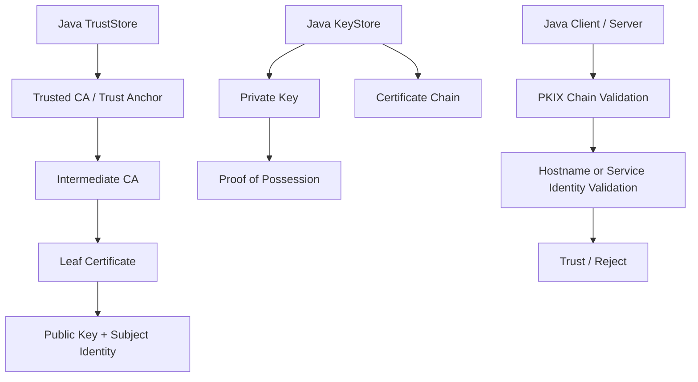
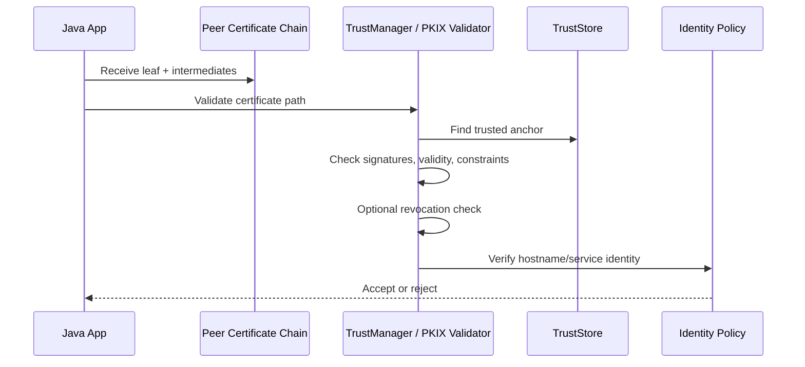
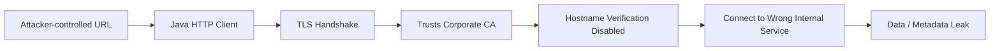
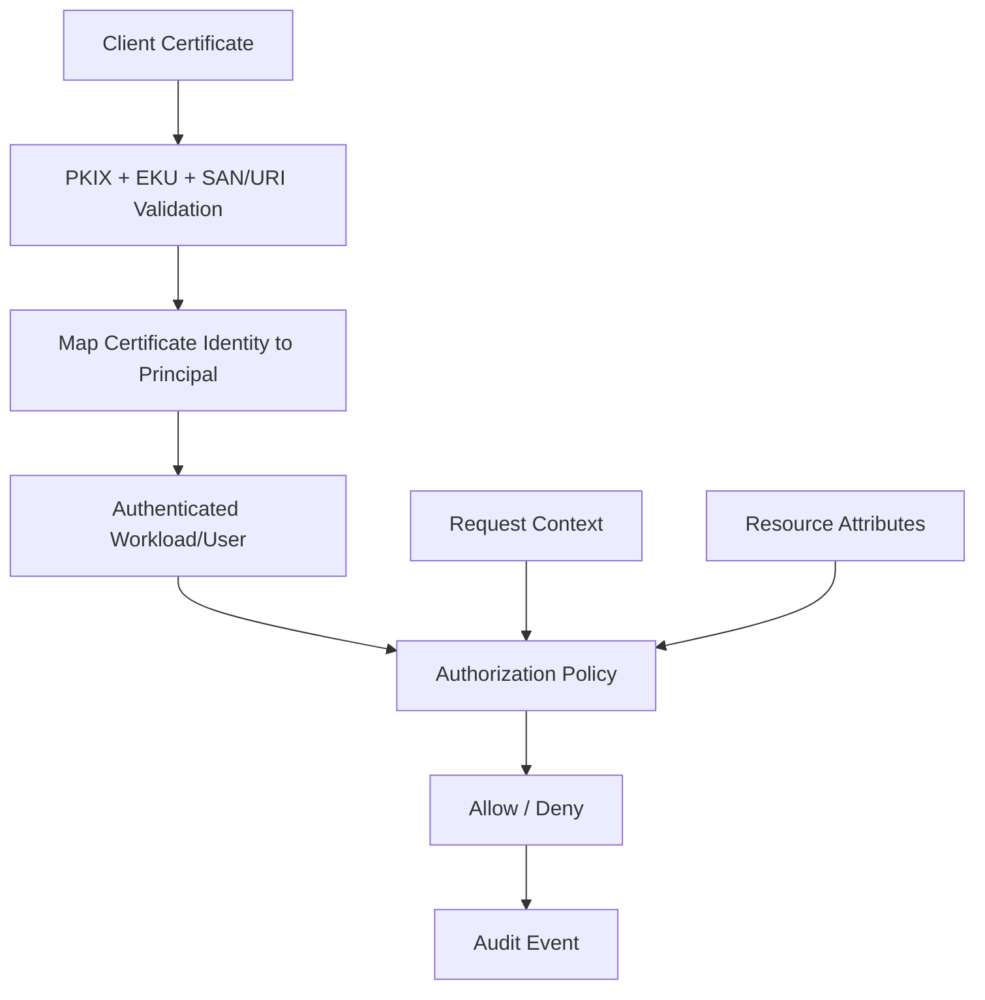
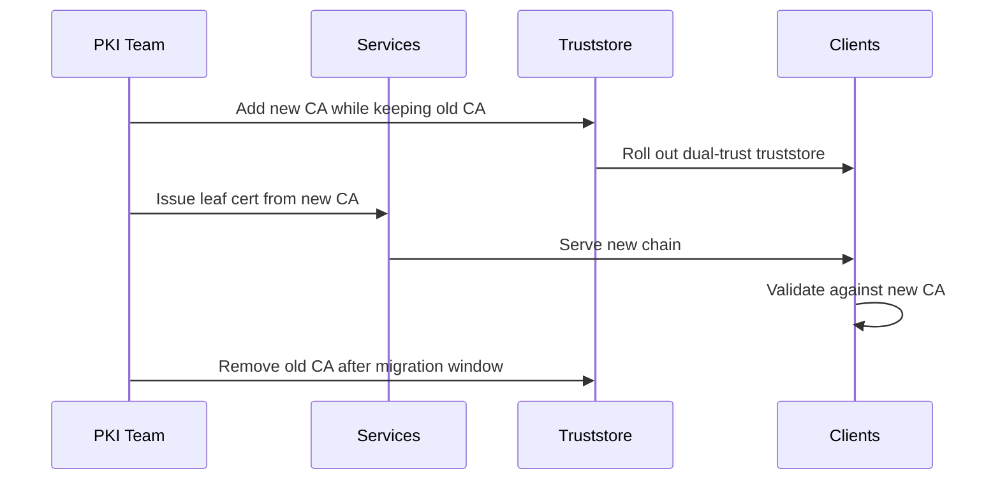
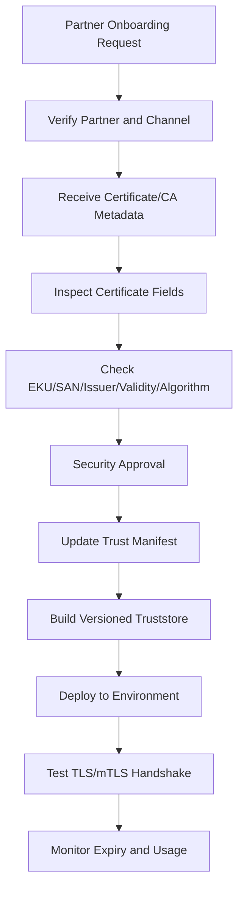

------
title: Learn Java Security, Cryptography and Integrity - Part 013
description: Certificates, X.509, PKI, Java KeyStore/TrustStore, trust anchors, PKIX validation, hostname verification, revocation, mTLS identity boundaries, and certificate rotation for production Java systems.
series: learn-java-security-cryptography-integrity
seriesTitle: Learn Java Security, Cryptography and Integrity
order: 13
partTitle: Certificates, X.509, PKI & Trust Stores
tags:
  - java
  - security
  - cryptography
  - pki
  - x509
  - truststore
  - keystore
  - jsse
  - integrity
date: 2026-06-30
---

# Part 013 — Certificates, X.509, PKI & Trust Stores

> Target: setelah part ini, kamu mampu menjelaskan dan mereview bagaimana trust dibentuk di Java: apa beda private key, certificate, certificate chain, trust anchor, keystore, truststore, PKIX path validation, hostname verification, revocation, dan certificate rotation. Fokus part ini adalah **trust material dan certificate validation**, bukan konfigurasi TLS end-to-end; TLS detail akan dibahas di Part 015.

Certificate sering dipahami sebagai “file SSL”. Itu terlalu dangkal. Dalam sistem production, certificate adalah **binding antara public key, identity, issuer, validity period, constraints, dan policy**. Private key membuktikan possession. Certificate membuktikan bahwa public key tersebut diasosiasikan dengan subject tertentu menurut issuer tertentu. Truststore menentukan issuer mana yang dipercaya. Keystore menentukan key material mana yang dipakai oleh service untuk membuktikan identitasnya.

Kesalahan paling mahal dalam area ini biasanya bukan algoritma X.509-nya, tetapi **trust model yang salah**:

- memasukkan server certificate self-signed ke truststore tanpa lifecycle,
- memakai `TrustManager` yang menerima semua certificate,
- mencampur keystore dan truststore,
- lupa hostname verification,
- menerima certificate chain yang valid secara kriptografis tetapi salah identity,
- tidak punya inventory certificate,
- rotation dilakukan manual tanpa overlap,
- revocation dianggap magic padahal sering tidak reliable tanpa policy eksplisit,
- mTLS dipakai sebagai authorization padahal baru authentication.

Referensi utama:

- Java SE 25 JSSE Reference Guide: <https://docs.oracle.com/en/java/javase/25/security/java-secure-socket-extension-jsse-reference-guide.html>
- Java SE 25 JCA Reference Guide: <https://docs.oracle.com/en/java/javase/25/security/java-cryptography-architecture-jca-reference-guide.html>
- Java SE 25 `KeyStore`: <https://docs.oracle.com/en/java/javase/25/docs/api/java.base/java/security/KeyStore.html>
- Java SE 25 `KeyManagerFactory`: <https://docs.oracle.com/en/java/javase/25/docs/api/java.base/javax/net/ssl/KeyManagerFactory.html>
- Java SE 25 `TrustManagerFactory`: <https://docs.oracle.com/en/java/javase/25/docs/api/java.base/javax/net/ssl/TrustManagerFactory.html>
- Java `keytool`: <https://docs.oracle.com/en/java/javase/11/tools/keytool.html>
- RFC 5280, Internet X.509 Public Key Infrastructure Certificate and CRL Profile: <https://www.rfc-editor.org/rfc/rfc5280>
- OWASP Transport Layer Security Cheat Sheet: <https://cheatsheetseries.owasp.org/cheatsheets/Transport_Layer_Security_Cheat_Sheet.html>
- OWASP Cryptographic Storage Cheat Sheet: <https://cheatsheetseries.owasp.org/cheatsheets/Cryptographic_Storage_Cheat_Sheet.html>

---

## 1. Kaufman Deconstruction: PKI Skill Map

Untuk menguasai PKI di Java secara efektif, pecah skill menjadi beberapa capability kecil.

| Capability | Pertanyaan korektif | Output engineering |
|---|---|---|
| Certificate semantics | Certificate ini membuktikan apa? | Identity binding yang eksplisit. |
| Key/certificate separation | Mana private key, mana public certificate, mana CA trust? | Keystore/truststore tidak tercampur. |
| Trust anchor control | Root/intermediate CA mana yang dipercaya? | Truststore terkurasi dan versioned. |
| Chain validation | Apakah chain valid sampai trust anchor? | PKIX validation policy. |
| Identity validation | Apakah certificate valid untuk host/service yang diakses? | Hostname/SAN verification. |
| Revocation model | Bagaimana certificate dicabut dan diputuskan invalid? | OCSP/CRL policy atau compensating controls. |
| Rotation | Bagaimana certificate diganti tanpa downtime? | Overlap, dual trust, monitoring expiry. |
| mTLS identity | Apa arti client certificate bagi domain? | Mapping identity dan authorization boundary. |
| Incident response | Apa yang dilakukan saat private key bocor? | Revoke, rotate, reissue, re-encrypt/re-sign jika perlu. |

Mental model utama:



PKI bukan hanya file `.crt`, `.pem`, `.p12`, atau `.jks`. PKI adalah sistem keputusan: **siapa yang boleh menerbitkan identity binding, untuk identity apa, selama berapa lama, dengan constraint apa, dan verifier mana yang harus menolak binding tersebut**.

---

## 2. Vocabulary yang Harus Presisi

Gunakan istilah secara ketat. Banyak bug certificate muncul dari vocabulary yang kabur.

| Istilah | Arti | Kesalahan umum |
|---|---|---|
| Private key | Secret key asymmetric yang harus tetap rahasia. | Disimpan di image Docker, repo, atau shared ke banyak service. |
| Public key | Key publik yang diverifikasi melalui certificate. | Dianggap trusted hanya karena bisa dibaca. |
| Certificate | Dokumen signed yang mengikat public key dengan subject identity. | Dianggap sama dengan private key. |
| Certificate chain | Leaf + intermediate certificate sampai trust anchor. | Mengirim chain tidak lengkap. |
| Root CA | Trust anchor self-signed yang dipercaya secara eksplisit. | Root CA internal disebar tanpa governance. |
| Intermediate CA | CA di bawah root untuk menerbitkan leaf certificate. | Intermediate CA diperlakukan sama sensitifnya dengan leaf. |
| Leaf certificate | Certificate untuk server, client, service, user, code signing, atau workload. | Dipakai untuk purpose yang tidak sesuai EKU. |
| Keystore | Store untuk private key dan certificate chain milik aplikasi. | Dicampur dengan CA trust. |
| Truststore | Store untuk trusted CA/certificate yang dipakai verifier. | Diisi leaf certificate satu per satu tanpa lifecycle. |
| SAN | Subject Alternative Name; identity modern untuk DNS/IP/URI/email. | Bergantung pada CN saja. |
| CN | Common Name; field subject lama. | Dipakai sebagai satu-satunya hostname identity. |
| EKU | Extended Key Usage; membatasi purpose certificate. | Server cert dipakai untuk client auth/signing. |
| Revocation | Mekanisme mencabut certificate sebelum expiry. | Dianggap selalu otomatis diverifikasi. |

Rule praktis:

> **Certificate is public. Private key is secret. Trust anchor is policy. Chain validation is cryptography + policy. Hostname validation is identity.**

---

## 3. Apa yang Sebenarnya Dibuktikan Certificate?

Certificate tidak membuktikan bahwa service aman. Certificate hanya membuktikan bahwa issuer tertentu menyatakan:

1. public key tertentu dimiliki oleh subject tertentu,
2. binding itu berlaku dalam periode tertentu,
3. binding itu memiliki batasan penggunaan tertentu,
4. binding itu ditandatangani oleh issuer yang chain-nya dipercaya verifier.

Contoh: certificate untuk `api.regulator.example` dengan SAN `DNS:api.regulator.example` dan EKU `serverAuth` membuktikan bahwa public key dalam certificate boleh dipakai untuk server authentication terhadap identity DNS tersebut, selama chain valid dan policy terpenuhi.

Certificate **tidak** membuktikan:

- service tidak punya vulnerability,
- data tidak corrupt di database,
- user yang mengakses service berhak melakukan action,
- private key tidak pernah bocor,
- domain tidak sedang dikompromikan,
- CA tidak salah menerbitkan certificate,
- endpoint backend yang dipanggil oleh service sama dengan endpoint yang dipikirkan developer.

Ini penting karena banyak organisasi memakai TLS certificate sebagai rasa aman palsu. TLS certificate adalah bagian dari trust bootstrapping, bukan pengganti authorization, validation, audit integrity, atau supply-chain control.

---

## 4. X.509 Certificate: Field yang Relevan untuk Engineer

X.509 certificate punya banyak field. Tidak semua perlu dihafal, tetapi beberapa harus bisa direview.

| Field / Extension | Pertanyaan review | Dampak |
|---|---|---|
| Subject | Identity apa yang dinyatakan? | Legacy identity; jangan mengandalkan CN saja. |
| Subject Alternative Name | DNS/IP/URI/email apa yang valid? | Hostname verification modern memakai SAN. |
| Issuer | Siapa yang menerbitkan? | Menentukan chain. |
| Serial Number | Identifier unik di issuer scope. | Dipakai untuk revocation dan audit. |
| Validity | `notBefore` dan `notAfter`. | Expired/not-yet-valid harus ditolak. |
| Subject Public Key Info | Algorithm dan public key. | Harus sesuai policy algorithm strength. |
| Key Usage | Operasi key yang diizinkan. | Contoh: digitalSignature, keyEncipherment. |
| Extended Key Usage | Purpose aplikasi. | Contoh: serverAuth, clientAuth, codeSigning. |
| Basic Constraints | Apakah certificate CA? Path length? | Leaf tidak boleh menjadi CA. |
| Authority Key Identifier | Menghubungkan ke issuer key. | Membantu chain building. |
| Subject Key Identifier | Identifier key subject. | Membantu chain building. |
| CRL Distribution Points | Lokasi CRL. | Revocation support. |
| Authority Information Access | OCSP/issuer URL. | Chain retrieval / OCSP. |
| Name Constraints | Batas domain yang boleh diterbitkan CA. | Penting untuk CA internal/subordinate. |

Minimal review untuk leaf server certificate:

```text
[ ] SAN berisi DNS/IP yang benar.
[ ] EKU mengandung serverAuth.
[ ] Basic Constraints: CA=false.
[ ] Validity period sesuai policy.
[ ] Signature algorithm tidak legacy/lemah.
[ ] Public key algorithm dan size sesuai policy.
[ ] Chain lengkap sampai intermediate yang benar.
[ ] Issuer sesuai CA yang diharapkan.
[ ] Private key tidak pernah keluar dari boundary yang disetujui.
```

---

## 5. PKI Chain Validation: Bukan Sekadar “Certificate Signed”

PKIX path validation biasanya mencakup:

1. membangun chain dari leaf ke trust anchor,
2. memverifikasi signature setiap certificate,
3. memeriksa validity period,
4. memeriksa Basic Constraints,
5. memeriksa Key Usage dan Extended Key Usage,
6. memeriksa name constraints,
7. memeriksa policy constraints jika digunakan,
8. memeriksa revocation jika policy mengaktifkannya,
9. memverifikasi identity target, misalnya hostname.

Dalam Java, chain validation biasanya terjadi melalui JSSE ketika TLS handshake, atau secara eksplisit melalui `CertPathValidator`.

Mental model:



Important distinction:

- **Chain valid** berarti certificate path dapat dipercaya sampai trust anchor.
- **Hostname valid** berarti certificate benar untuk host/service yang sedang diakses.
- **Authorization valid** berarti identity yang sudah diautentikasi boleh melakukan action tertentu.

Tiga keputusan ini berbeda. Jangan campur.

---

## 6. Java KeyStore vs TrustStore

`KeyStore` adalah API Java untuk menyimpan key dan certificate. Dalam praktik JSSE, istilah keystore dan truststore merujuk pada role, bukan class berbeda.

### 6.1 Keystore

Keystore biasanya berisi:

- private key milik service,
- certificate leaf untuk private key tersebut,
- certificate chain yang perlu dikirim ke peer.

Digunakan oleh `KeyManagerFactory` untuk memilih certificate/key saat service harus membuktikan identitasnya.

### 6.2 Truststore

Truststore biasanya berisi:

- trusted root CA,
- kadang intermediate CA internal,
- kadang pinned leaf certificate untuk kasus khusus.

Digunakan oleh `TrustManagerFactory` untuk memutuskan certificate peer dipercaya atau tidak.

### 6.3 Anti-pattern: satu file untuk semua

Menggunakan satu file sebagai keystore sekaligus truststore membuat boundary kabur:

- secret private key dan public trust anchors punya sensitivity berbeda,
- akses baca truststore tidak boleh otomatis berarti akses baca private key,
- lifecycle trust anchor dan server key berbeda,
- audit perubahan trust policy menjadi sulit.

Praktik yang lebih baik:

```text
service-keystore.p12     -> private key + certificate chain milik service
service-truststore.p12   -> CA trust anchors untuk peer yang diizinkan
```

Jika memakai HSM/PKCS#11, private key mungkin tidak berada dalam file sama sekali; keystore bisa berupa logical view ke token/provider.

---

## 7. Keystore Type: PKCS12, JKS, PEM, PKCS#11

Java mendukung beberapa format dan provider-backed stores. Pilihan format harus mengikuti operational model, bukan selera.

| Type | Karakter | Kapan dipakai | Catatan |
|---|---|---|---|
| `PKCS12` | Portable keystore berbasis standard container. | Default umum untuk file keystore modern. | Cocok untuk private key + chain. |
| `JKS` | Java KeyStore format lama. | Legacy compatibility. | Hindari untuk sistem baru kecuali ada constraint. |
| `PEM` | Text encoding untuk cert/key; bukan `KeyStore` type klasik. | Banyak dipakai di cloud/proxy/tooling. | Java perlu loader/converter atau library tambahan. |
| `PKCS11` | Interface ke HSM/token/native crypto. | Key tidak boleh keluar dari hardware/token boundary. | Provider-backed, bukan file biasa. |
| OS store | Windows/macOS/native trust. | Desktop/integrasi OS tertentu. | Provider dan behavior bisa berbeda. |

Operational heuristic:

- Untuk service internal biasa: `PKCS12` untuk keystore/truststore.
- Untuk key sangat sensitif: HSM/KMS/PKCS#11 atau managed key service.
- Untuk container: jangan bake private key ke image; mount/inject saat runtime atau gunakan workload identity/KMS.
- Untuk truststore internal: versioned artifact dengan review dan rollout plan.

---

## 8. `keytool`: Utility, Bukan Governance

`keytool` berguna untuk generate keypair, CSR, import/export certificate, dan inspect keystore. Tetapi `keytool` bukan pengganti CA process, approval, inventory, atau rotation automation.

Contoh inspect keystore:

```bash
keytool -list -v \
  -keystore service-keystore.p12 \
  -storetype PKCS12
```

Generate keypair untuk lab lokal:

```bash
keytool -genkeypair \
  -alias service-a \
  -keyalg RSA \
  -keysize 3072 \
  -sigalg SHA256withRSA \
  -dname "CN=service-a.local" \
  -ext "SAN=dns:service-a.local" \
  -ext "EKU=serverAuth" \
  -keystore service-a-keystore.p12 \
  -storetype PKCS12 \
  -validity 90
```

Generate CSR:

```bash
keytool -certreq \
  -alias service-a \
  -keystore service-a-keystore.p12 \
  -storetype PKCS12 \
  -file service-a.csr
```

Import CA certificate ke truststore lab:

```bash
keytool -importcert \
  -alias internal-root-ca \
  -file internal-root-ca.crt \
  -keystore service-truststore.p12 \
  -storetype PKCS12
```

Anti-pattern:

```bash
# Dangerous in production jika dilakukan tanpa governance:
keytool -importcert -alias random-server -file downloaded-server.crt -keystore cacerts
```

Masalahnya bukan command-nya. Masalahnya adalah trust policy: siapa yang menyetujui certificate itu, apa scope trust-nya, kapan expired, bagaimana revoke, dan bagaimana audit perubahannya.

---

## 9. Java API: Loading KeyStore dan TrustStore

Contoh loading `PKCS12` keystore/truststore untuk membangun `SSLContext`.

```java
import javax.net.ssl.KeyManagerFactory;
import javax.net.ssl.SSLContext;
import javax.net.ssl.TrustManagerFactory;
import java.io.InputStream;
import java.nio.file.Files;
import java.nio.file.Path;
import java.security.KeyStore;
import java.security.SecureRandom;

public final class SslContexts {
    private SslContexts() {}

    public static SSLContext forMutualTls(
            Path keyStorePath,
            char[] keyStorePassword,
            Path trustStorePath,
            char[] trustStorePassword
    ) throws Exception {
        KeyStore keyStore = KeyStore.getInstance("PKCS12");
        try (InputStream in = Files.newInputStream(keyStorePath)) {
            keyStore.load(in, keyStorePassword);
        }

        KeyManagerFactory kmf = KeyManagerFactory.getInstance(
                KeyManagerFactory.getDefaultAlgorithm()
        );
        kmf.init(keyStore, keyStorePassword);

        KeyStore trustStore = KeyStore.getInstance("PKCS12");
        try (InputStream in = Files.newInputStream(trustStorePath)) {
            trustStore.load(in, trustStorePassword);
        }

        TrustManagerFactory tmf = TrustManagerFactory.getInstance(
                TrustManagerFactory.getDefaultAlgorithm()
        );
        tmf.init(trustStore);

        SSLContext context = SSLContext.getInstance("TLS");
        context.init(kmf.getKeyManagers(), tmf.getTrustManagers(), SecureRandom.getInstanceStrong());
        return context;
    }
}
```

Catatan review:

- Password keystore tidak boleh hardcoded.
- Jika password berasal dari secret manager, lifecycle secret tetap harus dikelola.
- `SSLContext.getInstance("TLS")` menyerahkan versi detail ke provider/security properties; TLS version policy akan dibahas Part 015.
- Jangan membuat `TrustManager` custom kecuali benar-benar perlu.
- Jika custom trust logic diperlukan, wrap default trust manager, jangan menggantinya dengan accept-all.

---

## 10. Anti-Pattern Fatal: Trust-All `TrustManager`

Ini contoh yang sering muncul di StackOverflow/POC dan kadang tidak sengaja masuk production.

```java
import javax.net.ssl.X509TrustManager;
import java.security.cert.X509Certificate;

X509TrustManager trustAll = new X509TrustManager() {
    @Override
    public void checkClientTrusted(X509Certificate[] chain, String authType) {
        // Dangerous: accepts everything
    }

    @Override
    public void checkServerTrusted(X509Certificate[] chain, String authType) {
        // Dangerous: accepts everything
    }

    @Override
    public X509Certificate[] getAcceptedIssuers() {
        return new X509Certificate[0];
    }
};
```

Security impact:

- attacker dengan certificate apapun bisa diterima,
- MITM menjadi mungkin,
- hostname verification sering ikut dimatikan,
- audit log mungkin tetap terlihat “TLS enabled”, padahal trust disabled,
- vulnerability sering tersembunyi karena connection tetap sukses.

Review rule:

```text
Reject any production code that:
[ ] overrides checkServerTrusted without calling default PKIX validation,
[ ] disables hostname verification,
[ ] accepts self-signed cert dynamically,
[ ] imports unknown cert into global cacerts,
[ ] uses custom trust policy without security decision record.
```

Versi lebih aman jika butuh additional logging: delegate ke default trust manager.

```java
import javax.net.ssl.TrustManager;
import javax.net.ssl.TrustManagerFactory;
import javax.net.ssl.X509TrustManager;
import java.security.KeyStore;
import java.security.cert.X509Certificate;
import java.util.Arrays;

public final class LoggingTrustManager implements X509TrustManager {
    private final X509TrustManager delegate;

    public LoggingTrustManager(KeyStore trustStore) throws Exception {
        TrustManagerFactory tmf = TrustManagerFactory.getInstance(
                TrustManagerFactory.getDefaultAlgorithm()
        );
        tmf.init(trustStore);

        this.delegate = Arrays.stream(tmf.getTrustManagers())
                .filter(X509TrustManager.class::isInstance)
                .map(X509TrustManager.class::cast)
                .findFirst()
                .orElseThrow(() -> new IllegalStateException("No X509TrustManager available"));
    }

    @Override
    public void checkClientTrusted(X509Certificate[] chain, String authType)
            throws java.security.cert.CertificateException {
        delegate.checkClientTrusted(chain, authType);
        // Log only non-sensitive certificate metadata if needed.
    }

    @Override
    public void checkServerTrusted(X509Certificate[] chain, String authType)
            throws java.security.cert.CertificateException {
        delegate.checkServerTrusted(chain, authType);
        // Log issuer/serial/fingerprint after successful validation if policy allows.
    }

    @Override
    public X509Certificate[] getAcceptedIssuers() {
        return delegate.getAcceptedIssuers();
    }
}
```

Even then: hostname verification must still happen at the endpoint/protocol layer.

---

## 11. Hostname Verification: Chain Valid Bukan Identity Valid

A certificate chain bisa valid tetapi salah host.

Contoh:

- Certificate valid untuk `billing.internal.example`.
- Client sedang mengakses `case-api.internal.example`.
- Chain valid sampai corporate CA.
- Jika hostname verification dimatikan, connection bisa diterima.

Ini critical karena CA internal sering bisa menerbitkan banyak certificate. Trust anchor yang sama tidak berarti semua identity boleh dipakai untuk semua endpoint.

Review invariant:

```text
For server authentication, validation must prove:
1. certificate chain is trusted;
2. certificate is valid for server authentication;
3. certificate identity matches the intended endpoint identity;
4. endpoint identity comes from trusted configuration, not attacker-controlled input.
```

Bahaya SSRF + disabled hostname verification:



Hostname verification bukan sekadar TLS setting. Ia bergantung pada bagaimana endpoint target ditentukan. Jika URL berasal dari input user, SSRF defense tetap diperlukan.

---

## 12. Self-Signed Certificate: Boleh untuk Lab, Berbahaya untuk Governance

Self-signed certificate berarti certificate ditandatangani oleh private key-nya sendiri. Ia bisa aman secara cryptographic, tetapi trust-nya harus diatur eksplisit.

Valid use cases:

- local development,
- temporary lab,
- bootstrap internal root CA,
- private systems dengan trust distribution yang sangat terkendali.

Risiko production:

- tidak ada issuer governance,
- rotation manual,
- revocation lemah,
- identity sprawl,
- truststore diisi leaf certificate satu per satu,
- sulit audit siapa mempercayai siapa.

Better pattern untuk internal production:

```text
Internal Root CA offline / heavily protected
  -> Intermediate CA for environment or domain
      -> Leaf certificates for services/workloads
```

Internal CA harus punya:

- issuance policy,
- approval workflow,
- short-lived certificate atau rotation automation,
- inventory,
- revocation/compromise playbook,
- separation of duties,
- audit log.

---

## 13. Truststore Governance

Truststore adalah policy artifact. Treat it like code.

Minimum governance:

```text
[ ] Truststore source-of-truth disimpan di repo/private artifact store.
[ ] Setiap trust anchor punya owner.
[ ] Setiap trust anchor punya reason dan scope.
[ ] Perubahan truststore melalui review.
[ ] Build/release bisa mengikat truststore version.
[ ] Runtime bisa melaporkan truststore version.
[ ] Expiry monitoring mencakup root/intermediate/leaf.
[ ] Rollback plan tersedia jika CA bermasalah.
```

Contoh truststore manifest:

```yaml
truststore:
  name: regulatory-platform-internal-trust
  version: 2026.06.30
  owner: platform-security
  entries:
    - alias: internal-root-ca-2026
      type: root-ca
      subject: CN=Regulatory Platform Root CA 2026,O=Example
      sha256Fingerprint: "AA:BB:CC:..."
      allowedPurpose:
        - internal-service-tls
        - internal-mtls-client-auth
      notAfter: 2036-06-30
      approval: SEC-ADR-013
    - alias: partner-intermediate-case-exchange-2026
      type: intermediate-ca
      subject: CN=Partner Case Exchange Issuing CA,O=Partner
      sha256Fingerprint: "11:22:33:..."
      allowedPurpose:
        - partner-webhook-mtls
      notAfter: 2028-06-30
      approval: SEC-ADR-027
```

Truststore tanpa manifest membuat audit sulit: kamu bisa melihat certificate, tetapi tidak tahu alasan bisnis dan risk acceptance di baliknya.

---

## 14. Certificate Chain Packaging

Server biasanya harus mengirim leaf + intermediate chain. Root CA biasanya tidak perlu dikirim karena verifier sudah memiliki trust anchor.

Common failure:

```text
PKIX path building failed: unable to find valid certification path to requested target
```

Kemungkinan sebab:

| Penyebab | Diagnosis | Fix |
|---|---|---|
| Trust anchor tidak ada | Root/internal CA belum ada di truststore. | Tambah CA yang benar, bukan sembarang leaf. |
| Intermediate tidak dikirim | Browser mungkin bisa fetch, Java client tidak selalu. | Konfigurasi server mengirim full chain. |
| Expired certificate | `notAfter` lewat. | Renew certificate. |
| Wrong hostname | Chain valid, identity salah. | Issue cert dengan SAN benar. |
| Self-signed leaf | Tidak ada CA trust. | Gunakan internal CA atau trust pin dengan governance. |
| Wrong EKU | Cert tidak valid untuk server/client auth. | Reissue dengan EKU benar. |
| Algorithm disabled | JDK policy menolak algorithm lemah. | Reissue dengan algorithm modern. |
| Clock skew | Waktu runtime salah. | Fix time sync. |

Jangan menyelesaikan error PKIX dengan trust-all manager. Itu seperti melepas rem karena lampu peringatan menyala.

---

## 15. Certificate Fingerprint: Berguna untuk Audit, Bukan Pengganti PKI Otomatis

Fingerprint adalah hash certificate, sering SHA-256.

Contoh Java untuk menampilkan fingerprint:

```java
import java.nio.charset.StandardCharsets;
import java.security.MessageDigest;
import java.security.cert.Certificate;
import java.util.HexFormat;

public final class CertificateFingerprints {
    private CertificateFingerprints() {}

    public static String sha256Fingerprint(Certificate certificate) throws Exception {
        byte[] der = certificate.getEncoded();
        byte[] digest = MessageDigest.getInstance("SHA-256").digest(der);
        return HexFormat.ofDelimiter(":").withUpperCase().formatHex(digest);
    }
}
```

Use cases:

- audit log certificate yang dipakai peer,
- truststore manifest,
- manual verification saat incident,
- pinning dalam kasus sangat terbatas.

Caveat:

- fingerprint berubah saat certificate renew meski key sama,
- pinning leaf certificate bisa menyebabkan outage saat rotation,
- pinning public key/SPKI lebih stabil tetapi tetap butuh rotation plan,
- pinning tidak menghapus kebutuhan hostname validation kecuali protocol-nya memang dirancang untuk trust-on-first-use/pinning dengan governance.

---

## 16. Certificate Pinning: Jangan Dipakai sebagai Hammer

Certificate pinning berarti verifier membatasi certificate/key yang diterima ke fingerprint/public key tertentu, bukan hanya chain ke trusted CA.

Kapan masuk akal:

- mobile app yang bicara ke backend fixed,
- high-risk partner integration,
- private protocol dengan trust distribution terkendali,
- defense-in-depth terhadap CA misissuance.

Kapan berbahaya:

- microservice internal dengan frequent rotation,
- banyak environment dan tenant,
- tidak ada remote config/backup pin,
- tidak ada break-glass,
- tidak ada monitoring expiry,
- pin tidak diverifikasi terhadap manifest.

Decision rule:

```text
Use pinning only if you can answer:
[ ] Apa pin target? Leaf cert, intermediate, root, atau SPKI?
[ ] Bagaimana rotation tanpa outage?
[ ] Apa backup pin?
[ ] Bagaimana emergency revocation?
[ ] Bagaimana pin didistribusikan dan diaudit?
[ ] Apakah pinning mengurangi risk yang nyata atau hanya menambah fragility?
```

Dalam banyak backend Java systems, truststore CA internal yang ketat + short-lived certificates + mTLS + authorization yang benar lebih maintainable daripada leaf pinning.

---

## 17. Revocation: CRL, OCSP, dan Realitas Operasional

Revocation bertujuan menolak certificate sebelum `notAfter`, misalnya karena private key bocor atau certificate salah diterbitkan.

Mechanism:

| Mechanism | Cara kerja | Trade-off |
|---|---|---|
| CRL | CA menerbitkan daftar revoked serial numbers. | Bisa besar, stale, perlu fetch/cache. |
| OCSP | Verifier menanyakan status certificate ke responder. | Latency, privacy, availability dependency. |
| OCSP stapling | Server menyertakan response OCSP. | Butuh support dan freshness. |
| Short-lived cert | Certificate cepat expired, revocation lebih jarang diperlukan. | Butuh automation tinggi. |
| Truststore removal | Hapus CA/cert dari truststore. | Propagation delay, broad blast radius. |

Revocation policy harus eksplisit:

```text
[ ] Apakah revocation checking aktif di runtime?
[ ] Jika OCSP/CRL unavailable, fail-open atau fail-closed?
[ ] Certificate mana yang wajib revocation-check?
[ ] Berapa maximum staleness yang diterima?
[ ] Bagaimana monitoring OCSP/CRL?
[ ] Apa compensating control jika revocation tidak reliable?
```

Untuk internal service mesh, banyak organisasi memilih short-lived certificates + automated rotation karena lebih predictable daripada revocation runtime yang kompleks. Tetapi untuk regulated/evidence-heavy systems, revocation status pada waktu transaksi bisa menjadi bagian dari evidence model.

---

## 18. mTLS Identity: Authentication, Bukan Authorization Final

mTLS membuat dua pihak saling menunjukkan certificate. Server memverifikasi client certificate; client memverifikasi server certificate.

Namun mTLS hanya menjawab:

> “Peer memegang private key yang sesuai dengan certificate yang chain-nya dipercaya dan identity-nya sesuai policy.”

mTLS tidak otomatis menjawab:

- apakah service itu boleh membaca case tertentu,
- apakah action itu sesuai role,
- apakah tenant boundary valid,
- apakah request intent benar,
- apakah certificate mapping ke principal masih aktif,
- apakah workload sedang compromised.

Pipeline yang benar:



Mapping harus deterministic dan auditable:

```yaml
mtlsIdentityMapping:
  sanUriPrefix: spiffe://regulator.example/workload/
  mappings:
    - certificateIdentity: spiffe://regulator.example/workload/case-ingestion
      principal: service:case-ingestion
      allowedEnvironments:
        - prod
      owner: case-platform-team
      approval: SEC-ADR-041
```

Jangan mapping berdasarkan CN string parsing yang rapuh jika SAN/URI identity tersedia.

---

## 19. Certificate Rotation Without Outage

Rotation bukan satu event. Rotation adalah protocol transisi.

### 19.1 Server certificate rotation

Safe pattern:

```text
T0: Issue new certificate with same valid identity.
T1: Deploy new keystore to passive/canary instance.
T2: Verify clients accept new chain.
T3: Roll out new certificate gradually.
T4: Keep old certificate valid during overlap.
T5: Monitor handshake failures.
T6: Remove old certificate/key after traffic migrated.
```

### 19.2 Trust anchor rotation

Trust anchor rotation lebih sulit karena semua verifier harus percaya root/intermediate baru sebelum issuer berpindah.



Anti-pattern:

```text
Day 1: Replace CA in truststore.
Day 1: Reissue server certs.
Day 1: Roll out both randomly.
Day 1: Production incident.
```

Rotation invariant:

> Verifiers must trust new issuer before subjects start presenting certificates from the new issuer.

### 19.3 Client certificate rotation

Client certificate rotation has an authorization dimension. If principal mapping uses certificate fingerprint, rotation changes identity. Prefer stable SAN/URI subject identity + key/cert version metadata.

Example:

```yaml
clientCertificate:
  subjectIdentity: spiffe://regulator.example/workload/case-worker
  keyVersion: 2026-06
  certificateSerial: "0x10203A"
  issuer: internal-workload-ca-2026
```

Authorization should usually bind to `subjectIdentity`, not raw certificate fingerprint, unless pinning is intentional.

---

## 20. Expiry Monitoring and Certificate Inventory

Certificate expiry is not a security sophistication problem. It is an operational discipline problem.

Minimum inventory fields:

| Field | Why it matters |
|---|---|
| Certificate fingerprint | Unique audit identifier. |
| Subject/SAN | Identity being protected. |
| Issuer | CA dependency. |
| Serial number | Revocation/audit. |
| `notBefore`/`notAfter` | Expiry risk. |
| Environment | Blast radius. |
| Owner | Accountability. |
| Secret storage location | Where private key lives. |
| Deployment locations | Which services use it. |
| Rotation runbook | How to replace. |
| Revocation procedure | What to do if compromised. |

Monitoring signals:

```text
[ ] Leaf cert expires in < 30/14/7 days.
[ ] Intermediate/root expires in < 180/90/30 days.
[ ] Unexpected issuer observed in runtime.
[ ] Certificate fingerprint changed without approved deployment.
[ ] Handshake failures increased after certificate rollout.
[ ] Truststore version drift across instances.
```

Production systems should emit certificate metadata at startup and optionally after successful TLS handshakes for high-risk integrations, without logging private keys or full sensitive payloads.

---

## 21. Java Certificate Inspection Utility

A small utility to inspect keystore entries helps troubleshooting and audit.

```java
import java.io.InputStream;
import java.nio.file.Files;
import java.nio.file.Path;
import java.security.KeyStore;
import java.security.cert.X509Certificate;
import java.util.Enumeration;

public final class KeyStoreInspector {
    private KeyStoreInspector() {}

    public static void inspect(Path path, char[] password, String type) throws Exception {
        KeyStore ks = KeyStore.getInstance(type);
        try (InputStream in = Files.newInputStream(path)) {
            ks.load(in, password);
        }

        Enumeration<String> aliases = ks.aliases();
        while (aliases.hasMoreElements()) {
            String alias = aliases.nextElement();
            System.out.println("alias=" + alias);
            System.out.println("  keyEntry=" + ks.isKeyEntry(alias));
            System.out.println("  certificateEntry=" + ks.isCertificateEntry(alias));

            var cert = ks.getCertificate(alias);
            if (cert instanceof X509Certificate x509) {
                System.out.println("  subject=" + x509.getSubjectX500Principal());
                System.out.println("  issuer=" + x509.getIssuerX500Principal());
                System.out.println("  serial=" + x509.getSerialNumber().toString(16));
                System.out.println("  notBefore=" + x509.getNotBefore());
                System.out.println("  notAfter=" + x509.getNotAfter());
                System.out.println("  sigAlg=" + x509.getSigAlgName());
            }
        }
    }
}
```

Security note:

- Jangan print full private key.
- Jangan print keystore password.
- Jangan upload keystore production ke ticketing system.
- Jangan minta developer “kirim file p12” lewat chat.

---

## 22. Explicit PKIX Validation dengan `CertPathValidator`

Kadang kamu perlu memvalidasi certificate chain di luar TLS, misalnya signed package, partner certificate onboarding, atau offline validation.

```java
import java.security.KeyStore;
import java.security.cert.CertPath;
import java.security.cert.CertPathValidator;
import java.security.cert.CertificateFactory;
import java.security.cert.PKIXParameters;
import java.security.cert.X509Certificate;
import java.util.List;

public final class CertificatePathValidation {
    private CertificatePathValidation() {}

    public static void validateChain(
            List<X509Certificate> chainLeafFirst,
            KeyStore trustStore,
            boolean revocationEnabled
    ) throws Exception {
        CertificateFactory cf = CertificateFactory.getInstance("X.509");
        CertPath certPath = cf.generateCertPath(chainLeafFirst);

        PKIXParameters params = new PKIXParameters(trustStore);
        params.setRevocationEnabled(revocationEnabled);

        CertPathValidator validator = CertPathValidator.getInstance("PKIX");
        validator.validate(certPath, params);
    }
}
```

Caveats:

- `CertPathValidator` validates path; it does not automatically validate business identity semantics.
- You still need purpose check, expected subject/SAN, issuer policy, and truststore governance.
- Revocation behavior depends on configured providers/properties and availability of revocation data.
- Chain order and missing intermediates can break validation.

---

## 23. Partner Certificate Onboarding Pattern

For partner integrations, do not accept certificate material through ad-hoc email and import it blindly.

Recommended workflow:



Minimum onboarding questions:

```text
[ ] Are we trusting a root/intermediate CA or a specific leaf certificate?
[ ] What exact integration is this trust for?
[ ] What SAN/URI/email identity should appear?
[ ] What EKU is expected?
[ ] What is the validity period?
[ ] Who owns renewal on partner side?
[ ] How will compromise/revocation be communicated?
[ ] What is the emergency disable path?
```

Trusting a partner CA is much broader than trusting one leaf certificate. It can allow many future certificates unless constrained. If you trust partner CA, use name constraints, policy constraints, or application-level identity allowlists where possible.

---

## 24. Common Java PKI Failure Modes

| Failure | Root cause | Review question |
|---|---|---|
| `PKIX path building failed` | Missing trust anchor/intermediate/expired/algorithm disabled. | Which chain element is missing or rejected? |
| Works in browser, fails in Java | Browser uses OS store/AIA fetching; JVM truststore differs. | Which truststore does the JVM actually use? |
| Works locally, fails in container | Different JDK image/truststore/time. | Is the runtime truststore packaged correctly? |
| Works until midnight | Certificate expired or time sync issue. | Was expiry monitored? |
| mTLS client rejected | Missing clientAuth EKU or CA not trusted. | Does server trust client CA and expect client cert? |
| Wrong service accepted | Hostname verification disabled. | Is endpoint identity checked? |
| Rotation causes outage | No overlap/dual trust. | Was verifier trust updated before issuer switch? |
| Cert imported to `cacerts` manually | Local mutable global state. | Is truststore reproducible and versioned? |
| Revoked cert accepted | Revocation checking off/fail-open. | What is revocation policy? |
| Authorization bypass via cert | Cert identity mapped too broadly. | Is mTLS identity separate from authorization? |

Debug method:

1. Capture peer chain safely.
2. Inspect leaf SAN/EKU/validity.
3. Inspect issuer chain.
4. Compare with runtime truststore.
5. Verify hostname expected by client.
6. Check JDK disabled algorithms/security properties.
7. Check container/JVM time.
8. Review deployment and rotation timeline.

Do not start by changing code. Start by proving which validation step failed.

---

## 25. Security Decision Record: Trust Anchor Addition

Setiap penambahan trust anchor harus punya ADR/SDR singkat.

```mdx
# SEC-ADR-013 — Add Partner Case Exchange CA to Production Truststore

## Status
Accepted

## Context
The case exchange service must receive mTLS webhooks from Partner X.
Partner X issues client certificates from `Partner X Case Exchange Intermediate CA 2026`.

## Decision
Add the Partner X intermediate CA to `regulatory-platform-partner-truststore` only.
Do not add it to global JVM `cacerts`.
Application-level allowlist must require SAN URI prefix:
`spiffe://partner-x.example/case-exchange/`.

## Constraints
- EKU must include `clientAuth`.
- Certificate validity must not exceed 180 days.
- Truststore version must be emitted at service startup.
- Emergency disable can remove this CA from the partner truststore.

## Consequences
The trust scope is limited to the partner webhook service.
Other services will not automatically trust Partner X certificates.

## Verification
- Integration test validates accepted partner certificate.
- Negative test rejects wrong SAN.
- Negative test rejects cert from same CA but unauthorized SAN.
- Expiry monitoring is configured.
```

This is how you make trust reviewable.

---

## 26. Lab: Build Internal CA, Leaf Cert, Truststore, and Validate

### 26.1 Goal

Create a local internal CA, issue a service certificate, build truststore, and validate with Java.

### 26.2 Steps

1. Create a lab root CA.
2. Create service keypair and CSR.
3. Sign CSR with lab CA.
4. Import signed chain into service keystore.
5. Import CA into client truststore.
6. Build SSLContext from both stores.
7. Run validation and inspect certificate fields.
8. Break it intentionally:
   - wrong hostname,
   - expired cert,
   - missing intermediate,
   - wrong truststore,
   - wrong EKU.

### 26.3 Self-correction questions

```text
[ ] Can I explain why truststore should contain CA, not private key?
[ ] Can I explain why keystore contains private key + chain?
[ ] Can I reproduce a PKIX failure and identify the exact failing step?
[ ] Can I rotate leaf cert without changing client truststore?
[ ] Can I rotate CA with dual trust?
[ ] Can I reject a valid certificate with wrong identity?
```

---

## 27. Code Review Checklist

Use this checklist when reviewing Java certificate/trust code.

### Trust material

```text
[ ] Keystore and truststore roles are separated.
[ ] Private key is not committed, baked into image, or passed through chat/tickets.
[ ] Truststore is versioned and reviewed.
[ ] Global `cacerts` is not manually mutated in production images without governance.
[ ] Trust anchors have owner, reason, scope, and expiry monitoring.
```

### Validation

```text
[ ] No trust-all TrustManager.
[ ] Default PKIX validation is preserved unless strong reason exists.
[ ] Hostname verification remains enabled for server auth.
[ ] SAN is checked; CN-only identity is not relied on for new systems.
[ ] EKU/purpose is considered for server/client certs.
[ ] Revocation policy is explicit.
```

### Rotation

```text
[ ] Certificate expiry is monitored.
[ ] Rotation uses overlap period.
[ ] Trust anchor rotation uses dual trust.
[ ] Client cert identity mapping survives cert renewal if intended.
[ ] Emergency revoke/disable path exists.
```

### mTLS

```text
[ ] mTLS identity is mapped to principal deterministically.
[ ] Authorization is still enforced after authentication.
[ ] Certificate identity cannot be spoofed through headers.
[ ] Proxy/load balancer certificate forwarding is authenticated and constrained.
```

---

## 28. Production Heuristics

1. **Prefer CA-level trust with scoped governance over random leaf imports.** Leaf imports scale poorly and break rotation.
2. **Never disable hostname verification to fix certificate errors.** Fix certificate identity or endpoint configuration.
3. **Do not mutate `cacerts` manually as deployment state.** Make truststore a versioned artifact.
4. **Use short-lived certificates when automation exists.** Without automation, short-lived certs become outage generators.
5. **Treat root/intermediate CA compromise as high-severity incident.** Blast radius can be large.
6. **mTLS authenticates workload, not business permission.** Authorization still needs policy.
7. **Log certificate metadata, not secrets.** Fingerprint, subject, issuer, serial, validity are useful.
8. **Rotation must be tested as a workflow.** Certificate systems fail at transition boundaries.
9. **Separate public trust material from private key material.** Different sensitivity, owners, and lifecycle.
10. **Do not overtrust internal CA.** Internal PKI misissuance can be as dangerous as public CA misissuance inside a network.

---

## 29. Summary

PKI in Java is not “how to import a cert”. It is a trust decision system.

Core mental model:

```text
Keystore  = what identity/key I present.
Truststore = which issuers/peers I trust.
PKIX validation = is the certificate path valid?
Hostname/SAN validation = is this the intended identity?
mTLS = mutual authentication, not final authorization.
Rotation = protocol transition, not file replacement.
Truststore = policy artifact, not random certificate bucket.
```

Mastery means you can troubleshoot PKIX failures without disabling security, rotate certificates without downtime, design truststore governance, and explain exactly what a certificate proves and does not prove.

---

## 30. What Comes Next

Part 014 continues from PKI into **key management**:

- key lifecycle,
- HSM/KMS/PKCS#11,
- key generation and storage,
- envelope encryption,
- key rotation,
- cryptoperiod,
- key compromise response,
- zeroization and destruction,
- Java integration patterns.

Certificate correctness depends on key correctness. If private key lifecycle is broken, certificate validation only proves possession of a compromised secret.
