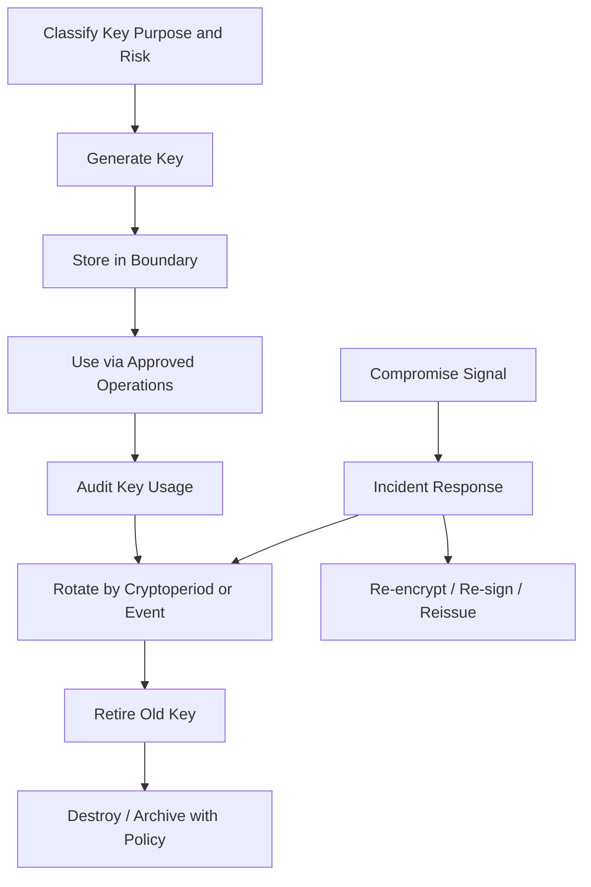
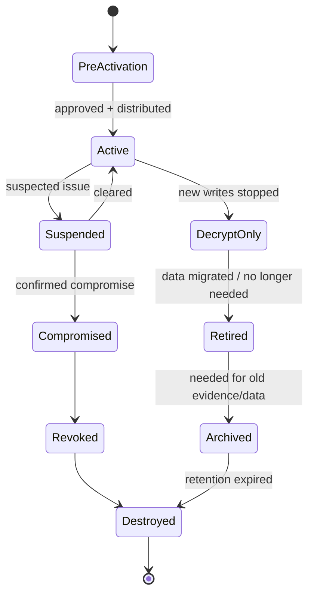
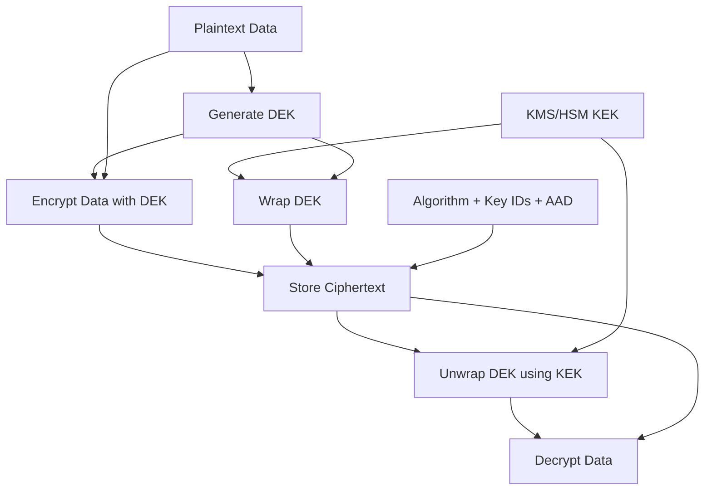
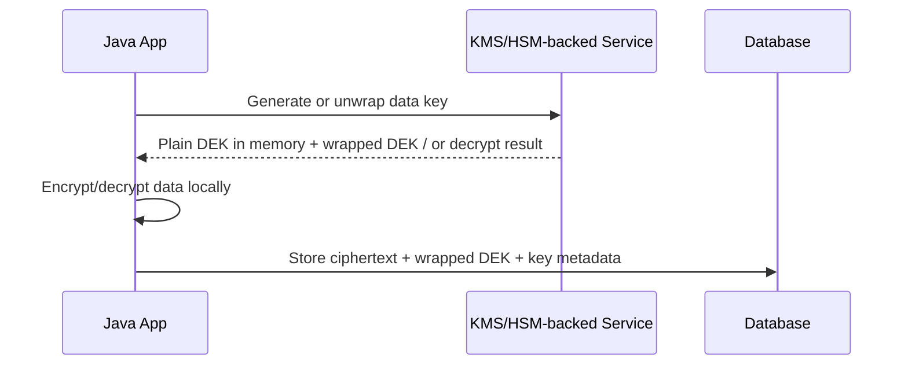
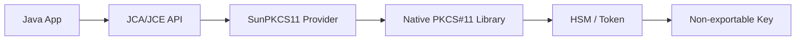
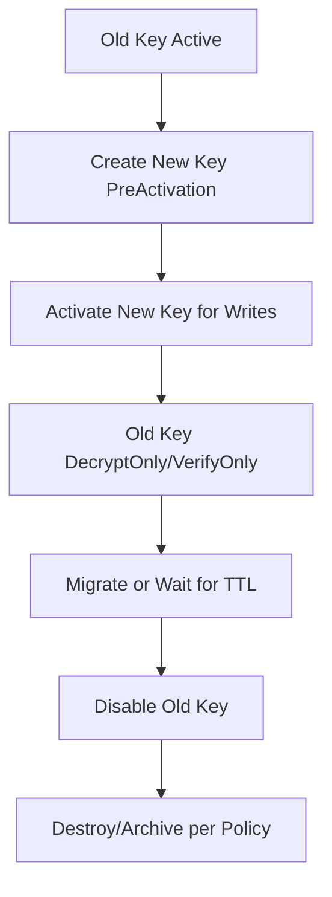
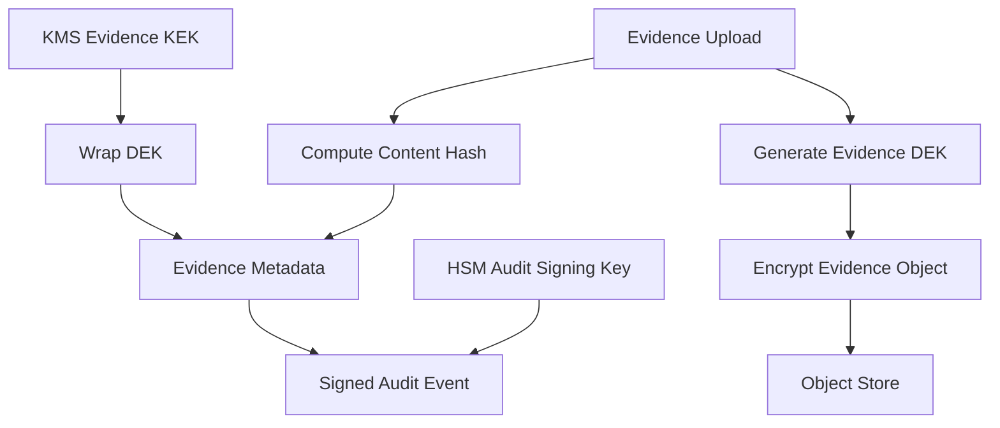

------
title: Learn Java Security, Cryptography and Integrity - Part 014
description: Key management for Java systems: key lifecycle, HSM, KMS, PKCS#11, cryptoperiod, rotation, envelope encryption, access control, compromise response, and operational governance.
series: learn-java-security-cryptography-integrity
seriesTitle: Learn Java Security, Cryptography and Integrity
order: 14
partTitle: Key Management, HSM, KMS, PKCS#11 & Rotation
tags:
  - java
  - security
  - cryptography
  - key-management
  - kms
  - hsm
  - pkcs11
  - rotation
  - integrity
date: 2026-06-30
---

# Part 014 — Key Management, HSM, KMS, PKCS#11 & Rotation

> Target: setelah part ini, kamu mampu mendesain lifecycle key untuk sistem Java production: bagaimana key dibuat, disimpan, dibatasi, digunakan, dirotasi, diaudit, dicabut, dihancurkan, dan dipulihkan setelah compromise. Fokusnya bukan sekadar “pakai KMS”, tetapi bagaimana membuat key lifecycle defensible.

Cryptography sering gagal bukan karena AES, RSA, atau EdDSA rusak. Ia gagal karena key lifecycle rusak:

- key dibuat dengan entropy buruk,
- key disimpan di repo,
- semua service memakai key yang sama,
- key ID tidak disimpan bersama ciphertext/signature,
- rotation tidak bisa dilakukan tanpa decrypt semua data sekaligus,
- operator punya akses terlalu luas,
- backup menyimpan key lama selamanya,
- incident response tidak tahu data mana terdampak,
- HSM/KMS dianggap magic box tanpa boundary jelas.

Key management adalah discipline yang menghubungkan cryptography, identity, authorization, runtime operations, audit, disaster recovery, dan incident response.

Referensi utama:

- NIST SP 800-57 Part 1 Revision 5, Recommendation for Key Management: <https://csrc.nist.gov/pubs/sp/800/57/pt1/r5/final>
- OWASP Key Management Cheat Sheet: <https://cheatsheetseries.owasp.org/cheatsheets/Key_Management_Cheat_Sheet.html>
- OWASP Cryptographic Storage Cheat Sheet: <https://cheatsheetseries.owasp.org/cheatsheets/Cryptographic_Storage_Cheat_Sheet.html>
- Java SE 25 JCA Reference Guide: <https://docs.oracle.com/en/java/javase/25/security/java-cryptography-architecture-jca-reference-guide.html>
- Java SE 25 JDK Providers Documentation: <https://docs.oracle.com/en/java/javase/25/security/oracle-providers.html>
- Java PKCS#11 Reference Guide: <https://docs.oracle.com/en/java/javase/21/security/pkcs11-reference-guide1.html>
- Java SE 25 `KeyStore`: <https://docs.oracle.com/en/java/javase/25/docs/api/java.base/java/security/KeyStore.html>
- Java SE 25 `Cipher`: <https://docs.oracle.com/en/java/javase/25/docs/api/java.base/javax/crypto/Cipher.html>
- Java SE 25 `Signature`: <https://docs.oracle.com/en/java/javase/25/docs/api/java.base/java/security/Signature.html>

---

## 1. Kaufman Deconstruction: Key Management Skill Map

Pecah key management menjadi capability yang bisa dilatih.

| Capability | Pertanyaan korektif | Output engineering |
|---|---|---|
| Key classification | Key ini melindungi apa dan seberapa sensitif? | Key inventory dan risk tier. |
| Key generation | Di mana dan bagaimana key dibuat? | Approved generation path. |
| Key storage | Apakah key bisa keluar dari boundary? | KMS/HSM/keystore policy. |
| Key usage control | Operasi apa yang diizinkan? | Encrypt/decrypt/sign/verify/wrap policy. |
| Key identification | Ciphertext/signature tahu key mana? | Key ID + version metadata. |
| Rotation | Bisa ganti key tanpa outage? | Rotation protocol. |
| Cryptoperiod | Berapa lama key boleh aktif? | Time/data-volume limits. |
| Access control | Siapa/service apa boleh menggunakan key? | Least privilege key policy. |
| Audit | Semua key use terekam? | Security event and audit trail. |
| Compromise response | Apa yang dilakukan saat key bocor? | Revoke, rotate, re-encrypt, invalidate. |
| Destruction | Bagaimana key dihancurkan? | Zeroization/destruction evidence. |
| Recovery | Bagaimana backup dan restore tanpa overexposure? | Escrow/backup controls. |

Mental model:



Core invariant:

> A key is not just bytes. A key is bytes plus purpose, owner, policy, lifecycle state, access boundary, audit trail, and compromise plan.

---

## 2. Key Taxonomy untuk Java Systems

Tidak semua key punya lifecycle yang sama. Sebelum memilih API, klasifikasikan key.

| Key Type | Fungsi | Contoh | Lifecycle concern |
|---|---|---|---|
| Data Encryption Key (DEK) | Encrypt data langsung. | AES-GCM key untuk field-level encryption. | High volume, rotate via envelope encryption. |
| Key Encryption Key (KEK) | Wrap/unwrap DEK. | KMS master/wrapping key. | Access control sangat ketat. |
| Master Key / Root Key | Root of trust untuk key hierarchy. | HSM/KMS root. | Biasanya tidak keluar dari boundary. |
| Signing Key | Membuat digital signature. | Ed25519/RSA-PSS signing key. | Non-repudiation/evidence implications. |
| MAC Key | HMAC/integrity tag. | Webhook signing secret. | Shared secret; rotate with overlap. |
| TLS Private Key | Membuktikan server/client identity. | Private key untuk leaf cert. | Certificate rotation, compromise revocation. |
| Token Key | Sign/verify tokens. | JWT signing key. | Key ID, JWKS, rotation overlap. |
| Password-derived Key | Derived dari password. | PBKDF2/Argon2 output. | Salt/parameters, password reset lifecycle. |
| Session Key | Short-lived negotiated key. | TLS ephemeral keys. | Usually automatic/protocol-managed. |
| Bootstrap Secret | Secret untuk mengambil key lain. | Workload identity credential. | Secret zero problem. |

Setiap key harus punya explicit purpose. Key reuse lintas purpose adalah smell.

Bad:

```text
same-secret used for:
- HMAC webhook verification,
- encrypting database fields,
- signing internal tokens,
- deriving user reset tokens.
```

Better:

```text
key: hmac-webhook-partner-x-v2026-06
purpose: verify partner X webhook signatures
operations: MAC verify, MAC generate if sending callbacks
owner: integration-platform
cryptoperiod: 180 days
rotation: dual acceptance for 14 days
```

---

## 3. Key Lifecycle States

A defensible system does not treat keys as simply “exists or not”. Use lifecycle states.



Suggested semantics:

| State | May encrypt/sign new data? | May decrypt/verify old data? | Typical use |
|---|---:|---:|---|
| PreActivation | No | No | Created but not deployed. |
| Active | Yes | Yes | Normal use. |
| DecryptOnly / VerifyOnly | No | Yes | Rotation overlap/read old data. |
| Suspended | No | Usually limited | Investigation. |
| Compromised | No | Case-by-case | Incident handling. |
| Revoked | No | Usually no for trust decisions | Cert/key invalidated. |
| Retired | No | Limited | Legacy data. |
| Archived | No | Controlled | Legal/audit retention. |
| Destroyed | No | No | Zeroized/deleted. |

Key lifecycle state must be enforced by code/config/policy, not just documented in a wiki.

---

## 4. Cryptoperiod: Rotation Based on Time, Usage, and Risk

Cryptoperiod is the time span during which a key is authorized for use. It is not arbitrary. It depends on:

- key type,
- algorithm strength,
- data sensitivity,
- data volume,
- exposure risk,
- compliance requirement,
- ability to rotate safely,
- whether compromise detection is strong,
- whether protected data remains valuable long term.

Example policy:

| Key | Active cryptoperiod | Old data support | Rotation trigger |
|---|---:|---:|---|
| Webhook HMAC key | 90-180 days | 14-day dual verify | Time, partner offboarding, suspected leak. |
| JWT signing key | 30-90 days | Until max token TTL + grace | Time, issuer compromise. |
| Field encryption DEK | Per tenant/month/data class | Until re-encrypted or retention ends | Time, data volume, tenant migration. |
| KEK/KMS key | 1 year or policy-specific | Backward unwrap allowed | Time, admin change, compromise. |
| TLS private key | 30-397 days depending CA/policy | No after cert replacement except logs | Expiry, compromise, algorithm policy. |
| Audit signing key | Strict policy, often HSM-backed | Verify old signatures long-term | Scheduled rollover, legal policy. |

Do not rotate keys faster than your automation can handle. Manual monthly rotation is often less secure than automated quarterly rotation because humans will bypass process under pressure.

---

## 5. Key Metadata: The Missing Piece in Many Systems

Ciphertext or signature without key metadata creates migration pain.

Bad ciphertext record:

```json
{
  "ciphertext": "base64..."
}
```

Better envelope:

```json
{
  "scheme": "field-encryption-v2",
  "algorithm": "AES-256-GCM",
  "keyId": "tenant-123-dek-2026-06",
  "keyVersion": 7,
  "wrappedKeyId": "reg-platform-kek-prod-2026",
  "iv": "base64...",
  "aad": "case:caseId:version",
  "ciphertext": "base64...",
  "tag": "included-by-provider-or-separated-by-format"
}
```

For signatures:

```json
{
  "signatureScheme": "audit-event-signature-v1",
  "algorithm": "Ed25519",
  "keyId": "audit-signing-prod-2026-q2",
  "publicKeySetVersion": "2026-06-30",
  "canonicalization": "audit-event-c14n-v1",
  "signedAt": "2026-06-30T08:00:00Z",
  "signature": "base64..."
}
```

Metadata rules:

```text
[ ] Store key ID/version with every protected object.
[ ] Store algorithm/scheme version with every protected object.
[ ] Store canonicalization version for signatures.
[ ] Store key lifecycle state outside the object in key registry.
[ ] Do not infer key from current config for old data.
```

Without metadata, rotation becomes archaeology.

---

## 6. Key Generation

Key generation should happen in the strongest feasible boundary.

Options:

| Boundary | Example | Pros | Cons |
|---|---|---|---|
| Application memory | `KeyGenerator`, `KeyPairGenerator` | Simple, fast. | Key exists in process memory. |
| KMS-generated | Managed key/data key APIs | Central audit and policy. | Vendor dependency, latency. |
| HSM-generated | Hardware-backed key | Strong non-exportability. | Cost/ops complexity. |
| PKCS#11 token | HSM/smartcard/native token | JCA integration. | Provider quirks, mechanism support. |
| Offline ceremony | Root/signing key ceremony | Strong governance. | Slow, human process. |

Java local symmetric key generation example:

```java
import javax.crypto.KeyGenerator;
import javax.crypto.SecretKey;
import java.security.SecureRandom;

public final class LocalKeyGeneration {
    private LocalKeyGeneration() {}

    public static SecretKey aes256Key() throws Exception {
        KeyGenerator generator = KeyGenerator.getInstance("AES");
        generator.init(256, SecureRandom.getInstanceStrong());
        return generator.generateKey();
    }
}
```

Use this only when local generation matches your threat model. For high-value DEKs, prefer KMS/HSM generation or immediate wrapping under KEK.

Asymmetric keypair generation:

```java
import java.security.KeyPair;
import java.security.KeyPairGenerator;
import java.security.SecureRandom;

public final class SigningKeyGeneration {
    private SigningKeyGeneration() {}

    public static KeyPair ed25519() throws Exception {
        KeyPairGenerator generator = KeyPairGenerator.getInstance("Ed25519");
        generator.initialize(255, SecureRandom.getInstanceStrong());
        return generator.generateKeyPair();
    }
}
```

Note: algorithm availability depends on JDK/provider. For HSM/PKCS#11, generation may require provider-specific support and key attributes.

---

## 7. Key Storage Patterns

### 7.1 File keystore

Use case:

- service TLS key,
- local dev,
- lower-tier internal services,
- bootstrap material.

Controls:

```text
[ ] Keystore encrypted at rest.
[ ] Password delivered securely.
[ ] File permissions least privilege.
[ ] Not baked into container image.
[ ] Rotation path tested.
[ ] Startup logs only metadata.
```

### 7.2 Secret manager

Use case:

- storing keystore password,
- storing HMAC key where HSM/KMS not available,
- config-level secrets.

Controls:

```text
[ ] Workload identity, not static long-lived credential.
[ ] Access by service/environment/tenant scope.
[ ] Audit reads.
[ ] Versioned secrets.
[ ] Rotation and rollback.
```

### 7.3 KMS

Use case:

- envelope encryption,
- centralized policy and audit,
- KEK never leaves service boundary,
- data key generation/wrapping.

Controls:

```text
[ ] Key policy least privilege.
[ ] Separate encrypt/decrypt/admin rights.
[ ] Key usage audit monitored.
[ ] Key ID stored with ciphertext.
[ ] Rate/latency/failure fallback designed.
```

### 7.4 HSM

Use case:

- high-value signing keys,
- root/intermediate CA keys,
- payment/regulatory keys,
- non-exportable private keys,
- strong separation of duties.

Controls:

```text
[ ] Key generated inside HSM.
[ ] Private key non-exportable.
[ ] Dual control for admin operations.
[ ] Backup/restore ceremony documented.
[ ] Mechanism support tested.
[ ] Performance capacity tested.
```

### 7.5 PKCS#11

Use case:

- Java app uses JCA/JCE while actual operations happen in native PKCS#11 token/HSM.

Controls:

```text
[ ] Provider configuration is explicit.
[ ] Mechanism/algorithm availability tested.
[ ] Token login lifecycle safe.
[ ] Key alias/label governance.
[ ] Failover behavior tested.
```

---

## 8. Envelope Encryption

Envelope encryption separates data encryption from key wrapping.

Mental model:



Why envelope encryption:

- DEKs can be many and close to data.
- KEK access is centralized and auditable.
- KEK rotation can rewrap DEKs without decrypting all data.
- DEK rotation can be scoped to tenant/table/object.
- Compromise blast radius can be smaller.

Simplified Java local envelope example:

```java
import javax.crypto.Cipher;
import javax.crypto.KeyGenerator;
import javax.crypto.SecretKey;
import javax.crypto.spec.GCMParameterSpec;
import java.security.SecureRandom;

public final class EnvelopeEncryptionSketch {
    private static final int GCM_TAG_BITS = 128;
    private static final int GCM_IV_BYTES = 12;

    private EnvelopeEncryptionSketch() {}

    public static EncryptedData encrypt(byte[] plaintext, byte[] aad, SecretKey dek) throws Exception {
        byte[] iv = new byte[GCM_IV_BYTES];
        SecureRandom.getInstanceStrong().nextBytes(iv);

        Cipher cipher = Cipher.getInstance("AES/GCM/NoPadding");
        cipher.init(Cipher.ENCRYPT_MODE, dek, new GCMParameterSpec(GCM_TAG_BITS, iv));
        cipher.updateAAD(aad);
        byte[] ciphertext = cipher.doFinal(plaintext);

        return new EncryptedData("AES-256-GCM", iv, ciphertext);
    }

    public static SecretKey generateDek() throws Exception {
        KeyGenerator generator = KeyGenerator.getInstance("AES");
        generator.init(256, SecureRandom.getInstanceStrong());
        return generator.generateKey();
    }

    public record EncryptedData(String algorithm, byte[] iv, byte[] ciphertext) {}
}
```

In production, DEK should be wrapped by KEK/KMS/HSM and envelope must store wrapped DEK/key ID metadata.

---

## 9. Rotation Models

Rotation is not one thing.

| Rotation model | Meaning | Example |
|---|---|---|
| New writes only | New data uses new key; old data stays on old key. | Field encryption with key version. |
| Lazy re-encryption | Old data re-encrypted on read/update. | Large tables with gradual migration. |
| Bulk re-encryption | Batch job migrates all data. | Small datasets or strict incident response. |
| Rewrap only | DEK stays same; wrapped by new KEK. | Envelope encryption KEK rotation. |
| Dual verify | Accept old and new MAC/signing key during grace. | Webhook/JWT rotation. |
| Dual sign | Sign with old and new for compatibility. | Protocol migration. |
| Immediate revoke | Stop accepting old key now. | Confirmed compromise. |

### 9.1 Symmetric encryption rotation

Preferred design:

```text
write path:
  use current active key version

read path:
  read keyId from envelope
  fetch key if state allows decrypt
  decrypt
  optionally re-encrypt with current key
```

Pseudo-code:

```java
public byte[] decryptAndMaybeRotate(EncryptedRecord record) {
    KeyRef oldKey = keyRegistry.resolve(record.keyId());

    byte[] plaintext = crypto.decrypt(record, oldKey);

    if (keyRegistry.shouldRotate(record.keyId())) {
        EncryptedRecord rotated = crypto.encrypt(
                plaintext,
                keyRegistry.currentEncryptionKey(record.tenantId())
        );
        repository.updateEncryptedPayload(record.id(), rotated);
    }

    return plaintext;
}
```

Important:

- Do not rotate by trying every key until decrypt succeeds.
- Use explicit key ID.
- Log rotation outcome without plaintext.
- Handle partial migration idempotently.

### 9.2 MAC key rotation

For HMAC/webhook:

```text
T0: Provider and consumer know old key.
T1: Add new key as secondary verification key.
T2: Start signer using new key ID.
T3: Verifier accepts old+new for replay window + grace period.
T4: Disable old key for signing.
T5: Disable old key for verification.
```

Signature header should include key ID:

```http
X-Signature-Key-Id: partner-x-hmac-2026-06
X-Signature-Timestamp: 2026-06-30T08:00:00Z
X-Signature: base64(hmac_sha256(canonical_request))
```

### 9.3 Signing key rotation

For JWT or audit signatures:

- publish new public key before signing with it,
- include `kid`,
- retain old public key until all old tokens/evidence verification windows expire,
- never remove old verification keys prematurely,
- for compromised signing keys, invalidate tokens/evidence based on policy.

### 9.4 TLS private key rotation

Already touched in Part 013; key point here:

- private key rotation and certificate renewal can be separate,
- reusing private key across certificate renewals reduces operational friction but increases compromise exposure,
- generating new keypair per renewal is usually better when automation supports it.

---

## 10. Key Access Control

Key access is not binary. Different operations have different risk.

| Operation | Risk | Example control |
|---|---|---|
| Encrypt | Lower than decrypt for confidentiality. | App service allowed. |
| Decrypt | High. | Strict service/tenant/resource policy. |
| Sign | High; creates authority/evidence. | HSM, approval, rate limit, audit. |
| Verify | Usually public/low. | Public key distribution integrity. |
| Wrap | High; protects DEKs. | KMS/HSM only. |
| Unwrap | High; releases DEK. | Least privilege and audit. |
| Export key | Very high. | Disallow for non-exportable keys. |
| Rotate key | High admin action. | Separate admin role, change control. |
| Disable/delete key | Availability impact. | Multi-party approval. |

Separate duties:

```text
[ ] Application can encrypt/decrypt only keys it owns.
[ ] Operator can deploy service but not read plaintext key.
[ ] Security admin can create/rotate keys but not decrypt business data alone.
[ ] Auditor can read key metadata and logs but not key material.
[ ] Break-glass access is time-bound, approved, and heavily logged.
```

Key policy should be scoped by:

- service identity,
- environment,
- tenant/data domain,
- operation,
- network/runtime context,
- request purpose if supported,
- approval state.

---

## 11. Key Registry

A key registry stores metadata and lifecycle state, not necessarily key material.

Example schema:

```yaml
keys:
  - keyId: case-field-dek-tenant-42-2026-06
    type: data-encryption-key
    algorithm: AES-256-GCM
    owner: case-platform
    environment: prod
    tenant: tenant-42
    state: active
    createdAt: 2026-06-01T00:00:00Z
    activatedAt: 2026-06-01T01:00:00Z
    cryptoperiodEndsAt: 2026-09-01T00:00:00Z
    wrappingKeyId: reg-platform-kek-prod-2026
    storage: kms-wrapped
    allowedOperations:
      - encrypt
      - decrypt
    rotation:
      model: lazy-reencrypt
      gracePeriodDays: 30
    approval: SEC-KEY-2026-061
```

Why registry matters:

- old ciphertext can resolve old key,
- migration can know which data is stale,
- incident response can identify blast radius,
- audit can explain why key existed,
- automated policy can reject unauthorized use.

If your app only has `encryption.key` in config, it has no key management; it has a secret string.

---

## 12. HSM Mental Model

HSM is a protected cryptographic boundary. It can generate, store, and use keys such that private key material does not leave the module.

Common HSM uses:

- CA root/intermediate private keys,
- audit signing keys,
- payment keys,
- high-value token signing keys,
- regulatory evidence sealing keys,
- KEK/root keys.

Benefits:

- non-exportable private keys,
- tamper-resistant boundary,
- hardware-backed operations,
- separation of duties,
- audited admin operations,
- compliance alignment.

Trade-offs:

- latency,
- throughput limits,
- vendor integration,
- mechanism support mismatch,
- failover/HA complexity,
- ceremony complexity,
- local development friction,
- cost.

HSM does not automatically solve:

- bad authorization,
- signing wrong bytes,
- compromised app that asks HSM to sign malicious data,
- poor key naming,
- missing audit context,
- broken rotation protocol.

Important invariant:

> HSM protects key material from extraction; it does not protect the system from authorized misuse of the key.

For signing keys, you still need policy checks before calling `Signature.sign()`.

---

## 13. KMS Mental Model

A KMS is a managed key control plane and cryptographic service. It centralizes key policy, audit, rotation, and often envelope encryption operations.

Typical flow:



Two common modes:

1. **Remote cryptographic operation**: KMS encrypts/decrypts/signs directly.
2. **Envelope mode**: KMS generates/wraps DEK; app encrypts data locally.

Envelope mode is common for high-volume data because it avoids calling KMS for every block/object operation after DEK is available, but it means plaintext DEK appears in application memory.

KMS design questions:

```text
[ ] Is the KMS key a KEK, signing key, or direct encryption key?
[ ] Is plaintext DEK returned to application memory?
[ ] How long is DEK cached?
[ ] Are encrypt and decrypt permissions separated?
[ ] Is key usage logged with request context?
[ ] What happens if KMS is unavailable?
[ ] Can old data be decrypted after key rotation?
[ ] How is tenant separation enforced?
```

---

## 14. PKCS#11 in Java

PKCS#11 is a standard API for cryptographic tokens. Java integrates with PKCS#11 through the SunPKCS11 provider. The provider acts as a bridge from JCA/JCE APIs to native PKCS#11 libraries.

Conceptual architecture:



Example provider config file:

```properties
name = HsmSlot1
library = /opt/vendor/pkcs11/libpkcs11.so
slotListIndex = 0
```

Loading provider in Java:

```java
import java.security.Provider;
import java.security.Security;

public final class Pkcs11ProviderLoader {
    private Pkcs11ProviderLoader() {}

    public static Provider load(String configPath) throws Exception {
        Provider base = Security.getProvider("SunPKCS11");
        if (base == null) {
            throw new IllegalStateException("SunPKCS11 provider not available");
        }
        Provider configured = base.configure(configPath);
        Security.addProvider(configured);
        return configured;
    }
}
```

Using PKCS#11 as KeyStore:

```java
import java.security.KeyStore;
import java.security.Provider;

public final class Pkcs11KeyStoreAccess {
    private Pkcs11KeyStoreAccess() {}

    public static KeyStore loadTokenKeyStore(Provider provider, char[] pin) throws Exception {
        KeyStore keyStore = KeyStore.getInstance("PKCS11", provider);
        // For PKCS#11, InputStream is usually null because store is token-backed.
        keyStore.load(null, pin);
        return keyStore;
    }
}
```

Signing with token-backed key:

```java
import java.security.KeyStore;
import java.security.PrivateKey;
import java.security.Provider;
import java.security.Signature;

public final class HsmSigning {
    private HsmSigning() {}

    public static byte[] sign(
            Provider provider,
            KeyStore tokenStore,
            String keyAlias,
            char[] keyPin,
            byte[] canonicalBytes
    ) throws Exception {
        PrivateKey privateKey = (PrivateKey) tokenStore.getKey(keyAlias, keyPin);
        Signature signature = Signature.getInstance("SHA256withRSA", provider);
        signature.initSign(privateKey);
        signature.update(canonicalBytes);
        return signature.sign();
    }
}
```

Caveats:

- Algorithm names and mechanisms depend on token/provider.
- Some HSMs require login/session handling beyond simple examples.
- Some keys cannot be exported or inspected like file keys.
- Performance depends on HSM capacity and operation type.
- Provider behavior should be tested in CI/integration environment that resembles production.
- Do not assume local SunJCE behavior equals HSM behavior.

---

## 15. Key Wrapping

Key wrapping encrypts one key with another key. It is commonly used for envelope encryption.

Concepts:

- DEK encrypts data.
- KEK wraps DEK.
- Wrapped DEK is stored next to ciphertext.
- KEK remains in KMS/HSM or secure key boundary.

Java sketch with `Cipher.WRAP_MODE`:

```java
import javax.crypto.Cipher;
import javax.crypto.SecretKey;

public final class KeyWrappingSketch {
    private KeyWrappingSketch() {}

    public static byte[] wrapAesKey(SecretKey kek, SecretKey dek) throws Exception {
        Cipher cipher = Cipher.getInstance("AESWrap");
        cipher.init(Cipher.WRAP_MODE, kek);
        return cipher.wrap(dek);
    }

    public static SecretKey unwrapAesKey(SecretKey kek, byte[] wrappedDek) throws Exception {
        Cipher cipher = Cipher.getInstance("AESWrap");
        cipher.init(Cipher.UNWRAP_MODE, kek);
        return (SecretKey) cipher.unwrap(wrappedDek, "AES", Cipher.SECRET_KEY);
    }
}
```

In production, prefer provider/KMS-supported wrapping schemes and store metadata:

```json
{
  "wrappedDek": "base64...",
  "wrappingKeyId": "kek-prod-2026",
  "wrappingAlgorithm": "AES-KW-or-KMS-specific",
  "dekAlgorithm": "AES-256-GCM",
  "createdAt": "2026-06-30T08:00:00Z"
}
```

Do not confuse wrapping with password-protecting a keystore. Keystore password is not a complete key management system.

---

## 16. Key Rotation Protocols in Detail

### 16.1 Current-key pointer

Applications should not hardcode key aliases everywhere. Use a controlled current-key pointer.

```yaml
currentKeys:
  fieldEncryption:
    caseSensitiveData:
      tenant-42: case-field-dek-tenant-42-2026-06
  webhookHmac:
    partner-x: partner-x-hmac-2026-06
  auditSigning:
    prod: audit-signing-prod-2026-q2
```

Write path resolves current key at time of operation. Read path uses key ID stored in object.

### 16.2 Rotation with dual read



### 16.3 Rotation runbook template

```mdx
# Key Rotation Runbook — <key-id>

## Scope
Data/service/signature affected by this key.

## Preconditions
- New key generated and approved.
- Key metadata registered.
- Consumers can resolve new key ID.
- Monitoring dashboard ready.
- Rollback plan validated.

## Steps
1. Put new key in PreActivation.
2. Deploy trust/public key/material where needed.
3. Activate new key for writes/signing.
4. Keep old key verify/decrypt-only for grace period.
5. Monitor failures and usage of old key.
6. Migrate/re-encrypt if required.
7. Disable old key for new operations.
8. Retire/destroy/archive old key according to retention policy.

## Rollback
Restore current-key pointer to previous key if no compromise exists.
Do not rollback to compromised key.

## Verification
- New writes use new key ID.
- Old data remains readable if policy allows.
- Unauthorized operations are denied.
- Audit events contain old/new key IDs.
```

---

## 17. Compromise Response

Key compromise response depends on key type.

| Key compromised | Immediate action | Follow-up |
|---|---|---|
| TLS private key | Revoke cert, issue new keypair/cert, rotate trust if needed. | Check logs for MITM/impersonation window. |
| HMAC key | Stop accepting old key, issue new key, invalidate replay window. | Identify forged messages risk. |
| JWT signing private key | Rotate signing key, remove public key if active tokens must be invalidated. | Revoke sessions/tokens based on risk. |
| Data DEK | Stop using key, re-encrypt affected data. | Assess plaintext exposure. |
| KEK/KMS key | Disable key carefully; assess all wrapped DEKs. | Rewrap/re-encrypt depending compromise. |
| Audit signing key | Stop signing, mark evidence window suspect if needed. | Preserve incident evidence and external timestamping if available. |
| Root/intermediate CA key | Emergency revoke/replace CA, reissue all affected certs. | Broad incident response and truststore update. |

Incident questions:

```text
[ ] What key was compromised?
[ ] Was it extractable or only misused through API?
[ ] What operations were possible: decrypt, sign, unwrap, issue certs?
[ ] What data/time window is affected?
[ ] Which services had access?
[ ] Are audit logs trustworthy?
[ ] Can old signatures/certificates still be trusted?
[ ] Which keys/data must be rotated, rewrapped, or re-encrypted?
[ ] Which external parties must be notified?
```

Do not treat all compromise as equal. A key that can only encrypt new data has different impact from a key that can decrypt historical data or sign authoritative records.

---

## 18. Zeroization and Destruction

In managed languages like Java, zeroization is imperfect because garbage collection, copying, JIT, heap dumps, and library internals can duplicate sensitive bytes. Still, you should reduce exposure.

Guidelines:

```text
[ ] Prefer provider/KMS/HSM boundaries for high-value keys.
[ ] Avoid storing raw keys in immutable `String`.
[ ] Use `char[]`/`byte[]` where practical and clear after use.
[ ] Disable or protect heap dumps in production.
[ ] Avoid logging key material.
[ ] Limit key lifetime in memory.
[ ] Avoid broad caches of plaintext DEKs.
```

Example clearing byte array:

```java
import java.util.Arrays;

byte[] keyBytes = loadKeyBytes();
try {
    // Use key bytes to construct provider object.
} finally {
    Arrays.fill(keyBytes, (byte) 0);
}
```

Caveat: clearing your array does not guarantee all copies are gone. The stronger control is avoiding raw key material in app memory when possible.

Destruction evidence:

```yaml
keyDestruction:
  keyId: webhook-hmac-partner-x-2025-12
  destroyedAt: 2026-06-30T08:00:00Z
  method: secret-version-destroyed
  reason: cryptoperiod-ended
  approvedBy:
    - platform-security
    - integration-owner
  evidence:
    - audit-log-event-id: sec-audit-982734
```

---

## 19. Backup, Escrow, and Recovery

Backups can silently preserve keys forever. That may violate retention, destruction, or compromise assumptions.

Questions:

```text
[ ] Are keys backed up?
[ ] Are backups encrypted with a separate key hierarchy?
[ ] Who can restore keys?
[ ] Can destroyed keys reappear from backup?
[ ] Are old backups within legal retention?
[ ] Does disaster recovery preserve key policy and audit logs?
[ ] Can HSM/KMS restore require quorum?
```

For encryption keys, losing the key can mean losing the data. For signing keys, losing the key may block signing but should not prevent verifying old signatures if public keys and metadata are preserved.

Design recovery by key type:

| Key type | Backup need | Risk |
|---|---|---|
| DEK | Needed if data must remain decryptable. | Backup expands exposure. |
| KEK | Needed to unwrap DEKs. | High blast radius. |
| Signing private key | Usually avoid export; use HSM backup/replication. | Compromise can forge authority. |
| Public verification key | Must preserve for old evidence. | Integrity/distribution concern, not secrecy. |
| TLS private key | Usually can regenerate. | Backup often unnecessary/risky. |

---

## 20. Multi-Tenant Key Design

For multi-tenant systems, key granularity is a blast-radius decision.

| Model | Pros | Cons |
|---|---|---|
| One global key | Simple. | Catastrophic blast radius. |
| Per environment key | Simple separation dev/staging/prod. | Tenant/data class still coupled. |
| Per tenant key | Better tenant isolation. | More keys/ops. |
| Per tenant + data class | Stronger isolation. | More metadata/policy complexity. |
| Per object key | Fine-grained blast radius. | High metadata and wrapping overhead. |

For regulatory case management, a reasonable design might be:

```text
KEK: per environment + data domain
DEK: per tenant + data class + cryptoperiod
AAD: tenantId + caseId + schemaVersion + fieldName
```

Example envelope AAD:

```java
String aad = String.join("|",
        "case-field-encryption-v2",
        "tenant=" + tenantId,
        "case=" + caseId,
        "field=" + fieldName,
        "schema=" + schemaVersion
);
```

AAD binds ciphertext to domain context. It prevents ciphertext from being moved silently from one tenant/case/field context to another if the decryptor verifies the same AAD.

---

## 21. Audit Logging for Key Usage

Key usage audit should answer:

- who used the key,
- which key,
- which operation,
- for what resource/context,
- when,
- from which workload/environment,
- whether operation succeeded,
- whether policy allowed it,
- correlation/request ID.

Example audit event:

```json
{
  "eventType": "crypto.key.use",
  "timestamp": "2026-06-30T08:00:00Z",
  "keyId": "case-field-dek-tenant-42-2026-06",
  "operation": "decrypt",
  "principal": "service:case-api",
  "environment": "prod",
  "tenantId": "tenant-42",
  "resourceType": "case-field",
  "resourceIdHash": "sha256:...",
  "decision": "allowed",
  "correlationId": "req-abc123"
}
```

Do not log:

- plaintext,
- key bytes,
- full sensitive identifiers if not needed,
- raw tokens,
- unredacted payloads.

Security signals:

```text
[ ] Decrypt volume spike.
[ ] Key used by unexpected service.
[ ] Old key still used for writes.
[ ] Key used outside expected environment.
[ ] Failed unwrap/decrypt increase.
[ ] Admin disables/deletes key outside change window.
[ ] Signing key used at abnormal rate.
```

---

## 22. Java Design Pattern: Key Resolver

Do not scatter key lookup across code. Use a key resolver abstraction.

```java
public interface KeyResolver {
    CryptoKey resolveForEncryption(String purpose, String tenantId);
    CryptoKey resolveForDecryption(String keyId, String tenantId);
    CryptoKey resolveForSigning(String purpose);
    CryptoKey resolveForVerification(String keyId);
}

public record CryptoKey(
        String keyId,
        String algorithm,
        KeyState state,
        Object providerHandle
) {}

public enum KeyState {
    PRE_ACTIVATION,
    ACTIVE,
    DECRYPT_ONLY,
    VERIFY_ONLY,
    SUSPENDED,
    COMPROMISED,
    RETIRED,
    DESTROYED
}
```

Usage:

```java
CryptoKey key = keyResolver.resolveForEncryption("case-field", tenantId);
if (key.state() != KeyState.ACTIVE) {
    throw new IllegalStateException("Key is not active for encryption: " + key.keyId());
}
```

This gives one enforcement point for:

- lifecycle state,
- tenant separation,
- environment separation,
- algorithm policy,
- audit logging,
- rotation behavior.

---

## 23. Java Design Pattern: Crypto Envelope

Define a stable envelope type.

```java
import java.util.Map;

public record CryptoEnvelope(
        String scheme,
        String algorithm,
        String keyId,
        int keyVersion,
        String ivBase64,
        String ciphertextBase64,
        String wrappedDekBase64,
        String wrappingKeyId,
        Map<String, String> context
) {}
```

Rules:

```text
[ ] Envelope is versioned.
[ ] Algorithm is explicit.
[ ] Key ID is explicit.
[ ] AAD/context is explicit or reproducible.
[ ] Wrapping key metadata is explicit.
[ ] Future migrations can parse old envelope versions.
```

Bad practice:

```java
// Bad: decryptor depends on current global key.
String plaintext = decrypt(ciphertext, config.getCurrentKey());
```

Better:

```java
CryptoEnvelope envelope = parse(record.encryptedPayload());
CryptoKey key = keyResolver.resolveForDecryption(envelope.keyId(), tenantId);
byte[] plaintext = crypto.decrypt(envelope, key);
```

---

## 24. Failure Modeling

Key management failure modes:

| Failure | Consequence | Prevention |
|---|---|---|
| Key ID not stored | Cannot rotate/read old data safely. | Envelope metadata. |
| Global key reused | Large blast radius. | Key hierarchy and purpose separation. |
| Old key deleted too soon | Data loss or verification failure. | Lifecycle states and retention. |
| Compromised key still active | Forgery/decryption continues. | Monitoring and emergency disable. |
| Manual rotation | Drift and mistakes. | Automated runbooks. |
| KMS outage | App cannot decrypt/sign. | Availability design and cache policy. |
| Overbroad decrypt permission | Insider/app compromise exposes data. | Least privilege and audit. |
| No audit | Incident scope unknown. | Key-use events. |
| HSM used as magic | Authorized misuse remains. | Pre-sign/pre-decrypt policy checks. |
| Backup resurrects key | Destruction not real. | Backup lifecycle controls. |

Think in invariants:

```text
Invariant 1: No new encryption uses non-active key.
Invariant 2: No decryption uses destroyed/compromised key unless incident-approved.
Invariant 3: Every ciphertext resolves key by stored key ID, not current config.
Invariant 4: Every signing operation has business context and audit event.
Invariant 5: Every key has owner, purpose, state, cryptoperiod, and rotation path.
```

---

## 25. Security Review Checklist

### Classification

```text
[ ] Every key has a documented purpose.
[ ] Key reuse across purposes is justified or eliminated.
[ ] Sensitivity tier is assigned.
[ ] Owner and system of record are known.
```

### Generation and storage

```text
[ ] Key generated with approved provider/boundary.
[ ] High-value keys are non-exportable where feasible.
[ ] Raw key material is not committed or logged.
[ ] Keystore/KMS/HSM access is least privilege.
[ ] Bootstrap secret is understood.
```

### Usage

```text
[ ] Allowed operations are explicit.
[ ] Decrypt/sign operations are more restricted than encrypt/verify.
[ ] Key use emits audit events.
[ ] Key use includes tenant/resource context where relevant.
```

### Rotation

```text
[ ] Key ID/version stored with protected data.
[ ] Rotation protocol supports overlap.
[ ] Old key state transitions are enforced.
[ ] Rollback does not reactivate compromised key.
[ ] Migration is idempotent.
```

### Compromise

```text
[ ] Compromise playbook exists by key type.
[ ] Blast radius can be computed from key registry.
[ ] Emergency disable is tested.
[ ] Re-encryption/re-sign/reissue strategy is clear.
```

### Destruction and retention

```text
[ ] Retired keys are not used for new operations.
[ ] Destroyed keys cannot be restored silently from backup.
[ ] Public verification material is retained as long as evidence requires.
[ ] Destruction evidence is recorded.
```

---

## 26. Lab: Build a Mini Key Registry and Rotation Flow

### Goal

Implement a small Java module that encrypts case fields with versioned keys and supports rotation.

### Requirements

```text
[ ] Key registry has at least two AES keys.
[ ] Write path uses current active key.
[ ] Encrypted record stores key ID, algorithm, IV, and ciphertext.
[ ] Read path resolves key by key ID.
[ ] Old key can be marked decrypt-only.
[ ] New writes stop using old key.
[ ] Lazy re-encryption updates old records after read.
[ ] Destroyed key cannot decrypt.
[ ] Tests cover missing key, wrong key, wrong AAD, and old key state.
```

### Test cases

```text
1. encrypt_with_active_key_stores_key_id
2. decrypt_uses_stored_key_id_not_current_key
3. rotate_new_writes_use_new_key
4. old_records_still_decrypt_when_old_key_decrypt_only
5. destroyed_key_rejects_decryption
6. wrong_aad_fails_authentication
7. lazy_rotation_is_idempotent
8. key_registry_audit_event_emitted
```

### Stretch goal

Simulate KMS wrapping:

- generate local DEK per record,
- wrap DEK with KEK,
- store wrapped DEK,
- rotate KEK by rewrapping DEK without decrypting data.

---

## 27. Regulatory Case Management Example

Suppose a platform stores enforcement case evidence with strong integrity and confidentiality requirements.

Possible design:



Key design:

| Key | Boundary | Purpose |
|---|---|---|
| Evidence DEK | Generated per object, wrapped | Encrypt evidence content. |
| Evidence KEK | KMS/HSM | Wrap evidence DEKs. |
| Audit signing key | HSM | Sign audit event hash chain. |
| Webhook HMAC key | Secret/KMS | Verify partner evidence submission. |
| TLS private key | Certificate lifecycle | Authenticate service endpoint. |

Invariants:

```text
[ ] Evidence content encrypted with unique DEK or scoped DEK.
[ ] DEK wrapped by current KEK.
[ ] Metadata records wrapping key ID and DEK version.
[ ] Audit event signs evidence hash + metadata hash + actor + timestamp.
[ ] Audit signing key is non-exportable if risk tier requires.
[ ] Old audit public keys remain available for verification.
[ ] Key usage logs correlate with case ID without exposing sensitive content.
```

This is how key management connects to integrity, not just confidentiality.

---

## 28. Common Anti-Patterns

### 28.1 “We store the encryption key in application properties”

Problem:

- static key,
- broad access,
- hard to rotate,
- likely copied into logs/backups,
- no audit.

Better:

- KMS/HSM/secret manager,
- key registry,
- envelope metadata,
- scoped access.

### 28.2 “We rotate by changing config value”

Problem:

- old data unreadable,
- no key ID,
- rollback ambiguous,
- concurrent deployment writes mixed data.

Better:

- versioned key ID,
- read old/write new,
- lazy/bulk migration.

### 28.3 “HSM means signing is safe”

Problem:

- compromised app can request HSM to sign malicious payload.

Better:

- policy checks before signing,
- canonicalization,
- business context in signed bytes,
- audit and rate limits.

### 28.4 “Delete old key after rotation”

Problem:

- old ciphertext/evidence cannot be decrypted/verified.

Better:

- retire/archive based on retention,
- destroy only after proof no dependency remains.

### 28.5 “One key per environment is enough”

Problem:

- compromise affects all tenants/data classes.

Better:

- key granularity based on blast radius.

---

## 29. Field Rules

1. **Store key ID with every ciphertext/signature.** Without it, rotation is fragile.
2. **Separate key purposes.** Encryption key, MAC key, signing key, and TLS key are not interchangeable.
3. **Prefer envelope encryption for data at rest.** It gives rotation and blast-radius control.
4. **Treat decrypt/sign as privileged operations.** They deserve stronger policy and audit than encrypt/verify.
5. **Design rotation before first production write.** Retrofitting rotation is expensive.
6. **Do not confuse secret storage with key management.** A secret manager can store key bytes, but lifecycle still belongs to you.
7. **HSM/KMS protects key material, not business logic.** Authorized misuse remains possible.
8. **Plan compromise by key type.** The action differs for HMAC, TLS, KEK, DEK, signing key, CA key.
9. **Destroy carefully.** Destruction can be data loss if old data still depends on key.
10. **Audit key usage with context.** Without context, incident response cannot scope impact.

---

## 30. Summary

Key management is the operational core of cryptography.

Core mental model:

```text
Key = secret or private material + purpose + owner + policy + state + boundary + audit + rotation + compromise plan.
```

A top-tier Java engineer does not merely call `Cipher` or `Signature`. They design:

- key taxonomy,
- lifecycle states,
- key registry,
- envelope format,
- access control,
- KMS/HSM boundary,
- rotation protocol,
- audit trail,
- compromise response,
- destruction evidence.

If keys are ungoverned, cryptography becomes theatre. If keys are governed well, cryptography becomes an enforceable system property.

---

## 31. What Comes Next

Part 015 moves into **TLS, JSSE, mTLS & Certificate Validation**:

- TLS handshake mental model,
- JSSE configuration,
- TLS 1.2/1.3 considerations,
- cipher suite policy,
- server/client auth,
- hostname verification,
- mTLS in Java clients/servers,
- debugging TLS safely,
- production hardening.

Part 013 gave certificate trust material. Part 014 gave key lifecycle. Part 015 combines them into secure communication.
