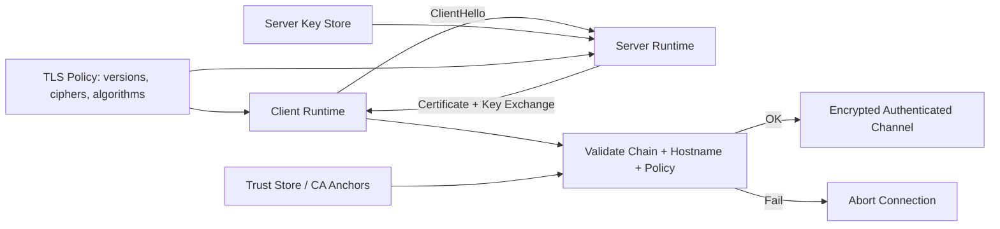
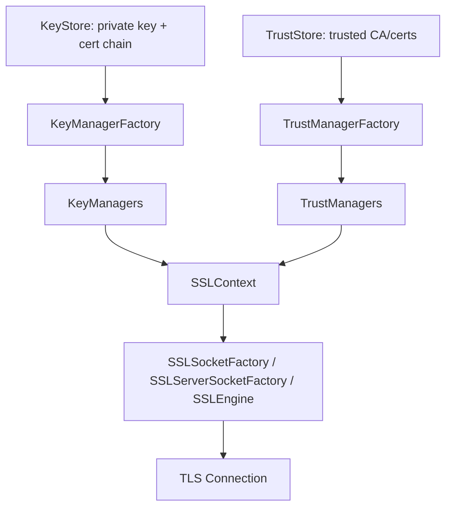
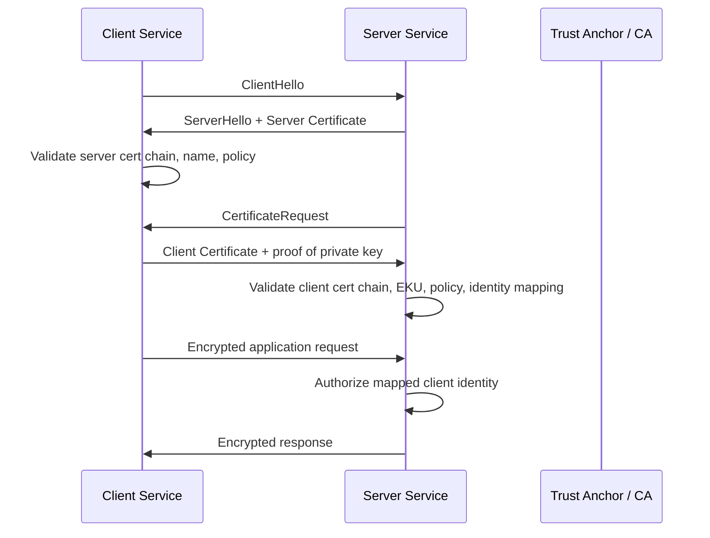
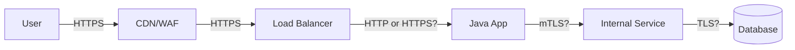
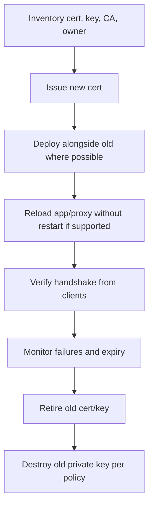
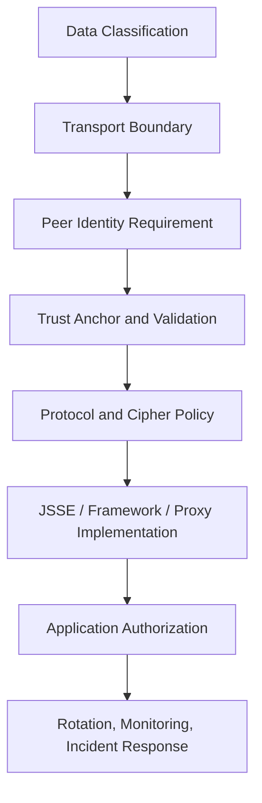

------
title: Learn Java Security, Cryptography and Integrity - Part 015
description: TLS and JSSE for production Java systems: TLS 1.2/1.3 mental model, handshake, trust validation, mTLS, hostname verification, cipher policy, debugging, and operational hardening.
series: learn-java-security-cryptography-integrity
seriesTitle: Learn Java Security, Cryptography and Integrity
order: 15
partTitle: TLS, JSSE, mTLS & Certificate Validation
tags:
  - java
  - security
  - tls
  - jsse
  - mtls
  - pki
  - certificate-validation
  - integrity
date: 2026-06-30
---

# Part 015 — TLS, JSSE, mTLS & Certificate Validation

> Target: setelah part ini, kamu mampu mendesain, mengimplementasikan, mereview, dan men-debug TLS/mTLS di aplikasi Java production. Fokusnya bukan sekadar “pakai HTTPS”, tetapi memahami boundary, trust validation, client/server identity, handshake state, cipher policy, observability, dan failure mode yang sering membuat sistem terlihat aman padahal tidak.

Part 013 membahas X.509, PKI, trust store, certificate chain, dan trust material. Part ini memakai foundation tersebut untuk komunikasi runtime melalui **JSSE**: Java Secure Socket Extension.

JSSE adalah framework Java untuk secure Internet communication. Ia menyediakan implementasi TLS untuk encryption, server authentication, message integrity, dan optional client authentication. Dalam Java enterprise, JSSE muncul di banyak tempat: `HttpsURLConnection`, HTTP client, JDBC over TLS, gRPC/Netty, Kafka client, Elasticsearch client, Spring Boot embedded server, service mesh sidecar, dan internal service-to-service channels.

Referensi utama:

- Java SE 25 JSSE Reference Guide: <https://docs.oracle.com/en/java/javase/25/security/java-secure-socket-extension-jsse-reference-guide.html>
- Java SE 25 JCA Reference Guide: <https://docs.oracle.com/en/java/javase/25/security/java-cryptography-architecture-jca-reference-guide.html>
- Java SE 25 Security Standard Algorithm Names: <https://docs.oracle.com/en/java/javase/25/docs/specs/security/standard-names.html>
- OWASP Transport Layer Security Cheat Sheet: <https://cheatsheetseries.owasp.org/cheatsheets/Transport_Layer_Security_Cheat_Sheet.html>
- OWASP Certificate and Public Key Pinning Cheat Sheet: <https://cheatsheetseries.owasp.org/cheatsheets/Pinning_Cheat_Sheet.html>
- OWASP WSTG — Testing for Weak Transport Layer Security: <https://owasp.org/www-project-web-security-testing-guide/latest/4-Web_Application_Security_Testing/09-Testing_for_Weak_Cryptography/01-Testing_for_Weak_Transport_Layer_Security>
- NIST SP 800-52 Rev. 2 — Guidelines for TLS Implementations: <https://csrc.nist.gov/pubs/sp/800/52/r2/final>
- RFC 8446 — TLS 1.3: <https://www.rfc-editor.org/rfc/rfc8446>

---

## 1. Kaufman Deconstruction: TLS Skill Map

TLS terlalu sering dipahami sebagai checkbox. Untuk menjadi engineer yang reliable, pecah TLS menjadi skill kecil yang bisa dipraktikkan.

| Capability | Pertanyaan korektif | Output engineering |
|---|---|---|
| Protocol mental model | Apa yang dilindungi TLS, dan apa yang tidak? | Trust-boundary diagram. |
| Server identity validation | Apakah client benar-benar tahu ia bicara dengan server yang tepat? | Chain + hostname validation. |
| Client identity validation | Apakah server perlu mengautentikasi client melalui certificate? | mTLS design. |
| Cipher/protocol policy | Versi TLS dan cipher suite apa yang boleh? | Policy-as-code / runtime config. |
| Trust material governance | Trust store dan key store berasal dari mana? | Certificate inventory + owner. |
| Operational rotation | Bisa rotate cert tanpa outage? | Renewal and deployment runbook. |
| Debugging | Bisa membaca handshake failure? | Repeatable TLS diagnostic workflow. |
| Misuse review | Bisa menemukan disabled hostname verification, trust-all manager, weak protocol? | Secure code review checklist. |
| Boundary placement | TLS terminates di mana: app, sidecar, ingress, load balancer? | End-to-end security architecture. |
| Incident response | Jika private key/cert bocor, apa dampaknya? | Reissue, revoke, rotate, blocklist plan. |

Mental model ringkas:



Core invariant:

> TLS hanya aman jika identity, key exchange, protocol policy, certificate validation, dan endpoint boundary semuanya benar. Encryption tanpa validasi identity bukan secure channel; itu hanya encrypted conversation dengan pihak yang belum terbukti.

---

## 2. Apa yang TLS Berikan — dan Tidak Berikan

TLS biasanya memberi empat guarantee utama.

| Guarantee | Makna | Catatan |
|---|---|---|
| Confidentiality | Passive observer tidak bisa membaca plaintext. | Bergantung pada key exchange dan cipher. |
| Integrity | Traffic modification terdeteksi. | AEAD/MAC melindungi record. |
| Server authentication | Client memverifikasi server identity. | Bergantung pada chain + hostname validation. |
| Optional client authentication | Server memverifikasi client certificate. | Inilah mTLS. |

Namun TLS **tidak** otomatis menyelesaikan:

- authorization bisnis,
- object-level access control,
- SQL injection,
- SSRF,
- request replay di level aplikasi,
- stolen session cookie,
- compromised endpoint,
- data exposure setelah TLS termination,
- malicious dependency,
- logging plaintext sensitive data,
- certificate governance yang kacau.

Contoh misleading assumption:

```text
"Internal network sudah pakai HTTPS, jadi aman."
```

Problem:

- Jika service A bisa memanggil service B, belum tentu ia authorized untuk semua operation B.
- Jika TLS terminate di ingress lalu traffic internal plaintext, boundary sebenarnya ada di ingress, bukan di service.
- Jika internal CA bisa issue certificate untuk semua service tanpa policy, mTLS identity bisa dipalsukan oleh workload lain yang punya akses issuance.
- Jika hostname verification disabled, attacker dengan certificate valid untuk nama lain tetap bisa diterima.

Better framing:

```text
TLS protects a transport boundary. Authorization and data integrity still need application-level invariants.
```

---

## 3. TLS 1.2 vs TLS 1.3: Practical Model

Untuk sistem baru, prefer TLS 1.3. TLS 1.2 masih sering diperlukan untuk compatibility, tetapi harus dikonfigurasi ketat.

| Aspek | TLS 1.2 | TLS 1.3 |
|---|---|---|
| Cipher negotiation | Banyak kombinasi legacy. | Lebih sedikit dan lebih modern. |
| Key exchange | Bisa RSA static legacy jika salah konfigurasi. | Forward secrecy by design. |
| Handshake | Lebih banyak round-trip. | Lebih cepat. |
| Cipher suite semantics | Cipher suite mencakup banyak komponen. | Cipher suite lebih fokus pada AEAD/hash. |
| Legacy risk | CBC, weak groups, old signatures, renegotiation. | Lebih sedikit footgun. |
| Operational reality | Masih banyak dipakai. | Default modern target. |

OWASP merekomendasikan TLS 1.3 dengan AEAD cipher suite seperti AES-GCM atau ChaCha20-Poly1305. Jika TLS 1.2 masih dibutuhkan, gunakan AEAD-based cipher suites dan hindari CBC-mode ciphers.

Java modern biasanya sudah punya default yang cukup aman, tetapi production engineering tetap perlu explicit governance:

- enforce minimal version,
- cek disabled algorithms,
- cek cipher policy,
- cek trust store owner,
- cek hostname verification,
- cek certificate expiry/rotation,
- cek observability untuk handshake failure.

Jangan mengandalkan asumsi “JDK default aman” tanpa inventory. Default bisa berbeda antara JDK distribution, versi patch, provider, OS crypto policy, container image, dan framework.

---

## 4. JSSE Building Blocks

JSSE dibangun di atas JCA provider architecture. Komponen utama:

| Komponen | Fungsi |
|---|---|
| `SSLContext` | Factory utama untuk TLS objects berdasarkan protocol/provider/config. |
| `SSLSocketFactory` | Membuat TLS socket client-side. |
| `SSLServerSocketFactory` | Membuat TLS socket server-side. |
| `SSLEngine` | TLS state machine non-blocking; banyak dipakai Netty/gRPC. |
| `KeyManager` | Menyediakan private key dan certificate chain lokal. |
| `TrustManager` | Memvalidasi certificate peer. |
| `KeyManagerFactory` | Membuat `KeyManager` dari key store. |
| `TrustManagerFactory` | Membuat `TrustManager` dari trust store. |
| `KeyStore` | Container trust material dan private key material. |
| `SSLParameters` | Mengatur endpoint identification, protocols, cipher suites, client auth, SNI, ALPN. |

Alur konfigurasi umum:



Java code skeleton:

```java
import javax.net.ssl.*;
import java.io.InputStream;
import java.nio.file.Files;
import java.nio.file.Path;
import java.security.KeyStore;

public final class TlsContextFactory {
    private TlsContextFactory() {}

    public static SSLContext clientContext(Path trustStorePath, char[] trustStorePassword) throws Exception {
        KeyStore trustStore = KeyStore.getInstance("PKCS12");
        try (InputStream in = Files.newInputStream(trustStorePath)) {
            trustStore.load(in, trustStorePassword);
        }

        TrustManagerFactory tmf = TrustManagerFactory.getInstance(TrustManagerFactory.getDefaultAlgorithm());
        tmf.init(trustStore);

        SSLContext context = SSLContext.getInstance("TLS");
        context.init(null, tmf.getTrustManagers(), null);
        return context;
    }

    public static SSLContext serverContext(
            Path keyStorePath,
            char[] keyStorePassword,
            char[] keyPassword,
            Path trustStorePath,
            char[] trustStorePassword
    ) throws Exception {
        KeyStore keyStore = KeyStore.getInstance("PKCS12");
        try (InputStream in = Files.newInputStream(keyStorePath)) {
            keyStore.load(in, keyStorePassword);
        }

        KeyManagerFactory kmf = KeyManagerFactory.getInstance(KeyManagerFactory.getDefaultAlgorithm());
        kmf.init(keyStore, keyPassword);

        KeyStore trustStore = KeyStore.getInstance("PKCS12");
        try (InputStream in = Files.newInputStream(trustStorePath)) {
            trustStore.load(in, trustStorePassword);
        }

        TrustManagerFactory tmf = TrustManagerFactory.getInstance(TrustManagerFactory.getDefaultAlgorithm());
        tmf.init(trustStore);

        SSLContext context = SSLContext.getInstance("TLS");
        context.init(kmf.getKeyManagers(), tmf.getTrustManagers(), null);
        return context;
    }
}
```

Important notes:

- Use `PKCS12` as the standard portable keystore type for new systems unless a specific provider/HSM requires otherwise.
- Do not hardcode keystore password in code or YAML committed to repo.
- Avoid global JVM-level TLS properties when service-specific context is clearer.
- Do not implement custom `TrustManager` unless you can prove exact validation logic and test it with negative cases.

---

## 5. Server Authentication: Chain + Hostname + Policy

Server authentication is not “certificate exists”. It is a decision:

```text
Should this client trust this peer as the intended server for this connection, now, under this policy?
```

Validation layers:

| Layer | Question | Example failure |
|---|---|---|
| Chain validation | Is the certificate chain anchored in a trusted CA? | Unknown CA. |
| Validity period | Is the cert valid now? | Expired cert. |
| Key usage / EKU | Is cert usable for server auth? | Client-only cert used as server cert. |
| Algorithm constraints | Are algorithms/key sizes allowed? | SHA-1 or weak RSA. |
| Revocation policy | Is cert revoked? | Compromised cert still accepted. |
| Hostname verification | Does cert identify intended host? | Cert for `api.dev.local` used for `api.prod.local`. |
| Application policy | Is this CA/name allowed for this service? | Public CA accepted for internal service accidentally. |

The most common catastrophic bug:

```java
TrustManager[] trustAll = new TrustManager[] {
    new X509TrustManager() {
        public void checkClientTrusted(java.security.cert.X509Certificate[] chain, String authType) {}
        public void checkServerTrusted(java.security.cert.X509Certificate[] chain, String authType) {}
        public java.security.cert.X509Certificate[] getAcceptedIssuers() { return new java.security.cert.X509Certificate[0]; }
    }
};
```

This disables trust validation. It may be used in StackOverflow snippets, test hacks, or “temporary” local dev code. In production code review, treat this as a release-blocking vulnerability.

Another common bug:

```java
HostnameVerifier trustAnyHostname = (hostname, session) -> true;
```

This disables hostname verification. Even with a valid certificate chain, the client no longer proves it connected to the intended host.

Correct posture:

```text
Use default validation unless there is a documented policy-specific reason.
When custom validation is needed, wrap the platform validator instead of replacing it.
```

---

## 6. Hostname Verification in Java Clients

For HTTPS, hostname verification is normally part of the HTTPS layer, not merely raw TLS. If you use lower-level APIs or custom `SSLEngine`, you must ensure endpoint identification is enabled.

Example with `SSLSocket`:

```java
import javax.net.ssl.SSLParameters;
import javax.net.ssl.SSLSocket;
import javax.net.ssl.SSLSocketFactory;

public final class SafeTlsSocketExample {
    public static void connect(String host, int port) throws Exception {
        SSLSocketFactory factory = (SSLSocketFactory) SSLSocketFactory.getDefault();
        try (SSLSocket socket = (SSLSocket) factory.createSocket(host, port)) {
            SSLParameters params = socket.getSSLParameters();
            params.setEndpointIdentificationAlgorithm("HTTPS");
            params.setProtocols(new String[] {"TLSv1.3", "TLSv1.2"});
            socket.setSSLParameters(params);
            socket.startHandshake();
        }
    }
}
```

The important line:

```java
params.setEndpointIdentificationAlgorithm("HTTPS");
```

Without endpoint identification, a raw TLS connection can validate chain but not the intended DNS identity.

For Java HTTP Client:

```java
import java.net.URI;
import java.net.http.HttpClient;
import java.net.http.HttpRequest;
import java.net.http.HttpResponse;

HttpClient client = HttpClient.newBuilder()
        .version(HttpClient.Version.HTTP_2)
        .build();

HttpRequest request = HttpRequest.newBuilder()
        .uri(URI.create("https://api.example.com/v1/cases"))
        .GET()
        .build();

HttpResponse<String> response = client.send(request, HttpResponse.BodyHandlers.ofString());
```

Default Java HTTP clients usually handle hostname verification. The review target is not default usage; it is custom SSL context, custom trust manager, custom hostname verifier, or disabled flags.

---

## 7. mTLS: Mutual Authentication Without Magical Thinking

mTLS means both sides present certificates:

- Server proves identity to client.
- Client proves identity to server.



mTLS gives strong workload authentication, but it is not authorization by itself.

Bad design:

```text
If client certificate is valid, allow all operations.
```

Better design:

```text
If client certificate maps to workload identity `case-ingestion-service`, allow only operations granted to that workload under policy.
```

mTLS design decisions:

| Decision | Recommendation |
|---|---|
| Identity source | Use SAN URI/DNS/SPIFFE-like identity, not ambiguous CN parsing. |
| Trust anchor | Separate internal service CA from public web CA. |
| Authorization | Map cert identity to service principal, then apply policy. |
| Rotation | Short-lived certs, automated renewal, overlapping validity. |
| Revocation | Prefer short-lived certs plus workload identity revocation; understand OCSP/CRL limits. |
| Termination | Know exactly where client cert is validated. |
| Proxy headers | Do not trust `X-Forwarded-Client-Cert` unless inserted by a trusted proxy and stripped from external traffic. |

Server-side client auth with JSSE-like primitives:

```java
import javax.net.ssl.SSLParameters;
import javax.net.ssl.SSLServerSocket;
import javax.net.ssl.SSLServerSocketFactory;

SSLServerSocketFactory factory = sslContext.getServerSocketFactory();
try (SSLServerSocket serverSocket = (SSLServerSocket) factory.createServerSocket(8443)) {
    SSLParameters params = serverSocket.getSSLParameters();
    params.setProtocols(new String[] {"TLSv1.3", "TLSv1.2"});
    serverSocket.setSSLParameters(params);

    // Require client certificate.
    serverSocket.setNeedClientAuth(true);

    // accept loop omitted
}
```

In Spring Boot, you will often configure mTLS at the embedded server, ingress, gateway, or service mesh layer. The same invariants apply.

---

## 8. mTLS Identity Mapping

Certificate validation answers:

```text
Is this certificate cryptographically valid under a trusted chain and acceptable policy?
```

It does not answer:

```text
What is this principal allowed to do?
```

Map peer certificate to an internal principal.

Example identity extraction model:

```text
Certificate SAN URI: spiffe://prod.example.com/ns/regulatory/sa/case-ingestion
Mapped principal: workload:prod:regulatory:case-ingestion
Granted roles: submit-case-event, read-case-schema
Denied roles: approve-enforcement-action, export-evidence
```

Avoid ambiguous mapping:

- parsing Common Name as identity when SAN exists,
- trusting arbitrary OU/O fields,
- using certificate serial number as business identity,
- allowing multiple identities in a cert without deterministic policy,
- accepting broad wildcard names for workload identity.

Pseudo-code:

```java
import java.security.Principal;
import java.security.cert.X509Certificate;
import java.util.List;

public final class ClientCertificateIdentityMapper {
    public ServicePrincipal map(X509Certificate cert) {
        List<String> sanUris = CertificateNames.subjectAlternativeNameUris(cert);

        String uri = sanUris.stream()
                .filter(v -> v.startsWith("spiffe://prod.example.com/"))
                .findFirst()
                .orElseThrow(() -> new SecurityException("No approved workload identity SAN"));

        return ServicePrincipal.fromSpiffeUri(uri);
    }
}
```

The mapping function should be small, deterministic, tested, and owned like authorization code.

---

## 9. TLS Termination Boundaries

A secure architecture must say where TLS starts and ends.

Common patterns:



Questions to answer:

| Boundary | Required question |
|---|---|
| Browser to CDN | Is HSTS enabled? What TLS policy? |
| CDN to load balancer | Is traffic re-encrypted? Who validates backend cert? |
| Load balancer to app | Plain HTTP or HTTPS? Is network trusted enough? |
| Service to service | mTLS, service mesh, or app-level TLS? |
| App to database | Does JDBC validate server certificate and hostname? |
| App to third-party API | Is trust store constrained? Is outbound allowlisted? |

Misleading pattern:

```text
External HTTPS terminates at load balancer, then internal network is trusted.
```

This may be acceptable only if explicitly justified by network isolation, compliance requirements, threat model, and compensating controls. For high-integrity systems, service-to-service TLS/mTLS is usually a better default.

Important invariant:

> After TLS terminates, plaintext exists. Every hop after termination needs its own trust and exposure model.

---

## 10. Cipher Suites, Protocols, and Algorithm Constraints

TLS policy has three layers:

1. Application/framework-level configuration.
2. JDK-level algorithm constraints.
3. Infrastructure-level policy at proxy/load balancer/service mesh.

Examples of settings you may encounter:

```properties
# JVM security properties, often in java.security
jdk.tls.disabledAlgorithms=SSLv3, TLSv1, TLSv1.1, RC4, DES, MD5withRSA, \
    DH keySize < 2048, EC keySize < 224, 3DES_EDE_CBC, anon, NULL
```

In app/framework config, prefer:

```yaml
server:
  ssl:
    enabled: true
    enabled-protocols: TLSv1.3,TLSv1.2
```

For TLS 1.3, cipher suite names are standardized and narrower. For TLS 1.2, avoid legacy non-AEAD suites.

Review questions:

- Are SSLv2/SSLv3/TLS 1.0/TLS 1.1 disabled?
- Is TLS 1.3 enabled where supported?
- If TLS 1.2 is enabled, are cipher suites AEAD-based?
- Are weak signature algorithms blocked?
- Are weak DH/EC parameters blocked?
- Are anonymous/null/export cipher suites impossible?
- Are algorithm constraints documented and tested in CI/CD or runtime startup checks?

Startup guardrail example:

```java
import javax.net.ssl.SSLContext;
import javax.net.ssl.SSLParameters;
import java.util.Arrays;
import java.util.Set;

public final class TlsPolicyAssert {
    private static final Set<String> ALLOWED_PROTOCOLS = Set.of("TLSv1.3", "TLSv1.2");

    public static void assertDefaultProtocols() throws Exception {
        SSLContext context = SSLContext.getDefault();
        SSLParameters params = context.getSupportedSSLParameters();

        boolean hasModernProtocol = Arrays.stream(params.getProtocols())
                .anyMatch(ALLOWED_PROTOCOLS::contains);

        if (!hasModernProtocol) {
            throw new IllegalStateException("Runtime does not support required TLS protocols");
        }
    }
}
```

This does not prove the server is configured correctly, but it catches bad runtime baselines early.

---

## 11. Certificate Pinning: Rarely the First Answer

Certificate/public key pinning means the client restricts trust to specific certificate/public key material instead of only relying on normal CA validation.

It can reduce risk from CA compromise or unintended CA issuance, but it creates operational risk:

- certificate rotation can break clients,
- lost pin backup can brick mobile/desktop clients,
- emergency CA migration becomes hard,
- pinned internal services need lifecycle automation,
- bad pinning often disables platform validation accidentally.

Use pinning only when you have:

- controlled clients,
- strong release/rollback path,
- backup pins,
- monitoring,
- rotation plan,
- tested failure behavior,
- documented threat model.

Bad pinning:

```java
// WRONG: custom trust manager that checks only certificate fingerprint
// and skips chain/hostname/expiry/keyUsage validation.
```

Better pinning posture:

```text
Run normal certificate validation first.
Then apply an additional pin constraint.
```

Pseudo-code:

```java
validateCertificateChainAndHostname(peerCertificate, expectedHost);
verifyPinnedPublicKeyHash(peerCertificate, allowedPins);
```

Pinning is not a substitute for fixing CA governance or mTLS identity mapping.

---

## 12. Revocation: OCSP, CRL, and Short-Lived Certificates

Certificate revocation is operationally difficult. Options:

| Mechanism | Strength | Limitation |
|---|---|---|
| CRL | Batch revocation list. | Large/stale; fetch complexity. |
| OCSP | Query revocation status. | Availability/privacy/soft-fail concerns. |
| OCSP stapling | Server provides signed OCSP status. | Deployment complexity. |
| Short-lived certs | Reduces revocation dependence. | Needs automated issuance/rotation. |
| Trust anchor removal | Strong emergency control. | Broad blast radius. |

For internal service identity, short-lived certificates plus automated renewal are often more reliable than complex revocation. For public-facing TLS, follow CA/browser ecosystem and platform policy.

Java has revocation-related properties and APIs, but enabling them blindly can cause availability incidents if CRL/OCSP endpoints are unreliable. Treat revocation as architecture, not one boolean.

Design questions:

- What is the expected revocation latency?
- Does the system fail-open or fail-closed when revocation status is unavailable?
- Which service class can tolerate fail-closed?
- Are certificate serial numbers and issuers logged for incident tracing?
- Can we remove a compromised CA from trust store quickly?

---

## 13. Java HTTP Client with Custom SSLContext

Example: client uses constrained trust store and default hostname verification.

```java
import javax.net.ssl.SSLContext;
import java.net.URI;
import java.net.http.HttpClient;
import java.net.http.HttpRequest;
import java.net.http.HttpResponse;
import java.time.Duration;

public final class SecureApiClient {
    private final HttpClient httpClient;
    private final URI baseUri;

    public SecureApiClient(SSLContext sslContext, URI baseUri) {
        this.baseUri = baseUri;
        this.httpClient = HttpClient.newBuilder()
                .sslContext(sslContext)
                .connectTimeout(Duration.ofSeconds(3))
                .version(HttpClient.Version.HTTP_2)
                .build();
    }

    public String getCase(String caseId) throws Exception {
        HttpRequest request = HttpRequest.newBuilder()
                .uri(baseUri.resolve("/cases/" + caseId))
                .timeout(Duration.ofSeconds(5))
                .GET()
                .build();

        HttpResponse<String> response = httpClient.send(request, HttpResponse.BodyHandlers.ofString());
        if (response.statusCode() >= 400) {
            throw new IllegalStateException("API error: " + response.statusCode());
        }
        return response.body();
    }
}
```

Review checklist:

- `baseUri` must be `https://`.
- SSL context must use proper trust managers.
- No global disabled hostname verification flags.
- Timeouts must exist.
- Error handling must not log secrets/tokens.
- Redirect policy must not leak credentials to different host.

---

## 14. JDBC over TLS

Database TLS is frequently misconfigured because developers assume JDBC URL flags are enough. The exact configuration depends on driver.

Examples of pitfalls:

- `ssl=true` encrypts but does not validate hostname.
- `trustServerCertificate=true` accepts any cert.
- self-signed cert copied into app container without rotation process.
- production database cert signed by unrelated internal CA trusted by too many apps.
- TLS terminates at DB proxy, but app thinks it validates database identity.

Generic invariant:

```text
JDBC TLS must verify the server certificate and expected database hostname or service identity.
```

Database client review questions:

- Does the driver validate server identity by default?
- Is `trustServerCertificate` disabled in production?
- Is trust store explicitly controlled?
- Does the JDBC URL point to a stable DNS name covered by SAN?
- Are credentials and connection strings redacted from logs?
- Is failover DNS/cert coverage tested?

---

## 15. Service Mesh vs Application TLS

Modern platforms often use service mesh mTLS. That can be excellent, but do not confuse platform-level authentication with application-level authorization.

| Dimension | Service mesh mTLS | Application-managed TLS |
|---|---|---|
| Certificate lifecycle | Automated by mesh. | App/team responsibility. |
| Language neutrality | Strong. | Per-language configuration. |
| Identity mapping | Usually workload identity. | App-specific. |
| App visibility | App may only see forwarded identity/header. | App can inspect peer cert. |
| Failure mode | Sidecar/proxy config dependent. | App config dependent. |
| Operational complexity | Platform complexity. | App complexity. |

Safe pattern:

```text
Mesh authenticates workload-to-workload transport.
Application authorizes business operation using a trusted propagated principal or token.
```

Danger pattern:

```text
Any request from mesh is trusted as fully authorized.
```

If identity is propagated from proxy to app through headers, the app must know:

- which proxy inserted the header,
- whether external clients can spoof it,
- whether ingress strips incoming identity headers,
- how the identity is signed or otherwise bound to the connection,
- how authorization uses it.

---

## 16. TLS Debugging Workflow

TLS failures often look cryptic. Build a repeatable workflow.

Common Java exceptions:

| Error | Likely cause |
|---|---|
| `PKIX path building failed` | Chain not anchored in trust store, missing intermediate, wrong trust store. |
| `No subject alternative names present` | Cert lacks SAN for host. |
| `No name matching ... found` | Hostname mismatch. |
| `Received fatal alert: handshake_failure` | Protocol/cipher/client cert mismatch. |
| `bad_certificate` | Certificate rejected by peer. |
| `unable to find valid certification path` | Trust chain issue. |
| `Algorithm constraints check failed` | Weak algorithm/key size disabled by JDK policy. |
| `Keystore was tampered with, or password was incorrect` | Wrong store password/type. |

JVM debugging:

```bash
java \
  -Djavax.net.debug=ssl,handshake,certpath \
  -jar app.jar
```

Useful external checks:

```bash
openssl s_client -connect api.example.com:443 -servername api.example.com -showcerts
```

For mTLS:

```bash
openssl s_client \
  -connect mtls.example.com:443 \
  -servername mtls.example.com \
  -cert client.crt \
  -key client.key \
  -CAfile ca.crt \
  -showcerts
```

Debugging order:

1. Confirm DNS and target port.
2. Confirm SNI hostname.
3. Inspect server certificate chain.
4. Verify SAN covers expected hostname.
5. Verify trust anchor exists in trust store.
6. Verify intermediate chain is complete.
7. Verify protocol/cipher compatibility.
8. Verify client certificate request/response for mTLS.
9. Verify algorithm constraints.
10. Verify application-level authorization after handshake.

Do not “fix” by disabling validation. That replaces a diagnostic problem with a security incident.

---

## 17. Production Observability for TLS

TLS should be observable without leaking secrets.

Log these safely:

- connection target logical name,
- peer host,
- TLS protocol version,
- cipher suite,
- certificate issuer/subject hash/serial,
- not-before/not-after,
- validation failure category,
- mTLS mapped principal,
- trust store version,
- cert renewal event,
- handshake failure count.

Do not log:

- private keys,
- session keys,
- full bearer tokens,
- full client certificates if they contain sensitive identifiers,
- keystore passwords,
- raw secrets in debug logs.

Metric examples:

```text
tls_handshake_failures_total{reason="hostname_mismatch"}
tls_certificate_days_until_expiry{service="case-api"}
tls_protocol_negotiated_total{protocol="TLSv1.3"}
mtls_client_auth_failures_total{reason="untrusted_ca"}
```

Alert examples:

- cert expires in less than 14 days,
- sudden spike in `PKIX path building failed`,
- TLS 1.2 fallback exceeds threshold,
- mTLS unknown principal attempts increase,
- trust store version drift across pods.

---

## 18. Certificate Rotation Without Outage

Rotation protocol for server cert:



For mTLS client cert rotation:

- server trust should accept issuing CA or both old/new identities during overlap,
- client deploys new cert/key,
- authorization mapping should not depend on certificate serial unless intentional,
- logs should differentiate old/new cert for incident tracking,
- old cert should expire quickly or be revoked/blocked.

Avoid this bad pattern:

```text
Replace CA and leaf cert simultaneously with no trust overlap.
```

Better:

```text
Add new CA trust -> issue new leaf -> deploy leaf -> verify -> remove old CA trust after all clients migrated.
```

---

## 19. Secure Code Review Checklist

Block release if any are true:

- `TrustManager` accepts all certs.
- `HostnameVerifier` returns `true` unconditionally.
- TLS disabled for sensitive traffic.
- `trustServerCertificate=true` in production JDBC config.
- `http://` used for internal sensitive APIs without documented compensating control.
- Keystore/truststore password committed to repo.
- Private key committed to repo or baked into broad container image.
- Wildcard trust store accepts more CAs than needed for internal mTLS.
- Client cert identity is accepted but not authorized.
- Proxy identity headers are trusted from untrusted networks.
- TLS debug logs are enabled in production and leak sensitive metadata.
- Certificate expiry is not monitored.
- Rotation requires manual emergency downtime.

Ask hard questions:

1. What identity is proven by this TLS connection?
2. Which trust anchor enables that proof?
3. Where does TLS terminate?
4. What plaintext boundary exists after termination?
5. How is peer identity mapped to authorization?
6. What breaks when certificate rotates?
7. What happens when the CA is compromised?
8. Can the service run with only TLS 1.3? If not, why?
9. Does the client verify hostname/SAN?
10. Are algorithm constraints enforced by runtime and infrastructure?

---

## 20. Hands-on Lab

### Lab A — Detect Disabled Hostname Verification

Create a small test utility that scans Java code for obvious anti-patterns:

- `HostnameVerifier` returning `true`,
- `X509TrustManager` with empty `checkServerTrusted`,
- `setEndpointIdentificationAlgorithm(null)`,
- `-Djdk.internal.httpclient.disableHostnameVerification=true`,
- JDBC `trustServerCertificate=true`.

Output:

```text
BLOCKER: Trust-all X509TrustManager in src/main/java/.../DevTls.java
BLOCKER: HostnameVerifier returns true in src/main/java/.../HttpClientFactory.java
WARNING: JDBC trustServerCertificate=true in application-prod.yml
```

### Lab B — Build Local mTLS

1. Create local CA.
2. Issue server cert with SAN `DNS:localhost`.
3. Issue client cert with SAN URI `spiffe://local/ns/dev/sa/client-a`.
4. Run Java HTTPS server requiring client auth.
5. Run Java client with client key store and trust store.
6. Verify good client succeeds.
7. Verify unknown client fails.
8. Verify valid cert but unauthorized service principal fails at application layer.

Expected learning:

```text
mTLS authentication and application authorization are separate decisions.
```

### Lab C — Rotation Drill

Simulate cert rotation:

- start with CA-A and leaf-A,
- introduce CA-B trust,
- deploy leaf-B,
- remove CA-A,
- prove client compatibility at each step.

Document:

- exact failure mode when trust overlap is missing,
- required dashboard metrics,
- rollback plan.

---

## 21. Decision Record Template

Use this template for production TLS decisions.

```mdx
# TLS Decision Record: <service/channel>

## Context
- Caller:
- Callee:
- Data classification:
- Network boundary:
- TLS termination point:

## Identity
- Server identity source:
- Client identity source, if mTLS:
- Certificate SAN format:
- CA/trust anchor:

## Policy
- Minimum TLS version:
- Allowed cipher policy:
- Hostname verification:
- Revocation/short-lived cert strategy:
- Trust store owner:

## Authorization
- Peer identity mapping:
- Policy engine or enforcement code:
- Deny-by-default behavior:

## Operations
- Rotation process:
- Expiry monitoring:
- Incident response:
- Debugging runbook:

## Rejected Alternatives
- Why not plaintext internal traffic?
- Why not certificate pinning?
- Why not public CA for internal mTLS?
```

---

## 22. Common Anti-Patterns

| Anti-pattern | Why dangerous | Safer alternative |
|---|---|---|
| Trust-all manager | MITM becomes trivial. | Proper trust store. |
| Disable hostname verification | Wrong endpoint accepted. | Endpoint identification. |
| One trust store for everything | Trust blast radius too large. | Per-domain trust stores. |
| mTLS as authorization | Valid cert can overreach. | Map principal then authorize. |
| Long-lived internal certs | Revocation/compromise impact high. | Short-lived certs + automation. |
| Manual cert renewal | Outage-prone. | Automated rotation and monitoring. |
| Cert pinning everywhere | Operational brittleness. | Normal validation + constrained CA; pin only with strong reason. |
| TLS only at ingress | Internal exposure ignored. | Explicit hop-by-hop boundary design. |
| Trust proxy headers blindly | Header spoofing. | Strip untrusted headers, trust only known proxy path. |
| Debug TLS in prod forever | Metadata leak and noise. | Temporary scoped debug with redaction. |

---

## 23. Final Mental Model

TLS in Java production is not a library call. It is a chain of decisions:



Top 1% engineer behavior:

- never says “HTTPS = secure” without specifying boundary,
- can explain exactly what identity TLS proves,
- knows when chain validation differs from hostname verification,
- treats mTLS as authentication, not authorization,
- can read a TLS handshake failure without disabling validation,
- designs rotation before production launch,
- keeps TLS policy consistent across app, proxy, and platform,
- logs enough to investigate without leaking secrets.

---

## 24. Self-Assessment

You are ready to continue when you can answer:

1. Apa bedanya trust store dan key store?
2. Apa yang terjadi jika certificate chain valid tapi hostname mismatch?
3. Mengapa mTLS tidak menggantikan authorization?
4. Di mana TLS terminate pada architecture kamu?
5. Apa plaintext boundary setelah termination?
6. Bagaimana cara rotate server cert tanpa outage?
7. Bagaimana cara rotate internal CA?
8. Kapan certificate pinning masuk akal?
9. Bagaimana mendeteksi trust-all manager dalam code review?
10. Apa arti `PKIX path building failed`?
11. Apa risiko `trustServerCertificate=true`?
12. Bagaimana membedakan TLS authentication failure dari application authorization failure?
13. Apa yang harus dimonitor terkait certificate expiry?
14. Apa perbedaan TLS 1.2 cipher policy dan TLS 1.3 cipher policy?
15. Bagaimana cara memetakan client certificate ke service principal?

---

## 25. What Comes Next

Part 016 masuk ke **Authentication: Passwords, MFA, Passkeys & WebAuthn**. TLS membuktikan channel dan endpoint identity; authentication membuktikan user/workload identity pada application layer. Kita akan membahas authenticator lifecycle, phishing resistance, password storage boundary, MFA recovery, passkeys, WebAuthn ceremony, enrollment, account recovery, dan session bootstrap.
