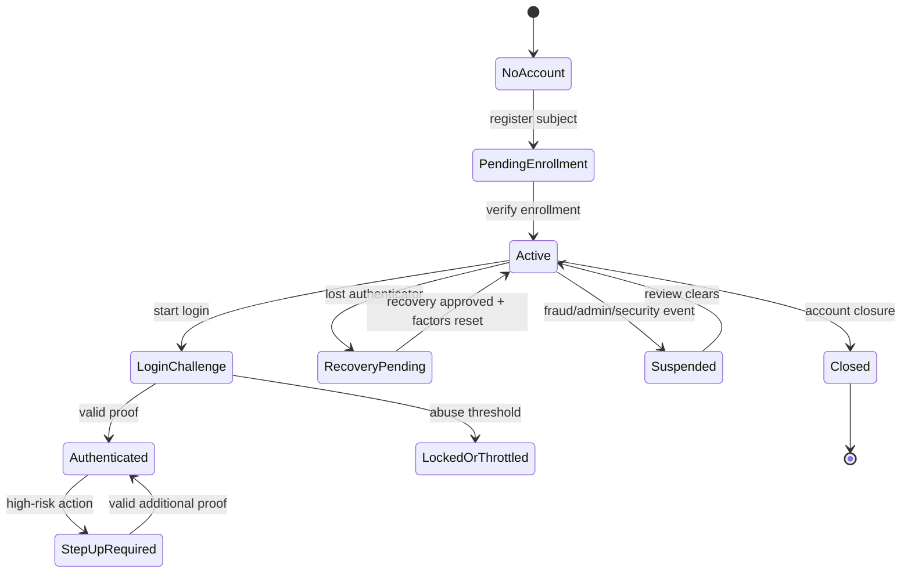
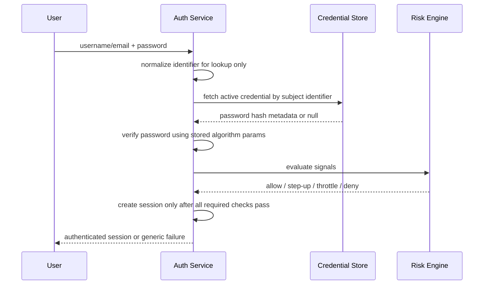
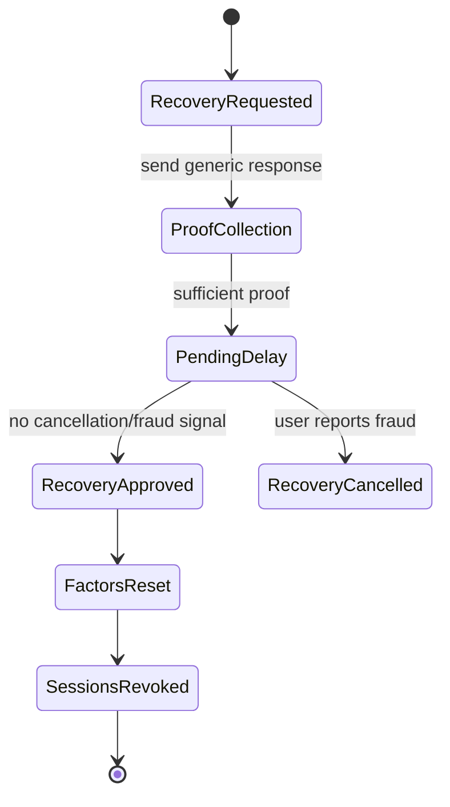
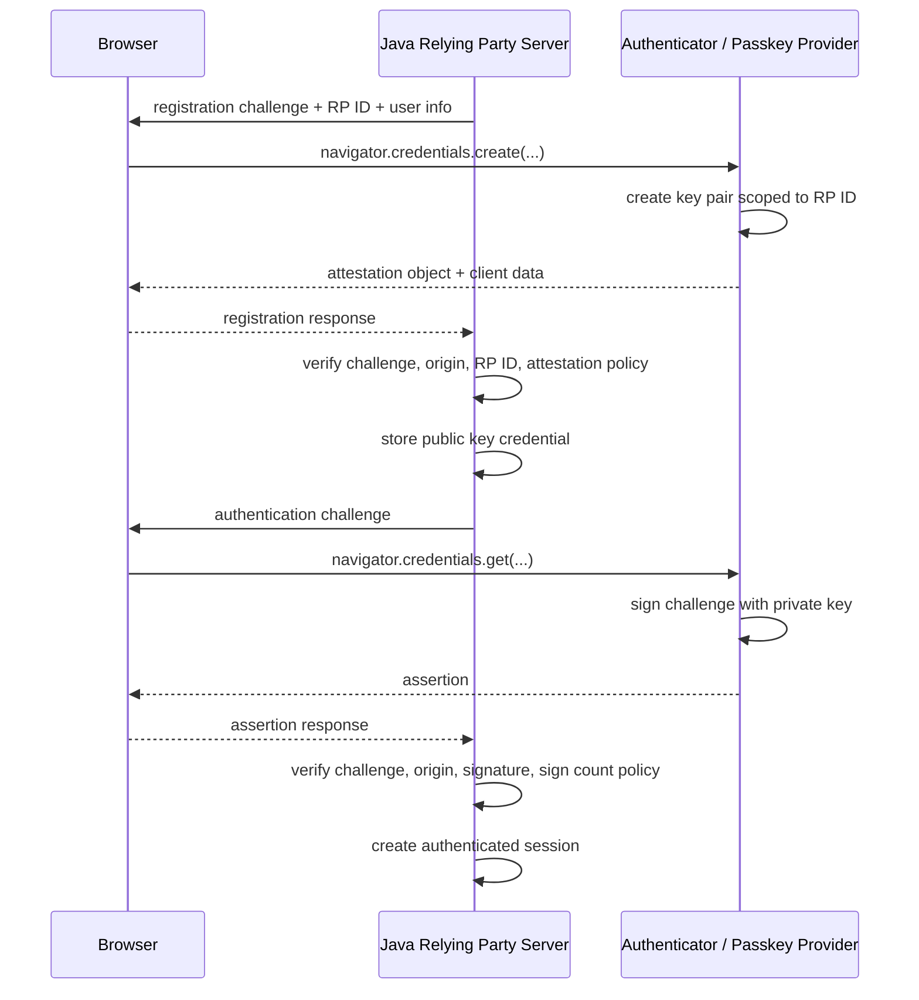
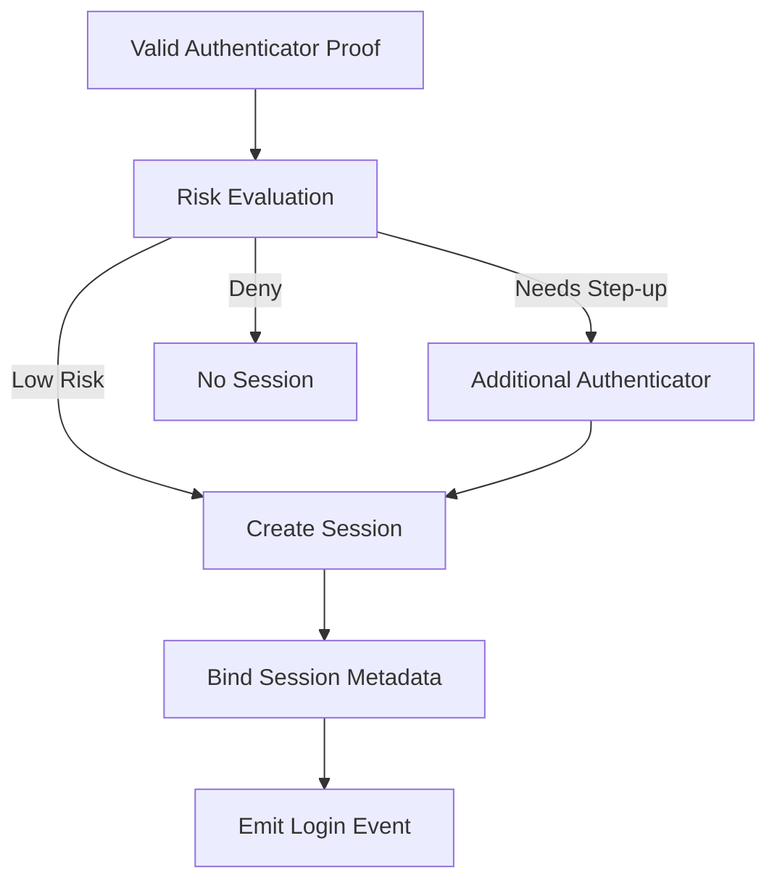
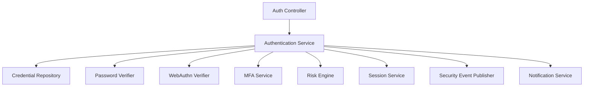
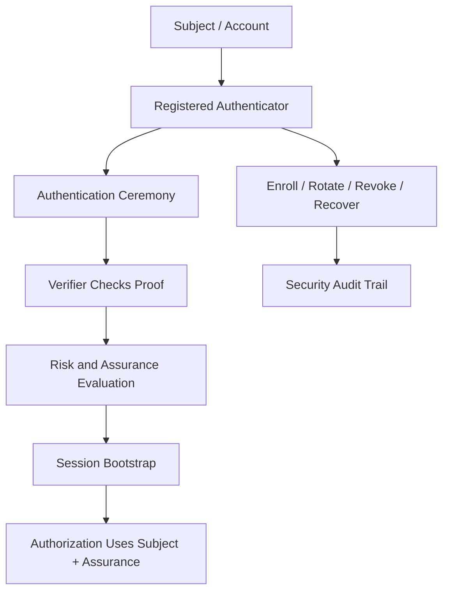

------
title: Learn Java Security, Cryptography and Integrity - Part 016
description: Authentication engineering for Java systems: passwords, MFA, passkeys, WebAuthn, authenticator lifecycle, account recovery, risk-based controls, and session bootstrap.
series: learn-java-security-cryptography-integrity
seriesTitle: Learn Java Security, Cryptography and Integrity
order: 16
partTitle: Authentication: Passwords, MFA, Passkeys & WebAuthn
tags:
  - java
  - security
  - authentication
  - passwords
  - mfa
  - passkeys
  - webauthn
  - identity
  - integrity
date: 2026-06-30
---

# Part 016 — Authentication: Passwords, MFA, Passkeys & WebAuthn

> Target: setelah part ini, kamu mampu mendesain authentication subsystem untuk aplikasi Java production: password, MFA, passkeys/WebAuthn, authenticator lifecycle, recovery, risk-based reauthentication, session bootstrap, auditability, dan failure mode. Fokusnya bukan membuat form login, tetapi membangun identity proof yang sulit disalahgunakan.

Authentication menjawab:

```text
Apakah actor yang sedang mencoba masuk dapat membuktikan kontrol atas authenticator yang terdaftar untuk subject ini?
```

Itu berbeda dari authorization:

```text
Apa yang boleh dilakukan subject ini setelah authenticated?
```

Dan berbeda dari identity proofing:

```text
Apakah subject ini benar-benar orang/organisasi tertentu di dunia nyata?
```

Referensi utama:

- NIST SP 800-63-4 Digital Identity Guidelines: <https://pages.nist.gov/800-63-4/>
- NIST SP 800-63B-4 Authentication and Authenticator Management: <https://pages.nist.gov/800-63-4/sp800-63b.html>
- OWASP Authentication Cheat Sheet: <https://cheatsheetseries.owasp.org/cheatsheets/Authentication_Cheat_Sheet.html>
- OWASP Password Storage Cheat Sheet: <https://cheatsheetseries.owasp.org/cheatsheets/Password_Storage_Cheat_Sheet.html>
- OWASP Multifactor Authentication Cheat Sheet: <https://cheatsheetseries.owasp.org/cheatsheets/Multifactor_Authentication_Cheat_Sheet.html>
- OWASP Forgot Password Cheat Sheet: <https://cheatsheetseries.owasp.org/cheatsheets/Forgot_Password_Cheat_Sheet.html>
- W3C WebAuthn Level 3: <https://www.w3.org/TR/webauthn-3/>
- FIDO Alliance Passkeys: <https://fidoalliance.org/passkeys/>
- Spring Security Passkeys: <https://docs.spring.io/spring-security/reference/servlet/authentication/passkeys.html>

---

## 1. Kaufman Deconstruction: Authentication Skill Map

Authentication terlihat sederhana karena UI-nya sederhana. Di bawahnya ada banyak state machine.

| Capability | Pertanyaan korektif | Output engineering |
|---|---|---|
| Subject model | Apa yang direpresentasikan account? Person, service, organization, admin? | Identity domain model. |
| Authenticator model | Bukti apa yang diterima? Password, passkey, OTP, hardware key? | Authenticator registry. |
| Enrollment | Bagaimana authenticator didaftarkan pertama kali? | Enrollment flow + verification. |
| Authentication ceremony | Challenge/response apa yang terjadi? | Login protocol. |
| Session bootstrap | Kapan session/token dibuat? | Session creation invariant. |
| MFA policy | Kapan faktor tambahan dibutuhkan? | Risk-based policy. |
| Recovery | Bagaimana account dipulihkan tanpa bypass security? | Recovery protocol. |
| Reauthentication | Kapan user harus membuktikan lagi? | Critical action gate. |
| Attack defense | Bagaimana melawan credential stuffing, phishing, enumeration? | Rate limits, signals, audit. |
| Audit | Bagaimana membuktikan login/recovery/perubahan factor? | Security event model. |
| Lifecycle | Bagaimana faktor diganti, dicabut, hilang, atau compromised? | Authenticator lifecycle state machine. |

Core invariant:

> Authentication bukan “cek password”. Authentication adalah lifecycle untuk mendaftarkan, menggunakan, mengganti, mencabut, dan mengaudit authenticator dengan resistance terhadap phishing, replay, enumeration, automation, dan recovery bypass.

---

## 2. Vocabulary yang Harus Presisi

| Term | Makna |
|---|---|
| Subject | Entity yang identity-nya direpresentasikan oleh account/principal. |
| Claimant | Actor yang mencoba membuktikan identity. |
| Verifier | Sistem yang memverifikasi authenticator proof. |
| Authenticator | Sesuatu yang dikontrol claimant untuk membuktikan identity. |
| Credential | Data binding antara subject dan authenticator. |
| Factor | Category bukti: knowledge, possession, inherence. |
| Session | Authenticated runtime continuity setelah login. |
| Assurance | Tingkat confidence bahwa authentication benar. |
| Recovery | Flow untuk mengembalikan akses saat authenticator hilang. |
| Step-up | Authentication tambahan untuk risk/aksi tinggi. |

Important distinction:

```text
Password is a shared secret.
Passkey/WebAuthn is asymmetric challenge-response.
Session cookie is not an authenticator; it is post-authentication continuity.
Recovery channel often becomes a de facto authenticator.
```

If recovery is weaker than login, attacker will attack recovery.

---

## 3. Authentication State Machine

A robust authentication system is easiest to reason about as a state machine.



Every transition should answer:

- Who can initiate it?
- What proof is required?
- What state changes?
- What audit event is emitted?
- What notification is sent?
- What rate limits apply?
- What rollback or cooling-off period applies?

---

## 4. Passwords: Still Common, Still Dangerous

Passwords are weak because they are:

- reusable across sites,
- phishable,
- guessable,
- leakable through breach,
- often reset through weaker flows,
- hard for humans to manage well.

A modern Java system may still need password login for compatibility. The goal is not to pretend passwords are strong; the goal is to reduce blast radius and migrate toward phishing-resistant authenticators.

Password storage recap from Part 009:

```text
Never store plaintext passwords.
Never encrypt passwords for reversible recovery.
Store salted, slow, memory-hard password hashes where possible.
Use per-user salt.
Store algorithm and parameters per credential.
Support parameter migration on login.
```

Credential record example:

```text
credential_id: pwd_123
subject_id: user_456
type: password_hash
algorithm: argon2id
parameters: m=65536,t=3,p=1
salt: base64(...)
hash: base64(...)
created_at: 2026-06-30T10:00:00Z
last_verified_at: 2026-06-30T11:00:00Z
state: active
```

If using Java platform-only APIs, PBKDF2 is commonly available via `SecretKeyFactory`, but modern password hashing often uses libraries for Argon2id/bcrypt/scrypt. The engineering rule is explicit algorithm governance and migration, not whatever is easiest to call.

---

## 5. Password Verification Flow

A safe password flow has more concerns than hash comparison.



Implementation invariants:

- Error response must not reveal whether user exists.
- Verification should use the stored hash parameters.
- Successful password verification may still require MFA/step-up.
- Failed attempts should be throttled by multiple dimensions: account, IP, device, ASN, credential stuffing signals.
- Session is created only after all mandatory factors are satisfied.
- Password reset should invalidate or step-up active sessions depending on risk.

Bad pattern:

```java
if (user == null) {
    return "No such email";
}
if (!passwordMatches) {
    return "Wrong password";
}
```

Better:

```text
Return a generic failure externally.
Emit precise internal security event.
```

---

## 6. Enumeration Resistance

Enumeration is when attacker learns account existence or state.

Leak sources:

- different error messages,
- different HTTP status codes,
- different response time,
- signup says “email already registered”,
- password reset says “we sent email” only for valid users,
- MFA screen appears only for valid credentials,
- account locked message reveals account exists.

External response examples:

```text
Login: "Invalid credentials or additional verification required."
Password reset: "If an account exists, instructions will be sent."
Signup: use email verification flow rather than direct disclosure where needed.
```

Internal events should remain specific:

```json
{
  "event_type": "auth.login.failed",
  "reason": "password_mismatch",
  "subject_id": "user_456",
  "source_ip": "203.0.113.10",
  "risk_score": 72
}
```

Do not sacrifice detection quality to hide details from users. Separate external messaging from internal telemetry.

---

## 7. MFA: What It Solves and What It Does Not

MFA combines independent factors. It significantly reduces common password compromise impact, but not all MFA is equal.

| Authenticator | Category | Phishing resistance | Notes |
|---|---|---|---|
| SMS OTP | Possession-ish | Low | Vulnerable to SIM swap, phishing, interception. |
| Email OTP | Control of email | Low/medium | Often recovery channel, not independent. |
| TOTP app | Possession | Medium | Phishable in real time. |
| Push approval | Possession | Medium | Push fatigue attacks. |
| Number matching push | Possession | Better | Still depends on user behavior. |
| Hardware security key | Possession + origin binding | High | Strong phishing resistance. |
| Platform passkey | Possession + local unlock + origin binding | High | Sync model affects assurance. |
| Device-bound passkey/security key | Possession + origin binding | High | Stronger binding to device. |

Risk model:

```text
Password + SMS OTP != phishing-resistant authentication.
Password + TOTP improves breach resistance but can still be phished.
WebAuthn/passkeys bind authentication to relying party origin, raising phishing resistance substantially.
```

MFA policy design:

- required for admin roles,
- required for high-risk transactions,
- required after suspicious login,
- required for new device enrollment,
- required for changing security settings,
- progressive enrollment for normal users,
- recovery path not weaker than MFA itself.

---

## 8. MFA Recovery: The Hidden Weakest Link

Many systems implement strong MFA and weak recovery. That collapses the design.

Attack path:

```text
Attacker phishes email -> starts MFA reset -> support disables MFA -> attacker logs in.
```

Recovery must be treated as authentication, not support convenience.

Recovery controls:

| Control | Purpose |
|---|---|
| Recovery codes | User-held backup factors. |
| Multiple enrolled authenticators | Avoid single factor loss. |
| Cooling-off period | Slow attacker takeover. |
| Out-of-band notification | Alert real user. |
| Step-up for sensitive recovery | Avoid email-only reset for high-risk accounts. |
| Manual review for privileged users | Human process with evidence. |
| Session invalidation | Prevent attacker persistence. |
| Audit trail | Forensic accountability. |

Recovery state machine:



Key invariant:

> Account recovery must not bypass the assurance level required for the account’s risk tier.

---

## 9. Passkeys and WebAuthn Mental Model

Passkeys are FIDO/WebAuthn credentials designed to replace or reduce passwords. They use public-key cryptography rather than a shared secret.

At a high level:

- The authenticator creates a key pair.
- The server stores the public key and credential metadata.
- The private key remains controlled by the authenticator/passkey provider.
- During login, the server sends a challenge.
- The authenticator signs the challenge for the relying party origin.
- The server verifies the signature.



Why passkeys improve security:

- no reusable password stored by server,
- origin binding reduces phishing,
- challenge-response prevents replay,
- private key is not sent to server,
- local user verification can require biometric/PIN/device unlock,
- synced passkeys improve recovery/usability but shift trust to passkey provider.

Important nuance:

```text
Passkey does not mean all risk disappears. Enrollment, recovery, device compromise, passkey sync provider, session theft, malicious browser/device, and account linking still matter.
```

---

## 10. WebAuthn Entities

| Entity | Role |
|---|---|
| Relying Party (RP) | Your server/application. |
| RP ID | Effective domain scope for credentials. |
| User Handle | Stable user identifier used by WebAuthn. |
| Browser/User Agent | Mediates WebAuthn API. |
| Authenticator | Creates/uses credential key pair. |
| Client Data JSON | Contains challenge, origin, type. |
| Attestation Object | Registration data and optional authenticator attestation. |
| Assertion | Login proof signed by credential private key. |

RP ID is security-critical. A credential scoped to `example.com` should not authenticate `evil-example.com`.

Origin verification is security-critical. The server must verify the browser reports the expected origin.

Challenge storage is security-critical. Challenges must be:

- unpredictable,
- bound to flow and subject where applicable,
- short-lived,
- single-use,
- stored server-side or protected with integrity,
- invalidated after success/failure threshold.

---

## 11. WebAuthn Registration Invariants

Registration creates a new authenticator binding. Treat it like a high-risk security change.

Registration checks:

| Check | Why |
|---|---|
| Challenge matches | Prevent replay/cross-flow attacks. |
| Origin matches expected origin | Prevent phishing/proxy registration. |
| RP ID hash matches | Ensure credential scoped to your RP. |
| User presence/user verification policy | Ensure user participated/unlocked. |
| Credential ID not already registered unexpectedly | Prevent duplicate/confusion. |
| Public key algorithm accepted | Algorithm governance. |
| Attestation policy applied | Hardware assurance if required. |
| Subject binding correct | Credential belongs to intended account. |
| Audit event emitted | Forensics and user notification. |

Credential record example:

```text
credential_id: webauthn_789
subject_id: user_456
type: public_key
rp_id: example.com
credential_id_bytes: base64url(...)
public_key_cose: base64url(...)
signature_counter: 123
user_verified_required: true
backup_eligible: true
backup_state: true
aaguid: ...
created_at: 2026-06-30T12:00:00Z
last_used_at: null
state: active
nickname: "MacBook passkey"
```

The exact metadata depends on library and WebAuthn level. Store enough for verification, audit, lifecycle, and risk decisions.

---

## 12. WebAuthn Authentication Invariants

Authentication proves control over a registered credential.

Checks:

| Check | Why |
|---|---|
| Challenge matches and is unused | Prevent replay. |
| Origin matches | Prevent phishing/proxy. |
| RP ID hash matches | Enforce relying party scope. |
| Credential ID exists and active | Prevent unknown credential use. |
| Signature verifies with stored public key | Prove private key control. |
| User presence/user verification meets policy | Ensure local interaction/security. |
| Signature counter policy evaluated | Detect possible cloned authenticator where applicable. |
| Credential state is active | Honor revocation/suspension. |
| Risk policy evaluated before session | Step-up/deny if needed. |

Pseudo-flow:

```java
public AuthenticationResult authenticateWebAuthn(AssertionResponse response) {
    Challenge challenge = challengeStore.consume(response.challengeId());
    if (challenge == null || challenge.isExpired()) {
        throw new AuthenticationException("Invalid authentication attempt");
    }

    RegisteredCredential credential = credentialRepository.findActive(response.credentialId())
            .orElseThrow(() -> new AuthenticationException("Invalid authentication attempt"));

    WebAuthnVerification verification = webAuthnVerifier.verifyAssertion(
            response,
            credential.publicKey(),
            challenge.expectedOrigin(),
            challenge.rpId(),
            challenge.challengeBytes()
    );

    if (!verification.valid()) {
        throw new AuthenticationException("Invalid authentication attempt");
    }

    riskPolicy.evaluate(credential.subjectId(), verification);
    credentialRepository.updateUsage(credential.id(), verification.newSignatureCounter());

    return sessionService.createSession(credential.subjectId(), AuthenticationMethod.PASSKEY);
}
```

Use a mature WebAuthn library or framework support. Do not hand-roll COSE, CBOR, attestation, and signature parsing unless you are building a security library and have a full test corpus.

---

## 13. Attestation: Do You Need It?

Attestation lets the RP learn something about the authenticator model/provenance. It is useful for high-assurance environments but has privacy and operational complexity.

| Mode | When useful | Cost |
|---|---|---|
| No attestation / indirect | Consumer apps, privacy-friendly default. | Less hardware assurance. |
| Enterprise attestation | Managed workforce devices. | Requires device governance. |
| Hardware allowlist | High-security admin access. | Operationally heavy; supply chain updates. |

Do not require strict attestation unless you can manage:

- authenticator allowlist,
- metadata updates,
- privacy implications,
- user support,
- fallback/recovery,
- procurement constraints.

For many systems, phishing resistance and user verification matter more than hardware model enforcement.

---

## 14. Synced vs Device-Bound Passkeys

Passkeys can be synced across devices by platform/password manager providers, or bound to a hardware/security key.

| Type | Strength | Risk |
|---|---|---|
| Synced passkey | Great usability/recovery. | Trust shifts to sync provider account and device ecosystem. |
| Device-bound passkey | Stronger possession semantics. | Device loss support burden. |
| Hardware security key | Strong for privileged accounts. | Distribution and recovery complexity. |

Policy suggestion:

```text
Normal users: allow synced passkeys for adoption and phishing resistance.
Privileged/admin users: require at least one device-bound or hardware-backed phishing-resistant authenticator, plus stricter recovery.
Break-glass accounts: use separate high-control process, not normal recovery.
```

---

## 15. Session Bootstrap After Authentication

Authentication proof should create a session only after policy is satisfied.



Session metadata should include:

- subject ID,
- authentication methods used,
- assurance/risk tier,
- login timestamp,
- last reauthentication timestamp,
- device/session ID,
- IP/user-agent risk signals,
- MFA/passkey credential ID used,
- whether user verification was performed,
- expiry/idle timeout.

Do not store sensitive authenticator secrets in session. Do not put password hash or private material in JWT claims.

Session integrity will be expanded in Part 019, but authentication must define when a session is allowed to exist.

---

## 16. Risk-Based Authentication and Step-Up

Risk-based authentication adapts controls to context.

Signals:

- new device,
- impossible travel,
- unusual ASN/country,
- TOR/VPN/proxy signals,
- credential stuffing campaign,
- password appeared in breach corpus,
- high-value account,
- privileged role,
- critical action,
- account recovery just occurred,
- factor enrollment/change just occurred.

Actions:

| Risk | Action |
|---|---|
| Low | Normal login. |
| Medium | Require MFA/passkey user verification. |
| High | Deny, lock, or manual review. |
| Critical action | Step-up even in active session. |

Critical actions requiring reauthentication:

- change password,
- add/remove MFA/passkey,
- change recovery email/phone,
- create API key,
- export sensitive data,
- approve regulatory enforcement action,
- change authorization policy,
- change payment/bank details,
- access admin console.

Implementation invariant:

```text
Authentication time and assurance level are inputs to authorization decisions for sensitive actions.
```

---

## 17. Account Recovery Design

Password reset is account recovery for password authenticators. MFA reset is account recovery for additional authenticators. Passkey recovery may depend on synced credential ecosystem or alternative registered factors.

Recovery principles:

- generic external response,
- short-lived single-use recovery token,
- no token leakage in logs/referrers,
- rate limiting,
- notification to existing channels,
- session invalidation after reset,
- step-up after recovery,
- cooling-off for high-risk accounts,
- no security questions as primary proof,
- manual review for privileged users.

Token generation:

```java
import java.security.SecureRandom;
import java.util.Base64;

public final class RecoveryTokenGenerator {
    private static final SecureRandom RNG = new SecureRandom();

    public String generateToken() {
        byte[] bytes = new byte[32];
        RNG.nextBytes(bytes);
        return Base64.getUrlEncoder().withoutPadding().encodeToString(bytes);
    }
}
```

Store only a hash of the recovery token:

```text
recovery_token_hash = HMAC(server_secret, raw_token) or slow hash depending on design
expires_at = now + 15 minutes
used_at = null
purpose = password_reset
subject_id = user_456
```

Never store raw recovery tokens. Never log reset links.

---

## 18. API Authentication vs User Authentication

Not all authentication is human login.

| Actor | Suitable mechanisms |
|---|---|
| Browser user | Session cookie, passkey, MFA. |
| Mobile app user | OIDC, device-bound credentials, platform keystore. |
| Service-to-service | mTLS, OAuth2 client credentials, signed requests. |
| Batch job | Workload identity, short-lived tokens. |
| External partner | mTLS + signed webhooks + scoped credentials. |
| Admin/operator | Phishing-resistant MFA, privileged session controls. |

Anti-pattern:

```text
Use a permanent API key with admin access for all integrations.
```

Better:

```text
Short-lived, scoped, attributable credentials with rotation and audit.
```

Part 017 will go deeper into OAuth2/OIDC token security. Here the key point is: user authentication and API authentication have different lifecycle and abuse models.

---

## 19. Java Implementation Architecture

A clean authentication subsystem separates concerns.



Responsibilities:

| Component | Responsibility |
|---|---|
| Controller | Protocol/API boundary, generic responses, no business auth logic. |
| Authentication Service | Orchestrates login/enrollment/recovery state transitions. |
| Credential Repository | Stores credential metadata, hashes, public keys, states. |
| Password Verifier | Verifies password hash and migration. |
| WebAuthn Verifier | Verifies WebAuthn ceremony using library. |
| MFA Service | TOTP/push/recovery code lifecycle. |
| Risk Engine | Evaluates contextual signals. |
| Session Service | Creates/revokes authenticated sessions. |
| Audit Publisher | Emits immutable security events. |
| Notification Service | Sends security notices without leaking secrets. |

Keep authentication logic out of controllers and UI code. Controllers are not the source of truth for state transitions.

---

## 20. Credential Domain Model

Example aggregate:

```java
import java.time.Instant;
import java.util.UUID;

public record Credential(
        UUID id,
        UUID subjectId,
        CredentialType type,
        CredentialState state,
        String label,
        Instant createdAt,
        Instant lastUsedAt,
        Instant revokedAt,
        String revocationReason
) {}

enum CredentialType {
    PASSWORD_HASH,
    TOTP_SECRET,
    RECOVERY_CODE_HASH,
    WEBAUTHN_PUBLIC_KEY,
    HARDWARE_SECURITY_KEY,
    API_KEY_HASH
}

enum CredentialState {
    PENDING_ENROLLMENT,
    ACTIVE,
    SUSPENDED,
    REVOKED,
    COMPROMISED
}
```

Specialized tables/documents hold type-specific material:

```text
password_credential:
- credential_id
- algorithm
- parameters
- salt
- hash

webauthn_credential:
- credential_id
- rp_id
- credential_id_bytes
- public_key_cose
- signature_counter
- backup_eligible
- backup_state
- aaguid

totp_credential:
- credential_id
- encrypted_secret
- algorithm
- digits
- period

recovery_code:
- credential_id
- code_hash
- used_at
```

Design invariant:

> Credential state is explicit. Deleting rows is not enough for auditability; revocation and compromise need traceable state transitions.

---

## 21. Audit Events for Authentication

Authentication events are security evidence.

Minimum event types:

- `auth.login.started`,
- `auth.login.succeeded`,
- `auth.login.failed`,
- `auth.mfa.challenge.sent`,
- `auth.mfa.succeeded`,
- `auth.mfa.failed`,
- `auth.passkey.registered`,
- `auth.passkey.used`,
- `auth.password.changed`,
- `auth.password.reset.requested`,
- `auth.password.reset.completed`,
- `auth.credential.revoked`,
- `auth.recovery.started`,
- `auth.recovery.completed`,
- `auth.session.created`,
- `auth.session.revoked`,
- `auth.step_up.required`,
- `auth.step_up.completed`.

Event fields:

```json
{
  "event_type": "auth.login.succeeded",
  "subject_id": "user_456",
  "session_id_hash": "...",
  "credential_id": "webauthn_789",
  "method": "passkey",
  "user_verified": true,
  "source_ip": "203.0.113.10",
  "user_agent_hash": "...",
  "risk_score": 18,
  "occurred_at": "2026-06-30T12:00:00Z"
}
```

Never log raw passwords, OTPs, recovery tokens, full session IDs, or private credential material.

---

## 22. Abuse Defenses

Authentication endpoints are adversarial interfaces.

Defense layers:

| Attack | Controls |
|---|---|
| Credential stuffing | Rate limits, breached password detection, MFA, bot defense, IP/device heuristics. |
| Password spraying | Account/IP/organization-level throttles, generic errors. |
| Brute force OTP | Short code lifetime, attempt limits, lockout/cooldown. |
| MFA fatigue | Number matching, rate limits, challenge context, suspicious denial handling. |
| Phishing | Passkeys/WebAuthn, origin binding, security education, suspicious session detection. |
| Enumeration | Generic responses, timing equalization where practical. |
| Session fixation | New session after login, invalidate pre-auth session. |
| Recovery abuse | Cooling-off, notifications, rate limits, manual review for privileged accounts. |
| Bot signup | Enrollment throttling, proof-of-work/captcha where justified, email verification. |

Rate limit dimensions:

- subject/account,
- username/email normalized identifier,
- IP,
- subnet/ASN,
- device fingerprint risk bucket,
- credential ID,
- organization/tenant,
- global campaign signals.

Avoid pure account lockout that lets attackers deny service to victims. Prefer progressive delay, risk-based challenge, and campaign detection.

---

## 23. Authentication Testing Strategy

Test the state machine, not only happy path.

### Password tests

- invalid username returns generic error,
- invalid password returns generic error,
- timing does not trivially reveal account existence,
- old hash parameters migrate after successful login,
- breached password rejected during set/reset,
- reset token is single-use and expires,
- reset invalidates sessions where required.

### MFA tests

- OTP cannot be reused,
- OTP brute force is throttled,
- factor enrollment requires reauthentication,
- factor removal requires step-up,
- recovery codes are single-use,
- MFA reset triggers notification and audit.

### WebAuthn tests

- challenge replay fails,
- wrong origin fails,
- wrong RP ID fails,
- unknown credential fails,
- revoked credential fails,
- signature verification failure fails,
- user verification policy enforced,
- duplicate credential registration handled,
- sign counter regression triggers policy.

### Session bootstrap tests

- session created only after all factors pass,
- step-up required for sensitive actions,
- session assurance downgraded/invalidated after recovery,
- logout revokes session,
- password reset revokes appropriate sessions.

---

## 24. Code Review Checklist

Block release if:

- passwords are stored plaintext or reversibly encrypted,
- password hash algorithm/params are not stored,
- reset tokens are stored raw,
- reset links are logged,
- login reveals account existence,
- MFA can be disabled via email-only recovery for privileged accounts,
- session is created before MFA completes,
- WebAuthn challenge is reusable or not bound to origin/RP,
- WebAuthn verification is hand-rolled without strong reason,
- passkey enrollment does not notify user,
- adding/removing authenticators does not require step-up,
- admin users can use SMS-only MFA without exception record,
- API keys are shown/stored raw after creation,
- authentication events are not audited,
- rate limiting exists only by IP,
- account lockout enables trivial denial-of-service,
- support staff can reset MFA without audit and approval.

Hard review questions:

1. What authenticators are accepted?
2. How is each authenticator enrolled?
3. How is each authenticator revoked?
4. Which flows create sessions?
5. Which flows require step-up?
6. Is recovery weaker than login?
7. Can attacker enumerate accounts?
8. Can attacker replay challenge/token/OTP?
9. How are privileged users different?
10. What happens after suspected credential compromise?

---

## 25. Hands-on Lab

### Lab A — Authentication State Machine

Model login, MFA, recovery, and passkey enrollment as explicit states.

Deliverable:

```text
states: PENDING_ENROLLMENT, ACTIVE, RECOVERY_PENDING, SUSPENDED, CLOSED
transitions: register, verify_email, login_password_ok, mfa_ok, recovery_request, recovery_complete, revoke_factor
invariants: no session before all required factors; recovery emits notification; factor removal requires step-up
```

### Lab B — Password Reset Abuse Test

Build tests proving:

- reset response is generic,
- token expires,
- token is single-use,
- token hash stored, raw token never stored,
- sessions revoked after reset,
- MFA/step-up required after recovery.

### Lab C — WebAuthn Negative Test Matrix

Using a library/framework, write negative tests for:

- wrong challenge,
- wrong origin,
- wrong RP ID,
- unknown credential,
- revoked credential,
- missing user verification when required,
- signature counter anomaly.

### Lab D — Privileged Account Policy

Design policy for admin accounts:

- phishing-resistant MFA required,
- recovery requires manual approval,
- break-glass account stored separately,
- admin session shorter lifetime,
- critical actions require fresh reauth,
- all events shipped to tamper-evident audit log.

---

## 26. Decision Record Template

```mdx
# Authentication Decision Record: <application/domain>

## Context
- Subject types:
- Data sensitivity:
- User population:
- Admin/privileged population:
- Regulatory constraints:

## Accepted Authenticators
- Password policy:
- MFA types:
- Passkey/WebAuthn policy:
- API/workload authentication:

## Enrollment
- Initial account proof:
- Email/phone verification:
- Passkey registration rules:
- MFA enrollment rules:

## Login
- Required factors:
- Risk signals:
- Step-up triggers:
- Session bootstrap rules:

## Recovery
- Recovery channels:
- Cooling-off:
- Manual review:
- Session invalidation:
- User notifications:

## Security Controls
- Rate limits:
- Enumeration resistance:
- Audit events:
- Secret/token storage:
- Monitoring/alerts:

## Rejected Alternatives
- Why not SMS-only MFA?
- Why not security questions?
- Why not hand-rolled WebAuthn verification?
- Why not support-driven MFA reset without approval?
```

---

## 27. Common Anti-Patterns

| Anti-pattern | Why dangerous | Safer alternative |
|---|---|---|
| Password-only admin login | Phishing/credential stuffing risk. | Phishing-resistant MFA. |
| Security questions | Guessable/public info. | Recovery codes, strong alternative authenticators. |
| Raw reset token storage | DB leak becomes takeover. | Store token hash. |
| Session before MFA | MFA bypass via pre-MFA session. | Create session only after factors complete. |
| Email-only MFA reset | Email compromise bypasses MFA. | Strong recovery protocol. |
| SMS as only factor for high-risk accounts | SIM swap/phishing. | Passkey/security key. |
| Hand-rolled WebAuthn parser | Parser/crypto/protocol bugs. | Mature library/framework. |
| Account lockout only | Attacker causes DoS. | Progressive throttling + risk controls. |
| Detailed login errors | Enumeration. | Generic external errors + internal telemetry. |
| Support can disable MFA freely | Insider/social engineering risk. | Approval, audit, cooling-off, privileged policy. |

---

## 28. Final Mental Model

Authentication is an evidence pipeline:



Top 1% engineer behavior:

- treats recovery as part of authentication, not an afterthought,
- prefers phishing-resistant authenticators for high-risk accounts,
- separates authenticator proof from session continuity,
- refuses to create session before required factors pass,
- tests negative protocol cases,
- stores only verifier-safe credential material,
- designs audit and notifications as first-class controls,
- understands passkeys improve security but do not remove lifecycle risk,
- designs different policies for normal, privileged, service, and partner identities.

---

## 29. Self-Assessment

You are ready to continue when you can answer:

1. Apa bedanya authentication, authorization, dan identity proofing?
2. Mengapa password disebut shared secret?
3. Mengapa password tidak boleh dienkripsi reversible untuk storage?
4. Apa yang membuat passkeys lebih phishing-resistant?
5. Apa itu RP ID dan origin dalam WebAuthn?
6. Mengapa challenge harus single-use?
7. Apa risiko MFA recovery yang lemah?
8. Kapan reauthentication/step-up dibutuhkan?
9. Mengapa session tidak boleh dibuat sebelum MFA selesai?
10. Apa bedanya synced passkey dan device-bound passkey?
11. Apa yang harus diaudit saat passkey didaftarkan?
12. Mengapa SMS OTP tidak cukup untuk admin?
13. Bagaimana mencegah account enumeration?
14. Bagaimana menyimpan reset token dengan aman?
15. Bagaimana authentication assurance memengaruhi authorization?

---

## 30. What Comes Next

Part 017 masuk ke **OAuth2, OIDC, Token Security & Federation**. Setelah kita memahami authentication pada aplikasi sendiri, kita akan membahas identity federation: authorization code + PKCE, issuer/audience validation, JWKS, token lifetime, refresh token rotation, client types, consent, delegation, and common token validation bugs.
