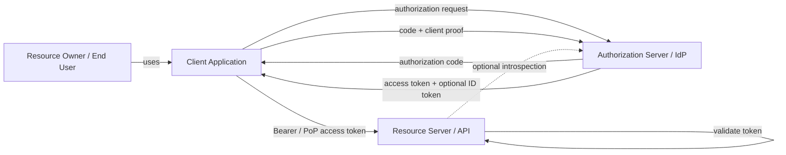
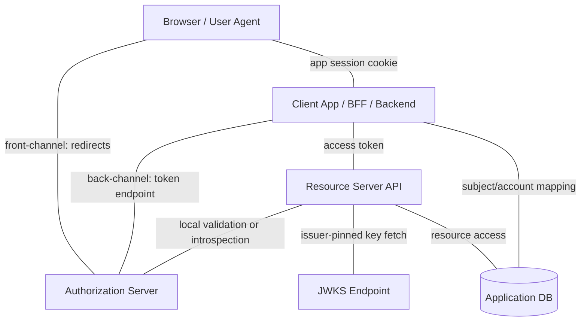
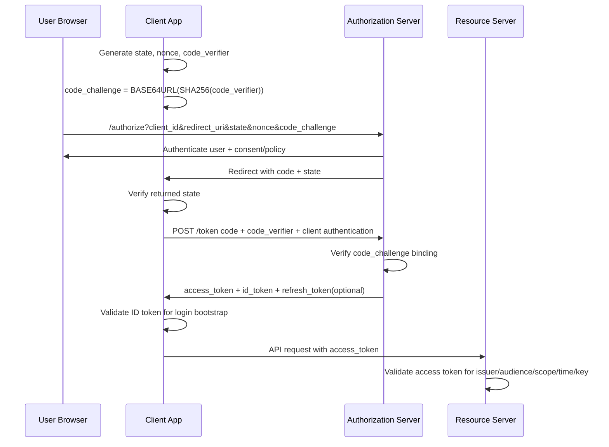
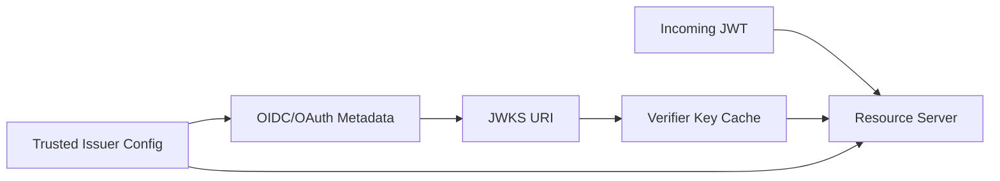
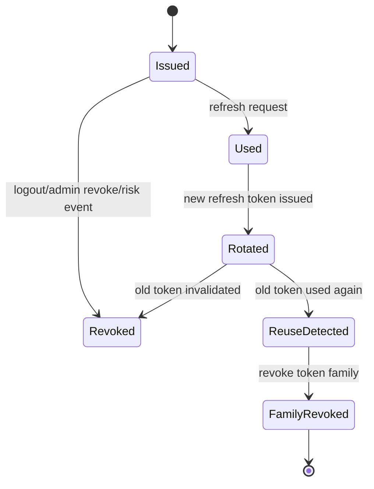
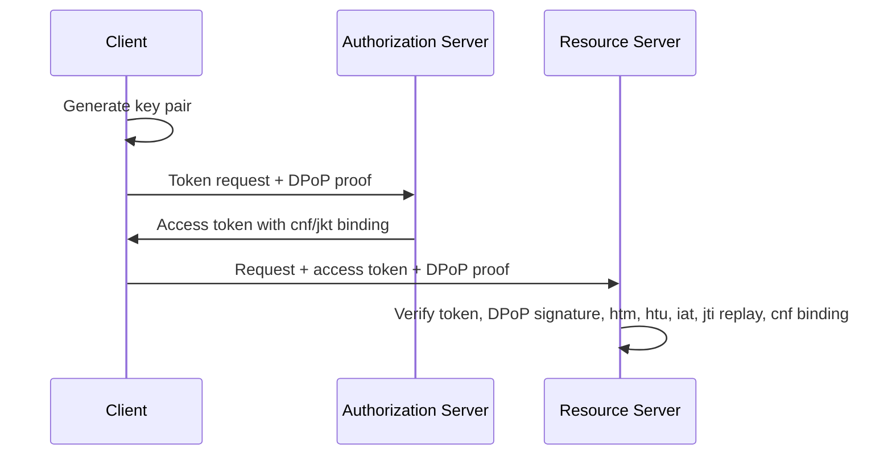
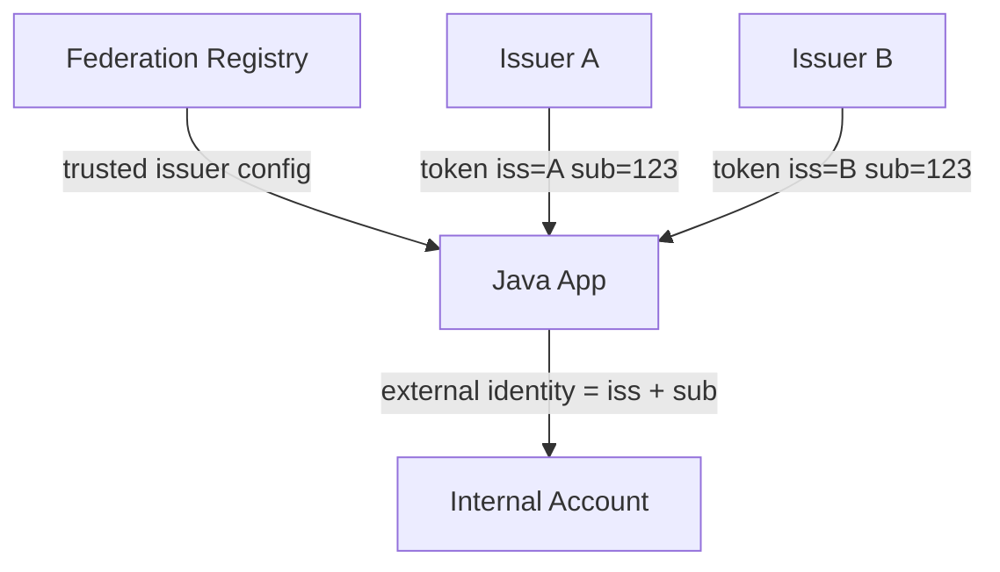

------
title: Learn Java Security, Cryptography and Integrity - Part 017
description: OAuth2, OpenID Connect, token security, JWT validation, JWKS rotation, refresh-token safety, sender-constrained tokens, and federation failure modes for Java systems.
series: learn-java-security-cryptography-integrity
seriesTitle: Learn Java Security, Cryptography and Integrity
order: 17
partTitle: OAuth2, OIDC, Token Security & Federation
tags:
  - java
  - security
  - oauth2
  - oidc
  - jwt
  - federation
  - token-security
  - integrity
date: 2026-06-30
---

# Part 017 — OAuth2, OIDC, Token Security & Federation

> Target: setelah part ini, kamu mampu mendesain dan mereview integrasi OAuth2/OIDC pada aplikasi Java production: memilih flow yang benar, memvalidasi token secara ketat, mengelola JWKS/key rotation, mencegah replay/token substitution/confused deputy, dan membangun federation boundary yang eksplisit.

OAuth2/OIDC sering gagal bukan karena engineer tidak bisa membaca dokumentasi, tetapi karena boundary-nya kabur:

```text
OAuth2 menjawab: apakah client diberi otorisasi untuk mengakses resource atas nama subject atau dirinya sendiri?
OIDC menjawab: apakah client dapat memverifikasi identity subject berdasarkan authentication di authorization server?
```

Keduanya bukan sinonim.

Kesalahan production yang umum:

- memakai OAuth2 seolah-olah itu authentication protocol tanpa OIDC;
- memakai ID token untuk authorize API;
- menerima JWT hanya karena signature valid, tanpa mengecek issuer, audience, subject, token type, expiry, dan claim semantics;
- mendukung flow lama seperti implicit flow untuk use case modern;
- memperlakukan JWKS endpoint sebagai trust anchor dinamis tanpa issuer pinning;
- mempercayai claim dari token yang diterbitkan untuk client/API lain;
- mencampur token dari tenant/issuer berbeda dalam sistem multi-tenant;
- menyimpan access token di browser storage yang mudah dicuri script;
- melakukan account linking berdasarkan email tanpa proof yang cukup.

Referensi utama:

- RFC 9700 — Best Current Practice for OAuth 2.0 Security: <https://datatracker.ietf.org/doc/rfc9700/>
- RFC 6749 — OAuth 2.0 Authorization Framework: <https://datatracker.ietf.org/doc/html/rfc6749>
- RFC 6750 — OAuth 2.0 Bearer Token Usage: <https://datatracker.ietf.org/doc/html/rfc6750>
- RFC 7636 — Proof Key for Code Exchange by OAuth Public Clients: <https://datatracker.ietf.org/doc/html/rfc7636>
- RFC 7519 — JSON Web Token: <https://datatracker.ietf.org/doc/html/rfc7519>
- RFC 8725 — JSON Web Token Best Current Practices: <https://datatracker.ietf.org/doc/html/rfc8725>
- RFC 8414 — OAuth 2.0 Authorization Server Metadata: <https://datatracker.ietf.org/doc/html/rfc8414>
- RFC 8705 — OAuth 2.0 Mutual-TLS Client Authentication and Certificate-Bound Access Tokens: <https://datatracker.ietf.org/doc/html/rfc8705>
- RFC 9126 — OAuth 2.0 Pushed Authorization Requests: <https://datatracker.ietf.org/doc/html/rfc9126>
- RFC 9449 — Demonstrating Proof of Possession: <https://datatracker.ietf.org/doc/html/rfc9449>
- RFC 9068 — JWT Profile for OAuth 2.0 Access Tokens: <https://datatracker.ietf.org/doc/html/rfc9068>
- OpenID Connect Core 1.0: <https://openid.net/specs/openid-connect-core-1_0.html>
- OWASP JSON Web Token for Java Cheat Sheet: <https://cheatsheetseries.owasp.org/cheatsheets/JSON_Web_Token_for_Java_Cheat_Sheet.html>
- OWASP Authentication Cheat Sheet: <https://cheatsheetseries.owasp.org/cheatsheets/Authentication_Cheat_Sheet.html>
- OWASP REST Security Cheat Sheet: <https://cheatsheetseries.owasp.org/cheatsheets/REST_Security_Cheat_Sheet.html>
- Spring Security OAuth2 Resource Server: <https://docs.spring.io/spring-security/reference/servlet/oauth2/resource-server/index.html>

---

## 1. Kaufman Deconstruction: Skill Map

OAuth/OIDC skill bukan “bisa konfigurasi dependency”. Skill-nya terdiri dari kemampuan-kemampuan kecil yang bisa dilatih dan divalidasi.

| Capability | Pertanyaan korektif | Output engineering |
|---|---|---|
| Protocol distinction | Ini OAuth2, OIDC, SAML, session, atau API key? | Terminologi benar. |
| Actor mapping | Siapa resource owner, client, authorization server, resource server? | Trust boundary diagram. |
| Flow selection | Flow apa yang sesuai untuk web app, SPA, mobile, service-to-service? | Flow decision record. |
| Redirect safety | Apakah redirect URI exact match dan state dipakai? | Authorization request validation. |
| Token semantics | Token ini ID token, access token, refresh token, atau authorization code? | Token handling rules. |
| JWT validation | Claim apa yang wajib diverifikasi? | Token verifier. |
| JWKS trust | Dari mana key diambil dan kapan boleh dipercaya? | Issuer-pinned JWKS cache. |
| Scope/claim mapping | Scope/claim mana yang menjadi authority internal? | Authority mapping policy. |
| Replay defense | Apakah token bearer atau sender-constrained? | DPoP/mTLS/short TTL design. |
| Refresh safety | Bagaimana refresh token disimpan, diputar, dicabut? | Refresh token lifecycle. |
| Federation trust | Issuer/tenant mana yang dipercaya? | Federation registry. |
| Failure review | Bagaimana mendeteksi token substitution, mix-up, confused deputy? | Abuse test suite. |

Core invariant:

> Token hanya valid untuk konteks yang secara eksplisit cocok: issuer, audience, subject, client, token type, time window, signing key, algorithm, binding, scope, tenant, dan resource. Satu mismatch harus menghasilkan deny.

---

## 2. Mental Model: OAuth2 vs OIDC

OAuth2 adalah delegated authorization framework. OAuth2 tidak mendefinisikan siapa user secara lengkap; ia mendefinisikan bagaimana client memperoleh token untuk mengakses resource server.

OIDC adalah identity layer di atas OAuth2. OIDC menambahkan ID token, UserInfo endpoint, discovery metadata, dan claim semantics untuk authentication di client.



OAuth vocabulary:

| Term | Makna engineering | Jangan disamakan dengan |
|---|---|---|
| Resource owner | Subject yang memberi delegasi. Biasanya user. | System owner. |
| Client | Aplikasi yang meminta token. | Browser saja. |
| Authorization server | Komponen yang menerbitkan token. | Resource server. |
| Resource server | API yang menerima access token. | Login server. |
| Access token | Bukti akses ke resource/API tertentu. | Identity proof untuk login client. |
| ID token | Bukti authentication subject untuk client tertentu. | API authorization token. |
| Refresh token | Credential untuk mendapatkan access token baru. | Session ID biasa. |
| Authorization code | One-time intermediate credential. | Token untuk API. |

OIDC vocabulary:

| Term | Makna engineering |
|---|---|
| `iss` | Issuer yang menerbitkan token. Harus di-pin ke trusted issuer. |
| `sub` | Stable identifier subject pada issuer tertentu. Jangan global tanpa issuer. |
| `aud` | Audience yang dituju. Client ID untuk ID token; API/resource untuk access token. |
| `azp` | Authorized party, penting ketika audience lebih dari satu. |
| `nonce` | Binding antara auth request dan ID token untuk replay defense. |
| `auth_time` | Kapan user authenticated. Berguna untuk reauthentication. |
| `acr` / `amr` | Context/method authentication, misalnya MFA/passkey class. |

---

## 3. Boundary yang Harus Jelas

OAuth/OIDC punya banyak boundary. Security bug sering muncul saat dua boundary dicampur.



Boundary penting:

| Boundary | Risiko | Guardrail |
|---|---|---|
| Browser → client | XSS, CSRF, token theft | BFF/session cookie, CSP, no access token in localStorage. |
| Browser → authorization server | redirect manipulation, state loss | Exact redirect URI, `state`, PKCE, no open redirect. |
| Client → token endpoint | code interception, client impersonation | PKCE, client authentication, TLS, PAR for high-risk. |
| Client → API | bearer token replay | TLS, short TTL, DPoP/mTLS for high assurance. |
| API → JWKS | key confusion, malicious key URL | Issuer-pinned JWKS URI, cache, alg allowlist. |
| API → authorization policy | scope overtrust | Map external claims to internal policy carefully. |
| Federation → account linking | account takeover | Link by issuer+sub, not email alone. |

---

## 4. Flow Selection

### 4.1 Recommended baseline

Modern baseline untuk interactive login adalah:

```text
Authorization Code Flow + PKCE
```

PKCE awalnya dibuat untuk public clients, tetapi sekarang menjadi baseline luas karena melindungi authorization code dari interception.

### 4.2 Flow decision table

| Use case | Recommended flow | Catatan |
|---|---|---|
| Server-rendered web app | Authorization Code + PKCE + confidential client auth | Token disimpan server-side; browser hanya punya session cookie. |
| SPA murni | Authorization Code + PKCE | Hindari long-lived token di browser. BFF sering lebih aman. |
| Mobile/native app | Authorization Code + PKCE via system browser | Jangan embedded WebView untuk auth. |
| Service-to-service | Client Credentials | Subject adalah client/service, bukan human user. |
| CLI/device-limited | Device Authorization Grant | User verifikasi di browser lain. |
| Legacy first-party password form to token | Avoid Resource Owner Password Credentials | Biasanya anti-pattern; gunakan hosted login/authorization code. |
| Silent browser token renewal | Avoid implicit-style hidden iframe reliance | Browser privacy controls membuatnya rapuh dan sering insecure. |

### 4.3 Authorization Code + PKCE sequence



Security invariants:

- `state` binds response to browser session and mitigates CSRF/mix-up class issues.
- `nonce` binds ID token to authentication request.
- `code_verifier` proves the token request came from the party that initiated the auth request.
- `redirect_uri` must be exact-match, not wildcard-friendly.
- authorization code is one-time use and short-lived.
- access token is validated by resource server for API-specific context.
- ID token is consumed by client, not by arbitrary resource servers.

---

## 5. Token Types and Handling Rules

| Token | Receiver | Storage | Validation | Common misuse |
|---|---|---|---|---|
| Authorization code | Client backend/token endpoint | Transient only | Exchanged once with PKCE/client auth | Treating it as API token. |
| ID token | OIDC client | Server-side or short browser handling depending architecture | OIDC validation: iss, aud, exp, nonce, signature | Sending to API as bearer auth. |
| Access token | Resource server/API | Prefer server-side/BFF; if browser, short-lived and carefully isolated | API validation: iss, aud, exp, scope, token type, signature/introspection | Accepting token for wrong audience. |
| Refresh token | Client/token endpoint | Secure server-side or OS secure storage | Rotation/reuse detection/revocation | Storing long-lived refresh token in browser localStorage. |
| Session cookie | Client app | Browser cookie | Server-side session validation | Confusing with OAuth token. |

Rule of thumb:

```text
ID token proves login to the client.
Access token authorizes calls to the resource server.
Refresh token is a high-value credential.
Authorization code is a temporary proof in the flow.
```

---

## 6. JWT Validation: What “Signature Valid” Does Not Prove

Signature validity only proves that the JWT bytes were signed by a key corresponding to some verification key. It does not prove the token is meant for your API, current, accepted for this action, or issued by a trusted authority.

Minimum validation set for JWT access tokens:

| Validation | Why it matters |
|---|---|
| Parse safely | Reject malformed, huge, nested, unsupported tokens. |
| Algorithm allowlist | Prevent algorithm confusion and `none` acceptance. |
| Key selection from trusted issuer | Prevent attacker-controlled `jku`, `x5u`, `kid` confusion. |
| Signature verification | Ensure token integrity. |
| `iss` exact match | Prevent accepting tokens from untrusted issuer. |
| `aud` contains this API/resource | Prevent confused deputy and token substitution. |
| `exp` not expired | Prevent long-lived replay. |
| `nbf` not in future | Prevent early-use bugs. |
| `iat` reasonable | Detect old or suspiciously future tokens. |
| token type / `typ` / profile | Avoid accepting ID token as access token. |
| `sub` present where needed | Identify subject. |
| `client_id` / `azp` where applicable | Bind delegation to expected client class. |
| scope/claim mapping | Enforce least privilege. |
| tenant claim consistency | Prevent cross-tenant token reuse. |
| PoP binding if used | Verify DPoP/mTLS confirmation claim. |

### 6.1 Access token validation pseudocode

```java
public final class AccessTokenPolicy {
    private final URI expectedIssuer;
    private final String expectedAudience;
    private final Set<String> allowedAlgorithms;
    private final Duration maxClockSkew;

    public AccessTokenClaims validate(Jwt jwt) {
        requireAllowedAlgorithm(jwt.header().algorithm());
        requireIssuer(jwt.claim("iss"), expectedIssuer);
        requireAudience(jwt.claimAsList("aud"), expectedAudience);
        requireNotExpired(jwt.instantClaim("exp"), maxClockSkew);
        requireNotBefore(jwt.optionalInstantClaim("nbf"), maxClockSkew);
        requireTokenUse(jwt); // e.g. access-token profile, not ID token
        requireTenantConsistency(jwt);
        requireSubjectOrClientIdentity(jwt);
        return mapToInternalClaims(jwt);
    }
}
```

The important part is not the class shape. The important part is the invariant:

```text
A token that is valid for someone else, somewhere else, or some other action must be rejected.
```

### 6.2 ID token validation checklist

For OIDC login, the client validates ID token differently from API access-token validation.

| Claim/check | Meaning |
|---|---|
| `iss` | Must match configured OIDC issuer. |
| `aud` | Must contain client ID. |
| `azp` | Required/important when multiple audiences exist; must match client. |
| `exp` | Must be current. |
| `iat` | Must be reasonable. |
| `nonce` | Must match nonce stored for auth request. |
| signature | Must verify under issuer key. |
| `auth_time` | Required when max age/reauth was requested. |
| `acr`/`amr` | Useful for MFA/passkey-sensitive flows. |
| `sub` | Stable subject identifier within issuer. |

Never use email as the primary account key unless the issuer contract and verification state justify it. Prefer:

```text
external_identity_key = issuer + subject
```

Email can change, be recycled, be unverified, or collide across issuers.

---

## 7. JWKS, Key Rotation, and Key Confusion

JWKS solves key distribution, not trust by itself.



Secure JWKS rules:

| Rule | Reason |
|---|---|
| Pin issuer configuration | Token header must not decide who is trusted. |
| Pin JWKS URI via issuer metadata/config | Do not follow attacker-controlled `jku`/`x5u`. |
| Allowlist algorithms | Prevent `alg` confusion. |
| Cache with expiry | Avoid network call per request and survive transient outage. |
| Refresh on unknown `kid` carefully | Support rotation without opening DoS. |
| Reject duplicate/ambiguous `kid` | Prevent wrong-key selection. |
| Keep old keys during overlap | Avoid breaking tokens issued before rotation. |
| Monitor key-set drift | Unexpected key changes may indicate issuer compromise/misconfig. |

Dangerous anti-pattern:

```java
// Anti-pattern: token header decides key source.
String jku = jwt.getHeader().get("jku");
JWKSet keys = JWKSet.load(new URL(jku));
```

Safer pattern:

```java
// Trust is configured out-of-band.
IssuerConfig issuer = issuerRegistry.requireTrusted(jwt.claim("iss"));
JwkSource jwks = jwksCache.forIssuer(issuer.id(), issuer.jwksUri());
VerificationKey key = jwks.select(jwt.header().kid(), jwt.header().alg());
```

---

## 8. Java/Spring Resource Server Pattern

In many Java stacks, Spring Security is the practical enforcement library. Do not treat framework defaults as substitute for policy clarity.

### 8.1 Minimal resource server configuration

```java
@Configuration
@EnableWebSecurity
class ApiSecurityConfig {

    @Bean
    SecurityFilterChain security(HttpSecurity http) throws Exception {
        return http
            .authorizeHttpRequests(auth -> auth
                .requestMatchers("/actuator/health").permitAll()
                .requestMatchers("/api/cases/**").hasAuthority("SCOPE_cases.read")
                .anyRequest().authenticated()
            )
            .oauth2ResourceServer(oauth2 -> oauth2.jwt(Customizer.withDefaults()))
            .build();
    }
}
```

This is only the outer shell. Production systems usually need explicit claim validation.

### 8.2 Issuer and audience validation

```java
@Bean
JwtDecoder jwtDecoder() {
    NimbusJwtDecoder decoder = JwtDecoders.fromIssuerLocation("https://idp.example.com/realms/regulatory");

    OAuth2TokenValidator<Jwt> issuer = JwtValidators.createDefaultWithIssuer(
        "https://idp.example.com/realms/regulatory"
    );

    OAuth2TokenValidator<Jwt> audience = jwt -> {
        List<String> aud = jwt.getAudience();
        if (aud.contains("regulatory-case-api")) {
            return OAuth2TokenValidatorResult.success();
        }
        OAuth2Error error = new OAuth2Error(
            "invalid_token",
            "Token audience does not include regulatory-case-api",
            null
        );
        return OAuth2TokenValidatorResult.failure(error);
    };

    decoder.setJwtValidator(new DelegatingOAuth2TokenValidator<>(issuer, audience));
    return decoder;
}
```

### 8.3 Claim-to-authority mapping

External scopes are not your domain authorization model. They are inputs.

```java
@Bean
JwtAuthenticationConverter jwtAuthenticationConverter() {
    JwtGrantedAuthoritiesConverter scopes = new JwtGrantedAuthoritiesConverter();
    scopes.setAuthorityPrefix("SCOPE_");
    scopes.setAuthoritiesClaimName("scope");

    JwtAuthenticationConverter converter = new JwtAuthenticationConverter();
    converter.setJwtGrantedAuthoritiesConverter(jwt -> {
        Collection<GrantedAuthority> external = scopes.convert(jwt);
        List<GrantedAuthority> mapped = new ArrayList<>(external);

        String tenant = jwt.getClaimAsString("tenant_id");
        if (tenant == null || tenant.isBlank()) {
            return List.of();
        }

        mapped.add(new SimpleGrantedAuthority("TENANT_" + tenant));
        return mapped;
    });
    return converter;
}
```

Review question:

```text
Apakah claim eksternal ini authority final, atau hanya evidence untuk policy decision internal?
```

For critical business authorization, do not stop at endpoint-level scope. Perform object-level authorization in the domain/service layer.

---

## 9. Access Token: Opaque vs JWT

| Token style | Pros | Cons | Good fit |
|---|---|---|---|
| Opaque token + introspection | Easy revocation, central policy, smaller leak surface | Runtime dependency on authorization server/introspection | High-control environments, internal APIs. |
| JWT self-contained | Low latency, decentralized validation | Revocation harder, claim staleness, key rotation complexity | High-scale APIs with short-lived tokens. |
| Reference token with gateway exchange | API sees internal token only | More infrastructure complexity | Large platforms with API gateway and policy tier. |

JWT does not remove the need for server-side authorization. JWT only packages claims. Claims are not decisions.

Decision rule:

```text
Choose JWT when local validation and scale matter more than instant revocation.
Choose opaque/reference tokens when central control and revocation matter more.
```

---

## 10. Refresh Token Lifecycle

Refresh tokens are high-value credentials. Treat them like long-lived secrets.

Secure lifecycle:



Invariants:

- refresh tokens must be bound to client and subject;
- store only server-side or in platform secure storage for native apps;
- browser-based SPAs should avoid long-lived refresh tokens unless strict rotation and sender constraints are in place;
- rotation should detect reuse;
- reuse of an already-rotated token indicates theft or race and should revoke the token family;
- refresh-token grant should apply risk checks and may require reauthentication;
- logout/revocation must invalidate server-side refresh state.

Refresh-token table model:

```sql
CREATE TABLE oauth_refresh_token_family (
    family_id UUID PRIMARY KEY,
    subject_key TEXT NOT NULL,
    client_id TEXT NOT NULL,
    tenant_id TEXT NOT NULL,
    status TEXT NOT NULL,
    created_at TIMESTAMP NOT NULL,
    revoked_at TIMESTAMP NULL,
    revoke_reason TEXT NULL
);

CREATE TABLE oauth_refresh_token_instance (
    token_hash BYTEA PRIMARY KEY,
    family_id UUID NOT NULL,
    sequence_no BIGINT NOT NULL,
    status TEXT NOT NULL,
    issued_at TIMESTAMP NOT NULL,
    used_at TIMESTAMP NULL,
    expires_at TIMESTAMP NOT NULL,
    FOREIGN KEY (family_id) REFERENCES oauth_refresh_token_family(family_id)
);
```

Store hashes of refresh tokens, not raw values.

---

## 11. Sender-Constrained Tokens: mTLS and DPoP

Bearer tokens are usable by whoever holds them. Sender-constrained tokens add proof that the caller controls a key.

| Mechanism | Binding | Good fit | Trade-off |
|---|---|---|---|
| mTLS-bound access token | Token contains confirmation bound to client certificate | Backend/service-to-service, regulated environments | Certificate lifecycle complexity. |
| DPoP | Token bound to public key; each request carries proof JWT | Public clients, APIs needing replay reduction | Clock/replay cache/key handling complexity. |
| Plain bearer | Possession of token only | Lower-risk, short-lived, TLS-only APIs | Stolen token can be replayed until expiry/revocation. |

mTLS and DPoP do not replace authorization. They reduce replay impact.

DPoP mental model:



Resource server must verify:

- DPoP proof signature;
- proof `htm` equals HTTP method;
- proof `htu` equals target URI normalization policy;
- proof `iat` within narrow clock window;
- proof `jti` not replayed;
- access token confirmation claim matches DPoP key.

---

## 12. Federation and Multi-Issuer Trust

Federation is not “accept tokens from many IdPs”. Federation is a trust registry with explicit rules.



Federation rules:

| Rule | Why |
|---|---|
| Trust issuers by explicit config | Prevent arbitrary issuer acceptance. |
| Use issuer + subject as external identity key | `sub` is only unique within issuer. |
| Do not auto-link by email alone | Email may be unverified, changed, or controlled elsewhere. |
| Require verified email claim when email is used | Avoid account takeover via unverified claim. |
| Separate tenant resolution from user-provided domain | Prevent domain spoofing. |
| Pin allowed client IDs per issuer | Prevent token for other application being accepted. |
| Record policy version used for linking | Audit identity binding. |

Account linking example:

```java
public ExternalIdentityKey externalKey(Jwt idToken) {
    URI issuer = URI.create(idToken.getIssuer().toString());
    String subject = idToken.getSubject();
    if (!trustedIssuers.contains(issuer)) {
        throw new AccessDeniedException("untrusted issuer");
    }
    return new ExternalIdentityKey(issuer, subject);
}
```

Anti-pattern:

```java
// Anti-pattern: creates takeover risk when email is not a stable, verified binding.
accountRepository.findByEmail(idToken.getClaimAsString("email"));
```

Safer linking ceremony:

1. User authenticates with existing account.
2. User authenticates with external issuer.
3. App validates issuer, subject, email verification state, nonce, and risk signals.
4. App links `(issuer, subject)` to internal account.
5. App records audit event with issuer, subject hash, policy version, actor, IP/device, and timestamp.

---

## 13. Common Vulnerability Patterns

### 13.1 Token substitution

Attacker obtains a valid token for API A and sends it to API B. API B validates signature but not audience.

Guardrail:

```text
Every resource server validates audience/resource indicator.
```

### 13.2 ID token accepted as access token

API accepts an ID token because signature and issuer are valid.

Guardrail:

```text
Resource server validates token type/profile/audience and refuses ID token semantics.
```

### 13.3 Algorithm confusion

Verifier accepts algorithm from token header and uses inappropriate verification path.

Guardrail:

```text
Allowed algorithms are configured per issuer/client/resource, not selected freely by token.
```

### 13.4 JWKS injection

Verifier follows `jku` from token header to attacker-controlled JWKS.

Guardrail:

```text
JWKS URI is issuer-pinned; token header never controls trust anchor.
```

### 13.5 Redirect URI abuse

Client registration allows wildcard redirect or open redirect in app.

Guardrail:

```text
Exact redirect URI matching + no open redirect endpoints in redirect path.
```

### 13.6 Authorization code interception

Authorization code is stolen from redirect path/log/proxy.

Guardrail:

```text
PKCE + one-time code + short expiration + TLS + no code logging.
```

### 13.7 Refresh-token replay

Stolen refresh token is reused after legitimate rotation.

Guardrail:

```text
Refresh token rotation + reuse detection + family revocation.
```

### 13.8 Scope overtrust

API maps `admin` scope directly to internal superadmin.

Guardrail:

```text
External claim is evidence; internal policy still checks tenant, object, action, and role assignment.
```

### 13.9 Multi-tenant issuer confusion

API accepts token from tenant A for tenant B because path tenant is not checked against token tenant.

Guardrail:

```text
tenant_id in path/resource/object must match token-authorized tenant context.
```

### 13.10 Logging token leakage

Reverse proxy/application logs `Authorization` header or callback query string.

Guardrail:

```text
Redact Authorization, cookies, code, state, id_token, access_token, refresh_token, and DPoP proofs.
```

---

## 14. API Gateway vs Service-Level Validation

Gateway validation helps, but it is not enough by itself.

| Layer | What it can do | What it cannot fully do |
|---|---|---|
| API gateway | TLS termination, token presence, issuer/audience validation, rate limiting | Object-level domain authorization, deep tenant invariants. |
| Service filter | Request authentication, claim extraction, endpoint scope | Business object permission. |
| Domain service | Action/object authorization | Global network enforcement. |
| Repository/query layer | Tenant/data scoping | User-intent semantics alone. |

Recommended model:

```text
Gateway validates coarse token integrity.
Service validates token context and maps principal.
Domain layer enforces action/object authorization.
Repository layer enforces data boundary.
```

This prevents “validated at the edge, bypassed internally” failure.

---

## 15. Token Lifetime and Revocation Strategy

| Token | Typical lifetime design | Revocation strategy |
|---|---|---|
| Authorization code | Seconds/minutes, one-time | Mark used; reject replay. |
| Access token | Short-lived | Let expire; introspection/denylist for critical cases. |
| Refresh token | Longer-lived but rotated | Revoke token family. |
| ID token | Short-lived | Reauthenticate or rely on session lifecycle. |
| Session cookie | App-dependent | Server-side invalidation. |

Do not solve revocation by making every JWT very long-lived and adding a global blacklist unless you understand the scaling and consistency cost. Prefer short access-token lifetime and refresh-token rotation.

Risk events that should revoke or reduce token validity:

- password/passkey/MFA change;
- recovery event;
- suspicious refresh-token reuse;
- admin role grant/revoke;
- tenant membership change;
- device lost;
- issuer key compromise;
- user disabled;
- client secret compromise.

---

## 16. Authorization Server Integration Decision Record

Use this template whenever adding an IdP/client/API integration.

```md
# OAuth/OIDC Integration Decision Record

## Context
- System:
- Client type:
- Resource server/API:
- Issuer:
- Tenant model:

## Protocol Choice
- Flow:
- Why this flow:
- Alternatives rejected:

## Trust Configuration
- Issuer URI:
- JWKS URI source:
- Allowed algorithms:
- Expected audience:
- Expected client ID / authorized party:

## Token Rules
- Access token format:
- ID token usage:
- Refresh token policy:
- Token storage location:
- Token lifetime:
- Revocation strategy:

## Claims Mapping
- Subject key:
- Tenant key:
- Scope mapping:
- Roles/groups mapping:
- Claims explicitly ignored:

## Replay and Theft Defense
- PKCE:
- State:
- Nonce:
- Sender-constrained token:
- DPoP/mTLS:
- Token redaction:

## Federation and Account Linking
- External identity key:
- Email usage:
- Linking ceremony:
- Deprovisioning behavior:

## Verification
- Unit tests:
- Integration tests:
- Abuse tests:
- Monitoring:

## Approval
- Security reviewer:
- Engineering owner:
- Expiry/review date:
```

---

## 17. Abuse Tests

A mature implementation has tests for invalid-but-plausible tokens.

| Test | Expected result |
|---|---|
| Valid signature, wrong `aud` | Reject. |
| Valid signature, wrong `iss` | Reject. |
| Expired token | Reject. |
| Future `nbf` | Reject. |
| `alg=none` | Reject. |
| Token signed with unexpected alg | Reject. |
| Unknown `kid` with attacker `jku` | Reject; do not fetch attacker URL. |
| ID token sent to API | Reject. |
| Access token without required scope | Reject. |
| Token from tenant A used on tenant B resource | Reject. |
| Reused authorization code | Reject. |
| Reused rotated refresh token | Revoke family. |
| Missing/incorrect OIDC nonce | Reject login. |
| DPoP proof replay | Reject. |

Example test shape:

```java
@Test
void rejectsTokenWithWrongAudience() {
    String jwt = tokenFactory.validToken(builder -> builder
        .issuer("https://idp.example.com/realms/regulatory")
        .audience("some-other-api")
        .scope("cases.read")
    );

    assertThatThrownBy(() -> verifier.verify(jwt))
        .isInstanceOf(InvalidTokenException.class)
        .hasMessageContaining("audience");
}
```

---

## 18. Production Observability

Security-relevant OAuth/OIDC events:

| Event | Fields |
|---|---|
| login_started | client_id, issuer, redirect_uri hash, state_id hash, user_agent risk. |
| login_completed | issuer, subject hash, auth_time, acr/amr, client_id. |
| token_validation_failed | reason, issuer, audience, kid, alg, endpoint, correlation_id. |
| jwks_refresh_failed | issuer, jwks_uri, status, cache_age. |
| unknown_kid_seen | issuer, kid, alg, rate. |
| refresh_token_rotated | subject hash, client_id, family_id, sequence. |
| refresh_token_reuse_detected | family_id, client_id, subject hash, IP/device risk. |
| account_linked | internal account, issuer, subject hash, policy_version. |
| high_risk_claim_mapping | claim name, source issuer, decision. |

Never log raw tokens, authorization codes, refresh tokens, DPoP proofs, or cookies.

---

## 19. Lab: Build a Misuse-Resistant Token Verifier

### Goal

Build a small Java verifier facade around your JWT library. The facade must make insecure validation hard.

### Requirements

- issuer registry is configured out-of-band;
- JWKS URI comes from trusted issuer metadata/config, not token header;
- allowed algorithms configured per issuer;
- audience required;
- expiry and not-before checked;
- token type/profile checked;
- tenant consistency checked;
- scope mapping separated from domain authorization;
- tests include wrong audience, wrong issuer, alg confusion, unknown kid, expired token, and ID-token-as-access-token.

### Suggested API

```java
public interface AccessTokenVerifier {
    VerifiedPrincipal verify(String rawToken, ResourceContext resourceContext);
}

public record ResourceContext(
    String expectedAudience,
    String tenantFromRoute,
    String endpointId
) {}

public record VerifiedPrincipal(
    URI issuer,
    String subject,
    String clientId,
    String tenantId,
    Set<String> scopes,
    Instant authenticatedAt
) {}
```

The verifier should return a normalized principal. It should not leak raw JWT objects throughout the domain model.

---

## 20. Final Checklist

### Flow

- [ ] Authorization Code + PKCE used for interactive clients.
- [ ] Implicit flow avoided for new systems.
- [ ] ROPC avoided unless explicitly justified for legacy migration.
- [ ] Exact redirect URI matching enforced.
- [ ] `state` used and validated.
- [ ] OIDC `nonce` used and validated for login.
- [ ] Authorization code is one-time and short-lived.

### Token validation

- [ ] Issuer exact match.
- [ ] Audience exact/expected.
- [ ] Expiry and not-before checked.
- [ ] Algorithm allowlist.
- [ ] Signature validation against issuer-pinned key source.
- [ ] JWKS URI is not taken from token header.
- [ ] Token type/profile checked.
- [ ] ID token not accepted by API.
- [ ] Tenant claim/path/resource consistency checked.
- [ ] External claims mapped explicitly.

### Refresh/session

- [ ] Refresh tokens stored securely.
- [ ] Refresh-token rotation enabled.
- [ ] Reuse detection revokes token family.
- [ ] Logout/revocation semantics defined.
- [ ] Sensitive token material redacted from logs/traces.

### Federation

- [ ] Trusted issuers configured explicitly.
- [ ] Account key uses issuer + subject.
- [ ] Email is not used as sole linking proof.
- [ ] Tenant/issuer/client mappings reviewed.
- [ ] Deprovisioning behavior defined.

### Review stance

- [ ] A valid token for another API is rejected.
- [ ] A valid token from another issuer is rejected.
- [ ] A valid token from another tenant is rejected.
- [ ] A valid ID token is rejected by resource server.
- [ ] A valid token without object permission is rejected by domain authorization.

---

## 21. What You Should Be Able to Explain

After this part, you should be able to explain:

1. Why OAuth2 is not automatically authentication.
2. Why OIDC ID token must not be used as API access token.
3. Why signature-valid JWT can still be invalid.
4. Why issuer + subject is safer than email for account linking.
5. Why audience validation prevents confused deputy.
6. Why PKCE matters even when TLS exists.
7. Why JWKS is key distribution, not dynamic trust.
8. Why gateway token validation does not replace object-level authorization.
9. Why refresh token rotation needs reuse detection.
10. Why external scopes are policy inputs, not necessarily final domain permissions.

---

## 22. Bridge to Part 018

OAuth/OIDC tells the system who the caller is and what delegated claims/scopes arrived with the request. It does not answer the full domain question:

```text
Can this subject perform this action on this object in this tenant and business state right now?
```

That is authorization. Part 018 builds the authorization model: RBAC, ABAC, ReBAC, policy engines, object-level checks, tenant boundaries, data filtering, decision auditing, and policy testing.
