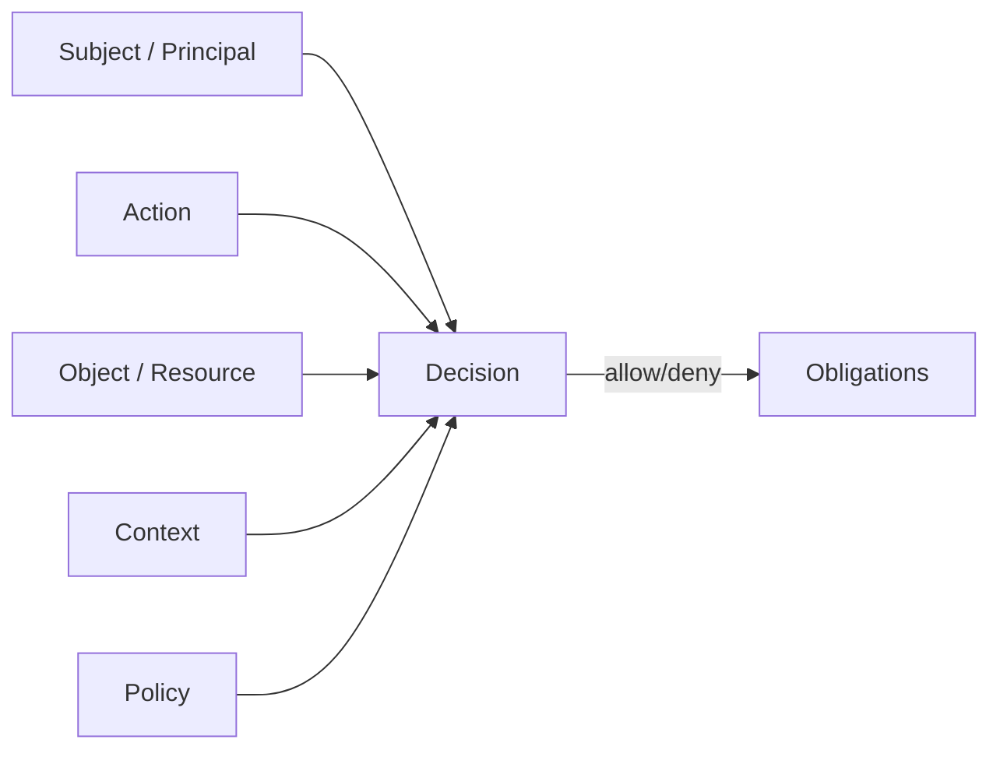
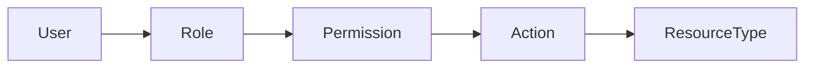
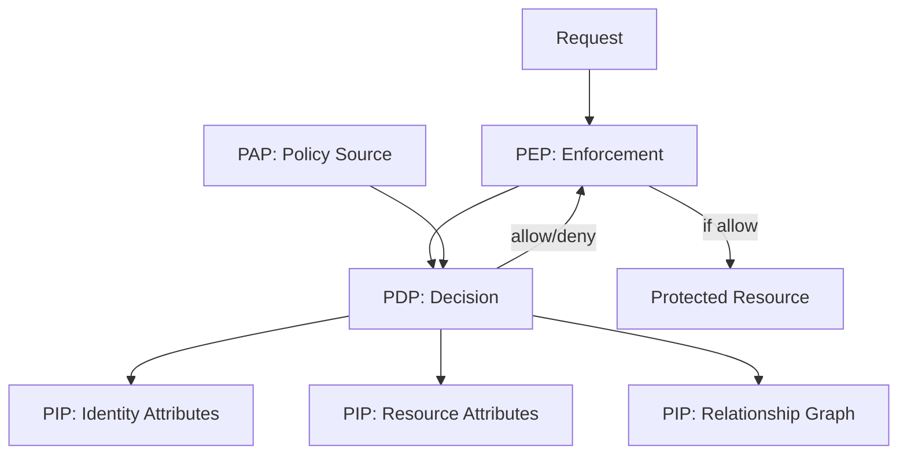
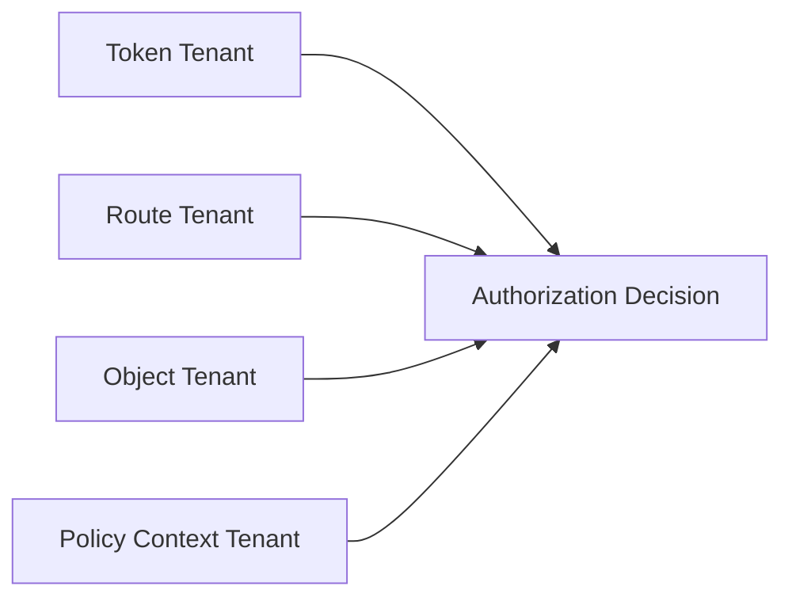
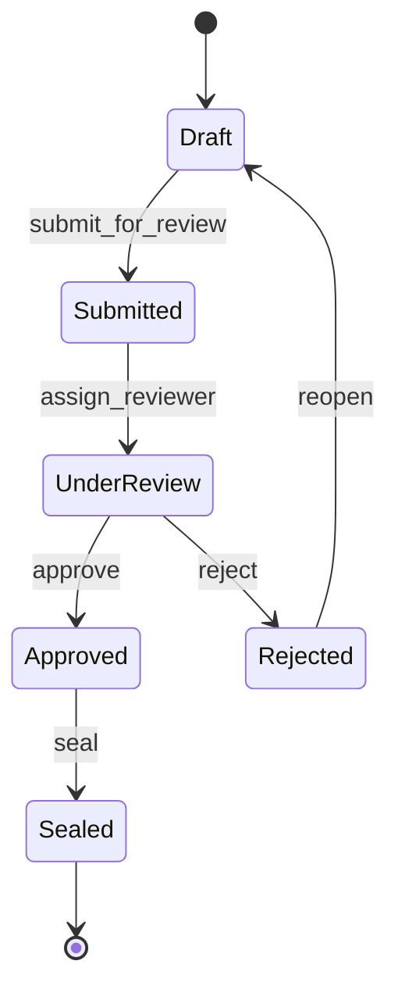

------
title: Learn Java Security, Cryptography and Integrity - Part 018
description: Authorization engineering for Java systems: RBAC, ABAC, ReBAC, policy engines, object-level authorization, tenant boundaries, enforcement layers, decision auditing, and test strategy.
series: learn-java-security-cryptography-integrity
seriesTitle: Learn Java Security, Cryptography and Integrity
order: 18
partTitle: Authorization: RBAC, ABAC, ReBAC & Policy Engines
tags:
  - java
  - security
  - authorization
  - access-control
  - rbac
  - abac
  - rebac
  - policy-engine
  - integrity
date: 2026-06-30
---

# Part 018 — Authorization: RBAC, ABAC, ReBAC & Policy Engines

> Target: setelah part ini, kamu mampu mendesain authorization subsystem untuk aplikasi Java enterprise: role/permission model, ABAC/ReBAC, object-level authorization, tenant isolation, policy decision/enforcement points, policy caching, decision audit, dan test matrix yang menangkap Broken Object Level Authorization.

Authentication menjawab:

```text
Siapa caller ini dan bukti apa yang sudah diverifikasi?
```

Authorization menjawab:

```text
Apakah subject ini boleh melakukan action ini terhadap object ini dalam context ini sekarang?
```

Pertanyaan kedua lebih sulit karena ia bergantung pada domain, state, tenant, ownership, delegation, relationship, workflow, risk, dan waktu.

Referensi utama:

- OWASP Authorization Cheat Sheet: <https://cheatsheetseries.owasp.org/cheatsheets/Authorization_Cheat_Sheet.html>
- OWASP API Security Top 10 2023 — API1 Broken Object Level Authorization: <https://owasp.org/API-Security/editions/2023/en/0xa1-broken-object-level-authorization/>
- OWASP ASVS: <https://owasp.org/www-project-application-security-verification-standard/>
- NIST SP 800-162 — Guide to Attribute Based Access Control: <https://csrc.nist.gov/pubs/sp/800/162/upd2/final>
- NIST SP 800-53 Rev. 5 Access Control family: <https://csrc.nist.gov/pubs/sp/800/53/r5/upd1/final>
- Spring Security Authorization: <https://docs.spring.io/spring-security/reference/servlet/authorization/index.html>
- Open Policy Agent: <https://www.openpolicyagent.org/docs/latest/>
- Cedar Policy Language: <https://docs.cedarpolicy.com/>

---

## 1. Kaufman Deconstruction: Authorization Skill Map

| Capability | Pertanyaan korektif | Output engineering |
|---|---|---|
| Subject modeling | Siapa actor: user, service, admin, delegate, system job? | Principal model. |
| Object/resource modeling | Apa resource yang dilindungi: case, document, tenant, event, report? | Resource taxonomy. |
| Action modeling | Apa action yang berarti secara domain? | Permission/action catalog. |
| Context modeling | Atribut apa yang memengaruhi decision: tenant, state, time, risk, channel? | Context schema. |
| Policy expression | Rule ditulis di kode, annotation, DB, OPA, Cedar, atau service? | Policy architecture. |
| Enforcement placement | Di layer mana check dilakukan? | PEP map. |
| Object-level check | Apakah setiap object ID dicek terhadap subject? | BOLA defense. |
| Data filtering | Apakah query hanya mengambil data yang boleh dilihat? | Scoped repository pattern. |
| Tenant isolation | Apakah tenant dari token/path/object konsisten? | Tenant invariant. |
| Delegation | Bagaimana kuasa/mandat/relation direpresentasikan? | Delegation model. |
| Decision audit | Bisakah keputusan allow/deny dijelaskan? | Authorization event model. |
| Test matrix | Apakah deny cases diuji? | Policy regression suite. |

Core invariant:

> Authorization decision harus mengevaluasi subject, action, object, dan context pada boundary server-side yang tidak bisa dilewati client. Endpoint-level role check saja tidak cukup.

---

## 2. Authorization Mental Model

Authorization decision adalah fungsi:

```text
Decision = f(subject, action, object, context, policy)
```

Dengan output:

```text
ALLOW | DENY | ALLOW_WITH_OBLIGATIONS | NOT_APPLICABLE | INDETERMINATE
```

Untuk aplikasi bisnis, `DENY` harus menjadi default.



Contoh:

```text
Subject: user:123, tenant:bank-a, roles:[case-officer]
Action: case.approve_enforcement_action
Object: case:987, tenant:bank-a, state:UNDER_REVIEW, assigned_officer:user:123, amount:high
Context: channel:web, mfa_age:5m, office_hours:true, risk:normal
Policy: case approval rules v14
Decision: ALLOW_WITH_OBLIGATION(record approval reason)
```

---

## 3. RBAC, ABAC, ReBAC, PBAC

### 3.1 RBAC — Role-Based Access Control

RBAC maps subject to roles and roles to permissions.



Good for:

- coarse business responsibilities;
- admin console roles;
- stable organization roles;
- simple permission catalog.

Failure modes:

- role explosion;
- overly broad roles;
- “admin” bypass without object checks;
- stale role assignments;
- cross-tenant leakage;
- no state/context awareness.

Example RBAC catalog:

| Role | Permissions |
|---|---|
| `case_viewer` | `case.read`, `document.read_metadata` |
| `case_officer` | `case.read`, `case.update_notes`, `case.submit_review` |
| `case_supervisor` | `case.assign`, `case.approve`, `case.reopen` |
| `evidence_manager` | `evidence.upload`, `evidence.verify_hash`, `evidence.seal` |
| `security_admin` | `user.disable`, `role.assign`, `session.revoke` |

RBAC invariant:

```text
Role grants action vocabulary, not object ownership by itself.
```

### 3.2 ABAC — Attribute-Based Access Control

ABAC evaluates attributes of subject, object, action, and environment.

```text
allow if
  subject.tenant_id == object.tenant_id
  and subject.department == object.owner_department
  and action in subject.allowed_actions
  and object.state != SEALED
  and context.mfa_age < 15 minutes
```

Good for:

- multi-tenant systems;
- stateful workflows;
- risk-based access;
- fine-grained conditions;
- regulatory constraints.

Failure modes:

- attribute provenance unclear;
- stale attributes;
- inconsistent attribute names;
- policy too complex to review;
- expensive runtime evaluation;
- missing deny test cases.

ABAC invariant:

```text
Attributes used for decisions must be trusted, fresh enough, and traceable.
```

### 3.3 ReBAC — Relationship-Based Access Control

ReBAC evaluates graph relationships.

```text
allow user U to read document D if
  U is assigned officer of case C
  and D belongs to case C
  and C tenant equals U tenant
```

Good for:

- collaboration;
- ownership/delegation;
- document/case relationships;
- nested organizations;
- sharing models.

Failure modes:

- graph cycles;
- stale relationships;
- expensive traversal;
- accidental inheritance;
- revocation delay;
- hidden transitive access.

ReBAC invariant:

```text
Relationship traversal must have explicit depth, direction, resource type, and revocation semantics.
```

### 3.4 PBAC — Policy-Based Access Control

PBAC is an architecture style where policy is explicit and managed separately from enforcement code. RBAC/ABAC/ReBAC can all be expressed as policy.

Good for:

- centralized governance;
- cross-service consistency;
- auditability;
- policy review lifecycle;
- externalized decision engines.

Failure modes:

- policy engine becomes availability dependency;
- policy/data drift;
- unclear ownership;
- weak local fallbacks;
- developers bypass engine for “temporary” logic.

---

## 4. PDP, PEP, PIP, PAP

Authorization architecture often uses these concepts:

| Component | Meaning | Example |
|---|---|---|
| PEP — Policy Enforcement Point | Where request is intercepted/enforced | Spring filter, method interceptor, domain service guard, repository query. |
| PDP — Policy Decision Point | Where allow/deny is computed | In-process policy evaluator, OPA, Cedar engine, custom authz service. |
| PIP — Policy Information Point | Source of attributes/relationships | User directory, case DB, tenant service, risk engine. |
| PAP — Policy Administration Point | Where policy is authored/managed | Git repo, admin UI, policy registry. |



Important distinction:

```text
PDP decides. PEP enforces. A decision that is not enforced is documentation, not security.
```

---

## 5. Enforcement Layer Map

Authorization should not live in only one layer.

| Layer | What to enforce | Why |
|---|---|---|
| API gateway | token presence, coarse audience/scope, rate limit | Edge protection. |
| Web/controller | route-level access, request shape, tenant path consistency | Early rejection. |
| Application service | action-level domain permission | Business invariant. |
| Domain aggregate | state-transition permission | Prevent invalid transition. |
| Repository/query | tenant/object data filtering | Prevent data leak by query. |
| Database | optional row-level guard, constraints | Defense in depth. |
| Event consumer | async command authorization | Prevent bypass via messaging. |
| Batch/admin job | service principal permission | Prevent privileged automation abuse. |
| Export/reporting | aggregate data authorization | Prevent indirect leakage. |

Bad model:

```text
Controller has @PreAuthorize("hasRole('ADMIN')") so the system is secure.
```

Better model:

```text
Controller checks route-level access.
Application service checks subject-action-object-context.
Repository scopes query by tenant/object visibility.
Domain object validates state transition invariant.
Audit records decision.
```

---

## 6. Object-Level Authorization and BOLA

Broken Object Level Authorization occurs when an API accepts an object ID and fails to check whether the caller can access that object.

Vulnerable pattern:

```java
@GetMapping("/api/cases/{caseId}")
CaseDto getCase(@PathVariable UUID caseId) {
    CaseEntity entity = caseRepository.findById(caseId)
        .orElseThrow(NotFoundException::new);
    return mapper.toDto(entity);
}
```

The endpoint is authenticated, maybe even role-protected, but any authenticated user can enumerate IDs.

Safer pattern:

```java
@GetMapping("/api/cases/{caseId}")
CaseDto getCase(@AuthenticationPrincipal Principal principal,
                @PathVariable UUID caseId) {
    CaseEntity entity = caseRepository.findVisibleCase(principal.subjectId(), principal.tenantId(), caseId)
        .orElseThrow(NotFoundException::new);

    authorization.require(principal, Action.CASE_READ, entity, RequestContext.current());
    return mapper.toDto(entity);
}
```

Even better, avoid fetching unauthorized object data before scoping where feasible:

```java
@Query("""
    select c
    from CaseEntity c
    join c.assignments a
    where c.id = :caseId
      and c.tenantId = :tenantId
      and a.subjectId = :subjectId
      and a.status = 'ACTIVE'
""")
Optional<CaseEntity> findVisibleCase(
    @Param("subjectId") UUID subjectId,
    @Param("tenantId") UUID tenantId,
    @Param("caseId") UUID caseId
);
```

BOLA invariant:

```text
Every endpoint that receives or derives an object identifier must prove the caller has permission for that object.
```

This includes:

- path IDs;
- query IDs;
- body IDs;
- nested IDs;
- IDs inside uploaded files;
- IDs inside events/messages;
- IDs loaded from previous workflow state;
- export/report filters;
- admin actions;
- batch jobs.

---

## 7. Tenant Isolation

Multi-tenancy is authorization with blast-radius consequences.

Tenant invariant:

```text
tenant_from_token/session == tenant_from_route == tenant_from_object == tenant_from_policy_context
```

Not every system has all four, but any mismatch must be intentional and reviewed.



Vulnerable pattern:

```java
@GetMapping("/tenants/{tenantId}/cases/{caseId}")
CaseDto read(@PathVariable String tenantId, @PathVariable UUID caseId) {
    return mapper.toDto(caseRepository.findById(caseId).orElseThrow());
}
```

Safer pattern:

```java
TenantId routeTenant = TenantId.of(tenantId);
TenantId principalTenant = principal.tenantId();

if (!principalTenant.equals(routeTenant)) {
    throw new AccessDeniedException("tenant mismatch");
}

CaseEntity entity = caseRepository
    .findByTenantIdAndId(routeTenant, caseId)
    .orElseThrow(NotFoundException::new);

authorization.require(principal, Action.CASE_READ, entity, context);
```

Important: returning `404 Not Found` instead of `403 Forbidden` may reduce enumeration signals, but it does not replace the authorization check.

---

## 8. Permission Catalog Design

A permission should describe domain action, not HTTP detail.

Poor permissions:

```text
GET_CASE_ENDPOINT
POST_CASE_ENDPOINT
ADMIN_BUTTON_VISIBLE
```

Better permissions:

```text
case.read
case.update_notes
case.assign_officer
case.submit_for_review
case.approve_enforcement_action
case.reopen
case.export
case.seal
```

Permission catalog fields:

| Field | Example |
|---|---|
| Permission ID | `case.approve_enforcement_action` |
| Resource type | `case` |
| Action | `approve_enforcement_action` |
| Sensitivity | high |
| Required auth strength | MFA within 15 minutes |
| Object-level required | yes |
| Tenant-bound | yes |
| Audit required | yes |
| Allowed roles | `case_supervisor` |
| Additional attributes | state must be `UNDER_REVIEW` |
| Break-glass allowed | only with reason and post-review |

Permission naming rule:

```text
resource.action, with action expressed in business language.
```

---

## 9. Domain State and Authorization

Authorization often depends on object state.



Example policy:

| State | Action | Allowed subject |
|---|---|---|
| `Draft` | `case.update_notes` | assigned officer |
| `Draft` | `case.submit_for_review` | assigned officer |
| `Submitted` | `case.assign_reviewer` | supervisor |
| `UnderReview` | `case.approve` | reviewer not equal creator |
| `Approved` | `case.seal` | evidence manager + supervisor |
| `Sealed` | `case.update_notes` | deny except break-glass append-only note |

State-aware check:

```java
public void approveCase(Principal principal, CaseId caseId, ApprovalCommand command) {
    CaseAggregate aggregate = caseRepository.getForUpdate(principal.tenantId(), caseId);

    authorization.require(
        principal,
        Action.CASE_APPROVE,
        aggregate,
        RequestContext.current().withMfaFreshnessRequired(Duration.ofMinutes(15))
    );

    aggregate.approve(command.reason(), principal.subjectId());
    caseRepository.save(aggregate);
}
```

Do not authorize only before loading state if the state can change concurrently. For state-changing commands, consider locking/version checks and revalidate immediately before mutation.

---

## 10. TOCTOU and Authorization Freshness

Time-of-check-to-time-of-use issue:

```text
1. Check user can approve case.
2. Another transaction changes case state/assignment.
3. Original transaction approves based on stale decision.
```

Guardrails:

- evaluate authorization inside transaction where mutation happens;
- use optimistic locking/version;
- include object state/version in decision context;
- re-check after loading latest object state;
- for long-running workflows, store approval intent separately and revalidate at execution;
- for async commands, authorize both enqueue and execution.

Decision cache warning:

```text
Authorization decision cache must include all attributes that affect decision and must expire/invalidate when those attributes change.
```

---

## 11. Policy Engine Options

### 11.1 In-code policy

```java
public boolean canApprove(Principal p, CaseAggregate c, RequestContext ctx) {
    return p.hasRole("case_supervisor")
        && p.tenantId().equals(c.tenantId())
        && c.state() == CaseState.UNDER_REVIEW
        && !p.subjectId().equals(c.creatorId())
        && ctx.mfaAge().compareTo(Duration.ofMinutes(15)) <= 0;
}
```

Pros:

- easy to debug;
- strongly typed;
- close to domain;
- no remote dependency.

Cons:

- can scatter across codebase;
- harder governance;
- redeploy needed for policy changes;
- cross-service consistency harder.

Good fit:

- domain-specific invariants;
- smaller systems;
- aggregate/state-machine checks.

### 11.2 Annotation-based policy

```java
@PreAuthorize("hasAuthority('SCOPE_cases.write')")
@PostMapping("/api/cases/{caseId}/notes")
void addNote(...) { ... }
```

Pros:

- concise;
- good for coarse endpoint/method guards.

Cons:

- easy to confuse role/scope with object permission;
- string expressions can drift;
- post-filtering can leak timing/metadata;
- complex expressions become unreadable.

Use annotations for coarse guards, not as the only authorization layer.

### 11.3 Central authorization service

Pros:

- consistent decisions;
- auditable;
- policy management centralized;
- useful across languages/services.

Cons:

- latency/availability dependency;
- attribute fetching complexity;
- versioning and rollback needed;
- local fail-closed behavior must be designed.

Good fit:

- platform-level authorization;
- many services;
- policy governance team;
- shared permission model.

### 11.4 OPA/Rego-style policy

Conceptual policy:

```rego
package authz.case

default allow := false

allow if {
  input.action == "case.read"
  input.subject.tenant_id == input.object.tenant_id
  input.subject.roles[_] == "case_officer"
  input.object.assignments[_] == input.subject.id
}

allow if {
  input.action == "case.approve"
  input.subject.tenant_id == input.object.tenant_id
  input.subject.roles[_] == "case_supervisor"
  input.object.state == "UNDER_REVIEW"
  input.object.creator_id != input.subject.id
  input.context.mfa_age_seconds <= 900
}
```

### 11.5 Cedar-style policy

Conceptual policy:

```text
permit(
  principal in Role::"case_supervisor",
  action == Action::"case.approve",
  resource
)
when {
  principal.tenant == resource.tenant &&
  resource.state == "UNDER_REVIEW" &&
  principal.id != resource.creator &&
  context.mfa_age_seconds <= 900
};
```

When using external policy language, define:

- policy owner;
- policy review process;
- policy versioning;
- test suite per policy;
- rollback process;
- input schema;
- attribute provenance;
- local behavior when PDP unavailable.

---

## 12. Java Authorization Service Pattern

A practical Java architecture:

```java
public interface AuthorizationService {
    AuthorizationDecision decide(AuthorizationRequest request);

    default void require(Principal principal,
                         Action action,
                         ProtectedResource resource,
                         RequestContext context) {
        AuthorizationDecision decision = decide(new AuthorizationRequest(
            principal,
            action,
            resource.toAuthzObject(),
            context
        ));

        if (!decision.allowed()) {
            throw new AccessDeniedException(decision.safeReason());
        }

        decision.obligations().forEach(Obligation::enforce);
    }
}
```

Request model:

```java
public record AuthorizationRequest(
    Principal principal,
    Action action,
    AuthzObject object,
    RequestContext context
) {}

public record AuthzObject(
    String type,
    String id,
    String tenantId,
    String state,
    Map<String, Object> attributes,
    long version
) {}

public record AuthorizationDecision(
    boolean allowed,
    String reasonCode,
    List<Obligation> obligations,
    String policyVersion
) {
    String safeReason() {
        return allowed ? "allowed" : "access denied";
    }
}
```

Why normalize object attributes?

- policy input becomes stable;
- decision logs become consistent;
- policy tests can be fixture-based;
- external policy engine can consume a safe schema;
- sensitive object fields can be excluded.

---

## 13. Obligations

Some authorization decisions require obligations, not just allow/deny.

Examples:

| Decision | Obligation |
|---|---|
| Allow case approval | Record approval reason. |
| Allow break-glass access | Require incident ticket, notify supervisor, create audit event. |
| Allow export | Watermark file and record export purpose. |
| Allow sensitive document view | Mask certain fields. |
| Allow admin role assignment | Require reauthentication and dual approval. |

Obligation model:

```java
public sealed interface Obligation permits AuditObligation, MaskingObligation, ReauthObligation {
    void enforce();
}
```

Invariant:

```text
If a policy returns ALLOW_WITH_OBLIGATION, failure to enforce the obligation must fail closed.
```

---

## 14. Data Filtering and Query Scoping

Do not fetch all rows and filter in memory for sensitive data.

Bad:

```java
List<CaseEntity> all = caseRepository.findAll();
return all.stream()
    .filter(c -> authorization.can(principal, Action.CASE_READ, c, context))
    .map(mapper::toDto)
    .toList();
```

Risks:

- performance collapse;
- side-channel leakage;
- accidental logging of unauthorized data;
- pagination bugs;
- sorting/counting leaks;
- developer forgets filter in another endpoint.

Better:

```java
Page<CaseSummary> searchVisibleCases(Principal principal, CaseSearchCriteria criteria, Pageable pageable) {
    return caseRepository.searchVisible(
        principal.tenantId(),
        principal.subjectId(),
        principal.roles(),
        criteria,
        pageable
    );
}
```

Query-level scoping must be paired with action-level checks for mutations.

For read lists:

```text
query returns only visible objects.
```

For state changes:

```text
load scoped object + evaluate action/state/context + mutate in transaction.
```

---

## 15. Caching Authorization Decisions

Authorization decisions can be expensive. Caching is allowed only when correctness is preserved.

Cache key must include every input that affects decision:

```text
subject_id
subject_roles_version
tenant_id
action
object_type
object_id
object_version
policy_version
relevant_context_flags
relationship_version
```

Unsafe cache key:

```text
subject_id + action
```

because it ignores object, tenant, state, and policy.

Caching strategies:

| Strategy | Good for | Risk |
|---|---|---|
| No decision cache | Critical mutations | Higher latency. |
| Request-local cache | Same object checked multiple times in one request | Safe if context unchanged. |
| Short TTL cache | Low-risk read permissions | Stale decisions. |
| Versioned cache | Role/policy/object version included | More complex. |
| Relationship graph cache | ReBAC traversal | Revocation delay. |

Fail-safe rule:

```text
If policy data cannot be fetched and no valid safe cache exists, deny by default for protected operations.
```

---

## 16. Async, Events, and Batch Jobs

Authorization bugs often bypass HTTP and appear in async paths.

Example vulnerable event consumer:

```java
@KafkaListener(topics = "case-commands")
void handle(CaseApproveRequested event) {
    CaseAggregate c = caseRepository.get(event.caseId());
    c.approve(event.reason(), event.requestedBy());
    caseRepository.save(c);
}
```

Safer event command:

```java
@KafkaListener(topics = "case-commands")
void handle(CaseApproveRequested event) {
    Principal actor = principalResolver.fromSignedCommand(event);
    CaseAggregate c = caseRepository.getForUpdate(event.tenantId(), event.caseId());

    authorization.require(
        actor,
        Action.CASE_APPROVE,
        c,
        RequestContext.fromEvent(event)
    );

    c.approve(event.reason(), actor.subjectId());
    caseRepository.save(c);
}
```

Async invariants:

- event must identify actor or service principal;
- command must be authenticated/integrity-protected if crossing trust boundary;
- enqueue authorization does not replace execution authorization;
- object state may change between enqueue and execution;
- service principal permissions must be explicit;
- audit event must show actor, not only consumer service.

---

## 17. Break-Glass Access

Break-glass is controlled emergency bypass, not “superadmin can do anything silently”.

Break-glass requirements:

| Requirement | Why |
|---|---|
| Explicit action | Prevent accidental use. |
| Strong reauthentication | Ensure actor control. |
| Reason/ticket required | Accountability. |
| Narrow scope/time | Reduce blast radius. |
| Notification | Deter abuse. |
| Tamper-evident audit | Investigation readiness. |
| Post-use review | Governance. |

Decision shape:

```text
ALLOW_WITH_OBLIGATIONS:
  - require_mfa_freshness <= 5m
  - require_reason
  - notify_security
  - mark_audit_high_risk
  - expire_after 30m
```

Do not implement break-glass as hidden bypass in code:

```java
if (principal.username().equals("root")) return true; // catastrophic
```

---

## 18. Decision Auditing

Authorization audit log should answer:

```text
Who attempted what, on which object, under which context, using which policy version, and why was it allowed or denied?
```

Fields:

| Field | Notes |
|---|---|
| correlation_id | Link to request/trace. |
| actor_subject | Hash or stable ID. |
| actor_type | user/service/admin/job. |
| tenant_id | Required for multi-tenant. |
| action | Domain action. |
| object_type | Resource type. |
| object_id | Hash if sensitive. |
| object_version | Useful for TOCTOU analysis. |
| decision | allow/deny/obligations. |
| reason_code | Safe machine-readable reason. |
| policy_version | Required for reproducibility. |
| attributes_version | Role/relationship version. |
| obligations | Applied obligations. |
| enforcement_point | Controller/service/repository/event. |
| timestamp | Use authoritative server time. |

Do not log sensitive object content just to explain the decision.

---

## 19. Testing Authorization

Authorization testing must emphasize deny cases.

### 19.1 Matrix testing

Example matrix:

| Subject | Object tenant | Assignment | State | Action | Expected |
|---|---|---|---|---|---|
| case officer | same | assigned | Draft | update notes | allow |
| case officer | same | not assigned | Draft | update notes | deny |
| case officer | other | assigned | Draft | update notes | deny |
| supervisor | same | n/a | UnderReview | approve | allow |
| supervisor | same | creator | UnderReview | approve | deny |
| supervisor | same | n/a | Sealed | approve | deny |
| admin | same | n/a | Sealed | read audit | allow if explicit |
| admin | other | n/a | Sealed | read audit | deny unless cross-tenant role |

### 19.2 Property-style invariants

```java
@Property
void cannotAccessDifferentTenant(@ForAll Principal principal,
                                 @ForAll CaseAggregate c,
                                 @ForAll Action action) {
    assumeThat(principal.tenantId()).isNotEqualTo(c.tenantId());

    AuthorizationDecision decision = authz.decide(new AuthorizationRequest(
        principal,
        action,
        c.toAuthzObject(),
        RequestContext.test()
    ));

    assertThat(decision.allowed()).isFalse();
}
```

### 19.3 Mutation tests for missing checks

Intentionally remove:

- tenant comparison;
- object ownership check;
- state check;
- MFA freshness check;
- policy version check;
- relationship active-status check.

Tests should fail. If they do not fail, your tests do not protect the invariant.

### 19.4 BOLA tests

For every endpoint with `{id}`:

1. Create object owned by user A.
2. Authenticate as user B in same tenant but without access.
3. Request object by ID.
4. Expect deny or not found.
5. Repeat cross-tenant.
6. Repeat nested object IDs.
7. Repeat export/report endpoints.
8. Repeat async command path.

---

## 20. Secure Code Review Checklist

### Model

- [ ] Subject, action, object, and context are explicit.
- [ ] Permissions are domain actions, not raw endpoints.
- [ ] Tenant boundary is represented in the model.
- [ ] Service principals are modeled separately from users.
- [ ] Delegation/relationship semantics are explicit.

### Enforcement

- [ ] Deny-by-default.
- [ ] Route/controller checks are not the only checks.
- [ ] Domain service checks object-level authorization.
- [ ] Repository/query is tenant-scoped.
- [ ] Async/batch/event paths enforce authorization.
- [ ] Mutations revalidate inside transaction.
- [ ] Break-glass is explicit and audited.

### Policy

- [ ] Policy source has owner and review process.
- [ ] Policy version is recorded.
- [ ] Attribute provenance is known.
- [ ] Role/group claims from IdP are not blindly trusted.
- [ ] External scopes are mapped to internal permissions deliberately.
- [ ] Policy complexity is testable.

### Testing

- [ ] Deny cases outnumber happy-path tests.
- [ ] Cross-tenant access tested.
- [ ] Same-tenant different-object access tested.
- [ ] State-transition authorization tested.
- [ ] Relationship revocation tested.
- [ ] Policy cache invalidation tested.
- [ ] Endpoint object ID enumeration tested.

### Audit

- [ ] Decision audit records subject/action/object/context/policy version.
- [ ] Sensitive object data is not logged.
- [ ] Deny events are observable.
- [ ] High-risk allows are alertable.
- [ ] Admin and break-glass events are reviewed.

---

## 21. Common Anti-Patterns

| Anti-pattern | Why dangerous | Better approach |
|---|---|---|
| `hasRole('ADMIN')` everywhere | Admin becomes unbounded bypass | Explicit admin permissions + object/tenant checks. |
| Check only endpoint scope | Object access not verified | Subject-action-object-context decision. |
| Trust `tenantId` from request body | Caller controls tenant | Derive from authenticated context and object. |
| Fetch by ID then authorize inconsistently | BOLA risk | Scoped query + service guard. |
| Post-filter pages | Pagination/count leaks | Query-level visibility. |
| Use email as tenant admin proof | Email is weak identity binding | Issuer+subject+verified domain policy. |
| Policy hidden in UI | Client can bypass | Server-side PEP. |
| External groups become superadmin | IdP/group drift | Explicit mapping and approval. |
| Cache decision by user only | Object/context ignored | Versioned full-context cache key. |
| Async commands trust event blindly | Bypass HTTP guard | Authenticate command and reauthorize on execution. |

---

## 22. Capstone Exercise for This Part

Design authorization for a regulatory case platform with these resources:

- `Case`
- `EvidenceDocument`
- `EnforcementAction`
- `AuditEvent`
- `UserRoleAssignment`
- `Tenant`

Actions:

- `case.read`
- `case.update_notes`
- `case.assign_officer`
- `case.submit_for_review`
- `case.approve`
- `evidence.upload`
- `evidence.verify_hash`
- `evidence.seal`
- `enforcement.issue_notice`
- `audit.read`
- `role.assign`

Constraints:

- users can only access their tenant;
- assigned officers can update draft case notes;
- supervisors can approve cases only if they are not the creator;
- evidence can be sealed only after hash verification;
- sealed evidence cannot be modified;
- audit events are append-only;
- role assignment requires fresh MFA and dual approval;
- break-glass access requires reason and post-review.

Deliverables:

1. permission catalog;
2. subject/object/context schema;
3. policy rules;
4. enforcement layer map;
5. BOLA test matrix;
6. audit event schema;
7. cache invalidation strategy;
8. break-glass policy.

---

## 23. What You Should Be Able to Explain

After this part, you should be able to explain:

1. Why authentication is not authorization.
2. Why role checks are insufficient for object-level access.
3. Why BOLA is common in API systems.
4. Why `subject + action + object + context` is the minimum decision shape.
5. Why tenant isolation must be checked across token, route, object, and policy context.
6. Why policy decisions should be audited with policy version.
7. Why query scoping matters for list/export APIs.
8. Why async consumers must reauthorize commands.
9. Why decision caching can create stale privilege bugs.
10. Why break-glass must be explicit, narrow, and heavily audited.

---

## 24. Bridge to Part 019

Authorization controls what authenticated subjects can do. Browser-facing applications add another boundary: cookies, sessions, CSRF, CORS, browser storage, and cross-origin execution.

Part 019 focuses on:

```text
Session, Cookie, CSRF, CORS & Browser Boundaries
```

The key mental shift: a browser is not just a UI runtime. It is a hostile integration environment where other origins, scripts, redirects, cookies, and user gestures interact with your authentication and authorization model.
