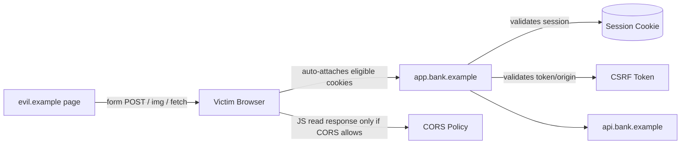
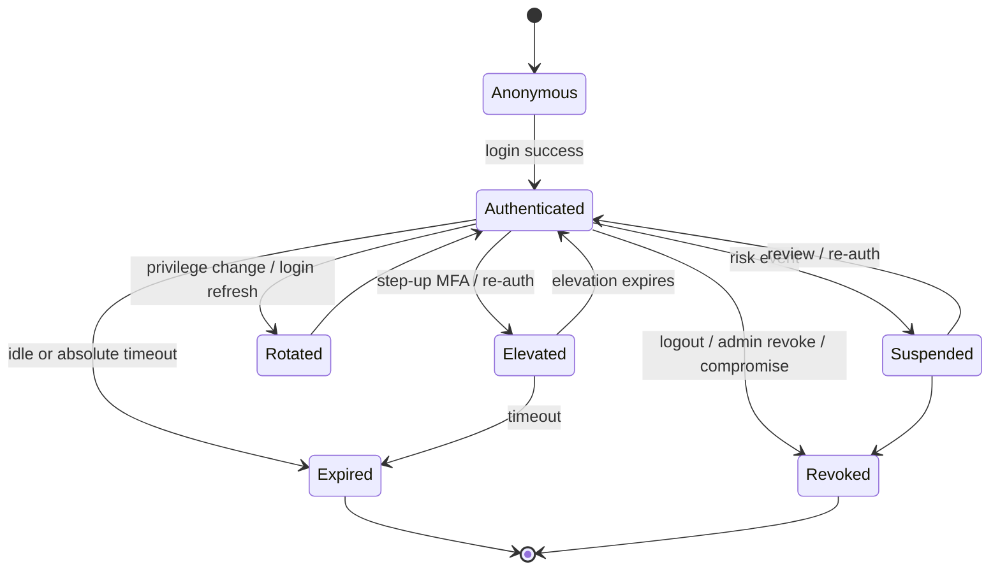
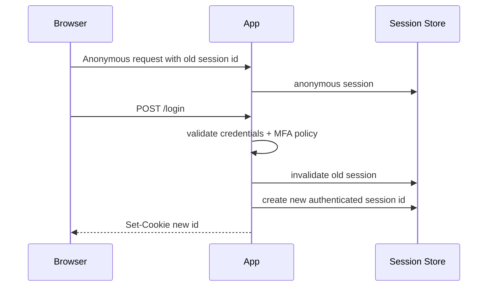
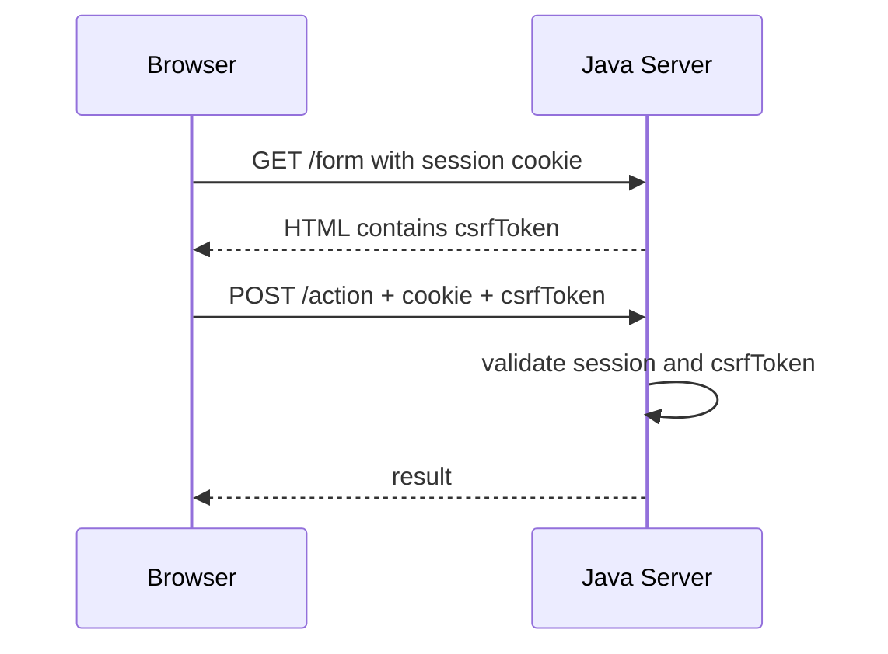
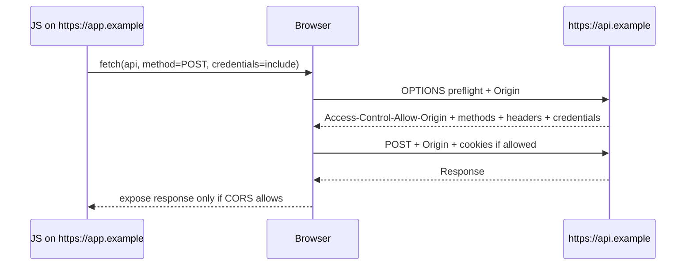

------
title: Learn Java Security, Cryptography and Integrity - Part 019
description: Session, cookie, CSRF, CORS, and browser trust-boundary engineering for Java web applications, APIs, SPAs, BFFs, and enterprise systems.
series: learn-java-security-cryptography-integrity
seriesTitle: Learn Java Security, Cryptography and Integrity
order: 19
partTitle: Session, Cookie, CSRF, CORS & Browser Boundaries
tags:
  - java
  - security
  - session
  - cookie
  - csrf
  - cors
  - browser-security
  - spring-security
  - integrity
date: 2026-06-30
---

# Part 019 — Session, Cookie, CSRF, CORS & Browser Boundaries

> Target: setelah part ini, kamu mampu mendesain dan mereview session/security boundary untuk aplikasi Java web modern: cookie hardening, session lifecycle, CSRF defense, CORS allowlist, SPA/BFF trade-off, browser trust model, dan test matrix untuk mencegah bug yang sering lolos karena terlihat seperti konfigurasi framework biasa.

Part sebelumnya membahas authentication dan authorization. Part ini menjawab pertanyaan operasional setelah user berhasil login:

```text
Bagaimana browser membuktikan request berikutnya masih berasal dari sesi yang sah,
tanpa membuka celah session theft, fixation, CSRF, CORS misconfiguration,
atau confused-browser boundary?
```

Kunci mental model:

> Browser adalah active participant dalam security model. Ia otomatis mengirim cookie, menerapkan same-origin policy, menjalankan JavaScript, melakukan preflight CORS, menyimpan state, dan mengikuti redirect. Jika desain server tidak memahami perilaku browser, sistem bisa terlihat secure di API test tetapi insecure di browser nyata.

Referensi utama:

- OWASP Cross-Site Request Forgery Prevention Cheat Sheet: <https://cheatsheetseries.owasp.org/cheatsheets/Cross-Site_Request_Forgery_Prevention_Cheat_Sheet.html>
- OWASP Session Management Cheat Sheet: <https://cheatsheetseries.owasp.org/cheatsheets/Session_Management_Cheat_Sheet.html>
- OWASP HTML5 Security Cheat Sheet: <https://cheatsheetseries.owasp.org/cheatsheets/HTML5_Security_Cheat_Sheet.html>
- OWASP WSTG — Testing Cross Origin Resource Sharing: <https://owasp.org/www-project-web-security-testing-guide/latest/4-Web_Application_Security_Testing/11-Client-side_Testing/07-Testing_Cross_Origin_Resource_Sharing>
- MDN Set-Cookie Header: <https://developer.mozilla.org/en-US/docs/Web/HTTP/Reference/Headers/Set-Cookie>
- MDN CORS Guide: <https://developer.mozilla.org/en-US/docs/Web/HTTP/Guides/CORS>
- Spring Security CSRF: <https://docs.spring.io/spring-security/reference/servlet/exploits/csrf.html>
- Spring Security CORS: <https://docs.spring.io/spring-security/reference/servlet/integrations/cors.html>

---

## 1. Kaufman Deconstruction: Browser Session Skill Map

| Capability | Pertanyaan korektif | Output engineering |
|---|---|---|
| Browser trust model | Mana yang dijaga browser, mana yang harus dijaga server? | Browser boundary map. |
| Session lifecycle | Kapan session dibuat, dirotasi, diinvalidasi, dan diaudit? | Session state machine. |
| Cookie security | Apakah cookie scoped, protected, dan tidak bisa di-set subdomain liar? | Cookie policy. |
| CSRF defense | Apakah state-changing request butuh proof yang tidak bisa dibuat situs lain? | CSRF control design. |
| CORS policy | Origin mana yang boleh membaca response lintas origin? | Exact origin allowlist. |
| SPA/BFF model | Token disimpan di mana dan siapa yang memegang session? | Frontend/backend boundary decision. |
| Logout and revocation | Apakah logout benar-benar memutus server-side session/token? | Revocation path. |
| Risk-based session | Apakah operasi sensitif butuh re-auth/MFA freshness? | Step-up policy. |
| Testing | Apakah negative browser cases diuji, bukan hanya happy path API? | Browser security test matrix. |

Core invariant:

> Jangan mempercayai request hanya karena membawa cookie atau token. Request harus melewati server-side authorization, CSRF protection untuk browser credential flows, origin policy yang eksplisit, session freshness untuk operasi sensitif, dan audit trail yang bisa membedakan actor, session, dan device.

---

## 2. Browser Boundary Mental Model

Browser memisahkan beberapa konsep yang sering tercampur:

| Konsep | Fungsi | Yang sering disalahpahami |
|---|---|---|
| Same-Origin Policy | Membatasi JavaScript origin A membaca response origin B. | Bukan authorization server-side. |
| Cookie | State yang otomatis dikirim browser sesuai domain/path/SameSite/Secure. | Cookie dikirim meskipun request dibuat oleh halaman attacker jika syarat terpenuhi. |
| CSRF token | Proof tambahan bahwa request state-changing dibuat dari halaman/aplikasi sah. | SameSite membantu, tetapi tidak selalu cukup sebagai satu-satunya defense. |
| CORS | Mekanisme server memberi izin browser origin lain membaca response. | CORS bukan perlindungan dari CSRF dan bukan permission model business. |
| CSP | Membatasi sumber script/style/frame untuk mengurangi XSS impact. | CSP bukan pengganti output encoding dan sanitization. |
| Redirect | Browser mengikuti alur navigasi dan membawa cookie sesuai policy. | Redirect bisa membocorkan token jika token diletakkan di URL. |



Interpretasi:

1. Browser bisa mengirim request lintas origin.
2. Browser membatasi apakah JavaScript attacker bisa membaca response.
3. Cookie bisa ikut terkirim otomatis.
4. Server tetap wajib membedakan request sah vs request yang dipicu attacker.

---

## 3. Session sebagai State Machine, Bukan Sekadar `JSESSIONID`

Session adalah stateful security object.



Minimum fields untuk session registry production:

```text
session_id_hash
subject_id
tenant_id
authentication_time
last_seen_at
absolute_expiry_at
idle_expiry_at
authentication_methods
mfa_fresh_until
risk_level
device_fingerprint_hash
ip_observed
user_agent_hash
status: ACTIVE | SUSPENDED | REVOKED | EXPIRED
created_reason
revoked_reason
```

Jangan simpan session ID mentah di log atau database observability. Simpan hash atau keyed hash untuk correlation.

---

## 4. Server-Side Session vs Stateless Token

| Model | Kekuatan | Risiko | Cocok untuk |
|---|---|---|---|
| Server-side session + opaque cookie | Mudah revoke, kecil di browser, server punya kontrol penuh. | Butuh session store dan scaling strategy. | Web app, BFF, admin console, regulated workflows. |
| Stateless JWT access token di browser memory | API scalable, cocok untuk short-lived token. | Revocation sulit, XSS exposure, refresh complexity. | SPA dengan strong token lifecycle dan BFF tidak tersedia. |
| JWT di cookie | Bisa HttpOnly, tetapi tetap auto-sent browser. | CSRF tetap relevan; token leakage via logs jika salah. | BFF atau same-site frontend/backend. |
| Refresh token di browser | UX bagus. | High-value secret di client; rotation dan reuse detection wajib. | Public client dengan OAuth/OIDC yang benar. |

Rule of thumb untuk enterprise Java:

> Untuk aplikasi web yang dikendalikan organisasi, BFF + server-side session sering lebih sederhana dan lebih aman daripada menyimpan access/refresh token langsung di JavaScript.

BFF pattern:

```mermaid
sequenceDiagram
    participant U as Browser
    participant BFF as Java BFF
    participant IDP as Identity Provider
    participant API as Internal API

    U->>BFF: GET /app
    BFF->>IDP: OIDC auth code + PKCE
    IDP-->>BFF: tokens server-side
    BFF-->>U: Set-Cookie: __Host-session=opaque; HttpOnly; Secure; SameSite=Lax
    U->>BFF: POST /case/approve + CSRF token
    BFF->>API: Authorization: Bearer access_token
    API-->>BFF: result
    BFF-->>U: response
```

Browser hanya menyimpan opaque session. Token OAuth disimpan dan dirotasi server-side.

---

## 5. Cookie Hardening: Attribute Invariants

Contoh target cookie session:

```http
Set-Cookie: __Host-session=opaque-random-value; Path=/; Secure; HttpOnly; SameSite=Lax; Max-Age=1800
```

Kenapa `__Host-`?

- Cookie harus `Secure`.
- Cookie harus `Path=/`.
- Cookie tidak boleh punya `Domain` attribute.
- Ini membantu mencegah subdomain yang compromised mengatur cookie untuk parent domain.

Cookie attributes:

| Attribute | Invariant | Catatan |
|---|---|---|
| `Secure` | Cookie hanya dikirim via HTTPS. | Wajib untuk session cookie. |
| `HttpOnly` | JavaScript tidak bisa membaca cookie via `document.cookie`. | Mengurangi impact XSS terhadap cookie theft, tetapi XSS masih bisa melakukan action. |
| `SameSite=Lax` | Cookie tidak dikirim untuk sebagian besar cross-site subrequest dan unsafe request. | Default aman untuk banyak web app. |
| `SameSite=Strict` | Lebih ketat; cookie hanya dikirim same-site. | Bisa mengganggu login redirect atau link dari email. |
| `SameSite=None; Secure` | Cookie dikirim cross-site. | Hanya untuk kebutuhan eksplisit seperti embedded cross-site; CSRF risk naik. |
| `Path=/` | Scope path jelas. | Jangan mengandalkan `Path` sebagai access control. |
| `Domain` omitted | Host-only cookie. | Hindari `.example.com` kecuali benar-benar perlu. |
| `Max-Age`/`Expires` | Umur cookie terbatas. | Harus sinkron dengan server-side expiry. |

Anti-pattern:

```http
Set-Cookie: JSESSIONID=abc; Domain=.example.com; Path=/; SameSite=None
```

Masalah:

1. Tidak ada `Secure`.
2. Tidak ada `HttpOnly`.
3. `Domain=.example.com` memperluas attack surface ke semua subdomain.
4. `SameSite=None` membuat cookie cross-site eligible.
5. Nama cookie tidak memakai prefix defensif.

---

## 6. Java Cookie Construction

Dengan Jakarta Servlet, framework sering mengatur session cookie. Untuk custom cookie, jangan membuat string manual kecuali kamu benar-benar mengontrol semua escaping dan attribute.

Spring `ResponseCookie`:

```java
import org.springframework.http.ResponseCookie;
import org.springframework.http.HttpHeaders;
import org.springframework.http.ResponseEntity;

import java.time.Duration;

public ResponseEntity<Void> issueSessionCookie(String opaqueSessionId) {
    ResponseCookie cookie = ResponseCookie.from("__Host-session", opaqueSessionId)
            .httpOnly(true)
            .secure(true)
            .sameSite("Lax")
            .path("/")
            .maxAge(Duration.ofMinutes(30))
            .build();

    return ResponseEntity.noContent()
            .header(HttpHeaders.SET_COOKIE, cookie.toString())
            .build();
}
```

Logout cookie deletion harus memakai scope yang sama:

```java
public ResponseCookie deleteSessionCookie() {
    return ResponseCookie.from("__Host-session", "")
            .httpOnly(true)
            .secure(true)
            .sameSite("Lax")
            .path("/")
            .maxAge(Duration.ZERO)
            .build();
}
```

Common failure:

```java
// Wrong: deletion tidak efektif jika Path/Domain berbeda dari cookie asli.
ResponseCookie.from("__Host-session", "").maxAge(0).path("/app").build();
```

---

## 7. Session ID Generation and Storage

Session ID harus:

- high entropy;
- tidak predictable;
- tidak mengandung user ID, tenant ID, role, timestamp yang bisa ditebak;
- dikirim hanya melalui cookie/header yang aman;
- tidak muncul di URL;
- dirotasi setelah login dan privilege elevation;
- disimpan server-side dalam bentuk hash.

Contoh opaque ID:

```java
import java.security.SecureRandom;
import java.util.Base64;

public final class SessionIds {
    private static final SecureRandom RNG = new SecureRandom();
    private static final Base64.Encoder B64 = Base64.getUrlEncoder().withoutPadding();

    private SessionIds() {}

    public static String newSessionId() {
        byte[] bytes = new byte[32]; // 256-bit random value
        RNG.nextBytes(bytes);
        return B64.encodeToString(bytes);
    }
}
```

Storage invariant:

```text
browser: opaque session id
server db/cache: HMAC(session id) -> session record
logs: short correlation hash only
```

Jangan query database dengan session ID mentah jika session store, query logs, atau APM bisa membocorkannya. Gunakan keyed hash/HMAC untuk lookup bila memungkinkan.

---

## 8. Session Fixation Defense

Session fixation terjadi ketika attacker membuat atau memaksa session ID sebelum korban login, lalu session itu tetap dipakai setelah login.

Safe flow:



Spring Security biasanya menyediakan session fixation protection. Tetapi tetap review:

- apakah session ID berubah setelah login;
- apakah privilege elevation merotasi atau menandai session freshness;
- apakah old session benar-benar invalid;
- apakah concurrent session policy sesuai requirement;
- apakah remember-me token dipisah dari session token.

---

## 9. Timeout: Idle, Absolute, and Step-Up Freshness

Gunakan beberapa timer, bukan satu timer global.

| Timer | Definisi | Contoh |
|---|---|---|
| Idle timeout | Expire jika tidak ada aktivitas. | 15-30 menit untuk admin console. |
| Absolute timeout | Expire meskipun aktif terus. | 8-12 jam untuk workday. |
| MFA freshness | Durasi operasi sensitif boleh dilakukan setelah MFA. | 5-15 menit untuk approval/payment. |
| Remember-me lifetime | Lifetime device binding / persistent login. | Hari/minggu, dengan risk controls. |

Contoh enforcement:

```java
public boolean requiresStepUp(SessionRecord session, SensitiveAction action, Instant now) {
    if (!action.requiresFreshAuth()) return false;
    return session.mfaFreshUntil() == null || session.mfaFreshUntil().isBefore(now);
}
```

Security smell:

```text
User login sekali pada Senin pagi,
lalu Jumat sore masih bisa approve enforcement action bernilai tinggi tanpa re-auth.
```

---

## 10. CSRF: Apa yang Sebenarnya Terjadi

CSRF preconditions:

1. user login di target site;
2. target site memakai browser credentials otomatis, biasanya cookie;
3. attacker bisa membuat browser user mengirim request ke target;
4. target server tidak membutuhkan proof yang hanya diketahui halaman sah.

Contoh forged HTML:

```html
<form action="https://bank.example/transfer" method="POST">
  <input name="to" value="attacker" />
  <input name="amount" value="1000000" />
</form>
<script>document.forms[0].submit();</script>
```

Browser bisa mengirim cookie target bila cookie policy mengizinkan. JavaScript attacker belum tentu bisa membaca response, tetapi action bisa tetap terjadi.

Core invariant:

> Semua state-changing request yang memakai browser auto-credentials harus memiliki CSRF defense server-side.

State-changing mencakup:

- `POST` create;
- `PUT` update;
- `PATCH` partial update;
- `DELETE` delete;
- `POST /logout`;
- workflow transition;
- file upload;
- approval;
- invitation acceptance;
- changing email/password/MFA;
- API key creation;
- export request;
- webhook config mutation.

Jangan membuat mutation via `GET`.

---

## 11. CSRF Defense Patterns

### 11.1 Synchronizer Token Pattern

Server membuat token per session atau per request, lalu halaman sah mengirim token di hidden field/header. Server memverifikasi token.



Cocok untuk server-rendered HTML.

### 11.2 Signed Double Submit Cookie

Server menaruh CSRF token di cookie yang bisa dibaca frontend, tetapi token ditandatangani/di-bind ke session. Client mengirim token itu lagi di custom header.

```text
Cookie: XSRF-TOKEN=<signed-token>
Header: X-XSRF-TOKEN:<same-signed-token>
```

Server memverifikasi:

- signature valid;
- token belum expired;
- token terkait session/user/tenant;
- header token sama dengan cookie token;
- method/path/action sesuai policy bila token scoped.

Jangan memakai naive double submit tanpa signing/binding untuk high-risk app.

### 11.3 Origin/Referer Verification

Tambahkan check `Origin` untuk unsafe methods. Jika `Origin` absent, gunakan `Referer` secara hati-hati atau deny untuk endpoint high-risk.

```java
private static final Set<String> ALLOWED_ORIGINS = Set.of(
        "https://app.example.com",
        "https://admin.example.com"
);

boolean isAllowedOrigin(HttpServletRequest request) {
    String method = request.getMethod();
    if (Set.of("GET", "HEAD", "OPTIONS").contains(method)) {
        return true;
    }
    String origin = request.getHeader("Origin");
    return origin != null && ALLOWED_ORIGINS.contains(origin);
}
```

Origin check adalah defense-in-depth, bukan pengganti token untuk semua context.

### 11.4 SameSite Cookies

`SameSite=Lax` atau `Strict` mengurangi CSRF karena cookie tidak selalu dikirim cross-site. Tetapi jangan menjadikannya satu-satunya defense untuk operasi sensitif karena:

- compatibility dan embedded-flow requirement bervariasi;
- login redirect dan cross-site integrations bisa butuh pengecualian;
- XSS bisa mengalahkan banyak CSRF mitigation;
- user agent behavior bisa berubah;
- subdomain/same-site confusion masih mungkin jika domain governance lemah.

---

## 12. Spring Security CSRF Configuration

Default Spring Security biasanya mengaktifkan CSRF untuk browser flows. Jangan disable global hanya karena API test gagal.

Anti-pattern:

```java
@Bean
SecurityFilterChain security(HttpSecurity http) throws Exception {
    return http
            .csrf(csrf -> csrf.disable()) // too broad
            .authorizeHttpRequests(auth -> auth.anyRequest().authenticated())
            .build();
}
```

Lebih baik pisahkan API machine-to-machine dari browser endpoints.

```java
@Bean
SecurityFilterChain browserSecurity(HttpSecurity http) throws Exception {
    return http
            .securityMatcher("/app/**", "/case/**", "/admin/**")
            .csrf(csrf -> csrf
                    // configure token repository sesuai frontend model
            )
            .authorizeHttpRequests(auth -> auth
                    .requestMatchers("/app/**").authenticated()
                    .requestMatchers("/admin/**").hasRole("ADMIN")
                    .anyRequest().denyAll()
            )
            .build();
}

@Bean
SecurityFilterChain apiSecurity(HttpSecurity http) throws Exception {
    return http
            .securityMatcher("/api/**")
            .csrf(csrf -> csrf.disable()) // acceptable for non-cookie bearer-token APIs
            .oauth2ResourceServer(oauth -> oauth.jwt())
            .authorizeHttpRequests(auth -> auth.anyRequest().authenticated())
            .build();
}
```

Decision rule:

```text
Cookie-authenticated browser endpoint? CSRF enabled.
Bearer token in Authorization header from non-browser client? CSRF generally not relevant.
Bearer token stored in cookie? CSRF relevant again.
```

---

## 13. CORS: What It Is and What It Is Not

CORS menjawab:

```text
Apakah JavaScript dari Origin A boleh membaca response dari Origin B?
```

CORS tidak menjawab:

```text
Apakah user ini boleh melakukan action ini?
Apakah request ini bukan CSRF?
Apakah origin ini trusted untuk semua tenant?
Apakah token valid?
```

CORS flow:



Critical headers:

```http
Access-Control-Allow-Origin: https://app.example.com
Access-Control-Allow-Credentials: true
Access-Control-Allow-Methods: GET,POST,PUT,DELETE
Access-Control-Allow-Headers: Content-Type, X-CSRF-Token, Authorization
Vary: Origin
```

Do not:

```http
Access-Control-Allow-Origin: *
Access-Control-Allow-Credentials: true
```

Browser rejects wildcard + credentials, tetapi server/proxy/client behavior tetap bisa membingungkan, dan konfigurasi seperti ini menunjukkan misunderstanding.

---

## 14. CORS Allowlist Engineering

Exact-match allowlist:

```java
private static final Set<String> ALLOWED_ORIGINS = Set.of(
        "https://app.example.com",
        "https://admin.example.com"
);

public boolean isAllowedCorsOrigin(String origin) {
    return origin != null && ALLOWED_ORIGINS.contains(origin);
}
```

Dangerous regex:

```java
// Wrong: accepts https://app.example.com.evil.org
origin.endsWith("example.com")
```

Safer host parsing if you must support dynamic subdomains:

```java
import java.net.URI;
import java.util.Locale;

public boolean isAllowedTenantOrigin(String origin) {
    try {
        URI uri = URI.create(origin);
        if (!"https".equalsIgnoreCase(uri.getScheme())) return false;
        if (uri.getPort() != -1 && uri.getPort() != 443) return false;

        String host = uri.getHost();
        if (host == null) return false;
        host = host.toLowerCase(Locale.ROOT);

        return host.equals("example.com") || host.endsWith(".tenant.example.com");
    } catch (IllegalArgumentException ex) {
        return false;
    }
}
```

Even with parsing, dynamic tenant origin policy needs ownership validation:

```text
origin tenant slug == authenticated tenant == configured tenant domain owner
```

---

## 15. CORS with Spring

Prefer central CORS configuration. Avoid reflecting arbitrary origin.

```java
@Bean
CorsConfigurationSource corsConfigurationSource() {
    CorsConfiguration config = new CorsConfiguration();
    config.setAllowedOrigins(List.of(
            "https://app.example.com",
            "https://admin.example.com"
    ));
    config.setAllowedMethods(List.of("GET", "POST", "PUT", "PATCH", "DELETE", "OPTIONS"));
    config.setAllowedHeaders(List.of("Authorization", "Content-Type", "X-CSRF-Token"));
    config.setExposedHeaders(List.of("X-Request-Id"));
    config.setAllowCredentials(true);
    config.setMaxAge(3600L);

    UrlBasedCorsConfigurationSource source = new UrlBasedCorsConfigurationSource();
    source.registerCorsConfiguration("/api/**", config);
    return source;
}

@Bean
SecurityFilterChain security(HttpSecurity http) throws Exception {
    return http
            .cors(cors -> cors.configurationSource(corsConfigurationSource()))
            .authorizeHttpRequests(auth -> auth.anyRequest().authenticated())
            .build();
}
```

Security review questions:

- Is CORS applied before auth filters where framework requires it?
- Are allowed origins exact?
- Are credentials needed?
- Is `Vary: Origin` present when origin is dynamic?
- Are dev origins excluded from production?
- Are internal admin origins separated from public app origins?
- Does CORS policy vary by endpoint sensitivity?

---

## 16. `null` Origin and Local Files

Browser can send:

```http
Origin: null
```

Examples include sandboxed iframes, local files, and privacy-sensitive contexts. Do not allow `null` origin casually.

Anti-pattern:

```java
if (origin == null || origin.equals("null")) {
    allow();
}
```

Safer default:

```text
Origin absent on unsafe browser endpoint: deny or require CSRF token + same-site context.
Origin: null: deny unless there is a documented, isolated, low-risk use case.
```

---

## 17. Session + CORS + CSRF Decision Matrix

| Client model | Credential transport | CSRF needed? | CORS needed? | Recommended pattern |
|---|---|---:|---:|---|
| Server-rendered app same-origin | Cookie | Yes | No | Synchronizer token + SameSite. |
| SPA same-site with BFF | HttpOnly cookie | Yes | Maybe if subdomain split | BFF + CSRF header + exact CORS. |
| SPA cross-site API | Cookie | Yes | Yes | Avoid if possible; if required, strict CORS + CSRF + SameSite=None. |
| Mobile app | Authorization header | Usually no | No | OAuth2 token + TLS + app attestation if needed. |
| Machine-to-machine | Authorization header / mTLS | No | No | OAuth2 client credentials/mTLS. |
| Third-party integration in browser | Cookie or token | Depends | Yes | Prefer explicit OAuth flow, not shared session cookie. |

Core rule:

> CSRF is about automatic browser credentials. CORS is about JavaScript response visibility. They solve different problems.

---

## 18. Logout, Revocation, and Session Invalidation

Logout should:

1. mark server-side session revoked;
2. remove session cookie with exact same scope;
3. revoke/rotate server-side OAuth tokens if using BFF;
4. clear CSRF token state;
5. record audit event;
6. redirect safely to trusted URL.

Example:

```java
@PostMapping("/logout")
public ResponseEntity<Void> logout(HttpServletRequest request) {
    SessionRecord session = sessions.requireCurrent(request);
    sessions.revoke(session.idHash(), "USER_LOGOUT");

    ResponseCookie expired = ResponseCookie.from("__Host-session", "")
            .httpOnly(true)
            .secure(true)
            .sameSite("Lax")
            .path("/")
            .maxAge(Duration.ZERO)
            .build();

    return ResponseEntity.noContent()
            .header(HttpHeaders.SET_COOKIE, expired.toString())
            .build();
}
```

Logout must be `POST` with CSRF protection, not simple `GET /logout`.

---

## 19. Browser Storage: LocalStorage, SessionStorage, IndexedDB

| Storage | Risk | Use guidance |
|---|---|---|
| `localStorage` | Persistent; readable by any XSS in origin. | Do not store refresh tokens or long-lived secrets. |
| `sessionStorage` | Per-tab but still XSS-readable. | Avoid high-value secrets. |
| IndexedDB | Large persistent client-side storage. | Treat as untrusted; encrypting client-side rarely solves XSS. |
| HttpOnly cookie | Not JS-readable; auto-sent. | Good for sessions, but CSRF controls required. |
| Memory-only token | Reduced persistence. | Still exposed to XSS runtime. |

Misleading statement:

```text
We store JWT in localStorage because CSRF cannot read it.
```

This trades CSRF risk for XSS token theft risk. The correct decision depends on app architecture, threat model, token lifetime, refresh token handling, and whether BFF is available.

---

## 20. CSP as Browser Boundary Defense-in-Depth

Content Security Policy helps reduce XSS impact by limiting script sources and dangerous browser capabilities.

Example baseline:

```http
Content-Security-Policy: default-src 'self'; script-src 'self'; object-src 'none'; base-uri 'none'; frame-ancestors 'none'
```

But CSP cannot fix:

- missing authorization;
- CSRF on cookie endpoint;
- CORS allowlist mistake;
- server-side injection;
- unsafe deserialization;
- business workflow bypass.

Use CSP as a browser hardening layer, not as core business security control.

---

## 21. Clickjacking and Framing Boundary

If admin or approval screens can be framed by attacker, user may be tricked into clicking hidden UI.

Recommended:

```http
Content-Security-Policy: frame-ancestors 'none'
```

Or allow specific embedding domains:

```http
Content-Security-Policy: frame-ancestors 'self' https://portal.example.com
```

Legacy fallback:

```http
X-Frame-Options: DENY
```

For sensitive state transitions, combine:

- anti-CSRF token;
- re-auth/MFA freshness;
- clear confirmation UI;
- audit reason;
- clickjacking protection.

---

## 22. Open Redirect and Token Leakage

Never redirect to arbitrary user-controlled URL after login/logout.

Vulnerable:

```java
@GetMapping("/login/success")
public String success(@RequestParam String next) {
    return "redirect:" + next;
}
```

Safe pattern:

```java
private static final Set<String> ALLOWED_PATHS = Set.of(
        "/dashboard",
        "/cases",
        "/profile"
);

public String safeRedirect(String next) {
    if (next == null || !ALLOWED_PATHS.contains(next)) {
        return "redirect:/dashboard";
    }
    return "redirect:" + next;
}
```

Better: store intended URL server-side during auth flow; do not round-trip arbitrary URL.

---

## 23. Multi-Tenant Browser Boundary

Multi-tenant products often support:

```text
https://tenant-a.example.com
https://tenant-b.example.com
https://app.customer-owned-domain.com
```

Security invariants:

- Session must be tenant-scoped.
- CSRF token must be bound to session and tenant.
- CORS origin must map to tenant ownership.
- Cookies should avoid broad parent domain unless needed.
- Admin origin should not share cookie scope with tenant origin.
- Tenant custom domains need verified ownership and certificate lifecycle.

Danger:

```text
*.example.com allowed in CORS
Domain=.example.com session cookie
untrusted tenant can host JavaScript on tenant-x.example.com
```

This can collapse tenant isolation.

---

## 24. Audit Events for Browser Session Security

Emit structured security events:

```json
{
  "event_type": "SESSION_CREATED",
  "subject_id": "user-123",
  "tenant_id": "tenant-a",
  "session_id_hash": "sha256:...",
  "auth_methods": ["password", "webauthn"],
  "ip_prefix": "203.0.113.0/24",
  "user_agent_hash": "...",
  "risk_level": "NORMAL",
  "timestamp": "2026-06-30T08:00:00Z"
}
```

Events to capture:

- login success/failure;
- session rotation;
- CSRF validation failure;
- CORS denied origin;
- MFA step-up;
- session timeout;
- logout;
- admin revocation;
- concurrent session anomaly;
- impossible travel/risk signal;
- suspicious origin mismatch.

Never log raw cookies, CSRF tokens, authorization headers, or refresh tokens.

---

## 25. Security Test Matrix

| Test | Expected result |
|---|---|
| State-changing POST without CSRF token | 403. |
| State-changing POST with invalid CSRF token | 403 + audit event. |
| `GET /delete?id=...` | Not implemented or 405. |
| Cross-origin request from disallowed origin | No CORS allow response; request denied where applicable. |
| Allowed origin exact match | CORS headers present. |
| `https://app.example.com.evil.org` | Denied. |
| `Origin: null` | Denied unless explicit exception. |
| Cookie lacks Secure | Build/deploy check fails. |
| Cookie has broad Domain | Security review fails unless exception documented. |
| Login rotates session ID | Old ID invalid. |
| Logout invalidates server-side session | Old cookie no longer works. |
| Sensitive action after MFA freshness expiry | Step-up required. |
| Dev origin in prod config | Build/deploy check fails. |

MockMvc style CSRF tests:

```java
@Test
void postWithoutCsrfIsRejected() throws Exception {
    mockMvc.perform(post("/case/123/approve"))
            .andExpect(status().isForbidden());
}

@Test
void postWithCsrfCanReachAuthorizationLayer() throws Exception {
    mockMvc.perform(post("/case/123/approve").with(csrf()))
            .andExpect(status().isUnauthorized()); // or forbidden/authenticated depending setup
}
```

CORS tests:

```java
@Test
void disallowedOriginDoesNotReceiveCorsHeaders() throws Exception {
    mockMvc.perform(options("/api/cases")
                    .header("Origin", "https://app.example.com.evil.org")
                    .header("Access-Control-Request-Method", "POST"))
            .andExpect(header().doesNotExist("Access-Control-Allow-Origin"));
}
```

---

## 26. Common Anti-Patterns

| Anti-pattern | Why dangerous | Better design |
|---|---|---|
| `csrf().disable()` globally | Browser cookie endpoints become forgeable. | Separate browser/API chains. |
| Wildcard CORS | Exposes response to unintended origins. | Exact allowlist. |
| Reflecting `Origin` header | Attacker chooses allowed origin. | Validate origin before echo. |
| Session cookie in URL | Leaks through logs, referer, browser history. | Cookie/header only. |
| JWT in localStorage by default | XSS token theft. | BFF or short-lived memory token. |
| `GET /logout` | CSRF/logout tricking. | POST with CSRF. |
| Broad `Domain=.example.com` | Subdomain compromise impacts session. | Host-only `__Host-` cookie. |
| SameSite as only CSRF defense | Not enough for all flows. | Token + SameSite + origin check. |
| Trusting CORS for authz | CORS is browser read policy, not access control. | Server-side authz every request. |
| Missing `Vary: Origin` | Cache can serve wrong CORS response. | Set `Vary: Origin` for dynamic policy. |

---

## 27. Production Review Checklist

Session:

- [ ] Session ID is opaque, random, high entropy.
- [ ] Session ID is not stored raw in logs.
- [ ] Session rotates after login and privilege elevation.
- [ ] Idle and absolute timeouts exist.
- [ ] Logout revokes server-side session.
- [ ] Admin/session compromise revocation exists.
- [ ] Sensitive operations require recent auth/MFA.

Cookie:

- [ ] `Secure` enabled.
- [ ] `HttpOnly` enabled.
- [ ] `SameSite` explicitly chosen.
- [ ] `Domain` omitted for host-only cookie unless exception.
- [ ] `Path=/` for `__Host-` cookie.
- [ ] Cookie deletion uses same scope.
- [ ] Prod rejects insecure cookie config.

CSRF:

- [ ] Unsafe methods require CSRF token for cookie-auth browser flows.
- [ ] Token is session-bound and unpredictable/signed.
- [ ] Origin/Referer check is used where appropriate.
- [ ] No mutation via GET.
- [ ] Logout/change password/change email/MFA operations protected.

CORS:

- [ ] Allowed origins are exact and environment-specific.
- [ ] No regex suffix bug.
- [ ] Credentials only enabled when required.
- [ ] `Vary: Origin` handled.
- [ ] `null` origin denied by default.
- [ ] Dev origins absent from prod.

Browser hardening:

- [ ] CSP baseline exists.
- [ ] `frame-ancestors` prevents clickjacking on sensitive pages.
- [ ] Redirect targets are allowlisted.
- [ ] Tokens are not placed in URLs.

---

## 28. Deliberate Practice Lab

Build a minimal Java/Spring app with:

1. login endpoint issuing `__Host-session`;
2. server-side session registry;
3. CSRF-protected form POST;
4. API route under `/api/**` using bearer token and no CSRF;
5. exact CORS allowlist;
6. logout with server-side revocation;
7. tests for disallowed origin, missing CSRF, session rotation, and logout invalidation.

Then intentionally introduce these bugs one by one and verify test failure:

- remove `Secure`;
- disable CSRF globally;
- allow `*.example.com` by suffix check;
- use `GET /logout`;
- do not rotate session after login;
- reflect origin without validation;
- add `Domain=.example.com`.

The goal is not memorizing attributes. The goal is building a mental compiler that rejects unsafe browser/session designs quickly.

---

## 29. What Good Looks Like

A production-grade Java browser security design has these properties:

```text
- Session identity is opaque and server-controlled.
- Cookie scope is narrow and hardened.
- Browser auto-credential behavior is explicitly handled.
- CSRF is enforced for unsafe cookie-authenticated flows.
- CORS only allows explicit trusted origins to read responses.
- Authorization is still server-side and object-level.
- Sensitive workflow transitions require fresh proof.
- Logs expose security events, not secrets.
- Tests cover malicious browser behaviors, not just API happy paths.
```

This is the difference between “we enabled Spring Security” and “we understand the browser as a distributed security participant.”

---

## 30. Next Step

Part 020 moves from browser/session boundary to interpreter boundary:

```text
Injection, SSRF, deserialization, parser security,
and the broader rule: never let untrusted input select code, protocol,
resource, class, host, template, query, or parser behavior.
```
