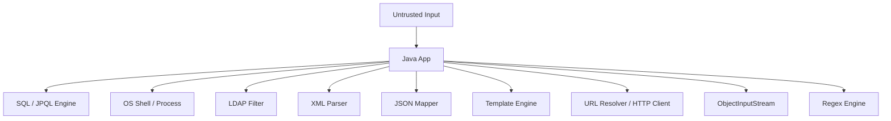
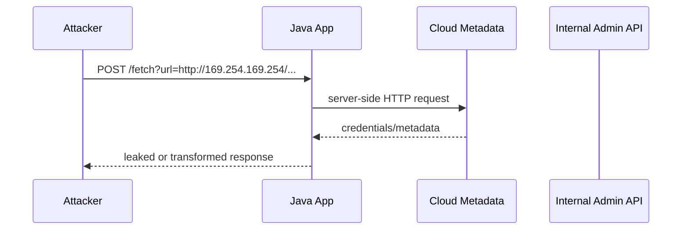
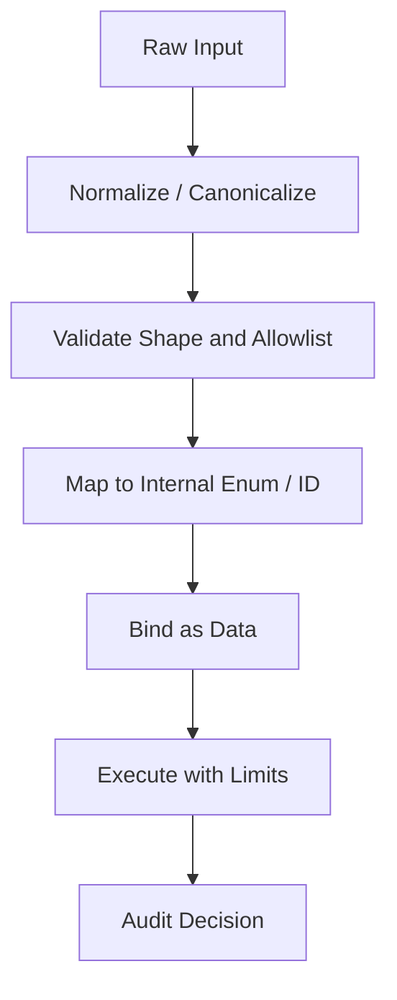

------
title: Learn Java Security, Cryptography and Integrity - Part 020
description: Injection, SSRF, deserialization, parser, XML, template, command, and interpreter-boundary security for Java production systems.
series: learn-java-security-cryptography-integrity
seriesTitle: Learn Java Security, Cryptography and Integrity
order: 20
partTitle: Injection, SSRF, Deserialization & Parser Security
tags:
  - java
  - security
  - injection
  - ssrf
  - deserialization
  - parser-security
  - xxe
  - secure-coding
  - integrity
date: 2026-06-30
---

# Part 020 — Injection, SSRF, Deserialization & Parser Security

> Target: setelah part ini, kamu mampu mengenali dan memperbaiki class of bugs yang muncul ketika untrusted input melintasi interpreter boundary: SQL/JPQL/LDAP/OS command/template injection, SSRF, unsafe Java deserialization, XML parser abuse, expression language execution, path/protocol confusion, dan parser resource exhaustion.

Part ini bukan pengulangan JDBC, ORM, JSON, XML, atau REST yang sudah pernah dibahas. Kita hanya membahas sudut security:

```text
Apa yang terjadi ketika data dari attacker dipakai sebagai instruction,
selector, locator, class name, protocol, expression, parser directive,
atau resource identifier?
```

Core invariant:

> Untrusted input boleh menjadi data. Untrusted input tidak boleh menjadi code, query grammar, object type, host target, file path, parser directive, template expression, shell fragment, or classpath behavior.

Referensi utama:

- OWASP Injection Prevention Cheat Sheet: <https://cheatsheetseries.owasp.org/cheatsheets/Injection_Prevention_Cheat_Sheet.html>
- OWASP SQL Injection Prevention Cheat Sheet: <https://cheatsheetseries.owasp.org/cheatsheets/SQL_Injection_Prevention_Cheat_Sheet.html>
- OWASP SSRF Prevention Cheat Sheet: <https://cheatsheetseries.owasp.org/cheatsheets/Server_Side_Request_Forgery_Prevention_Cheat_Sheet.html>
- OWASP Deserialization Cheat Sheet: <https://cheatsheetseries.owasp.org/cheatsheets/Deserialization_Cheat_Sheet.html>
- OWASP XML External Entity Prevention Cheat Sheet: <https://cheatsheetseries.owasp.org/cheatsheets/XML_External_Entity_Prevention_Cheat_Sheet.html>
- Oracle JAXP Security Guide: <https://docs.oracle.com/en/java/javase/11/security/java-api-xml-processing-jaxp-security-guide.html>
- Java `ObjectInputFilter`: <https://docs.oracle.com/en/java/javase/25/docs/api/java.base/java/io/ObjectInputFilter.html>
- Java `ObjectInputStream` warning: <https://docs.oracle.com/en/java/javase/25/docs/api/java.base/java/io/ObjectInputStream.html>
- JEP 415 Context-Specific Deserialization Filters: <https://openjdk.org/jeps/415>

---

## 1. Kaufman Deconstruction: Interpreter Boundary Skill Map

| Capability | Pertanyaan korektif | Output engineering |
|---|---|---|
| Boundary recognition | Apakah input akan dibaca oleh interpreter/parser lain? | Interpreter map. |
| Query safety | Apakah data dipisahkan dari query grammar? | Parameterized queries. |
| Dynamic selection | Apakah user memilih column, sort, class, host, template, or file? | Allowlist mapping. |
| SSRF defense | Apakah server melakukan request ke destination yang dikontrol user? | Egress policy + URL validator. |
| Deserialization safety | Apakah object graph/classpath bisa dikontrol attacker? | No native serialization for untrusted input. |
| Parser hardening | Apakah parser bisa fetch external resources or expand entities? | Secure parser config. |
| Resource limits | Apakah input bisa memicu CPU/memory/network explosion? | Size/depth/time limits. |
| Review heuristics | Apakah code smell terdeteksi cepat? | Secure review checklist. |
| Test strategy | Apakah negative payloads menjadi regression tests? | Misuse test suite. |

Mental shortcut:

```text
If input crosses from "value" into "language", stop and redesign.
```

---

## 2. The Interpreter Boundary Model

Sistem Java modern sering hanya terlihat seperti Java code, padahal melewati banyak interpreter:



Each interpreter has:

```text
syntax + semantics + escaping rules + resource behavior + side effects
```

Secure engineering means making input data-only, not instruction-bearing.

---

## 3. Injection Taxonomy for Java Systems

| Class | Unsafe pattern | Safer pattern |
|---|---|---|
| SQL injection | String concatenated SQL. | `PreparedStatement`, bind variables. |
| JPQL/HQL injection | Concatenated query string. | Named parameters, Criteria API, allowlisted sort fields. |
| NoSQL injection | User-controlled JSON query operators. | Typed query builder, schema validation. |
| LDAP injection | Concatenated LDAP filters. | Escape filter values and allowlist attributes. |
| OS command injection | Shell command string with user input. | Avoid shell; `ProcessBuilder` with fixed executable and args. |
| Template injection | User controls template expression. | No untrusted templates; strict template mode. |
| Expression injection | User controls SpEL/OGNL/MVEL expression. | No expression evaluation from users. |
| XPath injection | Concatenated XPath. | Parameterized/compiled safe approach or allowlist. |
| Header injection | User input in response header. | Validate CR/LF, structured APIs. |
| Log injection | User input controls log lines. | Structured logging and normalization. |
| Regex DoS | User controls complex regex or catastrophic input. | Allowlisted regex, timeouts, safe patterns. |
| SSRF | User controls URL/server request target. | Destination allowlist + DNS/IP validation + egress deny. |
| Deserialization | User controls serialized object graph. | Avoid native deserialization; filter only as defense-in-depth. |
| XXE | XML parser loads external entity. | Disable DTD/external entities. |

---

## 4. SQL Injection: Not Just Login Bypass

Vulnerable:

```java
String sql = "select * from users where email = '" + email + "'";
try (Statement st = connection.createStatement()) {
    ResultSet rs = st.executeQuery(sql);
}
```

Safe:

```java
String sql = "select * from users where email = ?";
try (PreparedStatement ps = connection.prepareStatement(sql)) {
    ps.setString(1, email);
    ResultSet rs = ps.executeQuery();
}
```

But parameterization does not solve dynamic identifiers:

```java
// Wrong: column name cannot be a bind variable.
String sql = "select * from cases order by " + request.getSort();
```

Use allowlist mapping:

```java
private static final Map<String, String> SORT_COLUMNS = Map.of(
        "createdAt", "created_at",
        "risk", "risk_score",
        "status", "status"
);

public String buildOrderBy(String requestedSort) {
    String column = SORT_COLUMNS.get(requestedSort);
    if (column == null) {
        throw new BadRequestException("Unsupported sort field");
    }
    return " order by " + column + " desc";
}
```

Important distinction:

```text
Values -> bind parameters.
Identifiers/grammar -> allowlist mapping.
```

---

## 5. JPQL/HQL and ORM Injection

Vulnerable:

```java
String q = "select c from Case c where c.ownerEmail = '" + email + "'";
return entityManager.createQuery(q, Case.class).getResultList();
```

Safe:

```java
return entityManager
        .createQuery("select c from Case c where c.ownerEmail = :email", Case.class)
        .setParameter("email", email)
        .getResultList();
```

Dynamic filtering and sorting still need a grammar boundary:

```java
public enum CaseSort {
    CREATED_AT("createdAt"),
    STATUS("status"),
    RISK("riskScore");

    private final String property;

    CaseSort(String property) {
        this.property = property;
    }

    public String property() {
        return property;
    }
}
```

Do not pass arbitrary property names from client into criteria builders.

---

## 6. Command Injection

Vulnerable:

```java
String command = "convert " + inputFile + " " + outputFile;
Runtime.getRuntime().exec(command);
```

Problems:

- shell parsing;
- whitespace/special character behavior;
- path injection;
- option injection;
- environment variable influence;
- executable search path ambiguity.

Safer pattern:

```java
Path input = safeUploadPath(requestedInputId);
Path output = safeOutputPath(requestedOutputId);

ProcessBuilder pb = new ProcessBuilder(
        "/usr/bin/convert",
        input.toString(),
        output.toString()
);
pb.redirectErrorStream(true);
Process process = pb.start();
boolean finished = process.waitFor(10, TimeUnit.SECONDS);
if (!finished) {
    process.destroyForcibly();
    throw new ProcessingTimeoutException();
}
```

Still review:

- executable absolute path;
- no shell (`sh -c`) unless impossible;
- allowlisted operation;
- fixed flags;
- file paths resolved under safe directory;
- resource timeout;
- output capture limit;
- non-root runtime;
- seccomp/container constraints for risky processors.

---

## 7. Option Injection

Even without shell, user input can become command option.

```java
new ProcessBuilder("tar", "-xf", userProvidedFile).start();
```

If `userProvidedFile` is `--checkpoint-action=exec=...`, some tools may treat it as option.

Defenses:

- place `--` before user-controlled positional arguments where tool supports it;
- reject filenames beginning with `-`;
- use internal libraries instead of shell tools;
- run processor in sandbox;
- allowlist file IDs instead of accepting file paths/names.

Example:

```java
new ProcessBuilder("tar", "-xf", "--", safeFile.toString()).start();
```

---

## 8. LDAP Injection

Vulnerable:

```java
String filter = "(&(objectClass=user)(mail=" + email + "))";
```

Attack input can modify filter semantics.

Safer:

- use framework escaping utilities;
- bind values if supported by API;
- allowlist attribute names;
- do not expose arbitrary LDAP filters.

Pseudo-pattern:

```java
String safeEmail = ldapEscape(email);
String filter = "(&(objectClass=user)(mail=" + safeEmail + "))";
```

Important:

```text
Escaping is context-specific. HTML escaping does not protect LDAP. SQL escaping does not protect shell. URL encoding does not protect XML.
```

---

## 9. Template and Expression Injection

Dangerous pattern:

```java
String template = request.getParameter("template");
return templateEngine.render(template, model);
```

If user controls template source, many engines expose expression features, method calls, object traversal, or sandbox escape risks.

Safer:

```text
User selects template_id from allowlist.
Server loads immutable template by id.
User controls only data model values.
Output is encoded for target context.
```

Expression injection example risk:

```java
ExpressionParser parser = new SpelExpressionParser();
Object value = parser.parseExpression(userInput).getValue(context);
```

Do not evaluate user-provided expressions unless you are building a carefully sandboxed rules product with language design, audit, resource limits, and least-privilege execution.

---

## 10. SSRF Mental Model

SSRF happens when attacker influences server-side network request target.



SSRF impact:

- access cloud metadata service;
- scan internal network;
- hit internal admin panels;
- bypass firewall because request originates from trusted backend;
- exploit internal services;
- exfiltrate data through callbacks;
- force expensive downloads;
- hit Redis/Elasticsearch/etc if protocol handling is loose.

Core invariant:

> User input must not directly determine outbound URL destination. Server-side egress must be allowlisted and network-enforced.

---

## 11. SSRF Defense Layers

| Layer | Control |
|---|---|
| Business design | Prefer file IDs/resources, not arbitrary URLs. |
| URL parser | Parse once using strict URI rules. |
| Scheme | Allow `https` only unless exception. |
| Host allowlist | Exact known hostnames or verified tenant domains. |
| DNS validation | Resolve and validate IP ranges. |
| Rebinding defense | Revalidate after resolution/connect; avoid trusting one DNS lookup forever. |
| IP blocking | Deny private, loopback, link-local, multicast, metadata IPs. |
| Redirect handling | Disable redirects or revalidate every redirect target. |
| Egress firewall | Network denies internal/metadata destinations. |
| Timeout/size | Limit connect/read time and response size. |
| Response handling | Do not return arbitrary fetched content blindly. |
| Audit | Log normalized destination and decision. |

Best defense is architectural:

```text
Instead of /fetch?url=<any>
Use /import/provider/{providerId}/resource/{resourceId}
where provider endpoint is configured server-side.
```

---

## 12. SSRF URL Validator Skeleton

This is not a complete universal validator. It demonstrates the shape of the control.

```java
import java.net.*;
import java.util.*;

public final class OutboundDestinationPolicy {
    private static final Set<String> ALLOWED_HOSTS = Set.of(
            "files.partner.example",
            "api.partner.example"
    );

    public URI validate(String rawUrl) {
        URI uri;
        try {
            uri = URI.create(rawUrl);
        } catch (IllegalArgumentException ex) {
            throw new BadRequestException("Invalid URL");
        }

        if (!"https".equalsIgnoreCase(uri.getScheme())) {
            throw new BadRequestException("Only HTTPS is allowed");
        }
        if (uri.getUserInfo() != null) {
            throw new BadRequestException("Userinfo is not allowed");
        }
        if (uri.getHost() == null) {
            throw new BadRequestException("Host is required");
        }

        String host = IDN.toASCII(uri.getHost()).toLowerCase(Locale.ROOT);
        if (!ALLOWED_HOSTS.contains(host)) {
            throw new BadRequestException("Destination is not allowed");
        }

        validateResolvedAddresses(host);
        return uri;
    }

    private void validateResolvedAddresses(String host) {
        try {
            for (InetAddress address : InetAddress.getAllByName(host)) {
                if (isForbidden(address)) {
                    throw new BadRequestException("Forbidden destination address");
                }
            }
        } catch (UnknownHostException ex) {
            throw new BadRequestException("Unknown host");
        }
    }

    private boolean isForbidden(InetAddress address) {
        return address.isAnyLocalAddress()
                || address.isLoopbackAddress()
                || address.isLinkLocalAddress()
                || address.isSiteLocalAddress()
                || address.isMulticastAddress();
    }
}
```

Production hardening also needs:

- IPv6 special ranges;
- cloud metadata IP/domain blocks;
- redirect revalidation;
- DNS rebinding defense;
- proxy enforcement;
- egress network policy;
- per-partner certificate/TLS policy;
- response content limits.

---

## 13. SSRF with Java HTTP Client

```java
HttpClient client = HttpClient.newBuilder()
        .connectTimeout(Duration.ofSeconds(3))
        .followRedirects(HttpClient.Redirect.NEVER)
        .build();

URI target = destinationPolicy.validate(request.url());

HttpRequest httpRequest = HttpRequest.newBuilder(target)
        .timeout(Duration.ofSeconds(5))
        .GET()
        .build();

HttpResponse<InputStream> response = client.send(
        httpRequest,
        HttpResponse.BodyHandlers.ofInputStream()
);
```

Do not use `followRedirects(ALWAYS)` unless every redirect target is revalidated.

Also avoid returning fetched body directly to caller. If importing files, process with size/type checks and store under controlled object storage.

---

## 14. Deserialization: Why Java Native Serialization Is Dangerous

Java deserialization can execute code paths while rebuilding object graphs. The risk comes from:

- attacker-controlled classes in stream;
- gadget chains on classpath;
- `readObject`, `readResolve`, `finalize`, comparator, collection, proxy behavior;
- dependency libraries that introduce exploitable gadgets;
- resource exhaustion via huge graphs;
- partial mitigations that allow too much.

Core rule:

> Do not deserialize untrusted Java native serialized data. Replace with explicit data formats and schema validation.

Risky API smell:

```java
ObjectInputStream in = new ObjectInputStream(request.getInputStream());
Object obj = in.readObject();
```

Even if you cast later, damage may happen during `readObject()`.

---

## 15. Safer Alternatives to Native Deserialization

| Need | Prefer |
|---|---|
| API payload | JSON with DTO schema and validation. |
| Internal binary schema | Protocol Buffers, Avro, FlatBuffers, or similar typed schema. |
| Cache serialization | Framework serializer with allowlisted classes and no polymorphic arbitrary types. |
| Message queue | Versioned event schema. |
| Session storage | Server-side structured session record. |
| Plugin data | Explicit DSL or capability-scoped config. |

Security-specific requirement:

```text
Payload schema must constrain shape, size, type, recursion depth, and unknown fields policy.
```

---

## 16. ObjectInputFilter as Defense-in-Depth

If legacy code cannot remove native serialization immediately, use `ObjectInputFilter` with allowlist and limits.

Example shape:

```java
ObjectInputFilter filter = ObjectInputFilter.Config.createFilter(
        "maxdepth=5;maxrefs=1000;maxbytes=1048576;"
      + "com.example.safe.dto.*;java.base/*;!*"
);

try (ObjectInputStream in = new ObjectInputStream(inputStream)) {
    in.setObjectInputFilter(filter);
    Object value = in.readObject();
    if (!(value instanceof ExpectedMessage message)) {
        throw new InvalidPayloadException();
    }
    handle(message);
}
```

Important limitations:

- Filters reduce risk; they do not make arbitrary untrusted deserialization safe.
- Allowlisting packages can still be too broad.
- Dependencies can change gadget surface.
- Resource limits must be strict.
- Filters must be applied before reading objects.
- Use context-specific filters, not one permissive global filter.

---

## 17. Context-Specific Deserialization Filters

Context-specific filters allow different boundaries to have different rules:

```text
Message queue payload -> only com.example.events.*
Cache payload -> only com.example.cache.*
Admin import -> no native serialization at all
```

Good filters are based on expected object graph, not developer convenience.

Decision record template:

```text
Boundary: legacy RMI endpoint / partner file import / cache restore
Reason native serialization remains: ...
Allowed classes: ...
Max depth/refs/bytes: ...
Classpath risk reviewed: ...
Migration plan: ...
Owner: ...
Expiration date for exception: ...
```

---

## 18. Polymorphic JSON Deserialization Risk

Even non-native serialization can be dangerous if type metadata lets attacker select classes.

Dangerous conceptual pattern:

```json
{
  "@class": "com.some.LibraryGadget",
  "...": "..."
}
```

Safer:

- avoid default typing for untrusted data;
- deserialize into final DTOs or records;
- explicitly allow known subtypes;
- reject unknown fields for high-risk boundaries;
- keep domain entities separate from wire DTOs;
- apply size/depth limits;
- avoid binding directly into classes with side-effect setters.

Principle:

```text
Attacker may choose values, not implementation classes.
```

---

## 19. XML Parser Security and XXE

XXE occurs when XML parser resolves external entities controlled by input.

Example dangerous XML:

```xml
<!DOCTYPE foo [
  <!ENTITY xxe SYSTEM "file:///etc/passwd">
]>
<foo>&xxe;</foo>
```

Risks:

- local file disclosure;
- SSRF through XML entity resolution;
- denial of service through entity expansion;
- network calls from parser;
- data exfiltration via error messages.

Core invariant:

> XML parser must not load external entities, external DTDs, or arbitrary schemas from untrusted input.

---

## 20. Secure DOM Parser Configuration

Configuration varies by parser, but the goal is explicit: disallow DTD and external entities.

```java
import javax.xml.XMLConstants;
import javax.xml.parsers.DocumentBuilderFactory;

public DocumentBuilderFactory secureDocumentBuilderFactory() throws Exception {
    DocumentBuilderFactory factory = DocumentBuilderFactory.newInstance();
    factory.setFeature("http://apache.org/xml/features/disallow-doctype-decl", true);
    factory.setFeature("http://xml.org/sax/features/external-general-entities", false);
    factory.setFeature("http://xml.org/sax/features/external-parameter-entities", false);
    factory.setFeature("http://apache.org/xml/features/nonvalidating/load-external-dtd", false);
    factory.setXIncludeAware(false);
    factory.setExpandEntityReferences(false);
    factory.setFeature(XMLConstants.FEATURE_SECURE_PROCESSING, true);
    factory.setAttribute(XMLConstants.ACCESS_EXTERNAL_DTD, "");
    factory.setAttribute(XMLConstants.ACCESS_EXTERNAL_SCHEMA, "");
    return factory;
}
```

Notes:

- Different parsers may support features differently.
- Failing closed is important; do not ignore `ParserConfigurationException`.
- Validate with malicious payload tests.
- Control schema loading explicitly.

---

## 21. Secure SAX Parser Configuration

```java
import javax.xml.XMLConstants;
import javax.xml.parsers.SAXParserFactory;

public SAXParserFactory secureSaxParserFactory() throws Exception {
    SAXParserFactory factory = SAXParserFactory.newInstance();
    factory.setFeature("http://apache.org/xml/features/disallow-doctype-decl", true);
    factory.setFeature("http://xml.org/sax/features/external-general-entities", false);
    factory.setFeature("http://xml.org/sax/features/external-parameter-entities", false);
    factory.setFeature("http://apache.org/xml/features/nonvalidating/load-external-dtd", false);
    factory.setFeature(XMLConstants.FEATURE_SECURE_PROCESSING, true);
    factory.setXIncludeAware(false);
    return factory;
}
```

If a parser cannot be hardened, do not use it for untrusted XML.

---

## 22. XPath Injection

Vulnerable:

```java
String xpath = "/users/user[email='" + email + "']";
```

Safer approaches:

- avoid XPath over untrusted user predicates where possible;
- pre-parse and filter in Java over structured objects;
- use variable binding if available;
- allowlist path fragments;
- never expose arbitrary XPath query language to ordinary users.

Same rule:

```text
Values are data. XPath grammar is not user-controlled.
```

---

## 23. Parser Resource Exhaustion

Parser abuse is not always about code execution. It can be DoS:

- huge JSON arrays;
- deeply nested objects;
- repeated fields;
- giant XML documents;
- zip bombs;
- regex catastrophic backtracking;
- multipart upload storms;
- YAML anchors/aliases;
- decompression bombs.

Controls:

- request body size limit;
- per-field length limit;
- nesting depth limit;
- streaming parser for large payloads;
- decompressed size cap;
- upload scanning and quarantine;
- timeout;
- rate limiting;
- memory budget;
- reject unknown polymorphic shapes.

---

## 24. Regex DoS

Vulnerable regex:

```java
Pattern.compile("(a+)+$").matcher(input).matches();
```

Certain inputs can cause catastrophic backtracking.

Guidelines:

- avoid nested quantifiers;
- prefer simple allowlist regex;
- cap input length before regex;
- do not let users define arbitrary regex for shared services;
- use timeout-capable matching library if necessary;
- test evil inputs.

Example:

```java
private static final Pattern SAFE_CODE = Pattern.compile("^[A-Z0-9_-]{1,40}$");

public void validateCode(String code) {
    if (code == null || !SAFE_CODE.matcher(code).matches()) {
        throw new BadRequestException("Invalid code");
    }
}
```

---

## 25. File Path and Protocol Confusion

Vulnerable:

```java
Path path = Paths.get("/data/uploads/" + request.getParameter("file"));
return Files.readString(path);
```

Safer:

```java
private static final Path ROOT = Path.of("/data/uploads").toAbsolutePath().normalize();

public Path resolveUpload(String fileName) {
    if (!fileName.matches("^[A-Za-z0-9._-]{1,100}$")) {
        throw new BadRequestException("Invalid file name");
    }
    Path resolved = ROOT.resolve(fileName).normalize();
    if (!resolved.startsWith(ROOT)) {
        throw new BadRequestException("Path traversal rejected");
    }
    return resolved;
}
```

Do not accept:

- absolute paths;
- `../` traversal;
- symlink escape;
- `file://` URLs;
- UNC paths;
- platform-specific separators;
- user-chosen storage bucket/key without tenant scoping.

---

## 26. Header and Response Splitting

Vulnerable:

```java
response.setHeader("Location", request.getParameter("next"));
```

Risks:

- open redirect;
- CRLF header injection;
- cache poisoning;
- token leakage;
- response splitting.

Safer:

- use allowlisted relative paths;
- reject CR/LF;
- construct URLs with URI builder;
- never put untrusted data in security headers;
- validate redirect targets server-side.

---

## 27. Log Injection

Vulnerable:

```java
log.info("Login failed for user=" + username);
```

If username contains newlines or structured log delimiters, attacker can forge log lines.

Safer structured logging:

```java
log.info("login_failed user_hash={} reason={}", hash(username), reasonCode);
```

Also:

- normalize control characters;
- do not log secrets;
- include event type;
- use immutable audit logs for sensitive events;
- separate debug logs from audit records.

---

## 28. Review Heuristics: Dangerous Java APIs and Patterns

Search for:

```text
createStatement(
createQuery(" +
Runtime.getRuntime().exec
ProcessBuilder(
SpelExpressionParser
ScriptEngineManager
ObjectInputStream
readObject(
XMLInputFactory.newInstance
DocumentBuilderFactory.newInstance
SAXParserFactory.newInstance
TransformerFactory.newInstance
URI.create(request
new URL(request
setFollowRedirects(true)
@JsonTypeInfo
activateDefaultTyping
Class.forName(request
Method.invoke
Paths.get(request
Pattern.compile(request
```

Not every occurrence is a vulnerability. Every occurrence deserves boundary reasoning.

---

## 29. Secure Boundary Design Pattern

Use this sequence for every interpreter boundary:



Concrete examples:

| Boundary | Normalize | Validate | Map | Bind/Execute |
|---|---|---|---|---|
| SQL sort | trim | enum value | enum to column | concatenate trusted column only. |
| HTTP fetch | URI parse | scheme/host/IP | provider ID | HTTP client with no redirects. |
| XML | content-type/size | DTD disabled | schema version | hardened parser. |
| Command | file ID | owner/tenant | storage path | ProcessBuilder args. |
| Template | template ID | allowlist | immutable template | render data only. |

---

## 30. Negative Test Payloads

Use controlled tests. Do not run exploit tooling against systems you do not own.

SQL:

```text
' OR '1'='1
x' UNION SELECT ...
```

SSRF:

```text
http://127.0.0.1:8080/admin
http://169.254.169.254/latest/meta-data/
http://[::1]/
https://app.example.com.evil.org/
```

XML:

```xml
<!DOCTYPE foo [ <!ENTITY xxe SYSTEM "file:///etc/passwd"> ]><foo>&xxe;</foo>
```

Path:

```text
../../etc/passwd
..%2f..%2fetc%2fpasswd
```

Regex:

```text
aaaaaaaaaaaaaaaaaaaaaaaaaaaaaaaaa!
```

Deserialization:

```text
Do not include weaponized gadget payloads in normal unit tests.
Instead test that ObjectInputStream boundary is absent or filter rejects unexpected classes.
```

---

## 31. Java/Spring Test Examples

SQL sort allowlist:

```java
@Test
void rejectsUnsupportedSortField() {
    assertThrows(BadRequestException.class,
            () -> queryBuilder.buildOrderBy("created_at desc; drop table cases"));
}
```

SSRF destination:

```java
@ParameterizedTest
@ValueSource(strings = {
        "http://127.0.0.1:8080/admin",
        "http://169.254.169.254/latest/meta-data/",
        "ftp://files.partner.example/a",
        "https://files.partner.example.evil.org/a"
})
void rejectsForbiddenOutboundDestinations(String url) {
    assertThrows(BadRequestException.class, () -> policy.validate(url));
}
```

XML XXE:

```java
@Test
void rejectsDoctype() throws Exception {
    String xml = """
            <!DOCTYPE foo [ <!ENTITY xxe SYSTEM "file:///etc/passwd"> ]>
            <foo>&xxe;</foo>
            """;

    DocumentBuilderFactory factory = secureDocumentBuilderFactory();
    assertThrows(SAXException.class, () ->
            factory.newDocumentBuilder().parse(new InputSource(new StringReader(xml)))
    );
}
```

Deserialization filter:

```java
@Test
void filterRejectsUnexpectedClass() throws Exception {
    ObjectInputFilter filter = ObjectInputFilter.Config.createFilter(
            "com.example.safe.ExpectedMessage;java.base/*;!*"
    );
    // Test with serialized unexpected class generated in test fixture.
}
```

---

## 32. Production Control Matrix

| Risk | Prevent | Detect | Respond |
|---|---|---|---|
| SQL/JPQL injection | Parameter binding + allowlist identifiers. | SAST, query audit, DB anomaly. | Patch, rotate credentials if leaked, review logs. |
| Command injection | Avoid shell, fixed executable, allowlisted args. | Process audit, unexpected child process alerts. | Disable feature, revoke workload permissions. |
| SSRF | Destination allowlist + egress firewall. | Denied egress logs, metadata access alerts. | Rotate cloud credentials, isolate workload. |
| Deserialization | Remove native deserialization. | Classpath/gadget review, filter rejection logs. | Disable endpoint, patch dependency, migrate format. |
| XXE | Disable DTD/external entities. | Parser exception telemetry, outbound blocks. | Patch parser config, investigate file/metadata access. |
| Parser DoS | Size/depth/time limits. | CPU/memory request anomaly. | Rate limit, block source, tune limits. |
| Template injection | No untrusted template source. | Template error anomaly. | Disable dynamic templates. |

---

## 33. Code Review Checklist

Interpreter boundary:

- [ ] Is untrusted input ever concatenated into a query, command, expression, path, URL, template, or header?
- [ ] Are values separated from grammar?
- [ ] Are dynamic identifiers mapped through allowlists?
- [ ] Are dangerous APIs wrapped by safe abstractions?
- [ ] Are resource limits applied?
- [ ] Are parser features explicitly hardened?

SSRF:

- [ ] Does user input influence outbound URL?
- [ ] Are scheme/host/port allowlisted?
- [ ] Are resolved IPs checked?
- [ ] Are redirects disabled or revalidated?
- [ ] Is network egress restricted outside app code?
- [ ] Is cloud metadata blocked?

Deserialization:

- [ ] Is native Java deserialization absent from untrusted boundaries?
- [ ] If present, is there a time-bound exception?
- [ ] Are filters allowlist-based and context-specific?
- [ ] Are max depth/refs/bytes configured?
- [ ] Is migration plan defined?

XML/parser:

- [ ] DTD disabled?
- [ ] External entities disabled?
- [ ] External schema/DTD access blocked?
- [ ] Secure processing enabled?
- [ ] Input size/depth constrained?
- [ ] Malicious payload tests included?

---

## 34. Deliberate Practice Lab

Build a small Java service with four intentionally dangerous features, then harden each:

1. `/cases?sort=` dynamic SQL/JPQL sort;
2. `/fetch?url=` partner document import;
3. `/xml/import` XML upload;
4. `/legacy/deserialize` native Java serialized payload.

For each feature:

- write the vulnerable version;
- write a failing negative test;
- implement safe abstraction;
- add review checklist entry;
- add audit event for rejected input;
- document the invariant in an ADR.

Example ADR title:

```text
ADR-SEC-020: Partner Document Import Uses Provider IDs, Not Arbitrary URLs
```

ADR content:

```text
Decision:
  User cannot submit arbitrary fetch URL.
  User selects providerId and resourceId.
  Server resolves provider endpoint from configuration.
  Egress firewall allows only partner CIDRs/domains.

Reason:
  Prevent SSRF, metadata access, internal scanning, and redirect-based bypass.

Verification:
  Unit tests reject private/link-local/loopback hosts.
  Integration test confirms metadata endpoint is unreachable.
  CORS/authz tests separate browser boundary from outbound fetch boundary.
```

---

## 35. What Good Looks Like

A mature Java team treats injection/SSRF/deserialization/parser risks as architecture issues, not isolated bugs.

```text
- Dangerous APIs are wrapped.
- Allowlist mappings are explicit.
- Query values are bound.
- Dynamic grammar is minimized.
- Outbound network destinations are not user-chosen.
- Native deserialization is removed from untrusted boundaries.
- XML parsers are hardened by default.
- Parser limits are enforced.
- Negative security payloads become regression tests.
- Code review detects interpreter-boundary smells early.
```

If Part 019 was about browser as a security participant, Part 020 is about every downstream interpreter as a potential execution surface.

---

## 36. Next Step

Part 021 moves into distributed integrity:

```text
idempotency, replay prevention, optimistic locking, event ordering,
causality, duplicate handling, tamper detection,
and state integrity across Java services.
```
