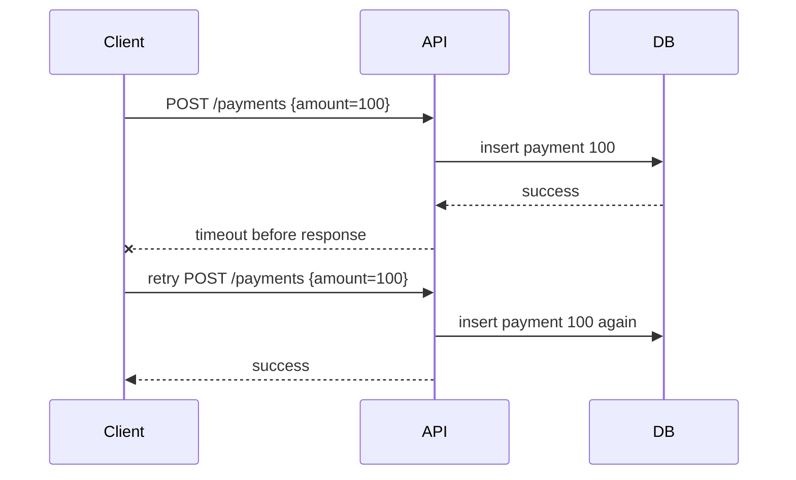
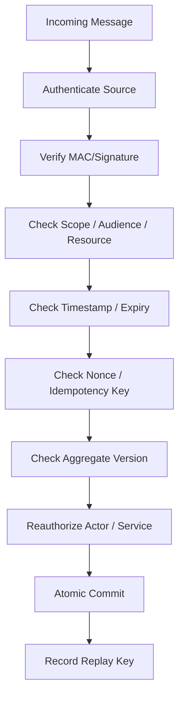
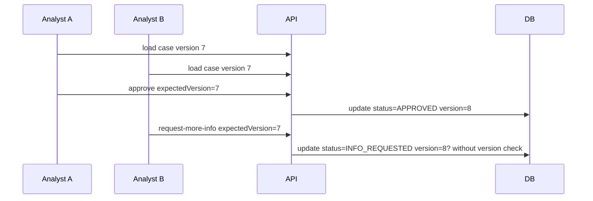
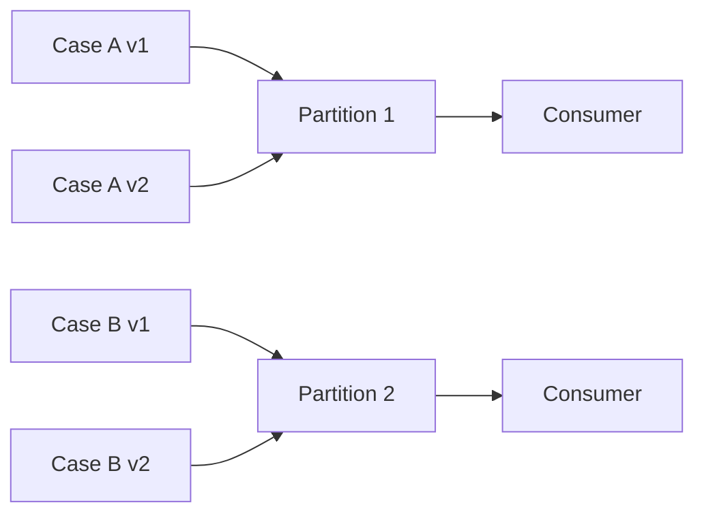
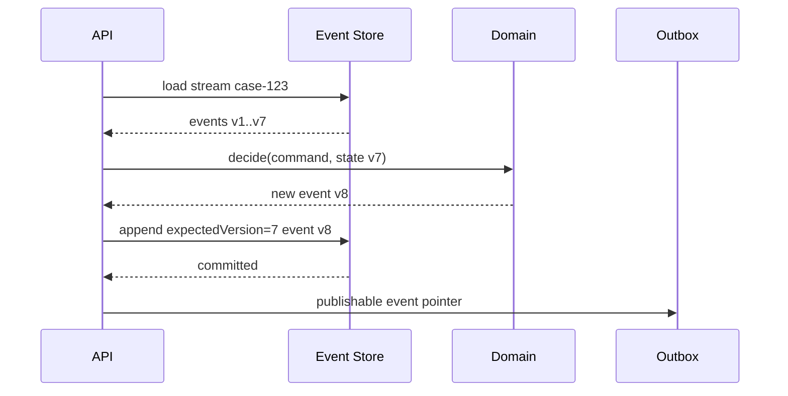
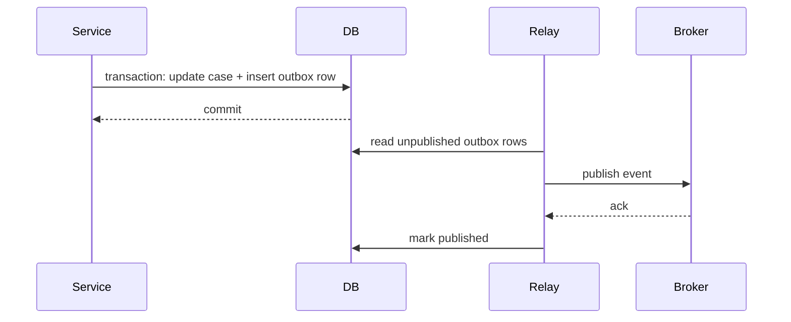
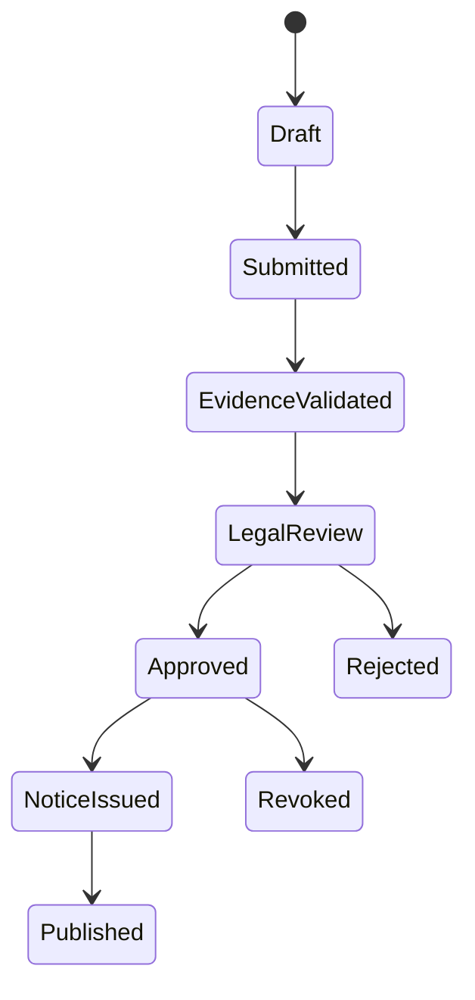
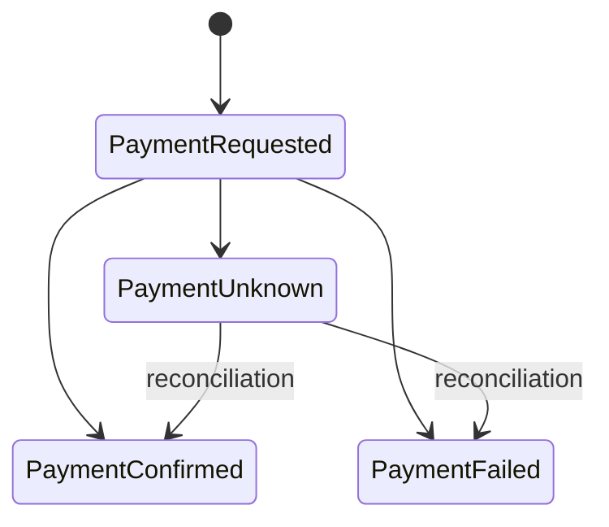

------
title: Learn Java Security, Cryptography and Integrity - Part 021
description: Data integrity for distributed Java systems: idempotency, replay prevention, ordering, causality, optimistic locking, event integrity, and tamper detection.
series: learn-java-security-cryptography-integrity
seriesTitle: Learn Java Security, Cryptography and Integrity
order: 21
partTitle: Data Integrity in Distributed Java Systems
tags:
  - java
  - security
  - integrity
  - distributed-systems
  - idempotency
  - replay-defense
  - audit
  - event-driven
  - consistency
date: 2026-06-30
---

# Part 021 — Data Integrity in Distributed Java Systems

> Target: setelah part ini, kamu mampu mendesain data integrity untuk sistem Java terdistribusi: bukan hanya hash/signature, tetapi juga idempotency, replay prevention, optimistic concurrency, ordering, causality, provenance, reconciliation, dan tamper detection.

Kita sudah membahas cryptographic integrity pada part sebelumnya: MAC, signature, AEAD, certificate, key management, dan TLS. Part ini naik satu level:

```text
Cryptography can prove bytes were not altered.
Distributed integrity proves the system state still means what it claims to mean.
```

Di sistem enterprise, data bisa rusak tanpa ada attacker yang memecahkan crypto:

- request sukses dua kali karena retry;
- event dikonsumsi out of order;
- command lama diproses setelah state berubah;
- message valid direplay oleh actor yang sudah tidak berhak;
- aggregate ditimpa oleh update stale;
- audit trail lengkap, tetapi tidak bisa membuktikan causality;
- projection/read model menampilkan state yang belum konvergen;
- kompensasi transaksi membuat invariant domain diam-diam rusak;
- service A dan B punya definisi berbeda tentang “approved”, “revoked”, atau “effective”.

Core invariant:

> Integrity in distributed systems means every accepted state transition must be authorized, fresh, causally valid, non-duplicative, semantically consistent, and reconstructable.

Referensi utama:

- NIST SP 800-57 Part 1 Rev. 5, Recommendation for Key Management: <https://csrc.nist.gov/pubs/sp/800/57/pt1/r5/final>
- NIST SP 800-63B, replay resistance concepts: <https://pages.nist.gov/800-63-4/sp800-63b.html>
- OWASP API Security Top 10 2023: <https://owasp.org/API-Security/editions/2023/en/0x11-t10/>
- OWASP Authorization Cheat Sheet: <https://cheatsheetseries.owasp.org/cheatsheets/Authorization_Cheat_Sheet.html>
- OWASP Logging Cheat Sheet: <https://cheatsheetseries.owasp.org/cheatsheets/Logging_Cheat_Sheet.html>
- CloudEvents Specification: <https://cloudevents.io/>
- RFC 3339 Date and Time on the Internet: <https://www.rfc-editor.org/rfc/rfc3339>
- RFC 4122 UUID: <https://www.rfc-editor.org/rfc/rfc4122>
- RFC 9562 UUID revision: <https://www.rfc-editor.org/rfc/rfc9562>

---

## 1. Kaufman Deconstruction: Distributed Integrity Skill Map

| Capability | Pertanyaan korektif | Output engineering |
|---|---|---|
| State-transition thinking | Apa state yang boleh berubah, oleh siapa, dan kapan? | State transition matrix. |
| Idempotency | Apa yang terjadi jika command sama dikirim dua kali? | Idempotency key + response replay. |
| Freshness | Apakah command/event masih valid saat diproses? | Timestamp, nonce, version, expiry. |
| Causality | Apakah event ini terjadi setelah precondition yang benar? | Aggregate version, vector-ish metadata, dependency check. |
| Ordering | Apakah consumer bergantung pada order? | Per-key ordering strategy. |
| Concurrency integrity | Apakah stale writer bisa menimpa state baru? | Optimistic locking + compare-and-set. |
| Replay defense | Apakah message lama bisa dipakai ulang? | Replay cache + deduplication window. |
| Provenance | Dari mana data berasal dan chain of custody-nya apa? | Event metadata + actor/service identity. |
| Reconciliation | Bagaimana mendeteksi divergence? | Reconciliation job + invariant scanner. |
| Evidence | Bisakah kita membuktikan keputusan sistem? | Tamper-evident audit facts. |

Kaufman lens untuk part ini:

1. **Deconstruct**: pisahkan integrity menjadi state, command, event, identity, time, order, evidence.
2. **Learn enough to self-correct**: kuasai failure mode yang paling sering: duplicate, stale, replay, lost update, out-of-order, partial failure.
3. **Remove barriers**: buat template metadata, idempotency table, version check, dan invariant test agar tidak perlu berpikir dari nol tiap fitur.
4. **Practice deliberately**: review setiap flow state-changing dengan pertanyaan: “apa yang terjadi jika request/event ini datang dua kali, terlambat, dari actor lama, atau setelah state berubah?”

---

## 2. Mental Model: Integrity Is a Chain, Not a Field

Field seperti `checksum`, `signature`, `version`, atau `status` bukan integrity. Itu hanya alat.

Integrity adalah chain:

```mermaid
flowchart LR
    Actor[Actor / Service Identity]
    Intent[Intent / Command]
    Authz[Authorization Decision]
    Preconditions[State Preconditions]
    Freshness[Freshness / Replay Check]
    Transition[State Transition]
    Event[Event Emission]
    Audit[Audit Evidence]
    Projection[Read Model / Downstream]
    Reconcile[Reconciliation]

    Actor --> Intent --> Authz --> Preconditions --> Freshness --> Transition --> Event --> Audit --> Projection --> Reconcile
```



Jika satu node lemah, integrity keseluruhan turun.

Contoh:

```text
Signature valid + actor valid + payload valid
BUT aggregate version stale
= invalid state transition.
```

Atau:

```text
Event schema valid + MAC valid
BUT event already processed last week
= replay.
```

Atau:

```text
Request idempotent key exists
BUT response was recomputed from current state, not original result
= subtle integrity bug.
```

---

## 3. Data Integrity vs Consistency vs Security

Ketiganya sering dicampur.

| Konsep | Pertanyaan | Contoh failure |
|---|---|---|
| Data integrity | Apakah data masih benar, utuh, sah, dan bermakna? | Approval muncul tanpa approver valid. |
| Consistency | Apakah replica/service melihat state yang kompatibel? | Read model tertinggal 30 detik. |
| Security | Apakah actor tidak sah dicegah? | User membaca case milik tenant lain. |

Di sistem terdistribusi, integrity mencakup security dan consistency, tetapi tidak identik.

Contoh regulatory case management:

```text
Case status = ENFORCEMENT_APPROVED
```

Status itu hanya valid jika:

- case pernah mencapai `REVIEW_COMPLETED`;
- actor punya authority pada tenant, jurisdiction, product, dan threshold kasus;
- approval dilakukan sebelum deadline tertentu;
- approval tidak dicabut;
- semua mandatory evidence masih valid;
- tidak ada conflict of interest unresolved;
- transition tercatat dengan event id, actor id, reason, timestamp, policy version;
- downstream projection tidak menampilkan approval sebelum event commit.

Nilai `ENFORCEMENT_APPROVED` tanpa chain pembuktian di atas adalah data yang tampak benar tetapi tidak defensible.

---

## 4. State Transition as the Unit of Integrity

Unit integrity bukan tabel, endpoint, atau DTO. Unit integrity adalah **state transition**.

```text
Current State + Command + Actor + Policy + Time + Preconditions
=> New State + Events + Audit Facts
```

Contoh Java model sederhana:

```java
public record TransitionContext(
        UUID commandId,
        UUID actorId,
        String tenantId,
        Instant receivedAt,
        String policyVersion,
        String requestHash,
        String correlationId
) {}

public record ApproveCaseCommand(
        UUID caseId,
        long expectedVersion,
        String reason,
        UUID idempotencyKey
) {}

public sealed interface CaseDecision permits CaseApproved, CaseRejected {}

public record CaseApproved(
        UUID caseId,
        long newVersion,
        UUID approvedBy,
        Instant approvedAt,
        String policyVersion
) implements CaseDecision {}
```

Application service harus menjaga urutan:

```java
@Transactional
public CaseApproved approve(ApproveCaseCommand command, TransitionContext ctx) {
    var actor = actors.requireActive(ctx.actorId());
    var aggregate = cases.requireForUpdate(command.caseId());

    idempotency.rejectOrReplay(command.idempotencyKey(), ctx.actorId(), command.caseId());

    authorization.requireCanApprove(actor, aggregate, ctx.policyVersion());
    aggregate.requireVersion(command.expectedVersion());
    aggregate.requireCanTransitionTo(CaseStatus.APPROVED);

    var decision = aggregate.approve(actor.id(), ctx.receivedAt(), command.reason(), ctx.policyVersion());

    cases.save(aggregate);
    outbox.append(CaseEvents.approved(decision, ctx));
    audit.append(AuditFacts.caseApproved(decision, ctx));

    idempotency.storeSuccess(command.idempotencyKey(), ctx.actorId(), command.caseId(), decision);
    return decision;
}
```

Security review checklist:

- authorization dilakukan sebelum mutation;
- idempotency tidak hanya dedup, tetapi replay response yang sama;
- aggregate version dicek;
- transition precondition dicek di domain;
- event dan audit ditulis atomically dengan state;
- policy version dicatat;
- request hash/correlation id dicatat untuk evidence.

---

## 5. Idempotency: Duplicate Request Is Normal, Not Exceptional

Distributed systems retry. Client, gateway, load balancer, queue, broker, worker, dan orchestrator bisa mengirim ulang operasi.

Tanpa idempotency:



Invariant:

> Retrying the same logical command must not create a second logical effect.

### 5.1 Idempotency Key Is Not Request ID

| Identifier | Purpose | Scope |
|---|---|---|
| Request ID | Observability/correlation for one HTTP attempt | Per attempt. |
| Correlation ID | Link related operations | Across workflow. |
| Command ID | Identity of business command | Per logical command. |
| Idempotency key | Deduplicate/replay logical result | Per actor + operation + resource + window. |
| Event ID | Identity of emitted event | Per event fact. |

Bad design:

```text
Use X-Request-Id as idempotency key.
```

Why bad?

- retry libraries often generate a new request id;
- proxies may override request id;
- request id is usually not scoped to operation/resource;
- request id is observability metadata, not business intent.

Better:

```text
Idempotency-Key: 8b0d9b8e-6a64-4c9c-9220-63e5f5b2d2df
Scope: tenant + actor + method + route template + resource id + command semantic hash
```

### 5.2 Idempotency Table

```sql
create table idempotency_record (
    tenant_id varchar(80) not null,
    actor_id uuid not null,
    operation varchar(120) not null,
    idempotency_key uuid not null,
    request_hash char(64) not null,
    status varchar(20) not null,
    response_hash char(64),
    response_body jsonb,
    resource_id uuid,
    created_at timestamp with time zone not null,
    expires_at timestamp with time zone not null,
    primary key (tenant_id, actor_id, operation, idempotency_key)
);
```

Important invariant:

> Same idempotency key with different request hash must be rejected, not treated as retry.

```java
public IdempotencyDecision checkOrStart(IdempotencyScope scope, byte[] canonicalRequest) {
    var requestHash = sha256Hex(canonicalRequest);
    var existing = repository.find(scope);

    if (existing.isEmpty()) {
        repository.insertStarted(scope, requestHash, clock.instant());
        return IdempotencyDecision.started();
    }

    var record = existing.get();

    if (!MessageDigest.isEqual(
            record.requestHash().getBytes(StandardCharsets.US_ASCII),
            requestHash.getBytes(StandardCharsets.US_ASCII))) {
        throw new IdempotencyConflictException("same key used for different request");
    }

    return switch (record.status()) {
        case SUCCEEDED -> IdempotencyDecision.replay(record.responseBody());
        case FAILED_RETRYABLE -> IdempotencyDecision.retryAllowed();
        case STARTED -> IdempotencyDecision.inProgress();
        case FAILED_FINAL -> IdempotencyDecision.replayFailure(record.responseBody());
    };
}
```

### 5.3 Response Replay vs Recompute

Common bug:

```java
if (idempotencyKeyExists) {
    return loadCurrentResource(resourceId); // wrong for many workflows
}
```

Why wrong?

- current resource may have changed since original command;
- recomputed response may reveal data not visible during original request;
- status code may differ;
- audit may no longer match client-visible result.

Better:

```text
Replay the original status + response body + headers that matter.
```

Not every endpoint requires response replay. For internal async command endpoints, it may be enough to return original command status. But the decision must be explicit.

---

## 6. Freshness: Valid Then Is Not Necessarily Valid Now

Freshness answers:

```text
Is this message still acceptable at the time of processing?
```

A message can be authentic but stale.

Examples:

- signed approval link clicked after expiration;
- webhook replayed after settlement;
- queue message delayed beyond policy window;
- user token valid when request started but account disabled before commit;
- command created under policy v3 but processed after policy v4 became mandatory;
- event from previous aggregate version arrives after compensating transition.

### 6.1 Freshness Dimensions

| Dimension | Mechanism | Failure prevented |
|---|---|---|
| Wall-clock expiry | `expiresAt`, timestamp window | Very old replay. |
| Nonce uniqueness | Replay cache | Duplicate within valid window. |
| Aggregate version | `expectedVersion` | Stale writes. |
| Policy version | `policyVersion` | Old rule application. |
| Actor status | active/revoked check at commit | Disabled actor action. |
| Capability binding | operation/resource scope | Token/command reuse elsewhere. |
| Event dependency | causal predecessor id | Out-of-order semantic corruption. |

### 6.2 Clock Is Not Truth

Do not build distributed integrity on raw `Instant.now()` alone.

Problems:

- clock skew;
- leap seconds/time sync issues;
- consumer delay;
- region latency;
- replay window uncertainty;
- attacker-controlled client timestamps.

Rule:

> Server receive time is evidence. Domain effective time is policy. Client-provided time is claim.

Model them separately:

```java
public record TimeEvidence(
        Instant clientClaimedAt,
        Instant gatewayReceivedAt,
        Instant serviceReceivedAt,
        Instant committedAt,
        String clockSource
) {}
```

Review smell:

```java
if (request.getTimestamp().isAfter(Instant.now().minusSeconds(300))) {
    approve();
}
```

Better:

- parse timestamp as claim;
- compare against server receive time;
- apply tolerance;
- require nonce/idempotency;
- record all relevant times.

---

## 7. Replay Prevention in Distributed Flows

Replay is not only network-level. In application security, replay means:

```text
A previously valid message is accepted again in a context where it should not have an effect.
```

### 7.1 Replay Defense Layers



A robust replay defense needs more than one mechanism.

| Mechanism | Strength | Weakness |
|---|---|---|
| Timestamp window | Limits old replay | Does not prevent replay inside window. |
| Nonce cache | Prevents duplicate | Requires storage and expiry. |
| Idempotency key | Safe retry semantics | Scope mistakes cause bypass. |
| Version check | Prevents stale transition | Does not prevent duplicate read-only action. |
| Token binding | Prevents use by other party | Deployment complexity. |
| Sequence number | Strong per-channel order | Hard across distributed producers. |

### 7.2 Replay Cache Design

```sql
create table replay_record (
    scope_hash char(64) not null,
    nonce varchar(128) not null,
    first_seen_at timestamp with time zone not null,
    expires_at timestamp with time zone not null,
    primary key (scope_hash, nonce)
);
```

Scope must include enough context:

```text
tenant + source identity + operation + resource + key id + audience
```

Do not use global nonce table without scope unless the throughput and storage model can support it.

Java sketch:

```java
public void rejectReplay(ReplayScope scope, String nonce, Instant expiresAt) {
    try {
        replayRepository.insert(scope.hash(), nonce, clock.instant(), expiresAt);
    } catch (DuplicateKeyException duplicate) {
        throw new ReplayDetectedException(scope, nonce);
    }
}
```

The insert must be atomic. A check-then-insert can race:

```java
if (!repository.exists(scope, nonce)) { // race
    repository.insert(scope, nonce);
}
```

---

## 8. Optimistic Concurrency and Lost Update Prevention

Lost update is an integrity problem:



Correct update:

```sql
update regulatory_case
set status = ?, version = version + 1, updated_at = ?
where id = ? and version = ?;
```

Java domain:

```java
public void requireVersion(long expectedVersion) {
    if (this.version != expectedVersion) {
        throw new StaleStateException(this.id, expectedVersion, this.version);
    }
}
```

JPA-level optimistic locking helps:

```java
@Entity
class RegulatoryCase {
    @Id
    private UUID id;

    @Version
    private long version;

    @Enumerated(EnumType.STRING)
    private CaseStatus status;
}
```

But do not delegate all integrity to `@Version`. You still need domain preconditions:

```java
public void approve(Actor actor, Instant at, String reason) {
    if (status != CaseStatus.REVIEW_COMPLETED) {
        throw new InvalidTransitionException(status, CaseStatus.APPROVED);
    }
    if (reason == null || reason.isBlank()) {
        throw new MissingDecisionReasonException();
    }
    this.status = CaseStatus.APPROVED;
    this.approvedBy = actor.id();
    this.approvedAt = at;
}
```

---

## 9. Ordering: Global Order Is Expensive, Per-Key Order Is Useful

Many teams say “events must be ordered” without specifying the key.

Ask:

```text
Ordered by what?
- entire system?
- tenant?
- case?
- account?
- producer?
- aggregate?
- workflow instance?
```

Global ordering reduces availability and throughput. Most business invariants need **per-aggregate** or **per-workflow** ordering.

### 9.1 Per-Key Ordering

For event streaming:

```text
partition key = aggregateId or workflowId
```

This gives order within a partition for the same key, but not across all keys.



### 9.2 Out-of-Order Consumer Defense

Even when broker preserves per-key order, consumers should defend against anomalies:

```java
public void apply(CaseEvent event) {
    var projection = repository.findOrCreate(event.caseId());

    if (event.aggregateVersion() <= projection.lastAppliedVersion()) {
        return; // duplicate or old event
    }

    if (event.aggregateVersion() != projection.lastAppliedVersion() + 1) {
        throw new GapDetectedException(event.caseId(), projection.lastAppliedVersion(), event.aggregateVersion());
    }

    projection.apply(event);
    repository.save(projection);
}
```

This turns silent corruption into explicit operational signal.

### 9.3 Gap Handling

Options:

| Strategy | When useful | Risk |
|---|---|---|
| Fail fast and retry | Broker order should guarantee no gaps | Poison loop if event lost. |
| Park event | Temporary out-of-order delivery possible | Need dead-letter/retry management. |
| Fetch missing events | Event store available | Coupling to event source. |
| Rebuild projection | Projection is disposable | Costly but clean. |

For compliance-heavy systems, silent skip is usually unacceptable.

---

## 10. Causality: “After” Is Not Always About Timestamp

Causality means one fact depends on another.

Example:

```text
CaseApproved depends on ReviewCompleted.
PenaltyIssued depends on CaseApproved.
NoticePublished depends on PenaltyIssued.
```

Timestamp alone is insufficient:

```text
Event A timestamp 10:00:01
Event B timestamp 10:00:02
```

This does not prove B causally depends on A. It only indicates clock order.

Represent causality explicitly:

```java
public record EventEnvelope<T>(
        UUID eventId,
        UUID aggregateId,
        long aggregateVersion,
        String eventType,
        UUID causationId,
        UUID correlationId,
        UUID commandId,
        Instant occurredAt,
        String producer,
        T payload
) {}
```

Definitions:

| Field | Meaning |
|---|---|
| `eventId` | Unique identity of this fact. |
| `commandId` | Command that produced the fact. |
| `causationId` | Event/command directly causing this fact. |
| `correlationId` | Business workflow trace. |
| `aggregateVersion` | Position in aggregate history. |
| `occurredAt` | Producer commit/evidence time. |

Review question:

> Can we reconstruct why this state exists, not only when it was written?

---

## 11. Event Integrity Envelope

A production-grade event should not be just payload.

```java
public record IntegrityEnvelope<T>(
        String schemaId,
        String schemaVersion,
        String eventType,
        UUID eventId,
        UUID aggregateId,
        long aggregateVersion,
        UUID commandId,
        UUID causationId,
        UUID correlationId,
        String tenantId,
        String producerService,
        String producerInstance,
        String producerKeyId,
        Instant occurredAt,
        Instant publishedAt,
        String payloadHash,
        String previousEventHash,
        String signature,
        T payload
) {}
```

Not every system needs signature per event. But every serious system needs at least:

- event id;
- event type;
- schema version;
- producer identity;
- tenant/scope;
- aggregate id/version where applicable;
- causation/correlation;
- occurred/published time;
- payload hash or canonical representation for evidence;
- deduplication key.

### 11.1 Payload Hash

Hashing event payload is useful for:

- tamper detection in storage;
- deduplication;
- audit evidence;
- cross-system reconciliation;
- safe logging without storing full sensitive payload.

But hash only works if canonicalization is stable.

Bad:

```java
String hash = sha256(objectMapper.writeValueAsString(payload));
```

Why risky?

- JSON field ordering;
- null handling;
- locale/time formatting;
- map ordering;
- serializer version;
- BigDecimal scale differences;
- different canonicalization across services.

Better:

- define canonical event representation;
- use explicit field order;
- normalize timestamps;
- normalize numbers;
- store canonical bytes if evidence matters;
- include `schemaId` and `schemaVersion` in what is hashed.

---

## 12. Event Sourcing Integrity

Event sourcing gives strong auditability only if events are immutable, ordered, and semantically valid.

Bad event sourcing:

```text
append event blindly because events are “source of truth”.
```

Good event sourcing:

```text
command -> load stream -> verify expected version -> domain decision -> append atomically -> publish after commit
```



Append invariant:

```text
append(streamId, expectedVersion, event)
```

Never:

```text
append(streamId, event) // no expected version
```

### 12.1 Immutable Does Not Mean Correct

An immutable invalid fact is still invalid.

Example:

```json
{
  "eventType": "CaseApproved",
  "caseId": "...",
  "approvedBy": "analyst-123"
}
```

If `analyst-123` lacked authority, immutability only preserves the mistake.

Therefore event store integrity requires:

- command authorization before append;
- domain transition validation before append;
- event schema validation;
- expected version check;
- append-only storage control;
- correction event model;
- audit of who/what appended.

---

## 13. Transactional Outbox: State and Event Must Agree

Classic bug:

```java
@Transactional
public void approve(...) {
    caseRepository.save(caseApproved);
}

messageBroker.publish(new CaseApprovedEvent(...)); // outside transaction
```

Failure modes:

- DB commit succeeds, publish fails: state changed but no event;
- publish succeeds, DB rollback: event says state changed but DB does not;
- retry publishes duplicate event;
- consumer sees event before transaction commits.

Transactional outbox pattern:



Outbox table:

```sql
create table outbox_event (
    id uuid primary key,
    aggregate_type varchar(80) not null,
    aggregate_id uuid not null,
    aggregate_version bigint not null,
    event_type varchar(120) not null,
    schema_version varchar(40) not null,
    payload jsonb not null,
    payload_hash char(64) not null,
    correlation_id uuid not null,
    causation_id uuid,
    created_at timestamp with time zone not null,
    published_at timestamp with time zone,
    publish_attempts integer not null default 0,
    unique (aggregate_type, aggregate_id, aggregate_version)
);
```

Consumer still must be idempotent because outbox relay can publish at least once.

---

## 14. Consumer Idempotency and Deduplication

Message brokers often provide at-least-once delivery. Exactly-once marketing should not replace application-level integrity.

Consumer invariant:

> Applying the same event twice must not create a second effect.

```sql
create table consumed_event (
    consumer_name varchar(120) not null,
    event_id uuid not null,
    consumed_at timestamp with time zone not null,
    payload_hash char(64) not null,
    primary key (consumer_name, event_id)
);
```

Java sketch:

```java
@Transactional
public void consume(EventEnvelope<CaseApprovedPayload> event) {
    if (!consumedEvents.tryRecord("case-projection", event.eventId(), event.payloadHash())) {
        return;
    }

    projectionRepository.applyCaseApproved(
            event.aggregateId(),
            event.aggregateVersion(),
            event.payload());
}
```

Important: record consumption and side effect in the same transaction where possible.

Bad:

```java
if (!seen(event.id())) {
    sendEmail();
    markSeen(event.id()); // crash here => email repeats
}
```

For irreversible side effects like email/payment, use a dedicated effect log:

```sql
create table external_effect (
    effect_key varchar(200) primary key,
    event_id uuid not null,
    effect_type varchar(80) not null,
    status varchar(30) not null,
    provider_reference varchar(200),
    created_at timestamp with time zone not null
);
```

---

## 15. Integrity in Sagas and Long-Running Workflows

Saga integrity is difficult because no single transaction protects the whole workflow.

Example enforcement workflow:



Failure modes:

- compensation happens after user has seen final state;
- step 3 succeeds but step 4 fails permanently;
- duplicate command triggers duplicate downstream step;
- state machine accepts event from old saga run;
- timeout fires after manual override;
- compensation event lacks evidence.

Saga invariant:

> Every step must be idempotent, scoped to a workflow instance, guarded by expected state, and record causal evidence.

Command envelope:

```java
public record WorkflowCommand<T>(
        UUID workflowInstanceId,
        long expectedWorkflowVersion,
        UUID commandId,
        UUID causationId,
        String stepName,
        Instant expiresAt,
        T payload
) {}
```

State transition:

```java
public void apply(SagaEvent event) {
    if (!workflowInstanceId.equals(event.workflowInstanceId())) {
        throw new WrongWorkflowException();
    }
    if (event.workflowVersion() != version + 1) {
        throw new WorkflowOrderingException();
    }
    if (!allowedTransitions.contains(new Transition(status, event.nextStatus()))) {
        throw new InvalidTransitionException(status, event.nextStatus());
    }
    this.status = event.nextStatus();
    this.version = event.workflowVersion();
}
```

---

## 16. Semantic Integrity: The Meaning of Data Must Not Drift

Schema compatibility is not enough. Semantic compatibility matters.

Example:

```json
{ "riskScore": 7 }
```

Questions:

- scale 1-10 or 0-100?
- higher means riskier or safer?
- computed by which model version?
- includes tenant-specific override?
- effective at what time?
- is it preliminary or final?

Design semantic metadata:

```java
public record RiskScore(
        BigDecimal value,
        String scale,
        String modelVersion,
        String policyVersion,
        Instant calculatedAt,
        boolean finalScore
) {}
```

Semantic integrity bugs often survive tests because types pass.

Checklist:

- avoid ambiguous primitives for regulated meaning;
- include unit, scale, version, effective time;
- never overload status values;
- use explicit transition reason;
- version decision policy and scoring model;
- store derived-data lineage.

---

## 17. Read Model and Projection Integrity

A read model is usually eventually consistent. That is acceptable only if UI and downstream services understand it.

Bad UX/security:

```text
User clicks Approve.
API commits approval.
Projection still shows Pending.
User clicks Approve again.
Second command processed because UI state was stale.
```

Defenses:

- command endpoint uses aggregate version, not read model status;
- UI sends `expectedVersion`;
- server rejects stale transition;
- idempotency key prevents duplicate;
- UI displays “processing” state for pending projection update;
- read model includes `lastAppliedVersion`.

Projection model:

```java
public record CaseReadModel(
        UUID caseId,
        CaseStatus status,
        long aggregateVersion,
        long lastAppliedEventVersion,
        Instant lastUpdatedAt,
        boolean stale
) {}
```

For high-risk actions, query command-side state before rendering action eligibility or require final server check on submit.

---

## 18. Integrity of Derived Data

Derived data includes:

- risk scores;
- eligibility flags;
- penalty calculations;
- SLA breach status;
- compliance summaries;
- search indexes;
- analytics aggregates;
- AI-generated classifications.

Derived data can become corrupt when source data changes, policy changes, or transformation logic changes.

Store lineage:

```java
public record DerivedValue<T>(
        T value,
        String sourceDatasetVersion,
        String transformationVersion,
        String policyVersion,
        Instant calculatedAt,
        List<UUID> sourceEventIds
) {}
```

Integrity invariant:

> A derived value must identify the source facts and rules used to compute it.

Without lineage, you cannot answer:

- why was this case high risk?
- which evidence was considered?
- did the score use outdated policy?
- can we recompute and compare?
- should old decisions be re-opened after policy/model change?

---

## 19. Checksums, Hashes, MACs, Signatures: Which One for Integrity?

| Mechanism | Detects accidental corruption | Detects malicious tampering | Proves source | Needs secret/private key |
|---|---:|---:|---:|---:|
| CRC/checksum | Yes | No | No | No |
| Cryptographic hash | Yes | Only if trusted hash separately protected | No | No |
| HMAC/MAC | Yes | Yes, among parties with shared key | Shared-key source | Yes |
| Digital signature | Yes | Yes | Private-key source | Yes |

Use cases:

- file upload dedup: hash may be enough;
- webhook authenticity: HMAC or signature;
- audit evidence across organizational boundary: signature preferred;
- internal event tamper detection: hash chain or MAC depending on trust model;
- package/artifact provenance: signature + certificate/provenance.

Wrong assumption:

```text
We store SHA-256, so data cannot be tampered with.
```

Correct:

```text
SHA-256 detects mismatch only if expected hash is stored/protected in a more trusted place or included in a signed/MACed structure.
```

---

## 20. Tamper Detection in Databases

Application databases are mutable. Admins, migrations, bugs, and compromised credentials can alter rows.

For high-integrity records, use append-only facts and hash chains.

Simple chain:

```sql
create table audit_fact (
    sequence_number bigint primary key,
    fact_id uuid not null unique,
    tenant_id varchar(80) not null,
    event_type varchar(120) not null,
    canonical_payload bytea not null,
    payload_hash char(64) not null,
    previous_hash char(64),
    chain_hash char(64) not null,
    created_at timestamp with time zone not null
);
```

Hash:

```text
chain_hash = SHA-256(sequence_number || fact_id || event_type || payload_hash || previous_hash)
```

This detects deletion/modification if you verify the chain. It does not prevent tampering by someone who can rewrite the entire chain unless anchors are externalized.

Anchor options:

- periodically sign chain head;
- write chain head to WORM storage;
- publish chain head to separate audit service;
- store chain heads in different trust domain;
- notarization or timestamp authority for high assurance.

Part 023 will go deeper into tamper-evident logs and audit trails.

---

## 21. Integrity Boundaries Between Services

Internal network is not a trust boundary eliminator.

For every service-to-service call, ask:

| Question | Integrity purpose |
|---|---|
| Who produced this message? | Source authenticity. |
| Was it altered? | Payload integrity. |
| Is it intended for this service? | Audience binding. |
| Is it fresh? | Replay prevention. |
| Is the producer authorized for this operation? | Service authorization. |
| Does the command match current state? | Domain integrity. |
| Can we prove the decision later? | Evidence. |

Layering example:

```text
mTLS authenticates workload channel.
JWT/SPIFFE identity identifies caller.
HMAC/signature protects selected message semantics if crossing queues/webhooks.
Authorization checks producer capability.
Aggregate version protects state transition.
Audit records decision evidence.
```

Do not rely on one layer to do all work.

---

## 22. Handling Partial Failure Without Lying

Partial failure is where integrity often dies.

Bad pattern:

```java
try {
    payment.charge();
    caseRepository.markPaid();
} catch (Exception e) {
    return successBecauseProviderMightHaveCharged();
}
```

Better model unknown state explicitly:



Unknown is honest. False success/failure corrupts state.

Java enum:

```java
public enum ExternalEffectStatus {
    REQUESTED,
    CONFIRMED,
    FAILED_FINAL,
    UNKNOWN_RECONCILE_REQUIRED
}
```

Reconciliation is part of integrity design, not an afterthought.

---

## 23. Reconciliation and Invariant Scanning

Distributed integrity needs continuous verification.

Types of reconciliation:

| Type | Example |
|---|---|
| Source vs projection | Event store version equals read model version. |
| Internal vs external | Payment provider status equals local payment status. |
| Cross-service | Case service and notification service agree on published notice. |
| Derived data | Risk score recomputation matches stored score. |
| Audit chain | Chain hash verifies end-to-end. |
| Authorization drift | Stored role/policy decision still defensible. |

Invariant scanner example:

```java
public List<IntegrityViolation> scanCase(CaseRecord c) {
    var violations = new ArrayList<IntegrityViolation>();

    if (c.status() == CaseStatus.APPROVED && c.approvedBy() == null) {
        violations.add(new IntegrityViolation(c.id(), "APPROVED_WITHOUT_APPROVER"));
    }
    if (c.publishedAt() != null && c.status() != CaseStatus.PUBLISHED) {
        violations.add(new IntegrityViolation(c.id(), "PUBLISHED_AT_WITHOUT_PUBLISHED_STATUS"));
    }
    if (c.version() < c.readModelVersion()) {
        violations.add(new IntegrityViolation(c.id(), "READ_MODEL_AHEAD_OF_SOURCE"));
    }

    return violations;
}
```

Run scanners:

- after migrations;
- after incident recovery;
- before regulatory reporting;
- after policy/model version changes;
- continuously for critical invariants.

---

## 24. Integrity Test Patterns

### 24.1 Duplicate Command Test

```java
@Test
void approve_is_idempotent_for_same_command() {
    var key = UUID.randomUUID();
    var command = approveCommand(caseId, version, key);

    var first = service.approve(command, context);
    var second = service.approve(command, context);

    assertThat(second).isEqualTo(first);
    assertThat(events.findByCase(caseId, "CaseApproved")).hasSize(1);
}
```

### 24.2 Same Key Different Request Test

```java
@Test
void same_idempotency_key_with_different_body_is_rejected() {
    var key = UUID.randomUUID();

    service.approve(approveCommand(caseId, 7, key, "reason A"), context);

    assertThatThrownBy(() ->
            service.approve(approveCommand(caseId, 7, key, "reason B"), context))
        .isInstanceOf(IdempotencyConflictException.class);
}
```

### 24.3 Stale Version Test

```java
@Test
void stale_expected_version_cannot_overwrite_new_state() {
    service.approve(approveCommand(caseId, 7, UUID.randomUUID()), contextA);

    assertThatThrownBy(() ->
            service.requestMoreInfo(infoCommand(caseId, 7), contextB))
        .isInstanceOf(StaleStateException.class);
}
```

### 24.4 Replay Event Test

```java
@Test
void consumer_applies_event_once() {
    var event = caseApprovedEvent(caseId, 8);

    consumer.consume(event);
    consumer.consume(event);

    assertThat(projectionRepository.find(caseId).status()).isEqualTo(APPROVED);
    assertThat(notificationRepository.findByEvent(event.eventId())).hasSize(1);
}
```

### 24.5 Out-of-Order Event Test

```java
@Test
void projection_detects_version_gap() {
    projection.apply(caseSubmitted(caseId, 1));

    assertThatThrownBy(() -> projection.apply(caseApproved(caseId, 3)))
        .isInstanceOf(GapDetectedException.class);
}
```

---

## 25. Code Review Heuristics

Look for these smells:

| Smell | Risk |
|---|---|
| State-changing `POST` without idempotency for retryable operation | Duplicate effect. |
| Update without `expectedVersion` or `@Version` | Lost update. |
| Consumer side effect before dedup record | Duplicate external effect. |
| Event without event id | Cannot dedup. |
| Event without aggregate version | Cannot detect gaps/order. |
| Recompute idempotency response from current state | Evidence mismatch. |
| `Instant.now()` as only freshness check | Clock/replay weakness. |
| Authorization only at UI/read model | Stale authorization. |
| Command processed after actor disabled | Authority drift. |
| Audit log records after external side effect only | Missing failure evidence. |
| Signature verifies but no scope/audience check | Valid message reused elsewhere. |
| Hash stored next to data with no protected anchor | Weak tamper evidence. |

Review shortcut:

```text
For every mutation, ask: duplicate, stale, delayed, reordered, replayed, partially failed, or reauthorized?
```

---

## 26. Engineering Decision Records

Use short ADRs for integrity-sensitive choices.

```mdx
# ADR: Case approval commands use idempotency key + expected version

## Context
Case approval can be retried by API clients and gateways. Duplicate approval must not emit duplicate audit facts or notifications. Concurrent reviewers may act on stale read models.

## Decision
Approval command requires:
- idempotency key scoped to tenant + actor + operation + case id;
- canonical request hash;
- expected aggregate version;
- domain transition check;
- transactional outbox event;
- audit fact in same transaction.

## Consequences
Retry returns original decision response. Same key with different request hash returns 409. Stale version returns 409. Consumers still deduplicate by event id.
```

---

## 27. Production Checklist

Before releasing a distributed mutation flow:

- [ ] State transition is explicit.
- [ ] Authorization is checked at command execution time.
- [ ] Actor/service identity is recorded.
- [ ] Idempotency strategy is defined.
- [ ] Same key + different request is rejected.
- [ ] `expectedVersion` or equivalent concurrency guard exists.
- [ ] Domain preconditions are checked inside domain/application layer.
- [ ] Event has event id, aggregate id, aggregate version, schema version.
- [ ] Event emission is atomic with state change via outbox or equivalent.
- [ ] Consumer is idempotent.
- [ ] External side effects have effect log.
- [ ] Replay/freshness rules are defined where messages cross trust boundaries.
- [ ] Derived data has lineage.
- [ ] Reconciliation path exists.
- [ ] Audit evidence can explain who/what/when/why/policy version.
- [ ] Negative tests cover duplicate, stale, replay, out-of-order, partial failure.

---

## 28. Common Anti-Patterns

### 28.1 “Message Broker Guarantees Exactly Once”

Even if broker has strong delivery semantics, your handler can still:

- call external APIs twice;
- send duplicate email;
- apply duplicate SQL updates;
- fail after side effect before offset commit;
- process same logical command from two channels.

Application-level idempotency remains necessary.

### 28.2 “UUID Means Secure”

UUID uniqueness does not mean authorization or integrity.

```text
Unpredictable ID reduces enumeration.
It does not prove the caller may access the object.
It does not prove the message is fresh.
It does not prove the state transition is valid.
```

### 28.3 “Audit Table Equals Auditability”

An audit row is useful only if:

- it is complete;
- it is append-only or tamper-evident;
- it records actor/service identity;
- it records source request/command/event;
- it records policy version;
- it can be correlated to state transition;
- it is protected from the same compromise domain where possible.

### 28.4 “Validation at API Layer Is Enough”

API validation checks shape. Integrity needs domain validation at mutation point.

### 28.5 “Eventual Consistency Means Anything Goes”

Eventual consistency allows temporary divergence. It does not allow permanent unexplained contradiction.

---

## 29. Mini-Lab: Harden a Case Approval Flow

### Initial flawed flow

```java
@PostMapping("/cases/{id}/approve")
public ResponseEntity<?> approve(@PathVariable UUID id, @RequestBody ApproveRequest request) {
    var c = caseRepository.findById(id).orElseThrow();
    c.setStatus(APPROVED);
    caseRepository.save(c);
    broker.publish(new CaseApproved(id));
    audit.log("case approved " + id);
    return ok().build();
}
```

Find at least 12 problems.

Expected findings:

1. no authorization;
2. no tenant boundary;
3. no idempotency;
4. no expected version;
5. no domain transition check;
6. no approval reason invariant;
7. event lacks event id;
8. event lacks aggregate version;
9. publish outside transaction;
10. audit lacks actor, policy, reason, correlation;
11. no replay/freshness logic;
12. direct setter bypasses domain rules;
13. no failure semantics;
14. no consumer dedup assumption documented.

### Hardened outline

```java
@PostMapping("/cases/{id}/approve")
public ResponseEntity<ApproveResponse> approve(
        @PathVariable UUID id,
        @RequestHeader("Idempotency-Key") UUID idempotencyKey,
        @RequestHeader("If-Match") long expectedVersion,
        @RequestBody ApproveRequest request,
        Principal principal) {

    var command = new ApproveCaseCommand(
            id,
            expectedVersion,
            request.reason(),
            idempotencyKey
    );

    var ctx = transitionContextFactory.from(principal, request);
    var result = approvalService.approve(command, ctx);

    return ResponseEntity.ok(new ApproveResponse(result.caseId(), result.newVersion()));
}
```

---

## 30. Summary

Data integrity in distributed Java systems is a system property, not a crypto primitive.

You should now be able to reason about:

- state transition as integrity unit;
- idempotency as retry safety;
- freshness and replay prevention;
- optimistic concurrency and stale write defense;
- event ordering and gap detection;
- causality metadata;
- transactional outbox;
- consumer deduplication;
- saga integrity;
- semantic integrity and derived data lineage;
- tamper detection and reconciliation.

Key principle:

> A secure system rejects unauthorized input. An integrity-preserving system also rejects duplicated, stale, causally invalid, semantically inconsistent, and unverifiable transitions.

Next:

- **Part 022 — API Request Signing, Webhooks & Replay Defense**
