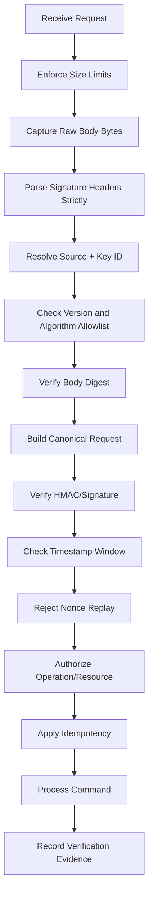
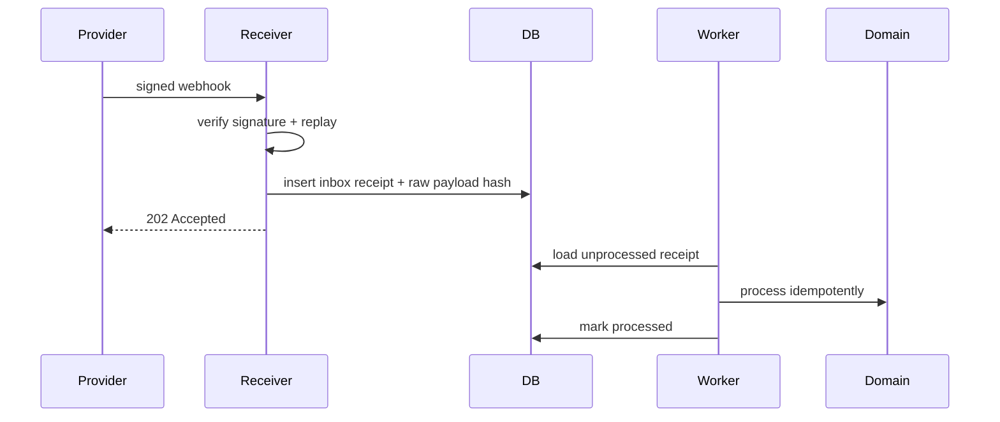
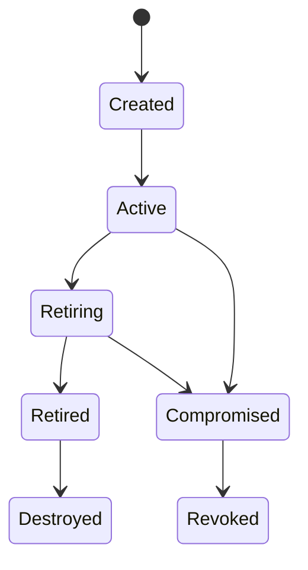

------
title: Learn Java Security, Cryptography and Integrity - Part 022
description: API request signing, webhook verification, HMAC signatures, HTTP Message Signatures, canonicalization, timestamp and nonce replay defense for Java systems.
series: learn-java-security-cryptography-integrity
seriesTitle: Learn Java Security, Cryptography and Integrity
order: 22
partTitle: API Request Signing, Webhooks & Replay Defense
tags:
  - java
  - security
  - api-security
  - hmac
  - signatures
  - webhooks
  - replay-defense
  - integrity
  - canonicalization
date: 2026-06-30
---

# Part 022 — API Request Signing, Webhooks & Replay Defense

> Target: setelah part ini, kamu mampu mendesain dan mengimplementasikan API request signing dan webhook verification di Java: canonical request, HMAC/signature verification, timestamp window, nonce/idempotency replay defense, key rotation, error handling, dan test vectors.

Part ini membahas masalah khusus:

```text
Bagaimana receiver tahu bahwa request benar-benar berasal dari pihak yang dipercaya,
body/header/path/method tidak diubah,
dan request lama tidak dipakai ulang?
```

Kita tidak sedang mengganti TLS. TLS melindungi channel. Request signing melindungi message semantics, terutama ketika request melewati gateway, queue, webhook provider, proxy, retry mechanism, atau asynchronous boundary.

Core invariant:

> A signed request is acceptable only if the source is trusted, the canonical message verifies, the signature algorithm/key are allowed, the scope/audience match, and the message is fresh and non-replayed.

Referensi utama:

- RFC 9421 HTTP Message Signatures: <https://www.rfc-editor.org/rfc/rfc9421>
- RFC 2104 HMAC: <https://www.rfc-editor.org/rfc/rfc2104>
- RFC 8785 JSON Canonicalization Scheme: <https://www.rfc-editor.org/rfc/rfc8785>
- OWASP API Security Top 10 2023: <https://owasp.org/API-Security/editions/2023/en/0x11-t10/>
- OWASP Cryptographic Storage Cheat Sheet: <https://cheatsheetseries.owasp.org/cheatsheets/Cryptographic_Storage_Cheat_Sheet.html>
- OWASP Key Management Cheat Sheet: <https://cheatsheetseries.owasp.org/cheatsheets/Key_Management_Cheat_Sheet.html>
- OWASP REST Security Cheat Sheet: <https://cheatsheetseries.owasp.org/cheatsheets/REST_Security_Cheat_Sheet.html>
- NIST SP 800-63B replay resistance concepts: <https://pages.nist.gov/800-63-4/sp800-63b.html>
- Java `Mac`: <https://docs.oracle.com/en/java/javase/25/docs/api/java.base/javax/crypto/Mac.html>
- Java `Signature`: <https://docs.oracle.com/en/java/javase/25/docs/api/java.base/java/security/Signature.html>
- Java `MessageDigest.isEqual`: <https://docs.oracle.com/en/java/javase/25/docs/api/java.base/java/security/MessageDigest.html>

---

## 1. Kaufman Deconstruction: Request Signing Skill Map

| Capability | Pertanyaan korektif | Output engineering |
|---|---|---|
| Threat model | Apa yang request signing cegah dan tidak cegah? | Explicit trust boundary. |
| Canonicalization | Bytes apa yang sebenarnya ditandatangani? | Canonical request spec. |
| Algorithm choice | HMAC atau asymmetric signature? | Algorithm decision record. |
| Key identification | Key mana yang dipakai? | `kid`/key registry. |
| Verification order | Kapan parse body, verify, authz, dedup? | Verification pipeline. |
| Replay defense | Bagaimana mencegah request lama diterima ulang? | Timestamp + nonce/idempotency. |
| Scope binding | Apakah signature terikat ke method/path/host/body/audience? | Signed component list. |
| Rotation | Bagaimana rotate key tanpa downtime? | Key states + overlap window. |
| Failure handling | Error mana yang 400/401/403/409? | Error taxonomy. |
| Test vectors | Bagaimana memastikan producer/consumer kompatibel? | Canonical test suite. |

Mental shortcut:

```text
Do not sign “an object”. Sign an exact, documented, canonical byte sequence.
```

---

## 2. When Do You Need API Request Signing?

Use request signing when at least one is true:

- webhook receiver accepts calls from external provider;
- internal services exchange high-value commands over async channels;
- request crosses untrusted or semi-trusted proxy/gateway;
- body integrity must survive storage/forwarding;
- regulatory evidence requires source proof;
- bearer tokens are insufficient because possession alone is too weak;
- replay has high impact;
- multi-tenant partner API needs per-partner key isolation;
- you need non-repudiation-like evidence using asymmetric signatures.

You may not need custom request signing when:

- normal user-facing browser traffic already uses TLS + session/OIDC + CSRF;
- service-to-service calls are fully covered by mTLS, workload identity, authorization, and no message persistence/replay risk;
- the data is low impact and retry duplication is harmless;
- a standard protocol already covers the exact need.

Warning:

> Do not invent custom signing unless you can also own canonicalization, key lifecycle, replay cache, test vectors, and operational debugging.

---

## 3. Threat Model: What Request Signing Does and Does Not Do

| Threat | Request signing helps? | Notes |
|---|---:|---|
| Body tampering after sender signs | Yes | If body hash/canonical body is signed. |
| Header/path/method tampering | Yes | Only for signed components. |
| Forged webhook from random attacker | Yes | If key remains secret/private. |
| Replay of captured valid request | Partially | Need timestamp + nonce/idempotency. |
| Credential/key compromise | No | Need key rotation/revocation/detection. |
| Receiver authorization bug | No | Still must authorize resource/action. |
| SSRF toward receiver | Partially | Signature rejects unsigned request, but endpoint exposure remains. |
| TLS MITM | Mostly no | TLS solves channel; signing is message layer. |
| Sensitive data disclosure | No | Signing is not encryption. |
| Malicious trusted sender | No | Valid source can still send bad commands. |

Core mistake:

```text
Signature valid == request authorized.
```

Correct:

```text
Signature valid == request was produced by a key holder and selected bytes were intact.
Authorization still decides whether the operation/resource is allowed.
```

---

## 4. HMAC vs Digital Signature

| Aspect | HMAC | Digital signature |
|---|---|---|
| Key type | Shared secret | Private/public key pair |
| Verification | Same secret | Public key |
| Performance | Fast | Usually slower |
| Operational model | Every verifier can forge | Verifier cannot forge |
| Non-repudiation evidence | Weak | Stronger, depending on PKI and key control |
| Partner integration | Simple but secret sharing risk | More complex but cleaner trust separation |
| Best use | Webhooks, internal shared trust | Cross-org evidence, many verifiers, public verification |

Rule of thumb:

```text
Use HMAC when both sides are in a shared trust relationship and verifier forgery is acceptable.
Use digital signatures when verifiers should not be able to produce valid messages.
```

HMAC algorithms:

```java
HmacSHA256
HmacSHA384
HmacSHA512
```

Signature algorithms depend on compatibility and key management:

```java
RSASSA-PSS
Ed25519
SHA256withECDSA
```

Avoid:

- raw RSA encryption/signature misuse;
- `SHA1withRSA`;
- homegrown MAC `SHA256(secret + message)`;
- algorithm chosen from untrusted header without allowlist.

---

## 5. Canonical Request: The Hard Part

Signing fails in production mostly because producer and consumer disagree about bytes.

A request has many representations:

```text
method: POST vs post
path: /a/%62 vs /a/b
query: ?b=2&a=1 vs ?a=1&b=2
headers: whitespace, casing, duplicates
body: JSON field order, number formatting, Unicode normalization
host: forwarded host vs internal host
```

Therefore define a canonical request format.

Example custom canonical format:

```text
SIGNATURE-V1
method:POST
scheme:https
host:api.receiver.example
path:/v1/cases/123/approve
query:include=audit&tenant=reg-01
content-type:application/json
date:2026-06-30T08:00:00Z
nonce:7f7a6f6a-7d4b-4fa4-80d3-2c3f21b3d5ec
body-sha256:2b4c...
```

Then sign UTF-8 bytes of that exact string.

### 5.1 Signed Components

At minimum for state-changing request:

- HTTP method;
- normalized path;
- canonical query string;
- host/audience;
- content type if relevant;
- body hash;
- timestamp;
- nonce/idempotency key;
- key id;
- algorithm/version.

For partner APIs, also sign:

- tenant/partner id;
- target service/audience;
- resource id;
- request expiry;
- correlation/command id if used for evidence.

### 5.2 Do Not Sign Hop-by-Hop Headers

Avoid signing headers that proxies legitimately modify:

- `Connection`;
- `Keep-Alive`;
- `Transfer-Encoding`;
- `Via`;
- `X-Forwarded-*` unless precisely controlled;
- internal tracing headers unless evidence requires them.

Sign stable application semantics, not transport noise.

---

## 6. HTTP Message Signatures RFC 9421

RFC 9421 defines a mechanism for creating, encoding, and verifying signatures or MACs over HTTP message components. Prefer a standard like this when interoperability matters.

Conceptually, it signs selected HTTP components using structured metadata:

```http
Signature-Input: sig1=("@method" "@path" "content-digest" "date");created=1782806400;keyid="partner-a-key-2026-06"
Signature: sig1=:BASE64_SIGNATURE:
```

Advantages:

- standard component model;
- explicit covered components;
- supports multiple algorithms;
- better interop than ad-hoc headers;
- can sign derived components like method/path.

Still your system must define:

- allowed algorithms;
- required components;
- key lookup by `keyid`;
- replay window;
- nonce/idempotency policy;
- canonical body digest;
- authorization after verification.

---

## 7. Body Digest and JSON Canonicalization

Two strategies:

### Strategy A: Sign Raw Body Bytes

Producer signs exactly the bytes sent.

Pros:

- simplest;
- preserves exact payload;
- no JSON canonicalization ambiguity.

Cons:

- any whitespace reformatting breaks signature;
- proxies/body parsers must not modify body;
- receiver must capture raw body before parsing.

### Strategy B: Sign Canonical JSON

Producer and receiver parse JSON and canonicalize before signing/verifying.

Pros:

- tolerant to formatting;
- semantically cleaner for JSON APIs.

Cons:

- canonicalization is hard;
- number/string/Unicode edge cases;
- parser differences;
- duplicate JSON keys ambiguity;
- more attack surface.

Recommendation:

```text
For webhooks and APIs, sign raw body hash unless you have a strong reason and a standard canonicalization scheme.
```

If using canonical JSON, use a formal scheme such as RFC 8785 and reject ambiguous JSON forms.

---

## 8. Java HMAC Implementation

### 8.1 Sign

```java
public final class HmacSigner {
    private final SecretKey key;

    public HmacSigner(byte[] keyBytes) {
        this.key = new SecretKeySpec(keyBytes, "HmacSHA256");
    }

    public byte[] sign(byte[] canonicalRequest) {
        try {
            Mac mac = Mac.getInstance("HmacSHA256");
            mac.init(key);
            return mac.doFinal(canonicalRequest);
        } catch (GeneralSecurityException e) {
            throw new IllegalStateException("HMAC signing failed", e);
        }
    }
}
```

### 8.2 Verify with Constant-Time Compare

```java
public final class HmacVerifier {
    private final SecretKey key;

    public HmacVerifier(byte[] keyBytes) {
        this.key = new SecretKeySpec(keyBytes, "HmacSHA256");
    }

    public boolean verify(byte[] canonicalRequest, byte[] receivedSignature) {
        try {
            Mac mac = Mac.getInstance("HmacSHA256");
            mac.init(key);
            byte[] expected = mac.doFinal(canonicalRequest);
            return MessageDigest.isEqual(expected, receivedSignature);
        } catch (GeneralSecurityException e) {
            throw new IllegalStateException("HMAC verification failed", e);
        }
    }
}
```

Do not compare signatures with:

```java
Arrays.equals(expected, received); // avoid for secrets/signatures
expectedHex.equals(receivedHex);   // timing differences and encoding issues
```

Use `MessageDigest.isEqual` or a well-reviewed constant-time equivalent.

---

## 9. Request Signing Header Design

Example custom headers:

```http
X-Signature-Version: v1
X-Signature-Algorithm: HmacSHA256
X-Signature-Key-Id: partner-a-2026-06
X-Signature-Timestamp: 2026-06-30T08:00:00Z
X-Signature-Nonce: 7f7a6f6a-7d4b-4fa4-80d3-2c3f21b3d5ec
X-Content-SHA256: 2b4c...
X-Signature: base64url(...)
```

Rules:

- version is mandatory;
- algorithm is allowlisted, never dynamically trusted;
- key id identifies active/retiring key;
- timestamp is server-validated;
- nonce is stored in replay cache;
- content hash is computed from raw body bytes;
- signature is base64url/base64 consistently specified;
- missing/duplicate signature headers are rejected.

Header parsing invariant:

> Be strict. Ambiguity is an attack surface.

Reject:

- multiple `X-Signature` headers unless spec explicitly supports it;
- multiple `Content-Length` inconsistencies;
- unsupported algorithm;
- unknown signature version;
- timestamp outside window;
- nonce reused;
- key id not active for source;
- body hash mismatch.

---

## 10. Canonicalizer Implementation Sketch

```java
public record SigningHeaders(
        String version,
        String algorithm,
        String keyId,
        Instant timestamp,
        String nonce,
        String contentSha256,
        String signature
) {}

public record CanonicalRequest(
        String method,
        String scheme,
        String host,
        String path,
        String query,
        String contentType,
        Instant timestamp,
        String nonce,
        String contentSha256
) {
    public byte[] toBytes() {
        String canonical = String.join("\n",
                "SIGNATURE-V1",
                "method:" + method.toUpperCase(Locale.ROOT),
                "scheme:" + scheme.toLowerCase(Locale.ROOT),
                "host:" + host.toLowerCase(Locale.ROOT),
                "path:" + normalizePath(path),
                "query:" + canonicalQuery(query),
                "content-type:" + normalizeContentType(contentType),
                "date:" + DateTimeFormatter.ISO_INSTANT.format(timestamp),
                "nonce:" + nonce,
                "body-sha256:" + contentSha256
        );
        return canonical.getBytes(StandardCharsets.UTF_8);
    }
}
```

This is illustrative, not a drop-in standard. Production code must specify exact normalization functions and test vectors.

### 10.1 Path Normalization Risk

Path normalization is dangerous. Consider:

```text
/api/a/../admin
/api/%2e%2e/admin
/api/%252e%252e/admin
/api/a%2Fb
```

Recommendation:

- canonicalize path once at the framework boundary;
- reject encoded slash/dot traversal patterns if not needed;
- sign the exact normalized path that router uses;
- avoid producer/consumer disagreement;
- include route template if available for semantic binding.

### 10.2 Query Canonicalization

Specify:

- percent-decoding rules;
- key sort order;
- repeated parameter handling;
- blank values;
- UTF-8 normalization;
- whether unknown parameters are included;
- whether order matters.

Example:

```text
?b=2&a=1&a=0
=> a=0&a=1&b=2
```

But only if both sides agree.

---

## 11. Verification Pipeline

Order matters.



Important choice: check timestamp before signature or after?

- Checking timestamp first can save CPU.
- But do not leak detailed oracle behavior.
- You still need parse safety and key resolution.

For most APIs:

1. size limits;
2. strict header parse;
3. basic timestamp sanity;
4. key lookup;
5. digest/signature verify;
6. replay check;
7. authorization;
8. process.

Never parse untrusted JSON deeply before enforcing size and basic signature structure when endpoint exists solely for signed webhooks. But you need raw body access.

---

## 12. Timestamp Window and Nonce Replay Defense

Timestamp alone is insufficient.

Attack:

```text
Attacker captures valid signed webhook at 08:00:01.
Receiver accepts timestamps within ±5 minutes.
Attacker replays at 08:03:00.
Signature still valid.
Timestamp still valid.
```

Therefore add nonce or idempotency key.

Replay record:

```sql
create table signed_request_nonce (
    source_id varchar(120) not null,
    key_id varchar(120) not null,
    nonce varchar(160) not null,
    signature_hash char(64) not null,
    first_seen_at timestamp with time zone not null,
    expires_at timestamp with time zone not null,
    primary key (source_id, key_id, nonce)
);
```

Java:

```java
public void rejectReplay(SignedRequest request) {
    var expiresAt = request.timestamp().plus(REPLAY_WINDOW);
    try {
        nonceRepository.insert(
                request.sourceId(),
                request.keyId(),
                request.nonce(),
                sha256Hex(request.signatureBytes()),
                clock.instant(),
                expiresAt);
    } catch (DuplicateKeyException e) {
        throw new ReplayDetectedException(request.sourceId(), request.nonce());
    }
}
```

Replay window design:

| Window | Trade-off |
|---|---|
| 30 seconds | Stronger replay control, more clock sensitivity. |
| 5 minutes | Common practical default, larger replay window. |
| 15 minutes | Easier partner integration, weaker replay control. |
| No expiry | Usually unacceptable for signed requests. |

Use NTP/time sync and monitor clock drift.

---

## 13. Webhook Verification

Webhook provider sends event to your endpoint. Your receiver must assume the endpoint is public.

Webhook verification steps:

1. receive raw request body;
2. enforce max body size;
3. parse signature headers;
4. identify provider/account/tenant;
5. resolve signing secret/public key;
6. compute body digest/canonical message;
7. verify signature in constant time;
8. check timestamp window;
9. reject nonce/event replay;
10. validate event schema;
11. authorize provider to affect target resource;
12. process idempotently;
13. return 2xx only after durable acceptance.

### 13.1 Webhook Event ID

Most providers include an event id. Use it for deduplication.

```sql
create table webhook_event_receipt (
    provider varchar(80) not null,
    provider_account_id varchar(120) not null,
    event_id varchar(200) not null,
    event_type varchar(120) not null,
    payload_hash char(64) not null,
    received_at timestamp with time zone not null,
    processed_at timestamp with time zone,
    status varchar(30) not null,
    primary key (provider, provider_account_id, event_id)
);
```

If provider has no event id, use:

```text
provider + account + nonce + timestamp + body hash
```

But this is less robust.

### 13.2 Return Semantics

For webhook endpoint:

- return `2xx` only after durable receipt, not necessarily full processing;
- use internal queue/outbox for async handling;
- duplicate event should return `2xx` after recognizing already processed/accepted;
- invalid signature should return `401` or `400` depending policy;
- do not leak whether a specific tenant/account exists.

Pattern:

```java
@PostMapping("/webhooks/provider-x")
public ResponseEntity<Void> receive(
        HttpServletRequest request,
        @RequestBody byte[] rawBody) {

    var signed = verifier.verify(request, rawBody);
    var event = parser.parseAndValidate(rawBody, signed.provider());

    webhookInbox.acceptIdempotently(signed, event, rawBody);

    return ResponseEntity.accepted().build();
}
```

---

## 14. Inbox Pattern for Webhooks

Do not perform complex business mutation directly inside webhook controller.



Inbox record stores:

- provider;
- provider account;
- event id;
- event type;
- payload hash;
- signature key id;
- signature verification time;
- raw body pointer or encrypted payload;
- processing status;
- failure reason;
- retry count.

This separates **transport acceptance** from **domain processing**.

---

## 15. Authorization After Signature Verification

Valid signature says “this came from Provider X”. It does not say Provider X may update any resource.

Webhook authorization checks:

- provider account maps to tenant;
- event subject belongs to that provider account;
- resource id in payload is linked to tenant/provider;
- event type is allowed;
- event state transition is valid;
- event is not older than local terminal state;
- provider key is active for that account;
- environment matches production/sandbox.

Example:

```java
public void authorizeWebhook(VerifiedWebhook webhook, ProviderEvent event) {
    var binding = providerBindings.requireActive(
            webhook.provider(),
            webhook.providerAccountId(),
            event.tenantId());

    if (!binding.allowedEventTypes().contains(event.type())) {
        throw new ForbiddenWebhookEventException(event.type());
    }

    if (!binding.ownsExternalResource(event.externalResourceId())) {
        throw new ResourceBindingException(event.externalResourceId());
    }
}
```

---

## 16. Key Lookup and Rotation

Signature headers usually include `keyId`/`kid`.

Key registry:

```sql
create table signing_key (
    source_id varchar(120) not null,
    key_id varchar(120) not null,
    algorithm varchar(40) not null,
    key_material_ref varchar(300) not null,
    status varchar(30) not null,
    not_before timestamp with time zone not null,
    not_after timestamp with time zone,
    created_at timestamp with time zone not null,
    primary key (source_id, key_id)
);
```

Key states:



Verification rule:

| Key state | Sign new request | Verify old request |
|---|---:|---:|
| Created | No | No |
| Active | Yes | Yes |
| Retiring | No | Yes within overlap |
| Retired | No | Maybe only for audit, not live request |
| Compromised | No | Usually no; incident-specific |
| Revoked | No | No |

Rotation without downtime:

1. provision new key as `Created`;
2. distribute to sender;
3. activate new key;
4. sender starts signing with new `kid`;
5. receiver verifies both old and new during overlap;
6. mark old as `Retiring`;
7. after replay window + retry horizon, mark old as `Retired`;
8. destroy according to retention policy.

---

## 17. Algorithm Confusion Defense

Never let attacker choose algorithm freely.

Bad:

```java
String alg = request.getHeader("X-Signature-Algorithm");
Mac mac = Mac.getInstance(alg);
```

Better:

```java
public enum SignatureProfile {
    WEBHOOK_V1_HMAC_SHA256("v1", "HmacSHA256");

    private final String version;
    private final String jcaName;
}
```

Verify profile:

```java
var profile = profiles.requireAllowed(headers.version(), headers.algorithm());
var key = keyRegistry.requireActive(headers.sourceId(), headers.keyId(), profile);
```

Protect against:

- `alg=none` style mistakes;
- downgrade from SHA-512 to SHA-1;
- switching HMAC/asymmetric verification path;
- accepting test keys in production;
- accepting wrong key type for algorithm;
- provider-specific algorithm aliases unexpectedly enabled.

---

## 18. Error Handling Without Oracles

Detailed errors help developers and attackers.

External response should be stable:

```json
{
  "error": "invalid_signature"
}
```

Internal logs should be structured:

```json
{
  "event": "signed_request_rejected",
  "reason": "timestamp_outside_window",
  "sourceId": "partner-a",
  "keyId": "partner-a-2026-06",
  "requestId": "...",
  "remoteIpClass": "public",
  "timestampSkewSeconds": 842
}
```

Suggested mapping:

| Failure | External status | Internal reason |
|---|---:|---|
| Missing signature headers | 401/400 | `missing_signature` |
| Unsupported version | 401/400 | `unsupported_signature_version` |
| Unknown key id | 401 | `unknown_key_id` |
| Inactive key | 401 | `inactive_key` |
| Body digest mismatch | 401 | `body_digest_mismatch` |
| Signature mismatch | 401 | `signature_mismatch` |
| Timestamp too old/new | 401 | `timestamp_outside_window` |
| Nonce replay | 409/401 | `replay_detected` |
| Authorized source but forbidden resource | 403 | `source_not_authorized_for_resource` |

Avoid revealing:

- whether tenant id exists;
- which part of canonical string mismatched;
- expected signature;
- key material details;
- internal route mapping.

---

## 19. Observability for Signed Requests

Log enough to debug without leaking secrets.

Safe fields:

- signature version;
- key id;
- source id;
- algorithm profile;
- request id;
- body hash prefix maybe, not full if sensitive correlation risk;
- timestamp skew;
- canonical component names, not full canonical string if it contains sensitive path/query;
- verification result;
- replay status;
- tenant binding result;
- processing status.

Never log:

- HMAC secret;
- private key;
- full signature unless necessary and classified;
- raw sensitive webhook payload;
- authorization tokens;
- password/credential fields;
- canonical string if it includes secrets in query.

Metric examples:

```text
signed_request.verify.success.count{source,version}
signed_request.verify.failure.count{source,reason}
signed_request.timestamp.skew.seconds{source}
signed_request.replay.detected.count{source}
signed_request.key.unknown.count{source}
webhook.inbox.backlog.count{provider}
webhook.processing.failure.count{provider,eventType}
```

Alerts:

- spike in signature mismatch;
- spike in replay detected;
- unknown key id after rotation;
- high timestamp skew for one partner;
- replay cache insert failures;
- inbox backlog exceeds retry horizon.

---

## 20. Testing with Test Vectors

Request signing without test vectors will break across languages.

Create a shared file:

```json
{
  "name": "basic-post-json-v1",
  "method": "POST",
  "scheme": "https",
  "host": "api.receiver.example",
  "path": "/v1/cases/123/approve",
  "query": "tenant=reg-01&include=audit",
  "headers": {
    "content-type": "application/json",
    "x-signature-timestamp": "2026-06-30T08:00:00Z",
    "x-signature-nonce": "7f7a6f6a-7d4b-4fa4-80d3-2c3f21b3d5ec"
  },
  "body": "{\"reason\":\"valid\"}",
  "bodySha256": "...",
  "canonicalRequest": "SIGNATURE-V1\nmethod:POST\n...",
  "signatureBase64": "..."
}
```

Test categories:

| Category | Cases |
|---|---|
| Happy path | valid signature. |
| Body tamper | body changed after signing. |
| Header tamper | timestamp/path/host changed. |
| Query order | same params different order. |
| Duplicate header | reject ambiguity. |
| Old timestamp | outside window. |
| Future timestamp | clock skew abuse. |
| Nonce replay | second request rejected. |
| Unknown key | reject. |
| Retiring key | verify during overlap. |
| Wrong algorithm | reject downgrade. |
| Unicode | canonical UTF-8 behavior. |
| Large body | size limit before heavy work. |

---

## 21. Java Verification Test Example

```java
@Test
void valid_signature_is_accepted_once() {
    var rawBody = "{\"caseId\":\"123\",\"status\":\"approved\"}".getBytes(UTF_8);
    var headers = signedHeaders(rawBody, fixedClock.instant(), nonce());

    var result = verifier.verify(request("POST", "/webhooks/provider-x", headers), rawBody);

    assertThat(result.sourceId()).isEqualTo("provider-x");
    assertThat(result.keyId()).isEqualTo("provider-x-2026-06");
}

@Test
void replayed_nonce_is_rejected() {
    var rawBody = payload();
    var nonce = UUID.randomUUID().toString();
    var headers = signedHeaders(rawBody, fixedClock.instant(), nonce);

    verifier.verify(request(headers), rawBody);

    assertThatThrownBy(() -> verifier.verify(request(headers), rawBody))
        .isInstanceOf(ReplayDetectedException.class);
}

@Test
void same_signature_with_modified_body_is_rejected() {
    var original = "{\"amount\":100}".getBytes(UTF_8);
    var modified = "{\"amount\":900}".getBytes(UTF_8);
    var headers = signedHeaders(original, fixedClock.instant(), nonce());

    assertThatThrownBy(() -> verifier.verify(request(headers), modified))
        .isInstanceOf(SignatureVerificationException.class);
}
```

---

## 22. Spring Boot Raw Body Capture

In many frameworks, request body can be consumed once. Signature verification needs raw bytes.

Options:

- verify in filter using cached request wrapper;
- controller accepts `byte[]`/`String` and parses after verification;
- use framework-specific raw body support;
- avoid reading/parsing body before verification.

Sketch:

```java
@Component
public class SignedWebhookFilter extends OncePerRequestFilter {
    private final WebhookVerifier verifier;

    @Override
    protected void doFilterInternal(
            HttpServletRequest request,
            HttpServletResponse response,
            FilterChain chain) throws ServletException, IOException {

        if (!request.getRequestURI().startsWith("/webhooks/")) {
            chain.doFilter(request, response);
            return;
        }

        var wrapped = new ContentCachingRequestWrapper(request);
        byte[] body = wrapped.getInputStream().readAllBytes();

        verifier.verify(wrapped, body);

        chain.doFilter(wrapped, response);
    }
}
```

Caution: the above is only a sketch. Production needs body size limits and correct re-exposure of cached bytes to downstream handlers.

Simpler controller pattern:

```java
@PostMapping(path = "/webhooks/provider-x", consumes = MediaType.APPLICATION_JSON_VALUE)
public ResponseEntity<Void> receive(HttpServletRequest request, @RequestBody byte[] body) {
    var verified = verifier.verify(request, body);
    var event = eventParser.parse(body);
    inbox.accept(verified, event, body);
    return ResponseEntity.accepted().build();
}
```

---

## 23. Canonicalization Failure Modes

| Failure | Example | Defense |
|---|---|---|
| JSON whitespace | Producer signs compact JSON, proxy pretty prints | Sign raw body as transmitted. |
| JSON duplicate keys | `{"a":1,"a":2}` | Reject duplicate keys. |
| Number formatting | `1`, `1.0`, `1e0` | Use formal canonical JSON or raw body. |
| Unicode normalization | composed vs decomposed characters | Define UTF-8 and normalization policy. |
| Header casing | `Content-Type` vs `content-type` | Lowercase header names. |
| Header whitespace | folding/extra spaces | Strict trim/collapse rules. |
| Query order | `a=1&b=2` vs `b=2&a=1` | Sort with defined rules. |
| URL encoding | `%2F` vs `/` | Define path normalization; reject ambiguous encodings. |
| Host rewriting | external host vs internal service host | Sign configured audience, not arbitrary forwarded host. |
| Body compression | gzip changes bytes | Sign digest over post-decompression or forbid compression; specify. |

The safest system is strict and boring.

---

## 24. Request Signing and Idempotency Together

Signature verification answers:

```text
Was this request produced by a key holder and unmodified?
```

Idempotency answers:

```text
Should this logical command create a new effect or replay existing result?
```

Replay defense answers:

```text
Has this signed message already been accepted?
```

They overlap but are not identical.

Example payment API:

```http
POST /v1/payments
Idempotency-Key: cmd-123
X-Signature-Nonce: nonce-456
```

- `nonce-456` prevents exact signed message replay.
- `cmd-123` makes client retry safe.
- body hash ensures body unchanged.
- aggregate/account authorization ensures resource legitimacy.

Do not use one field for all purposes unless your protocol explicitly defines that semantic.

---

## 25. Partner API Design Example

### Request

```http
POST /v1/tenants/reg-01/cases/9b.../external-evidence
Host: api.regulator.example
Content-Type: application/json
Idempotency-Key: 7a1f...
X-Signature-Version: v1
X-Signature-Algorithm: HmacSHA256
X-Signature-Key-Id: partner-a-2026-06
X-Signature-Timestamp: 2026-06-30T08:00:00Z
X-Signature-Nonce: 37fb...
X-Content-SHA256: d2f4...
X-Signature: wJalrXUtnFEMI...
```

### Canonical request

```text
SIGNATURE-V1
method:POST
scheme:https
host:api.regulator.example
path:/v1/tenants/reg-01/cases/9b.../external-evidence
query:
content-type:application/json
idempotency-key:7a1f...
date:2026-06-30T08:00:00Z
nonce:37fb...
body-sha256:d2f4...
```

### Receiver pipeline

```java
public EvidenceReceipt receive(HttpServletRequest request, byte[] rawBody) {
    sizeLimits.requireAllowed(rawBody.length);

    var signed = signatureVerifier.verify(request, rawBody);
    replayGuard.rejectReplay(signed.replayScope(), signed.nonce(), signed.timestamp());

    var event = evidenceParser.parse(rawBody);
    partnerAuthorization.requireAllowed(signed.sourceId(), event.tenantId(), event.caseId());

    return idempotency.execute(
            IdempotencyScope.of(event.tenantId(), signed.sourceId(), event.caseId(), signed.idempotencyKey()),
            rawBody,
            () -> evidenceService.attachExternalEvidence(event, signed));
}
```

---

## 26. Webhook Provider Differences

Common provider styles:

| Style | Example pattern | Receiver concern |
|---|---|---|
| HMAC over timestamp + raw body | `t.body` | Must capture raw body and check timestamp. |
| HMAC over raw body only | `body` | Add replay defense using event id if available. |
| Asymmetric signature | public key/JWKS | Need key fetch/cache/rotation. |
| JWT-wrapped event | JWS body | Validate issuer/audience/exp/alg/kid. |
| Mutual TLS only | client certificate | Still need event id/idempotency. |
| IP allowlist only | source IP | Weak alone; IP ranges change and do not prove body integrity. |

Do not normalize all providers into one vague “signature valid” flag. Keep provider-specific verification profiles.

```java
public interface WebhookVerificationProfile {
    VerifiedWebhook verify(HttpServletRequest request, byte[] rawBody);
    String provider();
    Set<String> requiredHeaders();
    Duration replayWindow();
}
```

---

## 27. IP Allowlisting Is Not Request Signing

IP allowlists can reduce noise but are not message integrity.

Problems:

- provider IP ranges change;
- NAT/CDN/proxy complexity;
- internal routing may obscure source;
- IP spoofing is not the main web threat, but misconfiguration is common;
- compromised provider infrastructure can still send bad signed-looking traffic;
- IP does not bind request body.

Use as defense-in-depth:

```text
IP allowlist + TLS + signature + replay defense + provider authorization + idempotent processing
```

Not:

```text
IP allowlist instead of signature.
```

---

## 28. Async Message Signing

For queues/topics, the same principles apply.

Message envelope:

```java
public record SignedMessage<T>(
        String version,
        String algorithm,
        String keyId,
        String producer,
        String audience,
        UUID messageId,
        UUID correlationId,
        Instant createdAt,
        Instant expiresAt,
        String payloadHash,
        String signature,
        T payload
) {}
```

Sign canonical envelope fields + canonical payload/hash.

Consumer verifies:

- producer identity;
- audience equals this consumer or topic;
- key active;
- signature;
- expiry;
- message id dedup;
- producer authorization;
- schema;
- domain transition.

Audience binding prevents message reuse across systems:

```text
PaymentAuthorized for service A must not be valid as PaymentAuthorized for service B.
```

---

## 29. Security Review Checklist

For any signed API/webhook:

- [ ] TLS is still required.
- [ ] Signing threat model is documented.
- [ ] Protocol version is mandatory.
- [ ] Algorithm is allowlisted.
- [ ] `kid`/key id is mandatory.
- [ ] Key lookup is scoped to source/partner/tenant.
- [ ] Canonical request format is specified.
- [ ] Signed components include method, path, query, host/audience, timestamp, nonce, body hash.
- [ ] Raw body is captured before parsing if raw-body signing is used.
- [ ] Body size limit is enforced before heavy processing.
- [ ] Signature comparison is constant-time.
- [ ] Timestamp window is enforced.
- [ ] Nonce/event id replay cache exists and uses atomic insert.
- [ ] Signature does not imply authorization.
- [ ] Idempotency is separate from replay defense where needed.
- [ ] Key rotation supports overlap window.
- [ ] Compromised key response exists.
- [ ] Structured logs do not leak secrets.
- [ ] Test vectors exist across languages.
- [ ] Negative tests cover tamper, replay, old timestamp, duplicate headers, wrong key, wrong algorithm.

---

## 30. Common Anti-Patterns

### 30.1 Signing Parsed JSON Map

```java
Map<String, Object> body = objectMapper.readValue(raw, Map.class);
String canonical = body.toString();
```

This is not canonical. Map ordering, number formatting, and nested structures are unstable.

### 30.2 Verifying Signature After Processing

```java
var event = parser.parse(body);
businessService.process(event);
verifier.verify(request, body);
```

Verification must happen before trust-dependent processing.

### 30.3 Timestamp Without Nonce

Timestamp only narrows replay window. It does not prevent replay inside the window.

### 30.4 Secret in Query String

Query strings appear in logs, proxies, browser history, monitoring, and referrers. Do not put signing secrets in query.

### 30.5 Accepting Any Active Key ID Globally

Key id must be scoped:

```text
source + tenant/account + key id + algorithm profile
```

Otherwise one partner key may be confused with another.

### 30.6 Logging Canonical String with Sensitive Query

Canonical strings often include paths/query/body hash and maybe business identifiers. Classify logs accordingly.

---

## 31. Mini-Lab: Build a Webhook Receiver

### Requirements

Implement a receiver for `ProviderX`:

- HMAC-SHA256;
- raw body hash;
- signed components: method, path, host, timestamp, nonce, body hash;
- 5-minute replay window;
- event id dedup;
- key rotation with active/retiring keys;
- inbox table;
- structured rejection logs;
- negative tests.

### Acceptance Criteria

- valid request returns `202`;
- duplicate event returns `202` without duplicate domain effect;
- duplicate nonce returns rejection;
- same event id with different payload hash is security alert;
- old timestamp rejected;
- future timestamp beyond skew rejected;
- body tamper rejected;
- wrong path rejected;
- inactive key rejected;
- unsupported algorithm rejected;
- domain authorization failure does not reveal tenant existence externally.

---

## 32. Decision Record Template

```mdx
# ADR: ProviderX webhooks use HMAC over raw body digest and canonical request v1

## Context
ProviderX sends external enforcement evidence events to a public endpoint. We need source authenticity, body integrity, replay defense, and safe retry handling.

## Decision
Use HMAC-SHA256 with per-provider-account secret. Receiver verifies canonical request v1 containing method, host, path, timestamp, nonce, and body SHA-256. Receiver enforces 5-minute timestamp window and nonce replay cache. Event id is stored in webhook inbox for idempotent processing. Keys support Active and Retiring states.

## Consequences
Formatting changes to raw body break signatures. Provider integration must use shared test vectors. Replay cache storage is required. Signature verification does not replace tenant/resource authorization.
```

---

## 33. Summary

API request signing and webhook verification are useful only when treated as a full protocol, not a helper function.

You should now be able to design:

- HMAC vs digital signature decision;
- canonical request format;
- raw body digest verification;
- HTTP Message Signatures awareness;
- timestamp and nonce replay defense;
- key id lookup and rotation;
- webhook inbox pattern;
- authorization after verification;
- structured error handling;
- observability without secret leakage;
- test vectors and negative tests.

Key principle:

> Request signing proves selected bytes were produced by a key holder. Production integrity still requires freshness, replay defense, authorization, idempotency, and domain validation.

Next:

- **Part 023 — Tamper-Evident Logs, Audit Trails & Evidence**
