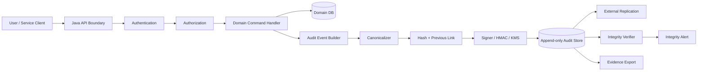
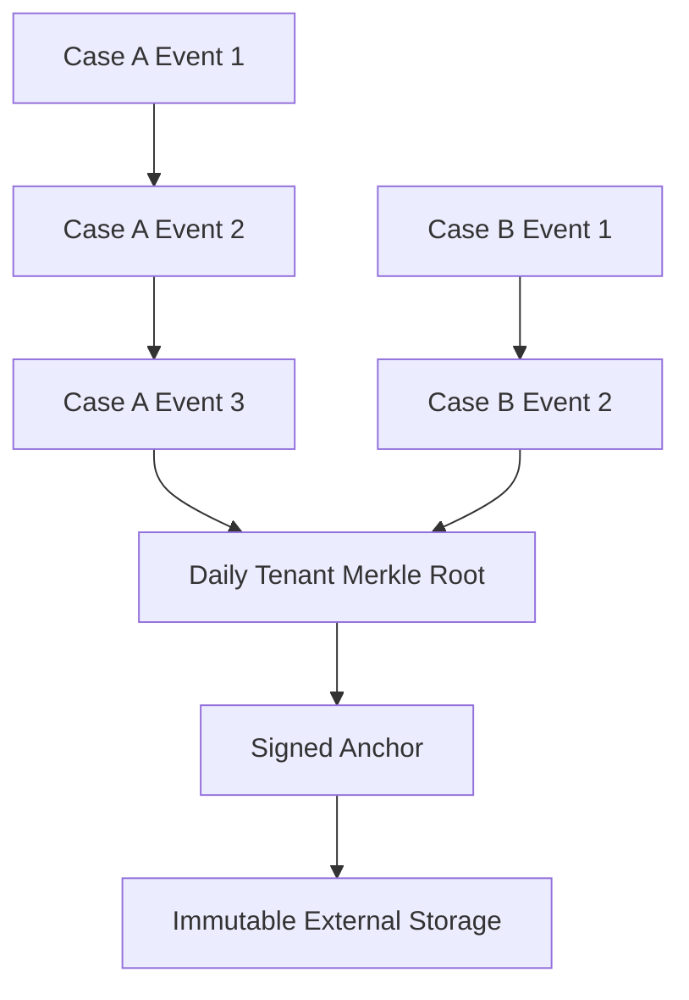
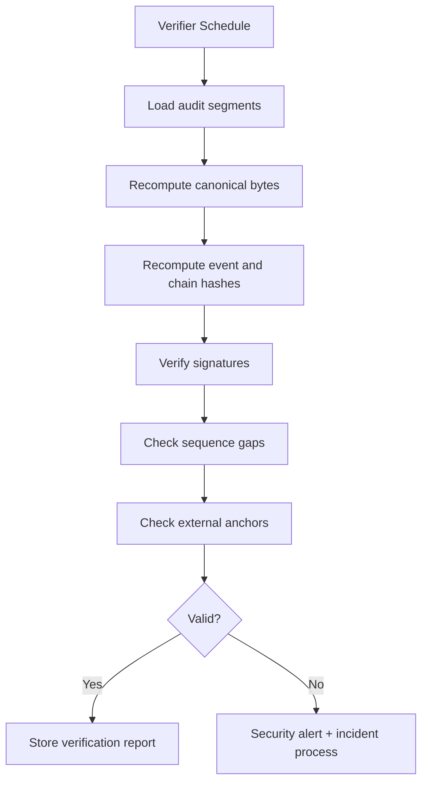
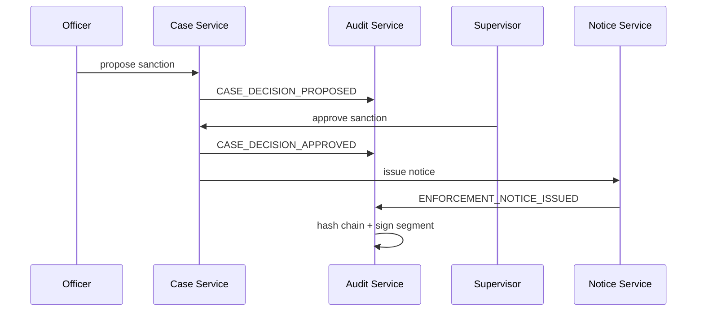

------
title: Learn Java Security, Cryptography and Integrity - Part 023
description: Tamper-evident audit trails, append-only event design, hash chains, evidence packets, log signing, regulatory defensibility, and forensic readiness for Java systems.
series: learn-java-security-cryptography-integrity
seriesTitle: Learn Java Security, Cryptography and Integrity
order: 23
partTitle: Tamper-Evident Logs, Audit Trails & Evidence
tags:
  - java
  - security
  - audit
  - logs
  - integrity
  - evidence
  - tamper-evident
  - forensics
  - compliance
date: 2026-06-30
---

# Part 023 — Tamper-Evident Logs, Audit Trails & Evidence

> Target: setelah part ini, kamu mampu mendesain audit trail Java yang defensible: event apa yang harus dicatat, bagaimana menjaga integritasnya, bagaimana membuatnya tamper-evident, bagaimana memverifikasi ulang chain, dan bagaimana mengubah log menjadi evidence packet yang bisa dipakai untuk investigasi, regulator, dispute, atau post-incident review.

Part ini bukan sekadar “tambahkan logging”. Kita membahas log sebagai **evidence system**.

Dalam sistem regulasi, finansial, enforcement lifecycle, case management, eligibility, entitlement, fraud review, atau workflow kritikal, pertanyaan yang harus bisa dijawab bukan hanya:

```text
Apa yang terjadi?
```

Tetapi:

```text
Siapa melakukan apa, atas authority apa, terhadap entity mana,
pada state/version mana, melalui channel mana, dengan input apa,
diproses oleh service/version mana, menghasilkan keputusan apa,
dan bagaimana kita tahu catatan itu tidak dimanipulasi setelah kejadian?
```

Core invariant:

> Audit evidence is trustworthy only when event semantics are explicit, ordering is explainable, identity and authority are bound to the action, records are append-only, integrity can be independently verified, and retention/access controls preserve the chain of custody.

Referensi utama:

- OWASP Logging Cheat Sheet: <https://cheatsheetseries.owasp.org/cheatsheets/Logging_Cheat_Sheet.html>
- OWASP Logging Vocabulary Cheat Sheet: <https://cheatsheetseries.owasp.org/cheatsheets/Logging_Vocabulary_Cheat_Sheet.html>
- OWASP Top 10 A09 Security Logging and Monitoring Failures: <https://owasp.org/Top10/2021/A09_2021-Security_Logging_and_Monitoring_Failures/>
- NIST SP 800-92 Guide to Computer Security Log Management: <https://csrc.nist.gov/pubs/sp/800/92/final>
- NIST SP 800-61r2 Computer Security Incident Handling Guide: <https://csrc.nist.gov/pubs/sp/800/61/r2/final>
- NIST SP 800-57 Part 1 Rev. 5 Key Management: <https://csrc.nist.gov/pubs/sp/800/57/pt1/r5/final>
- RFC 8785 JSON Canonicalization Scheme: <https://www.rfc-editor.org/rfc/rfc8785>
- RFC 3161 Time-Stamp Protocol: <https://www.rfc-editor.org/rfc/rfc3161>
- Java `MessageDigest`: <https://docs.oracle.com/en/java/javase/25/docs/api/java.base/java/security/MessageDigest.html>
- Java `Mac`: <https://docs.oracle.com/en/java/javase/25/docs/api/java.base/javax/crypto/Mac.html>
- Java `Signature`: <https://docs.oracle.com/en/java/javase/25/docs/api/java.base/java/security/Signature.html>

---

## 1. Kaufman Deconstruction: Audit Integrity Skill Map

| Capability | Pertanyaan korektif | Output engineering |
|---|---|---|
| Event semantics | Event ini membuktikan fakta apa? | Audit event taxonomy. |
| Actor binding | Siapa actor efektif dan delegated authority-nya? | Actor/authority model. |
| Object binding | Entity, version, tenant, dan business key mana yang berubah? | Target object model. |
| Decision traceability | Kenapa keputusan dibuat? | Reason code + policy version. |
| Append-only design | Siapa yang bisa mengubah audit setelah ditulis? | Write-once/append-only store. |
| Tamper evidence | Bagaimana perubahan terdeteksi? | Hash chain/Merkle/signature. |
| Ordering | Bagaimana menjelaskan urutan event lintas service? | Timestamp + sequence + correlation. |
| Confidentiality | Apakah log bocor data sensitif? | Redaction/tokenization/access control. |
| Retention | Berapa lama evidence harus disimpan? | Retention and legal hold policy. |
| Verification | Bisakah pihak lain memverifikasi evidence? | Verification tool + evidence packet. |

Kaufman-style learning objective:

```text
Bukan hafal library logging.
Bangun kemampuan melihat “audit gap” dalam desain sistem.
```

Audit gap adalah keadaan ketika sistem benar-benar melakukan sesuatu, tetapi tidak memiliki catatan yang cukup kuat untuk membuktikan:

- siapa melakukan aksi;
- aksi dilakukan terhadap object mana;
- authority apa yang dipakai;
- state/version sebelum dan sesudah;
- aturan/decision model yang dipakai;
- apakah event dapat dimanipulasi setelah kejadian.

---

## 2. Log, Audit Trail, Security Event, dan Evidence: Jangan Dicampur

Banyak sistem gagal karena semua disebut “log”. Padahal kategorinya berbeda.

| Jenis catatan | Tujuan utama | Contoh | Retention | Integrity requirement |
|---|---|---|---|---|
| Application log | Debugging/operability | exception, latency, SQL timeout | pendek-sedang | medium |
| Security event | Detection/response | failed login, token replay, suspicious IP | sedang | high |
| Audit trail | Accountability/compliance | approve case, change entitlement, override decision | panjang | very high |
| Evidence record | Dispute/regulatory proof | signed decision packet, review trail | panjang/legal hold | very high + chain of custody |
| Business event | Domain processing | case submitted, payment settled | tergantung domain | high jika menjadi source of truth |

Mental model:

```text
Application log explains system behavior.
Audit trail proves accountability.
Evidence proves a defensible fact under dispute.
```

Jangan memakai application logs sebagai satu-satunya audit trail untuk aksi kritikal. Application logs sering:

- berubah format;
- sampling;
- tidak lengkap;
- bisa hilang saat rolling;
- terlalu noisy;
- memuat data sensitif;
- tidak append-only;
- tidak punya event semantics stabil.

Audit trail harus menjadi domain artifact dengan schema, invariant, owner, retention, verification, dan governance.

---

## 3. Threat Model untuk Audit Trail

Audit trail diserang karena ia mengandung bukti. Threat model-nya berbeda dari log biasa.

| Threat | Contoh | Dampak | Control utama |
|---|---|---|---|
| Deletion | Admin menghapus event approval | evidence hilang | append-only + external replication |
| Modification | `decision=REJECTED` diganti `APPROVED` | fakta palsu | hash chain/signature |
| Insertion | event backdated dimasukkan | timeline palsu | monotonic sequence + timestamp authority |
| Reordering | event override dipindah sebelum approval | narrative palsu | previous hash + sequence |
| Selective omission | hanya event menguntungkan yang diekspor | evidence bias | range proof + completeness check |
| Actor spoofing | service menulis actor user tanpa proof | attribution palsu | actor context from trusted auth boundary |
| Reason spoofing | reason code tidak sesuai policy | invalid decision proof | policy version + decision input hash |
| Log injection | newline/control char membuat fake event | investigation confusion | structured logging + encoding |
| Sensitive leakage | PII/secret masuk log | breach/compliance risk | redaction + classification |
| Time manipulation | server clock diubah | timeline tidak defensible | trusted timestamp/clock sync |
| Key compromise | signer key bocor | forged audit events | KMS/HSM + key rotation + compromise window |

Security invariant:

```text
A privileged operator may administer infrastructure,
but must not be able to silently rewrite the accountability record.
```

Ini tidak berarti admin tidak bisa melakukan damage. Artinya damage harus **terdeteksi**, terbatas, dan bisa dijelaskan.

---

## 4. Audit Event Taxonomy: Apa yang Wajib Dicatat?

Audit event harus dipilih berdasarkan **risk**, bukan berdasarkan apa yang mudah dilog.

### 4.1 Identity and access events

- login success/failure;
- MFA enrollment/change;
- passkey enrollment/removal;
- password reset request/complete;
- privilege grant/revoke;
- role/policy change;
- session revocation;
- token replay detection;
- break-glass access.

### 4.2 Domain-critical lifecycle events

Untuk case management/regulatory systems:

- case created/submitted;
- evidence uploaded/removed/reclassified;
- task assigned/reassigned/escalated;
- deadline changed;
- decision proposed;
- decision approved/rejected;
- manual override;
- enforcement action issued;
- sanction modified;
- appeal received;
- case reopened/closed;
- external notification sent;
- data correction performed.

### 4.3 Policy and configuration events

- rule version published;
- workflow definition changed;
- threshold changed;
- jurisdiction mapping changed;
- SLA/escalation config changed;
- feature flag changed for security-sensitive path;
- signer/truststore/key changed.

### 4.4 Data access events

Tidak semua read harus diaudit dengan tingkat sama. Audit read ketika:

- data sensitif/regulated;
- bulk export;
- privileged view;
- cross-tenant access;
- access by support/admin;
- access after case closure;
- access outside assigned team;
- access through emergency mode.

### 4.5 System and integration events

- webhook verification failed;
- API request signature invalid;
- inbound message duplicated/replayed;
- external system response accepted/rejected;
- reconciliation mismatch;
- schema version rejected;
- data import/export started/completed/failed;
- integrity verification failure.

Anti-pattern:

```text
Audit everything.
```

Itu terdengar aman, tetapi sering menghasilkan biaya besar, noise, privacy risk, dan investigasi buruk. Yang benar:

```text
Audit every security/accountability decision and every mutation that changes rights, obligations, evidence, state, or money.
```

---

## 5. Audit Event Schema: Minimal yang Defensible

Audit event harus memiliki schema yang stabil. Contoh field minimum:

| Field | Tujuan |
|---|---|
| `eventId` | unique immutable event id |
| `eventType` | controlled vocabulary |
| `occurredAt` | waktu domain event terjadi |
| `recordedAt` | waktu audit record ditulis |
| `tenantId` | isolation and governance |
| `actor` | human/service/system actor |
| `authority` | role, delegation, policy, consent, mandate |
| `subject` | principal impacted jika berbeda dari actor |
| `action` | verb stabil: `APPROVE`, `OVERRIDE`, `REVOKE` |
| `object` | entity type/id/version |
| `outcome` | success/failure/denied/partial |
| `reasonCode` | controlled explanation |
| `policyVersion` | rule/policy version used |
| `requestId` | request correlation |
| `traceId` | distributed trace correlation |
| `source` | service/app/node/build version |
| `inputHash` | hash dari input penting, bukan payload sensitif lengkap |
| `beforeHash` | hash state before jika relevan |
| `afterHash` | hash state after jika relevan |
| `prevAuditHash` | link ke event sebelumnya |
| `auditHash` | hash canonical audit record |
| `signature` | optional HMAC/digital signature |
| `keyId` | signer key id |
| `schemaVersion` | evolusi schema |

Contoh event:

```json
{
  "schemaVersion": "audit.case.v3",
  "eventId": "01JZ0K4X9BN7E1N3G7YF5QT9V8",
  "eventType": "CASE_DECISION_APPROVED",
  "occurredAt": "2026-06-30T08:00:42.120Z",
  "recordedAt": "2026-06-30T08:00:42.245Z",
  "tenantId": "regulator-id",
  "actor": {
    "type": "HUMAN",
    "principalId": "user-7421",
    "authSessionId": "sess-9f2...",
    "assuranceLevel": "PHISHING_RESISTANT_MFA"
  },
  "authority": {
    "mode": "ROLE_AND_DELEGATION",
    "role": "CASE_SUPERVISOR",
    "delegationId": "del-2026-06",
    "policyVersion": "authz-policy-83"
  },
  "action": "APPROVE_DECISION",
  "object": {
    "type": "CASE",
    "id": "case-2026-000194",
    "version": 17
  },
  "outcome": "SUCCESS",
  "reasonCode": "EVIDENCE_SUFFICIENT",
  "requestId": "req-4340ad",
  "traceId": "2e5bd7f3a5b44d1a",
  "source": {
    "service": "case-decision-service",
    "build": "2026.06.30+sha.4a76c91"
  },
  "inputHash": "sha256:...",
  "beforeHash": "sha256:...",
  "afterHash": "sha256:...",
  "prevAuditHash": "sha256:...",
  "auditHash": "sha256:...",
  "signature": "base64url:...",
  "keyId": "audit-signing-2026-q2"
}
```

Important distinction:

- `occurredAt`: kapan domain action terjadi.
- `recordedAt`: kapan audit system mencatat.
- `prevAuditHash`: link chain.
- `auditHash`: hash record canonical.
- `signature`: bukti bahwa record dibuat oleh component yang memegang signing key saat itu.

---

## 6. Actor, Authority, Subject: Jangan Disederhanakan

Banyak audit trail hanya menyimpan `createdBy`. Itu tidak cukup.

Dalam sistem nyata:

- user bisa acting as organisasi;
- service bisa acting on behalf of user;
- admin bisa support impersonation;
- supervisor bisa delegated authority;
- automated rule engine bisa membuat keputusan;
- batch job bisa memproses data dari external authority;
- API client bisa merepresentasikan partner institution.

Gunakan minimal tiga konsep:

```text
Actor     = entity yang menjalankan aksi.
Authority = hak/mandate yang membuat aksi sah.
Subject   = entity yang terkena dampak jika berbeda.
```

Contoh:

| Scenario | Actor | Authority | Subject |
|---|---|---|---|
| Citizen updates profile | citizen user | own-account ownership | same citizen |
| Case officer edits case | officer | assigned case role | regulated party |
| Supervisor approves sanction | supervisor | delegated supervisor authority | regulated party |
| Rule engine escalates case | service | published workflow rule v12 | case |
| Support views customer data | support agent | break-glass ticket | customer |
| Partner submits report | API client | partner certificate + agreement | reporting institution |

Audit event harus menjelaskan authority, bukan hanya identity.

Anti-pattern:

```java
log.info("approved by {}", userId);
```

Lebih baik:

```java
audit.record(CaseDecisionApproved.builder()
    .actor(Actor.human(userId, sessionId, assuranceLevel))
    .authority(Authority.roleDelegation("CASE_SUPERVISOR", delegationId, policyVersion))
    .object(AuditObject.caseId(caseId, version))
    .reasonCode("EVIDENCE_SUFFICIENT")
    .decisionInputHash(inputHash)
    .build());
```

---

## 7. Architecture: Audit as a First-Class Subsystem

Jangan membuat audit sebagai side-effect logging di tiap controller tanpa kontrak. Buat subsystem.



Design choice:

- audit event creation should happen close to domain decision;
- audit storage should be append-only;
- audit verification should be independent from writer;
- audit export should include enough metadata to verify integrity later;
- audit system should be observable but not expose secrets/PII unnecessarily.

---

## 8. Transaction Boundary: Audit and Domain State

Critical question:

```text
Jika domain mutation commit tapi audit gagal, apa yang terjadi?
Jika audit commit tapi domain mutation rollback, apa yang terjadi?
```

Ada tiga common models.

### 8.1 Same database transaction

```text
BEGIN
  update case
  insert audit_event
COMMIT
```

Pros:

- strong atomicity;
- simple query model;
- good for monolith/modular monolith.

Cons:

- attacker with DB write access may alter both;
- append-only enforcement harus kuat;
- cross-service audit sulit.

Use when:

- domain and audit in same service boundary;
- DB permissions can enforce insert-only audit table;
- later replication/signing still exists.

### 8.2 Transactional outbox

```text
BEGIN
  update case
  insert outbox audit command
COMMIT
publisher -> audit service
```

Pros:

- reliable across service boundary;
- decouples audit storage;
- works for microservices.

Cons:

- audit is eventually recorded;
- need gap detection and retry;
- `occurredAt` and `recordedAt` may differ.

Use when:

- distributed systems;
- central audit service;
- event-driven architecture.

### 8.3 Synchronous external audit service

```text
domain service -> audit service -> domain commit?
```

Pros:

- central policy;
- immediate rejection if audit unavailable.

Cons:

- availability coupling;
- complex rollback semantics;
- latency.

Use only for very high-criticality flows where audit failure must block action.

Practical recommendation:

```text
For most enterprise Java systems:
use local transactional outbox + central append-only audit service + independent verifier.
```

---

## 9. Tamper-Evident Design Patterns

Tamper-evident does not mean tamper-proof. It means manipulation is detectable.

### 9.1 Per-record hash

Each audit record stores hash of canonical content.

```text
auditHash = SHA-256(canonicalAuditRecordWithoutAuditHashAndSignature)
```

Detects content modification, but not deletion/reordering.

### 9.2 Hash chain

Each record includes previous record hash.

```text
auditHash[i] = SHA-256(canonical(record[i]) || auditHash[i-1])
```

Detects modification, deletion, and reordering within chain.

### 9.3 HMAC chain

Use HMAC if verifier is internal and shared secret can be protected.

```text
auditMac[i] = HMAC(key, canonical(record[i]) || auditMac[i-1])
```

Pros:

- fast;
- good for internal audit store;
- simple key rotation.

Cons:

- verifier with same key can forge;
- weaker external non-repudiation.

### 9.4 Digital signature

Use private key to sign record hash or batch root.

```text
signature = Sign(privateKey, auditHash or merkleRoot)
```

Pros:

- public verification possible;
- stronger separation of signer and verifier;
- better evidence export.

Cons:

- slower;
- key management harder;
- requires certificate/trust model.

### 9.5 Merkle tree batch

Batch events into Merkle tree, store root, sign root.

```text
hourlyRoot = MerkleRoot(eventHash[0..n])
signature = Sign(key, hourlyRoot)
```

Pros:

- efficient verification for large volume;
- supports inclusion proof;
- good for anchoring.

Cons:

- more complex;
- completeness proof must be designed carefully.

### 9.6 External anchoring

Periodically anchor chain head/root outside primary system:

- separate account/cloud project;
- object storage immutable bucket;
- external timestamp authority;
- WORM storage;
- transparency log;
- offline export;
- regulator-owned repository.

Purpose:

```text
Even if primary audit store is compromised later,
attacker cannot silently rewrite history before the last external anchor.
```

---

## 10. Chain Granularity: Global, Tenant, Entity, or Stream?

One global hash chain is simple but may bottleneck. Multiple chains scale better.

| Chain model | Pros | Cons | Good for |
|---|---|---|---|
| Global chain | simple total order | bottleneck; cross-region hard | low-medium volume |
| Tenant chain | isolation; scalable | cross-tenant ordering harder | SaaS/regulatory tenants |
| Entity chain | easy evidence per case | many chains; gap management | case management |
| Stream partition chain | high throughput | ordering by partition only | event platforms |
| Batch Merkle root | scalable verification | more complex proof | high-volume logs |

For regulatory case management, combine:

```text
entity-level chain for case evidence
+ tenant-level periodic root
+ external daily anchor
```



This supports:

- efficient case-specific verification;
- tenant-level completeness;
- external tamper evidence.

---

## 11. Canonicalization for Audit Hashing

Never hash arbitrary `toString()` or raw JSON produced by unstable serialization.

Bad:

```java
byte[] hash = sha256(auditEvent.toString().getBytes(StandardCharsets.UTF_8));
```

Why bad:

- field order may change;
- whitespace may change;
- timezone formatting may change;
- map order may change;
- locale may change;
- null handling may change;
- library upgrade may alter output.

Better:

```text
1. Define canonical audit representation.
2. Use stable schema version.
3. Sort object keys deterministically.
4. Use UTC timestamps with fixed precision.
5. Normalize strings when policy requires it.
6. Exclude mutable fields such as signature from signed payload.
7. Include schemaVersion and algorithm metadata.
```

For JSON, RFC 8785 JCS is a useful reference. But the broader invariant matters more:

```text
Verifier must reconstruct exactly the same bytes from the same semantic event.
```

---

## 12. Java Model: Audit Event as Immutable Domain Object

Use immutable records/value objects. Do not pass mutable maps around.

```java
import java.time.Instant;
import java.util.Map;

public record AuditEvent(
    String schemaVersion,
    String eventId,
    String eventType,
    Instant occurredAt,
    Instant recordedAt,
    String tenantId,
    AuditActor actor,
    AuditAuthority authority,
    AuditObject object,
    String action,
    String outcome,
    String reasonCode,
    String requestId,
    String traceId,
    AuditSource source,
    String inputHash,
    String beforeHash,
    String afterHash,
    String previousHash,
    Map<String, String> attributes
) {}

public record AuditActor(
    String type,
    String principalId,
    String sessionId,
    String assuranceLevel
) {}

public record AuditAuthority(
    String mode,
    String role,
    String delegationId,
    String policyVersion
) {}

public record AuditObject(
    String type,
    String id,
    long version
) {}

public record AuditSource(
    String service,
    String instanceId,
    String buildVersion
) {}
```

Rules:

- no setters;
- no lazy mutation;
- no post-write enrichment that changes signed content;
- no raw secrets;
- all optional fields explicitly modeled;
- all enums controlled by schema.

---

## 13. Java Example: Canonical JSON Hashing Interface

In production, use a proven canonicalization library or an internal canonicalizer with test vectors. The key design is to isolate canonicalization as a contract.

```java
public interface AuditCanonicalizer {
    byte[] canonicalize(AuditEvent event);
}

public interface AuditHasher {
    String hash(byte[] canonicalBytes);
}

public final class Sha256AuditHasher implements AuditHasher {
    @Override
    public String hash(byte[] canonicalBytes) {
        try {
            var digest = java.security.MessageDigest.getInstance("SHA-256");
            byte[] hash = digest.digest(canonicalBytes);
            return "sha256:" + java.util.Base64.getUrlEncoder()
                    .withoutPadding()
                    .encodeToString(hash);
        } catch (java.security.NoSuchAlgorithmException e) {
            throw new IllegalStateException("SHA-256 unavailable", e);
        }
    }
}
```

The canonicalizer must be deterministic across:

- JVM versions;
- library upgrades;
- map insertion order;
- locale;
- timezone;
- default charset;
- null/default field behavior.

Test vector example:

```text
Input event: audit.case.v3 CASE_DECISION_APPROVED ...
Canonical bytes hex: 7b22616374696f6e223a22415050524f... 
SHA-256: sha256:u3zB...
Expected signature: base64url:MEUCIG...
```

If you cannot produce stable test vectors, your audit integrity scheme is not ready.

---

## 14. Java Example: Hash Chain Builder

```java
public record ChainedAuditRecord(
    AuditEvent event,
    String canonicalHash,
    String chainHash,
    String algorithm
) {}

public final class AuditChainBuilder {
    private final AuditCanonicalizer canonicalizer;

    public AuditChainBuilder(AuditCanonicalizer canonicalizer) {
        this.canonicalizer = canonicalizer;
    }

    public ChainedAuditRecord append(AuditEvent event, String previousChainHash) {
        byte[] eventBytes = canonicalizer.canonicalize(event);
        byte[] previousBytes = previousChainHash.getBytes(java.nio.charset.StandardCharsets.US_ASCII);

        try {
            var digest = java.security.MessageDigest.getInstance("SHA-256");
            byte[] eventHash = digest.digest(eventBytes);

            digest.reset();
            digest.update("audit-chain-v1".getBytes(java.nio.charset.StandardCharsets.US_ASCII));
            digest.update((byte) 0x00);
            digest.update(previousBytes);
            digest.update((byte) 0x00);
            digest.update(eventHash);
            byte[] chainHash = digest.digest();

            var enc = java.util.Base64.getUrlEncoder().withoutPadding();
            return new ChainedAuditRecord(
                event,
                "sha256:" + enc.encodeToString(eventHash),
                "sha256:" + enc.encodeToString(chainHash),
                "SHA-256/audit-chain-v1"
            );
        } catch (java.security.NoSuchAlgorithmException e) {
            throw new IllegalStateException("SHA-256 unavailable", e);
        }
    }
}
```

Note the domain separation string:

```text
audit-chain-v1
```

This prevents reusing the same hash bytes across different protocol meanings.

---

## 15. Java Example: HMAC-Signed Audit Record

Use HMAC when verification remains internal and key is protected in KMS/HSM or secret manager.

```java
import javax.crypto.Mac;
import javax.crypto.SecretKey;
import java.nio.charset.StandardCharsets;
import java.util.Base64;

public final class AuditMacSigner {
    private final SecretKey key;
    private final String keyId;

    public AuditMacSigner(SecretKey key, String keyId) {
        this.key = key;
        this.keyId = keyId;
    }

    public SignedAuditRecord sign(ChainedAuditRecord record) {
        try {
            Mac mac = Mac.getInstance("HmacSHA256");
            mac.init(key);
            mac.update("audit-record-signature-v1".getBytes(StandardCharsets.US_ASCII));
            mac.update((byte) 0x00);
            mac.update(record.chainHash().getBytes(StandardCharsets.US_ASCII));
            byte[] signature = mac.doFinal();

            return new SignedAuditRecord(
                record,
                keyId,
                "HmacSHA256",
                Base64.getUrlEncoder().withoutPadding().encodeToString(signature)
            );
        } catch (Exception e) {
            throw new IllegalStateException("Audit MAC signing failed", e);
        }
    }
}

public record SignedAuditRecord(
    ChainedAuditRecord record,
    String keyId,
    String algorithm,
    String signature
) {}
```

Verification must use constant-time comparison:

```java
boolean same = java.security.MessageDigest.isEqual(expectedMac, suppliedMac);
```

Operational rule:

```text
The audit writer may request signing.
It should not be able to export raw signing key material.
```

---

## 16. Digital Signature vs HMAC for Audit

| Criteria | HMAC | Digital signature |
|---|---|---|
| Performance | high | lower |
| Verification | requires same secret | public key |
| External evidence | weaker | stronger |
| Key sharing risk | higher | lower |
| Non-repudiation claim | not appropriate | possible but still legal/process-dependent |
| Good for | internal tamper evidence | evidence export, regulator verification |

Do not overclaim.

Digital signatures do not magically create legal non-repudiation. They support technical integrity and signer authentication. Legal defensibility also needs:

- key custody;
- identity proofing;
- certificate/trust policy;
- audit process;
- time evidence;
- chain of custody;
- incident handling.

---

## 17. Append-Only Storage Design

Audit integrity fails if anyone can update/delete records silently.

### 17.1 Database controls

Use database-level constraints:

```sql
CREATE TABLE audit_event (
  tenant_id           text NOT NULL,
  chain_id            text NOT NULL,
  sequence_no         bigint NOT NULL,
  event_id            text NOT NULL,
  occurred_at         timestamptz NOT NULL,
  recorded_at         timestamptz NOT NULL,
  event_type          text NOT NULL,
  canonical_payload   bytea NOT NULL,
  event_hash          text NOT NULL,
  previous_chain_hash text NOT NULL,
  chain_hash          text NOT NULL,
  key_id              text,
  signature_algorithm text,
  signature           text,
  created_at          timestamptz NOT NULL DEFAULT now(),
  PRIMARY KEY (tenant_id, chain_id, sequence_no),
  UNIQUE (tenant_id, event_id),
  UNIQUE (tenant_id, chain_id, chain_hash)
);
```

Enforce:

- application DB user can insert only;
- no update/delete permission;
- migration/admin path logged separately;
- database audit enabled;
- periodic export to immutable storage.

### 17.2 Immutable object storage

Write segments:

```text
/tenant/{tenantId}/audit/{chainId}/date=2026-06-30/segment-000120.jsonl
/tenant/{tenantId}/audit/{chainId}/date=2026-06-30/segment-000120.manifest.json
/tenant/{tenantId}/audit/{chainId}/date=2026-06-30/segment-000120.sig
```

Manifest contains:

- start sequence;
- end sequence;
- first previous hash;
- last chain hash;
- event count;
- content hash;
- signer key id;
- service build;
- export time.

Use immutable bucket policies/object lock/WORM where available. But remember:

```text
Storage immutability protects after write.
It does not prove that the writer wrote correct event semantics.
```

You still need domain-level audit schema.

---

## 18. Ordering and Time: Be Precise

Audit systems often overtrust timestamps. Distributed systems do not have perfect time.

Use multiple ordering indicators:

| Field | Meaning |
|---|---|
| `occurredAt` | domain event time |
| `recordedAt` | audit ingestion time |
| `sequenceNo` | chain-local monotonic order |
| `previousHash` | cryptographic predecessor |
| `traceId` | distributed request correlation |
| `causationId` | command/event causing this event |
| `correlationId` | business process correlation |
| `externalTimestampToken` | optional trusted timestamp evidence |

Never rely on timestamp alone for ordering critical events.

Better invariant:

```text
Within a chain, sequenceNo and previousHash define order.
Across chains, correlation/causation explain relationship, not total order.
```

---

## 19. Completeness: The Hard Part

Tamper detection often proves “this record was not altered”, but not “there are no missing records”. Completeness requires additional design.

Controls:

- monotonic sequence per chain;
- gap detection;
- expected event count in segment manifest;
- source outbox reconciliation;
- domain mutation requires audit outbox row;
- periodic control totals;
- independent verifier scans;
- external anchors;
- immutable export manifests.

Verifier checks:

```text
for each chain:
  sequence starts from expected checkpoint
  each next sequence increments by 1
  previousHash matches prior chainHash
  canonical payload hash matches eventHash
  signature verifies
  segment manifest count matches actual count
  anchor hash matches external anchor
```

Completeness is an operational property, not just a cryptographic property.

---

## 20. Evidence Packet Design

When exporting evidence for a case, do not send raw logs only. Build an evidence packet.

Example packet structure:

```text
evidence-case-2026-000194/
  README.md
  manifest.json
  audit-events.jsonl
  audit-events.canonical.sha256
  chain-proof.json
  signatures/
    segment-000120.sig
    segment-000121.sig
    signer-cert.pem
  domain-snapshots/
    case-before-decision.json
    case-after-decision.json
  policy/
    authz-policy-83.json
    workflow-definition-42.bpmn
    decision-rule-19.json
  verification/
    verify.sh
    verify.jar
    expected-results.json
```

`manifest.json`:

```json
{
  "packetVersion": "evidence.packet.v1",
  "subject": {
    "type": "CASE",
    "id": "case-2026-000194"
  },
  "generatedAt": "2026-06-30T10:00:00Z",
  "generatedBy": "audit-export-service",
  "purpose": "REGULATORY_REVIEW",
  "eventRange": {
    "chainId": "case:case-2026-000194",
    "fromSequence": 1,
    "toSequence": 83
  },
  "rootHash": "sha256:...",
  "signature": {
    "algorithm": "Ed25519",
    "keyId": "audit-export-2026-q2",
    "value": "base64url:..."
  }
}
```

A useful evidence packet is:

- self-describing;
- minimally sufficient;
- verifiable offline;
- redacted according to purpose;
- includes policy versions;
- includes chain proof;
- includes verification instructions.

---

## 21. Sensitive Data in Audit Logs

Audit logs often become a secondary data lake with worse access controls. Avoid that.

Do not log:

- passwords;
- tokens;
- session cookies;
- private keys;
- OTP values;
- full payment instrument;
- unnecessary personal data;
- full documents unless evidence store is designed for it;
- medical/legal data unless purpose and controls are explicit.

Prefer:

- stable identifiers;
- hashes of inputs;
- reason codes;
- classification labels;
- references to secured evidence objects;
- redacted summaries;
- tokenized values.

Example:

```json
{
  "eventType": "EVIDENCE_DOCUMENT_UPLOADED",
  "object": { "type": "DOCUMENT", "id": "doc-882" },
  "contentHash": "sha256:...",
  "classification": "CONFIDENTIAL_REGULATED",
  "storageRef": "evidence-store://tenant/case/doc-882",
  "fileNameHash": "sha256:..."
}
```

Instead of logging the raw file name and content.

---

## 22. Access Control for Audit Data

Audit data is sensitive because it exposes:

- user behavior;
- investigation timeline;
- policy internals;
- system architecture;
- PII references;
- security events.

Use role separation:

| Role | Access |
|---|---|
| App service | write audit events only |
| Audit verifier | read canonical records and signatures |
| Investigator | read scoped events for assigned case |
| Compliance officer | export approved evidence packet |
| Security engineer | read security events; not all business evidence |
| DB admin | infrastructure access, but actions logged and monitored |

Important:

```text
Audit store access itself must be audited.
```

Meta-audit event examples:

- `AUDIT_RECORD_VIEWED`;
- `AUDIT_EXPORT_CREATED`;
- `AUDIT_EXPORT_DOWNLOADED`;
- `AUDIT_RETENTION_POLICY_CHANGED`;
- `AUDIT_VERIFICATION_FAILED`;
- `AUDIT_ADMIN_ACCESS_GRANTED`.

---

## 23. Verification Service

Do not trust that audit chain is valid just because write path computed hashes. Run independent verification.



Verification report:

```json
{
  "chainId": "case:case-2026-000194",
  "verifiedAt": "2026-06-30T12:00:00Z",
  "fromSequence": 1,
  "toSequence": 83,
  "status": "VALID",
  "lastChainHash": "sha256:...",
  "signatureKeys": ["audit-signing-2026-q2"],
  "anchorsChecked": ["2026-06-30-daily-root"],
  "verifierBuild": "2026.06.30+sha.a19c0d"
}
```

Alert on:

- missing sequence;
- hash mismatch;
- signature mismatch;
- unexpected key id;
- expired/revoked signing key used outside allowed window;
- segment manifest mismatch;
- external anchor mismatch;
- future timestamp beyond clock skew policy;
- event schema unknown.

---

## 24. Integration with Observability

Audit trail is not the same as observability, but they should correlate.

Use shared correlation identifiers:

```text
requestId -> traceId -> commandId -> causationId -> auditEventId
```

Example:

```java
try (var ignored = org.slf4j.MDC.putCloseable("requestId", requestId)) {
    commandHandler.handle(command);
}
```

But do not rely on MDC for audit truth. MDC is request-scoped logging metadata, not an evidence model.

Audit subsystem should receive explicit values:

```java
audit.record(AuditCommand.builder()
    .requestId(requestId)
    .traceId(traceId)
    .actor(actor)
    .authority(authority)
    .object(caseRef)
    .action("APPROVE_DECISION")
    .reasonCode(reasonCode)
    .build());
```

---

## 25. Log Injection Defense

Log injection can forge apparent events or confuse parsers.

Bad:

```java
log.info("user={} action={}", username, action);
```

If `username` contains newline/control characters, downstream text logs may be misleading.

Better:

- structured JSON logging;
- encode control characters;
- validate controlled vocabularies;
- never concatenate raw user text into audit event type/action;
- use schema field constraints;
- reject invalid identifiers.

Example sanitizer for display-only fields:

```java
public final class AuditText {
    public static String safeSingleLine(String value) {
        if (value == null) return null;
        return value
            .replace("\\", "\\\\")
            .replace("\r", "\\r")
            .replace("\n", "\\n")
            .replace("\t", "\\t");
    }
}
```

Do not sanitize cryptographic canonical bytes after the fact. Validate and encode at field construction.

---

## 26. Failure Modes and Policy

What happens if audit write fails?

Classify actions:

| Action type | Audit failure policy |
|---|---|
| Low-risk read | allow + operational log |
| Sensitive read | fail closed or degraded approval |
| Business mutation | retry via outbox; if outbox unavailable fail closed |
| Privilege change | fail closed |
| Evidence mutation | fail closed |
| Break-glass access | fail closed unless emergency offline process exists |
| Batch import | pause batch and reconcile |

Explicit policy:

```text
No rights/obligations/evidence-changing mutation may commit unless the audit outbox record commits in the same transaction.
```

This is often the most important practical invariant.

---

## 27. Case Study: Enforcement Decision Approval

Scenario:

- case officer proposes sanction;
- supervisor approves;
- system issues enforcement notice;
- regulated party disputes the decision six months later.

Defensible audit trail must prove:

1. The case existed at version N.
2. Officer had assignment when proposal was made.
3. Evidence set hash at proposal time.
4. Supervisor had authority at approval time.
5. Applicable rule/policy versions.
6. Decision input hash.
7. Approval event occurred after proposal.
8. Enforcement notice content hash.
9. Notification was sent through approved channel.
10. No audit chain tampering after decision.

Mermaid flow:



Evidence packet should include:

- `CASE_DECISION_PROPOSED`;
- `CASE_DECISION_APPROVED`;
- `ENFORCEMENT_NOTICE_ISSUED`;
- policy versions;
- evidence set manifest;
- notification hash;
- chain proof;
- signature verification material.

---

## 28. Code Review Checklist

Ask these questions during review:

### Event semantics

- Is event type controlled and stable?
- Does event represent a real business/security fact?
- Is outcome explicit?
- Is reason code controlled?
- Is policy/rule version captured?

### Actor and authority

- Is actor derived from trusted authentication context?
- Is authority captured, not inferred later?
- Is delegation/impersonation/break-glass explicit?
- Are service actors distinguishable from human actors?

### Object and state

- Is object id stable?
- Is object version captured?
- Are before/after hashes captured for critical mutation?
- Is tenant boundary captured?

### Integrity

- Is canonicalization deterministic?
- Is `previousHash` included?
- Are hashes/signatures computed over the right fields?
- Are mutable fields excluded from signed payload?
- Is algorithm/key id stored?
- Is verification implemented independently?

### Storage

- Is audit store append-only?
- Are update/delete permissions removed?
- Is external replication/anchoring configured?
- Are retention and legal hold defined?

### Privacy

- Are secrets excluded?
- Is PII minimized?
- Is audit access itself audited?
- Are exports purpose-scoped and redacted?

---

## 29. Common Anti-Patterns

### 29.1 Audit as log string

```java
log.info("User {} approved case {}", userId, caseId);
```

Problem:

- no schema;
- no version;
- no authority;
- no object version;
- no integrity;
- hard to verify.

### 29.2 Mutable audit correction

```sql
UPDATE audit_event SET actor_id = 'corrected-user' WHERE event_id = '...';
```

Better:

```text
Append AUDIT_CORRECTION_RECORDED referencing original event.
```

### 29.3 Logging final state only

```text
case status changed to APPROVED
```

But not who/why/authority/policy/input.

### 29.4 Hash without canonicalization

Hashing unstable serialization gives false confidence.

### 29.5 Signature without trust model

A signature is useless if:

- key custody is unknown;
- verifier accepts any key;
- key rotation state is not stored;
- algorithm is not allowlisted;
- signed bytes are ambiguous.

### 29.6 Audit event after commit but not reliable

```text
update DB
then try audit over HTTP
```

If audit call fails, mutation exists without evidence. Use outbox or fail closed.

---

## 30. Practice Lab

Build a local audit subsystem for a simplified case platform.

### Requirements

Implement:

1. `AuditEvent` immutable model.
2. Canonical JSON serializer with deterministic field order.
3. SHA-256 event hash.
4. Chain hash with previous hash.
5. HMAC signature over chain hash.
6. Append-only file store using JSON Lines.
7. Verifier CLI.
8. Tamper test suite.

### Events

- `CASE_CREATED`
- `CASE_ASSIGNED`
- `EVIDENCE_UPLOADED`
- `DECISION_PROPOSED`
- `DECISION_APPROVED`
- `NOTICE_ISSUED`

### Tamper tests

Verify detection when:

- event content changed;
- event deleted;
- event reordered;
- event inserted in middle;
- signature changed;
- previous hash changed;
- sequence skipped;
- wrong key id used;
- canonicalization changed.

### Success criteria

You are done when:

```text
java -jar audit-verifier.jar audit-events.jsonl
VALID chain=case:case-001 events=6 lastHash=sha256:...
```

And every tampered fixture fails with a clear reason.

---

## 31. Decision Record Template

Use this when introducing audit integrity in a real system.

```md
# ADR: Tamper-Evident Audit Trail for <System>

## Context
<Why audit evidence matters. Regulatory/dispute/security requirements.>

## Assets
- audit events
- signer keys
- canonical schemas
- export packets
- verification reports

## Threats
- deletion
- modification
- insertion
- reordering
- selective omission
- signer key compromise
- sensitive data leakage

## Decision
We will use:
- chain granularity: <tenant/entity/global>
- canonical format: <JCS/internal canonical JSON>
- event hash: <SHA-256/...>
- chain algorithm: <...>
- signing algorithm: <HMAC-SHA-256/Ed25519/...>
- storage: <DB + immutable object storage>
- external anchor frequency: <daily/hourly>

## Invariants
- no critical mutation commits without audit outbox row
- audit records are append-only
- verifier runs independently
- evidence packets are offline-verifiable

## Consequences
<Latency/cost/operational complexity.>

## Verification
<Test vectors, verifier, incident alerts.>
```

---

## 32. Final Mental Model

Audit integrity is not “logs with hashes”. It is a layered evidence system.

```text
Domain semantics
  -> structured audit event
  -> canonical bytes
  -> hash / chain / signature
  -> append-only storage
  -> external anchor
  -> independent verification
  -> evidence packet
  -> defensible investigation
```

If one layer is missing, understand what claim becomes weaker:

- no domain semantics: cannot explain what happened;
- no actor/authority: cannot prove accountability;
- no canonicalization: cannot verify consistently;
- no chain: cannot detect deletion/reordering;
- no signature: weaker origin proof;
- no append-only storage: silent modification easier;
- no external anchor: full rewrite by privileged attacker harder to disprove;
- no verifier: tampering may remain undetected;
- no evidence packet: investigation becomes manual and fragile.

---

## 33. Self-Assessment

You should be able to answer:

1. Apa perbedaan application log, security event, audit trail, dan evidence record?
2. Mengapa `createdBy` tidak cukup untuk audit defensible?
3. Apa bedanya `occurredAt`, `recordedAt`, `sequenceNo`, dan `previousHash`?
4. Threat apa yang dicegah oleh per-record hash? Threat apa yang tidak dicegah?
5. Kapan memakai HMAC vs digital signature?
6. Bagaimana mendeteksi deletion atau reordering?
7. Mengapa canonicalization wajib sebelum hashing/signing?
8. Bagaimana mendesain evidence packet untuk dispute enam bulan kemudian?
9. Apa failure policy jika audit write gagal?
10. Bagaimana memastikan audit store tidak menjadi data leakage source?

---

## 34. Ringkasan

- Audit trail adalah accountability system, bukan debug log.
- Tamper-evident berarti manipulasi terdeteksi, bukan mustahil terjadi.
- Event semantics harus eksplisit: actor, authority, object, action, outcome, reason, policy version, state hash.
- Hash chain mendeteksi modification/deletion/reordering dalam chain.
- Signature/HMAC menambahkan origin/integrity proof, tetapi bergantung pada key management.
- Completeness membutuhkan sequence, manifest, reconciliation, verifier, dan anchor.
- Evidence packet harus offline-verifiable dan purpose-scoped.
- Critical mutation tidak boleh commit tanpa audit record/outbox yang commit atomically.

Part berikutnya membahas **Secure Serialization, Canonicalization & Signing**: bagaimana membuat JSON/XML payload yang bisa diverifikasi dengan aman, menghindari ambiguity, signature wrapping, parser trust boundary, dan canonicalization traps.
