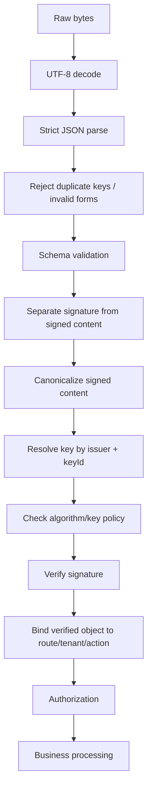
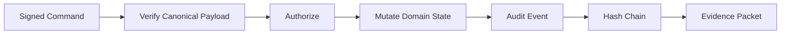

------
title: Learn Java Security, Cryptography and Integrity - Part 024
description: Secure JSON/XML serialization, canonicalization, payload signing, XML Signature risks, signature wrapping, schema validation, parser hardening, and signed data contracts for Java systems.
series: learn-java-security-cryptography-integrity
seriesTitle: Learn Java Security, Cryptography and Integrity
order: 24
partTitle: Secure Serialization, Canonicalization & Signing
tags:
  - java
  - security
  - json
  - xml
  - canonicalization
  - signing
  - serialization
  - jackson
  - xml-signature
  - integrity
date: 2026-06-30
---

# Part 024 — Secure Serialization, Canonicalization & Signing

> Target: setelah part ini, kamu mampu mendesain format payload JSON/XML yang aman untuk hashing/signing/verifying di Java: memahami canonicalization, menghindari signature wrapping, memisahkan parse boundary dari trust boundary, menggunakan schema validation secara benar, dan membuat signed data contract yang bisa bertahan terhadap perubahan serializer, whitespace, field order, dan parser behavior.

Part ini menyambung Part 022 dan Part 023. Request signing, webhook verification, audit hash, signed decision packet, dan evidence export semuanya punya masalah yang sama:

```text
Cryptography signs bytes.
Applications reason about objects.
Attackers exploit the gap between bytes, syntax, parser output, and business meaning.
```

Core invariant:

> A signed payload is trustworthy only when the verifier knows exactly which bytes or canonical representation were signed, validates the signature with an allowed algorithm/key, binds the verified payload to the business object actually consumed, rejects ambiguous/duplicate/conflicting representations, and performs authorization on the verified semantics.

Referensi utama:

- RFC 8785 JSON Canonicalization Scheme: <https://www.rfc-editor.org/rfc/rfc8785>
- RFC 8259 JSON: <https://www.rfc-editor.org/rfc/rfc8259>
- RFC 7493 I-JSON: <https://www.rfc-editor.org/rfc/rfc7493>
- W3C XML Signature Syntax and Processing 1.1: <https://www.w3.org/TR/xmldsig-core1/>
- W3C XML Signature Syntax and Processing 2.0: <https://www.w3.org/TR/xmldsig-core2/>
- Java XML Digital Signature API `javax.xml.crypto.dsig`: <https://docs.oracle.com/en/java/javase/25/docs/api/java.xml.crypto/javax/xml/crypto/dsig/package-summary.html>
- OWASP XML External Entity Prevention Cheat Sheet: <https://cheatsheetseries.owasp.org/cheatsheets/XML_External_Entity_Prevention_Cheat_Sheet.html>
- OWASP Deserialization Cheat Sheet: <https://cheatsheetseries.owasp.org/cheatsheets/Deserialization_Cheat_Sheet.html>
- OWASP Cryptographic Storage Cheat Sheet: <https://cheatsheetseries.owasp.org/cheatsheets/Cryptographic_Storage_Cheat_Sheet.html>
- Java `Signature`: <https://docs.oracle.com/en/java/javase/25/docs/api/java.base/java/security/Signature.html>
- Java `Mac`: <https://docs.oracle.com/en/java/javase/25/docs/api/java.base/javax/crypto/Mac.html>

---

## 1. Kaufman Deconstruction: Secure Serialization Skill Map

| Capability | Pertanyaan korektif | Output engineering |
|---|---|---|
| Format semantics | Data ini JSON, XML, binary, atau domain envelope? | Format decision record. |
| Parser boundary | Parser mana yang membaca untrusted input? | Hardened parser config. |
| Canonicalization | Representation mana yang di-hash/sign? | Canonicalization spec + vectors. |
| Signature binding | Bagian payload mana yang diverifikasi dan dipakai? | Verified object binding. |
| Schema validation | Apa grammar dan constraint yang diterima? | JSON Schema/XSD/contract tests. |
| Ambiguity defense | Duplicate keys, namespaces, encoding, numeric forms? | Rejection policy. |
| Algorithm/key policy | Algoritma/key mana yang boleh? | Allowlist + key registry. |
| Evolution | Bagaimana schema berubah tanpa merusak signature? | Versioned envelope. |
| Interop testing | Apakah producer/consumer canonical bytes sama? | Test vectors. |
| Exploit review | Bagaimana signature wrapping/confusion dicegah? | Negative test corpus. |

Mental shortcut:

```text
Never verify one representation and consume another.
```

Jika signature diverifikasi atas object A, tetapi business logic memakai object B hasil lookup/path/query/parser lain, signature tidak membuktikan apa yang kamu pikirkan.

---

## 2. The Representation Gap

Ada beberapa level representasi:

```text
Raw bytes
  -> decoded characters
  -> syntax tree
  -> parsed object/map
  -> domain DTO
  -> validated command
  -> authorized business action
```

Attackers mencari celah antar level:

- bytes valid tetapi decoded dengan charset berbeda;
- JSON punya duplicate key, parser A memilih pertama, parser B memilih terakhir;
- XML namespace membuat element terlihat sama tapi semantic berbeda;
- signature valid untuk element lama, business logic membaca element palsu;
- number `1`, `1.0`, `1e0` punya semantic sama/beda tergantung sistem;
- whitespace/field order berubah sehingga hash berbeda;
- schema membolehkan unknown fields yang dipakai attacker;
- signed payload tidak mengikat `tenantId`, `audience`, atau `objectId`.

Core design goal:

```text
Collapse ambiguity before cryptographic verification or reject it.
```

---

## 3. Sign Raw Bytes or Canonical Form?

Ada dua model utama.

### 3.1 Sign raw bytes

```text
signature = Sign(rawBodyBytes)
```

Pros:

- simple;
- exact;
- cocok untuk webhook raw body;
- tidak tergantung parser/canonicalizer.

Cons:

- whitespace/order changes break signature;
- intermediaries cannot reformat;
- difficult when same semantic data produced by different serializers;
- signature validity tied to transport body.

Use for:

- HTTP webhook verification;
- API request body integrity;
- immutable file/document signing;
- “what arrived on the wire” proof.

### 3.2 Sign canonical form

```text
canonical = Canonicalize(parsedPayload)
signature = Sign(canonical)
```

Pros:

- stable across whitespace/order;
- better semantic signing;
- supports evidence packet and cross-platform interoperability.

Cons:

- canonicalization is hard;
- all parties must implement exactly;
- parser ambiguity must be rejected before canonicalization;
- library drift can break verification.

Use for:

- signed JSON documents;
- audit/evidence packets;
- cross-platform business messages;
- long-lived integrity records.

Rule:

```text
Raw-body signing protects transport bytes.
Canonical signing protects agreed semantics.
Do not confuse them.
```

---

## 4. JSON Security Problems Relevant to Signing

JSON looks simple but has traps.

### 4.1 Duplicate keys

Example:

```json
{
  "amount": 100,
  "amount": 1
}
```

Different parsers may choose different values or reject. For signed data, duplicate keys must be rejected.

### 4.2 Numeric ambiguity

These may parse similarly but serialize differently:

```json
1
1.0
1e0
0.10
```

For money, never rely on floating-point JSON numbers without domain policy. Prefer string decimal with explicit scale or integer minor units.

### 4.3 Field order and whitespace

These are semantically same JSON but different bytes:

```json
{"a":1,"b":2}
```

```json
{
  "b": 2,
  "a": 1
}
```

Raw hash differs. Canonicalization must define ordering and whitespace.

### 4.4 Unicode and escaping

These may display similarly:

```json
"é"
"e\u0301"
```

Normalization policy matters when strings are identifiers, names, or signed display text.

### 4.5 Unknown fields

Unknown fields can be harmless or dangerous.

Dangerous when:

- another service uses them;
- they influence authorization downstream;
- they are signed but ignored by current verifier;
- they are unsigned but consumed later.

Policy:

```text
For signed commands: reject unknown fields unless explicitly versioned and covered by compatibility rules.
For signed evidence: preserve unknown fields but do not let them alter current semantics.
```

---

## 5. JSON Canonicalization Scheme Mental Model

RFC 8785 JSON Canonicalization Scheme defines a canonical JSON representation suitable for cryptographic operations by constraining data to I-JSON, using deterministic property sorting, and strict serialization rules.

You do not need to memorize every rule immediately. You need the mental model:

```text
The same JSON data model must always produce the same UTF-8 byte sequence.
```

Canonical JSON policy should define:

- UTF-8 only;
- no duplicate keys;
- deterministic property ordering;
- deterministic string escaping;
- deterministic number serialization;
- no insignificant whitespace;
- explicit date/time format;
- explicit binary encoding, usually base64url;
- explicit null/default behavior.

Example:

Input variants:

```json
{ "b" : 2, "a" : 1 }
```

```json
{
  "a": 1,
  "b": 2
}
```

Canonical:

```json
{"a":1,"b":2}
```

The important part is not aesthetics. It is cryptographic reproducibility.

---

## 6. Secure JSON Envelope Design

Avoid signing a naked business object. Use an envelope.

```json
{
  "envelopeVersion": "signed-json.v1",
  "type": "regulatory.case.decision.approved",
  "issuer": "case-decision-service",
  "audience": "audit-service",
  "tenantId": "regulator-id",
  "subject": {
    "type": "CASE",
    "id": "case-2026-000194",
    "version": 17
  },
  "issuedAt": "2026-06-30T08:00:42Z",
  "expiresAt": "2026-06-30T08:05:42Z",
  "nonce": "01JZ0K4X9BN7E1N3G7YF5QT9V8",
  "payloadHash": "sha256:...",
  "payload": {
    "decision": "APPROVED",
    "reasonCode": "EVIDENCE_SUFFICIENT",
    "policyVersion": "decision-policy-19"
  },
  "signature": {
    "algorithm": "Ed25519",
    "keyId": "case-decision-signing-2026-q2",
    "value": "base64url:..."
  }
}
```

Signed fields should include:

- envelope version;
- type;
- issuer;
- audience;
- tenant;
- subject/object binding;
- issue time/freshness fields;
- nonce/idempotency if applicable;
- payload hash/payload;
- algorithm policy metadata if your signature format requires it.

Be careful with algorithm metadata:

```text
Do not let attacker choose algorithm.
Algorithm field is input to policy matching, not authority.
```

Verifier should say:

```text
For issuer X and keyId Y, allowed algorithms are {Ed25519}.
Reject anything else.
```

---

## 7. Java JSON Signing Pipeline

Design the pipeline explicitly.



Critical ordering:

1. Do minimal safe parse.
2. Reject ambiguity.
3. Validate schema.
4. Canonicalize exactly the signed content.
5. Verify signature.
6. Bind to route/tenant/object.
7. Authorize.
8. Process.

Never process before verification.

---

## 8. Java Abstractions for Signed JSON

```java
public record SignatureBlock(
    String algorithm,
    String keyId,
    String value
) {}

public record SignedEnvelope<T>(
    String envelopeVersion,
    String type,
    String issuer,
    String audience,
    String tenantId,
    SignedSubject subject,
    java.time.Instant issuedAt,
    java.time.Instant expiresAt,
    String nonce,
    T payload,
    SignatureBlock signature
) {}

public record SignedSubject(
    String type,
    String id,
    long version
) {}
```

Verifier interface:

```java
public interface CanonicalJson {
    byte[] canonicalizeWithoutSignature(SignedEnvelope<?> envelope);
}

public interface SigningKeyResolver {
    VerificationKey resolve(String issuer, String keyId);
}

public record VerificationKey(
    String keyId,
    String algorithm,
    java.security.PublicKey publicKey,
    java.time.Instant notBefore,
    java.time.Instant notAfter
) {}
```

Verification service:

```java
public final class SignedJsonVerifier {
    private final CanonicalJson canonicalJson;
    private final SigningKeyResolver keyResolver;
    private final java.time.Clock clock;

    public SignedJsonVerifier(
        CanonicalJson canonicalJson,
        SigningKeyResolver keyResolver,
        java.time.Clock clock
    ) {
        this.canonicalJson = canonicalJson;
        this.keyResolver = keyResolver;
        this.clock = clock;
    }

    public void verify(SignedEnvelope<?> envelope, ExpectedBinding expected) {
        requireBinding(envelope, expected);
        requireFresh(envelope);

        VerificationKey key = keyResolver.resolve(
            envelope.issuer(), envelope.signature().keyId()
        );

        if (!key.algorithm().equals(envelope.signature().algorithm())) {
            throw new SecurityException("Signature algorithm not allowed for key");
        }

        byte[] canonical = canonicalJson.canonicalizeWithoutSignature(envelope);
        byte[] sig = java.util.Base64.getUrlDecoder().decode(envelope.signature().value());

        try {
            java.security.Signature verifier = java.security.Signature.getInstance(key.algorithm());
            verifier.initVerify(key.publicKey());
            verifier.update(canonical);
            if (!verifier.verify(sig)) {
                throw new SecurityException("Invalid signature");
            }
        } catch (java.security.GeneralSecurityException e) {
            throw new SecurityException("Signature verification failed", e);
        }
    }

    private void requireBinding(SignedEnvelope<?> envelope, ExpectedBinding expected) {
        if (!envelope.audience().equals(expected.audience())) {
            throw new SecurityException("Invalid audience");
        }
        if (!envelope.tenantId().equals(expected.tenantId())) {
            throw new SecurityException("Invalid tenant");
        }
        if (!envelope.subject().id().equals(expected.subjectId())) {
            throw new SecurityException("Invalid subject binding");
        }
    }

    private void requireFresh(SignedEnvelope<?> envelope) {
        var now = clock.instant();
        if (envelope.issuedAt().isAfter(now.plusSeconds(60))) {
            throw new SecurityException("Issued-at is in the future");
        }
        if (envelope.expiresAt().isBefore(now)) {
            throw new SecurityException("Signed envelope expired");
        }
    }
}

public record ExpectedBinding(
    String audience,
    String tenantId,
    String subjectId
) {}
```

This code intentionally omits actual canonicalizer implementation because canonicalization must be backed by a formal spec/test vectors, not ad-hoc Jackson output.

---

## 9. Jackson Security Notes for Signed JSON

Jackson is excellent for JSON processing, but security depends on configuration and contract.

For signed payloads:

- reject unknown properties unless compatibility requires them;
- reject duplicate keys;
- avoid default typing for untrusted input;
- avoid polymorphic deserialization from untrusted JSON unless allowlisted;
- use explicit DTOs;
- validate domain constraints after parse;
- avoid using `Map<String,Object>` as business command;
- do not serialize using default settings and call that “canonical”.

Example strict mapper directionally:

```java
import com.fasterxml.jackson.core.JsonFactory;
import com.fasterxml.jackson.core.JsonParser;
import com.fasterxml.jackson.databind.DeserializationFeature;
import com.fasterxml.jackson.databind.ObjectMapper;

public final class StrictJsonMapperFactory {
    public static ObjectMapper create() {
        JsonFactory factory = JsonFactory.builder()
            .enable(JsonParser.Feature.STRICT_DUPLICATE_DETECTION)
            .build();

        return new ObjectMapper(factory)
            .findAndRegisterModules()
            .enable(DeserializationFeature.FAIL_ON_UNKNOWN_PROPERTIES)
            .enable(DeserializationFeature.FAIL_ON_TRAILING_TOKENS)
            .disable(DeserializationFeature.ACCEPT_FLOAT_AS_INT);
    }
}
```

Do not assume this creates RFC 8785 canonical output. It is parser hardening, not canonicalization.

---

## 10. JSON Schema and Business Validation

Schema validation is not authorization and not signature verification.

Schema answers:

```text
Is this document structurally allowed?
```

Business validation answers:

```text
Is this value meaningful for this domain state?
```

Authorization answers:

```text
May this actor do this action to this object now?
```

Signature verification answers:

```text
Was this exact signed content produced by holder of allowed key?
```

All four are needed for signed commands.

Example domain constraints for decision payload:

| Constraint | Layer |
|---|---|
| `decision` is enum | schema |
| `reasonCode` format | schema |
| `policyVersion` exists | business validation |
| case version matches current expected version | business validation/integrity |
| issuer is trusted for this command type | signature/key policy |
| issuer may approve this tenant's case | authorization/trust policy |

---

## 11. XML Security Problems Relevant to Signing

XML is more complex than JSON because of:

- namespaces;
- attributes;
- entity expansion;
- external entities;
- DTDs;
- canonicalization modes;
- XPath transforms;
- ID attributes;
- comments;
- inclusive/exclusive namespace handling;
- schema validation complexity;
- signature wrapping.

The dangerous mental model:

```text
The XML signature validated, therefore the document is safe.
```

Correct model:

```text
The signature validated for a referenced node set.
Now prove that the application consumes exactly that verified node set.
```

---

## 12. XML Signature Wrapping Mental Model

Signature wrapping attack pattern:

1. Attacker keeps original signed element unchanged.
2. Attacker moves signed element somewhere harmless.
3. Attacker inserts malicious unsigned element where application expects business data.
4. Signature library verifies original signed element.
5. Business logic reads malicious unsigned element.

Simplified example:

```xml
<Envelope>
  <Header>
    <Signature>
      <!-- Signature references Id="body-1" -->
    </Signature>
  </Header>
  <Body Id="body-evil">
    <Transfer amount="1000000" to="attacker"/>
  </Body>
  <Wrapper>
    <Body Id="body-1">
      <Transfer amount="10" to="merchant"/>
    </Body>
  </Wrapper>
</Envelope>
```

Signature can be valid for `body-1`, while app reads first `Body` or wrong XPath.

Defense invariant:

```text
After verification, application must consume the exact signed element resolved by secure ID/reference logic.
```

---

## 13. XML Parser Hardening Before Signature Verification

Disable dangerous XML features for untrusted input.

Example for `DocumentBuilderFactory` directionally:

```java
import javax.xml.XMLConstants;
import javax.xml.parsers.DocumentBuilderFactory;

public final class SecureXmlFactory {
    public static DocumentBuilderFactory documentBuilderFactory() throws Exception {
        DocumentBuilderFactory dbf = DocumentBuilderFactory.newInstance();
        dbf.setNamespaceAware(true);
        dbf.setFeature("http://apache.org/xml/features/disallow-doctype-decl", true);
        dbf.setFeature("http://xml.org/sax/features/external-general-entities", false);
        dbf.setFeature("http://xml.org/sax/features/external-parameter-entities", false);
        dbf.setFeature("http://apache.org/xml/features/nonvalidating/load-external-dtd", false);
        dbf.setXIncludeAware(false);
        dbf.setExpandEntityReferences(false);
        dbf.setAttribute(XMLConstants.ACCESS_EXTERNAL_DTD, "");
        dbf.setAttribute(XMLConstants.ACCESS_EXTERNAL_SCHEMA, "");
        return dbf;
    }
}
```

Exact feature support can vary by parser implementation. Treat parser hardening as tested configuration, not copy-paste decoration.

---

## 14. Java XML Digital Signature API

Java provides XML Digital Signature APIs under `javax.xml.crypto.dsig`. The package includes core XML Signature concepts such as `XMLSignature`, `SignedInfo`, `CanonicalizationMethod`, `SignatureMethod`, `Reference`, and `DigestMethod`.

High-level validation flow:

```java
import javax.xml.crypto.dsig.XMLSignature;
import javax.xml.crypto.dsig.XMLSignatureFactory;
import javax.xml.crypto.dsig.dom.DOMValidateContext;
import java.security.PublicKey;

public final class XmlSignatureVerifier {
    public boolean verify(org.w3c.dom.Document doc, org.w3c.dom.Node signatureNode, PublicKey key)
            throws Exception {
        XMLSignatureFactory fac = XMLSignatureFactory.getInstance("DOM");

        DOMValidateContext context = new DOMValidateContext(key, signatureNode);
        context.setProperty("org.jcp.xml.dsig.secureValidation", Boolean.TRUE);

        XMLSignature signature = fac.unmarshalXMLSignature(context);
        return signature.validate(context);
    }
}
```

This is not sufficient by itself. You must also:

- securely resolve IDs;
- check exactly one expected signed element;
- check the signed element is the one consumed;
- enforce allowed algorithms;
- reject untrusted transforms if policy says so;
- validate certificate/key trust;
- reject external references;
- validate schema after safe parsing;
- test signature wrapping attempts.

---

## 15. XML Reference Binding

A secure XML signature verification should answer:

```text
What exact element/node set was signed?
Does it match the business element I will consume?
```

Policy example:

```text
For PaymentInstruction v2:
- exactly one Signature element allowed
- Signature must reference #payment-instruction-id
- referenced element must be /PaymentInstruction
- referenced element Id must equal root @Id
- no detached external references
- no XSLT transforms
- canonicalization algorithm allowlisted
- signature algorithm allowlisted
- digest algorithm allowlisted
```

Pseudo-code:

```java
public VerifiedXml<T> verifyAndExtract(Document doc) {
    Element root = doc.getDocumentElement();
    requireElementName(root, "PaymentInstruction");

    String id = requireId(root);
    markIdAttribute(root, "Id");

    Element signatureElement = findExactlyOneSignature(root);
    boolean valid = xmlSignatureVerifier.verify(doc, signatureElement, trustedKey);
    if (!valid) throw new SecurityException("Invalid XML signature");

    SignedReference ref = extractSingleReference(signatureElement);
    if (!ref.uri().equals("#" + id)) {
        throw new SecurityException("Signature does not bind root payment instruction");
    }

    return new VerifiedXml<>(root, parsePaymentInstruction(root));
}
```

Key idea:

```text
The verifier returns a verified business object, not just true/false.
```

A boolean `signatureValid` that is separated from extraction is a common source of bugs.

---

## 16. Canonicalization: Why XML Is Harder Than JSON

XML canonicalization must account for:

- namespaces;
- attribute ordering;
- default attributes;
- comments;
- whitespace significance;
- entity expansion;
- inclusive/exclusive namespace context;
- transforms;
- ID resolution.

This is why XML signature implementations need strict profile constraints.

Good XML signature profile:

```text
No external references.
No XSLT transforms.
No DTD.
No entity expansion.
Exactly one signed business root.
Algorithm allowlist.
Secure validation enabled.
Schema version pinned.
Verified element returned to business logic.
```

Avoid designing a general-purpose “accept any XML signature” verifier.

---

## 17. Signed XML vs Signed JSON: Decision Table

| Need | Prefer |
|---|---|
| Existing SOAP/SAML/XML ecosystem | XML Signature with strict profile |
| New REST/event payloads | JSON + JCS or raw-body signing |
| Long-lived legal document XML | XML Signature, archival profile, timestamping |
| Webhook body verification | raw bytes + HMAC/signature |
| Internal event integrity | canonical JSON + HMAC/signature |
| Cross-language business document | canonical JSON with test vectors |
| Human-readable official document | detached signature over PDF/XML/document hash |

Do not choose XML Signature unless the ecosystem requires it. Its flexibility is also its risk.

---

## 18. Detached, Enveloped, and Enveloping Signatures

| Model | Meaning | Risk |
|---|---|---|
| Detached | signature separate from content | binding/reference mistakes |
| Enveloped | signature inside signed document | canonicalization complexity |
| Enveloping | signed object inside signature object | business extraction confusion |

For JSON, the equivalent is:

- detached `.sig` file over payload hash;
- envelope with `payload` and `signature`;
- JWS-like compact/JSON serialization.

Decision guideline:

```text
Use detached signatures for files/documents.
Use envelope signatures for business messages.
Use raw-body HMAC for webhook/API transport verification.
```

---

## 19. What Exactly Should Be Signed?

Sign enough context to prevent replay and substitution.

For a business command, sign:

- command type;
- issuer;
- audience;
- tenant;
- subject/object id;
- object version if applicable;
- issued time;
- expiry;
- nonce/idempotency key;
- payload;
- schema version;
- policy version if the claim depends on it.

Do not sign only:

```json
{"decision":"APPROVED"}
```

Because it can be replayed/substituted across:

- tenants;
- cases;
- environments;
- APIs;
- versions;
- recipients.

Better:

```json
{
  "type": "CASE_DECISION_APPROVAL",
  "tenantId": "regulator-id",
  "caseId": "case-2026-000194",
  "caseVersion": 17,
  "decision": "APPROVED",
  "policyVersion": "decision-policy-19",
  "audience": "case-command-api",
  "expiresAt": "2026-06-30T08:05:42Z",
  "nonce": "01JZ..."
}
```

---

## 20. Signature Verification Error Taxonomy

Do not return detailed cryptographic failure reasons to untrusted clients. But internally, classify clearly.

| Internal reason | External response |
|---|---|
| malformed envelope | 400 |
| unsupported schema version | 400/422 |
| unknown issuer | 401/403 |
| unknown key id | 401/403 |
| algorithm not allowed | 401/403 + alert |
| invalid signature | 401/403 |
| expired envelope | 401/403 |
| replayed nonce | 409/403 |
| subject binding mismatch | 403 + alert |
| schema valid but business invalid | 422 |
| verified but unauthorized | 403 |

Log internally:

- issuer;
- key id;
- algorithm;
- failure class;
- request id;
- remote client id;
- hash of payload, not raw sensitive payload.

---

## 21. Replay, Substitution, and Confused Deputy

Signature verification alone does not prevent replay.

Add:

- `audience`;
- `issuer`;
- `tenantId`;
- object id/version;
- `issuedAt`;
- `expiresAt`;
- nonce/idempotency key;
- receiver-side replay cache;
- route binding.

Route binding example:

```text
POST /tenants/{tenantId}/cases/{caseId}/decisions
```

Verifier must check:

```text
envelope.tenantId == path.tenantId
envelope.subject.id == path.caseId
envelope.audience == this API audience
envelope.type == allowed command for this route
```

Otherwise a valid signed payload for one context can be used in another.

---

## 22. Versioning Signed Payloads

Signed formats are harder to evolve because old signatures must remain verifiable.

Rules:

- include schema/envelope version in signed content;
- keep canonicalization version stable;
- keep old canonicalizers available for historical verification;
- store algorithm/key id;
- store enough metadata to reconstruct verification;
- never reinterpret old signed fields with new semantics;
- prefer additive changes with explicit version negotiation.

Bad:

```text
Change default serializer field order and assume old signatures verify.
```

Good:

```text
signed-json.v1 canonicalizer remains frozen.
signed-json.v2 introduced for new fields/rules.
Verifier selects canonicalizer by envelopeVersion.
```

---

## 23. Test Vectors Are Non-Negotiable

For every signed format, publish test vectors.

A test vector should include:

- input JSON/XML;
- canonical bytes or hex/base64;
- algorithm;
- key id;
- public key or test secret;
- expected hash;
- expected signature;
- expected verification result;
- negative variants.

Example:

```text
Vector: signed-case-decision-v1-ok
Input file: decision-ok.json
Canonical SHA-256: sha256:...
Signature algorithm: Ed25519
Public key: test-key-1.pem
Expected: VALID
```

Negative vectors:

- duplicate JSON key;
- unknown field;
- changed tenant;
- changed subject id;
- changed field order;
- expired envelope;
- wrong audience;
- unsupported algorithm;
- XML signature wrapping;
- external XML reference;
- different canonicalization method;
- unsigned business element.

If two implementations cannot pass the same vectors, they do not share a protocol.

---

## 24. Secure Deserialization Boundary

Do not deserialize untrusted data into arbitrary object graphs.

Avoid for untrusted input:

- Java native serialization;
- polymorphic object deserialization;
- default typing;
- gadget-friendly classpaths;
- serialized closures/lambdas;
- unbounded nested structures.

Prefer:

- explicit DTOs;
- data-only formats;
- strict schema;
- allowlisted polymorphism;
- size/depth limits;
- parser timeouts where applicable;
- object input filters only as defense-in-depth, not primary trust boundary.

Secure serialization invariant:

```text
Untrusted bytes become inert data first, then validated command, then authorized action.
Never untrusted bytes directly become executable behavior or arbitrary object graph.
```

---

## 25. Payload Hashing for Large Documents

For large files/documents, do not embed full content inside signed JSON. Sign metadata plus content hash.

```json
{
  "type": "EVIDENCE_DOCUMENT_MANIFEST",
  "documentId": "doc-882",
  "contentType": "application/pdf",
  "sizeBytes": 882193,
  "sha256": "sha256:...",
  "storageRef": "evidence-store://tenant/case/doc-882",
  "uploadedAt": "2026-06-30T08:00:42Z"
}
```

Then sign the manifest.

Important:

- hash file bytes exactly as stored;
- bind hash to metadata;
- validate content type separately;
- store immutable object version/id;
- avoid letting filename/path control verification;
- include storage object generation/version if available.

---

## 26. Canonicalization and Money/Decimal Values

Money is a common integrity failure.

Avoid:

```json
{"amount": 10.0}
```

Prefer one of:

```json
{"currency":"USD","minorUnits":1000}
```

or:

```json
{"currency":"USD","amount":"10.00","scale":2}
```

Then define validation:

- currency code allowlist;
- scale per currency;
- no negative unless explicitly allowed;
- max amount;
- exact decimal parser;
- canonical string format.

For security-sensitive signed business data, implicit numeric conversion is unacceptable.

---

## 27. Canonicalization and Time

Time must be explicit.

Use:

```text
2026-06-30T08:00:42Z
```

Avoid:

```text
06/30/26
2026-06-30 08:00:42
Tue Jun 30 08:00:42 WIB 2026
```

Policy:

- UTC only for signed payload timestamps;
- fixed precision;
- no local timezone abbreviations;
- no locale-dependent formatting;
- parse strictly;
- reject invalid leap/ambiguous forms unless format defines them.

Java:

```java
import java.time.Instant;
import java.time.format.DateTimeFormatter;

String canonicalTime = DateTimeFormatter.ISO_INSTANT.format(Instant.now());
```

If precision matters, define it. For example, truncate to milliseconds before signing if all producers agree.

---

## 28. Canonicalization and Binary Values

Binary data inside JSON must be encoded consistently.

Prefer base64url without padding when protocol says so:

```java
String encoded = java.util.Base64.getUrlEncoder()
    .withoutPadding()
    .encodeToString(bytes);
```

But the exact rule must be in the protocol:

```text
Binary fields MUST be base64url without padding.
Verifier MUST reject standard base64 characters '+' and '/'.
Verifier MUST reject padding unless version says otherwise.
```

Do not accept many encodings for the same signed field. Flexibility creates ambiguity.

---

## 29. Algorithm and Key Confusion

Never trust `alg` from payload as command.

Bad:

```java
Signature sig = Signature.getInstance(envelope.signature().algorithm());
```

Better:

```java
VerificationKey key = keyResolver.resolve(envelope.issuer(), envelope.signature().keyId());
if (!policy.isAllowed(envelope.issuer(), key.keyId(), envelope.signature().algorithm())) {
    throw new SecurityException("Algorithm not allowed");
}
Signature sig = Signature.getInstance(policy.requiredAlgorithm(key));
```

Policy source should be server-side configuration/registry, not attacker-controlled payload.

Also prevent key confusion:

- `kid` unique per issuer/trust domain;
- key type matches algorithm;
- do not use HMAC secret as RSA public key material;
- do not mix test/prod keys;
- pin issuer/audience/key policy;
- reject unknown `kid`;
- log suspicious algorithm mismatch.

---

## 30. “Verified DTO” Pattern

Avoid passing raw parsed objects after boolean verification. Use type-level separation.

```java
public record UntrustedEnvelope<T>(SignedEnvelope<T> value) {}

public record VerifiedEnvelope<T>(
    SignedEnvelope<T> value,
    VerificationKey key,
    java.time.Instant verifiedAt
) {}

public final class DecisionCommandHandler {
    public void handle(VerifiedEnvelope<DecisionPayload> verified) {
        DecisionPayload payload = verified.value().payload();
        // business logic only accepts VerifiedEnvelope
    }
}
```

This reduces accidental use of unverified data.

In larger systems:

```text
Controller parses UntrustedEnvelope.
Verifier returns VerifiedEnvelope.
Application service accepts only VerifiedEnvelope.
```

---

## 31. Safe Verification Result: Do Not Return Just Boolean

Bad API:

```java
boolean valid = verifier.verify(document);
```

Better API:

```java
VerifiedDocument<PaymentInstruction> verified = verifier.verifyAndExtract(rawBytes);
```

The returned object should contain:

- verified business payload;
- issuer;
- key id;
- algorithm;
- verification time;
- signed canonical hash;
- trust policy version;
- schema version.

This prevents caller from verifying one payload and consuming another.

---

## 32. Negative Test Corpus

Build a corpus for signed JSON/XML.

### JSON negative tests

- duplicate key;
- trailing tokens;
- unknown critical field;
- changed audience;
- changed tenant;
- changed object id;
- changed object version;
- expired timestamp;
- future `issuedAt`;
- replayed nonce;
- unsupported algorithm;
- unknown key id;
- signature from wrong issuer;
- number representation edge;
- Unicode normalization mismatch;
- whitespace/order equivalent when raw-body signing is expected.

### XML negative tests

- XXE payload;
- DTD present;
- external reference;
- XSLT transform;
- signature wrapping;
- duplicate ID;
- wrong root signed;
- unsigned business body;
- namespace confusion;
- comments included/excluded mismatch;
- unsupported canonicalization;
- weak digest/signature algorithm;
- schema-valid but business-invalid message.

A protocol without negative tests is not a security protocol. It is a happy-path demo.

---

## 33. Integration with Audit Evidence

Signed serialization feeds audit trail integrity.

Example:

1. Receive signed command.
2. Verify signed envelope.
3. Execute business action.
4. Audit event stores:
   - command canonical hash;
   - verification key id;
   - verification result;
   - command issuer;
   - domain outcome;
   - resulting state hash.
5. Audit event is itself hash-chained and signed.

This creates layered proof:

```text
External command signature
  -> internal authorization decision
  -> domain mutation
  -> audit hash chain
  -> evidence packet
```

Mermaid:



---

## 34. Code Review Checklist

### JSON

- Are duplicate keys rejected?
- Are unknown fields handled intentionally?
- Is canonicalization formalized and tested?
- Is raw-body signing distinguished from canonical signing?
- Are money/time/binary fields canonical?
- Is `tenantId`/audience/object binding signed?
- Is algorithm chosen from server-side policy?
- Are test vectors available?

### XML

- Are DTD/external entities disabled?
- Is secure validation enabled?
- Are external references rejected?
- Are transforms allowlisted?
- Is exactly one expected element signed?
- Does business logic consume the verified element?
- Are duplicate IDs rejected?
- Are namespace rules tested?
- Are signature wrapping tests included?

### Serialization

- Is untrusted data deserialized only into explicit DTOs?
- Is Java native serialization avoided?
- Is polymorphism allowlisted?
- Are size/depth limits enforced?
- Are parser errors safe and non-leaky?

### Protocol evolution

- Is envelope version signed?
- Are old canonicalizers retained?
- Is compatibility documented?
- Are old signatures still verifiable?

---

## 35. Common Anti-Patterns

### 35.1 Signing `Map.toString()`

```java
String data = map.toString();
```

Unstable and not a protocol.

### 35.2 Verifying raw body, then reparsing different body

This happens when middleware consumes body and reconstructs it. Preserve exact bytes for raw-body verification.

### 35.3 Accepting `alg` from payload

Attacker-controlled algorithm choice is a classic design flaw.

### 35.4 XML signature valid = XML trusted

Signature validity only applies to referenced signed data. It does not validate the whole document or business semantics.

### 35.5 Ignoring route binding

Valid signed object for `/case/A` should not be accepted on `/case/B`.

### 35.6 Schema validation after business processing

Validation must happen before processing.

### 35.7 Canonicalizer changes silently

Changing serializer/canonicalizer version breaks old signatures or worse creates inconsistent verification.

---

## 36. Practice Lab

Build a signed JSON command protocol.

### Requirements

1. Define `signed-json.v1` envelope.
2. Use strict JSON parser.
3. Reject duplicate keys and unknown fields.
4. Canonicalize signed content.
5. Sign with Ed25519 test key.
6. Verify with issuer/key registry.
7. Bind route tenant/case id to signed envelope.
8. Add replay cache for nonce.
9. Produce test vectors.
10. Add negative tests.

### Bonus XML lab

1. Parse XML with hardened parser.
2. Verify XML signature with Java XML Digital Signature API.
3. Reject external references and unsafe transforms.
4. Return verified root element.
5. Add signature wrapping negative fixture.

Success criteria:

```text
All valid vectors pass.
All ambiguity, replay, binding, and wrapping vectors fail.
No business handler accepts unverified payload type.
```

---

## 37. Decision Record Template

```md
# ADR: Signed Payload Format for <Use Case>

## Context
<Why payload integrity/authenticity is needed.>

## Format
- JSON/XML/raw bytes
- envelope version
- canonicalization version
- schema version

## Signed Content
- type
- issuer
- audience
- tenant
- subject/object
- issuedAt/expiresAt
- nonce/idempotency
- payload

## Algorithms and Keys
- signature/MAC algorithm
- key registry
- rotation model
- allowed algorithms

## Parser Policy
- duplicate keys
- unknown fields
- XML DTD/entities
- size/depth limits

## Verification Pipeline
<Step-by-step order.>

## Negative Tests
<List required attack vectors.>

## Evolution
<How old signatures remain verifiable.>
```

---

## 38. Final Mental Model

Secure serialization is about eliminating ambiguity between what is signed and what is used.

```text
Untrusted bytes
  -> strict parse
  -> ambiguity rejection
  -> schema validation
  -> canonical signed representation
  -> algorithm/key policy
  -> signature verification
  -> binding check
  -> authorization
  -> verified business object
```

When reviewing signed JSON/XML, always ask:

```text
What exactly was signed?
Who says this key is trusted?
What context is the signature bound to?
Can the parser and business logic disagree?
Can a valid signature be replayed somewhere else?
Can old signatures still be verified after schema/library changes?
```

---

## 39. Self-Assessment

You should be able to answer:

1. Apa perbedaan raw-body signing dan canonical signing?
2. Mengapa duplicate JSON keys berbahaya untuk signed payload?
3. Mengapa signature verification tidak sama dengan authorization?
4. Apa itu XML signature wrapping?
5. Bagaimana memastikan business logic memakai element XML yang benar-benar signed?
6. Field konteks apa yang harus ikut ditandatangani agar tidak bisa replay/substitution?
7. Mengapa `alg` tidak boleh menjadi perintah dari attacker?
8. Apa isi test vector yang baik?
9. Bagaimana schema evolution memengaruhi historical signature verification?
10. Apa bedanya parser hardening, schema validation, canonicalization, dan signature verification?

---

## 40. Ringkasan

- Cryptography menandatangani bytes; aplikasi memproses object. Gap ini harus ditutup.
- Raw-body signing cocok untuk transport/webhook; canonical signing cocok untuk semantic document.
- JSON signed payload harus menolak ambiguity: duplicate keys, unknown critical fields, numeric/time/binary ambiguity.
- XML signature harus diprofilkan ketat karena signature wrapping dan transform complexity.
- Java XML Digital Signature API membantu verifikasi, tetapi caller tetap harus mengikat verified node ke business object.
- Jangan pernah verify satu representasi lalu consume representasi lain.
- Signed envelope harus mengikat issuer, audience, tenant, subject, version, freshness, nonce, dan payload.
- Test vectors dan negative corpus adalah bagian dari protokol, bukan tambahan.

Part berikutnya membahas **Secure File Upload, Storage & Content Integrity**: MIME confusion, magic bytes, malware scanning boundary, content-addressed storage, checksums vs signatures, object storage policy, dan temporary file risks.
