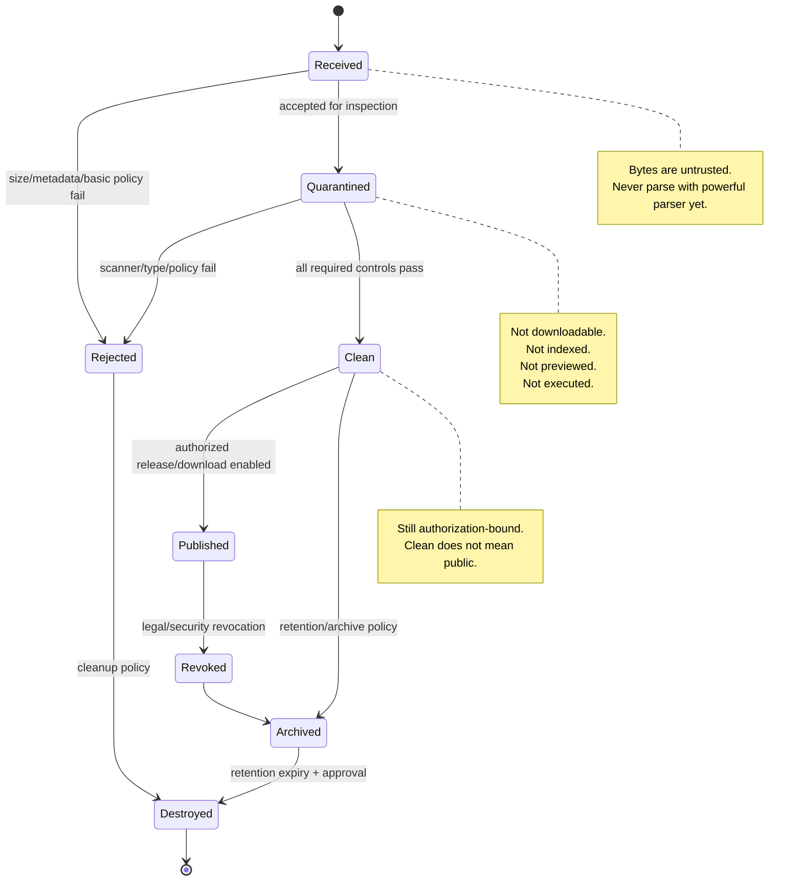
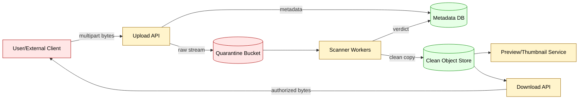
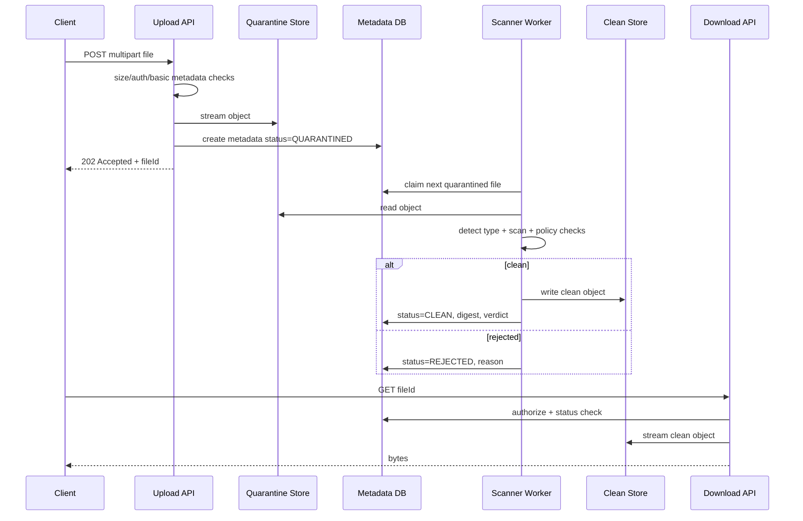
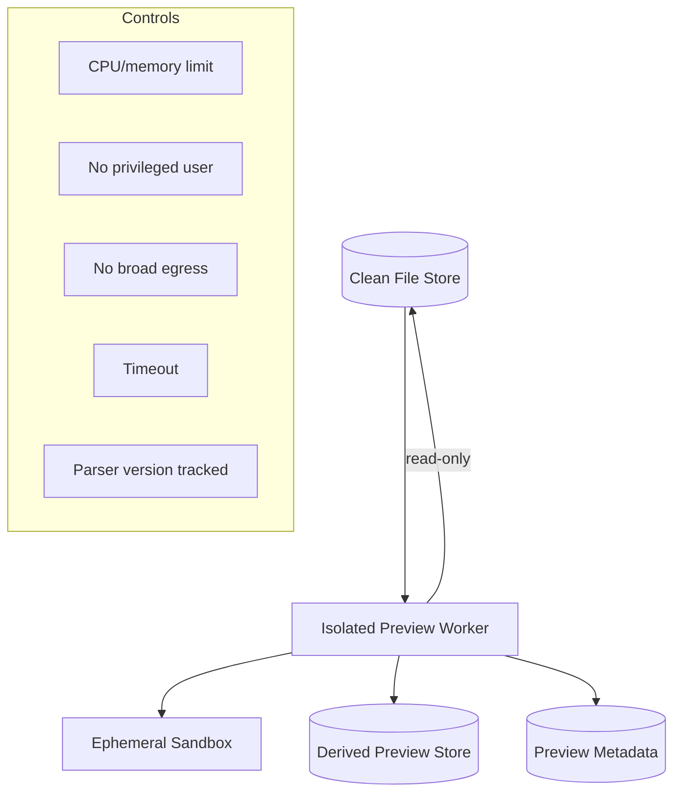
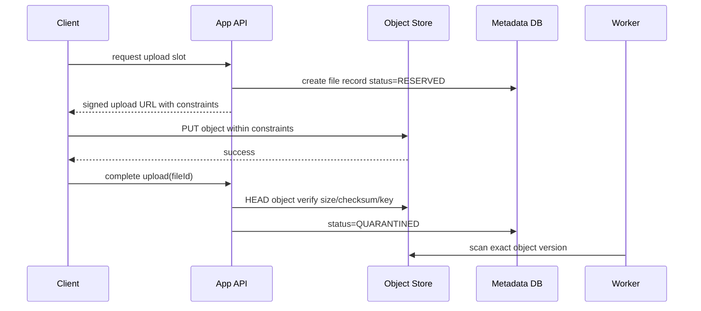
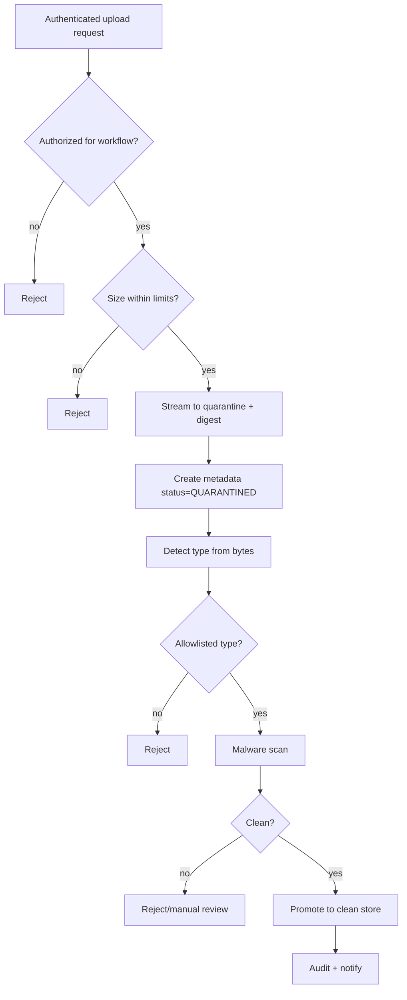

------
title: Learn Java Security, Cryptography and Integrity - Part 025
description: Secure file upload, storage, and content integrity for production-grade Java systems: validation, quarantine, scanning boundaries, object storage, checksums, signatures, and evidence-grade file lifecycle.
series: learn-java-security-cryptography-integrity
seriesTitle: Learn Java Security, Cryptography and Integrity
order: 25
partTitle: Secure File Upload, Storage & Content Integrity
tags:
  - java
  - security
  - file-upload
  - content-integrity
  - object-storage
  - malware-scanning
  - cryptography
  - integrity
  - secure-engineering
date: 2026-06-30
---

# Part 025 — Secure File Upload, Storage & Content Integrity

File upload adalah salah satu boundary paling berbahaya di aplikasi Java enterprise karena ia menerima **bytes tak dipercaya** dari luar lalu sering memindahkannya ke storage, parser, thumbnailer, antivirus, message queue, search index, data lake, workflow engine, atau sistem bukti. Security engineer yang kuat tidak melihat upload sebagai `MultipartFile` saja. Ia melihatnya sebagai **supply chain mini**: bytes masuk, diklaim memiliki tipe tertentu, diberi nama, dipersist, diproses, dikirim ke service lain, di-download lagi, dan mungkin dijadikan evidence.

Target part ini: kamu mampu mendesain upload pipeline yang defensible, reviewable, dan aman untuk sistem regulatori/case-management/enterprise. Kita tidak mengulang dasar Java I/O atau JSON/XML mapping. Kita fokus pada security semantics dari file sebagai **untrusted content object**.

Referensi baseline:

- OWASP File Upload Cheat Sheet: <https://cheatsheetseries.owasp.org/cheatsheets/File_Upload_Cheat_Sheet.html>
- OWASP Unrestricted File Upload: <https://owasp.org/www-community/vulnerabilities/Unrestricted_File_Upload>
- OWASP Logging Cheat Sheet: <https://cheatsheetseries.owasp.org/cheatsheets/Logging_Cheat_Sheet.html>
- OWASP Malware Scanner Integration: <https://owasp.org/www-community/controls/Malware_Scanner>
- Apache Tika MIME detection: <https://tika.apache.org/>
- Java `java.nio.file.Files`: <https://docs.oracle.com/en/java/javase/25/docs/api/java.base/java/nio/file/Files.html>
- Java `MessageDigest`: <https://docs.oracle.com/en/java/javase/25/docs/api/java.base/java/security/MessageDigest.html>
- Java `Signature`: <https://docs.oracle.com/en/java/javase/25/docs/api/java.base/java/security/Signature.html>

---

## 1. Kaufman Deconstruction: Apa Skill yang Sebenarnya Dipelajari?

Dalam framework Josh Kaufman, kita pecah skill besar menjadi sub-skill kecil yang bisa dilatih. Untuk secure file handling, skill-nya bukan “bisa upload file”. Skill-nya adalah:

1. **Boundary modeling** — tahu kapan file masih untrusted, kapan boleh diproses, dan siapa yang boleh melihatnya.
2. **Type verification** — membedakan extension, declared MIME, detected MIME, magic bytes, dan semantic parser result.
3. **Name/path safety** — mencegah path traversal, overwrite, filename confusion, Unicode confusion, dan script execution.
4. **Storage isolation** — memisahkan raw upload, quarantine, clean object, derived artifact, dan public delivery.
5. **Content integrity** — menghitung digest, melakukan deduplication aman, signing metadata, dan menjaga immutable object identity.
6. **Malware/scanner integration** — memperlakukan scanner sebagai async risk signal, bukan oracle sempurna.
7. **Download safety** — mengontrol content disposition, content type, authorization, range request, cache, dan leak.
8. **Evidence lifecycle** — chain of custody, audit trail, tamper-evident metadata, retention, legal hold, deletion.
9. **Operational failure handling** — timeout, partial write, object-store eventual consistency, scanner unavailable, retry, backpressure.
10. **Security review** — bisa membaca upload code dan menemukan vulnerability yang tidak terlihat dari happy path.

Minimal effective practice: ambil satu upload endpoint, buat state machine lifecycle, lalu tulis negative test untuk 20 payload berbahaya.

---

## 2. Mental Model: File Upload Sebagai State Machine

File bukan boolean “valid/invalid”. File melewati lifecycle. Setiap transisi harus punya invariant.



Security invariant utama:

> **A file is untrusted until policy, type, integrity, and authorization boundaries say otherwise — and even then, it remains content, not code.**

---

## 3. Threat Model untuk Upload

### 3.1 Threat Classes

| Threat | Bentuk | Dampak |
|---|---|---|
| Unrestricted upload | Upload `.jsp`, `.html`, macro doc, polyglot file | RCE, XSS, malware distribution |
| Path traversal | Filename `../../app.war` | Overwrite file, data corruption |
| Parser exploit | Image/PDF/Office parser vulnerability | RCE/DoS di thumbnailer/scanner |
| Content-type spoofing | `Content-Type: image/png` tapi isi HTML/JS | Stored XSS, policy bypass |
| Extension confusion | `invoice.pdf.exe`, `report.pdf%00.jsp` | Execution/confused user |
| Zip bomb/decompression bomb | Nested/compressed payload besar | CPU/memory/disk exhaustion |
| Malware | Macro, trojan, phishing attachment | Compromise user/system |
| PII leakage | Unauthorized file download | Privacy/regulatory breach |
| Evidence tampering | Replace object after audit | Invalid evidence, regulatory failure |
| Dedup side-channel | Hash-based existence check | Leak bahwa suatu file sudah ada |
| Orphaned object | Metadata DB rollback tapi object tersimpan | Data leak/cost growth |
| Async race | Download enabled sebelum scan selesai | Malware exposure |

### 3.2 Trust Boundary



Boundary penting:

- Client-provided filename tidak pernah menjadi storage key.
- Client-provided MIME tidak pernah menjadi source of truth.
- Quarantine object tidak pernah bisa di-download oleh business user.
- Clean object tidak pernah berarti “public”. Authorization tetap wajib.
- Scanner verdict adalah risk signal yang bisa stale; ia perlu timestamp, engine version, signature version, dan policy version.

---

## 4. Extension, MIME, Magic Bytes, dan Semantic Type

Banyak vulnerability upload muncul dari ilusi bahwa satu sinyal cukup.

| Signal | Contoh | Kegunaan | Kelemahan |
|---|---|---|---|
| Filename extension | `.pdf` | UX, policy awal | Mudah dipalsukan, Unicode confusion |
| HTTP `Content-Type` | `application/pdf` | Deklarasi client | Bisa spoofed |
| Magic bytes | `%PDF-`, PNG header | Deteksi awal isi | Banyak format kompleks/polyglot |
| Parser result | PDF parser benar-benar bisa membaca PDF | Validasi semantik | Parser bisa vulnerable/mahal |
| Business schema | PDF harus single file, max pages, no active content | Policy final | Perlu tooling domain-specific |

Rule praktis:

> **Allowlist by business need, validate by multiple signals, and process with least-powerful parser.**

Contoh policy:

| Use Case | Allow Type | Batasan |
|---|---|---|
| KTP/identity evidence | PDF, JPEG, PNG | Max 10 MB, no embedded files, no active content, max dimensions/pages |
| Case attachment | PDF, DOCX, XLSX, image | Max 50 MB, scan required, preview async, no direct inline render |
| Machine import | CSV only | UTF-8, delimiter fixed, row limit, schema validation |
| Legal evidence archive | PDF/A preferred | immutable, digest, signature metadata, retention policy |

---

## 5. Filename dan Path Safety

### 5.1 Dangerous Assumption

Kode buruk:

```java
Path target = uploadDir.resolve(file.getOriginalFilename());
file.transferTo(target);
```

Masalah:

- `../` path traversal.
- overwrite file existing.
- filename collision.
- Unicode normalization confusion.
- reserved device name di OS tertentu.
- extension spoofing.
- double extension.
- log/header injection.

### 5.2 Secure Pattern: Generate Storage Key

```java
import java.io.InputStream;
import java.nio.file.*;
import java.security.MessageDigest;
import java.time.Instant;
import java.util.HexFormat;
import java.util.UUID;

public final class UploadStorage {
    private final Path quarantineRoot;

    public UploadStorage(Path quarantineRoot) {
        this.quarantineRoot = quarantineRoot.toAbsolutePath().normalize();
    }

    public StoredUpload storeToQuarantine(InputStream input, long declaredSize, String originalFilename) throws Exception {
        if (declaredSize <= 0 || declaredSize > 50L * 1024 * 1024) {
            throw new IllegalArgumentException("File size is outside allowed range");
        }

        String objectId = UUID.randomUUID().toString();
        Path target = quarantineRoot.resolve(objectId + ".bin").normalize();

        if (!target.startsWith(quarantineRoot)) {
            throw new SecurityException("Invalid storage path");
        }

        MessageDigest sha256 = MessageDigest.getInstance("SHA-256");
        long written;

        try (var digestInput = new java.security.DigestInputStream(input, sha256)) {
            written = Files.copy(digestInput, target, StandardCopyOption.REPLACE_EXISTING);
        }

        if (written != declaredSize) {
            // In real systems this may be allowed for chunked requests, but must be explicit.
            throw new IllegalStateException("Declared size does not match written size");
        }

        return new StoredUpload(
                objectId,
                target,
                sanitizeForDisplayOnly(originalFilename),
                HexFormat.of().formatHex(sha256.digest()),
                written,
                Instant.now()
        );
    }

    private static String sanitizeForDisplayOnly(String name) {
        if (name == null || name.isBlank()) return "unnamed";
        String collapsed = name.replaceAll("[\\r\\n\\t]", "_");
        collapsed = collapsed.replace('\\u0000', '_');
        if (collapsed.length() > 120) {
            collapsed = collapsed.substring(0, 120);
        }
        return collapsed;
    }

    public record StoredUpload(
            String objectId,
            Path quarantinePath,
            String displayName,
            String sha256,
            long size,
            Instant receivedAt
    ) {}
}
```

Poin penting:

- `originalFilename` hanya untuk display metadata, bukan path.
- Storage key generated by server.
- Quarantine extension netral seperti `.bin`.
- Digest dihitung saat streaming, bukan setelah full file di memory.
- `Path.normalize()` dan root check tetap dipakai sebagai defense-in-depth.

---

## 6. Content Integrity: Checksum, Digest, MAC, Signature

Jangan campur istilah.

| Mechanism | Menjamin | Tidak Menjamin | Contoh |
|---|---|---|---|
| Checksum non-crypto | accidental corruption | malicious tampering | CRC32 |
| Cryptographic digest | perubahan bytes terdeteksi jika digest trusted | siapa yang membuat digest | SHA-256 |
| MAC | integrity + origin dari pihak yang punya shared key | public verifiability | HMAC-SHA-256 |
| Digital signature | integrity + origin dari private key holder | kebenaran isi bisnis | Ed25519/RSA-PSS/ECDSA |

Untuk upload internal:

- SHA-256 cocok untuk object identity dan dedup internal.
- HMAC cocok untuk signed upload metadata antara trusted services.
- Digital signature cocok untuk evidence package atau external verification.

### 6.1 Object Identity

Object identity sebaiknya tidak hanya `sha256` mentah bila sistem expose existence. Content-addressed storage bisa membuat side channel:

- Attacker upload file tertentu.
- Sistem berkata “file sudah ada”.
- Attacker menyimpulkan tenant lain punya file tersebut.

Mitigasi:

- Dedup hanya intra-tenant atau internal-only.
- Jangan expose “already exists” berdasarkan global hash.
- Gunakan object ID acak sebagai external identifier.
- Digest tetap disimpan sebagai internal integrity metadata.

### 6.2 Evidence Manifest

Untuk sistem regulatori, file evidence tidak cukup hanya file bytes. Butuh manifest.

```json
{
  "schemaVersion": "evidence-file-manifest.v1",
  "fileId": "file_8f4d...",
  "caseId": "case_123",
  "tenantId": "regulator-a",
  "displayName": "complaint-attachment.pdf",
  "mediaTypeDeclared": "application/pdf",
  "mediaTypeDetected": "application/pdf",
  "size": 834991,
  "sha256": "9e107d9d372bb6826bd81d3542a419d6...",
  "receivedAt": "2026-06-30T03:25:10Z",
  "receivedBy": "user_456",
  "sourceChannel": "public-portal",
  "scan": {
    "status": "clean",
    "engine": "scanner-x",
    "engineVersion": "7.1.2",
    "signatureVersion": "2026-06-30.2",
    "scannedAt": "2026-06-30T03:25:40Z"
  },
  "storage": {
    "bucket": "case-clean-prod",
    "objectKey": "tenant/regulator-a/file/file_8f4d...",
    "versionId": "0000000000001"
  }
}
```

Manifest invariant:

- Immutable setelah file menjadi evidence.
- Jika perlu koreksi metadata, buat manifest versi baru, jangan edit diam-diam.
- Hash file tidak berubah lintas lifecycle state.
- Audit event harus mencatat siapa, kapan, dari state apa ke state apa.

---

## 7. Quarantine Architecture

Upload pipeline aman biasanya memiliki minimal tiga storage zone.

| Zone | Isi | Akses | Boleh Diproses? | Boleh Di-download? |
|---|---|---|---|---|
| Raw/Received | bytes baru masuk | upload service only | hanya basic checks | tidak |
| Quarantine | bytes menunggu scan/type validation | scanner workers | ya, restricted | tidak |
| Clean | bytes lolos policy | download/preview services | ya, controlled | ya, authorized |



Kenapa API mengembalikan `202 Accepted`? Karena upload bukan selesai ketika bytes diterima. Upload selesai ketika file bisa dipakai sesuai policy. Untuk UX, tampilkan status: `uploaded`, `scanning`, `accepted`, `rejected`.

---

## 8. Malware Scanning: Scanner Bukan Oracle

Scanner integration berguna, tapi jangan perlakukan “clean” sebagai kebenaran absolut.

Failure mode:

- Scanner unavailable.
- Signature database stale.
- Parser timeout.
- File encrypted/password-protected.
- Archive nested terlalu dalam.
- Scanner hanya memeriksa outer archive, bukan isi.
- Scanner verdict berubah setelah signature update.
- TOCTOU: file discan, lalu object diganti.

Invariant:

> **Scanner verdict is bound to exact bytes, scanner version, signature version, policy version, and timestamp.**

Record minimal:

```java
public record ScanVerdict(
        String fileId,
        String sha256,
        String status,        // CLEAN, MALICIOUS, SUSPICIOUS, UNSUPPORTED, ERROR
        String engine,
        String engineVersion,
        String signatureVersion,
        String policyVersion,
        java.time.Instant scannedAt,
        String reason
) {}
```

Policy decision:

| Scanner Result | Recommended State |
|---|---|
| CLEAN | eligible for clean store |
| MALICIOUS | rejected + security event |
| SUSPICIOUS | rejected/manual review |
| UNSUPPORTED | rejected unless explicit business exception |
| TIMEOUT/ERROR | remain quarantined or rejected by fail-closed policy |
| ENCRYPTED | rejected or manual secure intake process |

---

## 9. Archive Files: ZIP, TAR, Nested Content

Archive handling adalah high-risk.

Risiko:

- Zip Slip: path traversal saat ekstraksi.
- Zip bomb: compressed small, decompressed huge.
- Recursive archive bomb.
- Symlink/hardlink dalam archive.
- File count explosion.
- Hidden executable content.
- Mixed encoding/path normalization.

Secure extraction invariant:

1. Ekstrak hanya di sandbox temporary directory.
2. Normalize setiap entry path.
3. Pastikan target path tetap di sandbox root.
4. Batasi total decompressed bytes.
5. Batasi jumlah file.
6. Batasi nesting depth.
7. Tolak symlink/hardlink/special file.
8. Scan setiap extracted file, bukan archive luar saja.
9. Jangan preserve permission executable.
10. Setelah selesai, buat clean package baru bila business memang perlu archive.

Contoh pattern:

```java
static Path safeResolve(Path root, String entryName) {
    Path normalizedRoot = root.toAbsolutePath().normalize();
    Path target = normalizedRoot.resolve(entryName).normalize();
    if (!target.startsWith(normalizedRoot)) {
        throw new SecurityException("Archive entry escapes extraction root: " + entryName);
    }
    return target;
}
```

---

## 10. Preview, Thumbnail, OCR, dan Parser Boundary

Preview service sering lebih berbahaya daripada upload API karena ia menjalankan parser kompleks: PDF renderer, image decoder, Office parser, OCR engine.

Design rule:

- Preview harus async.
- Preview worker isolated dari core app.
- Jalankan dengan user non-root/container restricted.
- Batasi CPU/memory/time.
- Jangan memberi network egress bebas.
- Output preview harus artifact baru dengan digest baru.
- Jika preview gagal, file asli tidak otomatis rejected kecuali policy mengatakan demikian.
- Jangan render HTML uploaded inline di origin aplikasi.



Preview metadata harus mencatat:

- source file ID dan source digest.
- parser/renderer name dan version.
- output artifact digest.
- timestamp.
- failure reason bila gagal.

---

## 11. Download Safety

Upload defense tidak lengkap tanpa download defense.

### 11.1 Content-Disposition

Untuk file yang tidak harus inline:

```http
Content-Disposition: attachment; filename="evidence.pdf"; filename*=UTF-8''evidence.pdf
X-Content-Type-Options: nosniff
Cache-Control: private, no-store
```

Prinsip:

- Default `attachment`, bukan `inline`.
- `inline` hanya untuk allowlisted safe preview artifact.
- Jangan trust original filename untuk header tanpa sanitization.
- Set `X-Content-Type-Options: nosniff`.
- Jangan serve untrusted content dari domain yang sama dengan aplikasi utama bila bisa mengeksekusi active content.

### 11.2 Authorization

Download API harus melakukan:

1. Authenticate subject.
2. Resolve file metadata by ID.
3. Check tenant/case ownership.
4. Check object status is `CLEAN`/`PUBLISHED` as required.
5. Check legal hold/access policy.
6. Issue short-lived signed URL atau stream via API.
7. Audit access.

Anti-pattern:

- Object key predictable.
- Public bucket.
- Long-lived signed URL.
- Authorization hanya di UI.
- Download endpoint tanpa object-level authorization.
- CDN cache tanpa tenant-aware key.

---

## 12. Object Storage Security

Untuk S3/GCS/Azure Blob/minio-like object store:

Security controls:

- Bucket private by default.
- Public access block.
- Server-side encryption dengan KMS bila sesuai risk.
- Bucket policy minimal.
- Object versioning untuk evidence/rollback.
- Object lock/retention untuk WORM use case.
- Lifecycle policy untuk quarantine cleanup.
- Access logs/security events.
- Separate bucket/prefix per trust zone.
- Signed URL short TTL.
- No direct write from client tanpa constrained pre-signed POST policy.

### 12.1 Direct-to-Object-Store Upload

Kadang client upload langsung ke object storage via signed URL. Itu mengurangi load API, tapi menggeser boundary.

Secure flow:



Invariants:

- Signed upload target key generated by server.
- TTL pendek.
- Size/type constraints di policy bila supported.
- Completion API harus verify object exists, size, checksum jika tersedia.
- Scan binds to exact object version/generation.
- Tidak ada download sebelum clean verdict.

---

## 13. Database Metadata Model

Contoh minimal:

```sql
CREATE TABLE file_object (
  file_id              VARCHAR(64) PRIMARY KEY,
  tenant_id            VARCHAR(64) NOT NULL,
  owner_subject_id     VARCHAR(64) NOT NULL,
  case_id              VARCHAR(64),
  original_display_name VARCHAR(256) NOT NULL,
  storage_zone         VARCHAR(32) NOT NULL,
  storage_key          VARCHAR(512) NOT NULL,
  storage_version      VARCHAR(128),
  status               VARCHAR(32) NOT NULL,
  declared_media_type  VARCHAR(128),
  detected_media_type  VARCHAR(128),
  sha256               CHAR(64) NOT NULL,
  size_bytes           BIGINT NOT NULL,
  policy_version       VARCHAR(64) NOT NULL,
  created_at           TIMESTAMP NOT NULL,
  updated_at           TIMESTAMP NOT NULL
);

CREATE INDEX idx_file_object_case ON file_object(tenant_id, case_id);
CREATE INDEX idx_file_object_sha ON file_object(tenant_id, sha256);
```

State changes harus append-only di audit table:

```sql
CREATE TABLE file_object_event (
  event_id        VARCHAR(64) PRIMARY KEY,
  file_id         VARCHAR(64) NOT NULL,
  tenant_id       VARCHAR(64) NOT NULL,
  actor_subject_id VARCHAR(64) NOT NULL,
  event_type      VARCHAR(64) NOT NULL,
  from_status     VARCHAR(32),
  to_status       VARCHAR(32),
  event_time      TIMESTAMP NOT NULL,
  reason          VARCHAR(512),
  file_sha256     CHAR(64) NOT NULL,
  metadata_sha256 CHAR(64) NOT NULL
);
```

Untuk evidence-grade system, integrasikan dengan Part 023 hash-chain audit trail.

---

## 14. Upload API Contract

Response jangan memberi informasi berlebihan.

```json
{
  "fileId": "file_01J...",
  "status": "QUARANTINED",
  "displayName": "complaint.pdf",
  "size": 834991,
  "receivedAt": "2026-06-30T03:25:10Z"
}
```

Status API:

```json
{
  "fileId": "file_01J...",
  "status": "REJECTED",
  "reasonCode": "UNSUPPORTED_FILE_TYPE",
  "message": "The uploaded file type is not allowed for this workflow."
}
```

Jangan return detail scanner signature atau malware name ke public user kecuali ada kebutuhan khusus. Detail teknis masuk security log.

---

## 15. Validation Pipeline

Urutan recommended:

1. Authentication + authorization to upload.
2. Request size limit di gateway/app server.
3. Multipart boundary parsing limit.
4. Stream to quarantine, not memory.
5. Compute digest while streaming.
6. Store metadata as `QUARANTINED`.
7. Detect type from bytes.
8. Apply business allowlist.
9. Scan malware/active content.
10. Apply parser-specific constraints.
11. Promote immutable object to clean zone.
12. Emit audit event.
13. Enable download/preview under authorization.



---

## 16. Java/Spring Implementation Notes

### 16.1 Limits

Set limits at multiple layers:

- Reverse proxy: max body size.
- Servlet container: max swallow size/request size.
- Spring multipart config: max file/request size.
- Application streaming: enforce bytes read.
- Object store policy: max object size for signed upload.
- Worker: decompression and parser limits.

Example Spring Boot config:

```yaml
spring:
  servlet:
    multipart:
      max-file-size: 50MB
      max-request-size: 55MB
      file-size-threshold: 0
```

This is not enough. It only limits multipart handling. You still need business policy and scanner flow.

### 16.2 Controller Should Not Decide Cleanliness

```java
@PostMapping("/cases/{caseId}/attachments")
public ResponseEntity<FileUploadResponse> upload(
        @PathVariable String caseId,
        @RequestParam("file") MultipartFile file,
        Principal principal) throws Exception {

    FileUploadResponse response = uploadService.receive(
            principal.getName(),
            caseId,
            file.getOriginalFilename(),
            file.getContentType(),
            file.getSize(),
            file.getInputStream()
    );

    return ResponseEntity.accepted().body(response);
}
```

`uploadService.receive` hanya menerima dan menaruh di quarantine. Verdict dilakukan worker.

---

## 17. Content-Addressed Storage: Kapan Cocok?

Cocok untuk:

- internal artifact cache.
- immutable evidence store.
- dedup dalam tenant.
- integrity verification.

Tidak cocok jika:

- hash/object ID diexpose global.
- user bisa menanyakan existence file by hash.
- deletion/retention per tenant tidak jelas.
- perlu right-to-erasure per subject tapi dedup cross-tenant membuat ownership ambigu.

Pattern aman:

- External ID: random `fileId`.
- Internal digest: `sha256`.
- Storage key: random or tenant-scoped digest.
- Dedup policy explicit dan tenant-aware.

---

## 18. File Integrity Verification Job

Production system perlu background verification.

Job invariant:

- Periodically sample or fully verify object digest.
- Compare stored metadata hash with object bytes.
- Detect missing object/orphan metadata.
- Detect object exists without metadata.
- Verify object lock/versioning if required.
- Emit security event on mismatch.

Pseudo:

```java
public void verifyFile(FileRecord record) throws Exception {
    try (InputStream in = objectStore.open(record.storageKey(), record.storageVersion())) {
        String actual = Sha256.hex(in);
        if (!actual.equals(record.sha256())) {
            securityEvents.emit("FILE_DIGEST_MISMATCH", record.fileId(), actual, record.sha256());
            throw new SecurityException("File digest mismatch for " + record.fileId());
        }
    }
}
```

---

## 19. Common Anti-Patterns

| Anti-Pattern | Why It Fails | Better Approach |
|---|---|---|
| Save original filename directly | path traversal/collision/confusion | generated key + sanitized display name |
| Trust `Content-Type` | spoofable | multi-signal type validation |
| Store upload under webroot | direct execution/download | private object store/quarantine |
| Scan after publish | exposure window | fail closed until scan/policy complete |
| Inline render all files | XSS/content sniffing | attachment by default + safe preview artifacts |
| Public bucket | authorization bypass | private bucket + signed short URL/API stream |
| No digest | no tamper/corruption detection | SHA-256 at intake + verification jobs |
| Global dedup exposed to user | existence side-channel | tenant-scoped dedup/internal-only |
| Treat scanner clean as permanent | stale signatures | bind verdict to exact bytes/version/time |
| Parse file in API thread | DoS/RCE blast radius | isolated async workers |
| Store secrets in file metadata | metadata leak | avoid sensitive metadata or encrypt/classify |
| Delete DB row before object | orphan/access ambiguity | lifecycle transaction/outbox cleanup |

---

## 20. Security Review Checklist

### Upload Entry

- [ ] Is upload authorization checked before reading large body?
- [ ] Is max size enforced at gateway, framework, and application layers?
- [ ] Is file streamed, not fully loaded into memory?
- [ ] Is original filename never used as storage path?
- [ ] Is metadata sanitized for logs/headers/display?
- [ ] Is upload stored in quarantine first?

### Type and Policy

- [ ] Is extension allowlisted by business use case?
- [ ] Is declared MIME treated as untrusted?
- [ ] Is type detected from bytes?
- [ ] Are parser-specific constraints enforced?
- [ ] Are archives handled with safe extraction limits?

### Malware and Processing

- [ ] Is scan required before download/index/preview?
- [ ] Is scanner failure fail-closed or explicitly risk-accepted?
- [ ] Is scanner verdict bound to digest/version/time?
- [ ] Are preview/OCR/thumbnail workers isolated?

### Storage and Integrity

- [ ] Is digest computed at intake?
- [ ] Is storage private and zone-separated?
- [ ] Are object version/generation recorded?
- [ ] Are clean objects immutable?
- [ ] Is integrity re-verified periodically?

### Download

- [ ] Is object-level authorization enforced?
- [ ] Are downloads `attachment` by default?
- [ ] Is `nosniff` set?
- [ ] Are signed URLs short-lived?
- [ ] Are access events audited?

---

## 21. Deliberate Practice Lab

Ambil upload endpoint yang kamu miliki atau buat minimal service.

### Lab A — Negative Corpus

Buat test file:

1. `evil.jsp` renamed to `.jpg`.
2. HTML file dengan `<script>` renamed `.txt`.
3. PDF dengan embedded file.
4. ZIP berisi `../../evil.txt`.
5. ZIP dengan 10.000 tiny files.
6. Gambar dengan dimensi sangat besar.
7. File zero-byte.
8. Filename dengan CRLF.
9. Filename Unicode confusable.
10. File dengan double extension `invoice.pdf.exe`.

Test expected:

- Ditolak atau masuk quarantine.
- Tidak pernah tersedia untuk download sebelum verdict.
- Tidak ada path traversal.
- Tidak ada memory spike berbahaya.
- Audit event tercatat.

### Lab B — Digest and Tamper

1. Upload file clean.
2. Simpan digest.
3. Ubah object bytes secara manual di storage test.
4. Jalankan verification job.
5. Pastikan mismatch menjadi security event.

### Lab C — Scanner Unavailable

1. Matikan scanner worker.
2. Upload file.
3. Pastikan status stuck di `QUARANTINED` atau rejected sesuai policy.
4. Pastikan tidak bisa download.
5. Pastikan alert operational muncul bila queue aging melewati threshold.

---

## 22. Production Metrics

Security-relevant metrics:

- `uploads.received.count`
- `uploads.rejected.count{reason}`
- `uploads.quarantine.age.max`
- `uploads.scan.duration`
- `uploads.scan.error.count`
- `uploads.scan.signature_age`
- `uploads.clean.count`
- `uploads.download.denied.count{reason}`
- `uploads.digest_mismatch.count`
- `uploads.orphan_object.count`
- `uploads.preview.failure.count{parser}`

Alert examples:

- Quarantine age > SLA.
- Scanner error rate > threshold.
- Signature DB stale.
- Digest mismatch > 0.
- Public bucket policy detected.
- Download denied spike.

---

## 23. Decision Record Template

```mdx
# ADR: Secure File Upload Policy for Case Attachments

## Context
Users can attach evidence files to regulatory cases. Files may contain sensitive PII and may later become legal evidence.

## Decision
All files are stored in quarantine first, scanned asynchronously, validated by allowlisted type policy, promoted to immutable clean storage, and served only through object-level authorization.

## Invariants
- Original filename is never used as storage key.
- No quarantined file is downloadable.
- Every clean file has SHA-256 digest and scan verdict bound to exact bytes.
- Download requires tenant/case authorization.
- Evidence files are immutable after acceptance.

## Consequences
Upload UX becomes asynchronous. Operations must monitor scanner availability and quarantine age.

## Open Risks
Scanner is not perfect. Encrypted files require manual intake process.
```

---

## 24. Summary

Secure file upload is not a controller method. It is a controlled lifecycle for untrusted bytes. The system must defend against type confusion, path traversal, parser exploits, malware, data leakage, and evidence tampering.

Key takeaways:

- Treat uploaded bytes as untrusted until lifecycle state says otherwise.
- Generate storage keys; never trust filenames.
- Use quarantine and clean zones.
- Validate type with multiple signals.
- Bind scanner verdict to exact bytes and scanner metadata.
- Compute digest at intake and verify later.
- Serve downloads through authorization and safe headers.
- Model files as evidence when regulatory integrity matters.

Part berikutnya membahas dependency security: Maven/Gradle, SBOM, SCA, transitive risk, checksum/signature verification, and dependency governance.
