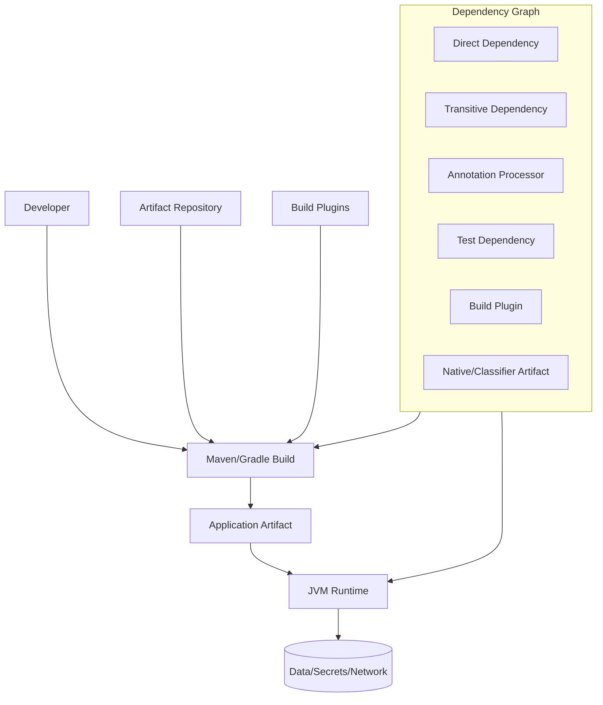
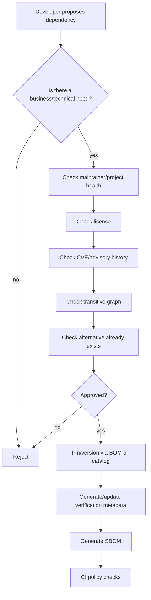
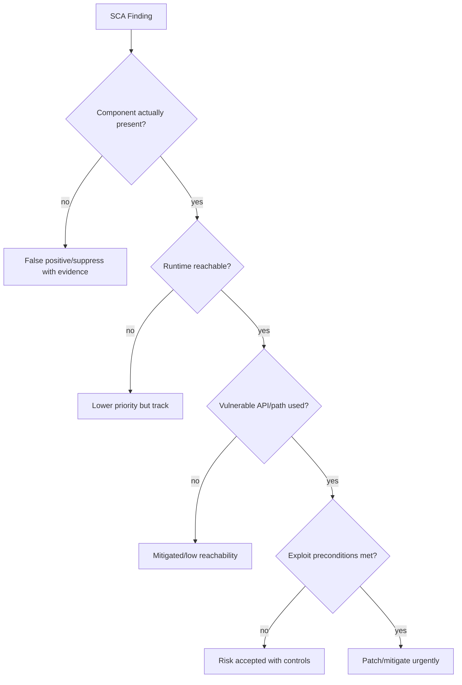
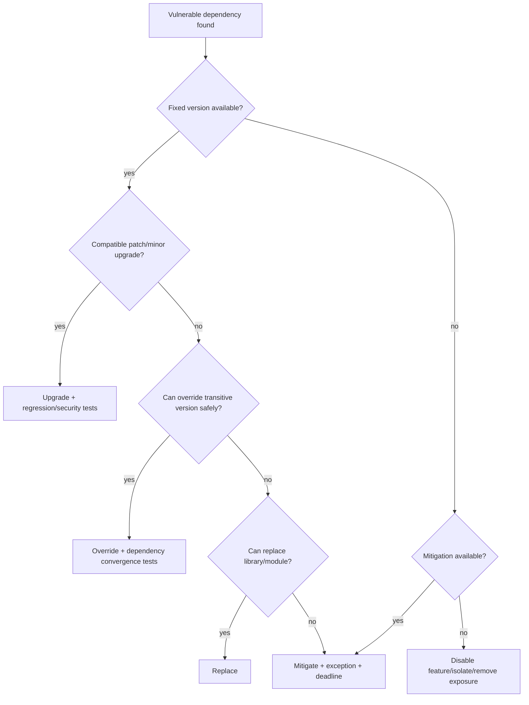
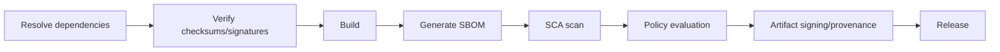

------
title: Learn Java Security, Cryptography and Integrity - Part 026
description: Dependency security for Java systems using Maven, Gradle, SBOM, SCA, dependency verification, transitive-risk modeling, CVE triage, and governance workflows.
series: learn-java-security-cryptography-integrity
seriesTitle: Learn Java Security, Cryptography and Integrity
order: 26
partTitle: Dependency Security: Maven, Gradle, SBOM & SCA
tags:
  - java
  - security
  - maven
  - gradle
  - sbom
  - sca
  - supply-chain-security
  - dependency-management
  - secure-engineering
date: 2026-06-30
---

# Part 026 — Dependency Security: Maven, Gradle, SBOM & SCA

Modern Java systems adalah kumpulan dependency graph yang sangat besar. Sebuah service enterprise mungkin hanya punya 40 direct dependencies, tetapi ratusan transitive dependencies, annotation processors, build plugins, test fixtures, container base images, native libraries, dan generated artifacts. Dependency security bukan sekadar “jalankan CVE scanner”. Ia adalah proses menjaga **integrity, provenance, reachability, updateability, and runtime blast radius** dari semua code yang masuk ke sistem.

Target part ini: kamu mampu mendesain governance dependency Java yang efektif, tidak noise-driven, dan bisa dipakai untuk produksi. Kita tidak mengulang Maven/Gradle basic. Kita fokus ke security semantics: apa yang dipercaya, kapan dependency boleh masuk, bagaimana memverifikasi artifact, bagaimana triage vulnerability, dan bagaimana SBOM/SCA menjadi input decision, bukan sekadar compliance output.

Referensi baseline:

- NIST SP 800-218 Secure Software Development Framework: <https://csrc.nist.gov/pubs/sp/800/218/final>
- OWASP Dependency-Check: <https://owasp.org/www-project-dependency-check/>
- OWASP Dependency-Track: <https://owasp.org/www-project-dependency-track/>
- OWASP CycloneDX: <https://cyclonedx.org/>
- SPDX: <https://spdx.dev/>
- Gradle Dependency Verification: <https://docs.gradle.org/current/userguide/dependency_verification.html>
- Apache Maven: <https://maven.apache.org/>
- Sonatype Central Repository Requirements: <https://central.sonatype.org/publish/requirements/>
- SLSA: <https://slsa.dev/>
- OSV: <https://osv.dev/>

---

## 1. Kaufman Deconstruction: Skill yang Harus Dikuasai

Dependency security bisa dipecah menjadi sub-skill:

1. **Graph literacy** — membaca direct/transitive dependency, scopes, variants, classifiers, BOM, plugin graph.
2. **Trust modeling** — memahami siapa publisher, repository, plugin, CI, dan artifact source.
3. **Integrity verification** — checksum/signature/lock metadata, dependency verification, artifact immutability.
4. **SBOM production** — menghasilkan inventory yang benar dan repeatable.
5. **SCA interpretation** — membedakan CVE match, exploitability, reachability, environment, dan severity bisnis.
6. **Upgrade strategy** — patch, minor, major, replacement, shading removal, exclusion, fork, vendor advisory.
7. **Policy as code** — aturan dependency masuk/keluar yang bisa diaudit.
8. **Runtime least privilege** — mengurangi blast radius dependency vulnerable.
9. **Incident response** — ketika dependency seperti logging/parser/framework memiliki 0-day.
10. **Governance** — exception, risk acceptance, SLA, evidence, dan ownership.

Minimal effective practice: pilih satu Java service, generate dependency tree + SBOM, aktifkan dependency verification, lakukan triage 5 finding, dan buat satu ADR dependency policy.

---

## 2. Mental Model: Dependency Sebagai Code yang Kamu Eksekusi

Dependency bukan “library”. Dependency adalah code dari pihak lain yang ikut berjalan dengan privilege aplikasi kamu.



Security invariant:

> **Any dependency that can execute during build or runtime must be treated as a trusted-code decision.**

Konsekuensi:

- Build plugin lebih berbahaya dari dependency runtime biasa karena berjalan di CI dengan credential build.
- Annotation processor berjalan saat compile dan bisa membaca source/build environment.
- Test dependency mungkin tidak masuk runtime, tapi bisa berjalan di CI.
- Transitive dependency bisa introduce parser/crypto/logging code yang tidak pernah kamu review langsung.
- Dependency yang “hanya untuk dev” tetap bisa mencuri secrets bila berjalan di developer machine atau CI.

---

## 3. Threat Model Dependency Java

| Threat | Example | Impact |
|---|---|---|
| Known vulnerable component | Old Log4j/Jackson/Spring library | RCE/data leak/DoS |
| Dependency confusion | Internal artifact name resolved from public repo | Malicious code execution |
| Typosquatting | Similar group/artifact name | Malicious dependency |
| Compromised maintainer/release | Legit project publishes malicious version | Supply-chain compromise |
| Transitive vulnerable dependency | Direct dependency pulls vulnerable nested library | Hidden risk |
| Build plugin compromise | Maven/Gradle plugin exfiltrates secrets | CI compromise |
| Repository/MITM tampering | Artifact changed in transit/repo | Malicious code |
| Stale pinned dependency | Old safe-looking version misses patches | Accumulated vulnerabilities |
| Shaded vulnerable code | Vulnerable classes relocated into fat jar | Scanner blind spot |
| Classpath shadowing | Different version wins at runtime | Unexpected vulnerable behavior |
| License/compliance issue | Copyleft/prohibited license | Legal/regulatory risk |
| SBOM mismatch | Generated SBOM misses runtime components | False assurance |

---

## 4. Dependency Graph Literacy

### 4.1 Direct vs Transitive

A typical Maven dependency:

```xml
<dependency>
  <groupId>org.springframework.boot</groupId>
  <artifactId>spring-boot-starter-web</artifactId>
  <version>3.5.0</version>
</dependency>
```

This direct dependency pulls a graph: Spring MVC, embedded server, JSON mapper, logging, validation, etc. Security review must inspect the graph, not just direct declarations.

Maven:

```bash
mvn dependency:tree -Dverbose
```

Gradle:

```bash
./gradlew dependencies
./gradlew dependencyInsight --dependency jackson-databind
```

Review questions:

- Why is this dependency present?
- Is it direct or transitive?
- Which scope/configuration uses it?
- Is it on runtime classpath?
- Is it used by build/compile/test only?
- Is the version controlled by a BOM/platform?
- Is there a duplicate version conflict?
- Does it bring native code/classifier artifacts?

### 4.2 Scope/Configuration Matters

| Maven Scope | Security Meaning |
|---|---|
| `compile` | Usually runtime reachable |
| `runtime` | Runtime reachable but not compile API |
| `provided` | Supplied by container/platform; version drift risk |
| `test` | CI/developer execution risk |
| `system` | Avoid; local path trust problem |
| `import` | BOM/platform version governance |

Gradle configurations depend on Java plugin and plugins used, but key distinction remains:

- `implementation`: runtime packaged/used.
- `api`: leaks to consumers.
- `compileOnly`: compile boundary, may be provided elsewhere.
- `runtimeOnly`: runtime-only behavior.
- `testImplementation`: CI/test execution.
- buildscript/plugins: build-time execution, high trust.

---

## 5. Policy: Dependency Intake Gate

A dependency should not enter the graph merely because a developer copied a snippet.



Minimum intake criteria:

- Clear owner/team.
- Use case documented.
- Version pinned/governed.
- License acceptable.
- No known critical/high exploitable vulnerabilities without risk acceptance.
- Maintainer/project health acceptable.
- No duplicate function already available.
- Transitive graph understood.
- Build/runtime scope correct.

---

## 6. Maven Security Governance

### 6.1 Use BOMs Intentionally

BOMs reduce version drift but can also hide risk if teams never inspect what they import.

```xml
<dependencyManagement>
  <dependencies>
    <dependency>
      <groupId>org.springframework.boot</groupId>
      <artifactId>spring-boot-dependencies</artifactId>
      <version>${spring.boot.version}</version>
      <type>pom</type>
      <scope>import</scope>
    </dependency>
  </dependencies>
</dependencyManagement>
```

Invariant:

> **A BOM is a version policy. Treat BOM upgrades as security-relevant release events.**

Checklist:

- BOM version is centrally controlled.
- Overrides are rare and documented.
- Version conflicts are visible in CI.
- Dependency tree diff is reviewed during BOM upgrade.

### 6.2 Maven Enforcer

Useful rules:

- ban duplicate classes.
- require upper bound dependencies.
- ban snapshots in release.
- require Maven/Java version.
- ban certain dependencies.
- enforce dependency convergence.

Example:

```xml
<plugin>
  <groupId>org.apache.maven.plugins</groupId>
  <artifactId>maven-enforcer-plugin</artifactId>
  <version>3.5.0</version>
  <executions>
    <execution>
      <id>enforce-dependency-policy</id>
      <goals><goal>enforce</goal></goals>
      <configuration>
        <rules>
          <dependencyConvergence />
          <requireReleaseDeps>
            <message>No SNAPSHOT dependencies in release builds.</message>
          </requireReleaseDeps>
          <bannedDependencies>
            <excludes>
              <exclude>commons-collections:commons-collections:[,3.2.2)</exclude>
            </excludes>
          </bannedDependencies>
        </rules>
      </configuration>
    </execution>
  </executions>
</plugin>
```

### 6.3 Maven Repository Controls

Enterprise pattern:

- Developers/builds resolve from internal repository manager, not arbitrary internet.
- Allowlist upstream repositories.
- Block dynamic/unapproved repositories in POM.
- Cache artifacts immutably.
- Separate release/snapshot repositories.
- Monitor repository for new vulnerable components.
- Mirror internal group IDs to prevent dependency confusion.

Maven settings example:

```xml
<mirrors>
  <mirror>
    <id>internal-repository</id>
    <mirrorOf>*</mirrorOf>
    <url>https://repo.example.internal/maven-public</url>
  </mirror>
</mirrors>
```

---

## 7. Gradle Security Governance

### 7.1 Version Catalog

Use `libs.versions.toml` to centralize dependency versions.

```toml
[versions]
springBoot = "3.5.0"
jackson = "2.18.4"

[libraries]
jackson-databind = { module = "com.fasterxml.jackson.core:jackson-databind", version.ref = "jackson" }

[plugins]
spring-boot = { id = "org.springframework.boot", version.ref = "springBoot" }
```

Invariant:

> **Dependency declarations should be boring, centralized, reviewable, and diffable.**

### 7.2 Dependency Verification

Gradle dependency verification allows builds to verify checksums and signatures of dependencies using `gradle/verification-metadata.xml`.

Enable/generate:

```bash
./gradlew --write-verification-metadata sha256 help
```

Then commit:

```text
gradle/verification-metadata.xml
gradle/verification-keyring.keys  # if using signature verification
```

Benefits:

- Detect artifact tampering.
- Make supply-chain changes visible in PRs.
- Reduce silent dependency drift.

Limitations:

- Checksum verifies exact artifact, not maintainer trust.
- If malicious artifact was pinned, checksum preserves malicious artifact.
- Metadata must be reviewed when updated.
- Build plugins also need coverage.

### 7.3 Locking

Dependency locking helps reproducibility.

```bash
./gradlew dependencies --write-locks
```

Use with care:

- Locking reduces unexpected drift.
- Locking can also freeze vulnerable versions.
- Pair locks with automated update PRs and SCA.

---

## 8. Checksums, Signatures, Provenance

### 8.1 What Each Control Means

| Control | Detects | Does Not Detect |
|---|---|---|
| HTTPS repository | network MITM | malicious upstream artifact |
| Checksum verification | artifact bytes changed from expected | expected bytes are malicious |
| PGP/signature | artifact signed by key | key compromise, bad maintainer decision |
| Lockfile | dependency drift | vulnerable pinned dependency |
| SBOM | inventory visibility | exploitability by itself |
| SCA | known vulnerability match | unknown 0-day, reachability certainty |
| Provenance | where/how artifact was built | all source-level malicious behavior |

Security invariant:

> **Integrity controls prove “same artifact as expected”; they do not prove “safe artifact”.**

### 8.2 Artifact Identity

For Java libraries, artifact identity typically includes:

- groupId
- artifactId
- version
- classifier
- extension/type
- repository source
- checksum
- signature/key identity if available
- dependency path
- scope/configuration

SBOM should represent enough identity to map vulnerability and audit decisions.

---

## 9. SBOM: Inventory, Not Magic

Software Bill of Materials answers: “What components are in this software?”

Common formats:

- CycloneDX: security-oriented BOM standard under OWASP/Ecma.
- SPDX: Linux Foundation/ISO standard for SBOM and license/provenance/security metadata.

SBOM useful for:

- vulnerability management.
- incident response.
- procurement/regulatory evidence.
- license compliance.
- dependency transparency.
- release inventory.

SBOM limitations:

- May miss shaded/embedded/generated/native components.
- May differ between source/build/runtime/container image.
- May not prove reachability.
- May not include build plugins unless configured.
- May not capture dynamically loaded plugins.
- May contain inaccurate package URLs or component names.

Invariant:

> **Generate SBOM from the build artifact or resolved graph, not from human-maintained spreadsheets.**

### 9.1 Maven CycloneDX Example

```xml
<plugin>
  <groupId>org.cyclonedx</groupId>
  <artifactId>cyclonedx-maven-plugin</artifactId>
  <version>2.9.1</version>
  <executions>
    <execution>
      <phase>package</phase>
      <goals>
        <goal>makeAggregateBom</goal>
      </goals>
    </execution>
  </executions>
</plugin>
```

### 9.2 Gradle CycloneDX Example

```kotlin
plugins {
    id("org.cyclonedx.bom") version "1.10.0"
}

cyclonedxBom {
    includeConfigs.set(listOf("runtimeClasspath"))
    projectType.set("application")
    outputFormat.set("json")
}
```

Version examples are illustrative; pin according to your platform policy.

### 9.3 SBOM Per Release

Store SBOM as release artifact:

```text
release/
  app.jar
  app.jar.sha256
  app.jar.sig
  sbom.cdx.json
  provenance.intoto.jsonl
  vulnerability-report.json
```

Do not generate SBOM once per quarter. Generate per build/release.

---

## 10. SCA: Software Composition Analysis

SCA maps dependency inventory to known vulnerability data.

Tools/sources can include:

- OWASP Dependency-Check.
- OWASP Dependency-Track.
- OSV Scanner.
- GitHub Dependabot alerts.
- commercial SCA platforms.
- vendor advisories.
- framework advisories.

Important: SCA result is not the final decision. It is evidence.

### 10.1 Triage Model



Triage fields:

- component coordinates.
- affected version range.
- fixed version.
- dependency path.
- scope/configuration.
- runtime packaging status.
- vulnerable API usage.
- exploit preconditions.
- exposed attack surface.
- compensating controls.
- owner.
- due date/SLA.
- decision evidence.

### 10.2 Severity Is Not Priority

Priority is a function of:

```text
priority = severity × exploitability × exposure × reachability × business impact × asset criticality ÷ mitigation strength
```

Example:

- Critical CVE in test-only dependency: may be lower production urgency but still CI risk.
- Medium CVE in request parser exposed to internet: may be higher urgency.
- High CVE in library unused at runtime but present in fat jar: review classpath/reachability.

---

## 11. Reachability Analysis

Reachability asks: can vulnerable code be invoked in this application context?

Levels:

| Level | Meaning |
|---|---|
| Present | vulnerable component exists somewhere |
| Loaded | class can be loaded at runtime |
| Referenced | application references vulnerable class/method |
| Invocable | call path can reach vulnerable method |
| Attacker-controllable | attacker can influence inputs to vulnerable path |
| Exploitable | preconditions and environment allow exploit |

Do not abuse reachability as excuse to ignore vulnerabilities. Use it to prioritize and document risk.

Java-specific complications:

- Reflection.
- ServiceLoader.
- frameworks auto-configuring classes.
- annotation scanning.
- deserialization/gadget chains.
- expression languages.
- native image build-time initialization.
- shaded classes.

---

## 12. Shading, Fat JAR, and Hidden Code

Shading relocates classes into another namespace. It can hide vulnerable code from naive scanners.

Risks:

- Vulnerable code embedded under renamed package.
- Duplicate classes cause unexpected runtime behavior.
- License metadata lost.
- SBOM misses embedded dependency.
- Patch cannot be applied by normal dependency upgrade.

Policy:

- Avoid shading except for clearly justified cases.
- Generate SBOM that captures shaded components if possible.
- Record relocation metadata.
- Prefer dependency convergence over shading.
- If using fat JAR, scan final artifact too.

---

## 13. Dependency Confusion Defense

Dependency confusion occurs when internal artifact coordinates can resolve from public repositories.

Controls:

- Use internal repository mirror for all resolution.
- Reserve internal group IDs.
- Block public resolution of internal namespaces.
- Enforce repository declarations centrally.
- Do not let project POM/build files add arbitrary repositories.
- Use repository manager routing rules.
- Monitor attempted public fetches for internal coordinates.

Maven/Gradle policy invariant:

> **The build should fail if it attempts to resolve internal coordinates from an external repository.**

---

## 14. Build Plugins and Annotation Processors

Build-time dependencies are high risk because CI often has:

- repository credentials.
- signing keys.
- deployment tokens.
- cloud credentials.
- source code.
- release metadata.

Controls:

- Pin plugin versions.
- Verify plugin artifacts.
- Restrict plugin repositories.
- Review plugin upgrades like production code.
- Disable arbitrary plugin portals if not governed.
- Separate build credentials by job.
- Avoid running untrusted code generation plugins.
- Treat annotation processors as executable code.

Gradle plugin example:

```kotlin
pluginManagement {
    repositories {
        maven("https://repo.example.internal/gradle-plugins")
    }
}
```

Maven plugin versions must be explicit:

```xml
<pluginManagement>
  <plugins>
    <plugin>
      <groupId>org.apache.maven.plugins</groupId>
      <artifactId>maven-compiler-plugin</artifactId>
      <version>3.14.0</version>
    </plugin>
  </plugins>
</pluginManagement>
```

---

## 15. Vulnerability SLA

Example SLA:

| Risk | Condition | SLA |
|---|---|---|
| Emergency | exploited in wild + internet-exposed reachable path | 24-48 hours |
| Critical | CVSS critical + reachable + no strong mitigation | 7 days |
| High | reachable or plausible preconditions | 14-30 days |
| Medium | present but limited exposure | 60-90 days |
| Low | low impact/not reachable | normal maintenance |

SLA must allow exception process:

- owner.
- reason.
- compensating controls.
- expiry date.
- re-review condition.
- approver.

No permanent exception without expiry.

---

## 16. Suppression Without Lying

Suppressions are sometimes necessary but dangerous.

Good suppression:

```xml
<suppress>
  <notes><![CDATA[
    CVE applies to vulnerable API FooParser#parseRemoteTemplate.
    Component is present only in test scope and not packaged in runtime artifact.
    Verified by: mvn dependency:tree and artifact inspection on 2026-06-30.
    Owner: platform-security.
    Expires: 2026-09-30.
  ]]></notes>
  <cve>CVE-20XX-12345</cve>
  <gav regex="true">^com.example:test-helper:.*$</gav>
</suppress>
```

Bad suppression:

```text
False positive.
```

Suppression invariant:

> **A suppression is a signed risk explanation with expiry, not a way to make dashboards green.**

---

## 17. Upgrade Strategy

Patch decision tree:



Upgrade hygiene:

- Prefer patch/minor within supported line.
- Read release notes for breaking/security changes.
- Run contract/regression tests.
- Run dependency tree diff.
- Re-generate SBOM.
- Re-generate verification metadata.
- Capture risk decision.

---

## 18. Runtime Blast Radius Reduction

Dependency security is not only build-time.

If a dependency becomes vulnerable, runtime controls can reduce blast radius:

- Run service with least privilege.
- Egress allowlist.
- No broad filesystem write.
- No access to unnecessary secrets.
- Container read-only filesystem.
- JVM process isolation by workload.
- Network segmentation.
- Disable dangerous features by configuration.
- Do not expose parser endpoints unnecessarily.

Example: a vulnerable PDF parser is less catastrophic if preview worker has no network egress, no secrets, restricted filesystem, and strict resource limits.

---

## 19. CI/CD Policy Gates

Recommended pipeline stages:



Policy gate examples:

- Fail on unpinned plugin versions.
- Fail on SNAPSHOT in release.
- Fail on dependencies from unapproved repository.
- Fail on missing SBOM.
- Fail on critical reachable vulnerability unless exception exists.
- Warn on high vulnerability with SLA.
- Fail on checksum verification mismatch.
- Fail on banned licenses.
- Fail on dependency confusion namespace violation.

---

## 20. Example Dependency Risk Record

```json
{
  "component": "com.fasterxml.jackson.core:jackson-databind:2.x.y",
  "finding": "CVE-20XX-0000",
  "dependencyPath": [
    "com.example:case-api",
    "org.example:starter-json",
    "com.fasterxml.jackson.core:jackson-databind"
  ],
  "scope": "runtimeClasspath",
  "presentInArtifact": true,
  "reachable": "unknown",
  "exposure": "internet-facing API request body parsing",
  "fixedVersion": "2.x.z",
  "decision": "upgrade",
  "owner": "case-platform-team",
  "dueDate": "2026-07-07",
  "evidence": [
    "dependency-tree.txt",
    "sbom.cdx.json",
    "integration-test-report.html"
  ]
}
```

---

## 21. Dependency Security for Internal Libraries

Internal dependency is not automatically safe.

Controls:

- Internal libraries publish SBOM.
- Internal libraries are versioned semantically.
- Internal release artifacts are signed or provenance-bound.
- Internal dependencies go through same SCA process.
- Ownership metadata is clear.
- Deprecation/security notices are distributed.
- Internal artifacts cannot be shadowed by public artifacts.

Internal libraries often become invisible risk because teams assume “we own it”. Treat internal shared libraries as product dependencies.

---

## 22. Transitive Dependency Ownership

Every transitive dependency needs an owner indirectly.

Pattern:

- Direct dependency owner owns its transitive risk.
- Platform team owns BOM/platform versions.
- Service team owns runtime exposure and upgrade testing.
- Security team owns policy, exception governance, and advisory interpretation.

Avoid “nobody owns transitive dependencies”.

---

## 23. Data Model for Dependency Governance

Useful fields:

```sql
CREATE TABLE dependency_component (
  component_id      VARCHAR(256) PRIMARY KEY,
  ecosystem         VARCHAR(64) NOT NULL,
  group_id          VARCHAR(256),
  artifact_id       VARCHAR(256),
  version           VARCHAR(128),
  purl              VARCHAR(512),
  license_expression VARCHAR(512),
  supplier          VARCHAR(256)
);

CREATE TABLE release_component (
  release_id        VARCHAR(128) NOT NULL,
  component_id      VARCHAR(256) NOT NULL,
  scope             VARCHAR(64) NOT NULL,
  dependency_path   TEXT,
  checksum_sha256   CHAR(64),
  PRIMARY KEY (release_id, component_id, scope)
);

CREATE TABLE vulnerability_decision (
  decision_id       VARCHAR(128) PRIMARY KEY,
  release_id        VARCHAR(128) NOT NULL,
  component_id      VARCHAR(256) NOT NULL,
  vulnerability_id  VARCHAR(128) NOT NULL,
  decision          VARCHAR(64) NOT NULL,
  owner             VARCHAR(128) NOT NULL,
  expires_at        TIMESTAMP,
  evidence_uri      VARCHAR(512)
);
```

This mirrors the mental model: components exist in releases; vulnerabilities lead to decisions; decisions require evidence.

---

## 24. Dependency Review Checklist

### New Dependency

- [ ] Is there a documented need?
- [ ] Is there an existing approved alternative?
- [ ] Is the project maintained?
- [ ] Is license acceptable?
- [ ] Is the dependency direct/transitive graph understood?
- [ ] Is scope minimal?
- [ ] Is version pinned/governed?
- [ ] Is repository source approved?
- [ ] Are build plugins/annotation processors reviewed separately?
- [ ] Is SBOM updated?
- [ ] Is verification metadata updated?

### Vulnerability Finding

- [ ] Is the component actually present?
- [ ] Is it in runtime artifact?
- [ ] Which dependency path introduced it?
- [ ] Is vulnerable code reachable?
- [ ] Is attacker-controlled input involved?
- [ ] Is fixed version available?
- [ ] Is upgrade safe?
- [ ] Is mitigation possible?
- [ ] Is exception time-bound and approved?
- [ ] Is release evidence updated?

### Build Integrity

- [ ] Are repositories centrally controlled?
- [ ] Are dynamic versions banned?
- [ ] Are SNAPSHOTs banned in release?
- [ ] Are plugin versions explicit?
- [ ] Is dependency verification enabled?
- [ ] Are SBOMs generated per release?
- [ ] Is final artifact scanned, not only source graph?
- [ ] Are provenance/signing controls present?

---

## 25. Common Anti-Patterns

| Anti-Pattern | Why It Fails | Better Approach |
|---|---|---|
| “Scanner is green, so safe” | misses unknown/reachability/context | combine SCA with threat and exposure |
| Ignore transitive dependencies | hidden vulnerable code | inspect dependency paths |
| Dynamic versions | non-reproducible builds | pin/lock versions |
| Arbitrary repositories | dependency confusion/tampering | internal mirror/repo policy |
| No plugin version pinning | build compromise risk | plugin management/catalog |
| Permanent suppressions | risk invisibility | expiry + evidence + approval |
| SBOM from manual inventory | inaccurate | generate from build/resolved graph |
| Upgrade everything blindly | break production | test + staged rollout |
| Never upgrade | accumulated risk | scheduled dependency maintenance |
| Trust internal libraries blindly | hidden vulnerabilities | same governance for internal artifacts |
| Shade without metadata | scanner blind spots | avoid or document/scan final artifact |

---

## 26. Deliberate Practice Lab

### Lab A — Dependency Graph Diff

1. Pick one Java service.
2. Generate dependency tree.
3. Add one dependency.
4. Generate dependency tree again.
5. Write diff:
   - direct dependency added.
   - transitive dependencies added.
   - version conflicts introduced.
   - runtime vs test scope.

### Lab B — SBOM Per Build

1. Generate CycloneDX SBOM.
2. Store it as build artifact.
3. Compare SBOM before/after dependency update.
4. Identify components added/removed/upgraded.
5. Link diff to PR review.

### Lab C — Vulnerability Triage

Pick 3 SCA findings:

- one runtime reachable.
- one test-only.
- one false positive or non-reachable.

For each, write:

- affected component.
- dependency path.
- fixed version.
- exposure.
- decision.
- evidence.
- owner and deadline.

### Lab D — Dependency Verification

For Gradle:

1. Generate verification metadata.
2. Commit it.
3. Modify checksum manually.
4. Confirm build fails.
5. Add a new dependency and observe metadata diff.

For Maven, use repository manager checks, Enforcer, checksums/signature policy, and optionally external lock/verification tooling depending on platform constraints.

---

## 27. Security Metrics

Track:

- dependency count by service.
- direct vs transitive dependency count.
- number of build plugins.
- number of vulnerable components by severity/reachability.
- mean time to remediate by severity.
- stale dependencies.
- dependencies without owner.
- suppressions expiring soon.
- releases with SBOM.
- builds failing verification.
- components from unapproved repositories.
- dependency update PR success rate.

Bad metric:

```text
Total number of vulnerabilities.
```

Better metric:

```text
Reachable high/critical vulnerabilities in internet-exposed services outside SLA.
```

---

## 28. ADR Template

```mdx
# ADR: Java Dependency Security Policy

## Context
The platform uses Maven/Gradle services with hundreds of transitive dependencies. Supply-chain compromise and known vulnerable dependencies are material risks.

## Decision
All services must resolve dependencies through the internal repository manager, pin plugin versions, generate SBOMs per release, run SCA in CI, and document exceptions with expiry.

## Invariants
- No release uses dynamic dependency versions.
- No release resolves dependencies from arbitrary external repositories.
- Build plugins are treated as high-trust executable code.
- SBOM is generated for every release artifact.
- Critical reachable vulnerabilities require patch, mitigation, or approved time-bound exception.

## Consequences
Builds may fail more often during dependency changes. Teams need ownership and upgrade discipline.

## Open Risks
SCA cannot detect all 0-days or prove reachability perfectly. Runtime isolation remains necessary.
```

---

## 29. Summary

Dependency security is a continuous engineering discipline, not a scanner checkbox. Java systems need graph visibility, artifact integrity, repository governance, SBOM, SCA triage, upgrade strategy, and runtime containment.

Key takeaways:

- Treat dependencies, plugins, and annotation processors as executable trust decisions.
- Inspect the full graph, not only direct dependencies.
- Use BOM/version catalogs intentionally.
- Resolve through governed repositories.
- Verify artifacts where possible.
- Generate SBOM per release.
- Triage SCA findings by presence, reachability, exposure, and business impact.
- Avoid permanent suppressions.
- Combine build-time controls with runtime least privilege.

Part berikutnya membahas build/release signing, provenance, reproducible builds, and SLSA-level integrity controls.
